# 一周爆卖2100单!小红书虚拟垂直小店复盘:揭秘我选品、测品及运营放大的关键动作

## 251124   副业 SC 精华

公众号懒人搜索，懒人专属群独享
懒人微信:lazyhelper

## 为什么要做小红书虚拟垂直小店

大家好，我是苏晗，之前创业5年开过15家实体店，24年进入生财后，才发现互联网相比于实体，真的是天高任鸟飞，海阔任鱼跃，只要你去找总会有很多非常好的机会，先后尝试了多多淘宝虚拟，跨境电商，都拿到一些结果。

在9月份，决定躬身入局自己并不太熟悉的内容电商平台，小红书。因为我之前拿到结果的项目都是虚拟产品相关的，并且选品和跑MVP是我比较擅长的事情，小红书也在红利期。

虚拟产品对于我们普通人来说，0库存，0成本，没有售后，纯利润，自动化发货，稳定后可以做到睡后收入，是值得深入研究的一个好赛道。

还有一个原因就是我亲眼看着两个朋友从6月份和8月份开始做小红书虚拟，都拿到了很不错的结果。

我采用的打法是单品打爆和垂直小店的运营思路，做细分人群的生意，就是用1个主店铺+3个关联账号的方式，4个账号只发1个产品的笔记，一天发布笔记30-50篇，从而迅速占据产品在平台的生态位。

交付的产品是安装包，交付形式用的网盘链接，客单经过设计在8.8-29.8之间。

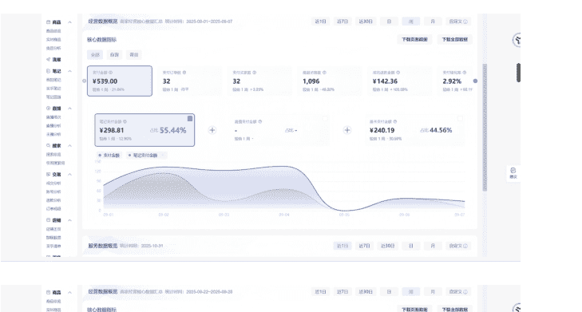

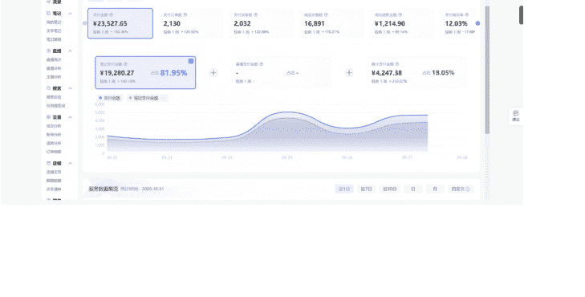

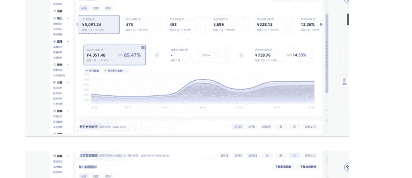

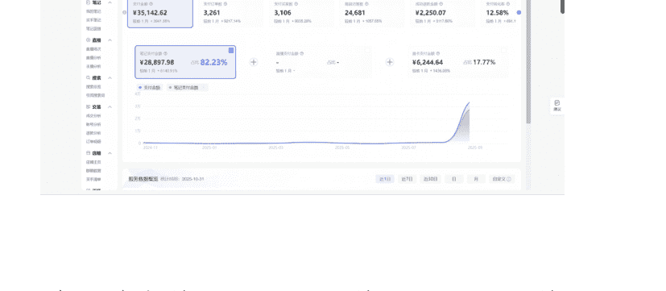

单人单店第1周539，第2周514，第3周9300，第4周23000，销量3200，单日最高5K，月销售额3W+

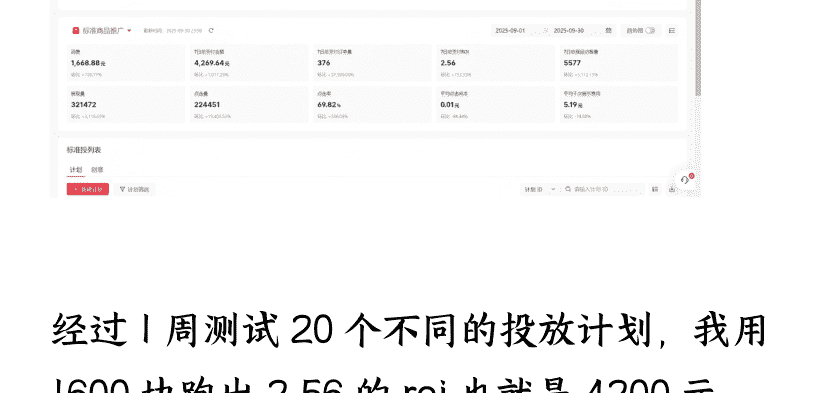

经过1周测试20个不同的投放计划，我用1600块跑出2.56的roi，也就是4200元，千次展现控制在5元左右。

为了打好这一仗，我暂时离开氛围很好的联合办公空间，在家里进行了为期一个月的闭关。

公众号懒人搜索，懒人专属群分享

这也是我第一次尝试用内容电商的模式去卖非服务类的虚拟产品，所以我也是抱着边做边学的心态开始的。

小红书平台对于虚拟产品的扶持力度还是很大的，很多政策都是利好于虚拟产品。

在写这篇复盘的时候，无意中发现踩中了亦仁老大11号发的超级标，小红书垂直小店。

那刚好借着这个机会，和大家分享一下我是如何做好小红书垂直小店的4个关键动作:选品、测品以及运营放大，我会用最简单和最详细的方式分享给大家，让大家看了之后就能直接上手实操。

1. AI，这个不用讲，AI 视频、AI 产品、AI 编程、AI 工作流、AI 自媒体等，过去好多条超级标都和 AI 相关，星球里面也有非常多的航海和内容:

## 一、怎么选品

选品是一个老生常谈的问题，但是在任何平台，底层逻辑都是一样的，选品就是找用户需求，再用最低的成本去验证用户需求，跑通MVP。

我们选品的最终目标，就是用一个自己熟悉的品来触达和验证一部分人群，然后围绕着这个人群不断的做衍生品，从而做成小红书垂直小店。

### 选品原则 1：

#### 找到已经被验证过的用户需求的产品

选品包括：调研数据+验证假设

首先我们要有一个共识，就是别人在爆的品，我们发不一定能爆，所以我要先假设爆品，那么只需要通过数据反馈来得知。

我的做法会测试1周，但是我的笔记强度高，每天会发30-40篇笔记，如果一周后并没有好的数据反馈，就说明可以放弃这个品，当然前提是我们已经测试过了所有的爆款模板了。

其实选品的本质，就是找到已经被验证过的用户需求点，并且用户愿意为之付费的，我们才可以叫做有效选品。

对于跟品，我们要看 4 个数据：
- 1. 是对标账号的粉丝量
- 2. 是这个品做的时间
- 3. 是竞争对手的数量
- 4. 是对手发布笔记的频率

这里为了方便大家理解，以 星露谷 来举例，其他产品的底层逻辑都是一样的。

怎么判断一个品能不能跟，首先要看这个品在当下是不是爆款，可以通过产品页的 24 小时加购来判断，比如这个星露谷的 24 小时加购是 800，

¥5.9  到手价 ¥4.9       已售7.1万+
商家券 满2减1  商家券 新客满6减1

#### 星露谷物语1.6.15新版 支持联机 中文苹果IOS/安卓平板华为ios

退货包运费  2000+人好评  24小时内800+人加购  3个
平均2小时发货  承诺24小时内发货，晚发必赔  重庆 包邮

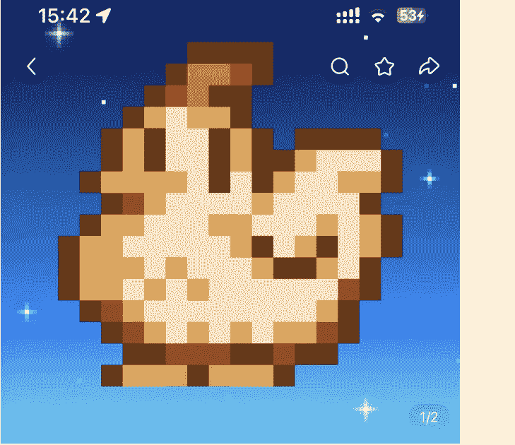

那么我们可以知道，这个就是一个爆品。那么下一步，我们看下同行有没有在爆，通过搜索可以看到，这个同行的24小时加购是100，

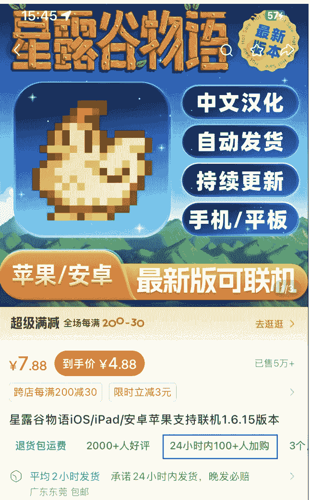

到这里，我们就可以判断这个品是当下爆款，下一步我们就要验证这个产品的话题热度，

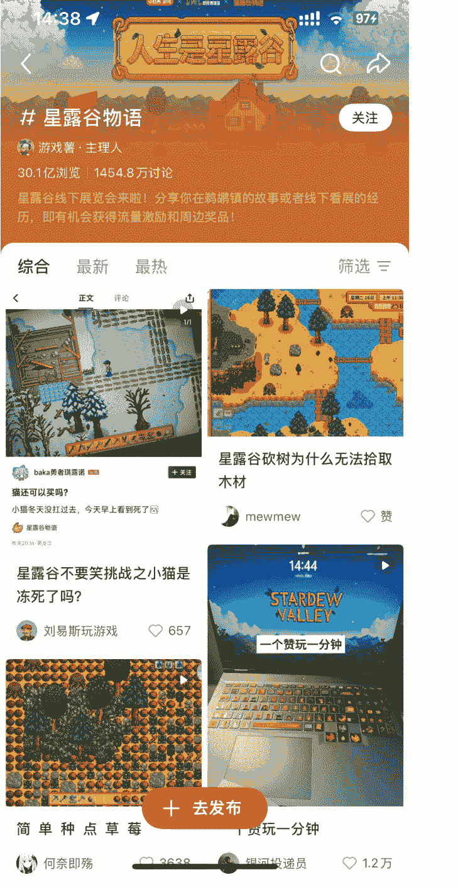

首先，我们需要先看这个品的话题热度，以星露谷举例，我们通过搜索关键词，点击话题，可以看到浏览数量为 30 亿，这种热度就是现象级的品，是可以长期售卖的，因为除了品存在的时间久之外，更多的是发烧友玩家会自发的发贴，带动这个游戏的宣传，这样就会吸引源源不断的新人进场。

然后我们需要看这个关键词在平台的搜索量，这个方法很关键，可以进一步的确认这个品是否有市场需求。

我们来到千帆推广的后台，新建一个计划，再点击搜索推广，然后添加关键词，在关键词内输入星露谷，就可以看到用户最常搜索的关键词是什么

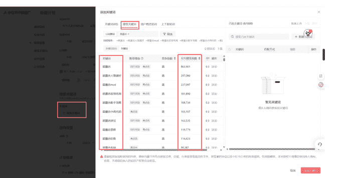

通过月搜索量，我们可以看出，这个产品的热度非常高，并且需求也一直很强烈。

好，到这里，我们确定了产品侧是没有问题的，那么下一步，我们要看 4 个指标来判断能不能打得过了：
- 1. 是对标账号的粉丝量
- 2. 是这个品做的时间
- 3. 是竞争对手的数量

#### 4. 每天发布数量

- 对标 1：1.7W 粉丝
- 对标 1：1 年前
- 对手超过 20 个
- 一天 6-13 条
- 对标 2：2700 粉丝
- 对标 2：1 年前

这么分析下来，这个品是非常红海的，但是需求是非常明确的，所以进场可能可以喝汤，但是想要分到蛋糕，就要有新的爆款内容，但这对于我们前期做来说，是不现实的，所以直接放弃。

### 判断是否打得过的 4 个标准

我就是用这 4 点找到了自己的第一个爆品并判断打得过：
- 1、对标粉丝量越低越好，说明是低粉爆款，可能最大排除粉丝基数带来的销量
- 2、品是在 1 个月内起销量的，是比较好的入场时机
- 3、竞争对手小于 5 个最好，并且要看到第 1 第 2 在笔记水平相当的情况下销量差距不大，则说明这个品为爆品，你上你也行
- 4、对手每天的笔记发布数量少，这个时候就是很好的机会，他发 10 条，我们发 40 条，用量变引起质变，大力出奇迹

### 选品原则 2：

#### 选的品是自己有感觉/感兴趣/受众

这个地方我是踩着坑过来的，第一个选的品，是雅思作文资料，但是因为我没有考过，对英语也不感兴趣，所以我在做笔记的时候，就只是单纯的模仿，能出一些小单，但是做起来很痛苦，也没有持续发笔记的动力。

这个就是错误的选品，虽然产品是被市场强烈需要的，但是你自己不懂也不感兴趣，更不是用户群体，这样一来，我们在制作笔记的时候，其实根本不了解用户的下单心理，也就是爆款点（痛点）。

换个角度思考，我们愿意下单买某一个产品的时候，一定是因为这个产品的内容里有某一个点打动了我们，要么通过种草刺激了我们冲动消费，要么就是我们本身就需要。

所以最好的选品方式是我们本身就是这个产品的消费者。

我在按照上方的流程选到这个爆品后，就是没有着急的去上架，发笔记，而是先购买过来，自己安装体验过后，去了解这个游戏产品好玩的点在哪里，为什么能吸引用户下单购买，为什么要在我这里购买。

玩了2个小时游戏后，这些问题就都有了答案，我才开始制作产品主图，详情图，以及设计规格，这个地方的设计，一定要参考对标同行，并且加上自己的思考，如果前期没有经验话，就直接模仿对标就可以。

### 选品方法分享：

再明确好我们的选品原则后，我会从以下4个方法来辅助选品。

#### 1、关键词搜索，

关键词搜索出来的时效性是最好的，因为是即时的，我们可以直观的看到真实的销量，评论，好评以及24小时加购。而关键词可以从我们的兴趣爱好，消费习惯或者自身专业出发，这样我们做起来会更加懂产品的卖点是什么，就能更好的做出优质的笔记。

比如我喜欢心理学，那么我们就搜索心理测试，比如我经常购买小学资料，那么我们搜索小学资料，再比如我擅长面试，那么我们搜索面试题。

14:52
心理测试 搜索
全部 账号 商品 地点 群聊 问一问 市集 退货包运费 销量优先 价格升序 价格降
-SCL90- 心理健康测评 抑郁|焦虑|躯体化 九大维度全面测评 手机在线/全程自测/免费报告
限时立减3元 8000+人加购 SCL90在线测试.抑郁焦虑躯体化自动发货不发快递留 ¥0.99 ¥3.99 已售15万+ 身心疗愈心理研究院的店 >
免注册 保护隐私 情侣占有欲测评 MULI 心理研究院 RPI 占有欲指数评测 控制欲望 嫉妒强度 情感依赖 关系不安全感 基于科学研究的心理测评工具
常逛的店 2000+人加购 RPI 恋爱占有欲情侣占有欲情感依赖测评心理测试关系 ¥0.9 已售11.9万+ MULI 心理研究院的店 >
恋爱占有欲测评 MULI 心理研究院 RPI 占有欲指数测评 控制欲望 嫉妒强度 情感依赖 关系不安全感 基于科学研究的心理测评工具
常逛的店 1000+人加购 【原创正版】RPI 恋爱占有欲测试情感依赖关系安全感
做题情绪测试 抑郁 焦虑 压力 选择题, 做完题出答案 下单马上发货, 看客服私聊
4000+人加购 SCL90心理健康测试不退换焦虑抑郁压力依院 ¥1.99 已售10.7万+ 星星之火的店 >

14:52
43 小学资料 搜索
全部 账号 商品 地点 群聊 问一问 直播中 销量优先 三年级 语文 五年级
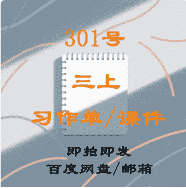
退货包运费 2000+人加购 301号：三上习作单/课件 ¥4 已售3.2万+ 张主任的情报库的店 >
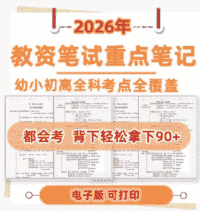
退货包运费 5000+人加购 上岸熊·26上教师资格证笔试幼儿园小学初高中职科一 ¥9.9 已售6245 小星星放光芒的店 >
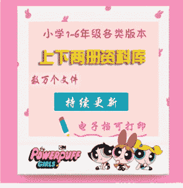
1.2万+人加购 小学学习资料1-6年级上下册语文数学英语电子版单课 ¥9.99 已售2.1万+ 小学提分资料库 📚的店 >
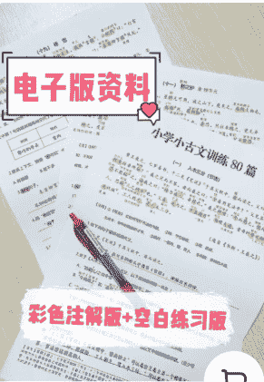
1000+人加购 小学小古文80篇 文言文合集 彩色注解笔记电子版

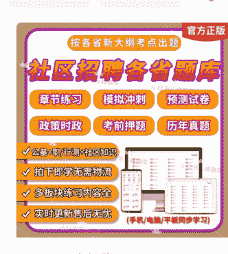

#### 求职面试高频题库90道（通用版）
- 包含：面试常规问题、压力面试问题等
- 适用对象：应届生、社招人群、面试小白等
- 购买面试题库赠送：《面试各阶段的hr沟通话术》

2000+人加购 阿慧学运营 | 求职面试高频题库90道（含参考回答） ¥9.9 已售6704 阿慧学运营的店 >
8000+人加购 2025社区工作者招聘考试题库软件笔记资料社区知识 ¥26.88 已售1.3万+ 乐峰题库的店 >
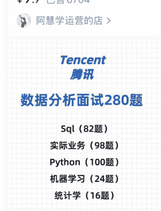
900+人加购 Python业务数据分析面试题&大厂数据分析面试题合
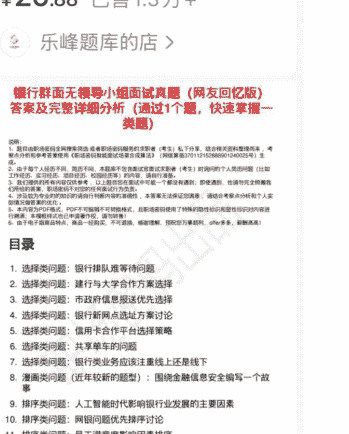
限时立减9.95元 退货包运费 463页银行群面—无领导小组面试真题及答案解析超无

可以看到，基本每个关键词下都有对应的产品来满足用户的需求，而我们要做的，就是从大的关键词逐步探索到更细分的关键词。那我们喜欢什么，经常购买什么都比较容易知道，那怎么找到自己的擅长点呢？

我们可以平静的坐下来，认真仔细的想一想，我们在过往的经历中，通过哪些能力拿到了结果，有哪些事情是别人做起来非常费力的，但是自己做起来很轻松的，这就是我们的擅长点。

我们很容易忽略自己的长板，而过于想要去补齐自己的短板，但是这样其实是适得其反，只需要把长板发挥到极致，这个在做虚拟品的时候可以很好的发挥出来。

#### 2、千帆后台官方榜单

打开千帆APP-数据-市场-笔记排行-优秀账号，每天有200个优质店铺可以探索。

> 公众号懒人搜索，懒人专属群分享

## 数据中心
- 浏览
- 商品
- 流量
- 内容
- 店铺
- 服务
- 市场
- 营销

## 热销商品 更新时间 10:40:56

| 商品名称 | 支付金额 | 商品访客数 |
| --- | --- | --- |

## 流量来源 2025-11-15
- 一级载体
  - 笔记
  - 直播
  - 商品卡
- 首页
- 消息
- 数据
- 我的

99+

10:44

## 市场

直播排行 笔记排行 话题排行
阅读榜 ? 引流榜 ? 热卖榜 ? 成交榜 ?
优秀内容 优秀账号
每日10点更新近7日累计数据，统计账号近90天发布的笔记表现

- (本账号) 暂未上榜
- 1 菜菜的社交心法 粉丝2,138 阅读数 10万以上 商品点击率 0-5% 支付转化率 25%-50%
- 2 元宝家的 粉丝527 阅读数 10万以上 商品点击率 0-5% 支付转化率 25%-50%
- 3 西西的奇思妙想 粉丝1,632 阅读数 10万以上 商品点击率 0-5% 支付转化率 15%-25%
- 4 Lullaby心理疗愈 粉丝2,919

#### 3、官方生活号开卷考试

每个月官方都会发布上个月的优秀店铺和类目，我们就可以直接知道哪些账号是对应类目里做的最好的，再根据第一点，结合自身去选品。

## 10月\PPT简历模板/\TOP商家

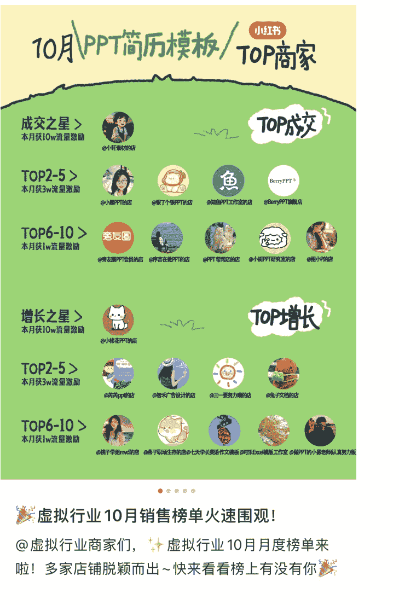

## 🎉虚拟行业10月销售榜单火速围观!

@虚拟行业商家们, ✨虚拟行业10月月度榜单来啦!多家店铺脱颖而出~快来看看榜上有没有你🎉

说点什么...
290
253
10

公众号懒人搜索，懒人专属群分享

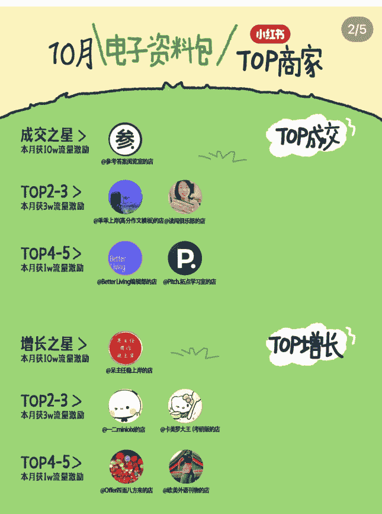

🎉虚拟行业10月销售榜单火速围观！
@虚拟行业商家们，✨虚拟行业10月月度榜单来啦！多家店铺脱颖而出～快来看看榜上有没有你🎉

#### 4、灰豚数据

数据平台会有一些滞后性，但是我们也可以从里面去发现一些不错的店铺和销量优秀的产品。灰豚是需要去某鱼买卡，如果需要免费的可以用圈友做的野马数据，也不错。

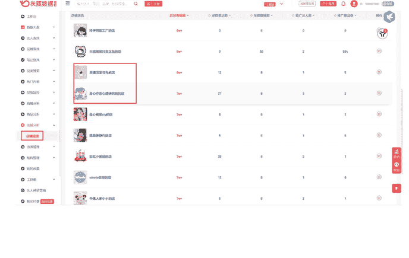

## 二、怎么制作视频笔记，测品

这里的笔记制作部分会主要以视频笔记来讲，因为我找的对标是用视频笔记起量的。其实我们发笔记，除了获得平台给的固定曝光外，更重要的是为了测出爆款模板。

在9月12日以前，我发笔记的数量也是非常少的，每天大概就1-4篇，就是测试产品和流量。而且一开始我并没有直接上3个关联号，而是根据数据的回馈逐步增加账号的。

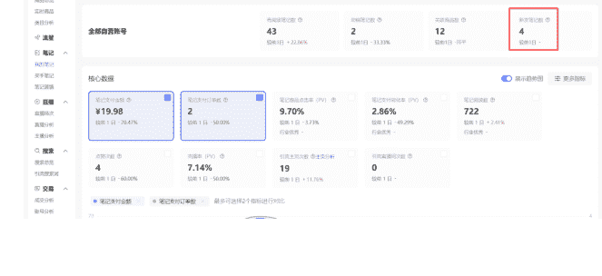

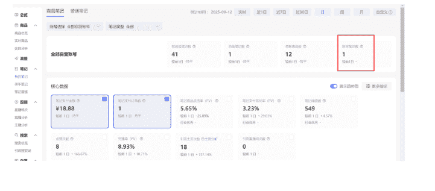

直到 9 月 12 日，我测试了一个视频脚本，发现流量远远超出其他的笔记，并且也能出单。

| 标题 | 账号名称 | 账号属性 | 粉丝 | TAG | 封面 | 视频 | 点赞数 | 日期 |
|---|---|---|---|---|---|---|---|---|
|  |  | 主号 | 7K |  |  | 4分57秒 | 171 | 9-4 |
|  |  | 主号 | 7K |  |  | 6分21秒 | 8401 | 9-6 |
|  |  | 关联 | 2K |  |  | 4分30秒 | 300 | 9-9 |
|  |  | 关联 | 2K |  |  | 5分52秒 | 93 | 9-12号10点 |
|  |  | 关联 | 15K |  |  | 4分35秒 | 4211 | 9-4 |
|  |  | 关联 | 15K |  |  | 5分52秒 | 1931 | 9-7 |

于是便在当天开始建立了对标的爆款分析表，并搜集素材，剪视频，那天剪到凌晨，剪出来了 32 个视频。

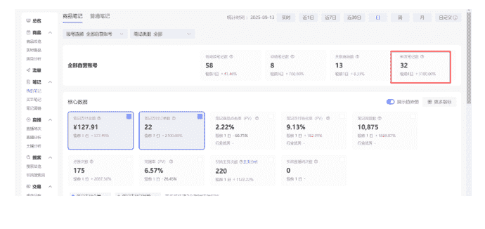

后面的剪辑思路我就围绕着这个爆款脚本，不断的延伸。提取爆款元素，不断的重组视频，最高的一天是 9 月 19 日，发布了 50 条视频笔记。

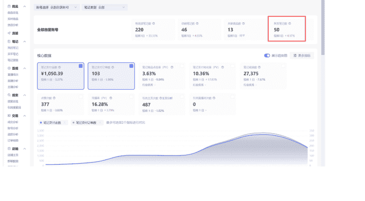

在我发到第 5 天和第 6 天的时候，单天的营业额就都分别超过 1000 元了。

小红书平台的一个特性，就是会延迟爆款。在我看自己的爆款模板的时候，往往发现是 7 天前，或者 10 天前的。所以我们在发笔记的时候，只需要观察，这条笔记的数据是否比别的笔记要好。这条笔记爆款后，我后续又爆了几条模板类似的笔记，逻辑就是我上方提到的，爆款元素重组。

### 付出不亚于任何人的努力，量变产生质变

爆款是重复的，爆过的内容是会再爆的。

当时选到这个品，我判断能打得过，就是因为符合打得过的标准。对手只有2个店铺在做，一个月内起的量，更新频率很低，所以我的打法就是：矩阵+铺量。

由于对标的素材太少了，一周总共发了15条，但是我一天需要30条以上的素材，所以只能边学习对标，边测试新的爆款元素。

素材的获取，我会从去抖音、快手找到相关的视频素材，优先选择被验证过的、已经是爆款的素材。然后通过剪辑，再发布测试。

因为平台的差异性，在别的平台的爆款并不能直接复用到小红书，所以需要大量的测试出爆款元素，后续剪辑就围绕着爆款元素进行创作。前期快速模仿对标，验证假设。

### 后期，拆解出爆款元素后，再伪原创

我记得很清楚，在发笔记的前1周，我基本都是学习对标同行的内容和封面，后面1周，同行就都来模仿我的了。

### 爆款封面（重要）

#### 封面点击率是慢慢提升的

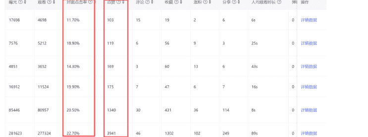

点击率从11%-22%都是一次次优化迭代测试出来的。大家可以看到，随着封面和内容的优化，曝光量也从4000-20W不断上升。

#### 测品的试错周期

视频的制作会比图文要难一些，需要花时间剪辑，但是要产出图文和视频的爆款素材，核心都是：大量的测试爆款模板，直到找到属于自己账号的爆款模板。

当然，我的试错周期一般是7天一轮。这7天，每天会更新30-40篇左右的笔记，来测试产品和素材。

让用户有点击的欲望，是成交的第一步。只有用户点击进来了，我们才能做下面的运营动作，所以在小红书，封面的重要程度是非常高的。

底层逻辑就是多发多测，每个账号都有属于自己的爆款模板。举个例子，

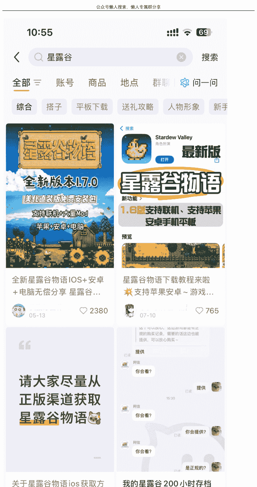

这两个封面的日期一个是7月份，一个是5月份。他们的封面想要表达的东西是一样的，但是展示的形态不同。5月份是用游戏背景+文字，7月份是用商店背景图+文字。

从美观度上来说，左边是比右边好看很多的。而在小红书，好看的封面会更加受欢迎。我们模仿封面的原则就是越近期的爆款封面越要去测试。爆款都是重复的。还有一点就是平时多刷一些爆款封面，就会对好的封面有一定的体感。先抄再超，也是一个非常好用的可以培养网感的方法。

### 标题和正文

1.6.15版本支持联机
#### 星露谷物语下载教程来啦🔥支持联机～

游戏名称：Stardew Valley（星露谷物语）
支持苹果设备手机平板ipad 支持安卓设备手机平板ipad
支持苹果和安卓联机～
每天种地、钓鱼、和村民唠嗑
节奏慢到让人上瘾🌾像素画风超可爱
下雨天窝在小屋里煮咖啡，傍晚看夕阳染红海面...
没有KPI没有内卷，只有四季流转和慢慢变好的小农场🏡
压力大的时候点开，瞬间被温柔包裹～

#星露谷 #星露谷物语 #星露谷物语ios #星露谷物语下载 #星露谷物语下载方法 #星露谷物语下载安卓版下载 #星露谷物语ipad下载

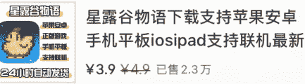

07-23 河北

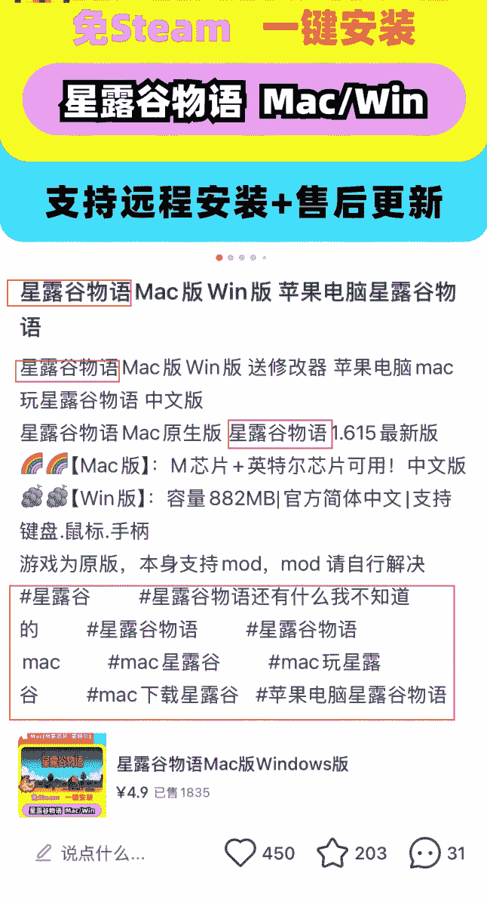

我的标题和正文，会以做 SEO 的逻辑为主。以星露谷这个产品举例，需要在每篇笔记里面埋入星露谷的主关键词，这样的好处是，后续会有很多长尾流量通过搜索成交。

并且后续发笔记的时候，会不写正文，以标题和 tag 为主，但这个时候是建立在推送人群很精准的情况下了。

#### 可以借助 AI 辅助生成

但是前期我为了刻意练习网感，我的千赞笔记都是从以往自己的爆款笔记里，拆出核心词再手搓重组的。我认为一定要有了自己的判断能力后，再借助 AI 提效是比较好的。

#### 发布笔记（电脑-群聊-手机分发）

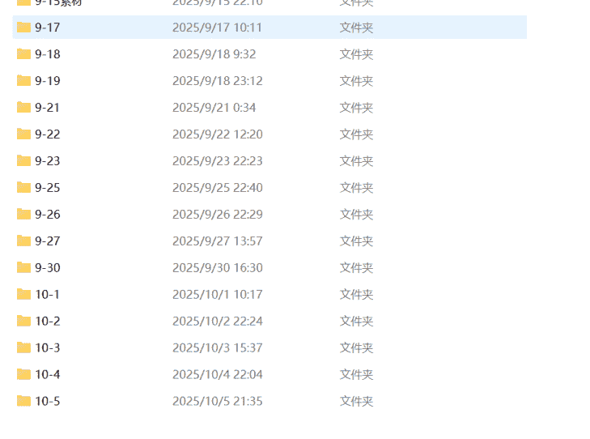

首先我会将视频素材按照日期导出在电脑文件夹里，然后再发送到对应产品的微信群聊里，最后各个手机下载视频后进行分发。

### 视频素材剪辑的 3 大要素

#### 1. 视频节奏

- 2秒跳出率
- 完播率

| 日期时间 | 类型 | 大小 | 时长 |
| :--- | :--- | :--- | :--- |
| 2025/9/13 21:47 | MP4 文件 | 126,049 KB | 00:04:15 |
| 2025/9/13 21:40 | MP4 文件 | 142,356 KB | 00:04:57 |
| 2025/9/13 21:44 | MP4 文件 | 173,932 KB | 00:04:35 |
| 2025/9/13 22:17 | MP4 文件 | 173,876 KB | 00:05:27 |
| 2025/9/13 22:07 | MP4 文件 | 236,253 KB | 00:05:52 |
| 2025/9/13 13:59 | MP4 文件 | 193,675 KB | 00:06:21 |
| 2025/9/13 21:10 | MP4 文件 | 35,925 KB | 00:05:57 |
| 2025/9/13 21:12 | MP4 文件 | 48,129 KB | 00:07:38 |

对于视频笔记的节奏，和我们平时刷短视频是一样的，需要控制2秒跳出率、完播率，那么这就和视频的节奏息息相关了。如图所示，我一般会将5-7分钟视频，剪辑到4分钟左右。我所删除的片段，就是一些无关紧要的、看起来容易让用户跳出的画面。

#### 2. 视频爆款元素（二创视频）

公众号懒人搜索，懒人专属群分享

| 核心指标 (2025-09-01~2025-09-30) | 数据 | 较前1月 |
| :--- | :--- | :--- |
| 笔记支付订单数 | 767 | - |
| 引流店铺页金额 | ￥338.38 | - |
| 笔记支付金额 | ￥7,587.77 | - |
| 笔记支付转化率 | 10.99% | 同行优秀 |
| 笔记商品点击率 | 2.52% | 同行优秀 |
| 笔记阅读数 | 27.73万 | 同行优秀 |
| 全部流量-发现页 | 笔记支付金额: ￥6,328.05 / 商品点击次数: 6,214 / 笔记支付转化率: 10.28% | - |
| 全部流量-综合搜索页 | 笔记支付金额: ￥400.95 / 商品点击次数: 353 / 笔记支付转化率: 11.90% | - |
| 全部流量-个人主页 | 笔记支付金额: ￥728.34 / 商品点击次数: 310 / 笔记支付转化率: 23.23% | - |

一条优秀的视频素材，可以带来很高的营业额，但是视频的爆款元素，只能通过测试，或者找到对标账号的素材作为参考。所以我们每天更新30篇左右的笔记，可以大大的减少测试时间周期。好的素材的数据会很直观的体现在曝光率、互动数据上，以及销售数据。

通过测试出的爆款元素，我们可以用不同的剪辑手法来产出新的视频。我一般会用到：添加解说词、混剪画面、爆款元素重组。

核心就是，尽量让一个视频里有更多的爆款元素，可以大大提升视频的平均观看时长，从而让曝光量更好。

#### 3. 视频去重

我一般会用贴纸、文本、滤镜以及画中画来进行去重。

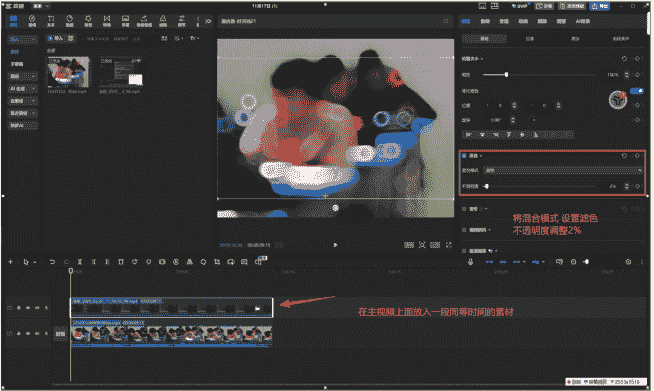

画中画的操作就是添加一段任意的视频素材，然后将混合模式调整为滤色，并将不透明度调整为2%。

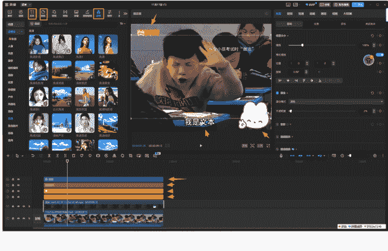

#### 贴纸、文本、滤镜的添加效果

文本内容，以及贴纸和滤镜的风格，大家可以根据具体的视频素材内容进行变换即可。

### 视频素材笔记容易踩的 3 个坑

这里要注意的是，违规不是发完笔记马上就判定的，小红书会秋后算账，一般过了1周-2周再判定都是比较正常的。

#### 1. 重复素材

13:32 4G 38
系统消息
毛...提示
10-03
笔记标题:
发布时间:2025-10-02 08:55
违规原因:笔记存在他人相似或重复的素材内容,请注意作品原创度
查看详情

笔记违规提示
10-03
笔记标题:
发布时间:2025-09-29 22:13
违规原因:笔记存在他人相似或重复的素材内容,请注意作品原创度
查看详情

笔记违规提示
10-03
笔记标题:
发布时间:2025-09-29 22:13
违规原因:笔记存在他人相似或重复的素材内容,请注意作品原创度
查看详情

收到这种系统提示，就是2种情况：
1. 平台识别到你的素材高度重复（90%相似）；
2. 被同行举报了。

#### 2. 画面不佳

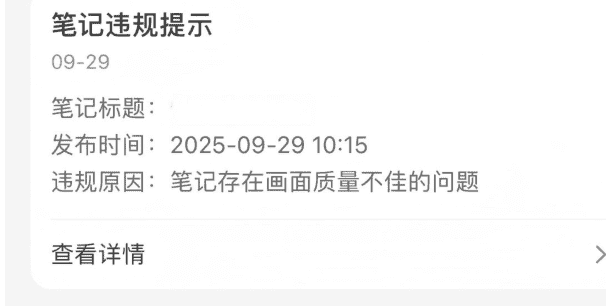

笔记违规提示 09-29 笔记标题： 发布时间：2025-09-29 10:15 违规原因：笔记存在画面质量不佳的问题 查看详情

这个提示是因为贴纸过大，或者遮挡物过多，影响画面美观度。可以重新修改下视频，或者直接隐藏笔记。

#### 3. 违反平台规则

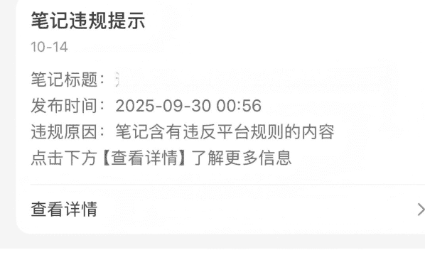

笔记违规提示 10-14 笔记标题： 发布时间：2025-09-30 00:56 违规原因：笔记含有违反平台规则的内容 点击下方【查看详情】了解更多信息 查看详情

这个一般是视频语音或者画面里含有敏感词或者违禁词，可以通过查词网站进行文案前置自查。

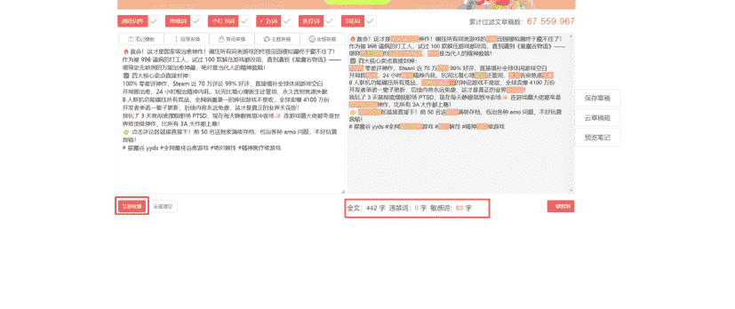

## 三、怎么运营

运营动作的核心，是提高下单转化率。我一共运营4个账号：1个主店铺号+3个关联账号，一机一卡一号。其实运营的差距，就是颗粒度能够做到多细节。当然，内容是最大的因素，而我们运营动作的核心，就是提高下单的转化率。

### 优惠券

优惠券最常用的就是单品特价和新客券，主要作用就是让客户有觉得占了便宜的心理。购物车券和复购，都算是二次触达了这个不可控，所以在第一次触达就要让用户下单。

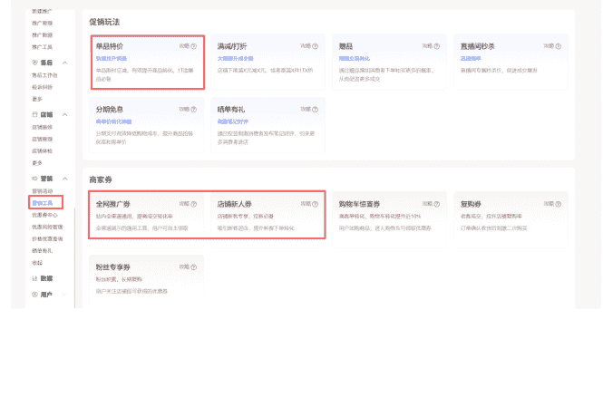

### 平台活动

而平台活动，官方都会有扶持的流量倾斜，所以如果产品符合报名条件，建议都报名上。

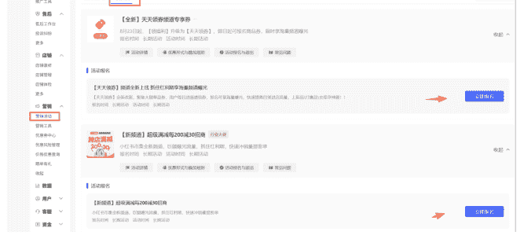

### 购买同款+置顶评论

这个位置，其实也算一个广告位，可以用简单的语句介绍一下产品的版本，功能性价值，使用情况等，会解决对这些问题有疑问的用户的下单顾虑。

### 宝藏游戏推荐

谷物语手机版联机 #星露谷物语 iOS 汉化版 #iOS 版
星露谷物语更新 #星露谷物语平板怎么下载 #星露谷
物语 ipad 下载 #星露谷物语手机版联机 #星露谷物
语联机

星露谷物语联机中文版
¥0.5 已售7.1万

编辑于 2 天前 重庆

### 共 341 条评论

说点什么...

作者
星露谷物语 (iOS、安卓、平板通用) 更新多少次都
可以 购买同款 >

作者
现在最新版本是 1.6.15.0 可以联机玩，iOS/安卓/
iPad 都能玩，有旧档保存，不论更新多少次，都是
包更新的
2024-12-21 回复 48

置顶评论
大帅哥派大星
联机必须在同一个网络的吗
02-09 回复 4

说点什么...
5480 2586 341

### 评论区互动：

部分小红书的用户的消费习惯会在评论区先问，这个要记得互动，不仅可以提高转化率，还可以让后面的用户更容易下单。

在一开始产品刚上架的时候，如果没信心，可以用小号或者让朋友购买，再匿名评价，有1-2个的基础评价。

我做虚拟品不怎么刷单，因为在选品时候就已经验证过产品是被市场需要的，所以用户大概率刷到后就会直接下单，小红书的转化路径会比货架电商要短。

而好评的获取可以通过赠品来引导，这边举个例子，具体根据自己的产品设计就可以。

点击打开获取文件。
手机上链接不要在浏览器打开～
复制链接去百度/夸克网盘打开就好哈～

- 12h内【点亮很满意+15字评价以上+晒图】送：
1. 霍兰德、MBTI|九型人格测试disc...性格测试合辑
2. 超值全套英语四六级英语资料（真题/解析/课程/听力/词汇/作文.....)
3. AI智能一键创作原创PPT【7*24小时免费不限次】
4. 迅捷PDF转换器（永久使用的）
5. PPT一站式系统全套课程
6. Word Excel wps 等office全套视频教程和软件
7. 评价后给【截图客服并发送】：已评（领取）

### 购后评价

购后评价是平台会从好评里挑选出合规的好评或者差评，展示在评论区，这个对于转化的帮助也是特别大的。这边有个细节值得注意，就是差评也会展示，所以在和用户沟通过程中，要尽量避免差评的情况。

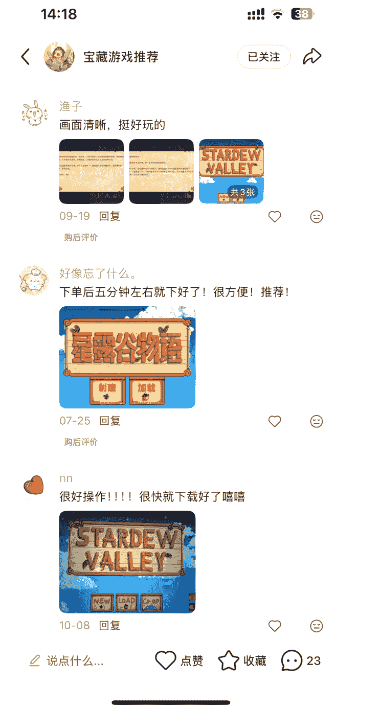

### 自动化回复（解决 95%重复问题咨询）

小红书对于客服的考核是根据营业额来的：
- 上个月>10 万，考核 3 分钟回复率
- 上个月<10 万，考核 24 小时回复率

自动化回复：我会搜集用户提问的问题，然后通过后台自定义自动回复，形成自动化回复。

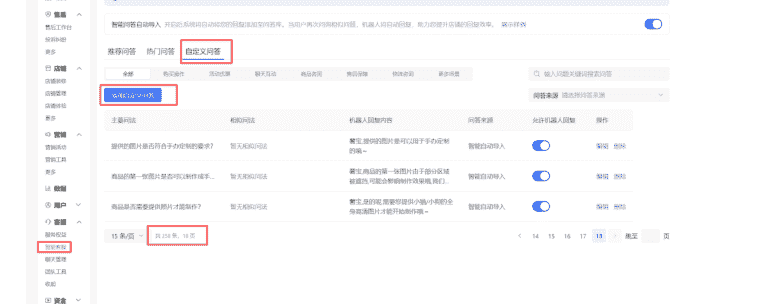

这个店铺添加了 200 多条的自动回复，基本可以自动回答 98%的问题。因为你当上一周客服，就会发现客户的问题，99%都是一样的。

## 四、怎么放大

### 付费投流和增加店铺数量

这次付费投流相较于之前做货架电商平台，我并没有一开始就介入。而是等待自然流跑得足够稳定，每天稳定100单的时候，再进行付费投流。

经过20个计划的1周测试，我用1600块跑出2.56的ROI，也就是4200元，千次展现控制在5元左右。对于付费投流，我们要达成的共识就是，投流只能锦上添花，而不能雪中送炭。所以我们要保证素材的内容足够优质，有抓用户的痛点，这样再去投流，效果才是最好的。

我常用2种投放方法：通投和关键词投放。

#### 1. 通投（展示笔记在发现页）

##### 广告类型

通投经过我的测试，低客单的产品目前用托管的方式，投放效果是最好的。

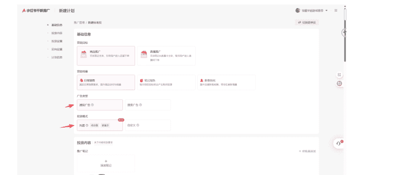

投放笔记的数量，我测试过一次 100 篇，但是整理数据下来，不如单次 5-20 篇。所以初期建议，少量多测。可以把不同的爆款脚本，分开测试，这样可以更加清晰的看出来投放的效果。

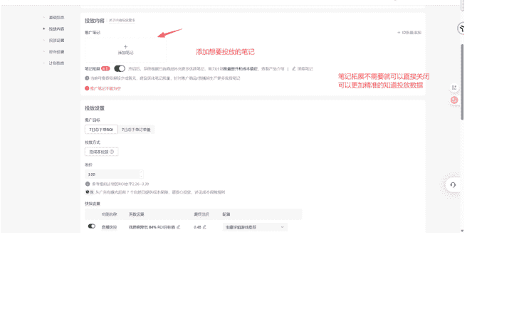

##### 投放设置

ROI 设定后，后面是可以调整的。一开始可以按照系统推荐的取一个中间值，然后根据投放的流速来决定是否提高还是降低。我一般从 ROI 从 2.9 开始，建议新手，一开始从 2 开始投放，先能消耗出去金额，有体感之后，可以再追求更高的 ROI。

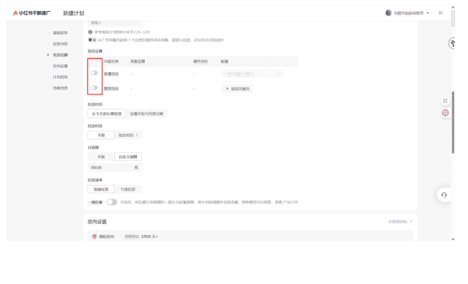

对于虚拟品而言，ROI 1.2 以上，就可以算盈利了。

直播快投和搜索快投直接关闭就可以。投放时段，如果产品不是节假日属性特别强的，就不进行设置；反之，可以控制某一天不投放，或特定时间段投放。投放速率，就是花一定的钱，给你测一波泛流量，不建议开。

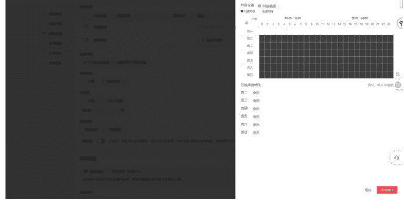

##### 定向设置

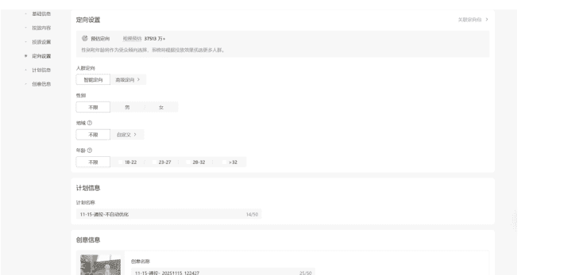

这里分 2 个情况：
第一种，如果你的产品受众比较广，并且你不清楚具体的用户画像，那么就用智能定向，让系统帮你探索。
第二种，你的产品很小众（已经确定人群画像了），那么你要去选定性别或者年龄段。这个也是需要建立不同的计划进行测试。

##### 计划信息

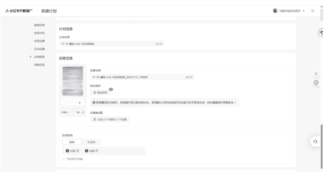

计划名称的命名规格，一定是自己能一下子看懂的，后面计划多了，就方便区分和进行复盘。

我是以 `时间+产品名+投放类型+roi+是否自动优化` 来命名的，如果有设定人群，就是 `时间+产品名+投放类型+roi+人群+是否自动优化`。

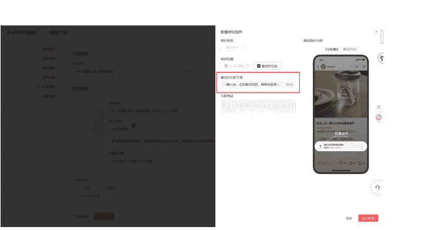

商品组件点开后，可以设置评论文案，这里默认的一般都是不太合适的。如果发笔记的时候没有提前设置，这边就要手动更改一下文案。

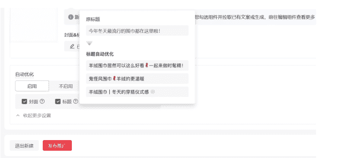

自动优化，我的设置都是不启用的，因为我测试过，目前的自动优化还不是那么智能，会生成一些奇怪的标题，这个转化率肯定是不如我们自己二创的爆款标题的。

#### 2. 关键词投放（展示笔记在搜索页）

##### 广告类型

关键词投放就是搜索广告投放，这个会比通投的设置更少，也更加简单一些。

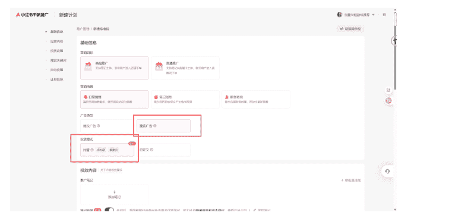

##### 投放设置

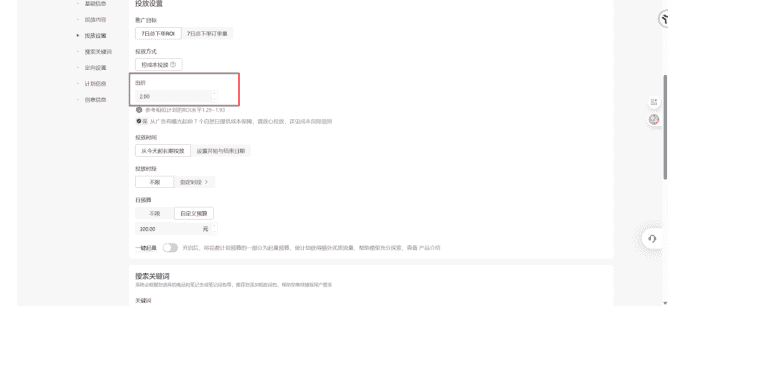

搜索广告的 ROI，建议可以从 2 开始，因为它的展现数量是没有通投高的，只有用户主动搜索了，才能有机会看到我们投放的搜索笔记。其他的设置保持默认即可。

##### 搜索关键词

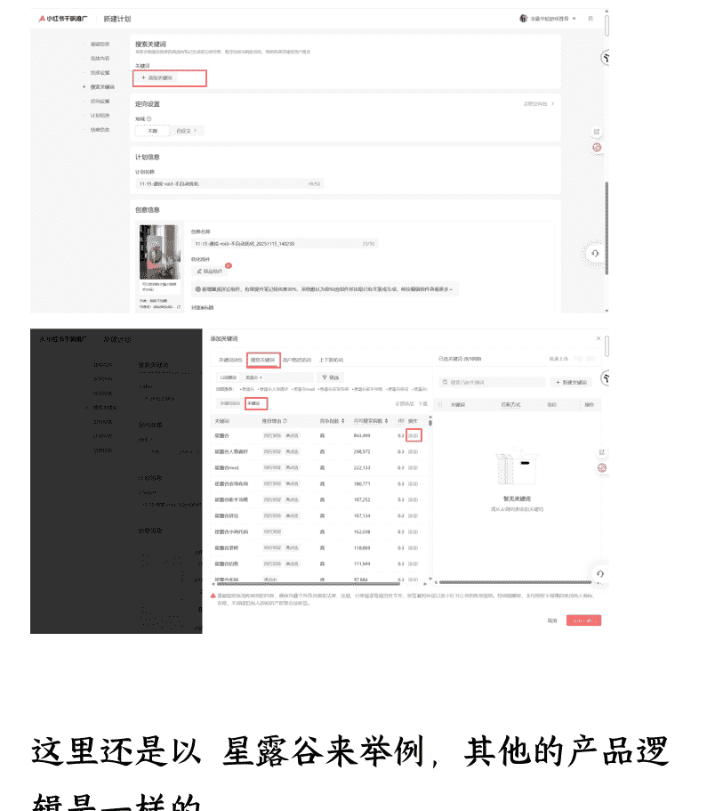

这里还是以星露谷来举例，其他的产品逻辑是一样的。首先我们输入关键词搜索后，会按搜索热度排序所有的关键词相关的搜索词。

这里需要手动的筛选符合我们产品的搜索词，然后逐一添加。这里不建议点全部添加，因为会有很多不相关的词但是包含星露谷的会进行投放，不能产生转化还会拉低 ROI。

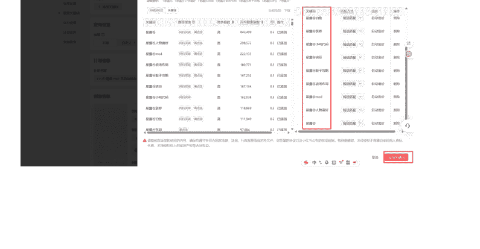

再选择好关键词后，按照默认的短语匹配就可以，因为用户有时候会在前后加一些词。

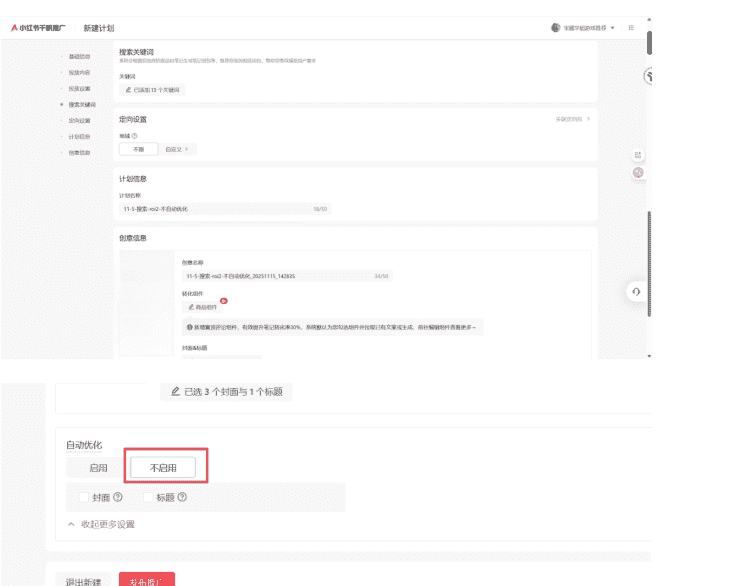

这里的自动优化还是关闭，其他设置保持默认。

付费投流可以简单的分为：通投和关键词投放。

通投是将我们投放的笔记展现在小红书的发现页。

关键词投放是当用户搜索我们投放的特定关键词后，才会展现在搜索页的笔记流中。

#### 3. 增加店铺数量

对于单品打爆的玩法和垂直小店的运营思路，我们通过4个账号的笔记和付费推广，如果运营的足够好，是可以把大部分的流量吃光的。但是如果要再开店铺，可以用带品的方式，也就是新店铺主要测品，然后把老店铺的爆品再上架一次。

这里要注意，新店铺的产品主图标题等信息不要和老店一致，需要做一些差异化，另外也要选定好人群。10月份新开了店铺测试，测品为主的情况下，一个月可以跑出1W+的营业额。

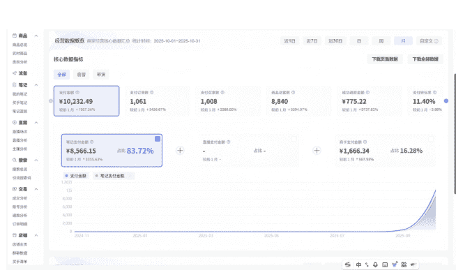

后续的运营动作就是要围绕着这个人群画像，来不断衍生这个人群需要的产品，做成下一个小红书垂直小店。

## 五、One More Thing
相信相信的力量，不下牌桌，就能赢。
对还在0-1路上的朋友们，我想说些心里话。

公众号懒人搜索，懒人专属群分享

其实在这次做小红书虚拟垂直小店之前，我就对自己可以做成的概率预期是100%。这不是夸大自己，而是我确实眼睁睁看了2个案例从0开始做起，拿到结果。

并且我对选品和数据调研验证是有足够自信的，数据是不会骗人的。所以我进场之前，就是给自己3个月的研究和学习的时间。我们要学会给自己时间和空间去做好一件事，慢慢来会更快。这就是文章开头提到的笃定感，我觉得自己可以做到，它就一定可以做到。

在写这篇复盘分享的时候，我再次认真看了我每天发笔记的数量以及数据的情况，发现一开始，和大多数人一样，一天几篇几篇的发，就没有一个强烈的正反馈。数据不好就容易放弃，但是其实很多爆款点和用户下单的痛点，我们其实是完全不懂的。只模仿到了表象，但是没有模仿到核心要素，其实就是对内容和平台的陌生感太强了。浸泡在什么样的平台，就会培养出什么样的体感。

虽然账号被封，但是每周还是会习惯性地看6小时以上小红书。
- 微信 7小时5分钟
- 小红书 6小时35分钟
- 小红书千帆 3小时12分钟
- 支付宝 2小时55分钟
- 淘宝 1小时56分钟
- 千牛

在做小红书的这段时间里，我每天都会花3-5小时用来刷笔记，培养自己对爆款笔记的感觉，以及跑通最小MVP后，一天30-50篇的坚持剪辑和发布笔记。一开始剪辑需要我每天从早上10点工作到晚上1点左右，后面熟练后才越来越快。

网感不能一蹴而就，它就是需要慢慢沉淀和积累，就像我们小时候写作文一样。当我们想要做好一个平台的时候，一定要先了解清楚，这个平台需要什么样的创作者，以及平台用户的调性是什么。对于小红书垂直小店，我们通过产品找到人群后，就要围绕着这个人群不断的深耕。

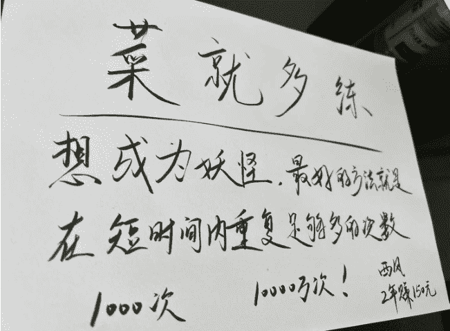

在心态上，也一定要有一股不服输的精神，多想想凭什么，凭什么他发这么简单的内容就能爆，我为什么不行！1次不行，就十次百次千次，成功就是概率事件。平台在大多数时候，都会给到你标准答案，让你来抄。其实大部分的项目，只要执行力到位了，就可以拿到结果，我已经验证了很多次了。

以上就是我的全部分享了，感谢大家的观看，有什么问题也可以和我多多交流，也希望得到大佬们的指点。乾坤未定，你我皆是黑马。

最后，安利小懒的付费群：

懒人专属群（介绍）

微信:lazyhelper

📖 懒人专属群持续更新中，已持续运营6年，整理超3000份各类精选付费文章&年费社群干货，全部开放下载。

本资料为付费群内部分享，仅供真实有需要的朋友查阅 🙇

懒人专属群更新记录：
https://hk57gvIx7u.feishu.cn/docx/H0kRdZbSbolBR0xkaXtcuVE0nTg

懒人专属群更新记录（需梯子，备用）：
https://lazybook.fun/blog/record2