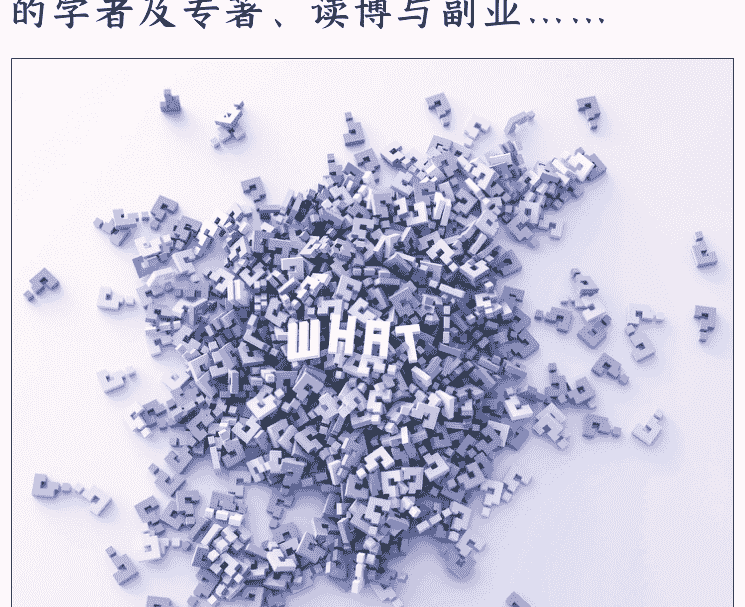

# 你问我答

251125 新闻实验室
整理：公众号懒人搜索，懒人专属群独享
懒人微信：lazyhelper

舆论极化下的左右之争、公共讨论中的“正义中毒”、政治抑郁/创伤、LGBTQ权利的倒退、研究电台和播客的学者及专著、读博与副业……

Winter：我在 Instagram 关注了一个叫 bothsidesnews 的博主，他同时展现左右对美国政治新闻的理解和信息差。我以为这样的账号能够增进双方的理解，我也是看他的视频后理解了更多右派的想法的出发点。但我没想到他底下的评论是我见过的最分裂的，吵得不可开交，动不动上升人身攻击，视频刚批判过的论点又在评论出现。方老师怎么看？

答：很有意思的观察。我从中联想到的有几点——

- 第一，这似乎是“逆火效应（backfire effect）”的体现。人们本以为，看过和对立的观点之后，可以让人变得更平衡。但往往实际发生的是，人为了捍卫自己心目中既有的观点，反而会在看到对立观点之后体会到一种受威胁的感觉，因此变得更固执己见，一定要证明自己是对的、对方是错的。

- 第二，评论区并不是一个很好的观察民意的地方。通俗来说，谁会在评论区发言？“不正常”的人才会，因为大部分用户都并不会发表评论，往往是那些最固执、对自己的想法最狂热的人，才最热衷于发表评论（而且如你所说，他们可能不看内容就直接评论）。而且，社交媒体的评论区往往重在玩梗，并没有容纳严肃讨论的可能。因此，我们很难仅仅从评论区的状况，就认为这些视频的效果是糟糕的。

- 第三，那么，这些视频究竟会起到增进理解，还是加深裂痕的效果呢？我不确定。这个账号发布的是幽默演绎双方观点的短视频，是不是因为这种幽默，乃至娱乐化的演绎方式导致了对不同观点的呈现是脸谱化的，因此起不到弥合分裂的效果？这需要更多的研究，包括对内容的分析，和对效果的测量。

anapple：我是一名国际传播本科学生。感受到在当今中国舆论环境并不友好，最典型的印象是听梁文道老师的一起播客。他说到，人们很容易在公共讨论中陷入“正义中毒”，他们拼了命的想要站在正确的一方，其实根本不关心事情本身。另一方面，国家似乎经常将内部阶级分配问题，偷换成国际民族之间的问题，争取自己合法利益的行动总是显得困难，民族情绪高涨。

答：这种“正义中毒”正是类似于我在上一个问题的回答中提到的“逆火效应”。大家对捍卫自己观点的重视程度，远远超过了倾听、理解、求真的重视程度。

最近大家喜欢说经济上行期和下行期。我想，两个时期的社会心态有一种重要的差异，那就是上行期大家的心态也许更宽容，更愿意容忍和自己很不一样的人存在，而下行期则更封闭，更要求一种（自我定义的）道德上的纯洁性，因此也更可能滋生民粹主义。

Anonymous：方老师您好。想请问您如何看待政治抑郁/创伤？更具体地说，我曾祖父是台湾人，我是大陆人，现在我恋人是台湾人。但面对日益激烈的台湾矛盾，政治观点仅仅是不喜欢打仗的中立派应该如何自处呢？比如，我住台湾的时候时常感

Anonymous：方老师，请问您如何看待同性伴侣关系登记条例草案遭立法会否决这件香港旧闻；2015年 Obergefell v. Hodges 案十年过去，2025年 LGBT 权利在全球范围内再倒退中吗？（希望新闻实验室在这个话题不要缺席）

答：谢谢你的提醒。我有关注意9月份香港的那条新闻，不过因为对相关的背景了解并不算深，尤其是感到其中政府与立法会的关系问题颇有意思但分析起来也很有难度，因此没有写相关的主题，现在想来确实略有遗憾。

关于你提到的问题，《Foreign Affairs》今年发表的一篇文章恰好做了梳理。首先我们其实应该看到，过去二十年来，尽管进展不均衡，但世界各地的 LGBTQ 权利有了稳定的进步，例如印度、纳米比亚和加勒比地区的法院裁决使得同性恋关系去罪化。目前，有 39 个国家/地区已经承认同性婚姻权利，而且这个名单上并不都是西方发达国家，比如其中包括古巴、泰国等。此外，阿根廷的性别认同法允许跨性别人士无需经过繁琐的医疗程序就可以更改身份证件信息，厄瓜多尔和马耳他实施了全面的反歧视政策来保护 LGBTQ 人群的权利。

当然，在 2025 年来看，LGBTQ 权利的确面临着重大的威胁——它的背景是整体的民主倒退和威权兴起，而不是单一的 LGBTQ 权利退步。文章指出：威权领导人故意利用人们在 LGBTQ 问题上的分歧来巩固政治权力，利用对不断变化的社会规范的担忧来建立选举联盟和维持公众支持。比如，通过将 LGBTQ 人群描绘成威胁，实际上就会制造道德上的理由来实施压制性的措施。当民主保障机制削弱时，LGBTQ 权利就会失去保护。

面对这样的状况，文章建议：LGBTQ领域的活动家应该建立跨运动联盟，将LGBTQ权利与其他民主生活维度，如经济发展、反腐败和促进性别平等的措施联系起来，形成更多的统一战线，并加强支持少数者权利的民主机制。

Anonymous：请问方老师有没有什么关于平台的书籍或者报道推荐呀？尤其是评分平台的？之前在newsletter常常看到方老师在分享平台有关的知识，感觉很有趣！

答：最近不太写专门写平台（但几乎每一期都会提到这个词），是因为对这个话题感到疲惫和厌倦了。平台早已在我们的生活中无孔不入，并且给我们的社会带来了很多负面影响，但我们却迟迟走不出平台时代，真的很让人心累。

不过还是推荐一本同事的新书吧：

《Chinese Platforms: A Critical Introduction》，作者之一是我们学院的林健老师。

anapple：现在无论是机构媒体还是个人自媒体，都需要基于可持续的商业模式。无论对于新闻信息生产来说，商业思维都是时代通用的思维，当然新闻理想总有一些超越商业思维的所谓人性。在您看来，商业思维是否有一个交换或者盈利的前提？做新闻的人是否越来越难以在商业计算面前有抗争的能力？（想到曹筠武《系统》一文）

答：在新闻业的黄金年代，优质的新闻内容和成功的商业模式是相辅相成的。《系统》发表的年代，也是《南方周末》依然在商业上获利颇丰的年代。所以，我并不认同以“抗争”来描述新闻和商业之间的关系。

按我的理解，商业思维的前提与其说是交换或盈利，不如说是需求和供给。就像餐饮行业一样，你可以选择供给垃圾食品，也可以选择供给健康食品，两种方式也许都能满足需求，都能在商业上获得成功。

但现在的问题是，在有需求的人和提供供给的人之间，横亘了一个叫平台的东西。一家专门提供健康食品的餐厅，本来直接服务一小群人就可以生存，但突然有一天，所有人都失去了和餐厅的联系，转而在平台获取无穷无尽的食物选择。虽然食物依然是餐厅生产出来的，但是健康的食品更难抵达顾客那里，顾客心目中也不再有“这家餐厅很健康”的品牌认知，于是，支持健康食品生产的商业模式就崩塌了。

Edward：感谢方老师上期回复，期待您的成都之旅。我的问题是：相对于纸媒，广电的发展在当时算新媒介，尤其在上世纪90年代和千禧年前后有一个蓬勃的发展期。因为声音的陪伴感，有不少人对广播情有独钟，形成了一两代人的共同情感记忆，与当下播客热有一定相似性。请问国内外有没有专门做电台（或播客）研究的学者或专著？请您做简单介绍，谢谢。

答：感觉杨一会和你非常有共鸣，你可以搜一下他讨论那个时期的广播的播客节目。在学术书方面，通过《The Routledge Companion to Radio and Podcast Studies》可以快速了解领域内的议题和学者。顺便提一下，我将会在 11 月 29 日参加中文播客大会，并做一场关于“播客研究学术地图”的演讲。

Henry：方老师好，您是否鼓励在海外的博士生在读博期间开展一项副业（例如留学辅导/自媒体）？好处是获得及时满足感和业界经验，坏处是牵涉精力及可能影响声誉（客户投诉或学界前辈认为不专注）。您是如何平衡科研与服务的？谢谢老师！

答：我在读博期间确实在做“副业”——其实也就是这份 newsletter 啦。2016 年开始写的，那正是我读博的第三年。当然，我也做了公号、B 站等，还一度在 B 站直播自己写论文。如你所言，其实背后的一大驱动力是“即时满足感”——学术研究和发表是一件耗时太久的事情，论文发表出来的时候，最初做研究的兴奋与热情早已荡然无存。其实读博的同学大多需要一件“另外的事情”来保持心理状态的稳定，不一定副业，也可以是一项比如运动之类的爱好，下厨、看剧也都行。

我的建议是，如果要做副业，最好是做真的能让自己也获得一些提升的副业。毕竟，赚钱并不是最重要的目的。所以，我个人不会很推荐做留学辅导，那更多是掏空自己，或是锻炼一些并不重要的申请技巧。自媒体是可以的，但不必追求流量，专心做自己真正认可，且能让自己在创作过程中也有所收获的内容即可。我写这份 newsletter，就是基于这样的标准去做的。

> Anonymous：方老师好，想请问一下你怎么看待最近的小米及雷军风评问题呢，我之前也是觉得宣传的雷军是很典型的工科学生，有想法和执行力，把这种感觉也带到小米产品上。最近全网掀起了对雷军宣传话术和小米汽车的批判，反差之大，想听听方老师如何看待这种转变，以及背后可能的因素

答：抱歉，这个问题我真的答不上来，因为从来没有好好研究过雷军和他的小米。如果有朋友想要分享意见，欢迎在本期的网页版下方留言。

# 最后，安利小懒的付费群：

懒人专属群（介绍）

📚 懒人专属群持续更新中，已持续运营 6 年，整理超 3000 份各类精选付费文章 & 年费社群干货，全部开放下载。

本资料为付费群内部分享，仅供真实有需要的朋友查阅 🎁

懒人专属群更新记录：
https://hk57gvIx7u.feishu.cn/docx/H0kRdZbSboIBROxkaXtcuVE0nTg

懒人专属群更新记录（需梯子，备用）：
https://lazybook.fun/blog/record2