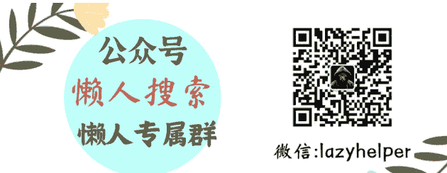
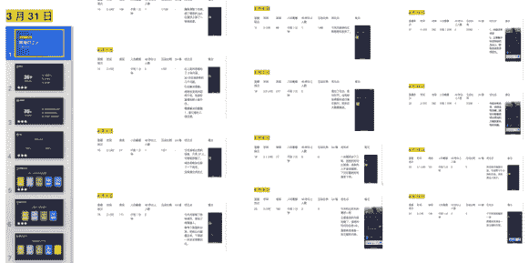
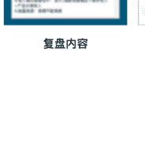
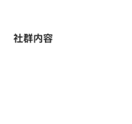
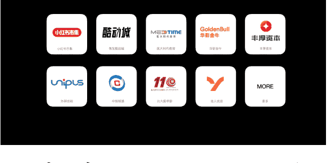
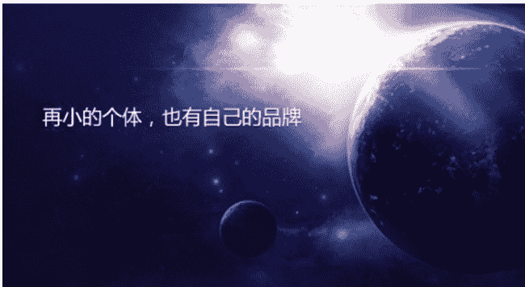
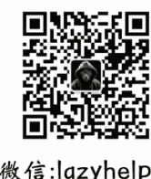

# 普通人做 IP 的踩坑经历：从职场焦虑到年入 30 万的实战路径

251125 副业 SC 精华

公众号懒人搜索，懒人专属群独享

懒人微信：lazyhelper

我在 30 岁时，就一直有很强烈的 35+ 危机感。

当时我还在公司上班，每天按一套需求流程干活，一边工作一边看着身边的设计师同事，一个个到了 35 岁就被裁掉，我想不通明明技术很好，作品也不错，但因为年龄，就好像人生路被切断了一样。

我意识到：我如果只靠职场，是没有任何掌控权的。

于是，我开始在下班后坚持写作、读书、设计项目复盘。虽然那时候我根本不知道做这个事能赚多少钱，但我深知坚持这件事能让我成长更好。

终于，2020 年，我在设计领域的输出，陆续得到了反馈和认可。

# 2020：身份转变，突然就觉醒了

2020 年，我升级做了母亲，对未来不安全感非常的强烈，可能是有了家庭、有了孩子后，我想要更多的钱，对职场有一种根本看不到未来的迷茫。

朋友推荐我加入生财有术，那是我第一次看到更大的世界：原来赚钱方式不仅是上班，还有副业、电商、公众号、自媒体、知识付费……

之前我完全不知道，感觉一直活在井里。

但即便看到了这些，我依然没有勇气和魄力迈出关键一步，稳定工资、团队认可，都让我犹豫着不敢走。

# 2022：裁员来了，我开启了一场自我救赎

终于，在 2022 年公司裁员了，我很爽快地答应了。我拿着赔偿金，兴高采烈地报了大航海，我感觉自己终于可以全力去试试那些赚钱的项目了。

跟着生财做抖音直播大航海，每天对着屏幕讲，看复盘数据，我的数据几乎都是个位数，没有观众、没有互动、没有反馈。

## 老公劝我放弃，我还处于一个劲头十足想大干一场的时期。

现在想想，那段没人看的直播经历，反而逼着我练出了演讲能力。从一开始的结结巴巴，到后面顺畅自然。

前几天，有人问我：怎么锻炼演讲能力，怎么会不紧张？

我非常有心得地回答：多练就好了，紧张是因为内容不熟悉。

## 第一次卖 9.9 元产品，0 人问津

从职场刚出来，真的是朦胧无知，不知天高地厚，我看到市面这么多卖课的内容，觉得干这个真是太容易了。

我以为自己 1 万多粉丝，人气还不错，随便推个 9.9 元产品，不就是轻松到手 10w 了吗？我似乎看到 100w 也在跟我招手。

我在公众号、朋友圈推出海报后，我脑海里幻想的爆单热卖场景，结果是被狠狠地泼了一盆冷水，几天过去了，0 人问津，我才意识到原来卖产品，不是有粉丝就能卖。

我赶紧调整策略，我一一去翻手机里的人，找公众号里最近跟我在互动的，最近加我微信的，之前跟我参加过读书活动的设计师，我挨个的 1v1 私聊问他们要不要来参加，只要问了，就能转化，这样转化了 80 多单。

紧接着，我的小红书有了 10w+ 的爆款数据，我顺势推出了设计师小红书自媒体训练营，￥1999/4 周，一共开了 2 期，从 9.9 元体验营里转化了 8 个人。

后来，这 8 个人在 2023 年、2024 年大部分都付费了我的高客单。

到了 2022 年底，我老公问我要不要去找个班上，辛辛苦苦干了这么几个月都没一个月工资高。

我狠狠地大哭了一场，我以为不费吹灰之力的知识付费，竟然是一个隔行如隔山的另一个行业。

# 2023：花 8 万学习个人品牌，是我最重要的决定之一

经过我仔细考虑，我觉得要重头开始学习，我陆续付费 8 万去找行业老师系统学习个人品牌。

这几笔钱对当时的我很不轻松，但我特别笃定：自己摸索会更贵，花钱买方法，就是买少走弯路。

在这段学习里，我彻底重构了认知：

- 流量≠变现
- 粉丝数≠收入
- 做内容≠做 IP
- 博主≠个人品牌

我重新定位成「设计师 IP 教练」。

从产品定位、服务体系，到价格结构全部重做：把产品客单价从 1999 元升级到 12800 元。

我给自己设定了 100 个设计师咨询挑战，原价￥699，限时优惠￥299。

主要解决设计师 IP 的各种专业能力优势、心力、产品、优势等困惑问题。

我的策略是一鱼多吃：每个来咨询的设计师的问题+复盘，经过征得同意，成为公众号、朋友圈、知识星球、社群的内容素材。

我的核心动作只有一个：坚持输出内容，每日社群输出分享+ 朋友圈+公众号。所有的动作都围绕转化卖 12800 产品。

通过塑造出来的标杆案例，带动后续更多的成交，这一年，12800 私教成交 17 人，咨询完成 100 单，产品分销排名前 5，我的 GMV 达到了 40 万。

复盘内容

知识星球内容

公众号内容

社群内容

# 2024：我学会了借势让增长更快

2024，我联合设计圈子的设计大 V 合作，付费 2 万去学“发售打法”和产品打磨。

我第一次真正学会了：借势，让自己的势能放大。

经过 1 个月准备，一次发售带来了 14 万营收和 1000+ 设计师精准流量。

这次发售成了我后续增长的重要节点。

我的核心动作：联动设计圈的力量+精准发售+系统交付。

# 2025：AI 彻底改变了我的方向

今年 4 月去听了杭州航海家 AI 大会后，我震撼了，我看清设计行业 AI 大趋势。

于是我做了三个重要的事：

- 注册公司，围绕设计+AI 工作流+编程方向，输出相关商业案例
- 经营私域人脉，承接项目
- 组建 AI 圈子，集合学习力量，筛选可合作设计师、程序员

下半年，我们主要通过私域人脉、过往的项目案例，合作了小红书市集、淘宝酷动城、北大医学部、301 医院等，带来近 30 万的项目合作。

这让我彻底坚信：设计行业不是没机会，是被 AI 重塑的行业。

我在设计这行业积累了十几年，大家谈到 AI 出图，第一个反应都会说 AI 要替代设计师了。

事实上，我深知现在设计行业存在的现象：

- ① 设计师岗位更多了：市场越来越多新岗位，需要设计师跟 AI 结合的岗位
- ② 设计师比之前更忙了：设计师增加了跟 AI 协同的时间
- ③ 设计师出图效率更高，品质更好了。

从以前做 To C 的设计师 IP 教练，到现在和设计师一起做 To B 的商业服务，服务对象在变，但我的底层打法一直没变：先持续做事，用过硬的案例说话，再靠专业+案例获取更多客户，带来成交。

这几年我一直很稳定地在设计领域深耕，我没有追求那种一天几万浏览的爆款流量，也不追热点。

我更在意的是把一个细分方向做到够深、够专业。

项目一个个的做，方法不断打磨，每次交付我都会复盘，把能复用的东西沉淀下来。

对我来说，不需要让所有人看到我，而是让真正需要专业的人找到我。比起流量，好结果、好口碑、好案例更重要。

# 这三年，我每年都问自己一个问题：“想不想回职场？”

答案始终是：不想。不是因为赚了钱，而是因为：

- 我走出了重复内耗的职场，看到了更大的成长空间
- 我获得了真正的掌控感
- 我不再被动等待别人决定我的未来

我的成长一路跌跌撞撞，但始终目标坚定，不断地试、不停学、不停优化。

接下来，我想分享过去这 3 年的实战体悟出来的关于小个体 IP 成长的一些经验。

# 再小的个体，也有自己的品牌

微信公众号平台

微信公众号平台说：再小的个体，也有自己的品牌。

我体悟出来的踩坑建议是：如果没有势能、没有优势积累，普通人其实是没有个人品牌的。

我们大多数普通人卡点就在于：没有在一个领域做出结果，没有拿得出手的案例，遇到真正的高手玩家，根本没有竞争力。

所谓的“小”，不是弱小，而是在一个细分领域做到足够小而深、专、精。

哪怕流量不大，只要你在这个小领域做到 Top，那么，再小的个人品牌都能靠媒体和营销持续放大，让更多人看到小个体的价值。

我的变现路径也是这样走出来的：深耕设计领域，坚持输出 6 年。

个人品牌的底层逻辑其实很简单：不断用专业累积信用，再用这些信用换来业绩。

# 流量踩坑：IP 不是流量游戏，是价值变现系统

大众都认为：IP=百万粉丝

我踩坑过来悟出来的经验是：粉丝不等于变现。

前两年，我的收入主要来源于公众号积累的粉丝，但在变现上，我走过很多弯路。

比如在内容上，只盯着涨粉、做爆款、每天研究蹭热点、做标题党、刷数据。

却忽略了核心真相：粉丝不等于变现。

我身边有几位十万粉丝设计博主，和我之前一样，因为商业模式不清晰，没有怎么变现，根源在于我们都把 IP 当成了流量游戏，而没有注重价值变现系统。

做博主跟做 IP 有着本质区别：博主是没有明确产品、只追求流量、内容主要靠情绪焦虑博取关注。

而个人品牌的核心是有具体业务和产品、要吸引精准客群、解决真实问题，具备清晰的变现路径和转化逻辑。

我们平常见到的小红书、抖音、视频号、公众号等，都是自媒体平台，只是获取流量的工具，而打造个人品牌是手段，最终目的是通过产品或能力帮人解决问题，实现价值变现。

我趟过的深刻教训：2022 年，我写了几年的公众号 1 万粉丝时，推出 9.9 元海报却无人问津。

后来才明白问题所在：

- 一是内容不精准，公众号内容混杂职场感悟、读书笔记、设计分享；
- 二是定位模糊，设计师标签过于宽泛，无法说清与其他设计师的差异及能解决的具体问题；
- 三是产品未击中痛点，“职场危机”的主题过于空泛，没有明确答案和实际价值；
- 四是内容与产品脱节，内容没有指向产品引导，内容大多吸引的是寻求共鸣的用户，这如同卖包子的天天唱歌，吸引的听众光凑热闹，但不买。

2023 年，我通过系统学习重构了整个 IP 系统：重新定位为 “设计师 IP 教练”，精准聚焦设计师个人品牌打造与商业变现，形成差异化优势。

重新设计 12800 元私教服务，解决定位、产品设计变现等具体问题，重新规划内容，所有输出围绕 “设计师如何打造个人品牌” 展开，强化定位并吸引精准客户，重新设计转化路径，从看内容到加微信、进社群再到付费，每一步都有明确引导。

我们小个体做 IP，要避开掉入博主陷阱：

- ① 不要追求泛流量，100 个付费精准客户远比 10000 个泛粉丝更有价值；
- ② 不能光盯着内容，内容是吸引客户、实现变现的工具。
- ③ 不盲目为了爆款蹭不相关热点，若流量不精准无法转化，只会浪费时间；
- ④ 要有清晰的产品，明确卖什么、解决什么问题、客户为何购买；
- ⑤ 要设计转化路径，不能指望客户主动找上门。

# 产品踩坑：产品设计决定收入上限，不是努力程度

大众都认为：要提高收入，就先要拼命的搞流量

我踩坑过来悟出来的经验是：拉开收入差距的，是客单价和产品设计。

我们都听过一个关键公式：销售额 = 流量 × 转化率 × 客单价 × 复购率。

我曾就被狠狠地打过脸，不切实际地幻想过 10 元产品卖给 1w 人，但实际上，我转化 10 元产品，和转化 10000 元产品，流量是相同的，难度一样，但最终收入差距很大。

我们作为小个体，搞到百万、千万流量非常难，但搞到 3、5k，1~2w 精准用户还是很容易的。

那么回到这个公式：销售额 = 流量 × 转化率 × 客单价 × 复购率。

流量难，设计好产品提高客单价是容易的。

举例来说，99 元的产品卖 10 人收入 990 元，9900 元的产品卖 10 人收入 99000 元，

这两个产品，都是转化 10 人购买，但收入却相差 100 倍。

我曾帮一位学霸学员规划产品，她最初抱怨产品定位有问题、缺乏背书、交付疲惫却收入微薄。

但深入了解后发现，她的 2 个千元产品（1599 元、2399 元）拥有 20 个客户，续费率高达 80%，私域转化率也很高，微信好友 1700 人。

所以，回到核心问题，是她自己认为的产品问题吗？

显然不是，产品有问题的话，怎么会有 80%的续费率？

问题是价格梯度单一、缺乏引流产品和高价产品，即便客户满意度高，她的收入也难以提升。

我为她设计了三步解决方案：

- ① 去公域增加 0-99 元引流公开课，目的是建立信任、筛选客户而非赚钱；
- ② 设置 19800 元高客单价产品 “小升初作文提分 1v1 私教班”，针对深度需求提供个性化服务；
- ③ 优化主力产品，将原有千元产品统一升级为 4980 元的 30 节课时产品，兼顾客户接受度和利润空间。

调整后，仅主力产品和高价产品的转化就能带来近 40 万收入，加上复购，年收入翻 10 倍不成问题。

## 产品设计需想清楚 5 个核心问题：

### 第一，卖什么？

要基于核心竞争优势，而不是跟风，凭想当然创造。

要结合自身天赋（职场高光时刻中自然轻松且有成就感的事）、经验积累和背书。

比如我有个做 H5 设计的学员，他卖的设计服务客单价只有 1 千多元，这怎么服务都难做到万元。

我帮他把定制化服务转向模版化产品，服务对象从小企业和个人切入，实现从 “卖时间” 到 “卖产品” 的转型。

### 第二，卖给谁？

不能笼统说适合所有人，需通过数据分析锁定精准人群。

我的新模式，是我通过筛选以往付费用户，排除了无付费能力的应届生、需求不迫切的初级设计师和需求不匹配的宝妈，最终锁定工作 5-10 年、职场遇瓶颈想转型、有 20-30 万年收入和付费能力的设计师。

我们在选目标人群可从年龄、性别、地理位置、核心需求等维度细分，越精准转化率越高。

### 第三，解决什么问题？

有产品，不等于有价值，价值是为谁解决什么问题？

需要针对精准的人群，瞄准刚需、高频、痛点明确的需求，不能贪多求全。

比如我的学员，是鹅厂高级设计师，我帮她定位为聚焦设计面试痛点，打造了出 499 元单次咨询、4980 元 3 个月陪跑、9800 元以上 Lvl 私教的梯度产品，精准解决简历优化、模拟面试、薪资谈判等问题；

这其中简历优化、模拟面试、高薪资谈判就是价值，就是针对求职者，需要解决问题，会付费的产品。

### 第四，卖多少钱？

定价是需要根据市场调研、用户付费能力、价格梯度、一一来验证设计。

比如小白、大学生群体，是很难付费 5-10w 的产品，我们的人群是谁？收入在什么层次？认知如何？都需要一一来了解调研。

我发售的产品，通过问卷调查，主要集中在年收入 20-30 万以上。因此将主力产品定价在 9800 元，高端产品 19800 元以上，引流产品 0-99 元，既符合用户承受范围，又能通过公式测算确保目标可达；

### 第五，为什么买你？

你究竟有什么特殊能力，让用户认可你，并找你购买呢？

首先，要解决市场中的同质化问题，塑造差异价值。

市场中同行很多，竞争对手也很多。但一定需要放大自己的差异化的价值，并不断强调。

做到人有我有，人无我有。

### ① 塑造更细分的专业标签

大多数人在最初设计产品时候容易把自己陷在一个大类目的领域，比如执行力、优势、阅读等。

这个大类目的问题就会导致，刚起步的时期竞争势能不强。

实际上，我们还可以进一步挖掘，结合自己最擅长的，最能打的细分专业领域去塑造影响力。

比如专打离婚争取抚养权的律师。

- 一级类目：律师
- 二级类目：离婚
- 三级类目：抚养权

这样的标签，更容易成为细分领域的头部标杆，拉开市场的同质化标签。

### ② 强调行业认可背书

除了细分垂直外，我们还可以把用户的信任用权威机构、资质来转嫁。

个人标签可以是一些知名的获奖、项目、合作伙伴等。

这种标签主要解决的是信任背书，通过更有影响力的平台机构的认可提高势能。

比如xxxxTOP10获奖、全国xxx奖获得者等。

产品设计的底层逻辑很简单：

一是商业模式决定赚钱上限。

举个例子，同样满足“渴”的需求，卖纯净水赚 2 元，卖鲜榨果汁赚 20 元，卖品茶会员卡赚 2000 元，卖饮料机器赚数万元，用整体解决方案和赚钱工具满足需求，能设计出更优的商业模式；

二是明确产品增长点。短周期、可迭代的产品可能比长周期高价产品更具增长潜力；

三是敢于合理定价，做商业服务并非慈善，要在交付足够价值的基础上，通过定价体现时间和专业价值；

四是产品要明确交付边界，清楚自身能力范围，不硬撑超出能力的交付，避免影响口碑。

# 定位踩坑：找到核心优势，比盲目执行更重要

大众都认为：要离开职场，搞点副业实现主副双收。

我踩坑过来悟出来的经验是：随便转行代价太大，我们多年深耕的领域才是最大的竞争力。

我在 2022 年时，是一直卡在定位上，总是看不到自己最大的优势是什么。

后来，我在生财线下组局过很多场优势局，也发现这样的一个共性：当我们看别人优势时很容易看清，到自己时候，就会觉得自己一无是处。想放弃现在自己正在做，转行。

转行意味着从零开始，难以与专业人士竞争。

真正的优势不是在专业圈里拼高低，而是向外圈提供价值。

我曾一度想转型做写作教练，但很快发现，在写作领域，我既没有出版书籍的背书，也没有数百万字的积累，远不及专业老师。但在设计师圈子里，我的写作能力是我营销自己的加分项，十分稀缺，大多数设计师不善于表达和营销。

于是我确立了 “擅长内容营销的设计师 IP 教练” 这一标签，核心仍聚焦设计师领域，内容营销只是加分项，这一定位让我精准切入了。

找到核心优势可问自己三个问题：

一是什么是你最有天赋的？

回想职场中那些不费力就能做好、获得夸奖且有成就感的时刻，往往就是天赋所在。

我的盖洛普优势“个别”排在前四，擅长发现每个人的独特性，这让我在做 IP 教练时能精准捕捉学员优势；

## 二是什么是你最有经验积累的？

付费学员反复提出的需求，就是核心价值所在。

我的学员多被定位、产品设计、获客、提价等问题困扰，这也明确了我“帮设计师打造个人品牌实现商业变现”的核心能力；

## 三是你有什么背书？

获奖、知名项目、成功案例等背书能快速建立信任，提升势能。

## 核心优势的公式就是：

垂直能力 × 行业领域 = 独一无二的你

在大类目里可能排第 1000 名，但在细分类目里很可能成为第 1 名。

不要做“大而宽”的“设计师”，要做“细分领域的专家”。

## 要避开两个常见误区：

- 一是宽而不精，把爱好当优势盲目跨界。
- 二是精而不宽，只深耕技法却忽视市场趋势。

# 定价踩坑：价格由价值决定，不是成本决定

大众都认为：因为成本高，时间长，所以定价高。

我踩坑过来悟出来的经验是：价格是由价值决定。

2023年底时，我渴望提升报价，做了很烂的决定把12800的交付延长至5年交付时间，成交几个人后，我发现问题很大，赶紧停止了招募。

其实价格不是时间、成本盲目定的，而是由价值决定，关键是想清楚你赚的是客户的什么钱？

收费1000元的产品和收费10万的产品，差别在哪里？

为什么香奈儿的包包和淘宝同款式的包包价格能差出数倍？

是产品赋予的价值不同。

在现在市场中，以我们的能力和模仿能力，最不缺的是功能价值产品。如果我们一味追求功能价值，就会导致进入恶性价格战。价格战就不是小个体 IP 具备的能力。

对于我们来说，有三种价值塑造，可以提升价格：

- 一是塑造 IP 影响力：我们无需成为行业顶流，垂直细分领域的影响力就足以拉高报价。
- 二是增加服务价值。单纯加时间、加人手，只会让人更累，价格也涨不高。真正能拉开差距的，是“体验”和“整体解决方案”。比如按摩店从 50 元/小时涨到 300 元/小时，不是因为按得更用力，而是灯光、音乐、香薰、私密空间、流程体验以及专业建议都升级了。客户买的不是按摩，是一个系统化的“放松方案”。
- 三是拉高战略维度。1000 元的设计只算工时费，对应的是人工时间成本，而 10 万的付费产品是解决方案，侧重战略价值。比如创始人 IP 的品牌设计，需要深度挖掘创始人特质、梳理业务和价值观，形成从品牌色、口号到风格理念高度统一的系统方案；小米 200 万的 logo 升级，核心价值在于 “Alive” 生命感设计理念与企业未来发展的契合，这就是战略维度的价值。

价格高低由背后的商业设计思维决定，而非单纯的技能。

# 销售踩坑：必须学会营销和销售，否则再好的产品也卖不出去

大众都认为：好产品自然不愁卖。

我踩坑过来悟出来的经验是：会包装、敢展示、大胆吆喝，才能让好产品帮更多人。

作为技术出身的我，习惯一头扎在产品打磨和交付里，觉得 “做好产品自然有人买”，却在营销上频频卡壳。

最核心的坎，一是自己都不敢认同高价价值，从 1999 元迈向 12800 元时，总在心里打鼓：我真的值这个价吗？连开口推销都觉得心虚。

二是排斥营销，潜意识里把它和割韭菜画等号。

但走过弯路才明白，营销和销售从不是套路，本质是让需要的人看见你，让看见的人相信你，让相信的人购买你的服务。

比如，我的朋友圈日更，最开始总是晒一些感慨学习心得，直到有人主动来问我可以买什么产品？我才意识到，这是我的包装不到位。用户看不到你的产品、读不懂你的价值，再好的产品也只是自我感动。

后来我学着把产品的价值转化为用户能感知的内容：

- 拆解交付细节、量化成果收益、用户证言、用真实案例做背书
- 逼自己突破心理障碍，把销售当成专业对话而非乞讨，主动向适配的用户传递价值

会包装、敢展示、大胆吆喝叫卖，这是小个体成长的必经之路。

突破销售营销卡点的四步逻辑：

- ① 锚定核心优势：提炼核心能力，锁定垂直领域，拒绝宽泛定位；
- ② 精准破局：筛选高潜力客户，先拿小单验证，积累实战反馈；
- ③ 流程优化：聚焦核心人群与痛点，简化前端转化路径；
- ④ 信心复利：以小成功建立底气，多渠道持续传递价值，主动销售。

如果产品真的能帮上忙，销售就是一种善意，让更多人受益。如果产品没价值，再厉害的营销也撑不住。

产品创造价值，营销让人看见价值，销售让人相信价值。

# 成交踩坑：高客单转化的核心是筛选对的人，而非“批量成交”

大众都认为：赚 100 万，用 100 元产品“批量”成交 10000 个人。

我踩坑过来悟出来的经验是：赚 100 万，用 10 万产品“筛选”10 个对的人。

在没有系统学习个人品牌前，我对转化的理解是“套娃模式”，就是我们常见的用 9.9 元体验课引流、999 元进阶课过渡，再硬推几万块的高客单服务。然后真正的真相是，小个体成交高客单客户，根本就走不了这个逻辑。

这里有几个坑：

- ① 对客户的信息了解不清楚
- ② 彼此之间的信任不够，生推高客单产品
- ③ 追着不合适的人成交，没有设置筛选，招来牛鬼蛇神
- ④ 没有给客户匹配对的产品，比如有的有付费高客单能力的客户，推荐 9.9 的引流

这几个坑的结果往往是用户流失、转化惨淡。

真正的高客单转化，从来不是批量复制的流程化操作，而是基于深度洞察的 1v1 人际经营。因为这不是简单卖产品，是在为对的人提供匹配的价值，核心是识人筛人。

我 2023 年踩过致命坑：没有做好客户管理，把咨询后未成交的用户直接放弃，既丢了人脉也断了后面成交的潜在可能。后来才明白，高客单根本不是靠低价阶梯硬推、批量群发转化，而是精准筛选对的人。

与其招来 100 个不对的人，99 个闹着要退费，耗费心力和精力，不如筛选 10 个对的人。

洞察人性是高客单的底层逻辑。

高客单客户的决策其实就 3 点：我信任你、你可以帮我搞定这个难题、我付得起。

高客单客户更适合私域，私域本质是人际经营，就像现实中交朋友，急不来也不能敷衍。

现在，我会用标签精细化记录用户：经济实力、对理念的认同度、过往互动反馈，这些都来自 1v1 私聊的点滴积累，帮我判断谁是真正适配高客单的人。

平时我从不用流程化话术对待用户，反而常送书、组织读书活动，像朋友般真诚相处。有几位设计师跟我社群沉淀了两三年，不仅发售时主动搭手，还毫不犹豫付费高价产品，只因长期陪伴建立了足够信任。

高客单转化要少而精，放弃批量群发的执念，把精力放在深度链接精准用户上。

当我们对用户的了解足够深、价值传递足够真，转化就不是刻意推动，而是被客户追着来的水到渠成的认可。

# 交付踩坑：交付之痛，唯有暗通人性，超预期才能笼络人心

大众都认为：教密集的知识，才是真交付。

我踩坑过来悟出来的经验是：超预期的感受，激发更多潜能和美好，才是交付真相。

什么是好的交付？怎么样的交付才会在可控范围内？为什么有的人赚到了钱，但仍然会觉得你交付不好？其实，这一切真相都源于人的感受不好。

这2年我在做交付上，的确是吸取了不少教训。一开始，我用的是1999的1个月的形式，后来又拉成一年期的私教。结果一年交付太重、压力太大，效果也不一定稳定。2024年，经过我的教练调整，调整成圈子产品的交付方式，强度刚好在中间：

有20%的咨询与答疑属于非标交付，再加上50%的标准内容，30%的资源、链接、同频人脉和学习活动，让交付变轻、更持续。

市面上其实就两种：

- 标品：3980-4980
- 私教型非标品：1w-10w

核心差别就是标准化交付和非标准交付能做到什么。

非标交付产品，让我深深体会到人性：

- ① 人都是喜欢简单、容易、能懒就懒的，人在长期项目里有个规律：前几天新鲜感爆棚，到了第三四个月就疲惫、松懈、无力。
- ② 人都需要关注，需要场域能量的激发，没有人愿意自己很差。
- ③ 人喜欢美好，不喜欢被打击。

有人的地方就有江湖，有人在昨天感受挺好，也会在第二天怨言消极、态度消极。我为了让交付体验感更好，有超预期的交付，会更注重人的感受。

- ① 创造好的能量场域：每日记录感恩日记、坚持学习后复盘、组成战队做项目，多去鼓励，调动每个人的潜能。
- ② 增加线下、线上多维度的交付：比如年中我组织线下课、每月一次的线上沟通，年底我会带大家做复盘、找突破点、调动潜能，1v1 私聊，把节奏拉回来，普遍反馈都挺好。
- ③ 真实获得感：平时我都会送书、送礼物、过生日单独发个188小红包，让大家有被看见的感觉。

基于这样的经验，每个人收获是充足的，内心都是非常喜悦，拿到的结果也都是很满意。

所以，交付其实是体验，对人性的洞察。

没有人会一直留在你身边，保持自己的心力稳定，让自己持续成长，大家才愿意跟着你走下去。

# IP心力踩坑：做IP的终极底气，是不下牌桌的身体

大众都认为：牺牲个人休息时间，拼命熬夜加班，才能做出好业绩。

我踩坑过来悟出来的经验是：身体好，才是结果好的根源。

做IP很容易陷入的执念，牺牲个人休息熬夜加班，死死盯着短期业绩焦虑，数据下滑就自我怀疑，没成交就急于调整方向，越付出越心里憔悴。

我们常常提到的心力的问题，其实都是来源于身体出了状况。

我走过这几年才明白一个道理：愿力 > 身体 > 能力。

IP 的核心竞争力，不是拼命的搞爆款或营收，而是长期持续做一件事，好好做自己、经营自己的真诚，还有守住身体、不下牌桌的身体底子。

这一路，像攀登一座座山峰，没有捷径，业绩数字只是路标，而非终点。那些真正走得远的人，都在一个领域里深耕，每天输出一点价值，每周沉淀一个案例，每年突破一个瓶颈。这种持续不是机械重复，而是在做自己的过程中生长出来的。做 IP 其实就是成为真实自己，吸引同频的人长期同行。

身体是所有可能的前提。高强度创作、熬夜赶工、焦虑内耗，只会慢慢耗尽心力，让我们在机会来临前就提前离场。

我们接到的 301 医院系统项目，其实是我今年下半年开始刻意调整节奏，抓身体健康后，拒绝无效熬夜，每天早上跑步 2km，每周末去爬山，反而节奏慢下来后，身体不错，心力越来越强，在跟客户沟通中，对自己专业非常的自信。

唯有守住健康，才能在 IP 路上走得稳、走得远。

机会，从来不是凭空降临，而是给长期在场者的馈赠。那些看似突如其来的突破，背后都是日复一日的积累。

做 IP 的终极真相：业绩是结果，而长期主义、真实自我与健康身体，才是能让我们穿越周期、等待机会并向上突破的根本。

# 总结，我对做 IP 的心法：长期主义与持续迭代

回顾三年探索之路，我能走到今天，核心靠三个坚持：

- 坚持一：每年坚持付费学习。2023 年花 7-8 万学习个人品牌和产品设计，2024 年再付 2 万学习发售策略，每一笔投入都是对少走弯路的投资，远比自己摸索高效。
- 坚持二：大方向不变，每年坚持试错调整。我从抖音直播数据为 0 却练出演讲能力，9.9 元产品卖不出去却找到定位问题，1999 元产品收入低却学会产品设计商业模式调整。万元产品，受困流量瓶颈，抓住 AI 机会，实现项目营收。每一次失败都是在逼近正确路径。
- 三是坚定长期主义，不追求一夜暴富，坚定在自己能力圈内，做自己擅长喜欢的事，并坚持自己的选择。做 IP 不是短期行为，而是长期事业，要接受 “第一年积累、第二年成长、第三年突破” 的真实曲线。

我用了三年时间，从第一年收入不足 2 万的试错期，到第二年的成长期，再到第三年的稳定增长期，没有捷径可走。

我离开职场时，没有百万粉丝、没有行业知名度、没有大咖背书、没有雄厚资金，只有十多年的设计经验、对未来的焦虑与渴望、愿意学习和付费的态度，以及不断试错的勇气 —— 这些就足够了。

找到基于自身积累的核心优势，设计解决真实需求的产品，学会让更多人看见并相信你的营销销售方法，持续优化迭代，通过付费学习少走弯路。

我始终相信终有一天，我们都会站在更高峰，见证更壮丽的风景。

这就是普通人打造 IP 的真相与路径，希望我的经历能给大家启发和勇气。

最后，安利小懒的付费群：

懒人专属群（介绍）

📚 懒人专属群持续更新中，已持续运营 6 年，整理超 3000 份各类精选付费文章 & 年费社群干货，全部开放下载。

本资料为付费群内部分享，仅供真实有需要的朋友查阅 🙇

懒人专属群更新记录：

https://hk57gv1x7u.feishu.cn/docx/H0kRdZbSbolBR0xkaXtcuVE0nTg

懒人专属群更新记录（需梯子，备用）：

https://lazybook.fun/blog/record2