# 公众号懒人搜索，懒人专属群分享
## 财务主管零基础，我用AI编程打造YouTube视频矩阵，1个月通过4个YPP
## 251125 副业SC精华
公众号懒人搜索，懒人专属群独享
懒人微信: lazyhelper
公众号：懒人搜索
懒人专属群
微信: lazyhelper

# 前言
本篇帖子，我将分享自己如何利用AI编程，从0到1开发了一个网站，实现了YouTube故事类短视频的批量生产，并借此在短时间内连续通过了4个频道的YPP（YouTube合作伙伴计划）认证。加上最早开通的YPP，目前总共运营的5个通过YPP的频道，都是印度故事。我开发的这套工作流，既能“手搓”打磨精品视频，也能实现自动化矩阵运营。成年人不做选择，我的策略是：手搓精品+自动化矩阵，两者兼顾。接下来，我将从头说起，详细拆解我的方法。

# 一、个人经历
大家好，我是雨文，我的专业是会计学，辞职前是一名财务主管，编程基础为零。2019年我太太就向我推荐过生财，但我当时还在上班，虽有关注，却无暇实践。去年底，因为太太的跨境电商生意有起色，我于今年4月辞去工作，准备协助她运营跨境电商，同时也正式开始探索生财的项目，我便取了网名“雨文”——拆解自我太太的名字“雯”。

今年五月，我同时报名了“深海圈”的两个项目：“YouTube AI视频”和“海外AI产品”。在之后的日子里，我一边“手搓”AI视频，一边AI编程，有时管理跨境电商，帮老婆做了一些RPA自动化提效工具。

8月份搬家后，为了同时推进跨境电商、AI视频制作和网站开发等多项任务，我必须追求极致的效率。为此，我搭建了一套高度整合的工作环境：

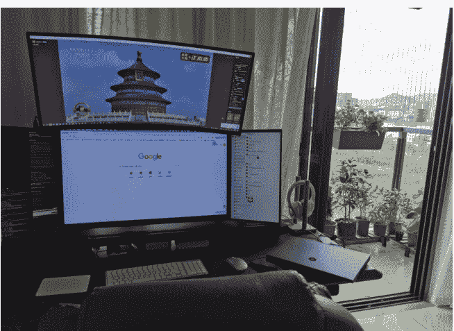

比如，我会使用多个屏幕来区分不同的信息流：一个专门用于监控AI编程的进度和代码运行，一个用于素材搜集和社群交流，主屏幕则专注于核心的视频剪辑和开发工作。这样的布局能让我在不同任务间无缝切换，最大化地利用每一分钟。

## 从0到1的摸索期
### A.初次试水：航海中的迷茫
三月份，我报名了YouTube航海，初次尝试达人秀视频。当时工具原始，流程繁琐，做出的视频效果挺一般的，只有一两千的播放。当时刚离职，交接工作比较忙，离职后去旅游，白天在外旅游，晚上回到酒店制作视频。只做了几个视频，没什么时间，所以航海结束后就没继续做视频了。

### B.关键转折：第一次尝到爆款的滋味
五月，加入深海圈后，我才算正式踏上了掘金之路。看了手册，选了天使狗狗的赛道，就是婴儿遇险，金毛狗跑过去救婴儿的视频。在当时，油管还没有打击这类视频。在做了十几个视频后果断转型，开始专注于更安全的“动物救援”领域。

5月27日，转机出现了。我制作的一个“狗狗拦停炸弹公交车”的视频，意外地爆了，获得了80万播放！这是我第一个突破10万播放的视频，那种激动的心情至今难忘。

接下来继续做动物救援视频，陆续也有一些视频能突破10万，累计播放已接近300万，达到了开通初级YPP的门槛。

### C.早期工作流：效率低下的“手工作坊”
虽然有了小爆款，但我的制作过程却异常痛苦。在还没有Google AI Studio的时期，我的工作流是这样的：

对标视频截图 → Midjourney反推提示词 → 智能体修改 → Midjourney生成图片 → 豆包生成视频提示词 → Runway生成视频

每一个环节都充满了不确定性，需要反复“抽卡”。做一个视频耗费数小时是家常便饭。这段经历虽然痛苦，但却让我对AI视频制作的每一个痛点都了如指掌，为我后来开发自己的工具埋下了最重要的伏笔。

## 转折点——引爆印度故事赛道
### A.蓄力与转型：从养号到精准出击
在主攻动物救援的同时，我用制作简单的“鱿鱼游戏四宫格”视频开了几个新号，虽然没爆，平均四万左右流量，但我把这当作“养号”，维持账号活跃度，等待机会。

事实证明，没有白费的努力。当你具备了做出10万+播放视频的能力后，你缺的就只是一个合适的赛道。

在6月初，我申请加入了深海圈风向标实战第4小组，李香君教练领队，在香君教练的指导下测试印度故事赛道。我之前“养”的账号立刻派上了用场，鱿鱼游戏四宫格直接转型印度故事赛道。

### 从6月14日开始发印度故事，头两天发的两个视频流量很低：
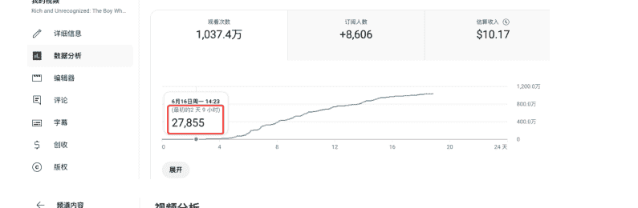
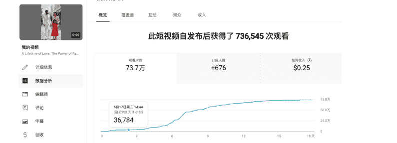

转型初期并不顺利。头两个视频播放量只有两三万，让我一度怀疑这个赛道的潜力。但到了第四天，奇迹发生了：第一个视频的播放量竟然悄悄爬到了20多万。我立刻追发了第三个视频，结果一飞冲天，单日破百万！

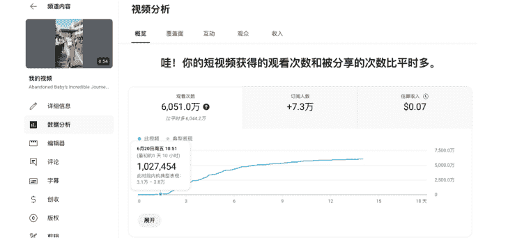

这惊人的流量增长，彻底点燃了我的信心。几天后就破了千万播放，直接可以申请YPP。

### B. 爆发之路：13 天拿下 YPP
6月14日开始发印度故事
6月20日流量开始启动
6月21日出现千万播放视频
6月26日早上申请YPP


最终，仅用13天时间，12个视频，这个账号的总播放量就达到了1.8亿。

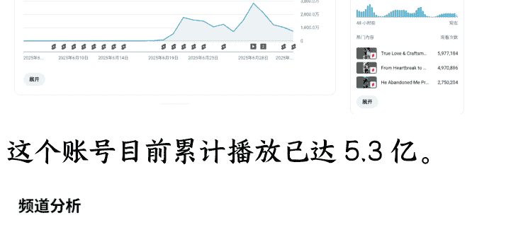

这个账号目前累计播放已达5.3亿。

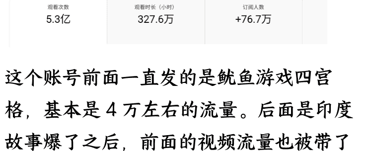

这个账号前面一直发的是鱿鱼游戏四宫格，基本是4万左右的流量。后面是印度故事爆了之后，前面的视频流量也被带了起来。

| 视频标题 | 发布日期 | 观看次数 |
| :--- | :--- | :--- |
| Abandoned Baby's Incredible Journey: From Rags to Riches... | 2025年8月19日 | 66,835,552 |
| A Lifetime of Love: The Power of Family | 2025年8月16日 | 738,258 |
| Rich and Unexpected: The Boy Who Turned Away His Par... | 2025年8月14日 | 15,344,650 |
| cute YoushengGuo Game! A11 #gaming #pubg... | 2025年8月15日 | 128,557 |
| cute YoushengGuo Game! A12 #gaming #pubg... | 2025年8月12日 | 72,519 |
| cute YoushengGuo Game! A13 #gaming #pubg... | 2025年8月11日 | 81,627 |
| cute YoushengGuo Game! A9 #gaming #pubg... | 2025年8月10日 | 77,712 |

### C.真实收益与 RPM 揭秘
赛道起飞时流量极猛，但由于YPP审核需要时间，白白“浪费”了2亿多的播放量。

通过YPP后的第一个视频，直接就3000万播放，但是被移除掉了，还给了个警告。（涉及遗弃婴儿），前面那个6000万的视频也是遗弃婴儿反而没事，可能是有创收的视频会严格很多。（所以有儿童的视频都得十分注意才行，我现在是不太敢做儿童类的，怕了。）

| 视频标题 | 状态 | 发布日期 |
| :--- | :--- | :--- |
| From Slum Slave to Scholar: One Girl's Journey of Ed... | 公开 | 2025年7月2日 |
| He Abandoned His Pregnant... | 公开 | 2025年7月1日 |
| Underwater Fantasy Epic: Red Tailed Mermaid Prince... | 公开 | 2025年6月29日 |
| True Love & Craftsmanship: From Humble Pottery to... | 公开 | 2025年6月29日 |
| Rich Mom Dumps Her Twin Babies, A Poor Janitor Rai... | 已移除 | 2025年6月27日 |

从6月27日开始有收入，截止8月底，两个月差不多2000美金。

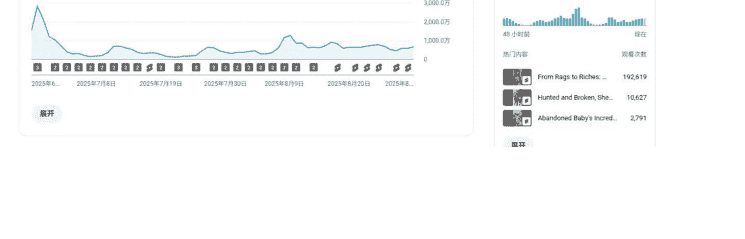

### 印度赛道的 RPM，显示的是 0.01

| 内容 | 时长 | 发布日期 | 估算收入 | 互动观看次数 | 每千次展示收入(RPM) |
| :--- | :--- | :--- | :--- | :--- | :--- |
| 合计 | | | $301.12 | 53,986,033 | $0.01 |
| From Heartbreak to HUNK: Indian Boy's INCREDIBLE Tr... | 0:54 | | $95.90 (31.9%) | 15,709,640 (29.1%) | $0.01 |
| True Love & Craftsmanship: From Humble Pottery to G... | 0:55 | | $61.80 (20.5%) | 9,624,801 (17.8%) | $0.01 |
| Rich and Unrecognized: The Boy Who Turned Away His... | 0:52 | | $10.17 (3.4%) | 1,763,432 (3.3%) | $0.01 |
| She Laughed at Him for Being SKINNY... So He Got His... | 0:55 | | $7.58 (2.5%) | 1,406,797 (2.6%) | $0.005 |
| He Abandoned Me Pregnant. 20 Years Later, He Return... | 0:55 | | $5.76 (1.9%) | 1,467,171 (2.7%) | $0.01 |
| Heartbreaking Moment: A Story of Loss and Reunion | 0:53 | ... | $3.08 (1.0%) | 497,080 (0.9%) | $0.01 |
| From Struggles to Splendor: A Mother's Transformatio... | 0:34 | | $2.31 (0.8%) | 486,346 (0.9%) | $0.005 |

### 我挑几个上千万流量的单个视频计算：

| 内容 | 估算收入 | 互动观看次数 | 每千次展示收入(RPM) |
| :--- | :--- | :--- | :--- |
| He Chased a Little Girl Who Stole Bread... Then He Called ... | $329.45 | 34,223,114 | $0.01 |

```
RPM = 329.45 / 34223.114 = 0.0096
```

| 内容 | 估算收入 | 互动观看次数 | 每千次展示收入(RPM) |
| :--- | :--- | :--- | :--- |
| From Heartbreak to HUNK: Indian Boy's INCREDIBLE Trans... | $245.34 | 30,348,557 | $0.01 |

```
RPM = 245.34 / 30348.557 = 0.008
```

| 内容 | 估算收入 | 互动观看次数 | 每千次展示收入(RPM) |
| :--- | :--- | :--- | :--- |
| They Laughed At Her Strawberry Car, So Her Poor Dad Buil... | $225.29 | 25,129,055 | $0.01 |

```
RPM = 225.29 / 25129.055 = 0.00896
```

大概就是0.009左右。

### 上百万流量的单个视频计算：

| 内容 | 估算收入 | 互动观看次数 | 每千次展示收入(RPM) |
| :--- | :--- | :--- | :--- |
| Mother Leaves Her Twins 😭 Raised by Grandma, Their St... | $55.37 | 2,785,012 | $0.02 |

```
RPM = 55.37 / 2785.012 = 0.0198
```

| 内容 | 估算收入 | 互动观看次数 | 每千次展示收入(RPM) |
| :--- | :--- | :--- | :--- |
| He Chased a Poor Grandma for Stealing... Then He Saw W... | $23.20 | 1,686,327 | $0.01 |

```
RPM = 23.2 / 1686.327 = 0.0137
```

| 内容 | 估算收入 | 互动观看次数 | 每千次展示收入(RPM) |
| :--- | :--- | :--- | :--- |
| Daddy's Little Joker! 😭 | $29.42 | 2,631,315 | $0.01 |

```
RPM = 29.42 / 2631.315 = 0.011
```

平均值是0.0148。

也就是说，流量上千万的，RPM是不足0.01的，千万以下的是0.01-0.02区间。

以上的印度故事测试结果，曾在深海圈做过直播分享。

结论：印度赛道流量巨大但RPM偏低，非常适合作为新号起飞、快速通过YPP的跳板。起飞后可以吃一波流量，建议吃完这波流量，再转赛道。

### D.迭代后的工作流：Google AI Studio 带来的效率革命
7月份这个阶段，工具升级了，有Google AI Studio这个神器，效率起飞。
- 工具：Google AI Studio + 豆包 + 即梦

#### a.步骤 1:用 aistudio.google.com 写分镜脚本
将视频和以下提示词扔进 ai studio:
- 1.分析这个视频，按分镜头提供图片生成和视频生成的提示词，提供中英双语，提示词尽量简洁，只描述关键信息，我使用flux和runway出图和视频，提示词不能太冗长和复杂
- 2.帮我再提炼一个文字版的脚本，中文，描述整个故事，要描述地足够清晰
- 3.前面的分镜给我一份针对图片生成的单纯的中文版
- 4.保持角色、服装和场景的视觉一致性，每个分镜都要描述服装。

得到分镜提示词：
> 分镜脚本、提示词和服装描述
> - 分镜1
>   - 中文图片：一位贫穷的印度母亲和她的小女儿，手牵手走在豪华商场的走廊里，两人都穿着破旧的服装，但脸上洋溢着幸福的笑容。中远景，温暖明亮的商场灯光。
>   - 中文视频：一位贫穷的印度母亲和她的小女儿，手牵手微笑着走过豪华商场的走廊，镜头跟随她们移动。
>   - 英文图片：A poor Indian mother and her young daughter, holding hands and walking in a luxury mall hallway, both in ragged clothes but smiling happily. Medium long shot, warm bright mall lighting.
>   - 英文视频：A poor Indian mother and her young daughter walk smiling through a luxury mall hallway, holding hands, camera tracking them.
>   - 服装描述：母亲穿着一件破旧褪色的绿色纱丽（sari），女儿穿着一件有破洞和污渍的灰色旧连衣裙。
> - 分镜2
>   - 中文图片：小女孩兴奋地指着橱窗里一件华丽的红色连衣裙，母亲微笑着看着她。中景，焦点在女孩和连衣裙上。
>   - 中文视频：小女孩停下脚步，兴奋地用手指着橱窗里的红色连衣裙，转向母亲。
>   - 英文图片：The little girl excitedly points at a gorgeous red dress in a shop window, her mother smiles watching her. Medium shot, focus on the girl and the dress.
>   - 英文视频：The little girl excitedly points at a gorgeous red dress in a shop window, turning to her mother.
>   - 服装描述：母亲穿着破旧的绿色纱丽，女儿穿着破旧的灰色连衣裙。橱窗里是一件华丽的红色金边连衣裙。
> - 分镜3
>   - 中文图片：母亲跪下来，打开一个空钱包给女儿看，脸上的笑容消失，变得悲伤和无奈。中景，低角度拍摄。
>   - 中文视频：母亲跪下来，慢慢打开一个空钱包，表情从微笑变为悲伤，展示给女儿看。
>   - 英文图片：The mother kneels down, opening an empty wallet to show her daughter, her smile fades into sadness and helplessness. Medium shot, low angle.
>   - 英文视频：The mother kneels down, slowly opens an empty wallet, hanging from smile to sadness, showing it to her daughter.
>   - 服装描述：母亲穿着破旧的绿色纱丽，女儿穿着破旧的灰色连衣裙。

#### b. 步骤 2:用豆包生成图片
将以下提示词+分镜提示词扔进豆包：
图片风格为「人像摄影」，比例「9:16」请你根据这个脚本和分镜帮我创作一套分镜图，一次性输出文字版脚本（中文），要保持场景和人物、服装的一致性：


得到图片。

#### c. 步骤 3:用即梦生成视频
用即梦的首尾帧，将所有图片两两串起来生成视频：## d.剪辑

将生成的视频，按顺序放到剪映中，调整视频速度，增加背景音乐，就可以导出发布了。

# 3.复盘与思考：关于赛道红利期的感悟

## A.抓住赛道红利，吃满一波收益

当你选好赛道，开始日更视频，油管会根据你的视频，给你匹配观众，精准定位到目标观众之后，你的流量会起飞。

就像我前面提到的，我当时第三个视频突破千万之后，后面这个视频是走到了 8400 万左右的。连接着后面发的视频播放量都是几百万起步，甚至有多个几千万的。

公众号懒人搜索，懒人专属群分享

| 日期↓ | 观看次数 | 评论数 | 赞和不喜欢的比率 |
|---|---|---|---|
| 2025年6月29日<br>发布日期 | 521,529 | 16 | 90.9%<br>7,286 人赞 |
| 2025年6月29日<br>发布日期 | 30,723,227 | 145 | 93.0%<br>414,408 人赞 |
| 2025年6月27日<br>发布日期 | 31,137,931 | 0 | 93.8%<br>378,562 人赞 |
| 2025年6月25日<br>发布日期 | 56,241,589 | 392 | 92.0%<br>801,613 人赞 |
| 2025年6月23日<br>发布日期 | 8,668,188 | 54 | 89.0%<br>97,840 人赞 |
| 2025年6月22日<br>发布日期 | 3,463,219 | 32 | 92.0%<br>46,919 人赞 |
| 2025年6月21日<br>发布日期 | 3,040,537 | 29 | 88.4%<br>32,946 人赞 |
| 2025年6月20日<br>发布日期 | 7,978,830 | 27 | 88.6%<br>64,269 人赞 |
| 2025年6月19日<br>发布日期 | 84,112,911 | 808 | 92.7%<br>1,146,108 人赞 |
| 2025年6月15日<br>发布日期 | 767,491 | 12 | 89.1%<br>9,089 人赞 |
| 2025年6月14日<br>发布日期 | 14,911,710 | 92 | 93.0%<br>162,544 人赞 |
| 2025年6月13日<br>发布日期 | 152,125 | 0 | 79.5%<br>621 人赞 |
| 2025年6月12日<br>发布日期 | 89,662 | 1 | 83.0%<br>307 人赞 |

这就是赛道红利期，我这波流量维持了三个月左右，到了9月初开始，流量直线下降，开始卡万播：

| 日期↓ | 观看次数 | 评论数 | 赞和不喜欢的比率 |
|---|---|---|---|
| 2025年10月17日<br>发布日期 | 41,501 | 0 | 88.2%<br>501 人赞 |
| 2025年10月13日<br>发布日期 | 1,689,364 | 5 | 83.4%<br>17,811 人赞 |
| 2025年10月12日<br>发布日期 | 28,907 | 1 | 92.7%<br>433 人赞 |
| 2025年10月9日<br>发布日期 | 100,445 | 3 | 88.0%<br>1,229 人赞 |
| 2025年10月9日<br>上传 | 3,271 | 0 | 93.0%<br>53 人赞 |
| 2025年10月3日<br>发布日期 | 16,378 | 2 | 87.9%<br>246 人赞 |
| 2025年9月29日<br>发布日期 | 19,474 | 1 | 85.5%<br>295 人赞 |
| 2025年9月27日<br>发布日期 | 23,438 | 2 | 83.6%<br>271 人赞 |
| 2025年9月24日<br>发布日期 | 20,290 | 3 | 87.6%<br>303 人赞 |
| 2025年9月23日<br>发布日期 | 12,812 | 2 | 87.9%<br>248 人赞 |
| 2025年9月22日<br>发布日期 | 88,662 | 1 | 83.7%<br>978 人赞 |
| 2025年9月19日<br>发布日期 | 17,618 | 1 | 88.8%<br>301 人赞 |
| 2025年9月11日<br>发布日期 | 540,249 | 7 | 84.9%<br>6,502 人赞 |

经过这波赛道红利期，我还发现，同一个赛道之下还要细分类型。

就是故事类赛道，可以有印度故事、KPOP故事，山海经故事，猫猫故事等。

同一个赛道，例如印度故事，也分类型，例如逆袭类、救援类、嘲笑类、反转类等。

像我之前的做法，就是找几个对标账号，看他们哪个视频上千万，就抄哪个。导致我的账号里面的视频，并没有一个统一的风格，在红利期结局后就没流量了。而且我看对标账号，他们的流量也少见有上千万的，有的对标停更了，有的从日更变成几天更一个视频，我抄无可抄。

我复盘后发现，我的打法是“抄爆款”，导致账号内容风格不统一。而那些能穿越周期的账号，是在一个垂直的故事类型上深耕。

例如我关注到一个账号，他的印度故事风格很统一，从6月底到现在11月份依然能有流量。我看他的大多数视频都是逆袭类，就是穷人变富，胖子变瘦之类的温馨、励志的故事。

这让我领悟到：赛道选对了，只是第一步。风格的统一，才是将“流量”转化为“留量”，实现持续运营的关键。

## B.工具升级

工具升级后，效率是提升了不少。但是日更两个主账号（动物救援+印度故事）还是很费劲的，所以开始想办法升级工具。

我做了两个改进：

### A.视频工具

视频工具，由免费薅即梦积分升级到PixVerse，买的会员一个月好像是360元。主要是我做的印度故事，当时的印度故事都是首尾帧，而 PixVerse 的首尾帧效果最好。

### B.提示词

提示词，经过我的修改，扔给 Google AI Studio 的提示词，生成的图片提示词，基本上能精准的出图。这段提示词我就不贴出来了，写得很长，不像群里大佬们分享的那么规范。我是用习惯自己写的，所以一直用的这套提示词。

# 4.终极痛点与解决方案

前面提到了，7 月份我测出印度赛道后，巨大的流量让我看到了机会：如果我能批量运营多个账号，是不是就可以批量产出 YPP 频道？

理论上是可以的，但是操作起来难度极大。尽管工作流和认知都在升级，但一个核心矛盾愈发尖锐：“手搓”的效率，已经严重跟不上我的想法。每天维持两个账号的日更已是极限，我脑中“批量运营”、“矩阵化放大”的想法根本无法实现。

当时我正愁“海外 AI 产品”项目该做什么。别人的需求我不懂，但自己的痛点再清楚不过了：我急需一个自动化工具，能让我高效、批量地生产印度故事视频。

需求就是最好的产品经理。于是，我决定：做一个 YouTube 视频提效网站！

说干就干，经过两个月的开发，我的网站在 8 月底诞生了。9 月份开始，我作为第一个用户，在实际使用中不断优化完善它，陆续增加了数据库、积分系统和支付系统等功能。

# 二、我的AI视频提效网站是如何工作的

以下是我的网站首页，网站首页最初是全英文的，为海外用户设计。但后来我发现，它的工作流更适合像圈友这样专业的AI视频创作者，所以我增加了双语支持。


## 1.网站的设计思路：自动化与可控性的平衡

先说思路，故事类的视频，如果是做成自动化，那么出来的质量必然很差。因为一个短视频有10-35个分镜，其中两个环节，文生图，图生视频。生成的图片和视频都不太可能一次就是完美符合你要求的，要么是提示词写的不对，要么提示词写得好，但需要抽卡。

所以我的核心思路是：生成视频过程必须是可控的。

因此，这个工具必须既能满足自动化批量生成的需求，又能让使用者灵活地修改提示词，快速替换不满意的图片和视频：

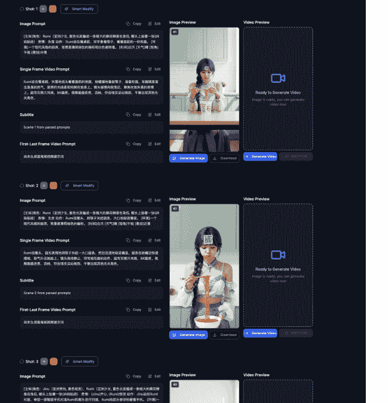

如图，你可以一键生成所有分镜，也可以针对任何一个分镜，精细地修改图片和视频的提示词，进行单独生成和替换。

## 2.四种灵活的提示词输入方式

生图和生视频的功能完成了，那么提示词是怎么输入的？

经过我不断地迭代，目前有四种方式：

### A.自动拆解视频

第一个方式很简单，直接输入 youtube 视频链接，一键生成项目（一个项目就是一个完整的 AI 视频故事，含所有分镜提示词）

操作方法：

在下图 youtube 链接的输入框内填写对标视频链接，直接点“一键自动分析”按键，即可自动拆解对标视频生成所有分镜提示词。

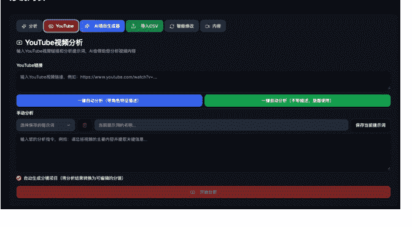

一键自动分析有两个选项：

- 1、“带角色特征描述”是我自己这几个月做印度故事总结的提示词，带服装描述，可以直接生图；
- 2、“不带描述，垫图使用”是用于垫图设计的提示词；

也可以保存使用自己的提示词，在手动分析下面的输入框输入提示词，保存后可以下次直接调用。


这种方式，得到的提示词是 1：1 复刻对标视频的，明显不能直接用。

这时，就需要用到我的另一个核心功能：智能修改

可以在这里输入修改情节，对故事进行改编脚本或者微创新。

例如，你可以将男性角色改为女性角色，也可以将动漫角色改为印度人（包含所有元素都可以改为印度相关的）。

就是一键可以智能修改所有的分镜提示词，而且会保持一致性。

### B.直接输入提示词

用老方法，Google AI Studio 去分析视频，做好的脚本，可以一次性复制输入。

图片提示词和视频提示词，只需要按数字序号排序，然后填写标题和分镜数量，点击“确定”直接生成项目。

如下图所示：

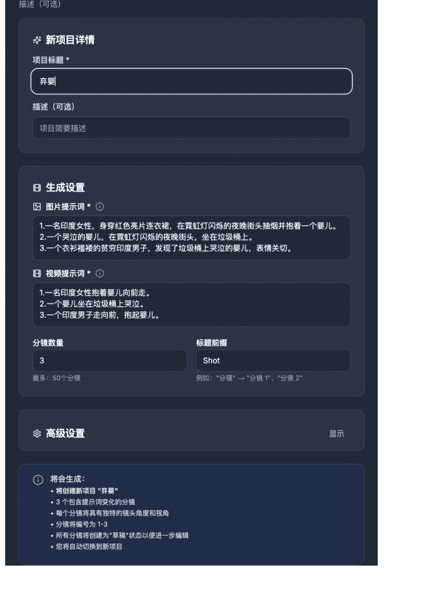

### C.直接导入 CSV 文件

Google AI Studio 去分析视频，改编脚本，生成保存用 CSV 文件。

格式很简单，第一列是图片提示词，第二列是视频提示词，一行对应一个分镜。

表格内容如下图所示：

| |A|B|
|---|---|---|
| |1.一名印度女性，身穿红色亮片连衣裙，在霓虹灯闪烁的夜晚街头抽烟并抱着一个婴儿。<br>2.一个哭泣的婴儿，在霓虹灯闪烁的夜晚街头，坐在垃圾桶上。<br>3.一个衣衫褴褛的贫穷印度男子，发现了垃圾桶上哭泣的婴儿，表情关切。|1.一名印度女性抱着婴儿向前走。<br>2.一个婴儿坐在垃圾桶上哭泣。<br>3.一个印度男子走向前，抱起婴儿。|

直接导入该 CSV 文件，即可生成项目。

### D.自动拆解故事

这个方法是用于自创故事的，将自己创作的完整故事填入 AI 故事分析下的输入框中，点击“开始分析”，AI 会根据故事情节自动拆出多个分镜，每个分镜会有对应的提示词。


## 3.核心提效功能介绍

接下来介绍一下，这个网站一些能够帮助提效的功能：

### A.角色管理器

前期我都是做印度故事，印度故事是不需要参考图的，后面开始尝试做 KPOP 故事，图片模型增加了 SORA， NANO BANANA 和即梦 V4。

也增加了参考图功能：

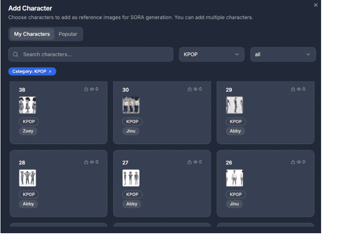

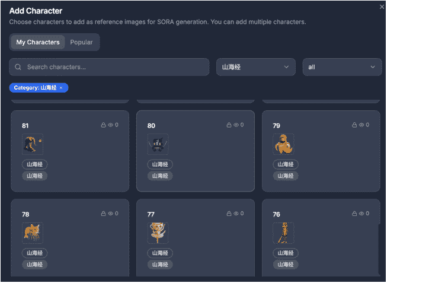

角色管理器，可以保存多个角色，目前我保存的角色有 100 多个，包括山海经、KPOP、印度人、美国人。

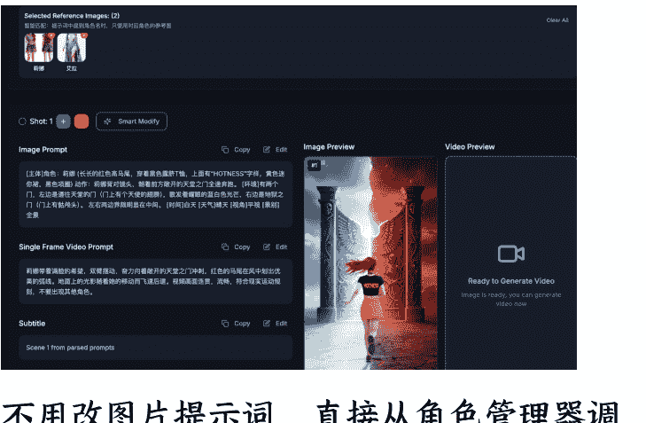

不用改图片提示词，直接从角色管理器调用参考图，将参考图改为图片提示词的角色名即可。

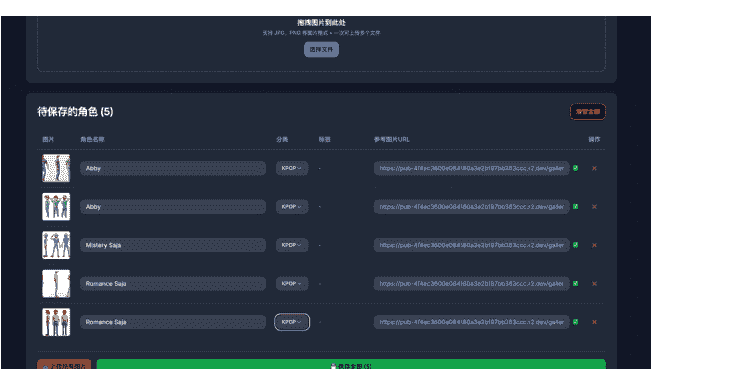

支持批量拖拽上传参考图，批量上传。用分类+标签的方式，方便管理和调用。

例如：KPOP+RUMI，就可以快速找到RUMI 的所有角色图（同一个角色是会有很多张参考图的，例如胖 RUMI，老人 RUMI，儿童 RUMI，还有不同服装、不同风格的 RUMI）。

### B.角色生成器

既然要提效，如果创造角色还要去开别的网站去生图，再下载，上传，是很浪费时间的。

于是，增加了角色生成器：

角色生成器

输入提示词，一键生成角色图片。支持正面图片/三视图设计参考。

生成设置

选择模式并输入提示词，点击开始生成

- 正面图片（默认）
- 三视图（左/正/右）

图片比例
1:1 (方图)

图片模型
DOUBAO-Y 3.0 默认

当前消耗：30积分

生成结果
右键另存为或点击下载


角色名称
RUM002

角色描述（可选）
需要描述，默认使用提示词

保存为角色

角色生成器

输入提示词，一键生成角色图片，支持正面图片或三视图作参考。

生成设置

选择模式并输入提示词，点击开始生成

提示词
20岁韩国美女，紫色长麻花辫，穿着黄色飞行员夹克，白色内搭，蓝色牛仔短裤，黑色靴子，真实风格，纯白色背景

复制最终提示词

正图图片（默认）
三视图（左/正/侧）

图片比例
9:16（手机竖屏）

图片模型
SEEDREAM-V4 SEEDREAM-V4 系列 16B评分

当前选项：150积分

开始生成

生成结果
右键另存为或点击下载


下载图片
角色名称
角色描述（可选）
如：安娜（现代职业女性）
简要描述，默认使用提示词
立即保存为角色

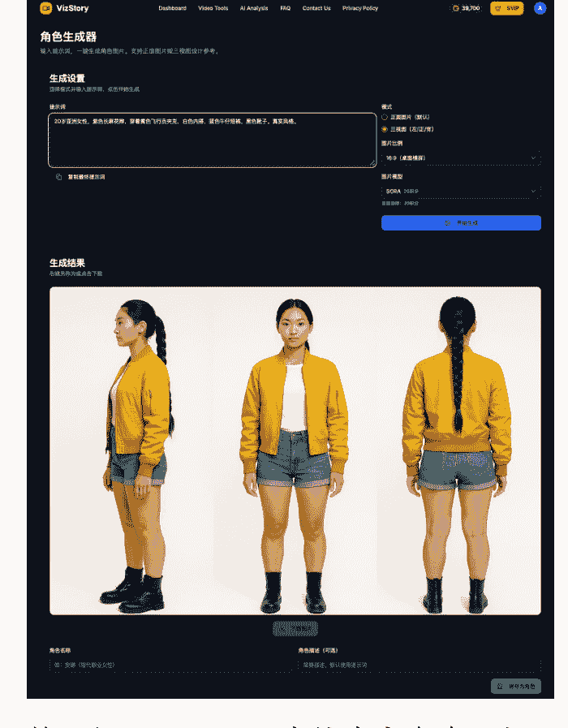

输入提示词，可以直接生成角色三视图，
然后点保存为角色，
会自动保存到角色管理器中。

### C.自动生成标题、简介、标签


视频完成后，要发布的时候，需要将故事内容放到 gemini 去生成标题、描述和标签。

如果是矩阵做 N 多个账号，这个步骤会浪费不少时间，而且会很乱。

所以，我增加了这个功能：AI 会根据你的项目内容，自动生成标题、简介和标签。

发布视频时，直接在“内容”这里复制即可，大大提高了效率。同时，每个项目都能与特定账号关联，方便管理，即使同时运营多个账号也不会混乱。

### D.小功能，水平翻转

例如生成图片，有时人物站位不对，特别是首尾帧，首帧 Rumi 在左边，尾帧 Rumi 又在右边。

之前的操作都是下载图片，用一些图片软件去做一个水平翻转，再去生视频，还挺麻烦的。

于是，我增加了一个小功能，水平翻转：


点击分镜的图片后，可以直接水平翻转图片。

做一个视频，每一个步骤只要少花十分钟，那么做 100 个视频就是节省了 1000 分钟。

所以，工作流中的每一个环节都值得优化，哪怕只是节省一分钟的操作，在规模化生产中也能累积成巨大的时间效益。

### E.其他功能及模型介绍

基本功能讲完，另外还有一些视频工具：例如 SUNO 生成音乐，主要用于故事MV，可以将故事写成歌词，再用这个歌词去生成音乐。

还有一些功能，在开发中，例如，生成的所有视频按顺序一键合并下载，省去下载十几二十个分镜视频后，还要拖到剪映去排序。还有自动生成语音的功能，方便做语言类的视频。

生图模型有：豆包，FLUX，Sora，Nano-Banana，即梦 4.0

视频模型有：WAN2.2，即梦，海螺02，豆包 seedance，Sora2

其中 Sora，Nano-Banana，即梦 4.0 这三个模型支持多张参考图。角色管理器调入角色一键垫图生成，方便快捷。

注：SORA 这个模型，花费了我大量的时间，一直因为这个模型不够稳定，迟迟不能公开我这个工具给大家使用。直到最近几天，总算是调好了，接了三个平台总共五个 API 调试，改代码改了好几天，总算是调出了三个能稳定出图的 SORA，目前测试只有提示词违规才会失败。

公众号懒人搜索，懒人专属群分享

### F.多样化的成本控制方案

“免费的往往是最贵的。”，我相信圈友们都懂这个道理。为了追求效率和质量，适当的付费是必要的。我的印度故事爆款视频，很多就是用付费的 PixVerse 做的，因为它的效果确实好。

但是，当我们要进行矩阵化、规模化生产时，成本控制就成了重中之重。为此，我的网站提供了一套灵活的成本解决方案，让你可以根据需求，在“极致性价比”和“高效出片”之间自由选择。

方案一：VIDU 插件 - 实现近乎零成本的批量生产

如果你的目标是最大化地降低视频生成成本，我开发的 VIDU 插件是你的不二之选：

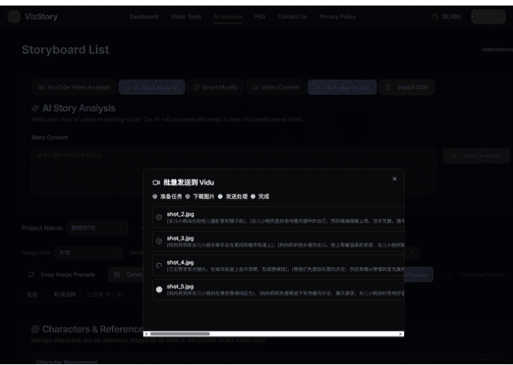

你可以利用它，一键将任务批量发送到VIDU，并通过其错峰功能实现免费视频生成。这意味着，一个 20 分镜的故事，你的核心成本只剩下图片生成的费用，最低可以控制在 1 元以内（如果是使用 0.02 元/张的 SORA 模型生图，只需要 0.4 元）。这对于需要大量铺账号的矩阵玩家来说，是极具吸引力的成本结构。

方案二：集成低价模型 - 兼顾效率与成本

如果你不想在多个平台间切换，追求更高效的一站式体验，网站内也集成了极具性价比的模型。例如，我最近上线的 SORA2 模型，生成一个带配音的视频片段只需要 6 分钱。虽然它在真人风格的参考图支持上有限制，但在许多场景下，它的价格和便利性甚至比使用 VIDU 更具优势。

> 注：网站的功能和模型库会持续更新。更重要的是，如果未来网站的用户规模足够大，我就可以凭借集采优势，去和 API 供应商谈判，为大家争取到更低的 API 价格，让我们的创作成本越来越低。

# 三、我的方法论：手搓精品 + 自动化矩阵

讲完网站的部分，接下来讲一下我批量做 7 个故事号的方法：

现在，我每天更新 7 个故事号（4 个印度，1 个美国，2 个 KPOP），整个过程只需要 2 小时左右。绝大部分时间，都花在打磨第一个“精品”视频上。

## 1.手搓精品：打造可复制的爆款“母版”

第一个视频，我会花 1-2 小时去精心打磨，流程如下：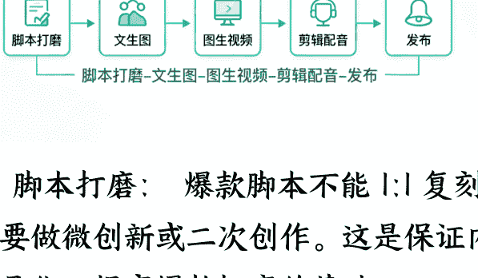

A. 脚本打磨：爆款脚本不能 1:1 复刻，至少要做微创新或二次创作。这是保证内容差异化、提高爆款概率的基础。

B. 视觉打磨（文生图 -> 图生视频）：自动化生成的提示词只是起点。我会根据经验，手动修改不满意的分镜提示词，直到图片和视频的视觉效果都达到最佳。这套经过反复打磨和验证的提示词，是你最宝贵的个人资产。很多人花几小时手搓，但这套核心资产只用了一次就束之高阁，非常可惜。

C. 听觉打磨（剪辑配音）：为视频精心配置音效，是提升观感的关键。这个配好音效的剪映工程文件，同样是可复用的宝贵资产。

## 2. 自动化矩阵：让爆款可规模化复制

### A. 循环利用
当你花几个小时，打造出一个近乎完美的“视频母版”（包含完美的提示词脚本和音效工程）后，真正的魔法才刚刚开始。

我所说的矩阵，并非简单地将同一个视频分发到不同账号。那是搬运，不是矩阵。矩阵的关键，在于“有差异化的批量生产”。

正如我前面讲的，脚本和配音是可以循环利用的，在你的打磨下，你的脚本提示词是近乎标准、完美的，完全可以在自动化的帮助下，一键出图、出视频。

也就是说第一个视频你按平时手搓花几个小时去打磨都 OK，后面只需要十几分钟就可以完成一个视频（这取决于你电脑性能和网速，还有你的操作，够快的话，几分钟就能出一个视频）。

### B. 具体操作
操作方法很简单，前面花时间磨出来的脚本和配音，直接复制使用。脚本直接复制出来，稍微改下元素，可以直接换风格，也可以套 IP，轻松做出 10 个视频。

你自己复刻自己的脚本，在没爆之前是没有人来复刻你的，只需要稍微改下元素或者换个 IP，爆的机率会大很多。

因此，我所说的矩阵化，并非简单地生成一堆完全相同的视频然后分发到不同账号——如果是这样，直接一键分发就可以了。关键在于实现‘有差异化的批量生产’。

如何批量生产出差异化的视频？

#### a. 替代元素，保留故事框架


这里一个 Project（项目）包含了一个完整视频的所有分镜内容，我习惯用比特浏览器的编号来区分不同账号的视频。这个毛毛虫的故事，应该很多人都看过，就是毛毛虫爬进嘴里，这个人就发狂吃家具，然后变巨人破坏城市。

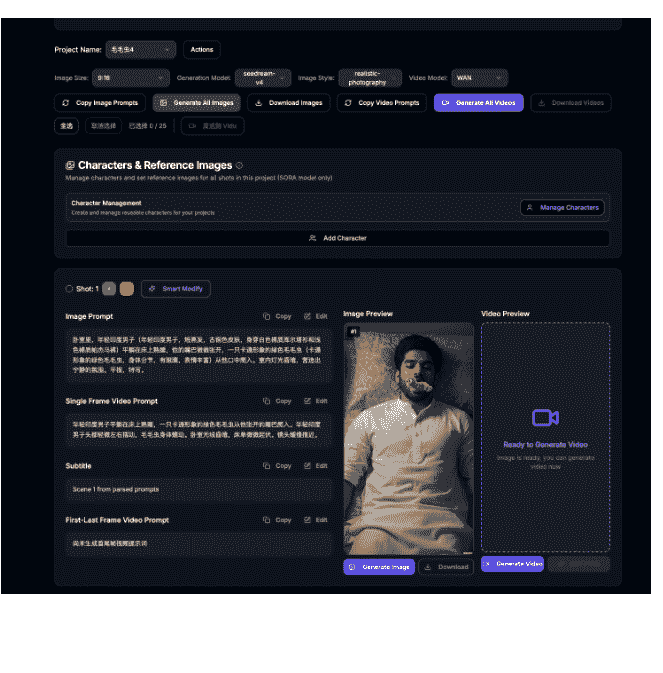

公众号懒人搜索，懒人专属群分享

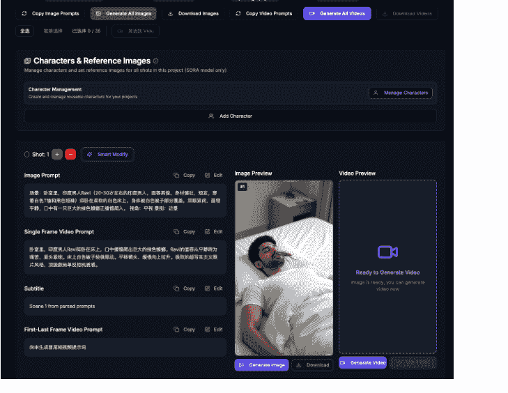

就是说，如果你第一个视频是印度故事，复制出来的脚本同样也想做印度故事，可以换元素，毛毛虫变蟑螂，可以换性别，男变女，服装必须得全部换掉的。

具体操作就是，直接复制第一个视频的整个 Project，然后智能修改来换元素。

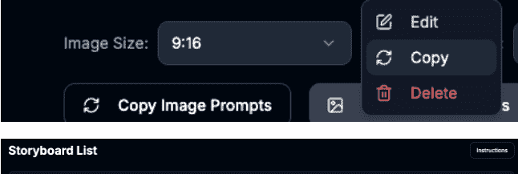

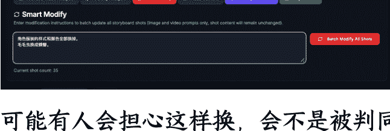

可能有人会担心这样换，会被判同质化、垃圾视频。目前我做了几个月这类视频，没被判过，至于有没有流量，请看以下截图：


28万
35,490,977
9月20日 2025年
Oh no! 😱 Watch what happens when baby Arya gets a hold of a razor? This hilarious and heartwarming short film follows Amara as she navigates the ups and downs of motherhood. From unexpected haircuts to surprising hair transformations, this video is full of laughs and love. ❤️ Featuring a talented cast, including a sweet baby, a caring nurse (Kamala), and a handsome doctor (Dr. Vikrant). What will Amara do? Find out now!
Keywords: Indian family, baby haircut, funny baby video, motherhood, hair transformation, short film, comedy, drama, indian culture, baby Arya, Amara, Kamala, Dr. Vikrant, Rohan, Priya, Rina, family life, parenting.
内容制作方式
加工或合成的内容
声音或影像经过大量编辑或以数字化方式生成。了解详情


970
87,439
9月22日 2025年
Join baby Arya on an incredible transformation! From a mix-up at the hospital with nurse Kamala, to a surprising bald moment, and finally a brand new 'do, this heartwarming tale follows Arya's journey of self-discovery with her loving mother, Amara.
👀 Witness Arya's adorable expressions as her hair color changes!
😱 Experience the shock of a sudden hair "gone wrong" moment!
❤️ Feel the warmth of Amara's love and support. 🙌 See the kind nurse Kamala try to fix the mix-up. 🤷‍♂️ Even Dr. Vikrant gets involved!
Ready for a heartwarming and hilarious story? Subscribe now and share this video with your friends!
内容制作方式
加工或合成的内容
声音或影像经过大量编辑或以数字化方式生成。了解详情


12万
14,747,015
9月22日 2025年
What happens when a baby's hair color is... unpredictable? Follow Amara and Arya as they navigate a series of hilarious and heartwarming hair-raising (or hair-removing!) situations. From accidental orange dye to a surprise bald patch, this family's life is anything but ordinary.
Get ready for:
💇‍♂️ Accidental hair transformations!
💇‍♀️ Baby's first haircut... gone wrong!
🧡 A whole lot of orange!
❤️ Family drama and heartfelt moments.
😂 Adorable baby giggles!
Don't forget to subscribe for more family fun and leave a comment letting us know your favorite part!
内容制作方式
加工或合成的内容
声音或影像经过大量编辑或以数字化方式生成。了解详情

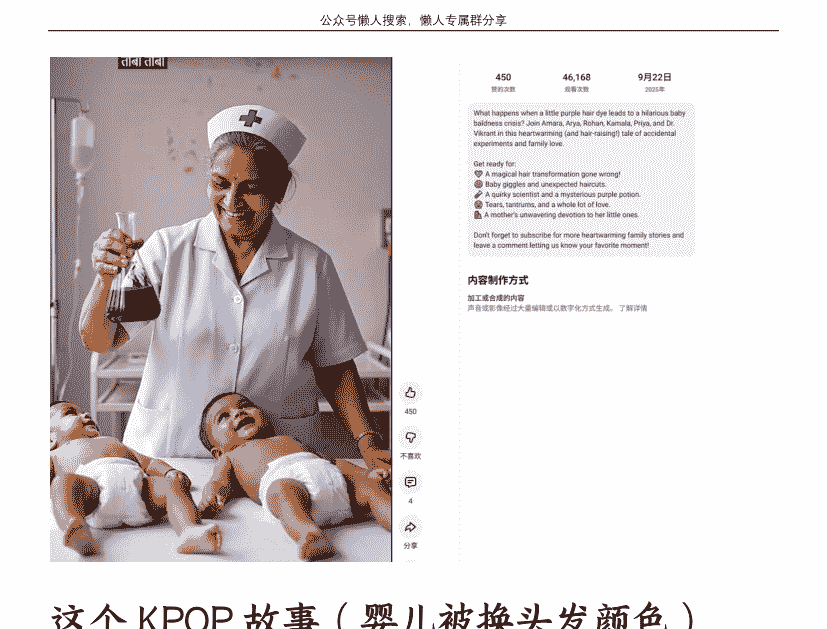

这个 KPOP 故事(婴儿被换头发颜色)，我保留了核心情节，将其改编成印度风格，并把赤橙黄绿青蓝紫七种颜色都做了一遍。

其中两个小号分别跑出了3500万和1470万的播放量，而其他号只有几万播放。

这个案例给了 我一个重要的启示：在脚本和视频质量都过硬的前提下，账号本身的权重和状态，是决定视频能否成为爆款的巨大变量。

如果我当初只把这个脚本在一个号上发布，那么它的成绩可能就永远停留在了几万播放。但通过矩阵策略，将同一个核心故事进行差异化演绎，分发到多个账号上，最终成功地捕捉到了流量，将一个“可能被埋没”的优质内容，打造成了千万播放的爆款。这正是矩阵化运营的核心价值所在。

#### b. 替换 IP，拓展内容边界
当然，稳妥点，换 IP 看起来同质化就没那么明显。

换 IP 也是一样的操作，直接复制第一个视频的整个 Project，然后更换参考图。

注意：印度故事一般不垫图，所以会有详细的角色描述，描述服装等。需要垫图的脚本，不需要这些描述。

如图所示：脚本中的主角 Ruby 和 Amethyst，可以直接调入 KPOP 角色。

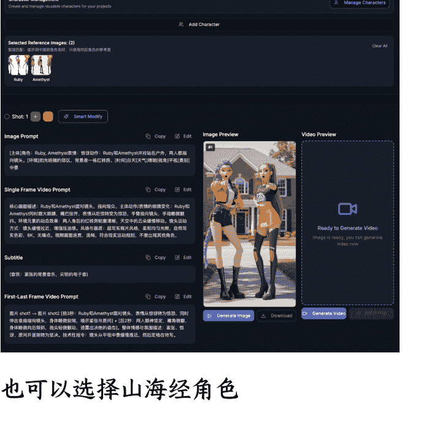

也可以选择山海经角色

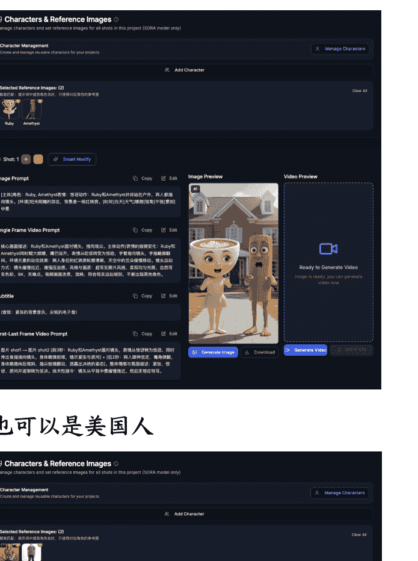

也可以是美国人

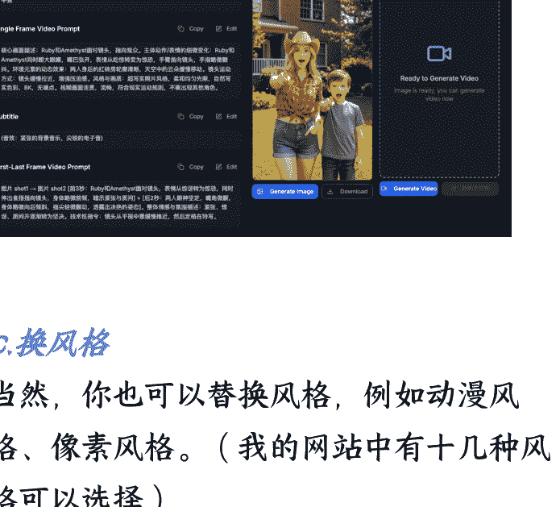

#### c. 换风格
当然，你也可以替换风格，例如动漫风格、像素风格。（我的网站中有十几种风格可以选择）

另外，同一套脚本，改下尺寸16:9，就可以直出长视频。做长视频也是很方便，所有短视频的脚本，直接复制一套就能做成长视频。

## 3. 视频演示
快速回顾这整个流程：

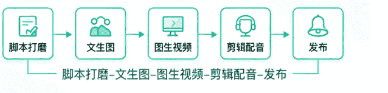

矩阵操作时间：

- 脚本打磨：操作耗时1分钟（直接复制第一个视频的整个项目，然后智能修改换元素或者换IP）
- 文生图：操作耗时1秒（即一键触发，后台自动执行。实际生成时间视模型而定，如果不用参考图，一般几秒钟出完，垫图用NANO也是十几秒，用SORA可能需要几分钟）
- 图生视频：操作耗时1秒（即一键触发，后台自动执行。实际生成时间视模型而定，如果是VIDU错峰生视频至少要等几分钟，有时更久，一般我上午先批量生成视频，腾出时间可以做别的事情，下午再去剪辑）
- 剪辑配音：操作耗时几分钟（配音也是复制的，换视频，换背景音乐，给视频加速等，几分钟搞定。）

也就是说，从制作到视频完成发布，最快几分钟就能完成一个视频。

口说无凭，我录了个视频演示操作，从分析视频生成脚本到生成视频也只花了几分钟便完成，如果是直接复制脚本，速度还会更快一些：
https://www.bilibili.com/video/BVIVoINBUEgg/?vd_source=4c59e68b59325af0351bc5515e7d4818#reply115467813392977

这个视频我详细讲了网站是怎么操作的，总共 14 分钟。视频我上传到了 B 站，请登录观看，否则会很模糊。

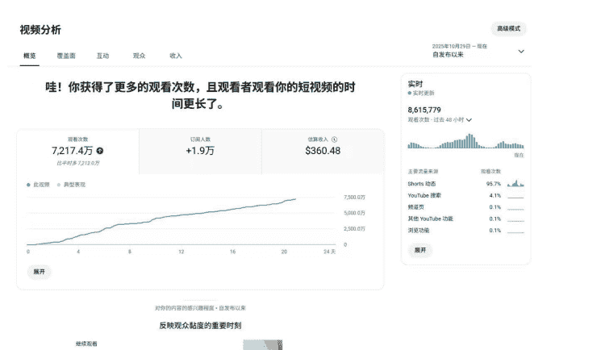

另外提一句，视频中提到的案例，扔水球的印度故事，录视频的时，它刚发布 2 天，播放量是 189 万，而现在已经跑到 7200 多万。这个爆款，正是我矩阵化策略的直接产物。它的‘母版’是一个 KPOP 故事，发布后仅有 14 万播放。而通过矩阵化、替换元素后，这条印度版视频却跑出了 7200 万的惊人流量。这再次证明了矩阵化的核心价值：不要轻易放弃一个好脚本，换个账号、换个风格，它就可能成为下一个爆款。

这个视频分镜少，只花了我几分钟便完成，成本1元人民币，收益360美元+，第20天了，流量曲线还在向上跑，最新48小时还能增加8百多万，这曲线可能有机会破亿播。

# 四、总结
正如深海圈总教练曹淦在 9 月 16 日风向标说的：

> 好形式+好脚本+较低同质化程度/较高原创度=爆款

那么怎么进一步放大收益？怎么把一个爆款变成 1000 个爆款？

其实很简单，1000 个爆款=1000/n 个好形式*n 个好脚本

- 地区风格：印度风、欧美风、日韩风
- 经典的球星：梅西 C 罗、库里詹姆斯
- 大热的 ip：山海经、kpop、星期三
- 随便乱编都有流量的动物形象：猫猫、狗狗、卡皮巴拉、猴子

在这个大的壳里还可以换画风、换角色、换 IP，这数量可不是做加法，是做乘法哦，形式做出来几十上百种都不为过。

而我的工具，正是为了完美匹配这个公式而生：

累积脚本：网站的项目管理功能，可以让你系统地保存和管理每一个打磨好的爆款脚本，形成你自己的核心资产库。

套风格，套IP：自动化的流程，可以让你轻松地将这些脚本批量套用到不同风格（印度风、欧美风、动漫风）和不同IP（山海经、KPOP、动物）上，实现爆款的乘法式增长。

以后出新的大热IP，可以第一时间套上脚本，秒出视频。

如果你具备了‘手搓’爆款的能力（这是基础），那么自动化工具就能帮你在这个基础后面加上无数个0。我相信，很多圈友已经具备了‘手搓’爆款的能力，而我的工具，就是为了补上那块‘规模化生产’的拼图。想要体验的可以找鱼丸链接我。

# 五、致谢
最后，我想诚挚地感谢这一路上帮助过我的平台与良师益友。

感谢生财有术，这里不仅是一个信息宝库，更是一个高质量的连接器，让我认识许多优秀的朋友与前辈。为了能与大家有更深入的交流，我最近也报名了深圳的联合办公，期待能与更多优秀的圈友共同努力，共同成长。

感谢总教练曹淦，曹教练对深海圈尽心尽责，每周风雨无阻的风向标，以及常常持续到深夜的作业点评——甚至在我都已熬不住睡着后，他仍在不知疲倦地输出干货。

感谢李香君教练，对我的帮助非常大，非常感谢香君教练的信任，让我加入他的小组，一起并肩作战。在他的实战小组中，我得以快速验证赛道、拿到正反馈赚到美金。

感谢刘小排，刘小排老师的课程设计对零基础学员极为友好，深入浅出，让我这样的技术小白也能快速入门，为后续的网站开发打下了坚实的基础。

感谢在线下活动中结识的舒未读、无常、果林、Perry，在我从零开始学习编程最艰难的阶段，他们给予了我无私的帮助和关键的指点。参加过几次线下活动，认识的圈友都很热情友好，也很乐意无私分享，很感动。生财圈友都很棒，越分享越幸运，建议大家多参加线下活动。

感谢柳一，成为我网站第一个用户，给予支持和鼓励。

感谢加绒，在网站的细节上，她给予了我许多宝贵的建议。

独行者快，众行者远。正是这些善意与支持，构成了我前进路上最坚实的后盾。再次感谢大家！

## 最后，安利小懒的付费群：
懒人专属群（介绍）


📖 懒人专属群持续更新中，已持续运营 6 年，整理超 3000 份各类精选付费文章 & 年费社群干货，全部开放下载。

本资料为付费群内部分享，仅供真实有需要的朋友查阅 🙇‍

懒人专属群更新记录：
```
https://hk57gvIx7u.feishu.cn/docx/H0kRdZbSboIBROxkaXtcuVE0nTg
```

懒人专属群更新记录（需梯子，备用）：
```
https://lazybook.fun/blog/record2
```