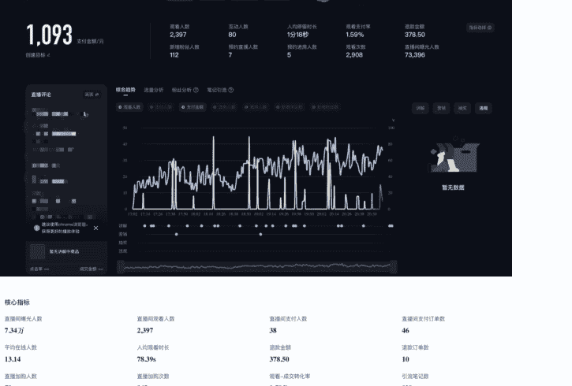
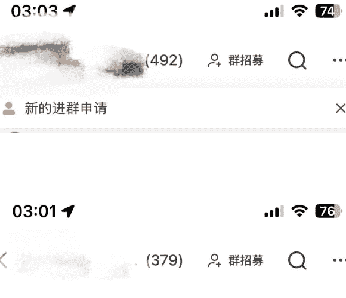
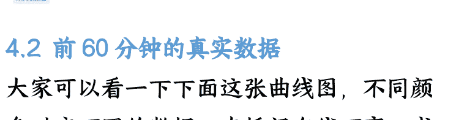
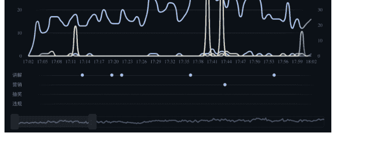
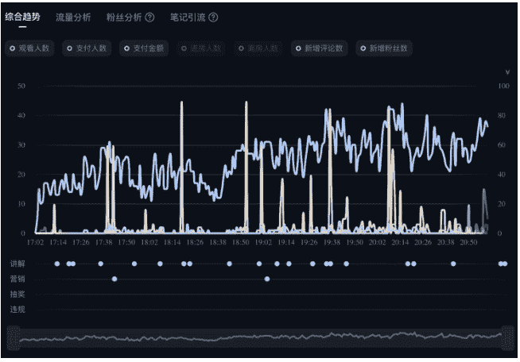
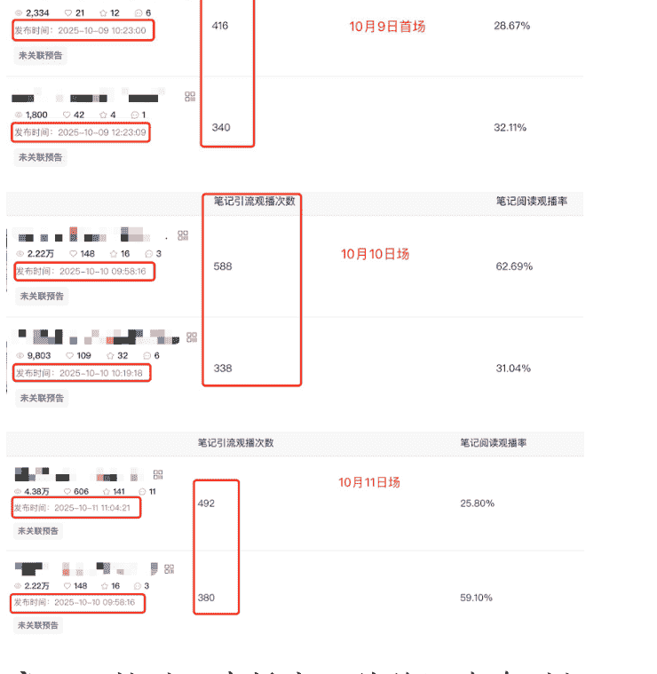
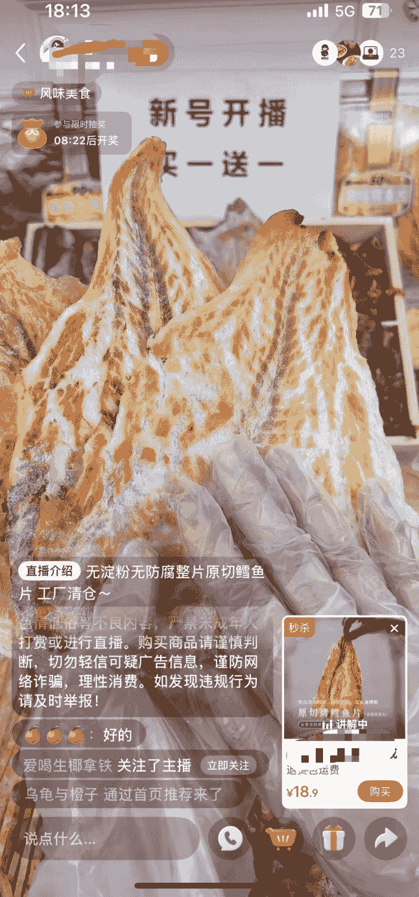
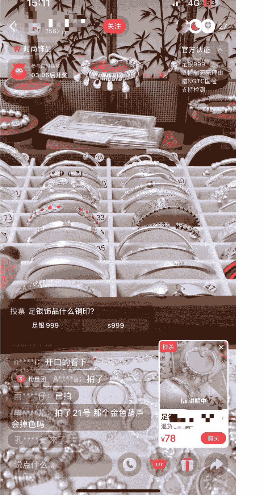
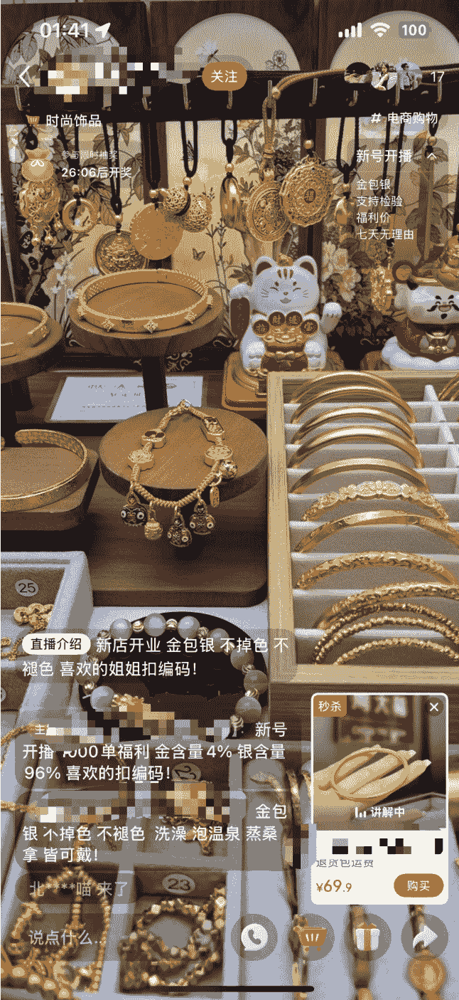
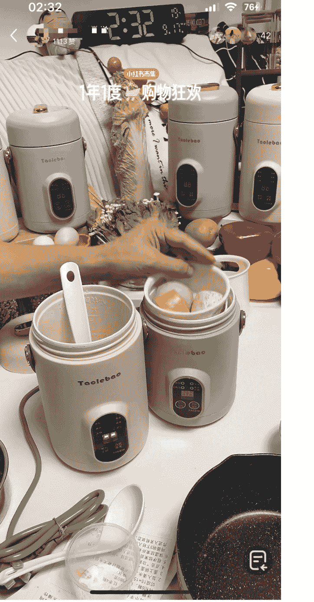

# 项目复盘：一个人做小红书手播直播间，70%利润 30天卖了 30w

公众号懒人搜索，懒人专属群分享

251125 副业 SC 精华

公众号懒人搜索，懒人专属群独享

懒人微信：lazyhelper


各位生财的圈友们好，我是曾在娱乐圈练习第七年半的申铭。

上个月，也就是10月9号，我在小红书新起了一个不露脸的自营直播间，到今天，这个新店基本就靠直播，以及直播带动的笔记出单，未投流，新号单店最近30天做了差不多30w销售额，整体毛利在60%-80%左右，不同产品会有一点差别。

| 经营数据概览 | 商家经营核心数据汇总 | 统计时间 | 近1日 |
| :--- | :--- | :--- | :--- |
| **核心数据指标** | 全部/自营/带货 | 2025-10-22~2025-11-20 | |
| 支付金额 | | | ¥377,919.72 |
| 较前30日 | | | +314.91% |
| 支付订单数 | | | 9,222 |
| 较前30日 | | | +185.95% |
| 支付买家数 | | | 7,040 |
| 较前30日 | | | +157.78% |
| 商品访客数 | | | 111,300 |
| 较前30日 | | | (数据缺失) |
| 笔记支付金额 | | | ¥8,695.82 |
| 较前30日 | | | -65.83% |
| 占比 | | | 2.30% |
| 直播支付金额 | | | ¥296,722.83 |
| 较前30日 | | | +607.85% |
| 占比 | | | 78.51% |

这篇帖子想跟大家把这项目从起号前的蓄水、10月9日首播，一直到现在稳定出单的整个过程，按时间线拆开，把我当时的完整思路和复盘和思考，都尽量讲清楚，分享给大家。

## 一、背景

### 1.1 项目数据

先给大家看一下这个号的数据，10月9日是这个号的首播场。主要是卖的护肤和彩妆，混着一起卖的，后面的时候就是以彩妆和工具为主了，这个在后面会具体讲。直播间的形式是单人手播，整个画面里只有手+货架+产品摆在货架上+画外音。然后下面是首场直播的数据截图。首播数据：场观2397、下单38人、GMV 1092.58、峰值在线44人、封面点击率3.22%，作为首播数据除了封面点击没达到我的预期，其他基本上都还不错。



| 核心指标 | 数值 |
| :--- | :--- |
| 直播间曝光人数 | 7.34万 |
| 直播间观看人数 | 2,397 |
| 直播间支付人数 | 38 |
| 直播间支付订单数 | 46 |
| 平均在线人数 | 13.14 |
| 人均观看时长 | 78.39s |
| 退款金额 | 378.50 |
| 退款订单数 | 10 |
| 直播加购人数 | 59 |
| 直播加购次数 | 162 |
| 观看-成交转化率 | 1.59% |
| 引流笔记数 | 110 |
| 封面曝光次数 | 18,893 |
| 封面点击率 | 3.22% |

然后，在起号过程中，我做了一些调整，不管是话术、产品以及时长等等都有优化。到现在，最近30天的GMV接近30万，现在每天基本稳定在5位数了。就是退货率有点高，但基本上当场退的比较多，这个已经在同步优化了。


| 开播时间 | 观看次数 | 支付金额 | 支付件数 |
| :--- | :--- | :--- | :--- |
| 开播时间: 2025-11-21 10:00:07 结束时间: 2025-11-22 01:18:39 时长: 15小时18分32秒 | 28,243 | 23,892.83 | 735 |
| 开播时间: 2025-11-16 10:08:21 结束时间: 2025-11-16 20:01:21 时长: 9小时53分0秒 | 19,414 | 23,081.02 | 552 |
| 开播时间: 2025-11-17 10:00:09 结束时间: 2025-11-17 20:01:30 时长: 10小时1分21秒 | 14,657 | 19,267.70 | 417 |
| 开播时间: 2025-11-15 09:59:27 结束时间: 2025-11-15 20:02:56 时长: 10小时3分29秒 | 18,286 | 18,171.90 | 459 |
| 开播时间: 2025-11-19 10:01:10 结束时间: 2025-11-19 20:00:57 时长: 9小时59分47秒 | 11,959 | 12,529.50 | 364 |

### 1.2 为什么要做彩妆直播？

因为之前跟这个类似的产品有过两次亲密接触，一个是私护私密产品，另一个是 diy 彩妆。去年和前年的时候在小红书做的。私护私密产品，最大的特点就是解决用户痛点，利润高，成本不到 5 块的品能卖到 80 多；diy 彩妆，就是找合适的彩妆品，给上面加装饰，因为纯卖彩妆没竞争力、客单价低，但是好看的、便捷的就不好说了，而且你的品还是“独家”的。

因为有做这两个类型的产品，所以又想回来试试，没想到效果还行。然后彩妆本身也是一个刚需、高频、复购很强的品，并且还很容易在直播间展示，把供应链找好，就是去看怎么搞流量了。

其实，这个选品选赛道的逻辑主要是遵从“垂直 × 场景 × 痛点 × 可演示”，我们现在自营的几个直播间选品都是按照这个来的。因为好起号，卖点展示的直观，而且垂直赛道真的很香。

但是彩妆比较难的就是，它需要信任感，用户想要上脸展示看效果，还有各种肤质问题，其实更应该露脸的。但我最后还是选了不露脸，因为公司现在确实没啥空闲的同事可用。而且为了快速看到大收益，不把项目绑死在一个人的脸上，会更方便复制。以及说，招人更方便，主播上播的压力会小一些，她们就不会恐镜头了。

购物车链接里是40多个品，直播间只有30多个，单件客单20-150。这个很重要哈，说这么细的目的是，我这些产品价格带的设计，是为了应对小红书直播推流，这些品也是为了起号和稳号期间，去刷成交数和订单密度的。我们主要卖的品也就三五款，交叉去讲，不然主播在直播间没啥意思。

这篇分享的是多品直播间的，这个月如果时间来得及，我会再给大家分享我们另一个，也是近期的单品直播间的起号方法。而且，我们这几个自营直播间，都还没有投流，直播间纯自然流还行。

## 二、直播前几个月——日更笔记+群聊蓄水

### 2.1 日更笔记蓄水

这个号比较特殊，是我唯一一个蓄水蓄很久的一个号，差不多有一个多月。

啥叫蓄水？就是去做强种草的笔记，来给直播预约和小红书群聊去引流、做曝光，方便在我们首场开播的时候有一个很好的流量。大部分情况下，其实做一周左右的蓄水就够了，如果品和场景还行也可以不蓄水。因为这个号主播一直没找到，也是被动做了这么久。

笔记的节奏我们是一天至少2条强种草的笔记，我们内容方向主要是5类：知识类、解决痛点类、反馈/对比、合集类、价格+其他前面的。

知识类的种草效果可能不是那么好，但是数据好，所以很容易冷启动，在知识类内容里夹杂着一些自己产品的引入、举例子，这种效果会比较好，新号搞点知识类的也容易起号；

解决痛点类的笔记，种草效果非常明显，特别是在开播前发的新的笔记，一条笔记可以给直播间引流百人、甚至千人；

| 笔记信息 | 关联商品信息 | 笔记阅读数 | 引流观播次数 |
| :--- | :--- | :--- | :--- |
| 好美啊! 笔记ID:6916b2e0... | - | 7,757 | 1,609 |
| 2 笔记ID:69147... | - | 5,476 | 1,031 |
| ...笔记ID:690a9b5... | - | 3,884 | 589 |

反馈/对比类的笔记，引流效果也非常好，而且这种笔记下单的转化率会更高；

合集类笔记，大家对信息密度高的笔记或者是产品密集度高的笔记非常喜欢，因为总想在里面找到自已想要的，而且内容丰富多彩，大家下意识会去收藏点赞，笔记的平均停留时间做的也比较好；

价格+其他，这个指的是主题是前面四种的主题，但是会加上价格的标签。比如说，解决痛点类的笔记是可以“6 大好用的遮瑕粉底”，然后价格加上就是“价格不到 30 的 6 款好用遮瑕粉底”。因为用户想要解决问题，而且大部分用户也想要划算、福利，特别是在当下的环境下，这两种结合效果是 1+1>2 的。但这个比较适合客单价不高，或者是大家原本对这类产品（不一定是我们家产品）的价格认知是一个比较大的高度，但是我们能给到的是比它认知价格低的，或者是用量取胜，某个低金额买来一大堆。

起号蓄水期间，可以在笔记结尾的文案，引导大家进直播间或者是点直播预约。

### 2.2 要不要挂商品链接

大部分情况下，我们不挂商品链接。因为本身是要直播转化，只要笔记流量大，把它引入直播间成交就行。包括有人在评论区问的时候，也是尽量引导进群或者预约直播。

有些比较特殊的单品，我们会在评论区给用户发蓝链，激活一下店铺。这种情况下会流失一些下单，但是没有关系，你直播间流量起来，卖的会更好，不差笔记出这么一单。但如果说，真的真的很多人问，笔记数据还可以，可以编辑笔记把商品卡加进来，然后在评论区回复用户，说在笔记左下角拍。这样有自然动销的商品笔记,在接下来还会继续推流,就是会慢一点。

大部分情况下,我们不会去在发的时候直接挂车,偶尔才在评论区挂蓝链。蓄水这段时间,笔记也陆续出了一些单。

### 2.3 一定一定要建群

这个号快速起号最主要的操作就是蓄水久 + 创建群,基本上是发第一条笔记的时候就开始挂直播预约和群聊,因为一开始也不确定具体开播时间,直播预约就直接挂的预约下一场。群聊有几个点要重点做的:

**开号第一件事建群**
一上来就建群的效果肯定是最好的,因为第一条笔记就能发布关联群聊,一旦笔记爆了,目标用户就会选择进群。群这里也有两个隐藏的内容,首先,笔记关联群聊不会影响流量;其次,小红书千帆后台的【群运营】会因为我们关联群聊了,给我们的笔记做流量曝光奖励,需要我们每周自己领取,对于权重低的新号来说,这个流量很有用。

**拉群方式**
可以在评论区回复群聊链接;
遇到对我们笔记点赞的人可以私信或者关注她,问要不要进群,然后给他说进群有福利,或者是承诺给她某具体福利;
笔记内容里做引导,如果是图文就是在正文的结尾或者是图片的最后一张图做引导,视频笔记则是在结尾口播引导;

**进群门槛**
起号期间、账号蓄水期间，不要设置进群门槛，但是需要设置需要审核才能进群。而且在有人申请进群之后，也不要第一时间通过，最好是在你开播前的两三天通过。

这里解释一下，小红书的私域也就是群聊，是目前几个平台（除了微信）里还能稍微运营的一个地方，所以大家也会去经常看群、跟群互动等等，所以这不是建了群之后就成为死群，除非你不在里面发东西。

为什么要在开播前两三天再通过？因为不是所有人都会进行群运营，就比如我，不擅长私域运营、不擅长群运营。那如果提前让人家通过进群之后，她发现群里好像什么东西都没有（没内容、没互动、没福利、没氛围等等），那她进群之后也会退群，那我们直播间就可能少了一笔订单。

**建群的目的**
群就相当于是我们养了一批精准的鱼塘用户，而且是非常合规的那种。在抖音有鱼塘起号的方法，小红书也很适合，但是自己养号很容易被关联，导致下单的人不精准。所以建群的目的就是，给我们起号直播蓄水能够消费的真实用户。而且，小红书官方也在推笔直群联动，这个效果是真的非常好。

我们自己也会给群里拉大概5个人左右的自己人（鱼塘号），自己人进群不要关注开播的账号，主要负责在群内带动氛围，和在开播时在直播间内下单，给直播间制造数据。鱼塘号日常都是独立手机和独立网络运营的。但是，如果之前没做过鱼塘起号的朋友，我不建议养鱼塘，就只邀请小助理进群活跃气氛就行，暂时不用去直播间下单。

群标题和引导进群的方式，都设置钩子，也就是用户看到之后就知道她进群能够获得啥福利，我们常用的就是提前购、赠品、5元无门槛优惠券。有个别客单价比较高的品，我会设置比较大额的券，但是是等大家进群之后，在开播前集中发那种。



### 2.4 群内做了哪些小动作
- 分享一些化妆或者护肤的小知识、补充我笔记宣传产品没有讲到的地方（折扣、成分等）；
- 群内抽奖送礼物；
- 预告直播间的福利；
- 群内发直播间的大额优惠券，需要在直播间才能使用；

偶尔预告直播，但是在开播前3天基本是高频预告；整体来说，没有疯狂的推销，但也保持存在感。

### 2.5 是要长蓄水还是快速蓄水

我这个号确实特殊了，蓄水时间比较久，走的是长蓄水的路线，因为当时不着急起号。但是，不强制长蓄水，从我们实操的角度讲，只是让起号能更稳一点。

如果说，很着急起号的话，其实用5-7天，甚至是更短的时间去做蓄水也是OK的，群聊创建了，就拉自己几个小号进去就行，包括说想很快速的去验证选的品是不是适合。但是，如果说，你确定这个品能爆，而且供应链也比较稳定，不着急回款，且想长期做这个店，可以选择长蓄水。

## 四、10月9日首播

### 4.1 开播前一天/当天的准备

**第一场的货盘结构**
主推的是几款护肤品和美妆品，后半场根据实时的点击数据和评论区的关键词，就把美妆变成主推品了，这个和我们当场引流的笔记都是美妆相关，美妆的笔记就是非常好展示产品的卖点，颜色、敏感否等等，展示的很直观。

因为毕竟是第一场，我们就没想过数据会好到哪儿，太多号第一场数据的场观都没过百。但因为这个蓄水比较久，也在群内激活了群聊，感觉应该能有一些，所以第一场的能卖一千多基本是在预期内。

小红书直播平台倡导就是 3h 起，所以我们计划的就是起号场就三个小时左右，后续再陆续的做时间叠加。

**准备 5 张直播封面图**
我们提前准备了 5 张的直播封面图，5 张是一个习惯，因为不确定某张封面图是否能在这场直播跑出一个很好的点击率，所以必须要多准备几张，封面点击率低的时候随时换。一般合格的封面点击率是 4.0% 左右，所以我们一旦低于 3.5% 就会立马换，换了之后观察 10-15 分钟，看新封面图的点击率。

我们的封面主要有两个渠道的来源，一个是我们数据高的笔记，看那些高数据笔记的封面点击率哪个会比较高，就用哪个；另一个是，在小红书搜索产品/痛点关键词，搜笔记，按照点赞排序，把那些低粉爆款的笔记封面直接拿过来（如果粉丝数是几十万，但是它笔记点赞大几万，这种也可以直接把封面拿过来），或者是 1:1 模仿它拍和写文案。这个第二种的封面基本是拿一个爆一个，但是画面里的产品最好换成我们自己的，不然用户进来之后，发现直播间内没有封面同款，那她就离开了。

**群内运营**
开播前一天和开播前1-2h的时候，在群里提前说我们要几点开播、大家可以用的优惠券可以啥时候用，以及我们会上哪些福利，就算没领到券也能用。

**当天预热笔记**
差不多在开播前6h，发了两条笔记，来预热这场直播，未挂车、未挂预告。一条是引导说下午开播，一条是产品强种草。当天预热笔记引流观播次数是700多次，效果非常好。如果没有这个数据，第一场挂车就真的废了。



### 4.2 前 60 分钟的真实数据

大家可以看一下下面这张曲线图，不同颜色对应不同的数据。直播间在线不高、成交更是惨、购物车根本不动。前30分钟的那几个评论和成交，还是群里人做的数据。



这个账号的笔记流量其实不算差，而且我们在开场30分的时候，就发现笔记进人也还行，但是大家就是不转化，开局爆冷。我当时的心态其实有点崩，迷茫了，我虽然知道大家买彩妆、护肤其实更会看品牌，但我们这种无名的很难制造信任度，主要还是新号。我当时还在想，是不是不露脸就会很吃亏？

### 4.3 基于实时数据调整

直播间是动态的，这也是我在做垂类直播还要选很多品的原因，就算是主推的不出单，我还有很多品，只要能找到数据还行的品，我就当作新号场主推款，这种至少会有停留和商品点击的数据。

具体调整：

根据商品点击率/加购次数/引流笔记，数据好的品，优先在直播间讲，优先在直播间展示，重点过这些品；

群内的鱼塘小号，在直播间下一单。这里补充一下，下单号尽量是没有关注我们开播号的，而且还需要从发现页通过直播封面进来，如果实在找不到直播封面，通过发现页笔记进来也行。因为鱼塘小号在群里，小号登录小红书后查看【消息】能看到群显示群主正在直播。看到之后先进群，通过群进到直播间，大概看几秒，然后立马进购物车，刷商品卡，随便点击两个后面的商品卡仔细看，然后选择一个加购即可。随即退出直播间，来发现页刷新，先正常浏览笔记，同时再找我们开播号的直播间，看到直播封面点进来就行。进入直播间后，看正在讲解的商品，然后跟主播互动，接下来去下单。最后，在购物车里再看几个链接，点个关注就可以离开了。

发无门槛优惠券，上面那张截图的营销的那个点，是发了一张优惠券。因为看到曲线往上走，开始进人了，这个时候发券会让大家看到，然后部分人会领券，她领券就跟直播间产生关联了，后续也会有机会转化。关于发券的问题，我一般建议几个点，直播间疯狂进人的时候、或者是直播间在线稳定但是持续不出单的时候，这几个时间发券会有促进效果。发券是自己发的，因为本身停留不太好，没多少人，发一张券不影响别人的停留，但是如果你是两个人的话，有一个人配合你看数据，她在后台操作，你在前面播，效果会更好，但是这个结果不耽误。

增加福利品，选了几款点击率高，但是客单价没那么高的品做福利品，按照我们进价想给大家漏几单。一般这种情况做的时候，如果直播间有流速有在线，我建议是先问大家，做福利的这款想要哪个，abc 让大家去在评论区选，这样显得我们很真诚。而且，大家为了福利，肯定会选的，而且我们产品比较特殊，他们还会问一些产品相关的问题，所以是能拉起来一些互动的。

做了前面的几点操作之后，数据是开始有变化了，戳上图。开始有成交，但是不多。弹幕也开始有了，人也愿意多停留了一下。数据明显，但是整体没有把当下时间流速拉太大。不过这个反馈是正向的，说明是有效果的，可以继续去做。因为账号本身成交少，直播间没能推流给精准人群正常的，只要拉的成交和停留够多，后续肯定会推更多精准的人进来，这个等待时间还是要做的。在这样持续的动态调整下，直播间流速曲线一点点飙升，成交也陆续增加了。



### 4.4 首播结果复盘

数据：场观 2397、下单 38、人均客单不算高、GMV 1092.58、峰值在线 44，播了整整 4 小时（后面曲线升了，数据也还行，就又多拉了一个小时）。

本来当时两个期待，如果这第一场没有数据，我也接受的，但是有数据就好好承接一下。我这场其实主要是做几个关键的事，因为平台第一次看到这个号在小红书开播，她是会试探我们直播间的，如果首场有数据，那最好做点稳定成交，让平台觉得，我们能稳定成交，还不错，那后面流量就更不错了。提前做了群+笔记的蓄水，给直播间做了保底流量，而且保底流量进来的人停留意愿也不错。

这个数据反馈告诉我下一场还是可以继续这样做的，我们之前别的账号直播起号逻辑也是这样，看到别的数据差，就努力的拉一下数据，拉一下多少都会有反馈，只是数据是动态的，要看动态数据看看到底是拉互动，还是拉成交，还是拉啥。

### 4.5 首场确认点

第一场不要指望赚钱，要指望喂数据给平台看。

我们自己操盘在小红书直播 0-1 的号，有近百个，如果加上一些服务的客户、学员的号那就更多了。第一场以及前几场的操作，都是拿比较好的直播间数据反馈给平台，让平台觉得我们直播间有能力承接平台的流量。数据反馈好的话，那平台后续会给我们更多的流量来试探我们，所以数据也会越来越好。但是如果说，不能把数据做好，那平台就会觉得，流量给到我们就浪费了、没有价值，那后续流量就给少了。

不露脸直播可以跑，只是稍微在起号场辛苦一点点。

我们这两年为了降本增效，陆续起了一些手播不露脸直播间。而且愈发的发现，小红书手播效果会比其他平台都会更好转化，只要品选对，品符合“垂直人群 x 高频场景 x 核心痛点 x 可演示性”，基本上就都没啥问题。特别是这个号是我蓄水比较久的一个号，在起号的时候，旁边放着电脑屏幕实时看数据，随时在掉人/进人/少互动等等时候，去设计一些东西就行了，比如说券（券可以是空券）、调整过品顺序、话术节奏，保持好状态，稳稳播就行。

直播间冷开是正常的，怕的是开场冷、中途啥动作都不做。

也是上面一点提到的，看数据要做点啥。因为直播间是实时的、动态的，如果要快速起或者获得高收益，看到数据反馈，就要去做这些动作。然后刚刚说的券、过品顺序、话术节奏等等，这些都可以在开播前准备好，甚至是假设直播间为了成交，在万不得已的时候也可以做返现或者是赠品，这个起号就 3-7 场的事儿，所以成本也不会太大。

## 五、从第 2 场到第 19 场

其实我们直播间本身没啥爆款，就是哪条笔记本场引流人多，哪个品就在本场的成交会比较好。那我也没有做什么快速的拉高 gmv 的操作，因为知道这个品很难，于是就慢慢的温水煮青蛙，每一场慢慢的提。下面是我把单日 gmv 稳定 5 位数的操作步骤。

### 5.1 拆货盘角色

我把这个直播间的品分成了几类：

- 一种是利润品，就是客单价稍微高一点的套装或者是组合，它成交一单，gmv 涨的就快，也是撑 gmv 数据的；
- 一种是停留品，常规叫法可能是爆款品，但是又不太是爆款，这个品就是来拉停留的，一讲它，停留就好，不需要做任何动作，用户刷进来之后，就愿意看，我们这个号的直播间的话这款品的话，主要是一些质地不错、卖点的展示效果好、用户可能会有体验感的一些品，主要是视觉效果好，所以让主播在讲的时候也会稍微讲的慢一点；
- 一种是成交密度品，也就是低价引流品，一些客单价很低的品、一些基础款。这里补充一个小知识点，小红书直播间的曝光重点有订单密度（成交密度）和 gpm（千次成交金额）决定的，所以这种品，我也是专门拿来给用户出单，来刷单数的，让平台能看到后台的成交密度。

我做直播的逻辑是，既然人都来直播间了，我不能让她空着手走，多少也得帮我刷点数据，停留也行、加购也行、商品点击也行、下单就更行了。

### 5.2 优惠策略的进化

我操盘的小红书号，基本上都有自己起盘的标准化流程，因为平台逻辑不一样，抖音、视频号直播可能会有一些技巧，但是小红书直播起号更多的是标准化流程。在抖音，不管是什么类型直播间，它更像是那种线下大集形式的卖场，而小红书直播的逻辑，更像是你在商场开了一家门店，那就把正常门店要做的营销、引流活动做到位，尽可能的把数据做好就行了，然后稍微拉点时长就会把店铺带起来。

我们的优惠策略，也是这个标准化流程中的一部分。前面给大家分享，很多福利、优惠都需要提前准备，不然真的不知道面对不同数据情况的话，应该做点啥。这个福利优惠可以不做，但是不能不准备。

我们常见的就是：

- 固定福利券，某些商品或全店商品，会安排一定金额的福利券，大部分是九折券，个别的会有临场安排的优惠券，主要是看用户的购买欲望；
- 场中某个整点前安排大抽奖或免单，但是这个时候主要是配合客单价比较高的主推品，在起号的时候，会在流速好的时候，或者是在线人数比较高的时候做免单抽奖，左上角的抽奖指定主推品下单抽即可。一般情况下，能出几单，这几单对于起号新场来说非常重要；
- 设置低价秒杀款，低价一般都比较吸引人，就是前面提到的留人款、引流款，设置秒杀的原因是，因为大家如果下单的话，就必须要关注账号，这样就给直播间做了关注和转化数据。以及，链接设置秒杀之后，用户点开商品链接看不到商品推荐语，那我们就可以在商品推荐语处写一些吸引点击的内容，比如说“已售 10000+”、“不沾杯不掉色”，这种销量、痛点卖点、目标人群的词，弹卡的时候就能直接看到，非常吸引商品点击的；
- 群内优惠券，设置限制的使用时间，每场前都会单独在群里发，本场过后当天发的就不能用了，也是激发群内的人来直播间下单；
- 下播前，也会发一波针对直播间内犹豫的优惠券，主要是商品点击率高的品和加购次数高的品（利润点做的高，发券也没事）。

### 5.3 标准化直播节奏

一场直播大致拆成几个阶段：

0-30 分钟，属于冷启动阶段。

非常非常重要，前 30 分钟的数据决定本场后续时间流速。如果这个阶段的数据不OK，比如用户的留存率、互动率、商品点击率、转化率，那后面就很难拉起来，除非能把后面的这个数据集中做一下。不这样操作的话，就会非常的熬。所以在开场的前 30 分钟，一定要做好留存和单量，对应的直播间内的操作就是主打小客单，以及部分高客单的福利款，同时在话术里面会持续预告后面的福利，比如说抽免单、或者是上大爆款、或者是折扣，通过这些操作把在线堆起来。

这个时间要不要发福袋抽奖？如果直播间场景/品留人能力很差的话，可以发抽奖，评论抽奖即可，5 分钟一个。这个一般只发 3 场就行，如果发太多场次，直播间内会吸引很多羊毛党在，但是仓播直播和直播形式很强/主播能力很强的直播间，可以继续发（小红书直播间洗流量很漫长）。如果直播间的品/场景留人能力还不错，就整场偶尔发几个抽奖就行，在流速好、在线高、流量低谷的时候做一些数据，做波推流。

这个号我们做的是多品，但如果做单品的话，如果选品符合我前面提到的那四个方面，可以在开场发俩抽奖，拉一下数据，后面发不发都行。

#### 30-下播前 30 分钟，主战场阶段。

这个部分就是动态调整，看后台数据，实时调整要做啥，拉互动、拉成交、还是拉停留（前面有展开讲）。然后除了动态的之外，就是有个固定的流程：爆款/低价+其他款+爆款/低价+其他款，这样来过款。爆款/低价款本身就非常拉停留和转化，然后我们的新主播的主播能力都不太好，这样过款会比较方便帮她拉数据。前三场的时候，流速掉了可以不抽奖，但是频次不能太高，后面场次在没稳定之前就不要上抽奖了。

### 5.4 刻意拉时长到将近 4h 的原因

一共三个原因：

- 在直播曲线上看到，后半场数据还行，不管是自然流还是成交、评论，陆续都有，那就有播的可能，首场多成交、多数据对后面场次效果会比较好；
- 拉层级，大部分新号前面几场数据很差，但是如果封面有曝光，其实可以持续来拉。新号前面场次，可以牺牲一点完美转化率的问题，只要把封面曝光次数叠加起来，整体体量就做上去了。这块有个底层逻辑，小红书本场直播的层级，由前三场封面曝光次数决定，有些时候封面点击还行，就可以稍微拉点时长；
- 主播也不想下，我们最近起的一些单人手播直播间，都是和主播深度合作的。这个彩妆护肤的主播本来我是要招聘过来的，但是聊完之后，看了我们一些数据之后，她也知道自己之前经验不多，主动提不要工资，能带她然后给她分成就行。我本来还在犹豫要不要让她下，毕竟没开过播的人，讲那么久会很累，但是她自己说再播会儿，然后我看前面数据，觉得播就播吧，反正还能拉。

### 5.5 如何判断这个号基本站稳了？

一般情况下，我们就两个基础判断，首先是场观连续 4-6 场不掉还增长，场观稳定；其次是，单场 gmv 5 位数持续很多场，不是偶尔爆起。这两种情况是稳了，后续就是稳定一个月，再做第二次拉升。

与此同时，直播间会持续很多场有熟悉的 ID 的老用户，会在公屏反复来、反复问同一个系列，或者是搭配产品。

## 六、引流笔记打法

### 6.1 发布时间

这个发布时间单指开播当天的笔记，为了给直播间引流的笔记。我们跑出来的时间是开播前 3-8h 发，给直播间的引流人数会更多。大家可以看一下我们的不同场次的笔记引流数据。



我一开始对于直播当天的笔记发布时间，到底哪个时间段好，也没有标准答案。是在拿很多号测试之后，一条条看后台数据踩出来的。

大概的规律是这样的，大部分正常质量、没有加薯条/乘风的笔记，从发出去到起第一波量，大概需要 1-3 小时。然后真正能给直播间引流放大那一波流量，通常是出现在发布后的 3-12 小时的这个区间。

如果我把引流笔记发的太早，笔记先跑完一大轮流量，我们在流量尾声的时候开播，用户基本上就已经忘了，而且流量也跑了一个阶段了。本来看的人，一部分人是有兴趣的，但是间隔太久，内容就变成纯内容曝光了，对于直播来说是很大的损耗。

如果发太晚的话，笔记还没来得及起量，主播在直播间已经把嗓子讲冒烟了。等笔记刚起量，这场直播可能已经播到后半场甚至马上要下播了，通过笔记引流进直播间的那波人就错过了最佳的成交窗口期（开场 30 分钟的冷启动很重要）。

所以，我们这个号也是一直在复刻之后账号的笔记节奏，直播前 3-8h 发 1-2 条重点引流笔记，我们这个号习惯是 6-8h 发。这个发布时间其实还蛮好的，发布后的前面时间让系统有时间把这条笔记推到第一圈人群，测完基础数据。在中后段时间，刚好开播能承接到那一轮放大的流量，主播在直播间的状态也是正好的时候，精准的人会一波一波往里进。

这是我播了近百个号里，非常明确踩出来的一个点。然后，这里补充一下历史给直播间引流强度很大的笔记，在本场还会引流，但是会和今天发的笔记去测试点击率、观播率，谁跑的好，谁才会引流更多。

### 6.2 笔记标题里带福利/数字/痛点/人群/场景

带这些标签就是绝杀！哈哈哈，作为电商类笔记（虽然不挂车），带这些文字是种草度非常强的，特别是一些价格有优势、客单价相对不高的。在标题里写💰20+、30+、💰50+这种数字，效果会更好，我也分析了一下，带数字带钱引流效果好的原因哈：

大家不缺种草，缺的是有人帮她选。标题里出现 20+ 、💰50+ 的时候，对用户来说的潜台词其实是：我已经帮你从很多产品里挑过一轮了，你不用再自己一个个试错。

她觉得看起来应该不贵。数字越大，用户潜意识越容易联想到单价不会太高。比如看到“到手只要💰50”，大家脑子里的画面不是某一个 599 的大牌精华，而是便宜好用的某个宝藏单品（触发关键词了，平台也在推宝藏单品，感兴趣可以小红书搜一下）。对我这个号来说刚好卡在客单 20 - 150 的区间，和直播间实际价格带是对得上的。

这条笔记后面的直播间好东西应该不少。比如我笔记标题里有数字+场景的时候，“只要💰50+ 敏感肌能用的基础保湿”，她看到之后就会觉得，价格还行、有我的保湿使用场景、还敏感肌能用，那她直播间东西应该不少可以看看，这样就把人引流到直播间了。

包括笔记标题里有福利/数字/痛点/人群/场景等等，都非常容易给直播间做大规格的引流，我们目前所有的号基本上是按照这个逻辑。

### 6.3 沉淀的引流笔记模版

我们内部也总结了2类最常用的笔记模版，但不是唯一，也在持续沉淀新的模版中，因为不同赛道的模版风格略有区别，我就拿美妆护肤举例子。

- 价格锚点型，主要是先把价格打下去，让人觉得这个直播间会很划算。标题的话可以是“$50内闭眼入化妆小工具，学生党扛得住”“20+款平价美妆，预算不超$30”。笔记内容的话，我们是先去讲预算“这条视频只针对预算在80左右的人”；再去讲具体产品+产品卖点/解决的痛点，精炼写就行，视频时长不用特别长；最后，可以引导大家来直播间，或者是说直播会有啥福利。
- 解决方案型，就是用用户现在的困扰锁住她，她越困扰，我们就会卖的越好。拿标题举例子哈，“敏敏肌专属粉底液，今天$40+拿下”，内容的话，先去讲问题“为什么敏肌选粉底液要非常小心”，展开讲因为某些粉底液里包含什么东西，会加重皮肤负担，然后转到我们自己品说不包含这个，给大家看配料表，最后的结尾就是引导大家进直播，或者是有疑问不知道选啥，让她来直播间。

## 七、小红书直播逻辑的权重和层级

对于平台逻辑的理解，我之前一篇关于小红书直播的内容分享过。看到很多人觉得有点难理解，我用通俗的话再解释一下：

平台希望赚钱，希望你能把用户转化、把用户注意力拉住、让用户体验好。就是基于这个，去反向做平台数据就行了，平台要的就是能留人、转化好的直播间，我们在起号设计的时候就这样来设计，以及增加相关的细节。

### 7.1 小红书直播逻辑

可能和这个号无关哈，我总结一下之前历史账号的点，包括这里面有些内容是反复验证过的。

#### 账号层：这个号到底是干啥的？

这层其实在开第一场直播之前就决定了大半。这个号提前了一个多月开始日更，部分爆款笔记我们会二编挂车出单，同时拉群沉淀私域来蓄水。那段时间，我能明显感受到几个事儿，有些笔记哪怕数据不爆，但是进到主页、点击商品卡的比例很高。有的笔记挂车之后，一开始会不推流了，但是会突然跑起，突然冒出 1-2 单，然后继续去跑，有的时候我们会把笔记挂的品做优惠券发群里，然后让那些蓄水用户通过笔记下单，激活一下笔记。

包括名字、简介、店里产品，这些都在给账号打标签，所以我们每个店，跟我们之前做虚拟资料逻辑一样，垂直类目单独的店，不做混店、不做大店。这样就算开播第一场，也不像是一个完全新账号的冷启动，因为平台看前面内容或者是商品数据的反馈，会知道这个号需要哪类人群（垂直），然后账号稳定输出内容，就觉得我们是真的愿意花时间做这个号，而且不混乱，那基础流量就不会差。

#### 直播层：流量哪里来。

明确两个点，小红书直播间的曝光由订单密度和 GPM（千次成交金额）决定，但是开场的前 30 分钟的冷启动，也要把留存率做好。这几个点做到位，直播间不会没有流量。对应去做到直播间的运营就是：做好产品分类，有没有可以拉停留的产品、拉订单量的产品、拉 gmv 的产品，然后应该怎么去在直播间排品、按照什么样的顺序去讲这些品。如果在开播前了蓄水，比如说群聊、直播预约，这个属于本场自己努力的保底流量，用这些流量去给直播间撬动新流量，然后把订单密度和 GPM 做起来，把流量拉起来也是 OK。

#### 层级层：直播间的权重有的时候只需要努力就行。

前面分享了一个小知识点：本场直播间权重由前三场的直播间封面曝光次数决定。也就暗示了一个点，新号前三场，我就算不成交，但是我努力做直播封面点击率、拉时长把封面曝光次数拉起来，这种“傻播”的逻辑是跑的通的。就算不懂小红书的直播运营，品跟价格没问题，熬时长也看到结果。只是说，我们在前面讲的运营细节里，去拉互动、拉停留、做成交，这些数据做好了，我们直播间会起的更快，拿的自然流会更多、更好。

## 八、写在最后

这篇只是我最近一个号盘的实战拆解，如果有在做小红书直播的朋友，也欢迎大家把自己的起号实战经验分享交流一下呀。

我们近期还在起新的号，然后在春节前我应该还会拆解我其他的号的起号方法，来给大家具体讲一下在不同垂类、不同数据反馈下，我们的小红书直播间具体是怎么操作的。

我们小红书直播起号的逻辑，主要是蓄水+人工干预数据。从来不是哪一场说运气有多好，而是每一场数据难看的时候，去复盘、去增加几个动作。

如果大家不知道什么是手播，可以来看看下面的图（敏感信息已码）：

### 公众号懒人搜索，懒人专属群分享
- 12:23
- 1年1度
- 券 领优惠
- 去抽奖

### 电商购物
- 137
- 限时心动价
- 秋冬必入养护好物
- 粉丝群
- 新品享上新价
- 粉丝专属
- 立即加入
- 下次开播
- 提醒我
- 立即预约
- 集章进度 36%
- 直播介绍 无印良品68元同款 [绿色对勾]可以蒸箱烤箱冷藏冷冻 食品级材质26*21*5厘米
- 亲密粉 左上角福袋马上开 [绿色对勾]
- 胡*** 关注了主播 [立即关注]
- 小*** 关注了主播 [立即关注]
- 萌新粉 奶锅还有吗
- 清*** 妖：左上角福袋马上开 [绿色对勾]
- T***a 来了
- 说点什么...
- 31/42

### 16:54

| 生肖 | 年份数 | 诗句 | 年份 |
|---|---|---|---|
| 鼠 | 10 | 抽刀断水水更流 举杯消愁愁更愁 | 1954 1966 1978 1990 2002 2014 |
| 兔 | 10 | 欲渡黄河冰塞川 将登太行雪满山 | 1951 1963 1975 1987 1999 2011 |
| 牛 | 10 | 江头未是风波恶 别有人间行路难 | 1949 1961 1973 1985 1997 2009 |
| 猴 | 30 | 莫言草木委冬雪 会应苏息遇阳春 | 1956 1968 1980 1992 2004 2016 |
| 龙 | 40 | 千岩万转路不定 迷花倚石忽已暝 | 1952 1964 1976 1988 2000 2012 |
| 狗 | 40 | 路漫漫其修远兮 吾将上下而求索 | 1958 1970 1982 1994 2006 2018 |
| 鸡 | 50 | 摩霄志在潜修羽 会接鸾凰别苇丛 | 1957 1969 1981 1993 2005 2017 |
| 猪 | 50 | 青山缭绕疑无路 忽见千帆隐映来 | 1959 1971 1983 1995 2007 2019 |
| 蛇 | 60 | 君愿移向长 他日将来 | 1953 1965 1977 1989 2001 2013 |
| 羊 | 70 | 乘风破浪会有时 帆济沧海 | 1991 1979 2015 |
| 虎 | 80 | 时来兴发好川至 运到才源似木流 | 1950 1962 1974 1986 1998 2010 |

16:44 80 关注 38 家居百货 领优惠 参与限时抽奖 05:39后开奖

## 电商购物
新店开播
- 持续上新和福利
- 左上角有优惠券
- 不定时抽奖
封面同款
¥50 购买

色情低俗等不良内容，严禁未成年人打赏或进行直播。购买商品请谨慎判断，切勿轻信可疑广告信息，谨防网络诈骗，理性消费。如发现违规行为请及时举报！
懒***：拍了!!!
巧***力：拍了!!!
开****...通过首页推荐来了
说点什么...

家居百货
## 电商购物
17:29 微信 关注 70 THERMOS 领优惠 参与限时抽奖 20:03后开奖

## 粉丝福利
- 10级粉丝福利
- 随单发送礼品
- 每天都抽奖
THERMOS THERMOS THERMOS
> ?***芝 正在去买

## 直播介绍
价格都开好的！4号福利捡漏！
THERMOS THERMOS
打算或进行直播。请谨慎判断，切勿轻信可疑广告信息，谨防网络诈骗，理性消费。如发现违规行为请及时举报！

## 封面同款
万事大吉女士：好可爱的杯子。
讲解中
迷迷眠眠：深蓝加粉桃心的有没有赠送密封盖？
友 列，
退货包运费
小红薯6... 通过首页推荐来了
¥58 购买 说点什么...
34 / 42

新号开播
买一送一 风味美食 参与限时抽奖 08:22后开奖


## 直播介绍
无淀粉无防腐整片原切鳕鱼片 工厂清仓～
色情低俗等不良内容，严禁未成年人打赏或进行直播。购买商品请谨慎判断，切勿轻信可疑广告信息，谨防网络诈骗，理性消费。如发现违规行为请及时举报！
🍊🍊🍊: 好的
爱喝生椰拿铁 关注了主播 立即关注
乌龟与橙子 通过首页推荐来了

## 秒杀
## 原切烤鳕鱼片
讲解中 退货包运费 ¥18.9 购买

公众号懒人搜索，懒人专属群分享
18:14 关注 12 家居百货 ## 电商购物
通知 欢迎来到直播间！平台倡导文明健康的直播环境，严禁违法违规、色情低俗等不良内容，严禁未成年人打赏或进行直播。购买商品请谨慎判断，切勿轻信可疑广告信息，谨防网络诈骗，理性消费。如发现违规行为请及时举报！
今天开心啦 通过笔记来了 说点什么...
ive 讲解中 ¥8.8 购买
36 / 42

## 直播介绍
国内顶级培育钻供应链，坐标深圳水贝，高品质全色系彩钻，看钻公屏提要求！
欢迎来到直播间：本平台倡导文明健康的直播环境，严禁违法违规、色情低俗等不良内容，严禁未成年人打赏或进行直播。购买商品请谨慎判断，切勿轻信可疑广告信息，谨防网络诈骗，理性消费。如发现违规行为请及时举报！
叻**** ：1排左3多大
叻**** ：是
小****兴 来了 说点什么...
02:26 41 关注 108 #电商购物

## 直播公告
- 培育彩钻供应链
- 水贝镶嵌工厂
- 7天无理由退换
- 免费保养
下次开播 提醒我 立即预约


时尚饰品 参与限时抽奖 03:06后开奖

## 官方认证
- 足银999
- 支持七天无理由
- 赠NGTC国检
- 支持检测

投票 足银饰品什么钢印?
- 足银 999
- s999
请及时举报!
n***i: 开口的看下
雨****仔: 已拍
李****儿: 拍了 21号 那个金色葫芦 会掉色吗
孔****姜 来了 说点什么...

## 秒杀
足银...
退货包运费
¥78 购买

公众号懒人搜索，懒人专属群分享
01:41 100 关注 时尚饰品 #电商购物 参与限时抽奖 26:06后开奖

## 新号开播
- 金包银
- 支持检验
- 福利价
- 七天无理由
直播介绍 新店开业 金包银 不掉色 不褪色 喜欢的姐姐扣编码!
新号开播 1000单福利 金含量4% 银含量96% 喜欢的扣编码!
金包银 不掉色 不褪色 洗澡 泡温泉 蒸桑拿 皆可戴!
北****喵 来了 说点什么...

## 秒杀
讲解中 退货包运费 ¥69.9 购买

39/42

06:32 88 风味美食 #电商购物
大肥腿 全身
①年龄 ②体重 你说 ③↓？→我说 ☆不节食
通知 欢迎来到直播间！平台倡导文明健康的直播环境，严禁违法违规、色情低俗等不良内容，严禁未成年人打赏或进行直播。购买商品请谨慎判断，切勿轻信可疑广告信息，谨防网络诈骗，理性消费。如发现违规行为请及时举报！
洗油茶
退货包运费
¥39.9 购买
麻袋片：茶？

## 1年1度🛒购物狂欢
小红书市集
Taolebao
Taolebao
Taolebao


最后, 安利小懒的付费群:
懒人专属群( 介绍 )


懒人专属群持续更新中, 已持续运营 6 年, 整理超 3000 份各类精选付费文章 & 年费社群干货, 全部开放下载。
本资料为付费群内部分享, 仅供真实有需要的朋友查阅

懒人专属群更新记录:
```
https://hk57gvlx7u.feishu.cn/docx/HOkRdZbSbolBR0xkaXtcuVE0nTg
```

懒人专属群更新记录 ( 需梯子, 备用 ):
```
https://lazybook.fun/blog/record2
```