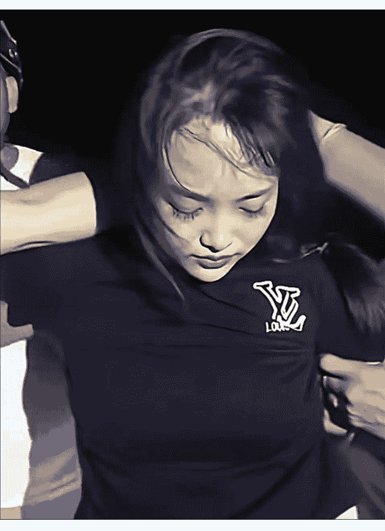

# “东南亚第一深情”劫法场，背后藏着什么真相？

251125 文/卢克文工作室 嘉宾星海舰长 整理：公众号懒人搜索，懒人专属群独享懒人微信：lazyhelper

11月18日上午，柬埔寨发生的一场劫狱案，却在中国上了热搜。被抓的女劫犯，肤白貌美，眼神迷离，那叫一个我见犹怜，也因此有了“东南亚第一深情”“江湖上最后一个大嫂”等等绰号，在网上火爆一时，相关话题阅读量上亿，有人甚至感叹“我又相信爱情了！”

1/13

那么，这到底是咋回事？这样一个劫匪，值得同情吗？

首先，我们需要简单了解一下发生了什么。网传的劫狱事件，倒是不假，具体是发生于11月18日上午8点52分，地点是柬埔寨柴桢省初级法院。从监控录像来看，先是一名穿着黑衣、戴着鸭舌帽、梳马尾辫的女子进入法院大院，然后由四辆警用摩托护卫的囚车驶入法院，囚犯陆续下车。这时女子突然上前，从衣服下面掏出了一把手枪，递到了其中一个男性囚犯的手中，而这个男性接枪在手，马上转身向身后的押解警员连开数枪，周边警察四散奔逃。混乱中，开枪囚犯和递枪女子，带上其他5名囚犯一起狂奔出法院，冲上一辆黑色轿车扬长而去。整个过程干净利落，还不到30秒。本来吧，这场劫狱相当完美，顺利的话，他们很快就能逃出柬埔寨。但是呢？开车的囚犯不知道咋回事，一头撞到了路边的池塘里出不来了，几人只能弃车，分头逃往附近的树林。这样一来，就给警方提供了宝贵的追捕时间。

柬埔寨警方反应也还算快，马上通过监控确定了车辆事故地点，只用了9个小时，就把所有案犯都抓获了，而且还缴获了一把K54手枪（越南对苏联TT33和中国54式手枪的统称）以及7发子弹。经过调查，这起奇葩的劫狱案，才真相大白。劫狱女子名叫阮氏海云，越南人。开枪的囚犯也是越南人，名叫潘万宝，是阮氏海云的丈夫。整个劫狱事件，是经过详细策划的，阮氏海云11月14日租车，16日用加密通讯软件在柴桢省巴域市花1500美元买了一把手枪和子弹，17日开车到柴桢省住宿一晚，18日上午，将汽车停在该省初级法院外，随后进入法院，待囚犯从车上下来后，递上手枪，劫狱开始。看起来似乎并不复杂，但仔细琢磨一下，就会发现这个案子并不简单。

首先，被劫的是什么人？请大家先关注案子发生的地方——柴桢省（Svay Rieng）。很多人对柬埔寨的印象停留在西港或者金边。但实际上，柴桢省才是真正的“法外之地”。打开地图你就会发现，柴桢省像一只楔子，深深地插入越南的领土，往东往南往北都是越南，距离胡志明市只有不到100公里。这里是柬越边境最大的口岸城市，也是著名的“赌场之城”，网络博彩园区密布，人民币、美元、越南盾自由流通，黑帮、叠码仔、换汇钱庄、走私客、电诈分子构成了这里独特的生态链。这次劫狱事件的主角，大概率就是这条生态链上的“狠角色”。再看一遍监控录像就会发现，无论是开枪的囚犯还是一起跟着跑的囚犯，都相当有默契，这说明6人肯定是认识的。考虑到在柬埔寨的法院，重刑犯往往是按照“同案”提审的。那么一起跑的这6个人，很可能就是一个完整的犯罪团伙，而且大概率是盘踞在巴域-木牌一带的黑灰产核心骨干。为啥他们要选择在法院动手？显然是因为这里的防备相比监狱更为松懈，而只要逃出法院大门，几脚油门就能冲到边境线。

第二个疑问：枪是怎么带进去的？这是整个案件最大的疑点，也是最让人细思极恐的地方。柴桢省法院虽然不如中国法院安保森严，但好歹也是国家暴力机关。一个女人，带着一把手枪，是如何大摇大摆走进去的？答案极有可能是：内鬼。如果从内鬼这个角度去想，一切疑问就顺理成章了。
- 通常这种重刑犯押解，必须有“手铐+脚镣”，甚至需要戴头套，但是当天为什么没有？是不是和内鬼有关系？
- 为什么阮氏海云拿着枪能过安检？很可能枪本来就是内鬼带进去，然后再给她的。
- 为什么阮氏海云不仅准确地知道囚犯的下车时间、进入院子的路线，甚至能够准确地提前到下车的位置旁边等着？不排除也是内鬼通气了。

显然，这些都不是一个简单的“为爱劫狱”的普通女子能做到的。

第三个疑问，为什么整个过程行云流水？视频画面显示，这绝不是一时冲动的劫狱，女子递枪的瞬间，男囚犯没有任何犹豫，接枪、开枪（显然是提前打开了手铐），动作一气呵成。他射击的目标非常明确——不是为了杀人，而是为了火力压制制造逃跑窗口。从视频来看，他是向警察的脚下和身侧开枪，逼迫警察寻找掩体。与此同时，另外 5 名囚犯仿佛早已知道会发生劫狱，一点迷茫都没有，枪一响就向门口狂奔。这说明了什么？说明这次劫狱他们在监狱里就已经策划已久，而且还是一场典型的“里应外合”。而那个递枪的阮氏海云，只是整个劫狱计划中最显眼的一环，在黑暗中，至少还有一个负责情报、车辆、撤退路线的团队在运作。如果不是因为其中一个家伙把车开进水塘的话，恐怕这群人早就逍遥法外了。

## 2

案件扒到这里，真相其实很丑陋——就是一群亡命徒，漠视司法权威搞出的一场劫狱闹剧。但是呢？这个事传到国内，经过营销号的剪辑和AI美颜的修饰，画风突然变了。在抖音、快手、微博上，阮氏海云成了“纯爱战神”，评论区里，无数人在感叹：“得妻如此，夫复何求！”“这也太飒了，为了老公敢劫法场！”“不论她是好人坏人，她是个好女人！”甚至到最后越传越离谱，还给阮氏海云编了个中国背景的凄美故事：劫狱的名叫冯静，是中国壮族，父母因为收取了彩礼想要将她嫁给老头，她只能选择逃婚四处辗转，后来被骗到柬埔寨金星园区，意外地结识了园区主管、会讲壮话的阮依豪，双方互生好感，后来柬埔寨打击电诈，阮依豪被抓前把自己的劳力士给了冯静，让她把表卖了好好过日子，但最终冯静把表卖了却买了手枪，干出了一场惊天动地的劫狱大案。其中点赞量最高的评论是这么写的，“她虽然不是好人，但她给爱情留下了最后的体面，让男孩们仍然愿意去相信那一丝缥缈虚无的爱情，这就是为什么我们称呼她是江湖最后一位大嫂的原因，她劫法场没成功，但她劫走了全网男孩的心。”我勒个去，这都哪跟哪啊！人家真正的冯静都拿着身份证辟谣了好么？

那么，为什么明明是一个恶劣的挑战司法案件，却被中国网友描绘成了可歌可泣的爱情故事？为什么这样一个女罪犯，却得到了普遍同情呢？说白了，就是一种群体需求在得不到满足下的集体心理投射。必须承认的是，我们身处一个极度功利化的时代，爱情被异化成了精准的算计，男人的价值被量化为房产证上的平米数、银行卡里的余额、汽车的车标。而女人的价值被量化为年龄、颜值、生育价值等等。再看看网上，天天在打拳，男人被骂“普信男”“下头男”“蝈蝻”，女人被骂“捞女”“扶弟魔”“傅 XX 面容”，抖音里充斥着“纯爱战神轰然倒地”的悲惨叙事，充斥着“上岸第一剑，先斩意中人”的冷酷段子，两性关系，似乎变成了一场零和博弈的战争，充满了猜忌、防备和敌意。但就是在这样的环境下，很多人的内心深处，其实还是有着一个巨大的、无法填补的空洞——利益之外，我们也渴望被坚定地选择，渴望一种不计后果、不问利弊的“绝对真爱”。而在柴桢省的那个上午，阮氏海云递枪的一瞬间，恰好填补了这个空洞，她的行为也因此被中国人强行赋予了一种神圣的光环。在中国人看来，那个女人递过来的不是枪，是“命”。你看，她不图你的房，不图你的车，在这个全世界都可能背叛你、审判你、抛弃你的时候，在你最落魄、最绝望，甚至要吃枪子的时候，她没有大难临头各自飞，而是拿着枪冲进来，把命交给你，陪你一起下地狱。这是一种多么极致的“反利己主义”啊！在现在这个连吃顿饭都要纠结是不是AA、连送个礼物都要权衡沉没成本的年代，这种“亡命天涯”的戏码，对很多中国人来说，产生了一种致命的代偿性满足。很多人潜意识里在想：“老子累死累活一辈子，也没个人能为我做顿热乎饭；这男的都要死了，还有个女人愿意陪他下地狱。值了！”大家感动的不是罪犯，感动的是那个“被人无条件爱着”的幻象。于是，真相不重要了，是非不重要了，阮氏海云被异化成了一个“愿意为男人豁出命去的女人”的符号。人们甚至不愿意相信她是越南人，宁愿编造谣言说她是“流落异国的中国大嫂”。因为只有这样，这个幻象才足够完美，足够让自己在深夜里自我感动一番。是挺感动的，但是感动完了，我们也该醒醒了。

请大家想一想，那个被奉为“纯爱战神”的女人，和那个被劫走的男人，到底是什么人？在柴桢省，在巴域，能动用如此级别的人脉、资金，能有渠道搞到枪支，能收买内鬼组织起越狱团伙的，大家想想能是什么人？不言而喻了吧？显然就是前文提到的黑灰产核心骨干了嘛！他们的业务范围，通常只有三样：
- 电信诈骗：把中国人骗到园区，敲骨吸髓，诈骗国内老百姓的养老钱。
- 网络赌博：让国内无数家庭倾家荡产，妻离子散。
- 毒品贩运：贩卖那些足以毁掉无数中国人人生的白色粉末。

这个“深情”的女人，她用来买通关节的美金，可能就是谁的父母被骗走的血汗钱；她那个“霸气”的男友，手上可能沾满了被骗到柬埔寨的中国同胞的鲜血。请问，这种人，有什么好同情的？！所以，这根本不是什么梁山伯与祝英台，这是一对被暴力、金钱和虚假江湖义气洗脑的邦妮和克莱德。更何况，在东南亚的灰产圈子里，哪有什么义薄云天？只有利益捆绑。阮氏海云为什么要救潘万宝？恐怕不仅仅是因为是她丈夫吧？也许因为他是团伙的头目，只有他出来，掌握在海外的加密货币账户才能解锁。也许因为如果他不出来，就会供出什么人，外面的人都要遭殃。说白了，这就是一对互相洗脑的赌徒。女的图男的带来的虚荣和黑道地位，男的图女的带来的崇拜和协助。他们自以为很义气，其实是在互相毁灭。

更有甚者，这种舆论狂欢背后，还潜藏着一种危险的价值观导向：颜值即正义。前有中国最美通缉犯卿晨璟靓，现有继续在抖音小红书上收获赞美的郭美美，反正只要长得好看，杀人放火都可以被原谅。但是反过来说，现在阮氏海云在 AI 美颜下看起来有点姿色，大家就脑补她是“乱世佳人”，那如果她长得像凤姐，或者是个满脸横肉的大妈，大家还会觉得这是“绝美爱情”吗？恐怕早就骂她是“悍妇”“泼妇”了吧。这种“看脸定罪”的逻辑，正在摧毁我们社会的道德底线。罪恶就是罪恶，不应该因为罪犯长得好看或者是被 P 得好看，就变得情有可原。这种“三观跟着五官跑”的现象，正在像病毒一样侵蚀着我们社会的道德底线。特别是对于涉世未深的年轻人来说，这种经过美化包装的“黑帮爱情”，更具煽动性和迷惑性。我们同情她，是因为我们太缺爱。但我们不能因为缺爱，就去饮鸩止渴，去歌颂罪犯的爱情吧？饮鸩止渴，从来都解不了真正的渴。去羡慕一对罪犯的爱情，也不能拯救我们现实中的情感危机。

真正的“大格局”，不是在网上为罪犯叫好，而是看清了生活的真相后，依然选择热爱生活，依然选择坚守底线。

什么是爱？爱不是带你去劫法场，不是递给你一把通往地狱的枪。爱是克制，是责任，是希望你走正道，是希望你平安、干净、无灾无祸。爱是当你想要走捷径、想要赚黑心钱的时候，那个敢狠狠扇你一巴掌，把你拉回阳光下的人。在这个浮躁的、戾气横飞的时代，我们更需要警惕这种“廉价的感动”。那个在柬埔寨法院开枪的瞬间，不是高光时刻，那是他们人生毁灭的开始。那声枪响，不应该成为我们歌颂的对象，而应该是一记警钟。在这个光怪陆离的世界上，作为中国人，要有自己的定力。我们应该同情的，是那些缉毒警的家人，是那些被电诈毁掉的家庭，而不是这两个在国外的亡命鸳鸯。我们要的“生死相许”，是平凡生活里的守望相助，而不是在那片罪恶的土地上，递上越狱的手枪。别让滤镜蒙蔽了双眼，别让流量收割了智商。江湖路远，但是，千万别走歪了！

## 最后，安利小懒的付费群：

懒人专属群（介绍）
公众号 懒人搜索
懒人专属群

微信：lazyhelper
懒人专属群持续更新中，已持续运营 6 年，整理超 3000 份各类精选付费文章 & 年费社群干货，全部开放下载。本资料为付费群内部分享，仅供真实有需要的朋友查阅

懒人专属群更新记录：
https://hk57gvlx7u.feishu.cn/docx/H0kRdZbSbolBR0xkaXtcuVE0nTg

懒人专属群更新记录（需梯子，备用）：
https://lazybook.fun/blog/record2