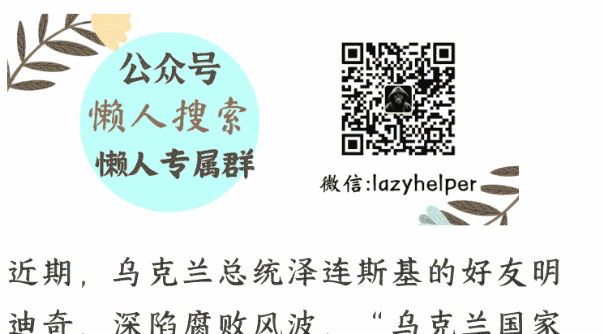
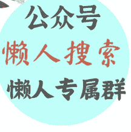

# 泽连斯基好友，深陷腐败案

251124 猫哥

整理：公众号懒人搜索，懒人专属群独享

懒人微信：lazyhelper



近期，乌克兰总统泽连斯基的好友明迪奇深陷腐败风波。根据乌克兰国家反腐败局的指控，明迪奇的涉案金额高达一亿美元。这件事对泽连斯基本人的威望造成了打击，不排除波及泽连斯基本人。

“明迪奇案”，已成为泽连斯基的最大麻烦。那么，这是怎么回事？

一切，得从泽连斯基的演艺生涯说起。

1997年，19岁的泽连斯基和几个同学一起成立了“95喜剧团”，专门在剧场中进行喜剧演出，类似“开心麻花”。2003年，已小有名气的泽连斯基决定做大做强，成立“95街区”工作室。

工作室的天使投资人就是明迪奇。明迪奇是传媒行业寡头科洛莫伊斯基的助手，正因为这层关系，“95街区”工作室在创立初期就不愁资金和客户，不知令多少创业者羡慕。

泽连斯基成为总统后，明迪奇没有获得任何公职，看起来是不是很笨？然而，这正是他的聪明之处。他知道，以他和泽连斯基的关系，如果进入政府，很多事情过于扎眼，所以他选择躲在幕后，让好友叶尔马克担任总统办公室主任。外界传言，泽连斯基对叶尔马克到了“言听计从”的程度。

传言或许有些夸张，但毫无疑问，叶尔马克的影响力很大，是事实上的二号人物。明迪奇通过叶尔马克的影响力，再把本派系的人推到油水多的位子上。比如，乌克兰能源部长加卢先科，就是明迪奇向叶尔马克“介绍”的，叶尔马克再向泽连斯基“推荐”。

能源部长是自己人，好处还能少得了？

《基辅独立报》报道，乌克兰国家原子能公司、乌克兰国家能源公司这两家公司的许多采购合同，明迪奇都会获得10%-15%的回扣，总金额不低于一亿美元。当然，这个钱是明迪奇拿大头，还是背后的科洛莫伊斯基拿大头，就见仁见智了。

而乌克兰国家反腐败局，早就盯上了明迪奇。

2025年11月10日凌晨，反腐败局的调查人员悄悄来到明迪奇位于基辅的住所外围，准备“收网”。调查人员不知道的是，就在几个小时前，明迪奇匆匆离开了基辅，随后一路向西狂奔数百公里，离开了乌克兰，全程没有遇到阻挠。

很快，他出现在了以色列（他是犹太人，早就搞到了以色列国籍）。

在被逮捕前夕逃脱，显然有人通风报信；出国没有遇到阻拦，显然有一股庞大的力量为他保驾护航。傻子都知道，这事泽连斯基脱不了干系。

虽然没有证据明确指向泽连斯基（这种事也不可能找到证据），但乌克兰民间还是彻底炸了，纷纷把矛头指向泽连斯基。

泽连斯基涉嫌腐败其实在意料之中，真正稀奇的，是西方媒体的态度。要知道，泽连斯基不是第一天有负面消息。比如，泽连斯基的夫人叶莲娜·泽连斯卡娅，被曝出在随同丈夫巴黎外交活动期间，豪掷超过百万欧元进行购物。这事后来有了实锤，叶莲娜的摩洛哥籍造型师私底下炫耀，自己让第一夫人花了上百万欧元改造自己。

结果，造型师的话被人给录了下来。

又比如，总统办公室副主任塔塔罗夫涉及多起腐败案，但啥事也没有。泽连斯基好友、前副总理切尔内绍夫被指控腐败等等。

只要想报道，泽连斯基的形象早就崩塌了。关键是，此前西方媒体总是自动过滤这些泽连斯基的负面消息，要么斥责为假新闻。

而这一次的“明迪奇案”，西方媒体一反常态，开足马力报道，连西方在乌克兰的代理人也不给泽连斯基面子。前面提到的《基辅独立报》，就是“国际开发署”扶持的。本次事件，它是报道最积极的媒体之一。

从不报道到密集报道，巨大转变的背后，是美国对乌克兰态度的转变。

拜登时期，西方坚定支持乌克兰，所以对泽连斯基的负面新闻基本上能压就压；而到了特朗普时期，“停战”才是第一诉求。泽连斯基这个“停战”的最大阻碍，自然就要敲打。

还是以《基辅独立报》为例，“国际开发署”被裁撤后，其职能并入了国务院，也就是说，现在它的上司是卢比奥。如果“不会做人”，就拿不到经费了。

需要经费的，可不止《基辅独立报》。像民主党阵营的《政客》杂志，原先也是靠“国际开发署”和CIA的银子为生。最夸张的一次，CIA让《政客》发一篇稿子，报酬竟然高达800万美元。这些媒体虽然不亲特朗普，但如果 在乌克兰问题上不懂事，也拿不到银子。所以，这些民主党媒体也没办法，多少得表个态。

当“明迪奇案”被密集报道，泽连斯基原有的“光辉形象”就受到了巨大冲击，这对乌克兰而言绝对是致命的。

从微观上，前线局势艰难，许多人早就没有信心抵抗了。如果案件再发酵，会令许多乌克兰人觉得，前方这么吃紧，你们后方还敢紧吃，没救了。总统都这个样子，我作为士兵、普通人，还抵抗个啥？

从宏观上，当乌克兰内部将大量资源用于内斗时，前线的资源还能有多少？会不会让俄军趁机扩大优势？为了保住位子，泽连斯基会不会和调查机构硬碰硬？别忘了，早在几个月前，泽连斯基曾签署过法案，要削弱“乌克兰国家反腐败局”。上述可能性，都不能排除。

当前，特朗普铁了心要终结“俄乌战争”，为此提出了“28条”。“28条”的内容相信大家都看过了，完全是不平等条约：又是要求乌克兰割地，又是不让乌克兰加入北约，还要求乌克兰在100天内举行大选，明摆着要踢掉泽连斯基。这，才是“明迪奇案”疯狂发酵的关键。

如果泽连斯基不答应“28条”，他的负面新闻，恐怕会越来越多。

最后，安利小懒的付费群：

# 懒人专属群（介绍）




懒人专属群持续更新中，已持续运营6年，整理超3000份各类精选付费文章 & 年费社群干货，全部开放下载。

本资料为付费群内部分享，仅供真实有需要的朋友查阅 👀

懒人专属群更新记录：
```
https://hk57gvlx7u.feishu.cn/docx/H0kRdZbSboIBR0xkaXtcuVE0nTg
```
懒人专属群更新记录（需梯子，备用）：
```
https://lazybook.fun/blog/record2
```