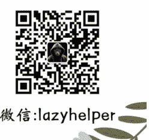

# 168 | 非对称关系：俞敏洪和影视飓风的声誉危机

+ - 251126

整理：公众号懒人搜索，懒人专属群独享

懒人微信：lazyhelper

欢迎打开《蔡钰 · 商业参考 4》，我是蔡钰。

今天我们要聊两件最近发生的事儿。主角，一个是新东方的创始人俞敏洪，一个是头部自媒体品牌影视飓风的创始人 Tim。

两人在 2025 年底不约而同遭遇了声誉危机。可能你也有所耳闻。这里，我不是要跟你讨论谁对谁错，也不是讨论应该站谁。

我想邀请你留意的是：把两件事放在一起，仅就它们所引发的公众情绪的角度来说，会发现里面藏着相同的时代陷阱，这个陷阱叫“非对称关系”。

## 两场声誉危机

我们先结合公开信息，把两件事简单回顾一下。

先看俞敏洪。

新东方 32 周年的时点上，老俞人在南极。他在极地甲板上写了一封“南极来信”，发给所有新东方教职员工，用作公司 32 周年的内部致谢和激励。

在信里，老俞一边回顾新东方从一间小教室发展到今天的历程，承认新东方的成就有赖于每一位员工；一边描绘南极冰雪纷飞的美景，呼吁新东方的团队，像企鹅一样抱团取暖、互相扶持。

结果发出之后，气氛变了。

小红书等平台上，很快出现了疑似新东方员工对这封信的嘲讽。老俞的这封信，本意是要感谢和激励员工，但很快被抽象成了几个关键词：脱节、站着说话不腰疼、利益剥夺。

再看 Tim。

Tim 是自媒体账号影视飓风的核心主创，典型的头部内容创作者。最早做数码评测出身，近年来逐渐扩展了账号矩阵和选题范畴，做起了荒岛求生、知识纪录片等内容，在 B 站、小红书等平台攒下了千万级粉丝。其中很多人，跟随影视飓风的视频已经五六年，甚至超过 10 年，是把他当作“电子室友”、精神替身式的存在。

Tim 的这次危机，是因为他接受了粉丝的要求，去相亲角推销自己。

工作是摄影师、国内学历是初中、离异、家里干快递。

其实，这套设定对熟悉他的粉丝来说，是典型的“内部玩笑”：工作摄影师，同时年收入上亿；国内学历初中，是因为他是在英国读的高中和大学；家里干快递，指的是父亲在圆通快递当总裁。这都是真的，至于离异，也确有其事，在 Tim 的粉丝社群里，也是一个经常用来自黑和互黑的梗。

但在不知情的外人看来，这份简历就有点上不得台面了。所以拍摄那天，在 Tim 的镜头里，几位红娘阿姨看了他的简历，直接放话，学历低、家境一般，还离过婚，不考虑。

等这段视频被切片发布到网上后，炸锅了。很多人愤怒的点是：你这不是扮猪吃老虎吗？戏弄普通人有什么好处？

## 非对称关系

这是两起事件的大致来龙去脉。

我个人认为，这两次事件，对俞敏洪和 Tim 的伤害都是可逆的。

老俞仍然是一个有情怀、有桃李的中国企业家，慷慨送别董宇辉、给乡村学校捐桌椅这类举动，都还让人历历在目。11月20日，老俞还发微博说，允许和鼓励员工吐槽是新东方的传统，明年打算挑选 10 个员工和 10 个会员顾客，送他们去欣赏南极。

Tim 的转机也很大。他一贯的内容根基，本来就是更多地倾向趣味，而不是价值观。最近两年，他对影视飓风的计划是，向野兽先生学习，替用户去进行人生的极限拓展，比如荒野求生、追逐鲨鱼、上太空等等。新的情绪资源给到位后，旧的情绪大坑当然是有可能填平的。

不过前面说了，我们不是要讨论谁对谁错，更不是拉你站队，作为一个商业专栏，我想和你分享的是，这两件事背后藏着一个叫作 “非对称关系”的时代陷阱。这可能是所有品牌和 IP 都要留意的。

非对称关系，指的是关系双方对共同关系的距离感认知不一致。亲戚催婚催生问工资，你觉得没有边界感；同事天天蹭你车上下班，你觉得没有边界感……背后都是因为存在非对称关系。

在今天的自媒体时代，这也是网红博主、头部 IP 们非常常见的一种用户关系。

俞敏洪为新东方的 32 周年写信，在他心中，自己与新东方是共生一体的，他理所应当承受新东方的低谷，也理所应当享受新东方的成功。

从他的角度写信，会觉得自己理应跟“新东方”这个主体足够亲近，也理应被充分包容。他是在一种“自己人”的语境里进行的借景抒情。

但组成“新东方”的员工们，尤其是新员工、年轻员工，可能跟他没有足够的战友交情。读到这封信时，感受到的就是非对称关系。

老俞创业几十年，跟新东方同生共死地熬过若干低谷，同样有过不眠不休的时刻。一把年纪在南极抒个情，其实没什么问题。但带入非对称关系这个视角会发现，他可能对抒情对象有个误判。他跟员工的真实关系距离，可能比他以为的要远。

在更大的维度上，作为 60 后企业家，老俞认知烙印里的集体价值至上，其实也跟今天进行中的阵营经济趋势不兼容。所以，等这封信再传播到公众世界里的时候，不管老俞的本意是什么，他都被抽象成了一个抽象的“老板”，来承载今天整个职场对上位者的不满。

再看 Tim。

Tim 作为天天浸泡在互联网上的 90 后，社会情绪感知力已经强很多了。他也意识得到自己跟用户之间存在非对称关系。

这种非对称关系，打个比方，相当于王富贵天天刷“影视飓风”的节目，熟悉 Tim 的一颦一笑、思维模式，几年来，见证了他的成长成功，把他当作电子室友或入睡搭子。但换到 Tim 的角度，王富贵只是他几千万粉丝当中的一个，他对王富贵并不了解，也不会对他有室友级别的亲近感。

前段时间，Tim 参加罗永浩的播客访谈，还谈到自己也受到过粉丝跟踪和路人凝视，以至于从来不外出吃饭。他的困扰，就是来自于粉丝们把他当电子室友、精神替身、养成系儿子来相处，会随意介入他的生活，他却对对方毫无认知、毫无真实交情，对此是抗拒的。

类似的，你肯定知道，娱乐圈偶像们对那种毫无边界感的 “私生饭”，也很抗拒。

但到了这次，Tim 也栽在了对关系的认知错位里。

Tim 后来发布澄清视频，解释说，这本来是面向粉丝的整活儿节目，被第三方切片之后断章取义，引发了大众的争议。但这个澄清，并没能平息公众的怒火。有反驳者反问他：你对相亲简历半隐半藏，不也是一种切片吗？

这个反问，其实挺有力量。影视飓风选中的 “相亲” 这个选题，不是圈地自萌的亚文化，而是一个天然储藏了巨大社会情绪的关键词。而他做这类内容的目标之一，也是让自己的品牌不断出圈，实现更大的人群影响力。换句话说，关注这事的“路人”，是被他主动吸引来的。有义务搞明白他的内部典故吗？大家当然觉得没有。主流人群有责任调整主流价值观，来适应这条视频的内部趣味吗？大家也会觉得没有。

于是，当这条相亲视频冲破粉丝社群，进到了更大的舆论场，带入那些不熟悉 Tim 的路人的视角，他们看到的画面是这样的：一个有资源、有团队、有流量的年轻博主，进入一个主流生活空间，拿着“初中学历、做快递、离异”的虚拟低配人设，把普通人对未来、对子女的焦虑，做成了笑料。

所以啊，我猜，Tim 虽然一方面知道自己和粉丝关系没那么近，另一方面，又被日积月累的粉丝氛围，弄得以为自己和大众比现实更近，导致在相亲视频和随后的澄清视频里，把大众当成了小剂量的粉丝。

在这种非对称关系里，他的玩梗和解释，都被理解成了冒犯。即便他本人没有恶意，这个动作都很容易被路人解读成：上位者在把下位者的痛苦，当作游戏来体验。

类似的批评，导演徐峥 2024 年也挨过。

当时，他拍摄了一部讲述外卖员生活的电影叫《逆行人生》，记录小人物的艰难生活。但抵制的声音说，你已经是上位者了，还要来消费我们底层，再赚走我们的电影票钱。

还记得我们在这一季专栏的第八（《超级信号：经营“我们”的三个新觉悟》）、第九讲（《超级信号：“他们”隐含的系统风险》），专门聊过阵营经济趋势里，“我”“你”“我们”“他们”几大关系张力，如何决定企业和品牌的用户运营吗？这一讲，算是为上次讨论补了一堂习题课。

## 总结

总结一下，从这次老俞和影视飓风 Tim 的声誉危机里，不管当事人本意如何，我们读到的公众情绪是：你不能展示自己过得好，这是炫耀。你不能假扮我们来展示我们过得不好，这是羞辱。

在消费市场和互联网上，我猜，这两个教训可能会给到品牌和 IP 们的提醒是：做个性就不要出圈，要出圈就别做个性。

而对我们更多的普通人来说，“非对称关系”给到我们最大的教训是两个。

- 第一，“我们”这种共同体，需要建构和确认，不能预设它天然存在。这两年来，有句东北话很流行，叫“你跟谁俩呢”，就是一部棒喝。
- 第二，不要混淆粉丝关系和公众关系。你日常熟悉的亲近或包容，都有对应的圈层边界。

你怎么想？

再见。

最后，安利小懒的付费群：

懒人专属群（介绍）

📚 懒人专属群持续更新中，已持续运营 6 年，整理超 3000 份各类精选付费文章 & 年费社群干货，全部开放下载。

本资料为付费群内部分享，仅供真实有需要的朋友查阅 👩‍🏫

懒人专属群更新记录：

https://hk57gvIx7u.feishu.cn/docx/H0kRdZbSbolBR0xkaXtcuVE0nTg

懒人专属群更新记录（需梯子，备用）：

https://lazybook.fun/blog/record2