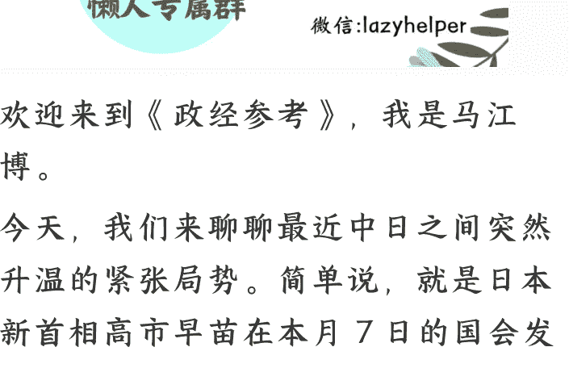
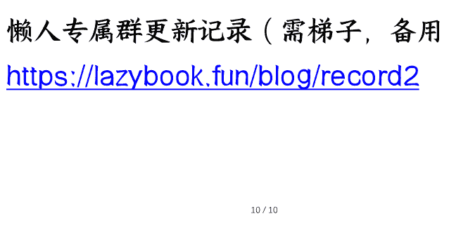

# 233｜中日局势升级：为什么、会怎样，及背后影响
251126
整理：公众号懒人搜索，懒人专属群独享
懒人微信：lazyhelper

欢迎来到《政经参考》，我是马江博。

今天，我们来聊聊最近中日之间突然升温的紧张局势。简单说，就是日本新首相高市早苗在本月7日的国会发言中，出人意料地把“台湾有事”直接提升到可能对日本构成“存亡危机事态”的高度，暗示武力介入台海的可能性。

这件事引发了轩然大波，而我们则以近年来罕见的强硬方式作出了回击。我觉得这是大国博弈的框架下，一个非常典型的案例。到底怎么理解这起事件？它可能会有什么变化和结局？对普通人有什么影响？今天我就谈谈我的看法。

## 高市早苗为什么这么干？

先说高市早苗为什么这么干。首先要明确一点，高市开了一个非常恶劣的突破底线的先例。《人民日报海外版》采访的专家说，“高市早苗是一个将‘台湾有事’与日本‘存亡危机事态’直接挂钩的日本领导人，武力介入台海局势的意图暴露无遗。”而且“一个中国”原则，早在《中日联合声明》《中日和平友好条约》《中日联合宣言》和《中日关于全面推进战略互惠关系的联合声明》四个政治文件里写得清清楚楚，是两国关系最基本的政治基础。因此，历任日本首相在公开讲话和国会答辩中，都坚持用“充分理解和尊重中方立场”这样的模糊表述，从未把台海局势和日本安保法中的“存亡危机事态”直接挂钩。

作为一个老牌政客，高市早苗的表述显然不可能是“口误”，我认为她这么做的原因大概有三点：

- 第一是试探中国。高市清楚我们对台湾问题的立场和红线，她想试探的是，我们在言辞与行动上的底线，会不会产生任何空间，以便让日本在中美博弈的大格局下，找到一个更好的位置；
- 第二是向美国示好。高市刚上台，急于向美国展示日本有意在同盟体系中扮演更“主动”的角色，让特朗普看到她是一个“可用、听得懂话”的盟友；
- 第三是拉拢国内右翼力量。高市本来就是自民党内的“职业右派”政治家，她在党内选举中获胜的关键，就是得到了更激进的右派力量支持，为了稳住基本盘，她必须持续强化自己的所谓“右翼领袖”的形象。

所以我认为，高市这么发言是经过深思熟虑的：她在成为首相之前，就一直在系统性踩线。包括否认侵略责任、多次参拜靖国神社、推动所谓修宪扩军；而在涉台问题上，她除了多次鼓吹“台湾有事”可能构成“存亡危机事态”；今年4月，她作为国会议员窜访台湾期间，还鼓吹“日台强化安全合作”，打造“准同盟关系”，这些都是她长期的政治资本。

这次在国会的表述，高市本质上只是把她过去作为议员时的“私人口号”，第一次塞进了“首相身份的官方答辩”里，试图借此完成从个人激进立场，向“国家立场”升级的危险试探。

## 中国必须强硬反击

好，明白了这是一次恶劣的挑衅和试探，也就明白了我们当下如此强硬反击的原因。对中国来说，台湾问题是中国核心利益中的核心，是不可触碰的红线和底线。

所以我们看到，外交系统这一次的措辞和动作都异常强烈：中国外交部副部长和中国驻日本大使，都以“奉示”的方式约见日本官员。“奉示”意味着奉上级指示，我理解，这表明这不是外交系统的日常动作，而是来自更高层级的直接授权，政治信号非常明确。

11月13日的外交部记者会上，发言人林剑也用了一个非常罕见的词——“迎头痛击”。11月18日，甚至外交部亚洲司司长，身着中山装、双手插兜，拒不与来访的日本外务省官员握手道别，也极具象征意义。要知道如此公然的“打脸”行为，并不符合中国外交惯例，我认为显然就是要表达中方的愤怒。

而在舆论上，中方也是一层层分级表达，我按照从半官方发声，到官方发声的顺序依次带你梳理下。

- 第一层是本质上是官方旗下、但不直接是官方媒体本身的新媒体账号发声，因为这个“半官方”身份，它们可以说得非常直接。比如央视旗下的自媒体账号“玉渊谭天”，在《搞事的高市》一文中，直接使用了“脑袋被驴踢了”等极具冲击力的语言。
- 第二层是代表军方立场的《解放军报》，在名为《叫嚣武力介入台海局势只会把日本引向不归歧途》的文章里，特别警告日本，“如果武力介入台海局势，日本国民和国家都将因为日本政府极其危险且错误的决策陷入灾难”，尤其还有一句日本“全国都有沦为战场的风险”的罕见警告。相应地，11月16日，中国海警舰艇编队赴钓鱼岛领海，开展常态化维权巡航；11月18日，中国海军在黄海南部海域，进行为期8天的实弹射击演习。
- 第三层，《人民日报》从11月14日到22日，连续发表了多篇以“钟声”为名的重磅评论，“钟声”意为“中国之声”，从这个栏目名称，你就知道它的权威性。这几篇文章层层推进，在11月22日的文章《一意孤行抑或回归理性，日本再次面临抉择》中，我们警告说，高市早苗“全面继承甚至激进发挥日本右翼政客的‘政治遗产’，把严肃的国家政策异化为个人政治表演的工具，把事关中日关系根基的台湾问题当作谋求私利的筹码。这种将本国前途命运捆绑于个人政治野心的做法，只会把日本带入歧途，把自己碰得头破血流。”我理解，文章已经在突出高市的个人政治野心，这是在喊话日本朝野了。

另外，我认为今年还有两方面的因素，共同塑造了我们这次强烈的反击态势。

一方面，《人民日报》（11月17日）的文章专门提到，“今年是中国人民抗日战争暨世界反法西斯战争胜利80周年，也是台湾光复80周年。日方非但不思反省，反而在台湾问题上制造新的事端。”另外，今年全国人大常委会也通过决定，将10月25日设立为台湾光复纪念日；而且新华社前段时间，也播发多篇“钟台文”的署名文章，统一呼声高涨。总之，高市在这个时候的表态，挑衅性极大。

另一方面，“十五五”规划建议稿刚刚通过。文件既判断外部环境“更加复杂激烈”，也明确提出中国要在全球变局中“主动运筹”，要“敢于斗争、善于斗争”，中国的对外大基调已经发生了重大变化。所以这次面对高市挑衅的强硬反击，就更能理解了。

## 局势会如何发展？

那么高市早苗这个挑衅事件，会怎么收场呢？基于我对当前局势的分析，我认为会有三种可能：

- 第一种可能，是高市主动撤回相关言论，或者以一种不那么难堪的方式“技术性收回”。比如，她可以在国会再次接受质询时，对同一问题给出一个经过修正、更加模糊的回答，用“补充说明”的形式把话圆回去。从操作上看，这对她个人来说是最容易执行的方式。不过对高市来说，这种“自我否定”带来的政治反噬，可能很难承受，因此并不容易。
- 第二种可能，是在中美达成默契的前提下，美国出面，最常见的做法是由美国白宫或国务院发言人在例行记者会上重申：“美国坚持一个中国政策，当前立场没有变化。”与此同时，美国在私下场合敦促日本调整措辞，由内阁官房长官，相当于日本政府的秘书长，或者由外务大臣出面统一口径，例如表态“日本的一贯立场未变，将继续遵循《中日联合声明》等四个政治文件”。这样一来，高市之前的表态也会被自然“覆盖”，形成一种软着陆。
- 第三种可能，就是维持当前的中日紧张态势，中方静待日本国内政治自行“纠偏”，让高市在压力下加速下台。央视旗下的“玉渊谭天”已经说得很直白：日本最近五年经历了“4人6任首相”，而像高市早苗这么“不想干”的，还是头一个。我认为这句话本身就透露出中方对日本政局更迭速度的判断——北京预期到，日本首相本来就不稳定，高市的位置更不稳。

在这种情况下，中方只需保持压力，最先撑不住的，大概率是高市的支持率。《人民日报》（11月22日的文章）已经说得很直接了：“中国是日本最大贸易伙伴、第二大出口对象国和最大进口来源国。如果日方拒不悔改甚至一错再错，中方将不得不采取更加严厉坚决的反制措施”。

我认为接下来中方可动用的工具箱仍然有很多：包括稀土出口审批、牛肉与大米等食品检验、东海巡航加密等等，这些措施都会实实在在冲击日本的经济预期和民意。按照我对日本以往政治节奏的观察，一旦首相支持度跌破某个阈值，党内、财界团体和媒体都会迅速倒戈。对高市来说，在不断累积的外部压力和内部不满夹击下成为短命首相，不是小概率事件。

## 对普通人的影响？

那么，对我们普通人来说，中日这轮紧张局势如果持续，到底会带来什么实际影响？

- 第一，中日关系大环境的预期，在未来一段时间内会发生变化。这种变化往往比即时和实际的冲击更致命，因为一旦大家对未来中日关系的预期变得悲观，很多资金流、商业决策、跨国生活计划，都会悄悄收缩。我知道过去两年，很多人都在“重仓日本”，但只要中日关系持续紧张，这些资产就会面临压力。尤其是日元，这是一种典型的“地缘政治敏感”货币。做中日跨境生意的人要提前做准备，锁汇率、找替代航线、关注检疫或通关政策，因为任何一个环节变化，成本都会立刻上升。比如就有在日本做展会生意的中国从业者发视频透露：12月原本筹备好的两个展会，突然出现了变故。
- 第二，更重要的是，这次冲突让更多人意识到，大国博弈已经深度影响我们每个人的生活。今天的周边局势，已经不能只用中日双边关系来解释，它必须放在“中美竞争的大框架”里去理解。

目前中美的态势是“斗而不破”，双方现在都还不想真正掀桌子。但我分析，正是在这样的格局下，中国对像日本、菲律宾这种国家的挑衅，一定不会手软，甚至会更狠一点。

但这一切都只是序幕，地缘政治会越来越频繁地进入我们的生活：汇率、资产、旅游、留学、贸易，每一项都可能被牵动。而看懂大国之间的力量对冲，是我们最应该具备的底层能力。

好，今天的内容就到这里。欢迎你把《政经参考》转发推荐给更多人，让我们一起聚焦政经，举重若轻。我是马江博，下期见。

## 延伸阅读：
- 1、《人民日报海外版》：日本政坛右倾漩涡正加速旋转
- 2、2025年11月18日外交部发言人毛宁主持例行记者会
- 3、2025年11月13日外交部发言人林剑主持例行记者会
- 4、《解放军报》：叫嚣武力介入台海局势只会把日本引向不归歧途
- 5、《人民日报》：一意孤行抑或回归理性，日本再次面临抉择（钟声）
- 6、《人民日报》：警惕日本战略走向的危险转向（钟声）

最后，安利小懒的付费群：

懒人专属群（介绍）

懒人专属群持续更新中，已持续运营 6 年，整理超 3000 份各类精选付费文章 & 年费社群干货，全部开放下载。

本资料为付费群内部分享，仅供真实有需要的朋友查阅 🙇

懒人专属群更新记录：
https://hk57gylx7u.feishu.cn/docx/H0kRdZbSbolBR0xkaXtcuVE0nTg

懒人专属群更新记录（需梯子，备用）：
https://lazybook.fun/blog/record2