# 不投流，不接单，一个月从0到月入2.7万：一个B站小白用AI暴力起号的30天带货实录

251127 副业 SC 精华

公众号懒人搜索，懒人专属群独享

懒人微信：lazyhelper

## 零、引言

这是一篇迟来的B站好物复盘帖。

大家好，我是Lynn，95后，7月份生财新生，可以叫我Charles，也可以叫我葱哥，深海圈里人称百万哥。

而立之年，需要走出舒适圈做出改变。

今年7月份加入生财，8月报名B站好物深海圈，一度想要退出，在十一之后终于决定尝试一下，起码做个双十一再放弃，但没想到做起来了，从10月7日的第一个视频发布，到11月12日双十一结束，完成了70w的GMV，出单600+。

## 一、按照惯例，先秀战绩

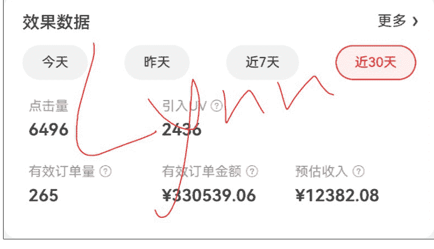

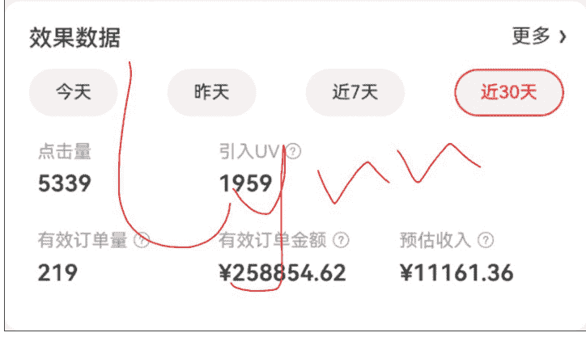

我没有高风险的动辄几千几万的投流，虽然星空大佬的分享很有用，但作为一个算法工程师，凭借对推荐算法的一点理解，我对于这种突然涌入大量投流需求的实际效果是持怀疑态度的，后入场的很难取得理想的正反馈，实际也如我所料。

我也没有接任何商单，几百的或者纯置换我看不上，1800的按摩垫置换我也不想要，我把所有的精力（当然也没多少，每天只有2小时左右）都投入在了横测视频上。

那我是怎么做到从零开始第一个月就取得这种超预期成绩的？我经过一个月从零到一的入门、实战和打磨，在双十一结束的周六，我在深海圈进行了3个小时的分享和实战演示，在这里，我将进行更为详细的复盘。

在平均每天投入2小时的情况下（23/24点-次日1/2点），不投流，不接单，我是怎么从一个B站小白，靠AI暴力起号，在从0开始的30天赚到2.7w的佣金的。

而我又是怎么通过灵活使用AI工具提效，将【文案+音频+PPT+封面】部分，由最开始的6小时提升到0.5小时的？（这里在深海圈进行过实机演示，最快20分钟，最慢 35 分钟，在文章最后也无保留奉上）；

这里将无保留的分享我的心路历程、迭代思路以及当前使用的版本的完整提示词，可以确定的是，对于任何一个零基础新人来说，只要你按照这套方法，每天投入 2-3 个小时，就能做到至少月入 5k-1w，如果某个视频爆了，月入 2w+完全不是问题。

### 天猫双11

成交金额
以下数据统计截至:2025-11-13 11:29:33
56,223.92

| 指标 | 数值 |
|---|---|
| 点击次数 | 390 |
| 付款人数 | 32 |
| 付款金额(元) | 56,200.19 |
| 有效付款金额(元) | 33,986.06 |
| 付款笔数 | 87 |
| 有效付款笔数 | 62 |
| 付款预估收入(元) | 650.12 |
| 有效付款预估收入(元) | 408.21 |
| 结算预估收入(元) | 372.82 |
| 平均客单价(元) | 1,756.26 |

### 天猫双11

成交金额
以下数据统计截至：2025-11-13 17:21:16
¥ 59,552.71

| 指标 | 数值 |
|---|---|
| 点击次数 | 227 |
| 付款人数 | 25 |
| 付款金额(元) | 59,552.71 |
| 有效付款金额(元) | 47,065.71 |
| 付款笔数 | 40 |
| 有效付款笔数 | 34 |
| 付款预估收入(元) | 1,027.88 |
| 有效付款预估收入(元) | 720.57 |
| 结算预估收入(元) | 300.37 |
| 平均客单价(元) | 2,382.11 |

### 数据总览

包含效果数据为0的活动

| 指标 | 数值 |
|---|---|
| 参与活动数量 | 16 |
| 预估奖励金额 | ¥ 656.9 |

### 数据总览

包含效果数据为0的活动

| 指标 | 数值 |
|---|---|
| 参与活动数量 | 10 |
| 预估奖励金额 | ¥ 910.6 |

### 超级补贴效果数据

+   - 今天
+   - 昨天
+   - 近7天
+   - 近30天
+   - 自定义

预估活动总收入 ② ¥496.95
预估补贴收入 ②
预估佣金收入 ② ¥249.12 ¥247.83

| 指标 | 数值 |
|---|---|
| 预估活动总收入 | ¥496.95 |
| 预估补贴收入 | |
| 预估佣金收入 | ¥249.12 |
| 备注数据 | ¥247.83 |

| 平台 | GMV | 订单 | 佣金 | 奖励 | 补贴 | 总收入 |
|---|---|---|---|---|---|---|
| 京东 | 589,393.68 | 484 | 23,543.44 | 1,567.5 | 496.95 | 25,607.89 |
| 淘宝 | 115,776.63 | 127 | 1,678.00 | 0 | | 1,678.00 |
| Total | 705,170.31 | 611 | 25,221.44 | 1,567.5 | 496.95 | 27,285.89 |

## 二、我是谁

Lynn，也可以叫我葱，本科南京理工大学+硕士悉尼大学

19年毕业，目前工作6年，华为->小米->极氪->某智驾公司，AI图像算法工程师，目前base上海

7月加入生财，自学n8n & Coze，参与n8n & youtube航海，也参加了9月份深圳的航海家AI大会，认识了不少优秀的人，也见到了家蒙老师请教了一番，在这里对家蒙老师、深海圈圈友、生财团队做出感谢！

| 资源 | 类型 | 编辑时间 |
| :--- | :--- | :--- |
| **Bilibili_workflow_0930** 2. 新职好物一键生成带货视频-10月10-不出镜简单版-介绍选品和文案 | 工作流 | 2025-10-20 18:22 |
| **Bilibili_download** 1. B站下载-0元短视频内容下载 | 工作流 | 2025-10-17 13:55 |
| **Bilibili_workflow** | 工作流 | 2025-09-28 23:11 |
| **cat_story_welianjiaocheng** 3. AI猫咪故事一键生成教程及升级 | 工作流 | 2025-09-18 14:46 |
| **auto_wechat_redbook_CL** 自动化公众号与小红书_CL | 工作流 | 2025-09-14 11:15 |
| **song_MV** 歌曲MV生成 | 工作流 | 2025-08-29 03:21 |
| **music_MV_generate** Myai歌曲一键生成 | 工作流 | 2025-08-29 01:07 |
| **AI_short_drama** AI短剧工作流 | 工作流 | 2025-08-17 22:53 |
| **youtube_downloader** 1. youtube视频下载 | 工作流 | 2025-08-15 22:51 |
| **cat_story** 1. 动漫猫故事 | 工作流 | 2025-08-13 23:41 |
| **cat_story_my_own_story** 2. AI猫动漫故事-单创故事 | 工作流 | 2025-08-13 03:12 |

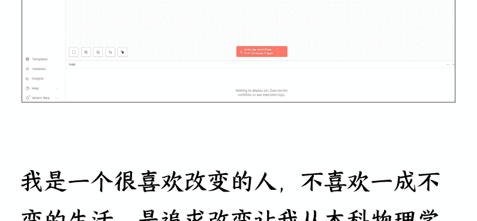

我是一个很喜欢改变的人，不喜欢一成不变的生活，是追求改变让我从本科物理学转到了硕士电气工程，也是改变让我在读研期间选修AI+自学编程（彼时17年AI刚火起来），也借此让我拿到了AI相关的实习offer和华为的正式offer，同样是改变让我从手机领域转到了自动驾驶、学习了量化交易、学习了B圈、学习了Stable Diffusion、n8n、coze、youtube...，直至现在的B站好物带货。

太多太多了，正是这些经历让我对新事物有极快的学习、接受和应用能力，无论将来取得什么样的成就，这些埋藏在性格深处的自驱力是功不可没的。

## 三、我的心路历程

我也是个俗人，我也会有各种想法，但只要决定尝试，我就会全力以赴

### 后悔：开营前想要退出

08/21 开营，我看到家蒙哥的手册里提到了要教真人出镜，不教 AI 玩法，也不教自动化和矩阵化，一度想要退出

### 下一次聊天就是：

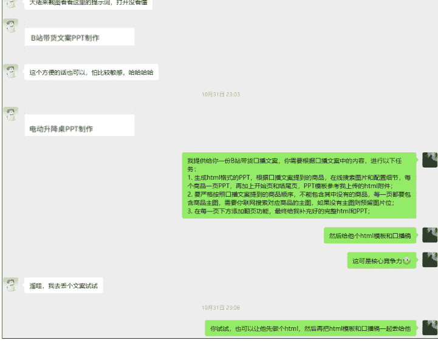

### 决心：决定做了之后，还是想要走出自己自动化的路子

联系源神想要合作（那时候还不知道源神这么牛逼，只知道他已经做了一段时间了，有经验）

### 后来也没交流，然后就是：

### 开始：十一之后，10/10/6 的节奏结束，决定尝试一把

10/07 发布第一个视频，虽然两天后就出单了，但是看着那两块五块的佣金，我沉默了

然后我尝试了佣金率更高的耳机支架，想着佣金 15%起步，一个支架顶两个耳机，结果彻底扑街

一直到账号起来才出了 4 单（后来想了下，谁会闲着没事去买耳机支架，即使有也没几个人。。）

然后我开始想，凑满五个视频算球，要还是只能赚个一两百，那就算了。

### 哦豁：正反馈来了

很可惜，【不出镜+不录音+半自动化】自创流派的我，还是走出来了

第三个视频 10/15 发布，发布当前就出单，后面越来越猛，最低的一天收入 200 元，但是后面视频数量上来了，就再也没有低于过这个数字

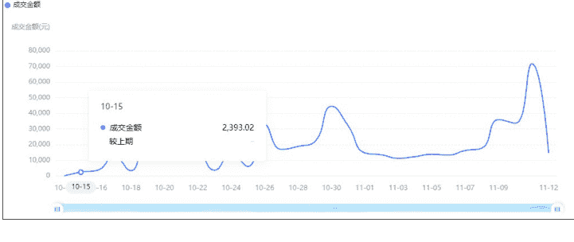

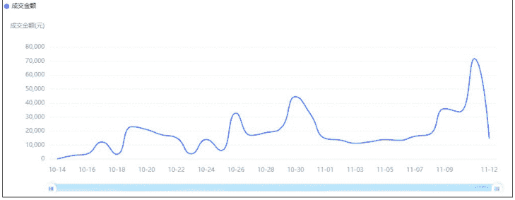

现在还在持续出单，这个视频给我贡献了一半的收入，也就是说只要有一个爆款，促销季月入 2w 是很简单的，就算没有爆款，一个视频 1-2k 利润是没问题的。

相信大家也基本了解了 B 站好物的多个流派：主流横测流、线报流、录屏口播流，以及大促节点暴力投流。

目前做 B 站好物的主要流程是选品→写文案→做 PPT→拍摄→剪辑。

下面将依次介绍如何不出镜、不录音、AI 写文案、AI 做 PPT，并在半小时内完成剪辑前的所有任务。

## 四、不想出镜+录音怎么办

### 不出镜：万能的豆包 -- 图生图+图生视频

我尝试了 wan2.2-animate-mov 和 wan2.2-animate-mix 换脸，背景效果不稳定+细节不好

最后选定了豆包（即梦也可以）-- youtube 经验带来的帮助

不管是 A-roll 还是 B-roll，都可以使用豆包来生成，量大管饱，部分实例如下：

曹操坐在一个升降电竞桌前，升降桌侧面对着镜头，曹操面向镜头，双手扶摇，比例 「16:9」

我将按照你的要求对图片进行编辑。

帮我生成视频：曹操按了一下升降桌边上的按钮，升降桌桌面开始上升，同时曹操站起来扭了扭腰

图片风格为 「电影写真」，很漂亮的布偶猫站在扫地机器人上面，地点是家里，地上有猫毛，比例 「16:9」

现在我将按照你的要求，以电影写真风格来生成布偶猫站在扫地机器人上的画面。

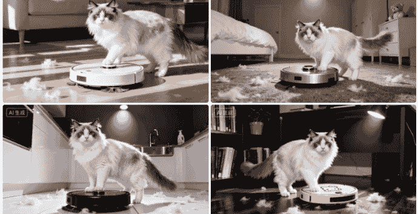

图一形象的曹操蹲在宽敞的客厅里，正面朝向镜头，正在低头看着面前摆放的五台不同的扫地机器人

我将按照你的要求对图片进行编辑。

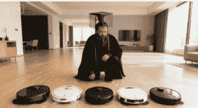

帮我生成视频：曹操沉默了两秒，抬头看向镜头，脑袋左侧亮起一个灯泡，好像有了主意，然后笑了起来

### 不录音：剪映自带音色--中文语料更多，有超仿真音色，minimax 也可以，按需选择

详见后续5.3【剪映里的提效】

## 五、我是怎么提效的（重点）

从第三个视频开始：二创，用AI帮我二创！

参考别人的选品+二创文案（等自己有3个以上视频，就使用自己文案的风格原创文案，所以第0版的流程，我做出了第3-5个视频，从第六个视频开始，我就都是原创文案了）

在二创的过程，我对比了很多AI工具：DeepSeek R1、智谱清言glm4.6、Qwen3-max、Kimi OK Computer、GPT5、Google NotebookLM。

最后选取了 Google NotebookLM 做文案（因为有知识库，不会胡编乱造） + 智谱清言做 PPT（因为有 PPT 模式，审美也还行）；

### 第 0 版的提效流程（第 3-5 个视频） --
- 【文案二创 + coze 增加选品 + 智谱清言 glm4.6 做 PPT + 豆包创作曹操 A-roll + 剪映对口型 + 剪映读文案】

为什么说第 0 版，因为这个版本已经被抛弃了，流程太长，太过冗余，但对比第一版，有助于新手学习和老手理解我迭代的过程和做视频的思路，有经验的直接跳转 5.1 部分。

#### 提示词

- 【1】
B 站视频下载：
https://snapany.com/zh/bilibili
https://peanutdl.com/zh

- 【2】
通义听悟转文本，然后导出 docx：
https://tingwu.aliyun.com/home

- 【3】
扣子选品，复制选品文案，生成 “coze 选品文案.txt”

- 【4】
通义千问：
#### 【上传升降桌和扫地机器人的口播稿】
分析这两个口播稿，总结他们成功的原因

- 【4】
通义千问：
通过以上你总结的口播稿成功原因，参考我新上传的附件，执行以下任务：
- 1. 以“投影仪_原文.docx”的口播风格为准，参考口播稿成功原因（如痛点切入、口语化、结构等等，需要你参考上面回答的分析结果）进行二创，在不改变任何产品参数的基础上，保持足够的口语化，二创文案原文不能太像原文，你可以参考B站带货的风格进行一些自由发挥；
- 2. 分析“coze 选品文案.txt”内的带货内容，对于不在“投影仪_原文.docx”的产品内容，将其融入其中，并保持和“投影仪_原文.docx”同样的风格，融入的顺序需要先分析“投影仪_原文.docx”中的带货顺序，是按照价格还是按照品牌，还是按照功能，将“coze 选品文案.txt”中存在的产品插入至对应位置，插入的产品描述的风格和字数需要和“投影仪_原文.docx”中的每个产品描述保持一致，生成一个最终口的口播文案；
- 3. 基于上述1和2任务生成的最终口播文案，以表格的形式输出每个产品的来源文档、优势、不足、关键参数等可以辅助消费者选择的信息，作为“产品总结”；
- 4. 文案中未提及的参数可以联网搜索并补充，若查找不到对应参数，则预留为“【待确认】”，不可以胡编乱造！
- 5. 每个产品的字数要和原文中每个产品的字数接近，不可删减太多字数，以汉字统计字数为准；
- 6. 最终给我的是“终版口播稿.txt”和“产品总结”；
你是否理解我的需求，理解的话先描述一遍待办项，等我确认之后再开始。
“coze 选品文案.txt”
“投影仪_原文.docx”

- 【如果文案太像则继续通义千问】：
这个终版口播稿和原文太像了，我需要你重新进行二创，给我“终版口播稿.txt”；同时字数缩减太多，我需要你把每个产品的介绍字数扩充至 500 字左右，同时结合一些实际案例说明，丰富文案的同时增加可信度，但不要改变参数；

- 【这时候可能会过度二创，继续】：
二创风格过于B站化了，容易审美疲劳，这是一个科普+导购视频，我希望你能在原文和当前的修改版本中间找到一个平衡，同时保证每个产品介绍至少 400 字；

人工润色文案，生成“终版口播稿.txt”

- 【如果字数不够，则重新通义千问】：
“投影仪_原文.docx”是参考的对标口播稿，“coze 选品文案.txt”中包含“投影仪_原文.docx”中未提及的几款产品，“终版口播稿.txt”是结合两者的内容，参考“投影仪_原文.docx”的口播风格和结构进行二创的口播稿，但是我发现“终版口播稿.txt”的字数只有4000多，而“投影仪_原文.docx”有接近10000字，所以遗漏了很多信息，这不合理，因为“终版口播稿.txt”还新增了三个品，所以有些产品的内容介绍部分做了不合理的缩减，我需要你：
- 1. 参考“投影仪_原文.docx”的内容，对“终版口播稿.txt”对应产品做补充，每个产品的字数需要和“投影仪_原文.docx”中每个产品的字数相似，不可以少太多；
- 2. 对“终版口播稿.txt”对应产品做补充的时候，也是要进行微创新的，不能原封不动的复制；
- 3. 对于仅在“终版口播稿.txt”中存在而“投影仪_原文.docx”中不存在的产品，也要扩写至对应字数，可以联网搜索需要的内容，但未搜索到的不可以胡编乱造；
- 4. 总字数应在12000字~15000字之间；

- 【5】
通义千问继续（可选，需要对 coze 选品的参数进行校验）：
这是我最终确定的文案，基于这个文案，按顺序梳理出带货的产品，并注明哪些是原文案就有，哪些是根据“coze 选品文案.txt”补充进去的
“终版口播稿.txt”

- 【6】
智谱 AI:
我提供给你一份 B 站带货口播文案，你需要根据口播文案中的内容，进行以下任务:
- 1. 生成 html 格式的 PPT，根据口播文案提到的商品，在线搜索图片和配置细节，每个商品一页 PPT，再加上开始页和结尾页，PPT 模板参考我上传的 html 附件;
- 2. 要严格按照口播文案提到的商品顺序，不能包含其中没有的商品，每一页都要包含商品主图，需要你联网搜索对应商品的主图，如果没有主图则预留图片位;
- 3. 在每一页下方添加翻页功能，最终给我补充好的完整 html 和 PPT;
“PPT 模板-单图.html”
“终版口播稿.txt”

思考:我们做横测视频的流程：选品 → 文案 → PPT → 录音+AI配音 → 剪辑

可优化：
- 选品（做减法，没必要增加 Coze 的选品，增加人工校验的工作量，和某个视频选品重复不重要，以效率为主）
- 文案（NotebookLM 用自己的文案风格直接创作，避免文案太像的麻烦）
- PPT（智谱清言挺好用，暂不优化）
- 录音+AI配音（继续不出镜，保证曹操形象 IP 固定，剪映语音+对口型）
- 剪辑（外包）

### 第1版的提效流程（第6-10个视频）——【原创文案 + PPT + 500剪映外包】
此时只需要两个工具即可：NotebookLM + 智谱清言 GLM-4。

#### 提示词

#### 1. 口播稿文案生成（NotebookLM）
我现在在做 B 站好物带货项目，我提供给你的文件中：四个“终版口播稿.txt”，是我已经做完的，四个反响还不错的视频口播稿，也就是我自己的风格；22 个京东链接是我准备推荐的产品——【显示器】；

我需要你：
帮我以这 22 个产品为主，先分析我过去口播稿的内容、结构和风格（比如采用了【引入痛点-介绍产品-总结】的结构、使用真实经历增加可信度、每几十秒就有一个吸引观众的“钩子”，增加口播视频完播率，以上只是举例，具体的需要你自己分析），再参考 22 个京东链接上的产品参数，为我创作出属于我自己的【显示器】带货口播稿，口播稿需要满足以下几个要求：
1. 提到的所有的产品可以使用产品标题中的简称；
2. 所有产品的参数一定要正确，都要来源于其产品链接中，不可以使用未提及的参数，如果有未提及的参数，请使用【待确认】预留占位；
3. 总字数在 4000-5000 字；
4. 口播稿中的 UP 主自称为 xx；
5. 口播稿要完全按照口播的形式，不需要“发言人 08:55”这种时间轴，也不需要表格，要完全符合口语化的叙述风格；
6. 款式介绍不要使用一二三这种称呼，要用“第一款”、“第二款”、“第三款”这种称呼；
7. 口播稿中避免使用“**”、“•”、“/”这些符号，而是使用口语化的表达，比如“**”完全可以去掉，多行产品前的“•”可以改为首...其次...然后...最后...的口语化表达方式，而“/”要改为“或”，双引号和脚本备注也需要去掉，以此类推，类似的符号表达尽量都避免，而使用口语化的表达，直接念出来就是口播内容。
8. 对技术术语和英文缩写不要进行音译处理和口语化替代。

好了，要求如上述，给我完整的口播稿内容。

##### 1.1（可选）
针对 B 站购物群体的特点和喜好，以带货为目的，你有没有更好的口播稿优化建议？

##### 1.2（可选）
你的建议很不错，根据你的建议，重新给我一份优化后的口播稿，总字数控制在 4000-5000 字。

##### 1.3（可选）
重新 review 你最后给我的口播稿，确认所有参数是否都是从京东商品链接中获取而来的，而没有胡编乱造的，要确认所有的参数!

##### 1.4（可选）
按照口播稿中出现的商品的顺序，给我商品的原始链接（https 开头的网页链接）和商品简称

##### 1.5（视频发布后）
参考我提供的口播稿，模拟 B 站消费者提出 10 个个性化需求的选购问题，并给出回复和推荐商品，每个问题推荐 1~2 个最合适的商品，商品需要从口播稿中获取，问题和回答都要足够的口语化。单独把 10 个问题提取出来，汇总给我（不需要 [Conversation History] 等脚本备注）。

#### 2. PPT 生成（智谱 AI）
我提供给你一份 B 站带货口播文案，你需要根据口播文案中的内容，进行以下任务：
- 生成 HTML 格式的 PPT，根据口播文案提到的商品，在口播稿中寻找商品配置细节，每个商品一页 PPT，再加上开始页和结尾页，PPT 模板参考我上传的 HTML 附件；
- 要严格按照口播文案提到的商品顺序，不能包含其中没有的商品，每一页都要预留对应的商品图片位，仅预留文字即可，不需要加虚线框；
- 在每一页下方添加翻页功能，最终给我补充好的完整 HTML 和 PPT；

> 参考文件：`参考-完整 PPT.html`、`终版口播稿-电视.txt`

##### 2.1（可选，如果 PPT 翻页符有问题）
智谱 AI：
有问题，每页 PPT 下方需要增加一个翻页符，重新给我优化后的 HTML 格式的 PPT。

#### 3. 封面制作（豆包）
参考这个升降桌的封面的风格，做一个暗色调的 85 寸电视的封面，把一排桌子替换成一排电视，字也换成酷炫的“2025双十一电视选购指南”，两行字都要居中。
> 图片：`换封面参考图片.png`

4:3 格式的也生成一张。
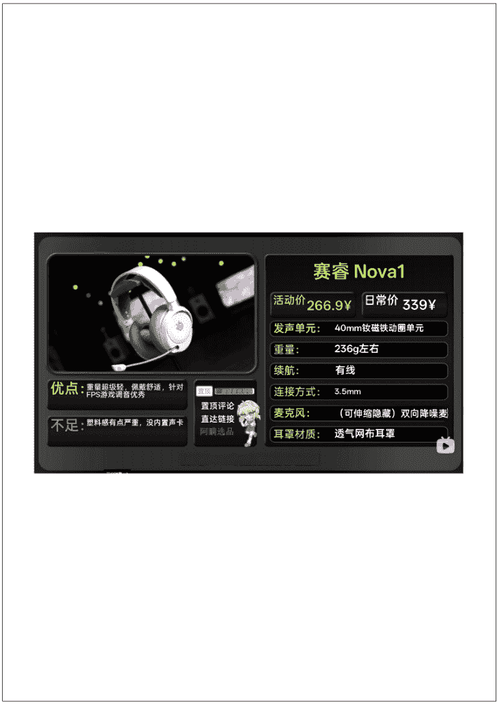

### 到此为止，文案+PPT+封面都搞定了，每天 push 剪辑即可

### 剪映里的提效

#### AI朗读语音（免费）
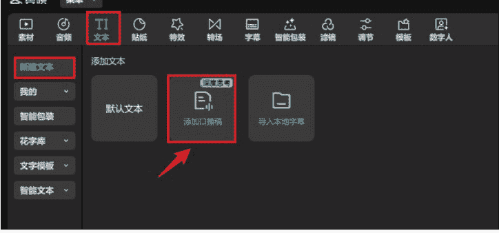
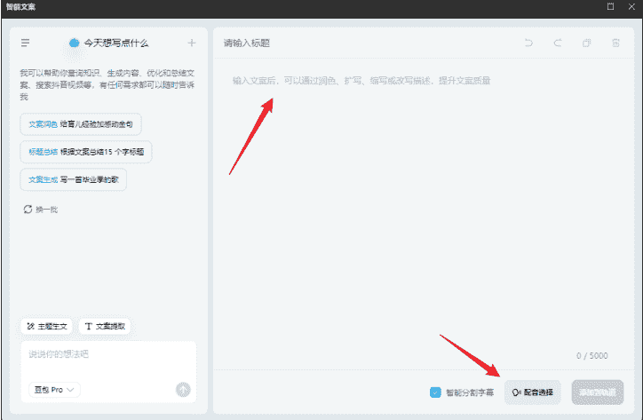
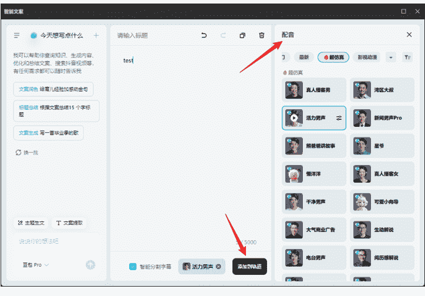

#### AI对口型（和剪辑一起外包了）
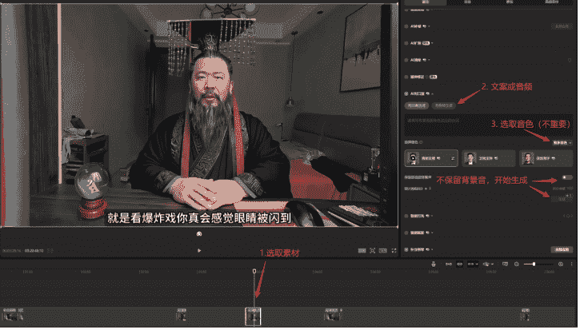

#### 商品素材下载——【批量图片下载器 Imageye】

## 六、这套方法的优缺点

### 优点：
快！对于没有自己体系的同学，以及前期不想投入太多精力的同学（比如带娃父母、主业太忙），可以快速上手，取得正反馈；
- 可以矩阵化；

### 缺点：
- 剪辑部分（特别是前半段挑选素材）很难提效，可以考虑外包；
- 容易同质化严重，所以一定要注意以下几点：
  - HTML 格式的 PPT，建议先换模板，再复刻上面的流程！避免同质化严重！！！
- 最好用自己的文案风格；
- 无脑追求极致的快并不一定就好，自己还是要花至少半个小时润色文案的，要用心做文案，用心找素材（如果自己剪辑的话），形成自己的风格很重要（这个视频开头很出彩，也是这个玩法被深海圈圈友戏称为抑郁流的原因）！
- 适合商品详情里参数非常丰富的，如果详情里参数太少，很难提取到有效信息，且无法提取价格；

## 七、不算经验的经验之谈
- 评论区很重要（每条评论必回）；
- PPT 没那么重要，视频后半段压根没人看（我忘加了一段字幕都没人发现）；
- 置换商单、出单率低的商单、<1k/2k（看是否促销季）的商单没必要接，还不够自己投入的时间成本，自己做个其他视频利润也有 1-2k，视频数量&GMV 上去了商单自然会来；
- 忌跟风热点品类，宜锁定垂直品类或人群选品；

## 八、下一步计划
其实这次分享，也是因为自己在舒适圈的懒惰，通过分享倒逼自己开发 2.0 版本进一步提效（往全自动上靠）；
- 不直接用 AI 输出 PPT，而是输出表格，结合稿定套版输出 PPT；
- 影刀采集商品详情+输入给 Coze，触发工作流，结合知识库（含自己其他口播稿），输出文案+语音+粗剪辑的剪映草稿；
- 进一步优化内容（垂直+矩阵）；

目前 n8n 还没办法直接调用 NotebookLM 问答，只有企业版的可以调用 API，需要尝试其他的 AI Agent、AI Browser 和工具，但 AI 发展日新月异，相信很快就会出来新的工具取代现在的工具。

等着我的 2.0 版本。

## 最后，安利小懒的付费群：
懒人专属群（介绍）

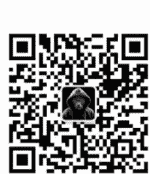

微信：lazyhelper

📺 懒人专属群持续更新中，已持续运营 6 年，整理超 3000 份各类精选付费文章 & 年费社群干货，全部开放下载。
本资料为付费群内部分享，仅供真实有需要的朋友查阅 🙇

懒人专属群更新记录：
https://hk57gytx7u.feishu.cn/docx/H0kRdZbSbolBR0xkaXtcuVE0nTg

懒人专属群更新记录（需梯子，备用）：
https://lazybook.fun/blog/record2