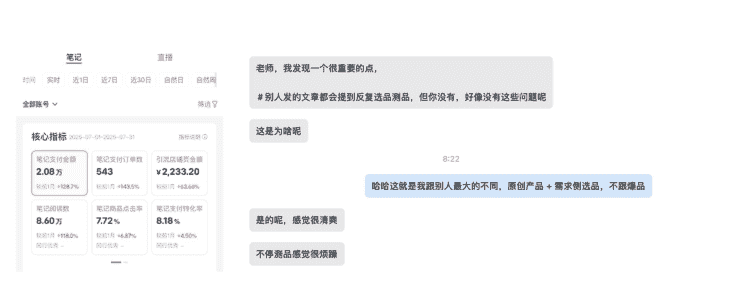
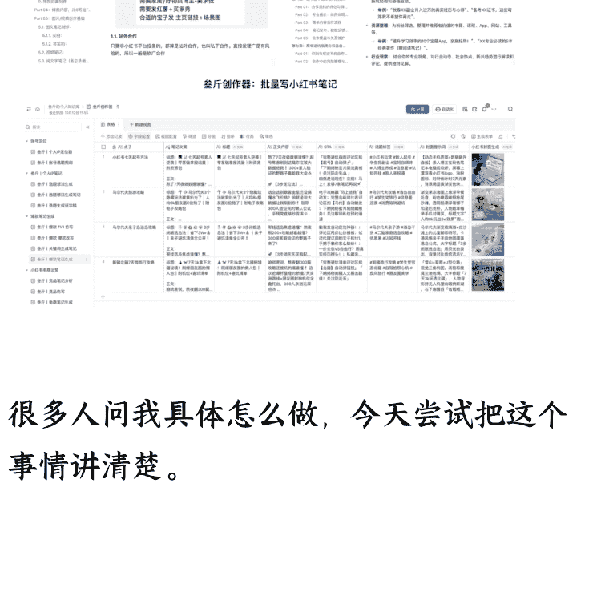
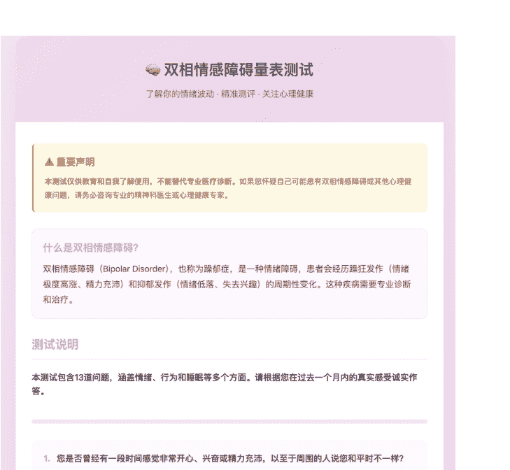
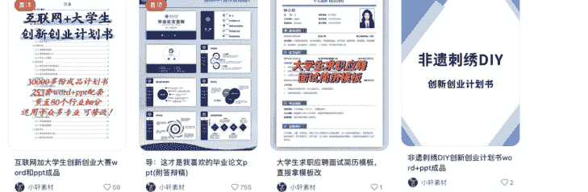
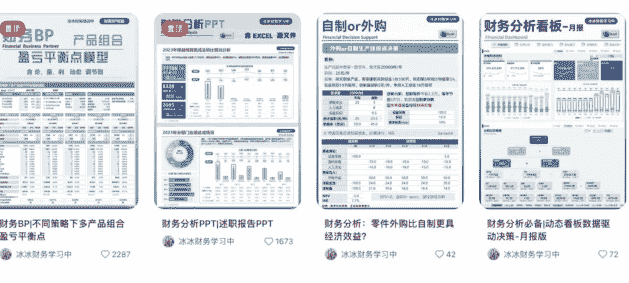
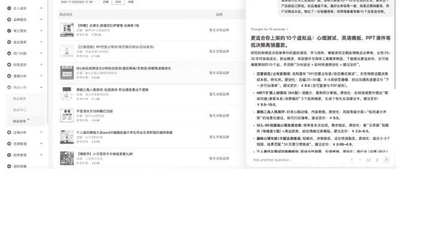
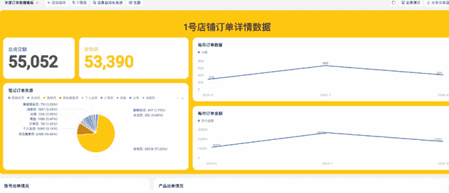
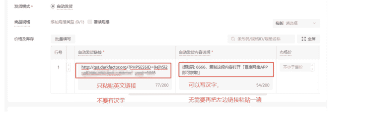
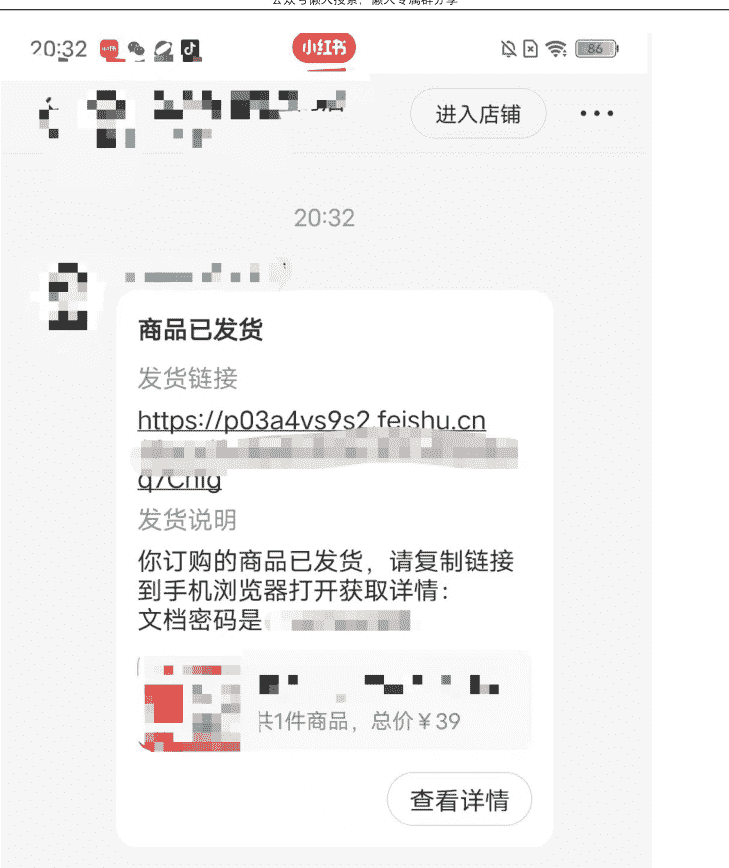

# 从 0 到 1，用 AI 做虚拟电商，新手看这个就够了
## 251127 副业 SC 精华

公众号懒人搜索，懒人专属群独享

懒人微信：lazyhelper

5 月份，我用 AI 做了第一份虚拟资料，6 月份开始卖，7 月份之后，平均每个月 2 万左右销售额，加上私域低转高，平均每个月 5 万左右，这两个月突破 10w+。

刚好，前两天也有个朋友问，为什么别人的文章都会讲反复选品测品，但我的不需要？

这就是做「虚拟电商」，和做「虚拟资料」的区别。我是从需求侧做选品，并且都是原创产品，几乎不跟爆品。我也调研过很多销售百万的产品，卖这些产品的店铺，几乎都是只有两三个品，这几个品他们可以一直做。而且我很讨厌选品测品的环节，我比较懒，想找一个长期有需求的产品，然后一直卖。

以下这几个产品，就是我用 AI 做的，都是基于用户需求，借助 AI 辅助原创出来的。但绝对不是瞎写，而是让 AI 基于我的知识库，我过往的认知作为基础去写的，对用户来说，是有价值的。

很多人问我具体怎么做，今天尝试把这个事情讲清楚。

# 1. 关于虚拟电商的一切

前面我说，做「虚拟电商」和做「虚拟资料」是有区别，在我眼里这是两个不同的项目，或者说，是包含和被包含的关系。

## 1.1. 什么是虚拟电商？

分两个概念解释：虚拟产品和虚拟电商。

一切不需要物流发货的产品，都可以算是虚拟产品，比如 PPT 模板、文字资料、知识库、一对一咨询、简历模板、网站会员、AI 工具等等，都算。

卖这些产品，就叫虚拟电商。与实体电商一样，有无数的品类，无数的可能性。

前面说的虚拟资料，K12 资料、简历模板等等，只是这里面一小块分类。盗版资料或者无版权资料，就约等于实体电商的无货源。

这么解释应该能理解到了吧？他们大多是找一些无版权的资料，那肯定是一直需要选品、测品，因为产品本身没啥竞争力。但这只是让我感觉麻烦一点点，并不代表赚不到钱。做虚拟资料赚到钱的也大有人在。

我做的是虚拟电商，可以等同于实体电商的自有供应链的产品。我不是卖别人的资料包，而是自己做一份资料卖出去，不是倒卖，赚信息差的钱。所以，明白了吗？

## 1.2. 为什么建议做虚拟电商？

### 1.2.1. 市场空间还有很大

虽然虚拟资料项目很早就有了，但大部分人做的都是「虚拟资料」，只是在一小块领域饱和了。比如，K12 资料、TED 演讲稿这些，算是比较饱和，产品同质化也比较严重。

但放大到虚拟电商，市场距离饱和还有很长一段距离，真正好的产品，依然非常稀缺。所以很多个性化的知识库，能卖的特别好，比如下面这个：

¥119 券后价 ¥249
已售 1917
商家券 | 满 200 减 130
浮光之镜 | 艺术图书馆 | 永久使用 · 永久会员

这种产品不需要你有什么资源、能力、学历……只要你有某个需求，然后你做了个产品，满足这个需求，这个产品就能卖。任何一个小的需求，放到足够大的市场里，都是一个大的需求。

### 1.2.2. AI 让原创产品变得简单

原创资料并不意味着一定要有某个技能，尤其是现在，AI 成为普通人最大的杠杆，抹平了学历、技能、经验的差距。

就拿我来说，一个大专学历，从销售转型到小红书运营的，不太可能独立写出一份 6 万多字的《小红书个人 IP 手册》，甚至我可能连手册的框架都搞不好。但借助 AI，我可以很轻易做出这些产品。

还有最近很火的测试类网站，在没有 AI 的时候，我是绝对不可能做出来的。但现在有 AI 了，我可以很轻易的做出类似这种测试网站：

相似的还有很多，比如多维表格批量写笔记的工具，也是依靠 AI 帮我做出来的。

### 1.2.3. 其他优势

除了前面两个比较有特点，虚拟电商还有很多优势：

- 1. 启动成本接近于零：跟实体电商不一样，你无需进货、囤货，而且产品是链接或文件，线上交付，不需要打包和快递。
- 2. 极低边际成本：制作一份产品的成本是固定的，从卖出第 2 份到第 10000 份，几乎都是净利润。
- 3. 无限库存：永远不用担心囤货或断货，一份产品可以无限次复制、出售。
- 4. 低风险售后：退货率极低，即使退款，也无金钱损失。
- 5. 合规低风险：所有交易在小红书店铺内完成，全程合规，没有“私域引流”被封号的风险。
- 6. 小红书平台支持：小红书平台正在支持虚拟电商，还开通了自动发货功能。
- 7. 出单快，反馈及时：产品单价通常不高，用户决策成本低，容易产生冲动消费，能快速获得正反馈。
- 8. 天花板足够高：通过精细化运营和矩阵化放大，这是一份可以长期发展、收入不断增长的事业。

......

## 1.3. 新手常见误区

- 1. 自己没专业知识做不了产品
AI 平权时代，真的不需要你有多专业，只需要比用户多懂一点点，再结合 AI，就能做好产品。
- 2. AI 做的东西有用么？
AI 足够强大，这一点请务必相信。在大部分专业资料领域，AI 甚至比人厉害 100 倍。
- 3. 虚拟产品竞争太激烈
相信我，你 90% 的竞争对手，他们都在瞎做。搬运、抄袭，都在违规的边缘反复横跳。

# 2. 虚拟电商怎么做？

前面已经看了很多废话了，虚拟电商到底怎么做？

## 2.1. 虚拟电商流程

实话说，整体流程跟小红书电商几乎一样。

- 初步选品：在赛道内，找到一个有需求、有利润的细分产品。
- 账号搭建：注册小红书账号，做好账号定位，打造专业人设。
- 开店与产品制作：正式开通店铺，并将你的虚拟资料制作好。
- 上架与发布：将产品上架到店铺，发布商品笔记。
- 出单与交付：笔记有流量，很容易就出单了。现在小红书可以自动发货，只要发笔记，发货和售后都能自动完成。

后面我们会把一些步骤拆解一下，具体讲解。像怎么注册小红书、怎么开店这种，就不在这讲了，这些到处都有流程图。

流程虽然跟小红书电商一样，但我的虚拟电商还多了一步：低转高。

意思是，卖虚拟产品不是最终目的，用虚拟产品筛选愿意为你付费的用户，才是最大的价值。让用户购买虚拟产品，在使用、认可产品后连接到私域，私域里可以多次触达用户，多次成交。

## 2.2. 新手建议从哪里开始？

虽然有低转高流程，但前期还是要做个低价的产品。个人建议，新手可以做一个 50 元以内的测试品跑通流程，这个非常重要。

新手在做项目的时候，讲什么长期主义，都是扯淡，相比之下，即使反馈更加重要。一切都要往最快正反馈的方向做，先把便宜的产品卖出去，赚到第一块钱，再考虑其他。

我新店的第一个产品选的是小红书运营赛道的 IP 起号教程类资料，用户加到私域后，可以二次付费购买我的社群和其他产品。

# 3. 虚拟电商选品

虚拟电商的流程很简单，但我不打算按流程顺序讲，因为那样太枯燥。

我会按重要性来讲：先讲最核心的选品，再讲基础操作，最后讲下笔记。如果你是完全小白，建议先通读一遍，再回过头来按流程实操。

如果要说虚拟电商有难点的话，我觉得选品是一个。没有选好产品，项目就无法开始。这里分享一些比较重要的选品方法：

## 3.1. 人群 + 需求选品法

好产品不是创造出来的，是被挖掘出来的。我最核心的选品方法，就是从“找产品”到“定人群”。

很多人做虚拟资料，都是「杂货铺」思维。就是自己店里什么都卖。看别人卖什么产品火，就上什么品。要么就是跟爆款，依赖灰豚、野马等数据工具，去搜寻和模仿已有的爆款。

这本质上没错，有句话叫「取法于上，仅得为中；取法于中，故为其下」，跟爆款，就非常容易陷入同质化竞争，永远在追赶别人。不是说这个方法不好，很好，容易出单，但一个品今天爆了，隔天立马 10 个店、100 个店上同一个品，爆款生命周期被无限缩短。我觉得做起来太累。

我的目标不是卖出一份资料，而是深度服务好一个特定人群，后续才会有低转高的可能性。

我的选品方式有一点独特，我选品选的是「人群」，找到一个特定的人群，发现他们遇到的一个具体问题，然后创造一个产品来解决这个问题。最简单的定位方法，就是「你想赚谁的钱」？

比如我在卖手机壳的时候，也会上很多产品，但只服务苹果手机用户。因为他们对手机配件的价格没那么敏感，我想赚他们的钱。其实只要你明确了想赚谁的钱，账号运营方向、选品，自然就有了。

给大家拆解一个完整案例，看我是怎么从人群到产品的：

### 第一步：锁定高价值人群
我当时想做的人群是：想在小红书上做项目赚钱的人。

为什么选这个人群？
- 1. 他们有明确的赚钱需求，付费意愿强
- 2. 这个人群我自己就是，我懂他们的痛点
- 3. 人群足够大，小红书搜索「做自媒体」相关的关键词，有大量需求

### 第二步：系统性挖掘痛点
我用了 3 个方法挖掘这个人群的痛点：
- 1. 小红书搜索关键词，看评论区
主要搜索「个人 IP」「小红书赚钱」「小红书运营」之类的，看大家在评论区问什么。常见的是：不知道怎么赚钱、不知道卖什么、账号定位不清楚、不知道怎么起号……
- 2. 加同行的社群，看他们在聊什么
我加了 5-6 个做小红书培训的社群，发现大家最常问的是：如何从 0 开始、IP 怎么定位、第一个产品怎么选
- 3. 用 AI 分析需求缺口
我把收集到的问题投喂给 AI，问：这些问题背后，缺少什么类型的产品？
当时 AI 给我的结论是：市面上有很多课程，但缺少一份系统的、可随时查阅的起号指南。

### 第三步：确定产品方向并验证
基于前面的分析，我确定做：《小红书个人 IP 起号手册》

为什么是手册，不是课程？
首先，课程需要花很多时间看视频，还不一定对用户有帮助。但手册类的，可以随时查看，随时搜索关键内容。定价在 39 元，也比其他人的 1 元引流款，更有利润空间，而这些人如果看了手册有用，也会认可我的实力。最重要的是，手册更容易用 AI 辅助完成，比课程更容易。

### 在决定做之前，我还做了几步验证：
- 1. 我先发了几条「小红书起号避坑」类似主题的笔记，数据不错
- 2. 还在评论区帮别人诊断账号，并且适当的时候提问「如果有一份完整的起号手册，你愿意付费吗」
- 3. 有挺多人是感兴趣的，所以我就开始做了

### 第四步：用 AI 快速原创
我把我过往所有关于小红书的内容，投喂给 NotebookLM：包括我写过的笔记、我的实操经验、我踩过的坑等等，然后让 AI 生成框架，然后我再补充细节，最后成品 6 万多字。

这套方法可以复制到任何领域。比如，小红书虚拟电商 top 级商家 @小轩素材 也是相似的做法，他只服务大学生和研究生群体，所有产品都围绕学业和求职展开；

还有 @冰冰财务学习中，她的用户画像就是 500 强企业的财务人。他们都不是在盲目跟风，而是在深耕自己目标人群。

虽然他们不一定借助 AI 原创，但至少说明这一套选品方式，底层思路是没错的，是可复制的。

## 3.2. AI 浏览器直接选品
如果要跟爆品，或者找爆品方向做原创产品，可以用 AI 浏览器直接找选品。

我用的是 Dia 浏览器，打开灰豚数据，调出销量榜单，跟他说你想做什么，目标人群是谁，对选品有什么要求。AI 就可以读取网页信息，按照你给的要求做选品推荐。我经常用这个功能，可以快速帮我筛选适合的选品，比眼睛看快多了。

选品这个有要求，首先你得有个销量榜单，可以用灰豚数据，或者野马数据，都可以。野马数据只有虚拟产品，不全面，但免费，可以自行找链接。

## 3.3. 其他选品方法
常用的选品方法还有很多，这里简单分享一下：

### 3.3.1. 找被低估的细分需求
选品 2 个常见误区：
- 1. 很多人卖低价的产品，但并不意味着这个产品不能卖高价。
- 2. 没有人卖的产品，不一定没有人买。

解决这两个误区，能发现大量的产品。比如，我的小红书 IP 手册，之前几乎没有人卖，大部分都是 1 块钱低价引流。但我不想用这个方式引流，我想把资料做好一点，卖贵一点。于是我写了几万字，挂了 39 的价格，效果还不错。事实证明，这个方式并没错。

还有，之前小红书上几乎没有人卖装修知识库，大部分都是装修公司用来引流免费送。但其实，这个产品存在机会，有个账号做了，十几块钱的产品卖了 5000 多份：

不要被前面两个误区先入为主，别人卖的低价，你做好一点一样可以卖贵一点。没有人卖的东西，不意味着没有人买。小红书虚拟电商，这里的产品空间非常大。

### 3.3.2. AI 分析需求
如果自己发掘不了需求，也可以利用 AI，挖掘需求选品。

比如：我直接问 AI，我想小红书千帆数据看板不够直观的问题，并且问他能否做一个飞书多维表格，导入后台数据后，自动生成可视化仪表盘，并内置利润、成本等计算公式？然后他就能给我一个方案。

AI 虽然不能直接生成文件，但给了我完整的搭建方式：需要哪些数据表，每个表的具体字段、字段类型，需要用到的计算公式等等，都写的很明白。

我按照 AI 提供的结构，在飞书多维表格中手动设置表头、字段和公式。成功制作出一个可以计算平台扣点、产品成本、运营提成、物流成本，并能按月度展示利润的可视化数据看板，远比官方后台强大。这个看板本身就是一个极具价值的原创虚拟产品。

这个产品如果完善一下，也是一个不错的产品了。

## 3.4. 一定不要碰的几个选品

### 1. 有法律/平台风险的产品
这类产品短期可能能赚钱，但长期一定会出问题。虽然有很多版权产品，大家都在卖，但我是坚决不碰的。这属于把命脉交给别人，别人开心了，就不管你。不开心了，就一锅端。

我经历过一个事，有个公司他们手上拿着非常多版权，有很多版权都被人盗用且商用，他不管，但是收集证据。当哪一天心情不爽了，盗版的人够多了，就统一发律师函。讲的已经很含蓄了，真正的过程比这个更吓人。也不是要制造焦虑，我是发自内心觉得，盗版不是什么好事。有很多老师说，盗版快，我是一直不认可。尤其是现在，有 AI 了，原创能力实在有限的话，大不了伪原创嘛，总之不能让自己背法律风险。

还有，免责声明就是纸糊的一样。如果我想揍你的话，我先给你个免责声明：对不起，我先揍你一下，如果你觉得我揍得不对，那我下次不揍了，然后给你一拳。这个免责声明你接受吗？

### 2. 交付成本高、售后多的产品
还有个新手最容易掉进的坑就是：低价卖服务。比如 9.9 元帮人做 XX，结果发现自己成了客服，每天被用户追着问。虚拟电商最理想的产品是「一次生产，无限复制」，如果你的产品做不到自动化交付，就要深度考虑一下。

### 3. 过度饱和的同质化产品
市面上已经有几千家在卖的东西，你再进去就打价格战。除非你有流量优势或价格优势，要么你的产品吊打同行，否则不建议新手碰。

# 4. 账号和店铺搭建

具体开店之类的就不重复了，可以去小红书商家课堂看具体流程，官方流程一定比外部的更详细。这里重点讲 2 个新改的规则：

## 1. 选对类目。
现在直接选择「电子资源」就可以了，几乎涵盖了所有虚拟产品。

请输入商品名称关键词搜索，如：帽子、面霜

| 一级类目 | 二级类目 | 三级类目 |
|---|---|---|
| 美容护肤/美体/精油 | PPT/简历/其他模板 | |
| 洗护清洁剂/卫生巾/纸/香薰 | 课件/教案/手抄报 | |
| 办公设备/耗材/相关服务 | 软件/插件/源文件/ai工具/其他... | |
| 文具电教/文化用品/商务... | 头像壁纸 | |
| 彩妆/香水/美妆工具 | 其他电子资源 | |
| 厨房电器 | | |
| 成人教育 | | |
| 个性定制/设计服务/DIY | | |
| 电子资源 | | |

上面仅展示店铺可售类目，如需售卖更多类目请新增品类

## 2. 关于自动发货：
目前小红书是支持自动发货的，只要选择「电子资源」类目，在产品设置界面就可以设置自动发货。包含：

- 自动发货链接：这里只需要填写链接部分，密码和网盘提取码之类的都不要写，不要有中文。
- 发货内容说明：这里就是补充内容说明，是网盘发货，还是什么，都在这写，包括你的文档密码之类的。

## 用户收到之后，是这样的：

也就是说，小红书虚拟电商可以实现自动发货，不需要再购买第三方工具了。

# 5. 笔记制作（AI 版）

小红书笔记制作如果从爆款原理、拆解这些聊起的话，那写不完了，而且你也不爱看。所以，直接给你们 2 个 AI 仿写流程，这俩流程都是我日常在用的：

## 5.1. AI 直接写笔记
在让 AI 生成笔记前，需要准备好以下资料：个人介绍（项目相关）、产品/服务介绍、相关知识库、过往笔记内容（如果有的话）等等。然后按照以下流程写笔记：

- 1. 确定文案选题和所有信息
- 2. 投喂知识库和风格
- 3. 生成文案

我一般用 Gemini 直接生成，只要投喂的风格足够好，基本上不用怎么修改就可以直接发了。这里用的是朋友圈文案的图片，小红书笔记也是一样的：

公众号懒人搜索，懒人专属群分享
### Gemini
2.5 Pro
锦湋
我想写一条朋友圈，大概观点是，让大家放心大胆的去做自媒体，不用有变现焦虑，也不需要限制自己，只要能赚钱，什么都能做。赚钱又分短期和长期，刚开始的时候...

显示思路
好的，我明白了。你的核心观点是：做自媒体的根本目的是为了“提升收入以活得更好”，因此不应有变现焦虑或自我设限。在此基础上，对于刚起步的普通人，应该优先考虑“赚快钱”来获得正反馈和生存资本，而不是一开始就执着于“长期主义”。这是一个非常务实且有力的观点。我会按照你的这个思路，并沿用你一贯的“朋友圈文案”风格（篇幅有一定深度、极简段落、大量留白、语言高度直接、逻辑清晰、观点突出、务实），来帮你梳理和撰写这篇文案：

很多人想做自媒体，做小红书。
但没想明白为什么要做？也不知道到底该怎么做？
今天看了一本书，里面的观点很有意思。
大概意思是说，大部分人真正底层的需求，其实是“让自己活得更好”。
要达成这个目标，有两个方式：提升收入和降低消费。
但人都有欲望，不愿意降低消费。
那就只剩一条路：提升收入。
自媒体，只是你看到的、用来提升收入的其中一个方式而已。
所以，你可能不是真的想做自媒体，也不是真的需要上班。
你只是需要一份收入。
想明白这一点，思路一下就开阔了。
你不是只能通过接广告变现。
你还能卖产品，还能把自己的知识、技能，打包成虚拟产品卖出去。
任何能搞钱的方式，都可以做。
也别有“变现焦虑”，害怕一谈钱，就俗了。
一点也不。你的底层目标就是为了变现，为了活得更好。
说到赚钱，其实还分两种。
一种是赚快钱，一种是赚慢钱，或者说长期价值。

### 这个方法唯一的重点，就是给 AI 的知识库和风格笔记。给你们看下我给 AI 的资料：

公众号懒人搜索，懒人专属群分享

也建议大家有意识的去收集、统计自己的个人信息，能让 AI 快速了解你，非常方便。

## 5.2. AI 浏览器仿写

这里还是用到 DIA 浏览器，打开小红书，找到你觉得写的好笔记，什么类型的笔记都可以。

跟 AI 说，帮我改写这个笔记。这里没有固定提示词，主要看你想改什么。

比如这个，我觉得他文案结构还不错，他卖的是教育产品，我就试试用同样的结构，把卖产品的部分改成民宿，结果还不错。

这个方式真的巨简单，但是很多同学仿写会有个误区：只有竞品、对标的笔记，才能仿写。

### 错！大错特错。

AI 比你想的厉害很多，只要你觉得这个笔记写的不错，互动评论很多，就值得仿写。只要让 AI 把里面卖的产品，换成你的产品，就行了。

它会自己分析，在保留爆款结构的同时，让文案适配你的产品。

# 6. 怎么放大

分享虚拟资料放大 100 倍的 7 种打法。我觉得，只要选择其中一种，都能比你现在赚的多。

### 第 1 种：个人 IP 驱动

这是目前最有效的放大方式。在小红书、抖音、视频号持续输出专业内容，建立人设。这样引流来的粉丝，是最高质量的私域。

比如你做考研资料，不是直接卖资料，而是分享考研经验、学习方法、院校分析。用户因为你的专业度关注你，自然会买你的资料。

关键是一个 IP 可以承载多个产品线。

当你有了 1 万粉丝，可以卖考研资料、学习工具、一对一咨询，甚至开训练营。一个用户的终身价值可能是几千块。

但这个打法需要你有持续输出能力，而且要真的专业，虚假人设容易崩。

### 第 2 种：资料 + 群答疑

就是卖资料的时候，把用户拉到一个群里，让用户有问题在群里问，你来解答。这样做的好处是，用户觉得买的不只是资料，还有后续的服务支持，付费意愿会更强。而且群里的讨论，会让资料的价值放大。

更重要的是，群也是你的私域。

你可以在群里推新产品，做活动。一个 500 人的群，就是 500 个精准用户。

这个打法的关键是，你要真的能解答用户的问题，而且要及时回复。如果群里没人管，很快就会变成死群。

还有最重要的，一定要控制舆论和差评，一旦群里发现产品相关的负面舆论，要及时纠正，把方向掰回来，并私聊对应应用户，是出于什么情况发负面舆论？该补偿的补偿，否则容易引起产品负面信息。

### 第 3 种：知识库

这个是把资料做成知识库的形式，用户付费后可以永久访问。比如做成飞书知识库。好处是用户体验更好，查找更方便。而且你可以持续更新内容，增加用户粘性。用户会觉得买的是一个持续更新的知识库，而不是一次性的资料。

这种模式特别适合那些需要经常查阅的工具类资料，比如我的《小红书运营手册》。但是要注意，知识库的门槛比较高，需要一定的内容能力。内容要足够丰富，不然用户会觉得不值。

还有，知识库可以跟第 2 种社群答疑做结合，在知识库的基础上增加社群答疑服务，这样用户会觉得更值，客单价也能卖的更高一些。

### 第 4 种：免费引流+高价后端

这个打法最常见，就是用免费资料吸引用户，然后销售高价产品。

这里有 2 个点，首先是用户需求必须一致。

比如你做创业陪跑服务，就可以免费送《创业必备 100 个文档》，吸引创业者加你微信。但这些人还会需要创业指导、项目对接、资源整合。

你就可以顺势推出高价的创业陪跑服务。

假设一年能收 2 万。1000 个免费用户，转化 10 个高价用户，就是 10 万收入，而且这个转化率不算高的。

但这个打法有个前提，你必须有能力做出真正高价值的后端产品。如果只想低质量交付割韭菜，那可能也做不长久。

而且免费吸引来的用户质量参差不齐，你要有很强的筛选和销转能力。

第二个是付费意愿。

你要确保这些人有付费能力。比如同样的资料，你是针对企业老板，还是个人用户？

一定是企业老板，只有他们才能付得起更高客单价的费用。

那对应赠送的资料，就一定是企业老板们需要用到的资料，而不是运营员工需要用到的。

很多人用免费资料引流就会有这个问题，明明目标是企业老板，却用一些员工用的运营 SOP 去引流，吸引来的人都没有决策权，结果转化率肯定低。

### 第 5 种：矩阵化运营放大

这个是最常见的放大方式，就是做一个矩阵。

矩阵分几种，产品矩阵、内容矩阵、账号矩阵，我们一个个来。

- 1. 产品矩阵

  就是做同个类型的多个产品，比如你做职场资料，可以分成：简历制作、面试技巧、职场沟通、升职加薪等多个细分产品。

  只要产品是同一个人群需要的，那就不算杂乱，一个用户还有可能多次复购，买多个产品。

- 2. 内容矩阵

  这个在之前讲获客的时候分享过，简单来说，就是多发内容。一个账号发还不够，还要做素人矩阵，做晒单笔记等等。

  多找一些人，在店铺下单，并且发一篇晒单笔记，你提供内容给他们代发就行。

- 3. 账号矩阵

  这个就很好理解，多做几个账号。小红书有「账号关联」功能，一个账号开店，可以关联 3 个子账号。

  每个账号都可以专注一个领域或者一个内容类型，但背后都是关联在同一个店铺。

  你可以招团队，大量生产内容。一套成功爆款模式，复制到多个细分账号上。

  如果一个人运营不来这么多账号，也可以招聘线上兼职帮你运营，只要设置好工资和提成就行，虚拟资料成本低，完全能覆盖掉这个成本。

### 第 6 种：低转高

我做虚拟电商一直有规划低转高的流程，就是说，卖资料不是我的目的。

虽然 39 块钱的客单价，在虚拟电商这里不算低，但要赚到我的目标收入，靠这一个产品不够，所以要搭建更高客单价的产品。

我把 39 的产品当作基础收入，每个月保证有生活费就行，重点心思在于，如何把购买 39 元资料的人，转化成 399 的社群成员？又如何转化成更高客单价的年度私教学员？

垂直人群，就能做到低转高，建议做虚拟电商的小伙伴，都要搭建一套自己的低转高流程，卖资料不应该是我们的目的。

### 第 7 种：乘风投流放大

最后，是很多人忽略的类型：广告投放。做虚拟资料，我是非常推荐投流的。为啥？因为边际成本极低，投产比贼高。

你只要有 3～5 条笔记转化率还可以的，拿去投流，就能支撑你 50%以上的销量。如果你加大投放金额，甚至能支撑 80%的销量。

而且，你的 ROI 只要大于 1，那就赚钱。哪怕投 100 块钱，只回了 101，你也赚 1 块钱。更何况，内容好的话，ROI 一般不会低于 2。也就是消耗 100 块钱，至少能获得 200 销售额。

这比实体产品投流，划算太多了！

都不需要每天发多少条内容，只要有几条笔记投流转化率还可以的，就能一直投。

我能做到一个月大约有 2~3 万左右，除了有私域高客单，最关键的，就是我投流了。虽然投流金额并不多，但是 ROI 非常划算，还能撬动免费流量。

以上，有这些知识也够了，至于图片，如果不会的话，我们下次再说。

再给一个小建议：

不要用定式思维做小红书。啥叫定式思维？最经典的，就是做什么都要有「标准」。
这是应试教育下大部分人的固有思维方式。
在小红书上的体现为：什么时候发笔记最好？每天要发多少笔记？笔记要不要挂链接？话题要写多少个？要写什么样的话题？视频要多少秒？图片要多少张？......
类似的问题真的太多了，但这些一点都不重要。

做自媒体不是考试，是没有所谓固定答案的，也就是说怎么做都是对的，没有说「怎么做更好」，怎么做都很好。

半夜发笔记，好。早上发笔记，好。下午发笔记，好。挂链接，好。不挂链接，好。

做自媒体一定要足够灵活，足够反叛，只要在法律范围内，平台规则内，你可以做任何尝试。

也许某一次奇奇怪怪的尝试，刚好戳中用户的点，这个笔记就能爆。

最后，安利小懒的付费群：

懒人专属群（介绍）

懒人专属群持续更新中，已持续运营 6 年，整理超 3000 份各类精选付费文章 & 年费社群干货，全部开放下载。

本资料为付费群内部分享，仅供真实有需要的朋友查阅 🙏

懒人专属群更新记录：
https://hk57gvIx7u.feishu.cn/docx/H0kRdZbSbolBR0xkaXtcuVEOnTg

懒人专属群更新记录（需梯子，备用）：
https://lazybook.fun/blog/record2