# 教师资料 20000 单深度复盘，普通人如何快速入局

251127 副业 SC 精华
公众号：懒人搜索，懒人专属群独享
懒人微信：lazyhelper


大家好，我是郭耀天，人称郭少，生财八年圈友，一直专注虚拟资料运营开发推广。

看到亦仁发布了小红书虚拟超级标，里面提到教师资料最近很火，其实教师资料比较火的时候是每年开学时候，算是教师资料最爆的时候。操作教师资料一年了，我把我如何从第一单到 20000 单，给大家复盘下，教师资料有哪些变现方式，普通人如何借助教师资料快速赚钱。

## 第一：操作一年拿到的结果

截止目前卖了 23000 单，开学高峰期是一天 300 单，主要是系统成交的。我们目前操作的玩法是，把粉丝引流到私域，再成交到系统。私域成交是系统成交的三到五倍，很多老师购买的是单篇会员，系统主要是转换升单购买会员，购买资料库。如果算上私域成交，其实做了十来万左右了。

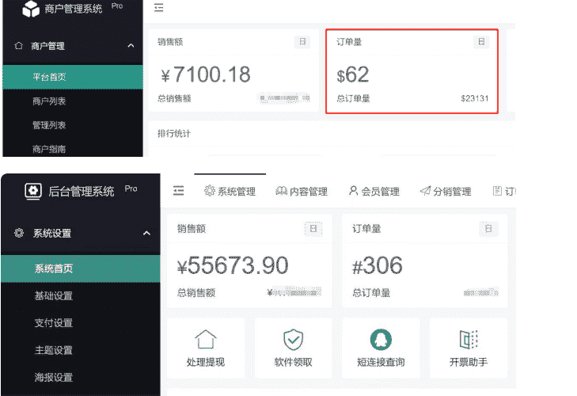

## 第二：发现需求开发教师项目

创业到现在一直操作虚拟项目，21 年上线公文项目，前后卖了几十万单，带着身边不少兄弟拿到不错的结果。公文项目前后操作了五年，随着市场的变化，平台的打击，同行增多，团队不能只靠一个项目，得开发新的项目。一次偶然的机会，参与公文项目的一个伙伴，是一个老师校长，教学专家，后面才知道当校长 20 多年，靠卖教师资料一个月能卖四万的收益。通过他的了解，快速借助公文资料的玩法，收集全网教师相关的资料，上架到我们开发的虚拟资料系统，开始卖。

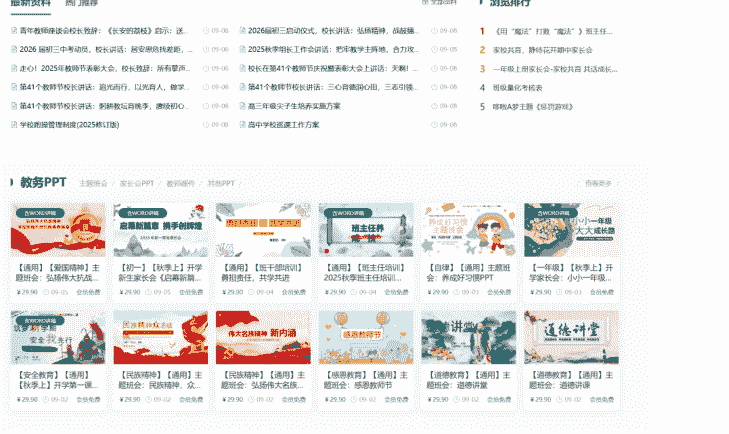

教师资料理解起来也简单，就是教师教学课程总的各种资料，比如各种班会 PPT、班主任资料、校长讲话稿、各种学科课件。这里可能有很多人会有疑问：老师不会自己做吗？为何给你买？很多课件 PPT 上课几十分钟，制作需要几个小时或者更长的时间。如果几元钱买个会员可以直接用，谁去花时间做。


个人靠网盘发货，高峰期一个月卖了四万，给我很大的信心。如果借助我们开发的系统，不是可以快速搞起来吗？

说干就干，花了两周的时间，研究同行，找资料，搭建系统，快速把系统搭建起来，9 月 12 号开始测试系统。

对接上面的老师，前期我把全部利润都给他，第一次就出了很多单，给了他很大的信心，只需要搞流量，不需要钱的各种对接发货。


借助系统后，老师一个月搞几万更轻松了。

我开始研究教师资料的各种推广玩法，当时做的人不多，随便发都火，引流也简单，内容不敏感。

我们自己也测试，很快也拿到结果。我表妹，也是生财圈友，上还在大学，我让他跟着操作教师资料，一个月也能拿到几万收益。截止目前，一年时间，靠教师资料赚到三十万左右，毕业就提了人生第一台车，星球也分享了不少他的操作思路。

## 第三：为何教师资料值得做

### 一、市场需求大

中国有多少老师？根据教育部数据，截至 2024 年，全国各级各类学校专任教师超过 1900 万人。

这 1900 万人，每个人每年在教学资料上的刚需支出保守估计在 500-2000 元之间。这是一个什么概念？

即便只覆盖其中的 1%，那也是 19 万的目标客户，市场空间至少在 9000 万到 3.6 亿之间。

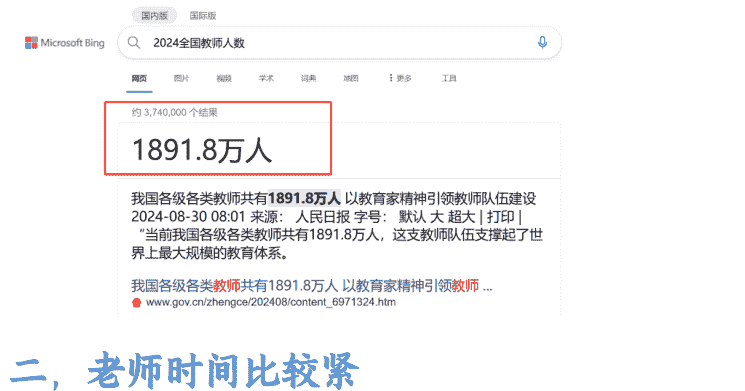

### 二、老师时间比较紧

我专门去研究了一下老师的工作状态。说实话，看完之后我挺心疼的，现在的老师真的太累了。现在我孩子也读书了，每天各种作业、考试，我还是了解一点的。

- 每天 6-8 节课，备课、上课、改作业
- 各种会议、培训、教研活动
- 写不完的教案、总结、计划、反思
- 应付不完的检查、评比、考核
- 还要管家长群，处理学生问题

我很多同学就是老师，他们经常熬夜到 12 点在改作业、写材料。

在这种情况下，如果有现成的、高质量的资料能直接用，老师们的付费意愿是非常强的。这不是锦上添花，是雪中送炭。还有一个点是，比如一个主题班会 PPT，制作一个 PPT 需要两三天，讲只需要 40 分钟，谁会去制作？就是因为老师不去制作，就去想办法购买一些现成的资料，需求就出来了。

### 三、竞争不算激烈

教师资料赛道说大不大，说小不小。淘宝、拼多多上有卖教学资料的，但基本都是几块钱打包几千个文件，质量参差不齐，老师下载下来还是要自己改。小红书上有分享教学资源的博主，但大多是兼职在做，没有形成系统化的产品和服务。真正把这个事情当成一个生意来做，建立起完整的产品体系、获客体系、服务体系的，其实不多。所以我们干了这个事情，把全网的爆款的教师资料，全部收集到系统中，只需要购买会员，就可以无限制的下载使用。

这就是我们的机会。

### 四、付费周期强

教师这个群体的付费意愿特别强，而且需求特别稳定。他们不像其他客户，可能写完一篇论文就消失了。老师们的需求是持续性的、周期性的。

每学期教的年级多数都不一样，需要的资料就不一样。

每个月要准备班会，各种总结。

开学需要准备开学第一课，期中期末要做各种总结。

随时可能有各种工作汇报材料。

还要各种职称评审资料等等。

这就意味着，只要服务好一个老师客户，基本上就是长期客户，每个学期都会找你购买资料。只要你的资料好……

### 五、内容不敏感易推广

搞项目都需要搞流量，有的项目太敏感，推广封号很严重，比如公文项目，需求很大，打击也大，内容里面有党政、领导人相关的内容，发布封号很大。教师资料不会涉及这些，只需要简单的制作，就可以发布，没多少敏感内容，推广也容易，不需要很多技巧，就是把资料展示出去，就可以。现在我们一个比较简单的玩法，打开 PPT，手机拍实况图片，流量很爆，换各种背景场景拍就可以，内容就是原创。

## 第四：教师资料的变现模式

教师资料，可以变现点很多，一个粉丝可以一直变现。

### 一、卖单篇资料

目前我们操作的模式是把粉丝引流到私域卖资料，先是卖单篇，再转换去购买系统会员。跟着操作的伙伴，有的单日收款上万，一单 9.9、19.9 这样收，流量来了就是钱。

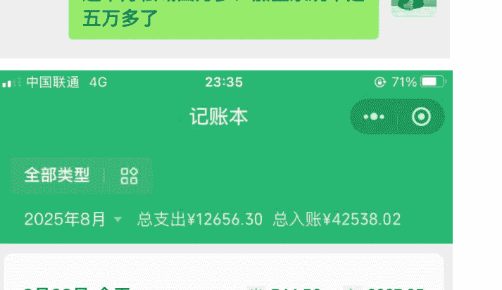

还可以直接开店卖，不过开店的资料，必须得二创，或者是原创，不然可能遇到投诉。目前开店比较猛的，单个课件卖了十多万都有。目前我们测试的小红书开店卖，一个月单店也是上万左右的收益。

开学第一课
全部 用户 商品 地点 群聊 问一问
店铺 退货包运费 销量 价格升序 价格降序
一年级入学常规 开学第一课
蛇年开学第一课
目录
原创多年级2025蛇年开学第一
1000+人加购
￥12.9 已售7460

### 二、卖资料包

有很多老师，需要各种资料包，某个细分的资料，比如班主任各种表格、国旗下讲话、某个学段资料（比如初中语文、初中作文、初中英语资料包）。单个购买比较多，一次性把几十上百个资料打包，卖 88 元，或者是 99 元。如果你是开店铺的，可以做全店会员，也是类似资料包，加入会员，可以下载全店资料。

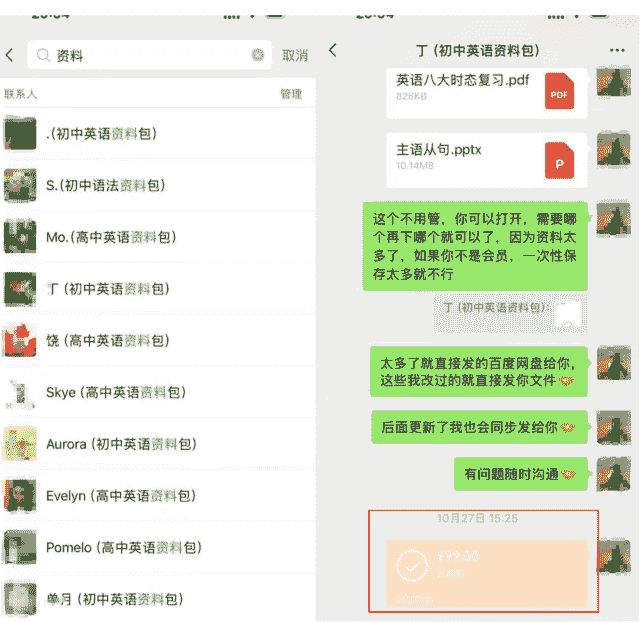

这个账号是专注英语资料，卖的资料单篇资料、资料包。

### 三、卖会员

卖会员的也比较多，目前有做系统的，我们就是这种玩法。还有做小程序的，还有人使用网盘、QQ群、微信群的。我加入不少同行的，就是卖会员，一年多少钱，终生会员多少钱。有个做垂直细分班主任资料的，靠公众号，一年靠会员收入 50 到 100 万，提供就是班主任需要的各种。加入会员后，也没啥资料，还是有很多人付钱，我也给付款了，更新资料很慢，不影响别人赚钱。

我去年加入时候就第四个群了，一个收费 388 元，现在估计是第五第六个群，主要这个老师平时还在上课。

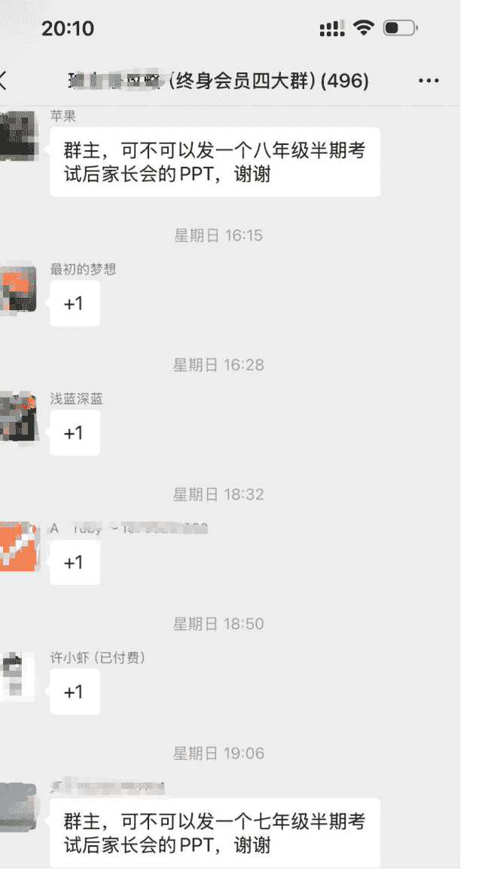

还有做 QQ 群的，把资料更新到 QQ 群卖会员。我加入一个同行，一个 2000 人的群，只用了两个月就满人了，一个收费 99 元。他的目的是先收费，进来后做后期的内容定制代写。有个团队到现在代写了几万单，我对接到他们的写手团队，了解了数据，算算收益还是比较猛。

### 四、搭建系统

目前我们就是属于搭建系统自动化成交的，用户进入我们系统，可以购买单篇，也可以购买会员。系统收集全网比较爆的教师各个方面的资料，我们把教师的各个细分板块都整理了，目前卖出的几万单，就是靠系统卖出去的。

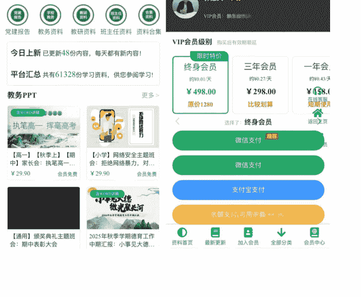

### 五、电商平台销售

现在各大平台销售的也比较多，特别是小红书、淘宝、拼多多、闲鱼，上面做的比较多。不过电商平台需要原创，还打价格战，很多会各种对比。我们主要还是做私域，可以做高价。电商平台玩法是简单，设置好自动发货，可以直接成交，不需要太多的售后服务，很多做的是一次性生意。

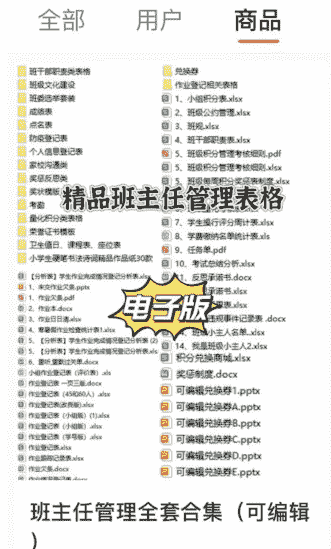
班主任
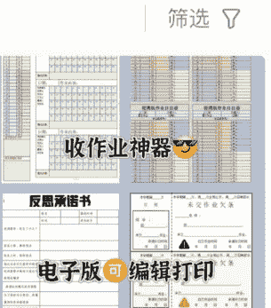
班主任管理全套合集（可编辑）
¥15 ¥18 5000+人已买
退货包运费 极速退款 晚发必赔 包邮
小苗苗知识小屋的店 >
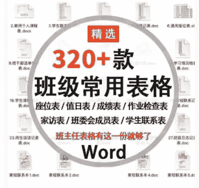
班主任管理全套合集（电子版可编辑）
¥15 ¥18 1000+人已买
退货包运费 极速退款 晚发必赔 包邮
班班知识铺的店 >
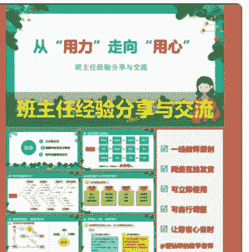
320套班主任班级管理表格作业情况登记表教师常用表格（
¥19.9 ¥29.9 5000+人已买
七天无理由 极速退款 晚发必赔 包邮
桃李阁的店 >

原创班主任工作经验分享与交流PPT课件（赠6000字配套
¥15 2000+人已买
新客 | 退货包运费 极速退款 晚发必赔
爱钻研的数学老师的店 >

### 六、公众号付费下载

如果你的粉丝引流到公众号，还可以设置付费下载，把链接放在付费后可查看，付费人也不少，这个也是比较不错的玩法。目前我们搞流量的平台，公众号也是重要的渠道之一。

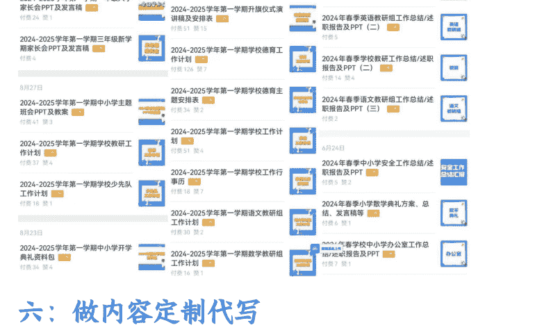

### 七、做内容定制代写

这个需求是真的很大，现在很多现成的资料无法满足老师，还有很多老师需要参加各种比赛，想拿奖，自己制作不了，就找人定制内容。这个需求是真的大，我们私域都接到不少这样的订单，定制的内容各种各样，有课件、有微课、有讲话稿、有总结、有职称相关的。

公众号懒人搜索，懒人专属群分享
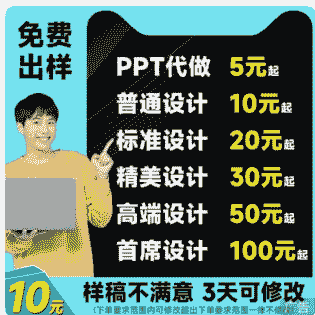
天猫 高端ppt制作代做排版美化修改帮做汇报课件定制代
¥200 本月行业热销
24小时内发 包邮
回头客4万 秋愿旗舰店 进店>
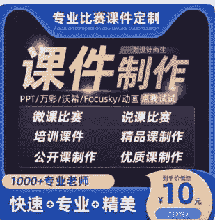
天猫 代做课件PPT制作微课公开课优质课精品课说课比赛
29人评价“思路比较清晰”
¥37.64 券后价 3000+人收货
热销爆款 已补12.36元 包邮
回头客4万 宗翰旗舰店 进店>
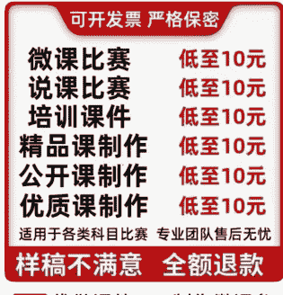
天猫 代做课件PPT制作微课参赛视频基础教育精品课说课
2000+人感兴趣
¥9.31 券后价 3000+人收货
已补0.69元 包邮 公益宝贝
回头客1万 量子维度旗舰店 进店>
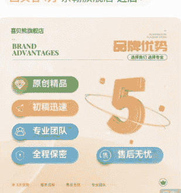
天猫 教学设计代制作大单元设计育人故事微课精品课说课p
¥100 本月行业热销
先用后付 包邮
喜贝熊旗舰店 进店>


### 八、做职称服务

这个板块很赚钱，老师职称越高，工资越高，所以很多人会通过发布论文，还有一些课题，就衍生出做职称服务。至于怎么做，你可以关注各大平台，搜索教师职称，看几个同行就知道了。我们本地认识的一个，现在就做贵州这个板块，通过直播的方式获取流量，一年据说上千个，还没深入研究，还说利润特别的高。

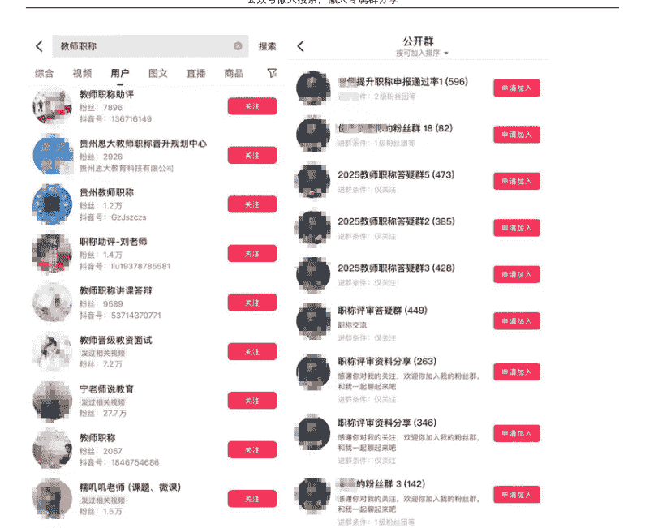

上面是主流的变现模式，还有一些教学周边。

### 九、做教师课件

课件需求很大，很多学校都是统一采购，有的应该是自己准备，所以卖课件就是一个比较细分的板块。目前我关注很多做细分课件的，确实赚很多钱，一个做语文资料的，一个做生物课件的，都卖得很好。这个板块有能制作的，确实可以好好研究。

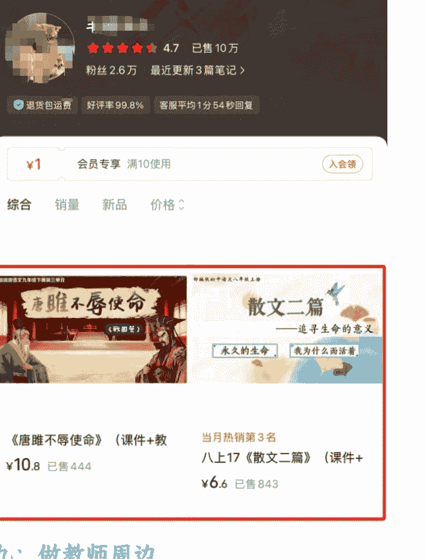

### 十、做教师周边

教师周边也深挖很多产品，比如一些试卷、各种教案，还有学校的校服、学生教具这些，都是可以做的。看你怎么对接了，这些目前我们没涉及，我们主要还是卖会员，做起来的伙伴可以深挖下。

### 十一、做培训

你跑通一些玩法后，你可以带着别人制作，或者你懂课件制作，也可以培训那些想要做课件的。现在做教师资料，投的资料还是有投诉，如果能自己制作原创课件，是不错的。目前我们找会制作的团队，如果你会制作课件，可以与我们对接，我们可以合作，把这个事情搞起来。

### 十二、其他变现

比如我们可以开发一些教师使用的小工具，前面就有伙伴分享了，各种点名系统、积分系统、批改作业、写教案，反正各种教师有需求的地方，你可以开发一些工具去实现。

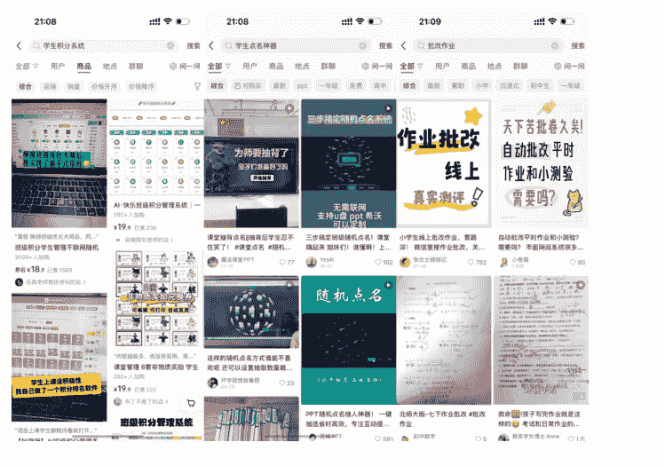

## 第五：教师资料如何做内容

前面说了，教师资料做内容比较简单，就是需要持续，需要坚持。做啥项目，都有人做了，我们只需要复制别人的玩法，就可以。目前效果最好的还是小红书，这里就以小红书的部分教师资料内容作为案例，简单给大家聊聊。做了教务资料后，我们还开发了虚拟资料批量制作工具，可以对教师资料批量制作。

下面是目前教师资料一些比较爆的模板与制作方法，部分借助我们开发的工具制作。

### 一、内容截图

截图是所有内容中，制作最简单一种，只需要把内容使用手机，或者是电脑截图就可以发布。我们资料都是一样的，怎么截图才能有差异化，才能让自己的截图与大家的不一样，达到去重的目的？

那怎么解决这种截图同质化问题呢？很简单：

- 1. 自己截图发，换不同的角度截图，避开同行截图的内容
- 2. 给作品加边框、贴纸、滤镜、温度、饱和度等修改图片参数达到去重目的
- 3. 借助 AI 工具，图生图功能，可以生成一种与你截图相关的内容。然后你再截图，完完全全是个新的图，就达到去重的目的
- 4. 还有就是借助打印方式，打印出来再拍照，拍照的角度，实际环境的光线不同也会达到去重的目的
- 5. 多个内容相互组合（尤其是相似的内容，例如班主任管理表格：可将 ABCD 四个爆款作品打乱组合重新排列）
- 6. 内容处理标记后再截图，或者截图再标记

以上方案我都建议采纳，并且如果你这个素材在你的账号爆了，你就想办法换个方式再表达一次，让他达到在你账号二次爆的效果。谨记！！！

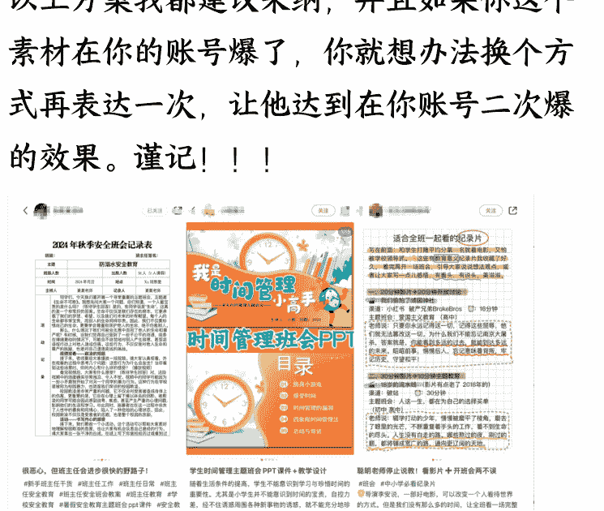

截图制作比较简单，手机直接打开文档，或者下载一个 WPS 软件打开就可以直接截图。

### 二、预览拼图

拼图是做课件资料类内容比较常用的，把内容拼在一起，达到全面展示的效果。封面就展示能够吸引流量的爆款内容，剩下的展示内容里面的内容，引导用户关注，联系获取。

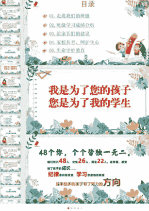
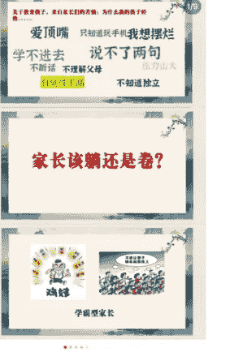
开一场痛点、热点家长会，全程没有一句废话！开一场痛点、热点家长会，全程没有一句废话！全场泪目，掌声根本停不下来，被夸爆了🌟 #家长会 #家长会发言稿 #教育 #班主任 #家长会课件 #家长会
期中家长会这样开 家长是躺还是卷？#家长会ppt #新手班主任干货 #家长会课件 #家长会发言稿 #期中考试 #期中家长会 #班主任日常 编辑于 11-12 贵州

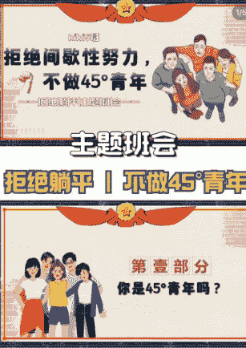
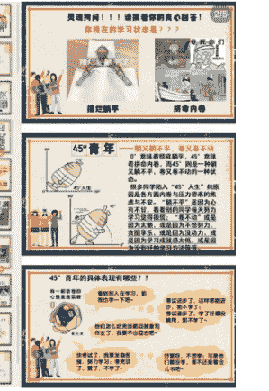
拒绝躺平主题班会 | 不做45°青年 🎯你是45°青年码吗——躺又躺不平，卷有卷不动 🎯拒绝间歇性努力，不做45°青年——要有目标，有动力，有方法的持续性努力。 🎯向前一坨 繁华盛开——看“爷叔”视频，和“爷叔”一
拒绝躺平主题班会 | 不做45°青年 🎯你是45°青年码吗——躺又躺不平，卷有卷不动 🎯拒绝间歇性努力，不做45°青年——要有目标，有动力，有方法的持续性努力。 🎯向前一坨 繁华盛开——看“爷叔”视频，和“爷叔”一

把多个内容拼在一起，形成视觉冲击，达到展示的目的。拼图类型很多，这里就介绍上面拼图的制作方式。

这里可以使用我们开发的 PPT 拼图功能，打开工具箱，找到预览拼图，就可以直接制作，这是最简单的操作方式。

### 三、直接拍照

预览拼图
看看拼图效果

也可以使用最土的方法制作，借助其他软件把图组合，有两部分图组成，左边与右边，可以借助 WPS，或者是 PPT 插件 iSlide。

这是小红书比较常用的展示形式，把资料内容打印出来，或者通过拍照展示内容，让别人感觉真实，让别人觉得你有资料，特别老师考试相关的资料使用比较多，用电脑打开或者使用的。

这种制作是比较简单，如果有资料，打开自己的电脑，直接拍就是原创，也是比较简单的一个种，内容都是原创，不少人使用这样的方式制作爆款，大家有电脑的，可以拍起来，用系统的材料或者是自己找的材料。

### 四：拍实况图

现在很多小红书可以发布实况图，一些手机可以直接拍实况图，效果特别好，如果你的手机可以拍，直接电脑打开素材，直接对着拍，就是原创素材，目前我们测试这样的效果是特别好的，爆的概率很大，因为素材都是原创，自然流量就可以。

### 五：创意封面

创意封面很多，可以借助微信截图，名人，动画，熟悉的场景，电影电视封面，做封面吸引人，最后集合需要展示的内容方式配合呈现，达到推广的目的，比如下面的几个都是比较到位的配图。

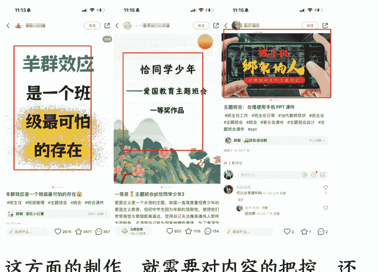

这方面的制作，就需要对内容的把控，还有对图片的搜索，可以测试制作，找感觉，这个玩法，真的需要自己去深入钻研，需要找感觉，感觉不对，做出来的内容未必是用户喜欢的。

### 六：目录展示

目前展示是搞推广一种最常用的方式，效果比较炸裂，就是有的制作比较浪费时间，不过一些好的目录可以反复使用，属于一次性制作，可以使用多次，这种展示，最简单的就是网盘截图，这种是最简单的，展示网盘有啥内容，但是整理类的目录就比较难。

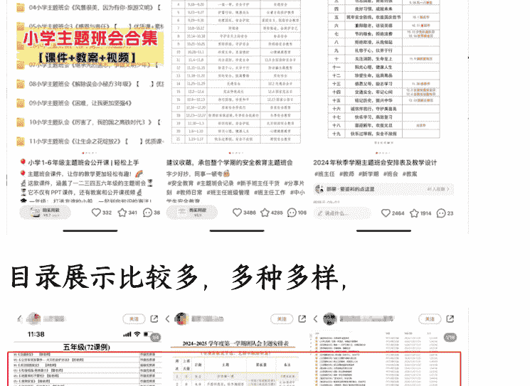

目录展示比较多，多种多样，

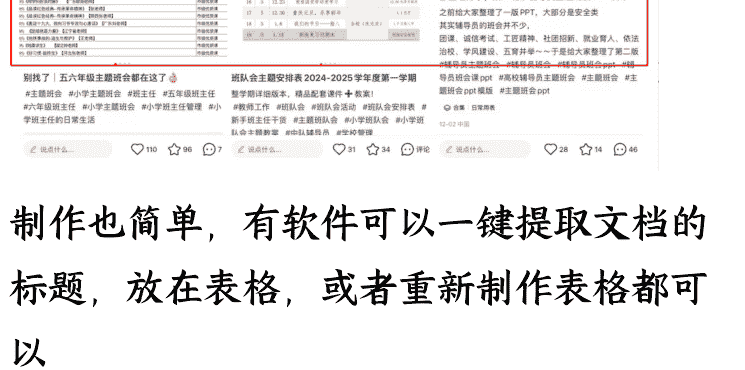

制作也简单，有软件可以一键提取文档的标题，放在表格，或者重新制作表格都可以。

### 七：斜面背景

这种适合点对点展示，特别适合课件，PPT，视频素材展示，看看下面的案例就知道

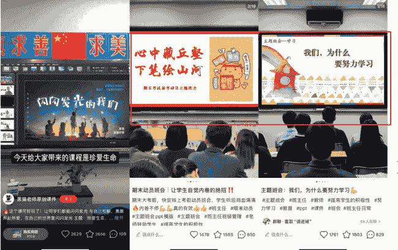

老师主题班会，这个模板特别火，大家可以跟着模板做起来，制作起来也简单，其实很多电脑拍图，也是这样制作的，电脑桌面一样的，就是内容不一样而已，完全可以制作起来。

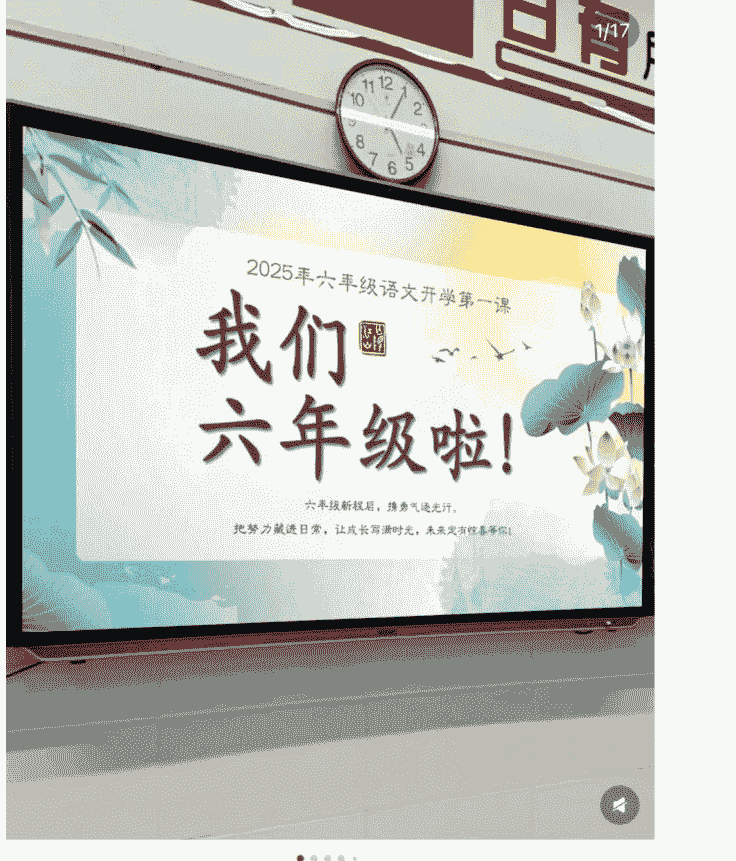

六年级语文开学第一课 ‼️厉害的老师这样上🔥

#开学第一课 #六年级 #小学语文 #主题班会 #开学第一课ppt #新手班主任干货 #六年级语文 #ppt课件 #不一样课件 #课件ppt #小学语文老师 #班主任工作 #ppt

Q 猜你想搜 六年级上册开学第一课ppt

这种作品的思路是找到对应的背景素材，然后把需要制作的作品插入背景素材中，无论是插入图片和视频都是没问题的，主要是为了让场景或者新颖的表现形式去吸引人。如何找背景？其实与找素材的方法一样，去小红书平台（或者其他平台）搜关键词，去找到对应的图片背景。

当然有这种场景的老师我还是建议自己模仿拍一个对应的场景，或者直接录。平时要有收集素材的意识。

第一步找背景：

全网各大平台搜索关键词是：“办公室电脑桌面壁纸简约”“班级多媒体桌面壁纸”，以下是一些案例，特别是多去小红书搜索，上面比较多，其他平台也有。

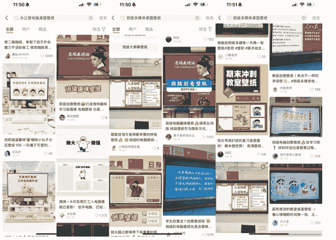

找到喜欢的，借助小红书无水印下载，这样背景就搞定了。

固定背景中最火的还是斜面背景，这个流量密码，很多人都在发。

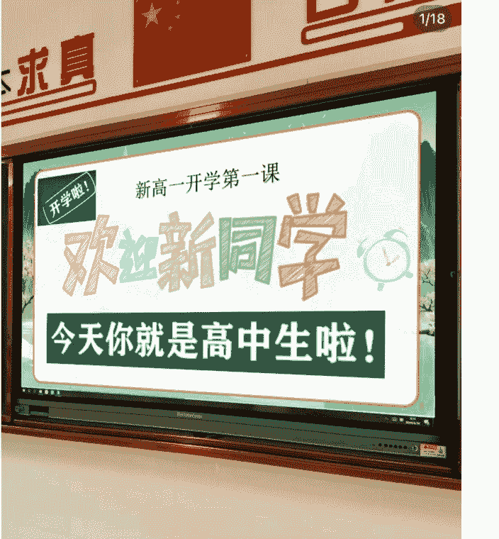

高一开学第一课，高一新手班主任干货

高一开学第一课 PPT
新高一第一课课件
怎样解决高一新手班主任的开学第一课
对于一个新高一班主任来说开学第一课太重要了
所以我在整合了了很多资料之后，又加入了自己的想法完成了#开学第一课 的课件

> 1883 1990 317

正面的背景很好制作，一般的做图工具都可以制作，斜面图片很难制作，能找到批量制作就更难了。我们开发了斜面制作工具，可以批量制作斜面图片。

第二步：制作内容

首先打开玩赚工具，找到背景换图。

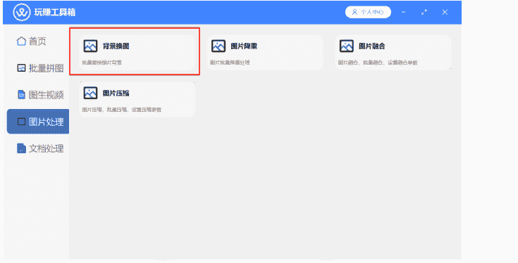

导入我们背景，导入需要替换的素材。这个时候我们就可以对素材四角调整与背景对齐，点击合成，就可以批量替换背景了。

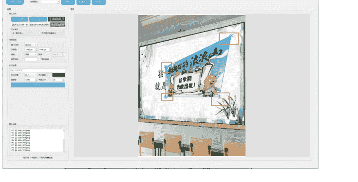

实在不会做的，可以看工具的操作流程，就可以跟着操作。

### 八：多图拼接

现在目前玩法，流量比较大的，是多张图片拼接在一起，看案例。

## 翻越你的浪浪山《浪浪山小妖怪》开学第一课

成品 PPT，有内容，可直接使用，图文可编辑。

静态 PPT 页数：共 23 页

- 01. 走进浪浪山——我们的成长起点
- 02. 小妖怪，大世界——找到你的角色

#### 还有这种展示

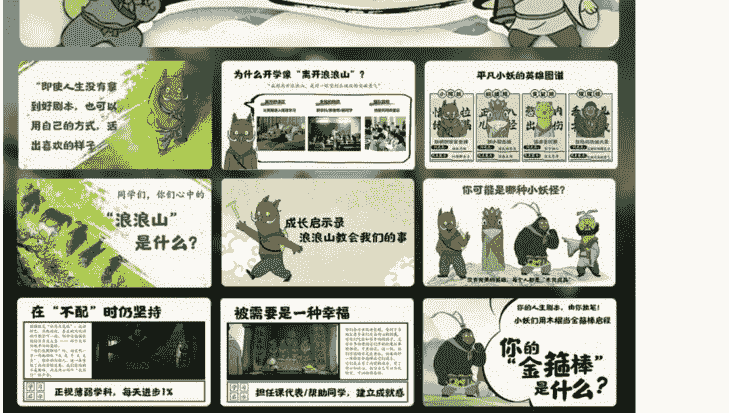


## 高一开学第一课✨学生说遇到对的班主任了

马上又要和新一届的学生见面啦，既激动又忐忑，已经准备好班会课啦，期待见面😁😁

#教师开学第一课 #开学第一课ppt #高一开学第一课 #开学第一课 #高一开学第一课班会 #新手班主任 #班主任开

这样的图片，借助制图工具可以制作出来，但是比较麻烦，需要拼接很久，我们开发了批量拼图工具。

首先打开玩赚工具，找到百变拼图，或者是百变快拼，


导入素材后，可以快速的拼出需要的素材，目前工具可以拼出小红书上的百分之八九十的模板，还可以批量制作。

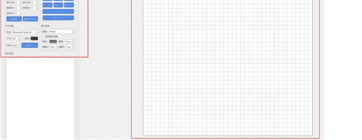

如果你喜欢一个模板，可以添加一个预设，下次直接导入素材，就可以快速的制作。一次性可以制作几百张推广素材，方便快速制作。

百变快拼还可以实现，封面与内页一次性制作出来，这里就不过多的演示。

工具箱还有很多工具，涵盖虚拟资料各种需求，还可以，PPT，word 各种转换，换背景，做图片融合。

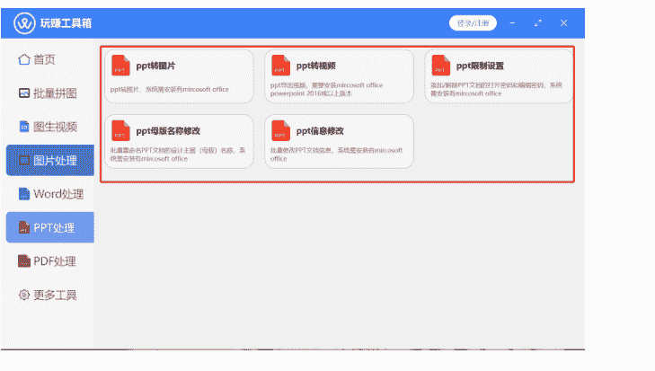

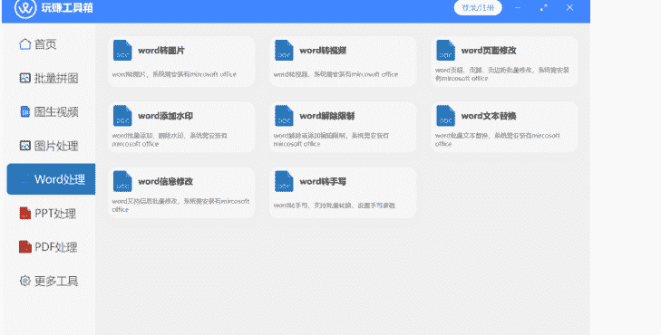

## 第五：教师资料如何做流量

搞项目都离不开搞流量，目前教师资料比较好做的几个平台，小红书，抖音，公众号，视频号，小绿书效果是最好的，其中最好的是小红书，视频号，公众号，小红书可以直接开店，也可以引流到私域，不过引流到私域有限制，需要掌握方法，至于玩法生财很多了，这里就不过多的展示，我们使用的玩法都是生财更新的。

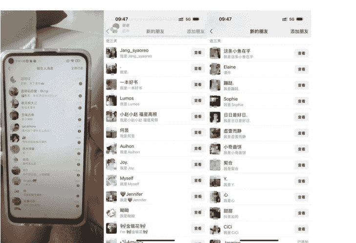

效果还是可以的，每天只需要更新，流量就不会少，前提是更新的资料是当下的资料，不要更新一些过时的资料，至于发布啥内容，同行怎么发的，我们对标就好了，还有就是别人在小红书爆的资料，你转发到小绿书，抖音爆的概率很大，所以可以直接搞起来。

目前遇到的情况是，资料爆了，很多时候微信接不过来，我们采取的方式，先引流到公众号，再引流到私域，公众号对接自动成交系统，可以接住粉丝，有更多的需求粉丝，可以再导流到私域，这样私域就可以很好的接住了，不然很多时候，内容爆了，浪费了。

## 第六：教师资料赚更多的钱

教师资料细分板块太多，对于想要操作的伙伴，不要啥领域都去做，选择一个细分的板块操作，做深做透。

### 第一：垂直细分

一定要垂直，垂直才能赚钱，啥都做，很难赚到钱，抓不到重点，抓住一个细分板块，比如主题班会，校长讲话，班主任资料，细分垂直课件，这些都是比较赚钱的，目前任何一个细分板块，操作到位，一年都可以搞上百万，就看你怎么做，怎么玩了，至于选择哪个细分，这个就看你自己了，我们目前做的是大综合，有点优势，但是能做细分还是要做细分，细分才是普通人搞钱的方向。

### 第二：原创二创

为何说到原创二创，现在搞教师资料的人多了，很多资料不能直接发，直接发也没流量，比如一个PPT，最好是二次创作下再发布，或者直接搞原创，不过原创太难了，二创比较简单，把PPT换个模板，修改内容布局，重新制作再发布，特别是借助ai的加持。

### 第三：协助Ai加持

现在的很多教师资料，借助ai就可以做原创，比如前段时间比较火的教师训话稿，就是借助ai写的，卖得很好，

21:11 搜索 全部 用户 商品 地点 群聊 问一问 综合 店铺 退货包运费 销量 价格升序 价格


“心碎 为什么开学才看到这本教…”
中小学教师训话逐字稿（全场 每满200减30 5000+人加购
券后¥23.9 已售3164
胖头鱼发发发的店 >

“疯传教师界 课堂纪律差的救命…”
教师训话逐字稿（120篇实战 限时立减11.1元 2000+人加购
券后¥28.8 已售1220
玉老师的高效资料馆的店 >


“资料很不错，场景很全，非常…”
教师训话逐字稿（全场景案例 5000+人加购
¥99.9 已售2178

“真良心好物，我本来以为是智…”

还有一些PPT，课件，你完全可以购买过来，重新借助 ai 开发，比如现在很多做细分，做 ai 微课的。

AI融合教学视频教程（教程最
400+人加购
￥99 已售266
爱玩AI的老师的店 >


“四上任务群公开课《陀螺》上完...”
【K40】25新版四上大单元任
1000+人加购
￥9.9 已售4345
小雪老师的课堂的店 >


一上AI赋能《四季》精品公开
退货包运费 600+人加购
券后￥21.8 已售1405
学语文的小鱼的店 常逛的店 >

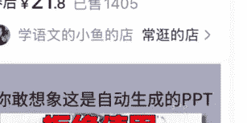

“开学季教师救星！AI备课神器”
自动PPT AI工具虚拟定制
4000+人加购
￥8.8 已售1万+
全是宝...小店的店 买过的店 >

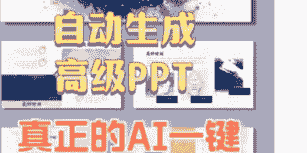

### 第四：做模式做系统

想赚更多钱，玩法很重要，有时候靠一个人是无法完成的，这个时候我们就需要借助系统，借助模式去卖资料，比如你可以开发原创资料，授权资料给别人卖，或者你有原创资料，可以招人培训，卖出去你拿分成，比如我们现在玩法是我们把玩法复制给很多人，他们卖出去我们都有后端的提成。

## 第七：教师资料踩过的坑

- 一：注意版权
有版权的资料，尽量不要公开渠道销售，私域这些稍微好一点，就算想公开渠道销售，都需要二次创作下，现在有一批不要脸的人的玩法，把别人的课件重新二创后，申请版权，反过来投诉你侵权，我们遇到不少了，操作的时候一定要注意，遇到这种只能认了。

- 二：及时下架
遇到一些原创投诉的，别人说了，找上门了，能下架就下架了，不要硬刚，现在的账号很宝贵，投诉账号封了就亏了，有的伙伴说不听，总是想硬拼，最后吃亏是你，毕竟你搬运了别人的资料。

- 三：侵权处理
目前我们操作一年多了，遇到比较多的就是喊下架，没遇到传票，还有一些课件侵权，就算收到传票，也不会赔多少钱，相对还是比较轻的，一般几百元到几千就解决了，一般都是几百元，还有很多处理时间比较长，很多所谓的版权都是吓人的，懂的都懂，真正处理一个案件需要几个月，甚至是几年，还是那句话，能搞原创就搞原创。

- 四：资料紧跟热点
刚开始是操作，我们啥都不懂，啥资料都发，其实很多过时的资料没啥效果，这里说的过时是使用周期，其实很多教师资料，去年火的，今年简单修改下还可以再次火，我们需要根据当下的时间节点去发布资料，比如开学就发开学的，期中就发期中的，节气就发节气的，紧跟当下老师的需求，如果你不知道需求，可以看同行，或者问身边的老师，他们知道当前他们需要啥资料。

- 五：专注垂直
这是很多新手最容易出问题的地方，刚开始啥都发，这样发下，那样发下，这样的订单很不稳定，你需要专注某个细分的板块去做，这样才能快速的拿到结果，真正赚钱的都是做垂直细分。

- 六：接受项目周期波动
任何项目都有周期，可能开学的时候，发啥都赚钱，开学过了，收入各方面就会下滑，这个时候很多人就可能怀疑自己，怀疑方向，正常上课了，老师没时间去购买资料，或者需求少了都是正常的，目前测试下来，淡季也有订单，但是相对还是有下滑，不过专注垂直，还是可以持续赚钱的。

## 第八：最后结语

教师资料是个好项目，没做之前，觉得老师不会自己做吗，为何要买，真正操作后，发现需求很大，还是一个可以持续做，持续赚钱的项目，只要老师还在，这个需求就会一直有，想要持续赚钱，必须得提高原创能力，一直搬运不是长久之计，原创才是项目的最终归宿，我们后期会开发我们自己的原创资料。

## 最后，安利小懒的付费群：

### 懒人专属群（介绍）


懒人专属群持续更新中，已持续运营6年，整理超3000份各类精选付费文章&年费社群干货，全部开放下载。

本资料为付费群内部分享，仅供真实有需要的朋友查阅 🕳️

### 懒人专属群更新记录：

```
https://hk57gv1x7u.feishu.cn/docx/H0kRdZbSbolBR0xkaXtcuVE0nTg
```

### 懒人专属群更新记录（需梯子，备用）：

```
https://lazybook.fun/blog/record2
```