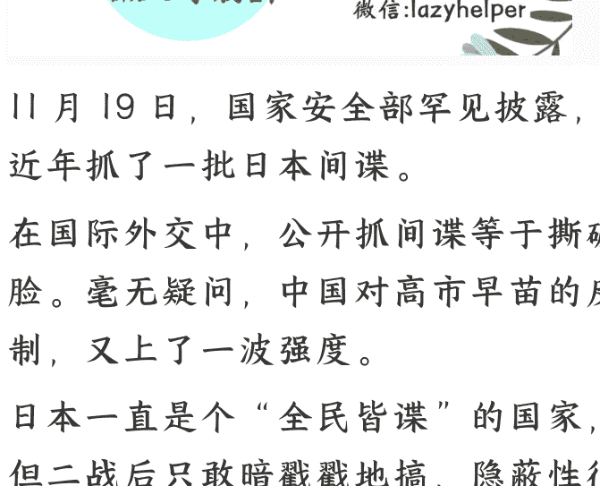

# 日本是怎么搞中国情报的？

251127 文/卢克文工作室嘉宾 老纪扶犁

整理：公众号懒人搜索，懒人专属群独享

懒人微信：lazyhelper

11月19日，国家安全部罕见披露，称近年抓了一批日本间谍。

在国际外交中，公开抓间谍等于撕破脸。毫无疑问，中国对高市早苗的反制，又上了一波强度。

日本一直是个“全民皆谍”的国家，但二战后只敢暗戳戳地搞，隐蔽性很强，让许多人产生了“天下太平”的错觉。实际上，日本对中国的渗透、窃密，不但从未停止，甚至相当触目惊心。

那么，真实的威胁有多大？今天的日本，又是怎样搞中国情报的？

## 「01」

2016年，在一起针对新型战机的间谍案中，时年86岁的日本间谍阿尾博政被抓获。至此，一桩惊天间谍大案的真相终于浮出水面。

1930年生的阿尾博政10岁出头就被编入日本“童子军”，每天接受军事训练，成为一名狂热的军国主义分子。1959年以优异成绩考入日本自卫队，并被分配到自卫队谍报机构“武藏机关”。

经过长期训练后，阿尾博政被派往日本各驻外使馆实习，曾在苏联交换访问拍摄大量秘密照片。

1972年3月，自卫队上层机关指示阿尾博政监视台湾。随后，阿尾博政以经济学学者的身份潜入台湾，屡屡出席各种学术会议、商业庆典，结交一大批政商界人士。

1982年，阿尾博政在武藏机关的安排下，来到刚刚改革开放的大陆“交流”，此人演技极为出色，不但表现得十分热爱中国文化，甚至多次谴责日本侵华历史，似乎和间谍完全不沾边。

也正因此，阿尾博政的间谍活动相对顺利，他以旅游、交流为名，进行了数不清的间谍活动，比如，跑到军事基地附近旅游，然后偷偷拍摄，对军事基地的哨卡、设施进行分析；在海口机场，偷拍了某型战斗机，当时这款战斗机还没有公布。

阿尾博政在华潜伏三十余年，撰写的深度情报就有150份，给中国造成了不可估量的损失，直到2016年落网，一切才真相大白。

很多人以为日本二战后已经没有间谍活动了，其实不然。

从国家安全部披露的数据看，对华情报活动强度最高的是美国，日本次之。但就广度而言，日本则是第一，小到社区街道，大到军事政治，全方位、无死角，相当贪婪。

正如日本社会人类学家中根千枝所说，“这个世界，研究中国最深的国家就是日本。从历史文化到产业经济，日本各界早已形成一种默契，系统地分担对中国各个领域的研究。”

日本执着于对咱们进行情报渗透，是有原因的。

一是历史成功的“路径依赖”。

最典型的就是甲午战争，对日本刺激极大，总幻想再次复制。

甲午战争，日本以偷袭开始，实现以弱胜强，情报因素尤为关键。

当时，清政府海军实力强于日本，镇远舰和定远舰是亚洲最大战舰。另外，在自己家门口打，还有地利之势。

但日本的间谍荒尾精，通过“乐善堂”，系统掌握了清朝内部矛盾和军事情况；石川伍一策反了天津军械局刘棻，获取了运兵朝鲜的绝密计划。

同时，日本获取了清政府电报密码本，截取了清政府所有机密情报。

日本依靠精准情报，决定抓住清朝内部斗争加剧，李鸿章孤立无援的机会，在运兵朝鲜途中发动偷袭，结果让清政府输得一塌糊涂。

这种“情报制胜”的成功经验，自此成了日本国家本能。二战战败后，这种能力也未消失，而是转而渗透于经济崛起与对华围堵之中。

二是根深蒂固的“赌徒心态”。

日本作为岛国，不敢与大陆光明正大地抗衡，唯一的手段只有搞偷袭，在战略决策上，追求“要么全赢，要么玉碎”，热衷押上国运进行战略冒险。

而一场成功的赌博，最重要的是掌握对手底牌信息。详尽的情报，就是能提高胜算的“作弊码”。

以当今中日的国力差距，日本再次“赌国运”的可能性不断增大。在这样的背景下，近年来，日本对华情报渗透的事件不断出现。

2023 年，日本黑客组织“海莲花”对中国船舶研究设计院发动网络攻击，目标直指 055 型万吨大驱等核心舰艇的设计图纸。

2024 年，日本安斯泰来制药中国分公司的日籍高管，因试图窃取生物信息在北京被捕，最终获刑 3 年半。

2025 年，一名日籍男子在上海因从事间谍活动，被判处 12 年有期徒刑。

那么，日本到底是怎么搞到咱们情报的呢？

## 「02」

日本作为一个“官民协同、全民皆谍”的国家，在中国搞情报的路数，可以分为官方版和民间版。咱们先来聊民间版，主要有三种做法。

- 其一，从企业层面，注重搜集系统情报。
很多日本公司、机构人员访问中国，回去都撰写详尽的报告，而驻华人员，更是需要定期汇报所在行业的经济、技术乃至政策情报，递交给日本政府内阁情报调查室、外务省调查部、警视厅、防卫厅和法务省的情报机构。

- 其二，从学术层面，注重研究战略情报。
数量庞大的中国问题专家，在学术交流的掩护下，长期研究中国的政治、社会、民族等敏感领域，其研究成果具有极高的战略价值。

最典型的例子是，1964 年，日本通过《中国画报》刊登的“铁人”王进喜照片，就准确分析判断出了大庆油田的地点、储量和产量，这和日本长期研究密切相关。

- 其三，从个人层面，注重观察记录。
以旅游、商业为幌子，搞非法侦测活动，这些都是私人自发行为，有男有女，有老有少，每年都有大量案例。

对比一下，如今赴日旅游的中国人非常多，可除了游购娱，有人对日本有探索和研究的兴趣吗？

日本的这种毛细血管模式，看似很业余、很“LOW”，也容易被抓，但却极为务实，因为体量大，反而更难防范。而这，才是真正让人细思极恐的地方。

所以网上流传着蒋介石的一句话：

> “日本人无论男女，都有一种很深的‘谍’性。不要小看每一个来华的日本人，他们都有情报搜集的任务，别看他笑脸迎人，很有可能反过去就用情报吃你肉、喝你血。”

在官方层面，日本有五大情报机构负责对华情报渗透，分别为内阁情报调查室、警察公安部门、外务省的国际情报统括官组织、防卫省的情报本部以及法务省外局的公安调查厅。

其中，防卫省的情报本部、法务省的公安调查厅和外务省的国际情报统括官组织，承担着核心职能。所以我们主要聊一聊这三个机构。

第一个机构，防卫省的情报本部，其前身为日本自卫队谍报机构，上文提到的阿尾博政，就是他们的人。

第二个机构，日本法务省公安调查厅。

听名字，这应该是个警察机构，和对外间谍活动无关，但日本的公安调查厅背景十分复杂。

日本投降后，日共的影响力迅速扩张，以议会席位为例，1946年，日共的众议院席位仅为5个，到了1949年，增长到39个，短短几年间，席位数量增长超过7倍。

美国和日本政府，都对此如临大敌。为盯住日共，日本政府便在法务省下面，组建了“特别审查局”，这是公安调查厅的前身，“特别审查局”的人员，基本是旧日本陆军的情报机构人员（这些人反共立场最坚定）。

所以，公安调查厅自成立起，便与“军国主义”存在千丝万缕的联系。

冷战结束后，公安调查厅的“第二部”，成了专职对外情报渗透的部门，尤其是针对中国。

其对华情报渗透的手段，很喜欢打着“商业”“交流”的幌子。

前文提到的“安斯泰来案”，就是典型。

2023年3月，日本安斯泰来制药的一名日本籍高管西山宽，被中方查明是间谍，予以拘捕。明面上，西山宽担任着安斯泰来制药在华高管，还是“中国日本商会副会长”，一直为日本公安调查厅提供中国医药行业的情报。

最终，西山宽被判3年6个月。

第三个机构，外务省的国际情报统括官组织。

2021年，不知出于什么原因，外务省在其官网上，公布了一份其下属的“国际交流基金会”业务评估报告。

报告清晰地列出了144位中国学者，在2008年-2016年，受“国际交流基金会”之邀，前往日本“交流”。交流期间，日方不仅全额承担他们的衣食住行，还会额外支付给他们一笔报酬。

根据外务省公布的数字，每个人获取的报酬，不低于两万元人民币/月。

消息一出，许多网民纷纷表示，原来许多难以解释的“精日”文章，终于能解释得通了。

这三大机构对华情报渗透的侧重点各有不同，公安调查厅主要搜集行业、产业情报，自卫队以军事和经济情报为中心，外务省重点拉拢中国的部分精英人群，通过他们向中国社会培育“亲日”氛围。

既然日本有这么多情报机构，为啥还要新设立一个国家情报局呢？

其实，日本保守派一直有个野心，设立一个以内阁为核心，或者干脆直白点，一个由首相直接统率的情报机构，由首相安排自己人负责具体管理和统筹，把国外情报和内部反对派的情报一网打尽。

早在侵华战争前夕，时任首相近卫文麿就推动增设了一个内阁情报局，试图将陆军和海军两大最强情报机构收入囊中，但军方拒绝共享情报，导致内阁情报局沦为边缘角色。

放在这个背景下，就很容易理解为什么高市早苗上台后，要密切推动日本战后最大的情报体系变革，竭力扩大日本情报机构和法律权限。

根据高市早苗的指示，新设立的国家情报局，就是在内阁情报调查室的基础上进行改组和升级。众所周知，日本内阁是由首相任命的。高市早苗的内在动机，就是以情报职能分散、效率低下为借口，把调取、使用、操控国家情报系统的权力，集中到自己手上。

如果我们再把日本设立国家情报局，同日本近期的一系列动作联系来看，极右翼的图谋早已图穷匕见。

军事上，防卫费预算飙升至GDP的2%，放宽武器出口，推动高超音速导弹研发及核潜艇引进计划，修订《国家安全保障战略》，自卫队军衔恢复“大佐”“中佐”等旧日军称谓，在九州部署12式反舰导弹，推动修改“无核三原则”；政治上，打压国内理性派和进步力量，培育汉奸特务，煽动全民仇恨……

日本军国主义棺材板上的钉子，正在一颗一颗地松动。

从高市的言行来看，日本对华的情报活动，是国家意志推动、全民自愿参与，本质上就是积蓄力量，为下次赌国运“摊牌”做准备，幻想能复刻历史上的“奇迹”。

我们是时候警醒了，不能因为生活在和平的阳光里太久，就忘记阴影中的刀光。对于那些躲在同胞面具下的窃密者，那些拿国家机密当投名状的内鬼，必须露头就打，绝不手软！

最后，安利小懒的付费群：

懒人专属群（介绍）

懒人专属群持续更新中，已持续运营 6 年，整理超 3000 份各类精选付费文章 & 年费社群干货，全部开放下载。

本资料为付费群内部分享，仅供真实有需要的朋友查阅 🤫

懒人专属群更新记录：

https://hk57gvlx7u.feishu.cn/docx/H0kRdZbSbolBR0xkaXtcuVE0nTg

懒人专属群更新记录（需梯子，备用）：

https://lazybook.fun/blog/record2