# 20251125 备忘：2026 物价、股债配置、A股和美股

251125 火星船长

整理：公众号懒人搜索，懒人专属群独享

懒人微信：lazyhelper

本文仅供参考，不作为投资依据。

## 1、已知和未知

**已知2025年：**
- A股产生结构性盈利背景下的结构性行情，以科技和出海相关主题为主；
- A股的涨幅里，绝大部分都是“估值”（图1）；

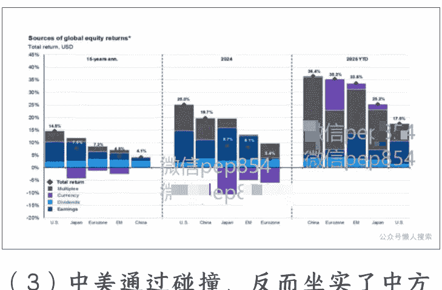

- 中美通过碰撞，反而坐实了中方作为“伟大的难以对付的竞争对手”的存在，而中国资产（包括A+H）的估值上升，很大程度上反映了这一此前被怀疑的事实；另外，中美两国成为全球唯一在AI主桌上竞争的对手；因此估值上涨有合理性。

**已知2026年具有高度确定性的：**
- 中美继续高强度竞争、博弈，在冲突博弈和矛盾协调化解中反复；
- 双方都将在科技领域投入大量资源，并将此视作竞争最关键的胜负手；
- 十五五最重要的关键词是科技创新、新质生产力、现代化产业体系。

也就是说，2026 年股市若有行情，则核心题目必然离不开科技，因为这是具有盈利空间和信用扩张确定性的部分。

### 2026 所不清晰的：
- 财政是否会延续发力在传统经济上（比如 2025 年加力化债、大型基建项目、消费补贴）？还是会因为税源不足，①在传统领域紧缩（比如加大力度收税、开辟新税源）、减少补贴，②将资源聚焦在新科技、新产业、新基建上。

总体来说，财政是否会延续今年前 7 个月猛加杠杆的力度？

- 产业发展的速度，尤其是 AI+智能制造的组合创造新“需求-供给循环”的速度？这一速度越快，传统经济部分的下沉就越不重要，甚至下沉速度会放缓。
- 海外需求？对应到我国的出口。与美国的贸易摩擦，以及其他国家对我国逐渐增加的贸易对抗加剧。

以上（1）+（2）对应内部循环，（3）对应外部循环。

## 2、明年最核心的宏观问题：价格是否能起来？

为什么这个问题最为重要，因为它直接关系到最核心的大类资产、即股债的战略配置比例。

三个月前我发了一篇“股债牛熊备忘录”，回望 2014-2018 经典的一轮美林时钟，2016 年是关键转折年。2016 年，全年 PPI 同比增速上行，从年初 -5.9%一路升至 5.5%。债市的崩溃发生在 11 月，综合了央妈“金融去杠杆（严控银行理财委外）”的明确态度及 PPI（10 月数据）飙升至 1.2%的打击。而股市则在次年（2017）迎来了“基本面强、流动性紧”的“漂亮 50 行情”。

PPI 弹性对应着企业的盈利弹性。从图 2 中可见，两波 PPI 的快速拉升，都对应着盈利的快速好转。在盈利快速好转时，则对应着指数性质大盘股的行情，比如 2017 年的漂亮 50 和 2020 年末至 2021 年初的茅指数。而这些时间段也通常精确对应着债熊。

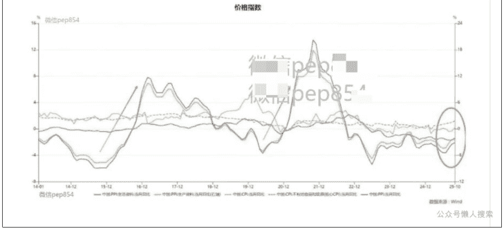

## 3、罗列 2026 四种可能性：
- PPI 超预期上、流动性转紧，大盘股强，小盘/科技/题材转弱，债转熊；
- PPI 上、流动性依然松，由于上段（第 1 部分）所言—科技股虽仍然有盈利增长，但已经处于高位/估值偏高，因此很可能转为大盘/周期股风格，科技股高位震荡消化估值；债震荡；
- PPI 下、流动性转紧，这是最差的情况，除非金融系统出问题，否则几乎不可能发生。在这种情况下，股债双杀；
- PPI 下、流动性维持松甚至较今年更松。那么风格切换证伪，传统周期消费继续萎靡，小盘科技题材活跃；通胀证伪，债重新走牛。

### 4、讨论 2026 年一致预期：物价持续好转，PPI 向 0 收敛，甚至转正。

已知当前主流预期：
2026 年物价指数继续回升。

持有该观点的机构给出的理由：
- 地产下滑压力最大的时期已经过去；
- 出口还将更加强劲；
- 反内卷带来价格弹性；
- 国际大宗商品价格上涨；
- 财政继续发力，带动社融。

上述理由是否成立？

**（1）基本同意，但几乎没有向上弹性，反而依然是巨大负向拖累。**
- ①由于楼市流动性不佳，租售比虽然已经大幅上行，但依然不具有吸引力（图3）。如果进一步考虑到可能出台的“房产税”，则房价还有进一步下行的动力；

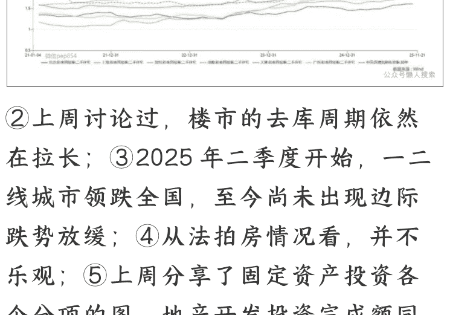

- ②上周讨论过，楼市的去库周期依然在拉长；
- ③2025 年二季度开始，一二线城市领跌全国，至今尚未出现边际跌势放缓；
- ④从法拍房情况看，并不乐观；
- ⑤上周分享了固定资产投资各个分项的图，地产开发投资完成额同比增速并未触底，依然“稳步”下行。

至于为什么“地产下滑压力最大的时期已经过去”，因为①地产投资占经济的比重已经缩小至 2019 年的接近一半；②债务相关的大雷（地方政府、大型企业、金融系统）已经逐步化解，剩下的问题由居民部门慢慢靠时间消化；③结构转型卓有成效，新经济的部分崭露头角。

**判断：**
地产投资很可能还会是 -10%以下的萎缩；房价下行对一二线城市消费形成压制；商品房销售额中枢下行（2025年截至 10 月销售额同比 -10%, 图 4), 土地出让金减少, 地方政府收入下降, 拖累赤字。

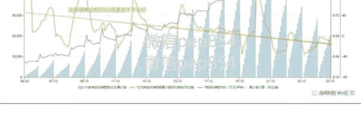

**（2）中性。**
2024 年的出口的确是非常超预期的, 这体现了中国产业实力的强大, 以及全球对中国制造的深度依赖。但 2025 年将面对的是 2024 年的高基数、更多国家对我国的贸易对抗和反倾销、其他新兴制造业基地对我国的 “替代” (其中包括我国 “出海” 企业)、渐行渐远的美中贸易关系（刚过去的 10 月对美出口同比下降超 25% )。

利好的因素是, 美国和全球经济大概率走向一轮复苏周期, 总体外部需求向好; 但复苏的弹性预计不强。

综合而言, 出口增速大概率稳定、略有回落。

**（3）不同意。**
> 《经济观察报》一篇报道极具说服力。《期现背离时刻, 闯入套利战场—钢贸易商 “求生”》, 谈到了下面的现象:
- ① “反内卷”政策下，钢厂严格执行限产，排产计划不断压缩，“是近年来最大幅度的主动减产”。因此，钢材总库存连续下降，钢厂挺价，现货价格维持高位；
- ②然而，钢贸商却迎来了“职业生涯中资金链最紧绷的一个季度”，“存货有价无市，库存变现极其困难。”（从前一个月能滚动 2-3 次，现在效率折损过半；相当于隐性融资成本大幅上升。）
- ③银行贷款意愿下降，风控趋严，多家银行表示“要重新评估”，并将钢贸行业贷款利率上浮。
- ④钢贸商承认，给核心客户的账期（曾经是 30 天）普遍延长了。
- ⑤钢贸商的经营模式面临根本性挑战，本质是“卡在价格虚高的钢厂和没有需求或没有还款能力的客户之间挣扎”。因此他们选择在期货市场卖出套期保值，造成了螺纹钢期现严重背离。

以上情形对应“规上工业企业营收增速几乎不变、而利润增速同比提高”的情形—价升量缩。

可以看出，“反内卷”可以依靠行政手段在短期内控制产量、提高价格、增加企业利润，但无法在整体上改变行业格局和供需关系。最后的结果是挤出一部分实力薄弱的参与者，比如钢贸商、建筑公司（当然，我们也可以说这是“出清”，但出清的并非是上游的钢铁产能）。

**（4）基本同意。**

**（5）中性。**
财政资源逐渐捉襟见肘。众所周知，2025年征税显著趋严。2025年1-10月，个税收入13363亿元，同比增11.5%，远高于居民可支配收入的增速。专家评价：“这一持续高增态势背后，是税收征管精细化升级、境外收入征管到位、平台监管部委与资本市场活跃、收入结构优化等多重因素的叠加效应。”总之俩字：真棒。

然而即便是这样的严格追缴税款的背景下，GDP创税能力依旧创出史低，来到13.1%（图5）。

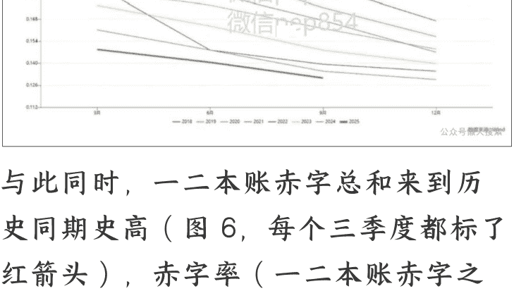

与此同时，一二本账赤字总和来到历史同期史高（图6，每个三季度都标了红箭头），赤字率（一二本账赤字之和/名义GDP）上升到8.71%，持平2020年底和2022年6月（分别是全国口罩和上海口罩）。这个赤字率远超美国。

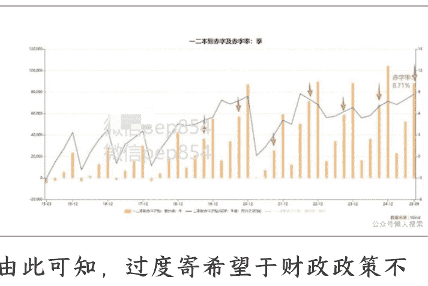

由此可知，过度寄希望于财政政策不断发力有难度，除非再次发生“924”式的思维转变——此前我们聊过伯南克谈治理通缩的言论：“一个有决心的央行，即使利率降至零，仍可通过承诺未来制造通胀来刺激当前支出..关键是让公众相信央行“足够不负责任”，会持续宽松直到经济复苏。

在这里还需要重温芒格：“持有现金实际上是在向政府提供无息贷款。如果你把钱存在银行账户里，本质上你是在借钱给一个可能不负责任的实体。”直到目前，我国政府（以及货币当局）并不希望展示“不负责任”的形象，其原因可能在于：
- ① 担忧金融体系稳健性，投鼠忌器；
- ② 外部威胁更大，RMB汇率稳定性更重要；
- ③ 内部经济目前能够稳住。

既然如此，就无法期待大规模的补贴或刺激政策；只能从所剩不多的货币和财政空间里不断挤压。

## 4、当前个人的判断：物价萎靡，无弹性

综合上述，个人认为，PPI同比增速继续上行一段时间后拐头向下，是明年一个重要的可能的预期差。若如此，货币政策很可能被迫再次转为宽松。

根据这一判断，2026年的股市很可能经历一次风格转换失败后，依然以成长题材科技为核心主线，债市依旧无虞、甚至证伪通胀后再次走牛。

改变这一判断的可能性（第1部分说的三个“不清晰”）：
- （1）财政出现924式的思维转变，配合货币展开高强度刺激；这一可能性目前很小，但如果内外部压力再次加大，可能性会提升；
- （2）AI+高端制造产业落地速度非常快，带动新经济部分加速增长；这个只能跟踪产业端催化，无法预判；
- （3）全球经济复苏弹性较高，带动中国经济共振进入复苏。这一可能性低于40%。目前判断全球经济复苏但很可能弹性一般。

## 5、对A股的整体判断：牛市，alpha强，beta弱
- （1）924之后，对A股的定位发生变化，成为经济转型和扭转预期的关键抓手。《十五五规划建议》原文：首次将其（资本市场）定义为“科技-产业-金融循环的核心枢纽”。A股必须走强，因为要发挥“对新质生产力的支撑作用”。

而经济转型、科技创新，在 G2 竞争的背景下已经上升为事关国家安全的最高战略部署。

- （2）中国货币信用结构正发生深刻调整。央行发布的第三季度货政报告中，对“直接融资”表述反复强化。专栏中（很高兴地）提到，人民币贷款增量占社融比例降至 48.3%，而包括政府债券、企业债券和非金融企业境内股票融资等在内的直接融资占比提升至 44.4%。这说明央妈认为，“信贷冲量”已经不符合客观形势，资本市场替代银行体系成为更重要的“支持实体”的部门。同时另一篇专栏也提到，“银行放贷还是买债，都是银行信用扩张支持实体经济的表
- （3）本月初我们聊过，根据潘行金融街论坛讲话，央行正探索在特定情景下向非银机构提供流动性的机制性安排。这意味着央行突破传统商业银行框架，必要时，央行可以更加直接地参与救市。此举将降低 A 股市场波动，增强资本市场韧性，目的是继续吸引长线资金入市。
- （4）经济中确实存在具备确定性的亮点，对资金具有强吸引力。
- （5）虽然有上述 (1) (2) (3) 的良好意愿和流动性支持，但宏观经济和企业盈利缺乏弹性。同时，2025 年行情已经显著拔高 A 股估值。这种情况下，市场将继续呈现结构化，alpha强、beta弱；但整体依旧走牛。

## 6、美股：通胀不担心，金发姑娘场景是basecase

#### A“通胀”问题的讨论
这张图最近很火（图7），说实话有点无语。当前情形和1980年代完全不一样，不具有可比性。

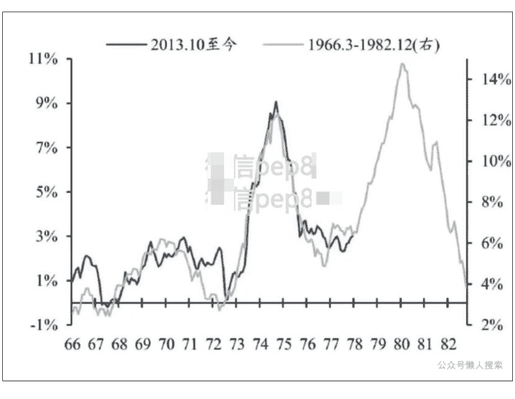

1970年代大通胀的原因：
- （1）供给冲击：石油危机；
- （2）长期维持宽松的财政货币政策，导致总需求不断膨胀；美国央行长期服务于经济增长目标（无独立性）；工会强势，工资-价格螺旋明显；
- （3）无深度金融市场吸收富余流动性。

当前：
- （1）供给冲击几乎不存在，以中国为中心的超级制造大国及新兴制造业基地，高效的全球运输网和信息传输、预判决策能力，提供了高度的供给弹性；关税是人为的、可调的、服务于政治的；
- （2）全球主要经济体财富分配均 K 型分化，总需求表面稳健但实际脆弱，老龄化，裁员潮，新技术对劳动力进行替代；联储捍卫“独立性”（虽然很快就很可能会丧失）；
- （3）深度的金融市场和房地产市场吸收多余流动性；加上财富分配 K 型分化；因此即便货币超发，很有可能也只是会转化为资本泡沫/资产价格上涨，而非通货膨胀。

#### B “增长” 问题的讨论
参考图 8。

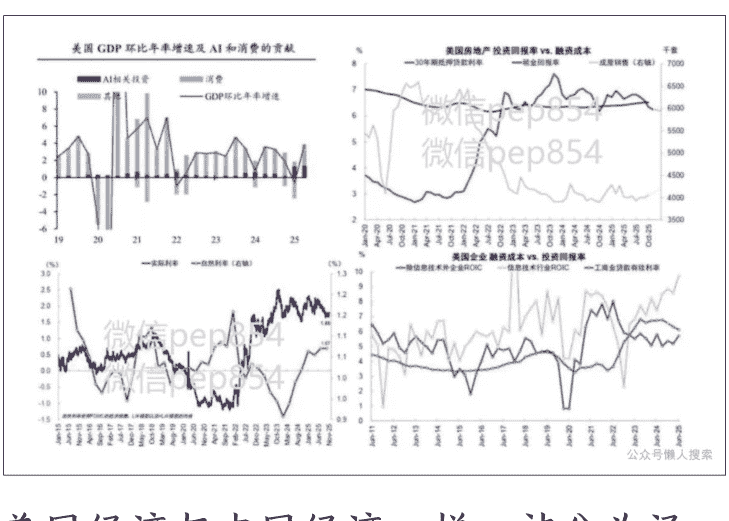

美国经济与中国经济一样，被分为泾渭分明的新经济和传统经济两个组成部分。

##### B1 传统经济：
左上图可以看到，AI 相关投资已经贡献 GDP 增速的很大一部分，与消费等量齐观。经济中除开消费和“AI”之外的部分几乎没有什么贡献。

参考中金 Kevin 的框架（认同），是否信用扩张，取决于资金成本和投资回报率之间的关系。右上图，美国房地产投资回报率已高于 30 年期抵押贷款利率；右下图，信息技术行业 ROIC（投入资本回报率）远超工商业贷款利率, 而非信息技术企业的 ROIC 低于贷款利率, 但两者接近, 只需要利率下降 25-50bps 就可以启动信用扩张。

左下图, 3 次 25bps 的降息就可以弥合自然利率和实际利率之间的差距 (约为 73bps)。

因此, 美国传统经济的问题不是结构性的, 而是周期性的, 靠降息就能够解决, 在更低利率水平开启信用扩张。

所以, 问题只剩下一一联储到底能不能降息? 答案是肯定的, 2025-2026 预计降息 3-4 次, 使政策利率降至 3%以下。
- (1) 必要性: ①Trump 的意愿; ②传统经济的萎缩; ③就业市场明显疲软。
- (2) 可能性: ①通胀将低于大部分人的预期, 不构成降息的掣肘 (上段已讨论); ②联储主席即将换届。

##### B2 新经济:
AI 有没有泡沫? 就算有泡沫, 也是不可错过的投资机会。均衡配置, 享受泡沫, 留一只眼睛盯着出口。

AI 的进展和泡沫的衡量 (图 9):

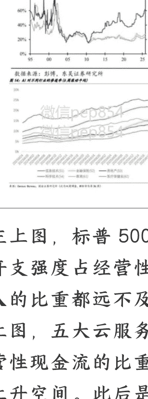
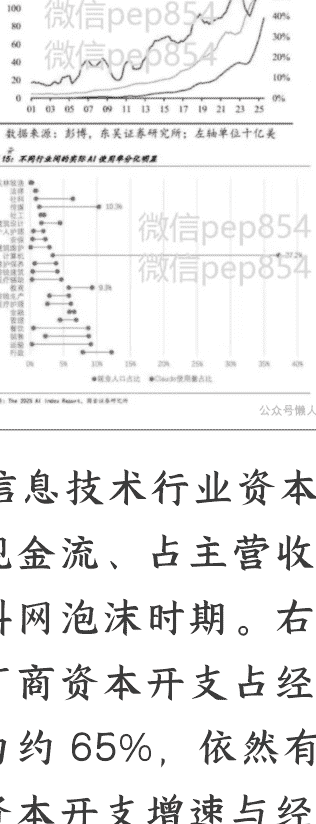
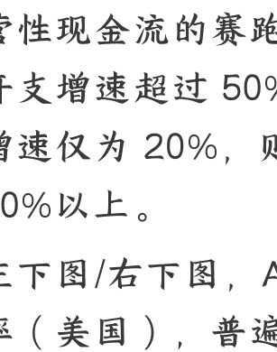
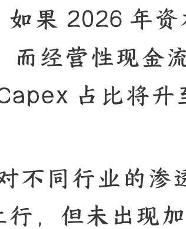

左上图，标普 500 信息技术行业资本开支强度占经营性现金流、占主营收入的比重都远不及科网泡沫时期。右上图，五大云服务厂商资本开支占经营性现金流的比重为约 65%，依然有上升空间。此后是资本开支增速与经营性现金流的赛跑，如果 2026 年资本开支增速超过 50%，而经营性现金流增速仅为 20%，则 Capex 占比将升至 80%以上。

左下图/右下图，AI 对不同行业的渗透率（美国），普遍上行，但未出现加速，图片截至 4 月中，然而极有可能之后已经出现加速—加速与否与 AI 工具本身的可及性、可用性有关，像 Google 的 Nanobanana 这种工具的出现，必然会加速 AI 的渗透。根据我个人的使用体验和得到的各类信息，AI 处于发展早期阶段，“投资者的怀疑犹豫期”。

另外，传统经济在降息通道中扩张，也会加速 AI 龙头公司的业绩扩张。

总结，美股 2026 年 basecase 是金发姑娘经济，股市机会大于风险。

END

本号所载的资料、意见及推测仅反映发布当日的判断，所载内容不代表任职单位的立场，不代表任何投资意见或建议。本号不对任何因使用所载任何内容所引致或可能引致的损失承担任何责任。

最后，安利小懒的付费群：

懒人专属群（介绍）

📚 懒人专属群持续更新中，已持续运营 6 年，整理超 3000 份各类精选付费文章 & 年费社群干货，全部开放下载。

本资料为付费群内部分享，仅供真实有需要的朋友查阅 🕵️‍♂️

懒人专属群更新记录：
https://hk57gvIx7u.feishu.cn/docx/H0kRdZbSbolBR0xkaXtcuVE0nTg

懒人专属群更新记录（需梯子，备用）：
https://lazybook.fun/blog/record2