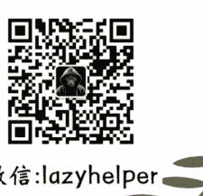

# 如何真正看见并了解一个人？

2025年11月28日

整理：公众号懒人搜索，懒人专属群独享

懒人微信：lazyhelper

今天，我们来说说沟通方面的话题。年底，各种对话就要来了，和领导的述职、和同事的沟通、和朋友的聚会。这些对话里，我们会遇到很多人，也会被很多人遇到。

但你有没有发现一个现象，同样是聊天，有些人让你觉得如沐春风，有些人让你觉得如坐针毡。有的天越聊越亲密，有的天越聊越别扭。

为什么会这样？

关于这个问题，我最近看到一个非常特别的解释，来自一本新书，叫《如何了解一个人》。作者是《纽约时报》的专栏作家，戴维·布鲁克斯。这本书主要讲的就是建立人际关系的方法，书一出版就在美国引起了不小的反响。比尔·盖茨曾经把它列入必读书单，说这是布鲁克斯“迄今为止我最喜欢的作品”。

说到“了解一个人”，我们通常会怎么想？大概是，多接触、多观察、多聊几次天，时间长了，自然就了解了。换句话说，了解就是“我主动去观察你”，知道的信息越多，就越了解你。

但布鲁克斯说，不是这样的。注意，重点来了。

他认为，了解一个人，不是“我去看你”，而是“我让你愿意被我看到”。

什么意思？因为你不可能在对方感到被压制、被忽视的情况下，真正了解他。当一个人感到不被尊重时，他会收缩、会防御、会隐藏真实的自己。你看到的，只是他的“防御模式”，而不是真实的他。

比如，给你讲个故事，故事的主角是丘吉尔的母亲珍妮·杰洛姆。

19世纪末的伦敦，珍妮是社交圈里的名媛。有一次，她和英国首相威廉·葛莱德史东共进晚餐。葛莱德史东是当时最有权势的政治家，整个晚餐，他滔滔不绝地谈论政治、谈论帝国、谈论他的宏伟构想。珍妮听得入神。离开时，她对朋友说，葛莱德史东是全英国最聪明的人。

过了一段时间，珍妮又和葛莱德史东的死对头班杰明·迪斯雷利聚餐。迪斯雷利也是个政客，但他的风格完全不同。整个晚餐，他几乎没怎么说自己，而是不停地问珍妮问题，你对这件事有什么看法？你在巴黎的时候遇到过什么有趣的人？你最近发现了什么变化？

离开时，珍妮对朋友说，我觉得自己是全英国最聪明的人。

这个故事常被用来说明“会聊天的人更受欢迎”。但布鲁克斯要说的，不是这个。他要问的是一个更深的问题，葛莱德史东和迪斯雷利，谁更了解珍妮？

答案很明显。葛莱德史东离开晚餐时，对珍妮的了解几乎没有变化，他只是又多了一个听众。而迪斯雷利离开时，他知道了珍妮对巴黎社交圈的观察，知道了她对政治的看法，知道了她的品位、幽默感、价值观。

而且更重要的是，珍妮在这两场晚餐中，是同一个人吗？

不是。在葛莱德史东面前，她是一个“听众”，她收缩了，她只需要点头、微笑、偶尔附和。而在迪斯雷利面前，她敞开了，她的智慧、她的见解、她真实的自己，都被激发出来了。

借用布鲁克斯的话说，看见是一种“创造性行为”。

你看，我们通常以为，一个人就是一个人，他有固定的性格、固定的想法、固定的样子。你去了解他，就是去发现这个“固定的他”。

但事实上，在很多情况下，你此时此刻看到的那个人，其实是你们共同创造出来的。

就像珍妮·杰洛姆在两场晚餐中呈现出的完全不同的样子，在有的人面前，她是一个沉默的听众；而在另一个人面前，她是一个智慧的对话者。

这不是因为珍妮在“伪装自己”，而是因为她面对的两个对话对象，在用不同的方式“看”她。

第一个人用“你是我的听众”的方式看她，珍妮就成为了一个听众。第二个人用“你是一个有趣的人”的方式看她，珍妮就成为了一个有趣的人。

换句话说，当你和另一个人对话时，你不是在“发现”一个已经存在的他，你是在和他一起，“创造”一个此时此刻的他。这也是为什么布鲁克斯说，如何了解一个人，不是一个技巧问题，而是一个关系问题。你不可能通过“观察技巧”来了解一个人，就像你不可能通过“审讯技巧”来让一个人向你敞开心扉。你只能通过让对方感到被看见、被理解、被尊重，他才会向你展现真实的自己。

基于这个互动关系，布鲁克斯就把人分成了两种，照亮者和压制者。

照亮者，能让对方感到被看见、被重视、被理解。在他面前，人们会展现出最好的自己。压制者，会让对方感到渺小、被忽视、不重要。在他面前，人们会收缩，会隐藏真实的自己。

说白了，照亮者能看到真实的人，压制者只能看到一个影子。那么，怎么成为一个照亮者呢？

布鲁克斯说，关键在于这么几件事。

## 第一，倾听。

我们通常以为，倾听就是“安静地听别人说话”。但布鲁克斯说，这远远不够。真正的倾听，是一种高强度的认知活动。

借用比尔·盖茨的话说，与人对话时，需要你大声倾听。你在倾听上投入的精力，要达到燃烧卡路里的程度。要关闭手机，要保持眼神接触，要用“嗯嗯”“是的”“然后呢”这样的声音来回应。他说到高兴的事，你的脸上要有喜悦。他说到难过的事，你的脸上要有同情。

倾听的核心是，让对方感到，他说的每一句话，你都在意。

## 第二，提问。

布鲁克斯说，提问不是一种社交技巧，而是一种道德行为。什么意思？因为当你向一个人提问时，你其实是在说，我对你感兴趣，我尊重你，我想了解你。这本身就是一种对他人的肯定。

但问题是，很多人不太会提问，提的往往是封闭式问题，比如“你喜欢这份工作吗？”“你觉得这个方案行吗？”对方只能回答“是”或“不是”，结果聊着聊着，俩人就没话可说了。

而真正有力量的问题，是那些开放式的问题。

比如，不要问“你喜欢这份工作吗”，而要问“这份工作中最让你兴奋的部分是什么？”不要问“你周末过得怎么样”，而要问“周末发生了什么有意思的事？”你看，这些问题的共同点是，它们邀请对方讲一个故事，而不是给出一个判断。而当一个人开始讲故事的时候，他就会进入细节，他就会展现真实的自己。

提问的核心是，让对方感到，你对他的故事真的好奇。

## 第三，观察。

布鲁克斯说，观察不是“看”，而是“看见”。

有什么区别？“看”是被动的，你的眼睛扫过一个人，看到了他的外表、他的动作。但“看见”是主动的，你在寻找那些微妙的信号，那些透露出他真实感受的细节。

比如，对方说“我很好”，但他的肩膀是紧绷的，眼神是游移的。这些都是信号，是在告诉你，他其实并不好。你就可以跟他深入沟通，引导对方说出真实的担忧。这么一来，你们之间的对话就从表面进入了深层。

换句话说，**观察不是为了评判，而是为了理解**。

你看，倾听、提问、观察，这三个能力的核心，其实都指向同一件事，让对方感到被看见。你做到这点的时候，对方就会向你敞开。

心理学家温尼科特曾经说过一句话，叫，一个人最初的镜子，是母亲的脸。

当母亲用温柔的眼神看着婴儿，婴儿就知道，我是被爱的，我是有价值的，我是值得存在的。当母亲的眼神冷漠或焦虑，婴儿就会感到，我可能是不被需要的，我可能是有问题的。

换句话说，我们对自己的认识，从一开始就不是“我看我自己”，而是“我从别人的眼中看到我自己”。心理学家科胡特把这个叫做“**镜映**”。他说，**一个人无法独自完整地认识自己的美好和力量，只有当这些被他人的心智“镜映”回来，才能被充分欣赏。**

这也是布鲁克斯一再强调的，“没有人能完全欣赏自己的美好和力量，除非这些东西在他人的心中被镜映回来。”当你选择成为一个“**照亮者**”，这不只是在了解他人，也在帮助他人认识自己。

> 布鲁克斯在书里引用了陀思妥耶夫斯基的一句话，“我越是爱整个人类，就越是不爱具体的人。我在梦想中常常满怀激情打算为人类献身。然而，我根据经验知道，要我跟什么人共处一室，我连两天也待不住。”

而布鲁克斯想强调的是，真正的道德，不是爱人类这个抽象的概念，而是关心眼前这个具体的人。道德不是体现在宏大的理想上，而是体现在与人建立联系的点滴举动上。

## 最后，安利小懒的付费群：

懒人专属群（介绍）

- 懒人专属群持续更新中，已持续运营 6 年，整理超 3000 份各类精选付费文章 & 年费社群干货，全部开放下载。

本资料为付费群内部分享，仅供真实有需要的朋友查阅

### 懒人专属群更新记录：

https://hk57gvIx7u.feishu.cn/docx/H0kRdZbSboIBROxkaXtcuVEOnTg

### 懒人专属群更新记录（需梯子，备用）：

https://lazybook.fun/blog/record2