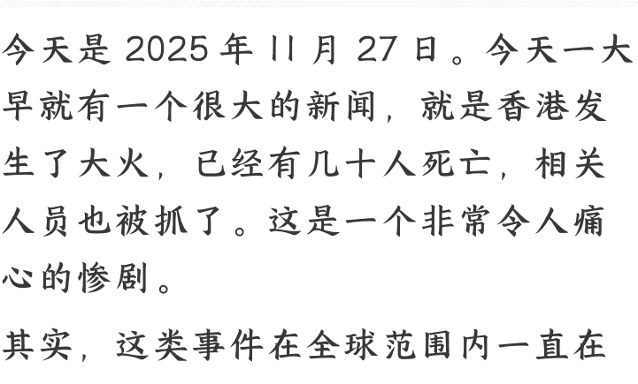

# 面对低概率高损失，我们到底该如何准备？从香港大火谈风险四象限

251128 刘润

整理：公众号懒人搜索，懒人专属群独享

懒人微信：lazyhelper

今天是 2025 年 11 月 27 日。今天一早就有一个很大的新闻，就是香港发生了大火，已经有几十人死亡，相关人员也被抓了。这是一个非常令人痛心的惨剧。

其实，这类事件在全球范围内一直在发生。虽然科技和管理都在进步，不断降低此类事件发生的概率，但它们依然会发生。这让我想起 2010 年上海也发生过一次高楼大火，地点在胶州路。可能还有人记得胶州路大火。那次大火之后，我还做了一件事情，也促使我思考一个问题：面对这种发生概率很低，但一旦发生后果极其惨痛的事件，我们到底应该如何面对和应对？

其实，这背后有一套逻辑，叫做保险。什么意思呢？在做风险管理时，风险大致有两个维度、四个象限：第一个维度是发生概率的高低，也就是横轴，从概率低到概率高。第二个维度是代价或影响的大小，也就是纵轴，从影响小到影响大。这样，横轴和纵轴就切分出了四个象限。

- **第一个象限**：发生概率极大，损失特别大。对于这类事情，核心目标就是极力避免，不能让它发生。很多努力都应该围绕“避免”这个策略展开。
- **第二个象限**：发生概率极小，损失极小。这类事情基本可以忽略。比如下场小雨，在一些城市很常见，发生了也没什么影响，大不了不出门或者等一会儿就停了。这类事情属于“忽略”策略。
- **第三个象限**：发生概率很大，但损失很小。对于经常发生但损失不大的事情，我们采用“减少损失”的策略。比如有些地方经常刮风，可以通过加固墙体或楼房来减少损失。虽然损失不大，但因为经常发生，需要采取措施来减小损失。
- **第四个象限**：发生概率很小，但一旦发生影响特别大。比如大火，虽然大家都很注意防范，发生的概率极小，但一旦发生，可能导致整个家具被烧毁，甚至危及生命，损失非常大。对于这种情况，通常采用“转嫁”或“保险”的方式来管理风险。

转嫁的本质就是保险。因为发生概率极小，如果我们花很大成本去规避，其实不值得，毕竟它很少发生。如果为了规避它而投入大量资源，成本反而浪费了。保险的原理是：比如有一万人都担心火灾，每人出100块钱，大家把钱集中起来。如果真的发生火灾，虽然概率极小，但一旦发生，就可以用这100万赔偿受灾的人，帮助其灾后重建。这就是保险的作用。保险就是把风险转嫁给保险公司。保险公司实际上又把风险分摊给很多参与保险的人，所以这叫做“转嫁”。转嫁风险是一个非常重要的逻辑。

在美国曾经发生过这样一件事：有一家人觉得自己家不会着火，平时很注意防火，所以没有买保险。结果有一天真的发生了火灾。救火员赶到他们家门口后，并没有立即灭火，而是选择等待。为什么？因为旁边的邻居买了保险，救火员担心火灾蔓延到邻居家。一旦火蔓延到邻居家，救火队就会扑灭火灾，但只会阻止火势蔓延，不会彻底扑灭这家人的火。

这家人很生气，要求救火员赶快救火。救火员说：“你没有买保险。”这家人说：“你先救火，事后我给你钱。”救火员拒绝了，因为火灾已经发生，这时再交保险费是不合理的。原本是一万人分摊低概率的风险，你现在要补交的费用远远超过你本该交的保费，甚至要千倍、万倍于原来的保费。所以救火员不能救这场火，这已经超出了保险的范畴。

如果我现在救了，所有人都不交保险了。如果所有人都不交保险，救火队就活不下去。救火队活不下去，大家都没有人救了，所以我是不能救的。这在美国引起了非常大的争议：到底遇到火灾的时候，如果没有买保险，该不该救？从商业和情感上来说，这很难接受。救火队都已经到门口了，但中国的救火队并不是商业保险的事，它是国家统一的公共服务。而在商业保险为主的国家，你是否愿意先花一点钱，把极低概率但极大风险规避掉？在中国，救火是公共服务，但万一遇到极端情况，救也救不过来怎么办？

2010年，我做了一件事：花了大概1600块钱，买了一组东西，买了一个叫缓降器的东西。当时我住在18楼。缓降器的安装过程是这样的：在家里用一个很大的铁钩子，用钢钉深深地钉在墙里。然后穿上一套像爬山或攀岩时用的装备，把缓降器挂在钩子上。就像攀岩一样，把挂钩挂上去，然后缓缓匀速降下来。这个设备叫缓降器，就是匀速下降的缓降器。

你要算好绳子的长度，18楼嘛，要确保绳子足够长。你下去之后，另外一头就可以拉上去，另一端也是一个可以穿在身上的缓降器。这样，下面的人把缓降器的装备脱掉，上面的人再穿上，然后继续下降。就这样反复地把人送下去。

遇到险情时，如果外面已经烧成大火就来不及了，但外面之所以会烧成大火，是因为你下不去。所以一旦发现有烟或者火，你就可以提前下去，其实不会被外面的大火烧着。如果左边有问题，你可以选择在右边下降，因为大楼有四面，可以选择安全的一侧降下去。

当时买缓降器，就是考虑到这些情况。2010年买的，到现在都没有用上。其实这就是我花了1600块钱交了一份保费，这份保费虽然到现在没用上，但很多保费其实都用不上。关键是万一发生极端情况，损失会非常大，这时候能用上就很值得。所以用不上也没关系，这就是应对极低概率但极高损失事件的处理办法，叫做风险转嫁或者保险。

买缓降器也是因为我有一个朋友，他跟我说，看了2012年的那个电影之后，觉得会不会真的有世界末日、大洪水怎么办？他住别墅，就在别墅的屋顶装了一套热气球。这种想法很异想天开，脑洞很大，就是为了应对万一的情况。极低概率发生的事件，万一真的发生怎么办？他就坐着热气球在天上飘几天，等大水退了之后再落下来。当然，到今天他从来没用上，这其实就是保险的概念。

所以，遇到这种非常大的险情时，在没有遇到之前，能不能先把保险买了？这是一个人对未来的判断。如果你看到了那种极低概率但极高损失的事情，心中有保险意识，不一定非要去交保费，而是用一点点的费用去赌这个万一。你有一个救援的东西，有人说不会发生，不会发生就算了。但如果你愿意考虑这个万一，你可能就真的具备风险识别能力。

今天香港发生的事情让我想起 2010 年买的缓降器，也顺便和大家分享一下，面对不同概率和损失的二维四象限处理办法是什么。

最后，安利小懒的付费群：

懒人专属群（介绍）

懒人专属群持续更新中，已持续运营 6 年，整理超 3000 份各类精选付费文章 & 年费社群干货，全部开放下载。

本资料为付费群内部分享, 仅供真实有需要的朋友查阅

## 懒人专属群更新记录：

https://hk57gv1x7u.feishu.cn/docx/H0kRdZbSbolBR0xkaXtcuVEOnTg

## 懒人专属群更新记录（需梯子, 备用）：

https://lazybook.fun/blog/record2