# 【从 0 开始做 YouTube】月入万刀 10个高级 YPP 的实操之道

## 251128 副业 SC 精华

公众号懒人搜索，懒人专属群独享
懒人微信：lazyhelper

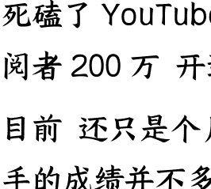

微信：lazyhelper

大家好，我是死磕 YouTube 的新人 Zero。

死磕了 YouTube 一年，到这个月，共拿下订阅者 200 万，开通了高级 YPP 共计 10 个。

目前，还只是个月入万刀的小学生，拿得出手的成绩并不多。

## 今天的分享的主题是《月入万刀 10个高级 YPP 的实操之道》

这篇是应很多人的期望。很多人找到我，想知道为什么我总能出成绩，为什么文字那么有力量，为什么有那么坚实的心力。今天这篇，我就以此为主题展开讲讲。

看完这篇，你不仅可以完整的到我 YouTube 如何月入万刀的做事之道，更能通过我过去十年的经历，看到我是如何将各种副业做出些许成绩的。

让我们开始。

这是我在生财的第五篇文章。这五篇文章的时间线都是连续的，大家可以继续拿来当连续剧看。

我的第一篇文章，是一篇龙珠帖，是生财有术全站文章历史锚点第一名。它承载的，是我 2025 年 2 月到 4 月的故事，记录我如何在 YouTube 从 0 月入过万 (RMB)。

我的第二篇文章，也是一篇精华帖。它承载的，是我 2025 年 5 月到 9 月下旬的故事，记录我在两个高级 YPP 被封禁、50 万粉丝人间蒸发后，如何重新起航、12 天用新号拿下 2000 万播放的重生故事。

我的第三篇文章，还是一篇精华帖。它承载的，是我从今年 9 月中旬到现在 10 月中旬的故事，记录的是我从 0 开始，分别用 17 天和 24 天，从 0 开通两个高级 YPP 并且达成月入上万美刀目标的故事。

只是这次的月入过万，不再是 RMB，而是美刀。

我的第四篇文章，仍是精华帖。它承载的是 10 月到 10 月底的故事，记录的是我高筑墙、广积粮，以慢制快、以量变待质变的思考逻辑。

我上面的这 4 篇文章，里外里大几万人看过。很多人在这之中找到共鸣、找到动力，很多人靠他们拿到成绩。但在我看来，上面这四篇，无非是非常片面的，记录个乐子，他们只是“术”，只是表层的显像。

这第五篇，才是一切的核心，也是一切的原点，是我一切行动的基准。它承载的，是我过去十几年来的人生缩影，是我能从一个什么也不是的人，走到今天的根本原因。

上面四篇精华帖，写的是我的“术”。这第五篇文章，写的就是我的“道”。不论你做的是各行各业，这一篇，都定能帮你更深的理解“术”、“道”与人生。

## 零：何为道

> “朝闻道，夕死可矣”

人一生之术，千变万化，如兵家诡道，说不完，言不尽。但一人一生之道，只有一条。

> “朝闻道，夕死可矣”

这话的意思，并不是“希望理解‘道’，只要明白了‘道’，那很快死掉也不后悔”。

“朝闻道，夕死可矣”我的解读是：

> “你找到并践行属于你自己的道，所以你无论何时，都可坦然赴死。”

这两者，有本质的区别。

前者，外求。做任何事，都需要满足外部条件，他把自身的行动寄托于外物，所以外物一变，本心即变。这种人是大部分：钱少了，待遇差了，数据低了，他自己就会怀疑自己、否定自己，然后进入无尽的内耗，最终总是会半途而废。

后者，内求。无需条件，本自具足，自身的行动就是本心自发，无论外物如何变幻，始终矢志不移。这种人是小部分，不论遇到何等挫折，都会取各法之所长，直至达成目标。

世间万花迷人眼，如果你要将本心归结给外物条件，那么你永远成不了事，因为外物永远在变。

“现在大环境这么差了，我觉得什么都做不了了。”
“这个赛道这么拥挤了，肯定不能做了。”

这话 20 年前有人说，现在有人说，20 年后还是会有人说。有何意义？毫无意义，离会说这种话的人远一点，会被传染。

“得道”，就是彻底的认识自己。

术，可传千万人，但道不可传，只可个人意会。因为每个人有自己的因果，每个人此生，都有自己的意义。每个人的道都不同，每个人的道只能靠自己领悟，有些人终其一生也无法领悟。每个人在尘世中追逐浮沉，或贫穷，或富有，或跌落谷底，或意气风发。每个人都要历体肤动心之苦，吸收天地灵宝精华，这都是在找寻自己存于这世间之道。

你多少总会认识这样的人：他们意志强健，行动有力，不受蛊惑，百折不挠，举手投足、字里行间镇定自若。他们不是不会慌张、不会迷茫、不会落魄。

他们不可能知道所有谜题的解法，但他们总能找到办法、找到出路和答案。这靠的从来不是“术”，因为没有万能的术。这是因为他找到了自己的“道”。“道”在任何时刻，都是他的行动纲领，是他的心神底蕴。是他的道，保证他总能冷静待事，日进一步，即便满地荆棘，他仍能渡至彼岸。

这就是得道之人的强大之处。

对我来说，我的做事之道，在于“斩断后路+理解现实+绝对自信”。

在理解“道”的字面意义后，我需要和它互相认可。我需要认可它的强大，它需要我的全心践行。只有这样，当我和“道”互相认可后，它才能成为我的“道”。

我践行我“道”的时候，才能打开一座大门，进入一个空间。在这个空间中，我可以获得：
- 单位时间内效率成倍提升的学习效率
- 近乎无尽的灵感，发现/提示你该尝试的、更可能出成绩的方向
- 前所未有的集中力，让你可以数个小时不吃不喝不动，也能保持大脑高速不停顿的运转。好像身体和潜意识，链接到了一个无形的终端上，让无尽的知识流入脑海，让你能更快速的看到机会，接近目标。

听起来有点玄是吧？这么说确实是这样，不过看完下面的我的经历，你就能明白我在说什么了。

你也许仍不太明白道是什么，也许你已经找到了自己的道，都不妨听我二三言。我会把我的寻道之路，诉与你听。无论你感悟几何，我相信，都对你定有裨益。

## 壹 · 闻道

斩断退路+理解现实+绝对自信，就是专属于我的道。

### 何为：斩断退路

2017 年以前，我在东北做过服务员，在工地栽过树，干过电话营销，还开过饭馆，都没成。后来做到实在是吐了，在家待业几个月。

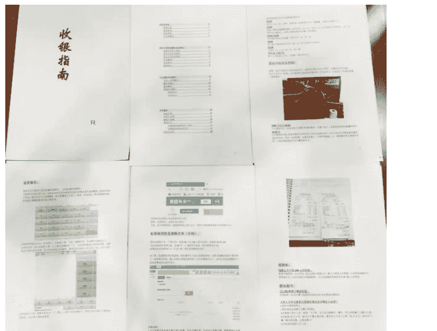

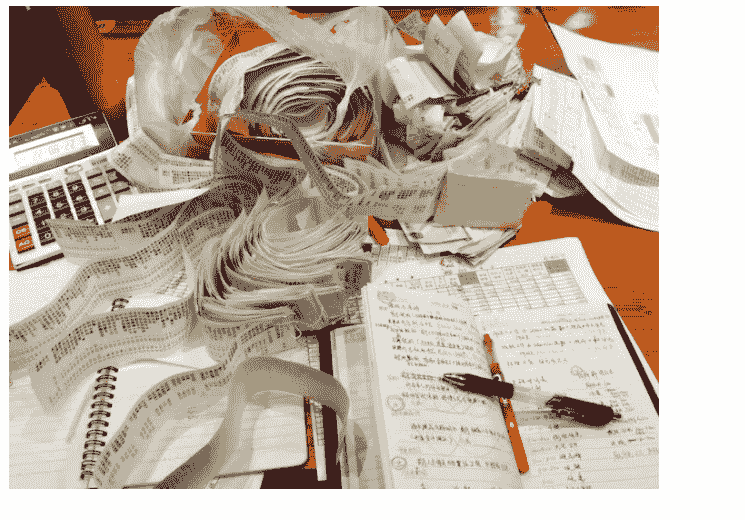

当时我爸让我去上海找互联网的工作。那时的互联网行业，正是 2017 年最浪尖的时候，一时风头无二。但这个建议，对我来说无异是一个晴天霹雳。

对 2017 年的我来说，互联网是什么我一点概念也没有。2017 年，我 27 岁，我除了会玩电脑游戏外，别的关于电脑的事情是一概不知，连 Excel 是什么都不知道。如果你是互联网公司，你会招一个 27 岁的、从来没接触过互联网、之前是干服务员的人吗？用屁股想也知道是不可能的。

但在我爸强行的要求下，我真的很认真的投了很多简历。我针对不同公司，定制简历版本。我不是海投，还自学了 PPT，吭哧吭哧的给人家写几十页的 PPT 提建议，写一次要憋三四个小时，写的也是乱七八糟。结果自然是不出所料：我投了 1 个月上百份简历，1 份通过的都没有。因为真的我一点经验也没有，人家招年轻的应届生就好了，根本没理由会招我。

我心灰意冷决定不去上海了，因为去了也没用，但我爸不这么想。他觉得简历不过没什么大不了的，你就上人家公司去，就硬说要应聘，只要能让入行，干什么都行。这话我听来脑袋嗡嗡的，这是什么土匪拦路抢劫的路数？2017 年是什么年月了，在上海应聘，你得先投简历，过了才能约面试，你不约面试就硬上门？不被前台赶出去才怪吧？

但我爸非常强势，他不给我留任何退路，强行给我从家里赶到上海去了。我当时住在宾馆里，每天瑟瑟发抖的改简历投简历，然后看着它杳无音讯、石沉大海。半个月的时间，数着自己兜里为数不多的几个钱，我很绝望，每一天都是煎熬。我甚至觉得，不如去附近的餐馆里当服务员得了，但

我爸一直不同意，他死活要逼我去应聘互联网公司。

最后我实在没办法，最后真的只能用了他的土匪路数：我前脚投完对方公司的职位简历，后脚就到人家公司应聘去了。很多公司门口有门禁，我至今都记得，我做贼一样的、跟着人群混进去的那一幕幕。

到了人家前台就更是无比尴尬了。前台问我：“有什么事？”我说：“来应聘。”他问我：“有没有预约？”我说：“没有，但我来了，能不能给个机会？”然后就是彼此无言的 5 秒钟。

这种经验，我怕是全世界的人加起来算，也没几个人有。但这土匪路数，还真的是有效。每家的前台都会先懵逼的看着我，然后说尬笑一下，说“那我去问一下”。我无一例外的，都能见到人家的 HR。

在如此路数“抢劫”了 N 家公司以后，我找到了我的第一家公司，做电商 App 的内容运营专员。他们只是要一个底层干苦力的，而我主动性这么高，自然是好料子。实习期 3500，转正 4500，周六还要上班。这在 2017 年的上海，已经是非常低的薪资了，但我毫不犹豫的答应了。

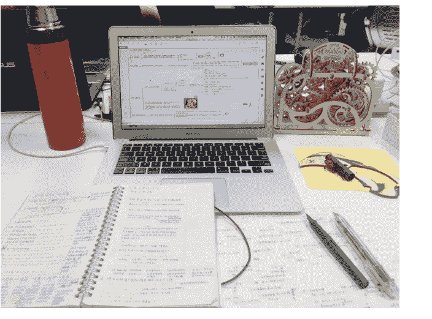

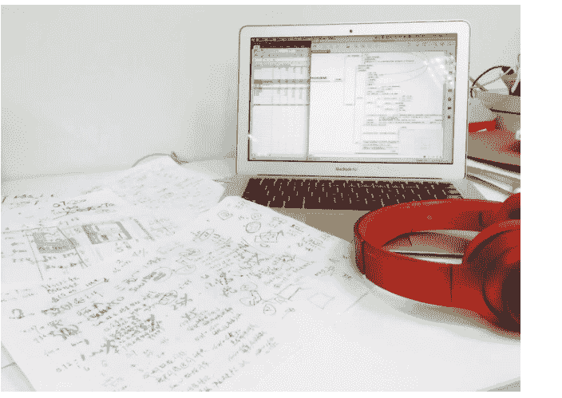

这种入职方式，我不知道有几人能做到。就算时间再重来，我觉得自己也再难重现。不过当时的我确实做到了，这少不了我爸的毒舌鞭策，把我被逼得没了办法。但说到底，是我没有选择赖在家里，或者找一份服务员之类的工作度日。我就算这么干了，我爸也拿我没得办法，是我断了自己的后路。

人在绝境情况下，会迸发出无尽的潜能，你要相信这一点。这世上也都是一帮草台班子，没什么高深莫测的东西，你要相信你自己。

这也是我第一次，感觉达成了一件在我当时看来了不起的成就。是我第一次有意识地，摸到了属于我自己“道”的轮廓。里面的第一条，就是我要“斩断自己的退路”。

### 何为：理解现实

#### 理解事物的本质

我 2017 年在上海第一天上班，这是让我记忆犹新的一天。晨会，同事展示了一张 Excel 表格，上面写满了项目最近一周的各种关键转换率的数据。我看着那张表，就像看着天书，里面的每一行每一列，我都不知道它写的是什么。我也不知道他们在分析什么，我也听不懂他们在说什么。

会后，我问了我的上司。我问他：“你是怎么看懂这个表格的？你为什么能看出数据中哪里有问题？”我至今仍记得上司那个时候看我的表情：先是呆住，然后疑惑，最后无语。他只是淡淡的说：“你看多了就知道了。”但我能看得出来他正在想的是：“到底是谁把这个 SB 招进来的？”

“理解现实”是什么？在我这里，理解现实的意义就是“如果你写不明白，那么你就不可能理解”。

比如右边这张图，我几年前在开饭馆的时候，学着做收银时候的 SOP。那个时候，我根本不知道什么是 SOP，也不知道什么是收银。我的性格比较大条，账是从来算不明白的，做事也是丢三落四的。为了彻底搞明白怎么做收银，所以我将这个岗位所有的流程、注意事项，都配上图，配好目录，做成了指南手册，总共应该有 40 多页。

当时没人要我做这件事，也没听说谁做过这件事。但在这件事完成以后，我收银再没出过岔子。这也是我第一次的意识到：写下来，就是理解现实、达成目标的最快最佳的方法。

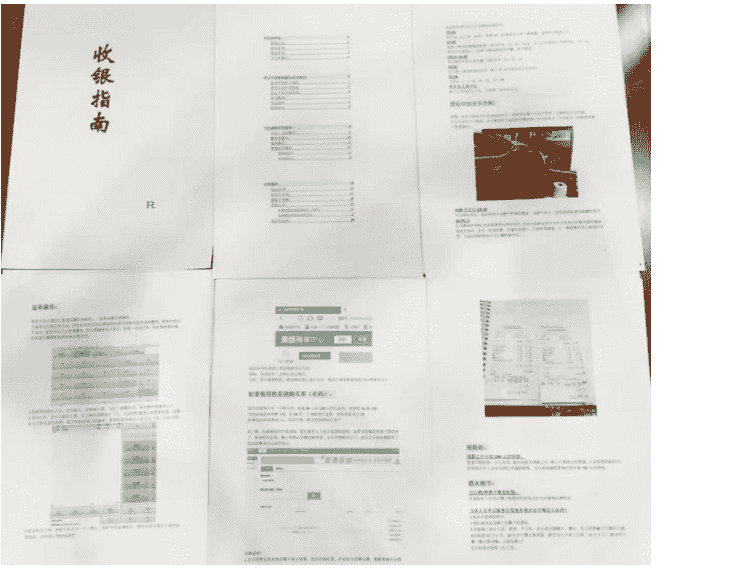

在我入职了那个 3500 块一个月的上海的工作后，我的第一件事，就是在工作之余自学怎么用 Excel、怎么用 XMind、怎么用各种工具电脑办公。这对当时对电脑一无所知的我来说，可谓是难如登天。所以我花了两周的时间，将我工作中的所有流程、所有技能、所有工具的 SOP，全部都事无巨细的写得清清楚楚。甚至我还花了两 天将这些 SOP 都制作成了视频教程，直到后来公司来了新人，都在用我的这套视频教程。同样，当时没人要求我做这件事，也没听说过谁做过这种事，同事不理解，我的上司也瞠目结舌。

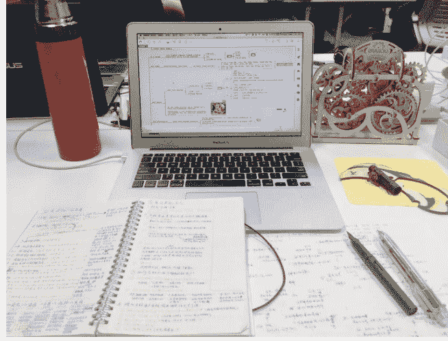

#### 理解时间的流逝

不仅事物，我连时间也进行量化。当时我为如何最大化利用我的时间，我开发了一个时间表系统。

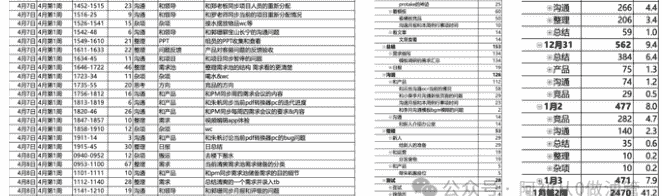

简单来说，就是用数据透视的方式，将我的时间进行三级分类。因为每个人最大的财富、最宝贵的财富，就是时间。每个人都是生来平等，24 小时，你如何使用它来投资，决定你全部人生的质量。你有没有觉得你的时间一下就没？明明没做什么一天就过去了？你的时间去哪了？这个工具，就能解决你的这个问题。

在掌控人生的最开始，你需要掌控你自己的时间。

这个时间表系统的起因，是有一天，我忙的跟狗一样，结果我的上司却质问了我一句：“你一天都干了些什么？”当时我火冒三丈，但又张口结舌，因为我确实是不记得我一天都干了什么了。我只记得我真的很忙，但忙了些什么，我真的想不起来了。所以我就做了这个表，我将我每天的时间按分计算，将我每天的工作内容，时间分一级、二级、三级来进行记录。

| 项目 | 耗时分钟 |
|---|---|
| 2020/4/27 | 542 |
| 竞品 | 176 |
| 看产品 | 102 |
| 模板的分析报告 | 77 |
| protake的神迹 | 25 |
| 看模板 | 60 |
| 看模板竞品 | 50 |
| 沟通月报和本周例行事项时间 | 10 |
| 看文章 | 14 |
| 文章查看 | 14 |
| 总结 | 153 |
| 需求编写 | 134 |
| 模板调研的需求汇总 | 134 |
| 日报 | 19 |
| 沟通 | 126 |
| 和产品 | 112 |
| 和云丝沟通ocr当前的情况 | 58 |
| 和小赛李月沟通新版页面的问题 | 29 |
| 沟通月报和本周例行事项时间 | 23 |
| 和李月沟通模板bgm模糊的问题 | 2 |
| 沟通 | 14 |
| 和新人介绍办公室 | 14 |
| 整理 | 53 |
| 新人 | 29 |
| 给新人的准备 | 29 |
| 和运营 | 19 |
| 分发食物 | 19 |
| 和产品 | 5 |
| 帮朱帆搬座位 | 5 |
| 面试 | 28 |
| 面试 | 24 |
| 筛简历 | 4 |
| 杂项 | 6 |
| 计 | 542 |

| 行标签 | 求和项:耗时 | 小时 |
|---|---|---|
| 1月第1周 | 2041 | 34.0 |
| 12月30 | 531 | 8.9 |
| 沟通 | 266 | 4.4 |
| 整理 | 206 | 3.4 |
| 总结 | 59 | 1.0 |
| 12月31 | 562 | 9.4 |
| 总结 | 384 | 6.4 |
| 产品 | 75 | 1.3 |
| 沟通 | 74 | 1.2 |
| 竞品 | 29 | 0.5 |
| 1月2 | 477 | 8.0 |
| 竞品 | 282 | 4.7 |
| 沟通 | 140 | 2.3 |
| 总结 | 35 | 0.6 |
| 整理 | 10 | 0.2 |
| 杂项 | 10 | 0.2 |
| 1月3 | 471 | 7.9 |
| 1月第2周 | 2470 | 41.2 |
| 1月6 | 545 | 9.1 |

| 日期 | 周 | 时间 | 耗时 | 一级 | 二级 | 三级 |
|---|---|---|---|---|---|---|
| 4月7日 | 4月第1周 | 1330-1350 | 20 | 沟通 | 和领导 | 和郭珊沟通当前的问题 |
| 4月7日 | 4月第1周 | 1351-1430 | 39 | 沟通 | 和产品 | 和PM同步当前的关于规章安排 |
| 4月7日 | 4月第1周 | 1431-1452 | 21 | 沟通 | 和产品 | 分配客服问题给pm，定反馈时间 |
| 4月7日 | 4月第1周 | 1452-1515 | 23 | 沟通 | 和领导 | 和郑老板同步项目人员的重新分配 |
| 4月7日 | 4月第1周 | 1516-25 | 9 | 沟通 | 和领导 | 和罗老师同步当前的项目重新分配情况 |
| 4月7日 | 4月第1周 | 1526-1541 | 15 | 杂项 | 杂项 | 接水摆放物品wc等 |
| 4月7日 | 4月第1周 | 1542-48 | 6 | 沟通 | 和领导 | 和郭珊聊宝山长宁的沟通问题 |
| 4月7日 | 4月第1周 | 1549-1610 | 21 | 整理 | PPT | 组员的PPT收集和查看 |
| 4月7日 | 4月第1周 | 1611-1633 | 22 | 整理 | 问题反馈 | 产品对客服问题的反馈验收 |
| 4月7日 | 4月第1周 | 1634-45 | 11 | 沟通 | 和项目 | 和项目同步暂停的问题 |
| 4月7日 | 4月第1周 | 1646-1722 | 46 | 整理 | 需求池 | 整理需求池的结构 需求看的更清楚 |
| 4月7日 | 4月第1周 | 1723-34 | 11 | 杂项 | 杂项 | 喝水&wc |
| 4月7日 | 4月第1周 | 1735-55 | 20 | 思考 | 方向 | 竞品的方向 |
| 4月7日 | 4月第1周 | 1756-1812 | 16 | 沟通 | 和产品 | 和PM同步周四需求会议的内容 |
| 4月7日 | 4月第1周 | 1813-1819 | 6 | 沟通 | 和产品 | 和朱航同步当前pdf转换器pc的迭代进度 |
| 4月7日 | 4月第1周 | 1820-46 | 26 | 沟通 | 和产品 | 和PM同步每周四需求会议的要求&内容 |
| 4月7日 | 4月第1周 | 1847-1857 | 10 | 整理 | 需求 | 视频编辑app体验 |
| 4月7日 | 4月第1周 | 1858-1910 | 12 | 杂项 | 杂项 | wc |
| 4月7日 | 4月第1周 | 1911-14 | 3 | 沟通 | 和产品 | 和朱航讨论当前pdf转换器pc的bug问题 |
| 4月7日 | 4月第1周 | 1915-45 | 30 | 整理 | 日报 | 日总结 |
| 4月8日 | 4月第1周 | 0940-0952 | 12 | 杂项 | 搬运 | 去楼下搬水 |
| 4月8日 | 4月第1周 | 0953-1100 | 67 | 整理 | 需求 | 当前清爽需求池需求储备的分类 |
| 4月8日 | 4月第1周 | 1101-1111 | 10 | 沟通 | 和产品 | 和pm同步需求池储备需求的目的细节 |
| 4月8日 | 4月第1周 | 1112-1140 | 28 | 整理 | 需求 | 总结清爽的一个需求并录入tb |
| 4月8日 | 4月第1周 | 1141-1210 | 19 | 沟通 | 和领导 | 和郭珊同步月报和评级的问题 |
| 4月8日 | 4月第1周 | 1330-1350 | 20 | 沟通 | 和领导 | 回复郑老板在清爽群里的问题 |
| 4月8日 | 4月第1周 | 1351-1410 | 19 | 沟通 | 和产品 | 和pm了解老板的问题情况 |

自此之后，再也没人敢问我“你一天都干了些什么”。

因为我这样记录，直接将我的时间压缩至极致，使我连一点开小差的时间都没有。我连上厕所的时间都记上去了，再也没人敢和我比时间管理。

本来我的目的是用这个表塞死我的上司，但后来没人再敢提这件事了，这个目的也就不存在了。不过，我在记录这个表的时候，发现了更有用的地方。

这样记录，有两个最大的好处。

直观地管理你的时间：一天下来，你自己就知道了，我怎么在这里消耗了这么多时间？我能不能少花点时间？我能不能不在这里浪费时间？在记录这个表格后，这种反思和复盘，自然而然的就会出现在你的脑子里，有效提升你的时间效率。

让你戒掉不必要的事情：因为每隔一段时间，你都要记录你这段时间都干了什么，所以在日常中，每当你即将开## 何为：绝对自信

当你开始浪费时间的时候，比如你下意识地开始刷手机、下意识地想玩一会儿游戏，或者一蹲厕所就蹲半小时，你会主动地被提醒。因为你马上需要记录填表，你就会被自己提醒，你自己就会被迫开始反思：我真的要开始刷手机了吗？我真的要开始打游戏了吗？

你的时间，就被自己有效地控制了。

我不认为学习东西是我的天赋，我学东西并不快，我见过很多人比我强。但我会用几倍的时间将其写成册。在此之后，就没有人比我更懂它。写下来，就是理解现实最好的方法。

一年多以后，我就当上公司的管理层。这个时间点是18年的8月。很多人听到这里，都觉得不可思议。我现在回想，我也很难想象，一个27岁的电脑白痴，入职一年多以后，就能在一个几百人的公司里当上管理层，带领跨商务、产品、运营、技术的20余人的团队，真的是不太现实。

我当上管理层的契机是，当时公司想做新项目，在内部路演竞选。当时好多个队伍参选，都是三五人成群。我以一人之力单挑独斗，成功当选。

我知道，这是我的机会。所以我决定自断后路。我当时干了三件事：

- 第一点：我给全公司发日报。不是一天两天了，我的日报后来已经是全公司的“名物特产”，是新人入职后首先要参观的对象。我写了大概能有1年半，天天如此，写服了全公司上到老板下到保洁的所有人。
- 第二点：很好理解，就不解释了。
- 第三点：我将我所有的工资拿来干嘛了？首先是项目激励。我们当时做的是App，对App来说迭代速度就是生命，所以我将我大部分的工资都放到了激励上。比如这种：这个地段当时租一天是六千左右，我租了很多次，让全公司所有同事羡慕。

> 公众号懒人搜索，懒人专属群分享
> 
> Zero
> 
> 十一前App开发完工带团队在这个500平绝景搞homeparty，说到做到，立此为据。
> 
> 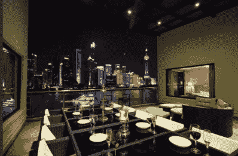
> 
> 2018年9月8日12:05 删除
> 
> 
> 
> Zero
> 
> 酒祝东风，共从容。
> 
> 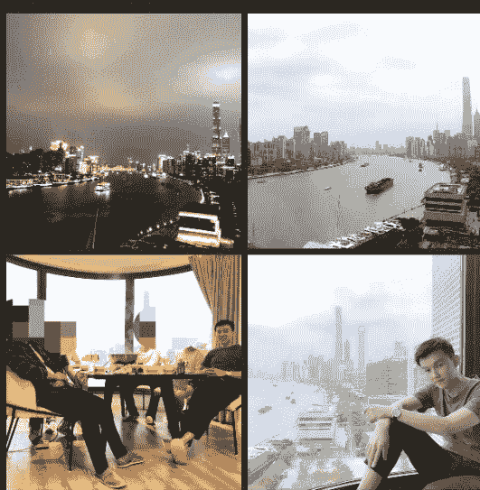
> 
> 2019年5月19日 11:41 删除

其次是人文关怀。我当时认为每个人的投入度很重要，所以我设计了强制每人都要给项目提建议的策略，并且给它打分，直接影响个人绩效（当然绩效也是我拿我的工资给发的）。公司的椅子很多坏的，我直接给全部门所有人换新的。公司的零食很难吃，我全都换成大家喜欢吃的，常年一整箱满满当当放在部门里随时吃。我甚至给部门所有人发远超公司规格的礼物，还有针对每个人定制的手写信。

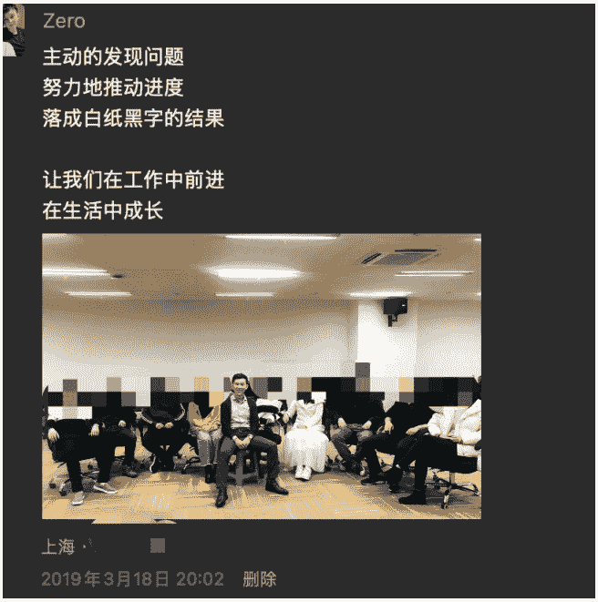
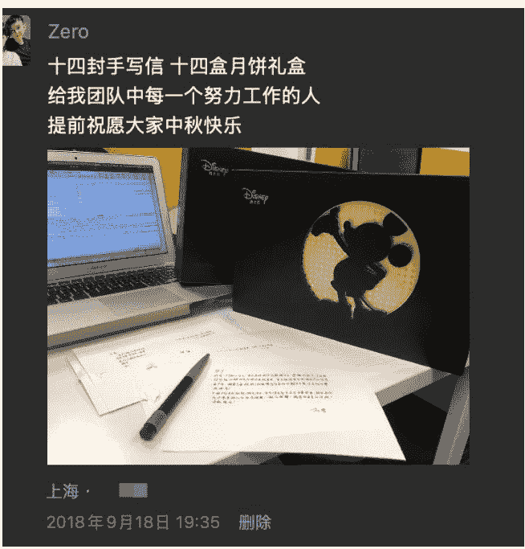

我为什么敢说我是互联网卷王？因为我不相信还有谁能做到我这个地步，我不信。那段时间，虽然我的工资全没了，但那是我进步最快的时段之一。我的眼界、效率、经验沉淀都是数倍于从前。就连项目失败，也给我的人生上了浓墨重彩的一笔，让我瞬间顿悟了很多很多的事。这和主题不符，也先暂且不表了。

如果时光重来，我还会选择这样做吗？如果我能拥有来时的记忆，我肯定不会了。但如果是记忆清零，我估计我还是会这么做。我虽然放弃了我全部的薪水，但我所收获的远比这点钱要多得多。这归根结底，是我再一次地斩断了自己的后路。我不是以一个打工人的身份在做事，我是为了自己的未来在做最大可能的拼搏。当你把全部都投入进一件事之后，你的格局都会随之改变。

在我完全放弃工资的这段时间里，我向公司几百人每天持续不断地承诺优秀，每天写几千字的图文日报发给公司所有人。这让我养成了一个习惯，就是绝对自信。如果哪一天我不自信了，就是我几个月的工资都扔水里了，就是底下的20几人工作全丢了，就是我在全公司几百人前承诺优秀的人设崩塌了。这是我不能接受的事情，所以每天我都拼命地往前跑。

在如此刻意练习不知多久，绝对自信就成了我的习惯。自此，我坚信我做什么都能成，这是一种没有理由的盲目自信。人在绝境情况下，会迸发出无尽的潜能，你要相信这一点。这世上也都是一帮草台班子，没什么高深莫测的东西，你要相信你自己。什么月利润过亿的业务、什么行业领先的公司、什么好几百人的组织，不外如是。我一个服务员出身的互联网白痴，能1年做到这个位置，绝非偶然。

这是我第二次摸到“道”的轮廓，也让我确立了我“道”的三个组成部分：即“斩断退路+理解现实+绝对自信”。

## 贰 · 行道

### 第一次做自媒体：母婴

我人生的下一个转折点是自媒体。几年前，老婆怀孕了，她在怀孕的三个月后我就让她辞职在家了。一方面是她孕吐比较严重，另一方面是我也着实不想让她怀着孩子去上班。她孕期的各种焦虑、家庭收入的下降和孩子的支出，猛猛地砸进我的世界里。这是在真正经历前，谁也无法想象到的人生体验。

为了补贴家用，并且给老婆在家找点事做缓解她的焦虑，我人生第一次出镜，以丑角的形象在抖音拍起了母婴内容。主要内容方向是说女人怀孕辛苦、男人该怎么做。这是我人生中第一次做自媒体。在此之前，我对自媒体的概念只停留在自媒体=微商。在这以前，和大多数人一样，我是绝拉不下脸来做这种事的，出镜都足够羞耻了，更别提什么扮丑角了。但为了能多赚点钱补贴家用，以及把这件事做起来、让老婆有事干，我是把脸全豁出去了。

从0开始，大概发了几百个作品，全网粉丝20万左右。私域卖自己写的十万字孕产攻略表格，拉到广告若干，纯利20余万，全网所有同行都在搬我的文案。

### 也是从这时候开始，我知道原来做自媒体也能赚钱，从0开始也能做得起来

我放下了全部的身段和面子。什么互联网圈的、什么管理层的、什么人五人六的，全然都是身外之物。我可以不这样干，但为了家人的生活，我什么都能干。这是又一次我断了自己的后路。

十万字的表格是将市面众说纷纭的大量文章资料进行收集、理解和重新成体系的编写，是我一字一句码出来的。下面的只是部分截图，这让我充分地理解了现实，也彻底地理解了女人孕期中会遇到的各种心态和事物。

### 新生儿使用说明书-月子篇（月嫂面试）

| 问题分类 | 问题 |
| :--- | :--- |
| 基本情况相关 | 1. 工龄几年？一般至少5年以上的，算是比较有经验的月嫂。2. 照顾过几个宝宝？一般来说，至少照顾过10个以上的宝宝，才算是比较有经验的月嫂。3. 身份证健康证上岗证？有什么证让他拿什么证，不能说更有水平，但至少更专业。 |
| 产妇护理相关 | 1. 产妇刚剖完针有什么注意事项？这些问题你都不用懂，听他的态度逻辑是否不奇葩、断档、磕巴、模棱两可、自相矛盾，就能知道他的水平了。 |
| 新生儿护理相关 | 1. 月子里有哪些常见病？如何护理？2. 怎么催乳？3. 大人吃什么，吃几顿，吃多少？4. 月子里是否给孩子做抚触、抬头训练？5. 孩子总爱呛怎么办？6. 新生儿如何洗澡？ |
| 工作内容相关 | 1. 你和谁住？2. 负责大人什么？3. 负责孩子什么？ |
| 工作时间相关 | 1. 是从住院后开始还是回家之后，一个月做多少天？节假日要不要加班费？2. 从上一家出产的时间，提前去or走不了的情况。 |

### 月子需要的注意事项和其原理

| 事项 | 原理 | 注意事项 |
| :--- | :--- | :--- |
| 洗头洗澡 | 不洗头洗澡会让病菌滋生，平常要贴着孩子喂奶，对孩子也不好。老一辈没有热水条件和空调条件，所以如果沾水或者容易着凉，着凉就会受寒，就会头疼关节疼。但现在条件不一样了，所以是可以洗头洗澡的。 | 注意以下条件：1. 产后不要立刻洗澡，可用温水毛巾擦拭，先恢复一下体力；2. 若是顺产无撕裂侧切的宝妈，产后3天后可淋浴；3. 若是剖腹产的宝妈，可在伤口愈合好后（大概产后15天后）淋浴，在这之前可以用避开伤口用温水湿毛巾擦身子；4. 淋浴时，浴室不要低于25度，洗澡时间在15分钟以内为宜；5. 不管怎样生产，产后三天都可以洗头，洗头后，用吹风机热风烘到干透；6. 洗澡时记得留一个人照应，避免头晕昏倒。 |
| 不沾凉水，不吹冷风 | 产妇坐月子的时候，因身体激素波动巨大，身体正在恢复中易出大汗，全身毛孔长时间开放状态。如果遇冷，寒气会进入体内，在月子结束后毛孔闭合，才会造成日后头疼关节疼的症状。 | 如非必须，不要出门。如必须出门，要带好帽子长衣长裤，包裹住全身的关节；不管做什么，接触的水要在30度以上、风不要直吹产妇就可以了。 |
| 爱刷牙 | 和洗头洗澡一样，刷牙也是保证卫生健康的有效措施，老一辈因为没条件保证温水所以才流传不能刷牙的传统。 | 照常刷牙，一定用温水，牙刷不需要特别定制，到超市买柔软一点毛的牙刷就可。 |
| 爱吃盐 | 要吃盐，没盐会导致体内水电解质的失衡。另外坐月子的女人会排汗多会流失大量盐分，没盐会使人更加虚弱。再者没盐的东西太难吃，影响产妇胃口，降低产妇心情和恢复速度。 | 每天摄入6g以内就可以，平常家用盐勺满满一小勺的量。 |
| 待产期不喝浓汤 | 月子前4周第1周排毒，第2周调养，都应清淡。浓汤里因富含脂肪和高蛋白，不仅喝不下还容易堵奶。老一辈人因为那时条件差没吃的，营养不良占大多数，所以留下了这个传统。 | 现代生活条件好了不仅不缺营养，要做加减法饮食。只要保持食物的多样性：鱼虾、牛羊肉、炖蛋、肉、蛋、蔬菜、水果，每周样样都有吃就可以了。 |
| 尽量不弯腰 | 产后雌激素大幅下跌，怀孕十月大了肚子身体重心前移，使得腰部本就脆弱。所以如果月子的恢复期再经常弯腰发力，就容易导致今后数年连绵不断的腰疼。 | 注意两点：1. 不能久坐久躺：坐躺的时候可以拿一个靠垫靠在腰上，白天坐了1个小时就起来走动一下；2. 尽量少弯腰：如果要捡东西就蹲下捡，如果要喂奶就尽量采取躺喂的方式，需要弯腰的话可以让他人去做。照看孩子可以把孩子放到尿布台等高台子上直腰看，让减少发力，才能今后不腰疼。 |
| 坐月子时长 | 月子在医学上叫产褥期，因分娩方式的不同，剖宫产比顺产因开了刀，所以恢复的时间会更长一些。 | 产期因为子宫膨胀，内脏受到挤压，顺产恢复这些需要6周42天的时间。剖腹产除了42天还需要额外两周恢复因开刀造成的损伤，需要8周56天的时间来康复。 |
| 室内勤通风 | 通风仍然是为了卫生。 | 屋内每天开窗通风两次，不要直吹。如果外面气温低于28度，通风的时候产妇可以先去其他屋子，热就开空调，室温保持26-28度，湿度50-60%，不直吹人就可以，可以买那种空调罩子给空调挂住。 |
| 补充维生素D和钙、铁 | 母乳会稀释妈妈的钙，我有的宝妈真的在月子里骨折，千万不要回事。在月子就开始补钙和维生素D巩固钙的吸收；恶露排出和分娩会造成血的流失，所以需要补铁。 | 遵医嘱选择药品。 |
| 保持运动 | 适当运动，可以促进恶露排出，帮助恢复体力，避免血栓。 | 只要不是产伤不能运动，每天都下地走走至少半个小时。 |
| 适量的鸡蛋 | 鸡蛋的营养构成和人类基因近似，可被人类更好的吸收，但每人每天最多就能消化两个，不然非但吃了没用，反而不利于消化。产妇产月子期胃肠脆弱，每天不应摄入超过两个。 | 每天最多吃两个鸡蛋，吃多了吸收不了还消化不良。 |
| 适量的红糖 | 红糖含铁不高，可活化血淤，但会造成恶露血量加大，影响身体恢复。 | 红糖水可喝，但到每天连喝超过一个礼拜，不然有可能影响恶露排出。 |
| 包裹住脚后跟 | 毛孔开放，关节易入寒气。 | 下地是要穿好鞋子或带后跟的鞋，覆盖住脚后跟关节防寒。 |
| 看手机时间没有特别要求 | 屏幕看多了对所有人类的视力都有影响，并非专指孕产妇。 | 每天花半小时看看窗外远景，缓解眼睛疲劳，能少看自然是可以看，谁看了多屏幕视力都会受影响的。 |
| 少抱孩子 | 本身月子里产妇就因孕激素下降韧带就松弛，如果经常发力抱起来一个10斤的东西，你的手腕手指颈胸腰椎都要发力，频繁发力容易造成这些关节的疼痛，造成颈椎病关节鞘炎等毛病。 | 非必须不要抱孩子，换尿不湿、给孩子洗澡、拍嗝，让家里人和月嫂来做。 |

### 保险相关

| 名称 | 重要程度 | 险种解读 | 购买时的心得建议 |
| :--- | :--- | :--- | :--- |
| 小儿脑瘫 | 4.6分 | 1. 什么是小儿脑瘫？脑瘫是小儿脑瘫的一种，在0-3个月的婴儿，有15%到16%的孩子有轻微的脑瘫，即新生儿轻度脑瘫，不是所有新生儿都会。2. 这种病怎么治疗？小儿脑瘫主要是脑发育异常引起的，由于脑部缺氧导致的，如果大脑缺氧，宝宝会得脑瘫。 | 1. 有没有脑瘫保障？大多数少儿险不包含脑瘫保障，只有少数少儿险含有轻度脑瘫保障。 |

### 阿初的孕产说明书-月子餐餐

#### 月子餐的原则

| 原则简述 | 原则详述 |
| :--- | :--- |
| 少食多餐、2-3小时吃一次 | 1. 怀胎十月，身体里的脏腑被子宫压迫，月子恢复期间，要少食多餐，在减轻肠胃负担的前提下摄入营养。2. 吃饭时间一般为：早餐7:30，上午加餐9:30，午餐12:00，下午15:30，晚餐18:00，晚加餐20:00，也就是除了早中晚三顿正餐外，还有三顿加餐。加餐通常是粥水类的轻食，不用炖的太浓，也不要让孕妇吃得太多太饱，正餐7分饱就行，加餐一杯或半碗就可以了不要太多。 |
| 月子餐的四周按照：第一周排毒，第二周养身，第三周调理，第四周补充的原则，在前三周一尽量清汤、少油、剔喝肉汤，慎用桂圆、荔枝、大枣、红糖这类活血热性类的食物 | 1. 少油、少盐，但绝不是无油无盐。其中大部分错误观念都集中在最好别吃盐上，没盐会导致体内电解质的失衡。另外坐月子的女人会排汗多会流失大量盐分，没盐会使人更加虚弱，再者没盐的东西太寡淡，影响产妇胃口，降低产妇心情和恢复速度。盐可以吃，每天摄入量6g内即可。2. 桂圆、荔枝、大枣、枸杞、红糖这类活血热性类的食物，至少到产后3周或恶露干净后才适合吃。本篇里的食物均不含上述食材，刻意不吃他们一样能排掉，吃了反而容易排不净。3. 肉汤不说了，前两周禁喝，浓汤里富含脂肪和蛋白质，不仅催不下奶，还容易堵奶。老一辈人因为那时候条件没这么好，营养不良占大多数，所以留下了这个传统。在前两周喝浓汤极易造成乳腺炎，在本篇中为了避免。在第三周后半才有猪脚、鱼汤加入。 |
| 不喝咖啡、茶、酒精，带酒就不要碰 | 别管谁谁一辈子就是这么吃过来的，一个月不洗头也是头痒的。洗了头的也不会都头疼，因为洗头并不是头疼的根本原因。同理下不下奶和喝咖啡酒也没有任何关系，但酒精可以进入乳汁，却会抑制催产素分泌导致喷乳延迟奶水减少。酒精会通过乳汁被孩子吸收影响神经发育睡眠紊乱。而再少的酒都有可能影响到宝宝，没有好处只有坏处。咖啡和茶也都有兴奋神经的作用，也不要喝。 |
| 并非餐餐不重样才叫营养充足 | 什么是营养均衡？《中国居民膳食指南》的定义是：蔬菜、水果、谷薯、粗粮、鱼虾、瘦肉、蛋、奶制品、坚果与豆，都有摄入，才叫均衡，且是可以自由选择搭配的。只要每周上述食品都有吃就可以了，不是非得今天吃山药，明天吃蘑菇，也不是非得炒菠菜，炒个油菜就不行，更不是我不喜欢吃白菜，我还非得吃白菜，都是可以自由搭配的。 |
| 生化汤遵医嘱来喝 | 1. 生化汤就是活血化瘀的汤，一般当归40克，川芎30克，桃红25克，干姜25克，甘草25克，清水1升，拿砂锅煮中药一样煮得的。2. 这个汤不是必须品，也不是所有孕妇都适合喝，要遵医嘱。如果要喝，每餐前也就只要喝一口，一天喝个三四次就好，最多也不要连续喝超过1周。 |
| 适量的鸡蛋 | 鸡蛋的营养构成和人类基因接近，可被人类更好的吸收。但每人每天最多就只能消化两个，不然非但吃了没用，反而不利于消化。产妇月子期胃肠脆弱，每天不应摄入超过两个，每天最多吃两个鸡蛋，吃多了吸收不了也不消化。 |
| 适量的材料和佐料 | 可能每次只给做产妇吃，也可以分给家里人吃。若只给一个人吃，就没必要做一大堆，食材量自己把控。关于佐料，产妇摄入的盐不能超过5g就没问题，料酒在本篇里不会出现，而辣椒八角大料陈皮等重调味料是在第四周才有少量出现，要放也少放点。而且下料也是边下边尝的，以产妇的口味、食量为准最高标准，不要较真。 |
| 产后前三天不用吃太多 | 产后体力消耗巨大，肠胃虚弱，吃清淡易消化的少量食物过渡就可以。 |

#### 第一周食谱（以稀、软、清淡为主）

| 日期 | 时间 | 菜名 | 做法 |
| :--- | :--- | :--- | :--- |
| 第一天 | 早餐 | 小米粥 | 小米+水煮烂 |
| 第一天 | 早加餐 | 炒青菜 | 少油下锅+绿色蔬菜洗净下锅（油菜白菜菠菜茼蒿菜均可）+少许盐，炒熟出锅 |
| 第一天 | 早加餐 | 牛奶 | 温热即可 |
| 第一天 | 午餐 | 小米粥 | 小米+水煮烂 |
| 第一天 | 午餐 | 蛋花汤 | 蛋打散+开水煮+盐调味，可加紫菜番茄 |
| 第一天 | 午加餐 | 水果 | 火龙果、香蕉、苹果、木瓜、橘子均可 |
| 第一天 | 晚餐 | 山药粥 | 大米淘洗干净，搅拌均匀放米15分钟；山药去皮切块：将山药块和大米放入压力锅。加入两倍于山药块大米的米，压半小时即可 |
| 第一天 | 晚加餐 | 萝卜海带汤 | 萝卜+海带+水煮熟+盐 |
| 第一天 | 晚加餐 | 素馅小馄饨 | 建议直接买现冻的，做起来很麻烦 |
| 第二天 | 早餐 | 山药粥 | 山药+大米+水煮烂 |
| 第二天 | 早餐 | 煮鸡蛋 | 蛋开水10分钟煮熟 |
| 第二天 | 早餐 | 炒青菜 | 少油下锅+绿色蔬菜洗净下锅（油菜白菜菠菜茼蒿菜均可）+少许盐，炒熟出锅 |
| 第二天 | 早加餐 | 牛奶 | 温热即可 |
| 第二天 | 午餐 | 素面条 | 开水下面条，可以加香菇丝、胡萝卜丝、豆干丝、海带紫菜，面和其他食材煮熟+盐即可 |
| 第二天 | 午餐 | 香菇青菜 | 香菇洗净切片焯水，加入青菜炒熟+盐即可 |
| 第二天 | 午加餐 | 紫菜汤 | 香菜洗净切碎，加熟芝麻，放一点黄瓜丝；放在一起加入少量生抽，陈醋，香油和盐拌匀，最后撒碎紫菜；最后冲入开水即可 |
| 第二天 | 晚餐 | 南瓜饭 | 正常洗米，放入压力锅，正常加水，放入南瓜和南瓜1/5的水，正常煮熟 |
| 第二天 | 晚餐 | 鸡胸肉粥 | 鸡胸肉洗净切片，青菜根去芯去籽洗净切碎。放入姜片下肉炒至变色，加入剁椒，加盐翻炒均匀。 |
| 第二天 | 晚加餐 | 红豆汤 | 红豆放入电饭煲里加两倍的水，煮粥模式大概压力锅30-40分钟，可以加少许糖调味 |
| 第二天 | 早餐 | 蒸鸡蛋 | 蛋开水10分钟煮熟 |
| 第三天 | 早餐 | 蔬菜瘦肉粥 | 用压力锅加大米加水将粥煮得。小油菜洗净，焯热水几秒，立刻浸凉水，挤干水分切碎备用：瘦肉切丁，加生抽和姜少许，加少许油炒至变色。之后将炒好的肉放入粥开盖加热6分钟。最后加青菜和盐，搅拌即可 |
| 第三天 | 早加餐 | 炒莴笋 | 将莴笋去皮，改刀切成菱形；将蒜切段备用；将莴笋焯水捞出，起一锅新，放入少许油，放入蒜炒香，然后放入莴笋，迅速翻炒，加入盐，炒熟出锅 |
| 第三天 | 早餐 | 素馅小馄饨 | 建议直接买速冻的，做起来很麻烦 |
| 第三天 | 午餐 | 煮面条 | 开水下面条，可以加香菇丝、胡萝卜丝、豆干丝、海带紫菜，面和其他食材煮熟+盐即可 |
| 第三天 | 午餐 | 宫保鸡丁 | 鸡胸肉和莴笋洗净切丁；将花生米用油炸锅炸脆，捞出冷却；放入少许油和蒜末，将切好的鸡胸肉丁和莴笋丁炒至变色，加少许盐，起锅前放入炸好的花生米一起煸炒出锅 |
| 第三天 | 午加餐 | 银耳羹 | 银耳一朵，泡发后用剪刀剪成小块；锅内加一小开的水放入银耳，大火烧开后转小火慢煨2小时，之后加入适量冰糖即可 |
| 第三天 | 晚餐 | 蔬菜紫菜蛋面 | 开水下面条，出锅前加入洗净的蔬菜和紫菜，加盐即可出锅 |
| 第三天 | 晚餐 | 豆腐肉片 | 豆腐铺瘦肉少许，洗净切片；油锅烧热。小火煎豆腐两面微黄捞出；锅中加入姜蒜片炒肉片至变色；倒入豆腐炒匀，加入豆腐肉片1/10的水小火炖上2分钟，加盐调味即可出锅装盘 |
| 第三天 | 晚加餐 | 黑芝麻糊 | 自己做也很麻烦，买速冲即可 |
| 第四天 | 早餐 | 小米粥 | 小米+水煮烂 |
| 第四天 | 早餐 | 煮鸡蛋 | 蛋开水10分钟煮熟 |
| 第四天 | 早餐 | 芝麻油炒青菜 | 青菜洗净切段焯水下油，加热锅倒入芝麻油，炒熟青菜加盐出锅 |
| 第四天 | 早加餐 | 牛奶 | 温热即可 |
| 第四天 | 午餐 | 大米粥 | 好消化 |
| 第四天 | 午餐 | 木耳炒山药 | 木耳发好以后洗干净，撕成小片；山药去皮切片，泡入水中；锅烧热，倒入油，把山药捞起滤掉水，倒入锅里大火快速翻炒，紧接着倒入木耳炒两下，加入葱花和盐，利用余温再炒两下就可以盛盘了 |
| 第四天 | 午加餐 | 银耳羹 | 银耳一朵，泡发后用剪刀剪成小块；锅内加一小开的水放入银耳，大火烧开后转小火慢煨2小时，之后加入冰糖即可 |
| 第四天 | 晚餐 | 二米青菜虾仁粥 | 虾仁放姜丝抓匀去腥放置10分钟，青菜切段；压力锅放入大米小米煮粥模式煮好，粥后加入虾仁盖盖煮3分钟，再放入青菜煮3分钟熟透即可，可适量放盐调味 |
| 第四天 | 晚餐 | 杏鲍菇炒肉片 | 杏鲍菇洗净切片焯水1分钟捞出沥干；猪里脊洗净切片，加盐，白糖和蛋清腌制20分钟；黄瓜洗净切片；锅下少油烧热。倒入里脊炒至变色。倒入酱油少许和黄瓜片杏鲍菇片炒匀 |
| 第四天 | 晚加餐 | 水果 | 火龙果、香蕉、苹果、木瓜、橘子均可 |
| 第五天 | 早餐 | 黑米粥 | 黑米洗净泡一晚；比大米粥多煮1/3的水，压力锅煮粥模式煮熟即可，可以加入牛奶冰糖口味更好 |
| 第五天 | 早餐 | 煮鸡蛋 | 蛋开水10分钟煮熟 |
| 第五天 | 早餐 | 豆沙包子 | 可买半成品 |
| 第五天 | 早餐 | 红薯 | 红薯紫薯都可以，蒸熟就好 |

### 阿初的孕产说明书-临产篇

#### 产前2月就要装好？去医院时的装备清单

| 编号 | 类别 | 物品明细 | 数量 | 解释说明 | 进产房 |
|---|---|---|---|---|---|
| 1 | 证件类 | 产检档案、医保卡、双方身份证、户口本、结婚证、银行卡和现金 | 1个文件袋 | 准备一个文件袋，东西都装在里面，用的次数频繁，以防忙乱丢失过于麻烦 | 不进产房 |
| 2 | 食品类 | 巧克力、能量饮料、爱吃的小点心 | 点心适量、3瓶能量饮料 | 不要吃红牛，红牛会对产妇造成心跳加速影响，跳动尖叫都可以 | 巧克力*2+功能饮料*2 |
| 3 | 服装类 | 窄领上衣+保温杯 | 1窄领上衣+1个杯 | 产前产后的牙龈都挺脆弱，方便随时喝水 | 1个杯子+吸管 |
| 4 | 服装类 | 能包往后跟的拖鞋 | 1双 | 方便安全上下床走动 | 不进产房 |
| 5 | 服装类 | 长衣、长裤、帽 | 2套 | 住院出院的时候用 | 不进产房 |
| 6 | 妈妈用品 | 一次性防溢乳垫/十月结晶 | 1盒 | 防止奶水漏满，要一边贴防溢垫的，不然会掉棉 | 不进产房 |
| 7 | 卫生类 | 产妇垫/十月结晶 | 60*90cm的备30-40片 | 破水/见红/恶露/生产的时候垫在屁股下方便清理 | 4-8片 |
| 8 | 卫生类 | 夜用加长卫生巾/安心裤（原来用过哪个好就继续用） | 3-4包 | 产后的1个月就可以理解成是要来1个月的大姨妈，加长版卫生巾常备，用不着产后卫生巾，因为三大件，会影响伤口愈合 | 2个安心裤 |
| 9 | 卫生类 | 一次性内裤/十月结晶 | 20条 | 产后恶露多，一天可能要换2-3条，直接用完就扔，方便 | 2个1次性内裤 |
| 10 | 卫生类 | 刀纸/十月结晶 | 2-3包 | 这个就是面积更大、吸水性更好、更卫生不掉渣的卫生纸，可用于各种清洁，和产褥垫的作用类似，但用法不同，产褥垫是垫，刀纸是擦 | 7包 |
| 11 | 卫生类 | 弯头冲洗壶 | 1个 | 生产后会经常上厕所，用这个装温水冲洗，更卫生更舒服 | 不进产房 |
| 12 | 卫生类 | 盆 | 4个 | 给产妇和宝宝擦拭身子的时候用 | 不进产房 |
| 13 | 奶水类 | 吸奶器（建议优先美德乐和贝克瑞，这两款也可以租） | 1个 | 涨奶的时候可以直接吸出来避免得乳腺炎 | 不进产房 |
| 14 | 奶水类 | 乳头膏（美德乐） | 1管 | 乳头开裂的疼痛感比生孩子还受罪，干燥的时候可以涂一下救命，婴儿吃了也没事 | 不进产房 |
| 15 | 宝宝用品 | 服装类/和尚服或连体服（全棉时代/十月结晶/童泰/英氏） | 52码准备3-4套 | 新生儿不需要穿裤子，短裤会上尿不湿就可以，记得穿过再用，出院的时候要穿上裤子 | 不进产房 |
| 16 | 服装类 | 帽子（全棉时代/十月结晶/童泰/英氏） | 1-2个 | 出院的时候防风用 | 不进产房 |
| 17 | 服装类 | 包被（全棉时代/十月结晶/童泰/英氏） | 1-2个 | 根据冬夏不同，选择合适厚度，出产房的时候包着宝宝出来 | 1个包被 |
| 18 | 服装类 | 口水巾（全棉时代/十月结晶/童泰/英氏） | 5-10条 | 小毛巾，给宝妈擦擦口水用 | 不进产房 |
| 19 | 服装类 | 湿巾（全棉时代/十月结晶/童泰/英氏） | 1条 | 宝宝每天洗澡，擦身子用，可以尽量大一点 | 不进产房 |
| 20 | 宝宝用品 | 食品类/奶瓶、奶嘴（贝亲、babycare） | 各1-2个 | 首选宽口的奶瓶，方便加水冲奶 | 不进产房 |
| 21 | 食品类 | 奶粉（飞鹤星飞帆、自罐有机） | 1罐 | 以防没有奶吃，准备1罐，小罐即可，开盖1个月不吃完就浪费了 | 不进产房 |
| 22 | 宝宝用品 | 卫生类/尿不湿（花王、尤妮佳） | 1-3包 | NB码就是新生儿的尺码，带上1包去医院，其余放家里 | 1个NB纸尿裤 |
| 23 | 卫生类 | 婴儿棉柔巾和湿巾（贝亲、babycare） | 2包 | 就是更柔腻的纸巾，给宝宝清洁用 | 不进产房 |
| 24 | 卫生类 | 隔尿垫（贝亲、babycare） | 4-5张 | 换尿不湿，放在床上，如擦屁股、换尿布等场景下都应放在身下，防止弄脏其他地方难收拾 | 不进产房 |
| 25 | 卫生类 | 沐浴洗发液（贝亲/强生） | 1瓶 | 选择婴儿专用的不刺激皮肤和口腔 | 不进产房 |
| 26 | 宝宝用品 | 器具类/恒温水壶 | 1个 | 每次都要去热水间调太麻烦了，有了这个就可以提前选好，什么时候要吃马上就可以，方便很多 | 不进产房 |

#### 顺产必备！减少产疼痛的拉玛泽呼吸法，产前1个月就要和准妈妈练习！

| 阶段 | 潜伏期 | 加速期 | 减速期 | 闭气期 |
|---|---|---|---|---|
| 对应宫口阶段 | 0-3cm | 4-8cm | 8-10cm | 10cm-娩出 |
| 宫缩间隔 | 5-20分钟 | 2-4分钟 | 30-60秒 | - |
| 宫缩时长 | 30-60秒 | 45-60秒 | 60-90秒 | - |
| 宫缩来了，呼吸1次放松！ | 深吸1口，深吐1口 | 深吸1口，深吐1口 | 深吸1口，深吐1口 | 深吸1口，深吐1口 |
| 开始疼了！ | (吸：鼻吸气1秒；吐：嘴吐气1秒) 吸吸吸吸，吐吐吐吐 | (吸：鼻吸气1秒；吐：嘴吐气1秒) 吸吸吸，吐吐吐 吸吸，吐吐 吸，吐 吸吸，吐吐 吸吸吸，吐吐吐吐 吸吸吸吸，吐吐吐吐 | 短促吸吸吸，吐气1秒 或者 短吸吸，吐，吸，吐 | 深吸1口，然后憋住像拉屎一样从腹部向肛门用力*10秒每次*2次 |
| 宫缩走了，呼吸1次放松！ | 深吸1口，深吐1口 | 深吸1口，深吐1口 | 深吸1口，深吐1口 | 深吸1口，深吐1口 |

#### 临产征兆-宫缩、破水、见红的判断和处理方式

| 症状 | 概念 | 如何判断 | 如何处理 |
|---|---|---|---|
| 假宫缩 | 在生产前的10-20小时，子宫会开始收缩，挤压宝宝向宫颈口移动最终将宝宝生出来。规律性的宫缩，是可靠的生产信号。 | 1.什么是真宫缩：每3-10分钟肚子就疼痛一次，每次疼30-60秒左右，并且持续了快1小时都是这样，这就是规律宫缩。规律宫缩会从10分钟疼一次开始逐渐缩短，直至3分钟一次。 2.什么是假宫缩：假宫缩肚子会发硬，但是不咋疼，就算痛也不规律。 | 1.达到真宫缩标准后立即就医； 2.假宫缩可继续在家观察。 |
| 见红（正常与非正常） | 见红多见于足月（9个月+）的孕妇，但极少数怀孕晚期的孕妇也会见红。绝大部分孕妇会在正常见红后的1-2天内生产，原因是宫颈口的粘液栓脱落，毛细血管破裂导致少量出血。简单来说就是像来月经一样的流血，血的颜色有鲜红、深红也有暗红，分正常见红和非正常见红。 | 判断是不是非正常见红，要注意的血量： 1.对比孕妇之前月经的血量，如果见红的血量达到或超过以往月经量，就一定是非正常见红，需立即去医院就医，不要延误； 2.如果血量不足过往月经血量的1/10，流完后就没有流血了，肚子也没有疼痛和紧缩感，就是正常见红。 | 1.正常见红：有少数例子见红的3小时内生产，也有少数例子会在见红10天后才生产，因人而异。绝大部分孕妇会在这之后的几个小时-几天内生产，不要过度紧张。最重要的是，看看是否有规律宫缩，如果是，立即就医；如果不是，该干嘛继续干嘛； 2.如果非正常见红，立即就医。 |
| 破水（高位破水） | 破水位置高，靠近子宫，羊水流出缓慢，量少，较难判断。羊水破损后，胎儿的生长环境受到破坏，有可能造成发育受限、流产和感染，需要小心。 | 高位破水和漏尿的感觉相近，很多时候医生也不好分辨。和漏尿相比，尿的味道明显，且是断断续续的，是可以自己控制的；但羊水无味基本也无色，自己不能控制。这里写几个宝妈亲历高位破水的经验： 1.从次数和水量判断：每天会有1-2次好似“漏尿”，有“水”一样无色的液体流出，自己控制不了，沾到内裤上，每次只有三四枚一元硬币那么多； 2.从气味上判断：羊水没有味道，所以可以闻一下，看看流出的液体有没有尿的味道； 3.PH试纸检验法：医院传授的方法，就是用普通的PH试纸，在自己阴道口测试。 | 如果频次、量、气味、PH结果都符合，或者多数符合，可以去医院确诊一下，以防万一。 |

#### 产检当天注意事项

| 事项 | 检查前 | 检查时 | 等待结果 | 检查结束 |
|---|---|---|---|---|
| 1.注意事项 | 1.带好检查单、预约单、医保卡、证件银行卡、手机等 2.带好充饥干粮和温水 3.提醒重要项目提前挂号 4.帮助准妈妈穿好对穿脱的衣服和鞋 | 1.寻找休息座位。 2.去排队缴费。 3.拿好准妈妈的衣物包包等杂物 | 1.投喂食物和水 2.询问并记录重要的医嘱 3.查询检查结果 | 1.执行医嘱， 2.准备下一次产检内容 |

### 阿初的孕产说明书-产检篇

#### 产检时，准备要做的事

#### 如果你忙，绝不能缺席的产检时间

| 孕周/重点 | 12周(3个月) | 16周(4个月) | 20周(5个月) | 24周(6个月) | 37周(9个月) |
|---|---|---|---|---|---|
| 注意事项 | 建卡，NT检查，项目多，抽血多 | 本次要做唐筛，耗时长，判断胎儿是否存在先天缺陷 | 会做四维畸形筛查，可以第一次看到宝宝的样子 | 糖耐，抽5管血，虚弱需补充体力 | 接近分娩，看看骨盆和胎位情况判断最终分娩方式 |

#### 产检频次表

| 孕周 | 28周之前(7个月) | 28-36周之间(7-9个月) | 36周以后(9个月-临产) |
|---|---|---|---|
| 频率 | 每1个月1次 | 每半个月1次 | 每周1次 |

#### 产检时间表

| 孕周 | 项目内容 | 重点内容 |
|---|---|---|
| 12周 | 1.建大卡，B超NT检查（要先去居住地街道卫生中心建小卡） 2.血常规、尿常规、量腹围、测胎心、量血压、称体重 | 1.本次会第一次听出胎心，和确定孩子的个数 2.要抽血，需要空腹 |
| 16周 | 1.唐氏筛查 2.血常规、尿常规、量腹围、测胎心、量血压、称体重 | 1.会做唐筛：是判断婴儿是否畸形的初步检查方法，如果有隐患，还需要做羊水穿刺检测或无创DNA检测，耗时较长，强烈建议陪同 2.测唐筛，需要空腹 |
| 20周 | 1.四维彩超排畸 2.血常规、尿常规、量腹围、测胎心、量血压、称体重 | 1.可以看到胎儿的头型、面部和脊柱情况 2.彩超需要婴儿配合，如果不配合耗时会比较长，产妇也会焦虑，强烈建议陪同 3.本次不用空腹 |
| 24周 | 1.糖耐检查 2.血常规、尿常规、量腹围、测胎心、量血压、称体重 | 1.检查前1天晚上8点后不进食不喝水 2.检查之前要喝一大杯葡萄糖水 3.容易虚脱，强烈建议陪同 |
| 28周 | 1.B超，乙肝 2.血常规、尿常规、量腹围、测胎心、量血压、称体重 | 1.需要空腹 |
| 30周 | 1.心电图，B超小排畸，胎心监护 2.血常规、尿常规、量腹围、测胎心、量血压、称体重 | 1.从本周开始半月一次产检，本次超声时间也比较长，强烈建议陪同 2.本次不需要空腹 |
| 32周 | 1.血常规、尿常规、量腹围、测胎心、量血压、称体重 | 1.例行检查，本周前后已经可以感受到胎动了，可以数一数了 2.本次不需要空腹 |
| 34周 | 1.血常规、尿常规、量腹围、测胎心、量血压、称体重 | 1.医生会根据胎儿的大小建议准妈妈的饮食控制，记得问一下 2.本次不需要空腹 |
| 36周 | 1.血常规、尿常规、量腹围、测胎心、量血压、称体重 、心电图、胎心监护 | 1.从本周开始，已经临近分娩了，之后要每周一次产检 2.本次不需要空腹 |
| 37周 | 1.血常规、尿常规、量腹围、测胎心、量血压、称体重 2.心电图，胎心监护，B超 | 1.检查内容比较多，将判断生产方式，强烈建议陪同 2.本次需要空腹 |
| 38周-临产 | 1.血常规、尿常规、量腹围、测胎心、量血压、称体重 2.心电图，胎心监护，B超、胎位检查等按需检查 | 1.从本周开始，已经接近临产，如有见红、破水、规律性宫缩需及时就医 |

#### 孕期长胎不长肉的吃饭方法

先确定你孕前的BMI：小于18.5，整个孕期可涨13-15公斤；18.5-23.9，整个孕期可涨12-15公斤；24.0-27.9，整个孕期可涨10-12公斤；大于等于28，整个孕期可涨8-11公斤。
BMI值计算方法=体重（kg）/（身高的平方（m）），例如：一个人的身高为1.75米，体重为68千克，他的BMI=68/(1.75*1.75)=22.2。

计算孕后每天的热量需求：
计算方法：基础代谢（10*体重+1.8*身高-5*年龄+655）+700（孕晚期所需额外营养）+？Kcal。最终得出的结果和1900Kcal比较，如果每超过或减少100Kcal，下面食谱的热量就要增加或减少5-10%。

**4个不要吃：**
- 少喝汤，特别是文火长时间烹调的汤，里面全是油脂和脂肪，容易导致长胖；
- 油酥的、含奶油的食物尽量不要吃，比如牛奶蛋糕、牛奶夹心饼干、炸鸡；
- 少吃糖分较高的水果，比如香蕉、提子、红枣、龙眼、荔枝、芒果、芭乐等；
- 少吃大米粥，这种粥会让血糖升得快，也饿得快，可以加入1/3的粗粮比如小米、黑米，还有预防便秘的作用。

| 就餐时间 | 食品类别 | 可食用食品的重量和类别 |
|---|---|---|
| 早餐8点 | 主食 | 水饺6个/玉米1根(200g)+全麦面包片1片(40g)/菜包2个(70g)/荞麦面(50g)/杂粮（小米黑米燕麦荞麦玉米糙米等）馒头(70g) |
|  | 蛋白质 | 煮鸡蛋1个(60g) |
|  | 牛奶 | 牛奶250ml/酸奶200ml |
| 加餐10点半 | 水果 | 200g桃子/苹果/橙子/柚子/猕猴桃/火龙果/草莓/樱桃/小番茄/黄瓜 |
| 午餐12点 | 主食 | 米饭（75g）/杂粮饭（80g）/杂粮粥（150g）/荞麦面（50g） |
|  | 蛋白质 | 红烧肉60g/鱼/虾120g/牛羊肉80g/鸡鸭鹅排骨100g/猪肝80g/豆腐、猪/鸭血180g |
|  | 蔬菜 | 大白菜/包菜/菠菜/油菜/芹菜/莴苣/芦笋/西红柿/西葫芦/冬瓜/丝瓜/蘑菇（250g） |
| 加餐15点半 | 主食/水果 | 苏打饼干6片/玉米1根半300g/芋头2个150g/土豆2个150g/燕麦35g/红薯/全麦面包片1片半55g/山药 |
|  | 水果 | 黄瓜/小番茄/西红柿200g |
| 晚餐18点 | 主食 | 米饭（75g）/杂粮饭（80g）/杂粮粥（150g）/荞麦面（50g） |
|  | 蛋白质 | 红烧肉60g/鱼/虾120g/牛羊肉80g/鸡鸭鹅排骨100g/猪肝80g/豆腐、血180g |
|  | 蔬菜 | 大白菜/包菜/菠菜/油菜/芹菜/莴苣/芦笋/西红柿/西葫芦/冬瓜/丝瓜/蘑菇（250g） |
| 晚加餐22点 | 主食/牛奶 | 苏打饼干4片/玉米1根半200g/芋头1个100g/土豆1个100g/燕麦25g/饺子3个/全麦面包片1片35g/山药150g 牛奶250ml/酸奶200ml |

虽然我觉得出镜做丑角很羞耻，但真的做起来，我绝对自信的习惯就起了作用。开始之后，就感觉不到什么羞耻不羞耻了，只想把事情做好。

斩断退路 + 理解现实 + 绝对自信，就是我行的道。

即便我抖音小红书从来都不刷，我仍然在第一次尝试后，就拿到了成绩。

人在绝境情况下，会迸发出无尽的潜能，你要相信这一点。

这世上也都是一帮草台班子，没什么高深莫测的东西，你要相信你自己。

## 第二次做自媒体：AI 变现实例

2023年ChatGPT 3.5问世、席卷全球的时候，是我第一次听说AI。

同样为了在上班之余补贴家用，所以我尝试在抖音做AI知识付费，方向就是收集全世界用AI赚钱的博主是怎么做的，当然主要还是国内的，然后用最简单易懂的视频讲出来。

从0开始，47天，抖音3.5万粉，卖私域副业文档，纯利7万+。

| 作品名称 | 审核状态 | 播放量 | 点赞量 | 分享量 | 评论量 | 主页访问量 | 粉丝增量 | 完播率 |
|:---|:---|:---|:---|:---|:---|:---|:---|:---|
| chatgpt赚钱变现场景案例 普通人... | 不适宜公开 | 8.0万 | 1984 | 416 | 131 | 1732 | 388 | 4.26% |
| AI ChatGPT赚钱变现场景案例 普... | 不适宜公开 | 3.5万 | 655 | 181 | 72 | 661 | 82 | 4.12% |
| AI ChatGPT赚钱变现场景案例 普... | 不适宜公开 | 0 | 0 | 0 | 0 | 0 | 0 | 0% |
| AI ChatGPT赚钱变现场景案例 普... | 不适宜公开 | 577 | 4 | 1 | 0 | 18 | 1 | 4.32% |
| AI Chatgpt赚钱变现场景案例 普... | 不适宜公开 | 8704 | 188 | 26 | 9 | 272 | 29 | 5.34% |
| AI chatgpt赚钱变现 普通人也能做... | 不适宜公开 | 4.3万 | 858 | 164 | 51 | 552 | 99 | 7.21% |
| AI Chatgpt赚钱变现场景案例... | 不适宜公开 | 1.5万 | 274 | 63 | 24 | 385 | 77 | 5.10% |
| AI Chatgpt赚钱变现场景案例... | 不适宜公开 | 9.6万 | 1699 | 376 | 61 | 1229 | 340 | 8.58% |
| AI Chatgpt赚钱变现场景案例... | 不适宜公开 | 3.0万 | 613 | 125 | 41 | 531 | 106 | 7.99% |
| AI ChatGPT赚钱变现场景案例 普... | 不适宜公开 | 4.4万 | 770 | 185 | 71 | 1206 | 290 | 7.33% |
| AI ChatGPT赚钱变现场景案例 任... | 不适宜公开 | 11.8万 | 2532 | 653 | 344 | 1500 | 640 | 11.85% |
| openai官方 CHATGPT 手机版上... | 不适宜公开 | 7.0万 | 1452 | 280 | 292 | 6992 | 455 | 11.44% |
| CHATGPT赚钱变现场景案例 下一... | 不适宜公开 | 1.1万 | 134 | 38 | 12 | 109 | 27 | 4.79% |

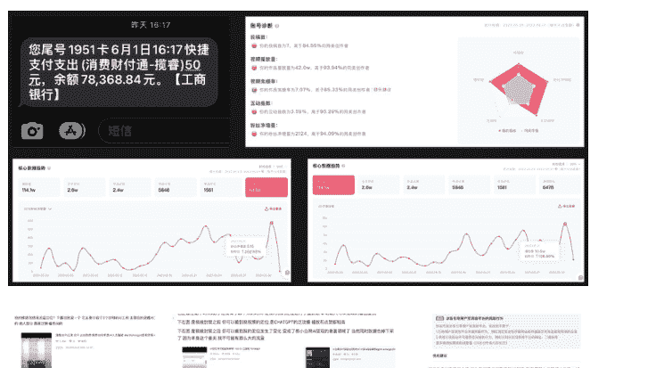

这套副业文档是7万余字的原创，除了我的交付，还将我从0起号的流程、思路全部...记录了下来。这7万字也是我一字一句写下来的，没有粘贴复制任何人。

后来我才知道，我这一套叫“前端获客+后端交付一条龙”。这好像是一个团队才能做的事情，但对我来说，已成习惯。

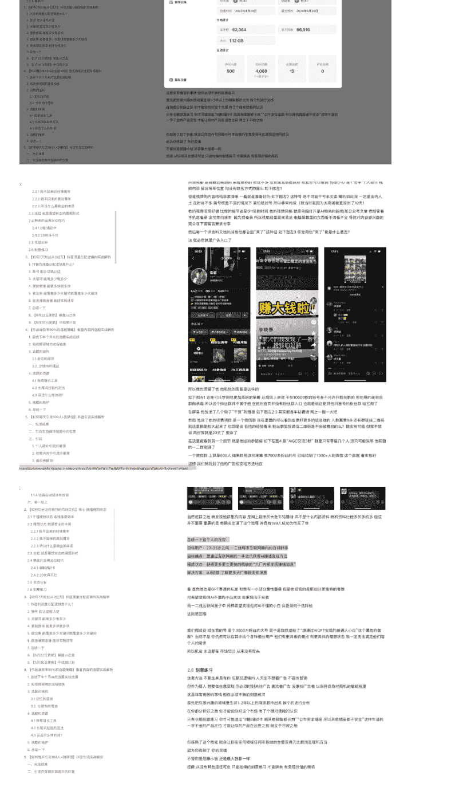

> 斩断退路+理解现实+绝对自信，就是我行的道。

即便我当时开始做的时候连AI是什么都不清楚，我仍然在第一次尝试后，就拿到了成绩。

## 第三次做自媒体：红包封面

24年初Midjourney大杀四方，质量爆杀AI生图。我做红包封面，从0开始做小红书，店铺用MT做红包封面。

1个月粉丝1.5万，卖掉3700多份，纯利3万+。

就连这个只干了没多久的副业，我也将其流程完整的、事无巨细的，将所有难点流程记录成册。在当年卖这个小品类，我是小红书TOP3。

我的风格是左下图这样，的壁纸没人看是正常的，无视掉。所有作品整体的美观度从数据上来看还是不错的。你也可以看到小红书里面也有大量卖封面的，但很多红包好不容易过审了，点赞评论却寥寥无几。这就是这些红包的封面不符合大众审美，没有让观众感到新奇、虚荣、想要拥有的感觉。

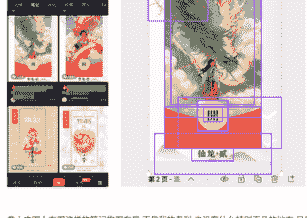

- 3.3.3 注意3：封面的审核条件：
  - 3.3.3.1 坑1：封面简称
  - 3.3.3.2 坑2：个人Logo
  - 3.3.3.3 坑3：证明材料
- 3.4 容易突破的痛点四：触达
  - 3.4.1 平台：选择小红书
  - 3.4.2 账号装修
    - 3.4.2.1 名称：要和红包封面相关，在搜索时能更...
    - 3.4.2.2 命名：女性更有优势，因为小红书绝大部...
    - 3.4.2.3 简介：和“匠心设计师”做关联，建立人设...
  - 3.4.3 笔记风格
  - 3.4.4 标题/话题/店铺引导
  - 3.4.5 店铺商品设置
  - 3.4.6 自动发货
- 4. 具体流程
  - 4.1 如果你不自己做图
    - 4.1.1 用Canva进行布局编辑
    - 4.1.2 制作发货和使用方法图
    - 4.1.3 店铺内新建商品
    - 4.1.4 发布笔记
  - 4.2 如果你想自己做图
    - 4.2.1 你需要AI工具
    - 4.2.2 你需要一个100粉丝的视频号
    - 4.2.3 注册微信红包平台
    - 4.2.4 图片的压缩处理
    - 4.2.5 用Canva对图片进行编辑
    - 4.2.6 发布笔记和新建商品

像上中图上右图这样的笔记构图布局，不是我的专利，也没有什么特别不凡的地方。我只是看了大量各种作品之后的个人审美，我觉得这样更符合潮流。而上图的笔记布局，虽然也称不上不好看，但作为我发的最早的一个作品，数据远不如其他红包封面。他们唯一的区别就是布局不同。

你需要参考我的风格或市面上火的风格，将我也过审的红包封面图片进行再加工，目的是让你的内容看起来和我的内容除了主图以外不太一样的美观。这样做的理由是，因为如果你直接照搬我的笔记内容，太过相像，那么你迟早会被判定为搬运，进而会影响你的流量。自己创下这种图很简单，且会增强你对潮流的感知，百利无一害。

#### 3.4.4 标题/话题/店铺引导

我的标题话题是这样设置的。

如果愿意，你也可自己做手动发货感受一下，也没问题，就不用买这个。

#### 4. 具体流程

##### 4.1 如果你不自己做图

你需要学会如何处理图，分为几个步骤。

###### 4.1.1 用Canva进行布局编辑

你可以去买其他人的封面，比如去某某对笔记进行再编辑，以达到“仿原创”的效果。但我也推荐你自己尝试做图，在原创性上不会受到平台制约。也就是要达到看上去布局不同、配色不同、元素不同的编辑，只有这样，小红书才可能不判定为你“搬运”。如果你不是自己的素材，太过相像，你就很大可能会被判定搬运而限流。所谓再编辑，就比如是下面这样：

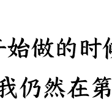

举例说明，下面4个都是银票类的壁纸。你可以看到他们的笔记布局是不一样的。

> 斩断退路+理解现实+绝对自信，就是我行的道。

即便我当时开始做的时候连红包封面是什么都不清楚，我仍然在第一次尝试后，就拿到了成绩。

## 第四次做自媒体：YouTube

再下一次转折，就是YouTube。我曾在生财留下一个痕迹，说的是什么你可看下图。

除了幼儿园我觉得实在没必要，其他的，我至今都已经超额达成。月入万刀，也是上个月达成的小小里程碑。

前两天一点活没干，带老婆孩子玩去了。孩子喜欢玩水，喜欢火车，去了江苏宜兴窑湖小镇。有温泉，有能开的绿皮火车，也适合拍照。所以活不干了，幼儿园不上了，驱车200公里带老婆散心，带孩子玩水坐火车。你现在看，真好，真惬意。

但今年上半年，我是活脱脱的被卡3万，卡了数个月。那段时间，我发疯的想办法做YouTube。我试过了我能看过的所有东西，我踩过了所有能踩过的坑，却一点成绩都拿不出。但斩断退路+理解现实+绝对自信的“道”仍然支撑着我。

我经过思考，我觉得YouTube就是我达成目标最大的希望所在。我数据不够，那我就去拆够的。我会将它的每一帧、每一个音效、每一个剧情、每一句对话全都扒下来，一字一句的分析。我现在做的不够好，那我就将做的好的碾平了、砸碎了、揉进我的骨血里，我一定要做到。

在今年9月，我放下所有过往，开始了系统的理解现实。我要做YouTube，我就一定要理解YouTube。而我学习最好的方法是什么？

> “如果你写不明白，那你就理解不明白。”

在9月15日，我写下我爆款库的第一篇。那个时候，我只能写出这种玩意，如下左图。同日，我写下我的第一篇公众号。那个时候我只有40万的日流量，能写出的内容，也只是是一些最基础的东西。

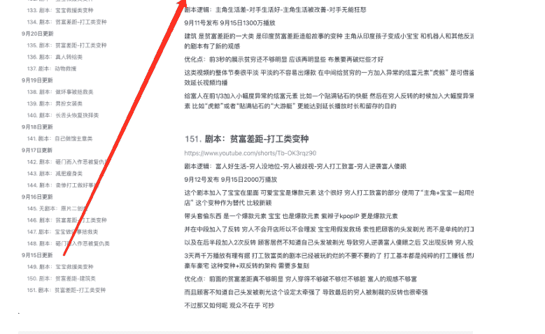

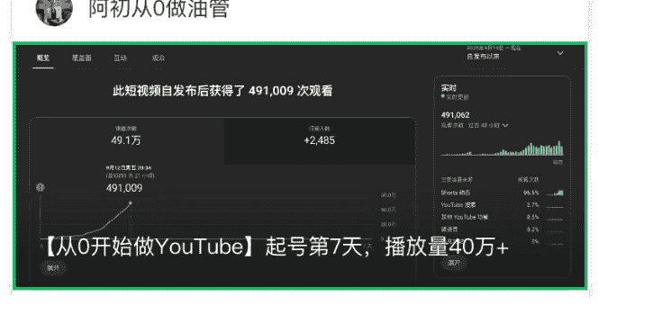

【从0开始做YouTube】起号第7天，播放量40万+

按此前的经验，只要你的继续播放率能有80%+，平台就会给你放量。但从最近的趋势来看，这个80%+只不过是最低要求。理由就是我新号发的视频达成80%+的视频有很多，但都没能分配到流量。当然也有可能，这是新号权重不够。

所谓“分配到流量”，是指基础流量以外的流量。对一个正常的视频来说，基础流量=3-5万的播放量=2-3万的互动播放量。要判断一个视频是否能爆、是否能分到流量，看的是视频是否能有没有超过2-3万的互动播放。

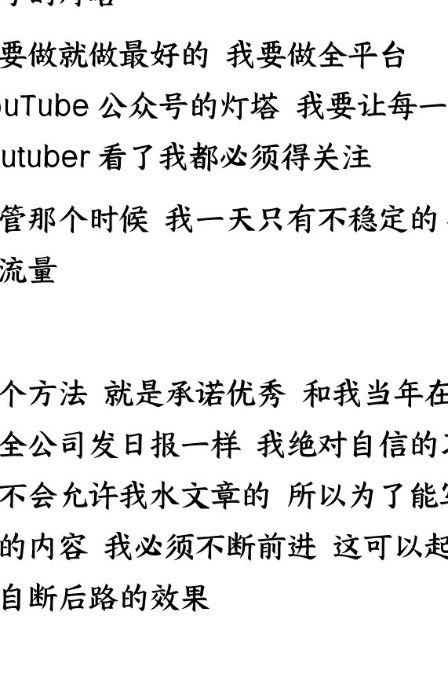

> 为什么写公众号？很大一部分原因，是我需要自断后路。

我给我公号的定位是，我要做YouTube，公众号的灯塔。我要做就做最好的，我要做全平台YouTube公众号的灯塔。我要让每一个YouTuber看了我都必须得关注。尽管那个时候，我一天只有不稳定的40万的流量。

这个方法就是“承诺优秀”。和我当年在公司给全公司发日报一样，我绝对自信的习惯是不会允许我水文章的。所以为了能写出更好的内容，我必须不断前进，这可以起到给我自断后路的效果。

从9月15日至今，我几乎没有间断。虽然因为政策问题，我的公众号完全没有推荐流量，但我的内容质量绝对称得上是T1的灯塔质量。

> “我要做全平台YouTube公众号的灯塔，我要让每一个YouTuber看了我都必须得关注。”

我认同我自己做到了。

- 星期日 20:25 已发表：【从0做YouTube】日流量1400万，这7种内容就是人类最喜欢看的东西 原创 (493赞 12评 23转 4收藏 4分享)
  
- 星期六 22:52 已发表：【从0做YouTube】日流量1200万，播放量提升10倍的一个必会技能 原创 (510赞 6评 15转 6收藏 10分享)
  
- 11月20日 已发表：【从0做YouTube】日流量700万，今天讲能做出爆款的本质：结构 原创 (469赞 10评 23转 4收藏 3分享)
  
- 11月17日 已发表：【从0做YouTube】日流量700万，这个赛道起量最容易 原创 (582赞 12评 23转 4收藏 9分享)
  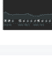
- 11月16日 已发表：【从0做YouTube】日流量800万，如何将收益提高100倍 原创 (595赞 15评 20转 4收藏 9分享)
  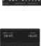
- 11月14日 已发表：【从0做YouTube】日流量800万，这1件事决定了你能否成功 原创 (677赞 63评 47转 11收藏 19分享)
  
- 11月11日 已发表：【从0做YouTube】日流量700万，这个形式一周内必出亿万播放量 原创 (661赞 8评 18转 3收藏 7分享)
  
- 11月02日 已发表：【从0做YouTube】日流量600万，今天说这世上最值钱的东西“时间” 原创 (570赞 18评 13转 10收藏 7分享)
  
- 10月31日 已发表：【从0做YouTube】日流量800万，列3个单视频开通YPP的案例 原创 (804赞 20评 20转 6收藏 36分享)
  
- 10月29日 已发表：【从0做YouTube】我10月播放量4亿，再开3个YPP 原创 (606赞 19评 20转 11收藏 3分享)
  

## 我的爆款库

### 内容：

公众号懒人搜索，懒人专属群分享。

> 我的爆款库也从只能记个乐子，变成了可以博古通今、举一反三的真正的爆款库的形态。

到今天，已经持续更新快3个月，现在已经9万多字，包含数百个案例和剧本、数千张图片佐证。我将我心得、眼界、分析、机会、爆点全部记录在了这个爆款库里。真金白金的拆解和线索，这些都是全网你找不到第二家的信息源，是我能够月入万刀最重要的工具，没有之一。

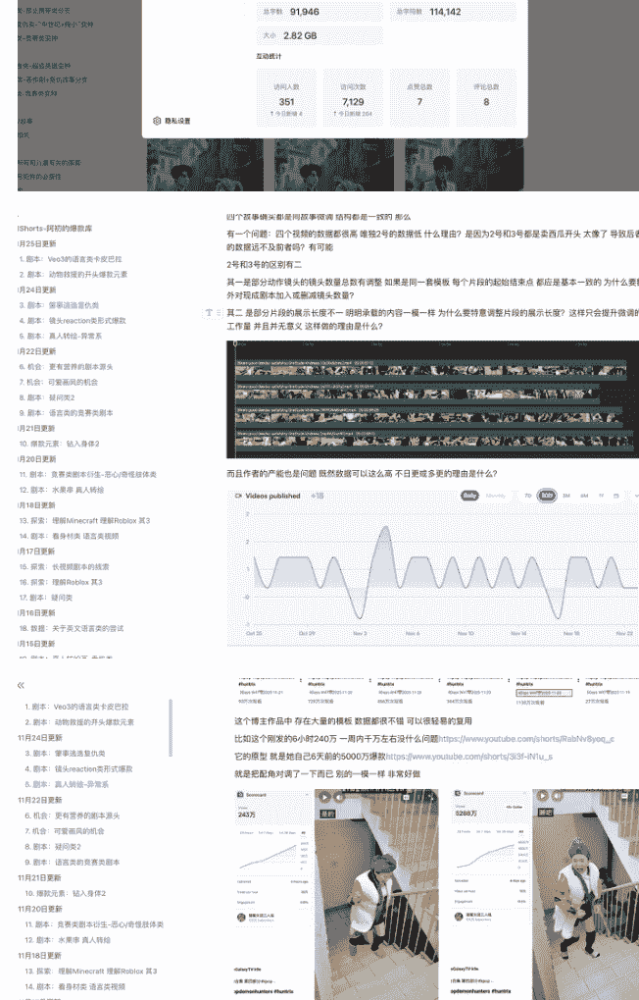

- 1. 副本：Veo3的语言类卡皮巴拉
- 2. 副本：动物救援的开头爆款元素
- 3. 副本：擎事造渣复仇类
- 4. 副本：镜头reaction类句式爆款
- 5. 剧本：真人转场-异常系

### 2024年10月16日更新

- 16. 数据：关于英文语言类的尝试
- 17. 剧本：疑问类

### 2024年10月15日更新

- 18. 数据：关于英文语言类的尝试
- 19. 剧本：真人转场画-卖惨类
- 20. 剧本：减肥类-人兽分镜

## 公众号懒人搜索，懒人专属群分享

还是要在重复一遍竞赛类的剧本内核：“问题出现-A展示解决方案-B展示解决方案-C展示解决方案”。通常来说，前面两个方案的展示都是失败的，但在这个剧本中没有，几个人都成功了，失败的看门人。他们唯一的区别是，他们出门的方法不同。

`14小时72万 https://www.youtube.com/watch?v=mXYRWBPYQZU`

`4000万 https://www.youtube.com/shorts/CUN9S6tk3N0`

这两个也是同理，只不过是将“问题”72万的元素，使用的是推盘子。至于为什么使用推盘子，他多半是看到了这个7天前2800万 `https://www.youtube.com/shorts/73Vpkem4Vfo` 推盘子的火了所以照搬，连使用的洗碗布都是一样的。但72万的数据并不亮眼，理由就是这个推盘子的发布时间，同样刚刚过去的万圣节。但你今天再发，就等于过了端午卖粽子、过了中秋卖月饼，基本没人理了。

`以及这个 3天87万 https://www.youtube.com/shorts/LCSHG3iNVck`

同样，仍然是竞赛类剧本内核，“问题”是搭橘子。问题出现-A展示解决方案-B展示解决方案-C展示解决方案。这里就是典型的AB都失效，加入了两个新环节就是：“问题出现-A展示解决方案-A失效-B展示解决方案-B失效-‘正确解法回忆’-C展示解决方案-C仍然失败”。

这里可以认知到3点：

1. 很多同志嫌东西播放量提不过千万都是不行。诚然，我近期大爆款路数是正确的，但不是所有作品都能那么爆，也不是所有作品数据都是能在极短时间爆上千万。很多作品的给量，是前面一段平稳，突然火箭上涨。日常看对标的时候，近期百万级的都是潜力股，能看一眼就看一眼，能记下来就记下来。比如我库库记录的这些，他们现在的播放量和我记录时候的播放量，都基本上能再连一倍以上。

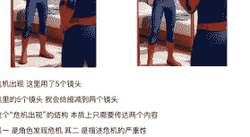

道具展示阶段，1个镜头。这个片段略显单调，目的不明。从结构上来说，如果我按照我的编排，这段是会被删除的，因为它没有存在的意义。比如按照我上面的想法，Rumi碰了玻璃后，将衣服抛给INU，然后两人拥抱，这个时候接下来Rumi和INU在街上走的片段，你会觉得有什么问题呢？一点问题也没有。这段展示道具是可以的，但至少需要提供一些内容，比如穿上衣服后可以有超能力什么的。只是让角色单纯的在镜子里扭扭一招，实在是没有意义。

危机出现，这里用了5个镜头。这里的5个镜头，我会给缩减到两个镜头。这个“危机出现”的结构，本质上只需要传达两个内容：其一是角色发现危机，其二是描述危机的严重性。

> 如果你不理解什么是面瘫，看下这个我随手Google出来的图。

动画中，人物的生动表情是增强代入感必须的元素。你随便看哪一家的角色都是这样的，哪有谁家的角色是面瘫的？以现在的技术，他面瘫，就是你提示词写的不到位，就是你的问题。

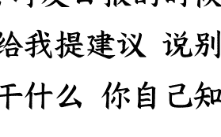

第二，公主倒的莫名其妙，逻辑设计有问题。公主是怎么倒下的？看下第一个片段的首中尾帧。她做出了一个吃空气的动作。我想，作者提示词里设定的是让公主吃一口蛋糕，然后再倒下。但抽卡没抽出来，得过且过算了。这个漏洞就来了，这可是第一个片段，是全视频中最最重要的片段，承载的应是最吸睛的画面，结果你让公主吃了一口空气就死了。这太弱了，太不应该了，太没档次了，简直令人发指。

你本来可以加入很多更吸睛的点，比如蛋糕爆炸了炸晕了公主（爆款元素：炸弹），比如公主一口将蛋糕吃了然后吐了一地（爆款元素：吐），然后配上王子一脸极度震惊害怕的表情、公主一脸扭曲翻白眼的表情倒地。这个镜头本来可以承载更多的密度和更强大的吸摄度，但它都没有。

它就像我当年写的日报一样。当年我给全公司发日报的时候，很多人也看不惯，很多人给我提建议说别写了，你写那么多那么细干什么，你自己知道不就行了吗？他们是何居心暂且不论。

但对我来说，写下来就是理解现实的最好、最快的方法。虽然看上去，我需要花相当多的时间来做搜集、拆解、记录。但这个慢就是快。我写得越细、越多、越久，我对YouTube的理解就越强、越明白、越清晰。

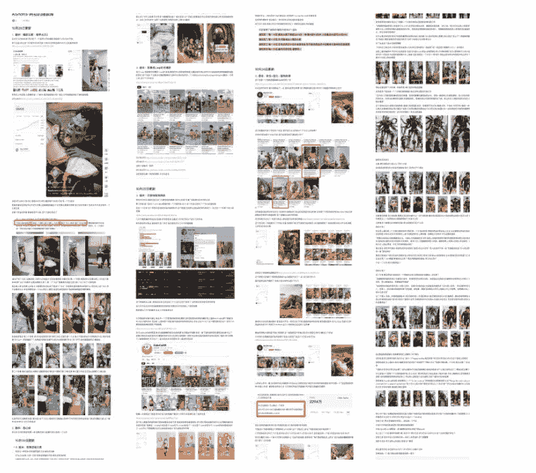

我的频道、我的账号、我的订阅者、我的视频，他们只不过是消耗品。如果想走好YouTube这条路，最不可或缺的，就是我公众号和爆款库里记录下的文字。它们不是我没事写着玩的，它是我在几个月前对未来的判断。我的文字和印在脑子里的经验，才是我真正的积淀、我的壁垒、我的护城河。

> “你写不明白的，你就理解不了。”

如果你想长线来做YouTube，积累记录你自己的爆款库，会是你不可或缺的工具。将你看到的、想到的记录下来，将经验和眼力最大化的吸收进你的脑子，才能从根本上让你的爆款接连不断。不管你做什么形式、什么赛道、什么IP，都可常年常青。

总有人说“越分享越幸运”，这话不好理解。所谓分享，是强化自身熟练度的过程；所谓幸运，是自身熟练度强化后的结果显像。这才是“越分享越幸运”的最根本的原因。

## 叁 · 布道

布道非我本意。一方面我认为我的成绩还不够爆，只能算是小有所成，尚不足以为人师。另外，我早就戒了好为人师的坏习惯。我从不用学员、徒弟这种称谓称呼任何人。对做YouTube的同路人，我从来用的称谓都是“同志”。

但在生财的N篇精华帖、N篇公众号和爆款库的大量同志，还是给了我很多的正面反馈。下面是一部分。有一个视频直通高级YPP的，有破三万魔咒的，有拿下几千万上亿的。很多圈友的分享、直播也都带上了我的名字表示感谢。对此，我只有一个想法。

## 你们能拿到成绩 比我自己能拿到都开心
## 飞吧！飞向更远更高

Zero大佬，终于可以给你报喜了！之前一直卡万播，做到第30条左右，爆了2条视频，一条3千多万，一条5千多万。5千多万的那条是“钻进身体”的那个思路。看你的思路分享，有时候会觉得跟不上、消化不了，但还是会潜移默化地产生影响，慢慢感觉找到一点门道了。

> 可以，很棒了。链接给我看看，我也显摆显摆。

这是3千万的那条，后面推流直接断了。
这是5千万的那条，一直在推流，本来跑得比3千万的那条慢，但因为一直有推流就超了。

> haha可以的，找到门道了，继续更吧。

嗯嗯，终于感觉又有心力继续前行了，感谢大佬！

老师，跟你说一个好消息。我按照你爆款库的那些方法，第三条视频播放量已经900多万了，现在才发了六条视频，已经够资格开通高级YPP了。

老师，我还能付费咨询一个事情吗？就是能不能帮我来看一下我的账号呀？就是帮我稍微看一下，如果有问题的话，或者有没有需要什么改进的地方，就稍微跟我说一下就行了，不会太麻烦你的。

> [你收到了一笔转账，请在手机上查看]

不过我没有做AI生成视频的，因为那个技术对于我来说，我感觉学起来很痛苦、也很难，所以我改做实拍了，就感觉实拍比较快一点。因为我之前工作是做新媒体运营的。

okok，明白了，必须得用全真人形象了。居然连“让小孩哭”都做了，不到10万播放啊。

> 有血没问题。血容易触发限流，不会影响YPP。
> 以后还会更多。

这样啊，好的好的。今天终于可以申请YPP了，好激动！
嗯嗯，感谢Zero大佬，没你我不知道还要自己摸索多久。

Zero大佬，继续来报喜了。根据你的方法论去拆解复制视频，昨天做了第一条，一天之内破千万播放出来，一举拿下高级YPP。

> 你小子我就看怎么这个问题这么像我的东西。
> 以为换了马甲我就不认识你了。

哇！你的短视频获得的观看次数和赞的次数比平时多。
Views 1.1亿

公众号懒人搜索，懒人专属群分享。

## 终 · 结语

“朝闻道，夕死可矣。”

人一生之术，千变万化，如兵家诡道，说不完，言不尽。
但一人一生之道，只有一条。

“朝闻道，夕死可矣”是：“你找到了自己的道，你践行自己的道，所以你无论何时，你都可坦然赴死。”

这是内求，是无需条件，是本自具足。
自身的行动就是本心自发，无论外物如何变幻，始终矢志不移；不论遇到何等挫折，都会汲取各方法之所长，直至达成目标。

每个人有自己的因果，每个人此生都有自己的意义。
终其一生，人在尘世中追逐、浮沉，或贫穷，或富有，都是在找寻自己存于世间之道。

如我过往，我每一次的选择，不一定明智，不一定正确，不一定合适。
但万幸，我找到了我的道。“斩断退路+理解现实+绝对自信”，就是我行的道。
这是我过去人生经历所造就的。我认可它的强大，它也认可我的全心投入。
所以这个道专属于我。我教过无数人，但无一人可做到。他们做不到，因为他们终究不是我。
但道无优劣，你的道，也会唯独只适合你。
不论你在尘世中如何游历，它都会是你行路上的最大倚仗。
闻道、行道、布道，你自然就可以举手投足间若有神助。
即便满地荆棘，你也终能渡至彼岸。
败了，哭了，跪了，无妨，起来继续走。
不要停下迭代自己的脚步。只要你还在前进，你就总能找到专属于你的“道”。
杀不死你的，一定会让你更强大。
只要你日进一步，你就总能走到彼岸。

## 最后，安利小懒的付费群：
### 懒人专属群（介绍）

📚 懒人专属群持续更新中，已持续运营 6 年，整理超 3000 份各类精选付费文章 & 年费社群干货，全部开放下载。
本资料为付费群内部分享，仅供真实有需要的朋友查阅 🙇‍♂️

### 懒人专属群更新记录：
https://hk57gvIx7u.feishu.cn/docx/H0kRdZbSboIBROxkaXtcuVEOnTg

### 懒人专属群更新记录（需梯子，备用）：
https://lazybook.fun/blog/record2