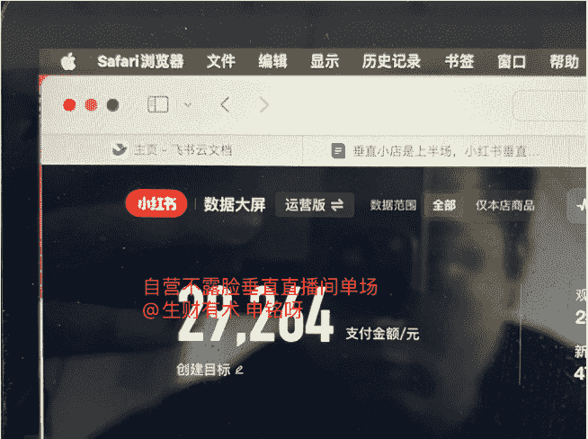
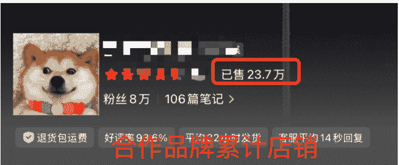

# 垂直小店是上半场，小红书垂直直播间是下半场

## 251128 副业 SC 精华

公众号懒人搜索，懒人专属群独享
懒人微信：lazyhelper

哈喽，各位圈友们好，我是申铭，之前在娱乐圈练习七年半，现在主要在做小红书电商直播。平时的大部分时间，混迹在各种直播间里划水，每天是看不完的数据、选不完的品和复不完的盘。

截止到目前，我们小红书自营直播间最好成绩是在这次双11达到了单场120万GMV，这个是垂直且露脸的家居向垂类直播间。不露脸垂向单人直播间单场GMV是2.9万GMV。合作的品牌垂类店铺号，客单价在500-600元左右，累计销量23.7万。

这两天看完亦仁的垂直小店超级标，我哭着第一反应是：怎么就有人把我们的秘密公开了、还讲这么透。接下来那么多人进场，压力是有的，但也从侧面验证了我们这条路，方向是对的，而且空间是大的。

以前我脑子里对电商的划分是这样的：

- 图文、短视频带货，是一条逻辑；
- 直播电商，是另一条逻辑，人货场要一起搭，人设要做、供应链要搞、场景得花点心思，听起来是不是就很重？

其实也没有，看这次小红书不露脸直播航海就知道，有的直播间可以重，有的直播间就很轻松。

看完垂直小店，我意识到：直播电商其实没有那么另起一套，它只是把垂直小店那套逻辑放进了一个实时发生的现场里（直播间场景）。

如果说亦仁讲的垂直小店，是围绕一个品类，用内容把货架搭在平台里，那小红书直播，在我眼里就是把垂直小店搬进直播间，用一个垂直场景把货架立体化。

所以我想借这个机会，补充一点我在小红书直播上的理解和经验：小红书直播也是垂类，只是因为是直播，它更依赖能被“演”出来的垂类：垂直人群×生活场景×核心痛点×可演示内容（也是这次小红书不露脸直播航海的核心内容之一）。

下面，我就按这个，展开讲一讲。

### 一、先说结论：垂直小店卖链接，垂直直播卖现场

先用一句话把直播和垂直小店的关系说清楚：垂直小店卖的是链接，垂直直播卖的是现场。

垂直小店是啥？一个账号只做一个细分品类，在内容平台里持续更新围绕这个品的内容，让用户看完内容觉得对，就点链接下单。所有动作，最后都落在那一条商品卡的小链接上。

直播间呢？看上去多了很多要素：主播、人设、氛围、抽奖、直播封面、场景……但如果你把那些热闹的、氛围的东西都先抹掉，底层还是一样的：你围绕一个品类/场景；找到一批会被这个品类/场景打动的人（目标用户）；用一连串内容帮他完成看见→理解→决定→下单。

### 二、为什么我会用「垂直人群 × 生活场景 × 核心痛点 × 可演示内容」来选直播垂类

只是，小店那边是在图文/短视频笔记里完成，直播是在一场同时发生的逛店体验里完成（逛直播间）。所以我现在看项目，会有一个简单的判断：

如果这个品只需要看参数、看价格、看属性对比就能做决定，更适合在垂直小店里挂着卖。

如果这个品需要看效果、卖点能视觉展示、看场景、听讲解、感受氛围才能做决定，更适合搬进直播间，用场景去演，特别是适合一个人的手播直播间。

举个特别简单的例子：

手机充电线这种标准品，大家对价格极其敏感，对体验没什么差异感，你做垂直直播，直播间会很难受。

但如果你卖的是大码穿搭、租房收纳、油污清洁，这种东西就必须放进一个具体场景里演，直播反而是天然适配的。

所以我看这次垂直小店的超级标，脑子里其实自动串了一条线：垂直小店帮你在平台上搭好货架，垂直直播间帮你给这堆货搭一个真实且立体的空间。两个不是对立关系，反而特别互补。

垂直人群 × 生活场景 × 核心痛点 × 可演示内容，这其实是我这两年被直播间教出来的一条公式。一开始我也走过不少弯路，比如一开始做大类目，做看上去很大气的 IP 直播间，最后发现：流量有一点，但转化非常难做扎实。

后来做的直播间多了，慢慢发现那些能稳定跑起来的直播间，几乎都同时满足了这四个点。

#### 1) 从品类转向人群

以前我习惯是这样想的：我要不要做美妆直播？我要不要做水晶直播？我要不要做宠物直播？

现在我更习惯先问我自己：我要服务的是哪一群人？比如，经常熬夜、皮肤敏感，还要见客户的女白领；预算有限、但很想要点玄学慰藉的打工人；在大城市上班、经常出差或者遇到过年过节回家的时间段，但想给猫猫买买点智能设备的年轻人。

你会发现一件很有趣的事：当你先定人，再回头看品类的时候，同一个品类会被切成完全不同的形态。

举几种典型的切法：
- 彩妆，可以切成：新手日常妆 / 职场显气色妆 / 大龄黄皮显年轻妆 / 不出镜主播妆......
- 收纳，可以切成：租房党防换房 / 宝妈玩具收纳 / 小户型厨房空间榨干......

同样一个品类直播间，为谁而开，直播间里说的每一句话、摆的每一件货，都是不一样的。

垂直小店那边，大家已经有很多经验：一个账号，只盯一个类目。而在小红书直播这边，我会再往前走一步，先只盯一群人的一两种典型状态。

比如：
- 在一线城市工作、租房住的25-35岁女生
- 常年加班、熬夜、外卖、胃不太好的男生
- 养猫又经常出差没办法及时喂粮的打工人（比如我）

确定完这一群人，你就知道：直播间应该怎么说话；哪些槽点可以大胆吐；哪些场景会让他觉得这说的不就是我。这一步，如果不垂直，后面全部都跑不顺，播的很累。

#### 2) 生活场景：让用户知道你是哪一块地盘上帮我解决问题

确定了人群之后，第二步就是把这群人放在一个非常具体的场景里。我的一个经验是：场景这个词，一定要具体到你能一个镜头拍出来。

比如说小户型卫生间收纳，这还只是一个小题目。具体要到这种程度：
- 一个4平米的小卫生间，
- 装了洗衣机、马桶、洗手台，
- 墙面空间有限，常年堆了各种洗发水、清洁剂、囤纸巾......

这才是一个真正能被拍出来、被感知到的场景。在小红书直播里，场景越具体，越容易把人锁住，也越能让他下单。

因为用户一进来，会有一个瞬间判断：嗯，这个直播间，是不是在解决我这种人，在这种场景下的日常麻烦？如果是，他会不自觉多停留 10 秒。这 10 秒，基本就决定了你这场直播的数据。

所以我在看一个手播直播项目的时候，会问几个问题：
- 你这个直播间，在用户眼里，是在哪里发生的？是在一个上班族的出租屋里？是一个宝妈的厨房？
- 这个在哪里，能不能用简单的布景、几件道具，就搭出来？
- 这个场景，是不是用户一刷到就有一种好像很熟悉的感觉？
- 这个场景里，有没有什么能够一眼抓住目标用户的点，比如说画面、关键词、道具...

说直白一点：抖音上是“一个人+一堆货”也能跑起来；小红书这边，更喜欢“一个人+一个生活场景+少量但合理的货”。这跟垂直小店里的内容即货架很像：只是直播间里，货架变成了一个生活片段。

#### 3）核心痛点：一句话能说清楚的为什么需要你

人群和场景定好以后，还不够。还需要知道：这群人在这个场景下，最难受的那个点到底是啥？这个点一定要具体到可以一句话讲清楚，而且最好是听完有点刺的那种。

比如，小户型收纳，不是乱，而是家里永远像刚搬家，明明每天都在收拾，还找不到东西。宠物饮食，不是怕猫口渴、没吃的，而是我马上要去出差5天，把猫送去寄养那边太脏了、还很贵。

在直播间，这种痛点要被反复戳出来。

这里就有个规律：一个直播间如果一直在说好看、好用、划算，但很少说为什么你非要现在解决这个问题，那基本就是播着播着人就没了，流量也掉了，数据也做不起来了。

而垂直小店那边，大家已经很熟悉痛点标题、场景文案这些东西了。就可以把这套东西搬到直播，就变成了主播在直播间里反复讲的那几句金句话术。

我们自己项目直播的时候，我会要求主播把自己的品类，写成几条一句话痛点，贴在电脑旁边，播到哪儿都要绕回这几句上：你不是买一条裤子，是买终于不用躲在角落里了。不是买一支护肤品，是买熬夜之后第二天还能见人。不是买一台喂食器，是买你出差的时候心里也会安心。

这听起来有点鸡汤，但直播就是这么一个人和情绪更浓的场域。同样一个垂直小店的爆款品，如果痛点讲不出来，搬进直播间通常会显得很平，转化效果会比较差。但颜值很高的品除外，这个比较特殊，“颜值好看”这个点也是下面要说的可视化展示的内容。

#### 4）可演示内容：决定了这个垂类在直播间的上限

最后一个也是直播最关键的点：可不可以 在直播间内演示？很多垂直小店的账号， 内容可以做得很好，参数对比、开箱、拆解、种草，都能拍。但放到直播间，有些 品类就会非常尴尬：除了反复说功能和价格，几乎没什么东西可以演给别人看。

我们在做直播选品的时候，会优先问自己：这个类目/品，有没有办法在直播间做到一整套流程的展示？

比如：
- 卸妆产品：可以现场画满妆 → 卸半边脸 → 对比，
- 收纳产品：可以现场把桌子弄乱 → 一步一步收 → 展示前后变化，

这就是为什么我会说：如果说垂直小店看的是搜索量+转化率，那直播看的是可演示内容的丰富度。一个类目，如果只能讲干巴巴的参数，没法做过程，那它在直播间里的天花板就是有限的。

有时候我看一些直播间的数据，发现直播间场观不算低，但人均停留很短、连贯的互动很少、加购是零星的，一看直播回放，主播也不差，人也不讨厌，就是整个直播间信息密度特别尴尬，既没什么好看的过程，也没什么真感受，颜值也就那样。

这时候我通常不会去纠结主播话术行不行，而是会先判断一句：这个品本身是不是不适合做成以直播为主？有些品，在垂直小店挂着卖很好；到了直播，应该退居二线，做补单品、搭配品这种小配角，把主推的品让给那些能演能讲的功能款、场景款。

### 三、怎么把垂直小店和直播间串成一个模型？

上面这些更多是逻辑层面的东西。我更关心的是：怎么落地为一个可重复的生意模型。

在我自己的实践里，大概是这样一条线：用直播间当选品实验室+场景实验室，再把验证过的场景和品，反向沉淀成垂直小店的内容矩阵。

#### 1）直播先跑一段时间，找到真正有反应的场景

很多人上来就问：我先做垂直小店好，还是先开直播好？

如果是已经有一点供应链、愿意出点时间的圈友，我现在更建议的顺序是：先开一个垂直直播间，把你觉得可能行的几个场景轮着播。

用同一批货，只是换不同的切入点和讲法，你会发现直播间的数据不一样：有的场景一讲，在线就稳、停留就长、互动自然就多、转化更没得说；有的场景你讲到嘴干舌燥，在线就是慢慢往下掉。

在这个阶段，你甚至都不用太在乎这几场具体卖了多少钱。要的是：找到那个一讲就有人停留互动的场景。这一步比你在后台看选品库、看数据选品，要快太多。

#### 2) 找到会被自然讨论的品

直播间还有一个优势是：你可以看到用户当场的反馈。有些品，看数据都不错，但你一播就会遇到这种情况：
- 下单的人不少，但问题也很多；
- 退货率很高；
- 评论里总有一些负面声音；
- 甚至你自己讲着讲着也会心虚。

还有些品，看起来平平无奇，但是：
- 用户一上手就会在直播间里说“这个比我之前那款好用太多了”“它扎手嘛”；
- 会主动帮你在评论区给其他人种草；
- 会和你主动问你它有没有什么缺点。

这种品，你在垂直小店里面，看后台数据是看不出来这种质感的。而直播间会把这种细微差异放大给你看。所以我现在看品，不只看卖多少，还会问几个问题：
- 主播讲这个品的时候，是不是讲着讲着就会自然提到一些自己的真实感受？
- 观众在公屏的讨论，是不是会围绕这个品展开？
- 有没有那种几天后又回来评论的回头客反馈？

如果有，这个品在我这里就会被标记成值得沉淀到垂直小店的一类。

#### 3）反向沉淀成垂直小店的内容库

等你通过直播跑出一批这样的场景和品之后，你再去做垂直小店，就完全不是那种看对标、看选品库、看 24h 热卖加购数据的事了。

你会非常清楚：你的目标人群，是什么样的人；他们在哪些场景下，最容易对你有感受；哪些品不是理论上好卖，而是实景里真的有人愿意说好话的。

这时候你再去拍图文、拍视频笔记，就会自然带有：真实的使用细节；直播间被问爆的问题；用户最有共鸣的那两三句金句。非常顺手地，就把垂直小店最需要的真实感和场景感补上了。而且，垂直小店有一个优势是：它是 24 小时营业的。

你在直播间试出来的场景和话术，可以被拆解成很多条内容，挂在主页店铺里，帮你在你不播的时候持续成交。所以在我脑子里，很多项目的形态已经变成：白天/非直播时段，垂直小店在帮你筛选、蓄水、教育、沉淀用户；直播期间，直播间在帮你集中放大成交、实时转化。两边不抢流，反而是互相导流，这也是为啥小红书主推笔直群联动的原因。

### 四、不同阶段怎么用好垂直小店 + 垂直直播间

我再用我妹妹的视角讲一下：

她也是生财圈友，但是看着那么多项目不知道到底应该怎么做，现在手上有一点资源，想切小红书，那大概有哪些路径可以结合这两者？

#### 1）现在只有时间，没有货，也没有团队

这种情况，我会建议：

先从垂直小店侧的买手入手，用内容带佣金，熟悉平台和类目，大家看生财好事也会发现，前段时间的买手 mini 航海效果也还不错；

再挑一两个你觉得特别适合拿来演的类目/品，开直播，哪怕先是测试场，带着摆烂的心态去做。

这时候你的目标不是立刻把直播做成一个大项目，而是用最小的投入，验证：你自己对镜头的适配程度（话术、节奏、你的展示动作）；这个类目/品在直播里的可展示程度；平台给这个类目/品直播（同行）的自然流量情况。

如果你觉得直播太难，可以把这一步交给一个愿意播的朋友，或者找主播合作（代播），自己在后面做运营+选品。

#### 2）你已经有一个垂直小店在跑，考虑加一条直播线

这个阶段，我会建议你从数据里先挑出：
- 复购还可以的品；
- 用户评价里提到使用过程、场景改善比较多的品；

这些品，很可能就是在直播间能讲得比较丰富的。然后，围绕这些品，去设计一两个典型场景直播间：比如你的小店是居家收纳类的，那直播间不要什么都卖，就只做租房卧室角落改造、卫生间空间榨干这样两条线先跑。

你会发现，很多你在小店里写过的内容，讲到直播间里，会自然的有更多的互动。而这又会反过来，帮你补充垂直小店那边的内容素材。

#### 3) 你已经有直播间，想再加垂直小店

这种情况也不少见。很多圈友是先做直播，发现天天播太累了，想要在直播之外有一点被动成交。这个时候，我会建议你做两件事：

把你过去 10 场直播的数据拉出来，看看：哪几个品重复上场但依然能卖？哪几个场景段（比如晚上 9 点的那段“下班回家段子”）互动高、加购多？这些是你最应该先做成垂直小店内容的一批。

把直播回放里那些最自然的片段剪出来，不要过度包装，就按生活切片一样发，配上简单的文案和挂车。很多时候，直播间里随口说的一句真心话，比你坐在手机跟前儿正儿八经录的视频更有感染力。

公众号懒人搜索，懒人专属群分享

其实垂直小店不是一件那种很费劲的要去额外要做的事，而是把直播间已经发生过的东西，换一种形式留存下来就行。

### 五、给圈友的一点踩坑前的提醒

最后，我想从一个经常在前线运营直播的角度，说几个我看到大家容易踩的坑，顺便跟垂直小店这个超级标呼应一下。

- 1）不要一上来就把直播当成 IP、有偶像包袱

直播确实可以放大一个人，但直播间的大多数成交，未必是因为你的人设有多么牛。在小红书，很多用户进直播间，就是想解决一个当下的问题：我这两天正好在看这个东西、我最近在纠结这个问题。

如果你的直播间一上来就想走大 IP 路线、很多话术不好意思说，内容很容易跑偏：到处讲自己多厉害，多专业，多有资源，但用户始终不知道，你直播间里的品到底能帮我解决哪一块具体的问题。

垂直小店这个超级标其实给了一个特别好的提醒：平台需要头部 IP，但平台更多的是大量认真懂一小块东西、精致做好一片小场景的人。直播间也是一样的，你后续可以慢慢形成自己的人设，但第一步，是先干，同时要让用户知道：哦，这个直播间，是专门给像我这样的 XXX，在解决 XXX 场景下的 XXX 问题的。

电商带货先是出单，先上路，IP 是慢慢的事儿。

- 2）不要幻想什么都能卖一点的直播间能跑得长久

这一点和垂直小店的逻辑几乎是完全重合的。小店里什么都挂一点，各种权重都很难做深；直播间里什么都讲一点，用户很难记住你到底在干嘛、这个产品到底是干嘛的。

垂直小店的垂直两个字，同样也适用于直播：你不垂直，是平台帮你做垂直，要么给你打散流量，要么把你丢到边上，直播间权重跌到底。

与其这样，不如一开始就把自己锁到一个小小的地盘上，然后把这块地盘打透。

- 3）不要高估一次爆发，也不要低估日常更新

直播有一个很迷惑人的地方：大家都爱说某场卖了多少、某个大促爆了多少单，但真正能活下来、且长期稳定走下去的直播间，靠的往往是日更+小优化。

这一点其实和垂直小店完全一样：那个小店是不是长期有成交，不是看有没有一条特别夸张的爆款，而是看它有没有持续稳定地产出中等热度但质量稳定的内容。

在直播这边也是：你每天多复盘 10 分钟，多在第二天把前一天效果最好的那一段流程复制一遍，多用一场的时间把一个看似不起眼的细节打磨一下，特别是小红书直播，它真的和抖音直播太不一样了。这些东西很难写进成功故事里，但决定了你是不是一个能跑两年三年的直播间。

### 最后一点小结

回到亦仁这篇垂直小店超级标，我自己这边有一个小小的延伸理解：

垂直小店，帮你在平台上找到一块可以反复耕的地；

垂直直播间，帮你在这块地上搭起一个“可以让用户走进去、坐下来、聊一会儿”的空间。

对于已经在做垂直小店的圈友，如果你愿意多迈一步，可以试着想想：在我现在这个类目下，有没有一个具体的「人群×场景×痛点」组合，是特别适合拿来演的？如果有，那可能就是一条适合开直播的线。对于已经在直播间每天熬夜的圈友，也可以反过来想想：我昨天讲得最顺的那一段，能不能被剪出来直播切片，变成垂直小店的一个货架内容？能不能在我不播的时候，继续帮我卖货？

我相信未来一段时间，平台会越来越希望看到的是：同一个人/团队，在一个小小的垂直空间里，把内容、货、服务串起来的能力。

垂直小店，是一个很清晰的入口；小红书直播，对我来说，就是把这条入口，再往前推进半步。

如果这次航海你刚好在做小红书这一块，不管是垂直小店、虚拟产品、小红书直播，都可以试着用「垂直人群 × 生活场景 × 核心痛点 × 可演示内容」这条小公式，重新审视一下你现在的选类、选品和直播方案。

也许你会发现，有些纠结了很久的问题，在这个视角下，会变得简单很多。

最后，安利小懒的付费群：

### 懒人专属群（介绍）

懒人专属群持续更新中，已持续运营6年，整理超3000份各类精选付费文章&年费社群干货，全部开放下载。

本资料为付费群内部分享，仅供真实有需要的朋友查阅

### 懒人专属群更新记录：
https://hk57gvIx7u.feishu.cn/docx/HOKRdZbSbolBR0xkaXtcuVE0nTg

懒人专属群更新记录（需梯子，备用）：
https://lazybook.fun/blog/record2