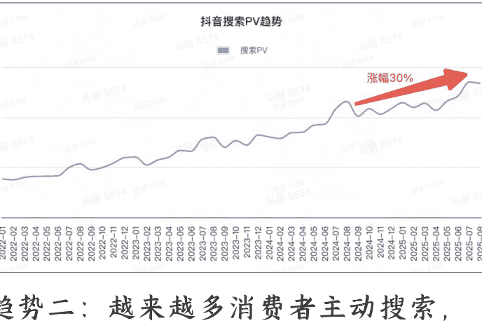
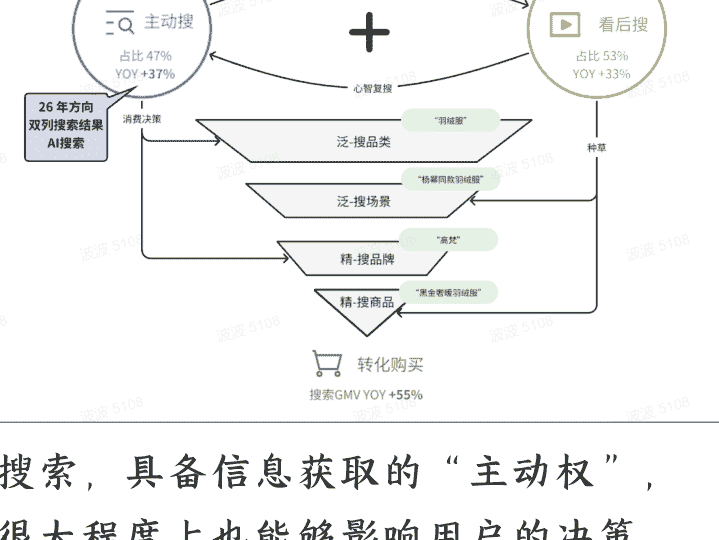
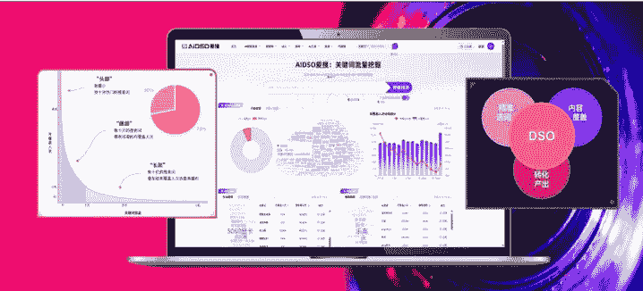
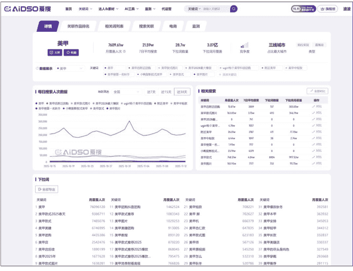
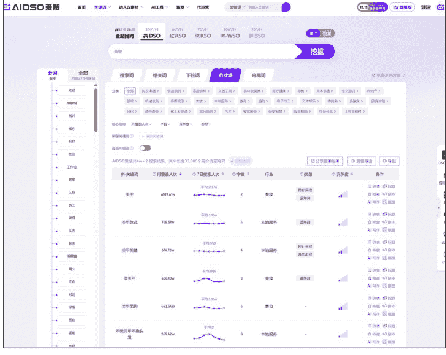
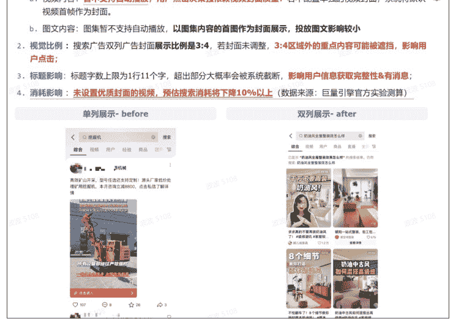
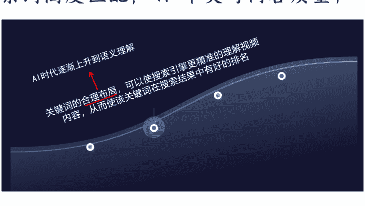
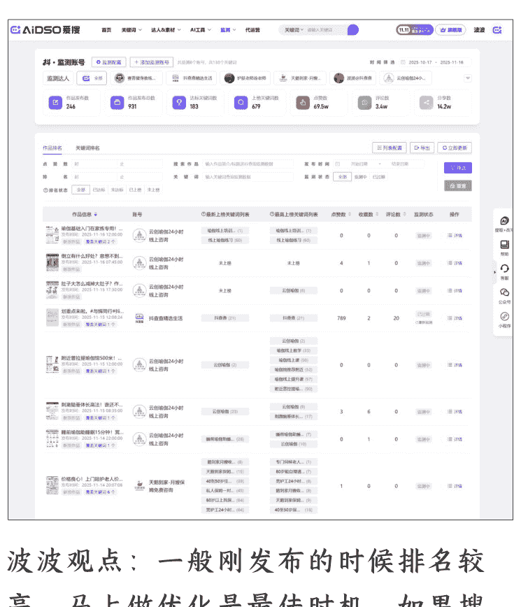

# 波波：2026 抖音搜索趋势（5000 字干货）

251119 生财精华

整理：公众号懒人搜索，懒人专属群独享
懒人微信：lazyhelper


作者：波波 抖查查&爱搜创始人
抖音顶级（三星）流量服务商
ASO+DSO 搜索流量专家（10 亿服务费不含投放）
DSO = Douyin Search Optimization


# Part.1 抖音搜索趋势变化

2026 年，抖音搜索生态迎来结构性变革。推荐产生兴趣，搜索反映需求。激活兴趣的内容未必能实现转化，但做好搜索的内容却有机可乘。用户行为从“被动浏览”向“主动探索”深度转型，算法逻辑从“关键词匹配”升级为“场景化语义理解”，商业价值从“承接”拓展为“经营”。本文将基于最新行业数据与实战案例，系统拆解抖音 2026 搜索趋势的核心特征。

## 趋势一：不仅“爱刷”，也越来越“爱搜”：80%用户都会搜，日均搜索 PV 高达 41 亿，同比涨 30%。

### 抖音搜索PV趋势



## 趋势二：越来越多消费者主动搜索，进行消费决策：47%的抖音用户会主动发起决策型搜索需求，主动搜 PV YOY+36% 增速快于看后搜。当前抖音呈现“主动需求 + 看后激发” 双轮驱动的用户搜索路径。



搜索，具备信息获取的“主动权”，很大程度上也能够影响用户的决策。调查显示，9成用户认为搜索结果对消费决策有影响。


用户决策的本质是 “解决问题” 或“达成目标”（如买商品、选服务、做选择等），搜索结果需围绕这一核心，提供有价值、可验证、差异化的信息。

## 趋势三：搜索经营对客户生意越来越重要：超 22%的推荐流量与用户搜索兴趣相关，搜的越多，流量越多，越搜越爆，用户边搜边买的购物习惯逐步加深，抖音搜索 GMV 同比高达 55%，呈爆发趋势，成为商家生意增长的重要渠道。

波波观点：抖音搜索流量越来越大，用户搜索决策心智越来越高，同时针对搜推联动算法机制的玩法，也是当下最具红利的流量打法。所以建议商家、品牌方，2026 年一定要重视搜索流量，^_^这可能是平台最后的红利了。但是也要注意，抖音搜索绝对不只是抖音 SEO，要用 DSO 的逻辑去看待！

## 选词逻辑：“蓝海长尾词”取代“头部大词”

好的选词不是选竞争最激烈的，谁都知道的词，而是要寻找一些价值被低估，不容易被人想到，但是流量却很大的词。同时优先选择容易成交的词成交，然后再选择人群词，以及行业热词去种草。看到这里，可能大家瞬间会理解选词工具的重要性。

- 头部词竞争激烈人群泛，打法：极致内容+付费，漏斗层层筛选，筛出优质客户；
- 腰部词人群精准质量高，打法：选词拓词，挖掘潜力蓝海词，做优质的 DSO 内容+微付费；
- 尾部词量大需求细分，打法：海量布词+AI内容提效；

波波观点：关键词热度不同，对于内容质量分要求不同，所谓的血脉压制，如果内容质量很差，在大词上面是排不到前面的。所以很多新手上来选大词，但是内容分做不高，基本上是无法拿到任何排名的。

用爱搜，可以实现更多蓝海关键词选词与排名监控。蓝海长尾词是被广大内容创作者和流量玩家忽视的蓝海生态。AIDSO 爱搜平台，仅抖音平台的关键词收录量就超过 10 亿条。词库量级大，挖掘到蓝海词的能力就强。工具适合：内容创作者、流量玩家、品牌方、达人、各类商家使用。

### 爱搜（aidso.com），分析监控 10 亿热词



### 支持：抖、红、快、B 站、TikTok



### 爱搜平台关键词详情



### 爱搜平台选词功能

推荐 PC 版本： www.aidso.com

### 排名算法逻辑：场景化语义理解取代“关键词堆砌”，视觉信号成新权重

抖音搜索算法在 2026 年完成重大升级，核心变化体现在 “从文本匹配到意图识别” 的跨越：

- 场景化权重飙升：算法对 “场景化内容” 的偏好显著提升，短视频算法在搜索排序中的影响权重从 35% 跃升至 61%。例如 “智能眼镜” 类目，将 “科技参数” 转化为 “开会偷看手机技巧” 的场景化表达后，搜索转化率提升 91%；户外品牌将商品说明拆解为 5 秒场景片段，点击率直接提升 4 倍（数据来源：豆粉网 2025 年 8 月、5 月报告）。
- 视觉元素纳入评估：算法不再仅依赖文本关键词，而是通过识别视频中的视觉信号（如餐具颜色、产品使用场景）优化匹配。实测数据显示，用白色餐具拍摄的减脂餐视频，搜索转化率比深色餐具高 15%；家电品牌 “冰箱除菌技术拆解” 类深度视频，转化效率是纯娱乐内容的 2.8 倍（数据来源：抖音 2026 电商数据报告、豆粉网 2025 年 5 月报告）。
- 动态优化周期缩短：传统关键词策略的效果持久性可达 3-6 个月，而 2026 年抖音搜索需 “实时调整”，关键词优化周期缩短至 2-4 周。某美妆品牌通过每周更新关键词库、分析搜索词路径图，实现 2026Q1 搜索流量环比增长 218%（数据来源：豆粉网 2025 年 5 月报告）。

波波观点：经过我们几十万播放搜索内容的海量测试，之前算法比较热衷于关键词匹配去打内容标签，分析内容与关键词相关性。同时图文内容在很多搜索场景下转化更优，无论是自然搜索还是付费搜索流量。如今视频内容的权重提高，值得大家关注，在搜索流量层面，更多的去尝试优质的视频画面内容，应该会有不错表现，这块我们也会积极尝试，有结果了也会第一时间放出。

# Part.2 搜索结果内容逻辑演化

1. 内容中包含关键要素，用户搜索词的时候，内心真正的需求，是否被你的内容捕捉到，十分关键，封面可以直给。
例如用户搜索 “新手买哪款相机”，结果应突出 “预算区间、入门功能、性价比型号对比”，而非泛泛而谈相机发展史；
搜索 “北京到上海最快交通方式”，需明确对比高铁（时长、价格、班次）与飞机（准点率、机场往返时间），并给出 “赶时间选高铁、预算宽松选飞机” 的结论性建议。
也可以仅是个封面，引导点击。点进的人多，评论区容易成为一个聊天室。

2. 专业的事情问专家，比如考研考公，咨询张雪峰这类的专家，我们之前分享的自家操盘案例，健身教练培训，就放了一个专业健身教练的单人口播，去承接精准的搜索词：“健身教练考试报名入口”。在专业知识层面需包含专家权威背书信息。

3. 产品体验与服务体验，信赖 KOC 内容，更愿意找普通人的经验、体验，过来人的真实体验信息。

4. 呈现决策方案，展示方案与适用的场景，帮助用户找到匹配的选项。在我们做的装修案例中，不同的搜索词，其实在寻找不同的方案，提供相应的方案，就可以转化用户，针对搜索词提供决策方案。

5. 搜索用户和搜索算法都喜欢的好内容：1）真实性高；2）相关性高；3）互动性强；4）时效性强；5）共情性强；好内容可以直接影响用户的消费决策。

## 3. 搜索结果页：单列变双列



公众号懒人搜索，懒人专属群分享

波波观点：利用好投放侧资源，利用平台提供的，品专投放，在搜索结果切换成双列后，能更好的凸显全屏品专的优势，首屏内容曝光比例提升 4 倍。同时要利用 DSO 海量长尾词铺排的方式，获取更多精准长尾流量。

# Part.3 内容呈现与流量获取

## 图文的优势：
1）信息量大，面向搜索用户的理性思维场景；
2）可以加入结构化信息展示：列表化、表格对比、层级化；
3）可视化辅助理解：图表（折线图、饼图）、路线图、示意图等，减少用户想象成本。
4）发布图文，注意内容应该包含有效信息，在抖音不需要额外再加封面，首页就可以出现关键信息。尽量不要用非原创内容，尽量首发。如果有转化引导，应当尽量隐蔽些，放在后面为佳！

## 混剪视频优势：
1）展示场景、运动状态、更加有优势；
2）推荐流量、搜索流量，双频共振；
3）打磨好转化率后，一般建议配合投放持续获取流量；

## 单人口播优势：
1）凸显专业人设，专业性背书，比如专家、教练、资深用户、职业、等会
更加强化业务方面的信任度。如果是产品体验，需要真实场景，真实的感受反馈，同样也能起到提升信任的作用；
- 2）有助于打造个人IP，产生粉丝粘性；
- 3）适合攻破思想壁垒，改变用户的决策偏好；
- 4）这里要注意封面要像图文首图一样吸引力强一些。例如：1. 关键信息醒目；2. 制造强反差对比；3. 内容与搜索词高度匹配；4. 审美与内容质量；



我们所作的内容既要让算法看懂，又要让人看懂！
内容 to 算法 to 用户

不能堆砌关键词，这样人阅读起来不舒服，但是合理包含关键词依然是重要的步骤。这样可以让算法更加准确获取内容信息。

符合搜索算法的逻辑，再结合上人的搜索习惯，就是我们做的内容既要给算法识别，也要给人看。都满足的情况下，在搜索场景下面就会有更好的表现，这里面有不少细节。

符合搜索逻辑的内容，主要分为几大步骤：
- 1）通过选词，避免竞争，同时保证有量；
- 2）通过优化内容，确定性地包含关键词，以及打造封面的吸引力，让算法识别内容和关键词匹配，同时让用户更愿意点击；
- 3）让内容具有长效性，这样可以持续排在搜索词的高位很久，使搜索进来的用户持续给这条内容增加搜索点击和近期互动数据；


推荐流量拼的是短跑，爆发力，搜索流量玩的是长跑，耐力！是成功的必要因素。所以要做长效内容，尽量让内容长期出现在关键词的高位，经过我们大量的过往经验判断，很多优质程度远超其他的内容，可以好几年卡在搜索结果第一位，而且几乎是千人一面的情况，因为内容质量足够好，算法会将其长期置顶。

“快”不如“持久”！不断的正确选词+不断的高转化内容生产，就会收获源源不断的流量。同时通过平台的搜推联动机制，可以更加精准的影响我们的推荐流量基本盘!

一般一条内容按照 DSO 逻辑生产的内容：
- 卡住长尾词的周期：5天左右
- 卡住大词的周期：20天左右
- 能否长期守住要看近期互动

一个蓝V线索账号，从最开始搭建，到稳定单日100-200条有效精准线索，也要经历2月左右的稳定输出。
电商账号也可以通过搜索词生产爆品带货短视频，同时基于搜索流量的投放激活自身直播间的成交。把DSO逻辑加入素材生产，会极大提升转化效率。

波波观点：进场DSO的内容逻辑，我觉得可以分成两个方面：第一，如果持续更新一个领域的内容，可能会被算法识别为，这个领域的专家，同领域的问题，就会有更多的曝光机会。

（要求就是内容不能随意做，要有价值，用户认可，同时机器也能够识别，这里面如果有一些争抢非常激烈的词，不容易，因为好内容、同质化内容比较多，很难识别到自己，所以选词选一些偏门一点的，更容易积累权重。）

第二，如果确定了一个关键词非常有价值，且综合竞争情况，是属于能够拿下的范围，建议持续做，直到拿下为止。一般按照我们讲的DSO逻辑在做，基本上当天就可以上排名！^_^

# Part.4 排名监控与优化

## 排名监测功能的重要性

- 提升“可被搜索到”的确定性：把“发作品了就看缘分”变成“做了哪类内容、配哪些词就能稳定被搜到”，让流量获取从随机变成可控。
- 反向指导选词与内容创作：监测哪个词更容易上榜与达标，反推标题、封面、首评置顶与脚本结构，形成“数据→创作”的闭环。
- 优先级与资源分配依据：把时间与预算投给“临近达标”的作品与“高潜词”，避免在人效与投放上“撒胡椒面”。
- 低成本冷启动与新品验证：新品期先从长尾词达标，逐步反哺中高频词，降低对大额投放的依赖与试错成本。



- 提前发现风险与衰退：排名趋势下滑=内容衰老/相关性不足/竞争加剧；监测能第一时间触发“换封面/改标题/二次分发/补投”的动作。
- 竞争洞察与差异化机会：同类账号围绕哪些词上榜、周期多长、内容形态如何；找到“对手空窗”和“蓝海长尾”。
- 经营与 ROI 说服力：把监测指标与生意结果打通（点击、留资、成交、团购核销等），形成“关键词→曝光→转化”的证据链，提升预算与跨部门协同的说服力。


波波观点：一般刚发布的时候排名较高，马上做优化是最佳时机，如果搜不到，可以先关注被优化账号，或者先直接通过链接多看下相关账号其他内容，强制增加关联性，这样虽然不是完全自然的搜到，但是只要是增加搜索点击和互动数据，也有一定权重，等排名稳定，再用更多账号，直接优化！

最后，安利小懒的付费群：

## 懒人专属群（介绍）


📖 懒人专属群持续更新中，已持续运营6年，整理超3000份各类精选付费文章&年费社群干货，全部开放下载。

本资料为付费群内部分享，仅供真实有需要的朋友查阅🤐

## 懒人专属群更新记录：

```
https://hk57gvlx7u.feishu.cn/docx/H0kRdZbSboIBR0xkaXtcuVEOnTg
```

## 懒人专属群更新记录（需梯子，备用）：

```
https://lazybook.fun/blog/record2
```