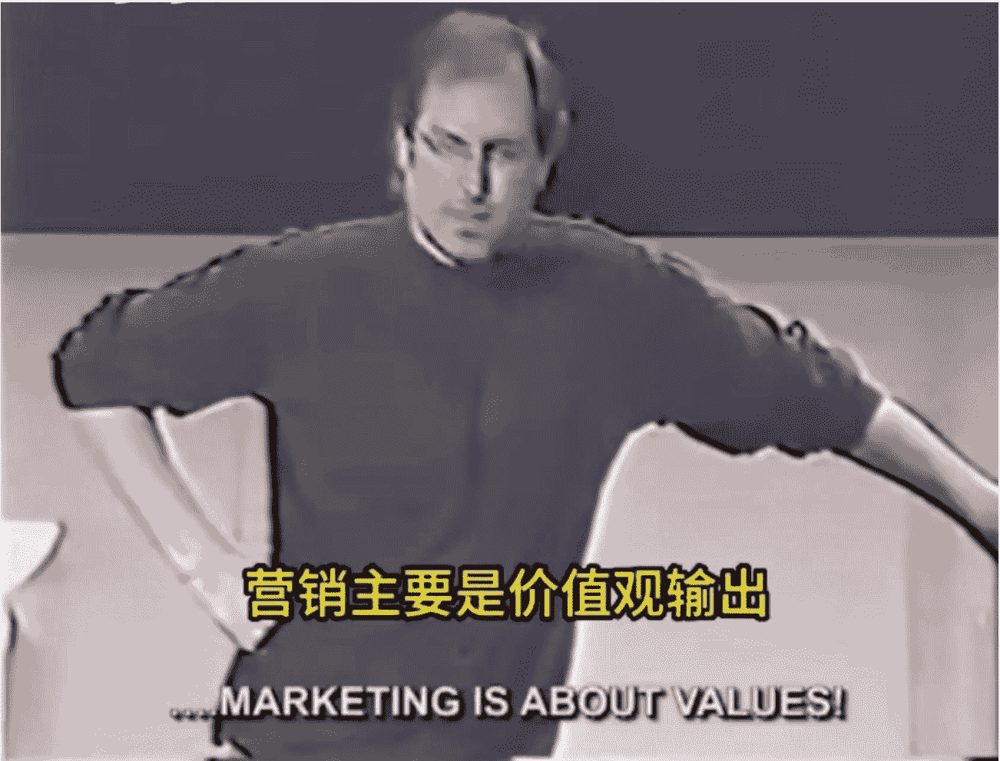
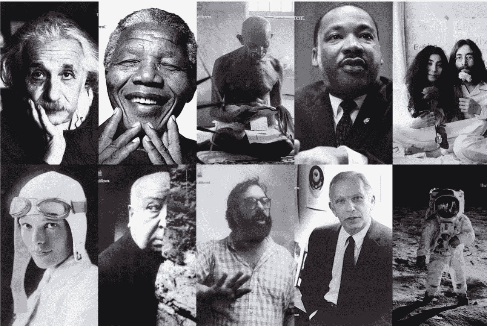
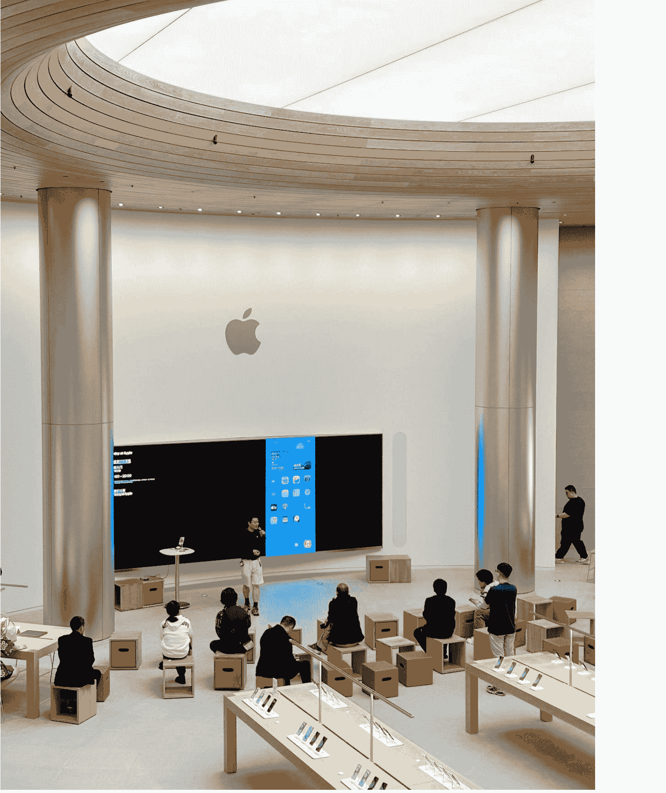
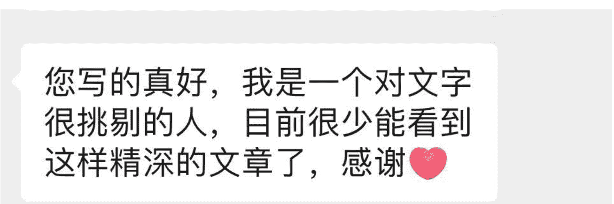
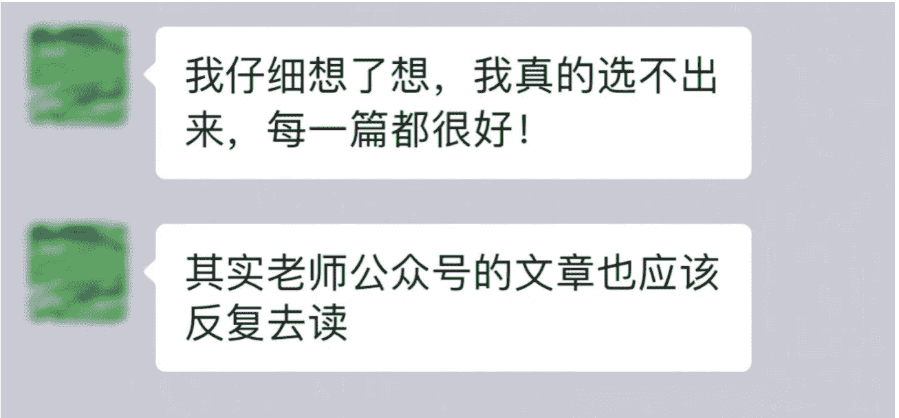
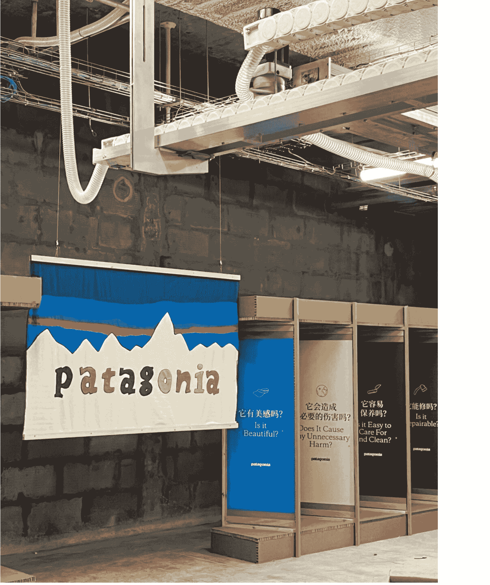

# IP 的本质是宗教式布道：垂直小号低粉单月变现 6 位数背后的底层逻辑

## 251201 副业 SC 精华

公众号懒人搜索，懒人专属群独享

懒人微信：lazyhelper

大家好，我是南南。

我是一个垂直小号深度内容的实践者，粉丝量很小，但在极小体量下实现了单月六位数变现。不追热点、不做爆款、不投流量，只持续输出我真正相信的深度内容。我不做低客单，吸引来的用户客单价高，几乎不需要营销动作自然转化就能成交。

航海家北京 IP 大会，李克老师的演讲内容在朋友圈刷屏。

于是我去拜读了老师在星球关于宗教布道式 IP 的发言，发觉这就是我这一年一直在践行、但从来没系统总结过的事儿。

我们不是在发布一个IP，而是在定义IP。一个观点讲十年，才是IP的底气。

高估自己一年内能做到的事情，而低估了自己10年内能做到的事。全网都在宣传追热点、做爆款，周围越是浮躁，你越要坚定自己的节奏和信念。

自媒体不是流量游戏，而是影响力的传播，需要不断重复你的观点、价值观，才能吸引并筛选出真正和你同频的用户。

富爸爸穷爸爸就讲了一件事：别当穷人，搞资产。这一个观点，罗伯特说了20多年，换个方式再说一次，然后会觉得：哇又懂了。现实是，大多数人一开始并没有真正的观点。有的是情绪，有的是一闪即逝的灵感。真正的观点是一种你愿意为之背书十年，能穿透你每一个选择的内核，是一种信仰。

过去那套做流量的方法行不通了。点赞是因为有情绪共鸣，评论要么认可你的观点要么是反驳你的观点，收藏是觉得这个视频将来对我有用。

真正的跃进：从表达自己开始。怎么开始打造自己的IP？表达的真正威力，不在于独特，在于共鸣。而要形成共鸣，你就得反复讲同一件事，用不同的视角、语言和情绪。

IP的本质，是一场宗教。内容创作的本质，不是创造产品，不是创造服务，而是创造一种信仰。个人品牌不是在线商业或个人成长，而是我所感兴趣的互联性。一个成功的IP，是不断重复同一个生命立场。它的本质，是一种宗教——而你，就是那个布道者。

你要创造的是：
- 一个核心观点，
- 一种情绪锚定，
- 一套实践体系，
- 一群愿意相信你并愿意跟随的人。

这篇文章想分享给大家的是：

- 如何理解"宗教式布道"的 IP 思维？
- 世界上最伟大的品牌，使用价值驱动的思维方式？
- 个人 IP 如何穿越周期，长久存在？
- 为什么追热点、做爆款这条路越走越窄？
- 深度内容垂直小号实验之路（如何理解？具体如何做？半衰期长的深度内容的好处？方法论普适性问题）
- 如何开始你的"宗教式布道"？
- 如何找到信仰？未来十年的反复说的那一件事
- 你做 IP 的驱动力是欲望还是恐惧？
- 如何从 FOMO 害怕错过切换到 TOMO 享受错过？
- 如何找到你的定心针？
- 怎么用"垂直小号"载体，建立一门更确定的生意？

这篇写了一万多字，结合我在英国学习战略品牌管理，去百年教堂礼拜体验的经历，把李克老师 IP 观点、乔布斯品牌哲学、我自己的实践验证一气贯通，讲清楚背后的底层逻辑，筛出核心方法论，方便不同类型项目的朋友也能运用。

我认为信仰价值驱动的思维能用到所有项目里。如果你也在做IP、做自媒体、做产品，总觉得被流量焦虑拖着走，想要建立自己的差异化护城河，希望这篇能给你一些不一样的视角。

## IP的本质是宗教

李克老师原文这样说的："别急着找选题，先找找看你到底信什么。"

全网都在追热点做爆款，周围越浮躁，你越要坚定自己的节奏。真正的观点是你愿意为之背书十年、能穿透你每一个选择的内核，是一种信仰。

过去做流量的方法行不通了，点赞是情绪共鸣，评论是观点认可或反驳，收藏是觉得有用，但这些都不是让人真正跟随你的东西。

IP的本质是一场宗教，你是布道者，要创造核心观点、情绪锚定、实践体系和愿意跟随的人。

这些话像是一把钥匙，打开了我脑海里的一些碎片，让它们突然连成了一条线。

我今年在英国顶尖艺术类高校学习战略品牌管理的课程，教授是个头发花白的法国先生，他此前服务于 Pentagram 设计公司，为 Oppo、花旗银行、Sam Labs、Saks Fifth Avenue、美国联合航空、The Co-operative 等品牌开发或更新过品牌标识。

有一门课专门讲品牌哲学，那天他给我们放了一段视频，是乔布斯 1997 年回归苹果后的一次内部演讲。那段视频画质很差，是那种九十年代的录像带质感。乔布斯穿着黑色高领衫，站在一群苹果员工面前。声音不大，每个字都像是在敲打什么东西。

他说："Marketing is about values。"

营销的本质是价值观。

这是一个非常嘈杂的世界，我们没有机会让人们记住太多关于我们的事情。没有哪家公司能做到这一点。所以我们必须非常、非常清楚地知道，我们想让他们了解我们的是什么。

苹果显然在这个领域过去几年里被市场忽视过，我们需要重新塑造它的影响力。达到这个目的的方法不是去宣传产品的性能和价格，不是去宣传这个电脑多少 bit 多少兆赫兹，不是去宣传我们为啥比 windows 好。

接着他举 Nike 的例子。Nike 是一家卖鞋的公司，他们卖的是日用品，你去任何一家商店都能买到运动鞋。但当你想到 Nike，你的头脑会觉得它和鞋子公司不一样。他们甚至从来不在广告里聊产品。他们不聊气垫技术有多先进，不聊鞋底的材质，不聊为什么他们的鞋比别家好穿。

他们做的是什么？是向伟大的运动员致敬，是向竞技体育本身致敬。

That's what they are. That's who they are.

### 这就是他们的身份，这就是他们是谁。

然后他话锋一转，开始讲苹果。他说苹果的核心价值是什么？不是说我们做的电脑比别人好用，不是说我们的技术比别人先进。苹果的核心信仰是我们相信有激情改变世界的人，才会真正改变世界。Think different，颂扬那些敢于挑战现状并对世界产生重大影响的不墨守成规者、叛逆者、不合群者和创意天才。

那天的教室很安静。伦敦的下午四点，窗外已经开始暗下来，我记得我当时在笔记本上写下了一行字："做品牌最锋利的部分，而是你直接尖锐地表达你的价值观。"

视频结束后，教授问我们有什么感想。有个英国同学说，这听起来很理想主义，在商业世界里真的行得通吗？

教授笑了笑，说了一句我到现在都记得的话：

The most practical thing in the long run is a clear belief.

从长远来看，最实用的东西是一个清晰的信念。

那时候我并不完全理解这句话。我觉得它听起来很对，但又很抽象。什么叫清晰的信念？这怎么落地到具体的商业行为里？直到之后，当我自己开始做内容、做IP的时候，这些问题才慢慢有了答案。

但在讲我自己的故事之前，让我先把乔布斯的品牌哲学再展开一点。因为我觉得，如果不真正理解他在说什么，后面的东西就很难讲清楚。乔布斯在那次演讲里，不只是在讲Nike和苹果。他是在讲一种完全不同的品牌思维方式。

## 伟大的品牌使用价值驱动的思维方式

### 传统的品牌思维是什么？

是"我有一个产品，这个产品有很多优点，我要把这些优点传达给消费者，让他们来买"。

这是一种由内向外的推销逻辑，我有什么，我就说什么。

但乔布斯说的是另一件事。

品牌真正传播的，不是产品的功能和优点，而是源自内在的价值观和意义。品牌是在回答一个问题：
你相信什么？
你为什么而存在？

## 你想和什么样的人站在一起？

这是一种由内而外的吸引逻辑，我是谁，我吸引谁。

### Nike 信什么？

Nike 信伟大的运动员精神，信人类对极限的挑战，信"Just Do It"背后的那种不顾一切的行动。

所以 Nike 的广告从来不是在卖鞋，而是在讲述那些伟大运动员的故事，在向竞技体育本身致敬。买 Nike 的人，不只是在买一双鞋，他们是在认同一套生活态度，在加入一个追求卓越、相信行动的群体。

### 苹果信什么？

苹果信"有激情改变世界的人，才会真正改变世界"。所以苹果的广告是"Think Different"，画面里是爱因斯坦、马丁·路德·金、约翰·列侬、甘地这些"疯狂的家伙"。

苹果从来不说"我们的电脑处理器有多快、内存有多大"，它说的是"这是给那些想要改变世界的人准备的工具"。买苹果的人，不只是在买一台电脑，他们是在认同一种身份，在加入一个 Think Different 的部落。

### 你发现区别了吗？

传统的产品思维，竞争的是功能、价格、渠道。你的鞋气垫好，我的鞋更透气。你的电脑便宜，我的电脑更便宜。这种竞争是没有尽头的，因为总有人能做出功能更好、价格更低的产品。

但价值观驱动的品牌，竞争的是认同感和归属感。它不是在问我的产品比别人好在哪里，它是在问我们是谁？我们信什么？谁愿意和我们站在一起？这种竞争是有壁垒的，因为价值观和信仰是很难被复制的。

一把手如何看待品牌，决定了品牌会有多少价值。这句话放到今天做IP的语境里，就是你如何看待你自己在做的事，决定了你的IP会走多远。

如果你把做IP看成是一种流量游戏，追热点、做爆款、骗点击、割韭菜，那你的IP就只能是一个流量游戏。它会随着流量的涨跌而起伏，随着平台规则的变化而动荡，永远没有根基可言。

但如果你把做IP看成是一种价值观的表达，是找到你真正信的东西然后持续地说出去、活出来，那你的IP就有可能成为一个真正有生命力的东西。它不依赖于某一次爆款，不恐惧于某一次流量下滑，因为它有根。

那天在伦敦的教室里，我第一次接触到这种思维方式。但说实话，我当时并没有完全消化。它在我脑子里种下了一颗种子，但那颗种子需要一些经历，才能慢慢发芽。

真正让这颗种子开始生长的，是另一次经历。

## 个人 IP 如何穿越周期，长久存在？

那是来英国后的某个周日早晨。朋友问我要不要一起去教堂做礼拜。他不是基督徒，就是好奇想去看看。我也不是教徒，但那天早上没什么事，就跟着去了。

那是一座很老的教堂，据说有几百年历史了。从外面看，灰色的石墙上爬满了藤蔓，阴天的时候显得有点阴沉。但推开那扇沉重的木门走进去的时候，我愣了一下。

里面的空间比我想象的要大得多。高高的穹顶，彩色的玻璃窗，阳光透过玻璃洒下来，在地面上形成斑驳的光影。木头座椅排列得整整齐齐，已经坐了不少人。前面有一个讲坛，讲坛旁边有一架巨大的管风琴。我和朋友找了最后一排的位置坐下来。

礼拜开始了。先是唱诗，所有人都站起来，跟着管风琴的旋律一起唱。我不会唱，但我注意到周围人的表情。他们很多人脸上有一种很平静、喜悦、很专注的神情。有个老太太站在我前面，她的声音不大但很投入，唱到某些句子的时候眼角会有泪光。

然后是牧师布道。那个牧师大概五十多岁，戴着眼镜，语速不快，声音很温和。他给我们讲了圣经的一些篇章，大概是关于信心和希望的。他的语气，不是那种高高在上的说教，而是像一个朋友真挚激情地在跟你分享他真正相信的东西。

中间有一段是大家一起祷告。所有人低下头，闭上眼睛，在安静中各自祈祷。那一分钟的寂静，整个教堂里只有轻微的呼吸声和远处偶尔传来的鸟叫。

礼拜结束后，人们并没有马上离开，教堂给大家供应了果汁、咖啡、热茶还有曲奇饼干。他们三三两两，带着孩子，聚在一起聊天，有人去和牧师握手，有人在门口的长椅上坐着喝咖啡。没有人想着活动结束了快点走，而是一种我们属于这里，不着急离开的归属感。

我一个人在教堂外面的草坪上坐了很久。脑子里一直在想一个问题：为什么这样的组织可以存在几千年？

你想想看，不仅是基督教，世界三大宗教从诞生到现在，经历了多少次战争、瘟疫、政权更迭、社会变迁。多少帝国兴起又衰落，多少公司创立又倒闭，但教堂还在那里，每个周日还是有人来做礼拜。

是因为它给人希望，给人信心，给人一种我属于这里的归属感。

人类有很多底层需求，安全感、归属感、意义感、被理解、被接纳。

这些需求不会因为时代变化而消失。科技再怎么发展，社会再怎么变迁，人还是人，还是需要这些东西。

宗教厉害的地方在于，它找到了满足这些底层需求的方式，并且把这种方式制度化、仪式化、社区化了。每周日的礼拜是一个仪式，唱诗、祷告、布道是一套流程，教会是一个社区。人们来到这里，不只是来听一场讲座，他们是来获得一种归属感，来确认自己是这个群体的一员。

如果一个品牌、一个IP，能够像宗教一样给人这种归属感和意义感，它是不是也能够穿越周期、长久存在？

很多成功的现代品牌，本质上都在扮演"教堂"和"布道者"的角色。它们不只是在卖产品，它们是在创造一种信仰、一种归属、一种身份认同。

比如星巴克。从产品上说，它就是卖咖啡。但星巴克真正卖的是什么？

是第三空间的理念，一个既不是家也不是办公室的、可以放松的公共空间。是支持社区、创造机会的价值观。还有一些只有"内部人"才知道的秘密暗号——比如 Dirty Chai 这种不在菜单上的特调。店员还会在你的杯子上写名字这种小仪式。这些东西从商业效率的角度来说是多余的，但它们创造的是一种身份认同。

### 东京，全世界最大的星巴克

说回苹果，苹果零售店是现代商业世界的大教堂。

你想想苹果店的设计，超大的玻璃门，一眼就能看到里面。宽敞明亮的空间，几乎没有多余的装饰。穿着统一蓝色T恤的店员，被称为天才（Genius），扮演着类似牧师的角色，你有问题，你来找他们，他们会耐心地给你解答、帮你解决。

### 上海静安，亚洲最大 apple store

很多教堂都依据黄金比例建造，此类建筑从来不是随意搭建的，它能带来情绪上的引导，给人沉静与敬畏的感觉。黄金分割是一种来源于自然和宇宙的比例，它存在于花瓣、螺旋壳、星系、人体中，是宇宙秩序的缩影。

当你走进一座黄金比例设计的空间，空间的层层递进，天顶的通透延展，光线的走向，都会不自觉地引导人进入一种神圣敬畏的状态。

你看，整个苹果零售店空间设计都在传递这种信息：这里是一个特别的地方，来这里是的人是特别的人。你走进苹果店，不只是在买一台手机或电脑，你是在进入一个 Think Different 的圣殿，是在确认自己属于这个群体。

我更加确信了一件事。那些真正穿越周期、穿越时间的品牌和 IP，从来不是靠追热点、做爆款、玩流量游戏起来的。他们做的事情，本质上是在布道，找到自己真正相信的东西，然后用各种方式持续地表达它、传播它。

## 深度内容垂直小号实践之路

理论归理论，我真正相信这件事，是因为我自己也在践行它，并且亲眼看到了效果。

接下来我想讲讲我自己的故事，这些理论在我身上的落地，其实可以归结为一个词，垂直小号。

垂直小号生财已经反复地推，我知道很多人一听到"小号"这个词，第一反应是"那不就是粉丝少的号吗？有什么好做的？"但这恰恰是一个很大的误解。垂直小号不是做不大的号，它是一种完全不同的思路，你从一开始就不是奔着做大去的，你是奔着做深、做精、做确定去的。

### 怎么理解这件事呢？

大多数人做自媒体、做 IP 的思路是我要做一个内容渠道，我要获取流量，然后在流量里筛选能转化的人。

这是一个漏斗模型，顶部流量越大，底部能筛出来的人越多。所以大家都在拼命做大流量，追热点、做爆款、投流量，想尽办法把漏斗顶部撑大。但垂直小号的思路是反过来的。它不把自己定位成一个内容渠道，而是把自己定位成一种商业基建。

### 什么意思？

就是说，这个号存在的目的，不是为了获取流量，而是为了承接信任、展示能力、建立连接。它是连接你和业务的桥梁，让潜在用户知道你在做什么、你的理念是什么、你服务过谁、效果怎么样。

它是你的个人信用证明，当别人想了解你的时候，他来到这里，能看到你持续输出的内容、你的思考方式、你的价值观，成为零成本的获客引擎。你不需要投流、不需要做付费推广，只需要持续输出有价值的内容，对的人自然会找到你。

你可能会问这种思路真的行得通吗？现在不是都说流量越来越难做了吗？

恰恰相反，我觉得现在是做垂直小号最好的时机。从用户侧来看，这两年有一个很明显的趋势是人们对那种泛泛的、蹭热点的、标题党式的内容越来越免疫了。他们见得太多，已经疲了。

但与此同时，他们对高价值密度的内容需求反而在上升。愿意深耕垂直领域的小而美的创作者会得到奖励。他们愿意为真正有干货的内容买单，愿意为真正懂行的人付费。

这些用户的客单价也很高。很多做知识付费的人会觉得，价格高了就卖不动，所以要走低价走量的路线。

但我的经验是，如果用户是真正认同你的，他们其实不太在意价格。因为他们买的不只是你的产品或服务，他们买的是一种认同、一种链接、一种和这个人、感受站在一起的感觉。这种东西是很难被价格衡量的。

现在用户的主动搜索行为在增加。我询问过一些添加我的客户，问他们是怎么找到我的，用户会跟我说："在微信里搜索，其实有一天想不起来了，印象中好像是当时心态不太好，然后就在微信里搜索，没想到就搜到了您的公众号，然后读了就关注了！"

他们遇到问题的时候，会去搜索，会去找能帮他们解决问题的人。如果你的内容恰好能被他们搜到，你就不需要去追着流量跑，流量会自己找到你。

从平台侧来看也是一样。微信这两年的算法变化很明显，转向价值密度优先，真正有深度、有价值的内容，即使阅读量不高，也能获得更长的推荐周期和更精准的分发。

所以，垂直小号的逻辑，其实和前面说的布道者思维是一脉相承的。你不是在追流量，你是在吸引信徒。你在经营一群高度认同你的人。你的目标是稳稳地建立一门更确定的生意。

## 那具体是怎么做的呢？

### 一、定位

我花了很长时间想清楚四个问题：
- 我是谁？
- 我帮助谁？
- 我帮他们解决什么问题？
- 我用什么方式、能帮他们获得什么结果？

这四个问题听起来简单，但很多人其实答不清楚。他们的定位是模糊的，今天想做这个，明天想做那个，用户看了之后不知道这个人到底是干什么的。但如果你能清晰地回答这四个问题，你的内容就会有方向，你吸引来的用户就会精准。

### 二、内容

我做了一件很笨但很有效的事，我梳理了 10 个我的目标用户真实会遇到的问题和场景。不是我自己拍脑袋想的，是我在和用户交流的过程中收集的。

他们问过我什么问题？
他们在什么场景下会遇到困惑？
他们的痛点是什么？

然后我围绕这些问题，持续输出内容。

每一篇内容都是在回应一个真实的需求，都是在解决一个具体的问题。这样做的好处是，你的内容永远有话题可写，而且每一篇都是有用的、能被搜索到的。时间长了，这些内容就会形成一个样本库，当有人搜索相关问题的时候，就有可能找到你。

### 三、坚持

给自己定一个周期，比如一两个月。在这段时间里，我不看数据、不纠结阅读量、不焦虑涨粉速度。我就是持续输出，持续迭代，持续优化。2个月之后，再来看整体效果，做第二轮的调整。

这种延迟满足的心态很重要，因为垂直小号不是一个能快速见效的事情，它需要时间来积累、来沉淀、来发酵。

但一旦积累到一定程度，它就会开始产生复利，因为你的老内容会持续带来新用户，你的信任资产会越滚越大，项目变得越来越容易。

说来惭愧，我来联合办公室前，从来没有计算过CAC客户获取成本和LTV客户终身价值，也没有做过什么精密的投放测算，更没有雇人帮我做什么增长黑客的套路。我的粉丝量一直都很小，不是那种万粉的大号，和很多做IP的人比起来，我的流量几乎可以忽略不计。但就是在这样的简陋粗糙的情况下，我实现了单月六位数的变现。

很多人听到这个数字的时候，第一反应是"怎么做到的？有什么方法？"但当我说"没什么特别的方法，就是持续输出我真正相信的内容"的时候，他们往往会有点失望，觉得这不是一个可以复制的干货。

但这恰恰是我想说的，真正有效的东西，往往不是什么技巧和方法，而是一些更根本的东西。

我的内容从来不追热点。当然，不是说热点有什么不好，而是我发现，当我追热点的时候，我写出来的东西总是差点意思。因为那不是我真正想说的话，我只是觉得"这个话题火，我应该蹭一下"。这种动机写出来的东西，读者是能感受到的，它没有温度，没有说服力，就是一篇为了蹭流量而写的文章。

有一些朋友尝到了蹭热点的甜头之后，就会上瘾。他们开始每天追热点，每天想着什么话题火我就做什么。结果账号变成了一个热点合集，没有任何特色，没有任何辨识度。今天聊这个，明天聊那个，后天又换一个方向。用户看了之后会觉得这个人到底相信什么？

当内容没有一个贯穿的主线、没有一个让人能记住的内核的时候，就会变成一个无差别的内容生产者。你的内容可能每一篇都有点流量，但没有一篇能真正打动人、让人记住你、让人愿意跟随你。

#### 深度内容的长期好处

我的粉丝增长很慢，数据上来看确实不好看。但留下来的人，都是真正被我的内容打动的人。他们不是因为某一次爆款关注我，不是因为我蹭了什么热点，而是因为我说的某些话和他们心里想的一样。

这种用户的质量是完全不同的。

前段时间我和生财有术联合办公室的许老师聊这件事。我说我一直在做的事情，就是持续输出深度的、半衰期长的内容。我写的东西，都是我自己真正在想、真正在实践、真正相信的。

不是那种看过就忘的快餐文章，而是那种可以反复阅读、每次读都有新收获的东西。当你真正相信一件事并且把它说出来的时候，那种真诚是会传递的。

那些愿意付高客单价的用户，他们共同点是他们几乎都是看了我的内容之后被打动的，不是因为我做了什么营销动作，不是因为我给了什么优惠，不是因为我搞了什么限时促销。他们来找我的时候，已经是高度认可的状态。他们会说"我看了你的文章很久了”，或者“真的很感谢你输出这些，收益匪浅”。

你不需要花很多精力去说服他们、去维护他们。因为他们来的时候，价值观就已经是一致的。这意味着，他们的忠诚度很高，甚至会主动帮你传播，因为他们真心觉得你说的东西好。这就是为什么能在很小的体量下实现很高的变现。因为吸引来的不是流量，是信徒。

垂直小号不是一个漏斗，它更像一个磁铁。你不是在撒网捕鱼，你是在用你的内核去吸引那些和你同频的人。你的粉丝可能不多，但每一个都是真正认同你的人。

## 方法论具有普适性吗？

说到这里，我想回应一个可能的问题：你说的这些，会不会只是因为你运气好？会不会只是因为你的领域特殊？会不会换一个人、换一个领域，就不灵了？

我不能说 100%肯定，但我想说的是，这不是一个孤例。

如果你去研究那些真正穿越周期的品牌和IP，你会发现他们都有一个共同点，他们都是价值观驱动的，而不是流量驱动的。

Nike、苹果、星巴克我前面讲过了。再说几个。

Patagonia，一个户外服装品牌。他们的创始人曾经在广告里写过一句话："Don't buy this jacket。"不要买这件夹克。因为生产一件新衣服会消耗资源、产生污染，如果你已经有一件够穿的衣服，就不要再买新的了。

你能想象一个品牌在广告里劝你不要买它的产品吗？这在传统的商业逻辑里是疯狂的。但 Patagonia 做了。因为他们的核心信仰是环保和可持续，他们宁愿少卖几件衣服，也不愿意违背自己的信念。

结果呢？这个反营销的营销反而让他们获得了一大批忠诚的用户。因为那些真正在乎环保的人，会觉得这是一个和我价值观一致的品牌，我要支持它。

Patagonia 的用户忠诚度极高，复购率极高，品牌溢价也极高。他们的衣服比同类产品贵很多，但人们愿意买，因为买的不只是一件衣服，是一种身份认同。

他们起步的时候可能都很慢，但一旦建立起了价值观认同，持续维护下去，就会有一批死忠的用户，这些用户会帮他们传播、帮他们辩护、甚至在他们遇到困难的时候帮他们渡过难关。

这就是信徒和普通用户的区别。

普通用户是你给他好处他才来，好处没了他就走。信徒是他认同你这个人、认同你说的东西，他会一直跟着你，不管你涨价还是降价，不管你火还是不火。

就是李克老师说的那条路，找到你真正信的东西，然后持续地说十年。这条路看起来很慢、很笨，但它有一个特点，走的人少，这条路一旦走通了，建立起来的壁垒是很难被复制的。

### 如何找到信仰切入口？

现在让我来回应一个很多人都会问的问题：那我怎么知道我"信"什么？我怎么找到我的核心观点？

这是一个很好的问题，也是一个很难回答的问题。因为每个人的答案都不一样，没有一个通用的方法论可以套用。

但我可以分享几个帮我理清思路的问题，你可以试着问问自己。

#### 第一个问题：如果你未来十年只能反复讲一件事，你会讲什么？

你发自内心觉得重要、觉得值得、觉得哪怕没有人听你也愿意讲的那件事。

这个问题的关键是"十年"。因为热点是短暂的，趋势是会变的，但你真正相信的东西是长久的。

如果某个话题你只能讲几个月，讲完就没话说了，那它可能不是你真正的内核。但如果某个话题你可以从不同角度、用不同案例、用不同方式讲十年都讲不完，那它很可能就是你的核心信念。

围绕这个核心可以从商业的角度讲，可以从哲学的角度讲，可以从人生选择的角度讲，也可以以产品为载体去讲。每一个角度都能讲很多，每一个角度又都指向同一个内核。

你的核心是什么？

#### 第二个问题：你现在做IP的驱动力，到底是欲望还是恐惧？

这个问题很重要，因为同样的行为，驱动力不同，能量状态就不同，吸引来的人也不同。

欲望驱动是什么？

是"我真的很想做这件事，我真的很想分享这个东西，我觉得这件事很有意义"。这种驱动力是正向的、扩张的、有生命力的。

恐惧驱动是什么？

是"别人都在做我不做就落后了"，是"我必须赚到钱否则就完了"，是"我害怕被淘汰所以必须跟上"。这种驱动力是负向的、收缩的、消耗性的。

表面上看，欲望驱动和恐惧驱动可能做出一样的动作。都是在做内容，都是在做IP，都是在想办法变现。但能量质感完全不同。

欲望驱动的人，做事情是有热情的、有温度的。这种热情会透过内容传递出来，会吸引同样有热情的人。

恐惧驱动的人，做事情是紧绷的、焦虑的。这种焦虑也会透过内容传递出来，吸引来的也是同样焦虑的人。他们来不是因为认同你，而是因为被你的焦虑勾起了自己的焦虑。这种用户是很难长久的。

所以，问问自己：

我为什么要做这件事？

如果去掉所有的金钱、名声、流量的考量，我还会做吗？

如果答案是"会"，那你可能是欲望驱动的。如果答案是"不会"，那你可能要重新想想，这是不是你真正想做的事。

#### 第三个问题：你能不能从 FOMO 切换到 TOMO？

FOMO 是 Fear Of Missing Out，害怕错过。

这是现代人的通病。我们每天被各种信息轰炸，每天都能看到"别人的机会"、"别人的成功"、"别人的爆款"。这些信息会让我们焦虑，觉得自己落后了、错过了、被淘汰了。于是我们开始追赶，看到什么机会都想抓，看到什么热点都想追。

但这种追赶往往是盲目的。你追的不是你真正想要的东西，你只是害怕错过而已。

TOMO 是 Toy Of Missing Out，错过的快乐。

这是另一种心态。它的意思是只有当你全身心想要参与某件事的时候，你才去参与。其他的，就让它过去。这不是让你躺平、不进取。而是让你的进取有方向、有根基，而不是被外在的噪音牵着走。

TOMO 的人会说这个热点很火，但和我的内核无关，我不追。我知道自己要什么，所以我知道什么不是我要的。我有自己的节奏，所以不会被外在的节奏带跑。

我自己花了很长时间才学会这一点。以前我也会 FOMO，看到别人做什么火了就焦虑，觉得自己是不是也应该做。但后来我发现，那些我跟风去做的事情，往往做得很累、效果也不好。因为那不是我真正想做的，我只是在追赶别人的脚步。

现在我基本上不 FOMO 了。看到什么热点、什么机会，我会问自己这和我的内核有关吗？如果没有，我就让它过去。因为我知道，属于我的机会会在我坚持做自己的事情的过程中自然出现，不需要我去追。

#### 第四个问题：你心底有没有一根针？

这是我自己发明的一个比喻。

做项目、做 IP，会经历很多起起伏伏。有流量好的时候，有流量差的时候；有赚钱的时候，有亏钱的时候；有被夸的时候，有被骂的时候。如果你没有一根针在心底压着，你很容易被这些起伏带跑。

但如果你有一根针，有一个你真正相信的东西在那里压着，你就不会那么容易被带跑。因为你知道你在做什么，你知道你为什么做这件事，你知道外在的起伏不是最重要的，你的内核才是最重要的。

#### 这根针是什么？

就是你的核心信念，你愿意为之坚持十年的东西。

有了这根针，你就不会因为一次爆款而觉得自己无所不能，也不会因为一次冷门而怀疑自己是不是不行。因为你的价值不由外在的数据定义，而是由你内在的信念定义。

我见过太多人，做了几个月 IP，流量不好就放弃了，换个方向。换了个方向，做几个月又不好，又放弃了，又换。换来换去，最后什么都没做成。

那些真正做成事情的人，都是有那根针的人。他们可能也会遇到低谷，可能也会有迷茫的时候，但他们不会轻易放弃。因为他们知道自己为什么做这件事，他们知道这是自己真正相信的东西。

### 别急着找选题，先找找看你到底信什么

最后，我想回到文章开头李克老师的那句话：别急着找选题，先找找看你到底信什么。

如果你现在正在做 IP，或者正在考虑做 IP，我邀请你停下来问问自己：

你到底信什么？

你愿意为什么观点背书十年？

你想吸引什么样的人来到你身边？

你是在发布 IP，还是在定义 IP？

你是被欲望驱动，还是被恐惧驱动？

你能不能从 FOMO 切换到 TOMO？

你心底有没有那根针？

这些问题没有标准答案，每个人的答案都不一样。

布道者的路，看起来慢，但每一个都是真正认同你的人。他们会跟着你很久，会帮你传播，会在你遇到困难的时候支持你。

### 一个观点讲十年，才是 IP 的底气。

不是因为十年这个时间本身有什么魔力，而是因为当你愿意为一件事付出十年的时候，那件事对你来说就已经不只是一个"项目"或"生意"了。它是你的一部分，它是你是谁的一部分。

而当你能够把"你是谁"传递出去的时候，你就不只是在、在做 IP，你是在创造一种信仰。那些愿意跟随这种信仰的人，会成为你真正的用户、真正的同行者。

这种连接，才是真正抗周期的资产。

十年之后，回头再看，你会发现那些追热点的人早就换了赛道，而你还在这里，身边围着一群和你一样相信这件事的人。那才是真正的底气。

## 最后，安利小懒的付费群:

懒人专属群(介绍)

📚懒人专属群持续更新中,已持续运营6年,整理超3000份各类精选付费文章&年费社群干货,全部开放下载。

本资料为付费群内部分享,仅供真实有需要的朋友查阅🙏

懒人专属群更新记录:

懒人专属群更新记录(需梯子,备用):
https://lazybook.fun/blog/record2