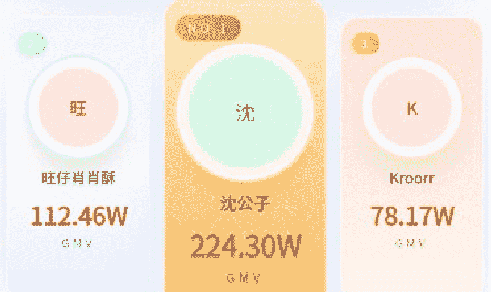
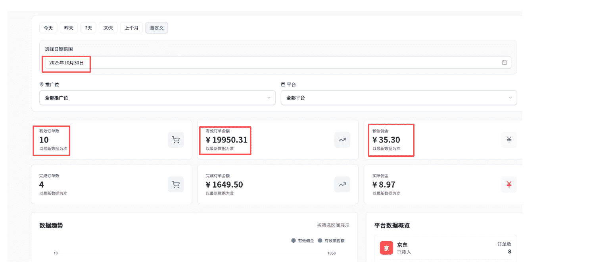
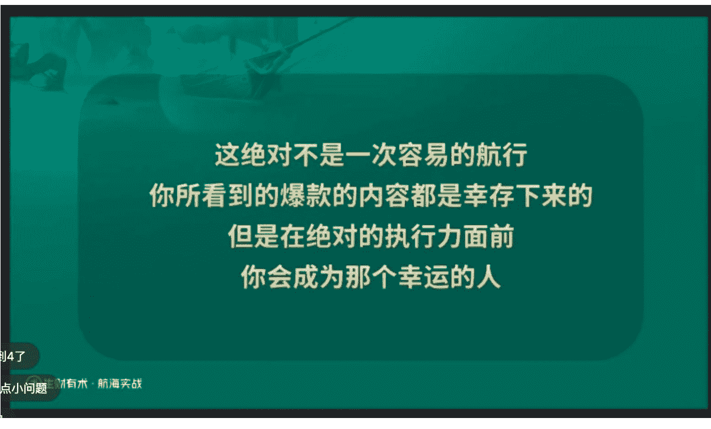
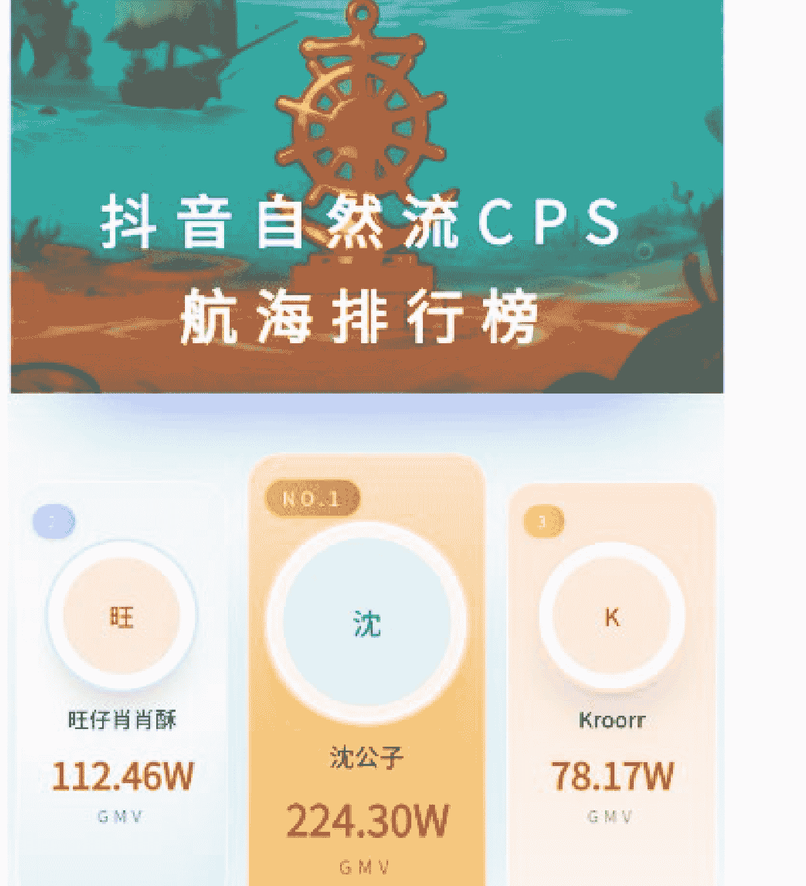

# 双十一跑出 200W+的 GMV，抖音自然流CPS 让我重拾信心

251201   副业 SC 精华

公众号懒人搜索，懒人专属群独享
懒人微信：lazyhelper


大家好，我是沈公子，

一个典型的i人，在生财“潜水”了4年半的小透明。

我参加过很多航海项目，但结局总是惊人的相似：兴冲冲地报名，迷迷糊糊地执行，最后悄无声息地结束。不仅没有拿到结果，自信心也在一再次的“重在参与”中被消磨殆尽。

直到这次，我登上了抖音自然流 CPS 这艘船。

在实操的第 16 天，也就是双十一当天，我这个没什么天赋的“笨人”，跑出了 200W+的 GMV。



这 200W 的背后，没有所谓的“独家秘籍”，只有绝对的执行力，像素级的拆解，以及对“搜索流量”这一玩法的极致挖掘。

今天，我不想只晒成绩单，我想把这十几天的经历，写给每个还在找项目练手，或者在过往的项目中备受打击、道心破碎的圈友，因为我太懂那种在谷底仰望光明的渴望了。

如果你也和我一样，被焦虑裹挟，在前路渺茫中反复内耗，甚至开始怀疑自己，那么希望我的故事，能给你带来一点光和热。

## 第一章：缘起

### 人不到绝境，是不知道自己真正要什么的

把时间倒回到一个月前，我的生活其实是一地鸡毛。

辞职在家已经三年多了，窝在一个并不发达的小县城里。这三年，我尝试过各种所谓的“风口项目”、“长期项目”，结果无一例外，全部石沉大海。

随着积蓄见底，我的心态彻底崩了。最窘迫的时候，我甚至需要找亲戚借钱交房租。那种张口借钱时的羞耻感，那种看着父母渐渐老去，生怕半夜接到他们的电话的那种无力感，像无数根针扎在心上。

在身无分文的时候，任何需要投入、需要漫长等待的项目都是毒药。

我当时对“副业项目”已经没有任何不切实际的幻想了。我对项目的筛选标准，已经简化到近乎苛刻的两点：

- 必须0成本：我亏不起了，一分钱的试错成本都没有。
- 必须反馈快：我的信心已经被磨光了，急需一点正反馈来“续命”。

直到看到怡然教练的抖音自然流 CPS 项目，那句“零成本、一个人就能干、正反馈快”一下子就击中了我。没有犹豫，我立刻第一时间抢占名额上船。

### 什么是抖音自然流CPS?

为了照顾刚接触这个概念的新手朋友，我先用大白话解释一下这个项目到底在干什么。

CPS：简单说就是“按成交付费”。我们不需要自己囤货、不需要发货、也不需要搞售后。我们只需要在抖音发布视频，视频里植入会场的密令词（或者通过标题里植入口令引导）。只要有人通过你的口令或密令词买了东西，商家就会分给你佣金。

自然流：意思是我们不花钱投广告（DOU+），全靠抖音算法给的免费流量。

### 为什么它适合小白?

- 门槛在地板上： 不需要你会拍摄（可以混剪），不需要你露脸（可以用表情包），不需要你有粉丝（新号也能爆）。
- 天花板很高： 就像我这次，哪怕粉丝不多，只要赶上双十一这种大促节点，推爆一个高客单价的品（比如手机），收益是非常惊人的。

明白了逻辑之后，我告诉自己：沈公子，这是你最后的机会，别再想东想西，干就完了。

友情提示：本文结合航海手册、高手领航，圈友@旺仔肖肖酥、@纳豆卡玛的精华帖食用，效果更佳。

## 第二章：破局之战

### 杀死那个“完美主义”的自己

开船第一场直播，教练就下达了一个“死命令”：24小时之内，必须剪出第一个视频并发布。

如果是以前，我会想：我的航海手册还没看完、我的账号还没养好、我的文案还没打磨、我的封面还不够精美……我会找出一万个理由拖延。但这次，为了那24小时的deadline，我逼着自己放下了所有的矫情。

10月28号晚上，我完全按照航海手册的指引，找了一个对标视频。那个视频很简单，就是几个表情包配上一段魔性的BGM，讲国补怎么领。

我打开剪映，手忙脚乱地操作。素材拼接得不流畅，转场很生硬，配音也有点奇怪，就连气口都忘了剪……

做完之后，粗糙得我自己都不想再看第二遍。但当时已经很晚了，我心里默念：“先完成，再完美！”。心一横，眼一闭，就点了发布。

奇迹发生在30号。

那天我像往常一样在剪视频，剪完后习惯性的打开后台一看——出单了！竟然真的出单了！



我到现在都有点不敢相信，那么粗糙的视频居然都能出单。

那一刻我的手都在抖。我不敢相信地刷新了一遍、两遍、三遍……数字还在！不是系统bug!

你知道这对一个失业三年、借钱交房租、自信心碎了一地的人来说意味着什么吗？

那一瞬间，我脑子里积攒了三年的焦虑、自我怀疑、对未来的恐惧，突然就裂开了一道缝，光照进来了。

我突然发现，我好像又找回了那种久违的自信了！正反馈真的是比黄金还要宝贵的东西！

我甚至都没有露脸，没有拍视频，只是把别人的视频拆解了一下，用剪映拼凑了一下，连气口都没有剪……哪怕是这样“60分及格”的作品，哪怕只有几百的播放，竟然都有人买单！

那一刻我悟了：

我们之前的焦虑，往往是因为想得太多、做得太少。我们总觉得要准备完美才能开始，要成为大神才能赚钱。

错！大错特错！

抖音自然流 CPS 真的就是目前最适合我们这种新手小白的项目。它不需要你有多高超的技术，不需要你有多完美的设备，只要你敢发，流量就敢给！只要有流量，就有钱赚！

这第一笔几十块钱的订单，对我来说比双十一的 200 万 GMV 都要珍贵。

因为它是一针强心剂，它狠狠地扇醒了那个自怨自艾的我，告诉我：“沈公子，你不是废物，你是能在互联网上赚到钱的！”

对于新手来说，信心从来不是别人给的鸡汤，而是账户里多出来的真金白银。

正是这个极其快速的“正反馈”，让我彻底放下了心里的包袱。既然这么粗糙的视频都能出单，那我如果再认真一点呢？如果我再多发几条呢？

在那一刻，我不再迷茫，不再内耗，我满脑子只有一个念头：干！往死里干！

## 第三章：核心技法

### 一、像素级拆解对标账号

有了信心，接下来的问题就是：如何持续生产能出单的视频？

我自知没有天赋，文案写不出花，剪辑也不炫酷，镜头表现力也很弱，所以我果断选择了做“曼波视频”，完美规避了我表现力弱的短板。

至于怎么做视频，我选择了一个最笨但最有效的策略——抄作业。但“抄”也是有技术含量的，不是无脑搬运，而是像素级拆解。

这里我要特别感谢圈友@耶耶 提供的拆解模板，我将其深化为一套“视频拆解 SOP”。这是我制作每一条视频前的必经之路。

#### 1. 寻找对标的三个标准

我们要找的是对标账号要符合“低粉爆款”：

- 粉丝少： <5000 粉，越低越好。
- 发布近： 一周内的视频（保证时效性）。
- 数据好： 点赞>100，或者显然高于他平时的水平。

#### 2. 建立逐帧拆解表格

找到符合要求的对标视频后，我会把视频下载下来，利用 AI 逐帧拆解视频内容。填进下面这张表格里。

| 时间线 | 镜头 | 画面内容 | 文字 | 图片 | 关键点 | 镜头表现 | 脚本逻辑 | 标题 |
|---|---|---|---|---|---|---|---|---|
| 00s-04s |  | 画面左边是戴“叛逆”眼镜的黄色卡通角色，右边是巨大的红包优惠券图。 | 10月23日国补优惠券领取保姆级教学<br>这个视频20秒带你喵羊毛 | 卡通角色、优惠券图、喇叭贴图 | 明确主题和价值 | 动画+图文结合 | 开篇钩子。直接点明“国补”“喵羊毛”主题，给出具体日期制造时效性，承诺“保姆级”“20秒”降低用户心理门槛，快速吸引目标用户。 | 狗东国补叠加双十一保姆级教程来了！这波优惠宝子们必须要拿到 |
|  |  |  |  |  |  |  |  | 标签 |
| 04s-10s |  | 依次展示短视频平台“分享”按钮、复制链接动作，切换到京东App图标，打开后自动弹出红包活动页面。 | 首先咱们先点击分享按钮，复制本视频链接，打开狗东会自动弹出会场页面，点击查看详情。 | App UI截图、手指点击动效 | 教程步骤一(淘口令模式) | 录屏+动画指引 | 建立信任，给出首个指令。采用“淘口令”机制引导用户互动（分享复制），用户打开京东看到自动弹窗后，会建立对内容的信任，为后续步骤铺垫。 | #国补领取入口#国补怎么操作#省钱攻略#双十一好物节#双十一优惠 |
| 10s-13s |  | 卡通角色在巨大的红包优惠券图前开心跳舞。 | 领取某东专享最高11111的无门槛红包。 |  | 强化利益点 | 动画展示 | 即时反馈和激励。紧跟第一步操作，展示“最高11111元红包”的巨大利益，给用户满足感，激励其继续按指引操作。 |  |

这里使用的AI工具是Google AI Studio，因为它具备强大的视频解析功能，能完美拆解对标视频。

如果是刚开始的新手，建议还是先手动拆解，这个过程虽然很慢，但对新手期至关重要，是真正的“磨刀不误砍柴工”。

因为只有你认认真真的仔细拆解了，你才能明白这个视频为什么会爆。拆解得多了，你自然就有了所谓的“网感”。后面做出爆款的概率也会变大很多。

AI工具虽然可以帮你提高拆解效率，但是里面的爆款逻辑还是需要自己一点一点地去吸收，才能做到融会贯通，把别人的优点变成自己的。这样即使不做这个项目了，碰到下一个项目，你也能从从容容，游刃有余。

### 二、DSO 搜索流量

如果说拆解对标是基本功，那么学会分析后台数据也是必修课。具体看哪些数据，航海手册和圈友的分享已经讲的很详细了，不再赘述。下面我主要讲讲我发现的异常点。

我在复盘后台数据时，我发现了一个异常的现象：

我的每个视频，流量有 98%都来自于“搜索”！

什么意思？

意味着用户不是刷视频偶然刷到我的，而是他们在搜索框里主动搜了“苹果 17 价格”、“国补怎么领”、“xx 手机测评”，然后顺着网线找到了我。

所谓搜索流量 VS 推荐流量：

- 推荐流量： 像在大街上发传单，看的人多，买的人少。
- 搜索流量： 像客户走进店里问“这款手机多少钱”，成交意愿极高！

这也是为什么我的视频播放量不高，但转化率奇高的原因。因为搜进来的人，本来就是拿着钱包准备买东西的。

为了尽可能的让人搜索到我的视频，我将之前在波波老板的抖音 DSO 获客航海里学到的知识重温了一遍。开始有计划的优化账号。

以下是我的优化逻辑，建议收藏反复观看：

#### 第一维度：关键词挖掘（地基）

不做无用功，要埋就埋用户会搜的词。

- 哪里找词？打开抖音搜索框，输入核心词（比如“苹果17”），下拉框里弹出来的那些词，就是“关键词”。
- 爱搜(www.aidso.com)：去搜一下关键词的热度，选那些“搜索人次高，但竞争度低”的蓝海词。
- 组合策略：核心词(iPhone17)+需求词(降价/国补/攻略)+属性词(Pro Max/白色)。

#### 第二维度：账号布局（权重30%）

让系统认为你是一个“专门讲这个”的专家号。

- 昵称：必须包含关键词。比如“沈公子数码(国补版)”。
- 简介：堆砌关键词。“专注苹果手机国补攻略，教你省钱薅羊毛。”
- 合集：这一点很多人忽略！创建一个合集，名字就叫“双十一国补手机推荐”。合集内的视频权重会叠加，更容易被搜索到。

#### 第三维度：视频内容优化（权重40%）

这是最关键的战场，我们要让算法知道这个视频到底在讲什么。

- 标题/话题：
  - 标题：不要写散文！要写说明书！公式=“核心关键词+长尾词+利益点”。
  - 错误示范：“今天天气真好，买个手机。”
  - 正确示范：“iPhone 16 Pro Max 国补立减 2000！双十一保姆级省钱攻略。”
  - 话题： 打满 5 个以上标签。#国补 #数码#苹果手机 #省钱攻略 #双十一。
- 内容/字幕：视频画面里，必须用大字把关键词贴上去。口播文案里，前 3 秒必须念出关键词。系统会识别语音和 OCR 画面文字。
- 封面：封面统一风格，并且在封面上用醒目字体写上关键词。让用户在搜索结果页一眼就看到你。

#### 第四维度：用户行为优化（权重 30%）

搜索排名不仅看匹配度，还看视频质量。

- 完播率： 再次回到我们上面的“拆解表”，前 2 秒跳出率最好控制在 40%以下。
- 互动： 评论区是 DSO 的战场。
  - 自己给自己评论：“苹果 16 的国补入口在这里（指路）”。
  - 回复每一个用户的提问，回复的内容里也要带关键词。
- 建议：每次发视频前，仔细地检查一下：标题有没有关键词？标签有没有满？封面有没有字？

其实，我所做的所有动作，都是为了增加视频的搜索权重，让视频尽量展现在前面，被更多的目标用户看到。借着这次总结复盘，我发现其实当时我也还有很多没做到位的地方。如果严格执行了所有步骤，应该会有更好的一个结果。

马上就要参加第二期 CPS 航海了，希望大家能得到一些启发，做得比我更好，获得更大的结果，加油!

## 第四章：心力与修行

### 守住最低底线，比假装自律更重要

说完了方法论，最后我想聊聊执行。

很多人失败不是不懂方法，而是倒在了情绪内耗上。

我必须坦白，即使跑出了 200W GMV，我也不是一个自律的人。赋闲在家这几年，我养成了很多坏习惯：熬夜、刷剧、注意力不集中。剪一条视频，有时候要磨蹭 3-4 个小时。

在这次航海中，我也经常会陷入视频发出去没流量的焦虑中。看着别人爆了，自己只有200播，那种挫败感是很真实的。

为了对抗这种人性弱点，我给自己定了一条最低底线：

> “每天两个号，每个号至少发两条视频。再烂、再粗糙、再不想动，也必须完成。”

- 今天心情不好？不管，发完4条再去抑郁。
- 今天视频只有10个播放？不管，发完4条再去复盘。
- 今天觉得素材枯竭？不管，去抄也要抄出4条。

也是因为我当时确实把这个项目当做了救命稻草，所以执行起来会更加坚决一点。同时，也因为之前有过正反馈，所以虽然做视频速度依然很慢，但我依然干劲十足。

因为我知道，自己的付出是一定会有收获的，这种确定性的感觉真的很爽！

这也形成了一个正向循环：正反馈来了，提升了信心，于是更能坚持下去。

### 放弃爆款执念，拥抱概率游戏

怡然教练每次直播结尾都会重复这样一句话“这绝对不是一次容易的航行，你所看到的爆款的内容都是幸存下来的。但是在绝对的执行力面前，你会成为那个幸运的人！”



我深以为然。在绝对的执行力面前，爆款就是一个概率问题。

我做的 40 多条视频里，大部分播放量都只有几十、几百。换做以前，我可能早就放弃了。

但过去的无数次失败，反而让我对流量有了平常心。

我深刻地认识到，在绝对的执行力面前，爆款只是个概率问题。 我要做的，不是追求下一个视频必爆，而是用持续的更新，去提高那个“爆”的概率。

我不去赌哪一条视频会火，我赌的是只要我一直在牌桌上，总会抓到一把好牌。

所以在发布视频的时候，只要视频有几十播放，我就认为它合格，然后立刻投入下一个。不内耗，不纠结。

参加航海的第 16 天，是双十一，活动达到了高峰期！我的总 GMV 也超过了 200W。



到此时，我总共只发了 40 条视频，其中大部分都是几十、几百播放，其中有三条破万播，最高一条破 4 万播放。

事实也证明，我的那几条破万播放、带货几十万的视频，都不是一发布就爆的。而是经过了几天的沉淀，配合搜索流量的上涨，慢慢爬起来的。

这也再一次证明，不用太过纠结播放量，只要不是0播，视频没有违规，就不要太过去计较它怎么不爆，只要持续的做视频、发视频、用数量来增加概率、总有一个视频你会爆。

## 第五章：写在最后

### 信心，是唯一的入场券

这个项目带给我最大的收获，不是 GMV，而是重拾了“信心”这个最宝贵的东西。

它让我深刻领悟到“先完成，再完美”的真谛。它用最快的正反馈告诉我：你走的每一步路，都算数。

就像那个“深挖搜索流量”的技巧，其实是我之前参加 AIDSO 航海学到的经验。当时觉得那个项目没做成，是失败的，但你看，那些踩过的坑、学过的知识，都在未来的某一个时刻，以另一种方式给了我回报。

所以，请务必相信，你过往所有的经历，都不会白费。

如果你也是一个新手，或者在过往的项目中备受打击、道心破碎，我真诚地向你推荐抖音自然流 CPS。

因为我深知对我们来说，一个项目能否很快有正反馈真的太太太重要了！它就像一针强心剂，能迅速帮你找回在牌桌上继续玩下去的勇气，充满信心的坚持下去，只要你不下牌桌，你总会成为那个幸运的人。

这会形成一个良性循环，让你能有动力继续在这个项目上深耕下去，减少半途而废的可能。

我想对所有还在观望、还在焦虑、还在怀疑自己的圈友们说：

别再等一个“完美的项目”了，也别再等自己“准备好”了。

先上场，把手弄脏。

先完成，再完美。

我们一起成为那个幸运的人。

我是沈公子，一个终于找回信心的长期主义者。

如果你也想交流DSO玩法，或者只是想找个人互相打气，欢迎随时链接我。我们在生财的路上，一起慢慢变富。

最后，安利小懒的付费群：

懒人专属群（介绍）


📖懒人专属群持续更新中，已持续运营6年，整理超3000份各类精选付费文章&年费社群干货，全部开放下载。

本资料为付费群内部分享，仅供真实有需要的朋友查阅🙏

懒人专属群更新记录：

```
https://hk57gv1x7u.feishu.cn/docx/H0kRdZbSboIBR0xkaXtcuVE0nTg
```

懒人专属群更新记录（需梯子，备用）：

```
https://lazybook.fun/blog/record2
```