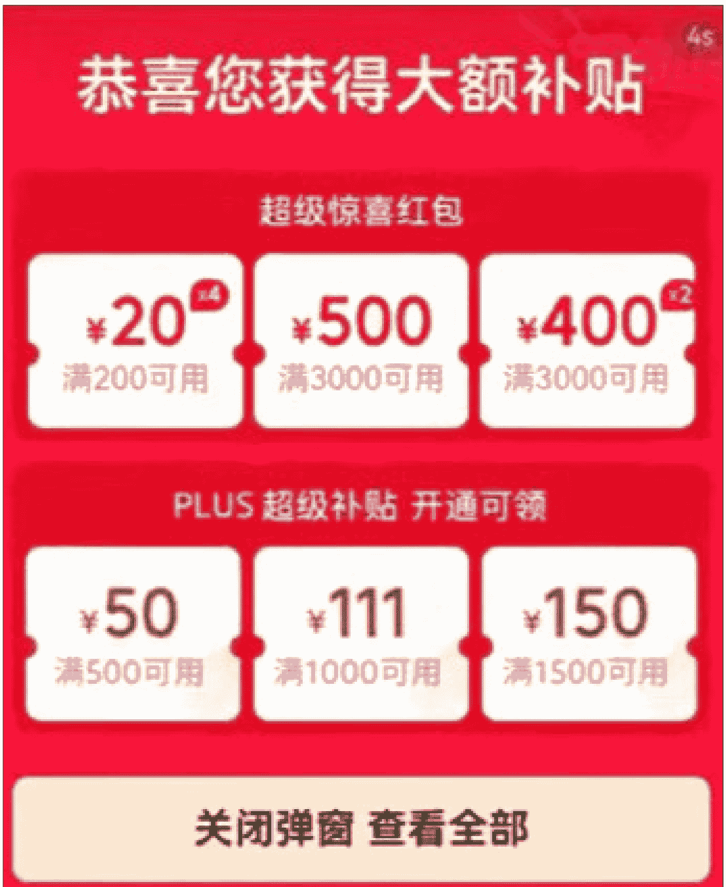
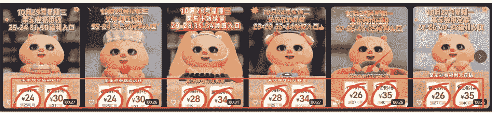
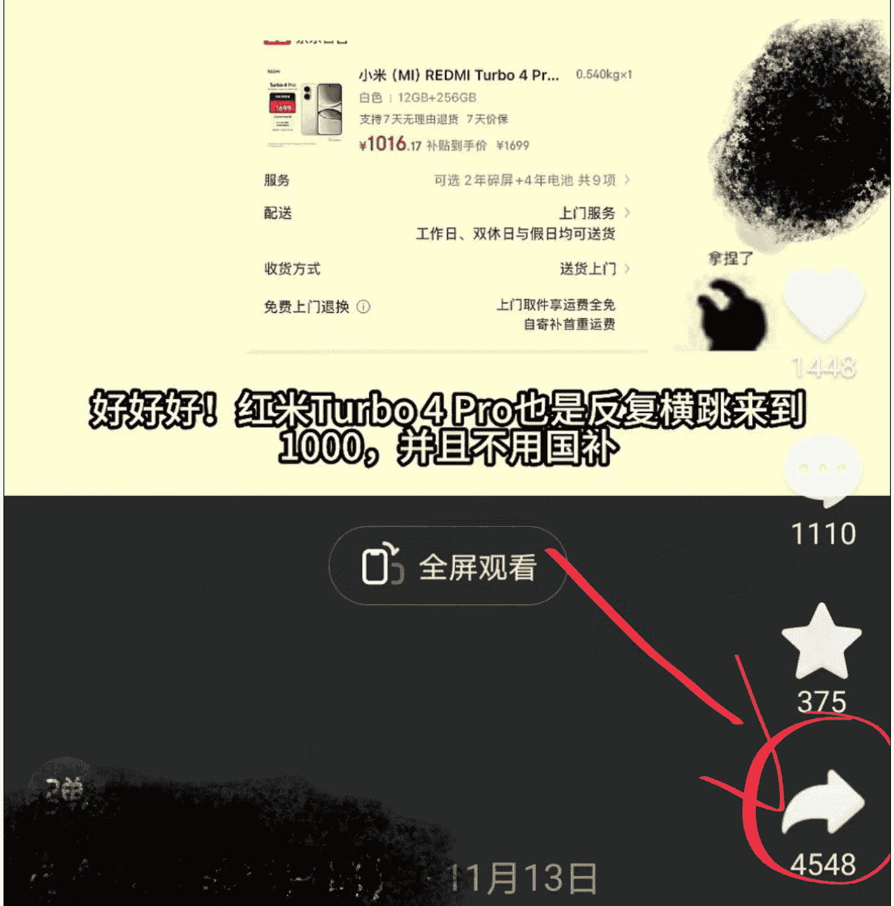
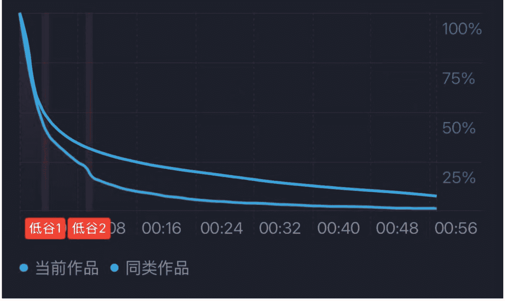
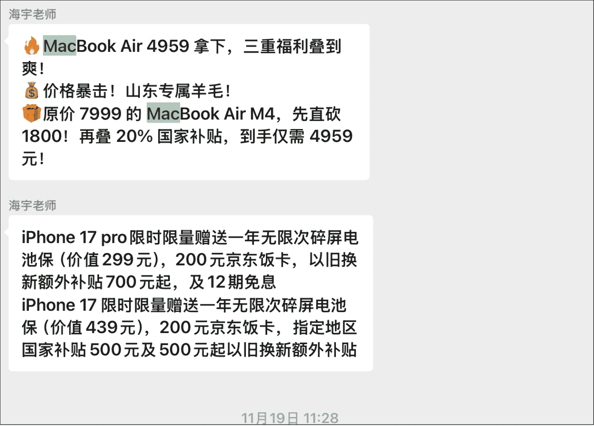
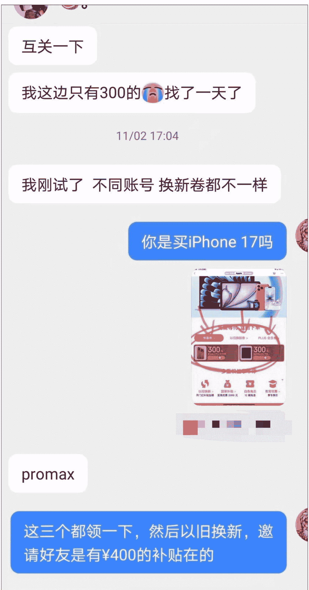

# 新手小白怎么从抖音 CPS 赚到第一块钱

## 251202 副业 SC 精华

公众号：懒人搜索，懒人专属群独享
懒人微信：lazyhelper

圈友们好，我是毛小雨。这次在抖音 CPS 做到了 5w 的销售额，排名 40/450。这些成绩虽远不及百万的大佬，但也跑通了第一个小闭环，赚到了第一块钱的佣金。作为第一期纯新手入局 CPS，想为大家分享一下自己踩的坑，也为这次刚报名 CPS 的伙伴们对齐颗粒度，梳理下我自己做 CPS 的流程和感悟。

## 第一期 CPS 的实操感悟

### CPS 的底层逻辑：种草

用户用了我们推广的口令/密令领取到优惠券，并用此优惠券下单。消费者以更便宜的价格买东西，我们赚取了一定比例的佣金，互惠共赢。

新手最开始要知道这个口令进去以后，实际优惠是什么、有多少，得理清楚这个逻辑才能做内容。比如“惊喜红包XXX”在平台搜索，弹出的界面是这样的，用户领取完红包之后，再下单再算到佣金里。

## 新人怎么入局抖音 CPS（美团外卖 or 3C 数码、家电）

### 把手弄脏，发布第一条视频，确定要做的类目

外卖是客单价较低、出单频次较高的类目，像下面这种类型：

手机、数码是高回报，但是需要持续发一段时间内容的类目。

建议：在双十一、双十二的消费趋势下，多钻研下手机、数码 3C 类目。也可以准备三到四个账号，分别做外卖和 3C 数码。
新号起量，一定要知道当下的流量品是什么。如果推 3C 产品类目，手机会场里主流的数码品牌有 Apple、华为、小米等。双十一期间教练建议只推 iPhone，不要用其他品牌，流量太小了；也有同行推其他品，那是老司机的从容，除非是新品发布。
> 小 tips：如果有可能，还是建议多点号，这样测试效率高。因为一个号测三天，其实和三个号测一天的测试答案是一致的。

### 找对标：怎么找对标，什么叫做好对标？

模仿好的对标，也算是测试不同的爆款模板。
可在抖音平台搜索“xxx 的羊毛日记”“羊毛”“攻略”“国补信息”“家电”“数码”等，建议选择一周内的内容。一开始就专注抖音平台即可，另外有很多同行发视频的标题里带有标签，这些都可以搜索到。

- 低粉（粉丝量少，1000以内的，避免买流量的嫌疑，我们有能力可复刻）
- 爆款（点赞>100，像这转发量大于点赞，也属于妥妥爆款，引导分享复制链接）

注意：避雷投流素材。我们主要做的还是自然流量，可以做下甄别，这种很难模仿出效果。主页内容数量较少、无长期更新动作的需避开。

（此处为截图数据：123.6万 获 1万关注 10.4万 粉丝 / 谢谢你的关注 / 作品 2 / 刚刚看过 / 78.4万 / 45.2万 / 暂时没有更多了）

## 口播 or 漫播（AI配音）类型？

口播有真人在镜头前说话、互动，自带一种真实的温度，能让观众愿意停留，考验的是一个人的表达能力和镜头表现。
- 优势：每天口播都是新的素材，而且比重大，同质化的可能性小。
- 劣势：一开始掌握不好视频节奏，没有情绪。

第一期「航海」课程我做了 30 多条口播，想着豁出去了，被熟人看见就看见。但是一开始效果不好，每条视频只能转化 1 到 2 单。要想真正做好口播，需要长期坚持和积累复盘，要注意以下几点：
- 需要像面对面讲述的感觉，调整眼睛的位置，不能明显在看词。
### 突出重点
- 视频风格一致，封面一致，背景统一。
- 信息要有及时性，不能滞后。比如在双十一期间，广东国补突然就可以用了，当时有几个伙伴及时抓到这个信息点，然后很快发视频收获了一波流量。

> 小 tips：如果做口播的话，在剪映里面有个智能剪口播的功能，可以直接一键剪出信息突出的效果。

### 私信

漫播配音类视频有各类素材在流转，更需要靠你的网感来抓住观众。表情包得能让大家看得进去，注意，表情包一定要有网感。比如下面的这个切片，主要是这 3 点做好了：
### 信息紧凑
- 网感表情包，有看下去的欲望。
- 可加上抖音常见 BGM。

两种类型都能取得好结果，可以根据自己的情况自行选择。不过我还是建议先用剪辑加上 AI 漫播配音的形式，这样门槛低。重点在于筛选网感表情包，然后搜集市面上同行的趋势和最新的信息点。口播同质化虽然低，但是不确定性高，新手上路做出口播爆款比较难。

### 做好利益点输出，建议先拆解好流量品

什么是流量品：就是近期卖得好、容易推的品。双十一期间是 iPhone，这个可以看同行谁拍的同类型多。
无论是什么类型，都要做好利益点的传递。用户看到我们视频就是为便宜买手机、找信息差，所以输出要紧凑，利益点一个接一个。
比如下面这段口播文案，一开始先吸引注意力，然后再说一些目前主流的手机品牌，把需要购买手机的用户留下来，然后插入自己想要推广的口令，最后评论区引导。

很多新手机上政府补贴了！大家注意。
那些没国补还没买手机的朋友，恭喜你们，你们赢麻了！当前双 11 期间可以抄底了。你们知道当前很多新款上 10 个点的政

府补贴吗？在东哥这边，OPPO Find X9 全系、一加 15、iQOO 15、荣耀 Magic8 不用领国补券，拍就有 500 的政府补贴。
之前 vivo X300 系列都上了，当前红米 K90 也有补贴，K90 Pro Max 还没来，但迟早的事情，包括小米 17 全系也不是没有可能的。各位这都是刚发布的新款，新款在短期双 11、双 12 不降价格的，基本拿个补贴就能拍。
各位如果当前还不知道哪些机型参与补贴，去搜【xxx】这里，当前能看到东哥哪些机型参与政府补贴。不过大家要注意，这个补贴是一会有一会没有的。如果还想拿东哥的双 11 补贴，搜【xxx】这里，可以领三次，可以叠加使用的。虽然目前量不多，但是可以先囤着。
最后，你们关注的心仪机型，评论区告诉我，我帮你留意价格，降价一定发视频提醒。关注我，双 11 买手机，我们一起抄底价入。

漫播文案举例：逻辑都是差不多的，第一句话吸引注意力。
- 所有人准备，晚上 8 点。
- 4,799 买 512G 的 iPhone 17。
- 因为 5 号双 11 开始，配合第四批国补，买苹果可以叠加教育优惠，国补至高五重补贴，4,799 就可以拿下 512G 的苹果 17。
- 主播熬夜啊，给兄弟们整理好了双十一苹果攻略，大家直接跟着我做就可以了哈。
- 首先打开东哥，在首页直接去搜 XXXX，先领一个双十一的专属大包，至高可以抢到 5 个券，不管买什么都是立减的。
- 下面呢重点来了，再返回首页，输入 XXXX，进去先选好地区，绑定国补资格，在右上角放大镜搜索苹果 17，进入苹果官方主会场，就可以看到苹果新的多重补贴。
- 如果你是学生党的，在东哥首页输入“学生优惠月”，完成学生认证，就可以享受教育补贴。
- 最后我们配合换新补贴，省下的不是一星半点，直接在我评论区留言。
- 顺便转发给你的 2G 网朋友。
- 一起试试哈。

### 视频节奏
#### 前两秒跳出率 + 前五秒完播率
播放量低，说明没有做好前三秒、前五秒。那就参考下对标，看看哪些细节不足（包括不限于文案跳出时间、剪辑特效等），逐个对齐。一般这两个指标到 40% 是合格线。

> 小 tips：一条视频多平台发，换不同表情包，在剪映里剪好模板，批量制作。我觉得学会投机取巧不是坏事，每天的时间有限，如果做好模板，一天发三到四条没问题。
模仿对标也算是测试其他对标模板。
### 模仿
视频标题可以直接抄，因为像这种标签都是搜索流量。比如：
`iPhone17promax 最后一波捡漏机会`
`#iPhone17promax #苹果 #上热门`
内容：漫播视频 → 文案 + 表情包 + BGM 稍作改动。

口播视频 → 文案稍作改动。
加一些近期的利益点放文案里，比如双十一期间的 iPhone 17 优惠券可以叠加使用到一千元（教练同步在群）。

个人建议：大家可以先把对标的文案扒下来，把对应活动的词换成自己的。先发布，把手弄脏，只要口令能跳转，就没啥问题。建议不要追求完美，先完成再优化。但是模仿不是搬运，文案改动下，表情包改动下，整体视频节奏不变。找到自己做视频的手感，做得多了再开始优化和创新。

### 跳出流量瓶颈怪圈，做出差异化
其实在模仿一段时间之后，作品的流量就会下降。经历过很多次一条视频只有几十个播放的情况，这种情况其实就是视频的同质化，文案和内容实在是太相似了，平台就不给推流了。可以去用 AI（豆包就行），去把原来的视频文案做一下修改，然后整体视频的节奏不变的情况下，更换其他表情包，或者说一些其他的流量品。

也有两种其他情况：
- 1、账号本身有问题，发什么都是几十个播放，甚至 0 播，这种就直接换号。
- 2、视频内容出现了敏感词。抖音等流量平台不希望站外导流，所以在视频内容、标题、评论和个签中要注意回避敏感词。如避免直接提及京东、淘宝等平台名称，可使用谐音词代替，如“东哥”“狗东”“某宝”等。

### 维护评论区和用户引导
像这种就是高转化用户，一步步引导后来下单的，评论区有疑问的可以私信去回。

> 对方确认聊天或互关之前，可发送一条消息：
> 11/02 23:40：这个国补是真的吗？
> 11/03 00:00：是真的，你按照视频操作可以，如果买 iPhone 17 还有 ¥1000 的优惠。
> 装扮：刚刚
> 为保障用户沟通安全，未互相关注的陌生人违规消息可能会被处理，请遵守法律法规和社区规范。

## 我们都是 在不断试错，等着属于自己的爆款
想都是问题，做才是答案。干中学，无论什么时候开始都不晚。成功做出一条爆款，成效大于几十条普通的视频。
反观我第一期参加的动作，其实就是找对标、拆爆款、发作品，找对标、拆爆款、发作品，找对标、拆爆款、发作品，以此循环。不要太在意自己发过作品，然后一直去盯着数据怎么怎么样，这个时间其实可以再多做下一条视频。爆款是不断改变变量测试出来的。

感谢怡然老师和海宇老师，助教团队带我入局，也谢谢你看到这里。
最后，安利小懒的付费群：
懒人专属群（介绍）

懒人专属群持续更新中，已持续运营 6 年，整理超 3000 份各类精选付费文章 & 年费社群干货，全部开放下载。
本资料为付费群内部分享，仅供真实有需要的朋友查阅🙏

懒人专属群更新记录：
https://hk57gvlx7u.feishu.cn/docx/H0kRdZbSboIBROxkaXtcuVEOnJg

懒人专属群更新记录（需梯子，备用）：
https://lazybook.fun/blog/record2