# 普通人如何通过 NotebookLM 构建自己的生意！【内含 NotebookLM 原创小红书虚拟产品方法论】

251202 副业 SC 精华

公众号：懒人搜索，懒人专属群独享
懒人微信：lazyhelper

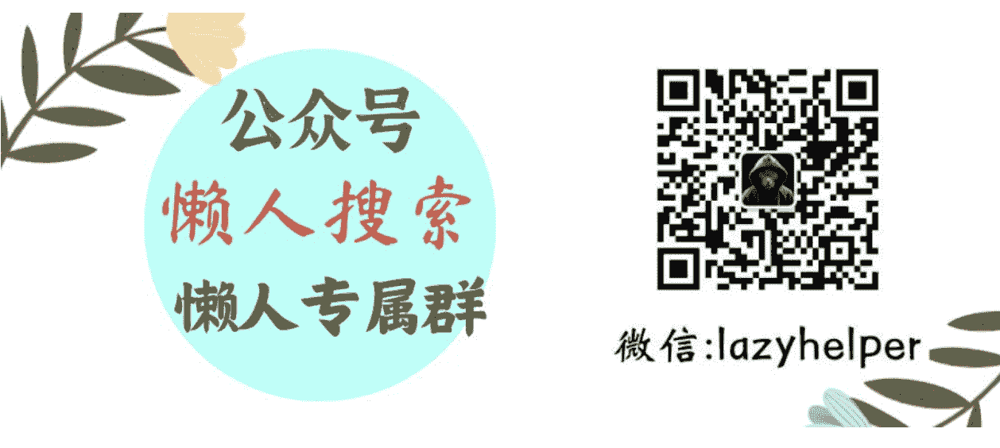

我强烈建议，每一个在互联网上做内容的人，无论你是在公众号、小红书还是抖音、Bilibili，并且你主要是知识领域的博主/创作者，一定要用 NotebookLM，日常把 NotebookLM 融入到你的工作流。

理由很简单，它真的太好用了！！！如果你现在深度使用 NotebookLM，你会有种强烈的 AI 推背感。并且我建议你一定要结合 Gemini 同步操作。

今天来分享下关于 NotebookLM 的用法，全网独家、全网最全！

## 01 什么是 NotebookLM

首先介绍下 NotebookLM，其实它是谷歌开发的 AI 驱动的研究和写作助手，它的核心功能是扎根于自己上传的资料。

简单来说，您先上传您的来源材料（例如 PDF、Google 文档、文本文件，甚至网站链接），然后 NotebookLM 就会成为一个只针对这些材料的“专家”。你可以向它提问、要求它总结、让它生成大纲或构思新想法，而它的所有回答都将完全基于您提供的资料库。

并且 NotebookLM 还可以直接读取 YouTube 链接，这对于大多数博主来讲是非常非常有用的一个功能，毕竟两个网站都是一家公司，彻底打通，构建 AI 生态。

NotebookLM 的优势也显而易见了，就是不会有幻觉，一切生成的内容都是来源于你上传的素材，所以这对于自媒体博主非常友好。

下面给大家分享几条关于 NotebookLM 的隐藏用法！！！
全网独家，建议转发/收藏/点赞！

## 02 NotebookLM + YouTube + 小红书

### 第一个玩法

如果你要在小红书做内容，当小红书博主，特别是一些专业领域，比如养生、身体保养、健身、个人成长等等，就是把 NotebookLM 和 YouTube 结合，当做你的内容外脑。

刚刚讲过 NotebookLM 和 YouTube 本身都是谷歌旗下的产品，所以两者可以完美联动，这也是谷歌的护城河，对于国内的内容创作者来讲，是一个非常有价值的信号和信息差。

### 具体怎么做呢？

如果你需要一些知识的积累，或者说你需要让你的内容变得专业性，需要找一些内容素材，传统的做法，可能你需要去不断看一个一个又一个的 YouTube 视频，通过自己的理解吸收，再成为你的内容支撑。这样做，会比较慢，同时也很难快速捕捉精华内容；现在你可以通过 NotebookLM 快速去捕捉你想要的内容。

举个例子，比如我是一名健身科普博主，我想要在小红书上发一些关于"2 区训练“的知识，我可以直接在 YouTube 上搜索 zone2，然后找到 5 个非常有价值的 YouTube 视频，粘贴链接到 NotebookLM。这就是你的优质素材库，你可以向你的素材库提问，提供给你更多的理论支撑和 idea。

公众号懒人搜索，懒人专属群分享

小红书专业博主的内容外脑：NotebookLM+YouTube
谷歌生态联动，国内创作者的价值信息差!

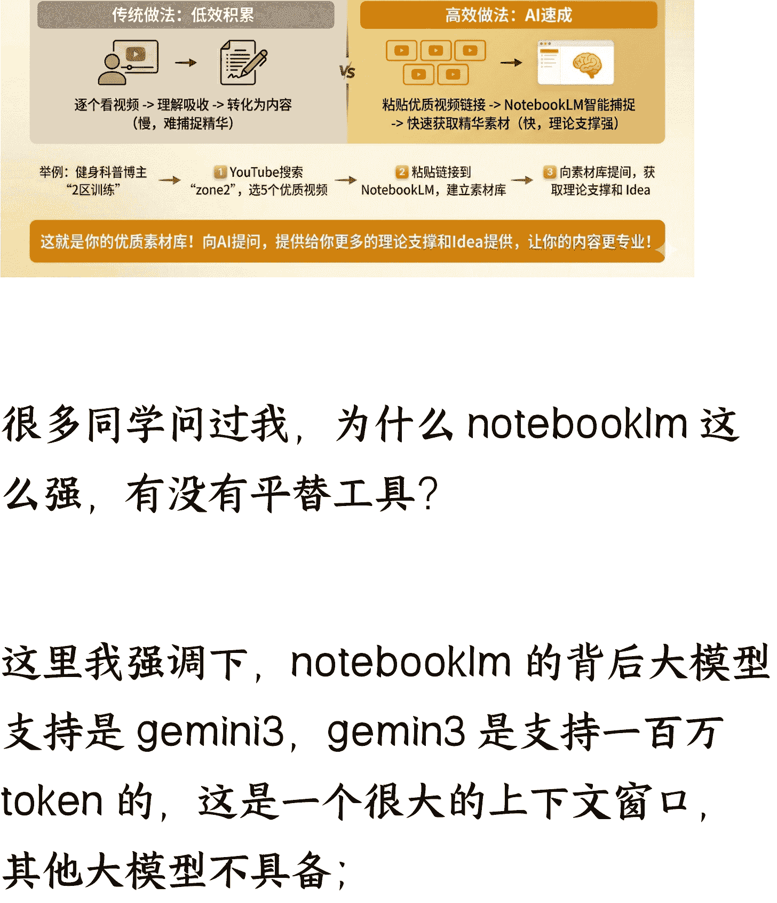

很多同学问过我，为什么 NotebookLM 这么强，有没有平替工具？

这里我强调下，NotebookLM 的背后大模型支持是 Gemini，Gemini 是支持一百万 token 的，这是一个很大的上下文窗口，其他大模型不具备；

其次，NotebookLM 的优势是给你生成的内容不存在编造，没有幻觉。不像其他大模型，你上传文件，就给你生成了很多乱七八糟的东西。

并且 NotebookLM 它是可以给你内容来源的，你可以看清楚每一个句子，它是怎么生成的。

比如，我会让 NotebookLM 直接给我反常识观点，它会给我一些基于素材的反常识观点，这样做的目的在于让我发在小红书上的内容变得更加立体，同时也符合互联网的传播规律。

### 除此之外，NotebookLM 还有一个非常非常王炸的功能，可以生成各种不同角度的报告，也就是说是对你给到的视频内容进行深度总结。同时，还可以根据你想要的方向生成报告。

举个例子，我想要一份普通人如何更好的 2 区训练指南，直接让它帮我生成就可以，没有任何难度。

这个指南也可以成为你的钩子产品，比如后续你想要在私域运营或者引流都可以用这个 PDF 产品，甚至你还可以把它直接当作文件上传到小红书。

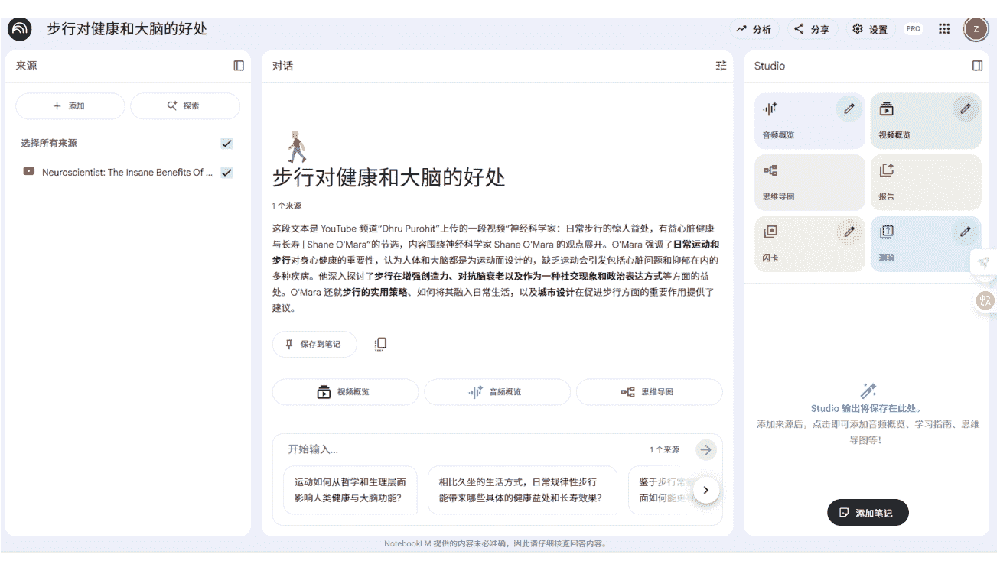

因为现在文件型小红书笔记的浏览量还不错；

公众号懒人搜索，懒人专属群分享

所以通过 NotebookLM，不仅可以让你的内容变得更硬核，同时还可以解放你的生产力……

NotebookLM 和小红书的完美结合，目前还有一定的红利期。

并且现在很多 YouTube 博主在小红书的流量很好，知名度也高，同时他们的内容是不断更新的，而你就可以通过 NotebookLM 打一个时间差。快速找到这个视频的精华内容，并且转化为小红书的语言，帮助你起号。

比如很多博主都是通过 Huberman 的视频进行起号的，本质上找到了一个博主给你的小红书账号做背书，你是一个翻译官，以及去整合和传播他们这些在某一个领域拿到了很大结果的博主。你也可以起号、接商单，因为你这个账号的背后，是优质的、拥有垂直标签的人群，非常非常有商业价值，这也是通过 NotebookLM【借花献佛】。

> 搜索示例参考：
> 比冥想更能缓解焦虑
> 斯坦福教授 Andrew Huberman 在 Cell 子刊《Cell Reports Medicine》发表的一项研究显示，“循环长息法（Cyclic Sighing）”呼吸比冥想更能最有效缓解焦虑
>
> Huberman 采蜜集 4 | 当脑科学撞上烟火气，皮质醇新知 vs 味觉的愉悦之旅
> 说话不烫嘴 09-02
> 谈一下最近大热的 Huberman Lab 的播客体验。他的内容实在太硬核了，其中有一小段我觉得非常有用，有必要单独拿出来分享一下。如何持续的做让你觉得困难的事情？
>
> 我坚持休伯曼教授的晨间流程 100 天后，人生仿佛开了挂

## 03 NotebookLM + YouTube + 虚拟产品

很多人纳闷，NotebookLM 就是一个学习工具（大多数人的视角），怎么可以做虚拟产品呢？

这就是看待事物的角度不同。

换一个角度讲，NotebookLM 和 YouTube 完美结合，其实是可以通过 NotebookLM 按照你的思路去重新组织 YouTube 的信息，这不就是内容策展的思路吗？最后你整合成一个只属于你的虚拟产品，这个虚拟产品有你的思想和组织，它本身也是原创虚拟产品。

就像面对同样的食材，厨师可以采用不同的烹饪方法一样，可以创造不同的菜肴，NotebookLM 也是同样的逻辑，去把你的想法和创意实践。

另外，NotebookLM 的优势是可以一次性最多同时针对 300 个 YouTube 视频进行处理，也就是说你的内容基础素材库是足够丰富的，你可以完全组织优质的信息源形成虚拟产品。

同时，NotebookLM 还有一个非常非常好用的功能，就是你可以根据你的特定需求，去直接做一个指南出来，所以你想要做什么都可以去让它生成。

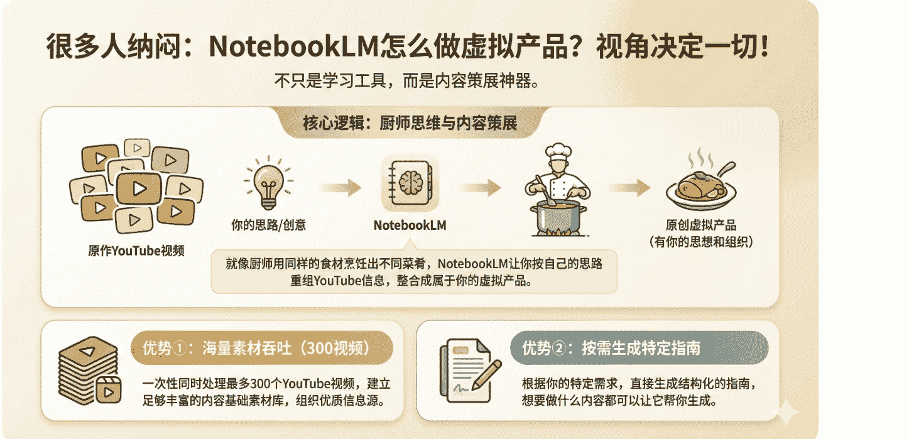

### 这是不是也已直接构成一个虚拟产品的 Demo？

当然，第一次生成的可能不满意，你可以让它多维度生成，也可以结合你生成的报告加上你的思路去重新整合，最终形成一份虚拟产品。

但是这里要注意，我建议虚拟产品不要只是完全照搬 NotebookLM 生成的东西，因为没有办法直接用，毕竟 AI 生成的东西有很多 AI 味。自己还是要做一个二次整理，并且要加入配图，排好版，不要让别人觉得你这个是纯 AI 生成的，毕竟消费者是花钱的，体验感还是要拉满的。

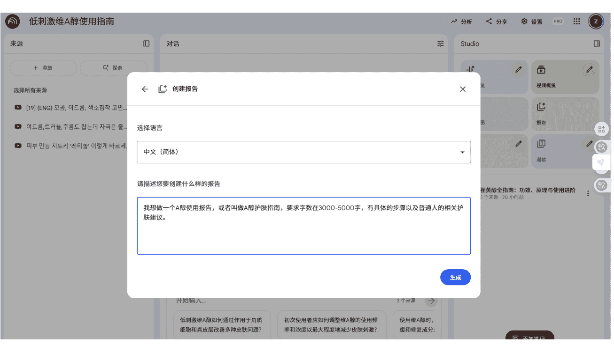

### 低刺激维 A 醇使用指南

这个 YouTube 视频片段由一位皮肤科医生提供，主要讨论了视黄醇 (Retinol) 作为一种强效护肤成分的益处和正确使用方法。专家解释说，视黄醇是一种视黄酸类 (Retinoic Acid) 成分，最初是作为治疗痤疮的药物开发的，现在是医生最喜欢的护肤成分之一，因为它能够减缓皮肤老化、改善痤疮、缩小毛孔和淡化色素沉着。尽管视黄醇效果显著，但它具有潜在刺激性，因此视频强调了初次使用时应采取的预防措施，包括从小剂量开始并逐渐增加使用频率。为了减轻刺激，建议将视黄醇与含有神经酰胺、胆固醇和脂肪酸等皮肤屏障修复成分的保湿剂，以及具有再生功效的积雪草提取物成分一同使用，并且最好在夜间使用以确保成分稳定和避免光敏性问题。

| 用户阶段 | 建议浓度范围 |
|---|---|
| 入门新手 | 0.01% - 0.03% (最高不超过 0.05%) |
| 进阶使用者 | 0.03%/0.05% - 0.1% |
| 高阶玩家 | 0.1% 及以上 |

#### 2.2. “餐厅试水”法则：如何选择第一支 A 醇产品
就像发现一家新餐厅，您会先一个人去“探店”，觉得不错后，再逐步带上朋友和家人。选择 A 醇产品也是同样的道理，必须从低浓度开始，给皮肤一个适应的过程。

#### 2.3. 建立耐受：从“隔日一次”到“每日功课”
“建立耐受”是整个 A 醇使用过程中最核心的环节。请严格遵循以下步骤：
- 从少量开始：取一颗豌豆大小的量，均匀涂抹于整个面部。
- 从低频率开始：初期建议每周使用 2-3 次，例如周一、周三、周五的晚上使用。
- 耐心观察：皮肤的适应期至少需要 2 到 4 周。在此期间，请密切观察皮肤的反应，确认没有出现持续的严重不适。

除此之外，还有一个隐藏玩法。就是可以把 NotebookLM 生成的虚拟产品当作钩子，直接在小红书上传，帮你涨粉，因为小红书用户天生是对干货有天然的喜爱，或者说成瘾。所以，你如果是客资行业，也可以去通过 NotebookLM + YouTube 快速制作虚拟产品，去帮助你涨粉引流客资。

## NotebookLM + 虚拟产品创作流程
- **传统视角**：NotebookLM = 学习工具（大多数人的看法）
- **创新视角**：NotebookLM = 内容策展工具（重新组织信息 → 创造虚拟产品）
- **核心理念**：内容策展思维。NotebookLM + YouTube = 按你的思路重组信息，整合成包含你的思想和组织的原创虚拟产品。
- **类比**：厨师与食材。同样的食材 + 不同的烹饪方法 = 不同的菜肴。NotebookLM 也是同样的逻辑。

## NotebookLM 核心优势
- **优势 1**：一次处理最多 300 个 YouTube 视频，内容素材库足够丰富。
- **优势 2**：根据特定需求直接生成指南，构成虚拟产品 Demo。
- **优势 3**：多维度生成，不断迭代优化，结合思路重新整合。

⚠ **重要提醒：二次创作的必要性**
- 不要完全照搬 AI 生成内容（AI 味太重）
- 必须进行二次整理和加工
- 添加配图、优化排版、提升体验感

**最终目标**：让消费者感受到专业和用心，打造体验感拉满的虚拟产品。
创新工具使用 · 内容策展思维 · 用户体验至上

> 文件型虚拟产品搜索示例参考：
> No.68 手绘插画风医学科普 PPT 模板...#ppt 课件...
> 小棉花 PPT 10-04
> 笔刷 + 背景填充 😎 快速搞定氛围感课件
> 马力 PPT 6 天前
> 26 春人教数学九下🔥全册教案课件试卷...
> 你醒啦？现在是 2005 年，是我们最幸福的那一年...
> 秃头研究所 M... 10-21

比如这些笔记，带文件标识的都是文件型虚拟产品，是可以拿到小红书更多的流量，而你可以通过 NotebookLM 对 YouTube 视频进行总结，自己手搓出来一个 PDF，挂在小红书笔记上，增添你的笔记内容厚度，帮助你拿到更多的流量。

## 04 NotebookLM 原创虚拟产品

最近 NotebookLM 迎来了重大的更新，这个更新功能基本上可以讲是改写了虚拟产品原创的难题，这个功能就是 NotebookLM 生成 PPT。

这个功能的优势其实是得益于 Gemini 的能力大幅提升，因为 Gemini 的中文能力大大增强，并且 Gemini 的能力提升很重要一点是对用户任务的高度理解，它不会去非常机械地执行任务，而是会理解用户背后地意图，这是质的飞跃。

而 NotebookLM 的 PPT 生成功能，其实就是 Gemini 根据你的指令和语料生成的一张张图片，最后整合成的 PPT，最后导出来的形式是 PDF。

我已经试验了很多场景，效果非常惊艳，特别是对于各种课件、学习资料、主题型 PPT，以上这些在小红书卖的比较好的虚拟产品，其实都可以通过 NotebookLM 进行原创，而且我认为生成出来的水平是远超小红书的商家的，非常非常好看。

### 给大家看几个我生成的效果

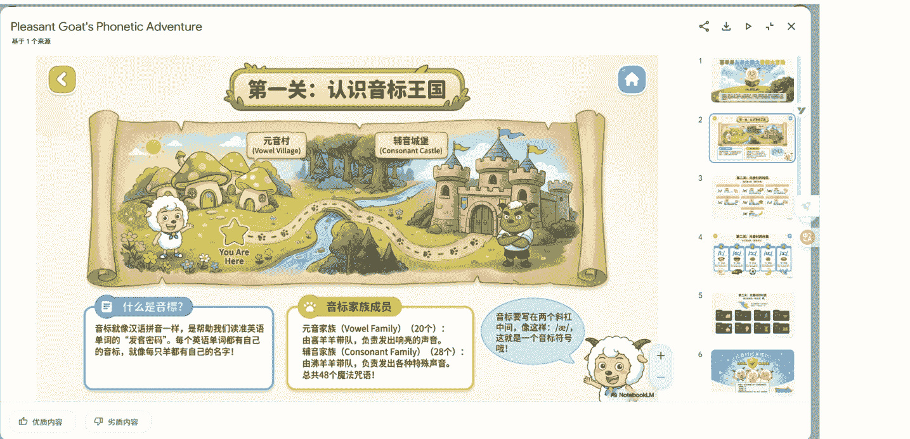
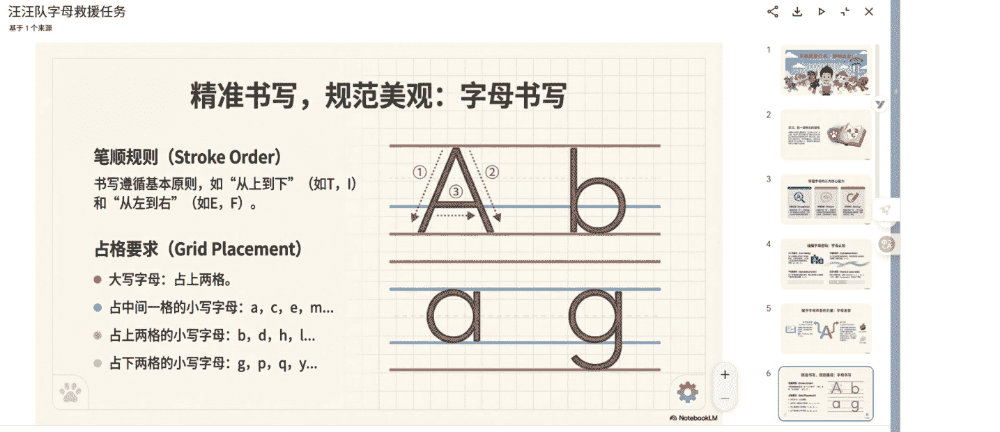
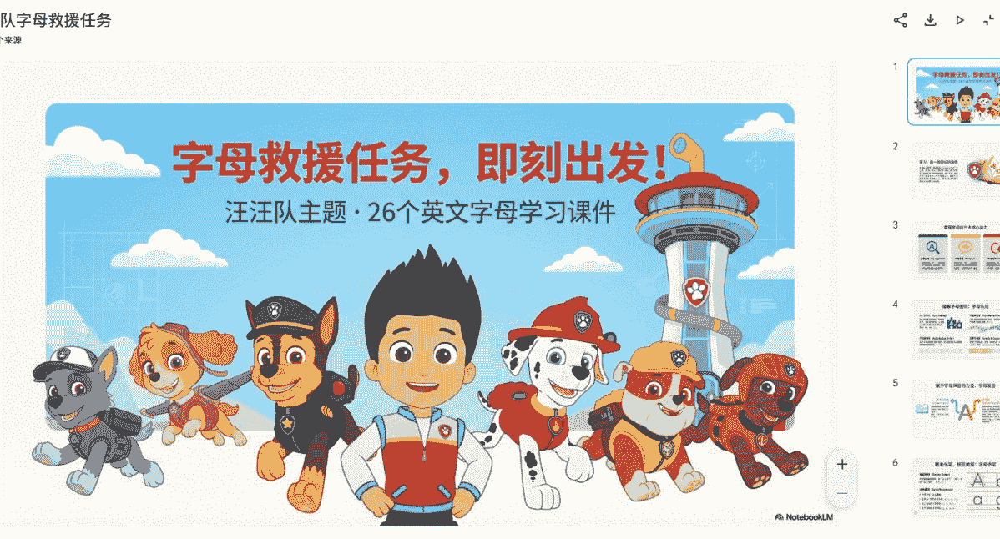

NotebookLM 可以理解你想要的角色、主题，你可以指定主题，比如汪汪大队、小猪佩奇、喜羊羊与灰太狼等等。不需要刻意给 NotebookLM 指定具体的 IP 形象，NotebookLM 会自动找到相关的 IP 形象融入到 PPT 里，这一点非常非常强，强到离谱，再次感叹。

那么，该怎么通过 NotebookLM 生成课件类型的 PPT 呢？步骤也很简单。

### 第一步，制作 PPT 的呈现内容

### 第二步，简述你的要求给 NotebookLM，让它帮你生成 PPT，比如你希望融入一些什么想要的板块内容，比如你的受众是谁？

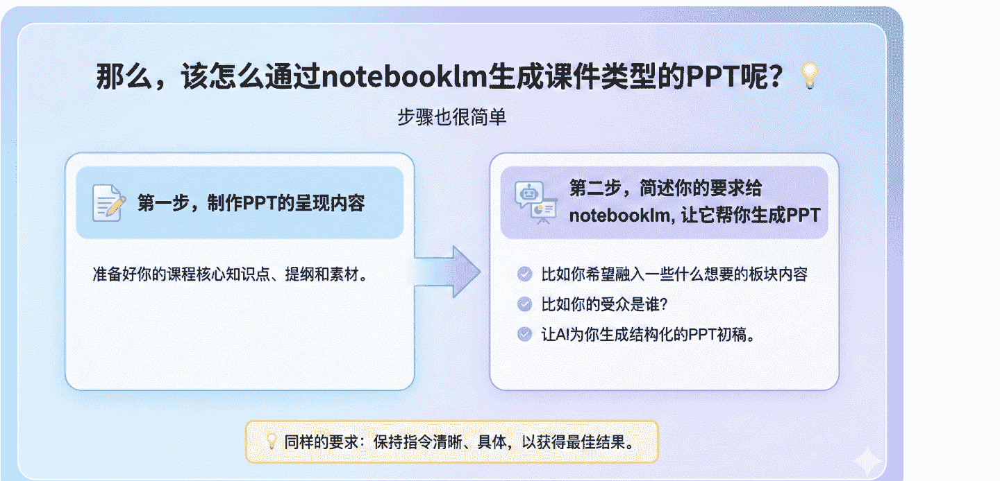

比如，我要复刻小红书卖的很好的一个虚拟产品，是《我与地坛》的读书分享 PPT。虽然以前也有所谓的用 AI 原创 PPT，但是以前的 AI 相关的 PPT 工具并不能完美呈现 PPT 的主题性，而是一直都在套模板，所以经常碰到驴唇不对马嘴的状况。而 NotebookLM 不会这样，它会知道你想要什么主题，并且所有元素都和这个主题高度一致。

首先，我先让 AI（任何一个大模型）生成了《我与地坛》的 PPT 内容。

### 第二步，直接让 NotebookLM 根据我的内容生成 PPT，没有任何提示词技巧，只是传达我的需求；

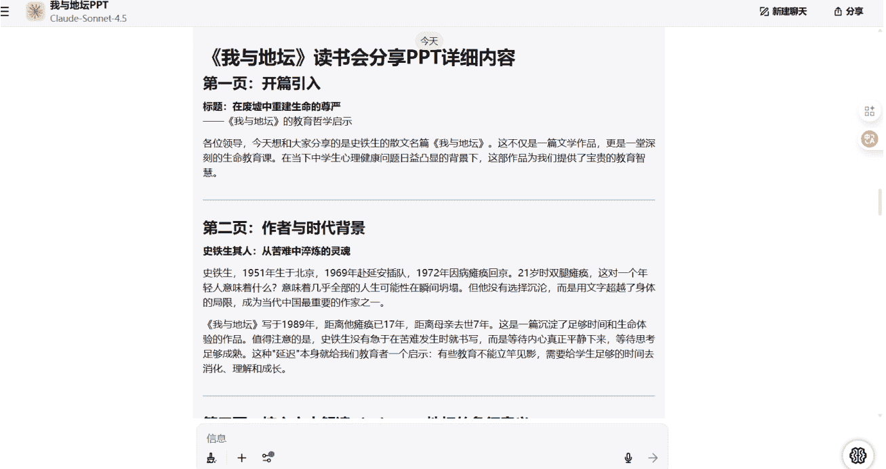

### 《我与地坛》读书会分享 PPT 详细内容

#### 第一页：开篇引入
各位领导，今天想和大家分享的是史铁生的散文名篇《我与地坛》。这不仅是一篇文学作品，更是一堂深刻的生命教育课。在当下中学生心理健康问题日益凸显的背景下，这部作品为我们提供了宝贵的教育智慧。

#### 第二页：作者与时代背景
史铁生其人：从苦难中淬炼的灵魂
史铁生，1951年生于北京，1969年赴延安插队，1972年因病瘫痪回京。21岁时双腿瘫痪，这对一个年轻人意味着什么？意味着几乎全部的人生可能性在瞬间坍塌。但他没有选择沉沦，而是用文字超越了身体的局限，成为当代中国最重要的作家之一。

《我与地坛》写于1989年，距离他瘫痪已17年，距离母亲去世7年。这是一篇沉淀了足够时间和生命体验的作品。值得注意的是，史铁生没有急于在苦难发生时就书写，而是等待内心真正平静下来，等待思考足够成熟。这种“延迟”本身就给我们教育者一个启示：有些教育不能立竿见影，需要给学生足够的时间去消化、理解和成长。

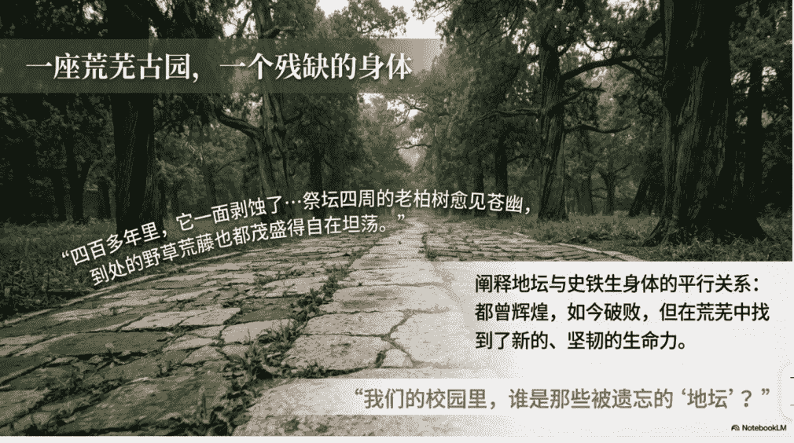

#### Temple of Earth Life Philosophy
> “四百多年里，它一面剥蚀了…祭坛四周的老柏树愈见苍幽，到处的野草荒藤也都茂盛得自在坦荡。”

阐释地坛与史铁生身体的平行关系：
都曾辉煌，如今破败，但在荒芜中找到了新的、坚韧的生命力。
“我们的校园里，谁是那些被遗忘的‘地坛’？”

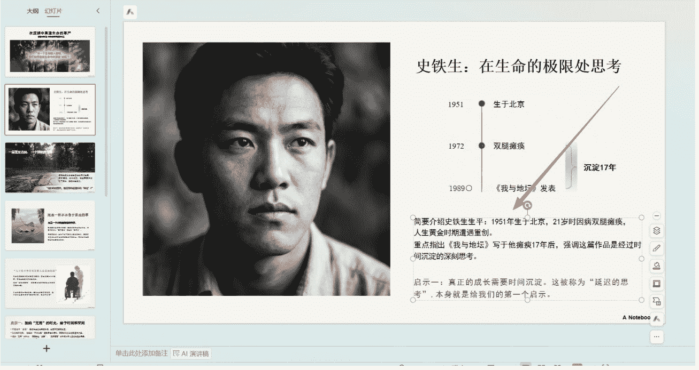

#### 史铁生：在生命的极限处思考
- 1951 生于北京
- 1972 双腿瘫痪
- 1989 《我与地坛》发表

简要介绍史铁生生平：1951年生于北京，21岁时因病双腿瘫痪，人生黄金时期遭遇重创。

重点指出《我与地坛》写于他瘫痪17年后，强调这篇作品是经过时间沉淀的深刻思考。

启示一：真正的成长需要时间沉淀。这被称为“延迟的思考”，本身就是给我们的第一个启示。

非常清爽的一个工作流，而且最重要的是，你可以通过 WPS 直接把 PDF 转成 PPT，变成可以编辑的格式。因为面对字多的内容，NotebookLM 对中文的处理效果还是很难，有一点乱码，并且假如你真的要打包成一份虚拟产品出售，这个 PDF 一定是要可以编辑的。

重要的是！已经真正完成了 notebooklm 出单，完成了自己的 0-1，并且目前还是在持续出单中！

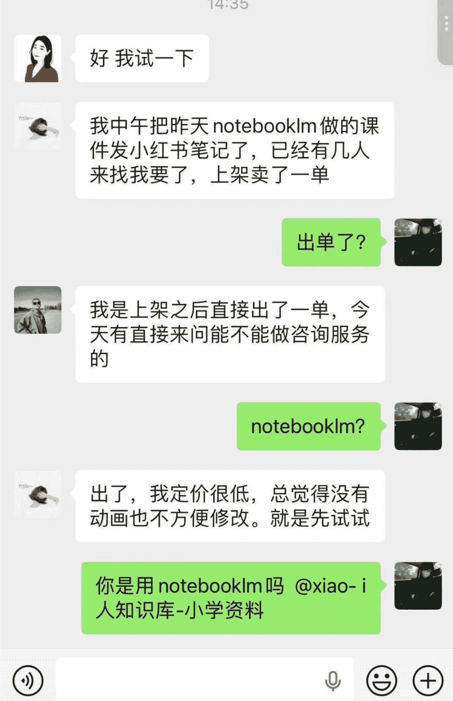

## 为什么能出单呢？
以及你如何通过 notebooklm 在小红书赚到钱？

## 第一个问题：为什么能出单？

小红书虚拟产品出单的关键不是选择一个你擅长的市场，而是选择一个多金繁荣的付费市场，两者有本质的区别，这也是我最新的感悟，分享给大家。

因为一个市场如果付费意识没有建立起来，你也很难唤醒用户的付费意识，吃力不讨好；但是大部人在选择赛道，都会基于自己的优势和擅长去做虚拟产品，这是思维惯性，最后没有正反馈就放弃了。

现在有了AI，AI的本质就是知识平权，专业平权。理论上讲你可以成为任何领域的专家。那么，现在应该做的就是去找一个多金繁荣的付费市场，这个市场的付费人数足够多，有足够强的购买付费意识，并且虚拟产品制作的难度不是很大。

显然，课件市场是一个不错的市场。尽管现在说课件已经很卷了，但是任何垂直的场景都有足够的机会，就像我上图的PPT制作，就是基于小红书热门商品进行复现的。

## 第二个问题：你如何通过 NotebookLM 在小红书赚到钱？
### 选择垂直场景，快速上架出单！

当我们选择了课件市场后，并不是说你卖什么都能出单，这个也不太现实，而是要选择一个垂直场景，因为你要快速上架并出单。

- 关键技巧：独立场景是王道！
  你用 NotebookLM 做的虚拟产品，这虚拟产品一定要独立场景，你做完这个课件，就可以上架卖。这类场景有什么呢？我举几个例子，你还可以继续挖掘：
  - 公开课
  - 主题班会
  - 读书分享会
  - 家长会 PPT
  都是针对独立场景的，你用 NotebookLM 做完就可以上架。你还可以继续挖掘！

- 避免的误区：高难度、低性价比
  而不是你要做很多课件才能上架。比如你要上架物理学科的课件，可能你要做一本书的课件，才能成为一个虚拟产品。这种虚拟产品对新手的性价比往往不高，且难度也很大。

去年的时候，哪吒2特别火，有的商家就做了哪吒2的《开学第一课PPT》，出单效果都很不错！

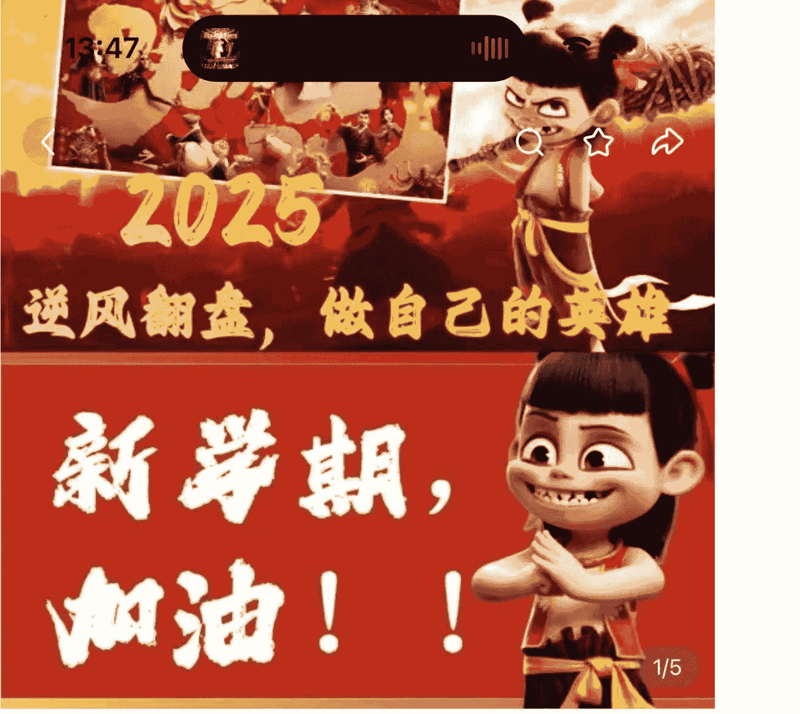

¥19.9
到手价 ¥9.9
已售3539
限时立减10元

## 2025蛇年开学第一节课（多款可选）
平均4小时发货 | 承诺24小时内发货，晚发必赔
广东河源 包邮
极速退款 | 不支持无理由退换 | 晚发必赔
已选：二年级 版本一（看图片展示）

## 开箱精选
小熊老师朋友圈
五年级哪吒精神开学第一课/开学收心课 祝大家新年快乐，...
店铺 客服 购物车
加入购物车 立即购买

## 浪浪山开学第一课班会课件PPT《新学期，敬勇敢出发的自己》
¥12.99 已售2606
- 900+人加购
- 3个月内1000+人购买
承诺今天发货，晚发必赔
晚发必赔 不支持无理由退换
加入购物车 立即购买

公众号懒人搜索，懒人专属群分享
13:46 | 2025
没有奇迹 只有累积
蛇年开学收心第一课
都是自愿来开学的吧？
A. 是  B. 否
目录
CONTENTS
01 我的趣味假期回忆录
02 热剧立意
03 重温班规

¥9.9 | 已售4759

## 2025蛇年哪吒精神开学第一课/开学收心课
100+人好评 | 1000+人加购 | 100+人收藏
平均4小时发货 | 承诺48小时内发货，晚发必赔
河南商丘 包邮
极速退款 | 不支持无理由退换 | 晚发必赔

通过 notebooklm 原创虚拟产品在小红书赚钱并不难，核心难点在于你能否挖掘出哪个PPT场景会有人在小红书买单，选择一个多金的赛道；

notebooklm 只是工具，关键还在于使用工具的人。

虽然目前 notebooklm 生成的 PPT 还存在一定的瑕疵，但是已经足够用了！

这就是 AI 的力量和价值！

## 05. NotebookLM + 你的一切语料

除此之外，notebooklm 除了可以读取 youtube 链接外，它还可以读取本地文件，所以它也可以结合你自己的一切语料去覆盖一些其他的工作/生活场景。youtube 上有很多博主已经分享了，如何高效把 notebooklm 覆盖到自己的工作生活场景中，比如最常见的一个场景就是求职找工作的场景。

很多人其实并不是了解自己，在找工作的时候，不知道自己的优势是什么。很多人就直接把自己的简历发给了 notebooklm，让 notebooklm 直接生成播客，去谈论你的简历。这样做的优势，你可以借助 AI，去挖掘你的隐性优势，同时发现你更多的闪光点。

同时，对于教师来讲，也可以通过 notebooklm 进行备课，因为 notebooklm 有闪卡功能，可以生成问题和答案，直接帮助你课堂测试都准备完了。

而我的用处也有很多！首先是素材的重新整理，比如我的一个典型场景是一鱼多吃。我有时候会跟别人分享，有时候也会跟别人做咨询，但是没有 AI 之前，很多语料都浪费了。

现在的工作流就很简单：先用录音笔记帮我记录原稿件，然后用通义听悟帮我转成文字，但是这只是初稿，这也是我给 notebooklm 的原始语料。

因为 notebooklm 的优势是生成的内容没有幻觉，不会胡说八道，所有生成的内容都可以溯源；所以，我会先确定一个和原始语料相契合的主题，当我缺少某一部分内容的时候，直接向 notebooklm 提问，然后它就会给我内容。

## 我的 NotebookLM 实战：素材重组与高效写稿工作流
告别语料浪费，实现内容“一鱼多吃”！

### 高效工作流：从语音到成品
- 1. 原始语料积累（录音/咨询分享）
- 2. 转录音文字初稿（通义听悟）
- 3. 导入 NotebookLM（建立专属语料库）
- 4. 定主题+精准提问（填补内容缺口）
- 5. 高效产出成品 Draft（快速写稿）

### NotebookLM 核心优势：靠谱、可溯源、提效
- 无幻觉（不胡说八道）
- 可溯源（所有内容有据可依）
- 提速率（快速提高写稿效率）

这就是 notebooklm 的优势，能够快速提高你的写稿速率。

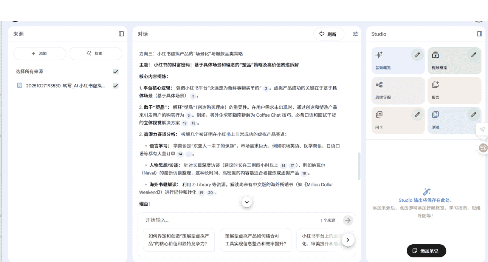

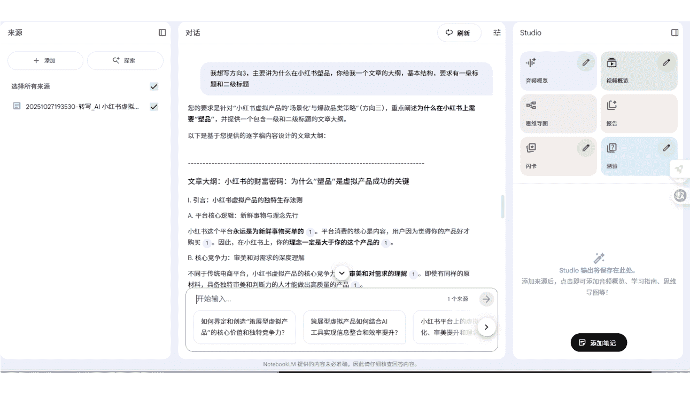

这也是一鱼多吃的 AI 玩法，它甚至还能帮你去写朋友圈，底层逻辑很简单，就是打碎、重组，这也是一种崭新的写作方法，内容策展写法。你拥有一个模糊的想法，你知道你想表达什么，你有一个原生的语料包，通过 notebooklm 去帮你重组，最终涌现出全新的文章，在互联网传播你的思想。

这就是 AI 的意义和魅力，总能够涌现出一些全新的“东西”出来。包装这篇文章的很多配图，都是通过 Nano Banana Pro 做的

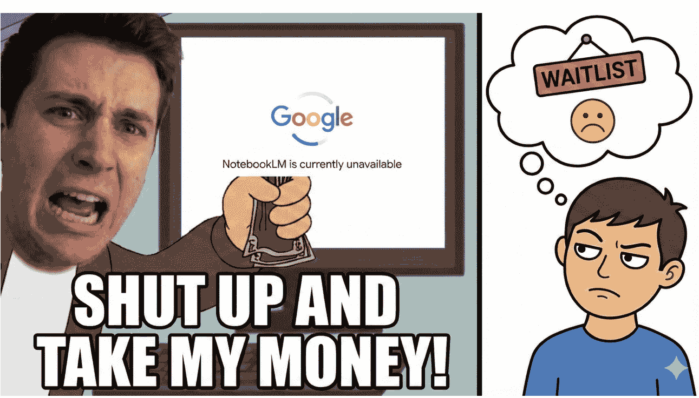

## 06. NotebookLM 的隐藏用法

这部分分享一下关于 notebooklm 的隐藏用法，很多人其实遇到 notebooklm 也一脸懵，不知道到底怎么用；基本所有人第一次想用 notebooklm 解读 youtube 的视频都会遇到一个问题，那就是如果你让 notebooklm 解读 youtube 视频，notebooklm 给你的大概其实并不会完全反映视频内容的价值。你也没有办法按照一个清晰的脉络去理解 youtube 视频，很容易造成内容信息的损耗。

### 那么，怎么办呢？

我推荐一个宝藏用法。因为视频都是有时长的，你只需要让 notebooklm 去按照不同的时长去总结就可以了。比如一个视频的时长是 60 分钟，你可以让 notebooklm 分别总结 1-20 分钟、20-40 分钟、40-60 分钟的视频。也就是说，你让 notebooklm 分别总结 3 次的内容概述，每次都聚焦在一个比较短的段落，3 次融合到一起，就会呈现更多的内容细节和干货。

同时，你可以通过 AI 学习 AI，因为现在是 AI 时代，必须要学会通过 AI 去获取知识。你可以直接问 Gemini，关于如何使用 notebooklm 的技巧。它会给你很多可以直接落地的技巧和提示词。

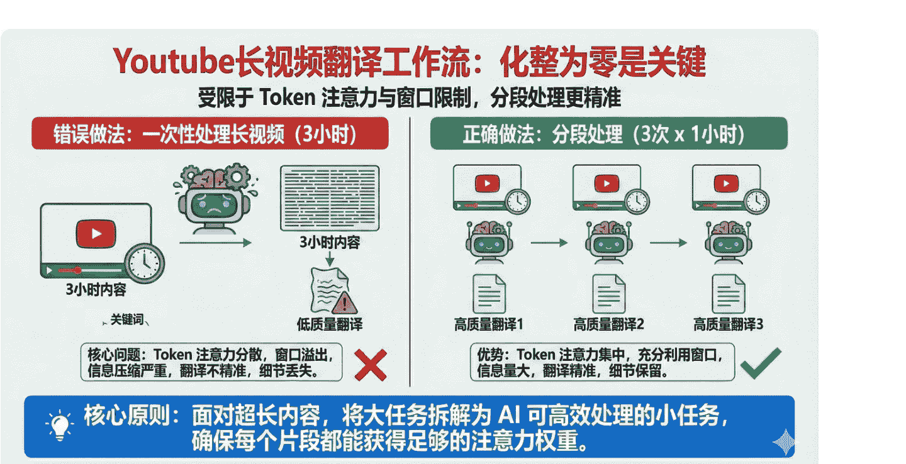

## 总结一下

notebooklm 不仅是一个学习工具，我认为它更大的优势，是能够帮助你在自媒体平台上打造你的生意。生意模式主要有三种：

第一种：通过 notebooklm 整理 youtube 的优质内容，把优质内容当作你的素材库，让你的小红书内容变得更专业，内容变得更加硬核，特别适合垂直领域的专业知识传递。

第二种：通过 notebooklm 去做虚拟产品，比如把优质的 youtube 视频整理下来。单纯的翻译不够，你还需要按照你自己的 ideas 对 YouTube 视频进行提炼总结，从而使你的内容变得更加有深度。

我插一句：我们要时刻去思考，我们给用户/读者呈现的内容是否满足了他们的需求，还是陷入了一种自嗨的怪圈？我看过很多内容策展型的虚拟产品，并不是策展，只是单纯的翻译，单纯的翻译并不能满足用户的阅读需求。

但是 notebooklm 是一个很好的内容重组工具，你可以让 notebooklm 帮你提炼重点，帮你去总结摘要，很多场景都需要你自己去挖掘。

第三种：就是你的个人IP打造，比如你有很多原始的语料，到底怎么通过 notebooklm 重新组织你的语料？都是可以去挖掘的。

总而言之，我是非常推荐 notebooklm，去帮你构建自己的生意。

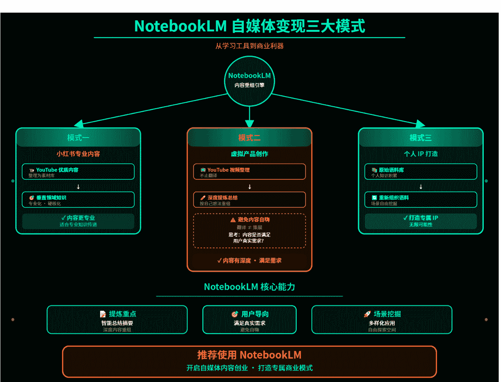

## 最后，安利小懒的付费群：
### 懒人专属群（介绍）

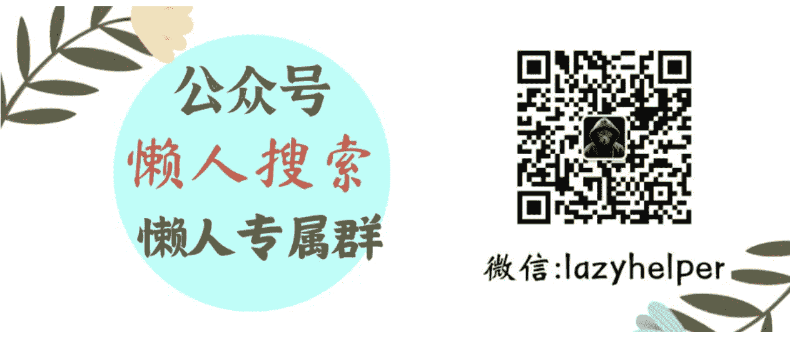

懒人专属群持续更新中，已持续运营6年，整理超3000份各类精选付费文章&年费社群干货，全部开放下载。

本资料为付费群内部分享，仅供真实有需要的朋友查阅🙏

## 懒人专属群更新记录：
https://hk57gvIx7u.feishu.cn/docx/H0kRdZbSbolBR0xkaXtcuVEOnTg

## 懒人专属群更新记录（需梯子，备用）：
https://lazybook.fun/blog/record2