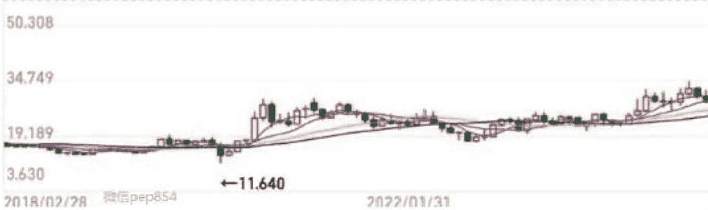

# 金银延续牛市，现在还来得及上车吗？

251203 A视野

整理：公众号懒人搜索，懒人专属群独享
懒人微信：lazyhelper

发现一个真实的世界

今年，投资圈极为炸裂的靓仔，应该是白银了。

其实，从2020年美股2次熔断的价格底部（11.64美元）到现在，白银价格早就涨到亲娘都不认识了。

假设，你是当时这个价格持有了大量白银至今，那你已经赚了多少%的收益？大家不妨心算一下，然后就知道有多疯狂了！

但是，近期，白银的走势更加“诡谲”。

一会儿，有传芝商所宕机引爆白银狂潮。

一会儿，中国库存位于近十年低位。

一会儿，伦敦上演“逼空大戏”，甚至都要挤兑了。

如此惊人的长期涨幅趋势，又在最近出现如此多狗血的剧情，以金银为代表的贵金属市场后市到底会怎么走？还来得及上车吗？已经有的仓位，又该怎么办？

A森今天给大家分享一些自己的市场调研、实践和思考的干货。

下面开始今天的正文，各位多多支持！

此前，美国国防部门，已经将白银纳入了战略储备的清单。这意味着什么？其实，市场近期的走势，已经给出了自己的“担心”。弄不好，后续川普会突袭式宣布，要对白银征收关税。因此，现在大量的资金，拼命的把全球其它地区的白银，往美国本土去运、去囤。

问题是，白银这东西，在全球的分布，是极为不均衡的。墨西哥、秘鲁、俄罗斯，光这三家的白银矿产，预计就有可能达到已知全球银矿储备的约7成。

然而，另一边，现在，全球都要实施“再工业化”。从中国的产业升级到美国的制造业回流，从印度制造要替代中国制造到日本靠军备武装来重振工业，类似的例子已经不胜枚举。可是，白银恰恰又是目前非常多重要的前沿产业绕不过去的关键上游原材料。

光伏产业，白银用于制备光伏银浆，是太阳能电池片电极的关键导电材料。电动车产业，白银用于电控、车载电子系统等，单车用银量较传统燃油车大幅提升。AI 产业，大量上游细分赛道需要用到白银。也就是说，白银跟当前全球非常关键的前沿产业，是直接绑定的，是不可或缺的。

与此同时，由于中国打出了稀土牌，让全球其它国家都充分意识到，关键原材料已经是兵家必争之地。这就像美国打出金融制裁俄罗斯一般，让全球其它国家意识到美元体系并不靠谱。所以，现在，大家加速争夺关键的上游原材料，也就是必然。由此，白银一下子，就获得了全新的工业属性赋能。

另外，我们这里还要提示，川普现在面临的 2026 年 11 月份的中期选举压力空前。因此，加速对外关税协议落实之际，也要加速美国制造业大量项目落地，已经是他绕不过去的一环。这也意味着，明年前面 3 个季度，是美国各种大量制造业破土动工的关键窗口期。试想，类似稀土、白银等大量重要的原材料，如何不受这波需求的影响？！那么，我们还用以往的视野看白银的工业属性，仿佛这就是一个周期股的概念，还符合现在的宏观环境真实情况吗？

此外，白银还是重要的贵金属之一，是具有真正意义上的金融属性的。当前，全球渐进式减少美元依赖，不把鸡蛋放在一个篮子里，也是各主权国家的基础微操。问题是，人家不信美元信用，未必就完全信人民币信用。那么，怎么办？所以，以对冲的思路，适度增配金银，就成了主要央行们铁定会干的事情。这就相当于，在美元信用不足的前提下，各国以人民币体系信用、金银信用做其它对冲池子，起码未来极端剧本下，可以最大化减少损失。于是，我们现在再来看金银市场的牛市，也就明白，除非极端事件出现，否则贵金属是易涨难跌。

一直以来，贵金属投资，是有其基础规律的。首先，几乎每一次，都是黄金先动，然后，间隔一段时间，白银尾随。这个不是没有道理的！实则，白银是以金价趋势动向为“锚”（中枢），然后，弹性会更大一些。毕竟，黄金是近乎纯粹的金融属性，白银除了金融属性外，还有工业属性。当黄金长期牛市格局已经成型，那么，白银的弹性远大于黄金的前提下，也就更加容易往上去蹦跶。

这个情况，目前是华尔街和美联储很不爽的。对于华尔街和美联储而言，最好全世界都用美元，这样他们就可以随意收割，再收美元铸币税，以及 SWIFT 的交易佣金。然而，现在全球的金融信用格局已经败坏到这个地步了，暂时是不可逆的。因此，阶段性打压金银，也是美联储和华尔街很希望做的事情。

不过，现在这一点是有难度的。以前，金银牛市没有来的时候，金银价格涨多了，主力砸一波空单，马上金银价格就很容易被控制住。就像 2014 年的贵金属熊市，现在已经可以完全看得出，当时并无实质性的重大利空。所以，完全是华尔街和美联储联手各种管道，一起打压当时已经繁荣了 10 多年的贵金属行情，为后续美元信用修复做铺路。

事实上，这种微操，美国人已经做了很多次，此前一直是相对有效的。然而，这次很不一样！现在的情况是，贵金属最大的玩家，各国央妈，纷纷下场。因此，只要华尔街和美联储联手去打压金银期货价格，全球各地总会有各种力量突然要求直接兑换为实物。可是，现在金银期货的规模远超实际的实物市场的规模。假设大家都要实物，不要期货单，这还了得？那岂不是要爆仓了？

今年我们的双节前后（国庆节和中秋节），伦敦出现了一轮白银的挤兑浪潮，原因就在这里。也就是说，现在华尔街和美联储遇到的问题，算是老革命遇到新形势了。只要你华尔街敢用期货市场去砸，人家就敢要求你直接实物交割。最后，你华尔街都砸不下了。当时的情况很凶，伦敦市场排队等兑换实物的，要等很久。甚至，最后变成了，伦敦的实物流向被炒高的纽约期货市场，而伦敦市场利用我们双节后市场的情绪回踩，拼命从全球各地虹吸更多实物，这才暂时稳定了局面。

于是，为何中国的白银库存近期大幅下降，为何近期芝商所宕机（拔网线）引发白银市场的阴谋论？这一切不是没有缘由的！

很明显，市场认定，华尔街和美联储联手努力压制贵金属的火爆，却又变得越来越难以实现这个目的，所以，这两位就微操频出了。既然如此，那么，市场自然也就更加愿意跟华尔街和美联储做对手盘。因为，强如美联储和华尔街也压不住金银的挤兑浪潮，尤其是白银的。金开始流血了，那还不上去捅刀子？！

其实，在 A森看来，我们完全没有必要关心什么阴谋论。请不要忘记，不管 12 月份美联储是否降息，明年，川普为了中期选举，也会让新的美联储主席往死里放水。这也意味着，美元实际购买力会进一步被透支。这波美元通胀，自然对于贵金属行情，是一个长期的支撑，也是最大的支撑。美债规模已经彻底控不住了，作为美联储和美国财政部对敲后产生的作品，美元超发，也就会彻底放飞自我。

这种近乎是明牌的基本面，将让国际资本更加关注贵金属，不管短期会有什么样的波动。所谓投资，而非投机，本质上，就是跟着趋势走。当金银牛市的趋势已经被美国自己的微操焊死，那么，跟着走即可，为何还要如此关注短期的价格小幅涨跌呢？！这里面，白银的工业属性的迭代，也就自然会使其弹性往上，比黄金更加有劲了。

因此，对于早早就建仓的选手，假设未来数年都可以不用建仓金银的这笔钱，完全可以“锁仓”，忽视短期波动，静候长期趋势下利润自行奔跑。然而，对于还没有持仓的选手，则静候后续市场情绪舒缓下来的机会。即，等这一小波行情走完，价格有回撤了，再关注上车机会。假设现在强行在市场最火爆的时候就上车，那么，反而是不智的。

投资，建仓价格（成本）有无优势，近乎决定你这笔投资能否成功的最大权重。这里，我们打个比方，帮助大家理解。假设，双节后，白银回撤了一大波，市场的情绪当时适度冷却了，你那个节点开始介入，也比现在直接上车要安全的多的多。

市场上讨饭吃，永远是：活得久才算真的活得好。本质上，就是钓鱼，不仅在有鱼的地方去钓，还要耐心等待最佳的时机买卖。

所以，对于还没有建仓的选手，或者觉得自己仓位太少的选手，假设 12 月份美联储突然宣布暂停降息一次，那大概率是鲍威尔给选手们的一个“爱的抱抱了”。这也提示我们，短线来看，美联储 12 月份的议息会议，是一个很关键的短线市场节点。如果降息继续，则市场还会往上冲一冲。如果暂停一次降息，则市场可能砸一下，这里面就有机会。

在 12 月议息会议结束后，下一个关键的节点，就是 1 月份的美国经济数据披露的窗口期。假设经济数据显示的是低于预期，则金银市场短线也要往上冲一冲。假设经济数据显示的还算中规中矩，则金银市场就要早早休整一波。各位，这两个短线的节点，还请务必记住了！

不过，A森是强烈提醒，普通人千万不要去碰期货，这东西不是一般人可以 hold 的住的。对于普通人而言，金银市场，优先是按照 “配置资产” 的思路去看待。

配置，意味着，你是在现金、房产、股权、存款、理财等不同资产中有一定的合适比例，最终追求的是整个“资产配置组合包”整体的收益率。因此，不加杠杆是很关键的要点！这也提示我们，实物类的、股票类的形式，相对更加安全一些。况且，既然是“资产配置”，那么，持有期限太短是不可取的。

这就像很多朋友，不管你现在的房产仓位多少，但是，你不可能随意买卖进出，哪怕是在楼市行情好的时候，也往往会持仓个把几年。请注意，这才是牛市趋势下的“资产配置”的体现！

对于普通家庭而言，贵金属的仓位，尽可能控制在 15%以内。这是当前中国经济陷入现金流量表危机时代的一个红线！既然是现金流量表危机，也就意味着，大家的现金流状况普遍比较脆弱、不稳定、鸭梨山大。而贵金属的投资，往往是需要一个足够的持仓周期的，否则就是韭菜。所以，在时间上，你的现金流的情况，有可能跟贵金属仓位持仓周期之间，存在错配的风险。那么，适度控制金银持仓的总仓位，不要破坏了你的家庭现金流的基础稳健，这是一条红线。

否则，你连整个家庭的现金流都无法覆盖支出，那你的这些金银持仓也守不住的。很多时候，牛市是很容易亏钱的。首当其冲，就是没有管控好仓位规模、现金流情况以及长期趋势这三者之间的张力。最理想的情况是，自己有一笔闲置、自由、长期的资金，专款专用。然后，你才可以气定神闲的按照自己的投资逻辑，去实践。我们最担心的事情是，建仓是一个逻辑，持仓是另一个逻辑，卖出是第三个逻辑。那就完蛋了。

截至目前，这轮以白银为领头羊的短线行情，后续还有多个风险事件的牵引，并没有到曲终人散的地步。所以，不妨先等上面提及的2个重大风险事件（12月份美联储的会议和1月份的美国经济数据）更加明朗了，再定夺上车、或者下车的投资策略思路。

PS：本文完全是个人思考的分享，不构成直接投资建议，还请知悉。

## 最后，安利小懒的付费群：

懒人专属群（介绍）

懒人专属群持续更新中，已持续运营 6 年，整理超 3000 份各类精选付费文章 & 年费社群干货，全部开放下载。

本资料为付费群内部分享，仅供真实有需要的朋友查阅 🙏

懒人专属群更新记录：
https://hk57gv-lx7u.feishu.cn/docx/H0kRdZbSbolBR0xkaXtcuVE0nJg

懒人专属群更新记录（需梯子，备用）：
https://lazybook.fun/blog/record2