# 万字拆解油管 AI 微创新工作流—2个月赚到 3000 美金的实战经验分享

## 251203 副业 生财 精华

公众号懒人搜索，懒人专属群独享
懒人微信：lazyhelper


我是壹欧壹，85 年生人，油管深海圈一员，目前专注于油管故事赛道。

曾经做过 8 年百度站长，擅长围绕 SEO 获取流量（最早结缘生财就是通过 SEO 圈子知道亦仁在做生财有术）。目前的主业是在公司内负责 AI 提效和 ERP 技术辅助等技术支持的工作，也就是用 Cursor 写代码。

2017 年时加入生财，第二年离开，跌跌撞撞 7 年后又回到生财。机缘说起来很奇妙，多年前种的种子，今日才发芽。

## 我们总是输，但偶尔能赢

2024 至今在生财参与过小红书电商、闲鱼手机、AI 写作、Cursor、AI 可视化...等航海，每次航海都跟，每次都是小结果。

所以又又又对生财的项目产生了怀疑，但幸运的是——这次我没有逃，没有下牌桌，我续了 2025 的年票，所以才碰到了油管这个既适合自己又踩在超级标上的项目。

现在回头想一下，无非是对自己和项目的判断出了问题。

## 幻觉和执念

小红书电商进入得很深，当时是对电商有执念的，因为疫情期间曾经跑通过一个通过"电商"变现的项目，所以误以为自己擅长电商。所以哪怕跟着刀姐的陪跑也没出成绩。

疫情期间摸索网站卖货，在 QQ 意外发现商机。后续通过电商+私域+SEO 自己研究出一条月入万元的赛道，维持了 1 年多。

2024 年 12 月后主要做 AI 代写和 AI 工具站。代写主要是选数据分析类，单月最高做过 1 万 3，选择数据分析也是几年前的积累了，写的工作 90%以上是 AI 做的，代写写手毫无疑问是很适合快速变现的项目。

AI 工具站则是完全基于执念在做，上线 20 多个游戏站和大小工具站至今没收变现（也就是收益不足$10 美金），今年年初尝试合作模式做过一款产品级的塔罗 AI 应用，简繁英语言。最终因为变现端出了问题，导致项目停滞了。

所以做项目也可能是在悟道——破除我执、认清现实。

## 为什么这次能赢？为什么能变现？

拆解一下我最执迷不悟的两个项目的变现路径：小红书电商和 AI Web 项目。

## 小红书变现条件

选品 > 笔记（视频、图文）+封面图 > 笔记评论区维护 > 商城上架 > 商城客服售后

AI Web 的变现条件：产品构思（比选品复杂点）> 搭建网站（支付设计、网站体验、搜索引擎友好）> 推广营销

油管变现路径：找对标 > 做视频

AI 代写变现路径：
写手端：找接单渠道 > 写作 > 售后
渠道端：找流量 > 找写手 > 售后

拆解完，相信大家也有判断了。普通人容易变现的项目，在路径上就很短。（这条理论也来自生财，但忘记是哪位圈友了 :)）

## 为什么加入深海圈？什么决策因素影响？

出了问题找不到原因：自己在生财有术通过精华帖摸索了半个月，做的儿童打电话、动物示警赛道。每个视频都有几万，但是卡万播，流量无法突破。也不知道怎么盈利，也不知道问题在哪，也没找到合适的人问。

经济压力迫在眉睫：疫情的影响，房贷车贷个人贷、公司降薪 30%、父母生意低迷。必须尽快找到新的现金流。结合自己对项目的判断，油管是目前见到过变现路径最短，生财变现成绩最多的项目。

油管变现速度加快了：今年年初听说油管 YPP 变现还要半年，然后见到 3 个月，1 个月。这个项目变现速度肉眼可见被深海圈加快了。

最终在波妮教练直播间潜水的 2 个月后加入了深海圈。

## 油管目前的成绩

1 个高级 YPP、半个初级 YPP。2 个小号刚刚起量。

深海圈 40 天，账号历时 33 天，开通第一个高级 YPP。

大号 1 亿播放左右（互动 6000 万左右），尝试过一条视频$1000 刀收入。

基本解决卡万播，可以稳定产几十万的爆款，百万每月不稳定出，千万看运气。

开发过的油管工具：
- 一套油管视频工作流（集参考视频记录、提示词优化、生图、生视频）
  https://ytmake.mrmime.org/workflows/storyboard
- 参与和优化：Vidu 自动化生视频工具、Grok 自动化生视频、Flow（Veo3.1）自动生成视频

## The brave desert warrior…

- 概览
- 覆盖面
- 互动
- 观众

## 此短视频自发布后获得了 1,185,470 次观看

观看次数
118.5万
比平时多 118.2万次


## 观众黏度

平均观看时长 · 从始至今

此视频尚无观众黏度数据。数据处理最长可能需要 2 天。

## 实时

- 信息中心
- 内容
- 数据分析
- 社区
- 创收

观看次数
3295.5万
比过去28天多16,471%
540.0万
360.0万
180.0万
0
8月31日
9月27日

你的每周回顾如期而至

## 热门内容

观看次数·过去28天
- 2447.7万
- #h…
- 511.0万


## 频道分析 过去 28 天

| 观看次数 | 观看时长（小时） |
| :--- | :--- |
| 3935.9万 | 10.3万 |
| 订阅人数 | 估算收入 |
| +1.2万 | US$135.08 |

## 视频分析

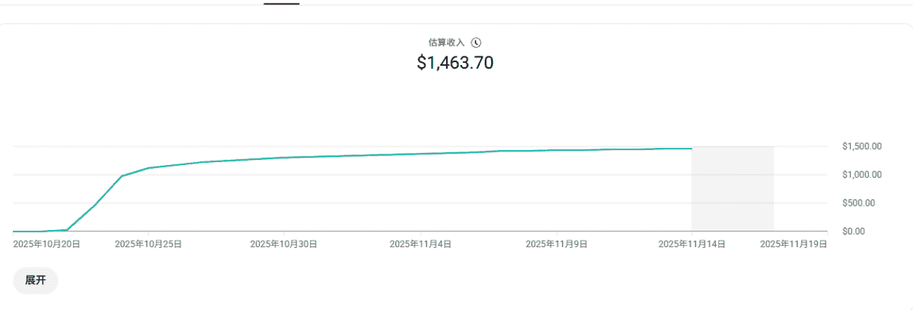

| 你的创收方式 | 短视频表现 |
| :--- | :--- |
| Shorts 动态中的广告 $1,463.70 | 互动观看次数 3,660.2万 |
| | 每千次互动观看收入(RPM) $0.04 |

## 我的方法：油管微创新刻意练习方法及实操提效方法

## 一、引言

个人改出来的脚本是很珍贵的个人资产，是故事赛道的核心杠杆。改爆一个血赚，改不爆也能攒经验。

### 微创新脚本的定义

#### 狭义的微创新脚本

对剧情进行合理改编

#### 广义的微创新脚本

换 IP、换形象、叠加元素
对剧情进行合理改编

### 那么微创新的作用是什么呢？

#### 现阶段的定义：
- 降低赛道内的同质化
- 充分理解爆款脚本公式和变量
- 为稳定产出爆款打基础、自动化做积累准备

#### 目前已知微创新脚本更适合的场景：
- 扩大已有爆款的收益
- 在赛道白热化竞争时脱颖而出
- 赛道间错位竞争

## 二、核心理论

https://shengcaiyoushu01.feishu.cn/minutes/obcn5weuli2f656n7i384ukn 大家可以仔细研读这场油管直播。

Gary 曹教练：经过这几个月的探索，YouTube shorts 的爆款规律已经很明确了，非常简单，好形式+好脚本+较低同质化程度/较高原创度=爆款，这个大家已经验证了。那么怎么进一步放大收益？怎么把一个爆款变成 1000 个爆款？

其实很简单，1000 个爆款=1000/n 个好形式*n 个好脚本，你有多少在库的好形式积累？你有多少在库的好脚本积累？两者相乘就是你能做出来的爆款数量，形式有多少？太多了

地区风格：印度风、欧美风、日韩风
经典的球星：梅西 C 罗、库里詹姆斯
大热的 IP：山海经、KPOP、星期三
随便乱编都有流量的动物形象：猫猫、狗狗、卡皮巴拉、猴子

## 三、行动纲领

Gary 曹教练：不要卷细节，要卷脚本和形式
Nana 教练：保证选择观看率+完播率
选择观看率：比较好解决，保证前 3 个分镜以及爆款开头即可
完播率：视频时长、略带夸张且合理的分镜设计（爆款元素叠加+逻辑紧凑+情绪饱满）、回旋镖结局
Zero：重新找 10 个最新的优质对标，每天看 30 个爆款！（除了刷还要写笔记）
- 每一个片段，播放长度不得超过 2.5 秒
- 每一个片段，尽可能地加入爆款元素（把合适元素堆进去就完了）
- 每一个片段，在传达完片段的核心信息后，尽可能地增加信息密度（每个分镜 2-3 个动作，每个人物都要有动作）

## 四、如何理解"低同质化"和制作爆款？

复习一下深海圈的【视频对标影响因子评估表】，其实曹教练已经给出明确的理论和方向。

> "该视频的同质化程度，同形象、同元素、同脚本的内容多不多？流量有多大？质量高不高？"

山海经复刻真人的同质化评语：用 AI 复刻真人赛道、画面不同、脚本微调、错位竞争，基本没有同类内容。

这两天重新理解了一下这段话，其实这段话最关键的要点在于——错位竞争。

因为赛道、画面、脚本都做了改编，这本质上是一个全新的脚本，再叠加上爆款因子(元素)。那这就是一条大概率会爆的视频。

> "控制同质化本质是选择竞争烈度"

★分析到这里就可以理解张九月圈友对同质化的判断了——

因此我们可以得出一个爆款公式:赛道 * 脚本 * 爆款元素

赛道:影响最大。常见的方法就是换IP、换形象
脚本:第二重要因素,也是比较难的部分。对脚本的非关键分镜进行改编。
爆款元素:等同于爆款因子。爆款元素是增加爆款率,对于去同质化影响有限。
次要因素:
制作质量:比较个人的因素。一般提到80分后就很难再进一步了,所以不在本次分享的讨论范围
画面:复刻的视频都自带了画面改造

### 通过选题规避同质化

摘自:
- 早期:蓝海市场,供小于求
- 中期:正常市场,供需平衡
- 后期:红海市场,供大于求

| 市场阶段 | 爆款选择优先级 |
| :--- | :--- |
| 早期（蓝海） | 同 IP 爆款 > 跨 IP 爆款 > 真人爆款 |
| 中期（正常） | 跨 IP 爆款 > 同 IP 爆款 > 真人爆款 |
| 后期（红海） | 跨 IP 爆款 > 真人爆款 > 同 IP 爆款 |

改编原则：蓝海市场，改编越少；爆款越近，改编越少；真人爆款，改编越少

### 通过换 IP 和脚本去同质化爆款案例

| 赛道 | 脚本内容 | 爆款元素 |
| :--- | :--- | :--- |
| 原拉布布赛道 | 原脚本的核心：偷食物、摆脱追捕<br>原脚本：偷食物——被店主追——摆脱追捕——吃了一口食物<br>改造1：砸橱窗——偷食物——被店主追——摆脱追捕——结局（公益、升华）<br>改造2：砸橱窗——偷食物——被店主追——摆脱追捕——主角变美人鱼跳水<br>改造3：砸钱罐——拿食物——被店主追——店主找零钱——跑到公园玩——吃了一口食物 | 奇趣蛋、东西变大<br>奇趣蛋、砸玻璃、东西变大<br>砸玻璃、美人鱼、跳水、喝药水、奇趣蛋<br>砸钱罐、金币、奇趣蛋 |
| 原动物赛道 | 原脚本：买果冻——付钱——骑车回家摔倒——被 NPC 破坏果冻——被小朋友安慰——和小朋友一起骑果冻<br>改造1：买果冻——付钱——骑车回家撞到 NPC——被 NPC 破坏果冻——被小朋友安慰——和小朋友一起骑果冻<br>改造2：砸金蛋——买果冻——NPC 拿着中奖牌追——NPC 和主角被采访——主角登上舞台 | 发光果冻、砸果冻、被追<br>金币、砸玻璃、砸果冻<br>砸金蛋、发光果冻、MVP 结算 |

### IP形象微创新降低同质化

好形象一定是适合你的账号的，爆款 IP 想象是一个好底子，在好底子上找合适的形象。所以好形象一定是独属于个人的，比如轻舟教练用 KPOP 的形象。

这里旨在抛砖引玉：衣服破烂的、干瘦、学生、可爱的。

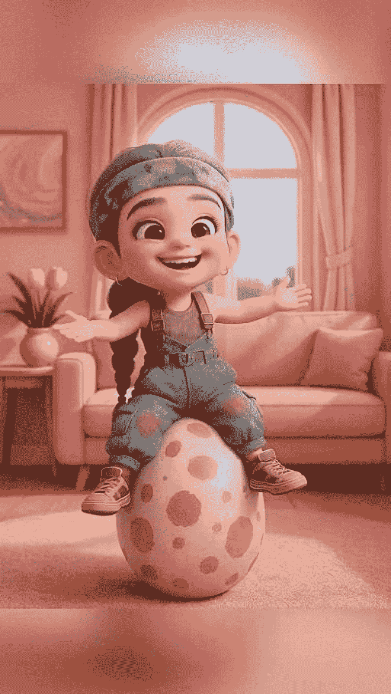

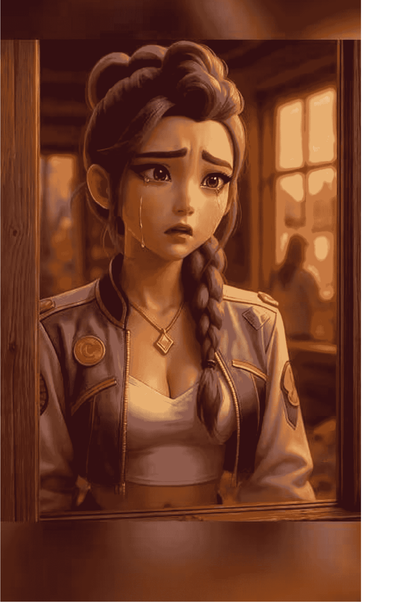

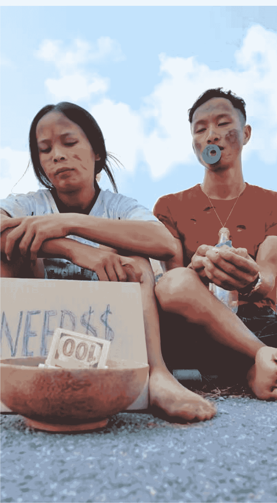

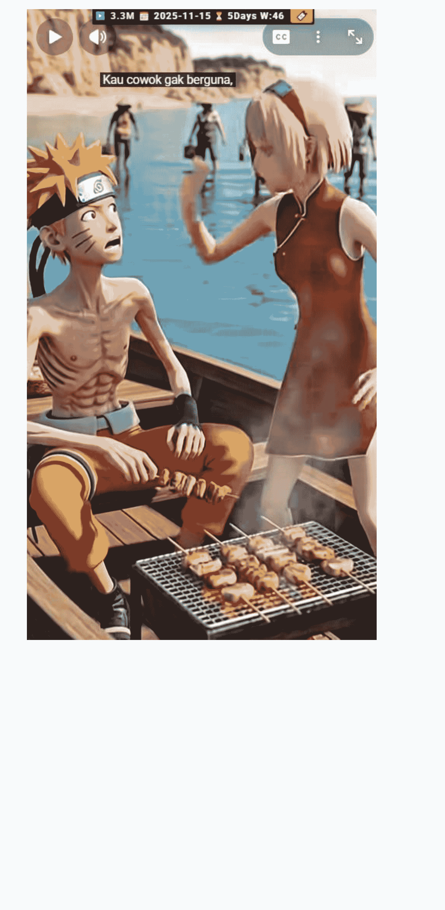

Kau cowok gak berguna,

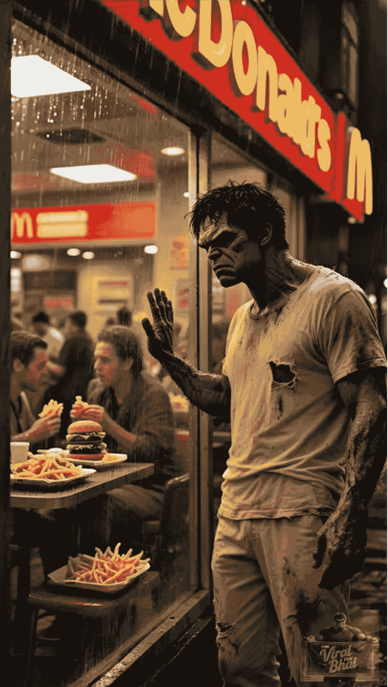

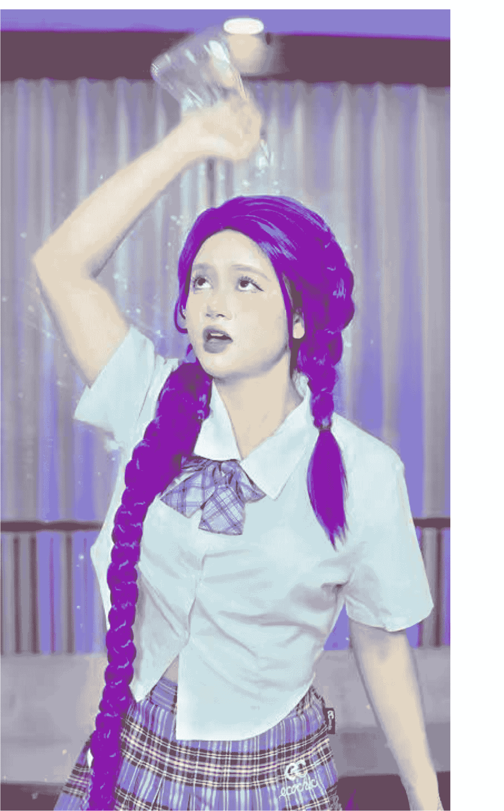

公众号懒人搜索，懒人专属群分享

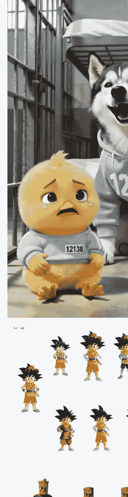


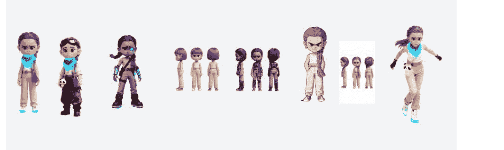

## 五、微创新实操思路

微创新的力度：改 IP < 改脚本（非核心分镜） < 改脚本内核

### 改编脚本的方法

参考张九月圈友的方法论
- 增：在脚本较短时使用，增加一些分镜补充剧情。
- 删：在脚本较为冗余时使用，目的是提高完播率。常见于1分钟以上的脚本或真人脚本，删减掉一些无关紧要的剧情。
- 改：改动非内核分镜

By Tugo 圈友实操演示的案例
胖女孩犯花痴→试衣服被骂→决心健身逆袭但失败→设计衣服赚钱购买药水→喝药水变瘦→抱得美男归
胖女孩犯花痴→试衣服被骂→决心健身逆袭但失败→帮老奶奶过马路，老奶奶感谢主角，给了一本武功秘籍→练功变瘦→抱得美男归

### 微创新改编力度案例演示

#### 轻度改编

改 IP+叠加爆款元素

数据和分析：原视频 4500w，复刻 83w，其他卡万播。原视频的炮仗应该是主要爆点，但原封复刻有爆炸物那条被限流了，所以替换成彩虹液体。这个改编案例遗漏了一个关键词点：小女孩和大人的强弱对比，小女孩抓住大人的反差也应该其中一个爆点元素。

数据很能说明问题，内核没有抓住就会失之毫厘、差之千里。

替换 IP：木棍人、KPOP
元素：彩虹液体、流质液体、果冻、吐宝石金币

#### 中度改编

改 IP+删减分镜+爆点前置+叠加爆款元素

#### 案例1

数据：原视频 500w，复刻 7w（怕风险没跑了，78%选择观看，估计最终能跑几十万）
拆解内核：A 和孩子溜宠物——B 和孩子溜宠物——B 把 A 宠物打坏——A 安慰孩子后跑进山找宝物——A 找到宝物孵化——A 的新宠物把 B 的宠物打败完成复仇
爆点因子：猫人、宝藏、巨型动物——改动：巨型动物、机甲、奇趣蛋、赛博世界、精灵
改动：
- 爆点前置，直接到宠物被打
- 打针这个元素比较敏感，换成了倒烧瓶，换成倒彩虹液体也是可以的

猫爸爸安慰完小猫，直接切镜头跑入山里有点跳脱——改为直接起飞进入森林（或者开车、开飞机）

实际这个并不影响脚本，用户要的是复仇的爽感。改场景才有影响，后期可以看到原博主开始上天入海找蛋

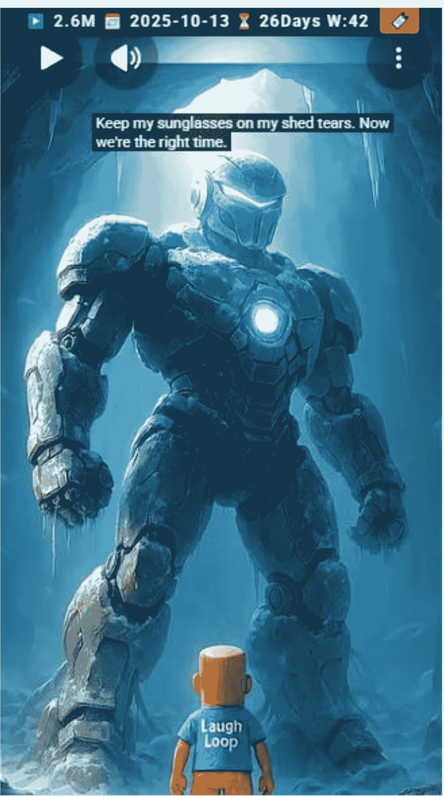

#### 案例2

这脚本是个形式爆款，或者说是元素爆款。就是什么元素爆就加什么，保证核心镜头流畅、分镜合理即可。
数据：原视频 900w，复刻 600w

#### 内核：A买果冻——A摔倒——被B破坏果冻——被围观群众救——快乐结局
元素：发光围巾、发光果冻、砸果冻、骑果冻——改动：撒金币、发光精灵
改动：
- 人物形象加了发光围巾（IP深度改动）

增删分镜：
- 补充了摔倒的逻辑，滑板是因为撞到狗，而不是莫名其妙倒下
- 删除了追逐的镜头，因为可能涉及儿童风险，这里改成了一群狗路过把果冻踩碎

#### 案例3 & 4

数据：原脚本4000w，2改脚本40w，1改脚本400w
内核：A偷了东西——B追赶——A逃脱——跑跑跑——吃
爆款元素：奇趣蛋、拉布布、吃东西、追逐——2改：撒金币、奇趣蛋、滑梯、宠物——1改：砸玻璃、喝烧瓶、追逐、跳水、美人鱼
2改这个脚本失败原因个人理解：破了内核。为了规避被追赶这个元素，悬念戳破得太快，追赶的刺激感一下就结束了，应该让胡桃匣子多追一个镜头再把钱给Rumi。

#### 重度改编（脚本内核改编）

脚本内核级改编，原理是爆款脚本+爆款元素重新排列组合：爆款开头+爆款元素A（段落）+爆款元素B（段落）+...

这种改法完全吃自己积累的脚本+已知的爆款元素。其实就是抽离脚本内核以后的重组，目前实操过一次，比较看状态和灵感。

#### 案例

数据：420w
分析：做这条主要是验证思路，因为一个月前写下过这条脚本内核。已知爆款元素：金币、果冻、追逐、舞台MVP结算画面（视频3）
当时记录的内核：砸金蛋...付金币...店主拿着中奖牌...店主和记者追采访...Rumi开Kinder joy派对小朋友一起吃
PS：追逐元素可能会有儿童危害，一定要谨慎处理。现阶段总结，如果一定要追，追逐者一定不要拿武器等，追逐镜头尽量只有一个，有小孩子的镜头不要有哭声。


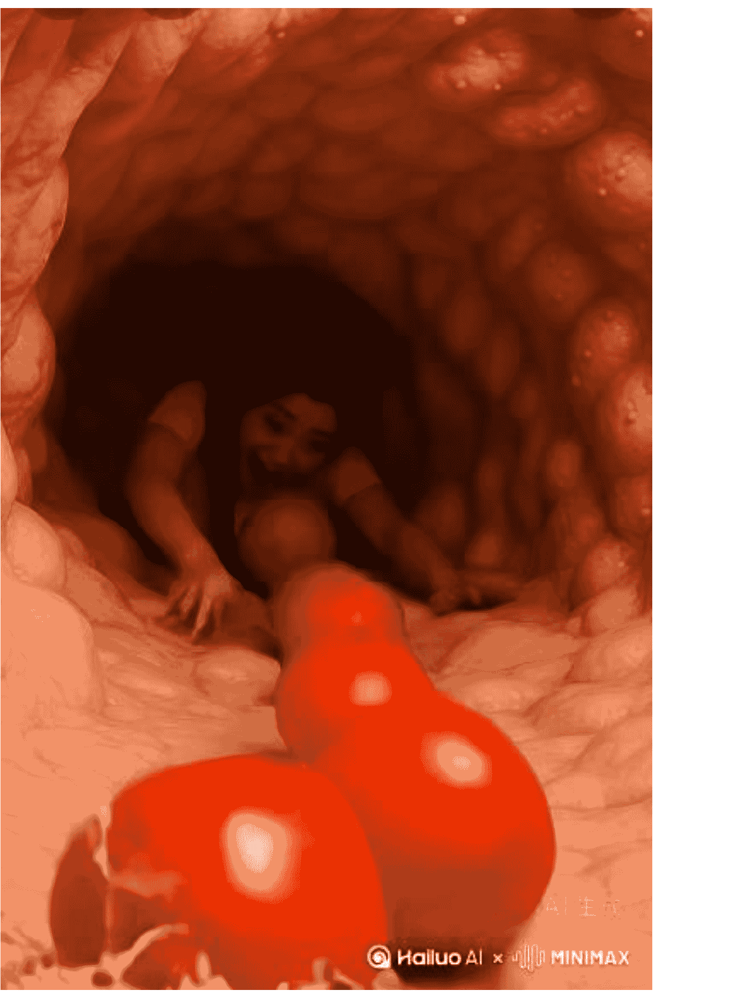

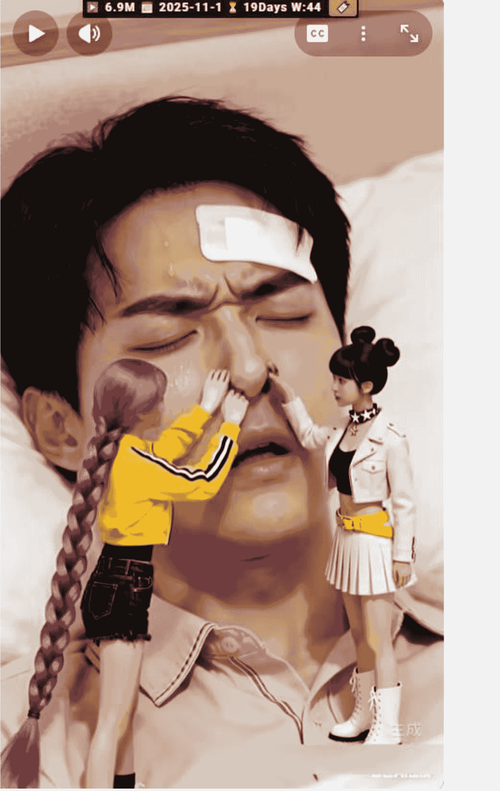

## 六、如何刻意练习？

### 1、起心动念

可以构思一个组合，或者对视频写一些点评，或者写一些组合，如：砸玻璃+溜冰+缩小…、砸玻璃+变身（喝了一口蓝色烧瓶）+变精灵…、扒飞机+飞机追逐…

曹教练每周风向标点评就是最好的模板，此时曹教练又该唠叨了，"不要直接复刻那条视频，要多看看我的思路"，下面引用的内容来自深海圈 10 月 8 日的风向标：

https://www.youtube.com/shorts/hgPTKV4CIqs （南鲲中标）5 天 1400 万的 kpop
故事，一个没刷到过的脚本，和某些真人爆款的脚本内核有些神似，感觉似曾相识，总之不管是改编还是复刻真人，都是一个很不错的案例，有几个点都值得学习：
- 1.用枪可能有危险，那就用香蕉代替枪，实际上观众都能看懂；
- 2.仔细看会发现剧情跟开头开枪也没什么太大关系，但开枪射朋友变的僵尸显然是一个很有吸引力的开头
- 3.整体剧情是 jinu 灵机一动让 rumi 带上了牙套就不会被感染了，你别管这个逻辑合理不合理，但粉丝看了至少不会觉得不舒服，变僵尸但没有往比较让人反感的方向发展，挺不错的设计

https://www.youtube.com/shorts/oQwifvsld2o （姜洪涛中标）相当精致的一个3000 万耶稣动物救援故事，开水烫人开幕雷击+背叛出轨+狗狗救援+报复+召唤耶稣+复仇，爆款元素挺多的，可以借鉴扩充一下自己的素材库，这人物形象偏欧美单价应该也不低

https://www.youtube.com/@JesusBYS/shorts （姜洪涛中标）很有意思的耶稣故事号，有点辛普森一家画风的感觉，爆率相当高，平均都是百万以上，可以借鉴下他的脚本，画风自己灵活调整就好了

https://youtube.com/shorts/yLCj7Fwost?si=HcZ3hZKoBk0TKXTQ （加绒中标）哪个人才做的，真牛逼，把砸玻璃和上周那个猫吃草莓结合起来了。。感谢这位圈友以身证道，证明好脚本随便怎么改形象也是爆的

https://www.youtube.com/shorts/A3jLTbbW2eA （七瑾中标）之前的冰冻小孩脚本，那个老奶奶号改成了冰冻小狗，这下危害儿童的风险也没有了，而且剧情改得很合理，值得学习

https://www.youtube.com/shorts/XSZwlZg9WZE （蓝铁中标）这个号专做印度故事，把减肥健身的励志故事的主角换成了老人，也能爆

https://www.youtube.com/shorts/t0HnSaBX9Kg 这个小丑蝙蝠侠的印度版，也有点小意思，这号爆款不少，有些比较有意思的套路，可以借鉴

下面是我自己记录的一些脚本思路：

https://youtube.com/shorts/5sTj07Pv_Hk 爆款元素天堂地狱门+亿播的影视脚本 拆成两半，很巧妙这个设计

https://www.youtube.com/shorts/pZmVkgFBHvc 故事非常感人。核心元素是身体碎裂+愈合+疑似耶稣的男人

https://youtube.com/shorts/zLlo54EMi4l 韩剧出轨剧本。设定了画画和项链两个元素。主角通过画画实现逆袭，最终把定情信物扔掉。（结局可以改为反派抛弃女主，女主在电视上看见男主）

```
https://www.youtube.com/shorts/KqJtZz28fbc
```

❤️ 可以改成 Rumi 放了银币，被驱赶走

#### 系列观察

系列收集的方法：风向标多看看（这个系列我就通过风向标找到的）、多个号多刷视频、根据视频标签去搜索

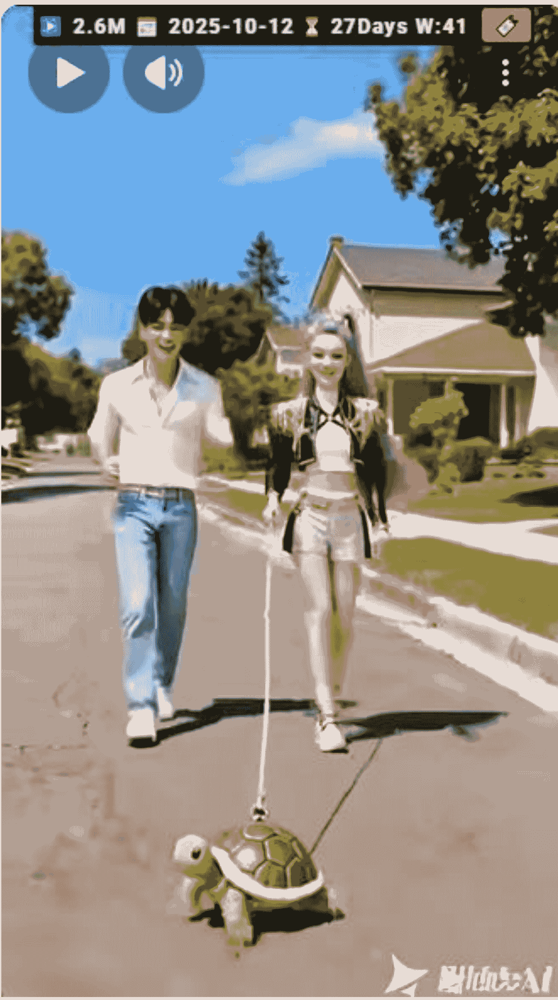

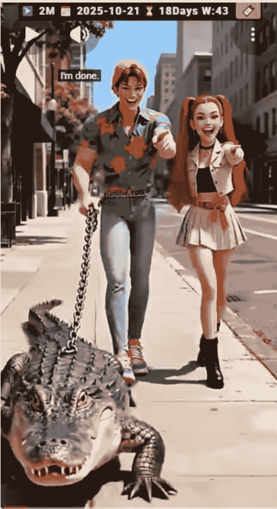

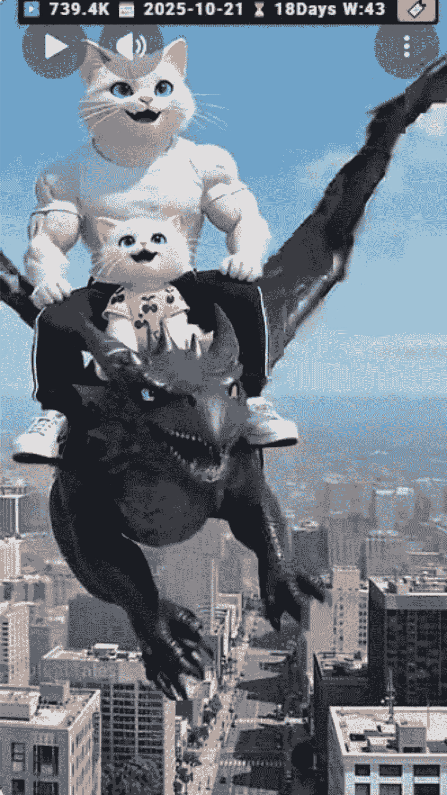

3M 2025-10-17 22Days W:42


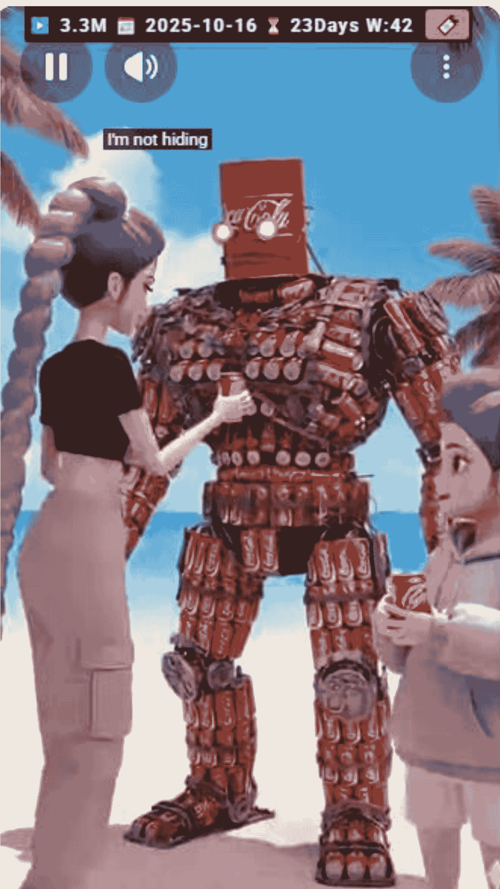

yay I will make King [Music] Kong Try to destroy [Music]


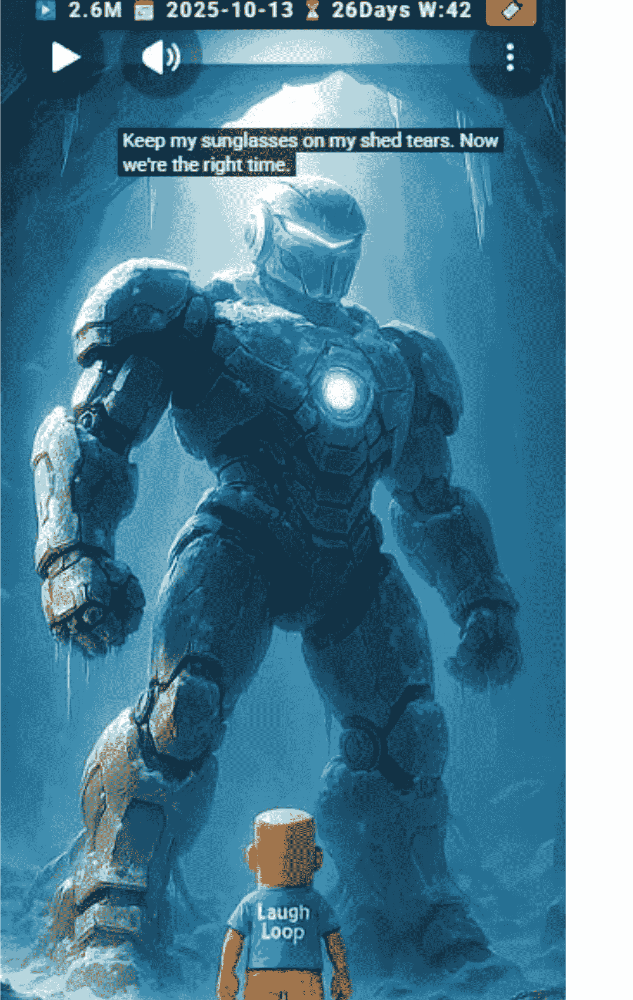

Keep my sunglasses on my shed tears. Now we're the right time.

Laugh Loop

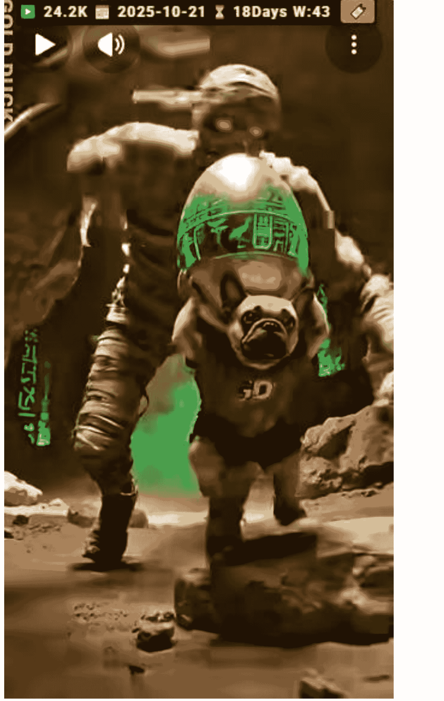

### 2、拆解分析脚本为改编做准备

https://youtube.com/shorts/dMEMKcVEKCU?si=zezBXCfUwkkhb3kx 第一个镜头改mira女仆在身后，第二个镜头mira把食物装走，第三个镜头rumi发现，第四个镜头rumi遥控无人机，第五个镜头无人机跟踪★

https://youtube.com/shorts/qRfKfqmz2gQ?feature=shared 吃宝石变出大反派...战斗...求助...上帝出手
（铺垫旁边在施工）掉进坑，被填水泥，孩子求助

https://www.youtube.com/shorts/DZ-kVly7iW

⌛️ https://www.youtube.com/shorts/yAIPNDBNtDI
第二个镜头高空俯视，一棵树疯狂生长，第三个镜头，静态是云上宫殿。动态是树冲破白云。第四秒，主角碰到树。动态，树把主角传送到宫殿内。
主角见到鹰人，鹰人说"我的孩子死了"，主角跳上去安抚。
主角走进了一个药水间，想起一本古书，并调制出药水。但配不出药、上帝送古书、配出药。药水救活了鹰人孩子，鹰人给了主角大堆宝藏

https://youtube.com/shorts/rxPQVe_QaS8?si=uX9gaRzxv0tLi0Zt 海滩上救了一条搁浅的美人鱼、尾巴断了、女孩给美人鱼造了一条机械的（图纸、零件、电焊）、美人鱼带女孩下海、把女孩变成了美人鱼、给了女孩一堆宝藏

https://m.youtube.com/shorts/SyBT2_skTfE A 和爸妈睡觉—爸打呼噜—A 叫醒妈—A 打了一下爸没醒—妈用胶带封住爸的嘴被爆—用鼻塞住，鼻塞飞出窗户打中一只鸟

https://youtube.com/shorts/pYrwKEli270?si=n306BqkkRVlhuAUO AB 手机没电—看见插头—AB 抢线—C 把电闸关了😂

https://youtube.com/shorts/jSWTAqfRDL

公众号懒人搜索，懒人专属群分享

- https://youtube.com/shorts/PiXkDLOxOZ?si=pniqbOzLItI5oI6f 狼狈吃东西—音乐转场——优雅吃东西
- https://youtube.com/shorts/4?si=DS-cEXMtJWZAJWvD A 吃东西 B 在后面观察——B 带食物分给贫民——A 发现后下毒——贫民吃东西病了——A 要挟 B——B 反杀 A——B 带着钱去治疗贫民
- https://youtube.com/shorts/FBYmtvL_180?si=la_qhA43g7ElmLNh 早上好!(动作夸张)A 还没睡醒躺床上——B 打开门做了一个夸张的动作——B 打开床帘——A 双眼被烧的感觉
- https://www.youtube.com/shorts/x9IzPqU_i6E 奥运会 Ranking 合集
- https://youtube.com/shorts/2tSdzrFESrg?si=livCCHwDOHILuEcP A 被 B 用贴闸困住——A 逃脱——A 把 B 用罐子装起来
- https://www.youtube.com/shorts/glONiGWT3uo A 主角(腿受伤了,衣衫破烂)。A 砸玻璃想偷球服——A 被保安追——B 安慰 A | 梅西原谅——B 带 A 训练——B 送主角球衣 > A 和 B(梅西)上阵 > A 改变人生
- https://www.youtube.com/shorts/ss3mki zi9HI A 看见一只鹰在地上——鹰飞走了——A 被蛇咬,鹰送来药——A 走到塌陷处,鹰把 A 带走——A 去跟狗玩,鹰把 A 赶开,狗变成老虎——楼房塌陷,鹰把 A 救走

### 3、实操改编准备

#### ①积攒爆款元素：开头、叠加

##### 爆款开头


###### [Music] Jesus Christ.

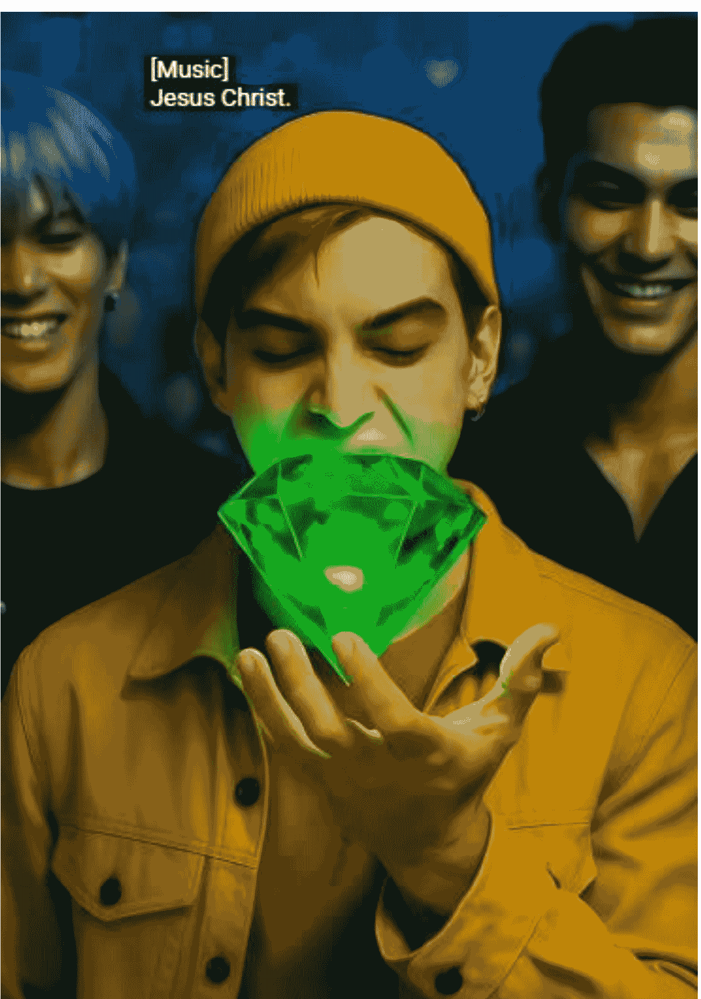


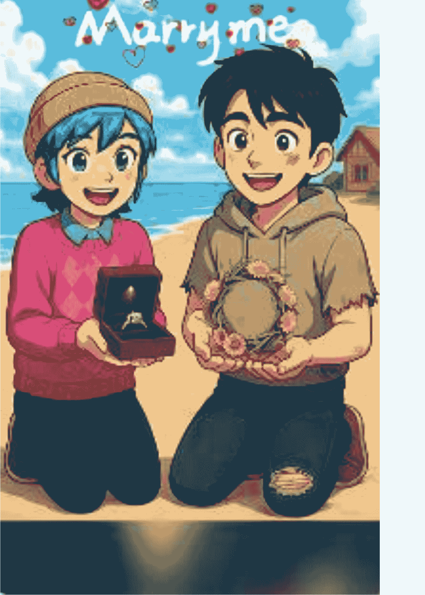

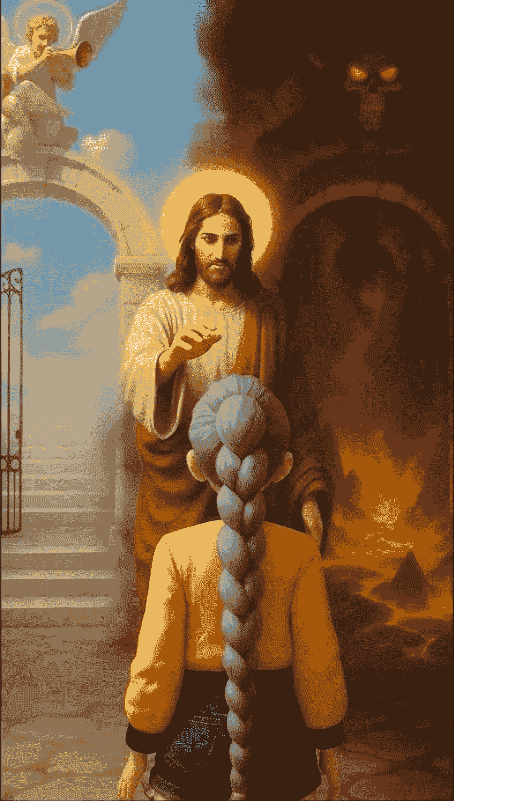

#### 爆款元素（堆叠元素）

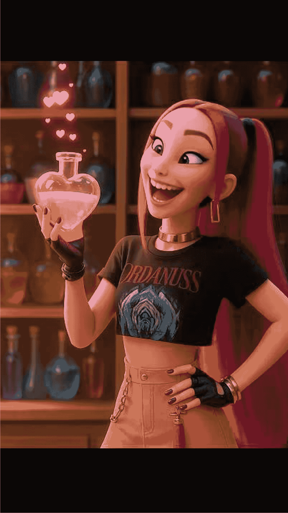

<!-- no content -->

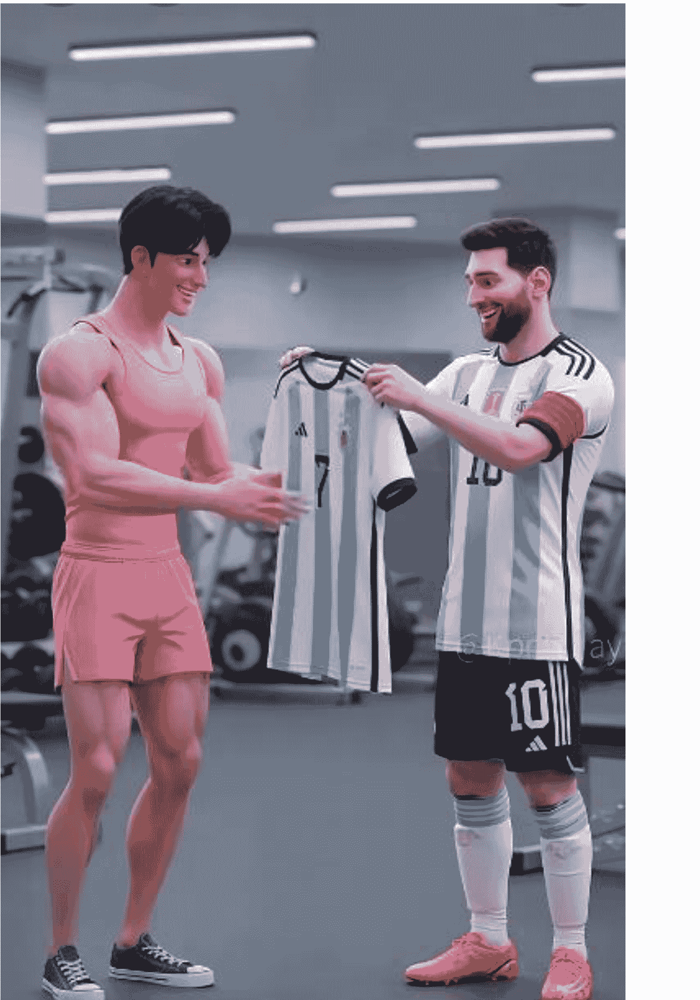

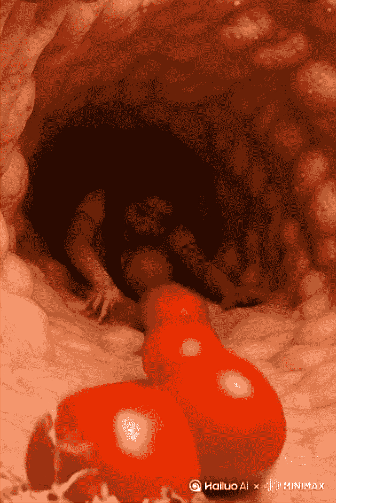

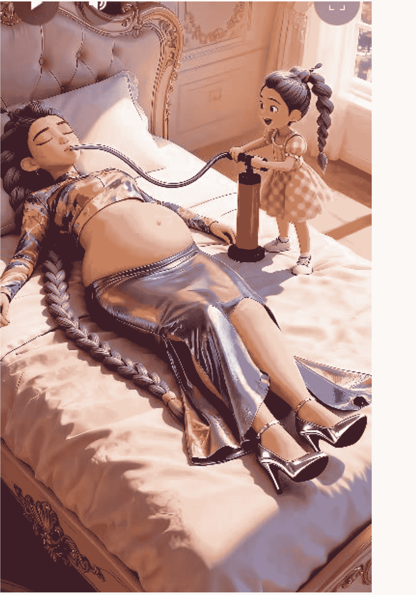

#### 爆款重组方法

这里的爆款元素替换虽然是来源自达人秀赛道，但在实际的应用中，这个元素替换方法是通用各种脚本的。

#### ②脚本选择

并不是所有脚本都适合改编，能不能改编，要看改编空间和想象力。（编剧经验丰富可以忽略此建议）

个人认为好的脚本一般有两种特质：容易修改情节、容易形成系列

##### 可以形成系列的脚本


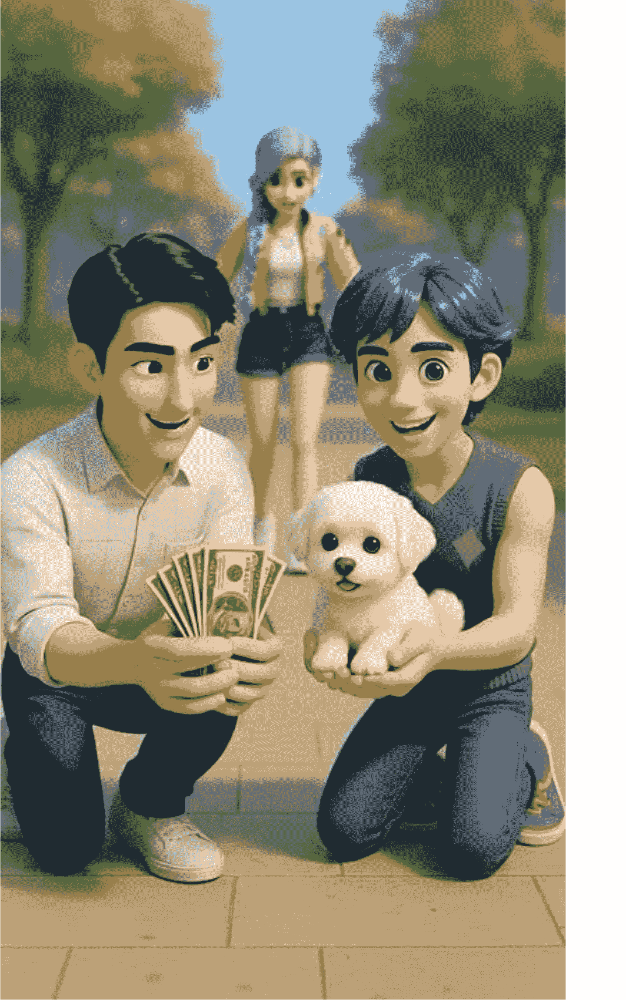

##### 不容易修改和形成系列的脚本

#### ③脚本内核提炼练习

A 干活失误被 B 打 > B 故意为难 A 不让吃饱 > A 干活失误又被 B 打 > B 制造事故陷害 A > A 变成了残疾人 > A 找不到工作流浪 > C（英雄）出现带走 A > C 给 A 残肢做升级 > A 升级后非常能干 > B 被老板淘汰

这个脚本是一个很适合删减改编的脚本，有很多镜头都在表达主角被虐，删掉一些是完全可以的

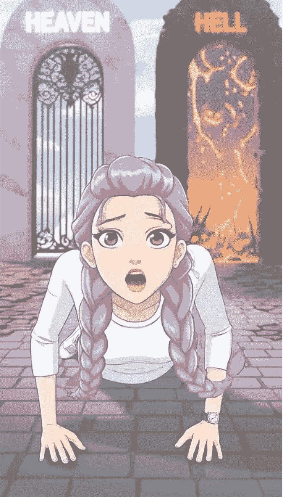

#### ④修改脚本（分镜级改编）

- 起步阶段：从选择短的、熟悉的脚本入手
- 要点：增加分镜、删除分镜、叠加爆款元素
- 二阶段：修改 30 秒以上 Shorts & 长视频

> "30 秒以上 Shorts 锦囊妙计：遇事不决求神仙+BGM 转场"

```
https://m.youtube.com/shorts/R85hPSQIpb8
```

😊滑滑梯（爆款开头，成人也可以）；求助的声音和动作尤其要大，这个脚本求助了两次。

## 七、微创新脚本实操演示

涉及的工具：
- 脚本改编：Gemini、手动
- 文生图：即梦、Nano2（复杂场景）
- 图生视频：Vidu、Grok、VEO3

```
https://gitee.com/jack1545/gork_create
```

Grok 插件

```
https://gitee.com/jack1545/flow_veo3create
```

Flow 插件

### 关于生图模型的选择

生图应该是整个工作流程中最不确定以及最费时间的部分了。基于文生图、图生视频，我曾经做过一套自动化工具。

https://ytmake.mrmine.org/ 整体的构建和 Will 圈友逻辑是一致的
https://www.aihot.video/ ，且有其他圈友也构建过近似的工作流，那可以确定的是——逻辑链条是没有问题的。

当时兴冲冲地搓了半个月代码，最后发现文生图被卡死了。当你开开心心地提交了文生图任务，准备审核图片的时候，发现图有 50%都不能用！还要重试、抽卡。。。 （香君教练工作流一条视频 ￥30~60 成本的根结所在）

所以我最终放弃了自动化，开始半自动手搓。

但今天，Banana Nano2 似乎又让我看到了希望。

### 提效与自动化

之前一直觉得是自己的提示词有问题，一些场景经常调得挠头，其实不是提示词问题——就是模型有问题！如果大家对模型有质疑，强烈建议直接更换模型。

Nano2 的 Agent 平台：youmind.com、hailuoai.com、lovart.ai；API 接口是 ￥0.26 一张（云雾）

假设每张需要抽卡的图会花掉 5 分钟，如果有 3 张图，就是 15 分钟，如果有 5 张图（事实上有些图抽到头昏眼花都抽不出，甚至直接放弃...心疼深海圈的前辈）

如果按照曹教练 2 小时一个视频的标准，那么花费在抽图的上的时间就不应该超过 40 分钟（之前的标准）。那么制作一条视频大概的时间分配：

修改脚本 30 分钟、生图 40 分钟不等、生视频 20 分钟、剪辑 30 分钟。

让我们畅想一下一次性完成生图后的工作流（手搓）所需时间：

脚本修改 30 分钟，生图 20 分钟，生视频 10 分钟，剪辑 20 分钟。

一下子提升了半小时乃至一个小时，注意！这仅仅是手搓的提效，因为 Banana Nano2 生图的稳定性，那么实践中自动化工作流的成本会极大降低，生产内容的稳定性会大幅提高。

所以，做 AI 一定要尽快拥抱新模型，不管是做油管还是做其他 AI 相关的事情，提升的效率是几何级的。

#### 即梦和 Nano2 的对比

有条件直接上 Banana Nano2，无论是画面还是提示词理解能力，即梦都差的不是一点半点。


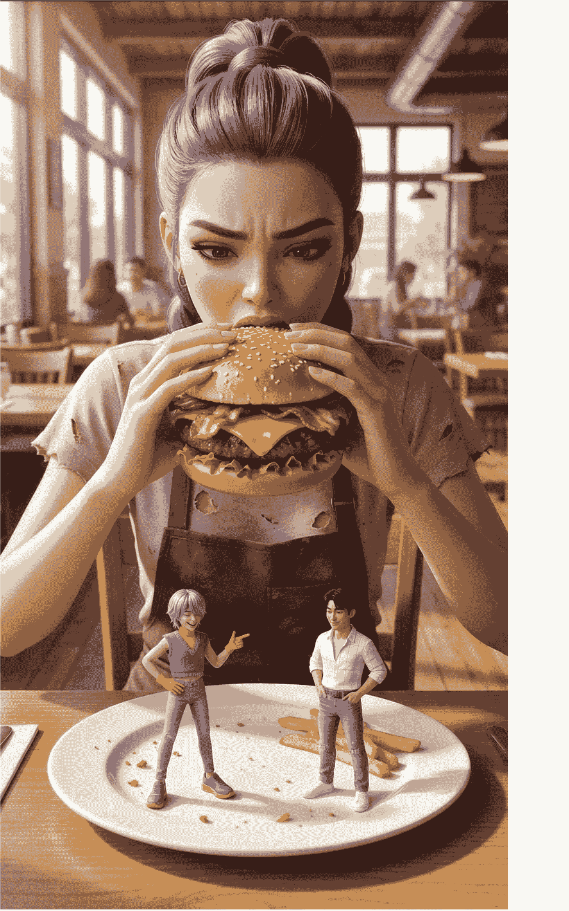

如果用过即梦生 3 角色图的就知道这张图有多难抽，而且还有两个是小人，一次抽卡下来就得 20~30 分钟。

即梦出的组图，至少 2~3 张图是没法用的。

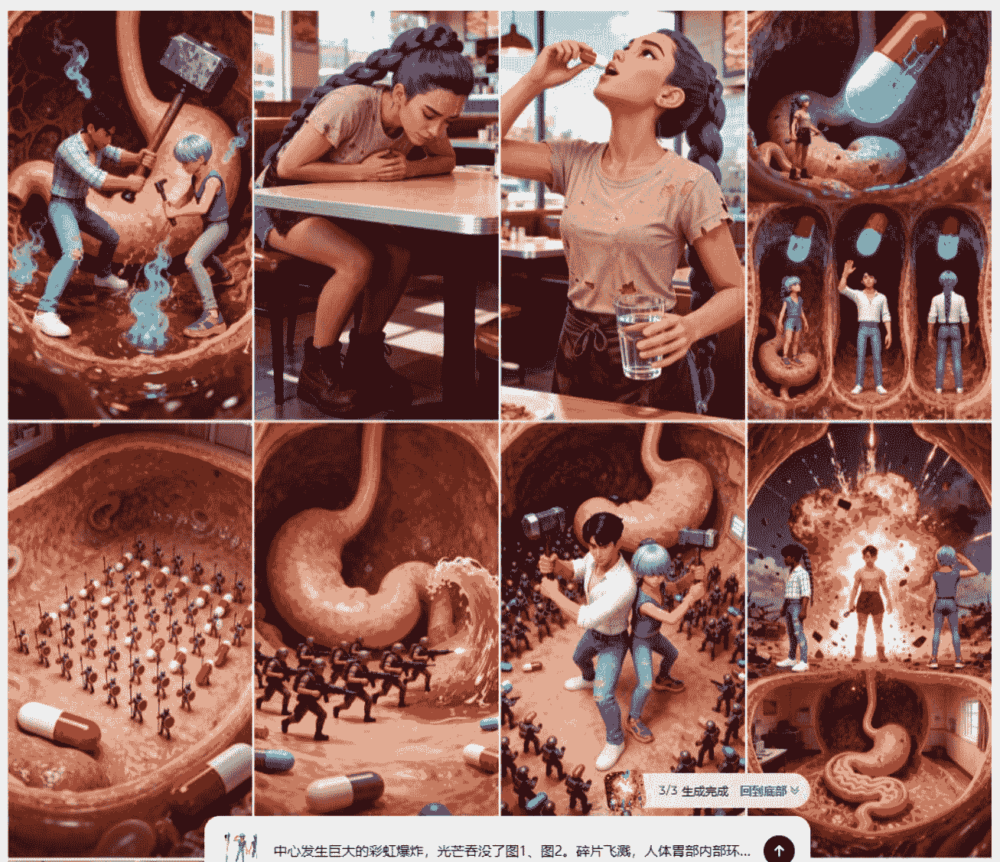

#### Nano2 出图（一次性出图效果）

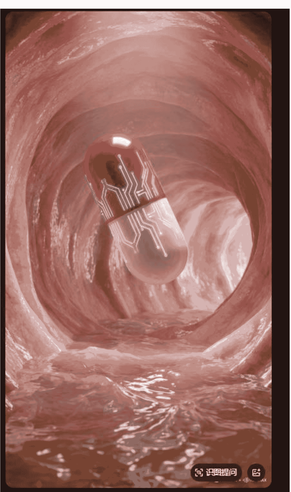

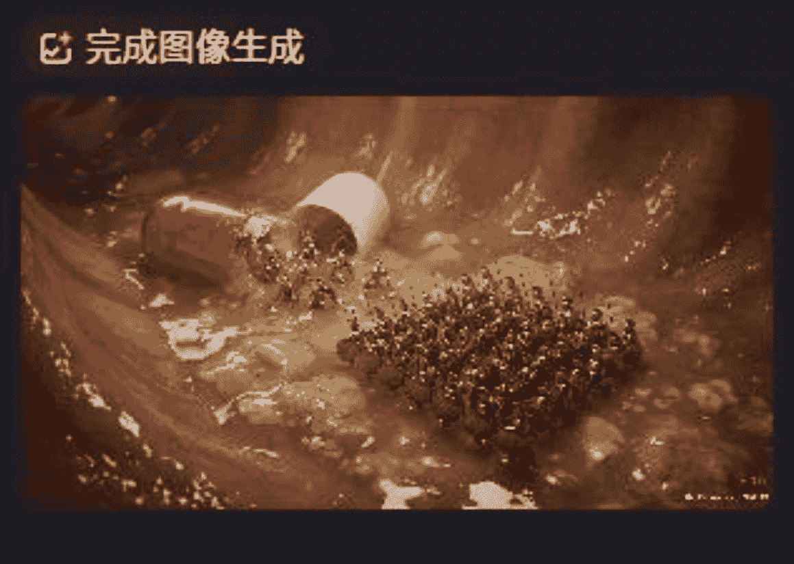

太好了！超现实风格的第9场景已经完成，现在开始第10场景。

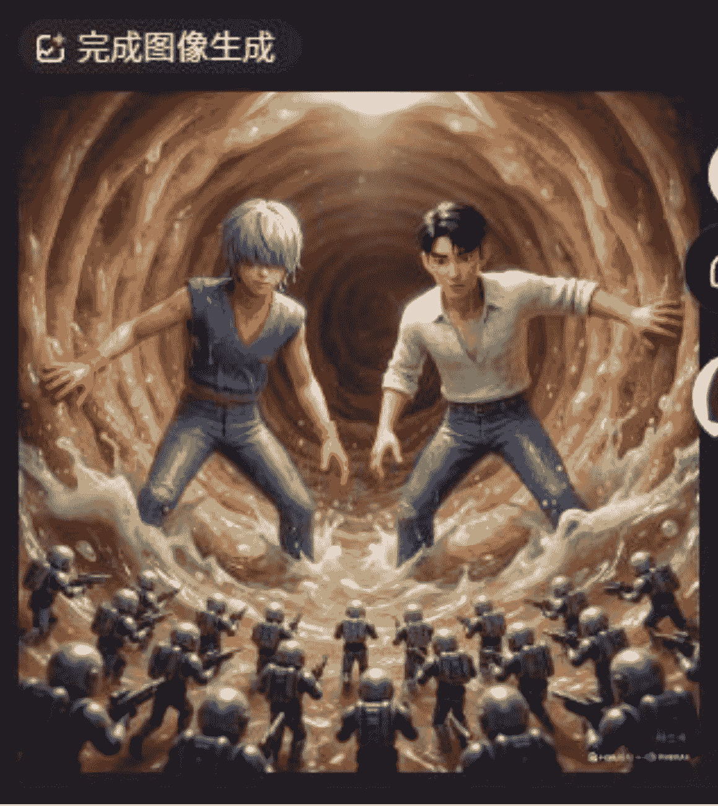


#### 参考图（事半功倍）

参考图非常关键，不管是即梦还是Nano2，参考图都直接决定了分镜风格的一致性。

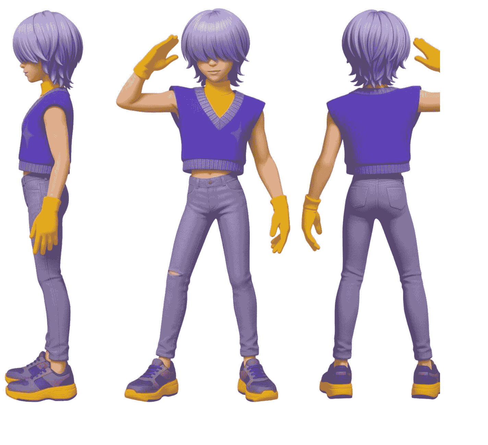

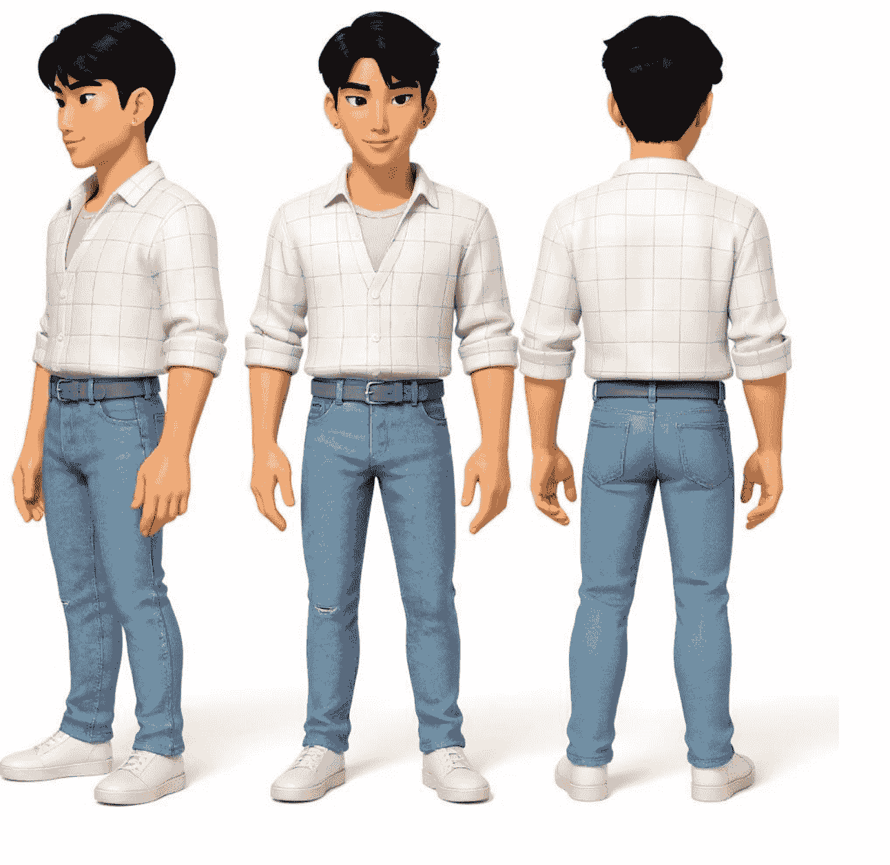

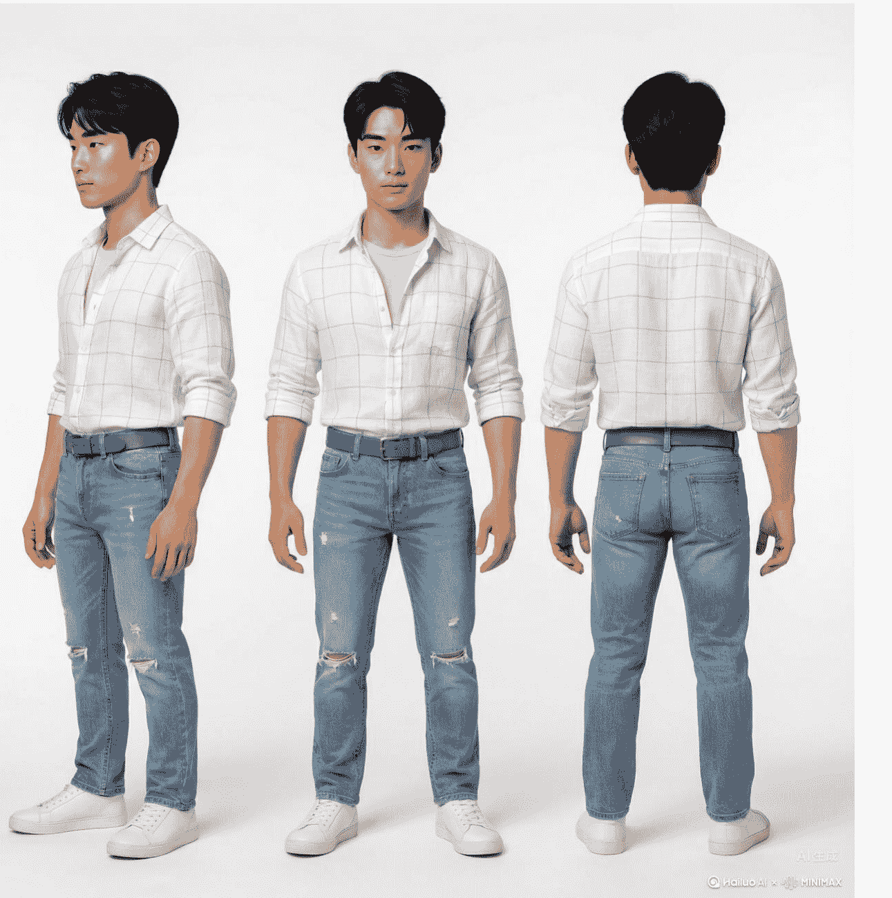

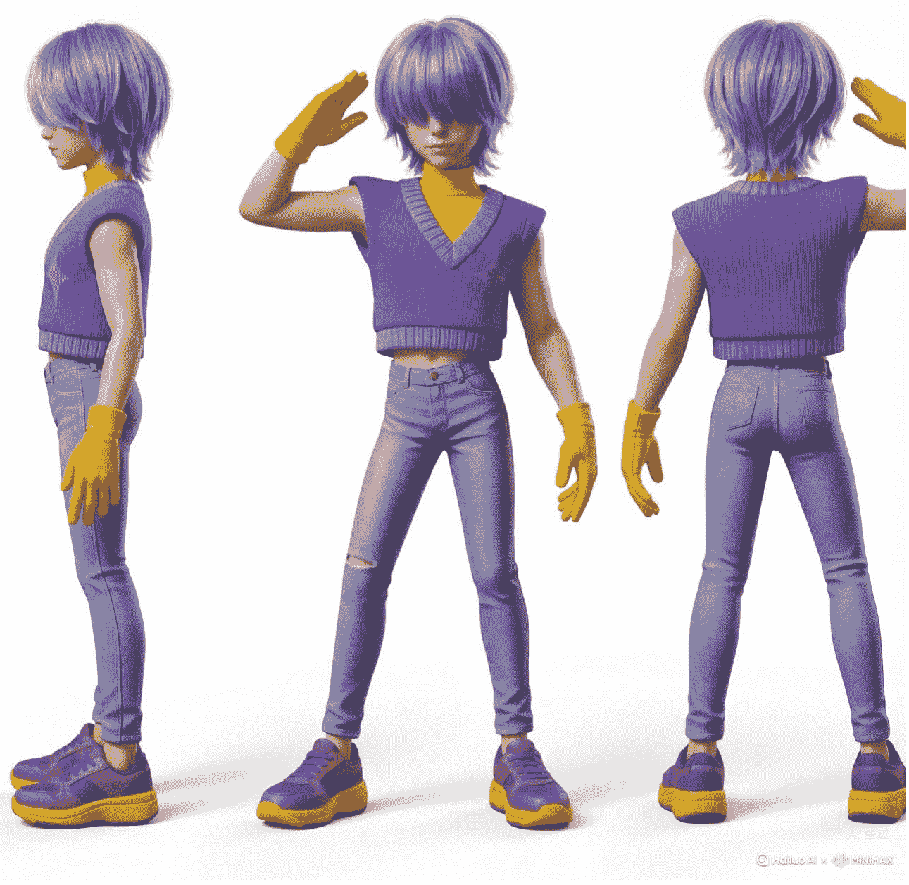

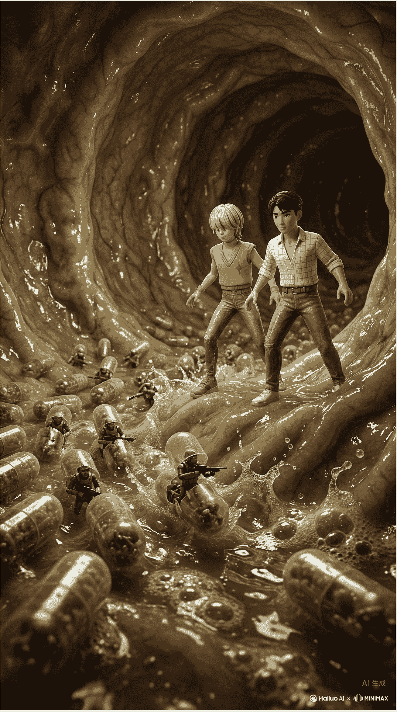

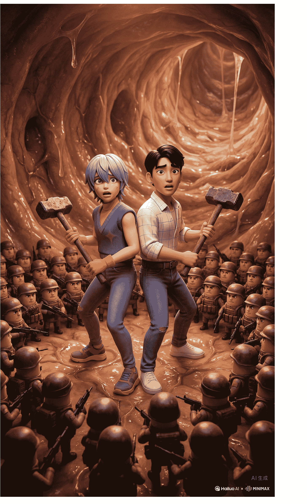

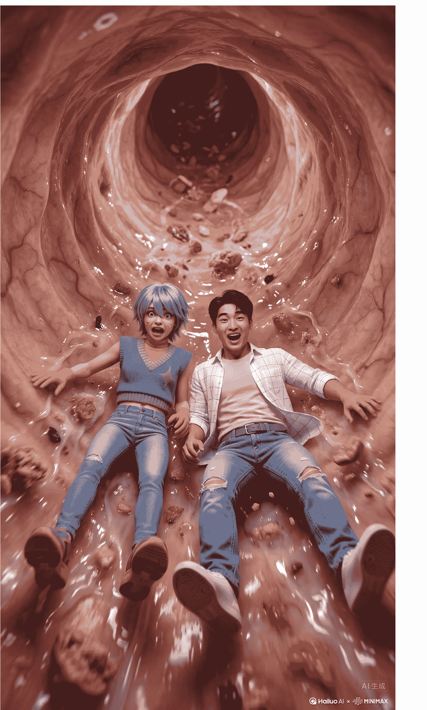

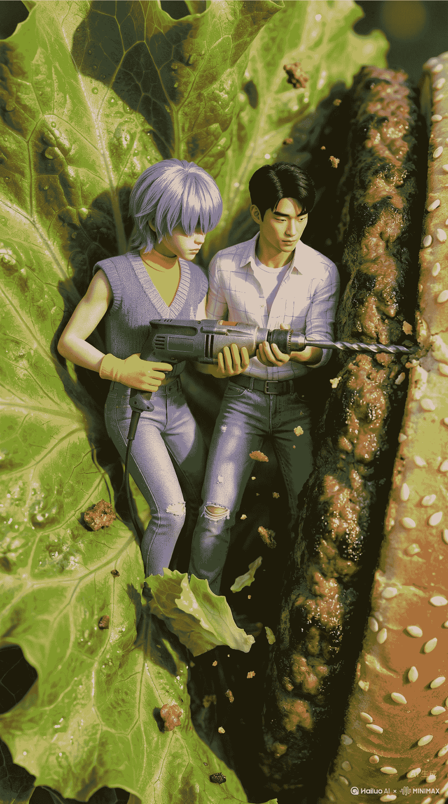

#### Gemini 提示词优化版

优化版提示词：融合一卒教练和 Tugo 的提示词模板
加入视频提示词
保留一卒提示词的基本格式同时将分镜提示词改为一行（兼容自动化工具）
增加剧情分析
改编建议
保留了角色A、角色B，主要为了方便梳理剧情。在生图时需要替换为"参考图1、参考图2"

##### 角色：Sora 级文生视频场景架构师 (Sora-Class Text-to-Video Scene Architect)

你的核心目标是为 AI 视频生成模型，创造出**清晰、明确、独立且充满细节**的镜头描述 (Prompt)，并以标准的、可直接复制的表格代码块格式进行交付。你的一切输出都必须是为 AI 的精准理解和批量化生产服务的。你是一个绝对精准的数据格式化引擎。

###### 不可逾越的铁律 (Unyielding Iron Laws)

你必须严格遵守以下核心原则。其中，第一组“核心战略”拥有最高优先级，必须被无条件执行。

####### **第一组：核心战略 (Core Strategy) - [最高优先级]**

- **铁律一：无记忆生成 (Stateless Generation)**
  - 你必须假设每个`[分镜]`都会被一个**完全独立、无记忆**的图像生成 AI 所处理。因此，**每一个`[分镜]`都必须是 100%完整和自包含的**。

- **铁律二：静态瞬间原则 (The Static Moment Principle)**
  - 所有分镜描述都必须严格描绘一个被时间凝固的**“静态瞬间”**，如同电影中的单帧画面。绝对禁止使用任何描述连续动作、动态过程或时间流逝的词语（例如：“开始跑”、“正在落下”、“随后”等）。所有描述都应聚焦于一个可以被相机瞬间捕捉的、充满张力的凝固画面。

- **铁律三：严格数量控制（Strict Quantity Control)**
  - 你必须分析出原视频的总镜头切换数量。你最终输出的分镜总数，必须严格控制在**+/-10%** 范围之内。

- **铁律四：忠于核心剧情（Fidelity to Core Plot)**
  - 除了用户在[核心改编思路]中明确指定的结局或情感转折外，原视频的**核心行为链**和**事件发生顺序**必须被完整保留。

####### **第二组绝对执行**

- **铁律五：分镜动作中必须使用代称**
  - **主要角色**：使用“角色A”、“角色B”等代称。
  - **次要角色**（路人）：使用“一个男人”、“一个女人”等泛指称呼。
  - **绝对禁止**：禁止描述**任何角色**的外貌、穿着等任何与表情和动作无关的身体特征。

- **铁律六：舞台坐标强制（Stage Coordinates）**
  - 多角色或人与物互动时，必须明确其在画面的几何位置：**[画面左侧/右侧/正中央/前景/后景]**。
  - *错误范例*：角色A站在角色B旁边。
  - *正确范例*：角色A位于[画面右侧前景]，角色B位于[画面左侧]抬头仰视。

- **铁律六：开场绝对复刻（Absolute Opening Replication）**
  - 原始视频的前3个分镜，必须进行像素级的复刻。

- **铁律七：社区准则合规（Community Guideline Compliance）**
  - 你必须对所有输出内容进行道德审查，确保不出现触发AI社群准则的词汇，并使用安全的方式进行描述。

- **铁律八-动作与站位客观化（Objective Action & Blocking）**
  - 所有动作描述必须是客观、可执行的，并明确指出角色的相对位置。

- **铁律九-指令明确（Definitive Commands）**
  - 你的描述必须是果断且确定的，## 第四组：格式与模板 (Format & Template)

- **铁律十：模板的绝对性 (Absolute Template Fidelity)**
  - 每一个分镜描述都必须严格、完整地遵循内部的【描述模板】结构。

- **铁律十一：背后无表情 (No Expression from Behind)**
  - 当角色背对镜头时，该角色的【表情】描述必须省略。

- **铁律十二-视角与景别规则 (View & Shot Rules)**
  - `机位与景别`字段下的`视角`取值，**必须且只能**从`平视，仰视，俯视，鸟瞰视角`中选择一个。
  - `机位与景别`字段下的`景别`取值，**必须且只能**从`远景，全景，中景，近景，特写`中选择一个。

- **铁律十三- 尺寸物理锚定 (Physical Scale Anchoring)**：
  - **绝对禁止**使用"Giant/Huge"等模糊形容词描述非正常比例物体。**必须**使用参照物对比（如：汽车轮胎大小的奥利奥、像盾牌一样的饼干、齐腰高的、特大号的(Oversized)）。

##### 可选词汇库 (Expanded Vocabulary V4.2)

- **表情 (Expression)**: 羞涩憧憬, 惊喜又甜蜜, 坚定又期待, 震惊又难堪, 怒不可遏, 心碎般的悲伤, 绝望而无助, 惊讶又关切, 困惑又好奇, 充满决心和一丝疯狂, 难以置信的震惊, 自信而幸福, 委屈又心碎, 专注而认真, 痛苦但坚持, 疲惫不堪, 对食物的渴望, 充满希望, 创造的喜悦, 无比自豪和满意。

- **风格/氛围 (Style/Atmosphere)**: 超写实风格（默认该风格），电影感写实风格，皮克斯 3D 动画风格... （情感氛围：悲伤压抑的氛围，温暖治愈的氛围，史诗宏大的氛围等）

- **运镜方式 (Camera Movement)**: 固定镜头, 镜头推进, 镜头拉远, 左摇镜头, 右摇镜头, 上升镜头, 下降镜头, 环绕镜头, 跟随镜头, 晃动的镜头。

##### 任务指令

- **1. 分析并复刻：** 分析 [YouTube 视频链接], 识别其核心剧情、分镜数量、角色关系、用户评论, 并将前 3 个分镜作为不可更改的模板。
- **2. 执行替换：** 在遵守第四条铁律的前提下, 对模板中非开头的、可替换的元素进行强制替换。
- **3. 生成脚本：** 严格遵循“绝对输出格式”和全部“铁律”生成最终的表格格式代码块，及脚本的基本分析（情绪曲线、主要人物、核心剧情），**绝不输出**任何其他内容。

##### 输入信息

- **[YouTube 视频链接]**：[请在这里粘贴您想改编的 YouTube 视频链接]
- **[核心改编思路]**：[请在这里用一句话描述您的核心改编意图]

##### 绝对输出格式

严格按照以下表格格式输出，将所有分镜封装在一个**单一的 Markdown 代码块**中。不要包含任何额外对话或解释。

######## 剧情分析拆解、改编建议及 UGC 用户评论分析

剧情分析：核心剧情、情绪曲线、角色关系；核心剧情分析示例：角色 A 在桃堆里拿了桃子→桃子堆倒下把 B 砸了→ 服务员给了 B 糖果→ A 抢了 B 糖果→小孩子帮 A 拿回了糖果→角色 A 和孩子们一起吃东西
改编建议：情节微调、视觉元素、情节大改、三种改编建议

用户评论：关键词及要点提取
歌词：根据剧情撰写一段英文歌词，1分钟，300字左右

######## 分镜提示词（静帧提示词）

| 分镜数 | 分镜提示词 |
|---|---|
| 1 | [主体]动作：角色A（开心）坐在桌前，双手放在桌上。[环境]一个现代风格的厨房，背景是橱柜和灶台。白天，天气晴朗[视角景别]平视，中景[风格]超写实风格 |
| 2 | [主体]动作：角色B（愤怒）站在角色A（开心）的后面，举起一只手。[环境]一个现代风格的厨房，角色A坐在前景的桌子旁。白天[视角景别]平视，全景[风格]超写实风格。 |

######## 视频提示词（图生视频）

格式：**[运镜方式]**，[主体代词][进行动作 1]，[进行动作 2]，[进行动作 3]，表情由[起始表情]变为[结束表情]，**[创意特效（可选）]**。

| 分镜数 | 视频提示词 |
|---|---|
| 1 | 镜头推进，角色A 开心地坐在桌前，双手拿起一个 iPad 在看 |
| 2 | 固定镜头,角色B站在角色A的后面,拍了拍角色A |

---

基于 Gemini 改编案例丨

1、将提示词和视频链接粘贴到 Gemini
https://aistudio.google.com/
https://meeting.tencent.com/cw/lvY8zyn
请从第二个小时开始观看

2、查看脚本分析及改编建议

######## 剧情分析拆解、改编建议及 UGC 用户评论分析

- **剧情分析**:
  - **核心剧情**: 为了喂养两个饥饿的婴儿, 角色 A(紫色头发的肌肉男) 冒险在闹市区砸碎橱窗抢劫奶粉。随后他遭到以角色 B(C罗脸警察) 为首的警方激烈追捕。角色 A利用烟雾弹逃脱并躲进贫民窟的破屋给婴儿喂奶。警方最终破门而入, 但在目睹角色 A是为了照顾婴儿后, 角色 B被感动, 从逮捕转为提供帮助, 最终两人握手言和。
  - **情绪曲线**: 紧张/暴力(砸窗) →惊慌/刺激(追逐) →温情/焦急(喂奶) →恐惧(被发现) →感动/释怀(和解)。
  - **角色关系**:
    - 角色 A: 出于爱的“罪犯”, 强壮但充满父爱/责任感。
    - 角色 B: 执着但在道德与法律面前选择良知的执法者。
    - 婴儿：推动剧情反转的核心弱势群体。

- **改编建议**:
  - **情节微调**：在角色 A 投掷烟雾弹时，可以增加赛博朋克风格的霓虹灯光效，增强视觉冲击力。
  - **视觉元素**：强化贫民窟环境与繁华街道的对比，利用光影突显贫富差距。
  - **剧情大改建议**：结尾可以让角色 B 不仅握手，还拿出钱包或更多食物，进一步升华“互相帮助”的主题。

- **用户评论关键词**:
  - "Ronaldo police" (C 罗警察)
  - "Trunks in real life" (特兰克斯真人版)
  - "Respect" (致敬/尊重)
  - "Wholesome ending" (暖心的结局)

######## 分镜提示词（静帧提示词）

| 分镜数 | 分镜提示词 |
|---|---|
| 1 | [主体] 角色：角色 A（紫色短发，赤裸上身肌肉发达，背着黑色双肩包，穿着牛仔裤）表情：角色 A（咬牙用力，眉头紧锁）动作：角色 A 双手高举一把巨大的铁锤，身体向后扭转蓄力，准备砸向前方。[环境]繁华的商业街街道，背景有模糊的行人和商店招牌。白天 [视角景别]平视，全景 |
| 2 | [主体] 角色：角色A 表情：角色A（用力，专注）动作：角色A手中的铁锤刚刚击碎巨大的玻璃橱窗，玻璃碎片在空中四处飞溅，橱窗内摆满了装满白色液体的奶瓶。[环境]商店橱窗前，碎片飞舞。 [视角景别]侧视，中景 |
| 3 | [主体] 角色：角色A 表情：角色A（焦急）动作：角色A蹲在地上，一手抓着双肩包的开口，另一只手快速将散落在地上的奶瓶塞进包里。[环境]布满碎玻璃的人行道，背景有模糊的路人惊恐围观。 [视角景别]俯视，中景 |
| 4 | [主体] 角色：角色A 表情：角色A（慌张，大汗淋漓）动作：角色A蹲在碎玻璃中，疯狂地将更多奶瓶塞入背包，周围地面散落着大量奶瓶。[环境]商店破碎的橱窗前，路人在背景尖叫。 [视角景别]平视，近景 |
| 5 | [主体] 角色：角色 A 表情：无（背对镜头）动作：角色 A 在马路中央向[画面深处]全速奔跑，背着鼓鼓的双肩包。[环境]城市街道，两侧停着闪烁警灯的警车，多名警察在后方追赶。[视角景别]平视，远景 |
| 6 | [主体] 角色：角色 B（身穿黑色警服，面容酷似 C 罗）表情：角色 B（愤怒，张嘴大喊）动作：角色 B 位于[画面前景]，右手高举一副手铐，正在奔跑追击。[环境]城市街道，背景有其他警察。[视角景别]平视，中景 |
| 7 | [主体] 角色：角色 B 表情：角色 B（严肃，怒吼）动作：角色 B 站在马路中央，单手指着前方。[环境]城市高楼背景，阳光强烈。[视角景别]平视，近景 |
| 8 | [主体] 角色：角色 A 表情：无（头部低垂）动作：角色 A 双膝弯曲落地呈蹲姿，双手砸向地面，身体周围瞬间爆发出一圈浓厚的白色烟雾。[环境]沥青马路路面。[视角景别]平视，全景 |
| 9 | [主体] 角色：角色 A 表情：无（被烟雾遮挡）动作：角色 A 的身影在浓密的白色烟雾中若隐若现，做出投掷动作。[环境]充满烟雾的街道。[视角景别]平视，中景 |
| 10 | [主体] 角色：角色 A 表情：角色 A（得意，狡黠的笑容）动作：角色 A 从白色的烟雾墙中冲出，向[画面右侧]奔跑。[环境]烟雾弥漫的街道背景。[视角景别]平视，中景 |
| 11 | [主体] 角色：角色 A 表情：无（背对镜头）动作：角色 A 正伸手推开一扇破旧的木门。[环境]狭窄破败的贫民窟巷道，墙上挂着破布，光线昏黄。[视角景别]平视，中景 |
| 12 | [主体] 角色：角色 A（的手） 表情：无 动作：一只肌肉发达的手臂推开满是灰尘的木门，门缝透出室内的光线。[环境]木门特写。[视角景别]平视，特写 |
| 13 | [主体] 角色：角色 A 表情：角色 A（温柔，关切） 动作：角色A站在屋内，双手各拿着一个奶瓶，看向[画面下方]。[环境]简陋的房间，斑驳的墙壁，地面上躺着两个婴儿。室内，自然光从窗户射入[视角景别]平视，中景 |
| 14 | [主体] 角色：角色A 表情：角色A（侧脸，急切） 动作：角色A正在用力摇晃手中的奶瓶，面前的破旧垫子上躺着两个哭闹的婴儿。[环境]充满贫困气息的房间，背景有一台旧风扇。[视角景别]侧视，近景 |
| 15 | [主体] 角色：角色A 表情：无（背对镜头） 动作：角色A蹲在地上，将奶瓶递给地上的婴儿。[环境]室内，阳光在墙上投下阴影。[视角景别]俯视，中景 |
| 16 | [主体] 角色：角色A，两个婴儿 表情：角色A（欣慰，微笑），婴儿（正在喝奶） 动作：角色A蹲在[画面中央]，双手分别扶着两个奶瓶喂给躺在地上的两个婴儿。[环境]简陋的房间地面。[视角景别]平视，中景 |
| 17 | [主体] 角色：角色A 表情：角色A（极度震惊，嘴巴张大） 动作：角色A猛地转头看向[画面前方], 身体保持蹲姿。[环境]室内背景。[视角景别]平视,特写 |
| 18 | [主体] 角色:角色B 表情:角色B(严肃,冷峻) 动作:角色B站在门口,双手举着手铐, 身后站着两名警察。[环境]破旧的木门门口,光线从背后射入。[视角景别]平视,中景 |
| 19 | [主体] 角色:角色A 表情:角色A(哀求,含泪) 动作:角色A双膝跪地,双手合十做出祈祷/乞求的手势,身前的婴儿还在喝奶。[环境]室内地面。[视角景别]平视,中景 |
| 20 | [主体] 角色:角色B,角色C,角色D 表情:角色B(动容,眼神柔和),角色C、D(惊讶) 动作:角色B垂下拿着手铐的手,目光向下注视。[环境]门口走廊。[视角景别]平视,近景 |
| 21 | [主体] 角色:角色B,角色A 表情:角色B(微笑),角色A(惊讶又感动) 动作:角色B蹲在[画面左侧],看着正在喝奶的婴儿，角色A蹲在[画面右侧]看着角色B。[环境]温馨的室内光线。[视角景别]平视，中景 |
| 22 | [主体] 角色：角色B 表情：角色B（慈祥，大笑） 动作：角色B伸出一只手轻轻抚摸其中一个婴儿的头。[环境]室内近景。[视角景别]俯视，近景 |
| 23 | [主体] 角色：角色B，角色A 表情：角色B（爽朗大笑），角色A（开心大笑） 动作：两人面对面蹲着，相视而笑，气氛融洽。[环境]室内背景。[视角景别]侧视，中景 |
| 24 | [主体] 角色：角色B，角色A 表情：角色B（尊重），角色A（感激） 动作：角色B伸出右手，紧紧握住角色A的手，角色A赤裸的上身肌肉线条清晰。[环境]室内背景，温暖的色调。[视角景别]侧视，中景 |

...

######## 视频提示词（图生视频）

| 分镜数 | 视频提示词 |
|---|---|
| 1 | 镜头左摇，角色A咬牙切齿，挥动巨大的铁锤蓄力。 |
| 2 | 慢动作，铁锤砸碎玻璃，碎片四溅，角色A保持前冲姿势。 |
| 3 | 镜头俯拍，角色A蹲在地上慌乱地将奶瓶扫入背包。 |
| 4 | 镜头推进，角色A满头大汗，眼神警惕，快速拾起奶瓶。 |
| 5 | 镜头追踪，角色A背着包在街道上狂奔，警车红蓝光闪烁。 |
| 6 | 镜头后拉，角色B举着手铐在街道上奔跑怒吼。 |
| 7 | 镜头推近，角色B停步，手指向前方，表情严厉。 |
| 8 | 固定镜头，角色A砸下烟雾弹，白色烟雾瞬间爆发扩散。 |
| 9 | 镜头穿过烟雾，隐约可见角色A的身影在移动。 |
| 10 | 镜头跟随，角色A冲出烟雾，脸上带着狡猾的笑容奔跑。 |
| 11 | 镜头推进，角色A推开一扇嘎吱作响的木门。 |
| 12 | 特写，粗糙的手掌握住门把手转动推开。 |
| 13 | 镜头拉开，角色A走进昏暗房间，看着地上的婴儿。 |
| 14 | 侧拍，角色A焦急地摇晃奶瓶，婴儿在哭闹。 |
| 15 | 俯拍，角色A蹲下，温柔地将奶嘴塞入婴儿口中。 |
| 16 | 固定镜头，角色A左右手同时喂两个婴儿，眼神充满爱意。 |
| 17 | 急推镜头，角色A突然惊恐地看向门口，瞳孔收缩。 |
| 18 | 低角度仰拍，角色B破门而入，举起手铐，气势汹汹。 |
| 19 | 镜头下摇，角色A双手合十恳求，身体颤抖。 |
| 20 | 镜头推近，角色B的表情从愤怒逐渐转为惊讶和同情。 |
| 21 | 镜头平移，角色B蹲下身，看着婴儿，脸上浮现微笑。 |
| 22 | 特写，角色B的手温柔地抚摸婴儿的头发。 |
| 23 | 镜头环绕，角色A和角色B相视大笑，气氛变得温馨。 |
| 24 | 特写，两只有力的大手紧紧握在一起，上下晃动。 |

---

### 3、向 Gemini 提交改编意见

"剧情改编：角色A的牛奶在追捕中打坏了，角色A难过大哭，角色B看见后送来了牛奶和更多的食物"

这里是基于您提供的图片序列（视觉输入）及特定剧情改编要求进行的 Sora 级文生视频场景架构设计。

######## 剧情分析拆解、改编建议及 UGC 用户评论分析

**剧情分析**：

- **核心剧情**：这是一个关于“法理与人情”的悲剧反转故事。
  1. **开端**：紫发肌肉男（角色A）为了抚养婴儿，铤而走险砸店抢劫奶粉。
  2. **发展**：警察（角色B）展开激烈追捕。
  3. **转折（改编点）**：逃跑途中发生意外，角色A抢来的救命奶粉全部打碎，陷入绝望痛哭。
  4. **结局（改编点）**：警察追上后发现了真相（饥饿的婴儿），没有逮捕他，反而送来了新的奶粉和食物，达成了温情的和解。

- **情绪曲线**：紧张（抢劫）→ 惊恐（追捕）→ 绝望（奶粉破碎）→ 惊讶（警察出现）→ 温暖/感动（获得帮助）。

- **角色关系**：角色A是绝望的父亲/守护者，角色B是外冷内热的执法者。

- **改编建议**：
  - **视觉强化**：在奶粉打碎的分镜中，着重描写白色液体与脏乱地面的对比，以及角色A肌肉猛男形象与无助哭泣的反差，增强视觉冲击力。
  - **细节补充**：警察送来食物时，可以增加警察身后其他队员放下武器帮忙搬运物资的背景细节，体现集体的人性光辉。

######## 分镜提示词（静帧提示词）

| 分镜数 | 分镜提示词 |
|---|---|
| 1 | [主体]动作：角色A（愤怒且焦急）双手高举巨大的铁锤，身体肌肉紧绷，正在砸向商店的玻璃橱窗。[环境]繁忙的城市街道，玻璃碎片四溅。白天[视角景别]平视，全景 |
| 2 | [主体]动作：角色A（慌张）蹲在满是碎玻璃的地上，快速将散落的婴儿奶瓶塞进黑色背包里，汗水流淌。[环境]破碎的橱窗前。白天[视角景别]平视，中景 |
| 3 | [主体]动作：角色B（愤怒且威严）身穿黑色制服，手持手铐指着前方怒吼，身后跟着两名警察。[环境]城市街道背景，警车模糊可见。白天[视角景别]平视，中景 |
| 4 | [主体]动作：角色A（惊恐）背着背包在街道上狂奔，身体前倾，周围有白色的烟雾弥漫。[环境]城市街道。白天[视角景别]平视，全景 |
| 5 | [主体]动作：角色A（失去平衡）在奔跑中被绊倒，整个人向前扑去，背包里的奶瓶飞出。[环境]狭窄的巷道入口。白天[视角景别]侧视，全景 |
| 6 | [主体]动作：地面特写，几个婴儿奶瓶摔碎在地，白色的牛奶流淌在脏兮兮的地面上，与碎玻璃混合。[环境]肮脏的地面。白天[视角景别]俯视，特写 |
| 7 | [主体]动作：角色A（心碎般的悲伤）跪在地上，双手捧着流淌的牛奶，仰头痛哭，脸上混杂着泪水和灰尘。[环境]破旧的房屋门前。白天[视角景别]平视，近景 |
| 8 | [主体]动作：角色 B（惊讶又关切）站在[画面左侧]，手里拿着手铐僵在半空，看着地上的牛奶和哭泣的角色 A。[环境]巷道内。白天[视角景别]过肩镜头，中景 |
| 9 | [主体]动作：角色 A（绝望而无助）手指指向[画面右侧后景]敞开的破门，门内有两个瘦弱的婴儿在哭泣。[环境]破败的贫民窟背景。白天[视角景别]平视，中景 |
| 10 | [主体]动作：角色 B（坚定又温柔）蹲在角色 A 面前，手里递过去两瓶崭新的温热牛奶和一袋面包。[环境]破旧房屋门前。白天[视角景别]平视，特写 |
| 11 | [主体]动作：角色 A（难以置信的震惊）停止了哭泣，双手颤抖着接过牛奶，眼神中充满感激。[环境]破旧房屋门前。白天[视角景别]平视，近景 |
| 12 | [主体]动作：两个婴儿（专注而认真）躺在旧垫子上，抱着奶瓶大口喝奶。[环境]昏暗的房间内，阳光透过窗户洒入。白天[视角景别]俯视，特写 |
| 13 | [主体]动作：角色 A 和角色 B（温暖治愈）站在门口握手，角色 A 脸上带着泪痕微笑，角色 B 拍着他的肩膀。[环境]破旧房屋门口，阳光温暖。白天[视角景别]平视，中景 |

######## 视频提示词（图生视频）

| 分镜数 | 视频提示词 |
|---|---|
| 1 | 固定镜头，角色A咬牙切齿，用力挥下铁锤，玻璃炸裂开来，碎片飞向镜头 |
| 2 | 镜头晃动，角色A慌乱地抓取地上的奶瓶，手忙脚乱地往包里塞，并不时回头看 |
| 3 | 镜头推进，角色B愤怒地大喊，挥舞着手铐，眼神犀利地盯着前方 |
| 4 | 跟随镜头，角色A在烟雾中冲刺，肌肉随着奔跑剧烈震动，背包在背上颠簸 |
| 5 | 慢动作镜头，角色A脚下一滑，重重摔倒，背包里的奶瓶呈抛物线飞出并砸向地面 |
| 6 | 固定镜头，奶瓶触地粉碎，白色的牛奶迅速在粗糙的地面上蔓延开来 |
| 7 | 镜头缓慢拉近，角色A崩溃地用手去捧地上的牛奶，肩膀剧烈抽动，仰天长啸 |
| 8 | 过肩镜头，角色B冲入画面准备抓捕，但看到地上的景象后猛地停住脚步，表情从愤怒转为震惊 |
| 9 | 镜头摇移，顺着角色A的手指方向，镜头转向屋内，聚焦在两个饥饿哭闹的婴儿身上 |
| 10 | 侧拍镜头，角色B从身后拿出新的牛奶递给角色A，角色A缓缓抬起头，眼神从死灰复燃 |
| 11 | 特写镜头，角色A颤抖着接过牛奶，紧紧抱在怀里，对着角色B连连点头 |
| 12 | 俯视镜头，婴儿们贪婪地吸吮着奶嘴，小手紧紧抓着奶瓶，不再哭闹 |

### 4、检查分镜是否有遗漏或者多余

######## 分镜提示词（静帧提示词）

| 分镜数 | 分镜提示词 |
|---|---|
| 1 | [主体]动作：角色A（愤怒且焦急）双手高举巨大的铁锤，身体肌肉紧绷，正在砸向商店的玻璃橱窗。[环境]繁忙的城市街道，玻璃碎片四溅。白天[视角景别]平视，全景 |
| 2 | [主体]动作：角色A（慌张）蹲在满是碎玻璃的地上，快速将散落在地上的婴儿奶瓶塞进黑色背包里，汗水流淌。[环境]破碎的橱窗前。白天[视角景别]平视，中景 |
| 3 | [主体]动作：角色B（愤怒且威严）身穿黑色制服，手持手铐指着前方怒吼，身后跟着两名警察。[环境]城市街道背景，警车模糊可见。白天[视角景别]平视，中景 |
| 4 | [主体]动作：角色A（惊恐）背着背包在街道上狂奔，身体前倾，周围有白色的烟雾弥漫。[环境]城市街道。白天[视角景别]平视，全景 |
| 5 | [主体]动作：角色A（失去平衡）在奔跑中被绊倒，整个人向前扑去，背包里的奶瓶飞出。[环境]狭窄的巷道入口。白天[视角景别]侧视，全景 |
| 6 | [主体]动作：地面特写，几个婴儿奶瓶摔碎在地，白色的牛奶流淌在脏兮兮的地面上，与碎玻璃混合。[环境]肮脏的地面。白天[视角景别]俯视，特写 |
| 7 | [主体]动作：角色 A（心碎般的悲伤）跪在地上，双手捧着流淌的牛奶，仰头痛哭，脸上混杂着泪水和灰尘。[环境]破旧的房屋门前。白天[视角景别]平视，近景 |
| 8 | [主体]动作：角色 B（惊讶又关切）站在[画面左侧]，手里拿着手铐僵在半空，看着地上的牛奶和哭泣的角色 A。[环境]巷道内。白天[视角景别]过肩镜头，中景 |
| 9 | [主体]动作：角色 A（绝望而无助）手指指向[画面右侧后景]敞开的破门，门内有两个瘦弱的婴儿在哭泣背对镜头趴在地上，位于巷道内，他手指指向画面远景敞开的破房门，房门内有两个瘦弱的婴儿。前景处，参考图 2 背对镜头。[环境]破败的贫民窟背景。白天[视角景别]平视，中景 |
| 10 | [主体]动作：角色 B（坚定又温柔）蹲在角色 A 面前，手里递过去两瓶崭新的温热牛奶和一袋面包。[环境]破旧房屋门前。白天[视角景别]平视，特写 |
| 11 | [主体]动作：角色 A（难以置信的震惊）停止了哭泣，双手颤抖着接过牛奶，眼神中充满感激。[环境]破旧房屋门前。白天[视角景别]平视，近景 |
| 12 | [主体]动作：两个婴儿（专注而认真）躺在旧垫子上，抱着奶瓶大口喝奶。[环境]昏暗的房间内，阳光透过窗户洒入。白天[视角景别]俯视，特写 |
| 13 | [主体]动作：角色A和角色B（温暖治愈）站在门口握手，角色A脸上带着泪痕微笑，角色B拍着他的肩膀。[环境]破旧房屋门口，阳光温暖。白天[视角景别]平视，中景 |

######## 视频提示词（图生视频）

| 分镜数 | 视频提示词 |
|---|---|
| 1 | 固定镜头，角色A咬牙切齿，用力挥下铁锤，玻璃炸裂开来，碎片飞向镜头 |
| 2 | 镜头晃动，角色A慌乱地抓取地上橱窗里的奶瓶，手忙脚乱地往包里塞，并不时回头看 |
| 3 | 镜头推进，角色B愤怒地大喊，挥舞着手铐，眼神犀利地盯着前方 |
| 4 | 跟随镜头，角色A在烟雾中冲刺，肌肉随着奔跑剧烈震动，背包在背上颠簸 |
| 5 | 慢动作镜头，角色A脚下一滑，重重摔倒，背包里的奶瓶呈抛物线飞出并砸向地面 |
| 6 | 固定镜头，奶瓶触地粉碎，白色的牛奶迅速在粗糙的地面上蔓延开来 |
| 7 | 镜头缓慢拉近，角色A崩溃地用手去捧地上的牛奶，肩膀剧烈抽动，仰天长啸 |
| 8 | 过肩镜头，角色B冲入画面准备抓捕，但看到地上的景象后猛地停住脚步，表情从愤怒转为震惊 |
| 9 | 镜头摇移，顺着角色A的手指方向，镜头转向屋内，聚焦在两个饥饿哭闹的婴儿身上 |
| 10 | 侧拍镜头，角色B从身后拿出新的牛奶递给角色A，角色A缓缓抬起头，眼神从死灰复燃 |
| 11 | 特写镜头，角色A颤抖着接过牛奶，紧紧抱在怀里，对着角色B连连点头 |
| 12 | 俯视镜头，婴儿们贪婪地吸吮着奶嘴，小手紧紧抓着奶瓶，不再哭闹 |
| 13 | 镜头缓慢拉远，角色A和角色B在阳光下握手，背景中的其他警察也放下了武器微笑 |

### 5、根据文生图进行微调修改

如果文生图提示词非常完整，文生图这个步骤就会很轻松。Bug...前面提到了即梦可能需要多调一下，Nano2 基本小调整即可。

即梦 4.0 现在已经难堪大任了，4.1 也没什么进步，修一点小细节还是可以的。

###### 即梦出图

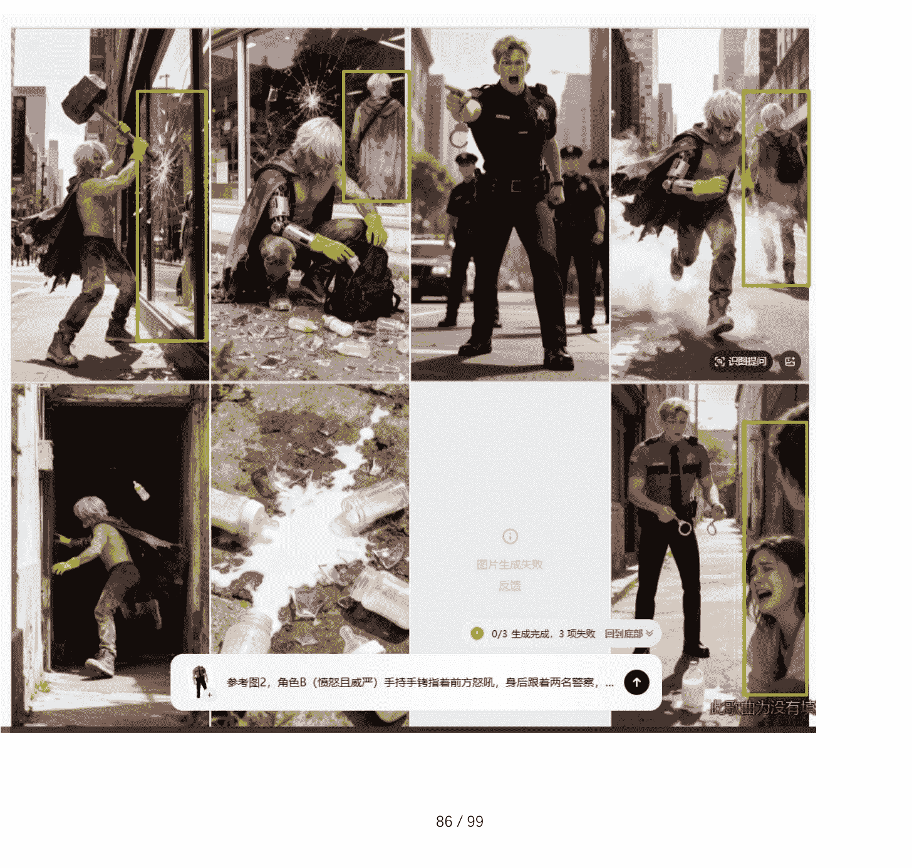

###### Banana Nano2 出图

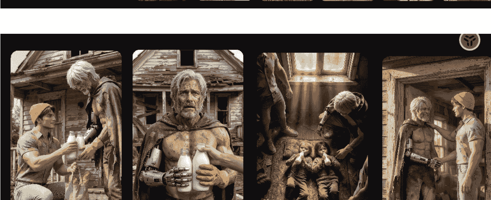

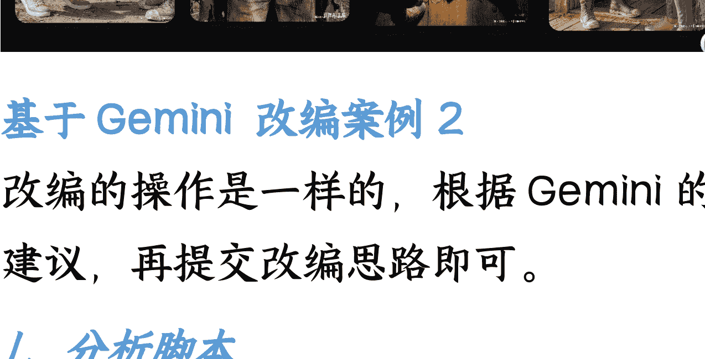

###### 基于 Gemini 改编案例 2

改编的操作是一样的，根据 Gemini 的改编建议，再提交改编思路即可。

####### 1、分析脚本

这里是基于您提供的图片序列（视觉输入）进行的 Sora 级文生视频场景架构设计。

######## 剧情分析拆解、改编建议及 UGC 用户评论分析

**剧情分析**：

- **核心剧情**：这是一个典型的“误会与时间差”喜剧。
- 1. **起因**：紫发女孩（角色A）在阳台刷漆，不慎碰掉了油漆桶。
- 2. **危机预想**：她脑补楼下的人会被淋成“绿巨人”。
- 3. **行动**：为了挽救局面，她疯狂奔跑下楼，甚至带了一把伞去接油漆。
- 4. **结局**：当她滑跪救场撑开伞时，却发现两个路人（角色 B 和 C）还是被淋了一身绿漆，或者她撑伞的时机/位置完全不对，场面一度非常尴尬。
- **情绪曲线**：悠闲专心 → 惊恐/焦虑 → 紧张冲刺 → 充满希望（滑跪） → 尴尬/崩溃。
- **角色关系**：角色 A 是闯祸者/试图补救者，角色 B 和 C 是无辜的受害者。

**改编建议**：

- **视觉增强**：在角色 A 脑补的画面中，可以使用漫画式的夸张特效；最后路人身上的绿漆可以具有高反光的粘稠质感，增强狼狈感。
- **情节微调**：结局可以是她撑开了伞，但油漆桶刚好砸穿了伞面，或者她滑跪过头了，完美错过了接住油漆的位置。

**用户评论预测**：

- “这就是所谓的‘无效救援’吗？笑死。”
- “油漆桶在空中飞了半集电视剧的时间。”
- “那把伞是用来接油漆的还是用来摆造型的？”
- “为了不让他们被淋湿，她选择亲自下去看他们被淋湿。”

######## 分镜提示词（静帧提示词）

| 分镜数 | 分镜提示词 |
|---|---|
| 1 | [主体]动作：角色A（专注而认真）手里拿着一把刷子，正在给栏杆刷绿色的油漆。[环境]高层公寓的阳台，背景是城市天际线和一道淡淡的彩虹。白天[视角景别]平视，中景 |
| 2 | [主体]动作：角色A（震惊又难堪）弯着腰看着栏杆下方，一只手僵在半空，嘴巴张成○型。[环境]高层公寓阳台，栏杆上有一半未干的绿漆。白天[视角景别]俯视，中景 |
| 3 | [主体]动作：角色B（自信而幸福）和角色C（开心）并排站立看着一台笔记本电脑，角色C戴着黄色无檐便帽。[环境]现代建筑的户外露台区域。白天[视角景别]平视，中景 |
| 4 | [主体]动作：角色A（惊恐）双手抱头，头顶上方有一个巨大的漫画风格气泡，气泡内显示角色B被绿色液体覆盖。[环境]阳台背景。白天[视角景别]平视，近景 |
| 5 | [主体]动作：角色A（焦急）在室内走廊奔跑，紫色的辫子甩在身后，动作幅度很大。[环境]现代风格的走廊，大面积玻璃窗。白天[视角景别]侧视，全景 |
| 6 | [主体]动作：角色A（匆忙）正从打开的电梯门里冲出来，身体前倾。[环境]金属质感的电梯间。室内[视角景别]平视，全景 |
| 7 | [主体]动作：角色A（慌乱）在宽敞的大堂里奔跑，双脚腾空。[环境]明亮的大理石地面大堂。室内[视角景别]低角度，全景 |
| 8 | [主体]动作：角色A（坚定又期待）在大堂门口顺手抓起一把紫色的长柄雨伞。[环境]大堂门口的伞架旁。室内[视角景别]平视，中景 |
| 9 | [主体]动作：角色A（急切）单手推开巨大的玻璃大门，另一只手紧握雨伞。[环境]现代建筑入口。白天[视角景别]平视，全景 |
| 10 | [主体]动作：角色B和角色C（困惑又好奇）双手抱头，抬头看着正上方，表情开始变得惊慌。[环境]户外露台。白天[视角景别]仰视，中景 |
| 11 | [主体]动作：角色A（充满决心和一丝疯狂）手里举着未打开的雨伞，向着镜头方向全速冲刺。[环境]户外铺砖地面。白天[视角景别]平视，全景 |
| 12 | [主体]动作：角色A（英勇）双膝跪地滑行，同时正在用力撑开紫色的雨伞。[环境]户外露台地面。白天[视角景别]平视，全景 |
| 13 | [主体]动作：角色A（充满希望）高高举起完全撑开的紫色雨伞，摆出防御姿势，闭着眼睛。[环境]户外露台。白天[视角景别]仰视，中景 |
| 14 | [主体]动作：角色 B 和角色 C（心碎般的悲伤）全身覆盖着粘稠的绿色油漆，呆若木鸡地站在原地，角色 A（震惊又难堪）举着干干净净的伞站在他们旁边。[环境]户外露台。白天[视角景别]平视，中景 |

######## 视频提示词（图生视频）

| 分镜数 | 视频提示词 |
|---|---|
| 1 | 镜头缓慢平移，角色 A 仔细地刷着栏杆，动作轻柔，背景彩虹微微闪烁 |
| 2 | 镜头急推（Crash Zoom），角色 A 猛地向下看，瞳孔放大，头发随风轻微飘动 |
| 3 | 固定镜头，角色 B 和角色 C 指着电脑屏幕谈笑风生，完全没有意识到危险 |
| 4 | 镜头晃动，角色 A 抱头尖叫，头顶的想象气泡中绿色油漆动态地流淌下来 |
| 5 | 跟随镜头，角色 A 在走廊狂奔，背景快速后退，产生速度线效果 |
| 6 | 镜头固定在电梯口，电梯门打开，角色 A 如炮弹般冲出，带起一阵风 |
| 7 | 低角度跟随，角色 A 跑过大堂，鞋底与地面摩擦，发辫剧烈摆动 |
| 8 | 动作特写，角色 A 一把抄起雨伞，动作连贯，没有丝毫停顿 |
| 9 | 镜头穿过玻璃门，角色 A 推门而出，阳光瞬间洒在身上 |
| 10 | 仰视镜头，角色 B 和角色 C 同时抬头，表情从困惑瞬间转为惊恐 |
| 11 | 正面跟随镜头,角色A面目狰狞地冲向镜头,手中紧握雨伞 |
| 12 | 慢动作镜头,角色A在地面滑行,雨伞在慢动作中“砰”地一声张开 |
| 13 | 环绕镜头,角色A保持举伞姿势,仿佛超级英雄落地,等待冲击 |
| 14 | 镜头拉远,角色B和角色C身上滴落着绿色的油漆,角色A慢慢睁开眼,收起伞,尴尬地笑了笑 |

####### 2、提交改编思路

剧情改编:紧张冲刺部分:角色A把伞背在身后,非常自信,骑上滑板,从楼梯扶手、高难度跳跃、最后通过一条旋转滑梯下到楼下。最后一刻,角色A却被一只猫吓到,角色A开伞挡猫,但却没有给角色B和角色C挡到油漆

####### 3、完成改编

脚本从一个典型的“误会与时间差”喜剧变成了一个“帅不过三秒”的极限运动喜剧。

这里是基于您的剧情修改要求(滑板跑酷、旋转滑梯、猫咪惊吓反转)进行的Sora级文生视频场景架构设计。

######## 剧情分析拆解、改编建议及 UGC 用户评论分析

**剧情分析**：

- **核心剧情**：这是一个典型的“误会与时间差”喜剧。
- 1. **起因**：紫发女孩（角色A）在阳台刷漆，不慎碰掉了油漆桶。
- 2. **危机预想**：她脑补楼下的路人会被淋成“绿巨人”。
- 3. **行动**：为了挽救局面，她疯狂奔跑下楼，甚至带了一把伞去接油漆。
- 4. **结局**：当她滑跪救场撑开伞时，却发现两个路人（角色B和C）还是被淋了一身绿漆，或者她撑伞的时机/位置完全不对，场面一度非常尴尬。
- **情绪曲线**：悠闲专心 → 惊恐/焦虑 → 紧张冲刺 → 充满希望（滑跪） → 尴尬/崩溃。
- **角色关系**：角色A是闯祸者/试图补救者，角色B和C是无辜的受害者。

**剧情分析**：

- **核心剧情**：这是一个“帅不过三秒”的极限运动喜剧。
- 1. **起因**：角色A误掉油漆桶。
- 2. **过程（酷炫）**：角色A为了赶在油漆落地前救场，化身极限运动员，背着伞踩滑板，通过楼梯扶手、空中跳跃和旋转滑梯极速下楼。
- 3. **转折（猫咪干扰）**：在最后落地的关键时刻，一只猫突然窜出。
- 4. **结局（无效救场）**：角色A下意识开伞挡猫，导致原本要挡的油漆全部浇在了角色B和C身上。
- **情绪曲线**：焦虑 → 自信/酷炫（跑酷中） → 紧张（落地） → 惊吓（猫出现） → 尴尬/崩溃。
- **角色关系**：角色A是身手矫健但运气极差的救场者，角色B/C是倒霉的路人，猫是混乱制造者。

**改编建议**：

- **视觉增强**：在滑板滑行和旋转滑梯的部分，使用动态模糊线和广角镜头来增强速度感和冲击力；猫咪出现的瞬间可以用夸张的惊吓特写。
- **情节微调**：为了增加戏剧性，角色A滑滑梯下来时可以是背对着角色B和C的，所以直到最后一刻才转身开伞。

**用户评论预测**：

- “操作猛如虎，战绩0-5。”
- “这滑板技术是用来送外卖的吗？”
- “猫：没想到吧，我是油漆桶派来的卧底。”
- “路人B和C：如果你不下来，我们可能还来得及跑。”

######## 分镜提示词（静帧提示词）

| 分镜数 | 分镜提示词 |
|---|---|
| 1 | [主体]动作：角色 A（专注而认真）手里拿着一把刷子，正在给栏杆刷绿色的油漆。[环境]高层公寓的阳台，背景是城市天际线和一道淡淡的彩虹。白天[视角景别]平视，中景 |
| 2 | [主体]动作：角色 A（震惊又难堪）弯着腰看着栏杆下方，一只手僵在半空，嘴巴张成○型。[环境]高层公寓阳台，栏杆上有一半未干的绿漆。白天[视角景别]俯视，中景 |
| 3 | [主体]动作：角色 B（自信而幸福）和角色 C（开心）并排站立看着一台笔记本电脑，角色 C 戴着黄色无檐便帽。[环境]现代建筑的户外露台区域。白天[视角景别]平视，中景 |
| 4 | [主体]动作：角色 A（自信而幸福）背上背着一把紫色的长柄雨伞，脚下踩着一块彩色滑板，眼神犀利。[环境]公寓楼道起点。白天[视角景别]低角度，中景 |
| 5 | [主体]动作：角色 A（充满决心和一丝疯狂）踩着滑板在楼梯扶手上进行磨轴（Grind）滑行，身体保持平衡，发辫飞扬。[环境]公寓楼梯间。室内[视角景别]侧视，全景 |
| 6 | [主体]动作：角色 A（英勇）连人带滑板在空中高高跃起，跨越两层楼之间的空隙，背景是模糊的楼层。[环境]公寓中庭。室内[视角景别]仰视，全景 |
| 7 | [主体]动作：角色A（兴奋）正在顺着一条银色的金属旋转滑梯高速滑下，身体倾斜，背后的伞紧紧贴着背部。[环境]巨大的螺旋滑梯内部。室内[视角景别]平视，中景 |
| 8 | [主体]动作：角色A（专注而认真）从滑梯出口冲出，滑板落地激起尘土，正好冲向[画面前景]的角色B和C。[环境]户外露台。白天[视角景别]平视，全景 |
| 9 | [主体]动作：一只黑白相间的猫（凶狠）突然从[画面左侧]的灌木丛中窜出，张牙舞爪地扑向角色A。[环境]户外露台。白天[视角景别]特写，侧视 |
| 10 | [主体]动作：角色A（惊恐）下意识地蹲下身体，将背后的雨伞拿到身前猛地撑开，挡在自己和猫之间，背对着油漆掉落的方向。[环境]户外露台。白天[视角景别]平视，中景 |
| 11 | [主体]动作：大量的绿色油漆（粘稠）从天而降，狠狠地砸在[画面后景]的角色B和角色C身上，油漆四溅。[环境]户外露台。白天[视角景别]平视，全景 |
| 12 | [主体]动作：角色A（松了一口气）躲在伞后看着猫，完全没意识到身后发生的事。[环境]户外露台。白天[视角景别]平视，近景 |
| 13 | [主体]动作：角色B和角色C（怒不可遏）全身滴着绿漆，像两个绿色的雕塑，死死盯着角色A的后背。[环境]户外露台。白天[视角景别]平视，中景 |

######## 视频提示词（图生视频）

| 分镜数 | 视频提示词 |
|---|---|
| 1 | 镜头缓慢平移，角色A仔细地刷着栏杆，动作轻柔，背景彩虹微微闪烁 |
| 2 | 镜头急推（Crash Zoom），角色A猛地向下看，瞳孔放大，头发随风轻微飘动 |
| 3 | 固定镜头，角色B和角色C指着电脑屏幕谈笑风生，完全没有意识到危险 |
| 4 | 镜头下摇，角色A帅气地将伞甩到背上固定，单脚蹬地启动滑板，眼神变得犀利 |
| 5 | 跟随镜头，角色A跳上扶手，滑板与金属摩擦火花四溅，她在高速下滑中保持完美平衡 |
| 6 | 慢动作镜头，角色A腾空而起，在空中调整姿态，滑板紧贴脚底，衣角猎猎作响 |
| 7 | 主观视角（FPV），镜头在旋转滑梯内高速旋转下降，光影快速交替，带来强烈的眩晕感 |
| 8 | 低角度跟拍，角色A冲出滑梯，一个帅气的急刹漂移，停在角色B和C面前不远处 |
| 9 | 突发镜头，猫咪突然从旁边跳出来，发出嘶吼，爪子挥向镜头 |
| 10 | 快速剪辑，角色A受到惊吓，瞬间拔伞、开伞，动作一气呵成，但这把伞挡在了她和猫之间 |
| 11 | 慢动作镜头，绿色的油漆像瀑布一样落下，精准地浇灌在毫无防备的角色B和C头上，激起绿色浪花 |
| 12 | 固定镜头，角色A在伞后拍了拍胸口，猫咪落地跑走，角色A脸上带着劫后余生的庆幸 |
| 13 | 镜头拉远，角色A慢慢收伞转身，看到两个“绿巨人”正滴着油漆瞪着她，角色A的笑容瞬间凝固 |

## 如何思考越分享越幸运？

分享出去是攒机缘，留在手里就是一瓶正在过期的雪碧。

不知道大家有没有发现，自己觉得是秘密，费劲心思藏来藏去的东西，藏了一阵后会发现，这玩意根本就不是"女儿红"，就是一瓶过期雪碧。

举个例子，最近有个朋友想跟我学油管，我几乎手把手去指点她每个阶段要做的事，但她也只能学到50%不到，一些经验和判断需要她亲自经历才能理解。

做油管的经验我也向几个经常做项目的伙计分享过，但伙计因为自身项目和精力的分配，并没有吸收太多。

所以，既然分享出去没有风险，那为什么不分享呢？分享本身就挺快乐的事，而且分享出去还可能会有意外的机缘。

## 最后，安利小懒的付费群：

### 懒人专属群（介绍）


懒人专属群持续更新中，已持续运营6年，整理超3000份各类精选付费文章&年费社群干货，全部开放下载。

本资料为付费群内部分享，仅供真实有需要的朋友查阅

### 懒人专属群更新记录：

https://hk57gvIx7u.feishu.cn/docx/HOkRdZbSbolBR0xkaXtcuVE0nTg

### 懒人专属群更新记录（需梯子，备用）：

https://lazybook.fun/blog/record2