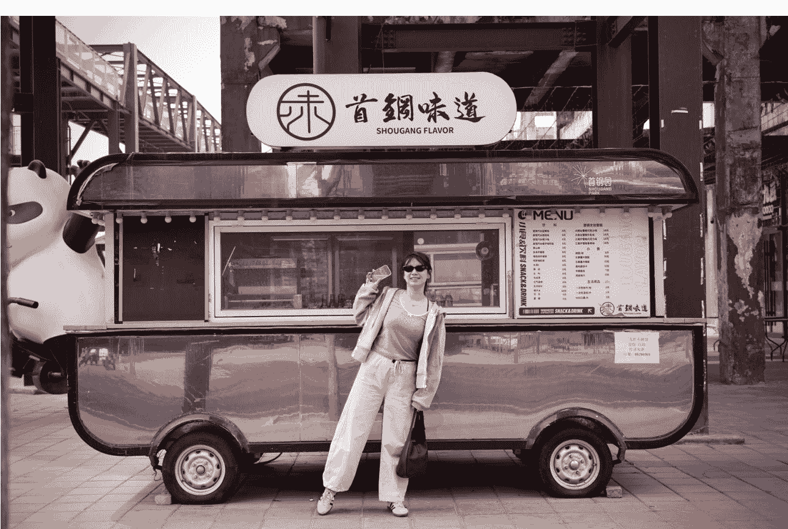
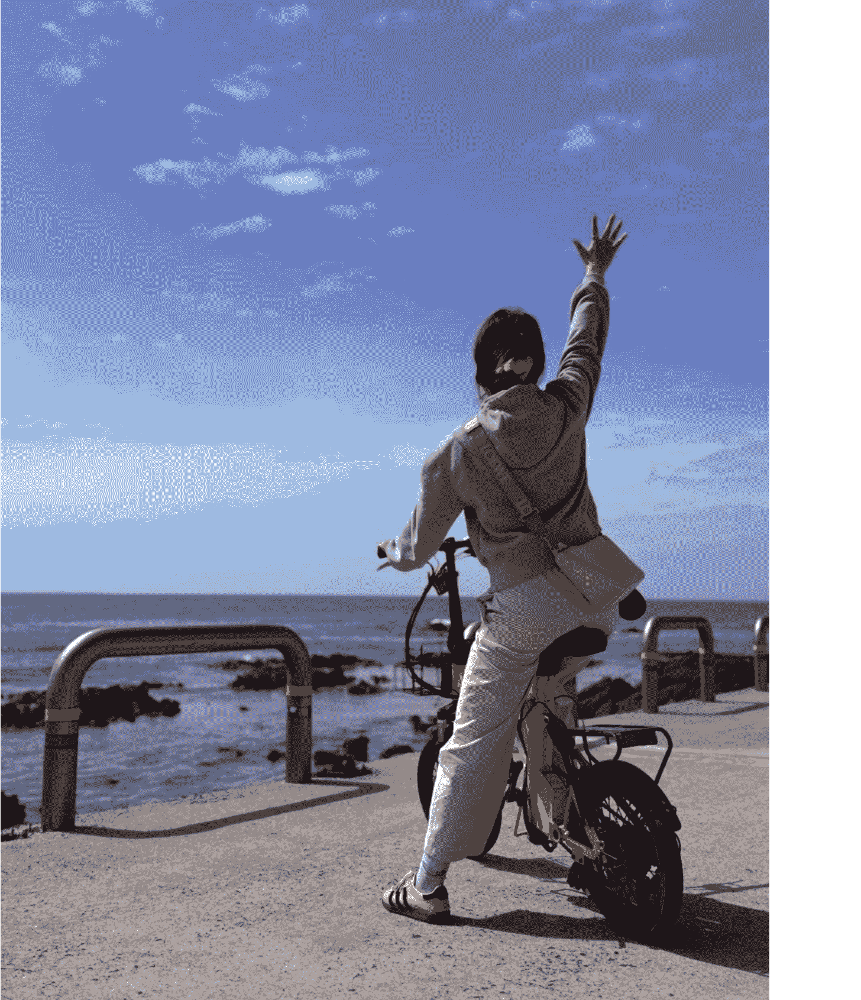
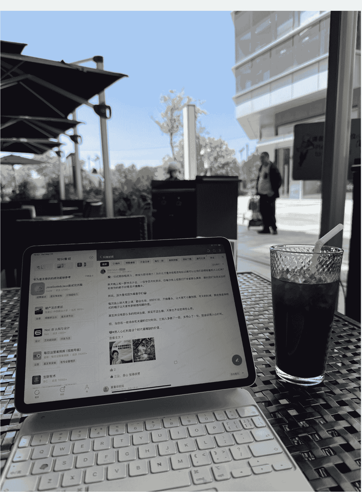
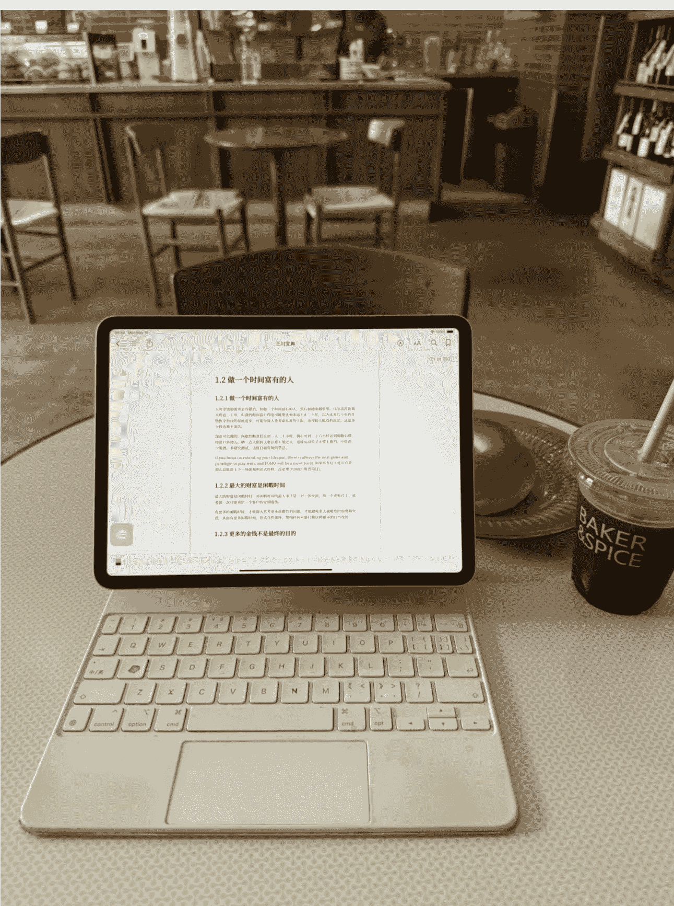
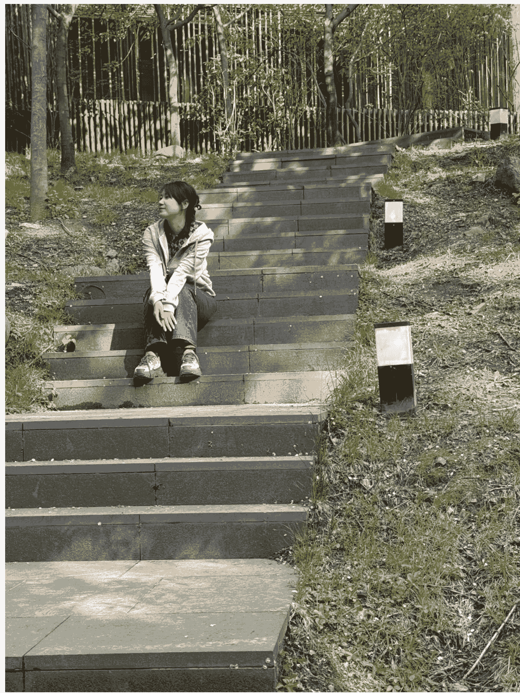
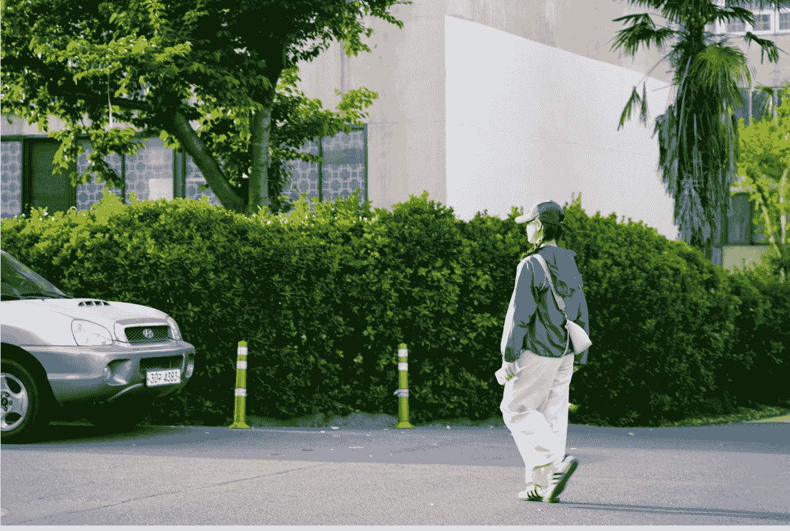
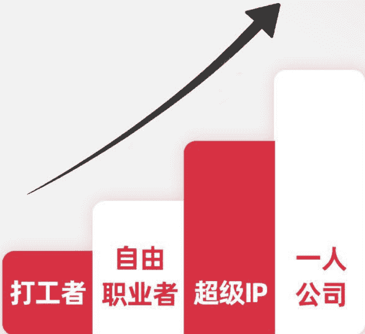
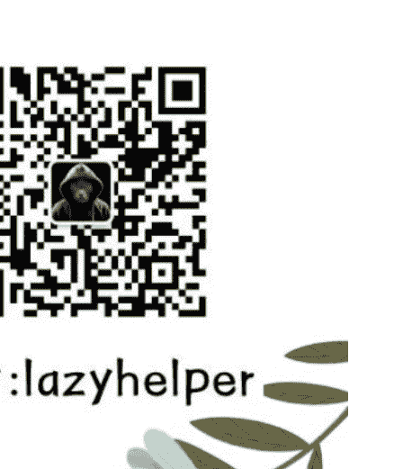

# 大家向往的自由职业生活，到底是什么样的？

251203 副业 SC 精华

公众号懒人搜索，懒人专属群独享
懒人微信：lazyhelper


Hello，我是芷蓝。7 年自由职业者。

看到小灯塔投票里，大家对「自由职业的真实日常，到底是什么样」十分感兴趣，我也因此受邀来分享一下关于自己做超级个体 7 年来的自由生活。





一提到自由职业，大家脑海里往往会先跳出这些画面：

> “不用上班、不用看脸色，时间完全自己做主。”
> “能把精力放在真正喜欢的人和事上。”
> “赚钱不再被天花板限制，付出和回报更直接。”
> “人生想试，就试；想闯，就闯。”

这些都对。但与此同时，更多的问题也会随之浮上来：

> “我已经吃够打工的苦了，自由职业的苦又有哪些？”
> “作为自由职业，最大的阻碍是什么？”
> “这条路能走多久？未来会是什么样？”

接下来想通过以下几个方向和大家聊聊，希望能给到大家一些启发，尤其是已经辞职，或者正打算辞职自己以1人公司的这种自由形态来创业的小伙伴们。

- 1/ 警示：不推荐裸辞，上班跟做副业完全不矛盾
- 2/ 芷蓝的 1 天：一个自由职业者的时间规划
- 3/ 自由职业的“苦”和阻碍
- 4/ 关于自由职业者赚钱之道和进阶之路

话不多说，咱们就开始吧～

## 一、警示

第一段，我要先写警示，这是最重要的，因为这个世界上永远都会存在幸存者偏差，任何一个创业者，一定是 80% 的失败概率，只有 20% 的人活下来，只有 10% 的人赚到了比之前更多的钱，只有那 5% 的人，会赚到很多钱。

所以，如果你现在还没辞职，正在上班，我完全不推荐你像我一样，成为自由职业者，更不推荐你裸辞，因为上班跟做副业完全不矛盾，甚至我觉得，上班的人，有一个稳定工作和收入的人，副业会做得更好。

### 我为什么这么说？

1. 有稳定的收入和稳定的生活节奏，你的心态就是平稳的，做事情就不会乱。
2. 你不会因为着急赚钱，而把自己的项目或者说个人IP做变形。
3. 你的公司，其实也是帮助你积累自己的优势技能，或者说给你做资源支持的有利资源。

好啦，友情提醒就到这里，接下来我会主要给大家分享2个部分的内容，一个是自己的自由职业者生活场景，一个是自己的自由职业者工作日常，enjoy。

## 二、芷蓝的一天是怎样的呢？

我在生财5年啦，然后自己辞职也已经7年了。

其实这几年我的生活方式没有太大的变化。熟悉我的小伙伴，每天都会看我的朋友圈，我的朋友圈基本就是我的生活&创业时间线记录表。

早上5点半左右起床，然后会回复我的客户的信息，或者写作更新星球和公众号，或者去跑步，或者去做早饭。

记住，不要每一天都做同样的事情，做重复的事情，是一个非常消耗人的场景，所以要每天换着样来。

7点左右，开始给孩子准备，然后8点孩子会去坐校车上学，我也就没事情啦。接下来，我会骑自行车，或者开车，或者步行去一个我自己喜欢的shopping mall，这个地方必须满足3个要求。

好看的咖啡厅+健身房+餐饮，因为我可以在这里解决自己的所有需求，比如说上午9点半左右，我可能会骑车到咖啡厅开始办公。

上午是最高效的，我1天的工作时间基本就是2-3小时，我有1个习惯，就是晚上电脑充满电，第二天不会带电源，包括手机也是。

设备没电了，就说明工作结束了，就算没结束，我也不干了，那说明我的效率上有问题，我要去修正它。

上午的时间是整段时间，在这 2-3 个小时内，我会进行 3 个事情，学习+输出+交付。

但是大家注意啦，对于我来说，这 3 个事情，其实都是 1 个事情，这也是我的 1 个工作心法：重要的事情，只有一件。

### 什么意思呢？

举个例子，比如说我更新自己的知识星球，就是交付我的年度会员客户，那为了交付客户，我就会去阅读各种书籍、各个知识星球的帖子、包括去实操一个项目、包括去找一个有经验的人聊天，聊的就是我的付费用户遇到的问题。

你看，我的阅读，我的输出，我的交付客户，我的各种事情，都被折叠到 1 个时间段里的一件事情上去做了。

我把这个再给你详细化一点，比如说我如果想教别人做个人 IP，那我就要更新不同赛道做个人 IP 的方法，除了我自己分享自己的方法，还会去搜集和采访其他人做 IP 的方法，那我去哪搜集呢？

这就要学习不同的人的课程，然后也可以在生财星球搜索某个领域 IP 的玩法，然后看她的文章，链接她，请教她，采访她，最后写文章沉淀。

你看，这个过程是不是融合了学习，阅读，输出，交付这些环节呢。

所以我说，重要的事情，只有1个，其他的都会被我折叠进来。

ok，上午的时间基本就这样啦，到了中午，我的1天工作基本就完成了。






吃饭，吃饭的时候，我可以约一个我的同城合伙人一起吃，或者就跟我家王先生一起，我们也是互为合伙人，聊工作，聊生活，一样的模式。

对于我来说，1人公司是商业模式，超级个体是我的身份，个人 IP 是营销工具，合伙人就是我的创业赚钱搭子。

清晰的结构，清晰的工作方式，我的生活和工作就会永远都在秩序中存在。

吃完饭，就是我的 happy time，先去做个 spa 或者美容顺便休息睡觉，然后下午就可以去跳舞，我特别喜欢跳舞，或者上瑜伽普拉提，或者打网球，羽毛球，反正就是各种运动时间，只不过依然是我的那个逻辑，不重复，一周 7 天，换着样来，还能认识很多新朋友。

运动完毕，下午我就回去接孩子放学，带他们上各种补习班或者体能课之类的，当然这个事情，我和王先生是交替进行的，今天我，明天他，这样我们 2 个人都可以有一整天的时间去学习，去娱乐，去社交，去一个人旅行，去做各种自己喜欢的事情。

这个也是自由职业者的一个最大的好处，有足够的时间去做体验生活，毕竟体验是人这一辈子活着的最好证明，或者说，体验的越多，你的人生就越完整。

下午晚上，我就不会用电脑来用整段的时间来工作了，都是手机碎片化的去回复一些客户的问题，包括随时在星球里更新一些碎片化的内容等等。

对于我来说，时间的使用逻辑是非常重要的，碎片化和非碎片化也是区别自由职业者和上班族的一个重要尺度。

最后，这个是我在北京的1天，我们每个月都会出去2次，旅行+见合伙人+学习，把同样的每天的工作流程，复制到其他的城市。

人还是要出去的，有困惑就出门，有问题就出门，想不通就出门，树挪死，人挪活，环境是我们可以创造的认知成长利器。

包括我们每年的寒假、暑假、国庆节和劳动节，也会带着孩子，全家人全国自驾去各个城市走一圈，现在我们已经把中国的所有省会去完了，接下来的目标就是所有5A级别的风景区。

我们还做了很多内容系列，比如说《周末不在北京》《跟着语文书去看中国》这些都做成了我家孩子的社会实践作业，孩子也非常喜欢。

能够真正参与到孩子的成长过程中，我觉得也是一辈子最有价值的事情。




## 三、自由职业的“苦”和阻碍

我已经自由职业第7年了，因为状态比较稳定，所以对我来说，这条路并没有想象中那么“苦”。但自由职业的确有不少隐性的难点。之前亦仁帮大家做过一轮自由职业的真实苦点收集，大家可以在这个帖子评论区里看看不同阶段的体验。
https://scys.com/articleDetail/xq_topic/1525841528218882

这些“苦”其实和自由职业的阻碍是一致的。从我观察和感受到的现象来看，我认为自由职业者最大的阻碍，可以分成三个维度。

### 第一个维度是陷入到出售自己单位时间的这个闭环里面。

很多自由职业者看似换了工作方式，但本质仍是用时间换钱。你的收入严格绑定在能工作多少小时，能接多少项目上，休息一下收入就归零。

这不是自由，这是把自己变成一个没有上限的打工机器。只要模式不改变，你的收入天花板永远等于你的体力上限。

### 第二个维度是虽然做自由职业者，但是依然按照每个月甚至是每天来赚取工资的这种思维方式。

很多人离开公司，却依然用按月赚钱的逻辑安排工作：只做当下能见钱的事、下意识追求收入稳定、不敢花时间沉淀长期资产。

这种思维会让你永远停留在生存模式。真正让自由职业者突破的事情，例如作品库、流程、产品化、IP，都需要时间，但你根本腾不出空间。

### 第三个维度是被自己的时间和精力上限卡住，每一年的收入只是上一年的重复而已。

如果你的收入完全依赖个人执行，那你会发现，你越努力越疲惫，但增长几乎停滞。今年和去年差不多，明年也大概率一样。

这不是你不努力，而是你的模型无法产生增长。只要没有可复利的东西，你的收入轨迹只会水平延伸，而不是向上突破。

## 四、关于自由职业者赚钱之道和进阶之路

那自由职业应该怎么去赚钱呢？自由职业的未来又是什么呢？其实这几年创业，我有2个维度要和大家分享。

### 第一个是时间维度。

我自己的这7年，其实前4年都是没赚到啥钱的，无非就是卖我的星球会员，然后每天非常苦逼的去私信，去推荐，然后各种混圈子，写知乎，写公众号等等。

4年前，我1个月最高峰也就是10万块钱，但是属于累死的那种状态。

4 年后，我开始做我的合伙人产品，开始联合我的合伙人一起去做新产品，包括线下舞蹈室的私域门店经营产品，还做了好多项目，比如说抖音探店，比如说小红书教辅，比如说闲鱼虚拟资料，比如说淘客等等。

我每个项目跑出闭环，就会把它做成相应产品来销售，这个就是我的逻辑。

对于自由职业者来说，是最好的变现方式，只要自己跑通，赚到钱，就可以包装出来去销售。

### 那另外一个维度是什么？就是身份的变化。

我估计很多小伙伴，还是没有搞清楚从打工者到自由职业，到超级 IP，到 1 人公司的区别，那我今天就用这篇文章来给大家解答一下这 4 种身份的底层逻辑和变化历程。以及，我认为自由职业未来之路就是 1 人公司合作模式，IP+IP。

#### 1、打工者

打工者赚钱的方式就是为老板出卖自己的个人单位时间。

公众号懒人搜索，懒人专属群分享

好处在于，公司有固定的工作流程，不用你自己去琢磨，而且有些工作是公司给你分配资源，你只要去消耗自己的时间就行了。

不好之处在于，老板发给你的工资一定小于你为公司创造的利益，比如说你给公司谈下了10个大客户，为公司创造了 1,000,000的收益，但你的工资有可能只有30,000块钱，再加上销售提成，最多也超过100,000。

你看这就是付出了十分的努力，只收获了一分的收益。

有人说让我混水摸鱼行不行？可以，但你永远聪明不过公司和老板，混水摸鱼一个月之后你就要被开除了，没有谁愿意给你白发工资。

而且作为打工者，你的时间和空间都受到限制，你说想自己去某个咖啡厅里面办公，抱歉，虽然可以完成工作，但不方便公司管理员工，你还是得过来坐班。

#### 2、自由职业者

自由职业者其实跟打工者唯一的区别就是你现在开始给自己打工了，然后自己给自己发工资。

但你获取收益的模式可能并没有改变，比如说你之前在一个互联网公司给公司的客户做产品包装设计，然后赚取工资。

你一个月设计三个产品，然后公司给你发8000 块钱，但是公司可能收了 80,000 块钱。

现在成为自由职业者之后，你一个月给别人设计一个产品，但你的收益可能直接就是 20,000 块钱。

所以你的商业模式并没有太大变化，只是从和公司做价值交换，变成了直接跟客户做价值交换。

但是你终究还是没办法突破自己的肉体和精神力极限，比如说你在公司一个月最多就能给客户设计三个产品，不会因为你成为自由职业者之后，就变成了四个，因为你每天就 24 小时。

#### 3、超级 IP

超级 IP 的好处是什么呢？就是你已经开始享受产品的溢价了。

比如说，你通过在自由职业者期间给 100 个客户设计产品，并且你有益积累这些成功案例，通过写作等方式输出，现在很多人都知道你在设计这个领域非常牛，知道你的水准非常高，知道你帮助过很多知名品牌做过产品，而且最后效果还不错。

那你现在就成为了一个超级 IP，超级 IP 的好处上面，我说了可以享受产品溢价。

以前你给别人设计一个产品是 20,000 块钱，那现在你的设计动作并没有变化，甚至可能连设计水准也没有变化，但你就可以卖到 30,000 块钱了。

这个逻辑是什么呢？就是当用户购买你的产品的时候，他也是在向他的客户宣告：你看，我们的产品可是由专业大师设计而成的，所以你们放心买就行了。

当然，做超级 IP 的同时，你就要开始研究如何在同一时间把自己的价值变成多份来销售。

那你需要的工具就是，你要把自己的经验、案例、技能和方法沉淀成一套知识产品，然后进行销售。

这样边际成本就会变得无限低，你卖出一套课程和卖出 100 套课程的成本没啥区别。

#### 4、一人公司

从超级 IP 变成一人公司模式，有的人觉得没啥变化，我还是一个人吗？

这个想法是错误的，变化很多，比如说你可能要从一个人独立工作变成多人线上一起协作。

就好像我跟我的合伙人一样，平时没有项目的时候，大家各自做各自的事情，当有了项目的时候，比如说一场群发售，那我们就要统筹协调，你来做推流，我来做文案，他来做社群引导。

这个协作能力是需要慢慢修炼的，而且协作关系也是需要慢慢沉淀的，我之前在推文里也给大家分享过，关系只能通过一次次的合作打磨出来。

包括你的商业模式的改变，之前有可能通过个人IP内容输出来获取流量，那成为一人公司之后，可能就要多人协作通过一个公司品牌来获取流量了。

总之，我觉得这四个步骤想全部走一遍，至少也需要五年以上的时间，我自己现在就是走到了一人公司这个阶段，当然也有很多卡点，比如说利益的分配，比如说工作流程的优化等等。

但目的不变，只有3个，一个是最大程度的节省成本，第二个是最大程度的获取收益，第三个就是尽可能的让自己更舒服一些。

想问问大家，你觉得目前自己正处于哪一个阶段？

好啦，分享结束，不知道大家对自由职业是否有了更深的了解。大家有啥问题欢迎评论留言，找我沟通呀~



## 自由职业生活

- 01 不要陷入到出售自己单位时间的这个闭环里
- 02 不要是每个月或每天来赚取工资的思维方式
- 03 不要被自己的时间和精力上限卡住



自由职业未来之路就是1人公司合作模式，IP+IP。

对于自由职业者来说，时间的使用逻辑是非常重要的。不要每一天都做同样的事情，做重复的事情。

## 最后，安利小懒的付费群：

### 懒人专属群（介绍）



📚 懒人专属群持续更新中，已持续运营 6 年，整理超 3000 份各类精选付费文章 & 年费社群干货，全部开放下载。

本资料为付费群内部分享，仅供真实有需要的朋友查阅 🙇

### 懒人专属群更新记录：
```
https://hk57gvlx7u.feishu.cn/docx/H0kRdZbSbolBR0xkaXtcuVEOnTg
```

### 懒人专属群更新记录（需梯子，备用）：
```
https://lazybook.fun/blog/record2
```