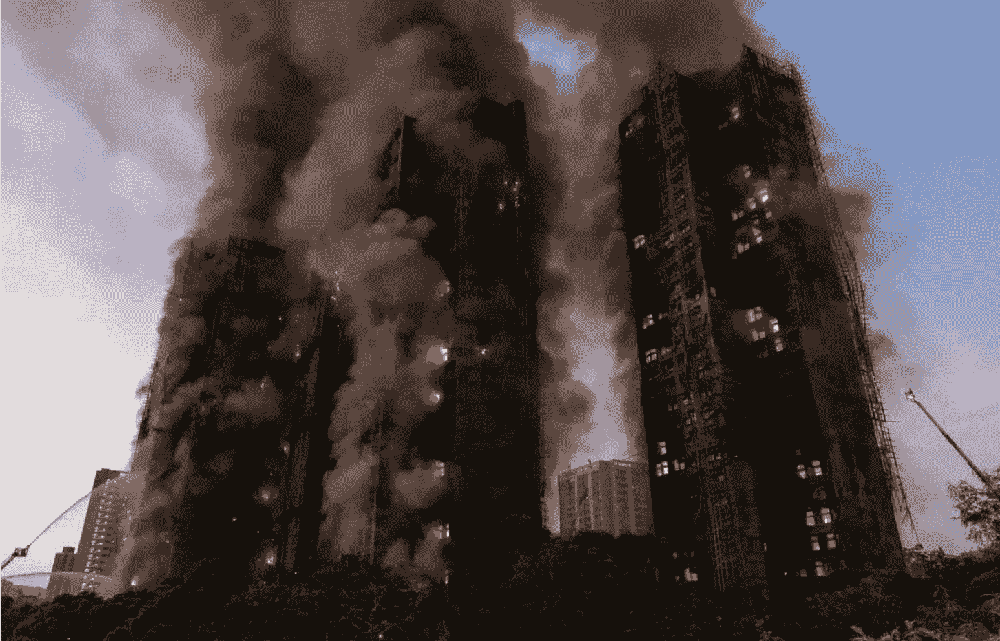
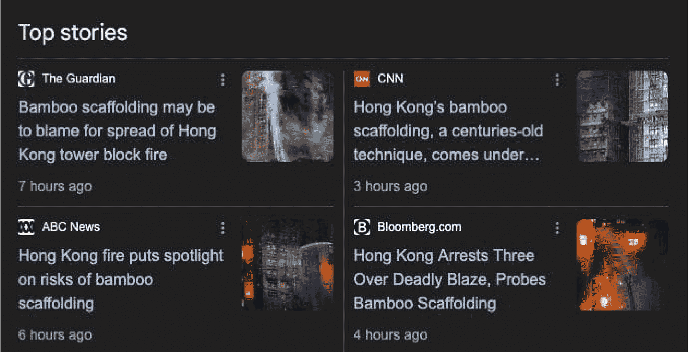

# 香港大火后的舆论场

251203 新闻实验室

整理：公众号懒人搜索，懒人专属群独享
懒人微信：lazyhelper

> “为什么出事，只见「物质」，不见「人」和「制度」？”

11 月 26 日，正在进行大型维修工程的香港大埔宏福苑发生大火，燃烧逾 43 小时，已经造成至少 128 人死亡，是二战之后香港最严重的火灾。

目前，关于火灾的成因还在调查中，灾后重建之路更是漫长。在本期新闻实验室会员通讯中，我提供一些对于这两天舆论场的观察。

## 竹棚：罪魁祸首还是信息污染

这两天，关于这场大火，最常被提及的是大楼外的竹棚（竹质脚手架）。

从视觉上来说，竹棚的确是显眼的存在。对香港以外的受众来说，竹棚是令人感到意外的存在（对于香港居民来说，则是司空见惯的日常）。所以，外界对竹棚的关注和疑问是可以理解的。

问题是，这是关于这场火灾的一个错误的焦点。

一个简单的事实是：其他类似的大火，例如 2010 年造成 58 人死亡的上海胶州路大火，当时大楼外的脚手架是钢架，但灾难性的后果是相近的。而且，钢架被烧红后更令人难以接近。（官方对胶州路大火的调查结果是：“电焊工人违章操作，致使易燃的尼龙安全网遭焊渣点燃”。）也许竹子真的让大火烧得凶了一点，但是，即便宏福苑外面的脚手架全部是钢架，而其他条件不变，这次的火灾也不会有什么大的差别。

实际上，多家媒体对行业专家的采访都揭示出，比起竹棚，火灾发生和迅速蔓延更直接的罪魁祸首可能包括：未符合防火标准的外墙保护网，以及在所有窗户上安装的发泡胶板。（特区政府在 11 月 28 日下午发布消息说，大厦外围的棚网、保护网达阻燃要求，但贴在窗外的发泡胶板高度易燃。而《明报》的报道则说，最初使用的棚网确实不易燃，但台风后新补上的棚网易燃。）

以上信息实际上在火灾早期就已经被披露，为何许多文章和评论依然围绕着竹棚展开？而且不仅是中文内容，英文媒体的报道也普遍以竹棚为着眼点？

img

外媒找错重点，可能是出于一种东方主义、异国情调式的视角——竹子本身就被视为一种东方的植物。

而中文舆论场对竹棚的关注，则带有寻找替罪羊和转移焦点的嫌疑。用前媒体人来福的话说，这是一种“信息污染”。他认为：“竹架是否应该被取缔，是一个可以讨论也在持续讨论的问题，这个社会仍有机制在承载这种讨论和行业更替。但这场大火之后，这个行业会成为问责的替死鬼。制度、法律和持份者的责任不会被追究。香港得到的，是一种可以忽视任何从业者声音、利益、饭碗的一刀切模式的引入和执行。”

微信公号作者“大玉米地”也有类似的看法。她总结说：“一个城市真正的衰老，不是从经济数字开始，而是从专业主义缺席、风险意识迟钝、治理习惯依赖侥幸开始。当最复杂的问题总是被用最简单的方式打发掉，当真正的责任总是被缩写成几个替罪羊的名字，这个城市就已经不再是人们心目中那个香港。"

以竹棚和竹棚业香港联会为替罪羊，还被一些观察者视为让行业协会、社会组织背锅，进而打击公民社会、加强权力干预的策略。

当然，内地的很多网民并没有想那么深，他们乐于传播关于竹棚的内容，更多是因为他们从中得到了一种“进步”vs“落后”的叙事，从而获得心理满足感。

而如今的香港特区政府，极易受内地舆论影响（早前坊间就有“小红书治港”的调侃，意即特区政府极为重视小红书上的相关意见并迅速反应）。特区政府迅速推进金属棚架取代竹棚架的计划，很有可能就是这种影响的体现。

# 追责的方向与限度

如果说竹棚只是一个替罪羊，那么真正值得追下去的方向和线索有哪些？

最直接的，显然是整个维修工程当中的诸多（疑似）违规的操作。

除了上文提到的极为易燃的发泡胶板，不少报道都提及：火灾发生后，楼里的火警警报并未响起。据说，这是为了方便维修工人通过消防通道进出。《明报》的报道还说，有保安曾经几次向上报告这个问题，但未获回应。这些都是直接导致火情迅速发展而人员未能及时撤离的原因。

此外，维修工程期间，政府其实多次检查，但都没有发现问题。甚至，建筑工程师潘焯鸿从一年多前开始，就多次向消防处、屋宇署及劳工处等部门投诉可能的消防问题，但没有获得有效回应。其中一份回应甚至称，发生火灾的风险“相对为低”。

劳工处在回复媒体“法庭线”查询时说，从2024年7月起，多次就宏福苑维修工程作出工作安全巡查，至今年11月期间，对宏福苑工程共进行了16次巡查工作，而最近一次于上周四（11月20日）进行。这次巡查的原因正是收到工人抽烟的投诉，巡查后的处理方式则是书面提醒承建商采取适当防火措施。但是，这样的巡查工作未能避免火灾的发生。

更进一步，宏福苑八栋楼的大修工程本身，就充满了问题和争议。

一般而言，这样的工程不会八栋楼同时进行，除了“火烧连营”的风险之外，同时进行维修也需要更多的工人和更多的材料，导致更高的成本。为何会通过这样的方案？

据TVB报道，宏福苑维修工程造价达3.3亿元，而中标时的报价仅为1.52亿元，市建局的估算则只有 1.44 亿元，工程招标后发生过不少争议。

《明报》报道说，维修工程由宏福苑“业主立案法团”通过后，引起大量业主不满并举办特别大会罢免，选出法团新成员。

关于维修工程，有一个在香港的媒体报道和社交媒体上被多次提起，但内地舆论场几乎无人提及的人物：隶属于民建联的大埔区议员黄碧娇。《明报》说，黄曾任宏福苑法团的法团事务顾问，并在 Facebook 呼吁支持涉事旧法团成员留任。她曾经发帖称：

“连日来协助宏福苑大维修填写资助计划亦代递交表格”、“大维修工程现正进行得如火如荼之际，必须同心同德为稳定屋苑为顺利完成大维修支持现届法团继续留任！反对罢免！”

“如火如荼”四个字，在如今看来是如此的刺眼。（民建联声明表示，该党从未参与宏福苑大维修招标或相关工程事宜。黄碧娇回复传媒时说，大维修工程已由新一届法团与顾问公司及承建商自行洽商，“因为这一区区议员不是我覆盖，要去到研究、讨论这么深，未曾有这个信息”。）

当然，任何人是否需要为这起悲剧负责，最终都要看司法机构的调查和决定。这场大火显然是一场人祸，能够调查和追责到怎样的地步，也是对当前香港制度的一次测试。

一些内地网民翻出《生产安全事故报告和调查处理条例》中的条款，造成30人以上死亡的事故，属于“特别重大事故”，基本上都由国务院调查组负责调查，时常需要问责省部级领导（我在《南方周末》工作时曾经专门写过这个话题）。有人询问条例是否适用于香港——答案是否定的。2010年的上海胶州路大火后，时任上海市长的韩正被责成向国务院作出深刻检查，同时有官员被控涉嫌滥用职权罪与受贿罪。这次，特首李家超以及港府其他高官是否会被问责，值得关注。

1996年11月20日，佐敦嘉利大厦发生大火，造成41人丧生。火灾发生不到一个月之后，时任港督彭定康委任胡国兴法官为独立调查委员会主席，要求全面调查大火成因、检讨当局应变措施，并提出防止惨剧重演的建议。

在今日的香港，是否还能成立独立的调查委员会？如果没有足够的监督制衡机制，市民对港府的信心如何恢复？“由治及兴”的承诺如何兑现？这些问题都在等待答案。

# 媒体表现：从机构媒体到意见领袖

接下来，我们总结一下媒体的表现。首先，香港各家媒体的跟进报道大体仍是有足够空间的，还不至于进入“等通报”的年代。TVB、Now TV、HK01 等电视媒体和网媒都做了长时间的视频直播，文字媒体也在从各个角度跟进。

从上文引用的媒体可以看出，到目前为止，《明报》的追问和调查是较为全面和到位的。端传媒在大火后 24 小时的总结也做得不错，虽然文字上一贯比较啰嗦。接下来，是否能有独家调查内容出街，是比拼各媒体调查报道能力的时刻了。

内地媒体的跟进也很快，但如上文所说，受竹棚这个伪目标的干扰较大，且一旦涉及更为本地的话题和政治生态，就显得依然是颇为隔膜。当然，涉及香港的话题依然是有尺度限制的。比如，兽爷的文章《香港最大火灾，一场跨越四十年的“清算”》，其实并未涉及什么太敏感的层面，却在微信公号中被删除。

值得一提的，是香港的社交媒体上涌现出的一些个人意见领袖和极小型媒体，他们的速度、总结能力均令人印象深刻。

例如，港大新闻学生 Ellie Yuen 在 Instagram 和 Threads 上发布的懒人包以及短视频传播甚广，其制作风格与欧美 news influencer 在 TikTok 上短视频的风格非常接近。

再例如，一位名为“爆炸头”的独立记者，在 Instagram 上发布的“宏福苑3.3亿天价维修回顾”不仅获得了数万次点赞，而且被广泛转发到其他平台，包括一些微信群里。

而本地一家主打旅游的咖啡馆/书店/空间“渴喝”在Instagram发布的懒人包，同样是流传非常广。

在Facebook上，本身已是意见领袖的前香港天文台台长林超英直接发问：“为什么出事，只见「物质」，不见「人」和「制度」？”

和世界其他地方一样，香港人的新闻获取也已经高度依赖社交媒体上的意见领袖。由于他们基本都在Facebook、Instagram、Threads等墙外平台上发布内容，内地网民接触并不多，所以墙内的受众可能会低估这个群体的实际影响力。

最后推荐一篇来自界面文化的文章《英国21世纪最严重的住宅火灾是如何发生的》，看似讲的是英国，却句句让人想到当下：“为什么一种可燃材料能被用于成千上万栋建筑？为什么监管被允许松动？为什么住户的声音被长期忽略？为什么公共安全被当作成本而非价值？阿普斯将问题的根源指向了距离火灾现场遥远的办公桌，在那里，预算、商业竞争、监管语言、政治取向交织成一张巨大的网络，把住户的风险扩大成全社会的隐患，却无人承担责任。”

# 最后，安利小懒的付费群：

## 懒人专属群（介绍）

📖 懒人专属群持续更新中，已持续运营 6 年，整理超 3000 份各类精选付费文章 & 年费社群干货，全部开放下载。

本资料为付费群内部分享，仅供真实有需要的朋友查阅 🙏

## 懒人专属群更新记录：

https://hk57gvlx7u.feishu.cn/docx/H0kRdZbSboIBR0xkaXtcuVE0nJg

## 懒人专属群更新记录（需梯子，备用）：

https://lazybook.fun/blog/record2