# 小红书买手航海复盘，平台红利下的两个冷启动路径（直播与笔记）

## 251204 副业 SC 精华

公众号懒人搜索，懒人专属群独享

懒人微信：lazyhelper

## 一、前言

### 个人介绍

我是小朱（百万版），广州家居产品经理，36 岁，生财 2 年会员，6 次志愿者；加入生财前，日更公众号 100 天、做过短视频等副业变现约等于 0。

加入生财做过很多项目，给我带来最多变现反馈，是小红书平台，这是一个对普通人友好，而且能拿到大结果的平台。

### 小红书买手 mini 航海

小红书买手航海是我经历过反馈最快，最精准的一次航海，出单真的是红利，你想在小红书平台拿到反馈，可以看下这文章，我第 1 天直播成功卖出 3 单；航海期间 GMV 1500，佣金 150+。

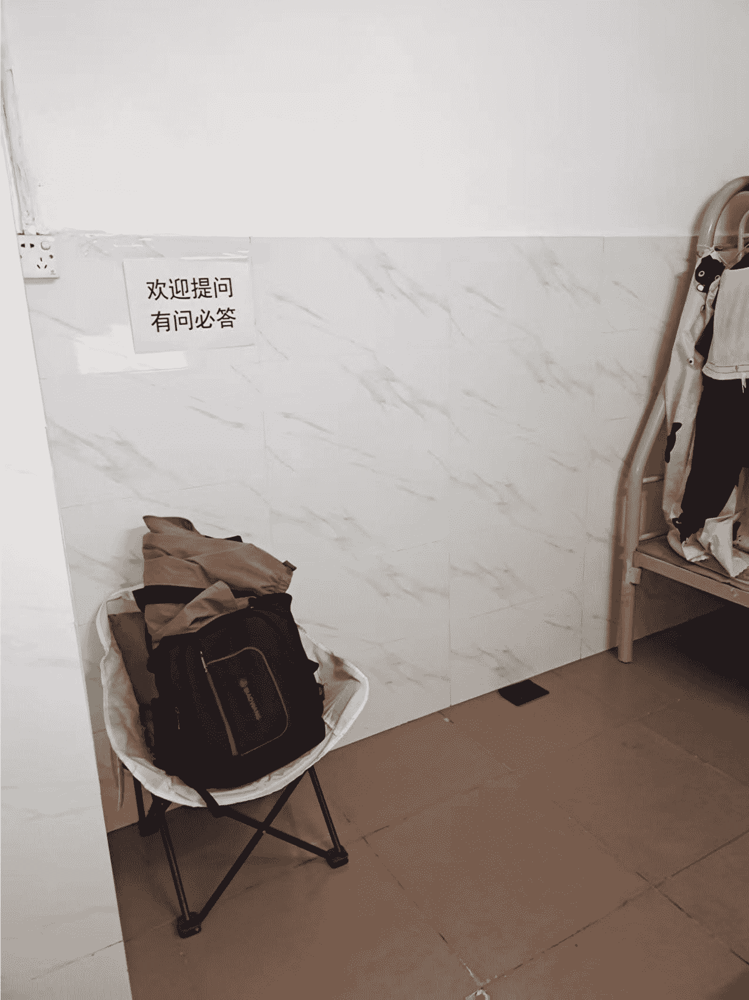

直播讲解 | 一起的感觉

## 二、赛道选择

### 拿到反馈的赛道

我做航海前会先看一篇手册，然后把航海直播也看一次，谢无敌教练是给我们总结了不少赛道，同时还提示直播买手有官方扶持，结合我自己是家居产品经理，同时我还租了单间，我决定做出租屋改造博主（这个并没有带来大的变现）。

### 小建议

前期我们做项目时，可以先选一个赛道，动起来，这个阶段结果是先动起来，做一个笔记，一个视频、一次直播，再烂也得动起来，然后再迭代，优化变现；赛道不是一选定终身，新手要“先启动再优化”，而不是纠结到不敢动手。

- 借势平台：优先选教练提到的“官方扶持赛道”（比如当时的直播买手），平台给流量加持，出单概率翻倍
- 结合优势：用自己的职业、兴趣或生活场景赋能，比如我做家居相关，对产品卖点更敏感
- 轻量启动：别先囤货！先靠选品中心的商品测试赛道，像我前期没买样品也能出单，降低试错成本

## 变现的逻辑

### 红利！

重要事情说三次。看前面这么次的直播背景、器材，都能拿到结果，这个切实是小红书平台给买手们的红利。因为小红书要把内容与商品在小红书平台内闭环，以前有一些商品会给导流到其他平台，这部分小红书没有拿到利益。现在小红书平台商品已经很丰富，需要买手去真实测评，把好产品发掘出来，提供给用户。

小红书买手变现，比商铺更容易，只要你愿意直播、愿意做笔记、就会有精准推流。

### 为什么这么简陋的配置都能出单？核心是

“小红书商业化闭环的红利”！

在任何平台变现，都需要与平台一起赚钱，才能长久，既然小红书要商业化，买手们就是小红书平台的销售，把小红书的流量，变现。

## 变现的方式

### 路径1：直播变现——从场观9人到出单9个，我靠“货架逻辑”破局

我最快的反馈是直播，根据手册提示，把小红书买手选品里，把容易出单的商品加入到自己的橱窗，同时上架直播。现在小红书直播有激励，挂20+商品，直播2小时，就奖励流量卡。

我一开始就打算笔记 +直播 2条路子一起做，因为我以前有外卖CPS直播的经历（拿回10倍门票），脸皮变厚了，就算没有人，我也能直播2小时以上。外卖CPS前5次直播场观不高，后来坚持直播，做到2000场观，给我带来400个订单。

- 选品：去“买手选品中心”搜“高佣”“易出单”标签，优先加家居日用品、性价比小百货，凑够20件商品（重点！挂够20件直播2小时，能拿官方流量卡奖励）
- 心态：别怕没人看！我之前做外卖CPS直播，前5场场观都很低，坚持到后来场观2000+、400多订单，脸皮“厚”是副业刚需

11月10日，那天，谢无敌教练分享他们的直播间，卡卡的涨粉，给我很大的激励，平台扶持的具象化。

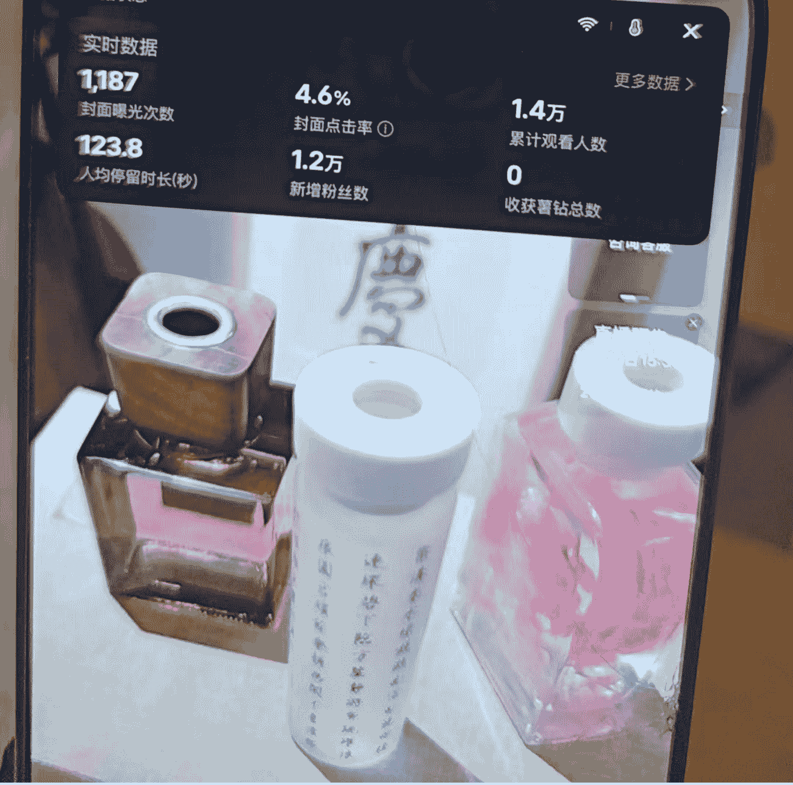

当天就决定，小红书直播，我是打定就算没人，我也会直播挂着，直播4小时，偶尔说一下话，给自己帐号做做数据，11月10日2场，第一场直播1.5小时，场观9人，感觉没什么人，有点怀疑自己账号，同时挂的商品不够20个，拿不到官方激励。

- 第一场直播（1.5小时）：场观9人，0出单。问题出在2点：商品没挂够20件，拿不到官方激励；选品不够精准。

- 立刻优化：下播后补选易出单商品到 20件，马上开第二场。
- 第二场直播（2小时）：场观 36 人，出9 单！GMV 539 元，观看支付率 25%

**第一场直播数据：**
| 直播标题 | 时间/时长 | 观看数 | 总支付金额 | 实际支付金额 | 支付订单数 | 支付人数 |
|---|---|---|---|---|---|---|
| 出租房开荒+聊天 | 2025-11-10 18:11 (1小时26分钟) | 9 | ¥0.00 | ¥0.00 | 0 | 0 |

**第二场直播数据：**
| 直播标题 | 时间/时长 | 观看数 | 总支付金额 | 实际支付金额 | 支付订单数 | 支付人数 |
|---|---|---|---|---|---|---|
| 出租房香薰，聊天 | 2025-11-10 20:11 (2小时24分钟) | 36 | ¥539.19 | ¥378.87 | 9 | 8 |

公众号懒人搜索，懒人专属群分享

### 选品中心

香芋紫陶瓷串、搜索、橱窗好卖、易出单、人气红榜、选爆款、已售19.2万、已售31.5万、已售17.2万、已售12.2万、平台精选、宠粉清单、商品机制好、广州十三行女鞋工厂…新款冬季厚底防15%佣、申申的化妆教学在带【申珅专属】红10%佣、趋势带货、选品服务商、粉丝心愿单、官方选品会、推荐、宠粉清单、时尚、美护、运动户外、家居、我购买过、商单合作过、好评多、可拿样、佣金高

| 商品名称 | 标签 | 售价 | 佣金 | 销量 | 评价 | 店铺 | 评分 |
|---|---|---|---|---|---|---|---|
| 卡通刺绣小狗袜子女奶油色长袜ins潮纯棉春夏可爱百搭菱格 | 可拿样, 运费险 | ¥19.9 | 10% | 33 | - | 小哈在变瘦的店 | 4.6 |

首页、联系记录、选品管理、我的

> 重点：这场出单我完全没准备：没有样品，没详细解说商品，就把直播间当成“线上货架”。用户都是平台精准推送来的，自己看商品下单——这就是新手期的红利！

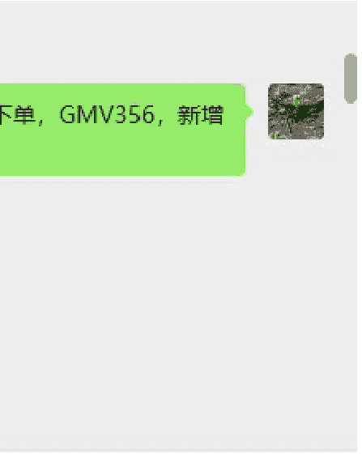

后来只有晚上有空就直播，挂商品，就算没人也挂着，测试出单情况，除了双11晚上，还有13号晚上有出单，这些出单商品，我都没有样品，只是嘴上说说，欢迎新进直播间的宝宝，巴拉巴拉，后来这个货架的逻辑失效，可能是新手期结束，开始要考验我的“人货场”。

公众号懒人搜索，懒人专属群分享

### 交易分析 | 商品分析 | 粉丝分析

- 橱窗
- 直播
- 近30日

| 直播标题 | 时间/时长 | 观看数 | 总支付金额 | 实际支付金额 | 支付订单数 | 支付人数 |
|---|---|---|---|---|---|---|
| 光腿神器到货了.需要上身测评 | 2025-11-13 20:11 (2小时2分钟) | 111 | ¥460.35 | ¥430.37 | 6 | 6 |
| 购物返场，情感聊天 | 2025-11-12 19:11 (2小时3分钟) | 9 | ¥0.00 | ¥0.00 | 0 | 0 |
| 双11购物狂欢夜 | 2025-11-11 18:11 (3小时38分钟) | 94 | ¥226.30 | ¥105.80 | 17 | 16 |

### 交易分析 | 商品分析 | 粉丝分析

| 直播标题 | 时间/时长 | 观看数 | 总支付金额 | 实际支付金额 | 支付订单数 | 支付人数 |
|---|---|---|---|---|---|---|
| 家里来了大马蜂你们看看我下去打羽毛 | 2025-11-16 10:11 (1小时56分钟) | 8 | ¥0.00 | ¥0.00 | 0 | 0 |
| 光腿神器，不勒腰，不勒脚 | 2025-11-14 19:11 (3小时10分钟) | 20 | ¥0.00 | ¥0.00 | 0 | 0 |
| 光腿神器到货了.需要上身测评 | 2025-11-14 18:11 (5分钟) | 3 | ¥0.00 | ¥0.00 | 0 | 0 |

坚持直播一段时间后，“纯挂商品”的方法不管用了（新手期结束）。我立刻做了2件事：

- 回归出租屋赛道，采购样品把出租屋改造成直播间+实拍场地
- 优化直播话术：不再只说“欢迎新进宝宝”，而是简单介绍商品卖点，比如“这...”。

## 笔记变现过程

在直播期间，我同时有做出租房改造，把卫生间进行改造，流程是，我先搜索出租屋改造，看一下爆款有什么痛点，发现返臭、墙面改造可以做，我就卡卡的在买手中心选样，发现有些样品只要你笔记带货，商品无需，可以退款，等商品到位，就实拍笔记带货，履约然后去退款。（要注意要先跟商家核实，避免后续要退货）

- 卫生间改造
- 卫生间布置
- 卫生间返臭味怎么办
- 卫生间清洁
- 卫生间窗户遮挡
- 卫生间置物架
- 卫生间纸巾盒
- 卫生间收纳
- 卫生间香薰
- 卫生间改造翻新
- 卫生间垃圾桶
- 卫生间好物推荐
- 卫生间小飞虫
- 卫生间吸水地垫
- 卫生间布置高级感

### 选品中心

- 推荐、宠粉清单、时尚、美护、运动户外、家居
- 我购买过、商单合作过、好评多、可拿样、佣金高

| 商品名称 | 标签 | 优惠价/售价 | 佣金 | 销量 | 评价 | 店铺 | 评分 |
|---|---|---|---|---|---|---|---|
| 前扣美背内衣女小胸聚拢显大无钢圈上托防下收副乳夏季无 | 可拿样, 运费险 | ¥29.9 | 13% | 5万+ | 4.1 | Touh（保暖… | 4.4 |
| 奶油彩点碗碟套装家用餐具碗盘高颜值新款清新陶瓷釉下彩 | 可拿样, 运费险 | ¥6.8 | 10% | 33 | - | 小见坊的店 | 4.5 |
| 友好市集 治愈系小夜灯相框摆台画框床头灯LED氛围灯创意生 | 可拿样, 运费险 | ¥2 | 10% | 97 | - | rou蟹宝的店 | 4.7 |
| 新款二合一电容手机平板通用控笔绘画手写笔修图 | 可拿样, 运费险 | - | - | - | - | - | - |

首页、联系记录、选品管理、我的

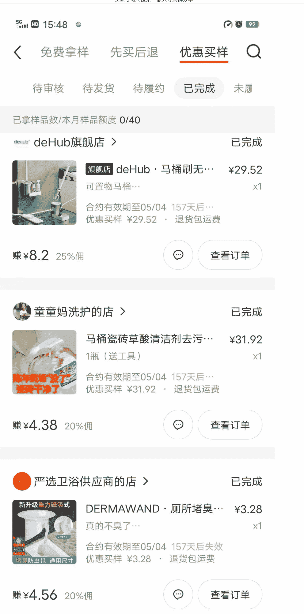

一开始我做出租房改造笔记，直接挂改造商品链接，结果流量特别差（小眼睛不到100）。看教练答疑才知道：笔记挂商品后，平台推的是“商品流量”，不是“内容流量”。

新手想先起流量，别直接挂链接！

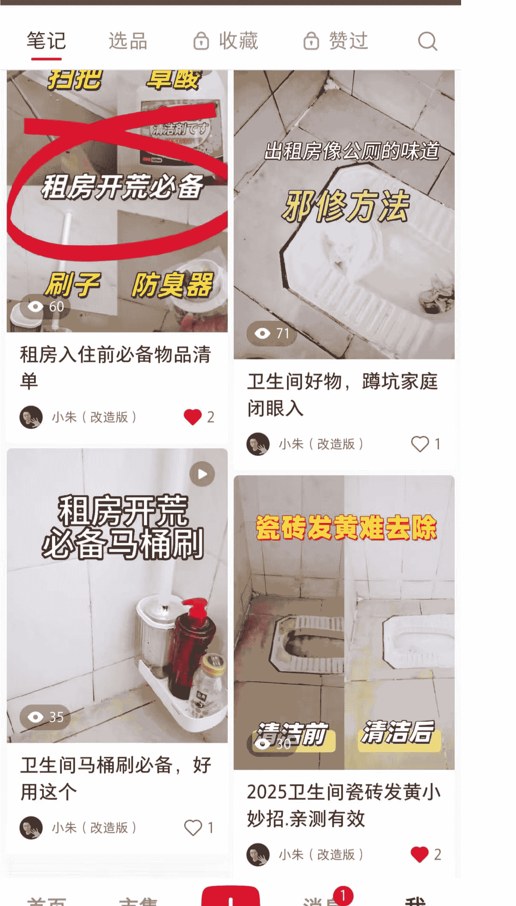

### 笔记出单的转机，异常值

我实拍笔记前都会先去看一个爆款是怎样的，然后刷刷小红书看看有什么机会，11月20日上午，我刷小红书发现一个图文流量很好，同时当天类似还有一个视频，都过万赞，这是一个异常值，我看了是关于静电的。

我迅速找一下选品中心，搜索“去静电”没有类似的商品，我不死心，我想这种需求应该有类似的商品会满足，我尝试在小红书里搜索，果然找到带货商品“静电释放器”。

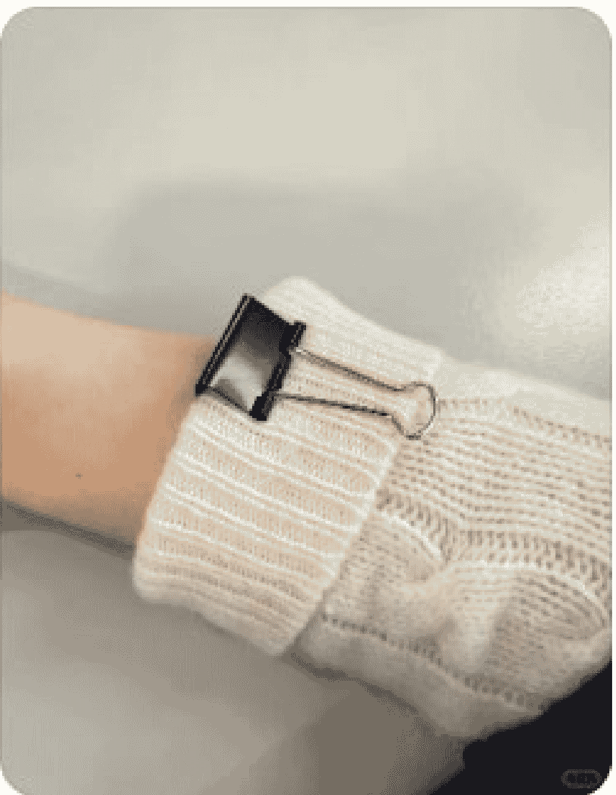

### 又到了一年一度的静电季节
不接电话的君君宝宝🌸
6天前
3.7万

### 几个身旁小物件就能get静电消除器？秋冬天再也不怕“随地大小电”

简单好上手，有趣又好玩

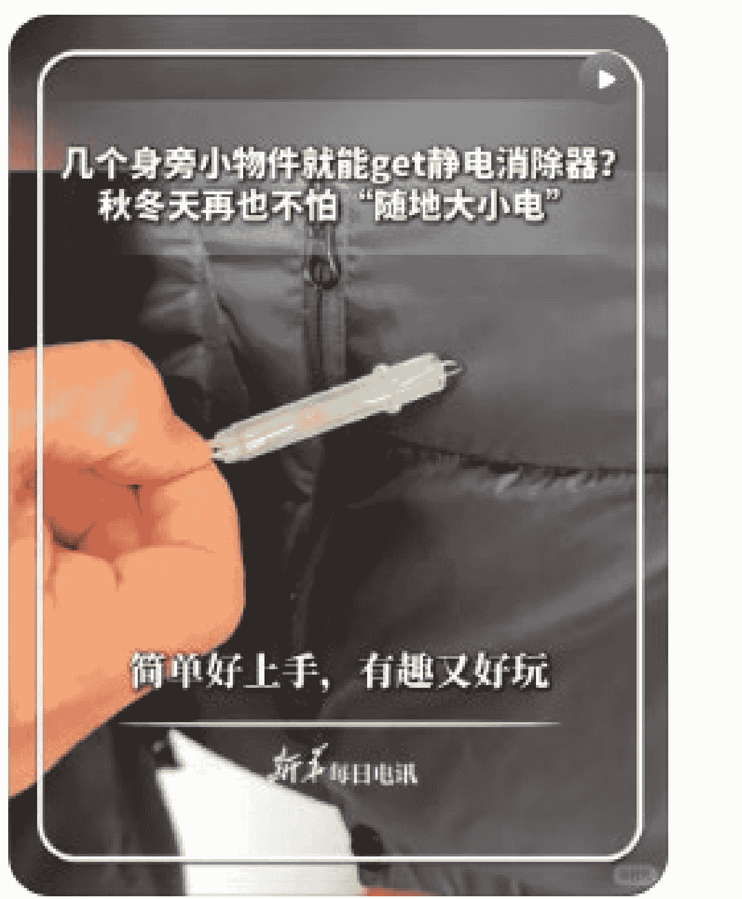

### 几个身旁小物件就能get静电消除器
新华每日电讯
11-19
6.3万

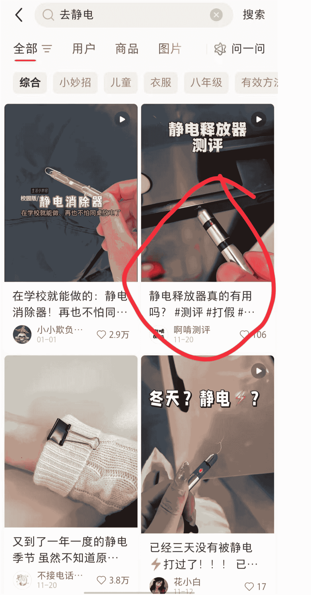

### 快速执行，抓住异常值

中午我依照图文笔记，做了一些防静电的方法，然后在评论区说，可以买商品，同时把自己做静电消除器的视频拍了下来，晚上又发一篇。流量终于过千，同时出了3单，终于不焦虑，形成一个完整的 SOP。后续可以复制。

笔记、选品、收藏、赞过

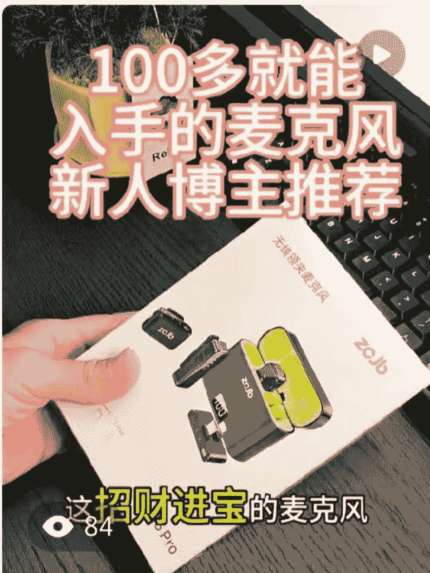

- 100多就能入手的麦克风，让你的视频变贵 | 小朱（改造版）
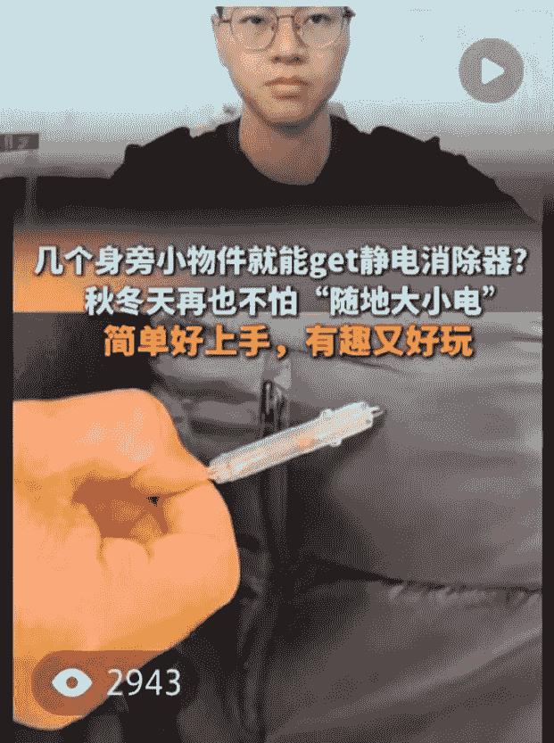
- 邪修静电消除器，再也不怕那大小电 | 小朱（改造版）
- 一年一度静电的季节 | 小朱（改造版）
- 我的出租屋改造手绘日记 | 小朱（改造版）

首页、市集、消息、我

橱窗、直播、近30日、汇总、笔记、橱窗主页、其他

数据统计周期：2025-10-29 至 2025-11-27

总支付金额：¥93.60
实际支付金额：¥93.60
支付订单数：4
支付人数：3

退款金额：¥0.00
退款订单数：0
退款率：0.00%

我笔记出单的核心方法，新手照做就能复制：

- 找异常值：11 月 20 日刷到 2 篇“防静电”内容（一篇图文、一篇视频），都过万赞，这就是“爆款信号”
- 找商品：选品中心搜“去静电”没找到合适的，直接在小红书搜，终于找到“静电释放器”
- 快速执行：中午做图文笔记（分享防静电方法，评论区引导下单），晚上发相关视频——流量直接过千，出 3 单

## 三、小红书买手的定位

买手 vs 店铺：为什么新手优先选买手？

| 对比维度 | 小红书买手 | 小红书店铺 |
|---|---|---|
| 启动难度 | 低，0 押金，直接用选品中心商品 | 高，需上架商品、做客服、发货 |
| 反馈速度 | 快，1-2 天就能出单 | 慢，需养店，竞争激烈 |
| 适合人群 | 新手、时间少的职场人 | 全职创业者、有供应链资源者 |

反观小红书买手，这是帮小红书流量变现，给小红书用户更真实的测评体验，给小红书店铺带来更多的客源。是小红书商业化生态位的一环。

这是平台红利，新人入局很容易能拿到结果。

很多品牌重视小红书这个平台因为有很优质的用户，在开拓这个平台其实，很乐意与小红书素人博主合作，只要有一定的数据。

## 四、小红书买手启动成本

### 样品钱都能省，新手零压力

我全程佣金 150+，但样品基本没花钱，方法分享给你：

- 买手中心福利：部分商品标注“笔记带货后可退款”，先申请样品，发布带货笔记后联系商家退款
- 商务合作：在买手主页更新合作状态，会有品牌方主动联系送样品

### 买手合作

小生（改造版） | ID: 11596426710 | V1 | 启航中 积极合作中 | 联系方式
本月总支付金额：¥1,319.4 | 本月支付订单数：36 | 本月预估佣金：¥151.56
选品中心：4.8万优质商家可合作 | 合作邀约：商家邀请带货
橱窗/笔记/直播今日数据：橱窗管理成交额 ¥0.00 | 共 57 件 | 订单数 0
经营指南 橱窗秘诀 > 分享橱窗

### 任务中心

领取14.1万流量奖励 >
当前已解锁：笔记投流6篇，1000额度直播流量卡17张

- 发布3篇评论区挂商品链接的笔记：笔记投流+2000（去查看）
- 学习从0-1直播带货攻略：直播流量卡+1000（去查看）

### 买手名片

合作意向：积极合作中 >
合作机会曝光加速中

### 选品方向

时尚、家居、美护、美食、运动户外、母婴

**家居**
床上用品、四件套、小家电、烹饪工具、家具饰品、清洁工具、餐具、收纳、家具香薰、汤锅、家居收纳、厨房好物、软装饰品、客厅摆件、氛围感装饰、租房改造、装修好物、烹饪神器、中式风、原木风

参考品牌：宜家、康巴赫 >
选择自用/意向合作品牌，以便商家快速理解您的需求

### 合作条件

付费模式：纯佣金 >
期望佣金率：30% >
合作条件可与商家协商

蛋蛋-...商务 > 样品怎样提供？
星期三 17:23 > 寄样
> 哈喽主播你好呀，我是...牌的商务蛋蛋，我们的直播合作模式是【送样+纯佣】，这是我们的产品&佣金：洁面慕斯 30%（可破价）、面霜 35%，以下是产品的手卡和机制，主播看看~

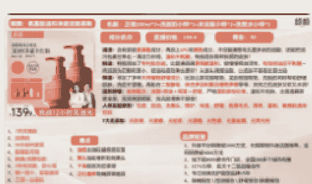

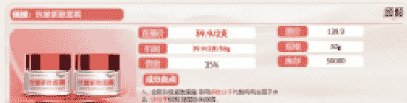

## 五、小红书买手变现 MVP

MVP 就是“最小可行性产品”，新手不用追求完美，完成这 4 步就能拿到结果：

- 破粉 1000：航海群有热心船员分享“科技涨粉方法”，合规且高效，先达标拿基础流量
- 直播起步：选 20 件易出单商品，每晚挂播 2 小时，不管有没有人都坚持（新手期靠货架逻辑出单）
- 笔记测试：每天刷 30 分钟小红书，找“爆款异常值”，快速做对应内容，评论区引导下单
- 素人截流：在素人爆款笔记下，用小号评论“求链接”，大号回复附自己的买手链接（有小伙伴用这个方法赚了 1000+佣金）

## 六、结尾

### 1、定目标比瞎努力更重要

我做每个项目都会定“10 倍门票”目标（比如航海门票 199 元，就定 1990 元变现目标）。目标清晰了，执行才不会偷懒。我会用豆包把项目和空闲时间输入，让它帮我列“日执行表”，比如“19:00-21:00 直播，21:30-22:00 刷爆款笔记”。

那我怎么要把我的单账号模式打磨到极致呢？你说的那些都比较泛，我是一个小白，我又没有认真跑，通过这些路子，你能够给我一些方向性的指引吗？最起码就是我近期我要首先做什么？要怎么去做，具体的落地是要怎么样的，你要给我个明确的就可持续可操作的框架给我，或者是指引给我。

行，那我给你捋个近一周能落地的具体步骤，你跟着一步步来就行。

- 第一步就是先做“数据记录”：从明天直播开始，拿个表格记清楚这些内容：直播时长、场观人数、每个品的点击量和出单量、出单的时间段。比如你发现晚上8点到9点场观高，或者某类数码品点击多但出单少，这些都记下来，这是后续优化的基础，每天直播结束花10分钟整理就行。
- 第二步是“优化选品”：你现在不是加了200多个品吗？播个3天左右，把那些点击量低于10次、完全没出单的品直接删掉，留下有出单或者高点击的品，再按品类分个类，比如数码、家居、美妆，看看哪类品在你直播间跑得最好，后续就重点加这类的高佣金、高评价品。比如你之前出单的大疆摄像头属于数码类，就多找同类型口碑好的品补进去，选品不用多，先把能出单的“核心品池”固定下来。
- 第三步是“调整”

### 2. 新手别迷信 AI，先自己入局
除了做执行表，我没用 AI 写笔记、剪视频。新手初期最重要的是“亲自感受 MVP 环节”——自己选品、自己直播、自己写笔记，拿到第一次出单后，再用 AI 优化话术、修图，这样才不会被工具绑架。

### 3. 红利期不等人，动起来就赢了一半
我 36 岁，下班累得只想躺，但还是挤出 4 小时做小红书。现在平台买手红利还在，你不用等设备配齐、不用等话术完美，今天挂20件商品开直播，明天发一篇爆款跟进笔记，下一个出单的就是你!

最后，祝大家暴富，10年10倍。

最后，安利小懒的付费群：
懒人专属群（介绍）

懒人专属群持续更新中，已持续运营6年，整理超3000份各类精选付费文章 & 年费社群干货，全部开放下载。

本资料为付费群内部分享，仅供真实有需要的朋友查阅 🙏

懒人专属群更新记录：
https://hk57gvlx7u.feishu.cn/docx/H0kRdZbSboIBROxkaXtcuVE0nTg

懒人专属群更新记录（需梯子，备用）：
https://lazybook.fun/blog/record2