# 自然流做图书垂直小店，从“搬运书本”到“贩卖信任”，用3条视频测试爆款的利润优先打法
## 251204 副业 SC 精华
公众号懒人搜索，懒人专属群独享。懒人微信：lazyhelper。

卖书，本质上是在“卖自己”，因为在这个信息过载的时代，用户缺的不是书，而是“帮我做选择”的可靠信源。

大家好，我是亦恒，图书赛道接近3年的从业者，今天和大家聊聊图书类目的垂直小店，主要是我的一些经验和建议。

我主要做的是图书细分类目——经管、政史社科两个赛道。

政史类的佣金更高，流量大，适合快速跑通闭环，赚到第一个1000块，但是比较敏感（后面会具体讲到）。

经管类的佣金比较低，内容质量要求高，但是长期看更容易建立自己私域的产品，比如个人成长的咨询、星球、培训和读书会等等。

还有一种的话就是育儿科普类的，今年的主力，客单也比较高一些，而且大部分是出版社投流。如果具备矩阵化操作的能力，起号也很快，爆发力很强。对于不考虑任何因素、只想快速赚钱的人来说，参考性比较强，值得专门聊一聊。

比如下图就是我们在去年4、5月份卖的最好的一套高客单政史图书《美国对华情报解密档案》，单价600多，佣金120左右，总共卖了大概一千多套吧，直接卖断货了。到5月底，大概赚了十多万，而且长尾流量一直在跑。

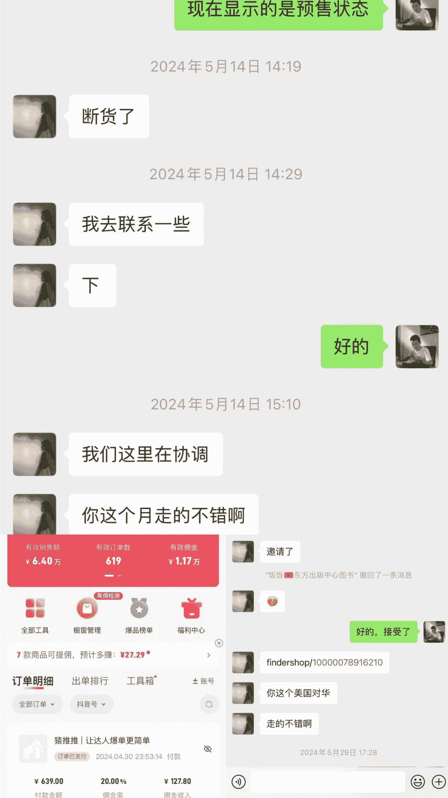

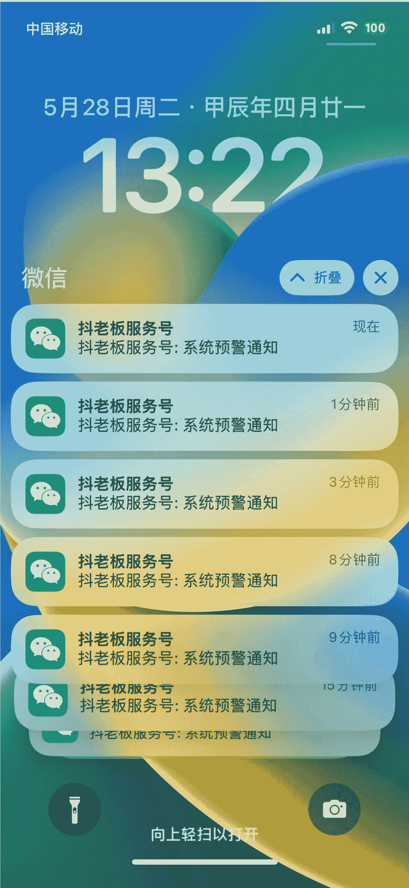

好了，我们开始吧。这是今天的主要内容：
- 我为什么要做图书垂直小店？
- 避坑建议：图书垂直小店现在怎么样？还值得入手吗？需要注意些什么？
- 操作路径与门槛：从 0-1，给新手的系统方法
- 利润优先，自然流起号 SOP（爆款方法论）

## 图书赛道的内容方式和变现路径？
## 我踩过的坑，你可以避开
### 一、为什么选择图书垂直小店
我选择项目和生意首先考虑的是，喜欢（保证了你在这条路上能走得足够久，也是对创业孤独和挫败的“心力”来源）、擅长且复利的事情，然后就是赚钱。因为我觉得赚钱不是最终目的和结果，应该是我做某件事情的过程中，所产生的价值给我的“奖励”，比如下面图就是我们其中一个大号的佣金：

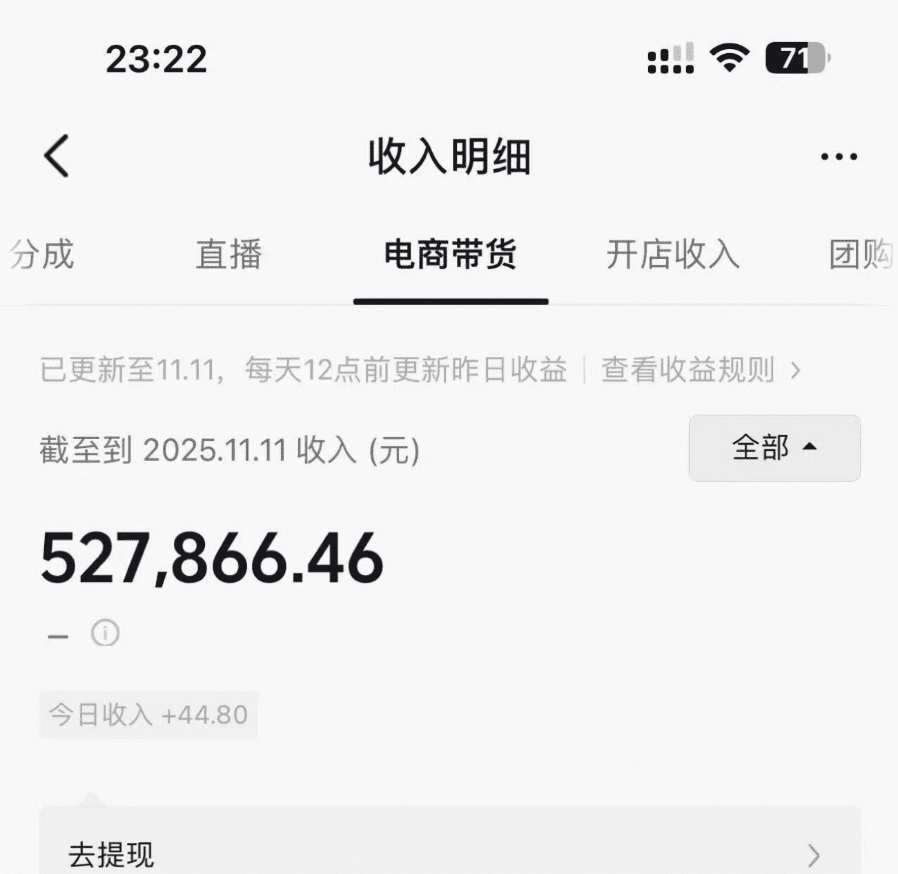

其次是终身学习的观念。读书能让我成长（复利），费曼学习法，把你学到的知识分享出去，利用自媒体（杠杆）放大自己。在做这件事情的过程中，会有人受我影响下单（赚钱）和咨询。当然，这些都是明面上能看到的事情。

其实我当时还有个想法，就是喜欢和知识分子打交道，而图书能让我有机会，去年和《民法典讲义》的作者杨立新教授隔空互动，和作者面基等等，包括余华、罗翔等等。

还能免费看书。从我开始做图书博主开始，基本就没自己买过书，都是出版社抢着送书。搬家的时候有好几千斤书要搬，家里6个书架，都是满的。比如老大推荐的《10倍比2倍更容易》这样的书，出版社基本都会先发给我们阅读。

所以，对于喜欢读书的朋友来说，做这个再好不过了。

同步块

公众号懒人搜索，懒人专属群分享。
10月13日 14:16
老师，推荐一本重磅的书《10x Is Easier Than 2x》中文版《为什么10倍增长比2倍更简单》来啦！！

华尔街日报畅销书、“颠覆传统管理思想”的读物《为什么10倍增长比2倍更简单》中文版全新上市。本书将彻底改变你对增长和成功的认知，它揭示了一个反直觉的真理：追求宏大的、10倍的目标，通过范式转换和极致专注，远比在小修小补上挣扎要简单和高效得多。这是一条通往卓越与自由的更轻松之路。

这不是一本教你如何更努力的书，而是一本教你如何更聪明的书。

英文版上市各大博主争相推荐，各个平台视频点赞量超高。老师看下这本书，预计10月20号入库，可以的话我先登记给您寄样书~😊

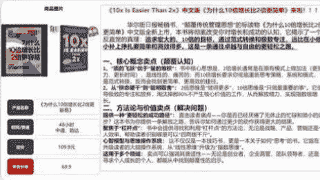

10月13日 14:17
这本书可以。

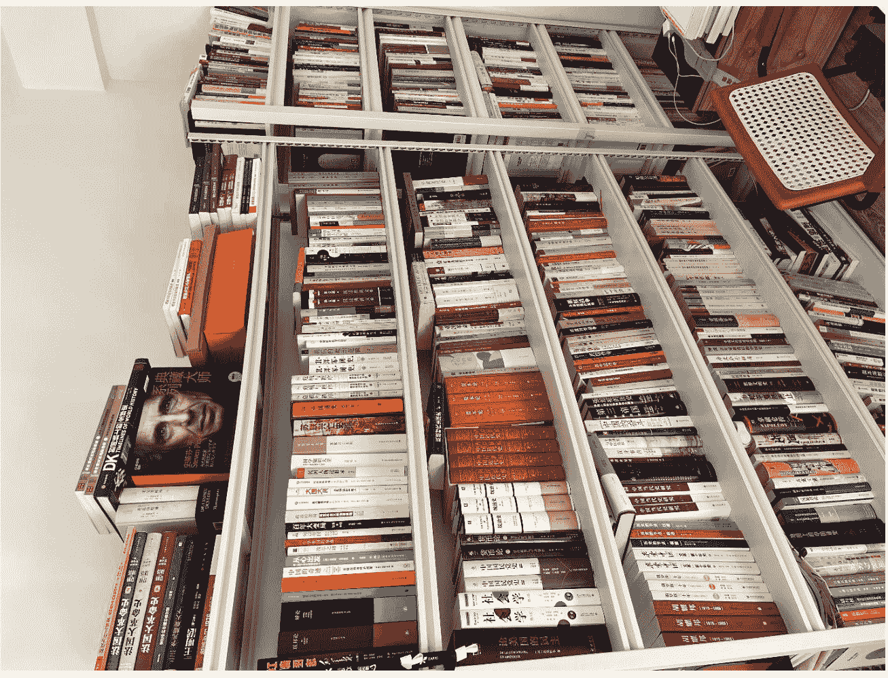

同步块

## 民法牛杨立新
谢谢各位博主的推荐！！

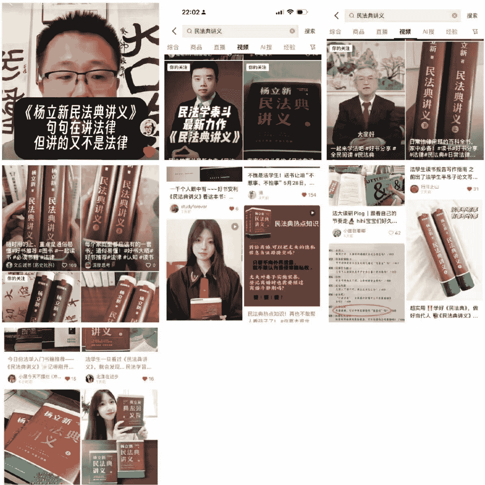
## 民法牛杨立新
心怀执念，云淡风轻。

## 作者简介
### 杨立新
他被称为“民法牛”，从民事法官到民事检察官，再到民法学家，他在中国的民法园地中已经辛勤耕耘了49年。

他是中国人民大学法学院教授、博士生导师，享受国务院特殊津贴。撰写的民法教材涵盖民法各个领域，包括《民法总则》《合同法》《婚姻家庭与继承法》《侵权责任法》等，其中教科书《民法》获得国家首届优秀教材一等奖；撰写《中国民法总则研究》《中国侵权责任法研究》《中国婚姻家庭法研究》等数十部民法学专著，发表论文约600篇。他的民法专著还被翻译成英文、日文、德文、阿文和韩文，并在国外出版。

他是资深“文艺青年”，出版《法陌履痕》《民法帝国》等数部散文集，以及一部长篇小说。

他目前兼任全国人大常委会法工委立法专家委员会立法专家、最高人民检察院专家咨询委员会咨询专家等职。

杨老师在微博感谢您了 ☕️
惊喜惊喜 😆
这两天再推推 😎

所以，在22年我还在做同城代运营项目的时候，就把我做的读书笔记、感悟等等分享在抖音上。前期没变现，光涨了3万粉，慢慢地，在抖音的文字笔记类内容有人主动下单书籍，也有人加微信咨询。一直到23年大概2月（我记得是过年那几天）迎来了爆发期，连续几天单日佣金都到了1万+，GMV一个月七八十万吧。

那会看了看抖音当月的社科类排行榜，发现有一个细分赛道的佣金和新手数据都很好，基本上都是千粉左右就变现的，属于红利期。比如这种书，主要的切入点就是敏感和窥探社会真相，发一些“刺激”的内容。

## 政治理论书籍爆款榜
基于近30日真实销售额综合排序，每日更新。
- TOP 1：9.9 | 卖爆了！30日热销8243件 | 《什么是权力》李筠 | 一本讲透权力逻辑的政治学... | 忻**v:把权利讲的非常清楚... | 运费险 | ￥39
- TOP 2：9.8 | 热卖中！221人买过 | 理想国译丛套装 不含停产4册赠价值128笔记本 | 搁**p:包装结实，里面泡泡... | 运费险 | ￥3638
- TOP 3：9.7 | 卖爆了！1.2万人买过 | 帝范+帝王智慧:两册帝王书世界上品人中国权... | 白**d:这是一本能够让人找... | 7天无理由退货 | ￥29.8
- TOP 4：9.6 | 卖爆了！30日热销727件 | 备考2026社工证社会工作者初级中级官方正版考试学习资... | 烛**6:wan guan | 店铺新人减3元 运费险 | ￥12.8新人价

## 纪实文学爆款榜
基于近30日真实销售额综合排序，每日更新。
- TOP 1：9.9 | 卖爆了！1.1万人买过 | 2025新版《问心三部曲》:追问+初心+撕裂丁捷著 | 蓝**j:外观完整度:很完整 | 运费险 | ￥28.8

政史社科类目最主要的是流量非常大，内容制作简单。只需要把这本书当中对社会的剖析，比如社会领域、政治领域、顶层设计、对普通人的影响等，一些和我们普通人熟知但没人给你讲透的东西发出来，就能够获取更大的流量，如下图所示：

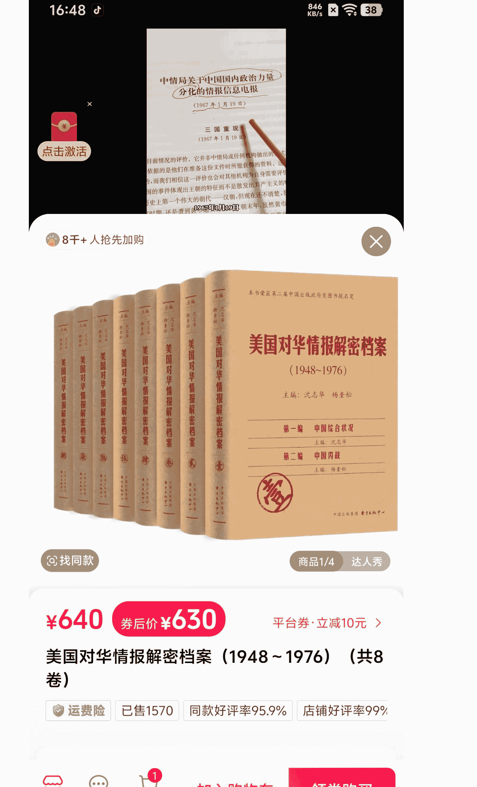

内容形式主要是图文形式、短视频形式和桌拍形式为主。很多人应该都看到过类似的视频和账号，在23年、24年的时候数据非常好，流量很大，而且这类型的内容天然就符合大家的审美和需求。

所以，当时主要做的就是政史社科领域，矩阵号大概18个左右，从图文到视频模式都做过。一直到今年年初3月份，因为政策原因，政史社科领域的内容更加严格，很多同行发布政治、领导人敏感内容的矩阵号都被封禁了。所以在内容上一定要注意，今年我所熟知的一些头部达人都在大量转型口播和形式。

## 虽然说有缩水，但是对于新手来说可能还是比较友好的，这是5月份的收益：
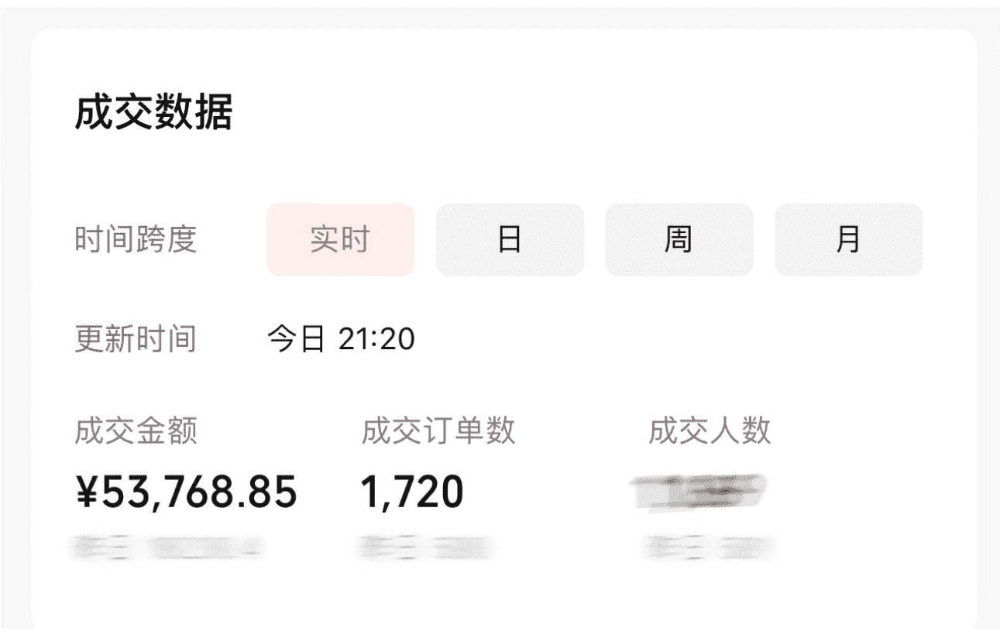
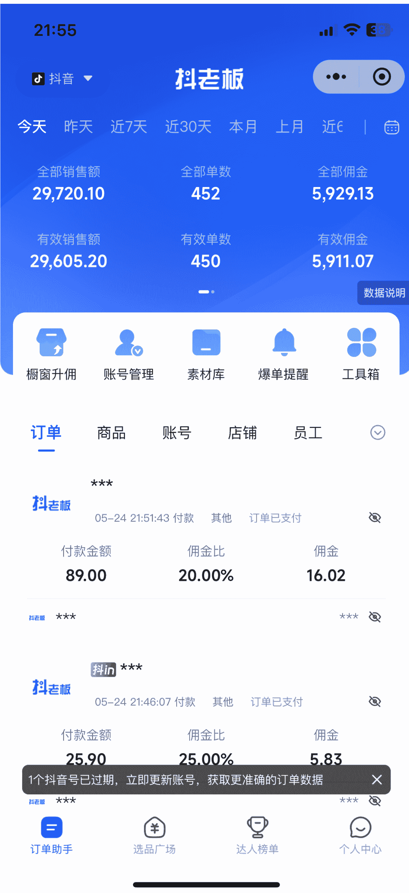

公众号懒人搜索，懒人专属群分享。
## 抖老板
今天 昨天 近7天 近30天 本月 上月 近6
全部销售额：33,687.50
全部单数：***
全部佣金：***
有效销售额：33,457.70
有效单数：***
有效佣金：***
数据说明 | 橱窗升佣 | 账号管理 | 素材库 | 爆单提醒 | 工具箱 | 订单 | 商品 | 账号 | 店铺 | 员工
抖老板 *** 05-24 23:54:13 付款 其他 订单已支付 | 付款金额 34.90 | 佣金比 20.00% | 佣金 6.28
抖老板 *** *** 05-24 23:50:51 付款 其他 订单已支付 | 付款金额 48.00 | 佣金比 20.00% | 佣金 8.64
> 1个抖音号已过期，立即更新账号，获取更准确的订单数据。
订单助手 | 选品广场 | 达人榜单 | 个人中心 | 15/53

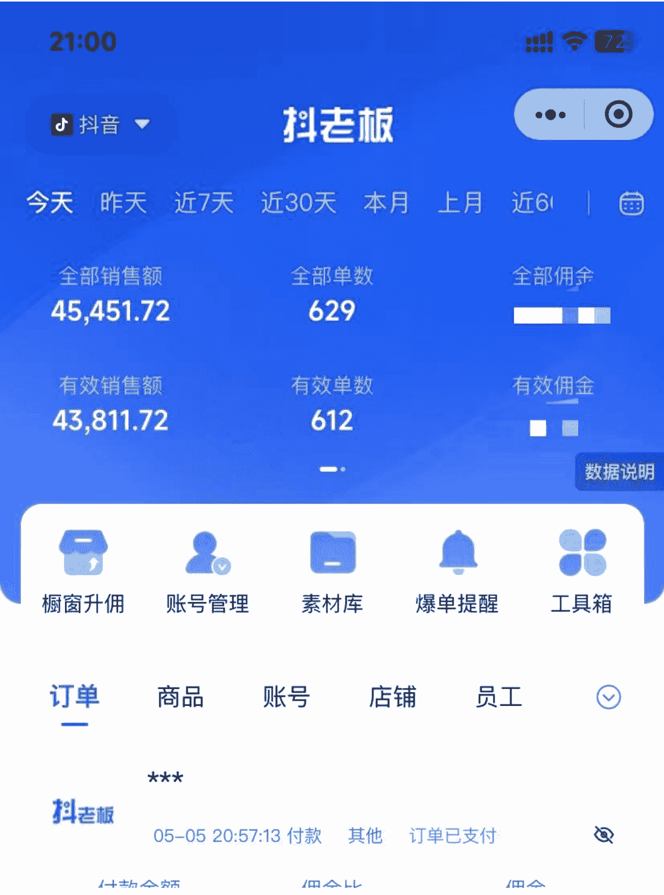
## 二、避坑建议：行业现状？还值得入手吗？需要注意什么？
### 图书行业现状：
流量红利期基本过去了，而且对内容的要求比较高。背后的本质还是现在的平台几乎没有用户新增量了，微信10亿，抖音8亿，所以目前各大平台都属于精耕细作的阶段。

流量红利的时代结束，效率红利的时代刚开始。

就跟垂直小号的逻辑一样，“垂直”不是一个选择，而是阶段性必然。

平台在收紧流量，用户在提高选择，垂直小号和垂直小店是必然的走向。

## 再看一组数据
基于“国家出版发行信息公共服务平台”的销售数据和商报·奥示“中国出版业市场监测系统”线下ERP数据、线上监测数据的统计：2025年10月，图书零售市场销售数量同比增长3.77%，销售码洋同比增长7.48%，成为今年前10个月中第6个市场同比回升的月份。与9月份比较，当月图书零售环比也呈增长，销售数量环比增长1.75%，销售码洋环比增长4.51%。

据基于“国家出版发行信息公共服务平台”的销售数据和商报·奥示“中国出版业市场监测系统”线下ERP数据、线上监测数据的统计：2025年10月，图书零售市场销售数量同比增长3.77%，销售码洋同比增长7.48%，成为今年前10个月中第6个市场同比回升的月份。与9月份比较，当月图书零售环比也呈增长，销售数量环比增长1.75%，销售码洋环比增长4.51%。

三类细分市场规模扩大：社会科学书细分市场规模和文化教育书细分市场规模分别呈两位数扩大，社会科学书销售同比增长17.31%，文化教育书销售同比增长11.32%。文学艺术书细分市场规模呈一位数扩大，销售同比增长2.33%。两类细分市场规模缩小，且均为微缩：少儿读物细分市场销售同比下降1.66%，科技生活书细分市场销售同比下降0.31%，这两类细分市场虽然规模有所缩小，但销售均为同比微降，对市场规模整体扩增大势影响微弱。

图1 2025年10月图书零售市场销售态势(同比)
| 类别 | 整体增长(%) | 细分市场增长(%) |
|---|---|---|
| 社会科学 | 7.48 | 17.31 |
| 文化教育 | 11.32 | 2.33 |
| 文学艺术 | -1.66 | -0.31 |
| 少儿读物 | | |
| 科技生活 | | |

## 值得入手吗？
所以，从我个人从业的经验来看，社科领域的图书仍然值得布局。

投入很低，见效快：你根本不需要投入什么，就可以开干。2-3个抖音、视频号就可以开干，每天2-3小时，围绕特定的细分类目（我这儿以社科、科普类目举例），每天准时出摊，上架商品就行。

同步块

## 概览 | 内容 | 商品 | 橱窗 | 市场
实时 | 昨日 | 近7日 | 近30日 | 自然日
核心数据：10月29日 - 11月27日（切换为联盟数据）
- 成交金额：¥78.01万（较上周期 ↑999%+）
- 成交订单数：6039（较上周期 ↑999%+）
- 成交人数：5809（较上周期 ↑999%+）
- 预估佣金收入：¥7.11万（较上周期 ↑999%+）
- 结算佣金收入：¥2461.42（较上周期 ↑999%+）
- 退款金额：¥5.46万（较上周期 ↑999%+）

随时随地标记一下 投稿享现金和DOU+券激励 GO
视频 | 橱窗 | 直播 | 图文
- ¥78万 成交金额
- 6037 成交订单数
视频分析：
1. 超有趣的科普书《DK万物运转的秘密... >
发布时间：2025/11/20 20:27:45
成交金额：¥24.72万 | 视频观看次数：116.66万 | 引流成交：¥0 | 千次曝光成交：¥218.84

需求端：之前大量低质量、敏感类的内容和账号都被下架、封禁了，必然会出现一些空缺。比如向我们之前头部的达人都有十几号卷一本书，而且内容都是书里面的某一段经典，同质化很严重，爆了就连抄。但是现在都没了。比如下面这两个号，就是今年开始爆发的，销量都达到了12万单，它的书一单大概佣金在5-10块左右，可以算算，还是不错的。

- 自我成长：输出倒逼输入，刺激自己学习。通过总结书籍的关键信息和内容，会锻炼你对信息、内容的敏感度，达到自我认知的提升。
- 变现路径多：图书是一个一直存在且不会消失的行业，每个图书类目的后面都是一群目标用户。比如我的一个号是做经管、成长类目的，就会有很多粉丝加我的微信咨询和付费，你可以做培训、读书营、读书会等等。
- 需求稳定、价值感强、利润空间可操作：相比于卖百货的，卖书的总会有点个人价值感的体现。你可以和各种出版社的编辑、作者对话，而且利润是随着你的影响力可调的，小达人可能10%，我们能谈到30-50%。

## 先知文化
新吴区茵茵电子商务商行
22.3万 获赞 | 64 关注 | 1.8万 粉丝
只推荐我自己看过的好书！
IP：江苏
商品橱窗：718件好物 | + 关注 | 发私信
作品：729 | 橱窗：21/53

17:21 | 9.30 KB/s | 37
## 先知文化的橱窗 >
粉丝：1.8万 | 跟买人数：11.8万 | 已售件数：12万 | + 关注
大家说：价廉109 | 推荐90 | 快递速度快65
描 > 10元 你有1张优惠券可使用最高10元 >
## 全部商品 | 分类
+ 综合 销量 新品 价格
筛选直播间同价商品

## 西藏视点丛书 共四册
¥69 券后价 已售3344
平台券立减10元 | 7天无理由退货
来自华文出版社 >

## 中国历代党争史-历史上王朝的覆灭，都难逃党争的魔咒？【
近90天低价
¥0.01 券后价 已售8055
平台券立减10元 | 运费险 | 7天无理由退货
来自蓝色畅想图书 >

## 抖音旗舰 【亲签】陈寅恪与傅斯年2024修订版 作者岳南
¥34 券后价 已售1737
平台券立减10元 | 运费险 | 7天无理由退货
来自博集天卷官方旗舰店 >

## 智者思言优...的橱窗
粉丝：1.7万 | 跟买人数：10.6万 | 已售件数：12万
> 大家说：99 物美价廉 | 93 快递速度快 | 80 描述
10元 你有1张优惠券可使用最高10元
## 全部商品 | 分类
+ 综合 销量 新品 价格
筛选 直播间同价 商品

## 西藏视点丛书 共四册
¥69 券后价 已售3344
+ 平台券 立减10元 | 7天无理由退货
来自华文出版社 >

## 衰退时代生存指南：衰退时代，我们该如何生存
¥29 券后价 已售3.5万
+ 平台券 立减10元 | 运费险 | 7天无理由退货
来自紫云文心图书旗舰店 >

## 【文轩】国学特装版-典藏5本套（实物套）
达人力荐"国学文化"
¥169 已享满减 已售2653
+ 券共减20元 | 运费险 | 7天无理由退货
来自新华文轩官方旗舰店 >
同步块

17:22
14.1万 获赞 | 376 关注 | 1.7万 粉丝
113 KB/s | 37
读书可以启智，可以明理，可以给人力量。
+关注 | 营业时间 | IP：江苏
商品橱窗：757件好物 | + 关注 | 发私信
作品：795 | 橱窗
- 地图上的中国通史：1.5万
- 精装典藏版的中国奇幻全书：1.2万
- 两晋南北朝史：6258
- 夜航船：5807
- 地图上的中国通史：4756
- 山海经：2878（老师抓紧去捡漏）
- 人间词话：2718
- 繁花：《繁花》版本了 2592
- 诗境浅说：2300
- 逻辑思考力：2004
- 雅舍（梁实秋）：1640
- 徐霞客：1419
有兴趣的圈友可以搜一搜看他们的视频内容，上面的这两个账号都属于亦仁老大发的超级标的描述：
https://t.zsxq.com/0rF9X
围绕一个商品或者一个品类，持续地做内容，吸引平台的自然流量（一些情况下也可以投流），然后赚取佣金，或者自己发货赚取差价。
我们在进行的B站好物、抖音自然流CPS、小红书买手等，都是属于这个逻辑。
24 / 53

10月份，图书零售线上细分市场与整体细分市场如出一辙，同样为“三增两减”（见图5），且增减的细分市场也分别相同。

市场规模扩大的细分市场：社会科学书细分市场规模增幅最大，销售同比增长15.44%；文化教育书细分市场规模增幅次之，销售同比增长9.54%；文学艺术书细分市场规模增幅最小，销售同比增长2.65%。

市场规模缩小的细分市场分别为微缩：少儿读物细分市场销售同比下降0.32%，科技生活书细分市场销售同比下降1.03%。

图5 2025年10月图书零售线上市场销售态势(同比)
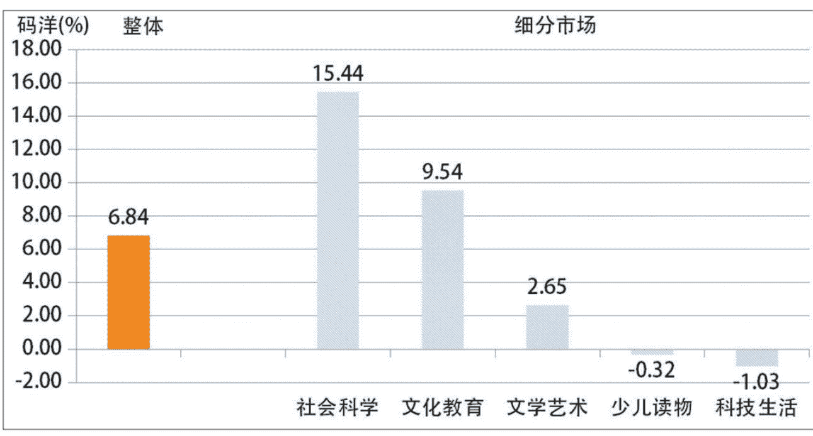
### 3. 需要注意什么：
相比于平台早期的流量红利，现在去做垂直小店，更需要聚焦于内容，聚焦于用户和产品本身，把视频做深做精。一定要记住一句话：卖书，本质上是在卖自己。

所以，优先选择你喜欢的图书细分类目，这样你才会更容易和书产生链接和灵感。有时候你用AI写的“完美文案”，可能就是不如你突如其来的灵感和感悟。

## 三、操作路径：从 0-1，给新手的系统方法

### 1、流量≠利润，找到“可复制”的冷启动方案（MVP-项目最小可行闭环）

精准流量 x 价值链接 x 渴望状态 = 高转化成交

- 精准流量：通过“原有内容”，吸引那些真正对“解决方案”感兴趣的人，而不是观看热闹的。
- 价值链接：确保你的内容是产品的延伸，让用户无法割裂地看待它们。
- 渴望状态：用你的内容，去点燃用户内心深处对“成为更好的自己”的憧憬。

用最低成本（3 条视频）验证一本书能不能卖

很多朋友的惯性思维是不管干什么我先搞一波流量再说，而忽视了从产品出发、定位出发、从用户的需求点出发。有的图书账号每条视频的流量都很高，上千点赞，但是只能出几十单，主要问题就是用户是为你的故事买单的，和你要卖的图书没关系；而有的图书则转化很高，比如我上面举的这两位图书账号，虽然看着没有那些上万点赞的流量视频高，但是转化是好几倍。

### 2、高流量、低转化的内容，是“寄生内容”。

内容本身（故事、段子、情绪）是主体，产品（书）只是一个“广告贴片”，是硬生生嫁接上去的。

用户会觉得，你的故事很有趣，我看完了，也给你点赞了，我的任务完成了。至于你卖的书吗？哦，那个故事关系不大，我不需要。

结果就是，用户为内容消费了注意力，但不会为产品支付金钱。内容和产品是“两张皮”。

### 3、流量精准、高转化的内容，是“原创内容”。

书的核心价值，就是内容本身的主干和灵魂。内容就是产品的说明书和预告片。

用户会觉得，你视频里讲的这个观点太颠覆我了我才听了 1 分钟就收获这么大，那这本书里得有多少宝藏？我必须立刻拥有这本书，才能完整体验你所说的价值！

结果就是，内容即产品，产品即内容。用户越是认可你的内容，就越是渴望拥有产品。内容和产品是“血肉相连”的。

### 4、向往的状态——交易的本质是“解决方案”的交付

用户购买的从来不是产品本身，而是“成为更好的自己”的解决方案。

用下面 3 本书举例：

- 他买的不是《思考，快与慢》，而是一个看起来更聪明、更深层次的大脑（满足装逼需求）。
- 他买的不是《高效能人士的七个习惯》，而是一个告别负债、掌控人生的自己（满足自我提升需求）。
- 他买的不是《人类简史》，而是一套能让你在饭局上略有谈资的风度（满足跨越认知和社交需求）。

所以，你的任务，就是通过内容、清晰的状态，吸引用户脑补出他最想要的状态。一定要想清楚，每一本书、一个细分赛道的书，都代表着不同的消费群体和用户。所以，你的视频，就是连接用户“现实状态”和“向往状态”的桥梁，而购买这本书，就是走上这座桥的唯一通行证。

怎么做呢？

## 四、利润优先，自然流起号 SOP（爆款方法论）

### 1.1 第一步：选品

#### 但不是选“低价爆品”，而是选“爆款利润品”

我的“MVP测试法”： 不投流，用最低成本（3条视频）验证一个品能不能卖，以及利润模型是否健康。

很多朋友可能会好奇，为什么是利润品和3条视频，其实很简单，如果是低价爆款的话，大概率是出版社和MCN直投，用来冲销量的，如果你自然流进去打，肯定打不过；但如果你也是投流，佣金就只有5%（新手出版社不给投流），一单也就赚几毛钱到1块钱，比如下面这本天涯神贴的书籍，就是典型的例子：

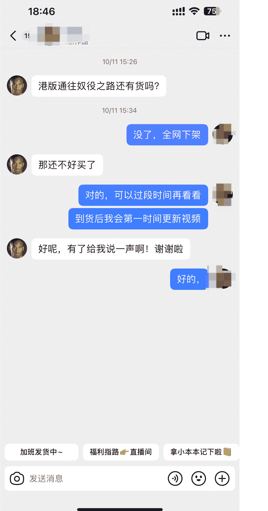

**普通人的书**
**天涯神贴开悟手册**
感谢自己在30岁之前读了这本书。普通人的一生，...
号称诸子百家的天涯神贴合集！汇聚成这本醒脑开悟...

**天涯神帖好犀利**
**扎心的观点穷人家庭**
当你天涯真的是各路大神云集，回头看依然炸裂。人...
早期的天涯真的啥都说，这本书也是来之不易，收集...

那么爆款+利润品怎么拍呢？以这套金观涛老师的《超稳定结构三部曲》为例，这个链接卖了大概 1.4 万单。可以从 3 个类型出发，我以第一种类型的文案给大家一个参考：

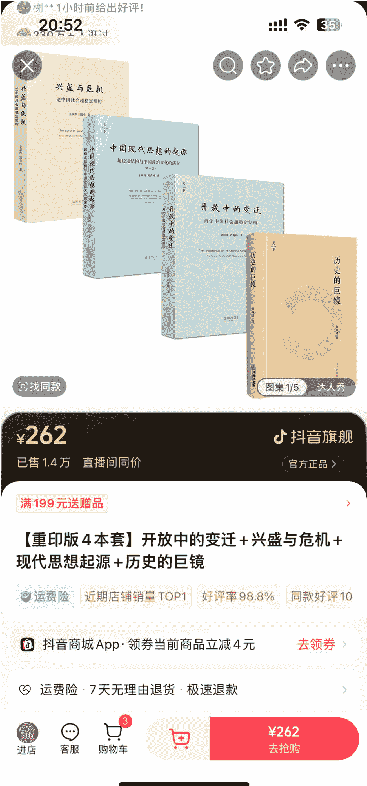

#### 视频 1：【价值勾拳】
**目的**：这本书最核心、最具竞争力的观点，用户是否购买。（稀缺、绝版、消失、尺度）
**内容**：直接提了一个最炸裂的观点，用30-45秒讲得很清楚，结尾直接引导看橱窗。这是最直接的转化测试。

**文案：**

#### 视频 2：【场景共鸣】
抓紧！抓紧！金老师的超稳定结构三部曲，这三本绝版书都是最近刚复活的，每一本在二手市场都炒到非常离谱的价格。为什么消失了十几年？
因为这套书的杀伤力实在是太大，它是在修正高层次读者的认知。
书里，用一套超稳定系统的假说来解释中国社会文化几千年来的结构演变及特点，解答了为什么每隔两三百年就会爆发一次大动乱的历史问题。
全面剖析意识形态对社会起到的整合稳定作用。
大家可以去豆瓣上看一下这套书后半段的目录，讲到当代史的部分，真的会让你起鸡皮疙瘩。
反正这套书现在能复活，能看到真的不容易。大家且拍且珍惜吧。

这就是最简单的稀缺价值文案，直接就告诉用户这套书因为内容太敢写，直接被消失十几年，它能给你带来什么……
大家猜猜，这条文案，转化了多少单？

**目的**：这本书能够解决哪个具体场景（逻辑思维、认知、职场、情商）的痛点。
**内容**：吸收一个用户痛点场景（比如：“你是不是也经常头脑不清醒，逻辑混乱？”），然后引出这本书里的方法论是解决这个问题的。这就是需求场景的测试。

**文案：**

这本书专门对付杠精以及头脑不清晰。
日常沟通如易被带偏，看到网上信息分不清真假，做决定时总靠拍脑袋，其实这些都是因为缺乏逻辑思维。
今天聊的这本逻辑学通识讲义拆解的逻辑思维的三大模型，从底层概念、演绎推理到数据洞察，帮你系统掌握，并且可以实操。
这本书会让你沟通谈判更高效，对信息的鉴别更敏锐，在做分析决策时更加理性，在你学习的过程当中会更加顺畅。

#### 视频 3：【“我”的故事】
**目的**：测试你个人与这本书的“化学反应”能否打动人。
**内容**：这本书讲述的是如何改变“我”的某些具体看法的（人、事、物），分享你最真实的个人感悟和收获。这是个人与产品链接度的测试。

**文案：**

我原以为老蒋是一个放弃东三省，炸毁花园口，视百姓为草芥的失败者。
直到看了这本书才发现，他被误解了这么多年。《老蒋传》是一部真正尊重历史与当事人的权威校长传记，作者克洛泽是美国的知名传记作家，为了还原真实的校长，他多次远赴台湾，翻阅大量未曾公开的资料，和多位上层要员频繁接触，做了大量的深入调查，客观完整的论述了蒋公大是大非的一生。
这本书一经出版，就在海内外引发了巨大的反响，这也是国内最早原版引进的西方视角下的他的传记，很多资料都是首次披露。你能深切的感受到那个大变革时代里的风云激荡，关于立场的问题，这本书到现在才得以面世，图文精装典藏版，想了解真实的校长，这本书千万不要错过。

**效果**：新手不再是漫无目的地发3条视频，而是有策略地从“核心、用户场景、个人链接”三个维度，对一个产品进行全方位的产品变现测试。

### 1.2 第二步：内容，但不是做“流量内容”，而是做“成交内容”

揭秘我的“30 秒成交公式”： 拆解我转化率最高的一类视频脚本结构（痛点前置 -> 价值展示 -> 行动指令）。

**痛点前置：**
豆瓣上万人打出了9.1的高分神作，却被消失13年。
金老师的超稳定结构三部曲，这三本绝版书都是最近刚复活的，每一本在二手市场都炒到非常离谱的价格。为什么消失了十几年？

**价值体现：**
因为这套书的杀伤力实在是太大，它是在修正高层次读者的认知。
书里，用一套超稳定系统的假说来解释中国社会文化几千年来的结构演变及特点，解答了为什么每隔两三百年就会爆发一次大动乱的历史问题。
全面剖析意识形态对社会起到的整合稳定作用。

**行动指令：**
大家可以去豆瓣上看一下这套书后半段的目录，讲到当代史的部分，真的会让你起鸡皮疙瘩。
反正这套书现在能复活，能看到真的不容易。
大家且拍且珍惜吧。

### 1.3 第三步：运营，如何批量化生产“非爆款”但“能稳定出单”的内容？

以上面的书为案例，如何快速地跑同一个小的闭环，都有方法可循！

#### 其一：最合适模板——学的是“用户心理模型”
去销量榜刷这种类似的社科书籍，然后用文案模板直接套用，关键数据、核心内容、作者权威替换成你要推广的书籍。
背后的行为逻辑是，洞察同类书籍（如社科、商业、心理学）的购买者，他们的“下单动作”是高度相似的。他们都渴望获得“转型性认知”、“社交谈资”或“解决你的焦虑”。
切忌不要简单的“抄”，我们复制的不是文案的“形”，而是其背后被验证过的“转化结构”的“神”。这个结构之所以有效，是因为它精准地叩开了目标用户的心弦。所以，只要目标用户不变，换一本同类型的书，这个“心弦”同样会响。

#### 其二：同行爆款——学的是“被验证过的系统”
去看同行的爆款内容，有没有3条以上的视频，用的是同一个文案模板的爆款视频，而且转化还很好的。仔细去看对标，你会发现，一样的模板，换本书照样能爆单，亲自试验过百试不爽。爆款开头，中间把书籍换成你要推荐的书籍，前提是一定要关联性强。
这是进阶版。你不是自己去判断一个模板怎么样，而是让市场帮你做筛选。如果一个同行用同一个模板，在不同的视频上连续成功了3次以上，这不再是偶然，而是一个被市场反复验证的、可稳定盈利的“内容-成交”系统。
在我看来，这是一种“零成本的市场调研”。你让你的竞争对手，支付了试错成本、测试了转化率。你只需要找到这个成功的案例，然后把它“逆向操作”，应用到自己的产品上。这是顶级玩家的思维方式。

#### 其三：出版社溯源——找官方数据
直接去问出版社，这本书还有谁爆单了，他们数据会更准确，有时候他们会直接把爆款文案拔下来发给我。
这是最高维度的信息差打法。你直接跳过了所有中间环节，找到了拥有最全、最准、最数据核心的“源头”——出版社。他们知道哪本书、哪个卖点、哪篇文案，在整个市场上的转化率是最高的。
当然，这其中也需要你自己的网感和判断，更好的还是结合自己的理解和书籍相关信息进行优化。简单来说就是资源整合的能力。把出版社专业人士对书籍的理解角度和自己的相结合，往往效果也不错。

## 五、图书赛道的内容方式

掌握了前面的部分，就是一个垂直小店最重要的部分了。呈现形式如下：

### 1、目前图书赛道的呈现形式主要有以下 6 种
- **图文模板+实拍书籍**：主要是一张纯色背景图+书籍的核心卖点、爆款短句的形式，最后放几张图书实拍图。
- **图文+名人+实拍书籍**：主要形式是纯色背景图+名人（作者）形象照+名人（作者）金句，最后放几张图书实拍图。
- **桌拍视频**：主要形式是直接拿手机后置摄像头怼着书拍，重点展示书籍封面、作者、目录和书籍关键卖点。
- **划线视频**：主要形式是找到一本书当中最有感触、卖点、热点、槽点的一段内容，用笔划线的方式口述出来。
- **口播视频**：主要形式就是写好文案，真人出镜拍出来，中间 5-10 秒展示书籍即可。
- **剧综视频**：主要形式是把综艺、影视片段中的某段内容截取出来，和书籍挂钩，更多的是利用名人信任做背书，比如余华在某个活动中谈到的金句，结合热点和他的某一本书籍融合。
- **热点类视频**：主要形式是追最热点，比如十五五规划出来后，马上用新闻联播的画面，展示实拍强关联的书籍；也可以是某个电视剧爆火，也可以用来卖书。我们之前就用这种形式卖爆过一本《狂飙》，主打的就是【无删减】，因为书里面的内容更敢写，刺激用户的探索感和好奇心。类似的有很多。
- **直播卖书**：主要形式就是手播或者真人出镜直播卖书。

### 2、新手适合哪种方式？哪个最容易快速赚到钱？

很多新手朋友看到这么多形式，可能会疑惑，我最适合哪种类型？该怎么选择：

#### 1. 【图文类】：规模化测试
- 优点：信息效率最大化。最短的时间内，将最核心的卖点（金句、作者光环）精准地交付给用户。
- 制作成本极低，速度极快，你可以用极低的成本，快速测试几十本书的反馈。
- 缺点是，原创比重低，导致同质化严重。
- 如果卖点不突出，很容易被淹没在信息流中，沦为无效炮灰。

#### 2. 【桌拍视频】：建立“产品信任”的关键
- 优点：所见即所得。通过展示书籍的实体情况（封面设计、纸张厚度、排版），消除用户对“未知”的疑虑，建立基础的产品信任。这是最接近“线下逛书店”体验的形式。设计精美、具有收藏价值或作为礼品这些书尤其有效。它传递的是一种“我很真实，不玩虚的”的信号。
- 缺点：缺乏视觉冲击力，难以承载深度内容。如果书籍本身平平无奇，这种形态会非常枯燥。

#### 3. 【划线视频】：高密度“输出”
- 优点：价值领先，以小博大。通过免费分享书籍的一小段“干货”，让用户立即获得价值感，从而激发他对“整本书”巨大的想象和渴望。它能够最完美地实现“内容即产品，产品即内容”。这种最容易让用户产生“哇，光听这一段就值回票价了”的感觉，转化率极高。
- 缺点：对操盘手的“选段”能力要求极高。如果划线的部分不够渗透，或者理解不够深刻，效果会大打折扣。

#### 4. 【口播视频】：构建“个人IP”的终极武器
- 优点：信仰代理，人格背书。用户购买的不仅仅是书，而是“你”这个人对这本书的理解、感悟和推荐。这是唯一能够建立长期、深度粉丝信任的武器。它的壁垒最高，一旦成功，你就能从一个“卖书的”变成一个“值得追随的意见领袖”，拥有强大的溢价能力和用户粘性。这是“卖自己”的最高形态。
- 缺点：对人的综合能力要求最高（镜头感、表达力、文案能力）。如果个人魅力不足，或者与个人经历脱节分享，很容易变成“自说自话”，沦为“寄生内容”。

#### 5. 【剧综/热点类】：收割“流量红利”的机遇
- 优点：借势，借势，还是借势！借助已经在平台中引爆的公众情绪、名人效应或社会热点，将自己的产品产生强关联，从而搭上流量的“顺风车”。不常使用，但一旦抓住机会，就能在极短时间内创造出惊人的爆单奇迹，（如《狂飙》案例）。对达人敏锐的市场嗅觉和快速反应能力要求比较高。
- 缺点：
  - 时效性极短：热点一过，视频重新恢复。
  - 风险高：容易陷入版权问题或因“硬蹭”而引发用户反感。
  - 对团队执行力要求极高：必须在几个小时内完成从选题到发布的全部流程。

综上，你基本上就可以确定自己更适合什么类型了，祝你爆单！

## 六、我踩过的坑（包含行业内幕）

其实做垂直小店，包括其他项目，最重要的能力还是：把信息差、认知差，转化成可落地的产品、视频。

很多朋友看到了一本书、一个项目、一个信息差的第一想法是“先收藏”，慢慢看，再等等。我觉得做垂直小店一定要快，一个热点出来、一本书买爆之后一定要尽快跟上，执行力必须拉满，不要总想着做一个“完美型”视频。

克服它的关键，是解决破除两个障碍：心理障碍和执行障碍。

### 1. 克服心理障碍

很多人会陷入“冒名顶替综合症”。他们会想：“这些信息、内容又不是我原创的，别人发过了，我是不是不能发？”、“我讲的东西，别人是不是都知道了？”、“这么简单的道理，还用我讲吗？”

其实大可不必。
解决方案：你必须完成一次身份的切换。
你的核心价值，不在于“发明”知识，而在于你的视角、你的语言、你的经验，将复杂、零散、枯燥的信息，“翻译”成为普通人能够听懂、能够发出共鸣、能够立刻用起来的《解决方案》。用户下单，是为我们的“翻译能力”和“筛选能力”买单，省去了他们去挖掘的时间和精力。

从“追求完美”切换为“追求完成”：接受你的第一个产品是“不完美”的。一个能够解决用户 60 分问题的、已经上线的“视频”，远比一个还在你脑子里改造的、100 分的“作品”更有价值。说实话，很多时候恰恰是那些我随便拍着发一发的视频，反而更容易成为爆款。

### 2. 克服执行障碍

很多人脑子里有货，想拍视频，却不知道如何把它转化成用户愿意付费的“产品”。
解决方案：使用一个简单的“产品化”框架，强制自己把信息变成产品。

**第一步：【锁定一个“小”问题】**
不要试图做“百科全书”。从你所有的认知中，只挑出一个最痛、最具体、最小的，比如，不是“如何做一个牛人”，而是“高手都在用的逻辑思维模型，看完这本书你也可以”。

**第二步：【提供一个“手册”】**
不要给用户大量理论，而是要给他们一个“一步一步”的行动指南。这些“手册”，就是我给你推荐的书。

总结来说，克服这个难关的核心是：
不要把自己当成一个需要“灵感”的艺术家，而是开始把自己当成一个为用户解决具体问题的陪伴者、大师。

### 3. 给想做图书垂直小店朋友们的建议
第一，尽量规避敏感内容，比如政治、领导人、统一、阶层分化等等。
第二，提前确定好佣金，有的书籍和出版社是“阶梯式”佣金，刚开始 20%，出 50 单可能给你涨到 30%，100 单会涨到 50-60%。
第三，如果爆单了，一定要提前和出版社沟通好链接、库存都没问题，我们出现过好几次，正在爆单的情况下没发现链接出现问题、库存没了的情况。
第四，节假日提前约好出版社编辑对接，否则爆单后会找不到人给你上库存，比如这种情况，可能 1 个小时就是卖 500 单。

公众号懒人搜索，懒人专属群分享
中共党史出版社
15:19
62
看一下库存或者预售吧，这几天流量转化不错
已添加库存
新春快乐
好嘞
二、有爆单了，库存还有多少呢
我增加了500
库存够呢
随时增加
卖完了
是啊

## 好了，我们来互动一下，休息休息：

### 起步阶段最难的点是什么，你是怎么突破的？
对于新手来说，起步阶段最难的点还是在于执行+持续。不管做什么项目，都是一个持续积累，然后爆发的过程。

一定不要抱着别人赚了 100 万，我这个月怎么也要赚到 5 万的心态，这样是很难持续下去的。因为欲望越高，期待就越大；如果反馈不够高，你就会懈怠、迷茫和焦虑，这是一个死循环。我的做法是放平心态，允许试错，给自己一个周期，一个月或者 3 个月，在这个时间范围内，行动力一定要跟上。

### 回头看，你做得最对的一件事是什么，最想重来的又是什么？
我觉得我做得最对的一件事就是不断摄入信息和持续输出的行为，几乎每一个让我赚到钱的项目，几乎都来自于信息差和各种分享。

比如我早期干过的同城获客，就是因为我去各种大型会议，跟目标用户聊天，分享自媒体获客的信息和机会，自然而然会有用户感兴趣，线下单独见面、谈合作等等。我会把我对企业获客的理解、信息告诉他们，获取信任，其实很简单。

如果重来，我会在一个项目赚钱最轻松、最好的时候，搭建另一套产品体系，通过自媒体放大自己和项目，而不是单一的靠一种形式赚钱。

### 你有没有一些踩过的坑或弯路，能帮大家避一避？
- 执行、执行、执行
- 复盘、复盘、复盘
- 持续、持续、持续

有了生财有术和 AI，信息差对我们来说不是问题，重点还是有的人能迅速投入行动，而有的人只当看了热闹。

### 你下一步想做什么，你认为这个方向还能放大到哪里？
接下来我会持续把内容做深、做精。相比于之前 1 分钟以内的带货+知识视频，目前我在做垂直小号，通过长文表达更完善的观点、知识体系和产品。其实最后放大的话还是知识付费，搭建自己的【个人品牌】。目前已经跑通了流量到付费的环节，也会有人学怎么做图书带货、知识变现等等。

最后，期待感兴趣的圈友马上付出行动，多多爆单。

最后，安利小懒的付费群：

### 懒人专属群（介绍）

🚫 懒人专属群持续更新中，已持续运营 6 年，整理超 3000 份各类精选付费文章 & 年费社群干货，全部开放下载。
本资料为付费群内部分享，仅供真实有需要的朋友查阅 🙏

**懒人专属群更新记录：**
https://hk57gvlx7u.feishu.cn/docx/HOkRdZbSbolBR0xkaXtcuVE0nTg

**懒人专属群更新记录（需梯子，备用）：**
https://lazybook.fun/blog/record2