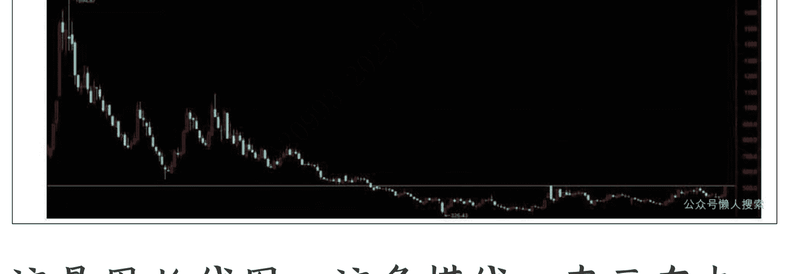
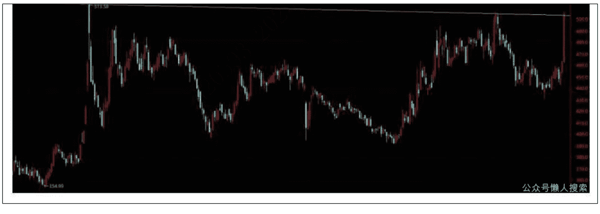

# 补涨主流板块=底部+光伏反内卷+储能电池+AI供配电+液冷

251110 安民分析
整理：公众号懒人搜索，懒人专属群独享
懒人微信：lazyhelper

## 一、看好该板块的六条理由

这次要谈的这个小板块，我们团队跟踪有两年多。

首先它处于大底。它的最高点在2021年秋天，最低点出现在2024年2月5日，跌幅达到80.74%。

其次，是指数在低位横盘振荡了26个半月，现在正面临突破。

第三，它底部的颈线位一旦突破，指数至少会有45%的上涨空间，如果从中线来看，极有可能翻倍。这是技术测算的结果。

第四，从它的颈线位往指数的最高点计算，有230.01%，即是说，如果它的指数能够涨到上波牛市的高点，从突破点算起，这个空间有230.01%；所以，它的指数还处在底部。讲这个数据，就是讲它是大底。

第五，这个板块的个股很少，全部个股就10只，如果把差的去掉，那就更少了。也就是，这个板块比较容易挑到心仪的股票。

第六条理由，我们依然用了很成熟的方法，从全市场 1000 多个板块中找到这个板块，也就是技术面上是筑底即将成功，基本面上是行业优势，就是高科技优势与市场主流相结合，再叠加国家政策反内卷支持的优势。

所以，我们判断，这个板块未来一段时间比较容易成为热点。一旦底部突破，就会起跳。因此，那些牛市以来一直没有抓住牛股的人，或者还有资金，或者还能做短线的人，可以关注一下。

（免责声明：本文只为开拓视野、引导思路，并非择时，亦非荐股，股市有风险，入市需谨慎。本文不构成任何投资建议和意见，我们无力为大家的投资负责，请大家注意投资风险）

## 二、板块技术走势

### 1. 周K线颈线

这是周K线图，这条横线一直画在电脑上，关注它有 5 年，跟踪它有一年多的时间了。关注它是上一波炒半导体和光伏时，半年内它的指数就从 355 点涨到 1694 点，半年内涨了 377.18%，指数涨了 3.8 倍，个股可想而知，会有多强。

### 2. 日K线压制

前面的周K线图我们给了它的第二条压力线。上面的日K线图，画出来的是它的第一条压力线；就是去年 10 月 8 日的高点 513.58 点到 2025 年 9 月 8 日 505.27 点的连线。

这两条线如果在一个图中画，隔得非常近，很容易混淆，没有办法都显示出来。所以我们在两个图中呈现。

下表是到 12 月底前两条压力线的每天压力位。

| 时间 | 压力线1 | 压力线2 |
| :--- | :--- | :--- |
| 11月10日 | 503.84 | 514.06 |
| 11月11日 | 503.81 | 514.06 |
| 11月12日 | 503.77 | 514.06 |
| 11月13日 | 503.73 | 514.06 |
| 11月14日 | 503.70 | 514.05 |
| 11月17日 | 503.66 | 514.05 |
| 11月18日 | 503.62 | 514.05 |
| 11月19日 | 503.59 | 514.05 |
| 11月20日 | 503.55 | 514.05 |
| 11月21日 | 503.51 | 514.04 |
| 11月24日 | 503.48 | 514.04 |
| 11月25日 | 503.44 | 514.04 |
| 11月26日 | 503.40 | 514.04 |
| 11月27日 | 503.37 | 514.04 |
| 11月28日 | 503.33 | 514.04 |
| 12月1日 | 503.29 | 514.03 |
| 12月2日 | 503.26 | 514.03 |
| 12月3日 | 503.22 | 514.03 |
| 12月4日 | 503.18 | 514.03 |
| 12月5日 | 503.15 | 514.03 |
| 12月8日 | 503.11 | 514.02 |
| 12月9日 | 503.07 | 514.02 |
| 12月10日 | 503.04 | 514.02 |
| 12月11日 | 503.00 | 514.02 |
| 12月12日 | 502.96 | 514.02 |
| 12月15日 | 502.93 | 514.02 |
| 12月16日 | 502.89 | 514.01 |
| 12月17日 | 502.85 | 514.01 |
| 12月18日 | 502.82 | 514.01 |
| 12月19日 | 502.78 | 514.01 |
| 12月22日 | 502.74 | 514.01 |
| 12月23日 | 502.71 | 514.00 |
| 12月24日 | 502.67 | 514.00 |
| 12月25日 | 502.63 | 514.00 |
| 12月26日 | 502.60 | 514.00 |
| 12月29日 | 502.56 | 514.00 |
| 12月30日 | 502.52 | 514.00 |
| 12月31日 | 502.49 | 513.99 |

11月7日收盘504.37点，首次站上压力线1；一旦站稳压力线2，就表示突破有效。当然，正常情况下，站稳压力线1就应该会站稳压力线2，这是大概率事件。但是我们做投资的，要防止小概率事件的发生。因此，以站稳压力线2为技术点，关键点。就是可以盯515点。

对了，这个板块是有机硅，881041；它一共有10只个股，分别是：东岳硅材，合盛硅业，新安股份，晨光新材，江瀚新材，润禾材料，硅宝科技，宏柏新材，新亚强，ST宏达。

我们后面会对10家公司的基本情况做进一步的追踪分析。

3. 上面的技术压力位，未来的目标位主要有3个。第一个是580.02点，这个肯定会过，可以不看。当然，做超短线的可以关注下这个点位。

第二个是760.73点。这个需要关注，因为突破点是514.06点，在760.73点附近，强势时可能过一点，弱势时也可能不过，就比较容易遇到阻力。760.73/514.06=47.98%。做短线，这个空间是可以的。

第三个是1090.59点，强势时可能过一点，弱势时也可能不过，就比较容易遇到强阻力。1090.59/514.06，这个数据基本可以翻番。

所以，这里是机会，至少是短线机会。

至于历史高位1694.87点，看一看就好，这波牛市不知道能不能过，边做边看吧。即使不到，即使只到760点，也能做出不错的收益。

## 三、基本面：有机硅在主流和高科技行业中的应用

这一部分是很干的干货。希望大家看一看，还是会有作用的。

### （一）关于有机硅

有机硅是一类以硅和氧即Si-O-Si为主链、有机基团为侧链的高分子化合物，主要包括硅橡胶、硅油、硅树脂、硅烷偶联剂四大类。指数中，881045 即合成树脂，881051 为橡胶，881054 为橡胶制品。它们的核心特性有 5 点：

- 一是耐高温。长期使用温度范围 -50°C ~200°C，部分产品可耐受 300°C 以上高温。
- 二是耐候性。抗紫外线、臭氧、潮湿等环境因素，使用寿命可达 20 年以上。
- 三是电绝缘性。体积电阻率 ≥ 10^14 Ω·cm，介电常数 ≤ 3.0，适用于电子、电气领域，是非常好的绝缘材料。
- 四是柔性与弹性。硅橡胶的断裂伸长率可达 500% 以上，适合制作柔性部件。
- 五是化学稳定性。耐酸碱、有机溶剂，不易与其他材料发生反应。

硅橡胶作为粘合剂、密封剂、灌封和制模材料用于建筑、电子、电力、汽车等领域，作为灌封和制模材料用于医疗、日用品、电子电器、新能源等领域。

硅油广泛应用于纺织、日化、机械加工、化工、电子电气等行业，主要用作纺织印染助剂、日化助剂、高级润滑油、防震油、绝缘油、真空扩散泵油、脱模剂、消泡剂、抛光剂和隔离剂等。

硅树脂是一类具有高度交联网状结构的热固性聚硅氧烷，具有优异的耐热性、电绝缘性及良好的防水效果，主要作为绝缘漆浸渍H级电机及变压器线圈，以及用于浸渍玻璃布、玻布丝及石棉布后制成电机套管、电器绝缘绕组等。气相白炭黑主要作为硅橡胶的补强填料，也用于油墨涂料工业、复合材料、黏合剂、化学机械抛光等领域。

### （二）有机硅产业链

上游为原料，主要为硅矿，以石英砂为主；还有金属硅也即工业硅，纯度≥98%；以及氯甲烷（CH3Cl）。

中游为单体和聚合物两个环节。

单体是甲基氯硅烷，主要为二甲基二氯硅烷，占比在80%左右，经水解、裂解生成环体，如D4，八甲基环四硅氧烷。这个不好理解，大致知道就成。

中游还有聚合物，是环体经聚合反应生成硅橡胶的生胶；硅油，即是线性聚合物；硅树脂即交联聚合物。

下游是制品。通过硫化、成型、加工等工艺，生产密封胶、导热垫、封装胶、柔性部件等许许多多种终端产品，这些产品利润也高。

### （三）市场

#### 1. 市场规模

2024 年全球有机硅市场规模约 130 亿美元，年复合增长率约 5%；其中，高科技领域，如新能源、机器人、芯片和半导体、电子、相关 AI 应用等，占比约 50%，是行业增长的核心驱动力。全国有机硅产能 344 万吨/年，2025 年上半年国内消费 100 万吨左右，出口 28 万吨左右。总体上是供过于求，所以才要反内卷。

#### 2. 有机硅在新能源领域的应用

主要包括光伏、风电、动力电池和储能电池、氢能 4 大市场。

##### ( 1 ) 光伏

- 一是组件封装。有机硅封装胶如硅酮胶用于高效光伏组件如 TOPCon、HJT、IBC 的电池片封装，替代传统 EVA 胶即乙烯-醋酸乙烯共聚物。它更耐高温，可耐受 HJT 组件的 200°C 以上焊接温度；更耐老化，使用寿命延长 5~10 年；抗电势诱导衰减性能，能降低组件功率衰减率。不过光伏封装也面临其他材料如 POE 胶，即聚烯烃弹性体的替代压力。后者耐高温性能接近有机硅，价格更低。
- 二是背板密封。硅橡胶密封条用于光伏背板与边框的密封，防止雨水、灰尘进入组件内部。
- 三是光伏逆变器绝缘。硅油、硅树脂用于光伏逆变器的电气绝缘，提高逆变器的可靠性。

##### ( 2 ) 风电

- 一是叶片密封。特别是海上风电叶片，用有机硅密封胶密封，防止海水、盐雾进入。
- 二是防冰涂层。以聚甲基硅氧烷为代表的硅树脂涂层，涂于叶片表面，能防止积冰。
- 三是发电机绝缘。硅油用于风电发电机的定子绕组绝缘，可耐受150℃以上温度，提高发电机对温度的耐受性。

##### （3）动力电池和储能电池

- 一是密封防护。有机硅密封胶，如硅橡胶密封圈，用于动力电池的外壳密封，防止电解液泄漏，也可用于储能电池外壳密封。宁德时代就用这个。
- 二是电池热管理。硅油，以甲基硅油为代表，作为动力电池的导热介质，替代水和乙二醇混合物等传统冷却液，具有更高的导热系数和稳定性，不易结冰、沸腾，刀片电池就用硅油。但不如AI液冷服务器致冷的效果好。润禾材料就有液冷硅油。
- 三是绝缘保护。硅树脂涂层用于电池极片的绝缘，以防止短路。

##### （4）氢能领域

- 一是燃料电池密封。有机硅密封件，以硅橡胶O型圈为代表，用于氢燃料电池的电堆密封，以防止氢气渗透。
- 二是氢储罐防护。硅树脂涂层涂于70兆帕的高压氢储罐内壁，防止氢脆，即氢气与金属反应，导致材料脆化。
- 三是质子交换膜改性。用聚二甲基硅氧烷为代表的有机硅改性的质子交换膜，注意不是以前文章中讲到的 PE 膜，能提高质子传导率和稳定性。

#### 3. 有机硅在机器人行业的应用

主要集中在密封、柔性部件、传感器封装和柔性皮肤等方面。

- 一是关节密封。以 RV 减速器、谐波减速器为代表的机器人关节，它们的密封件一般选用硅橡胶密封，能防止灰尘、水分进入，延长关节寿命。
- 二是柔性抓手。硅橡胶抓手如真空吸盘、柔性手指等，需要抓取电子元件、玻璃等易碎物品时，就要用硅橡胶制作的柔性抓手。
- 三是传感器封装。硅树脂封装胶用于机器人的视觉传感器、力觉传感器的封装，可以使得传感器不受温度湿度等环境的影响。大疆的工业物流机器人就是用传感器封装胶。
- 四是电缆绝缘。用硅油浸泡的机器人电缆，能提高使用性能。因为机器人电缆需要频繁弯曲，容易磨损，用硅油浸泡，可以延长使用寿命，避免出现短路。库卡用的就是硅油。
- 五是柔性皮肤。通常采用有机硅材料聚二甲基硅氧烷（简称 PDMS）制作。柔韧性好，可模拟人体皮肤力学特性，实现自然伸展和弯曲动作，使机器人动作更接近人类；具有多模态感知能力，可集成压力、温度、形变等多维度传感功能，提升交互真实感。此外，还有耐久性强，环境适应性也强等优势。

对了，讲几个有机硅的应用。一是家用硅胶枕头，就是有机硅。二是女性医美的隆胸材料，也是有机硅。三是小鹏人形机器人，她们的仿生肌肉，估计极有可能要用到哪种有机硅材料。

#### 4. 有机硅在芯片、半导体行业的应用

芯片、半导体是有机硅技术含量最高的应用领域之一，特别是先进封装 CoWoS、InFO.

- 一是芯片封装。硅树脂封装胶用于芯片，如 CPU、GPU、AI 芯片的封装，以替代传统环氧树脂。硅树脂封装胶可耐受 120℃以上的温度，更耐高温；芯片封装后应力≤50 兆帕，能避免芯片开裂。
- 二是芯片散热。硅橡胶导热垫用于芯片与散热片之间的导热，提高散热效率。因为 AI 芯片的功耗可达 300W 以上，需要高效散热。
- 三是晶圆清洗。硅烷偶联剂用于半导体晶圆的清洗，改善晶圆表面的润湿性，提高清洗效果。这个在以前讲半导体清洗设备公司时提到过。
- 四是器件绝缘。硅树脂涂层用于半导体器件如 MOSFET、IGBT 的绝缘，防止短路，而且半导体器件的尺寸越来越小，对绝缘的要求越来越高。

#### 5. 有机硅在 AI 数据库中的应用

AI 数据库即数据中心的扩张，使得有机硅不断地向高科技行业延伸。

- 一是数据中心散热。甲基硅油作为数据中心服务器的导热介质，替代传统空气散热，硅油散热系统的散热效率比空气散热高5倍以上，适用于高功耗的AI 服务器。空气的导热系数约0.026W/m·K，硅油约0.12W/m·K。一般训练服务器一类比较适用。像亚马逊云数据中心用硅油散热系统。不过液冷服务器效果更好。也即这个因素不是决定性的。
- 二是存储设备密封。存储设备的可靠性要求≥99.999%，硅橡胶密封件用于数据存储设备如SSD、HDD的密封，可满足要求。典型的如微软SSD 存储设备用密封件。存储也是近期市场的主流，因为美国和韩国存储芯片价格大涨。
- 三是电缆绝缘。数据中心的电缆数量庞大，易发生短路。跟上面一样，硅油浸泡的 AI 数据库电缆效果不错。

也即 AI 数据库的应用，主要是硅油和硅橡胶两类。作用是硅油散热、硅油绝缘，以及硅橡胶密封。

#### 6. 有机硅在电子行业的应用

主要有手机、电脑、平板等消费电子，典型的如柔性屏，还有LED、电源、仪器仪表工业电子。

消费电子方面：

- 一是密封防护。以硅酮胶为代表的有机硅密封胶用于手机的防水密封，等级为IP68等级，可在1.5米深的水中浸泡30分钟；像华为Mate系列和苹果的iPhone，防水更防灰尘进入。
- 二是散热管理。硅橡胶导热垫用于手机CPU的散热。
- 三是柔性屏。有机硅改性的聚酰亚胺PI膜用于柔性屏的基底，可弯曲半径≤5mm；还能提高柔韧性和耐候性，使用寿命可达5年或以上。典型的如OLED屏。
- 四是电池密封。有机硅密封胶用于手机电池的密封，防止电解液泄漏。

工业电子方面：

- 一是LED封装。硅树脂封装胶用于LED灯泡的封装，替代传统环氧树脂。它更耐高温，具有高透光率，且使用寿命大于等于5万小时。
- 二是电源绝缘。硅油用于工业电源的绝缘，提高电源的可靠性，适用于高温和潮湿的恶劣环境下。
- 三是仪器仪表密封。仪器仪表对精度要求很高，密封不好会影响测量的结果。硅橡胶密封件用于工业仪器仪表的密封，可提高仪器仪表长期使用的可靠性。

## 四、本轮有机硅炒作逻辑

看了上面这些，结合本轮牛市当前市场主流，那么有机硅炒作的逻辑是什么？为什么判断它未来会成为主流？其实主要是三点：

第一点，工业硅涨价。工业硅的主要成份是二氧化硅，简单地说就是比较好的砂子，也叫石英砂。一般砂子含二氧化硅的比例在90%以上，工业硅含二氧化硅的比例在98%以上，也叫金属硅；精制石英砂二氧化硅含量达99%-99.5%，主要用于制备玻璃和耐火材料；高纯石英砂二氧化硅含量≥99.95%（部分要求99.999%），铁氧化物含量极低（≤0.001%），是半导体、光纤通信等高科技产业的关键原料。

光伏电池用石英砂要求不低于99.99%，单晶坩埚类部分高端应用要求达到99.998%（4N8）或更高，8英寸晶圆是不低于5个9，即5N；12英寸晶圆是不低于6个9，即6N。

工业硅是光伏石英砂和有机硅的上游产品。

光伏反内卷，推动光伏电池用石英砂和工业硅涨价。工业硅推动有机硅涨价。这是第一个逻辑。光伏反内卷。

第二个逻辑，储能电池需求量大涨。这个在前两个月的博文中就讲到了。电力市场化改革，推动电价市场化，光伏发电和风力发电价格波动非常大，欧洲都有负电价，从而催生了储能市场需求突然爆发。就是白天光伏发电高峰也是价格低谷，储能电站把电储存起来，到晚上用电高峰时再释放电能。这三年储能电站装机都是高增长。

储能主要用的是储能电池，而储能电池需求大涨也推动储能产业链包括以密封胶为代表的有机硅材料价格上涨。

第三个逻辑，是第二个逻辑的延伸，AI逻辑。美国前几大高科技公司购买了大量的GPU，但就算美国的算力芯片再多，AI服务器再多，作用也不大。因为美国电力不够。美国明年要关掉电解铝产能，因为电解铝是耗电大户，要将电力省下来用于供应算力中心。

为了解决电力问题，谷歌已经在布局核电站建设，以支持自己的人工智能和数据中心不断增长的电力需求。亚马逊在弗吉尼亚州的算力集群因当地变电站负载超标，不得不自建微型电网以保障电力供应。但眼前问题难以解决，目前有两种方案是可行的，一是自建天然气电站；二是自建光储一体化电站。前者成本是后者成本的 1.6倍左右。

所以，巨型数据算力中心配套自建光储一体化电站是近几年的 AI 巨型数据中心的解决方案。

近期市场炒作的是什么？光伏反内卷+AI 数据库+电网+储能电池，反内卷就意味着压产能，储能背后是密封、绝缘和热管理，AI 一样是密封和绝缘、液冷，电网是为了解决 AI 问题的。关键是，AI 背后就一定会涉及到储能。

## 五、板块公司的相关产品与应用情况

1. 淘汰掉的 3 家

第一，ST 宏达。公司每股净资产只有 3 分钱，11 月 7 日收盘 3.74 元，2018 年以来每年扣非净利润都亏损，淘汰。因为没有必要去冒险。现值 3 分钱的东西，卖您 3.74 元，溢价 124 倍，就像我买的一件衣服，300 元买的，您非要 37000 元买不可，我不会反对的是吧。但说实话，您没有必要那么浪费。它已经那么多年扣非净利润都是负的，三季度末归属于上市公司股东的所有者权益只有 1356.79 万元，不抵上海比较好的一套房子。将这么点净资产亏光，不难。

第二，宏柏新材，公司的主要产品一是硅烷偶联剂，二是气相白炭黑。气相白炭黑是生产硅烷偶联剂过程中的副产品四氯化硅，公司用它生产气相白炭黑，是公司的第二项业务。而第一大业务硅烷偶联剂，则主要是属于功能性硅烷。其中的含硫硅烷主要用于轮胎生产，交联剂主要用于光伏。而公司的产品主要是含硫硅烷偶联剂，用于轮胎生产。它们不是本轮炒作的主流方向。故而也不用看。

第三，晨光新材，一样主要是功能性硅烷。但晨光新材的含硫硅烷、氨基硅烷、环氧基硅烷中，有的产品可用于动力电池组件的复合材料中，以提升材料的物理性能，也应用于胶粘剂和密封剂领域。券商软件将它划为氢能源概念。从业绩和市场技术走势来看，不典型，可以淘汰。

## 2. 从 7 家公司中选择标的

#### （1）江瀚新材
券商软件将它归为光伏概念。公司生产的硅烷偶联剂主要用于光伏 EVA 胶膜和光伏组件密封剂，在动力电池和储能电池中也有应用。到 11 月 7 日收盘，动态市盈率 24.4 倍，市净率 2.23 倍。

公司的硅烷偶联剂在储能电池和动力电池中主要作为关键助剂，用于提升电池材料的性能与稳定性。分子结构同时具备亲有机和无机官能团，可作为无机材料如电极材料、隔膜与有机材料如粘结剂、电解液的界面桥梁，增强材料间的结合力，从而提升电池的机械强度、耐候性和电化学性能。

具体应用于电极材料处理，如处理电池正负极材料，包括硅基负极、三元材料等，改善材料与导电剂、粘结剂的相容性，减少界面阻抗，提升电池循环寿命。

再就是隔膜与电解液优化，通过表面改性，增强隔膜对电解液的浸润性，提高离子电导率；同时可提升电解液的稳定性，抑制副反应。

- 三是封装与防护，在电池组件的密封胶、粘合剂中添加硅烷偶联剂，增强粘接强度及耐水、耐腐蚀性能，保障电池在复杂环境下的可靠性。公司产品已广泛应用于包括锂电池在内的新能源领域，客户涵盖全球头部电池厂商及材料供应商，硅烷偶联剂产品通过改善材料界面性能，直接支持高能量密度、高安全性的电池设计需求。
- 四是公司开发的环氧基硅烷等高端产品还可用于半导体封装，间接服务于电池管理系统等核心部件，进一步拓展在储能和动力电池产业链的应用深度。

#### （2）新亚强
锂电池概念。到 11 月 7 日收盘，动态市盈率 52.9 倍，市净率 2.56 倍。公司的产品在储能电池和动力电池中主要通过电解液添加剂和硅基电解质材料发挥作用，具体应用及依据：

- 一是在有关高电压和高镍三元电解液方面，公司针对高电压钴酸锂、高镍三元等正极材料开发了适配的电解液添加剂，可提升电池能量密度和循环稳定性，且高压三元电解液已获得省高新技术产品认证，并实现批量出货。
- 二是硅碳负极配套技术，通过优化电解液配方，缓解硅负极材料在充放电过程中的体积膨胀问题，提升电池容量。该技术同样获得省高新技术产品认证，并进入商业化阶段。
- 三是在快充技术方面有突破，针对铁锂电池开发的快充电解液，可支持更高倍率充电，满足电动车快速补能需求。
- 四是针对储能电池，开发长循环寿命电解液。公司专为储能场景开发的电解液添加剂，可显著延长电池循环寿命，适配电网调频、风光储等长周期应用需求。
- 五是针对锰基正极材料研发适配技术，公司针对锰基正极的电解液技术已实现批量出货，该材料成本较低且安全性高，适合大规模储能系统。
- 六是提前布局钠离子电池电解液技术，2024 年实现批量出货，为储能市场提供低成本、高安全性的替代方案。
- 七是固态电池布局，依托有机硅材料技术积累，公司正在研发硅基电解质功能添加剂，为下一代固态电池提供关键材料。

但公司在产品应用于 AI 产业链方面，并不占先。公司已明确表示高度关注并积极开展 AI 技术在产品开发与服务方面的应用，但没有明确应用案例。

#### （3）润禾材料
属于液冷服务器概念，这是 AI 服务器的一个分支。到 11 月 7 日收盘，动态市盈率 55.5 倍，市净率 5.44 倍。公司主要从事有机硅深加工，生产有机硅应用产品。新产品方面，布局了冷却液、脱模剂、三防漆等新兴战略产品。其中冷却液产品，定制化推出三位一体的浸没式解决方案，完成部分型号的液冷硅油的中试，2024 年底实现量产；另外，在锂电、储能和光伏等新能源应用领域，亦有不少的应用。

公司很清晰地提出了差异化发展策略的，这一点值得留意。

公司生产的硅油，介电性、耐热、疏水性好，主要用于变压器、晶体管的绝缘、抗热、防湿和填充。目前我国变压器在美国数据中心供电系统销售量大增，前期市场就有这类炒作。

公司生产的硅橡胶，耐疲劳、耐高温、耐臭氧、介电性、耐候性、粘接性好。LSR 液体硅橡胶是半导体芯片和电子器件优良的灌封和保护材料等。在新能源领域，用于光伏发电，如太阳能电池组件边框密封、接线盒灌封。用于电缆绝缘，有电力电缆、船舶电缆、航空电线、点火电缆、加热电缆、原子能电缆等。还有高压输变电用复合绝缘子，重量只有瓷质绝缘子的 1/5-1/10，耐污闪性能好，确保高压输变电网的安全运行。陶瓷化硅橡胶电缆可以取代现行的氧化镁矿物绝缘耐火电缆和云母带绕包、塑料（橡胶）复合绝缘的耐火电缆。

公司生产的硅树脂，作为金属和耐热的非金属材料的粘接剂，耐热橡胶或橡胶与金属的粘接剂，绝热隔音材料与钢或钛合金的粘接剂，以及压敏粘接剂。还有绝缘漆，用作电机设备的线圈浸渍漆，粘接云母用的绝缘漆，用于玻璃丝、玻璃布及石棉布浸渍的绝缘漆等。

#### （4）新安股份
锂电，光伏，人形机器人概念。到 11 月 7 日收盘，动态市盈率 152.4 倍，市净率 1.17 倍。公司产品主要有：

- 一是硅基新材料。公司拥有从上游硅矿开采冶炼、有机硅单体合成、下游终端产品制造的完整产业链，产品广泛应用于电力通信、轨道交通与汽车、医疗健康、新能源材料、消费电子等领域。

公司有机硅单体产能 50 万吨，行业领先，其中约 80% 用于自产下游深加工与终端产品，包括生胶、107 胶等深加工基础聚合物产品，以及混炼胶、液体胶、密封胶、特种硅油等终端产品；公司终端总产能超 20 万吨，终端转化率（不包括生胶、107 胶等）超过 45%，是国内有机硅产业链最完整、有机硅终端产品最齐全的公司之一，能提供包括高温硅橡胶（液体胶、混炼胶）、室温硅橡胶（建筑硅酮胶、工业胶、光伏胶）、特种硅油、硅烷与硅树脂在内的有机硅终端全系列产品 3000 余种，并能够为电力通信、轨道交通与汽车、医疗健康、新能源材料、消费电子等多个行业的客户提供整体解决方案。

在研人形机器人皮肤材料，弹性体产品可用于人形机器人柔性抓取与智能触控系统和软体传感器，亦可用于电池与传动系统绝缘材料；2023 年进入华为供应链，产品用于电池、传动系统及通讯器材设备的绝缘材料。

新安股份的有机硅材料已与蓝思科技、华为、OPPO、富士康、歌尔股份等电子科技客户展开合作，主要涉及有机硅材料在电子设备中的密封、粘接、导热等应用场景。

公司的新能源汽车材料业务已与宁德时代、比亚迪、丰田等头部客户的供应链达成合作。具体产品包括用于电池组件的有机硅材料（如电极与电解质界面粘接剂、密封胶等），以满足固态电池对耐高温、高绝缘等性能的需求，其高纯度光伏级三氯氢硅等产品也通过技术优化提升了市场竞争力，并在研硅碳负极材料，及成功开发硅油冷却液产品，为浸没式液冷，用在 AI 算力与数据中心，新能源汽车热管理、电机与电控系统，储能系统用于储能电池组的温度控制，保障高温环境下的安全运行，也用于某些航空航天与医疗设备。

#### （5）硅宝科技
概念很多，固态电池、钠电池、光伏、核能核电、可控核聚变、特高压、无人机、芯片、新能源车、5G、小米概念等。到 11 月 7 日收盘，动态市盈率 31.5 倍，市净率 3.59 倍。

公司的工业用密封胶，主要用于电子电器、汽车制造、新能源、动力电池、储能、电力、航空航天等领域。热熔胶用于动力电池的防水密封、结构粘接、线束粘接、导热填充等环节；还应用于汽车电子制造，如电控单元的防水屏障形成、智能驾驶传感器如激光雷达、毫米波雷达的精密涂胶等。也用于标签印刷、卫生用品、防水材料、医疗用品、胶带、制鞋、汽车、包装等传统行业。研发的硅碳负极材料，主要用于锂离子电池。硅烷偶联剂，主要应用于密封胶、光伏 EVA 膜、玻璃纤维、铸造树脂、涂料油墨、改性塑料、改性粉体、金属表面处理剂等领域。与光伏和风电相关，也与 PEEK 和人形机器人相关。

#### （6）合盛硅业
第三代半导体概念。到 11 月 7 日收盘，公司业绩亏损，市净率 2.03 倍。主要业务涉及工业硅、有机硅和多晶硅。

工业硅，2024 年销售 123 万吨；硅橡胶，2024 年生产 97.42 万吨，销售 83.51 万吨；硅油，生产 8.75 万吨，销售 6.17 万吨；环体硅氧烷，生产 55.92 万吨。

公司的硅橡胶，在储能和动力电池领域，主要用于电池的密封、绝缘和热管理。也用于电池模组和电池包的密封，防止水分、灰尘和化学物质侵入，确保电池安全。还用于电芯绝缘，作为电芯之间的绝缘材料，防止短路。部分导热硅橡胶用于热管理，用于电池散热系统，帮助均匀分布热量，提升电池性能与寿命。还用于电池组件的柔性连接，吸收振动和热胀冷缩带来的应力。

在光伏领域，硅橡胶主要用于组件的密封和防护，如光伏组件密封、接线盒灌封，以及用于光伏电缆连接器的绝缘和密封。在 AI 数据库与 AI 服务器行业，硅橡胶主要用于散热和防护。像服务器散热，高导热硅橡胶用于 CPU、GPU 等芯片与散热器之间的界面材料，提升散热效率。再如像电子元件灌封，对关键电子元件进行灌封，提供防潮、防震和绝缘保护。还有线缆管理，用于服务器内部线缆的固定和绝缘。

公司新产品有电子级有机硅凝胶、碳化硅等。碳化硅衬底用于光伏逆变器，可提高转换效率 2%-3%，同时降低系统体积和冷却成本。碳化硅衬底在新能源汽车中主要用于电控系统，如主驱逆变器、车载充电机等。碳化硅器件可提升充电速度 30%，并延长续航 5%-10%，是 800V 高压平台的关键材料，且在 AI 数据中心电源中亦开始有应用。

#### （7）东岳硅材
属燃料电池概念。到 11 月 7 日收盘，动态市盈率 3585.4 倍，市净率 2.79 倍。公司主要产品，包括硅橡胶、硅油、硅树脂、气相白炭黑等有机硅下游深加工产品以及有机硅中间体等。具体地，各种胶比较多，如 107 胶、110 胶、混炼胶、液体胶、硅酮胶。

涉及到新能源汽车动力电池的如密封胶、电子电力绝缘灌封胶，还有非新能源而用于通信系统的 5G 基站散热硅胶等。公司的硅树脂产品是一类具有高度交联网状结构的热固性聚硅氧烷，具有优异的耐热性、电绝缘性及良好的防水效果，主要作为绝缘漆浸渍 H 级电机及变压器线圈，以及用于浸渍玻璃布、玻布丝及石棉布后制成电机套管、电器绝缘绕组等。近期变压器的炒作也涉及到 AI，起因于美国供电系统和电网系统无法适应 AI 的需求。

#### （8）7 家公司的简单资料

一是 2025 年前三季度的简单数据（单位，万元）：

| 公司 | 收入 | 收入增速% | 扣非净利润 | 扣非增速% | 市盈率(倍) | 市净率(倍) |
|---|---|---|---|---|---|---|
| 东岳硅材 | 302668.54 | -24.76 | 1182.13 | -87.6 | 3585.4 | 2.79 |
| 合盛硅业 | 1520598.8 | -25.35 | -32141.91 | -122.1 | | 2.03 |
| 新安股份 | 1169929.33 | -1.11 | -3613.55 | | 152.4 | 1.17 |
| 江瀚新材 | 142501.81 | -16.38 | 32231.77 | -29.5 | 24.4 | 2.23 |
| 润禾材料 | 102898.86 | 3.56 | 9175.73 | 45.27 | 55.5 | 5.44 |
| 硅宝科技 | 265086.2 | 24.3 | 20281.82 | 37.56 | 31.5 | 3.59 |
| 新亚强 | 45063.22 | -19.05 | 5303.59 | -32.58 | 52.9 | 2.56 |

二是 2025 年第三季度的数据（单位，万元）：

| 公司 | 收入 | 收入增速% | 扣非净利润 | 扣非增速% |
|---|---|---|---|---|
| 东岳硅材 | 69919.09 | -45.59 | -3316.19 | -225.43 |
| 合盛硅业 | 543048.89 | -23.51 | 7566.75 | -84.12 |
| 新安股份 | 364109.99 | 8.97 | -1221.78 | |
| 江瀚新材 | 48007.24 | -9.4 | 11193.43 | -22.82 |
| 润禾材料 | 35018.24 | 2.41 | 3753.32 | 42.41 |
| 硅宝科技 | 94376.13 | -3.12 | 7127.95 | 30.36 |
| 新亚强 | 12927.68 | -20.19 | 887.73 | -22.27 |

(免责声明:本文只为开拓视野、引导思路,并非择时,亦非荐股,股市有风险,入市需谨慎。本文不构成任何投资建议和意见,我们无力为大家的投资负责,请大家注意投资风险)

最后,安利小懒的付费群:

懒人专属群(介绍)

懒人专属群持续更新中,已持续运营6年,整理超3000份各类精选付费文章&年费社群干货,全部开放下载。

本资料为付费群内部分享,仅供真实有需要的朋友查阅

懒人专属群更新记录:

https://hk57gvIx7u.feishu.cn/docx/HOkRdZbSbolBROxkaXtcuVE0nTg

懒人专属群更新记录(需梯子,备用):

https://lazybook.fun/blog/record2