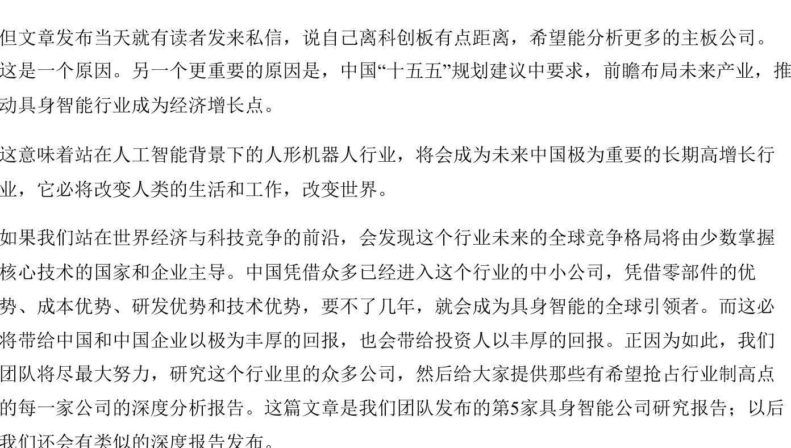
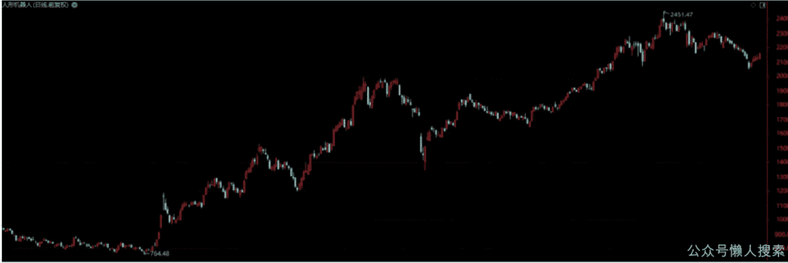
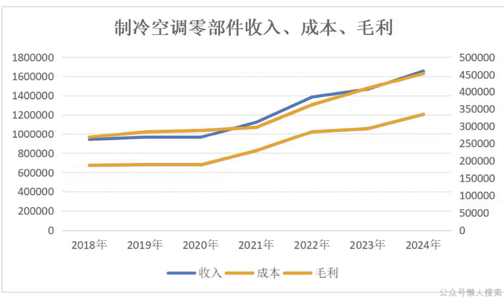
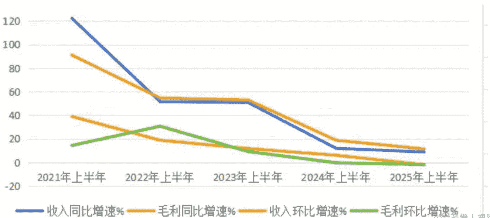
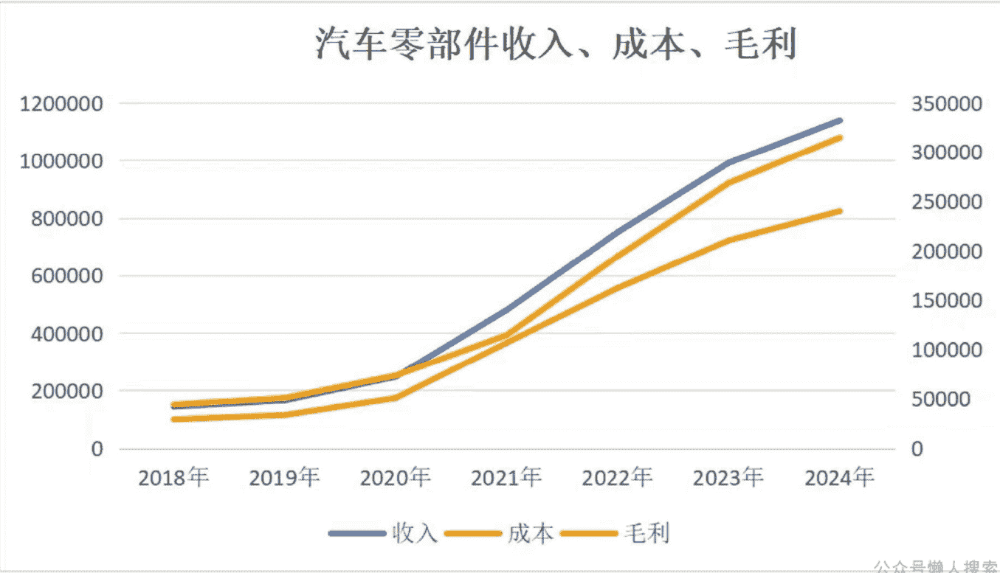
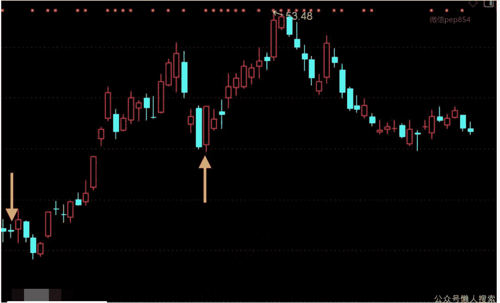
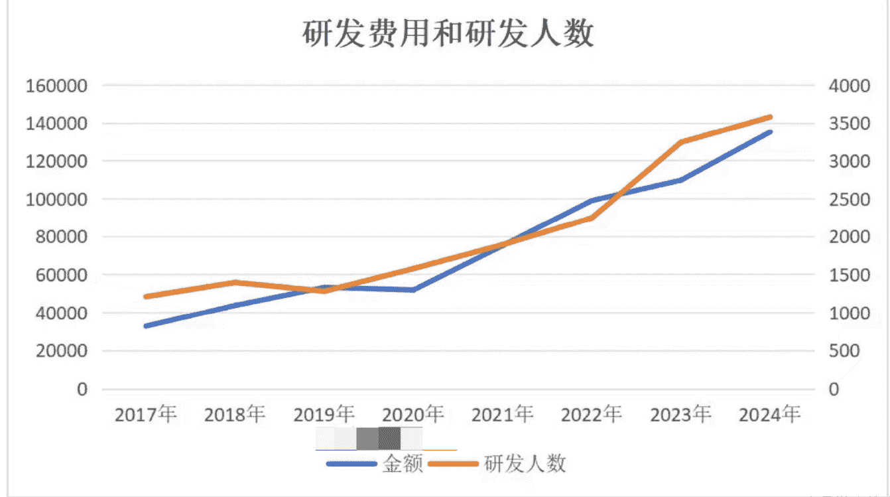
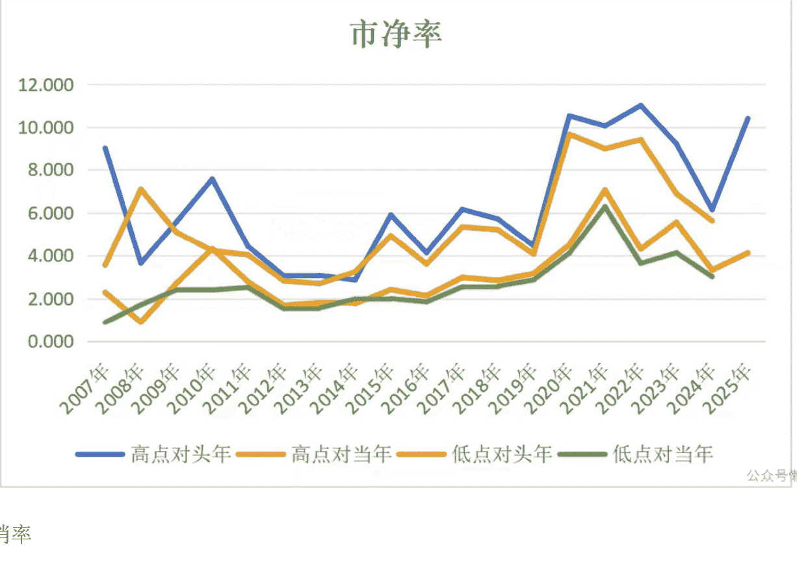
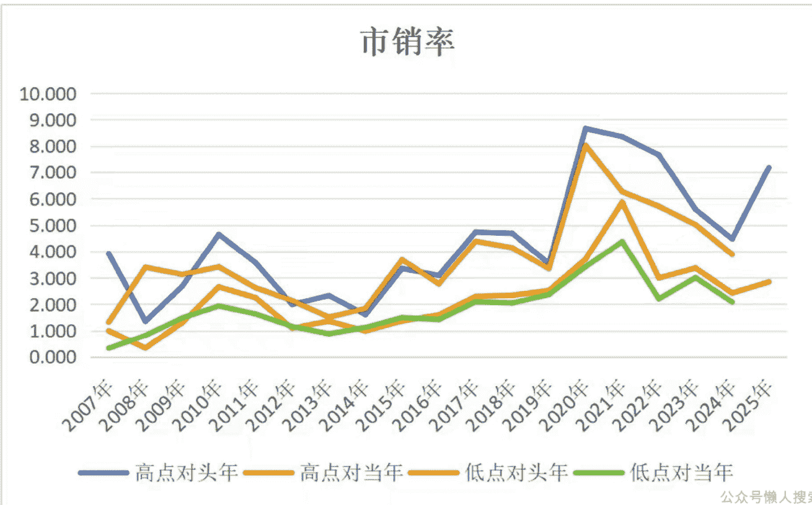
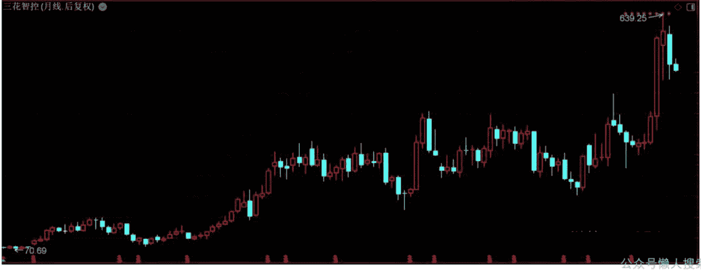

# 公司分析21：在两个领域做到全球领先，闯入人形机器人+AI液冷+储能，进入全球巨头供应链

251205 安民分析
整理：公众号懒人搜索，懒人专属群独享
懒人微信：lazyhelper

10月7日我们团队发布了属于人形机器人行业的某公司分析报告，那是一家在科创板上市的小型科技公司。体量不大，却牢牢把控着机器人行业中某项绕不开的环节，就是对某些产品来说，那类零部件产品您必须要用。

但文章发布当天就有读者发来私信，说自己离科创板有点距离，希望能分析更多的主板公司。这是一个原因。另一个更重要的原因是，中国“十五五”规划建议中要求，前瞻布局未来产业，推动具身智能行业成为经济增长点。

这意味着站在人工智能背景下的人形机器人行业，将会成为未来中国极为重要的长期高增长行业，它必将改变人类的生活和工作，改变世界。

如果我们站在世界经济与科技竞争的前沿，会发现这个行业未来的全球竞争格局将由少数掌握核心技术的国家和企业主导。中国凭借众多已经进入这个行业的中小公司，凭借零部件的优势、成本优势、研发优势和技术优势，要不了几年，就会成为具身智能的全球引领者。而这必将带给中国和中国企业以极为丰厚的回报，也会带给投资人以丰厚的回报。正因为如此，我们团队将尽最大努力，研究这个行业里的众多公司，然后给大家提供那些有希望抢占行业制高点的每一家公司的深度分析报告。这篇文章是我们团队发布的第5家具身智能公司研究报告；以后我们还会有类似的深度报告发布。

另外，我们前期发布的3家人形机器人公司中，创业板的那家公司，11月份有315家机构到公司调研，在全市场排第2位：科创板的第1家机器人公司，11月份有290家机构前去调研，在全市场排第4位。足见我们团队的研究实力。

今天研究的这家公司是主板公司，涉足储能行业、机器人行业、AI液冷和新能源汽车行业，一身兼具数大成长性行业，还是中美包括特斯拉人形机器人、电动汽车在内的零部件供应商，也间接是美国很多超大规模数据中心如微软、谷歌、亚马逊冷却系统解决方案供应商，真的是非常豪横。

与上一家公司的小而美不同，今天这家公司是货真价实的大公司，跨界来到新兴的储能领域和机器人行业，并且很快就进入了特斯拉和优必选的供应链，也进入AI服务器液冷和数据中心液冷领域。我们这次，就是带大家一睹跨界大公司的风采，看看大公司是如何拓展业务边界，看看他们对行业发展的助力，以及，一起思考当巨头来临时，我们要抓住的重点是什么。而现在市场正在调整之中，这也将会给未来想介入的投资者，以极好的机会。

我们将结合公司2024年年报、2025年半年报和三季报，为大家深度分析这家公司。文章分为八个部分，包括“机器人元年”和巨头的行动、公司业务分析、各财务环节对公司利润的影响、影响公司业绩的因素和排序、2025公司的业务预估、捋清公司介入机器人的过程、当巨头来临时，我们应该抓住的重点、公司的市场定位。

图表较多，建议您用电脑端微信阅读。

## 一、“机器人元年”和巨头的行动

在分析公司前，我们得先厘清一个问题，即行业巨头和行业发展的关系，这可以说是我们对机器人行业更多的一些思考。

880703人形机器人从2024年9月18日的764.48点到2025年9月18日的2451.47点，一年涨了206.72%，于是一直有舆论把2024或2025年称作“机器人元年”。这个“元年”不是学术定义，只是社会形成的某种模糊共识。

当“机器人元年”这个风吹出来时，我们有个朋友，还是大学老师表示很不屑。详细问了后才知道，他不屑的不是“机器人”，而是“元年”。因为他算是另一个“元年”的亲历者。

没错，是2016年的“VR元年”。

他曾经开玩笑说，现在所有机器人行业的从业者，首要任务不是研发，而是说服大家相信机器人元年不是VR元年。

VR是英文简称，它的中文全称是虚拟现实，就是让用户头戴特制显示器，把电影或游戏的画面输出到显示器上，再辅以动作捕捉等技术，让用户和虚拟场景互动。相比常规的电视电脑，大幅提升用户的沉浸感。

当年的VR概念炒作不分国内外，暴风集团上市后踩着VR的风口在40个交易日里打过37个涨停；国际科技巨头，微软、谷歌、Facebook、HTC（台湾省）等纷纷斥巨资收购VR初创公司或者直接推出自有产品。

我们同学的亲戚有位学长，从澳洲留学回来后，在那个被后世普遍认为是VR元年的当口，又是自掏腰包，又是抵押贷款，投了一大笔钱搞VR设备创业。

两年多后，鸡飞蛋打，房子都没了，转行做了自媒体，现在算是落了个安稳的生活。

我们同学的儿子因为专业相关，曾经被亲戚介绍参加过他的饭局。这位海归创业者当初为了挖人和拉投资，也是一顿饭豪掷万金的主儿，经常在酒桌上向年轻人许愿VR行业的前景。

在他描绘的VR行业的确定性中，有一点被反复提及：

“国外科技巨头都下场了，Facebook在2014年就收购了Oculus，索尼又要推出PSVR，我在美国的朋友也有消息，可以确定的是，所有巨头都会加码。”“其实看行业前景很简单，就是看巨头的行动。它们的信息源和决策流程其实就是为我们小公司的选择做背书。”当时在场的年轻人基本都是附和，我们同学的儿子也不例外，但他有自己的思考，这个思考让他选择继续在某大公司充实履历，而不是跟着那位老板空耗两年。

尽管Facebook后来改名Meta；Meta源于“元宇宙”英文单词Metaverse的前4个字母，改名旨在转型为涵盖虚拟现实、增强现实等技术的科技生态，但对VR行业的反思说起来其实很简单：“巨头虽多，但它们几乎没有参与VR的根基建设。”巨头们动作频频，但也都是围绕着谁家的设备更轻、谁家更便宜、谁家的软硬件结合更好、谁家的动作捕捉更精准，唯独一点被忽略了，就是VR的图像画质如何保证，那恰恰是很关键的一点。

由于VR的特殊使用方式，需要影片有很高的分辨率和播放帧率，一旦不满足，使用者很可能恶心呕吐。再好的东西，如果一半人戴上就吐，那肯定成不了。

那么应该由谁来完成这个不让人呕吐的任务呢？

其实是英伟达和AMD，即超威半导体。

说白了，大家需要英伟达和AMD做出大量又便宜又有超高性能的显卡，让显卡计算出超高画质的图形，确保用户不至于戴上VR设备就头晕恶心。

但2016年前后，这两巨头提出了哪些实际解决方案呢？答案是没有。英伟达和AMD提供了更好用的VR软件开发工具，开放了更多兼容VR的接口，认证了更多VR设备，周围的一圈工作都做了，但唯独没有推出强到确保用户不会呕吐的显卡。

不仅2016年没有推出，直到现在都没做到。

就像业主们在一起咋咋呼呼地讨论商品房的性价比、装修方案和以后怎么出租，看着热闹，但转头一看，发现楼房的地基还没打呢。英伟达和AMD，连同那一大批下场的巨头，和这个一模一样。况且，从2016年到现在，VR行业并没有思考到底有多少人会真的需要VR。

在所谓的VR元年前后，国内外巨头确实下场了。国外巨头尤其积极，国内的巨头们更多是被动地防御性反应。在那个对国外还有滤镜的时间点，国外巨头的决策成了国内大量初创公司的行动指南。风潮过去后，巨头们不过是一次集体的押错宝，错了就错了，但对小公司则是灭顶之灾。

所以当社会舆论炒出“元年”概念时，那绝对是真有不少初创公司和巨头下场开干了，比如VR元年。

但如何识别真元年还是假元年，还是要看有没有人在真正解决这个行业的痛点。

机器人行业的痛点是什么？价格？体积重量？安全性？还是什么？

这些因素不能说错。但就像VR元年时在设备的价格、重量、销售渠道、软硬件适配等等方面下功夫的巨头一样，他们所忙活的业务建立在“VR技术切实能用”的基础上。机器人行业也一样，机器人的首要问题是“机器人能不能用”，能在多大范围内被应用，即人形机器人的使用功能，它能够做到什么功能，能够多大程度上达到人的智能化程度。

而保证机器人能用的基础条件有三个，一个是硬件支持，二是软件支持，三是智能化。

近期刚好有两个例子可以完美体现机器人的硬件和软件支持路线。

国内机器人厂商的机器人表演可以说是百花齐放，春晚上扭秧歌的就不谈了，还有机器人马拉松，机器人格斗，或者像武打演员一样空翻打武术套路，拳击，在石头堆里行走。这是比较典型的硬件支持。

而前段时间特斯拉的Optimus机器人有个短视频爆火，内容是机器人在爆米花机前一手捏着纸盒，一手铲起爆米花递给顾客，虽然动作慢，也远没有国内机器人那么潇洒，但从另一个角度体现了机器人当前的场景识别与交互能力。这是典型的软件支持。

网上有声音在争吵是国内的机器人还是特斯拉的机器人更胜一筹。这个没必要，软硬件都是机器人存在的根基，未来机器人要想长期存在并深度介入我们的生活，既要有翻跟头的本事，也要有卖爆米花的本事。我很高兴不同巨头在从这两个方向一起攻克人形机器人的基础问题，就像挖隧道，从两头对着挖总快过只在一头挖。

真正成熟的机器人不能只当李元霸，也不能只当霍金。

至于智能化，也依赖于人工智能的进化程度。无人机在战场的表现，这类智能如果能够向多方面拓展，就有可能让人形机器人融入我们的生活。也即当人工智能进化到很强大的时候，装备了人工智能、具备极强自我学习能力的具身智能机器人，就有可能学会人的很多技能，而不是现在工厂里的机械手，只具有单一的技能；到时它具备极强的跟人沟通的能力，能够理解人的各种指令，还能理解物理世界，然后还具有极强的学习和完成多种复杂动作的能力。这样的人形机器人，就能够进入生活和世界，能够在很多方面代替人，且服务于人。

而现在，全球人工智能进展神速，在中国，在很多行业落地很快。

这才有“真元年”的样子。

## 二、公司业务分析

今天我们分析的这家大公司，是三花智控，代码002050。我们称之为大公司，因为它是全球最大的制冷控制元器件和全球领先的汽车热管理系统控制部件制造商，已经在两个领域做到全球第一。这点很不简单。公司2024年的营业收入已达279.47亿元，净利润达30.99亿元。这样的角色下场做机器人时，我们就必须严肃对待。

### 1. 制冷空调零部件（单位：万元）

| 制冷空调零部件 | 2023年 | 2024年 | 增速 | 增量 |
|---|---|---|---|---|
| 收入 | 1464413.52 | 1656060.54 | 13.09% | 191647.02 |
| 成本 | 1054785.21 | 1203098.59 | 14.06% | 148313.38 |
| 毛利 | 409628.31 | 452961.95 | 10.58% | 43333.64 |
| 毛利率 | 27.97% | 27.35% |  | -0.62% |

收入中速增长，增量19.16亿；毛利两位数增长，增量43333.64万。成本增速高于收入增速0.97个百分点，带动毛利率下滑0.62个百分点，负面影响毛利10274.20万，占毛利增量的23.71%。

这一块的产品有电子膨胀阀、四通换向阀、球阀、方体阀、风扇电机、电动切换阀等等零部件，它们是制冷与通风系统中，用于控制和驱动流体如制冷剂或空气流动的关键执行部件。

公司的空调电子膨胀阀、四通换向阀、截止阀、电磁阀、微通道换热器市场占有率稳居世界第一。这足见公司的实力。

强调，公司生产的是零部件，不生产ToC产品，所以美的、海尔、大金这样的公司不是三花智控的竞争对手，而是它的客户。

这些产品除了用在家用和商用空调之外，公司在开放平台答投资者提问时明确表示过，公司的阀、泵、换热器以及相关的组件类产品都可以使用在液冷服务器业务，产品技术具有一定的同源性，目前公司积极拓展液冷服务器领域业务，并持续推进与液冷相关企业的合作。这是公司的产品使用在又一个AI应用领域，当然目前的炒作可能未必炒到它的液冷题材。说不定到某一天，也有资金会挖掘出这方面的题材进行炒作，到时您要知道公司有这项业务。还有，它也有AI数据中心液冷业务。即AI数据中心用到它的产品，有可能在两个方向，服务器液冷和数据中心热管理。

信息时代，服务器、算力中心只会越来越多，每一个机房都需要热管理和解决方案，没有例外。这些解决方案中，有不小的概率会用到三花智控的制冷零部件。

我们再看2025年上半年同比2024上半年的情况（单位：万元）：

| 制冷空调零部件 | 2024年上半年 | 2025年上半年 | 增速 | 增量 |
|---|---|---|---|---|
| 收入 | 827870.03 | 1038869.34 | 25.49% | 210999.31 |
| 成本 | 599725.19 | 745854.51 | 24.37% | 146129.32 |
| 毛利 | 228144.84 | 293014.83 | 28.43% | 64869.99 |
| 毛利率 | 27.56% | 28.21% |  | 0.65% |

收入中高速增长，增量21.1亿；毛利中高速增长，增量64869.99万。成本增速低于收入增速1.12个百分点，带动毛利率提高0.65个百分点，正面影响毛利6722.69万，占毛利增量的10.36%。表明2025年上半年，公司这块业务的成本控制，比2024年有效果。

2025上半年同比2024上半年，制冷空调零部件业务的经营健康程度有所提升，收入增速很健康，毛利增速更好。我们再看看2025年上半年环比2024下半年的经营情况（单位：万元）：

| 制冷空调零部件 | 2024年下半年 | 2025年上半年 | 增速 | 增量 |
|---|---|---|---|---|
| 收入 | 828190.51 | 1038869.34 | 25.44% | 210678.83 |
| 成本 | 603373.4 | 745854.51 | 23.61% | 142481.11 |
| 毛利 | 224817.11 | 293014.83 | 30.33% | 68197.72 |
| 毛利率 | 27.15% | 28.21% |  | 1.06% |

收入中高速增长，增量21.07亿；毛利高速增长，增量68197.72万。成本增速低于收入增速1.83个百分点，带动毛利率提高1.06个百分点，正面影响毛利11007.73万，占毛利增量的16.14%。

这个增长，应该与国家家电消费刺激政策及2025上半年北美空调市场的增长有关。

再来看看制冷空调零部件业务历年的情况：

| 制冷空调零部件 | 收入 | 成本 | 毛利 | 毛利率 |
|---|---|---|---|---|
| 2018年 | 940375.88 | 672707.87 | 267668.01 | 28.46% |
| 2019年 | 963658.87 | 680174.93 | 283483.94 | 29.42% |
| 2020年 | 964064.72 | 676459.91 | 287604.81 | 29.83% |
| 2021年 | 1121832.09 | 825020.97 | 296811.12 | 26.46% |
| 2022年 | 1383378.61 | 1021456.87 | 361921.74 | 26.16% |
| 2023年 | 1464413.52 | 1054785.21 | 409628.31 | 27.97% |
| 2024年 | 1656060.54 | 1203098.59 | 452961.95 | 27.35% |
| 复合增长率 | 9.89% | 10.17% | 9.16% |  |

注意，公司的此类业务虽然做了很多年，但早期的业务划分和现在有很多不同，所以就没有把2018年以前的制冷零部件业务情况收录进来，看看近7年的数据就好。总体而言，制冷空调零部件是很成熟的业务，能够保持10%左右的年复合增速，是很不错的。

以下是收入、成本、毛利图：

图中蓝色和橙色为收入和成本，用主坐标轴，黄色为毛利，用次坐标轴。

经过2024年整年的同比、2025上半年的同比、2025上半年的环比三项比较，结合历年的业务收入、成本、毛利及复合增速，可以看到公司不愧是全球最大的制冷控制元器件制造商，几乎挑不出毛病，就是赚钱。就像班里的学习委员，你不用追着下达学习任务，人家自己就能把一切安排得井井有条。

每年有个业务，营收一百大几十亿，接近10%的复合增长率，作为制造业还能轻轻松松拿下将近30%的毛利率，这就是优秀的公司。虽说2025年的优异表现有国补和北美市场高增长的影响，但霸主有霸主的玩法，它的体量和规模优势就是护城河。别说三花智控，绝大多数公司要是能有这么一块业务，夫复何求呢。这就是现金奶牛类的业务。

### 2. 汽车零部件（单位：万元）

| 汽车零部件 | 2023年 | 2024年 | 增速 | 增量 |
|---|---|---|---|---|
| 收入 | 991366.69 | 1138655.91 | 14.86% | 147289.22 |
| 成本 | 722600.69 | 823884.76 | 14.02% | 101284.07 |
| 毛利 | 268766 | 314771.15 | 17.12% | 46005.15 |
| 毛利率 | 27.11% | 27.64% |  | 0.53% |

收入中速增长，增量14.73亿；毛利中速增长，增量46005.15万。成本增速低于收入增速0.84个百分点，带动毛利率提高0.53个百分点，正面影响毛利6074.08万，占毛利增量的13.20%。

这里的汽车零部件，准确说是汽车的热管理系统，以热泵系统、控制阀件、换热技术、变频控制为核心，也就是汽车领域冷热转换、温度控制的相关产品和技术，新能源车尤其要关注热管理特别是电池的热管理问题，闹不好容易起火，或者像南方的夏天和北方的冬天，跑一会儿就没电了。它实际上是与制冷技术相关联的，二者技术同源。就像同一个空调，既可以吹冷风，也可以吹暖风。

公司的车用电子膨胀阀、新能源车热管理集成组件等产品市场占有率居全球第一；车用热力膨胀阀、储液器等占有率处于全球领先地位。

还有，我们前面就说了公司涉足储能领域，这是年报官方认证的。公司的储能业务，不是说公司生产储能电池，而是公司产品进入储能电池或储能电站的热管理，是电动汽车热管理技术向储能领域的延伸。电池在充放电过程中会发热，如果不处理好温度，会导致电池性能变差、寿命缩短、安全问题。

市场有传闻：2025年8月，三花智控中标宁德时代3-60kW浸没式液冷系统订单，覆盖工商业及集装箱储能场景，能效比达4.5+。我们没有查到相应的证据。另外，有投资者提问：针对储能市场的爆发式增长，公司的液冷、风冷、直冷解决方案已应用于宁德时代、阳光电源等头部企业，未来如何进一步深化与储能系统集成商的合作，拓展海外市场份额？公司董秘回答：公司将持续密切跟踪储能热管理领域技术发展动向，同步推进储能热管理领域零部件的市场拓展机会以及储能热管理组件开发，积极配合客户完成产品配套。感谢您对公司的关注！

公司没有肯定也没有否定这个信息。但从董秘的回答可以看出，公司介入储能热管理领域，是以零部件供应商的身份介入，而储能热管理组件是在开发。公司作为制冷零部件龙头和电动汽车热管理龙头企业，横向进入储能领域，也是很正常的业务迁移。

电动汽车零部件业务是公司业务的第二条增长曲线，本身发展就要晚好些年，所以在营收上要弱一点。2024年是公司此业务跨过百亿大关的一年，而且收入增速也有将近15%，毛利增速超过17%，这同样是一项了不起的业务。

再来看看2025上半年同比2024上半年的业务情况（单位：万元）：

| 汽车零部件 | 2024 年上半年 | 2025 年上半年 | 增速 | 增量 |
|---|---|---|---|---|
| 收入 | 539737.19 | 587409.41 | 8.83% | 47672.22 |
| 成本 | 392313.84 | 423182.17 | 7.87% | 30868.33 |
| 毛利 | 147423.35 | 164227.24 | 11.40% | 16803.89 |
| 毛利率 | 27.31% | 27.96% |  | 0.64% |

收入个位数增长，增量4.77亿；毛利中速增长，增量16803.89万。成本增速低于收入增速0.96个百分点，带动毛利率提高0.64个百分点，正面影响毛利3782.74万，占毛利增量的22.51%。

下面是公司2025上半年环比2024下半年的业务情况（单位：万元）：

| 汽车零部件 | 2024 年下半年 | 2025 年上半年 | 增速 | 增量 |
|---|---|---|---|---|
| 收入 | 598918.72 | 587409.41 | -1.92% | -11509.31 |
| 成本 | 431570.92 | 423182.17 | -1.94% | -8388.75 |
| 毛利 | 167347.8 | 164227.24 | -1.86% | -3120.56 |
| 毛利率 | 27.94% | 27.96% |  | 0.02% |

收入小幅下滑，同比减少1.15亿；毛利小幅下滑，同比减少3120.56万。成本下滑速度高于收入0.02个百分点，带动毛利率提高0.02个百分点，正面影响毛利95.33万。这种情况也有原因，下半年，特别是第四季度，往往是汽车产量的高峰期，电动汽车这个特点特别明显。

为了更清楚地理解2025上半年环比2024下半年的增长情况是否符合此类业务的常态，我们先看2020年以来，公司上半年此项业务的同比增速（单位：万元）：

|  | 收入 | 收入同比增长率 | 毛利 | 毛利同比增长率 |
|---|---|---|---|---|
| 2021 上半年 | 211082.1 | 122.14% | 52461.95 | 90.99% |
| 2022 上半年 | 319856.69 | 51.53% | 81120.66 | 54.63% |
| 2023 上半年 | 482289.95 | 50.78% | 124099.75 | 52.98% |
| 2024 上半年 | 539737.19 | 11.91% | 147423.35 | 18.79% |
| 2025 上半年 | 587409.41 | 8.83% | 164227.24 | 11.40% |

再把历年的上半年环比上一年的下半年数据列出来，看看环比增幅（单位：万元）：| | 收入 | 收入环比增长率 | 毛利 | 毛利环比增长率 |
|---|---|---|---|---|
| 2021 上半年 | 211082.1 | 38.97% | 52461.95 | 14.37% |
| 2022 上半年 | 319856.69 | 18.83% | 81120.66 | 30.69% |
| 2023 上半年 | 482289.95 | 11.77% | 124099.75 | 9.24% |
| 2024 上半年 | 539737.19 | 6.02% | 147423.35 | -0.30% |
| 2025 上半年 | 587409.41 | -1.92% | 164227.24 | -1.86% |

我们抽取每年上半年收入和毛利的同比增速，以及上半年和头年下半年的收入和毛利的环比增速，来进行观察：

从表中和图中可以看出，无论是收入还是毛利，历年同比增速均高于环比增速。上半年毛利同比增速多高于收入同比增速；上半年毛利环比增速多低于收入环比增速。

但公司的这块业务，2024年上半年和2025上半年，无论同比还是环比，增速都比较低，而且2021年到2024年也是逐年下降。主要原因在于三点：

- 一是下游电池及汽车厂家，相对于上游零部件厂商来说，好多都呈强势。
- 二是它的产品相当大一部分供应特斯拉，而特斯拉这两年的增速没有国内电动汽车快。
- 三是国内新能源汽车随着销量的增长，增速本身就有下滑，再加上他遇到了国内汽车零部件厂商多数都是降毛利率抢国内市场，而公司有特斯拉的业务，国内零部件价格如果大幅下降，就有顾虑。比如同样的产品，如果供应特斯拉是2000元，而供应国内某厂家只要1000元，那么特斯拉的业务他就做不下去。

我们再贴出公司历年的汽车零部件全年的经营数据（单位：万元）：

| 汽车零部件 | 收入 | 成本 | 毛利 | 毛利率 |
|---|---|---|---|---|
| 2018 年 | 143223.19 | 99340.26 | 43882.93 | 30.64% |
| 2019 年 | 165090.07 | 114509.52 | 50580.55 | 30.64% |
| 2020 年 | 246918.62 | 173579.22 | 73339.4 | 29.70% |
| 2021 年 | 480248.89 | 365714.13 | 114534.76 | 23.85% |
| 2022 年 | 751376.37 | 556653.05 | 194723.32 | 25.92% |
| 2023 年 | 991366.69 | 722600.69 | 268766.00 | 27.11% |
| 2024 年 | 1138655.91 | 823884.76 | 314771.15 | 27.64% |
| 复合增长率 | 41.27% | 42.27% | 38.87% | |

### 汽车零部件收入、成本、毛利

图中蓝色和橙色为收入和成本，用主坐标轴，黄色为毛利，用次坐标轴。

回看2018年以来，以年度计，到2024年为止，公司的这块业务还是很不错的。公司抓住了新能源汽车高增长的历史性机会。收入年复合增速41.27%，毛利年复合增速38.87%，这都是很高的增速，表明2018年以来，公司这块业务的经营是很成功的。这是第一点。

第二，这块业务的体量仍然足够大，2024年超过110亿的营收仍然是绝对的亮眼表现。并且在高营收的基础上，毛利率还非常稳定，除了在2020年国产车还没爆发前，此业务体量不太大时毛利率能超过30%，其余时间，就算考虑了以价换量，此业务的毛利率最低也有23.85%，而且还在国产车内卷最严重的时候把握住成本，连续3年在不减营收的前提下把毛利率往上抓，这体现了公司非常优秀的成本管控能力。

第三，公司年产1100万套新能源汽车用高效换热器组件项目在2024年报中显示已建设完成了98%，项目预算9.4亿，实际建设花费13.13亿元以上，算上调试、试产、爬坡等环节，2025下半年应该会看到一些成果，2026年有望带来增长。

此外，公司还有在建年产1250万套新能源汽车用智能热管理模块建设项目（预算投资13.73亿，2025半年报进度49%）、广东三花新能源汽车热管理部件生产项目（预算投资20.5亿，2025半年报进度39%），这是大体量的汽车产业在建工程，还没算各种改造和小规模投资。

### 3.主营业务（单位：万元）

| 主营业务 | 2023年 | 2024年 | 增速 | 增量 |
|---|---|---|---|---|
| 收入 | 2394206.39 | 2712300.39 | 13.29% | 318094 |
| 成本 | 1722286.89 | 1952878.13 | 13.39% | 230591.24 |
| 毛利 | 671919.5 | 759422.26 | 13.02% | 87502.76 |
| 毛利率 | 28.06% | 28.00% |  | -0.07% |

收入中速增长，增量31.81亿；毛利中速增长，增量87502.76万。成本增速高于收入增速0.1个百分点，带动毛利率下降0.07个百分点，负面影响毛利1768.39万，占毛利增量的2.02%。

我们再结合一下公司的半年报（单位：万元）：

| 主营业务 | 2024 上半年 | 2025 上半年 | 增速 | 增量 |
|---|---|---|---|---|
| 收入 | 1333951.61 | 1583128.69 | 18.68% | 249177.08 |
| 成本 | 960058.1 | 1127986.89 | 17.49% | 167928.79 |
| 毛利 | 373893.51 | 455141.8 | 21.73% | 81248.29 |
| 毛利率 | 28.03% | 28.75% |  | 0.72% |

收入中速增长，增量24.92亿；毛利中高速增长，增量81248.29万。成本增速低于收入增速1.19个百分点，带动毛利率上升0.72个百分点，正面影响毛利11406.41万，占毛利增量的14.04%。成本管控有效果。作为参考，下面是公司5年来半年报的数据（单位：万元）：

| 主营业务 | 收入 | 成本 | 毛利 | 毛利率 |
|---|---|---|---|---|
| 2021 上半年 | 735945.88 | 530322.09 | 205623.79 | 27.94% |
| 2022 上半年 | 975998.38 | 731585.83 | 244412.55 | 25.04% |
| 2023 上半年 | 1209847.76 | 888302.77 | 321544.99 | 26.58% |
| 2024 上半年 | 1333951.61 | 960058.1 | 373893.51 | 28.03% |
| 2025 上半年 | 1583128.69 | 1127986.89 | 455141.8 | 28.75% |

收入可观、成本可控、毛利率可喜。

### 4.其他业务（单位：万元）

| 其他业务 | 2023 年 | 2024 年 | 增速 | 增量 |
|---|---|---|---|---|
| 收入 | 61573.82 | 82416.06 | 33.85% | 20842.24 |
| 成本 | 55099.01 | 74105.22 | 34.49% | 19006.21 |
| 毛利 | 6474.81 | 8310.84 | 28.36% | 1836.03 |
| 毛利率 | 10.52% | 10.08% |  | -0.43% |

收入高速增长，增量2.08亿；毛利中高速增长，增量1836.03万。成本增速高于收入增速0.64个百分点，带动毛利率下降0.43个百分点，负面影响毛利355.64万，占毛利增量的19.37%。

2025上半年和2024上半年的其他业务相比，情况如下（单位，万元）：

| 其他业务 | 2024 上半年 | 2025 上半年 | 增速 | 增量 |
|---|---|---|---|---|
| 收入 | 33655.61 | 43150.06 | 28.21% | 9494.45 |
| 成本 | 31980.93 | 41049.79 | 28.36% | 9068.86 |
| 毛利 | 1674.68 | 2100.27 | 25.41% | 425.59 |
| 毛利率 | 4.98% | 4.87% |  | -0.11% |

收入中高速增长，增量9494.45万；毛利中高速增长，增量425.59万。成本增速高于收入增速0.15个百分点，带动毛利率下降0.11个百分点，负面影响毛利46.85万，占毛利增量的11.01%。

需要说明的是，公司的人形机器人业务、液冷业务、储能业务等，都在这一块，目前增速属于中高速增长，还没有怎么发力，未来估计会比较有前途的。也即公司在制冷零部件和电动汽车热管理两大产业做到全球领先，然后在3个新兴产业里进行布局。我们投资的，正是公司的长期战略和将战略落地的能力。当然，我们如果看公司年报或中报，液冷和储能业务并非重点，属于搂草打兔子，顺带的。但人形机器人属于公司一定要重点介绍的业务。

### 5.全部业务

全部业务等于主营业务+其他业务=制冷空调零部件业务+汽车零部件业务。也即它们的分类是一种交叉关系（单位：万元）：

| 全部业务 | 2023 年 | 2024 年 | 增速 | 增量 |
|---|---|---|---|---|
| 收入 | 2455780.21 | 2794716.45 | 13.80% | 338936.24 |
| 成本 | 1777385.9 | 2026983.36 | 14.04% | 249597.46 |
| 毛利 | 678394.31 | 767733.09 | 13.17% | 89338.78 |
| 毛利率 | 27.62% | 27.47% |  | -0.15% |

收入中速增长，增量33.89亿；毛利中速增长，增量89338.78万。成本增速高于收入增速0.24个百分点，带动毛利率下降0.15个百分点，负面影响毛利4290.29万，占毛利增量的4.8%。

需要说明的是，公司在年报公布时，并没有严格区分制冷空调零部件业务和液冷业务，它们都归为制冷空调零部件业务；公司也没有严格区分汽车零部件业务和储能热管理业务，包括人形机器人业务，估计它们暂时都归为汽车零部件业务。而我们若要观察公司的新兴业务情况，如人形机器人、储能管理、AI液冷业务等，则要去看其他业务。

再是2025年上半年和2024年上半年的全部业务情况（单位：万元）：

| 全部业务 | 2024 上半年 | 2025 上半年 | 增速 | 增量 |
|---|---|---|---|---|
| 收入 | 1367607.22 | 1626278.74 | 18.91% | 258671.52 |
| 成本 | 992039.03 | 1169036.68 | 17.84% | 176997.65 |
| 毛利 | 375568.19 | 457242.06 | 21.75% | 81673.87 |
| 毛利率 | 27.46% | 28.12% |  | 0.65% |

收入中速增长，增量25.87亿；毛利中高速增长，增量81673.87万。成本增速低于收入增速1.07个百分点，带动毛利率上升0.65个百分点，正面影响毛利10638.27万，占毛利增量的13.23%。2025年上半年降成本的效果不错。

## 三、各财务环节对公司净利润的影响

### 1.费用环节的影响（单位：万元）

|  | 2023 年 | 2024 年 | 增量 | 影响 |
|---|---|---|---|---|
| 税金及附加 | 13981.6 | 17127.66 | 3146.06 | -3146.06 |
| 销售费用 | 59756.56 | 72643.72 | 12887.16 | -12887.16 |
| 管理费用 | 147633.42 | 176745.43 | 29112.01 | -29112.01 |
| 研发费用 | 109683.42 | 135179.88 | 25496.46 | -25496.46 |
| 财务费用 | -7275.14 | -4378.24 | 2896.9 | -2896.9 |
| 合计 |  |  |  | -73538.59 |

2024年，费用环节一共减少营业利润73538.59万元。经过这5个环节，公司2024年的营业利润同比增加15800.19万元。

影响最大的两个项目在管理费用和研发费用。管理费用中影响较大的是职工薪酬（比上年增加16732.84万元）、办公费（增加7112.2万元）、折旧摊销费（增加4008.76万元）。

职工薪酬增加16732.84万，查了一下公司在岗人数，2023年底为17732人，2024年底为19787人，增加2055人，人均81425.01元。增加的人员中，销售人员增加56人，行政人员增加60人，财务增加88人，技术人员增加337人，生产人员增加1514人。业务+财务共增加1995人，占比97.08%，行政只增加60人，占比2.92%，是很合理的。

研发费用中影响最大的是人员人工，比上年增加17851.72万元。2023年公司研发人员3241人，人均薪酬180889.29元；2024年研发人员3578人，人均薪酬213744.94元，增幅18.16%，估计应该与研发人员的行业结构相关，即人形机器人行业研发人员的工资可能要高一些。新增研发人员337人，薪酬比上年增加17851.72万元，人均529724.63元。除了原来两个行业的研发人员增加工资外，新兴行业研发人员工资高应该是主因。这也印证了公司在为人形机器人研发招募相关技术人才。

“销售费用”这一栏，根据2023年年报，其为66330.43万元，但根据《企业会计准则解释第18号》，公司追溯更正了2024年报中的2023年度6573.87万元的“产品质保费”的列报，把它从“销售费用”移到了“营业成本”。我们团队依靠非常专业的会计素养和丰富的财报分析经验，解决了这个比较棘手的问题。

再是2025上半年的情况（单位：万元）：

|  | 2024 上半年 | 2025 上半年 | 增量 | 影响 |
|---|---|---|---|---|
| 税金及附加 | 8423.34 | 9441.34 | 1018 | -1018 |
| 销售费用 | 29700.25 | 30807.94 | 1107.69 | -1107.69 |
| 管理费用 | 88799.93 | 90296.7 | 1496.77 | -1496.77 |
| 研发费用 | 63261.19 | 70499.88 | 7238.69 | -7238.69 |
| 财务费用 | -5178.17 | 3743.32 | 8921.49 | -8921.49 |
| 合计 |  |  |  | -19782.64 |

这5个环节对营业利润产生19782.64万元的负面影响。经此5个环节，2025上半年营业利润同比增加了61891.23万元。

2025上半年的费用方面，影响最大的是财务费用和研发费用。财务费用的变化，是因为汇兑损益比同期减少了4600.37万元，利息收入减少了3788.7万元。

研发费用方面是因为人员工资增加了3449.64万元，直接投入增加了2246.03万元。

### 2.利得和损失的影响（单位：万元）

|  | 2023年 | 2024年 | 增量 | 影响 |
|---|---|---|---|---|
| 其他收益 | 18825.53 | 22920.59 | 4095.06 | 4095.06 |
| 投资收益 | -13145.39 | -1627.99 | 11517.4 | 11517.4 |
| 公允价值变动收益 | 4812.35 | -9073.36 | -13885.71 | -13885.71 |
| 信用减值损失 | -5147.77 | -5637.86 | -490.09 | -490.09 |
| 资产减值损失 | -5537.69 | -6292.13 | -754.44 | -754.44 |
| 资产处置收益 | 874.12 | 301.63 | -572.49 | -572.49 |
| 合计 |  |  |  | -90.27 |

2024年，这6个环节共计减少营业利润90.27万元。其中正面影响大的是投资收益，达11517.4万元；负面影响大的是公允价值变动收益，为-13885.71万元。至此，公司2024年营业利润增加15709.92万元。

投资收益影响为正，主要是汇率衍生工具结算损益的亏损收窄了9571.51万元。公允价值变动收益为负，主要是汇率衍生工具浮动损益造成的损失，由2023年的5154.97万元变为2024年的-8772.3万元。

这里说明一下，“汇率衍生工具结算损益”指公司手中持有的远期外汇合约、外汇期权等汇率衍生工具，在到期或行权后因实际资金交割而产生的盈利或损失，类似于咱们卖掉股票后产生的实际盈亏。“汇率衍生工具浮动损益”则是手头的汇率衍生工具因汇率变动造成的浮盈浮亏，只是暂时在账上记下，类似于我们的股票还没有买卖，但浮盈浮亏影响市值。

以下是2025上半年同比2024上半年的情况（单位：万元）：

|  | 2024 上半年 | 2025 上半年 | 增量 | 影响 |
|---|---|---|---|---|
| 其他收益 | 12855.2 | 15098.86 | 2243.66 | 2243.66 |
| 投资收益 | -1168.01 | -1760.08 | -592.07 | -592.07 |
| 公允价值变动收益 | -4307.76 | 6874.32 | 11182.08 | 11182.08 |
| 信用减值损失 | -7680.1 | -12899.14 | -5219.04 | -5219.04 |
| 资产减值损失 | -4443.41 | -5340.53 | -897.12 | -897.12 |
| 资产处置收益 | -24.53 | -166.63 | -142.1 | -142.1 |
| 合计 |  |  |  | 6575.41 |

2025上半年同比2024上半年共增加营业利润6575.41万元，影响较大的是公允价值变动收益（增加了11182.08万元）、其他收益（增加了2243.66万元）、信用减值损失（损失增加了5219.04万元）。经此6个环节，2025上半年营业利润同比增加了68466.64万元。

公允价值变动收益的增加主要得益于汇率衍生工具浮动损益增加了10914.41万元；其他收益的增加主要得益于增值税加计抵减增加了2875.17万元；信用减值损失方面，主要是坏账损失增加了5219.05万元。

### 3.营业外收支、所得税费用和少数股东损益等（单位：万元）

|  | 2023年 | 2024年 | 增量 | 影响 |
|---|---|---|---|---|
| 营业外收入 | 1493.29 | 964.9 | -528.39 | -528.39 |
| 营业外支出 | 1462.53 | 2801.78 | 1339.25 | -1339.25 |
| 所得税费用 | 61954.88 | 57996.06 | -3958.82 | 3958.82 |
| 少数股东损益 | 1272.18 | 1256.07 | -16.11 | 16.11 |
| 合计 |  |  |  | 2107.29 |4个环节共增加了公司的股东净利润2107.29万元。至此，2024年公司的股东净利润增加了17817.21万元。

影响较大的是所得税费用和营业外支出。

所得税费用方面，由于递延所得税费用减少了9064.14万元，当期所得税费用增加了5105.33万元，所以所得税费用整体上减少了3958.82万元。

营业外支出方面，主要是固定资产报废损失和赔偿及违约支出。以下是公司2025上半年和去年同期的表现（单位：万元）：

| | 2024上半年 | 2025上半年 | 增量 | 影响 |
|---|---|---|---|---|
| 营业外收入 | 455.9 | 488.7 | 32.8 | 32.8 |
| 营业外支出 | 852.77 | 1099.58 | 246.81 | -246.81 |
| 所得税费用 | 33229.61 | 39837.68 | 6608.07 | -6608.07 |
| 少数股东损益 | 715.02 | 2817.11 | 2102.09 | -2102.09 |
| 合计 | | | | -8924.17 |

4个环节共计减少了8924.17万元的股东净利润。主要由所得税费用和少数股东损益造成。至此2025上半年公司的股东净利润同比增加了59542.47万元，同比增长39.31%。

由于递延所得税费用增加了2262.72万元，当期所得税费用增加了4345.34万元，所以所得税费用整体上增加了6608.07万元。

## 四、影响公司2024业绩和2025上半年业绩的因素及排序

影响公司2024年业绩的因素一共17个，其中正面影响因素6个，负面影响因素11个（单位：万元）：

| 排序 | 正面影响 | 影响额 | 负面影响 | 影响额 | 合计 |
|---|---|---|---|---|---|
| 1 | 汽车零部件 | 46005.15 | 管理费用 | -29112.01 |  |
| 2 | 制冷零部件 | 43333.64 | 研发费用 | -25496.46 |  |
| 3 | 投资收益 | 11517.4 | 公允价值变动收益 | -13885.71 |  |
| 4 | 其他收益 | 4095.06 | 销售费用 | -12887.16 |  |
| 5 | 所得税费用 | 3958.82 | 税金及附加 | -3146.06 |  |
| 6 | 少数股东损益 | 16.11 | 财务费用 | -2896.9 |  |
| 7 |  |  | 营业外支出 | -1339.25 |  |
| 8 |  |  | 资产减值损失 | -754.44 |  |
| 9 |  |  | 资产处置收益 | -572.49 |  |
| 10 |  |  | 营业外收入 | -528.39 |  |
| 11 |  |  | 信用减值损失 | -490.09 |  |
| 小计 |  | 108926.18 |  | -91108.96 | 17817.22 |

通过全环节一步步计算可知，公司的业务确实很强。2024年汽车零部件和制冷零部件业务毛利增量都是4亿多，全部业务增加毛利89338.78万。费用一块减少营业利润73538.59万，利得和损失减少营业利润90.27万，营业外收支、所得税费用及少数股东损益增加股东净利润2107.29万，最终至全年股东净利润增加了17817.22万。属于人形机器人、储能、液冷等新兴业务的其他业务毛利增量也达到了1836.03万，高速增长；收入增速达到33.85%，增量2.08亿元。

再来比较2025上半年表现，我们分别做出2025上半年同比2024上半年，2025上半年环比2024下半年的影响因素排序。

同比2024上半年，影响公司2025上半年业绩的因素有17个，其中正面影响因素5个，负面影响因素12个，排序和影响如下（单位：万元）：

| 排序 | 正面影响 | 影响额 | 负面影响 | 影响额 | 合计 |
|---|---|---|---|---|---|
| 1 | 制冷空调零部件 | 64869.99 | 财务费用 | -8921.49 | |
| 2 | 汽车零部件 | 16803.89 | 研发费用 | -7238.69 | |
| 3 | 公允价值变动收益 | 11182.08 | 所得税费用 | -6608.07 | |
| 4 | 其他收益 | 2243.66 | 信用减值损失 | -5219.04 | |
| 5 | 营业外收入 | 32.8 | 少数股东损益 | -2102.09 | |
| 6 | | | 管理费用 | -1496.77 | |
| 7 | | | 销售费用 | -1107.69 | |
| 8 | | | 税金及附加 | -1018 | |
| 9 | | | 资产减值损失 | -897.12 | |
| 10 | | | 投资收益 | -592.07 | |
| 11 | | | 营业外支出 | -246.81 | |
| 12 | | | 资产处置收益 | -142.1 | |
| 小计 | | 95132.42 | | -35589.94 | 59542.48 |

2025上半年，公司制冷空调零部件毛利增量为64869.99万元，汽车零部件毛利增量为16803.89万，全部业务毛利增量81673.88万。费用这块减少营业利润19782.64万元，利得与损失增加营业利润6575.41万元，营业外收支、所得税费用及少数股东损益减少股东净利润8924.17万元，最终至股东净利润增加59542.48万，重归超高速增长。属于人形机器人、储能、液冷等新兴业务的其他业务毛利增量也有425.59万，高速增长；收入增速达到28.21%，增量近9500万元。

环比2024下半年，影响公司2025上半年业绩的因素有17个，其中正面影响因素6个，负面影响因素11个，排序和影响如下（单位：万元）：

| 排序 | 正面影响 | 影响额 | 负面影响 | 影响额 | 合计 |
|---|---|---|---|---|---|
| 1 | 制冷空调零部件 | 68197.72 | 所得税费用 | -15071.23 | |
| 2 | 销售费用 | 12135.53 | 信用减值损失 | -14941.38 | |
| 3 | 公允价值变动收益 | 11639.92 | 资产减值损失 | -3491.81 | |
| 4 | 其他收益 | 5033.47 | 汽车零部件 | -3120.56 | |
| 5 | 研发费用 | 1418.81 | 财务费用 | -2943.39 | |
| 6 | 营业外支出 | 849.43 | 管理费用 | -2351.2 | |
| 7 | | | 少数股东损益 | -2276.06 | |
| 8 | | | 投资收益 | -1300.1 | |
| 9 | | | 税金及附加 | -737.02 | |
| 10 | | | 资产处置收益 | -492.79 | |
| 11 | | | 营业外收入 | -20.3 | |
| 12 | | | | | |
| 小计 | | 99274.88 | | -46745.84 | 52529.04 |

2025上半年环比2024下半年，全部业务增加毛利65077.16万元；费用增加营业利润7522.73万元，利得和损失减少营业利润3552.69万；营业外收支、所得税费用及少数股东损益减少股东净利润16518.16万元，最终至股东净利润增加52529.04万，环比增速为33.15%；而2025年上半年股东净利润同比增速是39.31%，有所下滑，但仍然是高增长。

## 五、2025公司的业务预估

先来看看三季度的基本情况：

# 公众号懒人搜索，懒人专属群分享

| | 2024年三季报 | 2025年三季报 | 增速 | 增量 |
|---|---|---|---|---|
| 营收 | 2056289.71 | 2402931.35 | 16.86% | 346641.64 |
| 股东净利润 | 230197.07 | 324235.66 | 40.85% | 94038.59 |
| 扣非净利润 | 224802.42 | 308325.14 | 37.15% | 83522.72 |
| 经营现金流净额 | 199348.49 | 305828.35 | 53.41% | 106479.86 |
| 加权平均净资产收益率 | 12.61% | 13.67% | | 1.06% |
| 总资产 | 3446668.58 | 4851400.7 | 40.76% | 1404732.12 |
| 净资产 | 1844413.05 | 3163502.43 | 71.52% | 1319089.38 |
| 非经常性损益 | 5394.65 | 15910.52 | 194.93% | 10515.87 |

表现出色，净利润和扣非净利润超高速增长。财务杠杆也不高，股东净利润增速比半年报快1.54个百分点。总体而言没什么毛病。

三季报一般内容不多，连各业务具体的收入成本都没有，但由于已接近年底，所以我们可以尝试结合公司2025年三季报和以往三季报的信息来预估公司2025全年的大致表现，如果公司本身比较稳健，波动不大，根据三季报预估全年的一些基本情况还是有一定可靠性的。那么公司以前年份表现如何呢（单位：万元）：

| 营收 | 前三季 | 全年 | 占比 |
|---|---|---|---|
| 2018年 | 826518.84 | 1083599.07 | 76.28% |
| 2019年 | 862082.38 | 1128748.94 | 76.38% |
| 2020年 | 859321.6 | 1210983.34 | 70.96% |
| 2021年 | 1171988.04 | 1602080.98 | 73.15% |
| 2022年 | 1559898.57 | 2134754.97 | 73.07% |
| 2023年 | 1897577.82 | 2455780.21 | 77.27% |
| 2024年 | 2056289.71 | 2794716.45 | 73.58% |
| 2025年 | 2402931.35 | | |

以上是公司2018年到2024年前三季度的营收与全年营收的关系。

| 净利润 | 前三季 | 全年 | 占比 |
|---|---|---|---|
| 2018年 | 102339.15 | 129234.98 | 79.19% |
| 2019年 | 105629.91 | 142120.42 | 74.32% |
| 2020年 | 109224.85 | 146215.88 | 74.70% |
| 2021年 | 129317.15 | 168404.44 | 76.79% |
| 2022年 | 162764.59 | 257334.42 | 63.25% |
| 2023年 | 215963.12 | 292099.29 | 73.93% |
| 2024年 | 230197.07 | 309916.51 | 74.28% |
| 2025年 | 324235.66 | | |

以上是公司历年的前三季度净利润与全年净利润。注意看2025年前三季度净利润不仅高于2024同期，也已经超过2024全年净利润了。

在这里，我们列出2025前三季度的全部业务经营情况（单位：万元）

| 全部业务 | 2024年三季报 | 2025年三季报 | 增速 | 增量 |
|---|---|---|---|---|
| 收入 | 2056289.71 | 2402931.35 | 16.86% | 346641.64 |
| 成本 | 1486757.17 | 1728098.17 | 16.23% | 241341 |
| 毛利 | 569532.54 | 674833.18 | 18.49% | 105300.64 |
| 毛利率 | 27.70% | 28.08% | | 0.39% |

在明确成本没有大幅下降的前提下，净利润的优异表现无疑来自于费用的出色控制。其中管理费用减少了7838.74万元，财务费用增加了2260.59万元（因汇兑收益减少），研发费用增加了11133.84万元，其他收益增加了5223.49万元（因政府补助增加），公允价值变动收益增加了9566.98万元。

作为一家成熟的制造业巨头，公司无论营收还是净利润，前三季度数据占全年数据的比例一直比较稳定，百分之七十多，我们把条件往严格了算，假定前三季度的营收和净利润已达全年的80%，这样估计2025年全年营收3003664.19万元，创历史新高，首破300亿大关，全年净利润达405294.58万元，一样是历史新高。

前三季度收入占全年收入比例最高的3年分别是2023年77.27%、2018年76.28%、2019年76.38%，按78%估算，也算比较严的。则全年收入为3080681.22万，308.07亿元。前三季度净利润占全年净利润比例最高的3年为2018年，79.19%，2021年76.79%，2020年74.7%，也取78%，则全年净利润为415686.74万，41.57亿元。

近三年来，公司前三季度收入占全年收入比例分别是：2022年，73.07%；2023年，77.27%；2024年，73.58%，平均为74.64%；按75%预估，全年营收3203908.47万元，即320.39亿元；近三年来，前三季度净利润占全年净利润比例分别是：2022年，63.25%；2023年，73.93%；2024年，74.28%，平均为70.49%；仍按75%预估，则公司全年净利润432314.21万元，即43.23亿。这3组数据可供大家参考。

当然，大家也可以用自己的方法，在我们研究的基础上，得出更接近实际结果的结论，因为这种取值，不能不带有某种程度的主观性。

## 六、捋清公司介入机器人的过程

我们讲了三花智控布局有液冷业务和储能业务，也都知道它介入了机器人行业，但有件事必须提前和大家说清楚，就是“三花智控接到特斯拉50亿人民币订单”的谣言。那前后我们还做过它，30元左右介入，40多元走了。

大致事件是这样的：

9月份市场私下就有流传“特斯拉向三花智控下达超50亿元人形机器人核心部件订单”的消息：9月底有人在雪球发文称三花智控接到50亿订单，但很快删除；10月上旬有用户在东方财富网发布相同内容的消息，很快也删了帖。但不久后被国外推特用户转发，消息出口转内销，10月15日下午三花智控涨停。

10月15日晚，三花智控发布官方声明，称获得大额机器人订单的谣言不属实，公司不存在任何应披露而未披露重大事项。

这段时间，三花智控的股价趋势如图：

左边的箭头是9月1日，右边的箭头是10月15日，在这段时间里公司股价最低31.31，最高50.43元。我们在谣言前就介入了，出局的原因在于知道它的业务情况。

这是互联网乌龙的一个经典案例，公司沾了热门行业，然后消息满天飞。而且情绪已经烘托到这儿了，您辟谣人家都不一定愿意信，您的“不属实”是指哪些内容不属实？是40亿订单被夸大到50亿的不属实吗？反正辟谣后股价还上涨了一阵儿，创了新高。

关键是您现在问我，三花智控到底有没有拿下特斯拉50亿的订单？我只能说，绝对不是50亿，因为辟谣了，但我可不敢说公司一分钱的特斯拉机器人订单都没拿。我们可以从基本面上去进行分析。

接下来我们分析一下公司在机器人行业到底是怎么想的，怎么干的？

我们还是按照时间线来捋：

公司第一次官方提到自己涉足机器人行业是在2022年年报中，并且明确说了要做机器人的机电执行器。

机电执行器基本是目前机器人硬件中价值量最大的一部分，按当年年报的说法，它并不是孤立的单一部件，一般由伺服电机、减速机和编码器组成。无论是翻跟头的宇树还是卖爆米花的特斯拉，都一定要有部件支持机器人完成这些动作，这就是机电执行器的作用，让机器人像有关节和肌肉的真人一样做出指定的动作。

我们上次分析的公司，核心业务也是机电执行器中的一个关键部件（当然他们也根据自身优势生产某些特定类型的机电执行器）。

总之，三花智控选择的机电执行器是机器人研发、生产，也是行业发展中不可能绕过去的关键环节。

公司在2023年年报中第一次透露开展机器人关节用机电执行器的研发。

如果我们对上面这两个信息进行深度挖掘，可以看出什么呢？仅凭上面两个信号，我们可以看出公司布局了人形机器人业务，但到底是什么意图？因为什么谋篇布局，看不明白。那么，我们再来看一个信号。

2023年4月，公司与国内谐波减速器龙头绿的谐波签署了战略合作框架协议，在三花智控的墨西哥产业园里成立合资公司，利用绿的谐波的产品优势和三花智控的渠道客户优势共同扩展全球市场。前面说了机电执行器中，减速器是关键部件，而谐波减速器就是减速器中的重要种类，特别擅长精密传动，大量应用于机器人的灵巧手等部位。但这次合作经董秘透露，进展很慢，还没有量产。

加上第三个信号后，您如果还判断不出来的话，那么我们再看一个信号。2022年10月，特斯拉发布Optimus原型机，上游供应商基本都是产业龙头，人形机器人由此迎来全球高关注度。当年还有，2022年5月戴森在ICAR宣布将在10年内推出可以做家务的人形机器人；8月小米秋季新品发布会“铁大”亮相。

就是2022年，人形机器人迎来全球大关注。特别是当年10月特斯拉发布Optimus原型机，所以，2022年年报发布时间，即2023年4月28日晚，公司发布2022年年报，明确说了要做机器人的机电执行器。

而2023年4月14日晚，公司公告与国内谐波减速器龙头绿的谐波签署了战略合作框架协议，在三花智控的墨西哥产业园里成立合资公司，利用绿的谐波的产品优势和三花智控的渠道客户优势共同拓展全球市场。而公司是特斯拉电动汽车热管理供应商，墨西哥产业园是面向美国出口的，所以公司想和绿的谐波合作，用绿的谐波的产品，再加上公司自己研发的相关零部件，集成人形机器人的机电执行器，供应特斯拉。因为特斯拉汽车就是搞汽车零部件一体化压铸的，未来人形机器人的机电执行器，估计多半是集成化的部件。能明白这个思路吗？就是供应特斯拉的。这对公司来说是近水楼台先得月，因为公司本就是特斯拉供货商。

当然，估计以后也会供应别的公司，比如优必选或其他人形机器人公司。

然后2023年年报，公司就第一次透露开展机器人关节用机电执行器的研发。

2024年1月，三花智控和控股子公司先途电子共同与杭州钱塘新区管理委员会签订《三花智控未来产业中心项目投资协议书》，该项目地点在杭州钱塘，由两个子项目组成，计划总投资不低于50亿元：拟投资建设智能变频控制器生产基地项目，计划总投资不低于12亿元；拟投资建设机器人机电执行器和域控制器研发及生产基地项目，计划总投资不低于38亿元。

“研发及生产基地”，那就是未来的固定资产，也就是机器人领域的固定资产项目投资达38亿元（12亿的变频控制器既可以用做制冷业务，也可以用做机器人或液冷业务）。保守地，作为对比，截至2025年三季报，公司全部的固定资产为108.83亿，全部的在建工程为19.95亿。38亿元占全部固定资产的比例为34.92%。

2025年半年报，我们看到2024年1月公布的“未来产业中心”项目的建设进度报告，这个工程的项目投资是7亿元，现已投入3440.83万元，进度为4.92%，用的是自有资金。

前面说了，公司的未来产业中心在钱塘计划投资50亿元，目前这7亿元很明显只是第一阶段，并且第一阶段的建设进度也只有4.92%，所以我们很难轻易相信市场50亿订单的传言。就算真接到了，它也未必有能力生产对吧？

不仅是针对这次的50亿元谣言，以后如果有类似传言，我们必须结合已知的公司产能情况和在建工程情况做一个初步的判断。

到这里，我们对公司的生产能力有了一个基本的、不会有太大误差的认知，就是公司确实要在机器人领域干票大的，也确实开始投入了，但产能建设速度还在早期，除非改造现有工厂和产线，否则很难具备大规模生产交付能力。

对硬件水平有基本了解后，我们看看公司的软件准备。2025年三花智控在对外的答复中明确说了，公司已经成立机器人事业部。再看一下公司历年的研发费用和研发人员人数：

| | 研发费用 | 研发人数 |
|---|---|---|
| 2017年 | 32717.09 | 1208 |
| 2018年 | 43716.69 | 1394 |
| 2019年 | 53201.23 | 1279 |
| 2020年 | 51840.14 | 1576 |
| 2021年 | 75113.86 | 1890 |
| 2022年 | 98895.45 | 2243 |
| 2023年 | 109683.42 | 3241 |
| 2024年 | 135179.88 | 3578 |
| 2025上半年 | 70499.88 | |

蓝色线为历年研发费用，橙色线为历年研发人数。

专利方面，我们在国家知识产权局查到了公司关于行星减速器、行星滚柱丝杆以及大量电机相关的发明专利，这些都是机电执行器的组成部件。当然，电机的发明专利不可能只是应用于人形机器人，因为电机在很多行业都广泛应用。

这些都是公司在前3年中所做的准备工作。

那么，为什么公司产能布局了，但进度一直很慢?

一是公司关于机器人，只公开说过，将要专注机器人机电执行器；二是截至2025年半年报，预计投入50亿的驱动未来产业中心项目，第一批投资是7亿，而且目前这7亿元也只有不到5%的建设进度。当然，还有墨西哥产业园，2022年期初为5352.82万，期末为372.57万元。2023年期初为372.57万，期末为12880.49万；2024年期初为12880.49万，期末为1359.79万；2025年，期初为18050.08万，期末为12376.60万元。

如果您还不明白的话，那么公司有布局但进度缓慢的原因到底是什么?是特斯拉人形机器人产品的研发进度慢。原来准备是今年10月份颁布新产品OptimusGen3（第三代擎天柱），结果拖到明年第一季度，量产时间推到2026年底。达到100万台的时间，原来是2028年，现在推到2030年。这个进度不由三花智控决定，而由特斯拉的研发和量产进度决定。

就是如果我们结合特斯拉的研发和量产进度，就能判断三花智控的产能投资进度为什么是现在这个样子。由此也就能判断每次炒作三花智控，如果市场要求业绩落地，在擎天柱研发和量产进度的制约下，股价一旦炒高了，那么必然面临回落。而只有擎天柱研发和量产进度超预期，以及公司配套项目工程和量产进度跟得上，那时就有可能出现股价的飞升。当然，国内人形机器人大客户的订单需求，也同样有效。就是到时一定要落实到订单上。

## 七、当巨头来临时，我们应该抓住的重点

现在我们回到这篇文章最初的标题，当巨头来临时，我们应该抓住的重点，到底是什么?

我们认为这取决于您想要的是什么。

- 第一，如果您想要的是一个悠久、成熟、踏实、让人放心的巨头，三花智控是一个相当不错的选择。它未来很有可能成为巨头。

现在公司的两个明牌核心业务，制冷空调零部件业务和汽车零部件业务，制冷业务不消多说，我们挑不出什么毛病，几年内不会有什么问题。再往宏观说，随着全球气温升高的趋势，以前不需要安装空调的欧洲富裕国家会带来新的增长点;非洲南美对制冷设备的需求也会随着他们的经济的增长而增长，还有东南亚。他们的经济的增长又和中美博弈的胜负有重要关系，中国胜，则于他们有利，而中美博弈几乎已经走过了最艰难的时刻。即这项业务是个既有现在，也有将来的业务。

汽车零部件业务在2025上半年增速有所下降，但我们认为这不是什么原则性问题，一是因为体量已经很大了，二是因为新能源车还远没到存量市场的程度，国内没到，国外更没到。当下不同汽车品牌间会有胜负，但汽车热管理系统作为每车必有的组成部分，只有胜，没有负。

- 第二，如果您想要的是一个基本盘稳固，勇于变革、积极探索的巨头，三花智控仍然是个相当不错的选择。

它体量庞大，现金奶牛产奶源源不断，既有老牌制造业造就的稳定毛利控制习惯，又有探索风口的远见。

对于它涉足的机器人产业，我们在行业分析2，以及若干篇公司分析文章和这篇文章的第一部分从不同角度都聊过，所以期待公司的机器人业务，完全正常，甚至液冷和储能业务，都正常。

同时还可以期待公司把经验技术优势平移到算力中心制冷、服务器制冷、储能热管理，以及有传言提到的机器人关节液冷等等的领域，我们完全可以期待这方面的潜力，因为这些至少大部分是官方明确认证了的。

- 第三，但如果您想要的是今年明年就一定要收入乘上机器人的东风拔地而起的巨头，您可以看本文第六部分的文字。

- 第四，AI液冷业务。三花智控最早的业务就是空调制冷零部件业务，因此当全球AI从风冷推进混合冷却再推进到液冷，是第三代。液冷分冷板式液冷、浸没式液冷和接触式液冷，前者用的是水基冷却液，如乙二醇溶液、去离子水，浸没式液冷用的是氟化物，如全氟碳化合物。我们知道，家用空调用久了，就要加氟。接触式液冷是冷却液直接接触芯片表面，如通过微通道、喷射或滴落方式，实现芯片级的高效热交换。而公司微通道技术极其过硬。

三花智控服务器液冷业务主要生产基地为昆山，是公司为拓展服务器液冷等新兴业务建设的生产基地，其中规划的20万台/年产能主要用于服务器液冷相关热管理组件如液冷板、冷却模块的生产，以支撑数据中心热管理业务的产能需求。

今年9月4日到5日，公司携液冷CDU亮相第三届AI液冷散热产业链创新峰会，展示了多规格高性能板式换热器，从分布式到集中式，从25KW到2MW，精准匹配不同场景散热需求；还有高精度压力变送器，年销超500万只的市场验证实力，高精度、高可靠性获得行业公认；以及全系列电动球阀（DN15-DN80），全新升级带卡盘设计重磅登场，回应行业呼声，为液冷系统安全加码！

这段文字，略有改动，来自于公司网站。下面这段也是。

公司和美国JCI公司有很多业务合作。JCI业务涵盖智慧楼宇系统、高效能源管理等领域，在楼宇空调、数据中心应用以及工业制冷等核心领域占据关键地位，尤其在当下高速增长的全球数据中心热管理系统领域，引领行业发展。三花几十年来作为JCI的重要伙伴供应商，在楼宇空调与工业制冷传统业务上保持长期合作，并在最近火爆的数据中心的产品配套上面展开紧密配合，提供系列的产品方案，主要解决数据中心散热问题。

JCI的主要客户为全球超大规模数据中心运营商（如亚马逊、谷歌、微软等）及大型企业数据中心，通过提供冷却系统解决方案支持数据中心的稳定运行。公司2025年半年报披露主要业绩的驱动因素时，内容如下：此外，冷链物流行业及数据中心行业的快速增长，新兴市场迎来广阔的发展机遇。新兴的下游应用对制冷及空调系统的效率及可靠性有更高的要求，故而推动对冷链物流及数据中心专属特定零部件需求的增长。未来，新兴应用的增长前景将进一步推动制冷空调控制元器件市场的发展。

- 第五，储能系统液冷解决方案。三花智控是全球新能源汽车热管理方面的大供应商，而电池也好，储能系统也好，都存在着热管理。因此，公司的热管理业务从新能源汽车向储能系统延伸，是很正常的业务拓展，逻辑也很顺畅。公司有变频控制器、微通道换热器、热管理组件如液冷板、冷却模块等不少应用于储能系统的核心或关键零部件。但在总体上，这块目前的产能可能还需要拓展。

再总结一下，三花智控本身就是个不错的公司，除非您是纯投机，不然任何投资者都不应该忽视它当下美好的基本盘，就是一家公司能够在制冷零部件和汽车热管理零部件两块市场都做到全球领先这个基本事实，也不应该忽视可以延续公司优势并且充满潜力的数据中心制冷及服务器制冷、储能热管理、人形机器人业务。只是这些新兴业务尚且不大，刚萌芽不久，但从长远来看，未来可期。

## 八、公司的市场定位

### 1. 市盈率（单位，倍）

| 市盈率 | 高点对头年 | 高点对当年 | 低点对头年 | 低点对当年 |
|---|---|---|---|---|
| 2007年 | 72.551 | 26.635 | 18.372 | 6.616 |
| 2008年 | 27.327 | 32.118 | 6.711 | 7.733 |
| 2009年 | 25.285 | 26.771 | 12.285 | 12.664 |
| 2010年 | 39.846 | 33.611 | 22.731 | 19.073 |
| 2011年 | 35.252 | 29.982 | 22.156 | 18.693 |
| 2012年 | 22.740 | 30.121 | 12.532 | 16.354 |
| 2013年 | 32.796 | 23.897 | 19.182 | 13.911 |
| 2014年 | 25.377 | 21.488 | 15.631 | 13.130 |
| 2015年 | 39.169 | 35.077 | 15.999 | 14.254 |
| 2016年 | 29.425 | 21.397 | 15.196 | 10.962 |
| 2017年 | 36.540 | 33.968 | 17.670 | 16.160 |
| 2018年 | 36.335 | 34.671 | 18.099 | 17.146 |
| 2019年 | 29.643 | 26.540 | 21.052 | 18.740 |
| 2020年 | 68.748 | 66.469 | 29.404 | 28.267 |
| 2021年 | 69.147 | 59.495 | 48.464 | 41.540 |
| 2022年 | 72.822 | 47.304 | 28.425 | 18.252 |
| 2023年 | 46.328 | 42.105 | 27.908 | 25.238 |
| 2024年 | 37.569 | 34.986 | 20.331 | 18.739 |
| 2025年 | 64.708 |  | 25.604 |  |

我们选择每年的高点价格、低点价格、对头年的每股收益、对当年的每股收益计算市盈率，参考送红股与转增的情况，结果如表格所示。

### 市盈率

公司长久以来的市盈率都保持得比较平稳，在2020年有一波暴涨，原因很明显是汽车零部件业务的爆发，惊喜太大，但随着近几年业务增长逐渐正常化，市盈率又慢慢回到了往年的中等偏上一点的水平。

今年二级市场炒机器人，它的市盈率也有一波上升，炒的就是它与特斯拉的合作，前期它高点的市盈率并不低。未来机器人、液冷或储能领域有明显的成果，股价自然也会有反应。

### 2. 市净率（单位，倍）

| 市净率 | 高点对头年 | 高点对当年 | 低点对头年 | 低点对当年 |
|---|---|---|---|---|
| 2007年 | 9.017 | 3.546 | 2.283 | 0.881 |
| 2008年 | 3.639 | 7.082 | 0.894 | 1.705 |
| 2009年 | 5.575 | 5.080 | 2.709 | 2.403 |
| 2010年 | 7.560 | 4.220 | 4.313 | 2.395 |
| 2011年 | 4.426 | 4.028 | 2.782 | 2.511 |
| 2012年 | 3.055 | 2.823 | 1.684 | 1.533 |
| 2013年 | 3.074 | 2.692 | 1.798 | 1.567 |
| 2014年 | 2.858 | 3.234 | 1.761 | 1.976 |
| 2015年 | 5.894 | 4.918 | 2.408 | 1.999 |
| 2016年 | 4.126 | 3.602 | 2.131 | 1.845 |
| 2017年 | 6.151 | 5.331 | 2.974 | 2.536 |
| 2018年 | 5.702 | 5.201 | 2.840 | 2.572 |
| 2019年 | 4.447 | 4.059 | 3.158 | 2.866 |
| 2020年 | 10.515 | 9.656 | 4.497 | 4.106 |
| 2021年 | 10.045 | 8.986 | 7.041 | 6.274 |
| 2022年 | 10.998 | 9.406 | 4.293 | 3.629 |
| 2023年 | 9.212 | 6.873 | 5.549 | 4.120 |
| 2024年 | 6.133 | 5.619 | 3.319 | 3.009 |
| 2025年 | 10.392 |  | 4.112 | |

### 3. 市销率

| 市销率 | 高点对头年 | 高点对当年 | 低点对头年 | 低点对当年 |
|---|---|---|---|---|
| 2007年 | 3.913 | 1.321 | 0.991 | 0.328 |
| 2008年 | 1.356 | 3.392 | 0.333 | 0.817 |
| 2009年 | 2.670 | 3.121 | 1.297 | 1.476 |
| 2010年 | 4.645 | 3.405 | 2.650 | 1.932 |
| 2011年 | 3.572 | 2.620 | 2.245 | 1.634 |
| 2012年 | 1.987 | 2.136 | 1.095 | 1.160 |
| 2013年 | 2.325 | 1.511 | 1.360 | 0.880 |
| 2014年 | 1.605 | 1.836 | 0.988 | 1.122 |
| 2015年 | 3.347 | 3.680 | 1.367 | 1.495 |
| 2016年 | 3.087 | 2.769 | 1.594 | 1.419 |
| 2017年 | 4.729 | 4.382 | 2.287 | 2.085 |
| 2018年 | 4.687 | 4.135 | 2.335 | 2.045 |
| 2019年 | 3.535 | 3.342 | 2.511 | 2.360 |
| 2020年 | 8.656 | 8.026 | 3.702 | 3.413 |
| 2021年 | 8.349 | 6.254 | 5.852 | 4.366 |
| 2022年 | 7.655 | 5.702 | 2.988 | 2.200 |
| 2023年 | 5.585 | 5.008 | 3.364 | 3.002 |
| 2024年 | 4.469 | 3.880 | 2.418 | 2.078 |
| 2025年 | 7.176 |  | 2.839 | |

### 市销率

### 4. 公司股价的长期走势（月K线图）

用后复权来看，公司是一家典型的成长股。2005年6月上市，当月最低价是8.15元，2025年10月最高639.25元，涨了78.44倍，股价的年复合增速25.81%，很高。但再好的公司，还是要选择好的时机介入。这次调整，一旦它调整到合理的目标位，可以适当介入。因为市场会反复炒作的。当然，本波牛市结束，一定要记得撤离。

(免责声明：本文只为开拓视野、引导思路，并非择时，亦非荐股，股市有风险，入市需谨慎。本文不构成任何投资建议或意见，我们无力为大家的投资负责，请大家注意投资风险）

最后，安利小懒的付费群：

懒人专属群（介绍）

懒人专属群持续更新中，已持续运营6年，整理超 3000 份各类精选付费文章 & 年费社群干货，全部开放下载。

本资料为付费群内部分享，仅供真实有需要的朋友查阅 🙏

懒人专属群更新记录：

https://hk57gv1x7u.feishu.cn/docx/H0kRdZbSbolBR0xkaXtcuVE0nJg

懒人专属群更新记录（需梯子，备用）：

https://lazybook.fun/blog/record2