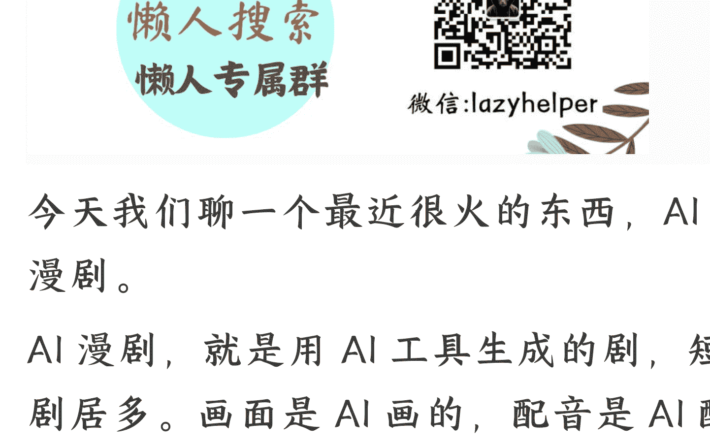

## AI+短剧，有没有搞头?

2025-12-08

整理：公众号懒人搜索，懒人专属群独享
懒人微信：lazyhelper

今天我们聊一个最近很火的东西，AI漫剧。

AI漫剧，就是用AI工具生成的剧，短剧居多。画面是AI画的，配音是AI配的，甚至剧本也可以让AI写。

这个东西现在有多火呢？说个数字你感受一下，2025年9月，全网AI漫剧的播放量，据说超过了55亿次，几乎相当于每个中国人都看了4集。

跟一般的短剧或者动画相比，AI漫剧有两个明显的特点，更快，更便宜。你看，传统的动画，一个100人左右的团队，假如能够一个月做出10集，就已经属于顶尖速度了。而AI漫剧呢，一个15人的团队，20天就能做出60集。过去一个团队几个月才能干完的工作，现在几个人几天就能搞定。

现在市面上有很多现成的AI漫剧工具，一天能产出30到40分钟的成片，一个月能做1200分钟。

你甚至可以把你的想法碎片，随时做成动画短剧。比如，你觉得某个电影桥段太蠢，就可以自己改编，然后让 AI 重新生成这个桥段。再比如，前几天，动画《一拳超人》第三季上映，很多人觉得动画制作太糙，尤其是打斗场面太少。于是，很多网友自己用 AI 生成了其中的很多片段。据说点赞数量比原片都高。

换句话说，在 AI 的加持下，短剧的创作门槛和成本，都已经来到了一个空前低的阶段。

传统动画，单集成本 5 万到 10 万元。30 集的总成本，要 150 万到 300 万元。AI 漫剧呢？单集成本 3000 到 5000 元。30 集的总成本，只要 10 万到 15 万元。据说未来还能进一步压缩。

传统动画需要编剧、分镜师、原画师、动画师、后期制作，每个环节都要专业人员。AI 漫剧呢？一个人加几个工具，就能把这些活全干了。

注意，前几年的 AI 动画，多数是网友的娱乐工具，大家只是看个热闹，偶尔玩玩。而现在的 AI 漫剧，已经是“卖钱”的内容了。据说这个行业里的头部制作方，单部作品的售价最高已经达到 80 万元，毛利率更是能达到 80% 左右。

目前，AI 漫剧的赚钱方式主要有三种：
- 平台采买：你把作品卖给平台，平台给你一次性买断费用。
- 付费解锁：用户看到后面的内容，得付费。
- 广告分成：平台根据播放量给你分成。

据说在 2025 年 8 月，抖音漫剧每天自然流付费一路高涨。同时，平台这边也在加大扶持。比如，阅文集团开放了 10 万部精品 IP，设立了亿元创作基金。抖音开放了番茄小说超 6.7 万部网文 IP 的版权池。

你看，这不是一个小众赛道的小打小闹，而是一个正在快速增长的新市场。

听到这，有人可能会说，我又不从事影视行业，这跟我有什么关系吗？还真有。因为假如切换到一个更大的视角，你会发现，AI 漫剧的成熟，或许体现了一个更普遍的趋势。

我们可以管这个趋势叫，用“自然语言”驾驭“专业工作”。也就是，你可以用普通人的语言，介入某个专业的领域。

就在前不久，柯林斯词典公布了 2025 年的年度词汇，叫“氛围编程”（Vibe Coding）。这个词是特斯拉前 AI 总监、OpenAI 创始工程师安德烈·卡帕西提出的。

什么叫“氛围编程”？简单说，就是用自然语言跟 AI 对话，让 AI 帮你写代码。

过去，你想写个程序，得先学编程语言。Python、Java、C++，每一种都有自己的语法规则。你得知道什么是变量、什么是循环、什么是函数。这些都是专业语言。现在呢？你只要跟 AI 说：“我想做一个五子棋游戏。”AI 就能帮你生成代码，自动调试，自动修 Bug。

哪怕是个小学生，都可以跟 AI 说：“我想做一个坦克大战游戏，坦克能发射炮弹，炮弹打中敌人就爆炸。”AI 都能帮他生成代码。

你看，这跟 AI 漫剧是不是很像？

过去，你想做一部动画短剧，得先学视觉语言。什么是分镜？什么是景别？什么是镜头运动？远景、全景、中景、近景、特写，每一种景别都有特定的表达功能。推、拉、摇、移、跟，每一种镜头运动都有特定的情绪暗示。

这些都是影视行业的“专业语言”。

现在，你只要跟 AI 说：“我想做一个霸道总裁爱上我的故事，女主角是个普通职员，男主角是公司老板。”AI 就能帮你生成画面，配上音乐，甚至帮你写台词。

你看，在整个创作流程里，“专业语言”这个环节，几乎消失了。这就是咱们前面说的，AI 正在让我们越过专业语言，直接用自然语言创作。这在很大程度上，降低了进入一个行业的门槛。

过去，专业语言就像一面墙。它把世界分成了两种人：懂专业语言的人和不懂专业语言的人。

懂编程语言的人，能写程序。不懂的人，只能用别人写好的程序。懂视觉语言的人，能拍电影。不懂的人，只能看别人拍的电影。懂音乐语言的人，能作曲。不懂的人，只能听别人的音乐。

换句话说，专业语言，就像一套翻译系统。它把你脑子里的想法，翻译成机器能理解的指令，或者翻译成剧组能理解的脚本。

但这套翻译系统，需要花很长时间学习。学编程，学分镜，至少都要几个月。

但是现在，AI正在接管这套翻译系统。就像黄仁勋说的：AI编程是我们缩小技术鸿沟的最大机会，100%的人都可以参与其中。

但是，说到这，就引出一个问题。既然创作的门槛消失了，那么，这个行业里的人怎么办呢？就比如AI漫剧，今天AI只是做短篇漫剧，没准未来，它还能做长剧，甚至做电影。从业者应该怎么面对这个新变量的冲击呢？

也许我们现在还没办法给出这个问题的终极答案，但是至少，有一个我个人很认同的观点，或许可以供你参考。

杨振宁先生经常提到一个词，叫 taste，直译过来是“品位”。但据说，杨振宁先生本人觉得“品位”这个翻译还不够贴切。你大概可以理解成，一个人的偏好、趣味、审美、判断力、鉴赏力，以及个人愿望的总和。你见到一个东西会莫名被触动，看到一个问题就莫名有探索的冲动，这些就是 taste 驱动的结果。

据说当年，有个 15 岁的天才少年，想进杨振宁的研究院。杨振宁面试他，问了几个量子力学的问题，少年都能回答。但杨振宁接着问了一个问题：“这些量子力学问题，哪一个你觉得是妙的？”

少年答不出来。

杨振宁后来说：“尽管他吸收了很多东西，可是他没有发展成一个 taste。假如一个人在学了量子力学以后，他不觉得其中有的东西是重要的，有的东西是美妙的，有的东西是值得跟人辩论得面红耳赤而不放手的，那我觉得他对这个东西并没有真正学进去。”据说最后，杨振宁没有接受这个学生。

你看，这个 15 岁少年很聪明，知识也不少，但他也许少了一点东西，就是杨振宁先生说的 taste。

这跟今天的 AI 时代，是不是很像？

AI 可以给你生成 100 张角色的脸，但是，哪张脸看起来有故事感？哪张脸能让观众一眼记住？这得你来判断。

AI 可以生成一段打斗场景。但是，这段打斗的节奏该快还是慢？该在什么时候切换镜头？这些都得你来判断。

AI 能画，但它不知道该画什么。它能写，但它不知道该写什么。它会解题，但不知道哪个题目是妙的。

杨振宁先生说，taste 加上能力、脾气和机遇，决定了一个人的风格，而风格决定了贡献。

换句话说，你有什么样的判断力，就会做出什么样的作品。

那么，taste 从哪来呢？杨振宁说，它跟个人的能力、家庭环境、早期教育、性格，还有运气都有关系。说白了，我们可以理解成，taste 是长期积累出来的。你看过的作品，做过的项目，踩过的坑，慢慢就形成了你的 taste。

比如，一个做了 10 年动画的人，他一眼就能看出来，这个镜头的节奏不对。一个做了 10 年设计的人，他一眼就能看出来，这个颜色搭配不舒服。

再比如，在编程领域，现在有了“氛围编程”，人人都能让 AI 写代码。但是，什么样的程序是好程序？什么样的架构是合理的？什么样的代码是高效的？这些判断，也许需要厉害的程序员 的 taste。

再比如，设计领域，AI 能生成无数种海报。但是，哪个海报能打动用户？哪个海报符合品牌调性？哪个海报能达成商业目标？这些判断，得靠设计师的 taste。

换句话说，AI 到底是来抢饭碗，还是来放大优势，这个答案的分水岭，也许就在于一个人是否有足够的 taste。

> 导演塔西姆·辛曾经说过一段话，很适合作为今天的结尾，他说：“你花钱买到的不只是我做导演的这段时间，还有我喝过的每一口酒，品过的每一杯咖啡，吃过的每一餐美食，读过的每一本书，坐过的每一把椅子，谈过的每一次恋爱，去过的每一个地方。你买的是我全部生命的精华转化成的 30 秒，怎么会不贵。”

最后，安利小懒的付费群：

懒人专属群（介绍）

📖 懒人专属群持续更新中，已持续运营 6 年，整理超 3000 份各类精选付费文章 & 年费社群干货，全部开放下载。

本资料为付费群内部分享，仅供真实有需要的朋友查阅 🙏

懒人专属群更新记录：

https://hk57gvlx7u.feishu.cn/docx/H0kRdZbSboIBROxkaXtcuVE0nJg

懒人专属群更新记录（需梯子，备用）：

https://lazybook.fun/blog/record2