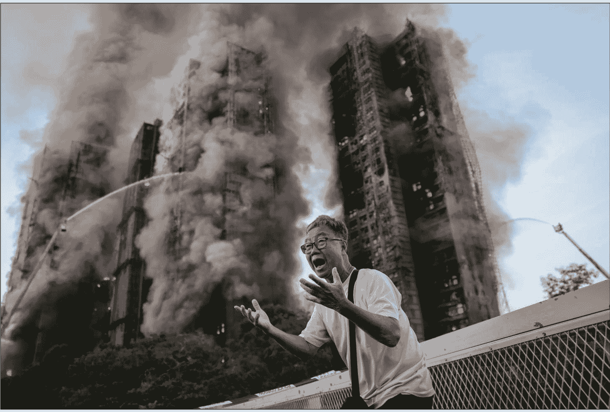
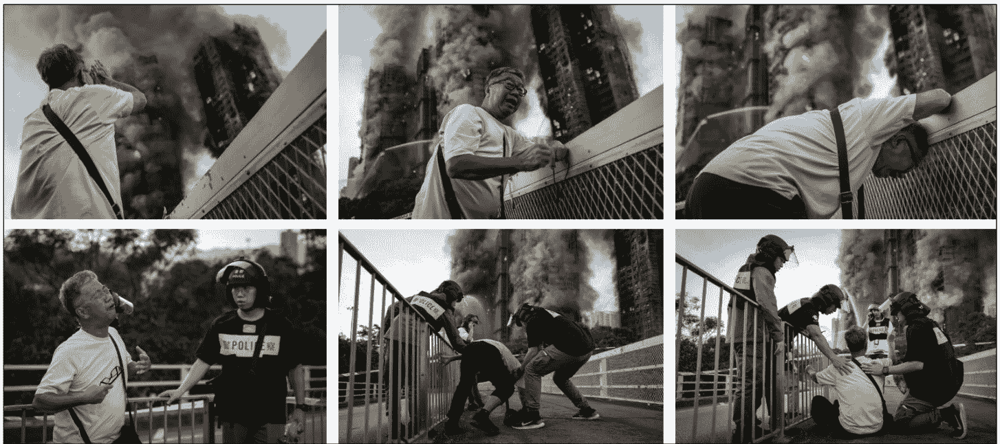

# 香港大火最著名照片的背后

251208 新闻实验室

整理：公众号懒人搜索，[懒人专属群](lazyhelper)独享

懒人微信：lazyhelper

它并不是对悲情的消费，而是一次必要的视觉证词。

在香港大埔宏福苑造成至少 159 人死亡的大火中，有一张照片令全世界留下了深刻印象。照片里，一名男子情绪崩溃大喊，摊开双手，背后是残酷吞噬了几栋高楼的熊熊烈火。

说这张照片成了香港这场大火的标志性影像，并不为过。

很多人觉得这张照片震撼人心、对“决定性的瞬间”的捕捉几乎完美，值得赢取普利策奖或世界新闻摄影奖。但也有不少人对这张照片感到反感，他们觉得这是在消费个体的苦难，是摄影记者冷漠和嗜血的表现。

甚至有人怀疑，这张照片是不是 AI 生成的。

本期新闻实验室会员通讯，我们来详细了解这张照片出炉的过程，了解照片中男子的经历，然后回头看看它引发的新闻伦理争议。

## 照片背后的绝望

照片的主角姓黄，今年 71 岁，被本地传媒称为“黄伯”。

黄伯和妻子每天轮流接孙女放学。火灾发生的那天，轮到黄伯去接。出门之后不久，大火燃起并迅速蔓延。黄伯顾不上孙女，赶紧跑向家的方向。在楼下，他绝望地大喊：我老婆还在里面。

从下面这一组照片中，我们可以看到那个撕心裂肺的场景。当时，起火的楼已经被封锁，几名警察在试图安慰黄伯。

路透社摄影师萧文超（Tyrone Siu）在宏福苑大火发生约 1 个小时后抵达现场，当时正好看到黄伯站在路边激动地挥舞双手，神情极度哀伤。

萧文超说：“这个画面能让你瞬间明白一切。无论你来自世界哪个角落，都能感受到黄先生的感受——那种无助与痛苦。”

路透社 12 月 2 日发布的文章说，大火一周后，黄伯的妻子依然被列为失踪——显然是凶多吉少，但还没有被列入官方死者名单。

黄伯的儿子丁透露，当天下午 3 点 30 分左右，母亲曾给黄伯打过最后一通电话，通话仅维持了一分钟。儿子回忆道，母亲在电话后不久便失去了音讯。

当天夜幕降临后，黄伯仍站在火场外，抬头望着被烧黑的楼层，喃喃自语：我会找到你。这句承诺，令人心碎。

火灾发生后的日子里，黄伯一家正在艰难地重建生活。儿子透露，父亲每次谈起母亲都会痛哭，但他正在努力适应新的日常。对于儿子来说，这也是一个重新学习如何与父亲相处的过程。过去，他们一家三口的对话往往由母亲主导，如今失去了母亲这个纽带，儿子坦言：“我需要重新开始（学习）如何与父亲对话。”

## 不是羞辱，而是控诉

回到香港火灾的现场，黄伯那张“撕心裂肺”的照片背后，隐藏着比丧亲之痛更深层的绝望。

据路透社报道，黄伯并非普通的居民，他曾是一名建筑维修“判头”（包工头），拥有电工和水管工执照。早在火灾发生前，他就凭借专业知识敏锐地察觉到大楼外墙翻新工程存在严重的安全隐患。他注意到，施工方使用了易燃的塑料网和发泡胶板，这让他深感不安。

为了保护家人，黄伯还曾采取了一系列自救措施。他撕掉了自家窗户上的发泡胶板，换上了阻燃塑料膜，并定期向窗外的绿网喷水保湿。

然而，面对整栋大楼修缮过程中的结构性问题，个人的力量显得微不足道。黄伯的儿子在接受采访时悲痛地指出，父亲在照片中流露出的情绪，不仅仅是针对当天的悲剧，更是长时间以来对大楼修缮争论和安全隐患抗争无果的情绪累积。

这种绝望，是眼睁睁看着自己预见的灾难发生却无力改变结局的悲剧。

就在不少网民指责媒体“吃人血馒头”时，事件的当事方却给出了截然不同的回应。黄伯的儿子不仅没有责怪拍摄照片的记者，反而一直在主动寻找这位拍下父亲痛哭瞬间的摄影师。

对于家属而言，这张照片的传播并非一种羞辱，而是一种有力的控诉。通过媒体的报道，他们得以将灾难背后的人祸、监管不力以及居民长期的担忧公诸于世。说出真相、让世界看见他们的痛苦，也是失去挚爱的人自我疗伤、寻找出路的方法之一。

# 不能抛开事实谈伦理

这张照片引发的伦理争议，其实并不新鲜，因为它的核心还是“报道灾难的记者是在吃人血馒头、受害者家属不应该被打扰、个人的悲痛不应该被公开”那套论述。近4年前，新闻实验室播客就曾在东航空难之后的报道伦理争议中，探讨过“灾难报道是‘吃人血馒头’吗？”

我想重申关于新闻伦理的两点看法：

- 第一，新闻伦理不能被滥用为新闻审查的理由和工具。
- 第二，不能抛开事实而根据脑中的想象去谈新闻伦理。

基于上述第二点，如果有人认为受害者家属不应被打扰，那么他实际上应该给出足够的证据，说明他们真的不希望被采访、真的不希望自己家人的故事被公开呈现。

但采访过灾难的前线记者基本都会发现，大部分时候，家属不仅愿意被采访，甚至希望自己被采访。许多家属实际上渴望有人倾听，甚至主动拿出相册，担心亲人的故事被遗忘。

这次火灾照片中黄伯和儿子的反应，又是一个重要的案例——他们希望自己的声音被听见，希望情绪得以表达和传播。

很多时候，对新闻伦理的评论是基于人们的朴素情感。大家觉得自己看了不舒服，便觉得他人看了也不舒服，家属尤其会不舒服。但是，让人不舒服是很多新闻，尤其是灾难报道本身就会带来的效果，甚至就是这类新闻的目的。

2010 年海地大地震后，NPR 曾经探讨：媒体是否应该展示尸体横陈的画面？《华盛顿邮报》曾因在头版刊登一张救援人员爬过一名被压碎女孩遗体的照片而收到愤怒的读者来信。该报监察专员 Andrew Alexander 指出，编辑们始终在“尊重读者感受”与“不粉饰丑陋现实”之间挣扎。如果不展示这些画面，是否意味着媒体在“净化”（sanitizing）一场人们有权知晓的灾难？

NPR 摄影师 David Gilkey 在海地目睹了数千具尸体堆积在停尸房外的惨状，他直言：“我们需要被这些画面打扰/感到不安（We need to be disturbed）。”他认为，文字有时无法传达灾难的规模，唯有影像能让人瞬间理解“数千人死亡”的真正含义。这并不是为了追求所谓的“灾难色情片”（disaster porn），而是摄影师试图将混乱的现场“简化”，以便让公众迅速理解事态的严重性。

在 NPR 的那期节目中，一位听众描述了一张让她无法释怀的照片：在海地的尸体堆中，有一个女孩像被丢弃的玩偶一样，穿着蕾丝内裤和短裙，阳光照在她年轻的腿上。这种“像玩具一样被扔掉”的画面，残酷地展示了自然的任性与生命的脆弱。

从一定程度上来说，正是这些令人不适的画面，推动了历史的进程。另一名听众回忆，二战时集中营解放后的新闻短片展示了“像木柴一样堆叠的尸体”，正是这些令人震惊的影像让世界确信大屠杀真实发生过，并在此后几十年里警醒世人。同样，越战中著名的“西贡处决”照片和肯特州立大学枪击案的照片，都直接改变了公众舆论和历史走向。

如果有家长担心孩子看到过于残酷的画面，《华盛顿邮报》监察专员 Andrew Alexander 提供了一个不同的视角：许多读者感谢报纸刊登这些照片，将其作为对孩子的“教育时刻”（teaching moment）。正如一位听众回忆，她儿时坐在父亲腿上观看黎巴嫩战争的新闻，父母并没有挡住她的眼睛，这让她在成年后能更好地理解世界，并与来自那个地区的人建立深刻的联系。

黄伯那张撕心裂肺的照片，虽然残酷，但它迫使我们直视监管的失职和生命的脆弱。它并不是对悲情的消费，而是一次必要的视觉证词。摄影具有一种“传输”的特质，它让不在现场的人，也能够感受到那份切肤之痛，并可能因此推动改变。从这个意义上讲，当然，要真的推动改变，还需要被照片打动的人后续行动。正如《南华早报》旗下《Young Post》主编 Emily Tsang 所评论的：“如果是感叹一声‘好惨’然后滑过去，这就叫消费，忽略了灾难背后更严重的结构性不公，亦没有反思‘观看者的责任’。”

# 最后，安利小懒的付费群：

# 懒人专属群（介绍）

- 懒人专属群持续更新中，已持续运营 6 年，整理超 3000 份各类精选付费文章 & 年费社群干货，全部开放下载。

本资料为付费群内部分享，仅供真实有需要的朋友查阅 🙏

# 懒人专属群更新记录：

https://hk57gvIx7u.feishu.cn/docx/HOKRdZbSbolBROxkaXtcuVEOnJg

懒人专属群更新记录（需梯子，备用）：

https://lazybook.fun/blog/record2