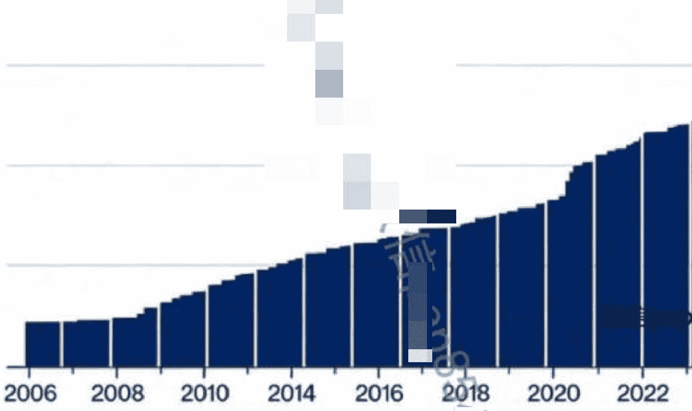

# 全球市场最大悬案：AI泡沫，真的即将破裂？

251209 A视野

整理：公众号懒人搜索，懒人专属群独享

懒人微信：lazyhelper


全球金融市场当前最大的悬案：

AI泡沫，会不会像2000年3月互联网泡沫那样，瞬间崩塌？如果是，那预计什么时候？会有什么样的影响？如果不是，那凭什么这么说？按照美国人的统计测算，2025年，AI投资所产生的经济增长占美国GDP增长存量的3/4。也就是说，如果没有AI投资狂潮，美国经济恐怕不久就面临严重的衰退风险。对应的，美股的增长全部是炒作AI，否则，也是一言难尽。

要知道，2000年3月互联网泡沫破裂，导致大量资金从美国本土出逃，一度重创美国经济，逼着美国政府只能鼓励全民炒房来维稳经济，而这又为后面次贷危机爆发埋下伏笔。

而今，AI泡沫承接的是已经10多年都没有发生过重大金融危机的美股。

一旦AI泡沫真的破裂，从2009年开始积累的全美庞大债务就会爆裂，接踵而至的，或将是史诗级的灾难。

也因此，全球市场在近期不断的发出“AI泡沫可能破裂”的警报，将影响我们所有人。

那么，AI泡沫，真的即将要破裂了？

下面开始今天的正文，各位多多支持！

放眼过去10年全球科技发展，AI，确实是第一次让人们意识到，这是一个具有超级潜力的前沿产业。

从AR/VR到区块链，从3D打印到元宇宙，此前其它的科技产业尝试，都不成功。

然而，AI所展现的科技前景，确实是划时代的。

这就跟90年代的互联网革命一样，大家都看到了巨大的潜力，然而，实际技术和相关产业的发展，仍需更多时间去验证。

一般而言，历史上，几乎所有重大技术变革，初期都有一个特殊的过程：

腾飞初期萧条。简单说，当大家都看得到技术前景的时候，就会扎堆冲进去，可是，实际上下游产业的衔接和技术迭代仍属“初期发展阶段”。

于是，市场的投资狂潮会先行，甚至远超当前该产业实际的发展进度，渐渐的，市场就会利用充裕的资金流动性，完全按照想象力空间去炒作，不再关注实际基本面。

当炒作实在严重脱离基本面，市场的流动性扩张完全也撑不住了，最终就会有新兴产业腾飞初期的“暂时回调”，这就是“腾飞初期萧条”，相当于重新平衡市场情绪与产业基本面之间的估值关系。

就像 90 年代狂炒互联网革命，等 2000 年泡沫破裂后，很多互联网优质企业股价暴跌，亚马逊更是一度暴跌 9 成的股价。

然而，若干年后，当技术起来了、产业发展更加成熟了，后续互联网革命确实给全人类带来巨大的增长。

同样，此前股价跌去 9 成的亚马逊，现在就是该领域神一样的存在。

这就是经典的“腾飞初期萧条”后的实际情况！

请注意，这个知识点，至关重要，因为，我们可以了解到 AI 泡沫后续的演进路径。

既然说的是金融市场，那么，金融市场的规律也就开始在这里起作用了。

- 第一阶段：大型科技公司开始疯狂砸钱。
- 第二阶段：投入与实际收入越来越背离，造成自由现金流出现愈来愈大的负增长。
- 第三阶段：美股炒作股价玩股票回购和分红的游戏，逐步被自由现金流负增长打破可持续性。
- 第四阶段：企业疯狂举债，甚至要求政府干预，确保这种投资狂潮不能停，也能继续炒作股价。
- 第五阶段：市场的流动性不再支持这么玩，AI企业和市场都开始关注投资与实际经营收入之间的背离问题，开始缩减AI投资。
- 第六阶段：如果找不到新的流动性支撑，或者有办法大幅提升经营收入，那么，杀估值就启动，进而更加恶化经营性收入。
- 第七阶段：杀叙事，市场完全不相信什么不久将来就可以用新技术带动增长，游戏结束。

以上演进路径至关重要，请大家务必熟悉!

接下去，我们就可以马上看出，这轮AI泡沫到底走到哪个阶段了?

很明显，远没有到第五阶段!

这也意味着，现在就直接对赌美国AI泡沫马上就破裂，为时尚早。

最近，美国AI产业，出现了一些新的情况。

“谷歌链”开始崛起，对于原来一家独大的OpenAI，造成了极大的挑战。

所以，近期，OpenAI开始迂回呼吁，希望美国政府帮忙。

然而，对于川普而言，反正都是美国的牛逼AI企业，谁是最后的赢家，重要吗?

只要是美国的 AI 产业牛逼即可，其他，他根本没有兴趣了解和关心。

对于川普这种做大生意的人而言，他只以实力与地位为出发点。

当年，美国用了几十年，做到了“去日本化”。

一个策略是，把东南亚、韩国、中国分散一部分日本的产能；让中国加入 WTO，何尝不是对日本的一种对冲。

此外，日本泡沫破裂，也是美国不再那么强烈需要日本，当时苏联崩了，这个时候日本也就需要崩了。

本质上，就是美国用这个办法，再次确保美国对全球分工、定价、调配的绝对主导权。

而今，美国政府当然清楚，AI 是泡沫，美联储也知道，华尔街都知道。

可是，停不下来啊~因为，中国拼命的追赶，美国又做不到“去中国化”。

这已经严重影响美国对全球资源分配、分工、定价、调度的核心能力。

所以，就算明知是 AI 泡沫，甚至明知这个泡沫破裂的那一天会很惨，现在也只能不断的加码美国 AI 整个行业疯狂投资。

况且，有 2000 年 3 月互联网泡沫破裂的前车之鉴，美国的精英们自然是小心谨慎。

不过，这也提示我们：

美国政府后续会伙同美联储，不断的释放更多的流动性，努力将本轮 AI 泡沫停留在第三阶段和第四阶段，绝对不允许往第五阶段快速演进。

如果说美债的扩容导致美联储要放水救市，那么，今天 AI 泡沫必须延续下去，更加深度绑定了美联储的放水路径。

没得选，这就是大而不能倒!

其实，美联储之前公开承认，如今的美国经济已经是 K 型结构。

有钱人利用大而不能倒的逻辑，拼命从 AI 投资狂潮中发大财。

瘪三们则只能靠国债融资得来的福利，勉强糊口。

所以现在如果看 AI 领域，美国经济强的可怕，犹如老树开新花，又一春。

如果看其它的传统产业和普通人的生计，那就真的是一言难尽了。

很有意思的是，这个现象貌似已经成为全球主要经济体的 “标配” 。

美债是全面内部维稳，美国 AI 企业债是往死里卷，美股市场是冰火两重天，三者相互嵌套，已经成为闭环。只要有一个出现问题，那另外两个就会一起倒大霉。

所以，别看美联储现在说些什么，都不重要。

大规模放水，降息、QE 等一系列微操逐步上桌，是它的历史宿命。

## 截至11月美国未偿主权债务



但是，可怕就可怕在这里，光美债已经玩到 38 万亿美元，还药不能停，连利息都要依赖新的美债融资。

此外，美国 AI 企业债现在都是对比美国国债的收益率去融资，这个风险也是巨大。

2025年9月以来，Meta发行300亿美元，Alphabet 250亿美元，Oracle 180亿美元，Amazon 150亿美元。这些交易创下企业债发行纪录，Meta的订单簿达1250亿美元，位列历史第五大债券发行。

更麻烦的是，现在美国军工复合体，也要参与 AI 产业的发展。

作为川普 2.0 时代的顶级智囊，史蒂芬米兰，此前出了一个牛逼到爆的报告，里面有一句关键性的结论：

“加大投资国防会迅速提高科技能力，用国防基金推进科技发展更加稳定，如果单纯依赖市场，技术变革就充满不确定性。”

聪明的老铁已经意识到，日本的极右翼就是利用这个理论，开始挑衅中国。

而且，日本还认定，米兰的这个理论在美国内部是很难马上实现的。

毕竟，川普的权威度不足，美联储不听话，美国一直没有很高效的举国体制。

日本就是想要利用这个理论，加速回归 1941 年战时体制，去发展自己的经济和国防。

其实，川普如今对于美国国运未来的制度安排，也是一样的思路，这自然是利好军工复合体的。

军工复合体就可以携手 AI，一起融资，一起问国会要钱，一起叙事中国如何如何威胁到它们了，最终，掏空美国的财政和美联储的印钞机产能。

基于此，眼下说 AI 泡沫马上就要崩盘，确实是太过遥远的事情了。

通过上面的系统性分析，大家也已经看得出，AI 泡沫上面躺着多少既得利益者庞大的利益。

从地缘到科技，从国运到军工，无数吸血鬼都在上面。

哪怕未来真的要爆，那也必须是“未来”再说。

这个局，玩到现在，其实，就开始微妙了。

明知是泡沫，而且是越来越脱离基本面的泡沫，可是，又不得不吹。

一旦美联储后续大规模的放水，泡沫更大，市场大多数参与者只能非理性跟从。

毕竟，谁不跟，谁就是傻子，这个游戏大家没得选。

于是，未来AI泡沫甚至出现下一轮超级行情拉升。

尤其是当眼下有疑虑的人，突然看到这玩意儿又 high 起来了，绝对大腿拍断。

这也提示我们，即便明知是泡沫，但是，炒作是有自己的规律和轨迹，并不以人的理性为依据的。

特别是有如此庞大的利益群体参与的前提下，更是如此。当然，这也会进一步刺激 AI 产业的上下游，将它们再次带起来。

就像有色等，可以说，近乎是万千宠爱于一身。

大国博弈+央行超级放水+AI 军备竞赛+自身供给缺乏弹性。现如今，我们必须正视，这确实是美国人赌上国运了。

对于自由市场经济体而言，必须追求垄断租金，连所谓的创新也是希望在一个全新的赛道实现垄断租金。

但是，一旦打破它创新的节奏、速率和力度，它就更加偏向垄断，而不是创新。

这个时候，中国的崛起，俄罗斯的反抗，印度妖娆的身段，全球其它国家的阳奉阴违，就会让美国很难实现垄断闭环。

因此，围绕 AI 泡沫进行的大国博弈，将会是接下去最核心的主线。

对于美国而言，打击中国的产业升级的核心策略，无非是：

卡技术、卡市场、卡标准、行政干预。

可是，对于中国而言，我们是在“建系统”，而不是单纯的赚钱、做生意、做项目。

而这里面最大的风险点在于，在 AI 时代进行军事干架，中国是新兵蛋子，美国何尝不是？！

美国看似不断利用地缘搅动风云，但是，真的是有可能出现操弄失误。

即，从灰色游走，真的变成直接干起来了。

那么，如果真的这幕出现，那将是 AI 泡沫最大的“异数”。

因为，谁家可以展现 AI+军工的碾压实力，则国际资本、地缘生态、全球资源定价权就是谁说了算。

对比美国人拼命叠算力的 AI 发展路径，中国的玩法，很有自己的特点和系统性。

具体而言中国模式是：

新能源革命+AI革命+全品类制造业体系+一带一路计划=中国技术变革

也就是说，中国的AI是建立在已有的全球化框架下，而不是另谋一套系统。

其实，这会让中国AI发展的试错成本更低，相对风险更小。

事实上，这何尝不是中国紧紧咬住美国AI同行的关键竞争力呢？！

此外，对于AI，中国的理解和美国的理解完全不同。

我们是要利用AI带起来我们整个全品类制造业体系，给所有各种实体带来订单，而不是要什么垄断租金。

现如今，中国的大量实业都是处于落后产能过多，如果没有技术迭代，后面就要吐血了。

光AI数据中心的全球建设浪潮，强力拉动了对先进半导体、高效能电力设备、绿色能源解决方案和尖端冷却技术等一系列上下游产业的巨大需求。这本身就在催生一轮新的、广泛的基础设施投资周期。

还有，AI的渗透和普及速度远超历史上的电力、个人电脑和互联网，它正在像电力一样，迅速成为所有行业不可或缺的“底层操作系统”和“生产力要素”。

这也提示我们，同样是玩 AI，美国充满了金融泡沫的炒作，而我们是真的踏踏实实在玩实业。

当 OpenAI 为了解决营收问题开始引入“有颜色”的产业的时候，我们却将 AI 跟医疗、军工、智慧城市、挖矿等各种产业结合。

那么，中美 AI 长期军备竞赛的结果，实则已经注定了！

好了，关键点来了！

未来，如果 AI 泡沫真的破裂，第一波冲击，恐怕会是相当疯狂的，对于中国经济也是超级大挑战。

因此，村里现在选择让大 A 先行，楼市寻求止跌企稳，也就是防着这一手。

接下去，最大的历史拐点在于：

AI 泡沫一旦破裂，将联动人民币国际化、地缘各种干架、大宗商品价格疯涨，直至二战后的世界秩序彻底崩塌后被重塑。

毕竟，这东西破了，还有美元霸权什么事情呢？！

所以，村里势必要薅尽美国 AI 泡沫产生的最后的红利，并提前做好“备荒、备战、备灾”。

理解了这点，那么，后续村里的宏观政策的“背景颜色”也就一目了然了。

# 最后，安利小懒的付费群：

懒人专属群（介绍）


这里是你对抗信息过载的护城河。已稳定运行6年，累计拆解、研读3000+个互联网商业实战案例与行业前沿内参和时政/宏观文章。

我们不搬运垃圾，只做高价值信息的筛选器与放大镜。

## 懒人专属群更新记录：

```
https://hk57gvIx7u.feishu.cn/docx/H0kRdZbSbolBR0xkaXtcuVE0nJg
```

## 懒人专属群更新记录（需梯子，备用）：

```
https://lazybook.fun/blog/record2
```

【免责声明】本资料归档于社群内部知识库，仅供成员课题研究与学术交流，请在查阅后24小时内删除。