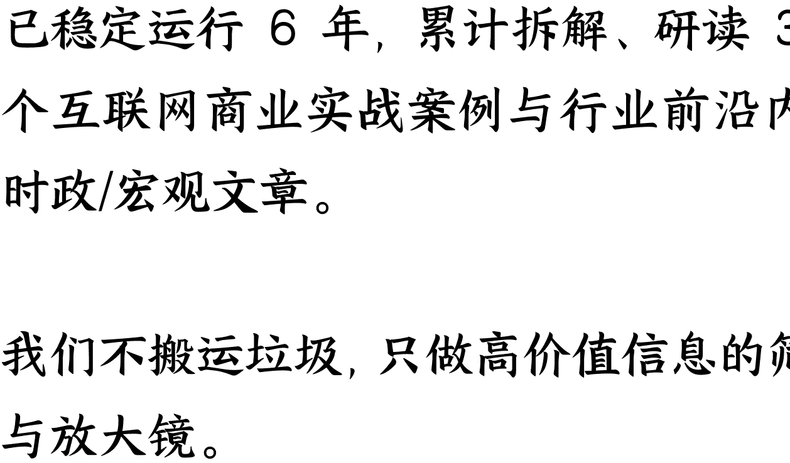

# 243 | 国家发改委新警示，看懂产业选择的收益和风险

251209

整理：公众号懒人搜索，懒人专属群独享懒人微信：lazyhelper


欢迎来到《政经参考》，我是马江博。

我们今天来谈最近一个很有意思的风向，它来自被称为“小国务院”的国家发改委。简单说，就是国家发改委这个权威部门，首次回应了人形机器人行业的“泡沫”问题，这也是政策部门首次对人形机器人这个大热门行业提示“风险”，这背后信号很有意思。

借着这个话题，我想谈一谈，面对未来产业、战略性新兴产业等，这些有前景、也有风险的产业，如何进行抉择？我会给你一个相关的决策模型，供你参考。

## 发改委回应人形机器人“泡沫”

我们先把这件事具体说一下。

在 11 月 27 日的新闻发布会上，国家发改委新闻发言人李超，对人形机器人产业发出了明确的“风险提示”。

李超是在回答权威媒体“中新社”的提问时做出的表态，当时中新社记者问，“不少企业和媒体都表示明年是人形机器人落地的关键一年，但也有声音认为目前人形机器人在技术成熟度、应用场景、安全性等方面仍有不少缺陷，担心这只是一个新的泡沫。请问发改委对这两种声音有何评论？将如何推动具身智能产业健康有序发展？ ”

发改委的回答不长，但信息量很大，李超说，“‘速度’与‘泡沫’一直是前沿产业发展过程中需要把握和平衡的问题，这对于具身智能产业来讲，也是一样的”。我理解言外之意是，发改委已经注意到人形机器人当下的“泡沫”风险。

有同学可能会问，人形机器人背后的具身智能，不是“十五五”规划建议稿中，国家明确要发展的六大未来产业之一吗？为什么现在发改委提到“泡沫”呢？这是要刹车吗？

更具体的问题是，就在 11 月，教育部刚刚公示了北京航空航天大学、上海交通大学、浙江大学等 7 所国内顶尖高校，正式申请增设“具身智能”新专业，那孩子报考这类专业还有前景吗？

你别着急，先听我分析完，我等会儿会回答这些问题。

国家发改委新闻发言人李超说，“以人形机器人为代表的具身智能产业规模，正在以超50%的增速跨越式发展”，这是对发展趋势的正面评价。然后她说，“当前人形机器人在技术路线、商业化模式、应用场景等方面尚未完全成熟”。换句话说，产业趋势没问题，但技术不明朗、商业化不清晰、应用不成熟，总之根据我的理解，现在只是发展初期，还没有到大规模落地的阶段，这是国家发改委对人形机器人这一行业的关键判断。

在这个判断下，国家发改委的态度就很明确了。李超说，“随着新兴资本加速入场，我国目前已有超过150家人形机器人企业……其中半数以上为初创或‘跨行’入局，这对鼓励创新来讲是一件好事；但也要着力防范重复度高的产品‘扎堆’上市、研发空间被压缩等风险。”

我理解这背后是两层意思：一方面，很多钱加速投进来了，导致一下子有了很多人形机器人公司，但是一半是初创的小公司或者看到热点跨行凑过来的公司，反正鼓励创新嘛，也算是好事；但另一方面的问题是，行业本身关键问题还都没突破呢，结果一群企业挤进来，很容易低水平重复与“内卷式”竞争。

我的看法是，政策部门的担忧，在于人形机器人行业现在看起来繁荣，但大多数产品还处于实际上的同质化“表演”阶段，甚至有的被人认为是“高级电子手办”，或者智能玩具。而目前主要客户是高校、科研机构和展会主办方，距离真正的工业场景和规模化应用还有很长的路要走。

根据我的进一步研究，资本的狂热涌入催生了大量企业，但融资却高度分散。经济观察网的文章就提到，2025年以来国内人形机器人行业融资总额不足200亿元，150家企业平均融资只有1亿多，如果剔除头部企业，大多数中小企业融资能力薄弱。说白了，根本不够干啥。

而有限的资金如果被大量消耗在制造功能雷同的“展示品”上，必然会挤压真正用于底层技术攻关和核心场景探索的研发资源。

## 面对可能的“泡沫”到底怎么办？

对此，国家发改委提出了三个关键的措施，你听一听：

- 第一是，“加速构建行业标准与评价体系，建立健全具身智能行业准入和退出机制，营造公平竞争的市场环境，保障产业有序发展”。简单说，就是要给人形机器人这些相关产业立标准，不能是随便一个会“表演”的铁疙瘩，就是合格的人形机器人。同时，还要让不合格的产品和企业能有退出机制，给真正有潜力的企业腾地方。我认为这就是要结束目前人形机器人领域“小而散”的现状，通过立标准，把那些凑热闹、没有核心竞争力的企业筛出去，让有研发能力的企业脱颖而出。
- 第二是，“加快关键核心技术攻关，支持企业、高校、科研院所等围绕‘大小脑’模型协同、云侧与端侧算力适配、仿真与真机数据融合等技术进行攻关，解决产业卡点堵点问题”。简单说，既然技术还不过关，发改委给列了几个攻关方向，那就拉上高校和科研院所，全行业一起闷头搞吧，这个坎必须过，别耍花架子了。
- 第三是，“推动训练与中试平台等基础设施建设，促进全国范围内具身智能技术、产业资源整合和开放共享，加速具身智能体在真实场景中落地应用”。我刚才说了，政策部门对很多人形机器人只能“演”不能“用”的现状是不太满意的。而根据“十五五”规划建议稿，未来五年产业应用是关键，所以发改委说那我就推动训练与中试平台等基础设施建设，同时在全国范围内技术和产业资源多共享多合作，集中资源一起努力，最终实现“真实场景中落地应用”。

好，发改委提出的举措说明白了，这意味着什么？

我认为国家发改委对人形机器人行业如此迅速的反应，在突出一个新转变，就是政策部门对科技产业的发展态度和政策把控，正在越来越务实和娴熟，就是科技行业、科技公司，必须“去伪存真”，要真正有用、能用，未来所有的科技产业和科技公司都要经过这个检验，而且速度会加快，能行的，大力给资源，不行的，淘汰不含糊。

总之我判断，未来科技领域和科技公司，不能“混”了。现在股市的政策风向也是如此，面对监管，过去几年的一些伪科技公司，会越来越混不下去。

面对不同产业的风险比，到底如何决策？好，我现在回答刚才提到的关于具身智能产业和专业有没有前景的问题。你首先需要理解几个问题：

- 第一，“十五五”规划建议稿是大文件，里面提到的具身智能的未来发展是既定的国家战略，国家发改委的这个表态，完全不会也不可能覆盖掉“十五五”规划建议稿的看法，发改委也根本不会有这个意思，这一点不用多担心。
- 第二，具身智能是一个很大的领域，而人形机器人只是其中一个分支。你可以这么理解，先是大概念的人工智能，然后下面是细分的具身智能，具身智能下是智能机器人，然后才是智能机器人下面的人形机器人。
- 第三，国家发改委的表态，主要是针对人形机器人这个细分领域，而且更具体的说，针对的是初期阶段的企业同质化竞争这个问题。而国家发改委提示这个问题，目的是让这个行业更健康。

我这么说你就明白了，具身智能的产业发展和具身智能这个专业本身的前景，不会被人形机器人企业低水平竞争这个问题所影响。

另外，我知道有家长担心，现在报一些热门的新兴工科专业，几年后会不会学生越来越多也一样卷？

首先，类似土木工程这样的卷，背后是大产业已经开始走下坡路，而新兴产业本身还不到这个阶段，产业发展速度还是比较可能消化人才供给速度。

其次，更现实的逻辑是，你担心现在报的专业未来可能卷，但很多传统专业，现在就已经卷了，两者衡量，新兴专业至少还有一个产业上升期的窗口，相对来说机会更多。

这里我给到一个简单的决策模型，可以帮你判断产业的风险和收益。不管是给孩子选专业，还是自己要投身未来产业、战略性新兴产业，都可以用这个框架来参考。

- 第一，面对属于量子科技、生物制造、氢能和核聚变能、脑机接口、具身智能、第六代移动通信这些未来产业的相关的，国家超常布局的新专业，确实还处于产业探索期，这就意味着这些行业和专业是高风险、高收益，适合愿意和有能力承担风险、且本身对科研探索更有兴趣的学生和家庭，这是从0到1的创造性红利。
- 第二，如果想稳妥点，可以退一步，选择“十五五”规划建议稿提到的新能源、新材料、航空航天、低空经济等战略性新兴产业对应的专业，这些产业不是探索了，而是已经被证明了落地的可能性，属于从1到10的规模化产业性红利阶段，相对来说会更稳妥，家庭投入风险也会相对较低。
- 第三，如果家里孩子够不上战略性新兴产业的专业分数，或者本身考的是职业院校，想投身到科技产业领域去，那可以考虑选择长三角或者大湾区这样优势的地区高速发展的本地关键产业集群对应的专业，这是从10到100的单纯的工作性红利阶段，竞争度比较高，但同时也非常成熟，大概率不会踏空，不过竞争会比较激烈一些，这点要有心理准备。

当然我知道肯定会有同学问，那文科生怎么办？

我们要承认，“十五五”规划中科技+先进制造业的复合体确实是最核心的重点，这个趋势下，新理工科的红利会更主要、也更明显，这个趋势我们不用讳言。

文科理科本身是有时代周期的，我们要尊重这个周期。

我个人的建议是，第一，现在读文科要充分考虑就业先导，哪怕目的是读来用来更好考公呢，总之要有个清晰的决策逻辑，而不是先考上再说；第二，多想下复合型专业和技能，更好用技术赋能自己，比如用人工智能加持艺术创作，用大数据赋能营销和广告，不过这部分有阶段性，进化要求很快，要持续学习；第三，文科生一定要把自己最核心的差异化优势发挥到极致，比如更好的理解能力，复杂的沟通统筹能力，说白了，沟通和理解他人的能力，我认为反而是最可依靠的。

这就是我诚恳的建议。

好，今天的内容就到这里。欢迎你把这个文档转发推荐给更多人，让我们一起聚焦政经，举重若轻。我是马江博，下期见。

## 延伸学习
- 1、国家发展改革委举行11月份新闻发布会

## 最后，安利小懒的付费群：

### 懒人专属群（介绍）


这里是你对抗信息过载的护城河。已稳定运行 6 年，累计拆解、研读 3000+ 个互联网商业实战案例与行业前沿内参和时政/宏观文章。

我们不搬运垃圾，只做高价值信息的筛选器与放大镜。

### 懒人专属群更新记录：
```
https://hk57gvIx7u.feishu.cn/docx/H0kRdZbSboIBROxkaXtcuVEOnTg
```

### 懒人专属群更新记录（需梯子，备用）：
```
https://lazybook.fun/blog/record2
```

【免责声明】本资料归档于社群内部知识库，仅供成员课题研究与学术交流，请在查阅后 24 小时内删除。