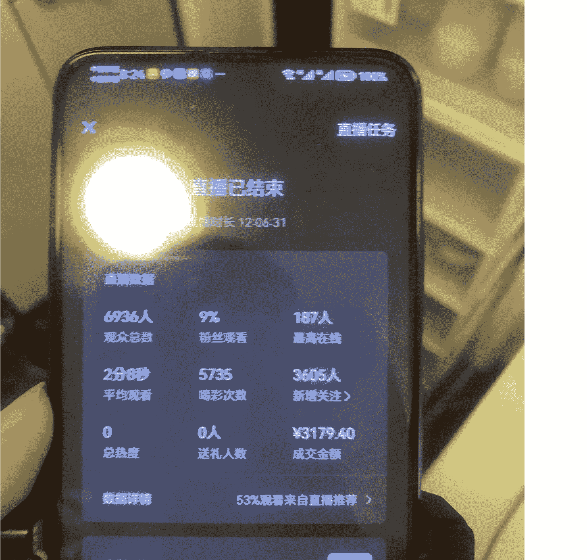
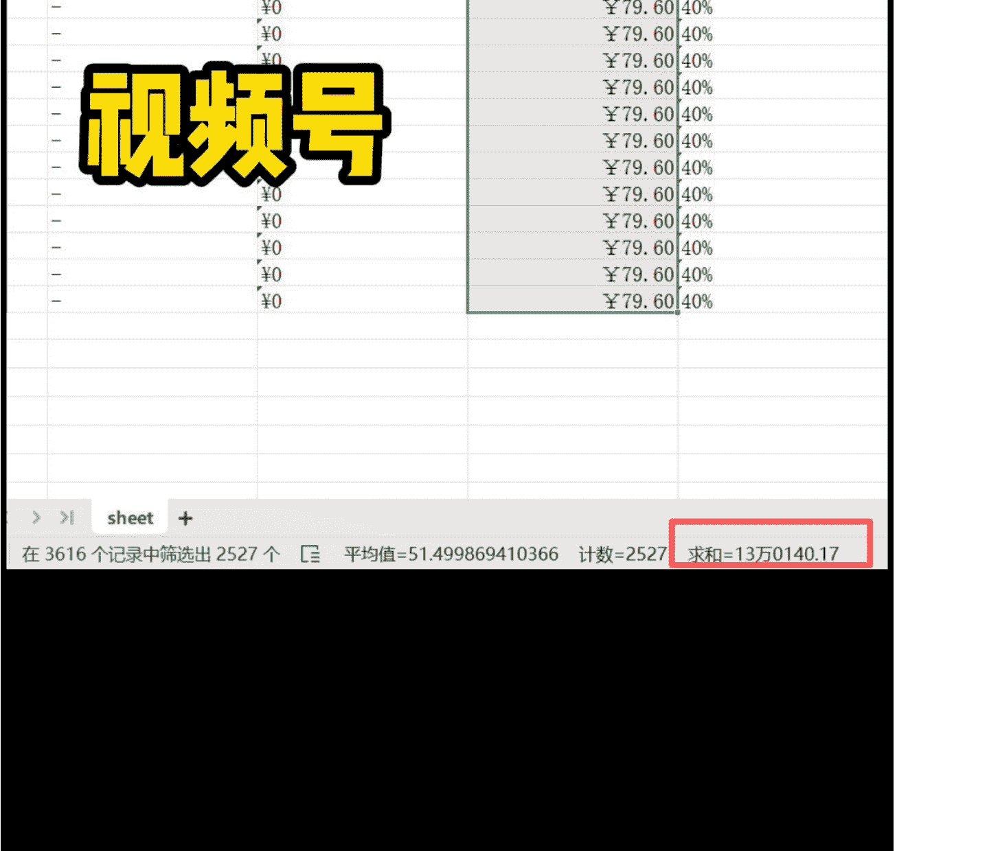
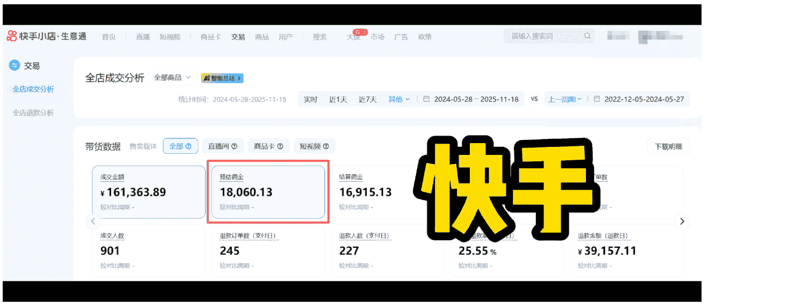
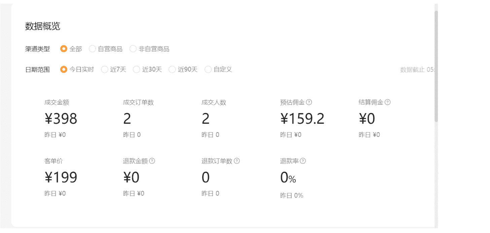
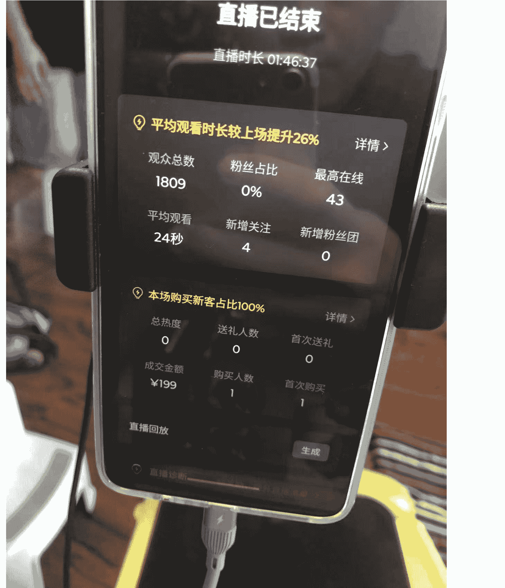
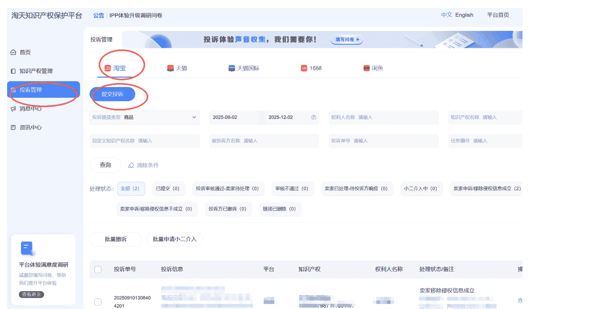
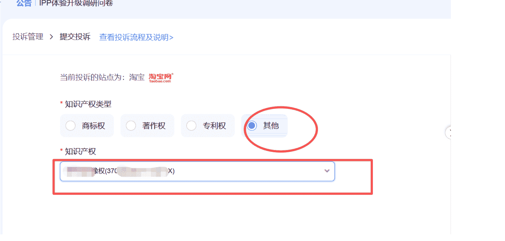
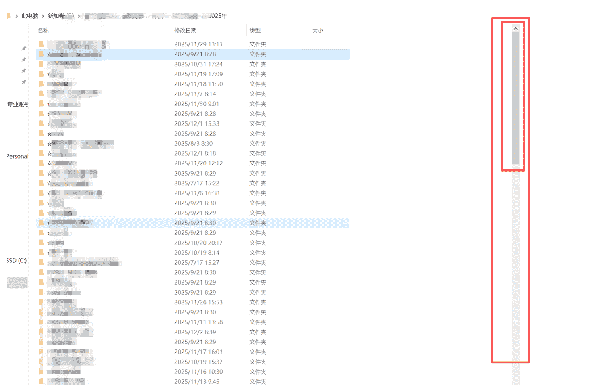

# 中年失业不失意，做垂直小店，18个月，只卖1个品，佣金40万

251209 副业 SC 精华

公众号懒人搜索，懒人专属群独享

懒人微信：lazyhelper

## 自我介绍

大家好，我是老七，坐标山东青岛，普通的85后中年男人，写这篇的初心，是给暂时没有拿到结果的圈友内心一点温暖与笃定。我可以，那你也可以。

2024年的3月份，跟干了10年的老东家和平分手，感恩企业在我年轻一无所有的时候，给了我钱与名，不过也透支了自己身体，权衡再三，裸辞保命，只带走了10年的工牌跟对未来的笃定。

裸辞的底气有3点：
- 全家有2年的存款。
- 老婆及家人的支持。
- 自信。做知乎好物项目每天投入1小时左右，日更700天，2年带货1100万GMV，佣金与商单大概赚了15万。

近7日阅读(播放) | 近7日赞同 | 累计收益(元)
---|---|---
7661 | 14 | 131,267.11
今日 572 | 今日 2 | 今日 0

> 提醒想要裸辞的朋友，除非保命，不然别裸辞。

这小2年的时间主要做了1件事：短视频直播带货，直到看到亦仁的超级标，才知道原来我做的是垂直小店。

## 阶段 1：空杯心态，从0开始。

### 报名养生训练营

报名养生项目训练营，从0开始，3个月后，逐步具备了口播、剪辑、文案、直播、找品的能力，第一个月就拿到一点小成绩，训练营的最后一天卖了3200的GMV，下图是训练营28天的收入情况简单记录。

2024年3月26日
【训练营的成绩】
累计佣金3000+（第一天我的28天目标是1000元佣金）
- 第1天，上课，0基础小白开始上路。
- 第四天完成第一次直播，紧张说话都不利索，销售0。
- 开营第7天，橱窗出单赚了40块，破零。
- 第7天，直播开单1单，非常开心，是自己开播卖出去的。
- 第8天，直播找代播，出了1单，很开心，这个路径也会了，也出单了。
- 第13天，换品牌，直播出了2单。期间焦虑，甚至在看其他的项目，怀疑项目。
- 第20天，确定聚焦当下项目，ALL IN。别人出单我也可以。期间，降低预期，听话照做，模仿，陆续橱窗出单。
- 第27天，视频小爆，自己直播，卖了366块钱GMV，历史性突破。
- 第28天，4个小时卖了2800GMV，阶段性突破。

这个项目一共赚了几千块钱让我给停了，因为比较消耗账号，频繁换品非常心累，认为跟“可积累”三个字无关。

所以，开始寻找可以长期做的品，去做1厘米宽1公里深的事情，这是我所擅长的。

## 垂直小店：

这是目前的主项目，大概是 2024 年 5 月份开始，到现在正好 18 个月，主账号的佣金正好是 40 万，放在生财这是很小的一个成绩，但是对我说是莫大的鼓励。

| 时间筛选 | 付款时间 2025/07/01 18:06:39 - 2025/09/28 18:06:39 |
|---|---|
| 成交订单数 | 1,231 |
| 计佣金额 | ¥211,355.6 |
| 预估佣金收入 (达人) | ¥58,600.54 |
| 已结算佣金收入 (达人) | ¥58,500.28 |

| 时间筛选 | 付款时间 2025/04/01 18:03:53 - 2025/06/30 18:03:53 |
|---|---|
| 成交订单数 | 1,602 |
| 计佣金额 | ¥276,472.15 |
| 预估佣金收入 (达人) | ¥76,035.24 |

抖音

| 时间筛选 | 付款时间 2025/01/01 18:03:53 - 2025/03/31 18:03:53 |
|---|---|
| 成交订单数 | 2,280 |
| 计佣金额 | ¥369,342.95 |
| 预估佣金收入 (达人) | ¥99,597.29 |
| 已结算佣金收入 (达人) | ¥76,007.92 |

| 时间筛选 | 付款时间 2024/11/20 18:03:53 - 2024/12/31 18:03:53 |
|---|---|
| 成交订单数 | 106 |
| 计佣金额 | ¥16,850 |
| 预估佣金收入 (达人) | ¥4,516.61 |
| 已结算佣金收入 (达人) | ¥3,238.99 |

| 指标 | 数值 |
|---|---|
| 成交订单数 | 266 |
| 计佣金额 | ¥46,933 |
| 预估佣金收入 (达人) | ¥13,050.23 |
| 已结算佣金收入 (达人) | ¥9,992.1 |

## 找到项目的过程：

有一天,百无聊赖,视频号刷直播广场,发现一个中年人在卖一个中老年使用的小家电,价格是200一台,佣金80。直播间每隔几分钟就会下1单!

异常值!

立马做竞争分析!

公众号懒人搜索，懒人专属群分享

### 1. 供应量少

用对标直播间这个产品的名字，在视频号的搜索页，查这个产品的关键词，发现只有5个账号在卖这个品。说明目前做的人比较少。

### 2. 收益符合预期

这几个人的账号佣金收益大多在10万-30万之间，时间最长的那个账号是做了1年，是头部账号，推算赚了100万佣金！

### 3. 竞争烈度低

视频是产品使用视频，很粗糙，基本不用剪辑，比口播视频一刀一刀的剪简单多了。直播场景为简单家庭场景，而且是女性直播（非使用者），直播话术简单，主播的状态一般，被超越的可能性大。

### 4. 个人匹配度高

我就是这个产品的精准用户，我可以无限创作短视频。

## 项目实操：

项目比较简单，拿到样品后，模仿对标，上手拍摄使用教程（需要出境），配上音乐简单文案，也不用说话，十几秒的视频发布在视频号，1条至少是有1000的播放量，因为品自带流量，第五个视频跑了21万，第六条视频62.5万，橱窗开始出单。

当月就开始赚钱，1个产品卖200，佣金80，挺香的，记得当时24年5月份赚了9200块钱，比较满足。

但后来发现即使10万播放的视频，橱窗也做了下单引导，只能出1-2单。

> 怎么办？咱有经验，顾客购买动作=欲望-摩擦。

对于这个品来说，摩擦就是顾客担心买回家不会用怎么办？能退吗？这些顾虑的打消需要直播才能高效率的解决。但是，接下来的过程并不顺利。

### 出师不利!直播几乎不出单!

直播无非人货场，场是我的硬伤，家里太小，我只能在靠近入户门的地方直播，靠着门这么近，稍微一说话楼道的邻居就可以听到，妈呀太羞耻了，本来就不想让人知道无业在家，别提多别扭了。

2024年7月30日

2024年7月30日 周二精神恢复了。慢慢播，就算不出单也播

怎么办?硬播!不出单也播，别人能做成我必然也能做成!

调整直播时间，调整直播的空间，趴别人直播间学话术，抄同行爆过的视频，能想的办法都想了，每天直播至少2个小时。煎熬，需要经常做心理建设。

煎熬了大概2个多月，2024年8月份，账号开始每次直播都能出单，我也从单平台直播变成抖音，视频号，快手3平同步直播，而快手当时暂时只有1个人在直播这个品，果断增加账号，每天有200-300的收入，而且发现抖音的出单比其他2个平台出单更加的容易。

### 面对AB货束手无措

刚要稳定的时候，新问题又出现了。评论区跟直播当中，开始有人说”不要买，是假货”类似留言，原来做AB货的进入这个行业，下载别人视频展示正品（160 元），但是发货发山寨机，卖 60 一个（含泪赚 40），当时我卖 160 一个，价格优势荡然无存，其他博主有人开始停更，停播。

我异常愤怒，但当时束手无策。

卖假货的断我后路！有仇不报非君子！这也为后面我带着正品机再次爆单，留下了伏笔。

后面是我沉寂的 2 个月，期间报课学习抖音绿幕直播。交付比较有良心，课程中有抖音的直播逻辑，每天看直播回放，理解了然后做笔记，理解了道和术，换了 N 个品直播，最好的时候，卖一个 9.9 块钱的小工具，直播 4 小时卖几十单，能赚 50 块钱，依然没有做成，迷茫。

但是当时发现当时的直播圈子，塑品话术、憋单话术都比较假，不适合我，感觉直播应该极度真诚才对。后来我用极度真诚的态度，把自己干到了头部，验证了不要骗人，不要憋单，极度真诚也能高效出单。

到了 12 月份，还是没正事可做（说到这里心酸，再劝你不要冲动裸辞，除非是裸辞保命），老婆劝我说，要不你再试试播老品吧，管他出单不出单。

结果这次成了。

12 月份，一天能出 5 单，再 7 单，12 单，26 单! 52 单! 69 单!

到 2025 年份，可以做到每天直播 2-4 个小时，月入 3 万佣金(记得这么清楚是因为我有写日记的习惯)。这时候能感觉身体开始比较疲惫。

### 淘宝维权教程

卖假货的又出现了!! 淘宝上几十个店铺用我的个人出镜形象卖假货，层出不穷。

必须打假!

如果你也被淘宝侵权，用以下方法非常高效可以解决这个问题。

① 打开淘天知识产权保护平台
https://ipp.taobao.com/

② 提交自己的知识产权（个人肖像）

③ 审核通过后，点开左侧的投诉管理，再点击“提交投诉”。

公众号懒人搜索，懒人专属群分享

④ 点击其他，选择肖像权，填写侵权的淘宝链接，就可以进行举报，一般3个工作日就可以审核通过，只要是用你的肖像，举报通过率是100%。

为什么现在还能做起来？因为卖假货的是脉冲式的，需求依然在，但是摩擦变小了。但是对于用户的信任伤害以及用户内心价格锚定伤害巨大。市场上已经出现了很多这款产品的打假视频。

2025年01月13日

我看了两个平台的数据，最近30天的佣金是2.9万了。

### 从"抄"的阶段，走到"超"的阶段

所以，我开始顺势而为，做打假类型的短视频，视频开头做打假视频，展示使用过程，最后反转，修复用户信心。并且开始自己大量原创短视频。主要围绕着两点，提升购买欲望，打消顾虑这两点。而用户在直播间或者评论区提的问题，是他们精准的疑问点，我就拍以此为主题的短视频，每个视频拍摄大多是一遍就过，一条视频30S，加上剪辑时间，一条视频一共5分钟足够了。

下面是我的选题。

吃饭，睡觉前，在厕所，开车，打球，都在想短视频的选题，话术，如何拍摄。每条选题大概拍2-10条储备后续使用，一天发3-5条。极度的专注，账号开始持续的爆单。这通操作，让我从"抄"的阶段，走到"超"的阶段，项目进入正轨，也开始成为这个赛道带货一哥。

今年3月份大概有半个月左右的千人在线，月佣金能做到6万。

没有明显的淡旺季，出单稳定，截至2025年11月份，18个月的时间，佣金正好是40万，全部是自然流出单。但是从大概9月下旬开始，可能是因为平台调整，自然流出单开始异常，需要介入付费才能有之前一半的销量，加上直播耗气严重，我进入佛系直播状态，毕竟身体是第一位。

总结来看，这个项目成为了我的资产，占据了赛道的优势位置，持续更新，小火慢炖，未来会出台行业标准，假货消失以后，还会有一波大机会，这个赛道是可以干10年，甚至20年。

## 关于项目的一些思考

### 做的好的地方：

1. 我是普通人，没钱没资源，精力还有限不如年轻人。做项目当下的核心目标是活下来，找产品的红利差。在一个竞争不充分的领域，先模仿，再超过对手，大概率是可以赚到钱的。

2. 构建壁垒，让我持续的赚。早期，抖音、快手、视频号产品价格不统一，在视频号定价 200 元，佣金 80 元的时候，我主动邀请潜力品牌，以更低价 160 元的价格，入驻视频号跟快手，这么做有赌的成分，一荣俱荣一损俱损。而我，可以实现多平台同步直播。这样，对既得利益者造成心理攻势，原来赚 80，现在赚 40，让他们知难而退，减少供应。确实有 2 位之前赚钱不错的博主离开了这个领域。这么做，也降低了其他人进入的概率。

3. 引导行业不做价格战！今年价格特别卷，这个品也遇到了相同的问题，竞争品牌降价销售，甚至我这个品的官方开始主动降价销售。我已经成为头部，要求恢复原价销售，在高于官方直播间 10 元的情况下，销量依然稳健，稳住了的基本价格，避免行业的价格恶战。

4. 选的品本身自带流量，做自媒体有 7 样东西能留人，金钱，异常，捷径，性，暴力，死亡，民族主义，这个品自带异常、捷径属性，易于传播。

5. 逆商高，遇到的挫折让我摆平了。比如坚持打假维权。某宝上至少有 20 个商家，盗用我视频做 AB 货，影响我转化，我都坚持维权投诉下架。而之前的带货一哥，同时期，并没有这么做，现在还有不少视频是用他的视频卖假货，其本人的可信度被破坏，销量下滑是必然的。

6. 选的产品是可以跨平台，即使抖音不行了，我还可以在其他平台继续做继续吃。

### 做的不好的地方：

1. 没有请人直播。在爆火的时候，合理的做法是请主播一起直播，这件事我觉得很麻烦，又担心品被人拿走，不了了之。所以，即使爆火的多个月份，我都是每天直播 2-4 小时而已，时间没有有效的利用。

2. 能赚钱的时候，没有投流直播，这也是一步错棋。凡是项目都是有周期的，如果能赚，就狠狠的赚才对。

以上 2 个卡点，让我错失百万佣金。

## 建议每个人要有自己的垂直小店

亦仁说过每个项目都可以赚 100 万！如果你每天有 30 分钟的时间，建议你做垂直小店。我们坚持垂直输出，服务一个群体的一个小需求，解决一个小的社会问题。不断的迭代，做到头部甚至腰部，就会有自己的基本盘，可进可退。

公众号懒人搜索，懒人专属群分享

### 怎么做?

如果你看完这些以后，觉得垂直小店比较适合你，总结一些建议给你，也给我自己。

具体怎么启动垂直小店？

① 大量的刷短视频、卖货直播间，储备自己的选品库，直到找到你想做的那个品。
筛选标准：
- 你是这个产品的用户（方便以后大量拍摄），你感兴趣，至少不反感。
- 对标的视频、直播间内容简单甚至粗劣，产品功能展示为主，属于行业早期，有产品红利。
- 看对标账号的橱窗出单数量，推算收益，符合你的预期。
- 产品最好带一点使用技术门槛，需要你的介入才能更好的使用，防止后期产品只卷价格。

② 买样品，模仿对标，记得“消费者购买行为=欲望-摩擦”这个公式，大量输出短视频，不断更，穿越周期（所以兴趣很重要好）。

③ 迭代，迭代，迭代！成为行业腰部，头部。借用《天道》一句话，忍人所不能忍，做别人所不能，这个空间就是生存空间。100万指日可待!

### 100万指日可待!

最后，安利小懒的付费群：
懒人专属群（介绍）

这里是你对抗信息过载的护城河。已稳定运行6年，累计拆解、研读 3000+个互联网商业实战案例与行业前沿内参和时政/宏观文章。我们不搬运垃圾，只做高价值信息的筛选器与放大镜。

懒人专属群更新记录：
https://hk57gvIx7u.feishu.cn/docx/H0kRdZbSbolBROxkaXtcuVEOnTg

懒人专属群更新记录（需梯子，备用）：
https://lazybook.fun/blog/record2

【免责声明】 本资料归档于社群内部知识库，仅供成员课题研究与学术交流，请在查阅后 24 小时内删除。