# 分享一些普通人也能做的小红书小生意
# 251209 副业 SC 精华

公众号懒人搜索，懒人专属群独享
懒人微信：lazyhelper

大家好，我是云棠。

之前通过做小红书矩阵获客引流到私域变现 6 位数。单账号不到 200 粉，平均每月能带来 5k 左右的收益。比较擅长从 0-1 快速跑通闭环实现变现，这里分享一些我的思路、基本逻辑，以及分享一些普通人也能直接上手的项目。

从几年前起，我就养成了一个习惯：在小红书上看到一个生意就立刻跟进去看它是如何盈利变现的。

去分析去拆解，观察它怎么起盘？怎么涨粉？靠什么变现？成本是多少？用户为什么愿意掏钱？

我会像拆玩具一样，一点一点分析、观察、记录。

相较于其他人来讲，我会从一个女性视角结合商业思维进行深度分析，希望能带来一些启发。

# 如何从看小红书到挖掘商机

最简单的方式就是你自己需要，自己去体验产品，尝试各种好玩的。自己经历了，同时看到了大量和你一样的用户，感受到整个链条的用户需求，能够更好地理解，也就能够更好地去做产品匹配用户需求。

但是如果你自己并没有需求，或者说你是男性，在一些目标用户是女性的领域里无法感受到需求，也没关系。在算法平台，每个人都有自己的视野盲区，那么怎么办呢？直接去小红书测试，找到真实的需求。

## 看评论区：真实的用户需求藏在评论区

哪里有抱怨，哪里有求助，哪里就有商机。

不要只看笔记内容，评论区才是真正的需求池。

在小红的评论区里，有大量真实的用户需求：求链接、是否还接吗、蹲教程、蹲使用过后的效果。这些都是实实在在的需求。

以我之前做的摄影项目举例，在小红书上面有很多这样的帖子，非常有流量，这样的帖子叫《刚拍的写真翻车了，丑》。

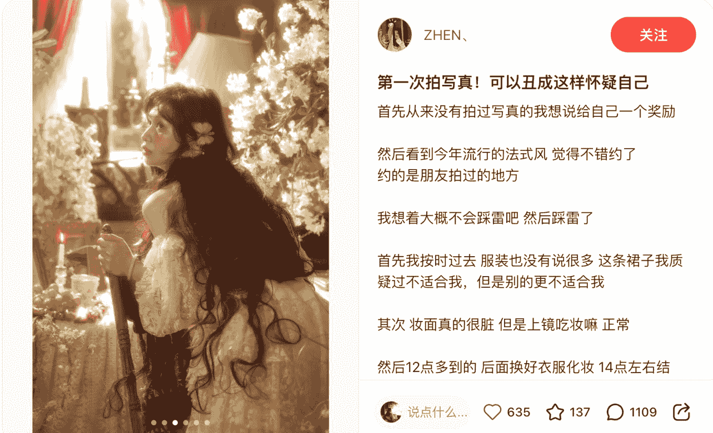

你看，这是一个真实的用户去拍了写真，拍完之后感觉不满意，然后分享了自己的照片以及经历。发出来之后，大家纷纷在评论区分享自己拍的。

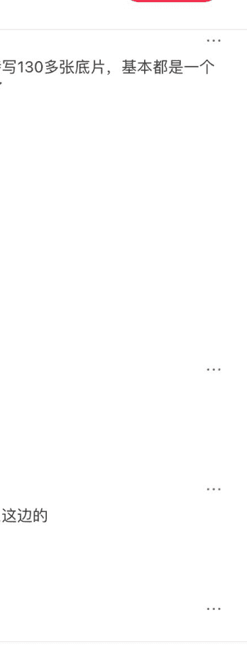

然后就有用户看到对其中的拍的好看的、价格优惠、性价比高的，询问哪家店。然后就有用户被种草了。

商机：这就是一个真实的用户需求，大家都想要性价比高的好看的写真，而且可以通过这样截流的方式来获客，用户真的会买单的。非常简单粗暴。另外我说一下，这样截流会有一个意外的好处是，你的账号会有更多同类目喜欢摄影的朋友点进来，之后进来的用户会更加精准，转化率也会更高。通过我大量的矩阵测试，完全没有做过截流的账号和做过截流的账号过来的用户会有所不一样。

弊端：不要太频繁，截流会有封号的风险，现在账号成本越来越高了。

## 利用“搜索下拉框”

搜索框里自动联想出来的词，是几亿用户每天都在搜的高频词。

依旧是以我之前做的摄影项目举例，大家知道写真类目相对比较好做的板块是什么吗？生日写真。这个在小红的搜索栏目下有 230 万+ 的笔记。

每个过生日的小姑娘都想要纪念一下自己的生日，生日自带 ddl 属性，每个姑娘都想要在生日当天发美美的朋友圈，时效性加纪念就很好做。包括儿童的生日纪念写真也一样。这是一个好类目、好项目。每一天都有人要过生日，你总是不缺客户的。而且把生日类目作为引流类目，还能够推动其他品类。

搜索词附带的自动联想出来的词，就是你要做的产品名和笔记标题。

## 关注广告投放

今年很明显的是能够大量在小红书上看到标注“广告”的帖子，能够投广的一定是跑通了闭环，一定是赚钱的。

看到这种广告就可以直接反向拆解它的路径：点进去看他卖什么？怎么引流的？是加微信？还是直接挂链接？是卖课还是卖实物？

然后判断自己能不能做，有什么壁垒，适不适合做。

小红书生意 IP 策略：
- 1. 确定目标人群
- 2. 找到用户需求
- 3. 判断市场竞争，判断自己的实力，避开高竞争
- 4. 确定流量获客打法
- 5. 搭建流量体系

小红书的内容生态正从“精致生活” → “小生意实战”。

你会发现，小红书现在推得最多的是：摆摊、外贸、小红书转行、创业笔记、低门槛副业、实体小生意。

这里分享一些普通人也能去做、启动成本低的生意方向。这些方向都是：不卷专业、不卷设备、有真实需求，很容易跑出第一笔钱，而且很多赛道竞争还很低。

# 项目一：葡萄酒家宴+社交

这位主理人之前在医院工作，辞职之后就做起了小红书，定位很明确——葡萄酒家宴 + 精致社交局。每周只开一次局，邀请陌生人来家里吃饭，每次 10 人，客单价 300-2000 不等。

看她的小红书图片，菜是那种非常精致的——色彩漂亮、器皿高级、菜单丰富，一次能吃到至少 18 道菜，不同风格的料理。人美，菜好，场景氛围到位。

就连菜单都是非常精美的，让人看了就想去啊，家人们谁懂。

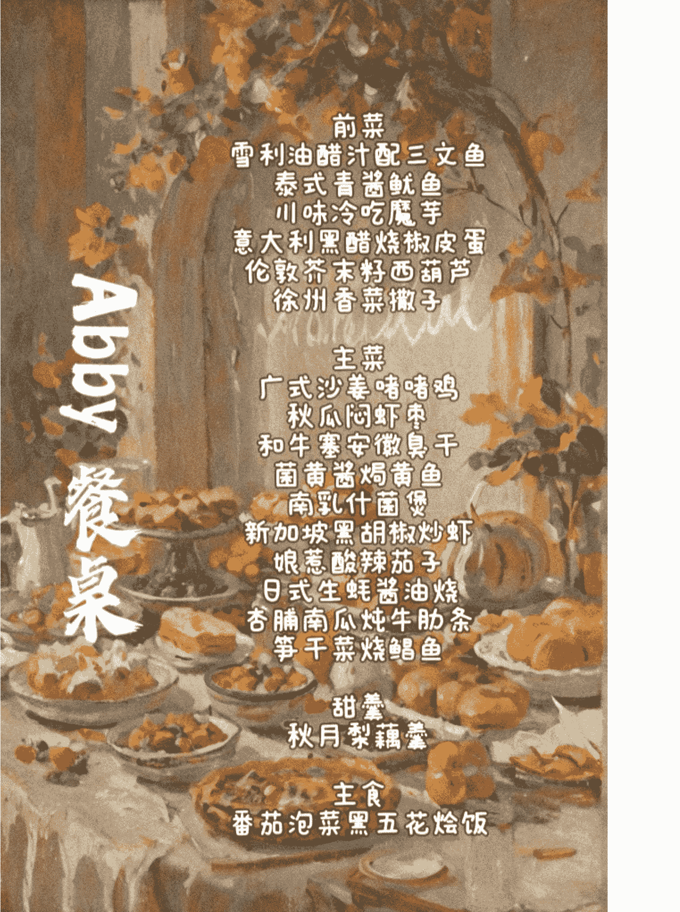

家宴这种东西，很吃“氛围感”和“仪式感”。她恰好对这方面非常敏感，会布置，会拍照，也会创造体验。

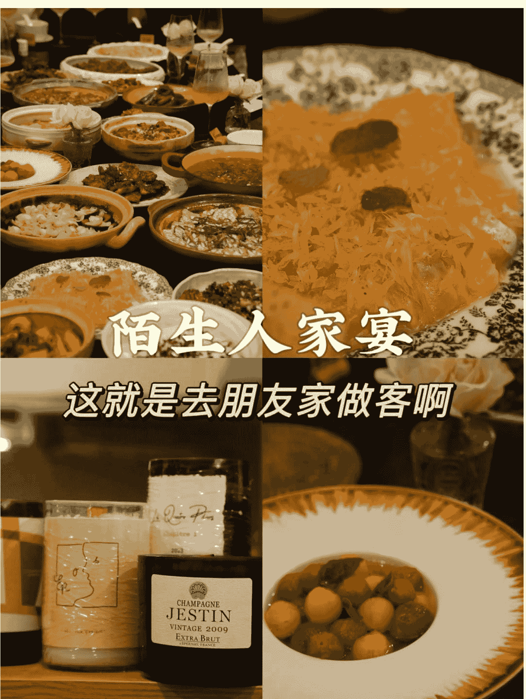

陌生人家宴
这就是去朋友家做客啊

生意非常火爆，她的小红书群已经开到第五个群！除了固定家宴，她还会接各种私人定制的家宴。收益不透明，但从客单价和预定程度来看，过万肯定不止一次。

## 核心就是她找到了自己的三件武器：
- 产品：菜真的好吃又用心
- 定位：高端的葡萄酒 + 精致社交
- 场景：家中布置得有氛围、有品味、有辨识度

在同质化越来越严重的小红书上，美食是卷的，但“家宴 + 陌生人社交 + 葡萄酒体验”是非常稀缺的。

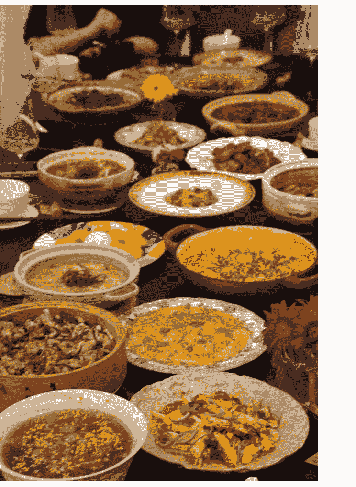

她抓住了一个普通餐厅做不了的需求：一两个人想尝试多种菜系风格但是吃不了，不想自己准备，也不知道去哪里找高质量的饭局。

这让我想起了新荣记，同样是餐饮，能够打出高端感。这种生意本质依旧是：有体验、有情绪价值、有故事性，自然就能跑起来。非常看好这个项目，大有可为。

# 项目二：义乌游学

这两年，义乌游学特别火。

主理人本来是义乌土著，辞职后开始在小红书分享义乌市场、工厂、商品的视频，不知不觉吸引了大量对小生意感兴趣的年轻人。

很多人来问：“你能不能带我逛一圈？我想看看真实的小生意怎么做。”

于是，一个两天的义乌游学团诞生了，客单价 1000-2000 元，一期比一期好卖。

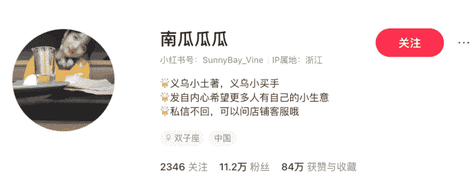
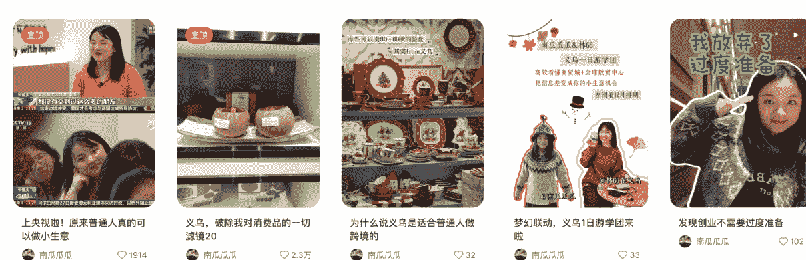

义乌正在从“小商品之都”进化为“全球供应链起点”。年轻人都在找低门槛、能赚钱的小生意。

义乌游学团，本质是一个成熟的信息服务产品。拆开看，它包含四个部分：

- ① 卖的是“行业一手信息”
1-2 天，带你看义乌最真实的产业：小商品市场、工厂与展厅、外贸公司、产品打样、一件代发、仓库、包材区。不仅仅在“带人逛市场”，而是在输出产业带的一手情报。外行自己找这些资源要 1-2 年，游学团帮你压缩到一天。

- ② 对接的是“供应链资源”
比起讲课，游学团最值钱的是：哪家工厂靠谱？哪些品类好卖？哪里便宜、哪里会坑？哪里能做一件代发？哪些款式容易出爆品？这些都是“试错信息”，别人一年的踩坑，你一天告诉他。

- ③ 做的是“转行咨询+创业陪跑”
游学结束不是结束，而是开始。学员通常会：加你的咨询、报你的课、加入你的选品群、买供应链服务、做代发、请你代拍视频、做运营。游学的本质：前端获客，后端变现。就是整个链条上有非常非常多的需求，有很多点可以去挖掘，能够去提供服务。

- ④ 搭的是自己的 IP 飞轮
拍义乌 vlog、直播带看市场、讲创业故事，都会吸来下一波学员。飞轮是：内容→游学→供应链→咨询→内容→再转化。越做越轻松。

## 3. 市面上成熟的义乌游学产品长什么样？
行业已经跑出了一套非常成熟的产品逻辑。

## 核心游学产品（中高价区间）
- 产品：义乌市场 1-3 日实战游学
- 价格：800 - 1800 元/人（不含交通住宿）
- 内容包括：
  - 行前选品方向指导
  - 预算规划
  - 市场带队：看最容易爆的区域
  - 教询价、砍价
  - 工厂展厅对接（提前铺路）
  - 供应链基础：物流、仓储、一件代发流程
是最易推广、最易转化的标准化产品。

## 深度服务（高客单价）
- 产品：采购顾问 / 创业陪跑
- 价格：3000 元/月起（或按订单抽成）
- 服务内容：长期代采、远程验货、产品拍照拍视频、小批量定制对接、一件代发、全链路运营指导
这部分才是主理人的持续不断的赚钱点。

# 项目三：小饭桌项目

这个项目的主理人，原本是一名居家办公的财务。平时喜欢研究美食，家里有小孩。

账号粉丝只有个位数，她只通过一条笔记就引流了几百名真实的在地用户。

她住在杭州良渚。对杭州人来说，这个地方是公认的“美食荒漠”。外卖贵就算了，难吃是真的难吃。预制菜占比高、选择少。重点是这个地方商家少，用户需求多，真的不卷，可以说是市场供给小于市场需求，市场存在空缺。

所以在这里，“会做饭”是一项可以直接变现的技能。

这位主理人提供午餐、晚餐，3 菜一汤，客单价 30 一份。一餐大概能做 15 份，每天 30 份，不定时提供夜宵，如烤鱼、小龙虾，价格在 99-200 之间。扣除掉成本，每个月基本能够过万。

最关键的是用户粘性很高，社群内每天都靠抢，大家都觉得她做得好吃，会不断分享。

好的手艺 + 真实的刚需 = 生意可以持续增长。

这个模式其实非常容易复制和放大：
- 1. 招聘厨师，扩大产能
- 2. 继续在社交媒体引流获客
- 3. 接企业 To B 午餐 / 团建餐标
- 4. 承接活动、赛事、聚会的餐饮需求

一个人做是小生意，团队做是大项目。

# 项目四：手作玩偶

娃圈具有极高的粘性和排他性，口碑传播是核心营销逻辑。一旦用户认准了你，就有可能会一直在你这里买，具有持续的复购。

它属于情绪经济，然后也会有用户购买来当作礼物送朋友，毕竟这个具有独特性。

- 审美个性化：大家好像都开始拒绝千篇一律的工业流水线产品了，私人订制被越来越多的人喜欢。
- 用户群体：18-40 岁的女性为主。
- 收集癖：容易产生复购，成为“娃妈/娃爹”。
- 创造欲：不仅买玩偶，还会买配件、衣服、场景，进行二次创作。

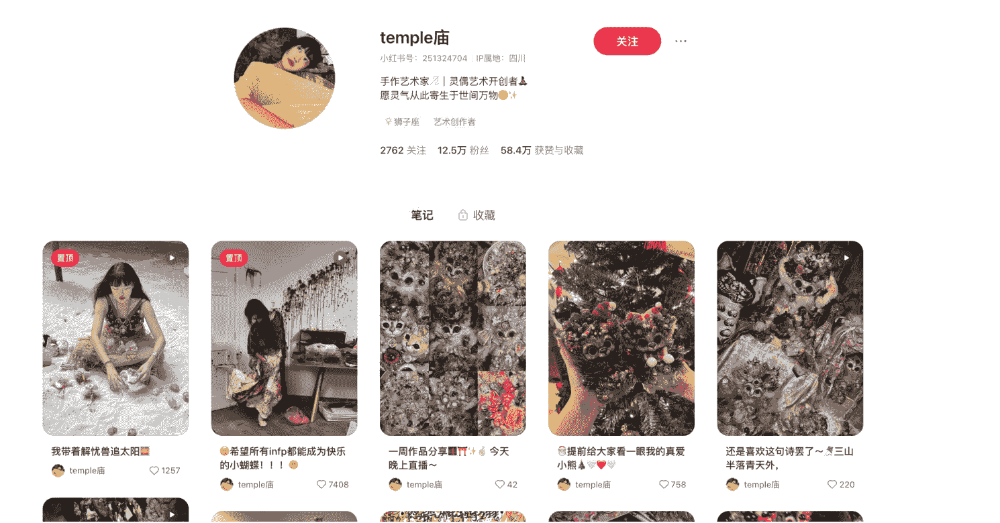

像这个博主定制的一只卖 1200-2000，可以定制，通过直播、短视频进行售卖。

## 商业模式与变现路径

### 制偶师的商业模式通常分为三个阶段：

### 纯手作/定制模式（The Artisan Model）
- 核心：卖时间、卖手艺。
- 产品：裸娃、改妆服务（Face-up）、全身定制。
- 优点：单价高，利润率高，库存压力小（通常是定金预售制）。
- 缺点：无法规模化。人的精力有限，这属于“手停口停”的模式，天花板较低。

### “手作+标品”混合模式
- 核心：拓展 SKU，增加被动收入。
- 产品：
  - 高定线：亲手制作的限定款玩偶（维持品牌调性）。
  - 走量线：翻模制作的树脂/搪胶白模（半成品）、打印的图纸、制作教程、材料包。
  - 周边线：娃衣、假发、眼珠、微缩家具（这些可以小批量代工）。
- 优点：打破了时间的限制，收入结构更健康。

### IP 化与品牌化模式（The IP Licensing Model）
- 核心：卖版权、卖形象。
- 路径：制偶师创造出一个极具辨识度的形象（IP），通过授权给工厂生产盲盒、周边，或者与其他品牌联名。

优点：边际成本极低，商业爆发力最强（如泡泡玛特旗下的很多 IP 设计师最初也是手作人）。手作温度无法被机器替代，一旦成名，粉丝忠诚度极高，自带私域流量。

# 项目五：宠物上门洗澡

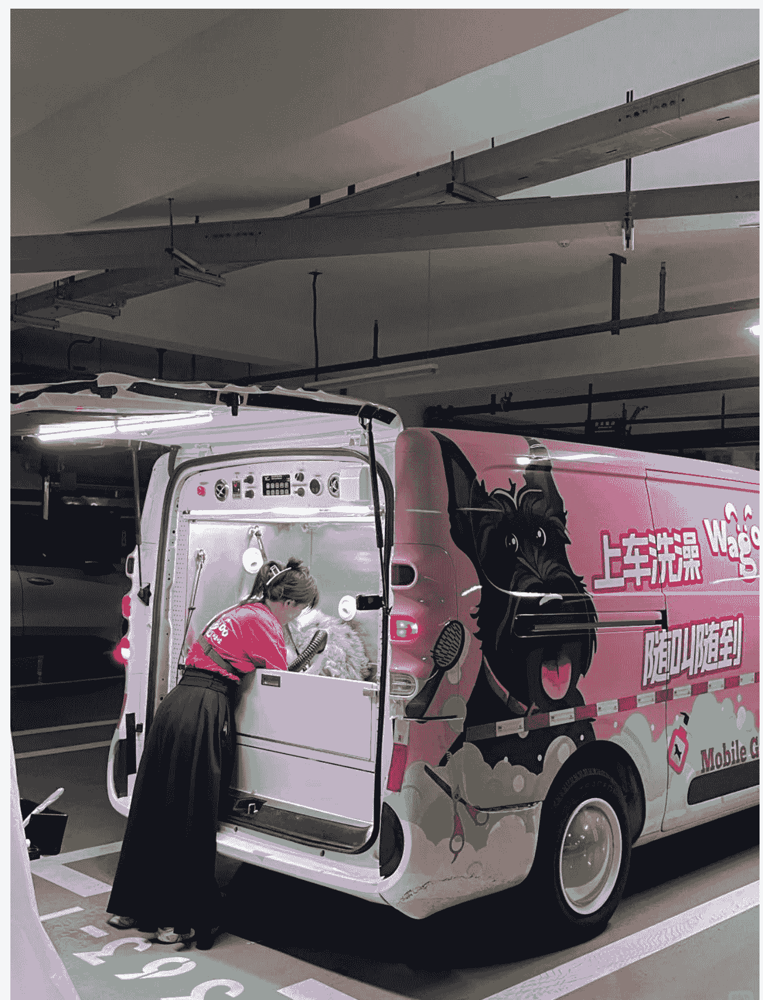

在小红书上搜“宠物上门洗澡”，你会看到超过 60 万条笔记。

这是一个已经被验证、转化极强、且普通人也能切入的生意。

客单价普遍在 ￥188-￥398，闭环非常简单：笔记 → 到家服务 → 复购 → 转介绍。

很多人只做了一个月，就能把订单排到两周以后。这是能长期做的生意，一次体验好，可以带来：

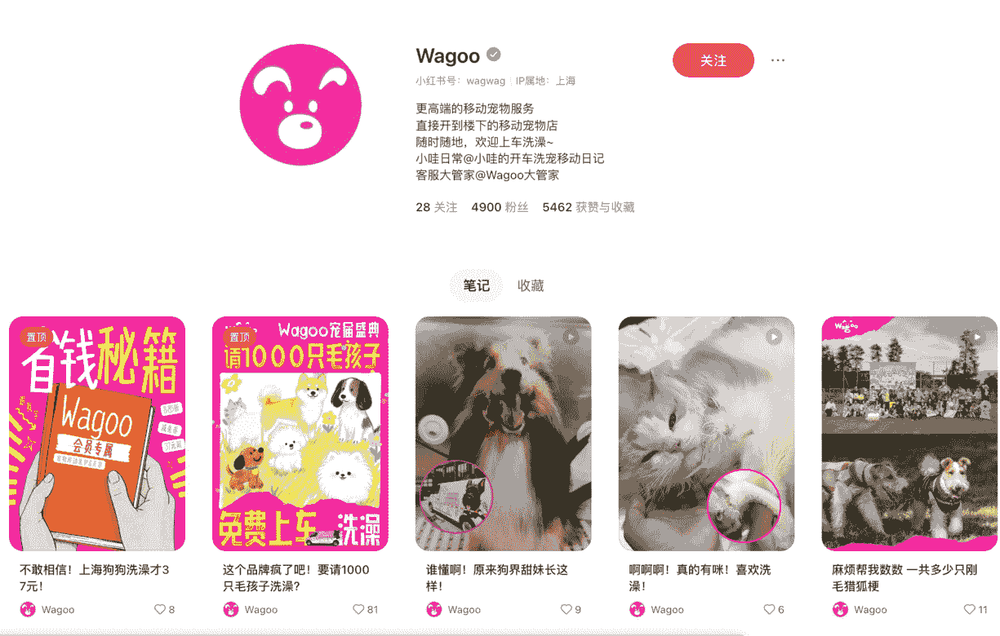

复购 + 朋友圈背书 + 主人主动转介绍。

## 成本结构：
- 金钱成本：极低。一套专业的洗护工具（吹水机、吸毛器、沐浴露、消毒水、保定包），投入约几千元即可启动。没有房租！
- 时间成本：很高。包括路程时间+洗护时间。洗一只猫大约需要 1-1.5 小时，洗一只大狗可能要 2-3 小时。
- 利润：除去交通费和耗材（极少），毛利几乎是 90%。

进入门槛低：技术可学，设备不贵。宠物洗澡不像美容造型，技术难度不高，只要练过 7-10 只就能上手。

大部分人启动成本只需要：低档≈4,400 元，高档≈13,600 元（更专业、服务稳）。

## 需求刚性 + 高频复购
宠物洗澡的周期：小型犬 10-15 天；中型犬 15-20 天；长毛、大型犬 7-10 天；换毛季甚至 5-7 天。

这意味着一个客户，一年能复购 12-30 次。只要服务稳，你的老客户会越来越多。

## 服务项目 & 定价
不同体型宠物价格差异比较大，可以按照 ¥188 - ¥398 的常规区间来开价。搭建会员 / 复购体系，月卡、年卡、节日特惠。

## 如何用小红书快速起号？
- 持续发布洗澡前后对比
- 拍真实现场：吹毛、梳毛、洗澡、安抚记录可爱的宠物瞬间
- 添加本地地标 + 城市标签
- 做“宠物洗澡科普”内容（很容易爆）

小红书的逻辑：真实 > 技术 > 价格。你越真实、越细心、越专业，用户越会找你。

# 项目六 手作包包定制

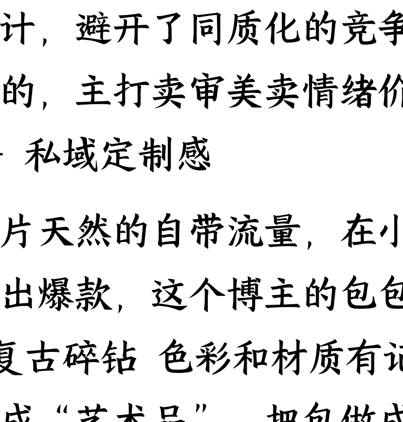

手工定制各种风格的包包，在小红书上火爆起来，客单价在 300-1000，定制周期 20-30 天。

独家的设计，避开了同质化的竞争，女生都超级爱的，主打卖审美、卖情绪价值 + 稀缺审美 + 私域定制感。

好看的图片天然的自带流量，在小红书就很容易做出爆款，这个博主的包包：仙 + 梦幻 + 复古碎钻，色彩和材质有记忆点。把手工做成“艺术品”，把包做成“故事”，把顾客变成“收藏家”。

你看她的标题：
- 我的包会发光啊 ✨
- 缝到手冒烟的梦幻打珠包
- 华丽复古的冒险
- 挂在托斯卡纳山间庄园

听起来就超级有氛围感对不对：不是冷冰冰的商品，而是让人买情绪、买浪漫、买故事。买独一无二的属于自己的定制化服务。女生对这一套 vibe 氛围毫无抵抗力，非常戳中心头爱。

# 项目七 vintage 古着衣服

店主主营欧洲和美国的 vintage 衣服，每件衣服都是“独一份”，带着年代感、手工感。用户是买一个「情绪价值」。

Vintage 很吃拍照氛围感。文案风格也匠心独运，不是市面上的千篇一律的那种，因为选择古着的用户都是有独特的审美的，客单价在大几百-几千。二手衣服没统一标准，只能靠店主审美+挑货眼光+描述靠谱，这就是能不能做得长久的核心壁垒。

内容主打“审美+生活”而不是单纯的“卖货”，用户不是冲动型消费，而是“信任型”，慢慢来会更快。

因为是 vintage 所以每一件只有一件，避开了市场上的同质化竞争，然后也没有退换货的烦恼。只要拍出好看的图片就很容易出圈。

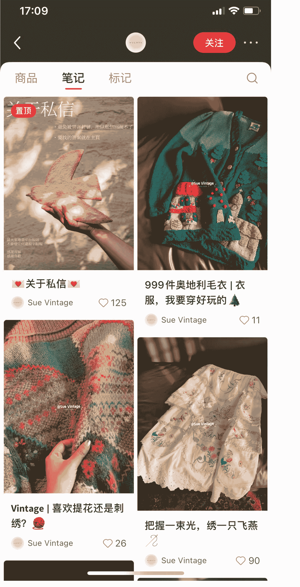

# 项目八：家电上门清洗

基本上我每次搬家都会找这种家电清洁，先帮我把家电全部清洁一遍。

新搬家的用户租房子、家里有宠物有小孩的家庭、出租房东等，对于房子家电都会有清洁要求。

特别是流动性比较高的城市，家电上门清洗还算蛮刚需的。

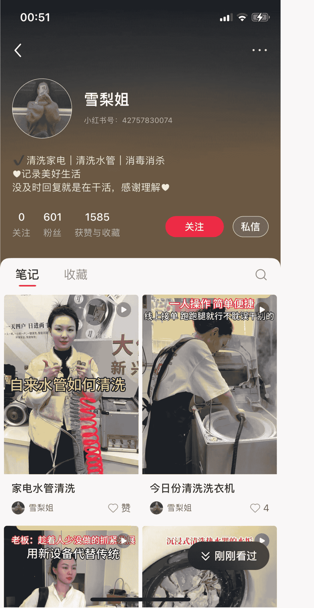

## 通过小红书持续发布内容
- 发布清洗前后对比（视觉冲击最强）、视频自己清洁的过程，用户就会后台直接私信
- 提供超预期的服务体验（准时、认真、干净）

小红书用户看到这种内容，非常容易动心，因为这不是虚的，是实打实的服务。

## 成本、学习难度分析：
- ① 启动成本低
  - 几百块搞定：清洗机、泡沫剂、毛巾、刮刀、小工具、防溅布
  - 只要你愿意学，一天就能上手。
- ② 技术门槛不高
  - 可以从“最简单的两个项目”开始：洗衣机清洗、冰箱除味+清洗
  - 这两个项目几乎没有技术难度，又非常容易让用户满意。
  - 然后逐步学习空调、油烟机、热水器。
  - 实在不会直接去看 B 站、跟师傅同行一两天、小红书同行拆机视频（最真实）。

一个家庭一次上门，平均 1~1.5 小时。

假设你一天接 3 单：中午前一单、下午一单、晚上下班后附近一单。一天轻松三四百，周末甚至 800。不卷、不内耗、见效快。一个月过万可以实现的。

可以扩展完成 10 倍增长的地方：就是你成为一个家政服务中心，左手流量市场，右手保洁家政服务人员，从中抽佣，不止单单从线上获客，也从线下市场获客，成为一个云家政服务平台。

# 项目九 儿童画定制珠宝

孩子的每一幅图都是珍贵的宝藏，这个账号的主理人发现了将它们变成珠宝首饰的可能，就一头扎进了这个领域。他们有自己的工厂，专业的品牌设计团队，从设计构思，到选材加工，每个环节都严格把控。专注定制服务，把孩子的奇思妙想，变成项链、手链等精美珠宝。把孩子的童真永久珍藏。确实是一个有创意有意思的需求。

这个账号有做广告投放，说明是持续盈利的。

## 图图 | 儿童画定制
珠宝饰品 | 小红书号：26962031629

| 数据指标 | 数值 |
|---|---|
| 关注 | 0 |
| 粉丝 | 2522 |
| 获赞与收藏 | 3260 |

- 5岁童画 | 我心中最美的公主妈妈👑
- 5岁童画 | 元气兔宝，背着爱心去郊游🐇
- 7岁创意 | 叼玫瑰的荆棘绅士，帽上长草🌹
- 6岁创作 | “我和我的蓝色猫队友”手链诞生

这个生意情绪价值 > 产品价值。

儿童画珠宝，不是卖金属，而是卖纪念，卖情绪价值，卖仪式感。

年轻妈妈：愿意为有温度、有故事的商品买单。

## 成本结构分析

- 原料成本可控（银饰或K金可自行选择）
- 工费：设计+手工费；运营成本：小红书内容+人工沟通
- 毛利一般在60%—80%之间，尤其银饰类，毛利极高。
- 交付模式灵活：用户提供儿童画，然后你提供初稿→客户确认→制作→发货
- 属于低库存、定制化、轻资产模式。

# 项目十：婚礼、生日现场布置

这件事需要靠审美+执行+信任赚钱。

这是一个本地生活服务项目，不需要大厂家背景，也不需要很多粉丝。做得好，会有持续不断的用户找上门，口碑会自动拉新。身边也有做相关的赚到百万级别的。

本质上卖的不是花和气球，卖的是“被拍下来很高级的仪式感瞬间”，是记录当下有意义的时刻。

城市+细分场景+人设/风格=差异化定位。

这个行业非常吃视觉冲击力。所以一定要好看、能出片，不能太俗气。出片是最好的广告。

另外在小红书上要做好关键词SEO：锁定本地精准客群，写笔记的时候一定要带地域，标题和正文必须包含“xx（城市）求婚”、“xx（区）生日布置”。例如：“南京求婚，给女友惊喜”。

适配场景：婚礼、生日、求婚、宝宝宴。

也可以异业合作，进行流量互换。去和本地网红民宿、黑珍珠餐厅、高端KTV、摄影师谈合作。你去跟餐厅谈，如果有客人生日，推荐你的布置服务，给餐厅返点；或者你帮餐厅免费布置一个打卡点，换取餐厅的长期推荐。

# 最后

你会发现，这些小生意有一个共性：
不谈梦想、不谈宏大叙事，就是从身边最小的需求切入。
不需要学历、背景、人脉、第一桶金。
只需要你动脑子，愿意把一件小事做到别人眼里“很不错”的程度。
普通人做生意的出路，从来都不是“很难的那条路”。
恰恰相反——
是那些不起眼、小小的、但真实存在的缝隙。

## 最后，安利小懒的付费群：

### 懒人专属群（介绍）

📖 这里是你对抗信息过载的护城河。

已稳定运行 6 年，累计拆解、研读 3000+ 个互联网商业实战案例与行业前沿内参和时政/宏观文章。

我们不搬运垃圾，只做高价值信息的筛选器与放大镜。

### 懒人专属群更新记录：
https://hk57gvIx7u.feishu.cn/docx/H0kRdZbSboIBR0xkaXtcuVE0nTg

### 懒人专属群更新记录（需梯子，备用）：
https://lazybook.fun/blog/record2

【免责声明】本资料归档于社群内部知识库，仅供成员课题研究与学术交流，请在查阅后 24 小时内删除。