# 小红书虚拟矩阵 3.0：双轨模式+AI 半垂直选品+店矩阵（可工作室放大！）

# 251209 副业 SC 精华

公众号懒人搜索，懒人专属群独享
懒人微信：lazyhelper

# 一、开篇和实操目录

## 1.技术分享的开篇

我是属于那种，脑袋里有干货，手上有实操，但是不善于表达出来的人。

我在电商这个领域，已经做了快 10 来年了，做小红书虚拟矩阵这个项目，也有 2 年了。

目前在广州黄埔区，有 2 个工作室，1个半专门做小红书虚拟电商，半个做其他平台的虚拟。

这 2 年做小红书虚拟的店矩阵，也拿到了很多结果。

要不然，工作室的十几个小兄弟，也不可能跟我到现在，随手截3个店的30天数据，以正视听！

很多圈友认识我，也是通过半年前，我写的一篇实操精华帖：小红书虚拟矩阵。

这次小红书虚拟矩阵项目的实操，是3.0，算是技术的全面更新。

3.0，是基于半年前，我发布的1.0的操作基础上的，感兴趣的圈友，可以点开我的主页，翻看下半年前的1.0实操步骤。

当时很多的圈友，通过这篇帖子拿到了结果，以至于后来，还偶尔会有圈友过来问我相关的实操问题。

## 2.分享的 10 条主线
- 一：3.0操作的起源
- 二：AI+半垂直化选品
- 三：双轨操盘模式
- 四：批量搬款演示
- 五：批量做图演示
- 六：批量发笔记演示
- 七：小红书虚拟店矩阵
- 八：附带收益操作
- 九：新手必能拿结果
- 十：成功经验和总结

# 二、3.0操作的起源

首先，可以给大家非常打包票明确的说：

小红书虚拟矩阵，这个项目是完全可以放心大胆去做的，它完美的符合小资金、轻创业的模式。

我相信有应该也有很多圈友，是做了10多年的老电商人。

特别是像我们这样，从淘宝做到抖店，又做到小红书的圈友，应该也不在少数。

正是基于这一个老资历，我才能深切的知道，如果你把小红书虚拟这个项目当兼职做，当作副业做的小玩家，要想做好，需要怎么做，又需要做什么。

当然了，如果你们还是按照之前 1.0 的做法去做，肯定很难拿到结果的，因为随着时间的推移，出现了很多变因。

比如，我下面这个店，用之前 1.0 的做法，拿结果有难度。

估计大家，如果没有机会看到我这篇 3.0 的做法的话，还深陷泥潭中。

接下来，我想用整篇文章，给大家拆解我们内部 3.0 的做法。

有圈友可能会疑惑，2.0 去哪了？

2.0 是因为我没有写实操贴分享，就是因为搞怕了。

以前 1.0 分享完了以后，市面上很多的人，切入到这种玩法去做，导致了竞争加大。

甚至有很多培训的机构，或者个人，拿我的那篇实操帖，稍稍的去摸索下，就去做培训，导致加剧了这个领域的竞争。

所以后来的 2.0，我一咬牙就没有更新实操贴。

但是后来我发现，火势一起来了，是很难压住的，即使我后面不给大家更新。

市面上依然，有很多鱼龙混杂，乱七八糟的做法，其实很多是在误导大家。

那么咬咬牙，这次 3.0 的实操步骤，还是给大家更新出来。

3.0 的打法是全方位的，拿结果很明显，即使像我这样卖 18.9 高价的，依然有效（如下）。

这样你们就能知道，分辨出我的操作方法，和市面上的有何不同。

无论是从选品方法，还是操作模式，还是配套的工具使用，都是我们原创和自主研发的。

特别是做项目的，实操技术和工具一定要更新。不可能，一个玩法或者工具吃半年，那是极不负责的表现。

唯有新方法和新工具，才能够有一个好的效果。

# 三、AI+半垂直化选品

我本来就有2个工作室，30多个店，专门做小红书虚拟的。

半年前，那会我们工作室在做的时候，是按店矩阵的方式做的。

## 1.杂货铺式选品

一个店从淘宝上，用搬款工具上500个款，然后每个款发1篇笔记。

笔记的封面图用宝贝主图，笔记内容用自编的通用文案，每天发30篇，同时3个店为一组，同时操作。

的确确实，实打实的，吃到了一波平台红利，因为这个玩法是我原创的。

我们之所以敢大量搬款，不怕虚拟资料，大家都担心的侵权什么的。是因为我们一直卖的是弱版权的产品。

比如“表格、模板、素材、文档、协议、合同”等。

在淘宝上找，只要是符合这个要求的，都会搬到小红书店。

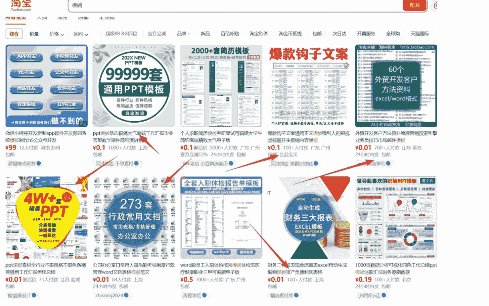

相当于是杂货铺式的铺款！！！

刚开始做的时候，我的想法很简单，根据小红书平台的用户属性来做。

下方这种店，就是杂货铺式的，整个店什么都卖：广播剧，计算机，教程，管理资料等等。。。

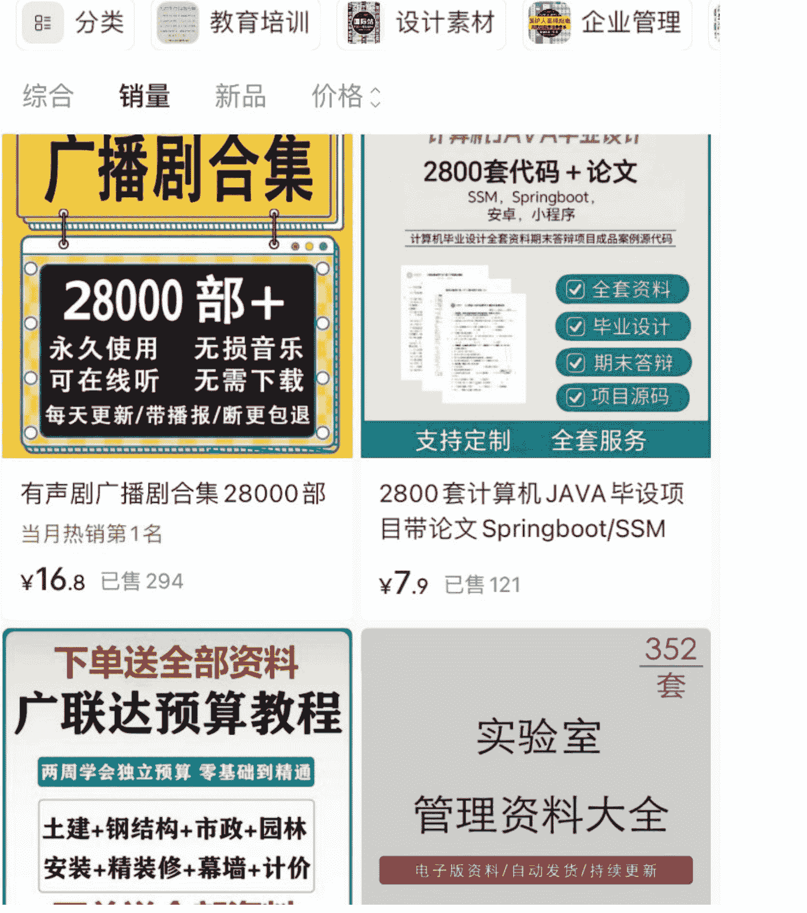

但是后来，做着做着，随着时间的推移，发现再这么干就不行了，卖这些虚拟品的人太多了。

这样，就导致了在选品端，如果还是，按照之前杂货铺式选品的做法，不好拿结果了。

后来，我在想做杂货铺式的选品铺货不行，那能不能，就按市面上的垂直化选品去做。

## 2.纯垂直化选品

什么是纯垂直？

大家都知道，小红书上的人群年轻人居多，如果你是个学生或者求职的，肯定需要表格模板等资料。

下方这种店，整个店只卖 PPT 和简历，这个就是垂直。

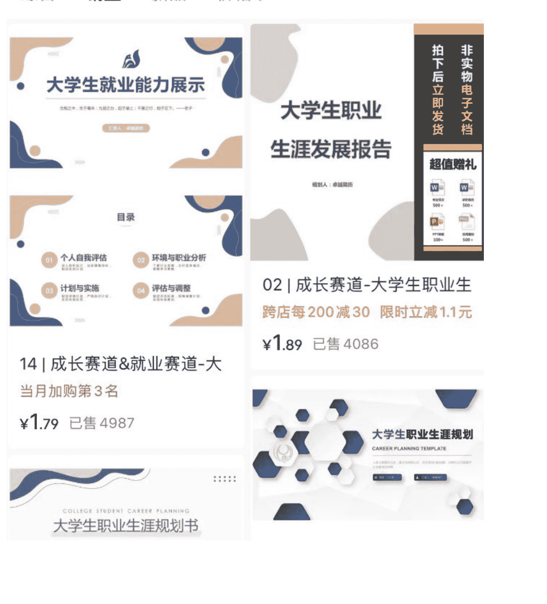

于是，我就从工作室里抽调 2 个人专门开了 4 个店，去垂直选品。

首先，确定做的是 2 个领域，一个是教师类，一个是行政类。

也是每个店精挑喜欢了 10 个款，每天每个店发 5 篇笔记。发了 10 来天，发现还是没有成交。

于是，我让他们坚持再做半个月，发现还是很难出单。

每篇笔记，都是让他们模仿爆款笔记拆解出来的，爆款的封面，还有爆款的笔记内容。

就这样，让这 1 个小兄弟，1 个美女做了 1 个月，看成交数据，真的是一言难尽。

截图如下，半个月只有 670 元，这个肯定是很难的。

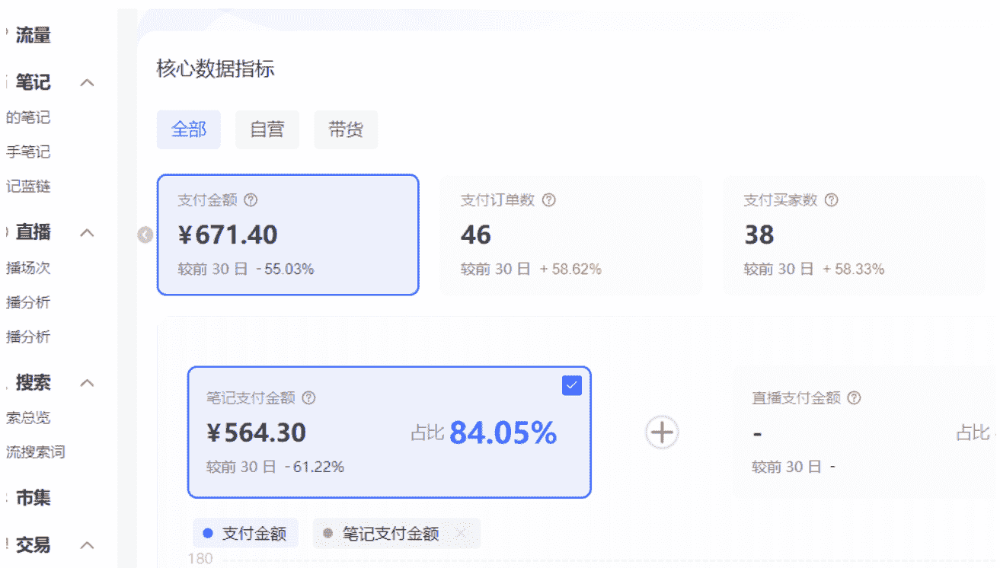

后来，跟工作室的几个有经验的小伙伴，一起探讨了下。

总结出了之所以纯垂直化选品去操作，出单难得原因有几个：
- 1.纯垂直化选品，品少，能上的链接少。
- 2.纯垂直化选品，竞争非常大，同行链接多。
- 3.纯垂直化选品，同质化非常严重，很难做出差异化。

再回想，为什么当初我们杂货铺式选品，一个店铺 500 个品，为啥能出单容易。

是因为，里面会有很多竞争小，同行少的品，所以出单容易。

而纯垂直化选品，随便一个品，老的爆款笔记和新上的笔记，每天乌央乌央的多。

比如，下方截图的这样的类。

你若也是一股脑扎进去，卖纯垂直的 PPT 模板啊，简历啊等，你看看别人的这些排名靠前的笔记数据，你竞争不过的。

还有每天非常多的人，又发了非常多的新笔记。

除非你新发的笔记，有什么过人之处，或者你的款销量比别人高。

对于新手，新店，新踏入做小红书虚拟的人来说，是非常不友好的，这个是很难的。

后来，我想，再这么做下去，肯定是很难有大结果的。

## 3.半垂直化选品

既然 500 个品杂货铺式的不行，10 个纯垂直化选品的也不行。

那能不能取个中间值，我就一个店选 100 个半垂直化品。

于是，我就把这 4 个纯垂直化的测试的店，换个思路：

让他们把行政类的店，再加上财务类，人事类，运营类，企业类等等。

这一拓展，思路一下子就打开了：

一个店由原来的一个人群，现在是一类人群。

一个店就围绕一类人群去布局，这个店选品拓展后，围绕的都是“办公室白领”类的。

然后，就让小伙伴们测试下这个玩法，果然，效果出奇的好。

下面这个刚做的店，就是这么做的，某天来了个小爆发。

## 而且看曲线可以看到，是个增长的趋势。
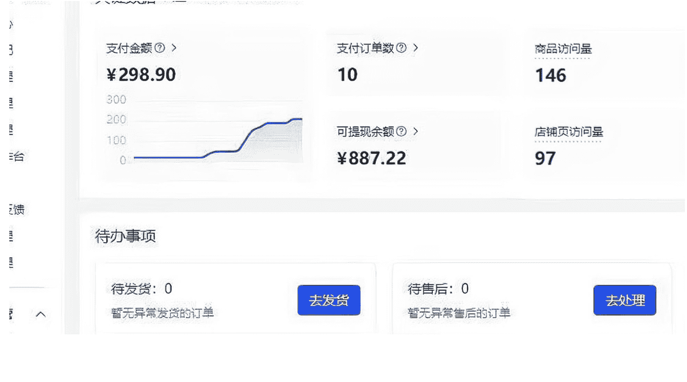

这样，一个店要想覆盖100个品，是轻而易举的，这样可操作的空间就大了，会错开很多同行的竞争。

同时0销量，0评价，0评论情况下能出单的款，会多很多。

后来，我迎着这思路，又用到了现在市面上非常火热的AI。

原创研发了一个“AI+半垂直化选品”的新打法。

## 4.AI+半垂直化选品

我给大家拆解下：用AI去半垂直化选品。

这个是之前，没有跟大家分享的，后来我们自己在操作的过程中，会用到。

假设：你是做考试方向的。

整理下国家官网，发布的80个类目的考试时间（如下），对比下AI给出的时间是否正确和匹配。

### 80个考证时间表
- 证书大全
- 转行就业
- 副业吃香

| 序号 | 证书名称 | 报名时间 | 考试时间 | 报名方式 |
|---|---|---|---|---|
| 1 | 教资 | 笔试1月；面试4月 | 笔试3、9月；面试5、12月 | 中小学教师资格考试 |
| 2 | 公务员省考 | 2~3月 | 3~4月 | 当地人事考试网报名 |
| 3 | 公务员国考 | 10月 | 11月 | 国家工务局 |
| 4 | 自考 | 12、3、6、9月 | 4、10月 | 中国教育考试院 |
| 5 | 特岗教师 | 6月 | 一般在6月 | 当地教育局官网 |
| 6 | 研究生考试 | 9~12月 | 初试：12月；复试：次年2~3月 | 中国研究生招生信息网 |
| 7 | 健康管理师 | 随时 | 3、6、9、12月 | 正规机构报名，暂不能个人报名 |
| 8 | 公共营养师 | 随时 | 3、6、9、12月 | 正规机构报名，暂不能个人报名 |
| 9 | 心理咨询师 | 随时 | 5、11月 | 正规机构报名，暂不能个人报名 |
| 10 | 普通话 | 根据当地考点 | 根据当地考点 | 国家普通话水平测试在线报名系统 |
| 11 | 计算机二级 | 2~3、6~9月 | 3、9月 | 全国计算机等级考试 |
| 12 | 全媒体运营师 | 随时 | 每月2次 | 正规机构报名，暂不能个人报名 |
| 13 | 初级会计师 | 1月5日~1月26日 | 5月18~22日 | 全国会计资格评价网 |
| 14 | 中级会计师 | 6月12日至7月2日 | 9月7日至9日 | 全国会计资格评价网 |
| 15 | 高级会计师 | 1月5日至1月26日 | 5月18日（各省有异） | 全国会计资格评价网 |
| 16 | 注册会计师 | 4月 | 8月 | 注册会计师全国统一考试网 |
| 17 | 期货从业资格证 | 考前一个月左右 | 5、9、11月 | 中国人事考试网 |
| 18 | 银行从业资格证 | 预计3、8月 | 预计5、9月 | 中国银行协会 |
| 19 | 证券从业资格证 | 6、10月 | 6月 | 中国人事考试网 |
| 20 | 法律职业资格证 | 预计6、9月 | 预计9月客观题10月主观题 | 中国人民共和国司法部 |
| 21 | 金融分析师 | 2月2日~5月9日 | 2、5、8、11月 | CFA Institute |
| 22 | 国际注册内部审计师CIA | 2、5、8、11 | 3、6、9、12 | 中国内部设计协会 |
| 23 | 社会工作者职业资格 | 3月 | 6月 | 中国人事考试网 |
| 24 | 演出经纪人员资格 | 3月 | 5月 | 中国人事考试网 |
| 25 | 基金从业资格证 | 考前一个月左右 | 5、11月 | 中国人事考试网 |
| 26 | 消防设施操作员 | 随时 | 3、6、9、12月 | 通过正规机构报名 |
| 27 | 陪诊师 | 随时 | 统一组织考试 | 通过正规机构报名 |
| 28 | 中医师承 | 3~4月 | 各省不一样 | 通过正规机构报名 |
| 29 | 英语四/六级 | 3、9月 | 笔试：6、12月 口试：5、11月 | 全国大学英语四、六级考试 |
| 30 | 英语专四TEM4 | 以考点院校为准 | 6月16日 | 全国高等学校英语专四、八级考试 |
| 31 | 英语专八TEM8 | 以考点院校为准 | 4月13日 | 全国高等学校英语专四、八级考试 |
| 32 | BEC商务英语考试（初级） | 1月 | 5月12日 | 中国教育考试网 |
| 33 | BEC商务英语考试（中级） | 1月 | 5月18日 | 中国教育考试网 |
| 34 | BEC商务英语考试（高级） | 1月 | 5月25日 | 中国教育考试网 |
| 35 | 翻译资格证-CATTI | 根据官网 | 10月26、27日 | 中国教育考试网 |
| 36 | 网络视听主播 | 随时 | 每月都有 | 通过正规机构报名 |
| 37 | 播音主持证 | 8月 | 9月 | 中国人事考试网 |
| 38 | 成考 | 8、9月 | 10月 | 中国教育考试网 |
| 39 | 托福 | 1~12月 | 1~12月 | ETS |
| 40 | 雅思 | 1~12月 | 1~12月 | IELTS |
| 41 | 中医康复理疗师 | 每月 | 每月底 | 通过机构报名 |
| 42 | 妇幼保健员 | 随时 | 3、6、9、12月 | 通过机构报名 |
| 43 | 人力资源管理师 | 7-8月 | 11月 | 中国人事考试网 |
| 44 | 产后修复师 | 随时 | 3、6、9、12月 | 通过机构报名 |
| 45 | 消防设施操作员 | 随时 | 3、6、9、12月 | 通过机构报名 |
| 46 | 园长证 | 随时 | 学满课程进度的80% | 通过机构报名 |
| 47 | 陪诊师 | 随时 | 统一组织考试 | 通过机构报名 |
| 48 | 统计 | 8月 | 10月 | 中国人事考试网 |
| 49 | 出版 | 7-8月 | 10月 | 中国人事考试网 |
| 50 | 审计师 | 7月 | 9月 | 中国人事考试网 |
| 51 | 资产评估师 | 3-5月 | 9月 | 中国资产评估协会 |
| 52 | 税务师 | 5、7、8月 | 11月 | 中国人事考试网 |
| 53 | 医师资格考试 | 1月22日-2月4日 | 6月15~26日 | 国家医学考试网 |
| 54 | 执业兽医 | 1月22-2月22日 | 7月14日 | 中国人事考试网 |
| 55 | 执业药师 | 7~8月 | 10月 | 中国人事考试网 |
| 56 | 软考/信息处理技术员 | 3~4月，8~9月 | 5、11月 | 中国计算机技术职业资格网 |
| 57 | 二级建造师 | 3月 | 5月 | 当地人事考试网 |
| 58 | 二级造价师 | 预计考前2个月 | 预计3、4、8、9月 | 中国人事考试网 |
| 59 | 一级建造师 | 7月 | 9月 | 中国人事考试网 |
| 60 | 一级注册消防工程师 | 8~9月 | 10~11月 | 中国人事考试网 |
| 61 | 注册城乡规划师 | 6、7月 | 9月 | 中国人事考试网 |
| 62 | 一级造价师 | 8月 | 10月 | 中国人事考试网 |
| 63 | 拍卖师 | 6-7月 | 笔试7月；实操8月 | 中国注册会计师协会 |
| 64 | 韩语能力考试 | 1月 | 4月14日 | 韩国语能力考试 |
| 65 | 护士执业资格 | 1-2月 | 4月 | 中国人事考试网 |
| 66 | 通信 | 7月 | 10月 | 中国人事考试网 |
| 67 | 监理工程师 | 2~3月 | 5月 | 中国人事考试网 |
| 68 | 环境影响评价工程师 | 2-4月 | 5月 | 中国人事考试网 |
| 69 | 不动产等级代理人 | 4-5月 | 6月 | 中国人事考试网 |
| 70 | 韩语能力考试 | 1月 | 4月14日 | 韩国语能力考试 |
| 71 | 日本语能力测试JLPT | 预计3、8月 | 7月、12月 | 日本语能力测试 |
| 72 | 国际中文教师证书（CTCSOL） | 笔试3、8月；面试5、6、10、11月 | 笔试4、9月；7、12月 | CTCSOL |
| 73 | 国际英语教师证书 | 1、9月 | 3、6、9、12月 | 国际英语教师资格证书官网 |
| 74 | 文物保护工程从业资格 | 根据官网 | 9月 | 中国人事考试网 |
| 75 | 注册验船师 | 6月 | 9月 | 中国人事考试网 |
| 76 | 注册测绘师 | 7月 | 9月 | 中国人事考试网 |
| 77 | 勘察设计注册工程师 | 8月 | 11月 | 住房和城乡建设部执业资格注册中心 |
| 78 | 精算师 | 2月 | 10月 | 中国人事考试网 |
| 79 | 新闻记者资格证 | 7月 | 11月 | 中国人事考试网 |
| 80 | 导游证 | 6、7月 | 11月 | 中国人事考试网 |

你可以问 AI：每年每个领域什么时候考试（如下）。

### 提示词（截图的箭头所指部分），你们可以模仿我：

我是一名小红书上卖虚拟品资料的店主，我现在想卖考证方向的虚拟品，但是不知道当前卖哪个考证方向是最好的时间，请帮我列出最火的考的是什么证。

以下是中国热门证书的全年考试时间汇总，以及11月最适合售卖的考证资料推荐（结合考试节点、备考周期、小红书用户需求），方便直接对接售卖场景：

一、中国热门证书全年考试时间（按月份整理）
| 月份 | 核心考试证书 | 备注（报名/考试关键信息） |
|---|---|---|
| 1月 | 教师资格证笔试（部分批次）、CDA数据分析师（机考） | 教资笔试报名前1个月启动（11月报名次年1月考试） |
| 2月 | CFA一级（特许金融分析师） | 需提前6个月报名，应届生可考 |
| 3月 | 计算机等级考试（NCRE）、教师资格证笔试、证券从业资格证 | 教资笔试报名截止1月15日，计算机二级报考热度最高 |
| 4月 | 咨询工程师、房地产经纪人、注册建筑师 | 均为行业准入类证书，备考周期2-3个月 |
| 5月 | 软考（中级/高级）、BEC商务英语（中高级）、演出经纪人资格证、初级会计师、护士执业资格 | 软考每年2次（5月/11月），BEC新增跨境电商题型 |
| 6月 | 银行业专业人员职业资格、注册计量师、证券从业资格证 | 银行从业为金融从业者刚需证书 |
| 7月 | CDA数据分析师（Level 1） | 考前7天截止报名，机考随报随考 |
| 8月 | CFA一级 | 全年4次考试节点之一，金融圈备考高峰 |

AI会非常详细给出，每年几月份是什么证的时间。

那么，就可以在这个领域的前几个月内，专门做这个领域。

有市场就会有需求！

甚至，AI还会告诉你，小红书文案的话术（如下），是非常详细的。

## 二、11月最适合售卖的考证资料（优先级排序）

- 1. 即时考试冲刺类（11月内开考，刚需性最强）
- 核心证书：翻译专业资格（11月3-4日）、软考（11月4日）、BEC商务英语（11月第三周周末）、CFA一级（11月机考）、证券从业资格证（11月统考）
- 售卖资料类型：
  - 翻译专业资格：真题解析（近3年）、高频词汇手册、口译/笔译冲刺模板、阅卷评分标准
  - 软考（系统集成/网络工程师）：考前押题卷、考点速记手册、案例分析答题技巧、公式汇总思维导图
  - BEC商务英语：新增“跨境电商直播”题型专项训练、听力高频场景素材、写作模板（邮件/报告类）
  - CFA一级：核心公式手册、道德科目必背考点、定量分析高频错题集、机考答题技巧
- 小红书文案卖点：“11月最后1次考试！3天冲刺提分+押题命中率80%”“软考中级押题卷，去年500+人靠它通关”

- 2. 年底收尾备考类（11月备考，12月考试）
- 核心证书：教师资格证面试、四六级、CDA数据分析师（12月机考）
- 售卖资料类型：
  - 教资面试：各学段（幼/小/初/高）试讲教案模板、结构化问答100题（含时政类）、板书设计范例
  - 四六级：口语专项训练素材（2025年口语纳入简历评估）、作文万能句型、听力精听真题+解析
  - CDA数据分析师：Level1入门题库、Python/SQL实操案例、可视化工具快速上手教程
- 小红书文案卖点：“教资面试7天拿证攻略！结构化问答直接背答案”“四六级口语提分秘籍，附考官评分标准”

- 3. 明年备考启动类（11月预热，明年3-5月考试）
- 核心证书：教师资格证笔试（明年3月）、计算机二级（明年3月）、证券从业资格证（明年3月）、初级会计师（明年5月）

如果你是做小吃配方领域的，你可以让AI帮你列出相关的虚拟词。

想要多少，你就说要多少，比如你让它列出300个（如下）：

> 我是一名小红书上卖虚拟品资料的店主，我现在想卖小吃配方虚拟品类，帮我列出300个小吃配方领域的虚拟词。

以下是300个小吃配方领域的虚拟词，按“地域特色、热门品类、制作工艺、风味口感、场景适配”五大维度分类，适配小红书售卖场景，方便搭配文案引流：

## 一、地域特色类（60个）

- 1. 武汉热干面配方 2. 兰州牛肉面汤底秘方 3. 广西螺蛳粉调料配比 4. 重庆酸辣粉核心配方 5. 陕西肉夹馍腊汁配方 6. 天津煎饼果子面糊秘方 7. 上海小笼包馅料配方 8. 北京烤鸭脆皮秘诀 9. 西安羊肉泡馍汤底配方 10. 顺德双皮奶教程 11. 贵阳豆腐圆子配方 12. 潮汕肠粉酱汁秘方 13. 四川麻辣烫底料配方 14. 云南过桥米线汤底 15. 广东早茶虾饺配方 16. 湖南臭豆腐卤水配方 17. 河南胡辣汤配料表 18. 山东杂粮煎饼配方 19. 浙江葱包桧做法 20. 福建沙茶面调料 21. 江西瓦罐汤配方 22. 安徽板面酱料秘方 23. 江苏鸭血粉丝汤汤底 24. 山西刀削面卤汁配方 25. 河北驴肉火烧酱料 26. 海南清补凉配方 27. 新疆烤包子馅料 28. 内蒙手把肉蘸料 29. 辽宁烤冷面酱料 30. 黑龙江烤红肠配方 31. 吉林朝鲜冷面汤底 32. 贵州丝娃娃蘸水 33. 云南鲜花饼酥皮配方 34. 广东钵仔糕教程 35. 台湾蚵仔煎面糊 36. 香港鱼蛋咖喱酱 37. 澳门猪扒包酱料 38. 四川凉糕红糖水配方 39. 湖北潜江小龙虾调料 40. 湖南酱板鸭配方 41. 江西炒粉酱料 42. 山东把子肉卤汁 43. 河南烩面汤底秘方 44. 陕西油泼面辣子配方 45. 甘肃酿皮子调料 46. 青海酸奶甜醅配方 47. 宁夏手抓羊肉调料 48. 西藏酥油茶配方 49. 广西老友粉汤底 50. 广东肠粉米浆配方 51. 福建肉燕皮做法 52. 浙江汤圆馅料 53. 江苏梅花糕配方 54. 安徽黄山烧饼酥皮 55. 河北缸炉烧饼配方 56. 山西碗托调料 57. 辽宁海城馅饼馅料 58. 黑龙江炸糖糕配方 59. 吉林打糕蘸料 60. 云南昭通小肉串腌料

## 二、热门品类类（80个）

### （一）主食类

- 61. 鸡蛋灌饼面糊配方 62. 手抓饼酥油秘方 63. 酱香饼酱料配方 64. 掉渣饼馅料教程 65. 杂粮煎饼果子配方 66. 卷饼酱料秘方 67. 墨西哥卷饼皮做法 68. 凉皮调料水配方 69. 凉面酱汁秘方 70. 炒河粉酱料配方 71. 炒米粉调料 72. 螺蛳粉干捞做法 73. 过桥米线配菜腌制 74. 酸辣粉粉条泡发技巧 75. 热干面芝麻酱调配 76. 牛肉面面条制作 77. 杂酱面肉酱配方 78. 担担面调料配比 79. 油泼面辣椒面选择 80. 臊子面臊子做法 81. 裤带面和面配方 82. 刀削面面团调制 83. 烩面坯制作教程 84. 板面面条配方 85. 饸饹面汤底秘方 86. 猫耳朵面做法 87. 揪面片和面技巧 88. 炒饼丝酱料 89. 焖饼调料配方 90. 炒饼子面糊 91. 烤冷面酱料秘方 92. 鸡蛋饼配方 93. 葱花饼酥层做法 94. 千层饼油酥配方 95. 老婆饼酥皮教程 96. 老公饼馅料配方 97. 麻酱饼酱料 98. 椒盐饼调味 99. 糖饼和面比例

然后，针对它给你的这些具体的虚拟词，去找很多的品。比如淘宝上，搜AI给出的虚拟词：武汉热干面配方

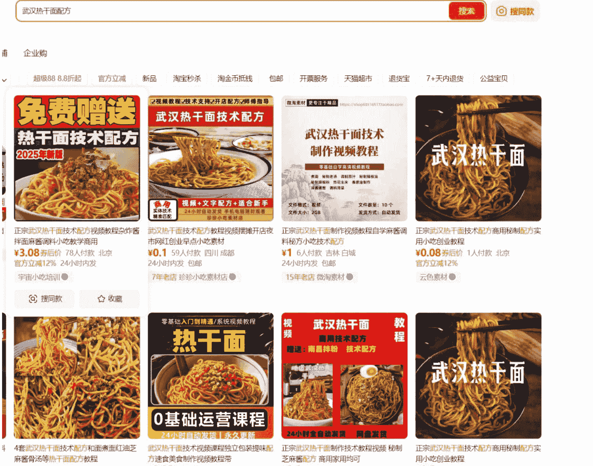

这大把的小吃配方类的虚拟资产品，不就来了吗。

然后围绕“小吃配方”类，不断地去找品，可以找到很多，上到自己小红书店。

这就是我想给各位表达的，什么叫AI选“半垂直化”品。

总结下：

半垂直化选品，是一个店专门选一类人群的品去做。

不再是原来的范围非常广的杂货铺式，也不是某个人群的纯垂直化，而是拓展到某类人群的半垂直化。

## 再结合 AI 工具的使用，如虎添翼！

# 四、双轨操盘模式

我做小红书虚拟矩阵这个项目，已经快2年多了。关注我的圈友应该知道。

定了要半垂直化选品的路线后，我们就确定了很多大的方向：

- 教育类、教辅类、考试类、资料类、职业类、办公类、设计类、素材类、PPT类、小吃配方类……

其实还有很多非常好的类目，如果你们不会，都可以通过AI去问，会罗列出来。

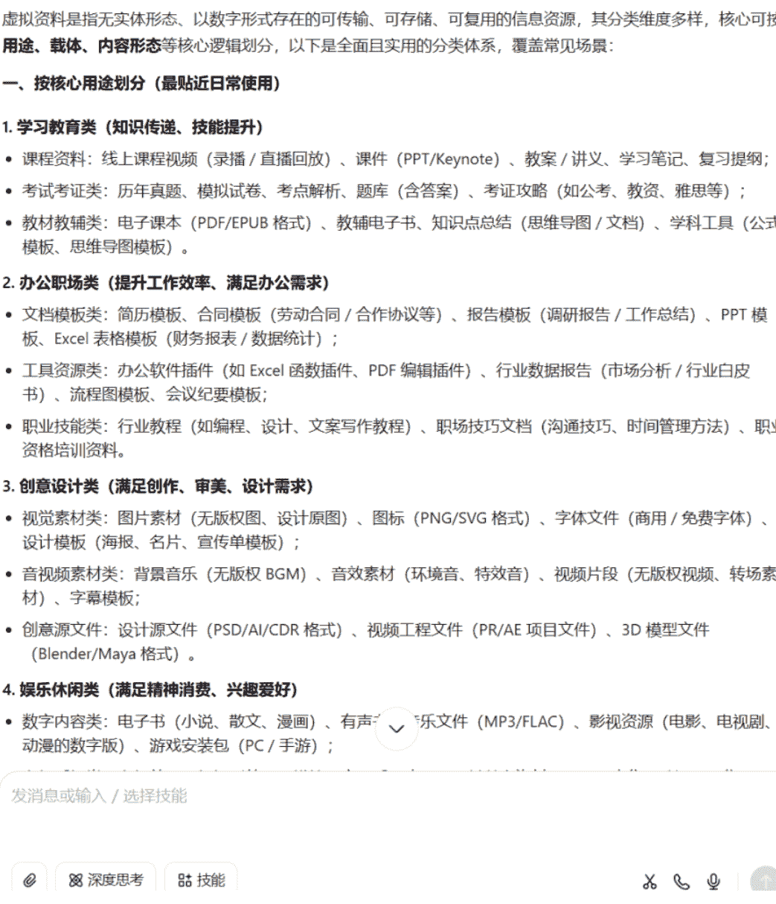

此时，又面临一个问题：

一个店，到底是多上款少发笔记、以款的数量为主好，还是少上款、多发笔记好、以笔记数量为主好。

我相信，各位圈友当你们遇到我当时的困境时，也会有此疑惑。因为市面上也没有人能告诉我们到底哪个模式好。

## 1. 多款少笔记模式

于是，我干脆一不做二不休，既然没有人能告诉我答案，那我就自己去寻找答案。

两个模式同时操作，孰好孰坏，测试后便知！

这种思维，就是测试对比思维。当你不知道两个辣椒，哪个辣哪个不辣的时候，我分别都少买一点，尝试后就知道了。

回想半年前，当时市面上都是按照一个店精挑细选几个款、死怼笔记的做法。

我反其道而行，测试出了我原创的“淘式”小红书虚拟矩阵打法。

于是，过去几个月，我采用双轨模式同步操作，经过大量店铺的实操，拿到了结果。

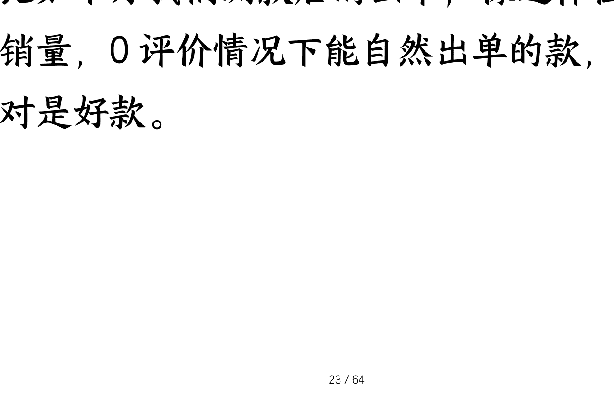

首先开多个小红书店，围绕半垂直化多上款，我们内部叫测款店。

这么做可以解决大家的选品困难症。在测款店1个店上100个左右品的情况下，你还用纠结卖什么的问题吗？

因为品多，所以不用纠结一个品的好与坏！

比如下方我们测款店的出单，像这样在0销量、0评价情况下能自然出单的款，相对是好款。

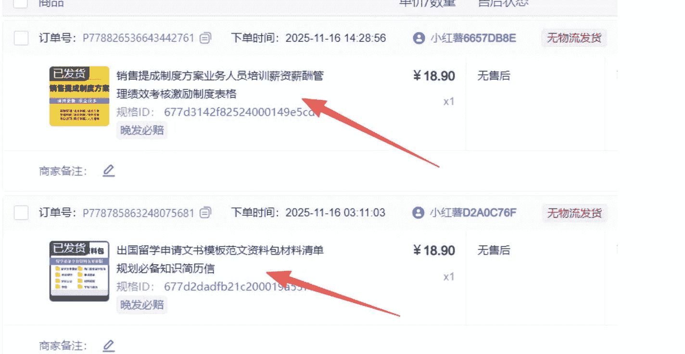

每个店用工具从淘宝上搬100个品，然后每天挑选20个款，用工具去直接生成20个款的20张原创笔记封面，去自动发笔记。

## 2. 少款多笔记模式

5天发完为一轮（如下），一般发的过程中，或者发完两三轮，就会发现有相对数据好的款。

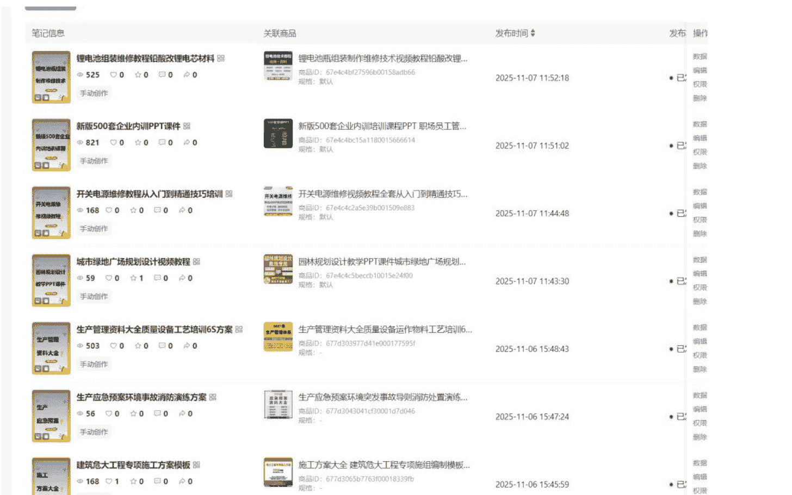

然后，再把测出的好款，重复上到打款店，我们内部叫怼款店。

针对好的款，起步可以先人为地搞几十个销量评价（都是有快速方法的），目的是流量进来后提高转化率。

每天每个款，发1篇高质量的原创笔记，也是用AI工具操作，不需要自己手搓，后面实操演示部分会分享步骤。

如果在怼款店，好的款比较多，没办法每天发1篇，那么可以隔两三天发一篇。

好的款一定要经常发笔记，这样才能薅到小红书的免费流。

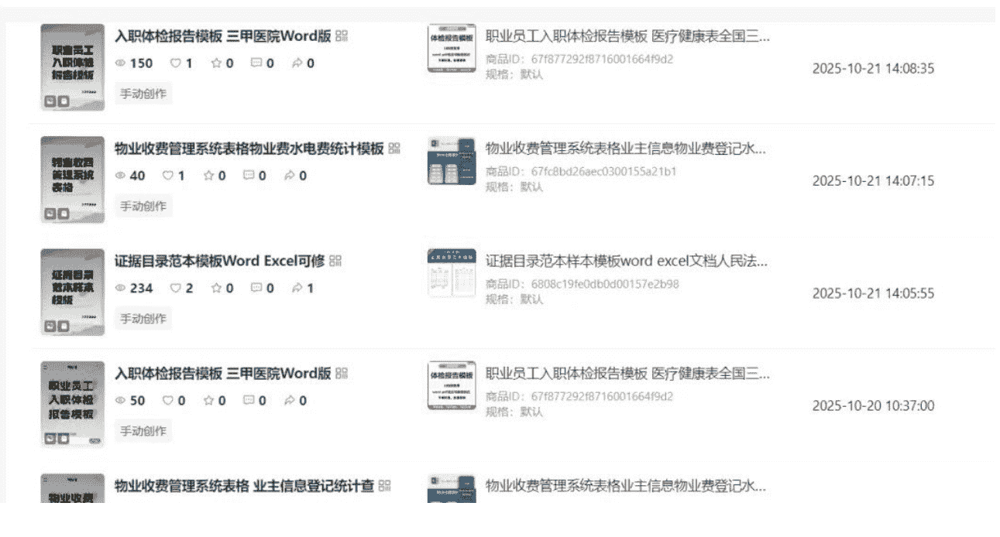

## 3. 双轨模式操作的优势

相信看完操作步骤后，此时一定会有自以为懂行的朋友，会质疑为什么要开个测款店，直接去搞别人店里卖的好的款不就完了。

错。这个思路用电商的行话说，叫“跟款”。

你试想下，你跟的肯定都是销量高的款，要不然你怎么能判断出这个款是好款。

既然别人已经销量高了，你再跟着卖，你起步销量为0，评价为0，笔记评论为0，买家凭什么买你。

我们测款的目的，是为了能找出那些在你的宝贝是3个“0”的情况下还能出单的好款，进行放大。

同时还能卖高价。下方截图是我们一个店每天的到账情况，可以看到是18.9元。之所以每单少了0.21，这是平台的抽点。

18.9，在虚拟资料领域算是高价了。

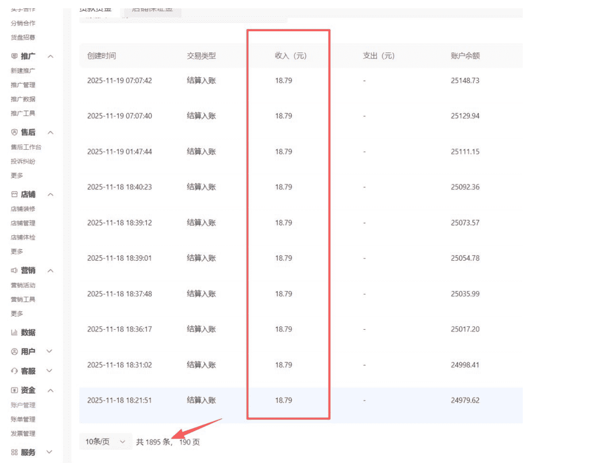

有时候可能你测款店出单容易，因为覆盖的品多。

有可能怼款店出单容易，因为好款发的笔记多。

双模式运作，我表达得可能非常肤浅，但是意思是非常明确的，效果也是非常突出的。

# 五、批量搬款演示

前面我们确定了要双轨模式操作，确定了要半垂直化选品。

接下来就是去选品，然后把款从淘宝批量搬到小红书店。

工具的好坏能非常影响操作这个项目的时间。

一个好的工具能够节省大量的成本，包括人力成本和时间成本。

欲善其事，必先利其器！

### 第1步：下载安装哈士奇插件

这个插件的作用是为了把淘宝上你选好的宝贝的链接提取出来。

下载链接：https://hsq.dangxun.com/

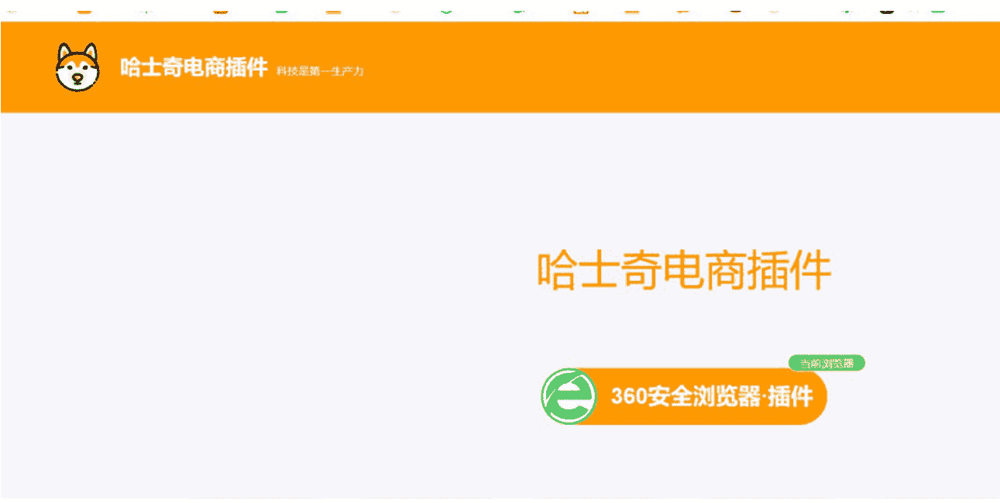

可以根据自己使用的不同浏览器，去下载安装。安装好后，浏览器的右上角就会有一个狗头像出现。

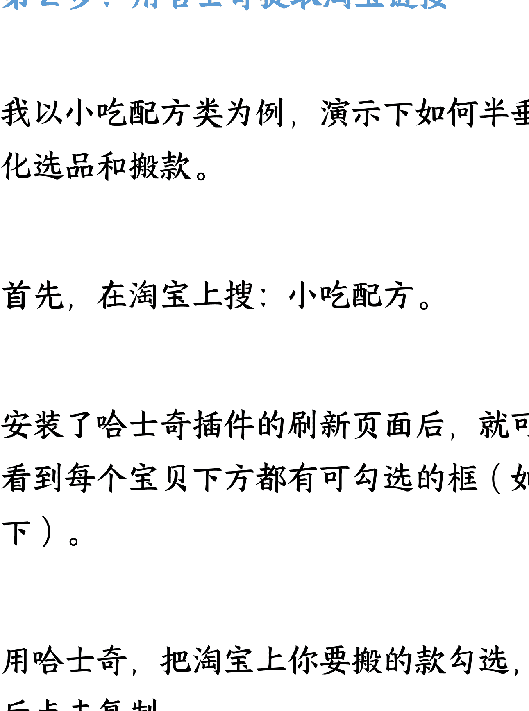

### 第2步：用哈士奇提取淘宝链接

我以小吃配方类为例，演示下如何半垂直化选品和搬款。

首先在淘宝上搜“小吃配方”。

安装哈士奇插件并刷新页面后，就可以看到每个宝贝下方都有可勾选的框（如下）。

用哈士奇把淘宝上你要搬的款勾选，然后点击复制。

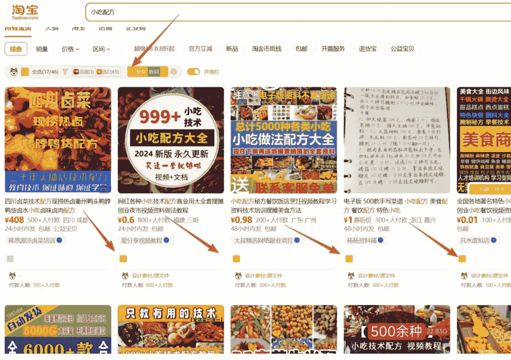

一般我的操作不会直接或者单纯地在淘宝搜索页选择宝贝。

而是点击每个宝贝下方的店铺进到别人店铺里（如下）。因为一般有经验的运营选品时都会有侧重点。

既然一个店铺选了小吃配方类，很大概率他整个店铺都会是这个类目，最起码大部分是。

所以，进到别人店铺后就可以找到很多符合要求的品。

在挑选的时候，有时候会误勾选非小吃配方类的品，或者是卖实物而非电子资料类的品。

还有一些违规的词，比如标题带有某个机构名、某个人名的。

这些都要删除掉。

| A | B | C | D | E |
|---|---|---|---|---|
| https://item.taobao.com/item.htm?id=769221487579 | 网红各种 | 0.6 | 800 | 否 |
| https://item.taobao.com/item.htm?id=951596000403 | 小吃配方 | 0.98 | 200 | 否 |
| https://item.taobao.com/item.htm?id=794949038548 | 电子版 | 1 | 300 | 否 |
| https://item.taobao.com/item.htm?id=902132443033 | 全国各地 | 0.01 | 100 | 否 |
| https://item.taobao.com/item.htm?id=945196840079 | 全新火爆 | 0.93 | 100 | 否 |
| https://item.taobao.com/item.htm?id=943615120277 | 900种小吃 | 0.88 | 48 | 否 |
| https://item.taobao.com/item.htm?id=959162939601 | 28种花生 | 0.23 | 14 | 否 |
| https://item.taobao.com/item.htm?id=859298495125 | 小吃摆摊 | 0.01 | 100 | 否 |
| https://item.taobao.com/item.htm?id=854909493945 | 小吃配方 | 1.5 | 300 | 否 |
| https://item.taobao.com/item.htm?id=859888003046 | 200种包子 | 0.38 | 100 | 否 |
| https://item.taobao.com/item.htm?id=924543594029 | 2025最新 | 0.01 | 25 | 否 |
| https://item.taobao.com/item.htm?id=732709332843 | 懒人焖饭 | 0.03 | 59 | 否 |
| https://item.taobao.com/item.htm?id=691303158501 | 300种街边 | 0.01 | 16 | 否 |

### 第4步：搬款工具的设置

我用过的搬款工具有很多，目前我觉得下面这款工具是比较好用的。

市面上，从淘宝批量搬款到小红书店的工具有很多，你们可以根据自己需要去选择。

为避免打广告的嫌疑，我就不在此具体展示工具名了，以免吃力不讨好。

如果看到这个界面知道是哪款的，你们可以去咸鱼上买，还蛮便宜的。

如果实在不知道，又有需要的，只能来找我分享了。

工具的设置这块，就照我截图这样的起步去设置。

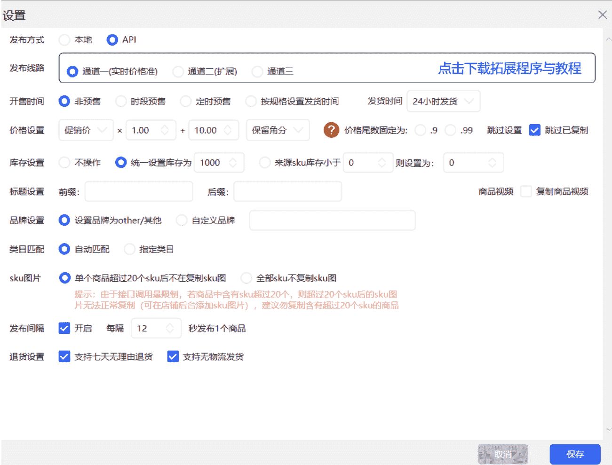

### 第5步：搬款工具的操作

设置好工具后，把表格中复制的淘宝宝贝链接粘贴到搬款工具，点击开始发布。

整个操作流程，非常干净利落和丝滑。

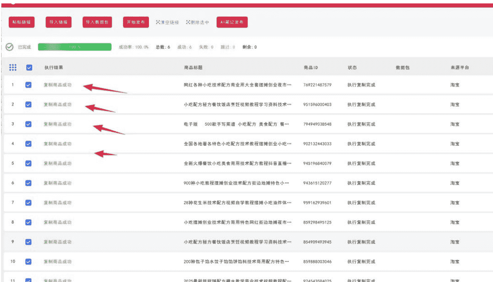

发布的时候还是非常流畅的。当然了，在整个过程中，每个人实际操作的时候，可能会遇到不同的问题。

如果搬款过程中出现下方截图的这个问题：“值不能为 null”，这种情况是因为店铺的教育类没有开通导致的。

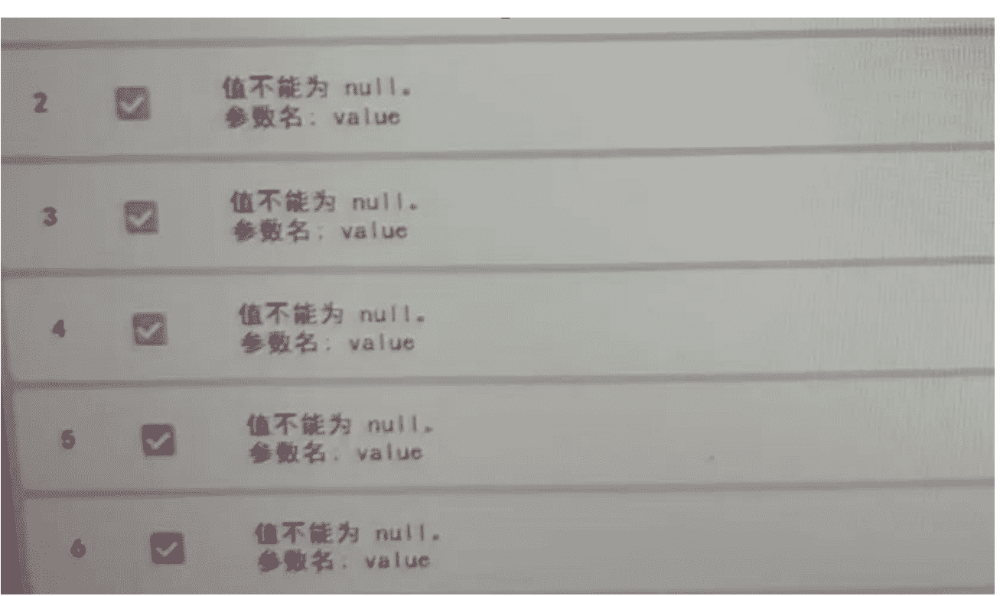

比如出现下方截图的这个问题：“商品已经下架”，其实商品没有下架。

遇到这个问题，就要找工具的客服，要配套的提取宝贝链接的插件。

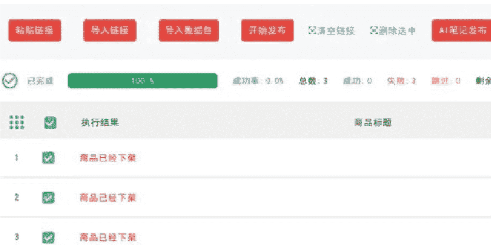

当然了，可能每个人操作的时候还会遇到其他问题。这个不是每个人都能遇到，遇到了可以找我给你们看下。

好用的工具，才能更好、更容易地拿到结果。

# 六、批量做图演示

搬款到小红书店后，接下来就是做笔记的图，要批量做原创封面图。

我们的做法不是去分析同行、拆解爆款笔记封面等。这样太花时间了，也不利于项目的快速、批量、矩阵操作。

因为我们测款店一个店100个品，一天发20篇笔记，每天就要做20张原创封面。

半年前，我们那会做小红书虚拟矩阵的时候，知道这么做的商家不多，笔记的封面，我是直接用淘宝宝贝主图，效果非常好。

但是，现在你如果还在用宝贝的主图作为封面图的话，大部分笔记会提示违规，截图如下：

处置结果
该篇笔记已不可被他人查看
处置时间：2025-11-02 22:33

处置问题
- 1. 涉及直接使用他人的产品/服务实拍图进行营销
- 2. 涉及利用截图、拍屏、录屏他人作品等方式进行营销
- 3. 存在其他平台或作者的内容特征，如：界面、样式、特效、水印信息等内容

甚至推广也不允许，截图如下：

| 创意名称 | 操作 | 创意状态 | 创意审核状态 | 广告类 |
|---|---|---|---|---|
| 商品推广_日常销售_20250630_215... ID: 1705665794 | 编辑 删除 | - | 审核拒绝 查看详情 | 通投 |
| 商品推广_日常销售_20250630_215... ID: 1705665793 | 编辑 删除 | - | 审核拒绝 查看详情 | 通投 |
| ... (多行类似数据) | ... | ... | 审核拒绝 查看详情 | 通投 |

造成以上情况出现的原因是，你用宝贝主图作为笔记封面。

而你上的这些款，前面有很多人都做了，就导致了封面非原创的违规。

所以，笔记的封面图必须得原创！

大量发笔记，要涉及到批量做原创封面图。这个时候肯定不能自己手搓，得用到工具才能提高效率。

那一天发20款笔记，原创图怎么批量做呢？

- 1. 创客贴网站批量做图

网址：

https://www.chuangkit.com/templatecenter

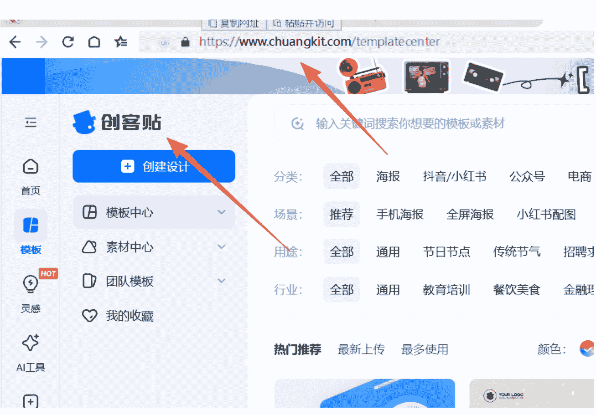

可以任意挑选模板，然后根据自己的笔记需要，修改上面的文字。

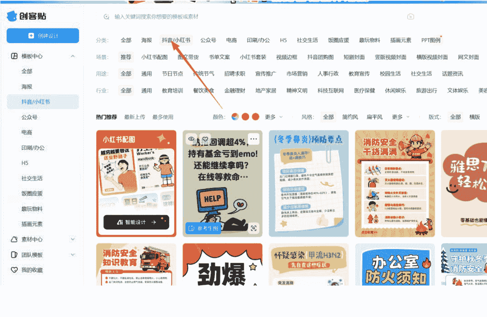

### 也可以批量制作图：点击左侧的AI，再点击“批量设计”

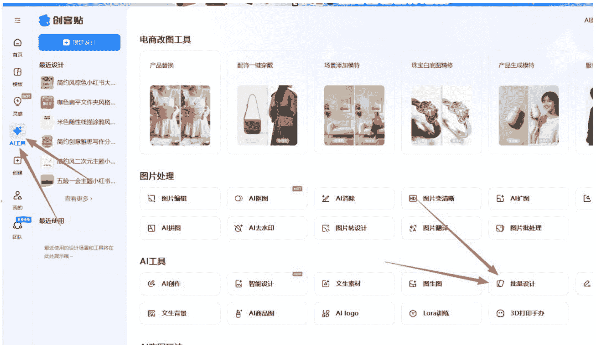

### 然后手动填写笔记的文案等，再批量生成。

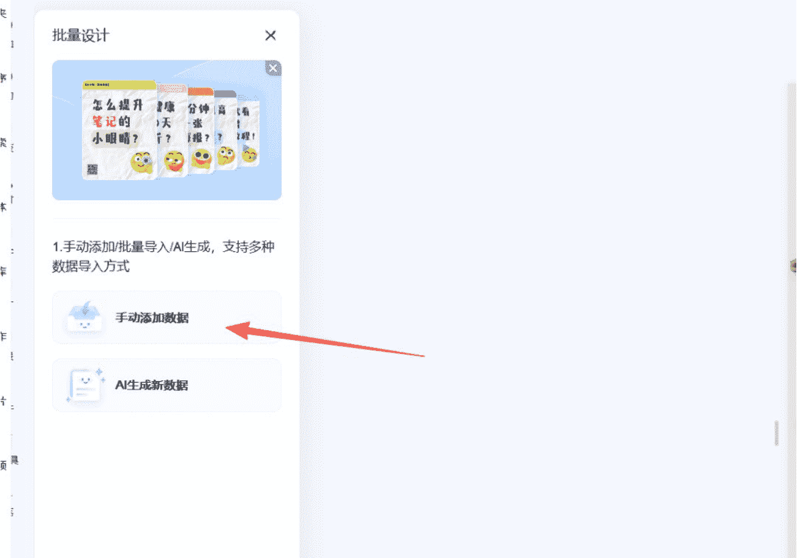

### 市面上的批量做图工具基本上都这样，属于半自动化的，也比较花时间。

这样的做图网站也收费的，你们可以酌情选择。

当然了，相当于你用PS或者美图秀秀，一张张的去做，还是要省时间。

但是，我们毕竟是要批量、大量做原创图的，以上方法还是不能满足我们的要求。

于是，我找会写编程的兄弟，自己研发了一个做图工具，大大提升了效率。

## 2. 我们自己研发的做图工具

这个时候，价值就来了。我们自己内部研发的，批量原创作图工具。

这个批量做图工具的强大，不是市面上那些图文合成工具能比的。

工具展示截图如下:

## 批量制作原创爆款素材

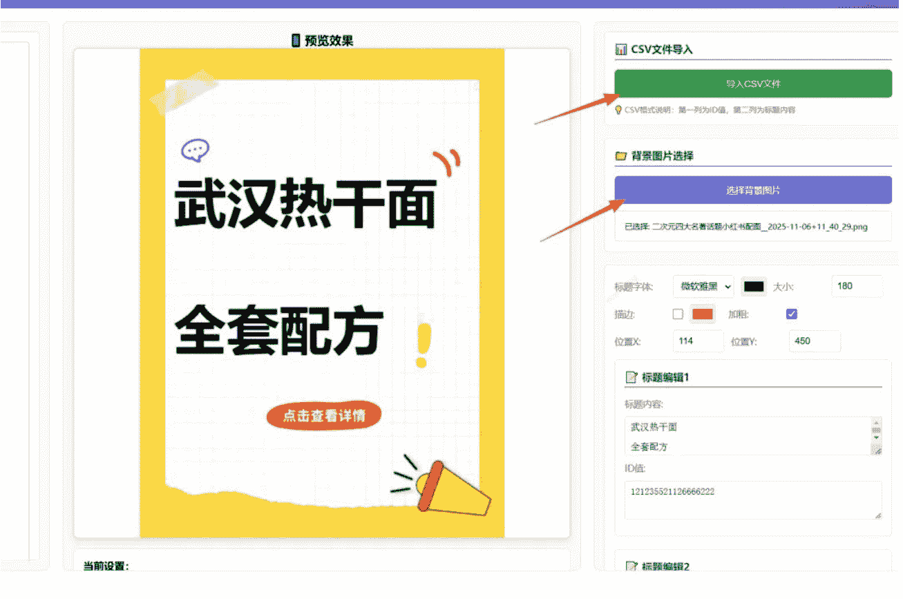

这个工具，就是为这个项目的操作，量身定制的！

可以把店铺里要发笔记的宝贝勾选，然后导出成如下表格。

导出后的表格带有宝贝ID，还有宝贝的核心主词。

| 宝贝id | 标题 |
| :--- | :--- |
| ...cb670015c43cae | 广告传媒 自媒体总结 |
| ...93060015702b39 | 桥梁工程 质量验收记录表格 |
| 677...00157afedf | 幼儿园教师 幼师师徒结对 |
| 6778bccf2b5554...8 | 资金日周报 表现金付款管理 |
| 6778bd480...c8c | 私域话术 朋友圈运营 |
| 6778bcf7cfc...3dde | 电气工程机电 |

## 3. 做图工具批量做图演示

### 第1步：安装我们的插件，勾选店铺里的要发笔记的宝贝。

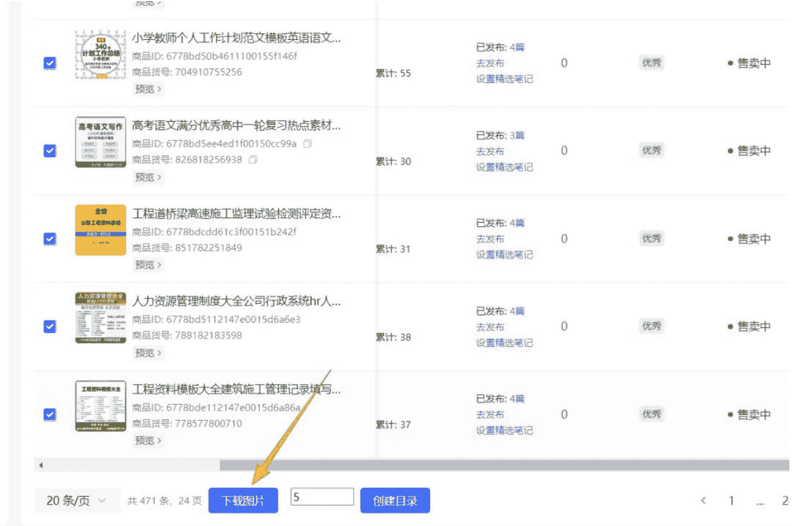

### 第2步：导出以后就会生成一个表格，表格里是宝贝标题，宝贝ID。

| | A | B |
|---|---|---|
| 1 | 宝贝id | 标题 |
| 2 | 6778bc91cfcb670015c43cae | 广告传媒自媒体工作总结计划报告日志周志模板word范文电子版资料 |
| 3 | 6778bcc58e93060015702b39 | 桥梁工程质量验收记录全套表格 桥梁工程检验批 桥梁工程验收资料 |
| 4 | 6778bcab132d2d00157afedf | 幼儿园教师幼师师徒结对活动帮扶工作计划与工作总结范文模板资料 |
| 5 | 6778bccf2b55540015fb11e8 | 资金日周报表现金付款管理预算收支计划平衡表财务excel表格模版 |
| 6 | 6778bd480cf30c0015059c8c | 私域话术微商朋友圈公众号电商社群文案流量引流技巧运营方案大全 |
| 7 | 6778bcf7cfcb670015c43dde | 电气工程机电消防雷配电线路安装施工检验批表格竣工验收报告资料 |
| 8 | 6778bd3dd684d7001536174a | 婚庆公司婚礼策划方案文案音乐图片表格合同创业规划岗位职责大全 |
| 9 | 6778bcfe132d2d00157affaf | 大型建材店经营管理大全 创业规划员工培训营销表格合同方案 |
| 10 | 6778bce5b4611100155f1349 | 小学班主任工作班级管理手册总结资料包主题班会常用表格计划教案 |
| 11 | 6778bd24132d2d00157afffa | 酒店经营资料大全运营管理人员工培训常用表格合同前期筹备营销方案 |
| 12 | 6778bd34a476ce0015df0a3f | 1200套企业连锁加盟经营管理大全 加盟开店运营手册方案资料 |
| 13 | 6778bcf53425c00015f8d001 | 2024养老院等级标准星级评定敬老院老年公寓对应资料制度表格 |
| 14 | 6778bd200a6fff00150f41f0 | 建筑监理工程资料大全监理报告监理规划工作总结实施细则方案 |
| 15 | 6778bcd40a6fff00150f4126 | 短视频拍摄脚本分镜头表模板抖音计划表剧本拉片宣传片策划表格 |
| 16 | 6778bd5ecfcb670015c43ea7 | 钢结构施工组织设计大全工程方案投标 方案 技术标Word文档资 |
| 17 | 6778bd50b4611100155f146f | 小学教师个人工作计划范文模板英语语文数学体育美术老师教学总结 |
| 18 | 6778bdcdd61c3f00151b242f | 工程道桥梁高速施工监理试验检测评定资料员表格模板范本素材 |
| 19 | 6778bd5ee4ed1f00150cc99a | 高考语文满分优秀高中一轮复习热点素材模板范文指导写作文电子版 |
| 20 | 6778bd5112147e0015d6a6e3 | 人力资源管理制度大全公司行政系统hr人事资料包人资表格流程方案 |
| 21 | 6778bde112147e0015d6a86a | 工程资料模板大全建筑施工管理记录填写表格竣工验收监理报告范本 |

### 第3步：选择背景模板

先准备下小红书背景模板（如下），模板的来源有很多地方，比如淘宝上买，小红书上搜，或者前面的创客贴网站下载等等。

再添加一个背景模板进做图工具（如下）

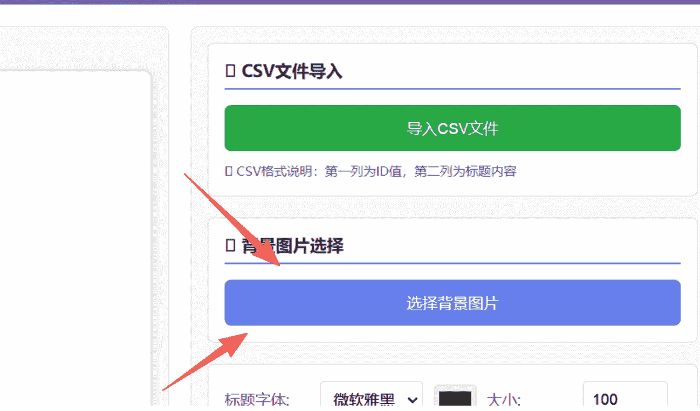

### 第 4 步：导入工具

再把表格导入到做图工具，就可以自动填写每个宝贝的主词+宝贝 ID。

这里可以调整字体的型号，大小，位置，颜色等。

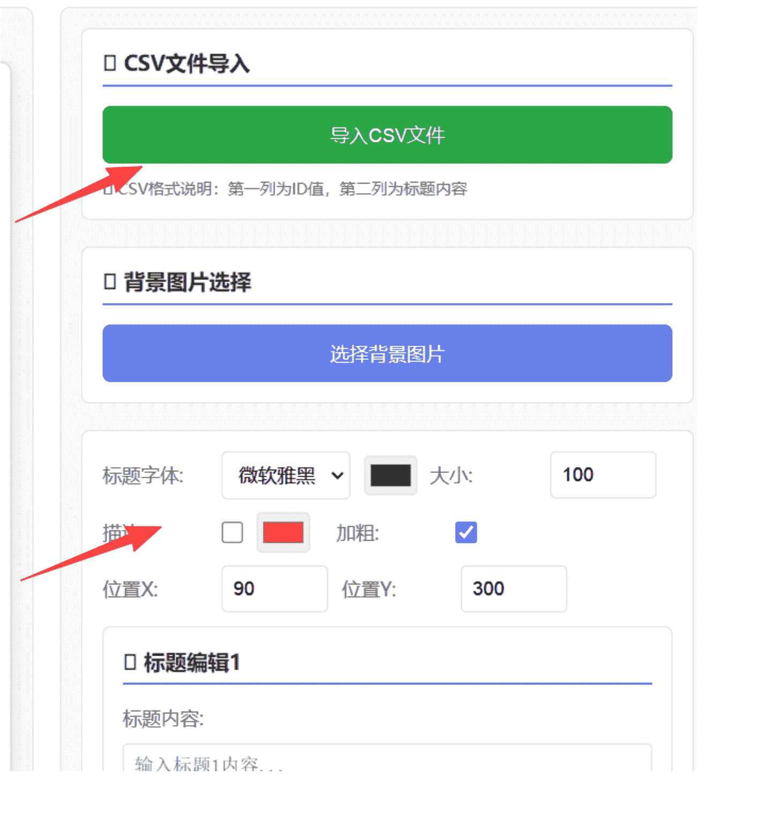

导入模板，导入表格，调整字体颜色大小位置后，成效如下：

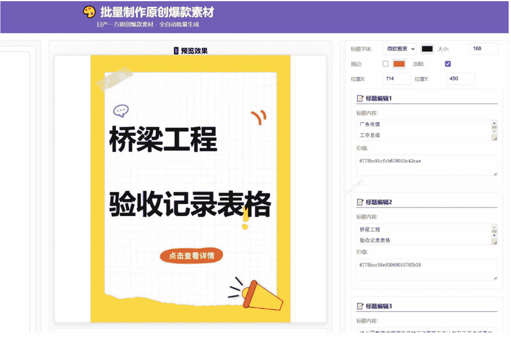

### 第 5 步：批量导出后，每张图都是以每个宝贝的 ID 命名的，这样做出的封面图和宝贝的 ID 是一一对应的。

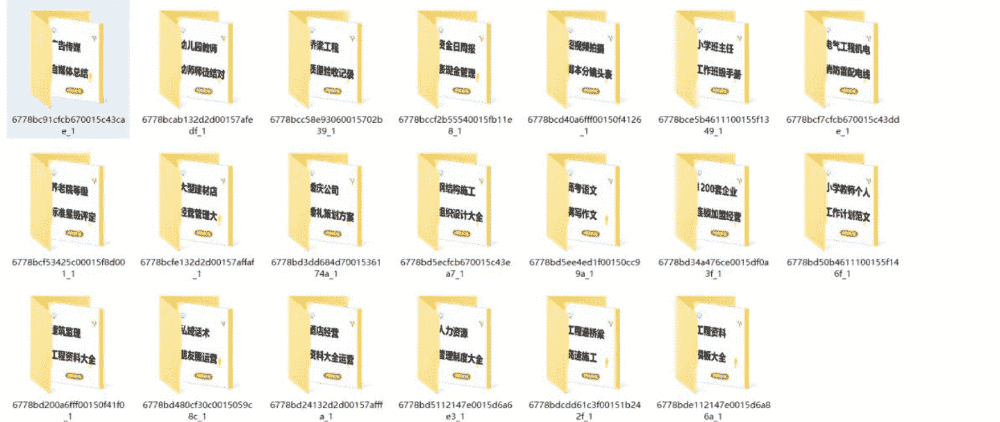

### 第6步：自动发笔记插件，就可以自动调取图和宝贝去AI发笔记了。

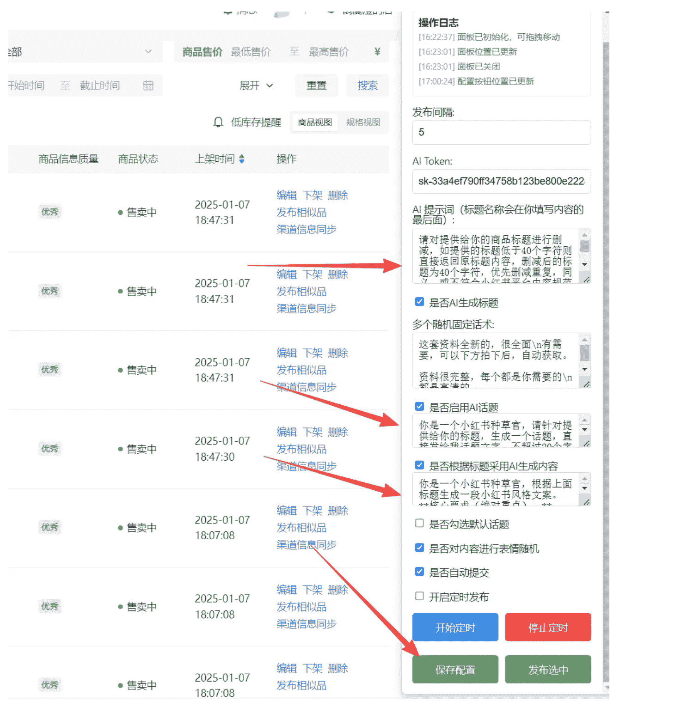

## 4. 优势对比

不会像你们在市面上学到的那种，做完图以后放到表格，或者放到飞书里面，用流程化的东西去调用。

这样做也可以，但是发的笔记多了，就比较费时间，还有一个就是不干净利落。

我们这个做图工具和发笔记工具，两者搭配使用，图和宝贝是一一对应的，不会有偏差。

而且发布的笔记，高度符合小红书数据好的封面，所以拿结果是很明显的。

数据展示如下，每篇笔记的浏览量在 150-500 左右，一天 20 篇。

你们可以细算下，薅多少免费流。

| 笔记信息 | 关联商品 | 发布时间 | 发布 | 操作 |
|---|---|---|---|---|
| 锂电池组装维修教程铅酸改锂电芯材料制作维修技术 | 锂电池组装制作维修技术视频教程铅酸改理... 商品ID:67e4c4bf27596b00158adb66 规格:默认 | 2025-11-07 11:52:18 | 已 | 数据 编辑 权限 删除 |
| 新版500套企业内训PPT课件 手动创作 | 新版500套企业内训培训课程PPT职场员工管... 商品ID:67e4c4bc15a1180015666614 规格:默认 | 2025-11-07 11:51:02 | 已 | 数据 编辑 权限 删除 |
| 开关电源维修教程从入门到精通技巧培训 手动创作 | 开关电源维修视频教程全套从入门到精通技巧... 商品ID:67e4c4c2a5e39b001509e883 规格:默认 | 2025-11-07 11:44:48 | 已 | 数据 编辑 权限 删除 |
| 城市绿地广场规划设计视频教程 园林规划设计 教学PPT课件 手动创作 | 园林规划设计教学PPT课件城市绿地广场规划... 商品ID:67e4c4c5beccb10015e24f00 规格:默认 | 2025-11-07 11:43:30 | 已 | 数据 编辑 权限 删除 |
| 生产管理资料大全质量设备工艺培训6S方案 生产管 资料大全 手动创作 | 生产管理资料大全质量设备运作物料工艺培训6... 商品ID:677d303977d41e000177595f 规格:- | 2025-11-06 15:48:43 | 已 | 数据 编辑 权限 删除 |
| 生产应急预案环境事故消防演练方案 生产 应急预案 手动创作 | 生产应急预案环境突发事件事故则消防处置演练... 商品ID:677d3043041cf30001d7d046 规格:- | 2025-11-06 15:47:24 | 已 | 数据 编辑 权限 删除 |
| 建筑危大工程专项施工方案模板 施工 方案大全 | 施工方案大全建筑危大工程专项施组编制模板... 商品ID:677d3065b7763f00018339fb 规格:- | 2025-11-06 15:45:59 | 已 | 数据 编辑 权限 删除 |

这就像你的苹果手机，后来苹果又出了其他的产品，两者之间是可以联动的，而且效果极佳。

视线调回到半年以前，半年前发布的小红书虚拟矩阵 1.0 技术，当时很多圈友也跟我反馈，确实拿到了非常多的结果，帮助很大。

我印象很深刻的是，有个圈友跟我说，以前是做淘宝的，始终搞不到钱，也找不到突破口。

那天晚上，无意间找突破口的时候，看到了我的那篇实操贴，然后从头到尾的看了好几遍，越看越觉得有搞头。

但是，后来半年当中，发生了很多的变化。

其中一个变化，就是全新工具的使用，能大大提升大家搞钱的效率。

# 七、批量发笔记演示

批量做好原创封面图后，接下来就是发笔记了。

我相信现在应该没有谁，还在自己手动的去写笔记的内容吧。

如果你真的还在手搓笔记，证明你没有跟上 AI 时代的步伐了。

我们也是用的 AI 工具，全自动化 AI 发笔记的。

自动生成笔记内容，自动发布，实现全流程自动化，没有地方需要人手动操作的。

这个工具，也是我自主研发的，市面上买不到。

### 第1步：设置插件

先设置好插件的提示词内容（如下）：

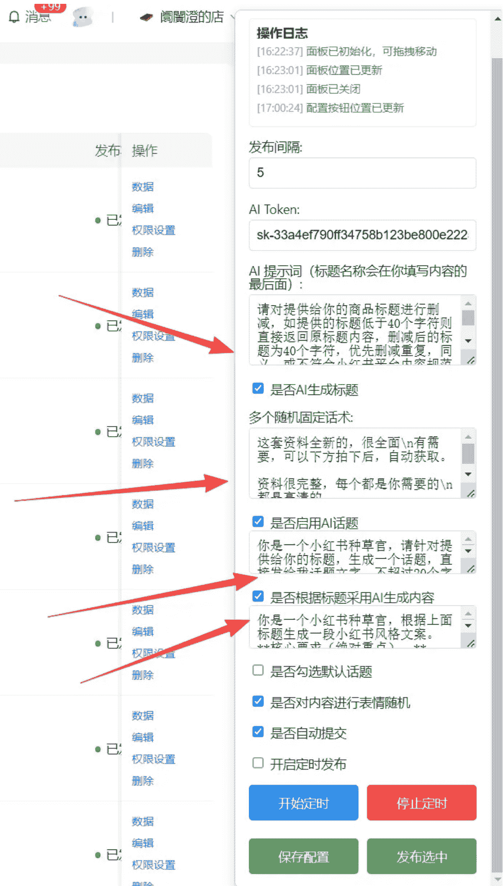

设置好后，全程不需要任何点鼠标的动作，插件就会全自动操作了。

### 第2步：插件调用封面图

插件自动调用做图工具做好的图笔记封面：

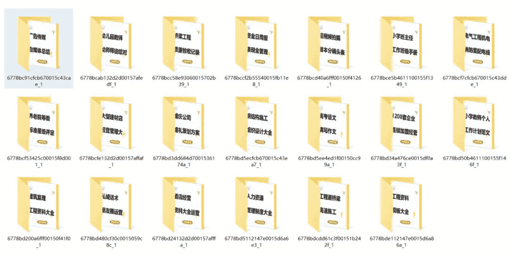

### 第 3 步：智能化标题

插件智能化提取宝贝标题中的 20 个字作为笔记标题：

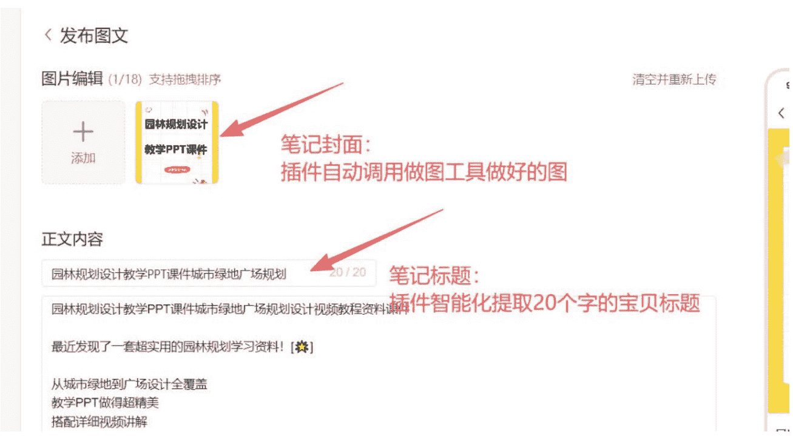

### 第 4 步：AI 内容

插件自动把宝贝全标题放在笔记内容的首行，买家搜索的时候也能搜到，弥补了笔记标题中减少的宝贝标题中的词。

正文部分对接 AI，智能化写出高度符合宝贝的文案，排版工整，表情符号到位。

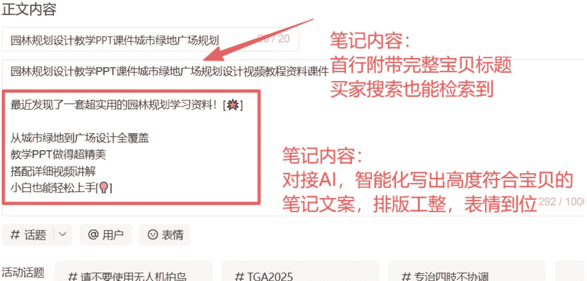

### 第5步：智能化话题

插件根据每个宝贝，自动添加精准话题

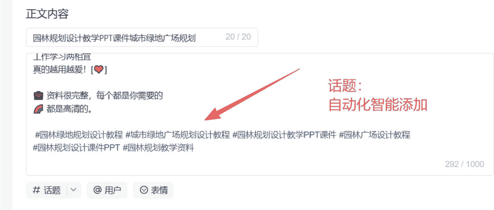

### 第6步：自动发布

插件自动选择笔记对应宝贝，自动发布，同时自动跳转到下一个宝贝，自动循环操作。

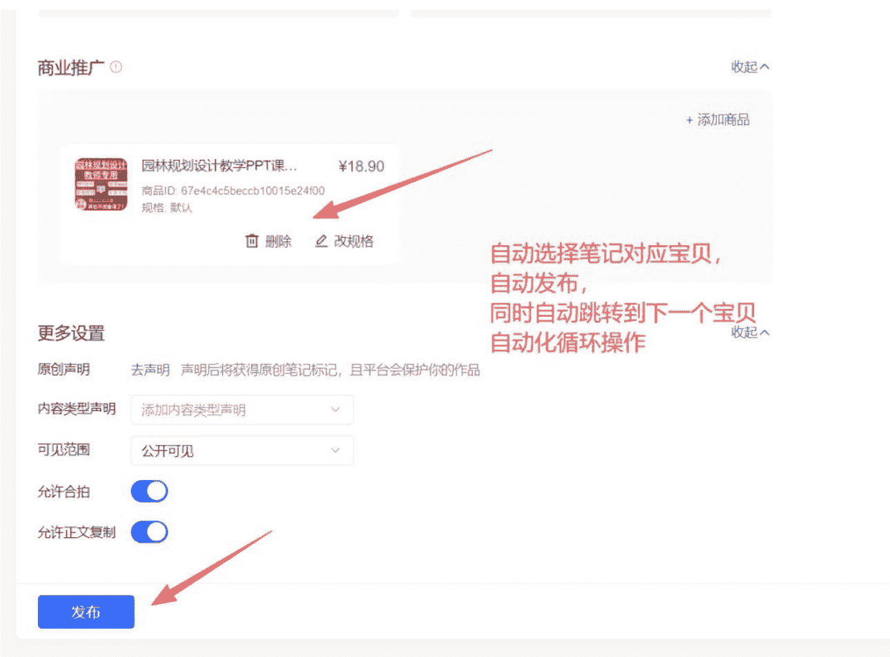

这款我们自主研发的，全自动化 AI 发笔记的插件。

当市面上的培训机构，还在教你们用工作流去调用的时候，我们已经完成了自主研发工具的程度。

市面上也有蛮多，号称自动化发笔记的工具。

他们的会有很多的问题：AI 内容排版不工整，符号乱用，文字叠加在一块，笔记内容和宝贝不相符，不能够自动添加话题，更别谈可以全自动化了。

## 7. 发多了会不会限流？

很多圈友做小红书虚拟店，听别人说笔记不能发太多，会限流之类的。

我告诉你们，纯属扯淡。

给你们截图（如下），我们自己后台发的笔记，每天发 20 篇笔记，也没见有限流的。

| 笔记信息 | 关联商品 | 发布时间 | 发布 | 操作 |
| :--- | :--- | :--- | :--- | :--- |
| 锂电池组装维修教程铅酸改锂电芯材料... 525 0 0 0 0 手动创作 | 锂电池瓶组装制作维修技术视频教程铅酸改锂... 商品ID: 67e4c4bf27596b00158adb66 规格: 默认 | 2025-11-07 11:52:18 | 已发 | 数据编辑权限删除 |
| 新版500套企业内训PPT课件... 821 0 0 0 0 手动创作 | 新版500套企业内训培训课程PPT 职场员工管... 商品ID: 67e4c4bc15a1180015666614 规格: 默认 | 2025-11-07 11:51:02 | 已发 | 数据编辑权限删除 |
| 开关电源维修教程从入门到精通技巧培训... 168 0 0 0 0 手动创作 | 开关电源维修视频教程全套从入门到精通技巧... 商品ID: 67e4c4c2a5e39b001509e883 规格: 默认 | 2025-11-07 11:44:48 | 已发 | 数据编辑权限删除 |
| 城市绿地广场规划设计视频教程... 59 0 1 0 0 手动创作 | 园林规划设计教学PPT课件城市绿地广场规划... 商品ID: 67e4c4c5beccb10015e24f00 规格: 默认 | 2025-11-07 11:43:30 | 已发 | 数据编辑权限删除 |
| 生产管理资料大全质量设备工艺培训6S方案... 503 0 0 0 0 手动创作 | 生产管理资料大全质量设备运作物料工艺培训6... 商品ID: 677d303977d41e000177595f 规格: - | 2025-11-06 15:48:43 | 已发 | 数据编辑权限删除 |
| 生产应急预案环境事故消防演练方案... 56 0 0 0 0 手动创作 | 生产应急预案环境突发事故导则消防处置演练... 商品ID: 677d3043041cf30001d7d046 规格: - | 2025-11-06 15:47:24 | 已发 | 数据编辑权限删除 |
| 建筑危大工程专项施工方案模板... 168 1 0 0 0 方案大全 | 施工方案大全 建筑危大工程专项施组编制模板... 商品ID: 677d3065b7763f00018339fb 规格: - | 2025-11-06 15:45:59 | 已发 | 数据编辑权限 |

### 哪里有限流，什么叫限流。

再换言之，你不这么做，你就老老实实的一天发5个笔记，就能做起来了？

你们没有学我的方法之前，不就是这么干的吗，你们有做起来吗？

没有做起来对吧，所以要打破固有思维，拥抱新方法。

### 不破不立！！

笔记积累多了，权重越高，涵盖的关键词越多，搜索流就越多。

当然了，一天也不能发太多，还是要照顾下官方规定的。

我们测试出来，一个店一天发20篇笔记内是没有多大问题的。

# 八、小红书虚拟店矩阵

方法论跑通后，配套工具也齐了，那么做1个店是做，做3个店，做10个店也是可以一样做。

其实，我实测下来，1个人一天做1个店的时间，和做3个店的时间，相差并没有太大，无非就是一天半小时和1个小时的区别。

做虚拟电商，有个痛点：

一个店一天搞100元很简单，但是一天要搞1000元就有点困难了。

1个店1天能搞大几十或者100，证明0-1的路子已经跑通了。

比如，下方这个店数据，一天能搞个100多，就够了。

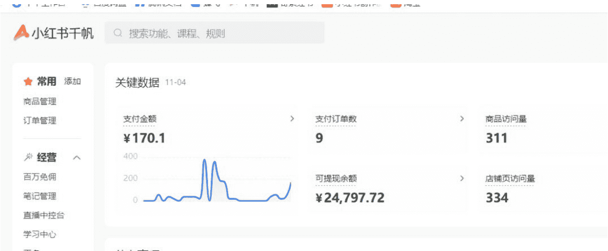

此时，就可以复制方法，多开店了。

这个项目叫小红书虚拟店矩阵，可以像我们这样 3-4 个店为一组。

每个店上 100 个品，每天每个店发 20 篇笔记，矩阵操盘。

你可能会担心手动上款花时间，发 20 篇笔记太花时间，不用担心，我们有工具辅助的！

3 个店，每天每个店盈利 50-200 左右后，再起下一组 3 个店。

如果你们像我们卖 19.9，一天一个店随便随便，成交 10 单就达成目标了。

你们要记住：量变才能质变！

积小流，方成大海！！

切莫小家子气的，一天到晚在那纠结自己一个店的得失好坏，患得患失的。

你开一个店，我们学员同时做 10 个店，谁能容易拿到结果？

有圈友可能会想，我没有那么多身份证开店，如何多开店。

官方规定是1个身份证开1个个人店，或者开很多个体店，这个要去办个体户执照。

当然了，市面上也有资源可以1个身份证，无限开很多个人店，你们可以去市面上找找，未来有机会我再给大家分享一下，不过这都是后话了。

# 九、附带双份收益

以上从选品，上款，到做图和发笔记，做小红书虚拟店矩阵，已经可以是高手中的高手了。

我在操作这个项目的时候，就在想能不能把网盘拉新衔接进去。

以前就知道有网盘拉新这个项目，只是没有过多注意。

## 1. 网盘拉新的收益

我新增了一个，附带收益的操作，就是小红书虚拟+网盘拉新。

我们自己本身也是这么在做的，做过一段时间后，发现结果还是非常 ok 的。

可以看下收成截图，测试中都有 2000 多了，也算是额外的：

网盘拉新不是一个新的项目，是一个很多年的老项目，只是做小红书虚拟项目的人，很多没有注意到这个方法。

网盘拉新，简单来说就是帮助推广网盘的使用数。

小红书上，买了我们资料的买家，收到我们发的资料下载链接以后，他无非就以下几个动作：

要么他把你发的资料转存到自己网盘，要么没有网盘他会去注册。

无论哪个动作，官方都会给佣金（截图如下）

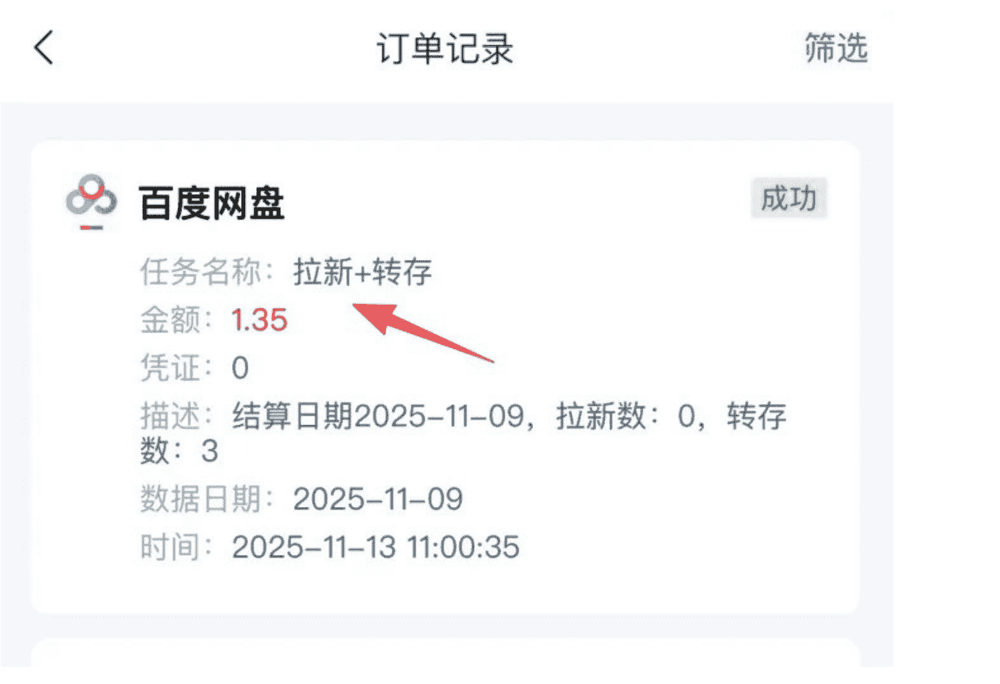

要么他收到资料后觉得下载慢了，就会花钱买网盘的会员。

那我们拿的佣金就更多了，截图如下：

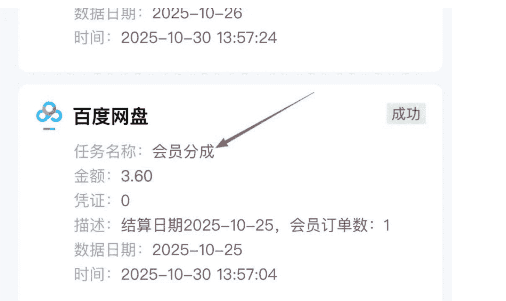

这些，都是做小红书虚拟项目，额外的收益。

## 2. 操作步骤演示

第1步：手机下载和申请任托邦，申请的时候必须要填邀请码，可以填下方这个码664483。

账号注册
- 请输入称呼
- 请输入手机号
- 请输入验证码
- 发送验证码

在申请时，此处要填邀请码：可填664483
- 请输入邀请码
- 请设置密码
- 阅读并同意《在线推广服务框架协议》《灵活就业合作伙伴协议》《用户服务协议》和《隐私服务条款》

第2步：任托邦按照官方的这3步，绑定自己的百度网盘。绑定以后只要是通过自己网盘分享出去的链接，都跟你有关联。

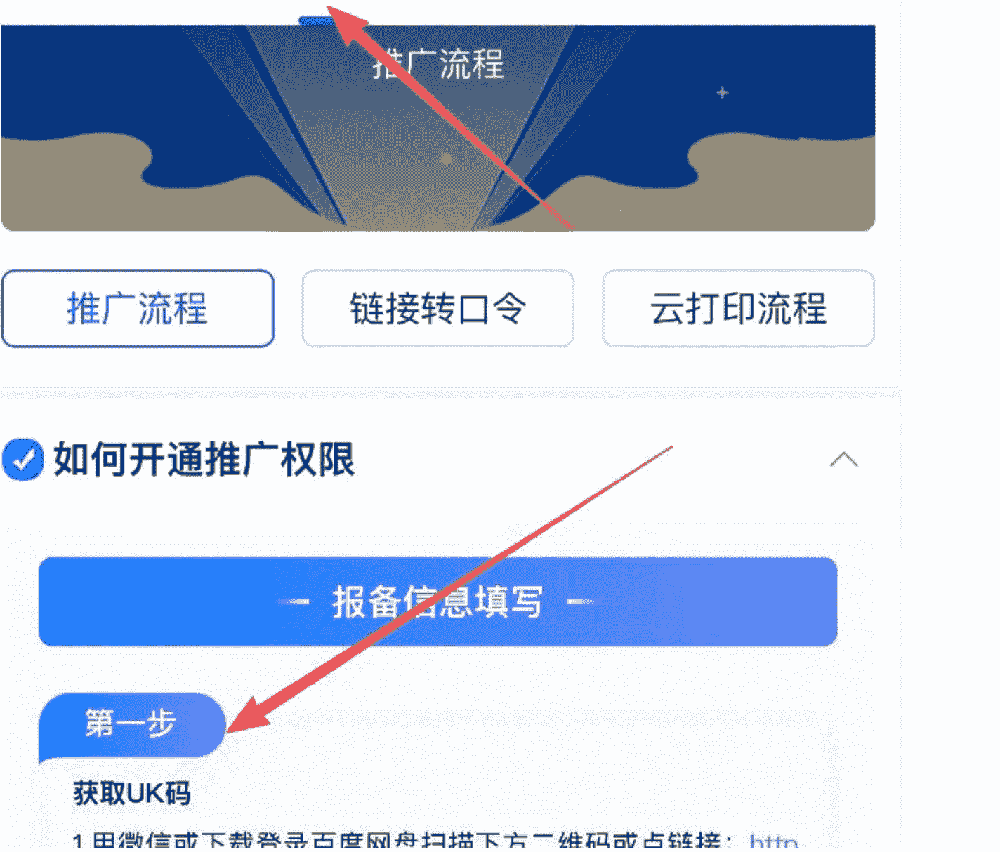

第3步：把你获得的资料下载链接，先保存到自己网盘。

自己网盘点击分享生成下载链接，发给你的买家。

后面只要买家有任何动作，你都有佣金。

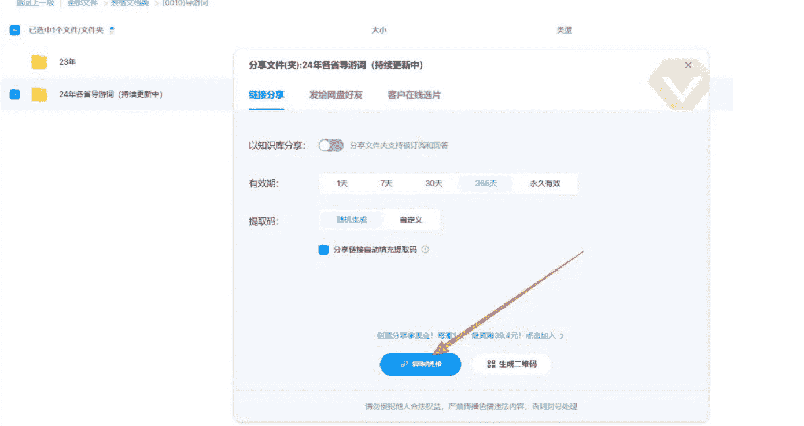

## 3. 赚双份收益

公众号懒人搜索，懒人专属群分享

### 小红书虚拟店矩阵+网盘拉新，这两个项目的结合，也算是个小创新。

可以同时获得卖资料的收益，还有网盘拉新的额外收益，双份！

接下来，要做的就是多开小红书店，矩阵去卖虚拟资料，把结果最大化！

当然了，有的人可能会想，能不能单独把网盘拉新放大做，其实是可以的。

比如，淘宝上、拼多多上很多卖0.01、0.1的都是这个套路。

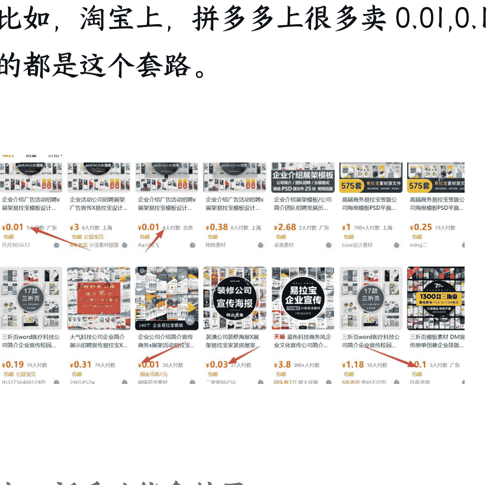

# 十、新手必能拿结果

经常有圈友来问我，小红书虚拟矩阵这个项目还能不能做？

必须能做的！而且我们一直也在做！

随手截几张我们店铺的数据图，以正视听。

这个项目其实是很灵活的：进，你可以多开店，形成工作室模式。退，你可以空余时间做两三个店，一个月搞个万儿八千的。

有没有结果，结果是做出来的，不是问出来的。

我们下方这个店，从11.02到12.01一个月也有1.35W。

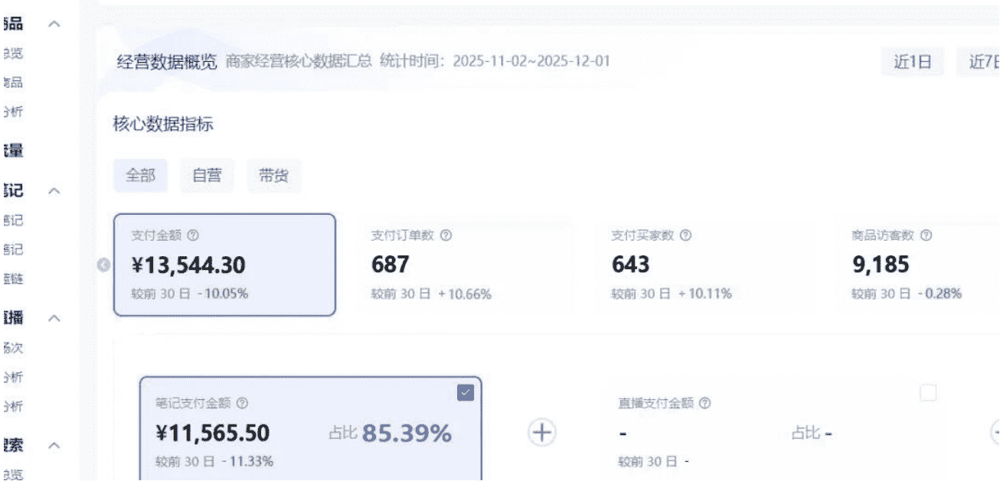

我敢给兄弟们保证：只要按照我的双轨模式+AI半垂直化选品+店矩阵，只要做了，一般不出三五天必然出单；持续做，持续滚雪球爆发。

给你们截图看下我们新起的一个小店，已经慢慢开始起来了。

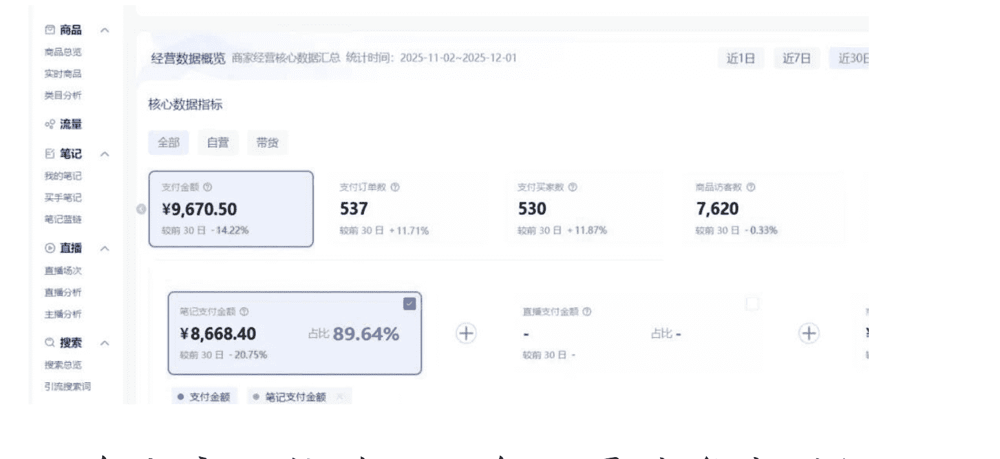

还有大家比较关心的，每天要花多少时间来做这个项目的问题。

有很多人是兼职做的，白天在外面上班。

因为现在全自动化做图+AI发笔记，都很省时间。

我们一般是，一个电脑上同时4个店一起发。

你如果是在外面上班的，可以中午午休的时候，用我们工具批量做好的原创封面，设置好。把店铺打开，发笔记插件打开，让它自动操作就行。中午你午休完，基本上就发布完了。

# 十一、成功经验和总结

## 1. 要坚持做

任何项目，都没有说速成就能搞到钱的事，还轮得到你？

只有坚持做，才能拿到想要的结果。

大家做项目，都是对搞钱的渴望。你渴望的、你向往的，没有哪一样是轻轻松松就能到手的。

有的人，像蜗牛般缓慢却坚定地爬行着；有的人，如雄鹰，永远向着更高处翱翔奋进。

有很多项目，从0到1很简单，但是从1到10，很多人就难了。这个难，不在方法上，而在能否坚持做下去、有积累！

## 2. 要学会自我创新

人与人之间，最大的差距在于：是否敢于迈出第一步，以及能否始终不渝地去坚持到底。

我有时候回头想，一年前如果还在继续做淘宝，不转头做小红书虚拟的话，估计现在还在迷茫。

那个时候做小红书虚拟的，很多还是老套路做，包括市面上搞培训的，都是一个调调。都是说要一个店精挑细选，分析数据，去扒同行的款，拆解同行的爆款笔记，模仿或者AI改写等等。

但是，我根据多年的淘宝经验，做了玩法上的创新：一个店上500个品，每个品发一篇笔记，同时做10个店。

半年后的今天，我又发现照旧干的话，拿结果不行了。于是，我又做了这次玩法上的创新，采用我们原创的“双轨模式+AI半垂直选品+店矩阵”。

你看看，这就是坚持后再加上创新，就能达到彼岸！

## 3. 要保重身体

电商人，通常有3个疾病：一个是社交恐惧症，一个是肥胖症大肚子，另一个是尿酸高痛风。

我3个都占了，不善社交+大肚子+尿酸高！也不知道大家占了几个。

这是电商人，或者做互联网项目人的通病！！

所以你做电商，如果没有搞到钱，同时也花费了时间，健康也没了，最后三输的局面！真的是得不偿失！

最后，安利小懒的付费群：

懒人专属群（介绍）

📖 这里是你对抗信息过载的护城河。

已稳定运行6年，累计拆解、研读3000+个互联网商业实战案例与行业前沿内参和时政/宏观文章。

我们不搬运垃圾，只做高价值信息的筛选器与放大镜。

懒人专属群更新记录：
https://hk57gvIx7u.feishu.cn/docx/H0kRdZbSbolBR0xkaXtcuVEOnTg

懒人专属群更新记录（需梯子，备用）：
https://lazybook.fun/blog/record2

【免责声明】本资料归档于社群内部知识库，仅供成员课题研究与学术交流，请在查阅后24小时内删除。