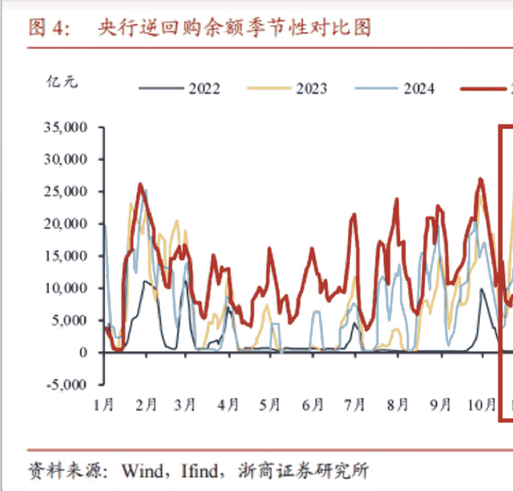

# 245 | 最新政治局会议定调，以及人民币汇率，两大关键信号

251210

整理：公众号懒人搜索，懒人专属群独享
懒人微信：lazyhelper

欢迎来到《政经参考》，我是马江博。

今天谈两个都非常有强烈信号意味的话题。

第一个就是 12 月 8 日刚召开的中央政治局会议，每年 12 月上旬的中央政治局会议，都是全年重要的政策风向标之一。因为它直接为接下来的中央经济工作会议定调——而后者，又决定了明年财政、货币、产业、就业这些关键政策到底怎么走。

第二个则是人民币最近升值趋势很明显，甚至部分机构认为有破“7”的可能，人民币汇率对中国来说是件大事，我会说一个关于可能长期升值的关键判断，你可以仔细听下。

## 政治局会议的新定调

先说这次关键的政治局会议。

我仔细看了会议通稿，结合今年 4 月、7 月的两次政治局会议，还有 2024 年底的政治局会议的基调对比，我有一个清晰的判断：就是 2026 年，很可能是一个结构性转变的起点。

每年 12 月的这次会议，其实就是给下一年的经济工作画一张“路线图”。之后通过中央经济工作会议，再到明年全国两会的《政府工作报告》，这张路线图会变成具体的“施工图”。

正因为如此，通稿里的每一个词都是反复斟酌过的。比如：财政政策是“积极”还是“更加积极”？货币政策是“稳健”还是“宽松”？提不提“房地产”？这些看起来细微的差别，都影响着真金白银的资源投向。

举个例子：2024 年 12 月的中央政治局会议提出，“适度宽松的货币政策”和“加强超常规逆周期调节”。当时市场立刻反应，强刺激要来了。

但今年的 12 月呢？“适度宽松的货币政策”还在，可“超常规逆周期调节”不见了，取而代之的是“加大逆周期和跨周期调节力度”。

你看，“超常规”淡出了，“跨周期”回来了。这到底意味着什么？

要理解这个变化，得回过头看今年 4 月、7 月和 12 月三次会议的表述演变。

4 月份那会儿，会议还在用“超常规逆周期调节”，跟 2024 年底的基调一致。因为当时国内经济的压力加上关税战，决策层要选择强力对冲。

但到了 7 月，情况变了。通稿里“超常规逆周期调节”消失了。原因很简单：上半年 GDP 增长 5.3%，高于 5% 的目标，扛住了外部冲击。

而到了现在 12 月，不仅继续没提“超常规”，还特意加了“跨周期”这三个字。而如果你知道这个词的来历，就会明白它的分量。

“跨周期调节”最早出现在 2020 年 7 月的政治局会议。当时通稿写的是：“完善宏观调控跨周期设计和调节，实现稳增长和防风险长期均衡。”

当时什么情况？一季度 GDP 同比下降了 6.8%，但二季度就同比增长 3.2%，实现了从负增长到正增长的转折。高层当时面临一个关键选择：是继续猛打强心针追求 V 型反弹，还是警惕过度放水带来的债务和泡沫风险。

“跨周期调节”的提出，就是为了避免短期刺激透支未来，同时让政策真正服务于内需扩容、科技创新、“双碳”这些中长期目标。

所以，今年 12 月重新强调“跨周期”，信号就很明确了，政策重心已经从应急模式，转向更在意中长期增长。这种转变的背后，我认为其实是决策层对中国经济韧性的重新评估。

我理解，经过这一年，我们站稳了，没必要再猛踩油门，而是该调整方向、优化结构了。

说完了大的定调，接下来再说这次政治局会议排位第一的“扩大内需”。

从 2024 年开始，这个词一直排在经济工作的第一位。但你仔细看会发现，今年下半年的扩内需，跟之前不太一样。

之前的典型代表是消费品的“以旧换新”，现在我们还在继续。但最近这段时间高层明显更强调“服务消费”，这是在强调“结构优化”，这个我们课程之前也多次提到过，像文旅（109讲）、健康这些服务领域（第198、第201讲），空间还很大，你可以再复习下。

另外还有一个细节值得注意：12月的会议重新出现了“更好统筹国内经济工作和国际经贸斗争”这句话。这句话4月提过，7月没提，现在又回来了。

我的理解是：短期看，中美关系确实有缓和迹象；但长期看，战略竞争不仅不会变，而且会走向更深度的硬核博弈。所以，“国际经贸斗争”依然是常态。

那怎么应对？通稿里其实说了两手：

- 第一，坚持创新驱动。这就是要强化科技自立和产业链安全，用实力作为大国博弈的后盾；
- 第二，坚持对外开放。这是通过互利合作，争取更多国家支持，营造有利的外部环境。

这两手，都不是短期招数，而是中长期布局。

最后，很多人最关心的问题来了：2026年会不会“大放水”？股市楼市能涨吗？

我的判断很明确：目前看不会强刺激，但一定会有结构性机会。

为什么？一方面，中美达成了阶段性协议，我根据目前的态势分析，短期内再打关税战的可能性不大；另一方面，全球通胀在回落，美联储大概率要降息，这对人民币汇率和资本流动都是利好。

换句话说，2026年我们面临的外部约束，大概率比2024-2025年更宽松一些。这恰恰意味着，我们有空间推进更难但更重要的改革——比如纵深推进全国统一大市场。

从7月到12月，政治局会议连续在强调“纵深推进全国统一大市场建设”，信号非常明确。过去有些地方为了抢企业，拼命给补贴、压低价，结果是资源浪费、效率低下，现在要打破这种“内卷”。

另外，就业依然是政策底线。12月的会议继续强调“稳就业、稳企业、稳市场、稳预期”，而且把“稳就业”放在第一位。所以新一年城镇调查失业率的数据，会是判断明年政策的一个关键信号。

至于楼市和股市，通稿一个字都没提，要看中央经济工作会议怎么说。不过同样是不提，我认为背后取向却不一样。

不提楼市，我认为是因为它在一步步离开政策核心目标，未来更多是温和托底、市场消化，这部分我在第234讲说的很详细，你可以再复习下。

不提股市，我认为是因为大盘目前基本稳住了，而决策层现在更关心的是：股市怎么更好地服务“强国”战略。所以我综合判断，明年大概率不是普涨行情，资金会继续流向硬科技、高端制造这些领域，让资本市场为大国博弈持续增加筹码。

当然，政治局会议通稿只是定个大方向，而且很简短。明年经济工作的具体部署，还得等接下来的中央经济工作会议，到时我们再详细研读。

## 人民币长期升值的新趋势？

第二个话题，最近人民币迎来了一波强劲的升值。

12月4日，人民币对美元中间价调升21个基点，报7.0733，创下2024年 10月14日以来最高水平，而离岸、在岸人民币则分别站上了7.05和7.06，离破7.0大关只差一步之遥。

这次的人民币升值有个明显的特点，就是离岸人民币（7.05）要强于在岸人民币（7.06）和中间价（7.0733），之前我们在第209节中提到过，这是我们观察金融市场很重要的一个风向标，离岸汇率强于在岸汇率，说明国际市场上对人民币看多的情绪更浓。

人民币为什么会在现在升值呢，我认为直接看有三个很重要的原因：

- 第一，企业的结汇需求。
  临近年底和春节，很多企业开始大量结售汇，结汇就是企业把外汇卖给银行，而售汇就是银行把外汇卖给企业。但根据第一财经的报道，2024年前10个月，银行累计结售汇是逆差了1031亿美元，说明企业都在换美元；而今年前10个月，这一数据则是大幅逆转，变为了顺差809亿美元，说明企业都在换回人民币。
- 第二，美元降息周期的开启和美联储主席的人选预期，让人民币相对美元更具吸引力。
  美元降息周期目前看已经稳步开启，下一届美联储主席也将在明年年初尘埃落定，市场都在期盼特朗普指定一个更“鸽派”或者说更温和的美联储主席，目前看白宫国家经济委员会主任凯文·哈赛特最有希望，他更愿意遵循特朗普的“弱美元”政策，在降息的力度、速度上都可能会更大更快，这样美元明年大概率不会比人民币更强，那么人民币兑美元自然就是“相对升值”的。
- 第三，中国央行展现的可能态度，短期利于人民币升值。
  我在文稿中放了张图，图片中的红色折线显示了央行今年的逆回购数据变化。
  
  可以看出，央行今年前10个月，逆回购余额都是大于往年的，说明资金投放力度大。但从11月开始，逆回购操作明显“减量”，总的逆回购余额也创下了自2022年来同时期的低位，说明人民币资金投放力度小了，而回收的力度大了，这也为人民币升值提供了一定的短期基础。

前面提到的都是中短期因素，如果长期看的话，人民币汇率会怎么走？这也是非常多同学想问的关键问题，我的答案很明确：在波折蜿蜒中，温和升值。

首先，人民币温和升值，有可能更利于稳外贸。

这乍一听，和我们普遍认为的“贬值才能刺激出口”的固有观念是相悖的，但环境不同，理论当然不能硬套。华泰证券的一篇研报最近指出，中国企业的成本优化速度是要大幅快于欧美企业的，汇率温和升值不会腐蚀竞争力，反而可能会降低贸易摩擦压力，毕竟西方一直攻击我们所谓“低价倾销”，而人民币汇率升值会提高售价。

这个结论很有意思，也就是说，当下环境下，人民币温和升值有可能会促进外贸总出口。目前看这可能会贯穿未来 3-5 年，当然我也说了，是在曲折中温和上涨，短期内的大幅升值肯定是央行不允许的。

其次，还有一个关键信息，就是人民币升值，对实现 2035 年的经济发展目标也很重要。

“十五五”规划建议稿提出了一个目标，到 2035 年要实现“人均国内生产总值达到中等发达国家水平”。对此，知名证券机构申万宏源在研报里做了一个测算，说如果要实现这个目标，人均 GDP 要达到 2.1 万美元，年均名义 GDP 增速要达到 4%，而年均实际 GDP 增速则要达到 4.4%。但如果人民币汇率温和升值到 6.0 附近，GDP 增速只要达到 2.5%就能完成目标，而在 6.0 的汇率下，如果还能维持 4%的 GDP 增速，那么届时人均 GDP 将迈入 2.5 万美元行列，成为真正的发达国家。

而且据我观察，日本、韩国、新加坡等新兴国家，在成为发达国家的过程中，都经历了一段汇率持续升值的阶段。对外经贸大学教授丁志杰曾在《金融研究》杂志上发表论文，指出 2002 年以后绝大多数从中等收入国家跨越成为高收入的国家，它们跨越速度的提高同时来自实际经济增长和实际汇率升值。所以就国家既定的目标看，未来 10 年人民币的温和升值，也是中国实现这个发展目标的重要抓手。

这是我目前的一个判断，供你参考，但不作为任何短期指导。另外，人民币汇率的长期温和升值，会带来很多影响，未来我会带你持续追踪。

### 延伸学习

- 1、中共中央政治局召开会议 分析研究 2026 年经济工作 审议《中国共产党领导全面依法治国工作条例》中共中央总书记习近平主持会议（2025年12月）
- 2、中共中央政治局召开会议决定召开二十届四中全会分析研究当前经济形势和经济工作中共中央总书记习近平主持会议（2025年7月）
- 3、中共中央政治局召开会议分析研究当前经济形势和经济工作中共中央总书记习近平主持会议（2025年4月）
- 4、中共中央政治局召开会议分析研究2025年经济工作研究部署党风廉政建设和反腐败工作中共中央总书记习近平主持会议（2024年12月）
- 5、习近平主持中共中央政治局会议决定召开十九届五中全会分析研究当前经济形势和经济工作（2020年7月）
- 6、【华泰宏观】人民币升值渐入佳境
- 7、深度专题|2026年：财政货币政策展望

### 最后，安利小懒的付费群：

懒人专属群（介绍）

📚 这里是你应对信息过载的护城河。已稳定运行 6 年，累计拆解、研读 3000+ 个互联网商业实战案例与行业前沿内参和时政/宏观文章。

我们不搬运垃圾，只做高价值信息的筛选器与放大镜。

懒人专属群更新记录：
https://hk57gvIv7u.feishu.cn/docx/H0kRdZbSboIBR0xkaXtcuVEOnTg

懒人专属群更新记录（需梯子，备用）：
https://lazybook.fun/blog/record2

【免责声明】本资料归档于社群内部知识库，仅供成员课题研究与学术交流，请在查阅后 24 小时内删除。