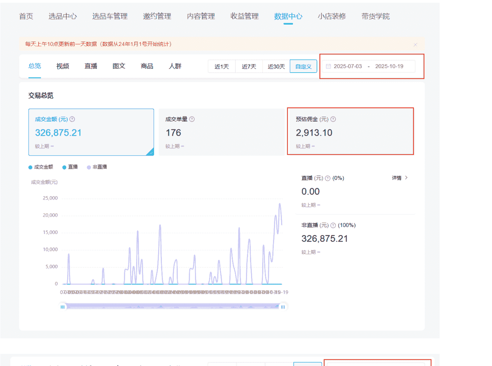
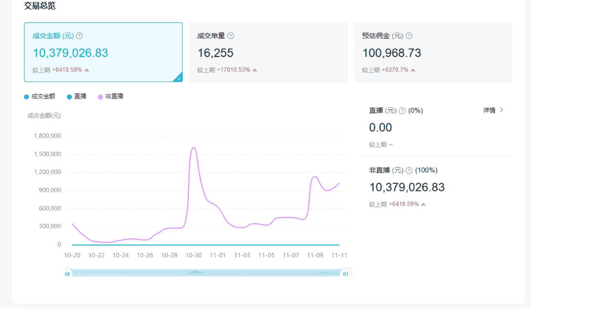
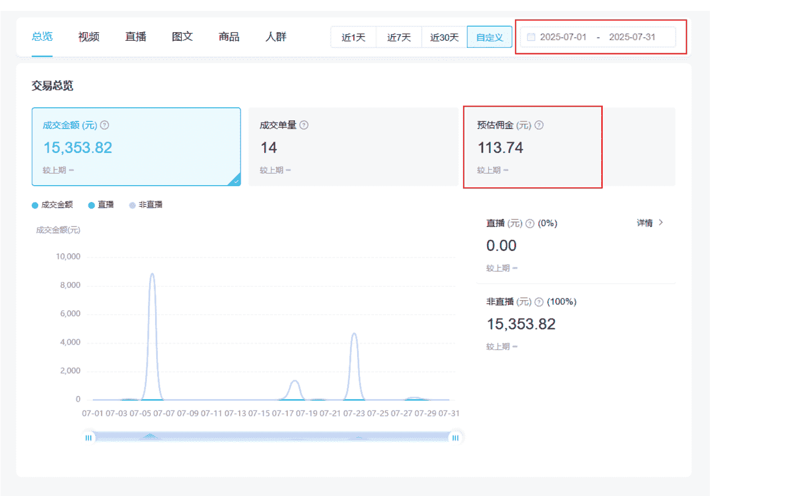
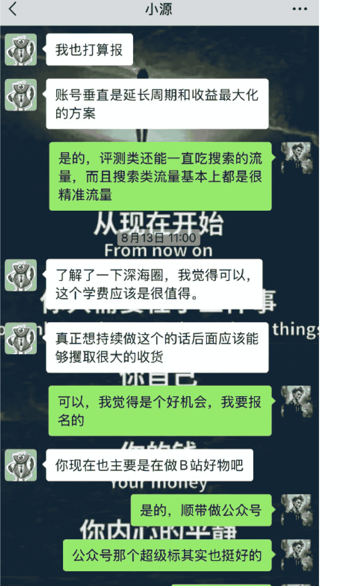
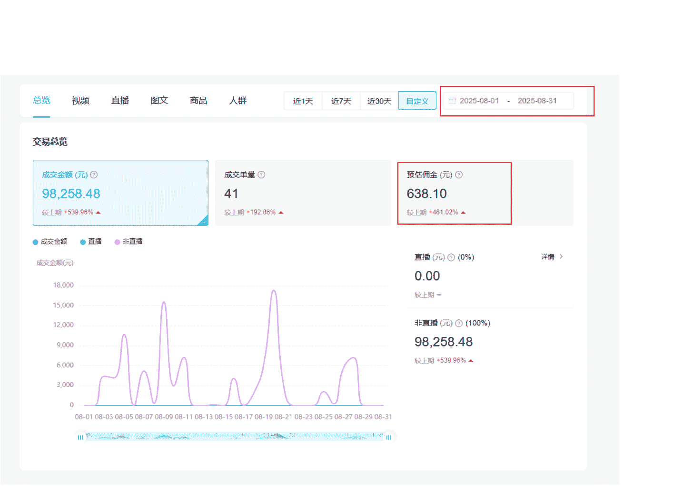
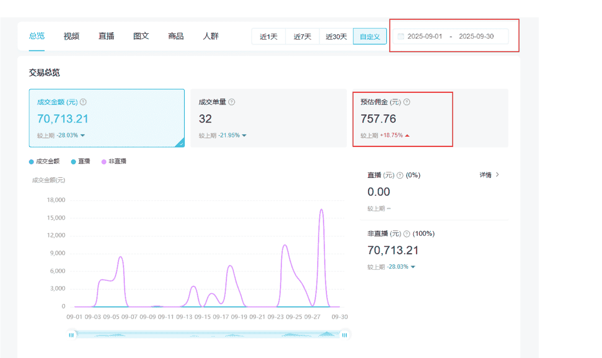

# 3个月没赚到钱到双11期间GMV破千万，我是怎么熬过无反馈期的？

251210 副业 SC 精华

公众号懒人搜索，懒人专属群独享

懒人微信：lazyhelper

## 星空海绵

### 1.1 我是谁

大家好，我是星空海绵，你们可以叫我阿星。星空海绵的寓意是：目标是星辰大海，并且要像海绵一样汲取知识和能量。

### 1.2 我在做什么

现在我的介绍是：

星空海绵，7年前端开发程序员，目前主要上班顺带做B站好物，双十一期间B站好物GMV做到千万。

B站好物这个项目是我进生财做的第一个项目，但是一开始做的很差，从7月3号发第一个视频开始，一直到10月19号我在B站总共发了149个视频，但是这个3个多月，我总共才挣到了2900多块钱。

对于我来说其实很少，平均一个月 900 多块钱，说真的，跟我付出的时间不成正比，作为程序员，我的主业工作非常忙，但是我还是坚持每天下班回来做视频。

因为我笃定不是项目的问题，我始终相信B站好物肯定是一个红利期的好项目，做的这么差肯定是我自己的问题。

- 我的方法论有问题
- 我的实践有问题
- 我的视频有问题

我始终在质疑的是我做的内容和方法，然后反复复盘，希望能找到破解之道。其实那段时间我非常的迷茫，但是我除了坚持做，我也没有别的好办法，想要在B站好物上拿结果，我只能选择坚持了。自己选的项目，跪着也要做完。

直到10月20号那天，属于我的机会终于来了，当然不可否认这其中有运气的成分，我抓住了这个机会，做出了一点小成绩，但是能抓住这个机会也要感谢我之前熬下来的3个月的经验积累和铺垫，要不然即使有机会，我也抓不住，具体可以看我的这篇精华贴《B站好物红包+投流玩法操盘：双11期间23天GMV破千万，利润7万！》，我也是将我做B站好物整个过程在里面说的清清楚楚，这里也就不再唠叨一遍了。感兴趣的同学可以去看看这篇帖子，特别是目前正在做抖音CPS的同学，不要好奇榜一怎么玩的，答案就在这篇帖子里，但是投流需谨慎，这是一把双刃剑，切记切记。

除了具体的项目实操外，我也想来和大家分享一下，这段时间我是怎么熬过这段无反馈期的。希望能给一样迷茫的圈友们一些鼓励。

## 1/ 记录和复盘，打磨最底层的心力

### 2.1 写下来，心里会踏实一点

回顾这几年，我真是有太多的话想说。也很感谢生财官方邀请我来写这篇小灯塔。

我每年都会给自己定目标。完成度一向都不高，但这个习惯我一直没有停过，年底照样会做一份年终总结。

这些目标和总结，基本勾勒出了我近几年的生活大纲：一个平凡普通的北漂码农，日复一日写代码、通勤、加班，又年复一年这样走过来。那时候并没有想太多，只是单纯觉得「写下来，心里会踏实一点」，当时只道是寻常。

但直到后来开始做B站好物，经历了整整3个月收入不理想的“无反馈期”，我才发现：这些长期的记录和复盘，其实是在帮我打磨最底层的心力——在看不到结果的时候，依然能熬住一直往前走。

只是那时候的我还没意识到，这些看起来“完不成的目标”和“写给自己的总结”，其实已经在慢慢影响我看待自己、看待项目的方式。

### 2020 年终总结

### 2021 年终总结
进一寸有一寸的欢喜，怕什么真理无穷，这句话倒过来更有深意。

**年度关键词：改变。**

- 1. 存钱。
- 2. 提桶成功 Run Run √√√√√
- 3. 能接受的薪资 √√√
  (1) 能接受的薪资是28×15，不低于25×15，结果拿了一个24×15的，这条算是没完成吧。
- 4. 健身 √√√√√
- 5. 读书，买的这些书起码得读一半吧，还有很多要买没买的呢。
- 6. 找女朋友。
- 7. 精通前端面试八股文。
- 8. 打好基础，前面读的技术书，也是打好基础的一个方面，还可以去看视频学习，比如B站，极客时间等等网站。
- 9. 8月新加，可视化方面知识的学习，3D方面以及2D方面的知识的学习应用。
- 10. 思考找寻一件有意义有趣的事情来做。
- 11. 深入了解自动驾驶相关的东西，下份工作跳自动驾驶方向的公司，例如：特斯拉，小鹏，蔚来，理想等等，好好学，base45左右应该没问题，只要能力够，这行业不缺钱。

### 2022 年终总结
进一寸有一寸的欢喜，怕什么真理无穷，永远相信美好的事情即将发生。

**年度关键词：计划。**

- 1. 存钱。
- 2. 早睡早起
- 3. 健身
- 4. 读书，定个量化目标，今年读的书不低于40本吧。
- 5. 找女朋友
- 6. 精通前端3D开发
- 7. 精通自动驾驶相关前端开发技术栈(包括学习TS)
- 8. 下半年出去面试看机会，有好的机会就run
- 9. 好好体验生活，勇往直前
- 10. 尝试自己做饭吃
- 11. 尝试在B站开直播，学习看书等都行。
- 12. 考个驾照。

### 2023 年终总结
保持热爱，奔赴山海。

**年度关键词：勇敢。**

- [ ] 1. 在疫情放开的大背景下，保持身体健康。
  这一项还行吧，还算健康吧，不过这几天不知道是甲流还是支原体感染，还咳嗽着呢。2024继续保持健康。
- [ ] 2. 好好赚钱，存钱。
  今年赚钱也赚了点，可是没存到钱，全让我花了，各种地方都是要花钱的。
- [ ] 3. 涨薪或者跳槽。准备中 (2023.06.07) 🚀🚀
  裁员被迫跳槽，跳槽基本上是平薪。
- -[-] 4. 把驾照考了。
  没考，懒得考。2024准备考。
- [ ] 5. 规律生活，早睡早起。
  没做到，尝试过。熬夜的习惯2024得改啊。
- [ ] 6. 读书至少50本。多读书，多分享，书单放在最后。
  没做到，只读完了28本，2024年的目标是读完60本。
- [ ] 7. 健身，一周至少2次健身运动吧。
  没做到。
- [ ] 8. 至少2次长旅行。
  完成1次，深圳 (2023.08.23-2023.08.25)
- [ ] 9. 好好体验生活，感悟生活，勇敢面对生活和勇于接触生活中的新东西，多尝试，多体验。
  这一项算还行吧，今年确实勇敢了点。
- [ ] 10. 找对象，随缘吧。
  感情经历是今年给我烦恼最多的事情，还是安静的当一个coder吧，没事写写代码吧。
- ☑ 11. 今年换房子的时候租个一室一厅，自己买菜做饭吃，学会自己一个人好好生活。 
  ✓✓✓✓

### 2024 年目标 🔄
冰冻三尺，非一日之寒；滴水穿石，非一日之功。

**年度关键词：耐心。**

> “ 读书、赚钱、刷牙、健身、体验生活。

- [ ] 1. 读完60本书。
- [ ] 2. 年底收入总和达到60W。
  (1) 尝试各种赚钱的渠道
  (2) 实事求是，认清现实，好好赚钱，好好记账。
- [ ] 3. 把牙齿刷的干干净净，洁白洁白。
> “ 晚上刷牙次数至少达到230次(2024.04.08)。
> “ 已完成次数：70。

- [ ] 4. 健身。
> “ 每周锻炼3次。周一、周三、周六。累计次数达到70次(2024.05.27)。
> “ 已完成次数：0。

- [ ] 5. 好好体验生活，坚持做应该做的事情，坚持微习惯，耐心点，学会积累。
- ☑ 今年换房子的时候租个一室一厅，自己买菜做饭吃，学会自己一个人好好生活。(2023年的目标) ✓✓✓✓
> “ 2024年6月完成目标

### 2025 年目标
积累，不积跬步，无以至千里；不积小流，无以成江海。

**年度关键词：积累。**

> 记录。

> 读书、存钱、刷牙、健身、感受生活。

- 1. 读完40本书。每天读书1小时。

| 序号 | 书籍名称 | 是否已读 | 字数 |
|---|---|---|---|
| 1 | 西西弗神话 | 2025.01 | 125000 |
| 2 | 动物庄园 | 2025.01 | 73000 |
| 3 | 了凡四训 | 2025.01 | 100000 |
| 4 | 草民 | 2025.02 | 169000 |
| 5 | 克拉克森的农场 | 2025.02 | 146000 |
| 6 | 显微镜下的大明 | 2025.03 | 327000 |
| 7 | 要钱还是要生活 | 2025.05 | 264000 |

- 2. 拿到驾照。
- 3. 早睡早起。
- 4. 每日记录，每周思考。
- 5. 健身达到150次。
- 6. 坚持做该做的事情，学会积累，然后好好体验生活中的新鲜事物，好好生活，让生活过得更火热一点。

### 2.2 努力有时候是有滞后性的

从2021年开始，我才算真正“系统地”读书。在那之前，我也会看书，但都是零零散散地翻一翻。那一年开始，读书慢慢变成了我生活里一件很重要的事。

2022年读完了24本，2022年读书总结。

2023年读完了28本书，2023年读书总结。

2024年读完了读完了24本，2024年读书总结。

这几年认真读完的书加起来，大概在100本左右。

我曾经也反复问自己：我读这些书到底有什么用？又不能直接帮我赚到钱，认认真真读了几年，好像也没带来立竿见影的改变。

现在回头看，其实不是没用，只是它的作用来得很慢。做项目其实也是，努力有时候是有滞后性的，不会立马就出效果，可是我们总是很急，但心急是吃不了热豆腐的。

读书就像每天吃的饭，早已经悄悄融进了血液里，在一点点潜移默化地影响你，让你变得更强大，也更温柔。

这些年读书的时间，我大多是快乐的。我能暂时离开自己的日常，穿过时间和空间，在书里看见不同的人物和世界，那种感觉真的很美妙。阅读确实是一座随身携带的避难所。

我读过很多书，但后来大部分都忘记了，那读书的意义又是什么呢？有一个很有意思的回答说：

当我还是个孩子时，我吃过很多食物

现在已记不清我吃过什么，但可以肯定的是

他们中的一部分已经成为了我的骨头和肉

书对人的改变也是如此

## 我最爱的图书

来自:星空海绵 2022-11-01 08:35:22创建 2024-08-02 03:43:15更新
删除 推荐 全部(10)·我没读过的书(0)·我读过的书(10)按添加顺序查看

1. 命运 | 评分：8.8(36935人评价) | 作者：蔡崇达 | 出版社：浙江文艺出版社/广州出版社 | 出版年：2022-9-5 | 来源：豆瓣读书
2. 悉达多 | 评分：9.1(1795人评价) | 作者：[德]赫尔曼·黑塞 | 出版社：上海译文出版社 | 出版年：2018-6 | 来源：豆瓣读书
3. 刀锋 | 评分：8.6(1072人评价) | 作者：[英]毛姆 | 出版社：江苏凤凰文艺出版社 | 出版年：2019-6 | 来源：豆瓣读书
4. 埃隆·马斯克传 | 评分：8.6(15978人评价) | 作者：[美]沃尔特·艾萨克森 | 出版社：中信出版社 | 出版年：2023-9-12 | 来源：豆瓣读书
5. 穷查理宝典 | 评分：8.5(4519人评价) | 作者：[美]彼得·考夫曼编 | 出版社：中信出版集团 | 出版年：2021-7-31 | 来源：豆瓣读书
6. 财富自由之路(修订版) | 评分：8.5(661人评价) | 作者：李笑来 | 出版社：电子工业出版社 | 出版年：2023-7 | 来源：豆瓣读书
7. 置身事内 | 评分：9.1(99893人评价) | 作者：兰小欢 | 出版社：上海人民出版社 | 出版年：2021-8 | 来源：豆瓣读书
8. 红与黑 | 评分：8.6(11490人评价) | 作者：[法]司汤达 | 出版社：天津人民出版社 | 出版年：2016-10 | 来源：豆瓣读书

## 初遇生财有术

### 3.1 在无数次副业碰壁之后，我遇见了生财

这几年我也一直在探索副业，做过很多项目，例如小红书、公众号、闲鱼，我都做过。但是这些项目并没有让我赚到什么钱。

但是我也从来没有放弃过，而是继续探索，我一直相信："永远相信美好的事情即将发生"，这也是我的人生座右铭之一。

因为我一直在找副业，想在工作之外挣点外快，但是我本身是程序员，上班非常忙，不过工作时可同时听播客和写代码，然后应该是搜赚钱相关的播客，机缘巧合下搜到了家蒙哥和阿宅的【亏钱指南】，发现非常有含金量，内容干货满满极具价值，就一期不落全部听完了。

从里面也学到了很多东西，然后我就发现一点，好多分享的嘉宾都是生财的，于是我就去调研了一下生财，当时还写了一个调研相关的文章 生财有术值不值得加入？，后面又复盘了我过往的赚钱经历 过往副业赚钱实践 ，总结就是过往副业并没赚到钱，判断生财确实是一个值得加入的平台。

**播客收听记录：**
- 海王星：261小时42分钟 (最近30天 全部)
- 肥话连篇：105小时57分钟
- 亏钱指南：59小时15分钟
- 张小珺 Jun 商业访谈录：33小时59分钟
- 保持偏见：28小时10分钟
- 十字路口 Crossing：12小时31分钟
- 高能量：3小时32分钟
- 文化无限：2小时37分钟
- 枫言枫语：1小时46分钟
- 小马宋商业观察：1小时18分钟
- 屠龙之术：1小时15分钟
- 知行小酒馆：1小时10分钟
- 搞钱！ 离钱最近：1小时4分钟
- Web Worker 前端程序员都爱听：19分钟
- 商业就是这样：(时长未显示)
(总计 13/42 期)

**评论区精选：**
- **婵娟明月月** (05/24 北京): 这期的嘉宾经历好丰富，也很有智慧，膜拜大佬，好想认识啊哈哈哈
  > 家蒙蒙蒙：我现在不看朋友圈，老胡拉我进了他的星球，他发一些碎片思考，一些信息分享，看着很过…
- **星空海绵** (05/29 北京): 最近听了好几期，老听到说加盟，我就想着这个播客加微信加盟什么呢，直到有一天看到文字才明白叫家蒙
  > 家蒙蒙蒙：哈哈，就叫这个名字
  > 木槿_qq1N：哈哈哈哈
- **Louis_irVy** (06/07 广西): 这期太赞啦，嘉宾很接地气，经历也很丰富，受到很大鼓舞，谢谢家蒙！
  > 家蒙蒙蒙：谢谢你喜欢我们
- **柚子_90kr** (06/02 湖南): 16:32 受到了点启发，最近可能大脑空想过度的了。特别累的时候，去一下没去过的地方吧
  > 家蒙蒙蒙：允许自己休息，国内有一种，休息可耻的氛围。大可不必，大可不必。

## 座右铭

> 进一步有一步的欢喜，怕什么真理无穷。

> 永远相信美好的事情即将发生，Always believe that good things are about to happen.

> 船到桥头自然直 All will be good.

> 勇敢开始，让事情自己长出自己的模样。

> 温柔，耐心，自律，坚持。

## 9. 总结

总结一下就是那么多年，做过的东西其实不少，这个也试试，那个也试试，但是都没赚到什么钱，稳定的收入来源还是靠上班，日常工作，副业收入基本等于0。但是今年还是想探索一个赚钱的副业，还在一直探索中，未来有一天应该能有个不错的副业，赚到一些钱吧！努力尝试，深耕其中，必定能成功的。

### AI分析总结

根据AI分析出来的内容,我觉得我可能比较适合加入,我需要一个这样的赚钱社区的氛围,去获取一些赚钱信息和路子并且实操,然后上面说的满足2条即可考虑加入,后面2条我是满足的,说实话,我之前我调研过,生财有术里面的信息其实可以通过其他渠道用便宜的价格买到,但是社区交流是买不到的,我看中的是社区的交流这类东西。

### 3.2 生财新人

我是今年7月4号正式加入生财的,截止到12月也有5个月左右了,属于不算新的生财新人了。加入生财前有个7天的试用期内,我在试用的时候就留意到亦仁老大发的“B站好物"这个超级标,为我后续的B站好物副业埋下了伏笔。

## 更多

付费有效期至 2026/7/4
生财有术
星球号：50394154
星空海绵
成员编号：184992
2025年7月4日加入星球
分享星球
星球名片
星球资料
星球成员
星球权限

## 超级标 007

没想到吧？这条超级标竟然和上一条超级标隔着这么短的时间。

前几天航海家线下大会，遇见 @家蒙。

他跟我说：“可能又一个现象级机会出现了，不输 2020 年的知乎好物。”

听完我一下子被带回了那个时间点。

那年生财一大把圈友靠知乎好物赚到了第一桶金，也是第一次把内容变现做成了规模，甚至 @怡然 现在一是从那时候知乎好物项目积累了第一桶金。这条帖子下面也见证了不少圈友当年知乎好物的成绩。

> 亦仁：来得瑟下圈友的优秀成绩，单日知乎好物收入 13000

有没有圈友参加过 20 年生财知乎好物航海的，欢迎在评论区打个招呼。

好了，我继续说。

我去深入聊了聊家蒙、还有几个已经在做的朋友，一线反馈让我很惊喜：

“半年赚了 50 万”

“上午发视频，下午就开始赚钱了”

“这个项目好是好，我唯一担心的就是，你发出来之后做的人太多了”

……

这个项目，就是 B 站好物。

所以，今天这条超级标，我们聊聊 B 站好物，一个有大量机构正在偷摸着矩阵做赚钱的项目。

我给大家讲讲我的观察：

1/ 一个内容平台，在开启商业化的时候，前期因为基础设施不完善，无法帮助内容创作者变现，他们会对

## B 站好物，你好！

### 4.1 相信 B 站好物的潜力

首先我进生财是因为听了家蒙哥的播客，家蒙哥更新到目前为止 42 期播客每一期我都听完了，现在看总共时间是 59 小时 15 分钟，上面 3.1 放了这张图，从家蒙哥和阿宅的【亏钱指南】播客里面我学到了非常多的东西。所以你说家蒙哥出来开项目，那我肯定第一个报名，不用说是开什么项目，这就是家蒙哥通过播客节目带给我的信任力。

再一个就是 B 站，现在看我上面显示成为 UP 主的第 2200 天，一个 6 年多的 B 站资深用户，我是了解 B 站这个平台潜力的，只要 B 站推商业化，里面一定有红利，不夸张的说 B 站就是国内的 Youtube。

基于对人和自己多年对平台的了解，我就判断这肯定是一个好项目，我是百分之一万的相信，就是这么的笃定。

这很重要，挑项目的时候我们一定得从我们自己内心的判断出发，如果我们内心本来就非常认可这个项目，那么在后续做项目遇到问题的时候我们就会更能坚持下来。

### 4.2 相信我自己：B 站 10 年老粉不请自来

我本身之前做副业的时候做过 B 站视频，也是 B 站老用户，正好也积累了 1000 多粉丝，天然的适合这个项目，我就开始投身其中。

7 月 3 号我发了第一个视频，制作的很粗糙，因为没人指导，我也不会，就自己瞎摸索。摸索的过程中就去找对标，我通过生财的一些帖子知道了 B 站好物有个官方的百万带货排行榜，我就去扒上面粉丝量少的 UP，因为这样的 UP 就证明低粉也能卖很多货，适合我这种刚起步的新手对标，于是我就发现了好价线报这个路子，然后开始做这个路子的视频。

做到 7 月 20 号，我基本摸透了线报的玩法，就在生财发布了一篇《B 站好物悬赏带货实践分享》的帖子，内容是半个月成交金额破万，这也是一篇精华贴。这段时期学到的东西都在这篇文章里面了，文章的最后我专门写了一节卡点的内容，当时我是这么写的：

最近我遇到的卡点是有订单，但是有时候会被取消掉，取消订单的频率还蛮高的，这个我不知道为什么，我 B 站小店里面都显示售出 30 多单了，其实我就售出 8 单，其他的都是下单后取消的，我暂时还没想明白为什么？下单后取消的 B 站也会算到售出里面。

这就是当时我的卡点，后面我才知道：在非大促期间这种取消订单非常正常，因为卖数码家电这种高价的产品，用户的决策成本本来就是很高的，所以冲动下单或者因为其他情绪类动机下单的就容易取消，我不需要管这个数据，我继续发我的视频就好了。

我一直坚持做线报类视频，但是做线报类视频并没有让我赚到钱，但是这段经历和做的那些线报视频，也给我的红包投流双11期间23天做到GMV千万这条路子铺了路。

在这个期间，我再次坚定了B站好物这个项目100%是能挣到钱的，想多挣点还是得下点功夫和想点办法的。

关键是怎么出大量的单，要么就是做矩阵，毕竟做这种视频还是很快的，不怎么费时间。再有一个那就是坚持做，成效还是会有的，不行就转评测类。

相信项目，我就开干！更相信我自己，目标和思路清晰，执行力就拉满了。

其实生财的圈友是我见过执行力最强的，我直播分享红包流那天，分享完应该是11点了，结果有一些同学凌晨就开始做视频出视频了，有这种执行力加上目标和思路以及选到一个自己满意的好项目，做什么项目都会成功的。

## 4.3 做项目都会有一个学习探索期

做的第一个月7月，我就发了60个视频，但是只挣到了113块钱，平均一个视频不到2块钱，但是一个视频我每天下班回来至少要做半个小时到1个小时。

这合理吗？合理。

因为我笃信这个项目肯定是个好项目，第一个月我属于学习探索阶段，这个反馈我可以接受，毕竟做项目也是要一步一步的来的，没有一步登天，只有一步一个脚印。

这个阶段我有非常多的问题，为什么我的视频出单量那么低？为什么好多人买了又取消购买？我只能一点一点的探索，一点一点的分析复盘。这时候我一个人自己做，有的时候我也真的是不知道为什么，这个时候一般我会去问 GPT，GPT 会给到我一些建议，结合我自己的实践经验，我再去优化迭代我的视频。

> 《B站好物悬赏带货实践分享》
> 大家好，我是星空海绵，7月份刚进入生财的一名新人。在还没正式加入生财的时候，试用3天的时候我正好看到了B站好物这个超级标，我就觉得这个太适合我了，我以前在B站做过视频，有一个1000多粉丝的账号，天然条件支持，我就开始研究做B站好物这个项目。然后做了半个月，GMV破万了，虽然佣金只有60多块钱，但是也看到了这个项目是真的能赚钱，后期好好研究研究突破卡点，我觉得这个项目赚回生财的门票钱是没问题的，然后文档里是我详细操作的流程，包括视频制作和上传视频的一些细节的东西，希望对你们有帮助。飞书文档：https://hcn8d9ugcm3t.feishu.cn/wiki/Sc9uwkQieiSu4T...。感谢亦仁生财的超级标和提供此信息的家蒙老师，以及分享B站好物相关的经验和信息的生财圈友。 #项目实操 #B站 #B站好物

### B站好物卡点分析

星空 | 7月26日修改

#### 1.卡点

开始做B站好物有小一个月了，发了大概55个视频，我是从7月3号开始做的，今天是7月26号，然后有效出单是10单，GMV为15131元，佣金为95.19元。可见这个单量还是比较少的，并没有做到每天都能出单的程度，还有就是取消的单量比较多，B站小店取消的单量也算在销售里面，所以我小店显示的单量是38单，如果按小店的单量算，那其实还可以，可能佣金有个小1000了。现在的问题就是出单转化率太低了，而且视频没有尾流量，就是两天，发的那天和第二天，后面就基本没有流量了，也不会出单，这个可能跟我做的类型有关系，优惠类，但是这类确实能出单，就是现在感觉出单率不高，首先解决这个出单率不高的问题。再就是思考有没有比优惠类更好的方向，例如评测等等。

- 选品，一定要选爆品。
- 品一定是真的好价的品。
- 结论，抄对标账号。

## 4.4 生财遇战友，踏实的陪伴感

7月份没赚到钱，还有卡点，我就想着在生财星球里找一些做B站好物的小伙伴一起沟通交流一下，8月份11号的时候我跟生财圈友小源认识了。

做项目卡在没反馈那段时间，一个人最容易放弃，但在航海和生财，多一个一起做的战友，焦虑就会小很多。

我俩聊下来达成共识：线报类内容局限性大，真人出镜流才是更优选择，毕竟这种形式能支持投流放大。后来家蒙哥和生财联合开了 B 站深海圈的课程，我们第一时间报了名，当时就觉得，靠这门课挣回学费肯定不成问题，现在看哪只是学费啊，这次知识付费回报真的是翻了好多倍的。

我们判断这肯定是个好机会，跟着有沉淀的老师学习，肯定能学到东西的，后来事实证明的确如此。

其实这时候我们的分析基本上都是对的，投流放大，这个点在那个时候我们就知道，所以说我们对自己做的项目要有清晰的认知和未来规划，多去刷对标账号，看 B 站百万带货榜上那些人是怎么做的，你去学习模仿他们就好，毕竟他们在榜上就是对他们模式最好的认可。也可以多跟 AI 对话，让 AI 帮你分析分析项目，从中你也能学到很多东西。

#### 小源

##### 8月12日 21:42
果然 他走的专业流
这种可以接广告
是的，还有一点，评测类按理说可以走投流的打法，我看B站上就有这样搞的，投流放大，应该也是赚钱的

##### 8月12日 21:51
是的

#### 你需要在乎三件事
> You only need to care about three things
这也是我想走的路线
可以，我是觉得报名这个应该亏不了

### 你的钱
##### 8月12日 21:58
> Your money
可以

#### 你内心的平静
这种天花板很高，不光佣金不少赚，商单带来的收益会更多。

## 4.5 生财遇良师，方向感拉满

8月份家蒙哥和生财官方合作的B站好物深海圈项目正式开启，报名之后就跟着家蒙哥系统学习做B站好物真人出镜流的实操方法。

8月份我一边学习还在一边发之前的线报流视频，但是因为要学习，发的没那么多了，8月份我发了28个视频，赚了638块钱，其实这时候因为跟着家蒙哥学习，我开始慢慢有信心了，也看到了希望。

毕竟有老师带，还有很多一起做的小伙伴，前景不可谓不光明。

因为我们在加入之前就很看好真人出镜流视频，排行榜上排名靠前的大部分都是这类视频，那么我们就知道这类视频天花板是很高的，所以这时候我真的是信心十足。所以做项目我们需要学会找对标，找对标可以使用 AI，也可以使用生财的知识星球搜索相关项目的帖子，当然现在生财有 AI 了，也可以直接使用生财的 AI，还可以使用主流社媒去搜索，例如小红书、抖音、B 站等等这些，一定要多下功夫研究自己的项目，说不定这就是以后可以让你吃穿不愁的项目。

8 月份学习完毕，9 月 1 号我还在生财发了篇帖子，当时给自己定的目标是：9 月份靠这两类内容挣到 1 万佣金，这时候我相当的有信心，可是我低估了真人出镜流视频的難度，跟线报流一样，需要时间的沉淀，只是当时我并没有意识到。

9 月 2 号我发了第一个真人出镜流视频，这是一个 21 分钟的真人出镜流视频，这个视频不同于线报流视频制作很快，这种真人出镜流视频制作起来非常的耗费时间，而且需要一套很完整的流程，这个视频我做了大概有一周，毕竟有 21 分钟的视频长度。

满怀信心的将这个视频发出去，结果当时一单都没出，这时候真的被打击到了。辛辛苦苦做的视频，做的时候觉得发了一定会爆，能出很多单，结果一单没出，这时候其实真的挺失落和灰心丧气的。

因为是第一个出镜流视频我也勉强能接受这个结果。饭要一口一口的吃，路要一步一步的走。

但这时候我开始怀疑我是不是不适合这种流派，我就把我之前丢下的线报类视频又捡起来了，一边发线报，一边做真人出镜流视频，这时候每天下班 9 点左右到家，基本上都搞到 1 点左右才上床睡觉，早上有 8 点多起来去上班。周末两天也是不出门，就在家做视频和研究 B 站好物的这个项目，到底什么类型的视频才能出更多的单。

如果说你相信你的项目，那在做的过程中就不要质疑它，从自己身上找问题。别人能拿到结果，那你为什么不行？

是不是你当下做的方式有问题，得自己反思、复盘，和 AI 或者同学或者老师交流沟通。

找到没做好点，做好它，持续迭代反馈，直到形成一套完整的迭代进化系统。

这样问题被一个一个解决，后面的路走的也就更轻松了。

同时深海圈群里也有其他同学有这情况，家蒙哥也在群里鼓励同学们多做几个视频一定会有结果的，事实就是这样，同学们也开始陆续出单，并在群里报喜，慢慢的很多同学都开始出单了。

一下子整个氛围就不一样的了，大家都知道了正确的路该怎么走，都猛猛做视频，发就完事了，同时家蒙哥还通过他自己以前积累的一些资源，给我们找来一些商单，还给我们开了很多定向高佣，慢慢的深海圈就有做的比较好的，出单多的同学涌现出来了，这时候我就还是跟着大部队走，多做视频。

这就是深海圈最重要的一个价值，那就是一个人可以走的更远，因为你在没有方向没有心力没有希望的时候老师和同学们能帮你一把，让你重拾往前走的信心。

## 9 月份我发了 19 个视频，赚了 757 块钱。这并不是一个好消息，因为我 9 月 1 号在生财发帖子的，我可是说：要挣到 1 万块钱，这连 10%都不到。这时候我已经开始后悔了，早知道 1 号的时候不要那么信心十足的在生财发帖了，可是塞翁失马，焉知非福。

## 生财好事 #B站好物 我本来是不准发的，觉得收益太少不值得发，感觉才几百块钱，没必要。但是今天看见亦仁发的“经常庆功，才能成功。”这句话，我之前听过这句话，我也很认同这句话。首先 8 月份公众号随便发了几篇，也赚了 100 多块钱，纯 AI 写的，爆了一篇 2.6 万阅读的，后面要做别的，就放弃公众号这个项目了。我从 7 月开始做 B 站好物的，7 月刚开始摸索，出了几单赚了 100 多块钱，然后 8 月份做了不到半个月吧，但是 8 月份的佣金已经是 7 月份的好几倍了，我做的就是最简单的好物线报，一个视频基本就 30 到 40 秒，视频文案什么的都是固定的，每天发 2 个视频 20 分钟肯定是能搞定的，线报这种类型能出单的底层逻辑就是这个品今天就是最低价，就是好价，所以线报视频的时间是花在选品，做 2 个线报视频 10 分钟一定是够的，但是线报视频天花板感觉是不高的，虽然 B 站百万带货榜单上有做线报的 up，但是这是需要很长时间积累的，我 8 月份虽然做的视频少，但是为什么佣金反而多了，也是靠前面 7 月份积累的，线报做的熟能生巧了，都摸索明白了，我知道线报的天花板不够高，所以 8 月份前半个月在做，后半个月就在学习真人出镜解说带货视频了，这种类型的路子才是相对正确的路子，能在 B 站好物的红利期获得更多的收益，这个在还没开始学真人出镜这种视频的时候我就跟做 B 站好物的圈友讨论过，真人出镜这个类型肯定是最正确的路子，真人出镜这类视频的学习已经差不多了，然后第一个这类型的视频也马上要做完了，说实话这个视频做到现在，我自己还是挺满意的。定一个目标吧，9 月份 B 站好物带货佣金突破 1 万元，你问为什么你上个月才赚几百块，这个月敢定 1 万的目标，因为我清楚的知道我现在走在一条对的路上，而且我学的也很好，我的视频也做的很好，好像有点太自信。再补充一句，B 站好物线报也可以做，一个月赚 2000 块钱肯定是不成问题的，一天发 2 个视频比较合适，因为发 3 个或多个 B 站后面几个视频是不给流量的（个人实测经验），选品选到当天价格最优惠的品，坚持做就行了，0 到 1，1 到 10，10 到 100，100 到 1000，这个模型在这个项目上肯定是成立的，复利式的增长。为什么我还是将这个帖子发出来了，不是因为亦仁说了一句话，我就发这个帖子，是因为我觉得在这个项目上我有很大的希望我才发这个帖子的，干就完了！

## 4.6 生财遇自己，量变引发质变

定一个目标，追上那个被自己寄予厚望的自己。

虽然9月份我并没有挣到我说的1万块钱，10月份我也没来生财发贴反思，其实想来没人关注这事的，我就当作我发的没人看过就行了。但是我自己得心里有数:9月份没干成，那我10月份是不是要努力，不管成不成，我给自己定了日更目标:我10月份就猛猛发线报类视频和真人出镜类视频双轨并行。

因为曾经说的话定的目标是给我自己定的。这时候我想我一定要努力奔跑，要追上那个在9月1号被自己寄予厚望的自己。

用执行力去打破焦虑。行动起来，永远比待在原地更强。

10月份那段时间我也是真拼， 好几天我都剪视频剪到凌晨5点，然后早上8点20又爬起来去上班，猛猛干，完全是连轴转的状态。

10月20号那天，我也要更新，但是线报类视频没有好的低价产品，没办法发，就在B站找灵感，发现一个双11攻略类视频，我就也做了一个，跟做线报类视频差不多，就是截几张图，然后箭头指一下，这个视频做完发布已经是凌晨2点多了。

老师说的，每一句都值得认真学。

2点多的那条视频，没想到白天起来一看，这条视频流量特别好，想起之前家蒙哥开直播跟我们说过，投流投蓝链点击，我就想着投流试试，结果投流效果超出预期，我就一直往里面投钱。正好这天是京东的大促，运气也站在了我这边，订单哐哐往外出，这天白天我投的300块钱就回本了。

晚上8点大促开始，直接开启疯狂爆单模式，然后我继续疯狂投钱，一开始还挺舍不得，心里嘀咕少投300块不就多赚300块吗？但转念一想，这种机会说不定这辈子都遇不上几次，凭运气来的红利，谁能保证还有下一次？

想起之前看英雄联盟LCK比赛里，有个职业选手说的那句话：“我必须考虑这会不会是我此生仅有的机会”。幸好这话没说死，后面10月30号又迎来了一波大爆单。

对于能发现和抓住这波机会，其中当然有运气的成分，也有我之前的积累。

1/ 如果我没有在 10 月份定一个日更的目标，那我不可能发现这个攻略类视频的机会。

2/ 如果我之前没做过好价线报类视频，那我也不会做攻略类这种视频，我还得慢慢学，那我就抓不住这次大促节点了。

3/ 如果我没听说过家蒙哥说的投蓝链，我投流肯定投不出来，按我以前听过的说法是，投流的第一课是亏钱，因为在项目上有积累以及从老师直播中学到的知识，让我从抓住了这个机会。

做项目，我们一定要定目标，就像航海，刚开始就会让你定一个航海目标，定目标的时候我们不妨大胆一点，定的高一点，然后去努力实现这个目标，即使没实现，你还有第二次机会，等你成功的时候，人家不会记得你没实现，只会记得你成功了，现实往往如此，别人不关心你背后的努力，只能看见你的成果，出口成真往往都是真的，在心理学上应该叫自证预言，语言上思想上觉得自己可以，那自己以后一定是可以的。

还有一点是每个项目都是需要学习的，我们需要跟着老师一步一步的学习，老师的直播一定得听，有条件的话一定得听直播，直播效果绝对比你后来听录播好，因为直播的时候有互动有问答环节，你会更有参与感，你就能学到更多东西，老师说的一个很小的点，将来可能都会帮助到你，所谓一语点醒梦中人啊。

10月份我发了53个视频，光是佣金就挣了3.7万，当然这里面有一些投流成本，但是京东还有奖励，奖励跟投流成本差不多，就相当于我的利润就在3万7左右。这之后，我知道属于我的机会是真正的来了。

## 4.7 努力是会上瘾的，特别是尝到甜头之后

双十一的结果不是最重要的，最重要的是我找到了一扇开启副业的大门，见过星辰大海的人和只是想象过星辰大海的人是完全不一样的，身临其境的感受是想象不出来的。

重要的是见过，体验过。

在双11之后，我又给我自己定了一个新的目标，通过副业挣到100万，我就辞职，如果我能挣到第一个100万，那我相信我肯定能挣到第二个100万，我喜欢在人生中寻找一些相对确定性的东西。当然我也从家蒙哥和阿宅的播客中听过太多大佬们赚到钱又亏钱的经历了，特别是做投流的大佬们，所以我会永远记住那句：“凭运气赚到的钱最终可能会凭实力亏回去。”，争取对得起前人分享的经验。

11月我依然延续我 10 月 20 号发现的红包投流玩法，11 月份我只发了 6 个视频，但是 11 月份我光佣金就挣了 6 万 7，加上京东的奖励，扣除投流成本，利润在 3 万多左右，因为 11 月 2 号的时候我直播了 2 个多小时，将这个玩法完全教给了深海圈的同学们，很多同学都冲进去了，我的投流效果也没那么好了，所以利润并没有那么高了。

虽然我不公开我的玩法，我能挣的更多，整个双 11 期间挣 10 万肯定不是问题的，但是我觉得我是应该教给深海圈同学们的，没有深海圈，我走不到这一步，我非常感谢深海圈，不论是家蒙哥又或是深海圈的同学们以及生财，在这个过程中，少了哪一个说不定我都走不到这一步，所以我当时决定将这个玩法分享出来，后面还有 10 天可以玩，前面我也只是探索加玩了 10 天（10 月 20-10 月 31），摸索的稍微成熟一点，就分享出来了。

当然我也得感谢我自己，我熬到了这一步，我以前写过的年终总结，读过的书在这个过程中发挥了看不见的作用，我知道我这几年虽然副业没有挣到钱，把一部分时间花在记录复盘和读书上，并没有白费，确实是人生没有白走的路，每一步都算数。

现在我正在做抖音 CPS 项目，由于年底公司非常忙，我也是很多活要干，懂程序员的圈友们应该懂得。但是回到家即使 11 点又或是 12 点了，我依然还要做 2 个小时视频或者研究 2 小时项目，因为努力是会上瘾的，特别是尝到甜头之后。

就在昨天我之前一个很好的朋友出差来北京，说在我这借宿一宿，晚上我们吃完海底捞，到家 11 点多了，我刚开始还觉得朋友在不方便，但最后我还是坚持做了一个视频，我朋友半夜 2 点多醒了，说：栋哥你真卷，当然我没有回他，只是让他继续睡觉，其实我想说我尝过甜头了，太甜了，让我睡觉我都睡不着。这个视频我做到 3 点多才做完发布出去，结果今天又有好结果，直接拿下榜一。

当然我不是教你们拼命熬夜卷，没必要，重要的是要知道在正确的时间做正确的事，那么我们就能拿到正确的结果。为什么 11 月我只发了 6 个视频，因为双 11 之后我休息了，一直休息到 12 月初，该休息的时候我们就休息，该干的时候我们也得## 建议
### 5.1 如何选择一个适合你的项目

公众号懒人搜索，懒人专属群分享

猛猛干，机会来了，你就要去干，别跟我说太晚了，困了，机会可不会等你。

其实选一个适合你的项目是非常重要的，就像我前面说的项目定生死。你一定要选到一个你非常笃信的项目，你说选不到，那你就抱着学习的心态进去，多尝试也是好事，说不定哪天你就用到了这个经验呢？

你说我的经历就是一直选不到合适的项目，笃信的项目，那么你就要考虑你的初心是什么了，我相信大部分人做项目都是为了赚钱，为了赚钱那你就要去研究哪些项目是趋势，是未来的红利期项目，甚至是超级红利期项目，我现在就非常看好明年的微信小店项目，你说我到时候去做，我能做成吗？我的答案是我可以。所以没事的时候多看看生财精华贴，多看看生财风向标，生财大佬非常多，够你我学一辈子的。

这次线下航海家 IP 大会我也学到了非常多的东西。一定要努力进到这个圈子里面，每天泡在生财的帖子里，也是一种融入，赚钱社区的氛围总有一天会让你赚到钱的，这是确定的，我们一定要在任何不确定的事情中去找到相对的确定性，你要问我怎么找？那我只能说不知道，得你自己去研究，因为你不是帮我赚钱，你是给你自己赚钱。

### 5.2 如何熬过无反馈期

做项目前我们一般都是一个小白，一窍不通，那么这时候不管我们以前在别的项目上有什么成就，我们都得有空杯心态，真正的大师永远都怀着一颗学徒的心。

我们必须花时间去学习，去实践，当然实践初期没反馈非常非常的正常，一定要有这个预期，不要认为你是那个天选之子。我们不赌概率，我们要的是确定性，比如做视频带货项目，1个视频没出单，5个视频没出单，10个视频没出单，这些都不重要，重要的是我知道我有一天肯定会出单，只要我坚持发视频，这是确定的。

既然你当初看好这个项目，那么这些都是确定的，你说你当初看错了，不好意思，那你回到上一步重新学会如何选项目，再来做项目。没有一颗坚定笃信的心，是走不完长征的。失败不可怕，可怕的是我们自己不相信我们自己。

### 5.3 项目稳定之后如何放大

项目稳定之后如何放大我相信这也是很多圈友面临的问题，往往有这几种方案，跟做的好的小伙伴一起搞个小团队，大家一起团队作战，尖子生在一起可能 1+1 是大于 2 的，再就是项目上的，矩阵，投流，扩平台，勤更新，找做项目的不同方式。

例如我们视频带货我们也可以去做直播带货，也可以去做私域，也可以去想办法接更多的商单，也可以去做垂直号，路子非常多，然后你一个一个的去测试，直到找到最好的放大方案，一直重复的去做就可以了，把你测出来的最好的方案做 100 次，这 100 次你都会成功。

这次航海家 IP 大会上孙圈圈老师也说，找到好的内容模板，拍 100 遍；而不是费力拍好100条视频。所以说前期的测试并不是浪费时间，而是磨刀不误砍柴工。

### 5.4 给你机会你得中用

最后一点就是，有机会的时候我们一定要抓住，毕竟谁也不能保证，这是不是你人生中唯一一个绝好的机会，在机会没有到来的时候，你要去坚持做你认为正确的事，多探索，多尝试，等待机会的来临。

机会来的时候，你就会隐隐感觉到，属于我的机会来了，我一定得抓住，当你把你自已养得很好的时候，这时候你就会迸发出非常多的能量，拼命的去抓住这个机会，这不是你自己决定的，这是你过往积累的惯性在帮你抓住机会。

所以没好机会的时候该休息就休息，读读书看看电影，出去旅行旅行，好好爱自己，好好体验生活，机会来的时候就抓住，那时候你就能体会到生活如此美好并不是一句空话，生而为人，真好！遇见生财，真好！

祝每一个你都能度过无反馈期，迎来你的星辰大海~

星

再见少年拉满弓，不惧岁月不惧风。

## 最后，安利小懒的付费群:
## 懒人专属群(介绍)

这里是你对抗信息过载的护城河。

已稳定运行6年，累计拆解、研读3000+个互联网商业实战案例与行业前沿内参和时政/宏观文章。

我们不搬运垃圾，只做高价值信息的筛选器与放大镜。

## 懒人专属群更新记录:

https://hk57gvlx7u.feishu.cn/docx/H0kRdZbSbolBR0xkaXtcuVE0nTg

## 懒人专属群更新记录(需梯子,备用):

https://lazybook.fun/blog/record2

【免责声明】本资料归档于社群内部知识库，仅供成员课题研究与学术交流，请在查阅后24小时内删除。