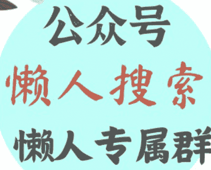
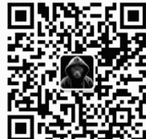
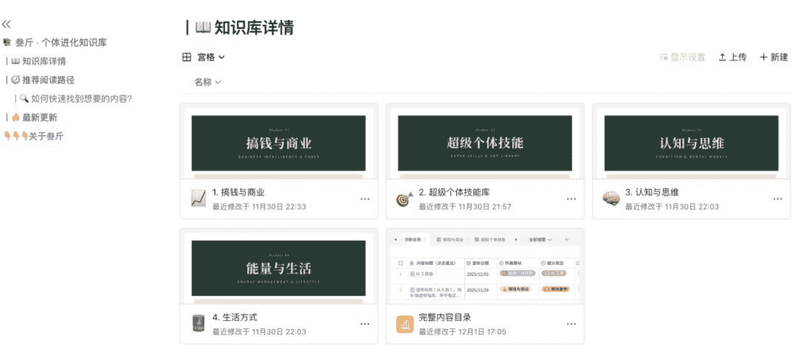
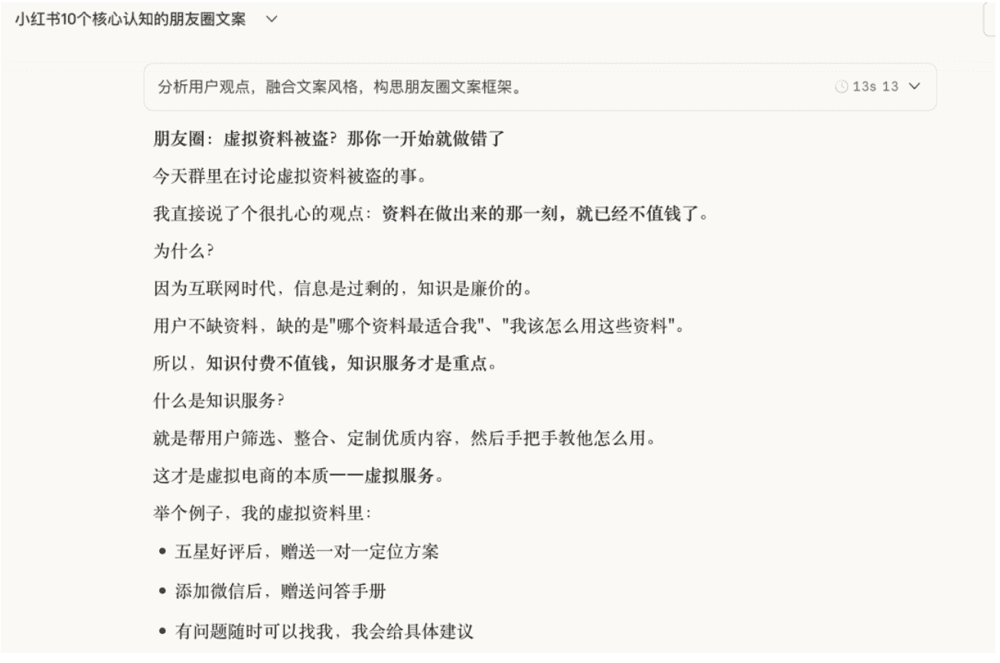
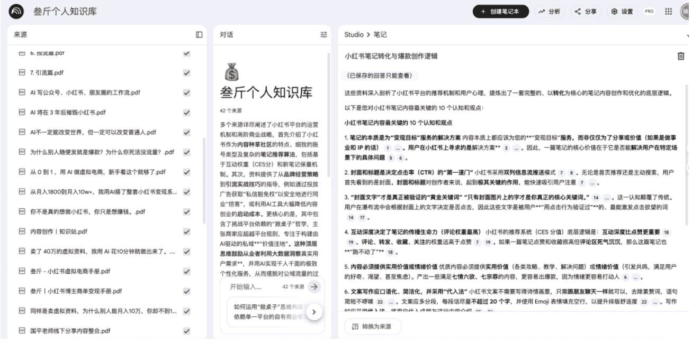
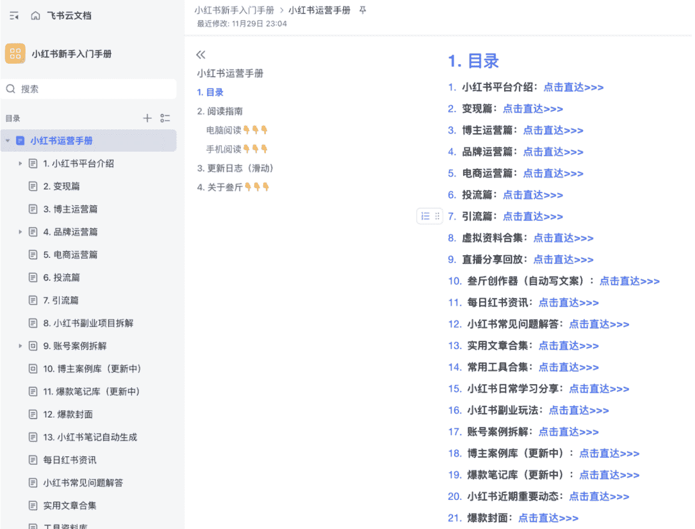
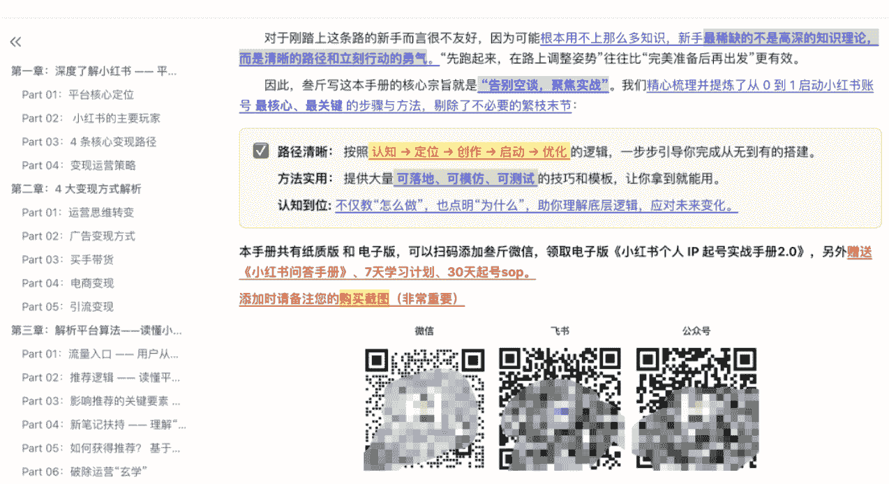

# 做小红书 5 年，一个人，一套 AI 体系，月入 10w+ 的实操复盘

251210 副业 SC 精华

公众号懒人搜索，懒人专属群独享

懒人微信: lazyhelper

微信:lazyhelper

哈喽，我是叁斤，深耕小红书马上第六年了，过去做过小红书博主、电商、引流、代运营、培训......

虽然能做出一些成绩，但这些业务本质上都是拿时间换钱，时间有上限，收入就有天花板。一旦账号被封，或者停更，收入就没了。

今天这篇复盘有点长，但对你 一定 很有帮助。

在 25 年初，我把所有的业务模式做了巨大的调整，完全放弃了 B 端培训和代运营，专注经营自己的 IP 账号和虚拟产品。

在 10 月份的时候我微信被封了，主账号被封 7 天，工作号永久封号，当时真感觉天塌了。但从封号到解封，有一周左右的时间，在与外界几乎断联的情况下，我收入并没有因此减少。

所以，我眼中的自由职业，不应该是随处办公，而是我不工作，系统依然在为我赚钱。

这篇文章，就是这个系统的完整拆解。

## 目录：
- 1、三个关键认知
- 2、五个可落地的系统
- 3、两个长期主义的坚持
- 4、只有写下来，才是你的

我是一个挺中二的人，喜欢看《完美世界》。里面男主「以身为种」，不选主流修炼体系，自己开辟新路。我也在做类似的事情。

做自由职业这几年，我发现有这三种常见模式：
- 快钱模式： 追热点、割韭菜，见效快但不持久。
- 团队模式： 做 MCN、规模化，天花板高但管理累。
- 系统模式： 搭知识库+AI，可持续可扩展。

今天重点讲我如何用 AI 搭建这套系统。

## 1、三个关键认知

### 认知 1：账号是消耗品，知识库才是资产

原来大家都在讲私域，只有私域的资产才是自己的。

但在 10 月份的时候，我的微信账号被封，主账号禁言 7 天，工作号永久封号，几个月心血差点白费，这时我开始怀疑是不是我对私域有什么误解。

问了很多人，有几个专门做私域的大佬，他们一个微信号上万人，也永久封号，一下封几个，损失几万个私域用户。

还有一些小红书、抖音的博主，做到几十上百万粉丝，账号一个不小心账号就被封了，所有沉淀都归零。

而且平台规则一旦有任何改动，过往的玩法全部都会失效。

就像现在小红书虚拟产品出了反盗版的新规，80%搬运、盗版资料的玩法都会死。

但是在我封号期间，我的公众号内容在持续传播，小红书店铺在持续出单，知识库的内容在继续累积……

所以，现在我会觉得，微信号、自媒体账号、粉丝，这些都是虚的，私域也不应该是「加到微信」。

只有你的观点 、你的经验、你的影响力……这些才是真的不受任何平台影响的私域。

把这些内容沉淀在知识库，才是真正的资产。而你的账号，只是知识库对外展示的方式之一。有这个知识库，你可以创造无数个账号。

什么是知识库？简单来说，知识库是一个工厂，只要你愿意，它就可永远为你生产内容。

我有几个知识库，写过的文章、我对小红书的理解、学习到的新东西……全部都有对应的地方可以放。

要写内容的时候，可以随时从知识库中调取。

### 认知 2：低客单 ≠ 低收入

很多人在往高客单上靠，普遍认知是： 高客单 = 高收入 。

这并没错，但更多情况下是： 高客单 = 高时间成本，很难逃出用时间换钱的陷阱。

我之前做过广告代投、代运营，也能收到比较高的价格，但是为此我要投入大量的时间。

而且，这些业务都是在消耗我，在没有团队的情况下，我的收入有上限，甲方会随时找你，提意见，算下来跟上班没太大区别。

后来自己做了虚拟电商，卖几十块钱的手册，一个月能卖几百单，但除了产品搭建外，每天只需要花 1 小时左右处理笔记问题，时间上节约了很多。

我也跟很多赚到钱的老板聊，并不是每一个都做高客单，很多做的都是低客单。

包括 AI 产品出海这些，都算低客单。 但大部分都是「边际成本为零」的产品，在产品搭建好之后，无限复制，无限售卖。

所以，低客单 并不等于 低收入，取决于你的产品形态。

### 认知 3：AI不只是工具，还是你的分身

如果你让AI写一篇小红书笔记，不管用多厉害的AI，提示词写的多好，这个笔记都不会太好，你们可以试试。

因为AI不是你，它的知识库过于庞大，你给再多限制，再多风格，写的内容也很少是能用的。

但是，如果你把前面搭建的知识库全部喂给AI，训练一个专属分身或者智能体，那就不一样了，它能提取知识库的内容，给你输出信息，AI只是帮你提炼和重构而已。

比如，我写了一个《小红书个人IP起号手册》，我是把5年小红书相关的笔记、常见问题、案例整理成知识库，再把这些知识库给AI，让它帮我提炼一个框架。

在我审核过没问题后，再提取信息，填充内容。最后人工审核、优化细节、加入独家经验，上架售卖。

这份资料就不是单纯AI自己瞎写的，而是几乎涵盖了我过往的知识，AI帮我整理而已。

喂给AI什么信息，取决于你要做什么。比如我要沉淀学习知识库的时候，我会给他播客、音频、优质文章的内容给他。

跟一个 AI 聊的越久，就越了解你。现在我的 Gemini 和 Claude ，比我老婆还了解我。

给你们看下，有个人知识库的 AI ，写出来的文案：

这跟我写的其实没太大区别了，我并没有给什么提示词，只是说「帮我写个以 xxxx 为题的文案」，并且交代一些背景。

## 2、五个可落地的系统

认知到位了，接下来就是搭建具体系统。

这五个系统，是我的完整路径。每个系统都可以单独运转，组合起来就是我的超级个体操作系统。

### 系统 1：知识库为圆心的内容生产流

以前要写一个内容，得刷同行，刷对标，或者自己头脑风暴。找到选题后再憋文案，写好发布。
一篇公众号文章得写半天，一条小红书笔记也至少半小时到一小时。

而现在，我只要持续学习，把所有的想法、观点、学习笔记都沉淀到知识库，由AI协助我输出内容，我就有源源不断的选题、内容。

我的输入源有几个：
- 1. 播客/音频/采访

把你觉得优质的播客等内容，用通义听悟转成逐字稿，再用 AI 生成详细笔记（通义的笔记不咋地）。
笔记沉淀在知识库，引用原文，随时可以学习和回看。

- 2. 优质内容/文章

在抖音、小红书等渠道刷到好的内容，全部用 get 笔记存起来。如果有条件有技能，可以自己开发一个工具，把内容沉淀在飞书多维表格。
get 笔记会分析内容框架，把这些也沉淀在知识库。

- 3. 实操经验

有任何的思路、想法，都会写成短文案，采集到飞书多维表格。在写成完整思路和流程后，再沉淀到知识库。

比如，我的每一条公众号文章、每一条朋友圈文案，都在飞书有备份。

这些知识库沉淀好后，全部下载，给 notebooklm 或者 LMA 知识库，个人觉得 notebooklm 无敌!

### 系统 2：把经验做成产品

我的店铺一共上架了3个资料产品，《小红书个人IP起号手册》《小红书虚拟电商手册》《小红书商单变现手册》，每一个都是几万字的手册。

但这些产品都不是单独写出来的，而是用 AI做出来的。

把我所有零散的知识、系统的知识进行汇总、整理，再按不同主题，重组成为一份完整的资料。

比如，《小红书个人IP起号手册》，写这个的时候，我是有一份完整的「小红书运营手册」，而且我想了一下，做小红书这几年，我最推崇的观点，就是做 IP。

不管电商、虚拟、引流还是啥，其实都离不开 IP ，做得好的全部都是 IP 账号。
所以，我把「小红书运营手册」大部分相关内容给 AI ，并且把我这几年做个人 IP 的一些思路、想法，都跟 AI 讲。

让 AI 基于我的信息，帮我整理一个手册框架。

然后，我会对照其他 IP 大佬们的课程，把框架修修补补，最后让 AI 基于框架完整写给我。

这样确保写出来的内容是我的，不是 AI 瞎写，也不是抄袭别人的。

在写完之后，自己还要一点点补充，补充图片、案例、方法，把文字写成口语化等等，最后才上线。

这里唯一要做的，就是沉淀你的知识库。

### 系统 3：像搭积木一样做虚拟产品

做虚拟产品最忌讳的是啥？花大量时间打造一个完美产品，然后才开始卖。

这是绝对的错误，先不讲产品会不会过时，最关键的是， 产品不可能完美。而且做得越好，就越担心卖不出去。

为了逃避「卖不出去」的问题，就一直不卖。不卖就不会失败， 就不会背锅。

当别人问「你虚拟资料为什么不赚钱？」，你会找借口「产品没做好」「我没去做笔记」。

但不管虚拟产品还是什么，只有「卖」的动作才是最关键的。

你可以把想象中的完美产品拆成一个个组件，再把一个个组件分别完成，做好第一个组件的时候，就可以上架卖了。

比如，我的《小红书个人 IP 起号手册》，在写到 2 万字左右的时候，我就开始卖了。

然后我写着「持续更新中」。根据用户反馈，不断优化产品。

当用户说，不知道怎么变现的时候，我增加「小红书变现方式拆解」。

当用户说，不知道怎么选赛道的时候，我增加「热门赛道推荐」。
当用户说，不知道怎么学习，不知道怎么起号的时候，我再附赠学习计划、起号SOP……

就这么凑吧凑吧，就从2万字凑到6万字。

当用户说，想接广告变现的时候，我又新增了《小红书商单变现手册》……
产品的矩阵就这么搭建起来。

整个虚拟产品的搭建过程，都是在卖的过程中让它变完美。就像积木，一块一块拼起来，才是有意义的。完整的积木，谁买啊……

### 系统 4：用SOP解决售后问题

不管卖啥，几乎都会遇到售后问题，这里说的售后不是退货这些，是一些问题。虚拟产品也不例外，会有很多奇奇怪怪的问题。
比如，发的货在哪里？怎么看？能不能给我pdf？看不懂、怎么起号……
刚开始的时候会花很多时间处理这个，后来全部SOP化。

比如，发货的时候附带一份「收货说明」，一步步教如何查看链接、打开链接......

加微信赠送《小红书问答手册》，只要有问题的，都先去看手册。

觉得不够详细，看不懂怎么起号的，五星好评后，填写信息做一对一定位方案（AI智能体完成）。

把这些都搞完之后，几乎没什么售后问题，需要问问题的就会加微信，赠送问答手册，也解决了 80%小红书问题。

省事很多。

### 系统 5：搭建安全的私域矩阵

前面说了，私域不只是加微信。但加微信确实是现在很重要的动作。为了保守，这一步我做了几个备用方案。

- 1.所有引流路径放到飞书。

购买小红书虚拟产品的，我会发飞书链接给他。飞书里面可以选择加微信、飞书或者关注公众号。

公众号加的，我也会给一个「叁斤个人说明书」，里面放我的联系方式。

简单来说，在加微信前过滤一遍。

为啥？

因为封号封怕了。而飞书的好处是，我可以实时更换联系方式。

前面图片我放了 3 个联系方式，微信封了，我可以立马更换一个二维码，后面再加的，就到新的微信上。

这也是我说的， 知识库才是资产。 只要知识库对用户有用，她是一定会经常打开看看的。

- 2.陌生用户先加企微

我现在好怂啊......过滤一遍还不够，还得先加企微......

现在大部分的微信用户，我都用企业微信再过一遍，避免同行举报之类的，朋友圈就同步个人微信的朋友圈。

完全不用担心企业微信没人味，我换了企微之后，转化率没有因此变低。但是收款更大胆了，能聊的东西更多了。

还有，企微只是过滤一遍，对于付费超过399（社群费用）的，我肯定会加到个人微信去。

我的完整流程是：
- 小红书发内容 ➡️ 购买手册 ➡️ 加企微/关注公众号 ➡️ 升高客单价
- 公众号发内容 ➡️ 加企微 ➡️ 私域卖产品

有这几步筛选，我的私域安全多了。当时微信封号的时候，很多发信息没回的，会从公众号、飞书上找到我最新的联系方式，所以并没有因此减少收入。

## 3、两个长期主义的坚持

系统搭好了，接下来就是长期坚持。

现在的互联网项目，永远是28定律，甚至19定律。

按照我过往带项目的经验，训练营类型的产品，90%的人做不成，其中有超过一半没坚持到训练营结束就放弃了。

我能走到今天，靠的是这两个长期主义的选择。

### 坚持 1：透明，就是最好的营销

很多做知识付费的，在网上发内容的时候会搞神秘，营造焦虑，制造稀缺，搞发售啥的。

不可否认，他们比我赚钱多了......

我的做法是，会在公众号更新很多教程啥的，包括我做产品的流程，类似的内容更新了很多。

我并不怕别人学会之后会怎么样，我相信大部分人是懒的。

10000 个人看过文章，1000 个人会尝试操作，100 个人坚持走完整个流程，10 个人能拿到一些小结果。

这是看文章学习的正常转化率，所以发这些教程，并不会影响我私域的课程转化。

还有，我不是什么大佬，关注过我的可能会了解，2025 年我才开始接触 AI ，我属于一边学、一边用的类型，丝毫没有掩盖这些。

所以私域用户、公众号用户是能看到我在成长的，能看到过程，能看到结果。知道我是怎么从小白，成长过来的。

我的店铺啥的，也都能被搜索到，结果可视化，所以对我来说，造假、夸大收入似乎没啥意义。

搞发售流程也不适合我，虽然很赚钱。因为我觉得现在是信息过载的时代，加上AI工具爆发，「知识」本身已经变得不值钱了。

信任、服务，才是真正值钱的。

发售的流程，很多事靠憋单，靠分销，消耗的是别人的信任，我觉得我还不配……所以我会尽可能的透明化，我所有信息都能公开，只有信任之后消费，我才觉得这个事是值得的。

### 坚持 2：不跟他人拼体力，要拼系统

做虚拟电商，有很多的流派，全自动批量上产品、全自动做笔记……，还有很多是招人批量做这些事。

这些都能赚钱，但跟我之前做代运营、做服务，没啥区别，这不是我想要的。

为啥？

首先，我的成就感不来自管理了多少人，赚多少钱，发多少笔记，而来自我的系统运行效率提升了多少。

其次，我不懂AI技术方面的问题（工作流、自动流都不懂），既然只有一个人，还不懂技术，而且已经30岁了，熬不动了……一天工作时间只能5小时……

我跟人拼体力，拼上品的数量、拼笔记数量？那我不是找死吗......

我能拼的只有系统。

在新的知识库搭建完成后，不管小红书算法怎么变，只要我的知识库还在，我随时可以用 AI 生成新的内容去适配新平台。

只要我的知识库持续更新，我的内容持续有人看，不管微信私域管理怎么严格，我都可以让这些人再加我别的私域。

## 只有写下来，才是你的

这就是我「以身为种」的路子。

以 5 年经验为种子，以知识库为基础，以 AI 做分身，长出一个超级个体系统。

这个系统让我不再靠卖时间赚钱，不再被平台规则束缚，也不再需要搭建团队。

我不知道能走多远，但很清楚的是， 不再用体力换钱，而是用系统创造价值。这条路一定是对的。

这一切，都是依靠「知识库」。

如果你的经验、你的过往、你的产品......都只存在你脑子里，那就白瞎。只有系统化做成知识库，这些东西才能被显现出来，才能被 AI 用上。

能把过往和经验写下来的人，在哪个时代都是赢家。

往前看，PC 互联网，在贴吧、论坛发表观点，能吸引大量的铁粉。

再往前倒两年，自媒体的黄金时代，把个人经验写下来的人，能获得大量粉丝，甚至能获得工作机会。

比如李叫兽，在公众号发了大量的优质内容，后来携团队加入百度，任副总裁（虽然后面离职了）。

而现在 AI 时代，写下来的人可以赢两次：
- 第一次：帮自己理清思路，更系统的思考问题。
- 第二次：喂给 AI，放大产出。

如果你也想搭建自己的系统，第一步：现在就开始写你的知识库。

公众号懒人搜索,懒人专属群分享

## 最后,安利小懒的付费群:

懒人专属群(介绍)

这里是你对抗信息过载的护城河。

已稳定运行6年,累计拆解、研读 3000+个互联网商业实战案例与行业前沿内参和时政/宏观文章。

我们不搬运垃圾,只做高价值信息的筛选器与放大镜。

懒人专属群更新记录:
https://hk57gvlx7u.feishu.cn/docx/H0kRdZbSboIBROxkaXtcuVEOnTg

懒人专属群更新记录(需梯子,备用):
https://lazybook.fun/blog/record2

【免责声明】本资料归档于社群内部知识库,仅供成员课题研究与学术交流,请在查阅后24小时内删除。