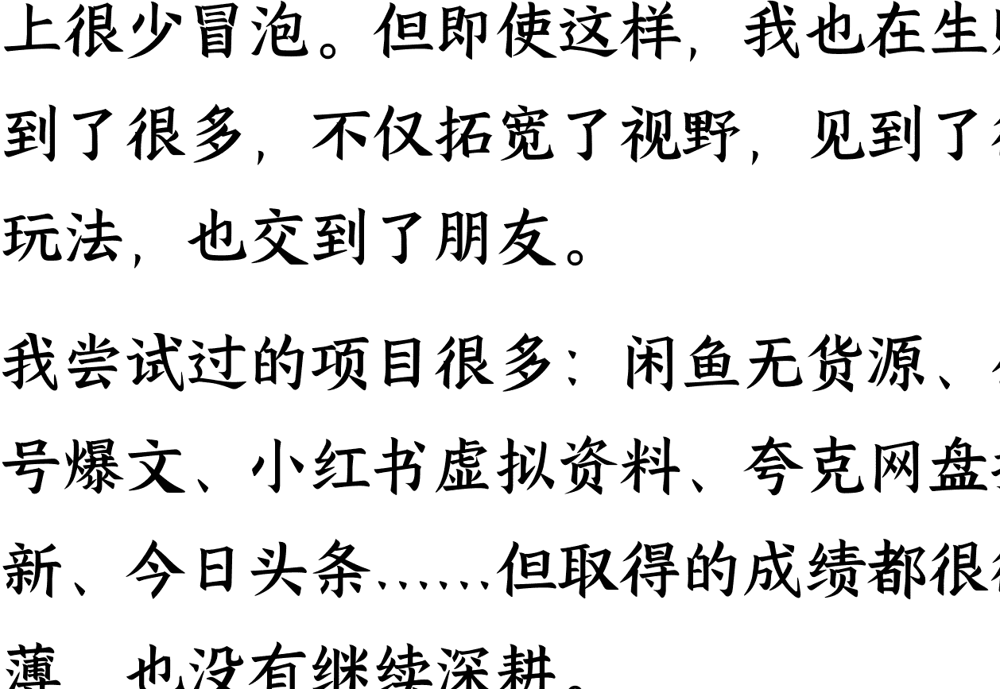
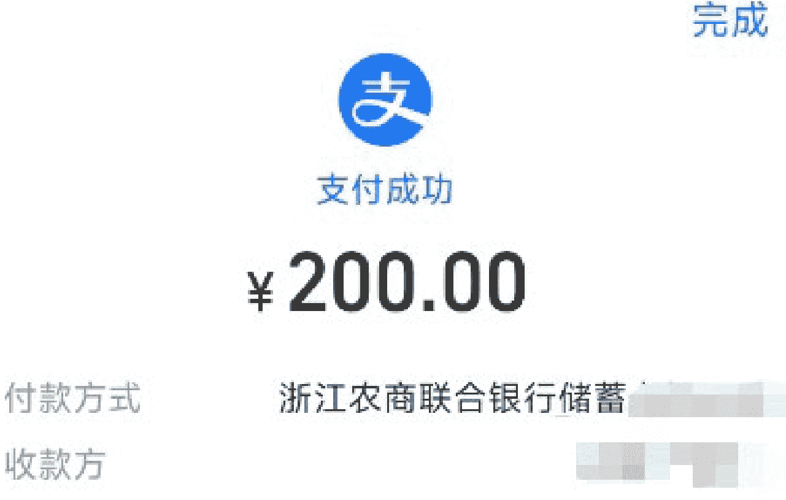
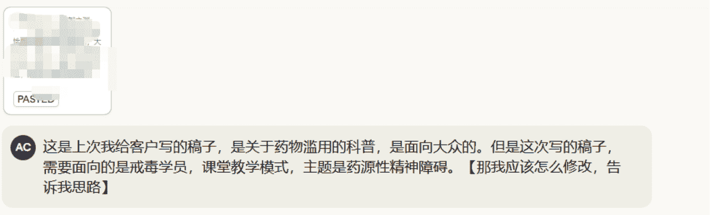
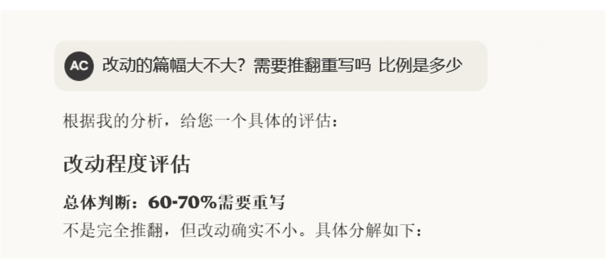
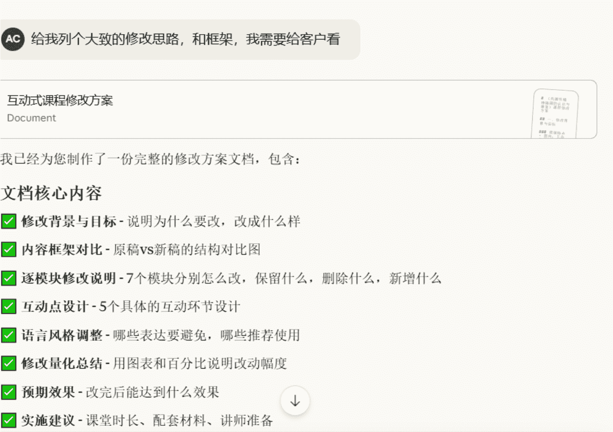
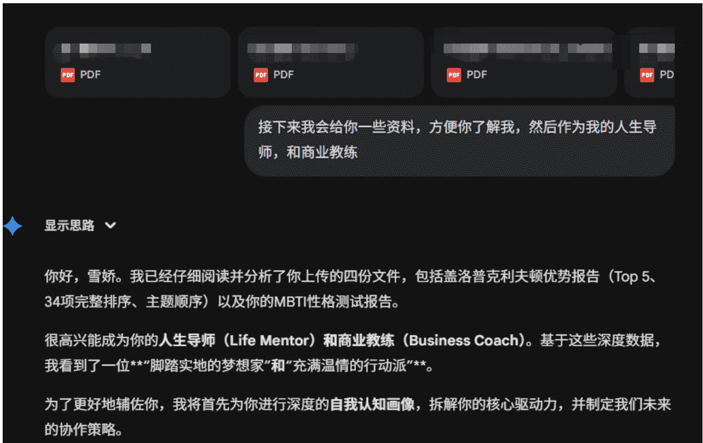
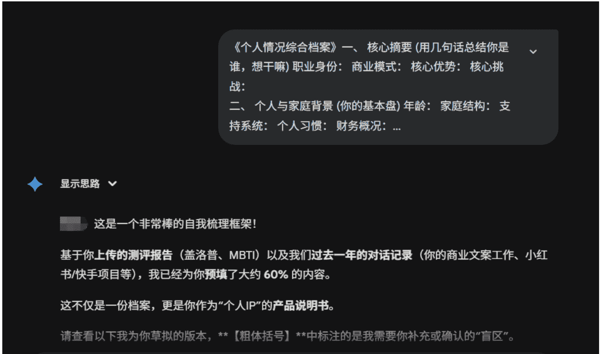

# 副业3年，试错无数：为什么我劝你放弃“流量焦虑”，深耕“技能资产”？

## 251210 副业SC精华

公众号懒人搜索，懒人专属群独享

懒人微信：lazyhelper



大家好，我是源源。加入SC3年多了。

在生财这几年，我一直在潜水，除了发发风向标，偶尔参加一下线下聚会，基本上很少冒泡。但即使这样，我也在生财学到了很多，不仅拓宽了视野，见到了很多玩法，也交到了朋友。

我尝试过的项目很多：闲鱼无货源、公众号爆文、小红书虚拟资料、夸克网盘拉新、今日头条......但取得的成绩都很微薄，也没有继续深耕。

直到后面遇到了短视频文案这个赛道，至今一直从事这个赛道。在业务淡季的时候，我尝试了快手带货，出单1000+，也算是又开辟了一个副业赛道。

在这个过程一路摸爬滚打，也沉淀下了一些自己做项目的经验收获。今天，我把这段亲身走过的来时路，毫无保留地复盘出来。希望也能给每一个同样不甘平庸、渴望改变的你，一点启发和实在的方法。

## 一、 我的项目试错

### 1.1 探店博主的三年：看似光鲜，实则焦虑

在此之前，我做了3年的探店博主。从2021年到2024年，整整3年时间里，我所有视频的文案和分镜头都是自己“手搓”出来的。没有团队，没有编导，一个人就是一支队伍。文案、拍摄、剪辑，全都要自己上。虽然我并不是传媒专业的，但在这个过程，我学到了很多，也积累了很多实战经验，早都成了一名“野生编导”了。

这份功底，让我对内容质量始终充满自信。但探店这行，真的太卷了。

不仅要卷资源，还要卷颜值，卷价格，我真真真的卷不过，也卷不动了。

卷资源，同一家店，十几个博主抢着合作，你不降价就没机会。卷颜值，同样的内容，长得好看的自然流量就是比你高。卷价格，就拿20W粉丝报价200来说吧，这价格我都不想拍，但还是有大量的博主前仆后继。

这种焦虑是渗透到骨子里的。收入的起伏不定，让我内心充满焦灼，每天晚上整宿整宿睡不着觉。而且探店这一行回款很慢，比如我这个月拍的单子，顺利的话三个月之后才能收到回款，不顺利的话甚至要半年。

自由职业本来就是不稳定的，这个月能赚一万，下个月可能只有两千。这种巨大的不确定性，让我时刻处于一种紧绷的状态。而且我不喜欢圈子里那种尔虞我诈的关系，大家表面上互称“宝宝”、“亲爱的”，转头可能就为了一个商单互相压价。这种虚假的关系，让我感到窒息。

我不知道下一单在哪里，不知道这条路还能走多久。


生活的压力最终让我选择妥协，重回职场。

我先是尝试去一家大健康公司当文案。在那里，我也算发挥了余热，产出过多条10W+爆款。但很快我发现，这家公司的业务模式非常陈旧，我就是冲着学投流去的，结果，我不仅学不到新东西，反而感觉自己在不断被消耗，因为后面拍摄的活也丢给我了。但并没有给我涨薪，于是，我果断选择了“跑路”。

后来，为了生存，我又去一家小公司当拆卡小主播。

那段日子现在回想起来，简直是噩梦。每天直播六七个小时，对着镜头强颜欢笑，还要忍受直播间里各种奇葩的弹幕。嗓子喊哑了，换来的却是 4000 元的底薪和微薄的提成。

那种一眼望到头、每天重复同样话术、同样动作的生活，彻底抽干了我的精气神。每天下播后，我瘫在椅子上，感觉身体被掏空，灵魂也无处安放。

我知道，这不是我想要的生活。我不甘心就这样变成一个只会重复劳动的机器。于是，我又开始在网络上疯狂找寻副业，试图能找到另一条适合我的出路。


## 二、 意外发现的“蓝海”赛道

转机发生得偶然又必然。

2024 年 2 月的某个夜晚，我一边在直播间强颜欢笑地喊着“欢迎宝宝进入直播间”，一边偷偷在桌子底下用手机刷闲鱼。那阵子代写也很火，我也尝试过接一些演讲稿、主持稿之类的散单，虽然赚得不多，但也算是一种慰藉。

那天，我突然灵光一闪：之前做探店博主时，那么多同行找我帮忙改文案，觉得我写得有网感。那我是不是也能把这个当成一个正经生意来做？

然后我就鬼使神差地在闲鱼搜索框里输入了五个字——“短视频文案”。

结果令我惊喜！这个赛道发帖子的人非常少，简直是一片蓝海！当时的同行加起来可能都不到 10 个，直觉告诉我，机会来了。我火速入场。

当时也不懂什么高深的运营，直接去付费学了闲鱼运营的方法，搬了同行的图文，稍微修改了一下，做成了自己的商品图，然后就开始发布。

很幸运，一时间很多人来咨询我，我发的第一条链接居然就爆了。

我当时的定价非常简单粗暴——1 分钟以内短视频文案 50 元一条，1 分钟分镜头（带文案）100 元一条。

第一个月，我靠自己做流量，然后自己写，就赚了 5000+。

虽然 5000 块在很多人眼里不算大钱，但对于当时拿着 4000 底薪的我来说，已经很不錯了，更重要的是，这是我靠自己的技能，不看脸色、不靠运气赚来的，而且每天花的时间并不多。于是，我果断辞职了，再也不直播了。我感觉不直播之后的我，精气神又回来了。就只需要每天在家写写稿子，赚赚稿费，平常每天都有个小几百，爆单的时候，每天也能上千。

那一刻我想，也许这就是我该走的路。从去年11月一直到现在，这是我唯一一个深耕并拿到持续结果的赛道，也是我真心热爱并为之奋斗的领域。

### 2.1 打造“正规军”人设与团队化

随着单量越来越大，我开始意识到，如果只靠我一个人“手搓”，上限太低了。我必须升级打法。

(1) 立人设：用专业度征服客户

在闲鱼上，客户往往通过聊天来判断你的专业度。对客户，我一直都以“传媒系研究生”自居。

也许你们会问，人家不要求看毕业证的吗？

说实话，做这行这么久，接单3000+了，我还真没遇到过要看我毕业证的。而且就算真的遇到了，大可以说：“这是隐私哦宝宝，不方便提供呢。不过你这边要写什么呢？我可以先给你分析下思路。”

我们可以用硬实力（专业话术、稿件质量）去说服我们的客户。当你能一针见血地指出他文案的问题，或者给出一个绝妙的创意时，人家根本不会在乎你到底是不是传媒系的研究生。

因为我有3年博主经验，所以我非常懂那些找人写文案的博主在想什么。他们痛点在哪里？哪里需要埋梗？哪里需要反转？

我能快速 get 到人家的点，写出人家满意的文案。

### （2）向外借力：从单打独斗到做流量 BOSS

早期的我，很多单子都是一次性买卖。后来跟着生财的荷包蛋老师、还有小鹅老师学习，我开始愈发专业。

我学会了运营朋友圈，学会了增强客户的信任程度。每天朋友圈更新着案例、好评、工作日常，靠朋友圈去转化存量客户，复购率也慢慢上来了。

同时，我也开始遇到了瓶颈——有些类型的文案我不会写，也有点写不过来了。于是，我开始了“外包”之路。

有一段时间，我跟一家淘宝店稳定合作。在这段经历中，我学会了阶梯报价。以前我只会报一口价，现在我会根据难度、急缓程度报价，利润空间一下子打开了。

但淘宝店也有搞不定的时候，那时候我就得自己兜底。因为不是每个写手都能写出那种“网感”。在那种时间短、情况急的情况下，如果我换人去做，万一还是不合适，我的口碑就砸了。所以，具备兜底能力，是做这个生意的核心壁垒。

这个阶段，我经历了从自己单一写文案、做流量，到成为流量的 BOSS，把单子派发出去。

我开始有意识地物色写手，留意身边有这块技能的人。虽然我现在绝大多数的写手都是那个时候沉淀下来的，但我的写手宝子们，个个能打，甚至还有拿过纪录片国奖二级的编导大神。

我自己可以不专业，但是我下面的写手专业，不就等于我专业吗？遇到一些专业性答不上的问题，我就去问我的这群写手，他们也很乐意解答，因为我们是互惠互利的利益共同体。

这个过程，我好像慢慢找到了一些对于生活的掌控感。每天忙碌又充实，累了就去足浴店，或是去做做头疗，要么就是出去晒晒太阳，打打球。我终于有了掌控自己人生的底气。

## 三、 试错快手好物：从0到1000单的弯路

### 3.1 毫无征兆的淡季与焦虑

好景不长。大概是 2025 年 6 月左右，我的文案订单突然开始下滑。

以前每天能接到 3-5 个咨询，那时候一天只有 1-2 个。以前每周能成交 5-8 单，那时候一周只有 2-3 单。收入直接腰斩。

我开始焦虑：“好不容易找到的赛道，难道又要崩了？”

更可怕的是那种不确定性。我不知道这是短期波动，还是长期趋势。我不知道下个月能赚多少钱，我不知道这条路还能走多久。

那一阵子，我每天都很焦虑、不开心，活得很压抑。这种恐惧，逼着我必须找一个“Plan B”。我不能只有一条腿走路，我必须找个副业对冲风险。

为了保住基础收入，我在社群里看到找外地出差的团购主播，月薪过万，每天只播4小时。我觉得很好，这样我既能保证生存，还有时间搞搞我的文案业务。

于是，我飞去了江西。那段时间，我每天除了直播，就是在写文案，剩下的时间都在研究新项目——快手好物。

### 3.2 为什么选择快手好物?

在各种社群、各种平台看了一圈项目后，我锁定了“快手好物”。理由太诱人了：

- 门槛低：不需要囤货，不需要拍摄，不需要真人出镜，只需要“搬运视频+挂链接”就能赚佣金。
- 可复制：教程很清晰，有人带，有社群，感觉“只要照着做就能赚钱”。
- 时间灵活：我可以兼职做，不影响文案主业。
- 赚钱诱惑：看到那些爆单截图，我心动了。“别人都爆单了，我为什么不行？我做了3年短视频，对内容有感觉，做这个应该不难吧？”


### 3.3 从0到1000单的实操打法

决定尝试之后，我报名了一个训练营，后来又遇到了现在的师傅——金成老师。跟着他系统学习了接近两个月，我终于迎来了我的 1000 单大爆款。

这里详细拆解一下我的打法，给想做快手的朋友避避坑。


#### 1. 选品是重中之重

做快手好物，选品是核心，投流只是“放大器”。我的策略是：严格遵循教程，起号期先选“低价”产品。

选品方法——“组合挖品法”：

- 刷爆款： 在快手搜索关键词（比如“男装”），找“高点赞，且发布时间比较近”的作品。
- 找对标： 找那种低粉高变现（百粉、千粉左右）的账号，只要他们近期有爆款，直接“抄作业”。
- 挖橱窗： 找价格低（19.9-59.9元）、佣金在10%左右、自己能带的产品。

#### 2. 内容直接“黑科技”搬运

黑科技软件：我把爆款视频的链接给到软件，它直接下载视频、去重、加封面、加封面字、挂链接发布。一条视频5分钟搞定。

飞书多维表格提效：为了发布方便，我做了一个飞书多维表格。手机选品填链接->电脑打开表格复制链接到软件->批量发布。

这比手动一个个去快手后台挂商品计划要快无数倍。我是个急性子，最受不了重复劳动，果断花钱买效率。

#### 3. 用微付费撬动自然流量

新账号没流量，我就依靠微付费（直播间微付费、粉条、极简投流），调节ROI，控制预算撬动出单。

爆单原因复盘：这次能爆1000单，最重要的原因是选对了产品（16.99元小百货，10%佣金，处于上升曲线）+微付费投流。后台订单一分钟几单地蹦，那种感觉真的很爽。

#### 4. 踩坑与罚款

爆单后引来了同行举报，理由是“材质不一”。快手平台直接判罚，罚了我400块。那次之后，我带货更加小心，凡是涉及到材质、价格不一的，一律不带。

### 3.4 为什么我决定放弃?

爆单1000单，听起来很牛，对吧？但当我坐下来认真算账的时候，我整个人都傻了。投流和收入差不多持平，也就是投500，佣金900，去除成本差不多赚400的样子，虽然能赚，但是成本太大了。再加上那阵子业务淡季，没有额外收入，然后就有点投不动了。

我每天忙得要死，从早到晚选品、发视频、盯数据、调投放。虽然朋友圈的战绩图很好看，但我是在给平台打工，给投流工具打工。更可怕的是，这种模式根本不可持续。停止投流，销量归零。而且佣金回款周期长，资金占用压力大。

就在这时，我在珍妮老师的社群，看到了天赋测试，群友都说很准。然后我也去做了测试。

创意表达/短文案创作： 95分（天赋所在）。

数据运营/投流电商： 持续消耗型。

我也回想了一下，从小到大语文作文都接近满分，这就是最早的信号。我只是一直忽略了这个天赋。

及时止损，是成年人顶级的自律。相比带货的焦虑，写文案时那种“心流”状态和满满的成就感，才是我真正想要的。我决定把快手“暂时放置”，回归我的文案主业。

## 四、 找到我的95分天赋，我又重新回来了

这一次回归，不再是简单的“重操旧业”，而是一次彻底的“认知升级”。

我开始更加专注，拓宽文体，提高客单价，并利用AI赋能，让文案变现的路径越走越宽。

### 4.1 什么才是值钱的“商业文案”?

在转型之前，我和很多人一样，对文案的理解还停留在“文笔好”、“写得优美”、“会写小作文”这个层面。

但跟着老师系统学习后，我才明白：文学是自我表达，而商业文案是解决问题。

什么是商业文案？ 简单来说，它不是为了感动自己，而是为了帮助客户达成商业目的。

目前市场上需求量大、且我（或借力老师）能够承接的类型，主要包括以下几大类（附市场参考报价）：

| 类别 | 文案类型 | 参考报价/说明 |
|---|---|---|
| 品牌公关类 | 品牌故事 | 800-2000 元/篇 |
| 品牌公关类 | 创始人故事/人物传记 | 2000-5000 元/篇 |
| 品牌公关类 | 企业宣传片解说词 | 400-600 元/篇（约2分钟） |
| 品牌公关类 | 新闻稿/软文 | 200-500 元+/篇 |
| 营销转化类 | 产品营销文案 | 1000-3000 元/篇 |
| 营销转化类 | 电商宝贝详情页 | 300-800 元/篇 |
| 营销转化类 | 活动策划方案 | 根据复杂程度报价 |
| 职场应用类 | 演讲稿/致辞 | 200-400 元/篇（约2000字）。年会演讲、行业峰会发言、就职演说。 |
| 职场应用类 | 岗位竞聘演讲稿/述职报告 | 帮助个人在职场晋升。 |
| 职场应用类 | 工作计划/工作总结 | 汇报工作的逻辑梳理。价格也跟上面差不多，像我知道一个圈友，现在工作总结，单篇都是 1K+。 |
| 高端商务类 | 商业计划书（BP） | 3000-10000 元/份 |
| 高端商务类 | 可行性研究报告 | 3000-10000 元/份 |

当我看清这个全景图时，我才意识到自己以前盯着几十块钱的短视频文案卷，是多么可惜。赛道选宽了，变现的天花板自然就高了。

### 4.2 从低价内卷到高客单商业文案

短视频时代，优质文案永远稀缺。这是我的基本盘。不管做什么业务，稳定的基础收入最重要。

回归后的第一件事，是打破我的“价格锚点”。以前，我觉得一篇几百字的短视频文案大纲，收50块钱已经很好了。直到我看到我的商业文案老师，光是给学员的二手大纲单子，起步价就是400。

这就是认知差！我以前是在“干活”，赚辛苦钱；而老师是在做“商业”，赚有钱人的钱（B端客户）。

我重新梳理了市场报价，并敢于把自己的价格提上来：

- 短视频文案： 以前 60 元/条，现在敢要价120-150 元/条。
- 宣传片解说词（2 分钟）： 以前 1 分钟100，现在报价 400 元。
- 演讲稿（2000 字）： 市场价 200-400 元起步。

### 4.3 能力与胆量的双重提升

以前遇到活动策划、演讲稿、商业计划书这类“高大上”的词，我的第一反应是：“我不行，我不会，没写过。”

现在，面对客户的询问，我会大方自信地说：“没问题，我们有过这块的经验，可以做。”

底气来自哪里？

借力老师，一份时间多重价值：这也是我最想分享的点。对于我老师那边，我不仅可以向他学习怎么去写，还可以和他合作。

兜底机制：遇到我不会写的，我就借力，直接对接给老师团队。

练手机制：我经常从老师那里接“二手单”来练习。虽然价格比一手单低一点，但我既赚了钱，又学了新文体的写法，还积累了案例。这相当于“带薪上学”。

文体版图的极度扩张：现在，我不只写短视频，商业文案的文体非常多。我整理了一下目前可以承接的范围，大家可以参考一下这个广度：

电商宝贝详情页、读后感、短篇悬疑小说、岗位竞聘演讲稿、工作计划和工作总结教程、活动策划方案、活动主持稿、品牌故事、人物传记、软文、商业计划书、述职报告、新闻稿、宣传片解说词、演讲稿、品牌介绍、公司简介、可行性研究报告等。这些文体，每一个单拎出来，都是一个变现的小赛道。

### 4.4 框架思维，对学新文体，就是降维打击

如何快速驾驭这么多陌生文体？靠死磕吗？不，靠“范文+AI 分析框架”。

很多文体剥去外壳，核心都是“框架+内容”。学会了框架思维，万变不离其宗。

和很多人第一步先分析范文不一样的是，我喜欢先让AI总结我的资料，然后再去分析。

【这一块的话，我也总结了一个超级无敌牛逼的提示词工作流，结尾也会一起分享给大家。我很喜欢写一些能赋能我业务的提效提示词，大家有更好的想法，也可以和我交流~】

#### 第一步：分析总结资料

接到一个需求的第一步，先是总结分析资料。拿到了客户资料，面对一堆资料，你是不是经常感觉头大？

那我们就可以借助AI去分析总结。如果资料不是很多的情况下，我的习惯一般是会自己先大致看一遍；资料很多，我就会主要看几个客户强调的重点文档，然后其他的资料当补充，直接放进AI里，归总到我们需求下面。

尤其对于一些PDF或者PPT，页数比较多的，我会自己先手动过一遍，眼睛看一遍，把重要的几页截图丢给克劳德，我一般用的是claude，像gpt，gemini这些也是可以的。然后再把其他的补充资料喂进去，归总总结。

#### 第二步：找范文

接到一个陌生需求（比如“戒毒所演讲稿”），我的老师会先给我一篇之前她写过的范文，让我分析学习。

#### 第三步：AI分析框架

把范文喂给AI，让它提取出一个通用的写作框架模板（开头如何切入、中间如何层层递进、结尾如何升华）。

通过AI，我能在5分钟内看透一个陌生文体背后的骨架。

#### 第四步：填充内容

然后再把我们刚刚整理的内容（客户的需求、行业的洞察、产品的卖点），填充进这个框架里。

AI负责“重复劳动”（素材整理、分析框架、填充内容），我这边负责“灵魂注入”（网感把控、情感价值）。这套组合拳下来，效率提升几倍。

### 4.5 真实案例复盘（新文体，一稿过）

为了让大家更直观地理解，我复盘一个真实的接单案例。

10:10
你当时看了有要修改的么老师

12:03
整体可以的，客户今天也回复我了没有要修改的，支付宝给我一个我转过来。

稿费
一稿过哇
今天有空了，的课给补了然后搞案例了
对滴



### 案例1：戒毒所演讲稿

背景：这是从老师那里接的二手单。如果是一手单，价格估计在 300-400 元。但对于当时没写过演讲稿的我来说，这 200 元赚得非常香。举个例子吧，我那篇写的一个戒毒研究所的，面对已经成瘾的“主要是这次面对的人群是戒毒学员，不再是大众，并且是课堂教学模式，然后主题偏向药源性精神障碍。”，那可能放之前我就不会接了，“药源性精神障碍”这个是什么啊？但是现在有了AI想知道什么不容易呢？

需求：客户群体从之前是面向大众的，转变为面向的是戒毒学员，课堂教学模式，主题是药源性精神障碍。需要我先给到改写的思路，且我需要告诉我老师改动的篇幅，方便她报价。

难点：完全陌生的领域，且需要极强的情感共鸣。

操作：
- 先理解客户的需求，然后再去下手。那怎么改，改动的篇幅多大，直接问AI不就好了。ps.反正能不动脑子的，我是不会动脑子的。




## 我的建议

方案A：保守改法（保留70%框架）
- 开场改成共情式
- 删除ICU及多余案例
- 成瘾四阶段保留，去感叹号
- 治疗方案扩充
- 结尾改正向

方案B：彻底重构（推荐）
- 用您原稿的素材（小然、治疗方案、科学知识）
- 但完全按照"课堂教学→戒毒学员→赋能康复"的逻辑重新组织
- 成品会更专业、更有效

AC 方案B写个开头 然后两个开头对比一下
现在让我给您详细对比这两个开头：
深度对比分析
方案A开头（保守改法）
优点：
- ✅平和、不刺激，适合敏感的戒毒学员
- ✅直接点题，清晰明了
- ✅语气友善，"没关系"传递接纳感
- ✅改动最小，保留原稿风格

缺点：
- ❌缺乏吸引力和互动性
- ❌没有破除学员的心理防御
- ❌像传统说教式开场，容易让人走神
- ❌没有建立"这堂课对我有用"的预期

适用场景：
- 学员情绪不稳定，需要温和对待
- 讲师不擅长互动式教学
- 时间紧，需要快速进入正题

那我们的关键作用就是在于分析，做取舍了。遇到两个方案，那我们不知道哪个好，就都试试。我比较喜欢看克劳德最后的那个总结，他也会给到推荐的建议，那我就是根据实际情况，以及他的推荐，最终确定了方案A。

我的建议
- 如果您是第一次给这批学员上课→推荐方案B
  - 需要建立信任和打破防御
  - 这个开头能让他们感觉"这个老师懂我"
- 如果学员已经上过几节课了→推荐方案A
  - 已经建立了基本信任
  - 可以直接进入主题
- 如果您的讲课风格偏理性、学术→推荐方案A
  - 保持一致性，不要强行互动
- 如果您善于调动情绪、现场控制力强→强烈推荐方案B
  - 能把这个开场的价值发挥到最大

您更倾向于哪一个？或者我可以帮您把两个方案的优点结合一下，做一个中间版本（方案A.5）？

AC 缺点：❌缺乏吸引力和互动性 ❌没有破除学员的心理防御 ❌像传统说教式开场，容易让人走神 ❌没有建立"这堂课对我有用"的预期【但是这些缺点，没有攻克，我希望能调整下，另外我这个本来就是一个课堂的互动教学】
明白了！您要的是：专业但不枯燥，有互动不煽情，既有延续性又能抓住注意力。

> 现在的开头可以的 那如果照这种互动式的修改 和最开始我给你的稿子对比 修改幅度在多少
让我仔细评估一下，按照这个互动式开头的标准来改全文，修改幅度会是多少：
修改幅度评估（互动式标准）
总体判断：需要改动75-80%
比方案A（保守改法60-70%）还要大一些。

然后上面不是已经提到了方案A的弊端了吗？我们接下来就是一步步去调整，优化，并再次确认调整的比例。

> 给我列个大致的修改思路，和框架，我需要给客户看


最后看文案差不多了，就可以让他列框架了。然后跟客户确定框架没问题了，再去出文案，润色文案就可以了。所以这篇文章，我前后花了不到一个小时，真的很快。

### 4.6 持续深耕的收获

现在的我，说不了月均收入多高多吓人，但我最大的收获是状态的改变。我没以前那么累了，我是一个身弱之人，脑子用多了，就会觉得累累的，所以现在特别保护自己的能量，只写客单价高的单子，当然有空也会接接小单。

依靠高客单价和AI提效，我不需要通过疯狂堆时长来赚钱。我会留出更多的时间去思考，去复盘，去优化未来的方向。

从“疲于奔命”到“从容思考”，这才是深耕天赋赛道带给我最大的红利，并且现在我也会主动的去和行业内，同样在做商业文案的小伙伴去交流，然后相互赋能。这要放以前是不会的，只会被动的等着人来加我。

## 五、心法总结：如何选择适合自己的赛道

回看这段从月入4K到破万，从探店到快手再到文案的折腾史，快手这段经历，虽然没赚到什么大钱，但给了我很多宝贵的收获。

今天，我把这些收获总结成5条心法，送给每一个正在迷茫、正在试错的你。

### 5.1 试错不是失败，是“排除法”找答案

很多人害怕试错，觉得那是浪费时间。 但我现在看来，快手那段“失败”的经历价值千金。

如果我不去试，我永远会惦记着那个“睡后收入”的美梦。试过了，碰壁了，亏了钱了，我才心甘情愿地承认：那碗饭不适合我。 人生的答案，不是“想”出来的，而是“试”出来的。试错成本，永远低于“一直在做不适合自己的事”的沉没成本。

### 5.2 “适合”比“赚钱”更重要

别人做那个能赚几百万，不代表你也能。 快手能爆单，但我做得痛苦。文案客单价更高，但我做得快乐。 所谓“天赋赛道”，就是“热爱 + 擅长 + 赚钱”的交集。

公众号懒人搜索，懒人专属群分享

如果在擅长的领域努力，你是事半功倍；在不擅长的领域死磕，你是事倍功半，还会把心态搞崩。

### 5.3 “向内求”：认清性格和优势

我是一个急性子，不喜欢重复劳动，但我喜欢创作，喜欢那种“无中生有”的成就感。

而写文案的过程之中，每个客户的需求都是新的，每一句金句都能得到反馈。我也很享受创作的心流状态。

选赛道要“因人而异”，顺应本性做事，钱是顺带的结果。

我们也可以多去做做天赋测试，盖洛普、MBTI、星盘什么的，我做过很多了。因为我觉得人需要先看清自己。




## 一、核心摘要

- 职业身份：商业文案撰稿人/短视频脚本策划/个人IP操盘手
- 商业模式：为B端客户及腰部博主提供以“高情绪价值”和“软广种草”为核心的短视频文案定制服务；目前正在通过小红书建立个人IP以实现客户引流。
- 核心优势：极强的前瞻性思维与落地执行力结合，擅长通过“观察者”视角拆解爆款逻辑，并将理性卖点转化为感性的生活场景。
- 核心挑战：【需要你补充：目前是从“服务交付”转型到“个人IP”过程中，最让你头疼的是流量获取、时间管理，还是商业变现的路径？】

## 二、个人与家庭背景（你的基本盘）

- 年龄：【需要你补充】
- 家庭结构：【需要你补充】
- 支持系统：【需要你补充：比如是否有合伙人、助理，或者家人的支持程度？】
- 个人习惯：倾向于搜集和整理信息，喜欢深度的一对一交流而非泛泛社交。
- 财务概况：【需要你补充】

## 三、职业与商业经历（你都干过啥）

- 过往经历：从快手电商带货项目转型至专业商业文案策划；深耕短视频（抖音/快手/小红书）内
强烈推荐大家可以去做一下鸭先知老师的那个测试。

（大家也可以去他的帖子给他点个赞，嘻嘻~）

鸭先知 2025-08-11 20:05 来自：生财有术

### 3天，20万字对话，我把自己“扒光”喂给AI生成了一份6万字的个人剖析报告

一套可复制的提问系统，教你如何AI深度的解剖自己，为自己的发展方向找到清晰的路径

我花了3天时间，跟AI聊了20多万字，给自己做了一次深度“解剖”，多次精简修改后生成一份6万字个人分析报告，与一份针对发展报告的注意事项，我得到的，不只是一份简单的”...

3天，20万字对话，我把自己“扒光”喂给AI生成了一份6万字的个人剖析报告
31赞，1评论 主题详情 >

按照他的步骤，我对自我又进行了一次深刻的剖析，包括对我接下来的内容创作，人生卡点也是很有帮助的。

虽然这个“揭开伤疤”的过程会有一点疼，但随着测试的深入，越来越柳暗花明的清晰感，会让你格外愉悦。

### 5.4 不要轻易裸辞，以兼职状态入场

我做快手的时候，幸好文案主业还在。给新人的建议：强烈建议“兼职”入场。除非你有半年的存款，否则别裸辞。有一份稳定的基础收入，你的心态才不会“畸形”，动作才不会“变形”。

### 5.5 止损比坚持更重要

以前我总觉得“坚持就是胜利”，但现在我明白了：“在错误的方向上坚持,是最大的浪费。” 快手项目，我及时止损，回归主业，是我做得最明智的决定。学会“断舍离”，把精力留给真正重要的事。

## 六、小结

现在的我，虽然离“大富大贵”还有很远的距离，但我现在跟着已经在这块做出了很大成绩的老师，在对的方向持续学习，我相信，我早晚也会拿到上K一篇的稿件，只是时间问题。

迷茫的时候，我们一定要多出去走走，透透气，感受下生活的烟火气。多出去跟朋友聚会，或者多去参加生财的线下聚会，跟朋友们碰碰。

在我业务淡季的那段时间，我感觉每天都很压抑，要窒息了。即使在这种情况下，我还依旧是每天都在看同行的朋友圈，看到同行爆单，我就开始焦虑，甚至怀疑自我的价值。

直到后面我才明白，暂时的低谷并不可怕。

如果你也像我一样，在迷茫期不知道该往哪里走，我想告诉你：

别怕试错。 一定要大胆的尝试，趁着现在还年轻，找到适合自己做的项目，然后把它做透做深。

别死磕。 学会止损，回归适合自己的赛道。

别放弃。 只要内心那团“热爱”的火焰不熄，就一直往前走。

愿你我都能在热爱中前行，在孤勇中成长，找到属于自己的那片星辰大海。

## 🎁创作提示词工作流

（直接创建副本，就可以保存使用啦~~）：

```
https://uh4tzunhi6.feishu.cn/wiki/YSxFwTQYMiXosOk64HNc4Dhn6c
```

最后，安利小懒的付费群：

懒人专属群（介绍）


📖 这里是你对抗信息过载的护城河。

已稳定运行 6 年，累计拆解、研读3000+ 个互联网商业实战案例与行业前沿内参和时政/宏观文章。

我们不搬运垃圾，只做高价值信息的筛选器与放大镜。

## 懒人专属群更新记录：

https://hk57gvIx7u.feishu.cn/docx/H0kRdZbSboIBR0xkaXtcuVE0nTg

## 懒人专属群更新记录（需梯子，备用）：

https://lazybook.fun/blog/record2

【免责声明】 本资料归档于社群内部知识库，仅供成员课题研究与学术交流，请在查阅后 24 小时内删除。