# 大龄程序员“偷时间”做 B 站好物，每天一个半小时，依然可以月入过万！

251210 副业 SC 精华

公众号懒人搜索，懒人专属群独享

懒人微信：lazyhelper


## 前言

哈喽，大家好，我叫辰木，我是：会有一些“鬼点子”，我在本职工作已经占了全天绝大部分时间的前提下（早上7点出门，晚上7点半到家、11点必须睡觉），依然可以保持稳定输出。

我的一些方式方法，应该会对同样是还在白天上班、晚上回家做副业的圈友，有一些帮助。

## 一、大龄程序员，每天“偷时间”做副业

### 今日头条：沉浸在简单的快乐之中不能自拔

第一份副业做的是头条号的问答，差不多是2016、2017年，当时号称要对标知乎，平台会按照你回答内容的阅读量给钱（这个业务在2020年左右就被头条砍掉了）。

我做的一个软件开发类的账号，最多的时候，一个月差不多挣四五千吧，那时候工资也才两万，副业能挣四五千已经很满足了。

做了一年，后来头条的问答社区没做起来，平台不再扶持了，流量骤降，我也就没再做了，前一天还能日入两三百，第二天就没钱赚了。

不过做这个过程中，我有几点收获：

- 1）选对领域很重要（也就是选品）
我在今日头条上发软件开发的内容，看到人很少，也不知道引流，这一步就走错了。当时历史、军事类的账号，收入是我的三四倍，但是我自己觉得对这些领域都没接触过，肯定写不好，就这么错过了。

- 2）尽量不要做一份投入一份回报的工作
回答一道题，挣一份钱，如果哪天没有回答，第二天就没收入，边际成本太高，尽量不要沉浸在这种“快乐”当中，而是要想办法流程化、自动化，让工具和AI帮你完成这些工作。

### 知乎好物：真正的核心收入

头条这个项目结束之后，我就开始四处找副业项目来做，在这个过程中知道了生财，这个时候我已经有了知识付费的意识，所以果断加入了生财，也正好赶上了生财的知乎好物小航海，带队的是家蒙老师。

按照当时知乎好物的逻辑，只要你的文章能排在关键词搜索的前几位，那真的是可以到“躺挣”，当时我有几个选品能排在搜索的前三位，所以收入还是不错的。

| 交易信息 | 状态 | 金额 | 时间 |
| :--- | :--- | :--- | :--- |
| 提现到银行卡(2221)<br>交易单号：ZHPAY202302201034...<br>支付方式：创作者收入 | 提现：完成 | -¥7789.98 | 2023-02-20 10:34 |
| 好物推荐 - 京东 2022 年 12 月收入<br>交易单号：ZHPAY202302201003...<br>支付方式：创作者收入 | 收入：完成 | +¥7771.62 | 2023-02-20 10:03 |
| 你在「知乎付费咨询」新增回答收入<br>交易单号：ZHPAY20230212221...<br>支付方式：创作者收入 | 收入：完成 | +¥18.36 | 2023-02-12 22:14 |
| 盐选会员订阅<br>交易单号：SVIPR20230202102...<br>支付方式：IAP 支付 | 消费：完成 | -¥19.00 | 2023-02-02 10:24 |
| 提现到银行卡(2221)<br>交易单号：ZHPAY20230119141...<br>支付方式：创作者收入 | 提现：完成 | -¥12105.07 | 2023-01-19 14:11 |
| 好物推荐 - 京东 2022 年 11 月收入<br>交易单号：ZHPAY20230119140...<br>支付方式：创作者收入 | 收入：完成 | +¥12105.07 | 2023-01-19 14:02 |

#### 在这个过程中，我的几点收获：

- 1) 选品，还是选品
虽然我有几个品类的搜索排名还不错，但是这些品类的流量、客单价和佣金都很低，所以这就决定了我的收入上限；不过也多亏这些品类，流量虽然低，但是竞争确实也小，所以能让我晚进场一年的情况下，依然喝到了汤。

- 2) 多账号，用数量撞概率
我前后做了三个账号，后面两个账号，比第一个账号还晚一年，入场太晚，没有挣到多少钱。现在我反思，在看好这个项目的那一刻，在自己时间和精力允许的情况下，就应该尽可能多账号投入，测试更多的品。很多时候，不是你做的比别人好，真的就是因为做的早。

### 百家号：微信群“捡来”的副业

在一个全是博主的群里，看到一个百家号博主的晒单，月收入差不多一万多，但是他小心地隐去了自己账号，生怕别人知道他发的什么内容。

嗯，是的，不少博主都不会告诉自己的账号是什么，因为很容易引起恶性竞争，甚至有些人会举报你。不过我还是把他的号挖了出来（有时候感觉自己像个侦探），他的号主要是发心灵鸡汤的视频，靠着播放量挣钱，顺便带货卖书。

没想到这种“粗制滥造”的视频，在百家号的流量这么好！我看到他账号的第一眼，就知道：这个账号可以模仿，并且可以用软件+ RPA 机器人，批量做视频。

然后我赶紧注册账号，跑通流程，再对整个流程进行拆解，有些步骤可以通过程序完成，剩下的我都写了 RPA 机器人脚本，整个流程基本做到了自动化。三个号，每个号每天发 15 个视频，只需要 30 分钟。

当年三天跑通全流程，6 月份开始发视频，7 月份开始有收益，3 个号的收入加起来，每个月差不多一万多，而我每天花费的时间，只需要半个小时，这个项目差不多吃了一年。

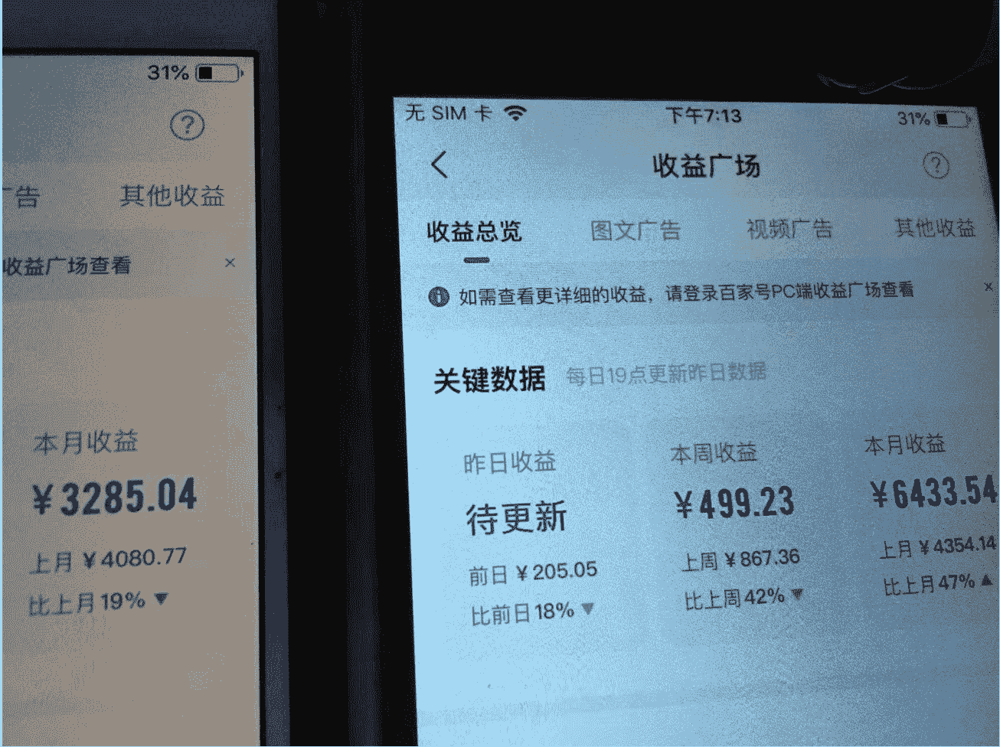

#### 在这个过程中，我的几点收获：

- 1) 保持“搞钱”的敏感度
百家号项目最让我开心的是，这个项目不是我跟着别人学的，是我自己发现的，自己摸索着跑通的，所以我现在再刷抖音、小红书、B站的时候，时刻会想着，他们能挣钱吗？他们是怎么挣钱的？

- 2) 全自动真的太香了
每天半小时，月入1W，这个投产比真的很不错。当然，不同的项目自动化程度可能不一样，只能说尽可能用工具、用AI代替手动。

## 二、B站好物：从来没有想过，做视频原来这么简单

### 晒晒收益：正反馈来的最快的项目

随着知乎的没落，百家号开始打击低质视频，我的副业收入直线下降，这期间我一直在寻找新的项目，项目尝试过小红书资料引流、公众号爆文、抖音图文电商、AI博主等很多项目，都没有拿到太大的结果。

直到遇到了 B 站好物深海圈，虽然深海圈设置了学费的门槛，我还是义无反顾地报了名（虽然家蒙老师不太喜欢被叫老师，也好像不太喜欢别人感谢他，不过当时我能义无反顾地报名 B 站深海，有一大部分原因是冲着靠谱的家蒙老师的），以前对视频一直都有畏难情绪的我，没想到正反馈来的这么快。

9 月 7 日发了第一个视频之后，就有人点击蓝链查看商品了；9 月 13 日发了第二个视频，第二天就开始出单；后面每发一个视频，多多少少都能出单，我也基本上保持一周发一个视频的节奏；

到了 10 月中下旬，就进入了双十一，我在整个双十一期间，佣金+奖金+商单，差不多挣了两万多，不算什么傲人的成绩，但也基本符合我自己的预期。

#### 佣金


全部订单明细 热
奖励活动数据 当月预估奖励金额 ¥ 1,351.73 >
超级补贴数据 新 当月预估补贴金额 ¥ 104 >

#### 效果数据 更多 >

今天 昨天 近7天 近30天
点击量 引入UV 14169 6670
有效订单量 有效订单金额 预估收入 794 ¥546204.82 ¥14005.79

#### 订单明细 推广商品分析

所有订单 (今日实时) 更多 >
主订单号：326356690554 已付款 订单号：343331737455 PLUS会员 下单：2025-11-13 08:37:57
首页 佣金 榜单 消息 我

### 我投入了什么？

- 1）必备的：
一个B站的账号（需要1000粉丝，不管想什么方法，弄到1000粉丝就行）
一个麦克风（100多块，正好我在做AI博主的时候买过）
- 手机（拍摄手机就够用了，不用特意买相机）
落地的手机支架（必备，几十块）
剪映svip（我感觉啊，有个vip会方便很多）
- 2）非必备：
- 闲置的pad（非必要，这个主要是当提词器用，没有的话也没有关系，可以用手机的前置摄像头拍摄，或者买个几十块钱的提词器）
- 补光灯（非必要，我是挣到钱之后才买的，前期可以不买）
- 搞定设计或其他设计网站的vip（做封面，做PPT用，这个是看自己，也有不花钱的）

## 三、稳定出单，我做了什么？

### 贯穿我所有工作的核心思想

### 采用适合自己的方式

有的人全职做，有的人副业做，有些人上班可以摸鱼，有些人上班一点儿时间都没有，每个人的情况不一样，所以不要硬套。

先讲讲我每天的时间安排：
7:10 出门，为什么这么早？因为要送孩子上学，我也就直接去上班了
7:15-7:40 我一般打车到单位，路上 20 分左右，我会刷刷对标账号或者搜集搜集资料（20 分钟）
7:50-8:30 到单位，快速收拾完，然后拿出自己的电脑开始搜集资料、改稿子（40 分钟）
8:30 来单位的人多了起来，我也就把自己的电脑收起来，起来活动活动
9:00-11:30 上午的工作
11:30-13:00 吃完午饭，回来休息一会儿，如果有时间，改半小时稿子（30 分钟）
13:00-19:00 下午的工作，晚饭
19:00-20:20 回家之后休息几分钟就得去接孩子（20 分钟）
20:20-21:00 跟孩子聊聊学校的情况、看看作业、洗漱
21:00-22:30 终于有大块的时间做副业（90 分钟）

工作日的时候，我一天只有晚上一个半小时可以用来做副业，其余的时间都是“挤出来”、“偷出来”的，有些工作我是用手机完成的，效率远不如在电脑上操作，但它是最适合我的。

所以希望你在规划每天工作的时候，一定要结合自己的实际情况。

### 善用 AI，但是不要完全依赖 AI

我看有些人上来就用 AI 写稿子、用 AI 配音，但是我的建议呢，在做 B 站好物的初期（包括做其他项目），不要用 AI，先自己做几个视频：自己写稿子、自己录视频、自己配音、自己剪辑，了解整个流程之后，再考虑哪些步骤可以用 AI 提效，原因有几点：

创造性的工作，自己要会：重复性的劳动，用 AI 没有问题，比如搜集资料、整理资料，没啥技术含量，你可以用 AI；但是对于创造性的工作，比如写作，我一直坚信，你有 60 分的水平，用 AI 可能做到 80 分，但是你的水平是 0，用 AI 做出来的东西也不会特别好；

对自己能力有提升的工作，要自己做：配音，貌似也是重复性的劳动（不就是对着稿子念一遍嘛，完全可以用 AI 实现），我做了十多个视频之后的感觉是，这个是真有用啊，第一篇稿子我念一念就磕巴，等到第十篇的时候，已经非常流利了，相信等到第五十篇、第一百篇的时候，我的表现力也会有很大的提升，等我的能力提升到一定程度的时候，再考虑用 AI。

前期先尽可能降低成本：我反思之前失败过的很多项目，就是投入大、产出少，正反馈来的太慢，很容易就放弃了，现在好用的 AI 工作都是要花钱的，ChatGPT 买个会员，MiniMax 买个会员，别的什么什么再买个会员，成本渐渐就拉上去了，这时候如果没有产出，很容易着急，只要一着急，你的动作就容易变形。目前我用的所有AI工具都是国内免费的，后期等你挣到钱了再迭代。

### 选品

#### 选品虽然不能定生死，但是能定收益

前面的很多项目都教会了我，选品很重要。但是选品也要灵活，要结合流量、下单率、佣金、竞争度等等来综合考量。

比如冰箱、洗衣机这种大家电，流量高、佣金高，有时候卖出去一个能有几百的佣金，但是竞争也很激烈，你发一个视频可能都泛不起来水花。

#### 方法一：大海捞针

##### 看似笨，实则很有效

打开京东的首页，就能看到所有商品的列表，一个品类一个品类的看，看起来很笨，但实际上很有效，而且任何时间都可以做这件事儿：

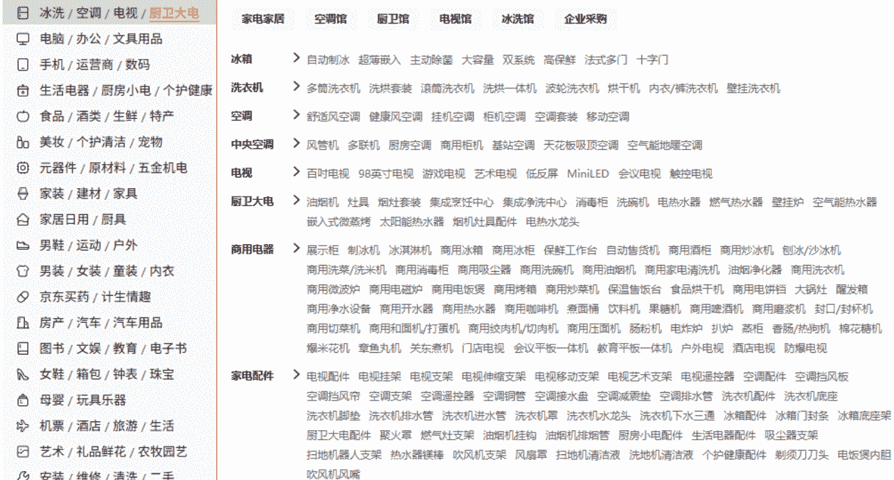

##### 我主要看这几点：

- 在京东里看看产品的销量，热销产品销量几百万、几十万，普通产品几万也行；
- 在京粉里看看产品的佣金，一单能赚 20 块钱以上，如果是小众一些的品类，佣金越高越好；
- 在 B 站搜一下这个产品，第一页里面，有没有近几天发的视频。

在 B 站里面，如果搜索第一页，近一周发的、播放量几百几千的视频越多，说明这个品类的竞争相对不是很激烈（B 站会给新视频机会），反之，如果 80%的视频都是几万、几十万的播放，说明这个品类不是很容易“挤进去”。

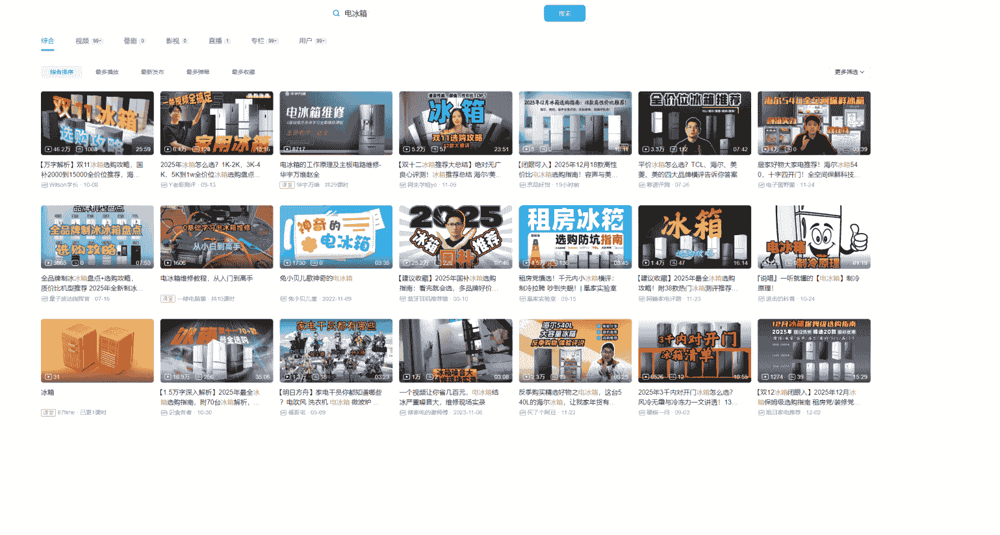

#### 方法二：找细分领域

大领域挤不进去，我找细分领域的还不行吗？

如果我还是觉得电冰箱的佣金香，卖一台顶别的产品 10 台，我就想试一试，怎么办？可以找细分领域，在 B 站里面搜索电冰箱，可以看到各种联想词：

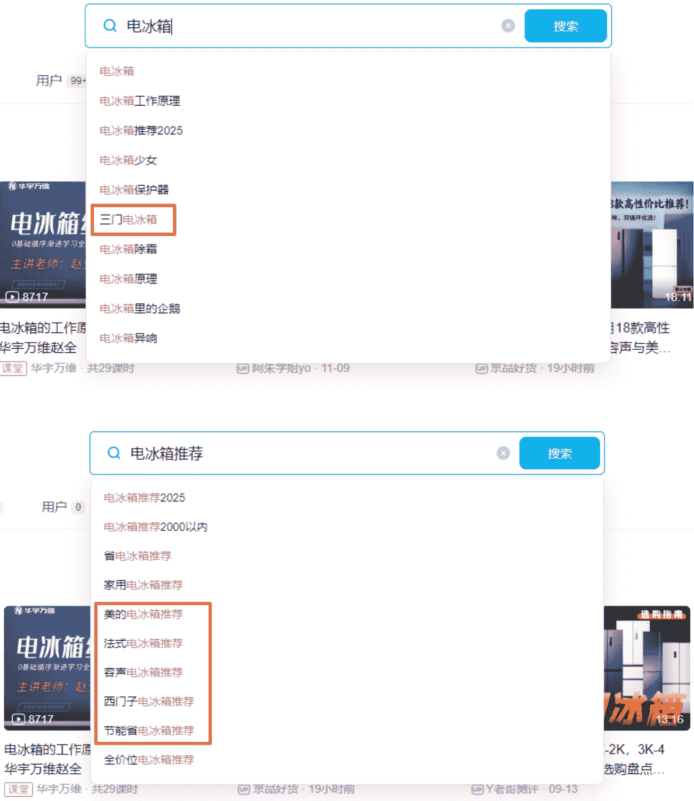

电冰箱推荐范围太大，那么我就先做一个《三门电冰箱推荐》《法式电冰箱推荐》，或者某个品牌的《美的电冰箱推荐》《海尔电冰箱推荐》

搜索下拉菜单里面有的词儿，说明有流量，我们可以先抓住这些精准的流量。

#### 方法三：跟着热点跑

热点跟对了，一个视频可以抵十个

这一点很重要，群里的大佬按照这个思路已经拿到了不错的结果。

这里的热点不是新闻热点，而是搜索热点，可以是：季节、节日、某些重要的日子。

最容易想到的就是：夏天卖降温的，比如空调、电扇，冬天卖取暖的，比如电暖气、电褥子、壁挂炉。

还有一些重要的节日，比如快过年了，很多人放假回老家，如果你平时就是写手机的，这时候你可以写一篇《送父母的手机推荐》。

某些重要的日子，比如每年的开学季，可以想想开学之前，家长和学生都要买什么。

如果实在想不到，可以问AI，让AI帮你想想。

你是一个B站的测评博主，请总结一些，在每年的不同阶段，测评哪些商品会有更好的流量？比如九月份是大学生开学季，那么8月份笔记本电脑买的人会多一些，宿舍用品买的人会多。比如11月份进入冬季，天气降温，那么取暖设备卖的会好一些。

这时候，你就会得到这样的结果，再结合自己的思考去选择。

##### 全年测评节奏一览表

为了方便你规划全年内容，我先把重要的时间节点和对应的热门测评品类整理成了一张表。

| 月份 | 重要节点 | 推荐测评品类 |
|---|---|---|
| 8-9月 | 开学季、新生入学 | 数码3C（笔记本电脑、显示器、游戏手柄）、宿舍神器（便携收纳、小功率电器） |
| 10-11月 | 双11大促、入冬准备 | 冬季个护（保湿护肤品、生发洗发水）、小型取暖器、家用电器（洗地机、扫地机器人） |
| 12月 | 双12、年终大促、新年礼物 | 礼品类（香水、情侣礼物、创意礼品）、提升幸福感小物 |
| 1-2月 | 春节、年终奖、寒假 | 高端数码（游戏本、微单相机、旗舰手机）、智能家居（智能家电、智能音箱） |
| 3-4月 | 春季、换季、新学期开始 | 户外运动装备、春季护肤（控油祛痘、防晒）、春游装备 |
| 5-6月 | 618大促、夏季、毕业季 | 清凉消暑（冰淇淋、饮品）、健身减肥（健身器材、代餐、益生菌）、旅行用品 |

按照这个思路，你也可以围绕着某一个人群选品，你现在已经知道9月份是开学季了，8月份可以针对大学生选品，特别是大一新生，他们第一次上大学，有什么需求？

#### 方法四：对标写啥我写啥

最强辅助，辅助上面所有的方法

很多项目的起手就是“找对标”，B站也可以走这个路子。去建一个在线文档，把平时刷到的，觉得还不错的账号信息都总结出来。

我的对标账号里面，说不定就有哪位圈友，为了避免暴露圈友，名字我就隐藏了。

| 名称 | 主页地址 | 粉丝数 | 内容形式 | 类目 | 变现途径 | 制作难度 | 备注 |
|---|---|---|---|---|---|---|---|
| [Name] | https://space... | 7714 | 横评、PPT展示 | 全品类 | 视频挂链 | 中等 | 任何品类都有涉及。视频分为四个部分：开场-科普-商品的详情介绍-推荐和总结。 |
| [Name] | https://space... | 6503 | 横评、PPT展示 | 体育品类 | 视频挂链 | 中等 | 体育品类 |
| [Name] | https://space... | 4621 | 横评、PPT展示 | 全品类 | 视频挂链 | 中等 | 任何品类都有涉及。 |
| [Name] | https://space... | 1.4万 | 横评、也有单独测评、会露脸 | 跑鞋及相关 | 视频挂链、商务 | 难 | 主要内容就是跑鞋，还会有一些跑步的其他设备的器材，可以参考横评的视频 |
| [Name] | https://space... | 6.2万 | 横评、PPT展示 | 家电 | 视频挂链 | 中上 | PPT展示解说，视频比较精良，表情包多。开头抛出几个问题，介绍自己，科普，介绍产品（几种产品横评），总结 |
| [Name] | https://space... | 2813 | 横评、PPT展示 | 数码家电 | 视频挂链 | 中等 |  |
| [Name] | https://space... | 3.3万 | 横评、露脸口播 | 家电 | 视频挂链、商务、单品测评 | 难 |  |
| [Name] | https://space... | 4.1万 | 横评、PPT展示 | 家电 | 视频挂链 | 中上 |  |
| [Name] | https://space... | 1197 | 横评、PPT展示 | 数码 | 视频挂链 | 中等 |  |
| [Name] | https://space... | 1894 | 横评、优惠、几张图片 | 数码（笔记本） | 视频挂链 | 中等 | 语音虽然AI味比较重，但是文本还行，比较说人话。关注选题和标题。 |
| [Name] | https://space... | 2.5万 | 优惠 | 数码 | 视频挂链 | 简单 | 只发优惠信息，而且只是在6·18之前突击发 |
| [Name] | https://space... | 1.7万 | 横评、单独的测评、露脸口播 | 数码 | 视频挂链、商务、单品测评 | 难 |  |
| [Name] | https://space... | 5139 | 横评、PPT展示 | 数码（笔记本） | 视频挂链 | 中等 | 视频比较长，内容详细 |
| [Name] | https://space... | 4551 | 优惠 | 数码 | 视频挂链 | 简单 | 只发优惠信息，每天发3-5个视频，应该全流程自动化 |
| [Name] | https://space... | 3705 | 横评、图片视频的拼接 | 数码 | 视频挂链 | 简单 | 每天发3-5个视频，视频质量比较糙 |
| [Name] | https://space... | 1992 | 横评、图片视频的拼接 | 数码 | 视频挂链 | 简单 | 每天发3-5个视频，视频质量比较糙 |
| [Name] | https://space... | 1.7万 | 优惠 | 数码 | 视频挂链 | 简单 | 只发优惠信息，每天发3-5个视频，应该全流程自动化 |
| [Name] | https://space... | 1.6万 | 单品测评、图片视频的拼接 | 数码 | 视频挂链 | 简单 | 每天发3-5个视频，视频质量比较糙 |
| [Name] | https://space... | 4199 | 横评、PPT展示 | 数码 | 视频挂链 | 中等 | 视频比较长，内容详细 |
| [Name] | https://space... | 6580 | 优惠 | 数码 | 视频挂链 | 简单 | 只发优惠信息，每天发3-5个视频，应该全流程自动化 |
| [Name] | https://space... | 2.1万 | 横评、PPT展示 | 数码 | 视频挂链 | 中等 |  |
| [Name] | https://space... | 2963 | 优惠 | 数码 | 视频挂链 | 简单 | 只发优惠信息，每天发3-5个视频，应该全流程自动化，会发多个商品的优惠信息，信息量稍微大一些 |
| [Name] | https://space... | 1.8万 | 横评、PPT展示 | 数码 | 视频挂链 | 中上 | 看起来比较精良，但实际上好像并没有实测，声音比较真实 |
| [Name] | https://space... | 2.6万 | 横评、PPT展示 | 家电 | 视频挂链 | 中上 | 挺久没有更新了 |
| [Name] | https://space... | 2599 | 优惠、单品的评价 | 数码 | 视频挂链 | 中等 | 应该是自己录制的音频，内容很真实 |
| [Name] | https://space... | 1546 | 横评、PPT展示 | 数码 | 视频挂链 | 中等 | 开场-商品介绍。视频时间长。 |
| [Name] | https://space... | 3252 | 横评、PPT展示 | 数码 | 视频挂链 | 中等 | 开场-商品介绍。视频时间长。 |

没事儿可以刷一刷他们的主页，看看他们发了啥视频，最好找那种AI味儿比较重、什么品类都发的作者，这些人不会花钱刷数据，你看的播放量、点赞量大概率都是真实的，这时候他们某一个视频的流量非常好，可以重点关注这个品类（它用AI写都有流量，你真人出镜一定可以）。

比如这个账号平时每个视频的流量都是几百、小几千，但是电动自行车和羽毛球鞋这两个视频的流量都是两万多，那么就可以考虑写一下这两个品类。

### 找商品

当你确定了一个品类之后，下一步就是找具体的商品，比如你选了“电冰箱”，那么至少要选出来 10 款具体的型号（我一般都选 10-15 个商品）。

首先要确定商品的分类，每一种分类找几样商品，可以按照商品的价格来分类，这个是最常用的分类方法，例如：

- 2000 元以内：4 款
- 2000-3000 元：4 款
- 3000 元以上：4 款

也可以按照商品的某种特征分类，例如：

- 对开门：4 款
- 十字门：4 款
- 法式：4 款

个别的品类，可以按照品牌分类，例如：

- 海尔：4 款
- 美的：4 款
- 容声：4 款

当然，冰箱这个品类明显不适合按照品牌分类，因为冰箱的好品牌太多了，每个品牌产品的价格区间大、型号多；但是有些产品，好品牌就三四个，比如电话手表，常见的品牌只有小天才、华为两个，小米和 360 勉强也可以，加起来就 4 个，那就可以按照品牌进行分类。

确定好分类和每个分类的数量之后，就可以找具体的商品了，我通常的依据是：

- 覆盖常见品牌：比如 2000 元以内的 4 款，那么最好保证常见的品牌都能覆盖到，可以是美的、海尔、容声、TCL 各一款；这样就算观众点了你推荐的海尔这一款，没买，但是下单了另外一款，你也是有佣金的，而且是同店的佣金。
- 销量要高：最好选京东自营店或品牌旗舰店，你别总推荐那些佣金高但是销量没几个的产品，也别推荐第三方店铺的，下单率会比较低，观众也会觉得，你怎么总是推荐这些每人买的。
- 佣金要合适：两款产品的销量和口碑都差不多，那就优先推荐佣金高的那一款。
- 尽量有差异（非必要）：我在挑选产品的时候，会尽量选择一些有特色的产品，再比如 2000 元以内的 4 款冰箱，这款空间非常大，另外一款有一个什么自研的保鲜高科技，这样有差异感的话，在推荐的时候也会有侧重点，而不是说，这四款介绍下来，好像每一款的参数和功能都差不多。

我最常用到的就是京东里面的【排行榜】，从头到尾，看看每一款的佣金，推荐上面的产品肯定不会错。

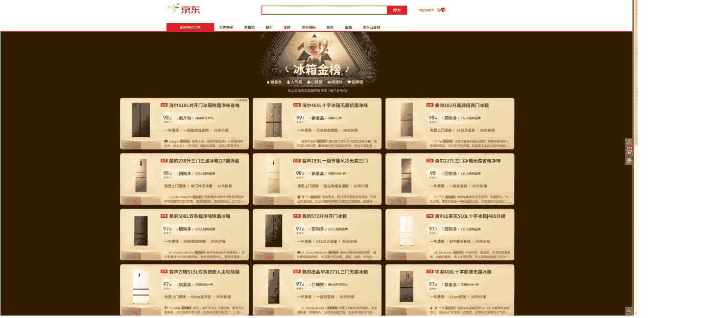

当然，还有一个更简单的办法，就是相信你的对标账号，看看他们都在挂什么商品，一定是销量不错、佣金高的产品。

### 整理资料

最重要的两点：一定要有资料库，一定要用 AI 整理资料。

找到品类和具体商品了之后，把这次选到所有的商品都总结到飞书文档里面，主要是商品名称、地址、价格和佣金这几个参数。

| 编号 | 品牌和型号 | 商品编号 | 地址 | 原价 | 国补参考 | 评价 | 佣金 |
|---|---|---|---|---|---|---|---|
| 1_1 | 美的 MG38CB-AA 三代 | 1_1_美的 MG38CB-AA 三代 | 100065868890 | https://item.jd.com/100065868890.html |  | 219 | 20W | 2.0% |
| 1_2 | 小熊 DKX-R40S | 1_2_小熊 DKX-R40S | 100214906616 | https://item.jd.com/100214906616.html | 249 | 236 | 20W | 2.0% |
| 1_3 | 苏泊尔 OJ42A802 | 1_3_苏泊尔 OJ42A802 | 10102341034970 | https://item.jd.com/10102341034970.html | 409 | 299 | 2000 | 3.8% |
| 1_4 | 苏泊尔 OD20AK812 | 1_4_苏泊尔 OD20AK812 | 100052167790 | https://item.jd.com/100052167790.html |  | 389 | 5W | 2.0% |
| 2_1 | 美的 Q40 | 2_1_美的 Q40 | 100106798496 | https://item.jd.com/100106798496.html | 749 | 602 |  | 4.0% |
| 2_2 | 长帝 猫小易Pro | 2_2_长帝 猫小易Pro | 100052167798 | https://item.jd.com/100052167798.html | 822 | 628 |  | 2.0% |
| 2_3 | 松下 NB-HM3810 | 2_3_松下 NB-HM3810 | 4775314 | https://item.jd.com/4775314.html | 999 | 781 | 5W | 5.0% |
| 2_4 | 美的 P40 | 2_4_美的 P40 | 100067704983 | https://item.jd.com/100067704983.html | 998 | 848 |  | 4.0% |
| 3_1 | 格兰仕 D22 | 3_1_格兰仕 D22 | 100088766357 | https://item.jd.com/100088766357.html | 1299 | 1097 | 20W | 2.0% |
| 3_2 | 美的 P40 Pro 二代 | 3_2_美的 P40 Pro 二代 | 100209443935 | https://item.jd.com/100209443935.html | 1699 | 1316 | 20W | 4.0% |
| 3_3 | 长帝 S1 Pro | 3_3_长帝 S1 Pro | 100122177349 | https://item.jd.com/100122177349.html | 1699 | 1418 | 1W | 2.0% |
| 3_4 | 美的 F15 | 3_4_美的 F15 | 100206282447 | https://item.jd.com/100206282447.html |  | 1598 |  | 4.0% |

#### 整理产品资料

下一步就是整理每一个产品的资料，这一步就是纯体力活，最好找 AI 来做。商品详情就是京东商品页的这一块。

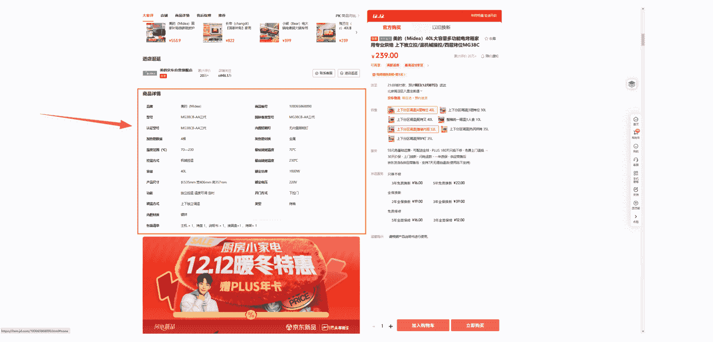

有群友用了 notebooklm，整理速度非常快，填入京东链接，都可以把这些信息整理出来，不过也有几个问题：

- 这里的信息有时候不全；
- 对你的网络环境有要求；
- 参数都是死的，我希望能总结出来这个产品的特点。

如图，这些都是这款烤箱的特点。

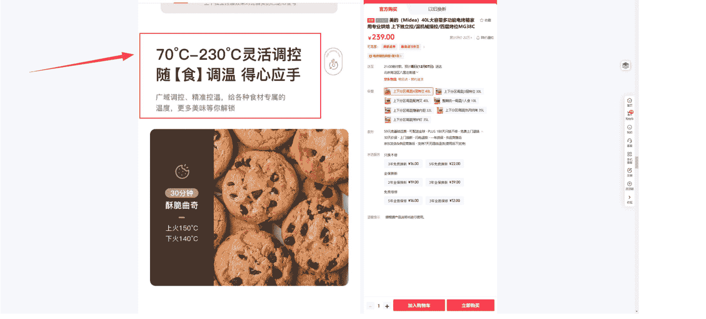

我下面的操作，可以在 PC 上操作，也可以在手机上操作，整体的思路是：把整个网页截取下来，扔给 AI 做整理。

如果是你 PC 端操作，你可以使用火狐浏览器（自带截取整个网页的功能）、谷歌浏览器截长图插件，不过这些方法截取的长图都有最长的限制，如果网页特别长，只能截取出来一部分。也可以使用飞书的截长图工具，就是麻烦一些。

如果你是手机操作，你可以用手机的截长图功能，苹果手机也是可以截取长图的，看看我的录屏演示。

截取出来的长图扔给 AI，我用的是腾讯元宝，使用下面的提示词：

总结文档中这款产品，完成以下工作：
- 一、提炼产品的名称和型号
- 二、提炼基本参数，以列表形式输出：容量(升) 功率（瓦）烤位 加热管与布局 热风循环 温控范围与方式 控制方式 清洁便利性 安全设计
- 三、并总结你认为最重要的特点、亮点，不少于 5 个，个数上限不做限制。

两段式输出，形式为 特点总结：特点描述 例如：风冷无霜科技：多维冷风循环，食材不结霜、不风干，一个亮点一行，不带括号

其中特点总结不超过 8 个字，特点描述的字数在 30-80 之间随机。

同一个产品，特点描述的字数不要过于一致，比如不能全是 20 个字，要长短有差。

如果产品的亮点有很多，那么请把产品的重点参数放在前面，例如产品是笔记本电脑，那么主要参数是处理器、内存、屏幕、续航，如果其中一个参数明显优于同类产品，那么就把这个亮点排在第一，非主要功能的亮点也要总结出来。

售价、功率不作为产品亮点

##### 参数整理

这样你不仅可以得到参数：

| 品牌型号 | 容量(升) | 功率(瓦) | 烤位 | 加热管与布局 | 热风循环 | 温控范围与方式 | 控制方式 | 清洁便利性 | 安全设计 |
|---|---|---|---|---|---|---|---|---|---|
| 美的 MG38CB-AA 三代 | 40L | 1800W | 4层 | 上下管独立加热 | -- | 70-230°C | 四机械旋钮 | 可拆卸烤盘、接渣盘 | 耐高温玻璃门锁扣、不锈钢防烫把手 |
| 小熊 DKX-R40S | 40L | 2000W | 4层 | 上下管独立加热 | -- | 60-230°C | 机械旋钮 | 可拆卸抽屉式、接渣盘 | 多段式停顿门(防跌落)、防烫把手、上下双排散热孔 |
| 苏泊尔 OJ42A802 | 42L | 1800W | 4层 | 上下管独立加热、四管立体加热 | -- | 80-230°C | 四机械旋钮 | -- | 防滑脚垫设计，稳固防滑 |
| 苏泊尔 OD20AK812 | 20L | 1400W | 3层 | 上下管独立加热 | 热风空气炸 | 30-230°C | 彩屏菜单控制 | 搪瓷烤盘，一擦即净易清洁 | 隔热防烫提手，抽拉式接屑盘 |
| 美的 Q40 | 40L | 2000W | 4层 | 上下管独立加热 | 360°热风烘烤 | 25-230°C | 机械旋钮+智能大彩屏 | 四面雪花搪瓷内胆 | 双层隔热玻璃门，结构金属隔热层不含玻璃纤维 |
| 长帝 猫小易Pro | 42L | 2000W | 4层 | 上下管独立加热、6根平行发热管 | 360°热风烘烤 | 25-230°C | 机械旋钮+智能控制 | 内壁不沾油设计 | 双层防烫玻璃门，有效隔热 |
| 松下 NB-HM3810 | 38L | 1800W | 4层 | 上下管独立加热、双M型加热管 | 热风对流烘烤 | 70-230°C | 电子控制面板 | 搪瓷易清洁内腔 | 双重隔热玻璃门、多面散热孔、隔热支架 |
| 美的 P40 | 40L | 2050W | 4层 | 上下管独立加热、石墨烯发热管 | 8叶涡轮真风炉 | 25-230°C | 高清触摸彩屏 | 四面雪花搪瓷内胆 | 双层隔热玻璃门，结构金属隔热层 |
| 格兰仕 D22 | 26L | 1600W | 3层 | 下沉式发热盘 | 立体循环蒸汽 | 110-200°C | 全面触摸感应屏 | 不锈钢内胆一体成型 | 加厚防烫玻璃门、缺水提示系统 |
| 美的 P40 Pro 二代 | 40L | 2050W | 4层 | 上下管独立加热、石墨烯发热管 | 涡轮增压风炉 | 25-230°C | 旋钮操作+手机APP远程控制 | 四面雪花搪瓷内胆 | 一体式门体、双层隔热玻璃门、结构金属隔热层 |
| 长帝 S1 Pro | 40L | 1500W | 3层 | 上下管独立加热 | AI正反转风炉 | 25-230°C | 智能电子控制、预制菜单 | 四面搪瓷内胆 | 双层隔热玻璃门 |
| 美的 F15 | 15L | 2000w | 2层 | 上下管独立加热、石墨烯发热管 | 360°热风烘烤 | 150°-230° | 多功能大彩屏、预制菜单 | 隐藏式烤管防油污 | 三层门板、一体化防尘外罩 |

##### 优势总结

也可以得到这样的产品优势总结：

- 上下独立控温：上下加热管可独立调节温度，精准匹配不同食材烘焙需求，如上火强下火弱适用于蛋糕，避免烤色不均或夹生，提升烹饪效果。
- 四层灵活烤位：四层烤架卡位设计，允许灵活调节烤盘高度，一次可同时烹饪多种食物，如烤肉、蔬菜和面包，提高效率，适合派对或家庭聚餐。
- 广域精准温控：70°C至230°C宽温度范围，覆盖从低温发酵到高温烘烤的各种场景，适应面包、披萨等多样食谱，控温准确，食材受热均匀。
- 机械简易操作：四旋钮机械控制，温度、时间、功能独立调整，操作直观易懂，新手也能快速上手，无需复杂设置，日常使用便捷。
- 长通定时功能：0-60 分钟自由定时加长通模式，支持果干、肉脯等长时间低温烘烤，自动化程度高，省去手动监控，烹饪更省心。
- 安全耐热设计：耐高温玻璃门有效锁热，不锈钢把手符合人体工学，防烫安全，细节贴心，确保使用过程中安心无忧。

这样的产品特点总结，不管是写口播稿，还是画 PPT，都是可以用到的。

### 口播稿

可以用 AI，但是你得会。

我做了四五年的知乎，在写稿方面还是有一些经验的，新手也不用怕，可以用 AI 写初稿、自己修改的方式。写稿我用的是 DeepSeek（目前所有的 AI 工具我用的都是国产免费的）。

把上一步总结出来的产品参数和提示词，都扔给 DeepSeek，他会给你一篇相对来说，还能凑合用的口播稿。

提示词：

你是一名 B 站的数码博主，请根据这几款数码产品的参数，写一篇文字稿，用于视频录制。

#### 内容要求：

1. 参数要严格按照给出的内容编写，不要篡改。
2. 提及关键参数，但是不要只罗列参数，更要描述使用体验，着重介绍产品优缺点相关的参数，其余参数可以适当忽略。
3. 语言更平实、客观、中性，直接陈述参数和感受，不要使用夸张或网络化的形容词、感叹句。
4. 避免主观化、情绪化，不要使用网络流行语、感叹句和夸张的形容词。
5. 针对产品定位，突出 1-2 个最核心的优势。
6. 要明确指出缺点，增强内容的实用性和可信度，符合观众寻求“真实建议”的需求。
7. 语气自然，像朋友聊天，没有夸张的感叹号或固定口号，叙述平实。可以使用网络流行语、俚语、缩略语和轻松表达。
8. 所有的句子、过渡词和连接词替换为基础、最常用的词语。尽量使用简单、直接的表达方式，避免使用复杂或生僻的词汇，确保句子之间的逻辑关系清晰，删掉开头打招呼的部分，删除文末总结的部分。
9. 不要严格按照“分点-优点-缺点-总结”的模板。可以穿插介绍、比较、吐槽、总结。让信息流更自然。
10. 增加对比，比如这款产品的同价位里面，哪一点最突出，或者和上面一款比，这款有什么优势。

#### 格式要求及限制：

1、介绍每款产品的字数随机 500-700 字，严格控制字数在这个范围内。
2、一个型号就是一个自然段，一个型号的内容不要分段，不要有格式，只要一篇文字稿。例如：
第一自然段：产品1名称 产品1介绍
第二自然段：产品2名称 产品2介绍
第三自然段：产品3名称 产品3介绍
第四自然段：产品4名称 产品4介绍
…
3、不要提商品的价格。
4、按照列表的顺序输出。

#### 内容整理：

生成的内容要按照以下要求整理：
1、删掉连接词：在不破坏文章逻辑的基础上，把那些显眼的排比式连接词，像“其次、因此、所以、然后、总之、其中”之类的，统统删掉。
2、简化标点：把小连接词后面的“逗号”去掉，比如把“然后，....”改成“然后......”，让句子更简洁。
3、变换句式：改变段落里重复的句式，可以用“把字句”或“被字句”，别让同一结构反复出现。
4、添加主语：在句子中加上“主语”和“主语表达形式”，让句子更有依据。
5、调整结构：在不影响文章结构的情况下，把段落中的“总分总”结构换成其他形式，比如保留“分点论述”，把“总结”部分去掉。
6、合并短句：把短句连成长句，删掉多余的“逗号”，用“因而、同时、导致、使得、所以、故而”等连接词把句子串起来。

#### 参考材料

后面就是所有产品的参数和特点，直接从文档里面复制粘贴出来就行。

DeepSeek 生成的口播稿，我会手改一遍，心里默念，边念边改，确保到时候录视频、录音的时候，稿子是通顺的。

文章的开头，我觉得还是很关键的，所以我都是自己写，特别是开头的几句话，尽量做到吸引观众看下去：

- 抛出痛点：你购买 XXX 的时候，是不是经常遇到这样的问题；
- 制造焦虑：如果 XXX 选不对，可能会造成什么什么后果；
- 引发共鸣：我因为遇到什么问题，所以要买 XXX，花了两周时间做功课，现在用了几个月了，我觉得挺好的，把选购攻略分享给大家。

### 视频制作

#### 不要追求完美，但是不要忘了进步

整个文章的结构是这样的：

- 开头：抛出一个问题，或者说说我自己的经历，为什么要买这个商品（30秒）
- 第一部分：介绍购买这个商品需要注意什么（1-2分钟）
- 第二部分：商品推荐，通常我会选 10-15 个商品进行介绍（7-8分钟）
- 结尾：简单的一个结尾（10秒）

只有开头和结尾部分录视频，中间时间最长的这两个部分，我都是直接录制音频，相当于一个 10 分钟的视频，我可能只露脸 1 分钟，中间 9 分钟只有声音，搭配都是 B-roll。

什么 B-roll？

我发几个视频的截图，你一下子就明白了：

可以是单个产品的介绍，这个 PPT 是我用搞定设计做的，你也可以直接用其他的工具制作（注意看右上部分的产品特点，就是用 AI 总结出来的）：


只念 PPT，有点儿单调，可以加一些图片，这些图片都是从京东的产品详情页面下载下来的。

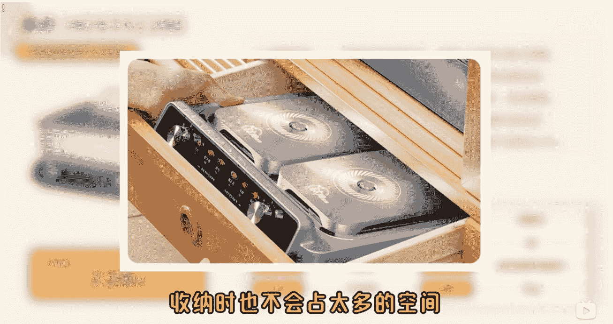

也可以做成多个产品对比的 PPT，这样更加直观：

| | 格兰仕 D22 | 美的 P40 Pro 二代 | 长帝 S1 Pro | 美的 F15 | 东芝 ET-XD7380 |
| :--- | :--- | :--- | :--- | :--- | :--- |
| 参考价格 | ￥1097 | ￥1316 | ￥1418 | ￥1598 | ￥1741 |
| 容量(升) | 26L | 40L | 40L | 15L | 38L |
| 功率(瓦) | 1600W | 2050W | 1500W | 2050W | 2050W |
| 烤位 | 3层 | 4层 | 3层 | 2层 | 2层 |
| 加热管 | 下沉式发热盘 | 上下管独立、石墨烯 | 上下管独立 | 上下管独立、石墨烯 | 上下独立、五面立体 |
| 热风循环 | 立体循环蒸汽 | 涡轮增压风炉、补水 | AI正反转风炉、补水 | 360°热风烘烤 | 高温石窑烤 |
| 温控范围 | 110-200°C | 25-230°C | 25-230°C | 150°-230° | 70°-230° |
| 控制方式 | 全面触摸感应屏 | 机械旋钮+APP | 智能控制 | 智能控制 | 触摸彩屏智能控制 |

在整个录制的过程中，不要怕说错，很少有人能 10 分钟的录制，一个字儿都不念错、一个磕巴都不打的，也不需要一段一段录。

整个口播稿一次念下来，用剪映里面的【智能剪口播】这个功能，把念错的话全部剪掉就好了。我经常要念 15 分钟，最后剪出来只有 10 分钟。

在做 B 站好物这个项目之前，我的剪辑水平几乎为 0，于是我就给自己定了一个要求：每次剪新的视频，一定要学会一个剪映的技巧，哪怕是选一个好看的背景，或者怎么给文字加个特效。

不要花时间报班、上课，每次就学一个技巧，就进步一点儿。

### 评论区运营

很重要、很重要、很重要

发完视频之后，不是就不用管了，要时不时地看看有没有人在评论区提问，有的话，赶紧解答，同时不要忘记加上推荐的链接，这样可以提高开单率：


## 四、走过的一些弯路，以及自认为还不错的方法

其实没有什么弯路，所有的努力，终将在不经意间，沉淀为宝贵的财富。

### 前期过度依赖 AI

在最开始运营这个B站账号的时候，我对露脸做视频也是有畏难情绪的，所以采用的是 AI 配音的方式。虽然我选的声音 AI 味儿不是那么重，但依然能听出来不是真人录制的（断句的时候很容易听出来），所以前期出单效果不是很好。

另外，由于 AI 配音对于某些词儿的发音不标准，比如多音字，所以调试 AI 配音花费的时间，可能还不如我自己录制的速度快。

在制作 PPT 的时候，开始我也使用 AI，做出来的效果大概是这样：


效果不能说很差，但确实比较一般，而且后期可调整的空间比较小。我把提示词也放在这里，大家不一定采用这个方法制作 PPT，但是可以参考参考：

根据下面给的材料制作一个 HTML 页面
- 每一款产品就是一页，向下滑动进入下一个产品。
- 每一页的样式和布局都保持一致，不要用动态特效，颜色不要超过 3 种（可以是一种颜色不同深浅），背景不能是白色。
- 对于一款产品的布局：
  - 页面元素布局要合理，一页展示所有内容，布局不能太拥挤，也不能有大片的空白。
  - 页面整体分为 4 部分，布局从上到下：
    - 顶部留白：10%
    - 标题和简介：10%
    - 产品参数、产品图片的预留位置、产品优缺点和价格：70%
    - 底部留白：10%
  - 产品的名称就是每页的标题，位于最上方的左边，字号 45px。在标题右边，有一行不超过 20 字的介绍，要和标题底部对齐，高度概括这款产品的特点或定位，字号 20px，字体是：Alibaba PuHuiTi。
  - 标题下面是产品参数、产品图片的预留位置、产品优缺点和价格，分为左右结构，左边是产品参数，宽度占 50%，右边是产品图片的预留位置、产品优缺点和价格，宽度占 50%。
  - 左边的产品参数，单列展示，每一个参数的高度自适应，所有参数的高度加起来，要占 70%的高度。
  - 右边整体是一个容器，从上到下分别是：产品图片、产品优点、产品缺点，其中产品图片的高度占容器的 60%，产品优点高度占容器的 20%，产品缺点高度占容器的 20%。
  - 产品图片的预留位置不要有文字提示，长宽比例是 1:1 或 4:3。
  - 产品图片预留位置的顶部，展示一行字：“优惠链接查看评论区置顶”，字号 20px，字体是：Alibaba PuHuiTi。
  - 产品图片预留位置的底部的中间展示价格，内容是：“补贴后参考价格：XXX 元”，其中 XXX 是具体价格。在参考资料中，价格的样式要突出，但是不要太扎眼，字号 30px，字体是：Alibaba PuHuiTi。
  - 产品优点、产品缺点，字号 20px，字体是：Alibaba PuHuiTi。
  - 产品的优点和缺点如果字数过多，请进行优化，优点不超过 30 个字，缺点不超过 20 个字。
  - 左侧产品参数区域的高度与右侧区域（产品图片+优缺点区域）的总高度保持对齐。
  - 编号不要展示，隐藏起来。
  - 页面不要有页号或者下滑、右滑进入下一个产品的提示。
  - 文字不能太小，避免用户看不清楚。
  - 标题用纯色，不要用渐变色。
  - 如果字体找不到，请用其他可商用字体代替。

### 4. HTML代码需要注意:
- 左右留白距离不超过 12%，不低于 7%。
- 使用 JavaScript 动态生成产品页面，将产品数据存储在 TS 数组中，然后通过循环生成每个产品的 HTML 结构。
- 在 HTML 中只保留一个产品页的模板，然后通过 JavaScript 填充数据并复制生成多个产品页。
- 数据是 JSON 格式，样式举例:

```json
[
  {
    "id": "1_1",
    "name": "AAAA",
    "intro": "旗舰性能 · 专业创作 · 顶尖视觉",
    "price": "4000",
    "parameters": {
      "处理器": "Apple M4",
      "屏幕尺寸": "13 英寸",
      "分辨率": "2.3-2.7K",
      "刷新率": "支持 ProMotion 自适应刷新率",
      "电池": "续航约 10 小时",
      "尺寸": "281.6mm × 215.5mm × 5.1mm",
      "前置": "1200 万像素",
      "后置": "1200 万像素",
      "存储": "256GB WLAN 版（可扩展）"
    },
    "pros": "性能较强，天玑 9000 系列芯片应对游戏、办公等场景有不错表现；13 英寸大屏，观影、游戏视野好；电池容量大，续航有保障",
    "cons": "系统生态丰富度不如苹果；在专业创作软件适配、协同体验上，对比苹果等生态有差距；品牌在平板领域的用户认知度，相对传统平板厂商弱一些"
  },
  {
    "id": "2_1",
    "name": "BBBB",
    "intro": "轻盈入门 · 高效学习 · 苹果体验",
    "price": "4000",
    "parameters": {
      "处理器": "Apple A14",
      "屏幕尺寸": "10.9 英寸",
      "分辨率": "2360 × 1640",
      "刷新率": "未明确",
      "电池": "续航约 10 小时",
      "尺寸": "248.6mm × 179.5mm × 7.8mm",
      "前置": "1200 万像素",
      "后置": "1200 万像素",
      "存储": "64GB WLAN 版 (可升级)"
    },
    "pros": "价格相对亲民，适合预算有限想入苹果生态的用户；A14 芯片满足日常上网课、看视频、简单办公等基础需求；10.9 英寸屏幕比 mini 大，观影、操作更舒展",
    "cons": "性能在苹果平板里偏入门，应对大型游戏、专业创作力不从心；屏幕刷新率普通，滑动流畅度不如 Pro 系列；存储 64GB 起步，存大量资料易满，256GB 版本加价多"
  }
]
```

- 其中：
  - `id`：编号
  - `name`：产品名称
  - `intro`：产品的简介，不超过 20 字的介绍，高度概括这款产品的特点或定位
  - `parameters`：产品参数
  - `pros`：产品的优点
  - `cons`：产品的缺点
  - `rating`：评级

### 5. 页面支持下载功能，点击之后，可以下载多张图片，每个产品就是一张图片。页面支持图片下载功能实现要求：
- 提供明显可见的下载按钮（固定位置）
- 下载的每一个图片的名字，就是编号+产品名称，格式：“编号_产品名称”
- 使用 html2canvas 库 (v1.4.1)
- 设置缩放比例 scale: 2 确保高清输出
- 开启 useCORS: true 处理资源加载
- 使用 allowTaint: true 解决跨域限制问题
- 点击下载的时候，临时隐藏下载按钮本身，移除页面中的滚动指示器，替换不支持的特殊效果
- 合理命名下载文件（包含产品名称）
- 支持 Chrome/Firefox/Safari 最新版
- 页面整体风格要有科技感，深色系
- 输出所有产品

参考材料：

| 编号 | 参考价格 | 平板型号 | 处理器 | 屏幕（尺寸、分辨率、刷新率） | 电池 | 尺寸（长宽高） | 前置摄像头 | 后置摄像头 | 存储版本 | 优点 | 缺点 |
|---|---|---|---|---|---|---|---|---|---|---|---|
| 1_1 | 4500 | Apple iPad mini (A17 Pro, 8.3 英寸) | Apple A17 Pro | 8.3 英寸, 2.2-2.2K, 支持 ProMotion（未明确具体数值） | 未明确标注，续航约 8-9 小时（小尺寸电池容量有限，重度使用易中途没电） | 长 195.4mm; 宽 134.8mm; 高 6.3mm | 1200W | 1200W | 128GB WLAN 版 (还有 256G、512G 可选) | 极致便携，单手轻松握持，方便通勤路上使用及户外记录；性能强劲，A17 Pro 芯片应对大型手游、轻度创作无压力；支持 Apple Pencil (二代)，生态功能下沉，画画、记灵感便捷 | 屏幕太小，做表格、看 PDF 等内容显示密集，易累眼，分屏操作鸡肋；续航短板，重度使用依赖移动电源；价格偏高，同价位安卓平板配置更“堆料” |
| 2_1 | 未明确 | iQOO Pad2 Pro | 天玑 9000 系列 | 13 英寸, 3096×2064, 刷新率未明确标注 | 11500mAh | 长 198.32mm; 高 6.64mm | 1300W | 2000W | 256GB WiFi 版 (还有 12+512GB 等可选) | 性能较强，天玑 9000 系列芯片应对游戏、办公等场景有不错表现；13 英寸大屏，观影、游戏视野好；电池容量大，续航有保障 | 系统生态丰富度不如苹果；在专业创作软件适配、协同体验上，对比苹果等生态有差距；品牌在平板领域的用户认知度，相对传统平板厂商弱一些 |

这套提示词可以生成一个 HTML 页面，支持下载的功能，代码和数据是分离的。AI 我用的是腾讯元宝，每次把提示词发给他，生成的样式可以微调，如果你觉得这个效果还算满意，可以留下这段代码，后期只要把商品的数据替换掉，就可以快速生成一张张 PPT 图片。

后来我就把方法迭代成使用搞定设计来做 PPT，这个网站是要收费的，但物有所值（如果大家有其他网站的会员，比如可画什么的，一样够用）。大家也不需要觉得做 PPT 很难，上面有很多模版，你只要整理出来一套模版，后期都可以套用。

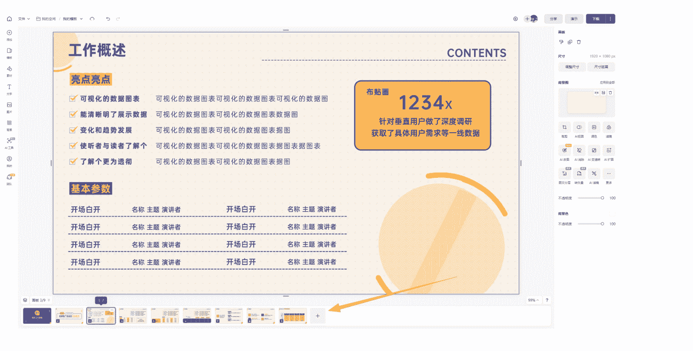

## 建立自己的知识库

这里不得不说一句，飞书文档真的很好用，大家一定要用起来！大家一定要建立自己的知识库！所有的选品，每个品类的数据资料，每次写的口播稿，统统都总结到知识库里面。

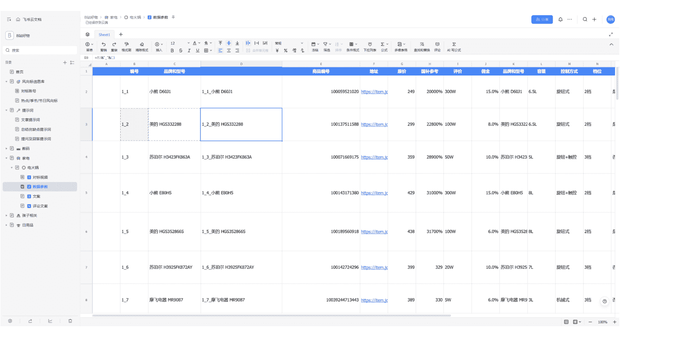

跟大家算一笔账，如果你一周发一个视频，一个品类半年后再发一次，理论上你选 26 个品类之后，就够了。半年之后你再做视频的时候，你就不需要再从 0 搜集资料了，换几个商品就行了。

## 拍视频，我克服了畏难情绪

我之前对做视频一直有畏难情绪，我觉得我一个男的，长得也不好看，拍出来的视频怎么可能有人看，更别说带货了，我的很多项目也是因为这个原因失败的。

但事实证明，B 站粉丝的包容性还是很强的，B 站现在的推流机制对新 up 主非常友好，只要你的内容有价值，哪怕视频拍的糙点儿，也是有人看的。

我在拍摄前几个视频的时候，家里甚至连一个整洁的背景都找不到，我就在家里的柜子前面拍，正面不好看，我还是斜着拍的，剪辑也不会剪。但我感觉，视频好看不好看，对接商单会有影响，但是对于好物带货，前期条件不具备的时候，先拍先做，在做的过程中不断优化。

如果你真的因为什么原因，实在不想露脸，那么先保证声音是自己的。可以参考这个账号：

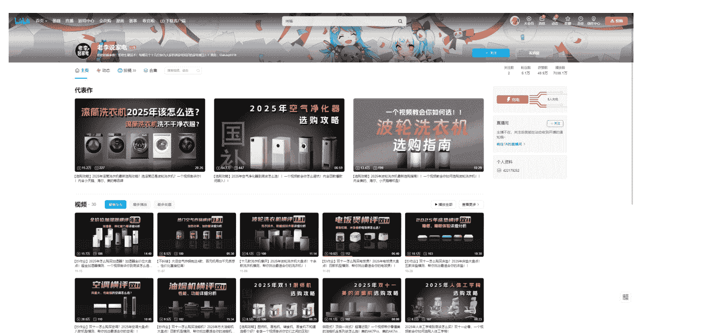

## 任务拆解和时间规划

我上面也提到过，我每天做副业的时间比较有限，大块的时间只有晚上 9 点到 10 点半这一个半小时，相信很多有全职工作的圈友，也有一样的问题。

我的方法是把任务拆解成一个个独立的小任务，根据你的实际情况，合理安排时间。例如 B 站好物整个流程可以拆解成：
- 选品（选品类和具体的商品）：上下班路上做
- 搜集整理资料：下班回家或周末做
- 写口播稿：早到单位一个小时做
- 录制视频（开头和结尾）：周末做
- 录制音频（中间部分）：下班回家做
- 剪辑：下班回家或周末做

## 六、送给想尝试的朋友几句话

### “每一步都算”

我也算生财的老人了，最早做知乎，有了几年不错的副业收入，不过后来知乎慢慢没落，我也参加了很多次航海大部分都只挣了点儿小钱，没有完全做起来。

但是，我在做 Ai 博主时练习的口播能力，在知乎和小店练习的选品能力，在知乎练出来的文本能力，都在 B 站好物这个项目 中用到了，甚至之前买的三脚架、麦克风，都用到了。

> 不要怕失败，学到的东西早晚都能用上。

### “先做个垃圾出来”

现在反思很多项目失败的原因，就是对自己要求太高，反倒是限制了自己。投入精力多，正反馈来的慢，用不了多久就放弃了。

现在看看自己 B 站的第一个视频，还蛮可笑的，很多地方都很糙，前置摄像头拍出来还有点儿模糊，但这样做是对的，先做再完善。

### 流程化的同时，不要忘了进步

尽可能利用工具，把一些工作流程化，尽量使用 AI 替代手动劳动，这样可以缩短做一个视频的时间。但是在这个过程中，千万别忘了进步。

## 不要比，不要焦虑，按照自己的节奏来

我前面提到过的，剪辑目前还是我自己做，因为我觉得剪辑还是挺有用的，我就要求自己每剪一个新的视频，必须学一个剪辑技巧，这就是进步，遇到做的还不错的效果、特效，就设置成了剪映的预设，这就是流程提效。

再比如，之前拍摄背景不好看，我重新布置了一个，这就是进步。每次拍摄三脚架放哪，补光灯放哪我都记下来，这就是流程提效。

同期的群友，最多有挣到十万的，还有很多能挣到四五万的。有一两个视频就开始爆单的，还有几十个 UV 就能日入过千的。

你也不要和我比，我至少还做了几年的副业，在写作、搜集资料方面还是有一定积累的。

不用焦虑，按照自己的节奏慢慢来，看到别人优秀的地方就学习、模仿，只要大方向没错，保持进步准没错。

差不多就这么多了，如果有描述不清楚的地方，可以交流，如果项目整个操作的过程中，有可以优化、提升的地方，也请告诉我。

## 最后，安利小懒的付费群：

### 懒人专属群（介绍）


这里是你对抗信息过载的护城河。
已稳定运行 6 年，累计拆解、研读 3000+ 个互联网商业实战案例与行业前沿内参和时政/宏观文章。

我们不搬运垃圾，只做高价值信息的筛选器与放大镜。

懒人专属群更新记录：
https://hk57gvIx7u.feishu.cn/docx/HOKRdZbSbolBR0xkaXtcuVE0nTg

懒人专属群更新记录（需梯子，备用）：
https://lazybook.fun/blog/record2

【免责声明】本资料归档于社群内部知识库，仅供成员课题研究与学术交流，请在查阅后 24 小时内删除。