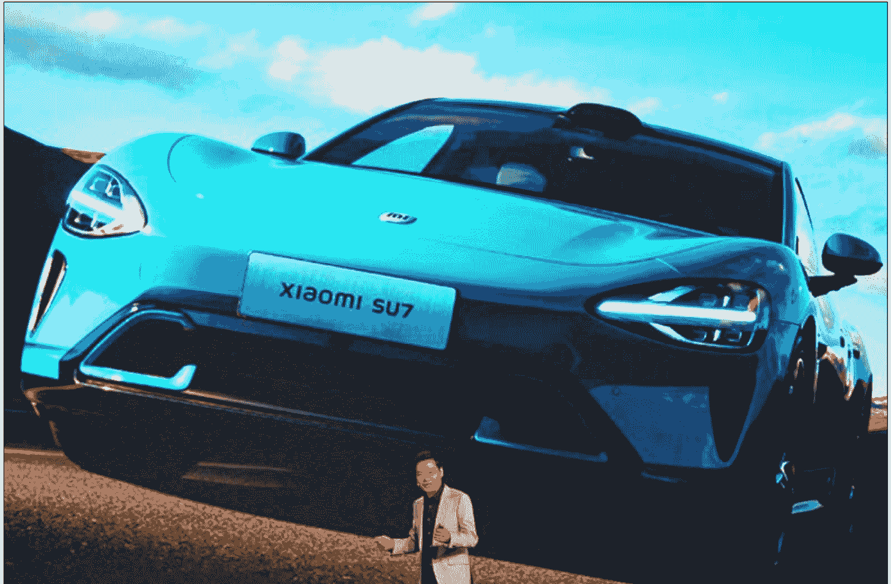

# 雷军与小米舆论危机

2025 年 12 月 11 日 新闻实验室

整理：公众号懒人搜索，懒人专属群独享

懒人微信：lazyhelper


小米汽车的商业模式，已经不允许雷军转向低调。



> 按：在上个月的“你问我答”中，有朋友提了一个和小米雷军相关的问题，当时我坦承自己答不上来。好在，间或为新闻实验室撰稿的资深科技媒体人李书航对这方面颇有了解和研究。于是就有了今天的这期通讯。 ——方可成

2025 年初，参加两会的雷军在网上走红，延续 SU7 发布的热度，雷军凭借“千亿霸总”、“爽文男主”的抖音短视频人设，成为全网膜拜的“雷神”。

然而这一年还没结束，他给许多人的印象却已经变成了到处指责“黑公关”和“歪曲抹黑”，容不得批评，而且对小米汽车致命交通事故表现得漠不关心。

11 月 21 日，小米公关负责人王化调离，徐洁云回归，被视为小米公关策略阶段性失败的表现。

以前的雷军是什么样的？为何他走出了一条快速封神，又迅速被“弑神”的路线？事情是否有其他的发展可能性？推而广之，大型企业及企业家和媒体之间应该保持一种怎样的健康关系，但实际又是如何呢？

## 雷军人设的“通货膨胀”

要理解雷军当下的防御姿态，必须先回溯过去。在造车之前，雷军的人设更接近一位憨厚的理工男。

由雷军审阅、黎万强主笔的《参与感》是小米内部的营销手册，定义了那个时代“性价比”与“极客精神”的商业基调。其中提到，操作系统 MIUI 开发过程中，极度扁平化的社区互动，让无数发烧友产生了在这个品牌里有我一份力的深刻共鸣。

不过，这种草根策略也将小米的品牌形象锚定在了“年轻人的第一台 XX"和“得屌丝者得天下”的刻板印象中，成为日后小米冲击高端市场的最大掣肘。小米虽然分化出“红米”品牌，下探百元机价位，但小米本体品牌卖超过 1999 的时候，还是会被舆论吐槽一番。当然，这个问题在卖手机和电视的阶段还不算是大麻烦。

2015 年 4 月，雷军在小米印度发布会上因蹩脚英语意外走红。数日后，B 站 UP 主 Mr. Lemon 上传鬼畜视频《跟着雷总摇起来》，魔性旋律迅速席卷全网。面对嘲讽，雷军没有发律师函，反而于微博幽默自嘲“让全国人民都笑了”。小米官方更是顺势买下版权，将这首“神曲”收录进 MIUI 铃声库。

如今在小爱同学 AI 助手问“学猫叫”“学狗叫”都会返回正常的猫狗叫声，问“学一下雷军叫”就会听到一句"Are you OK"。这种主动躺平、官方玩梗的姿态，成功消解了企业家的距离感，将原本的槽点转化为品牌资产。

在小米汽车下线后，雷军希望延续亲民路线，初期主持交车仪式，亲自为车主开门的视频也在社交网络流传。但是，造车这件事改变了一切。

2020 年后，为了支撑小米汽车 30 万的高端定价，公司必须剥离“屌丝”标签，此时的性价比已经在对标保时捷、法拉利了。然而小米推出的车身定制服务，以及“仅作装饰”并无实际用途的“挖孔版”碳纤维双风道前舱盖，都没能成功用“高端”形象说服买家。

自 2020 年起，雷军亲自下赛道，睡工厂、打螺丝，忙得不亦乐乎，在汽车行业开始掌握话语权。但更重要的转变是，雷军通过年度演讲，将其创业历程高度理论化。他利用“梦想 - 失败 - 坚持 - 反败为胜”的固定演说公式，配合《小米创业思考》中的方法论输出，成功打造了“平民奋斗逆袭”的“爽文男主”人设。这种叙事精准击中了阶层固化时代公众渴望逆袭的心理，使其成为拥有极高流量的马云式商业思想家。

到了 2025 年 3 月两会期间，随着小米汽车交付量爆发，社交媒体上的雷军完成了“爽文男主”形象的彻底重塑。作为“最难采访到的代表”，他在会场被记者层层围堵的画面、与董明珠同框的画面等都成为短视频爆款，他的两会提案也受到追捧。

营销号借机疯狂考古其“开挂”前半生，充斥着“高考 700 分、两年修完武大学分、写出的代码如诗歌般优雅”等文案。评论区充斥着诸如“这才是真正的霸总，不油腻不脱发，归来仍是少年”的仰慕之词。这种“智性恋”风潮契合了大众对一位既有天才智商，又有谦逊态度的“完美资本家”的全部幻想。

## “爽文男主”转向防御性公关

然而，随着这一套路在短视频等平台的反复强化，企业 IP 与个人 IP 过度绑定，危机便埋下了伏笔。

两会后发生的 3 月 29 日 SU7 严重交通事故，造成 3 人死亡，打破了新车的完美滤镜。在最初的黄金公关期内，雷军的微博却仿佛处于平行世界，照常晒出“晨跑五公里”的健身打卡，对惨烈事故只字未提。直到舆情失控，他才迟缓表态“过去一个多月是创办小米以来最艰难的一段时间”，却始终未提确切的调查结果，后来在 5 月份才通过“内部讲话泄露”的方式变相告知公众。

此后半年多时间，小米始终需要面对外界突然增加的负面评价。这种傲慢与迟钝的应对，最终在小米内部异化为一种“总有黑公关害朕”的防御心态，试图将安全质疑归结为友商阴谋，以此回避对技术缺陷的深层审视。

在宣布造车之后，王化主导的小米公关团队将“生死看淡，不服就干”的企业文化执行到了极致，公关策略激进，带有浓重的数码圈“互撕”色彩。面对舆论，官方回应不再幽默豁达、“和用户做朋友”，取而代之的是“小米公司发言人”微博常态的战狼式发言，遇事先盖红章辟谣，甚至对网友觉得正常的负面评测，也展现出极强的攻击性，动辄暗示“友商黑稿”。

2022 年小米 13 与荣耀 Magic 系列的“互撕”就是一例。双方围绕护眼屏、长焦镜头等参数展开了长达数月的“科普仗”，公关团队亲自下场针对竞品参数进行“像素级”拉踩，甚至引导粉丝控评，评论区充斥着非理性的谩骂与站队。另一个案例是 2024 年关于“龙晶陶瓷”材质“是陶瓷还是玻璃”的争议，公关团队的辩解被用户批评是“玩弄文字游戏”。

今年，9 月，雷军发布会和年度演讲的技法跟往年一样，却遭遇了“滑铁卢”。这场主题为“改变”的演讲中，雷军惯用的“苦情叙事”和“卖惨营销”不再奏效，反而引发了公众的审美疲劳与群嘲，**导致公司市值单日跌 8%，蒸发超千亿港币。**

另一方面，各种“雷氏营销法”的山寨戏仿层出不穷。小米汽车的成功很大程度上得益于雷军不可复制的个人 IP。依靠雷军发一条微博带来的免费流量，小米得以维持极低的营销成本。但他也不得不为此陷入“造词运动”之中。

2016 年小米发布会将“黑科技”一词在数码圈发扬光大，此后从“奥氏体 304”、“泰坦合金”到 169 元“车规级纸巾盒”，雷军用一套充满数字及类比第一梯队品牌的话术，将平常的东西描述得新奇而惊艳。这些叫法成为了网友的笑柄。端传媒的报道援引一位工程师评价小米开放参观的汽车工厂：“这难道是什么新东西吗？哪家工厂不是这样啊。”

同样被诟病的还有“小字营销”，指的是用大字号进行显得夸张的描述，而用看不清楚的小字注释说明真相的海报形态。这种营销手段其实小米的“友商”也有，但网友并没有因此放过小米。

## 10 月 13 日成都小米 SU7 燃爆事故

后，“多人合力拍打、踹门却无法打开车门”的相关视频热传。与此同时，关于隐藏式门把手的安全隐患等技术质疑开始浮出水面。

在 10 月 16 日的 2025 世界智能网联汽车大会上，雷军说“全行业要把资源和精力集中到科技创新上，共同抵制网络水军、黑公关等网络乱象”，又成为新的舆情引线。

经济观察报发布《小米之“祸”》，第一财经发布《小米，别让年轻人的第一台车变成最后一台》，浙江日报新媒体发文《切莫以“黑公关”污名化公众安全关切》，媒体批量下场点名小米。部分小米粉丝将第一财经的文章解读为“恶意诅咒”，指责媒体“带节奏”“黑公关”，甚至在评论区集体“声讨”，呼吁小米法务部起诉媒体。上述媒体评论或报道中，有的已经隐去小米名称，仅以“某车企”等代替。

11 月中旬，媒体开始讨论隐藏式门把手的安全隐患，雷军关于“车好看是第一位”的旧采访被翻出，引发质疑。16 日，雷军再公开发多条微博澄清旧采访，指责“黑公关”和“歪曲抹黑”，这种防御过当的姿态再次引发公众反感。

11 月 21 日，曾主导“极速辟谣”风格的公关负责人王化调离，徐洁云回归。这被视为小米试图调整激进公关策略、为舆情失控止损。

## 科技巨头“去中介化”与媒体角色的式微

很多人可能会问：既然造车会让雷军动作变形，这个车就非造不可吗？实际上，小米决策造车并不是雷军个人的执念，而是股东及行业压力下的必然选择。

投资者担心手机行业见顶，若不去染指汽车这一“未来最大的移动终端”，小米将沦为二流家电厂，乃至迎来自己的“诺基亚时刻”。小米汽车没有 BBA（奔驰、宝马、奥迪）的百年品牌积淀，也没有主流新能源车企的垂直整合成本优势，几乎唯一可以压缩的成本就是营销成本。雷军的个人 IP 是小米唯一的“超级杠杆”，依靠雷军发微博带来的免费流量，小米才能维持极低的营销成本。

前述的媒体评论认为，如果用数码圈的公关思维来处理涉及人命的汽车舆情时，就变成了缺乏敬畏心。魏武挥认为，雷军应该注意到粉丝之外还有社会公众，PR 部门要敢于劝阻老板，避免个人言行冲击声誉和股价。

只是目前小米汽车的商业模式，已经不允许雷军转向低调。流量红利和小米汽车的销量已经绑定，当初排长队的订单还没造完，产能已经扩充，而且已经获得了北京政府扶持。后续如果销量断崖下跌，将很难收场。

雷军及小米与媒体的这场拉锯战背后，折射出的是全球科技巨头与传统新闻业之间日益失衡的权力结构。

资本的极度集中导致了叙事的垄断。美股市场 TMT（科技、媒体、通信）巨头市值在标普 500 指数中的占比一度超过 30%，这种庞大的体量让科技公司成为了基础设施，它们掌握了分发信息的算法和平台，逐渐形成了一种“技术神学”，即科技公司的进步等同于人类的进步，任何对公司的批评都被视为对创新的阻碍。

在这种背景下，科技公司开始尝试抛弃媒体作为信息发布中介，直接接管话语权。硅谷顶级风投机构 a16z (Andreessen Horowitz) 面对媒体对其投资公司的批评，没有选择传统的危机公关，而是建立了自己的媒体“Future”，直接招聘前专业记者撰写有利于科技乐观主义的文章。

a16z 的合伙人曾说他们将“占领一天的头条”视为一种可以开发和交付给被投公司的产品。这种策略被现在的中国科技圈广泛效仿：企业不再需要媒体作为传声筒，CEO 的微博、抖音直播间就是最大的媒体。

小米汽车宣称其“通用平台”模式让用户参与造车，每周听取消费者建议并微调配置。这种“扁平化”策略跟做手机的套路一脉相承，但是结合对外界批评的不宽容，却事实上让任何非粉丝的专业质疑，都可能被视为杂音甚至是“黑公关”。

企业不仅生产产品，还垄断了对产品的解释权，这种不对等的关系正在侵蚀公共利益的边界。

值得注意的是，在与民间舆论场剑拔弩张的同时，小米却在加强与官方媒体的绑定。对小米的采访近期登上《人民日报》。这种“向上管理”的策略，可以为企业在舆论风暴中找到安全锚点。

一些中央级新闻媒体似乎也乐于承担为企业声誉“保驾护航”的角色，并为此获得舆情管理方面的大量收益。

一则来源已被删除的新闻稿提到，新华社中国名牌总顾问赵智在 2025 中国互联网大会上表示，“小米、拼多多等企业在过去很长一段时间里忽略了与新华社的合作，但在最近一年加大了与新华社的合作，其公关部门已逐步意识到国家通讯社的重要性。”

尽管 SU7 严重事故让官媒批评车企过度宣传所谓“智驾”引发误导，但在事故发生前的 2 月 17 日，央视新闻《中国经济引力场》节目走进华为松山湖基地，主持人劳春燕参与推销华为方面着力宣传的“上车智驾开、下车智驾停”等概念，节目提到 L2 实现了“脱脚”，L3 可以实现“脱手、脱眼”，驾驶员在某些情况下可以短暂地将双手从方向盘上移开，视线也可以离开路面，等等。央视新闻新媒体和央视频此后又在多场网络直播宣传华为的“智驾”概念。

在媒体逐渐相对科技巨头落入下风时，官媒选择的解决之道却是动用公信力、乃至公权力，为“听话”交钱的企业背书。这种动作畸形的博弈，只会让公众距离事实真相越来越远。

重建媒体的“看门狗”角色迫在眉睫。媒体与科技巨头之间，不应该是片面的依附或敌对关系，而需要在即使掐着广告预算或流量命脉的前提下，仍然坚持媒体的公共属性。当然，这非常难。但如果不这样坚持，媒体只会衰落得更快。

# 最后，安利小懒的付费群:

## 懒人专属群 (介绍)


🛠这里是你对抗信息过载的护城河。

已稳定运行 6 年，累计拆解、研读 3000+ 个互联网商业实战案例与行业前沿内参和时政/宏观文章。

我们不搬运垃圾，只做高价值信息的筛选器与放大镜。

## 懒人专属群更新记录:

```
https://hk57gvlx7u.feishu.cn/docx/H0kRdZbSbolBR0xkaXtcuVEOnTg
```

## 懒人专属群更新记录 (需梯子，备用):

```
https://lazybook.fun/blog/record2
```

【免责声明】本资料归档于社群内部知识库，仅供成员课题研究与学术交流，请在查阅后 24 小时内删除。