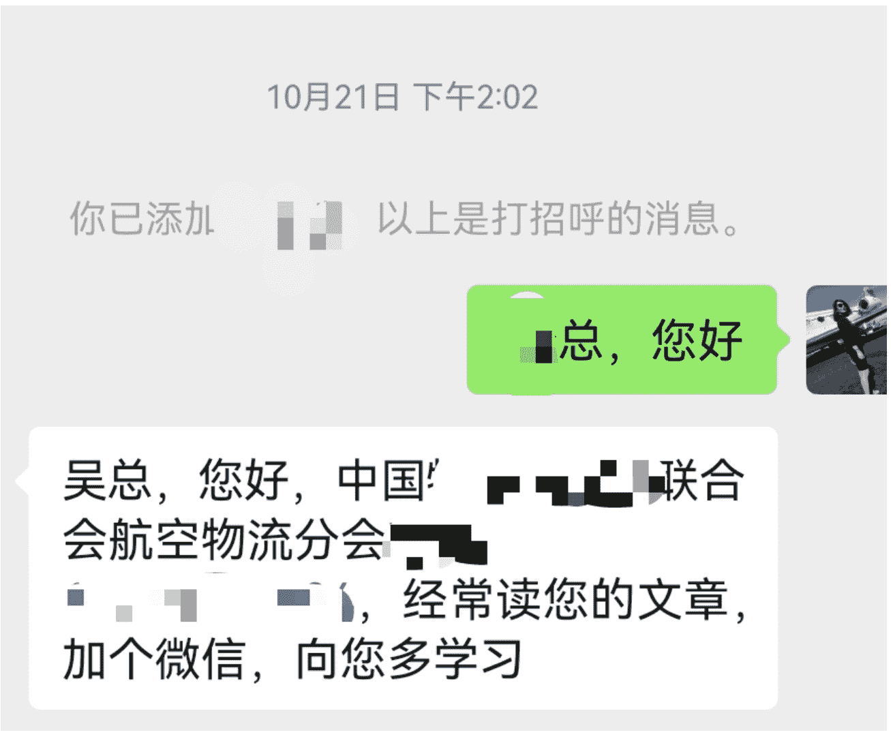
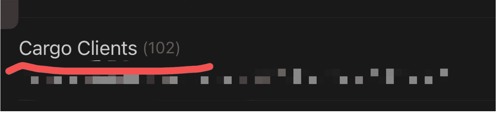
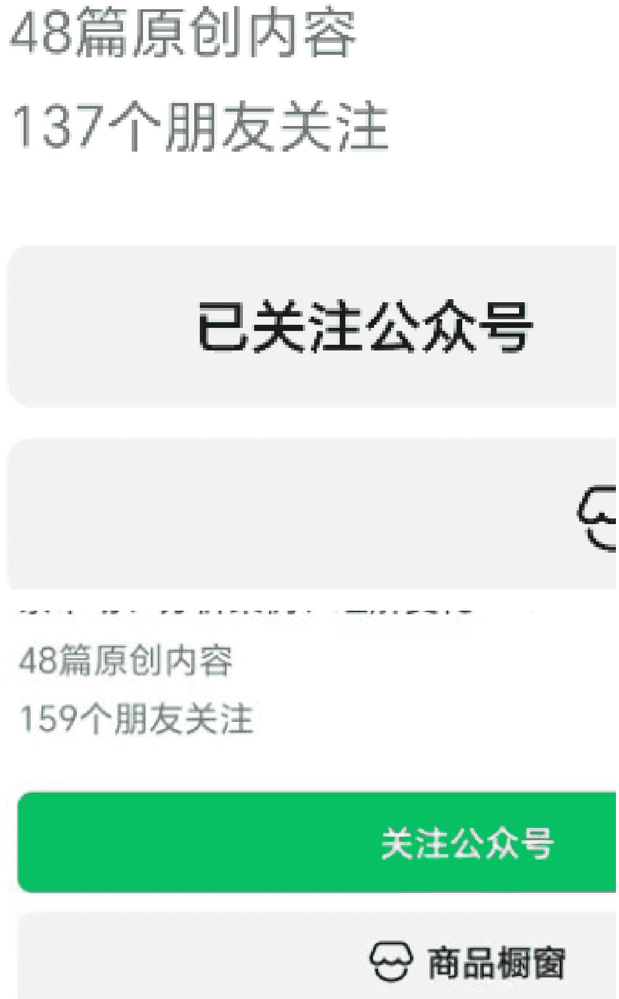
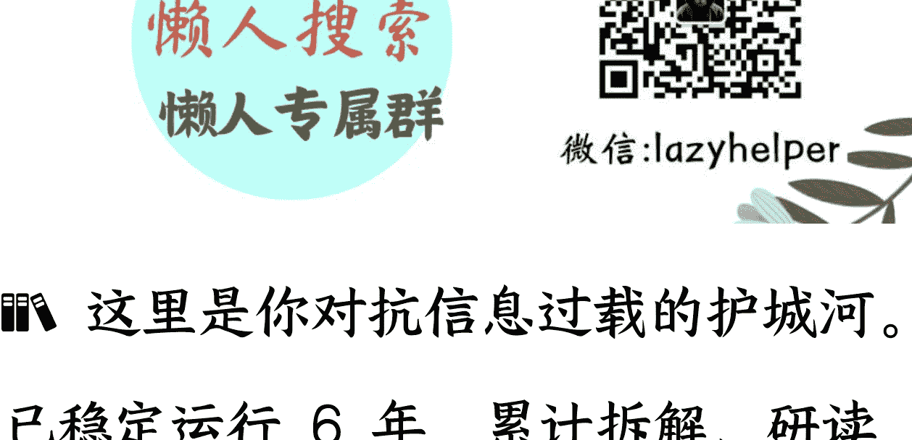

# 垂直小号仅用 130 天，就让我从“行业纯新手”转身成为“行业协会秘书长都主动来结识”的行业专家~~我的经验适合这 4 类圈友

## 251212 副业 SC 精华

公众号懒人搜索，懒人专属群独享

懒人微信:lazyhelper

区别于几十个大号的大矩阵做法，今天用我自己的经历，讲讲我就一个号，是怎么在 3-6 个月时间，获得了行业里大量的重要人脉，同时，也让自己快速从籍籍无名的新手，成为业内的“行业专家”，并帮助公司和自己拿下大单。

## 第一部分|我的垂直小号带给了我什么:

### 1-1、我从哪里起步？收获了什么？

今年 6 月中旬，“零粉 + 行业零累积 + 零知名度”开始写一个公众号;(ps, 我所在的行业背景：传统 B2B 行业，超高客单价，复杂业务。我还是今年 4 月才跨行转型，进入这个新行业的纯新人)

开号 70 天时，第一次爆发，精准引流意向客户线索 20+;

现在我的垂直小号，开号正好半年时间，中字头行业协会的秘书长，都主动加我，邀请我为行业协会年会做推广宣传，并参加行业年度大会。----而几个月前，我还只是刚刚跨行进入这个行业的全新新手。

结识了国内精准意向客户和行业里重要关键人脉 100+，帮公司开了一个小小单--合同金额过 100w 美金。

现在几乎可以说是，我们这个行业表现最出色的公众号啦啦啦~~（12/03 今天翻了一遍我关注的全部行业相关号，真的可以算得上“目前本行业最出色的号”hiahiahia )

#### 实际获得的一点业务成果

介绍实际业务成果之前，我先简单介绍我 所处的行业和业务特点。我是今年 4 月转 型跨行，进入一个超高客单的 B2B 行业。超高客单究竟有多高？我们做经纪咨询业 务，俗称中介。我们单一客户如果最终采 用我们提供的资源，他们的 1 年期合同金 额最少也要在 1 个多亿人民币，再高一 些，可以到 4 个多小目标。

我当时面临的现实是：

我对这个行业完全零了解，要先学这个新 工作有哪些注意点，怎么跟上下游沟通，有哪些行业术语“黑话”“专用词”，都 要一样一样快速学起来。

对我的目标客群也几乎不了解，根据老板 描述也只是了解一个大概。更详细的，得 靠实际工作去摸索。

更别说客户人脉了，一个都不认识，都不 知道他们散落在全国各地哪里。而且合同 客单价那么高，能做决定的人个个都是各 自公司的高层或直接是老板。我去哪里见 他们，认识他们啊。

而到现在，做这个号也接近半年了，我逐 渐收获了：

行业内更多潜在客户主动来咨询业务，都是超高客单的客咨、线索

甚至国内主要行业协会负责人，都主动来和我互动，并邀请我为行业协会的全年度大会做宣传推广，并邀请我参加该年度大会。

公众号成为我对外沟通的“专业名片”，甚至逐渐的，“我是 xx 公众号的运营人”这个标签，比公司的名片/职位都要好用了。

遇到一些新读者、新客户，我有时都会问一句：您不妨在您微信点开查看一下，您有多少位行业好友都已经关注了我这个号？这话我问的不多几次，少则 10 多个共同好友，多的就有 30 多个，甚至最高有 54 个好友都默默关注着我的这个垂直小号呢。

12 月 9 日最新记录，有人竟然有 296 个好友都关注我的公众号!!在行业年会的饭局，吃饭加微信相互介绍，我说：我是做 xxx 业务的，同时也做了一个公众号叫“伊姐。。。”。此话一出，L 总顿时掏出另一个手机，自言自语说：
“喔，那我这个老号都加满人了，估计更多人关注你啊！”果然，159 人！！两个号加起来，近 300 好友都关注的大媒体哇。

那一刻，我的成就感，就像花开一样美好啊☺

### 1-2、这些成果，对我意味着什么？

因为我做了这个垂直小号，我才能迅速的从行业新手，认识那么多行业大佬；

因为这个垂直小号，别人看到我持续、稳定的内容输出，渐渐被尊称为“行业专家”了。

因为垂直小号的发展路径，完全不同于传统靠职位、靠人脉的细水长流的累积，所以我才能有机会快速的以“行业专家”的这个隐形高位，参与到更大的牌桌上。

在一个人们以为“太高端、太小众”的行业，垂直小号是能成为强大的业务杠杆。

- 粉丝不一定多，但每个粉丝都是“对的人”
- 粉丝数不大，却极精准，因此商业价值极强
- 行业壁垒变成内容壁垒，反而带来竞争优势
- 内容让你从“业务执行者”变成“行业观察者、行业解释者”
- 内容沉淀让你建立“不可替代的专业人格”

这是我从未预期到，但比流量更珍贵的收获

垂直小号，不一定非要做很大，也可以像我这样，做深做强。

## 第二部分｜我的方式，也许适合这样的你

以下几条，如果中 1 条，可以尝试做垂直小号。

如果中 2 条，我很建议你做垂直小号。

如果中 3 条，强烈推荐你一定要做一个属于你的垂直小号。

### 2-1、你的产品/服务，属于 B2B 业务，或较复杂的 toC 产品

比如：咨询、专业服务、供应链、投融资、ToB 服务等。

这些领域不需要大流量，但需要的是精准流量。

行业/产品，越小众，越推荐你开启你的垂直小号。

### 2-2、你的产品/服务，客单价较高/很高/非常高

客单价高的产品服务，有一个共性，就是对信任的隐形要求非常高。对产品，对销售人员，对销售、售后团队，甚至对相关的供应链，都有很高的信任要求。

而做一个属于你的垂直小号，因为持续输出，因为内容详细，因为能多面、全面展示，客户对你产品的信任，就逐渐建立并累积。

### 2-3、敢于表达的人，率先享受表达者红利。

做个垂直小号，并不在于你是不是专业或天赋型写手，也不在于你有多么深刻的理解某个产品或行业，很重要的一条是，你要有敢于表达的勇气。

哪怕刚开始写的不够有吸引力，哪怕刚开始没多少人看，都没关系。

先开始公开表达，在持续的表达中逐步成长，因为表达所以能被看到。

我也是因为敢于公开表达，持续写文章，不怕刚开始写的机械，才获得行业内更多的信任和更好的客户连接。

### 2-4、想做个人 ip，但又不喜欢强营销的人

关于个人 ip，我到现在都不敢说我已经做成了我们行业里的一个 IP。

我只能说，在我们这个行业细分领域的中国市场，我正在渐渐铺垫成为 IP 的基础吧。

B2B 行业的拓客、推广，还是很不同于 toC 业务的。李佳琪、董宇辉都是 toC 领域里最优秀的 IP 之一。同样的化妆品，同样的大米、书籍，一经他们解说就卖的特别好。------这在 B2B 的行业里怎么可能出现呢？B2B 行业大多数情况，还陷在看公司资质、拼人脉、或者资金账期等等条件里。

那么，不走寻常路的我，用垂直小号验证了:

- 有时可以模仿那些 to C 行业里的 IP，他们的持续出摊、高频率出镜、详细又深入的讲解产品、解读产品，这些都是值得我们学习的；
- 但也不用完全学习照搬他们的“追热点”、“夸张夺眼球”的花样；
- 我有一条很隐秘的秘诀就是：因为我们做的是很垂类的行业/项目，只要我们的方法比传统模式强，我们就胜出了。这就像那个故事一样，两个猎人在森林里遇到了老虎，想要逃生，首先得跑赢你的同行、对手，就妥了。

## 第三部分｜可复制的方法论 (核心重点)

这一部分，估计是很多圈友想仔细读的，但我想说，其实你如果能把前面部分内容，真的读懂了，都理解了，其实，这一部分你自己就会知道你要怎么做了。

我开始做号的时候，也是懵逼的，有时也是硬着头皮，强逼着自己保持更新的节奏---因为以前我也有过做账号，做做就不做了。这样的经历，还不止一次。

这里我可以举两个例子，一个是我自己做这个号，是所谓的超高客单的货运飞机运力业务。

为了防止有些圈友说我这个太小众，没有参考学习的意义，我还会用另一个生财圈友的例子。上周末在生财北京 IP 定位聚会时，遇到的一位圈友 A 的例子，她是卖中小学体育设备的，比如塑胶跑道材料，不同篮球框和支架这些产品。----这里没法找借口说“高大上、学不了”了吧。当时听她描述业务，想做垂直小号，却苦于不知道从哪里开始写，我就给了她一些建议。会后，她特地跑来跟我说：“谢谢你啊小吴姐，你刚才那么分类举例，我清楚多了！”

### 3-1、首先搞明白：你当前最想要的读者客户是谁？

我的客户是散落在全国各地的、大型到一定程度的物流公司-----规模要大到一定程度，才用得上我们提供的产品服务。而圈友 A 的客户群，大约就是散布在全国各地、有自行采购意愿的教育局或中小学相关部门负责人。

那么，你的客户是不是也散落在不同市县、甚至全国各地呢？没关系，只要他们用微信，只要他们偶尔也读读公众号文章，那么，你就有机会触达他们。

### 3-2、其次搞明白:你的客户们对于你正在销售的产品/服务，客户常用的关键字是什么？

目前，大家对公众号分发机制很有共识的一点，就是公众号文章标题非常重要!!

既然文章标题那么重要，那么，你和你的客户之间，想用公众号垂直小号连接起来，就得靠你们双方都特别懂的“黑话”、“暗号”。

那么，怎么才算是双方都懂的“暗号”呢？

小吴姐我自己下的一个定义:这些暗号关键字只有你们双方懂，对其他人来说，一点吸引力都没有，甚至都看不懂。嘿嘿

比如，我的客户们 对某些飞机型号就特别敏锐，我只要在文章标题里提到某几个机型型号，比如 B767、B777，那么，那篇文章的阅读数据大概率都很好，甚至经常高出我预期。

我的第一篇爆文，就是 7 月 10 日。当时只有 572 个关注 (还包括为了开流量主特意搞的粉----为了这事，我曾经焦虑后悔了好些天。)

那时，我开号才一个月，才发了 9 篇文章，前面 8 篇文章，每篇的阅读都没超过 300 次阅读。

但 7 月 10 日这篇，第一天就 12 次阅读，第二天 59，第三天 427，冲破了 500 阅读，后又冲破了 800。第五天冲过了 1000 阅读。我当时真的高兴极了！

当时快速总结的经验之一就是，文章标题嵌入了目标客群最熟悉常见的“关键字”。

而圈友 A，如果她能找到她的教育局、学校客户们真正关心的设备关键字，我相信，她的内容，也必然会通过公众号系统推送给全国的相关学校负责人。

【暂停一下，想想】此刻，打算开写你自己垂直小号的圈友，你和你的目标读者之间，有哪些一下浮现眼前的“暗号”、“接头暗语”呢？

### 3-3、第三，垂直小号写什么内容？

我在准备开启我的公众号之前，当时我也刚入行才 2 个月，对自己要做的业务都一知半解；对目标客户的需求，也很模糊，更别说他们的细节要求了。

怎么办？

#### 先看看你的同行怎么做。-- 某种意义上的“找对标”

注意，我现在要做一个面向 AA 人群、希望以后能向他们推广销售 xxxxx 产品/服务的公众号。那么，我现在的对标，至少也是这个行业主题，也是面向 AA 人群的公众号。

我当时搜了一圈已有的公众号，发现:

大多数号都是报个行业新闻。今天这个城市开了一条新航线了，明天那家公司参加什么行业活动了。

更有趣的是，很多公众号都是相互抄，标题内容都差不多，点开看里面内容更雷同。我作为一个新手读者，翻阅几个之后，其他的都不想看了，因为扫一眼标题都知道他们很雷同。

当时我想，假设我是这些号的订阅用户，看了第一家的报道，我还会有兴趣看第二、第三家么？

显然没兴趣，甚至，一点儿兴趣都没有。

那我要怎么做呢？

我当时还是行业新人，信息源很少很少，甚至很多讯息，还是要依靠那些同质化的同行老号，我才知道这个行业正在发生什么。

我在信息获取的速度上，明显比不过他们。

#### 差异化竞争，为我撕开了全新“生态位”的机会!

- 差异化 1:他们大多讲国内的新闻，那我去找这个行业在国际上的新闻呀!
- 差异化 2:他们获取新闻速度快，但是只会互相抄送新闻概要;那我就写行业洞察，用他们获取的新闻，我再搜集一些相关信息，写新闻背后的洞察和分析。(这里稍稍用点 AI 深化提效)----这一步，不仅降低了我新闻获取慢的弱势，反而还大大增加了我“有高度、有深度”的巨大优势，这才是 10 倍增长的方式!!

面对一个垂直细分的目标人群，相比其他同行，你我作为后来者，一定要和同行做出“差异化”!!!----这一个洞察认知，和“流量主”做号的思路，可以说是大相径庭，甚至截然相反。

这里给大家看看我的部分读者大佬对我这个号的评价吧:

很高兴认识您

经常看您的公众号

很喜欢您的产出

这个赛道需要很专业的知识，您的分享填补了空白👍

哈哈哈哈哈，太感谢啦~~~~

要有丰富的货机运营经验才写得出这样的分享

得到专业人士的认可，高兴啊~~~我也是觉得这行有很多内容、信息，值得被深入研究、推广、分享，所以才开始写的

是啊，首先的干货就鲜有人拿出来分享了，货运包机就更少了。我也弄过国际包机，所以对你的分享很有共鸣

我做货运也好多年了，做销售也有一两年了

可以多交流的

之前看你分析的欧洲回程的形势，感觉挺好的，质量很高

你要写你这个垂类细分领域里“没人说，但大家都关心”的内容——这是我“制造增长爆款”的秘诀。

#### 我让 GPT 简单总结了一下我垂直小号的内容思路:

- 把内容当作专业资产，而不是广告
  内容越不营销，越能吸引真正的客户。
- 不追热点，追“专业解释权”
  行业中的每个现象，你都能解释清楚。
- 只写给行业里相关人群，而不是写给大众
  垂直小号的核心不是流量，而是精准度。
- 内容要有自己的独特风格，
  找到自己的独特风格。我的风格是“专业 + 清晰 + 留白”

## 第四部分 | 如果你也照我这样做，可以预期得到什么效果？

- 更高质量的同行与客户连接
  业务沟通成本明显下降
  行业内的“我是谁”, 会逐渐清晰; 建立 自己的专业人格与行业地位
- 个人声望上升 (不是名气，是可信度)
- 内容成为业务增长的复利，甚至可能延展 出全新的业务可能
- 收获对行业更深度的观察能力
- “这些是我可以做到的”, 那么，大概 率，你做了也会有用。

## 第五部分 | 心态建设：做垂直号最重要的不是技巧，而是心态

### 5-1、不要因为读者少而焦虑，垂直号的阅读质量远比阅读量更有意义。

我现在用的是一个很多年前注册的老号，还换个多次内容方向的老号。把以前的内容都删了，重新装修公众号名字、头像、说明，从 19 个库存老粉开始做的，到今天 (12 月 9 日)

原创内容 48
总用户数 3,156 +23

### 5-2、不要追求“爆”,持续、稳定，比短期爆发更重要

因为我们要做的垂直，但各自“垂直”的领域不同，所以，不要局限于对某些数据。

我这个行业细分，当时上了 1500 粉，我就心里很稳了。

但也许做 N8N 的，就可能需要上 5000 粉才算不错？

### 5-3、不要因为行业小众而不敢写

因为小众，才可能垂直。我自己主业的目标客户，全国不会超过 200 个公司。

刚开始小众，做稳了之后还可以再扩展。

### 5-4、不要因为别人做的比你大，就否定自己的价值

我刚开始做号的时候，看到同行号能稳定在 700-1000 的阅读量，我就羡慕的不得了。毕竟我第一个月，每篇都没超过 300 阅读。

我真的没想到，从第二个月开始，我的平均阅读量上了 1000，1800。很多篇，都是 3000-8000 的阅读量，----这对于一个 1000-3000 粉的号来说，是非常非常厉害的了！！！

### 5-5、趁着还没出名，先做 100 篇垃圾出来，保持“出摊”节奏很重要。

（啊，终于快写完了，忽然发现还有很多细节可以分享，但我真的有点懒，没耐心仔细梳理了。写几个重要的先）

我为了不让自己半途而费，我告诫自己，先不管，就随便写 100 篇，“不求特别好，差不多还行就可以发了”。

### 5-6、节约精力和时间，专注在可以 10 倍增的“标题”和“内容”；其他的，随意。

我的号顶多也就算是干净、不乱。没有整齐、漂亮的排版，因为我不会用秀米也不会用插件。{没眼看.jpg}

我的文章里也很少有配图。用于找图、做图花的时间精力，没有复利，为整个文章的增值也极为有限，咱以内容为重点嘛！！

为了提高读者关注转化，我也就放个“账号名字”在文末。

还有一个快捷的增值方法，就是多贴几篇你过往文章的链接。注意，要找过往质量高、内容有相关度的文。

## 第六部分，一些重要补充

### 6-1、要不要日更？更新节奏怎么定？

我的建议是：根据自己写的垂类特点，更新节奏要配合账号定位、人群特点来定。

我的定位是某个低频、超高客单产品的行业洞察 + 分析 + 部分重要产品信息发布，那么，不需要也没必要日更，（嘿嘿，我也做不到日更的勤奋）我现在就是每周 2 更，有时 3 更。

而且，我都定位自己是行业垂类的行业洞察 + 分析，我就不是一个公众号小编，那怎么会有时间精力日更呢？！对吧。

我要真的日更了，我的行业地位肯定不如现在。

### 6-2、公众号后台的分析数据，真的值得看

这个其实很简单，公众号后台页面经常开着，每个点开多多看。公众号的分析数据可视化做的挺好的，我这种没有大厂背景、很少做 ppt 和饼图的人，我都看明白。大家自己多看看就知道该怎么提升、改善自己的文章了。

------这一部分，要讲，可以讲很久，还要贴不同图，还请大家放过我。等我有真人助理了，我可以来分享，哈哈哈哈，请大家见谅呀。我就指个路，相信大家的自学能力。

写在最后，

我的路径，并不是适合流量主和泛大品类，而适合那些“已有自己核心业务”的项目人。

对我们这样的人来说，垂直小号只是一个手段、工具，却是一个能在传统行业里跳出传统增长路径、实现弯道超车、直接 10 倍增的好手段、好工具!

与大家共勉 o(∩_∩)o

## 最后，安利小懒的付费群：

### 懒人专属群（介绍）

📚 这里是你对抗信息过载的护城河。

已稳定运行 6 年，累计拆解、研读 3000+ 个互联网商业实战案例与行业前沿内参和时政/宏观文章。

我们不搬运垃圾，只做高价值信息的筛选器与放大镜。

### 懒人专属群更新记录：

https://hk57gvlx7u.feishu.cn/docx/HOkRdZbSboIBR0xkaXtcuVE0nTg

### 懒人专属群更新记录（需梯子，备用）：

https://lazybook.fun/blog/record2

【免责声明】 本资料归档于社群内部知识库，仅供成员课题研究与学术交流，请在查阅后 24 小时内删除。