# 131 天只赚了 29.8 刀，这是我第一个海外 SaaS 闭环

20251215 副业 生财 精华

公众号懒人搜索，懒人专属群独享

懒人微信：lazyhelper

大家好，我是陈江河。

主业是在广州做餐具批发出口的打工人，主营非洲市场，目前副业在做海外 SaaS，主要集中在工具站。

从今年 7 月到现在，我花了 131 天，做了十几个英文小工具站，一共赚了 29.8 美金——一单 4.9，一单 24.9，而且都集中在最后一个月。

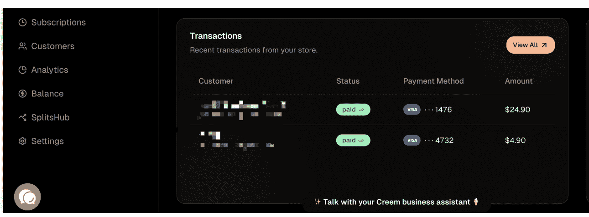

## Cha-ching! Another win for your business!

Order No: ORD-19AFD73173FD3714
Date: December 8, 2025
Name: MAG MOUSSA AHAMADI
Studio Pack
Units 1
Subtotal
VAT (0%)
Amount paid
With love - Creem Team

## Cha-ching! Another win for your business!

Order No: ORD-19ADED4AD25E43DC
Date: December 2, 2025
Name: [
Email: [
Starter Pack
Units 1
Subtotal
VAT (0%)
Amount paid

这个金额，放在我以前外贸的盘子里，连一次打样都不够。

但对现在的我来说，这 29.8 刀很重要：

它是我人生里第一个，完全靠网站、靠工具，从陌生人那里赚来的钱，让我觉得人生大有可为，并且可以和时间脱轨的一种赚钱方式，毕竟人会睡觉，代码不会睡觉。

接下来，我想把这 131 天摊开讲讲：

尽可能以第一视角还原这个过程，也记录一下我的历程。

## 第一章：美金的种子：我为什么选择做这个

时间拉回到今年七月。

我在网上刷到一个采访，说有个男的用 AI 创业，一个人一年赚一千万。

我当时想都没想，手一划直接划走，心里骂了一句：骗子，吹牛呢，一千万！该死的营销号。顺手还拉黑了。在我的世界里，“赚钱”的天花板是：一个 40 尺柜子赚几万块。

(现在我收藏并点赞这个视频，常看常新)

要赚到一千万，我得卖多少柜、接多少客户？现在回头看，那一刻就是典型的——格局小了。原因很简单：

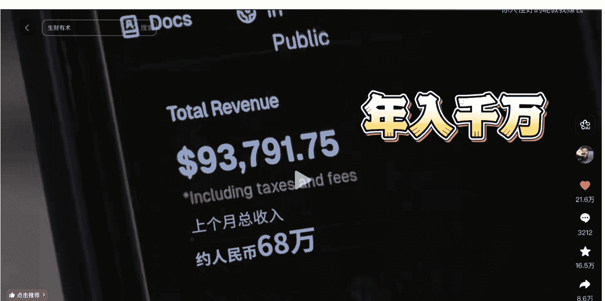

我一直做实体生意，几乎没接触过 AI 和 SaaS，本质上没正儿八经碰过“数字产品”；

之前所谓搞副业，也就是玩玩小红书，最多用 DeepSeek 加多维表格做点数据统计——这就是我对「互联网赚钱」的全部映像。

后来在生财里，又看到有人转发这条采访，才知道这位仁兄叫 刘小排，是做海外 SaaS 的产品经理。

我点进去生财翻了一圈：航海手册、蓝海项目挖掘、出海工具站…… 脑子里只有一个念头：

我去，相见恨晚，这人好厉害啊，怎么可以一个人赚那么多钱。

那时候的我，最多算个“围观群众”：觉得人厉害，也觉得离自己很远。

我不知道什么是 SaaS，更不觉得自己能做 SaaS。

真正的转折点，是后面那波，组合信息超级拳（超级标 + 万刀口号 +11 万刀）。

6 月份，亦仁发了一个超级标，讲基于 ChatGPT 生图能力的机会，说是这里蕴藏着大机会，我在想：生财今年拉着大家全面转向 AI，我是不是也要早做打算？毕竟用涛哥的话来说，没有慧根就要会跟嘛。

朋友在朋友圈里转发，有人开始喊：“独立开发，月入万刀的口号”。

哥飞又转发了一条战报：一个圈友靠 Ads，一个月赚了 11 万刀。。。。。

这其实对于当时的我来讲，已经超出了认知范围了，我不知道什么叫做 ads。

> “Adsense（谷歌广告）”

也不知道一个月十一万刀的收益是啥感觉。

于是我在店里拿着计算器开始算账：

一万刀，一个月七万人民币；爽歪歪啊！这还上什么班！直接把老板推沟里！

不用压货，不用催款，不用请老外吃饭，也不会有印度佬叫我嫁给他，我是男的。。。。。

不用半夜接电话催货，也不用看工厂脸色；

要是在进一步，一个月赚五万刀，我滴乖乖，那岂不是可以买一台宝马 M4，外带一台本田双非！！

当时我心里只有一个念头：

这生意，简直就是太适合我了。

问题是——我啥也不会啊。

前端、后端、部署、API，统统是天书。

于是我做了一件在今天看来无比正确的一件事，就是老老实实去星球，把航海和精华帖通读一遍，先搞清楚：这帮人到底在干嘛，属于站在高手的肩膀上开始，比自己摸索快了 n 倍。

看了差不多十来天吧，我对这条路有了一个非常粗糙的轮廓：

- 用英文关键词去找真实需求；
- 做工具站/轻量 SaaS，解决一个具体小问题；但是一定是具体的用户，具体的场景和具体的需求；
- 把「访问 → 使用 → 付费 → 出结果」这条闭环跑通；
- 再用 SEO、内容、外链，把这个闭环放大。

有了大概的轮廓后，我还是按照往期航海手册的内容开始学习，并在电脑上敲下了人生第一行代码：“hello world”。

敲下去的那一刻，我脑子已经开始飘了：心里已经是，我要月入万刀了，我要 free 了！我要暴富了！

## 第二章：131 天踩坑实录：从 0 到第一单

### 2.1 从 ChatGPT 账号开始

有了出海赚美金这个想法之后，我开始积极关注生财里各种 AI 信息。

看到亦仁超级标、看到这条赛道的大佬赚得盆满钵满，我决定：正式开干。

我也要赚美金（虽然我平时收的也是美金，但是感觉不一样）。

没想到第一步就困住了：我居然搞不定 GPT 的账号，于是我在生财发帖求助——

结果，“求来了一个骗子”。

出于对圈友的信任，他报价之后我就直接转账了，然后，就没有然后了。。。。。

这里也提醒一下看到这篇文章的朋友：不要轻易相信任何人。

后来也许是机缘巧合，亦或者是上苍看见我要做出海的决心，我遇到了圈友咕咕，他当时也在做类似的产品。

咕咕送了我一个 ChatGPT 账号，还给了我很优惠的月付价格。

有账号了，功力 + 1。

于是我有了出海路上的第一个 AI 大模型工具，这算是一个小节点。

这里必须感谢一下咕咕，哈哈哈。

### 2.2 第一个静态页面：丑 CPM + Ads 被拒

工具是有了，但是具体怎么用也不知道，要注册的那些账号也不知道。

只能一步步看教程做：注册 GitHub，注册 Vercel，注册 Cloudflare。

做第一遍的时候，我完全不知道为什么要这么做，也不清楚这些到底是干什么的，有什么作用——

什么叫 DNS 解析？什么是部署？什么是渲染？什么叫 API?

名词是不会的，术语也是基本上看不懂的，只能看不懂的就问 ai，给我解释一下，大白话解释。

就这么稀里糊涂地熬了大半个月，边学边干，好歹是做出来的第一个静态网站了。站在现在的我来看，其 UI 之丑，难以言喻……

我写的第一个静态工具页——CPM 计算器，更搞笑的是，我还很天真地跑去申请了 Ads。

现在看来就是笑话，当时的站根本不可能通过，但是也算是积累了第一次申请 ads 的经验。

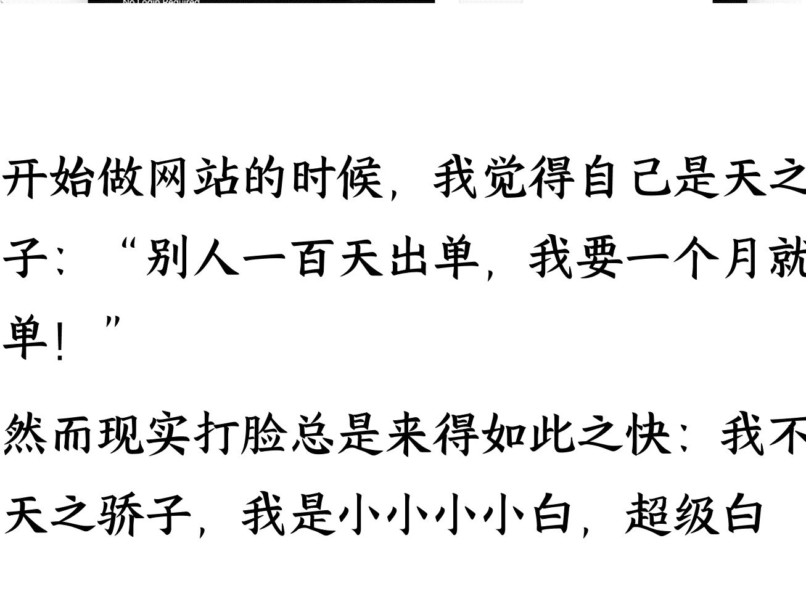

开始做网站的时候，我觉得自己是天之骄子：“别人一百天出单，我要一个月就出单！”

然而现实打脸总是来得如此之快：我不是天之骄子，我是小小小白，超级白。

明白了此事不能操之过急，需事必躬亲啊。

在做了三五个纯前端的小工具之后，我开始不满足于纯前端的页面，我决定做一些真正的 AI 产品，有生命的产品。

### 2.3 尝试 API 的接入：只服务自己的工具

做了几个静态站之后，我发现纯前端的网站基本没有任何竞争的可能性，不能满足用户需求，甚至不能满足我自己的需求。

于是我开始研究接入 API，想做真正的 AI 产品。

这时候又出现了一个问题，我发现，接入 API 大部分都需要信用卡，但我没有，说干就干，马上下载银行 app 查看相关信息，生财里找经验贴，用时十四天，办理了两张信用卡，开始信誓旦旦的开干。

好歹是学了一些知识的，知道要先调研需求再去创建网站，但是很多的内容对我来说，实在是太大太空了。

收集抱怨，观察用户差评，评论区看用户需求……我知道这是对的，但是很难，对于小白来讲，还是不容易理解消化。

但不管啥情况，反正还是要先做，就是练手嘛，做啥其实无所谓啦，熟悉流程先。

于是我基于自己主业的一些需求，做了两个网站：

一个是实时报价生成器；

一个是合同生成器。

这两个都是调用了 DeepSeek 的 API，至于为什么调用这个，嗯，因为便宜。。。。。

大概用时一个星期，我把我的第一个产品给了我的同事，让他们测评一下。

我同事的原话是：

你这个产品，狗都不用！你的产品只有你自己会用。

苍天啊，这给我当时一个巨大的打击，也算是给我泼了一盆凉水。

我开始反思我同事的这句话，什么叫除了我自己会用，其他人根本不会用？到底什么是真正的产品？

答案是，因为我只是解决了自己的一个小得不能再小的需求，其他人或许根本不需要这个产品，亦或者，和我有同样需求的人，根本就没有看见我的产品。

相当于我在深山老林里面开了一家瑞幸咖啡，开始的时候就已经注定了结局就不会成功。

那什么样的产品才会有人使用？我知道是要有需求的产品，但是怎么寻找需求？怎么让别人看见我的产品？这又是一堆全新的问题。

路上遇见的全新问题，带着问题找答案是最快的学习方式，我再一次打开了生财的搜索按钮。

继续阅读生财的相关内容，发现实操难度实在过于高，内容很好，很体系，就是看不懂，加之当时主业开始有点忙了，便暂时的搁置了出海这件事情。

月底的时候我看见我的朋友圈大家都在晒参加线下聚会的照片，我于是也报名参加了我的第一次生财线下聚会。

在这里认识了一个做出海的圈友，当时听他分享的时候我完全沉浸在他所描述的生活里。

不需要每天定时打卡，旅居办公，时间自由，汇率差带来的消费红利等等。

实在是太羡慕了，恨不得直接住在他家里，看他怎么干的！

我厚着脸皮加了他的微信，问了一些超级无敌小白的问题。

因为圈友也有自己的事情要忙，于是给我推荐了一个人，哥飞，说是他的出海经验都是在哥飞的社群学习的，说我可以找他学习一下。

次日我便第一次加上了哥飞的微信，申请加入群聊！

### 2.4 拜师哥飞被拒：自学 10 天前端再进群

意识到自己不会“找需求”“搞流量”之后，我便开始了进一步的“求师问道”。

于是第二天我就去申请加入哥飞社群。

当时斗志昂扬，觉得加入之后我就能如鱼得水、龙入大海、月入万刀了。

结果，生活哪有一帆风顺。

#### 拜师被拒

因为我是纯小白，没有编程经验，哥飞不收。。。。。不收。。。。。

于是我和哥飞约定：我先自学一段时间前端，再进去学习。

恶补十天后，我觉得自己可以看懂一点基础代码了，又去申请加群，这次进去了。

进群那一刻，感觉就像 刘奶奶进大观园：这聊的都是些什么东西，听起来都很高大上，大家都有美国公司、英国公司么......

我只能马不停蹄地开始学，边学边记录，虽然看不懂，也不知道学了有什么用，只是知道：这个学会了，可以赚美金。

我第一次系统接触了 SEO 概念：标题、描述、前端渲染、清晰的网站结构、内页、内链、外链、权重......

可以这么说，基本上每一个名词，我都需要和 ChatGPT 细致地讨论一下——因为实在是不懂。

> 我是纯小白，请你用八十岁老奶奶都可以看懂的大白话和我解释：这个是什么意思，是什么，为什么，怎么做？

过完一遍教程之后，我觉得自己又行了。又做了七八个”前端“网站，开始申请 Ads，长达一个月的学习有了一点效果，我通过了第一个 Ads，赚到了 0.0019 刀。

但是群里的群友好像都是在聊订阅，，什么是订阅？说是订阅的效益更高，天花板更高。

我开始对订阅进行了解和学习，但是哥飞老师他不教编程啊！这前后端怎么协同？到底是个什么流程。

一个需求挖掘出来之后怎么做成产品成了我最大的困扰，也是因为自己不懂代码，看不懂，

于是乎又开始了寻求解决方案。

这时我看到了鱼丸发布的小排老师的深海圈，于是马上申请准备报名，

期间审核的时候，还生怕我写的申请不满足审核条件给我打回来，焦急的等待了好几天。

过了审核时间还没有鱼丸拉我进群的时候，心都凉了半截，难道我要“创业未半，而中道崩阻了么！”

于是我赶快问我的鱼丸，是不是没过审啊，

好在下午鱼丸给我回复了消息，拉我进群，开始了新的打怪升级。

### 2.5 师从刘小排：真 SaaS 的难度

十月份，我加入了小排老师的课程，开始正式学习。

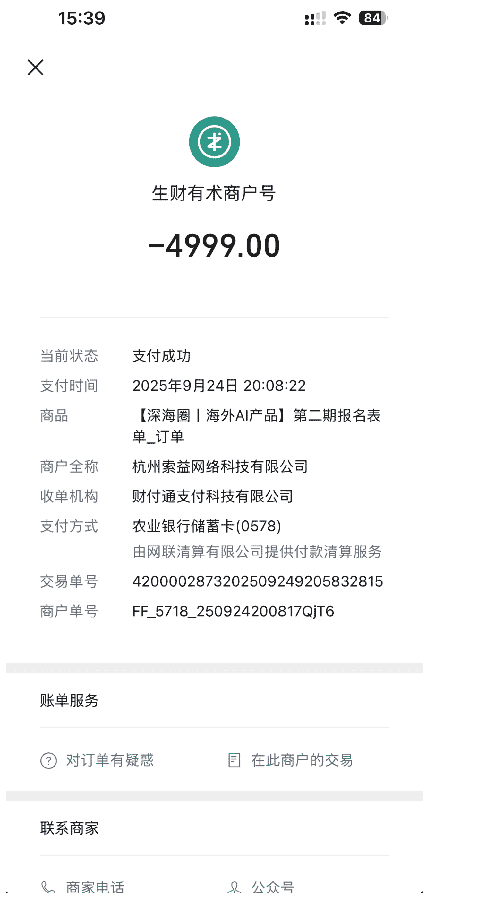

这个难度明显和纯前端小工具不是一个量级：

比哥飞社群更多的专业名词；大量英文文档；AI 解释我也逐渐开始看不懂了。

于是：退堂鼓在心里开始敲起来了。

是不是我不适合这个项目？

美金也没有那么香，要不算了吧，做做小红书啥的简单多了。

但很快又清醒了：

遇到问题就跑、逃避，那下一个项目还是有問題、还是有阻碍，一直跑？一直躲？能躲到什么时候？

期间我应该放弃了 N 次：

什么是路由？这个 Stripe 怎么又拒绝我了？

什么是环境变量？天啊，落地页到底怎么写？为什么这个按钮点了不会动呢？

............

鉴于课程内容属实硬核，我硬着头皮扛了快一个月，按照课程的内容，一点一点地打磨出一个还算看得过去的站，我觉得是时候了，接入支付！

似乎美金在召唤我。

但是天有不测风云，人有旦夕祸福。

我的 Stripe 申请被拒，两次！

第二次之后还提示：再不过会有账户封锁的风险。

这还得了，还没开始收钱就要把我的钱包都炸了，不行〇万万不行！

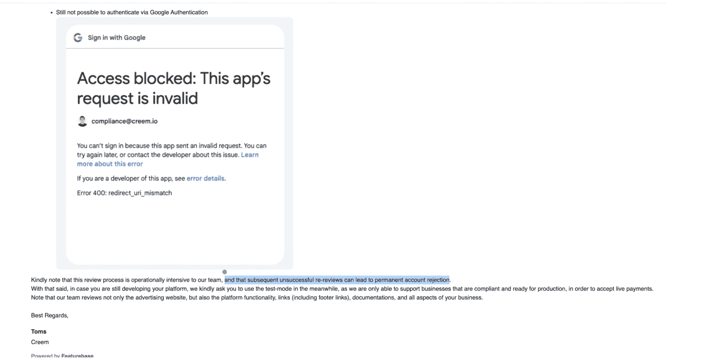

于是我写了这辈子最长的一封邮件给 Stripe，里面有十一张截图，包含：

登录、注册、功能测试的截图

隐私政策、服务条款等内容的全部截图；

每张都标注序号和大红色英语标题，就差坐在审核人员面前给他看了，

你看啊，这个是登录，没问题的

这个是功能测试，这个是下载成功，放心吧，没问题的。。。。

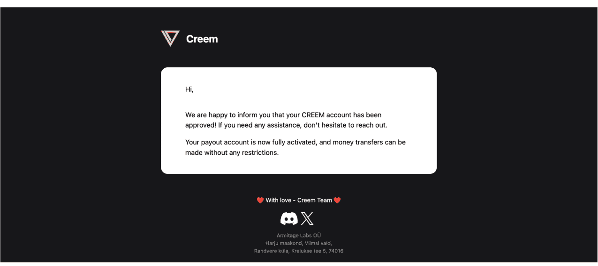

好在 Stripe 还算良心，不到一个小时，就发邮件告诉我通过了，

当时我正在陪客户看工厂，我突然狂笑，客户还问我

Jack, did you just find some money or something?

本以为这就该结束了，我也打算暂时搁置这个项目，想着差不多得了，又不是造火箭。

命运弄人，喜讯再次传来。。。

毫无征兆的情况下，我出单了！

### 2.6 快放弃后的第一单

在 Stripe 成功接入后，紧绷了几个月的情绪一下子松弛了下来，我好像突然松了一口气，就好像完成了一件人生大事，然后这口气就提不回来了，不怎么愿意继续去发外链做宣传了，觉得这站肯定没人愿意付费，不管了，就这样吧，放着得了，

在这样的心理状态下，我居然收到了第一单。

接入支付后的第三天，我迎来了人生中的第一个订单——4.9 美元。

我当时看到邮件，还以为是我朋友测试的，都没当回事。

打电话问他：“是你吗？”他说：“不是。”

我还骂他，我说老登，是不是玩我！哥很忙，别搞我。

直到我在 Stripe 后台看到付款名字是一个长长的英文名字，我才敢相信：

哈哈哈哈，我真的出单了。

妈耶，是美金，热乎乎的美金，这该死的 Stripe 怎么收了那么高的手续费...........

这一单，我用了 131 天，快五个月，快半年的时间，和我最初的三十天出单的目标差了十万八千里。

收到这个信息，我简直开心坏了：

于是做了一个奢华的决定：中午吃猪脚饭都不吃 12 块的了，改吃 15 块的，再加一瓶可乐！

有了第一单的刺激之后，我抛弃了我那拒绝造飞机火箭的心理，决定继续干，毕竟有一单就说明肯定有第二单嘛。

月入万刀不是梦了！

到了第五天，居然又出了一单，还是最大金额的 24.9 美元。这还得了！热乎乎的美金，下楼炫烧烤！

### 2.7 现阶段的情况

目前是两条腿走路。

- A 路是：日常找新词，快速上站，有流量则申请 ads 快速变现，短平快的打法。
- B 路是：关注一些老词和观察到的需求，做真正的产品，专心做好 SEO 和优化，加内页加外链，要做到：任凭风浪起，稳坐钓鱼船。

路途还长，深度太浅，能力不足，还需加油。

部分练手网站截图：

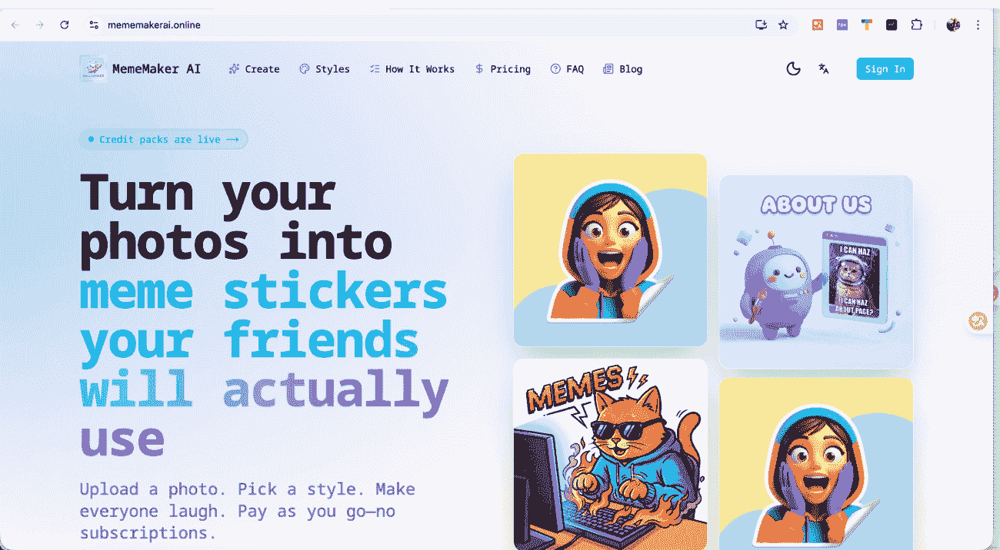
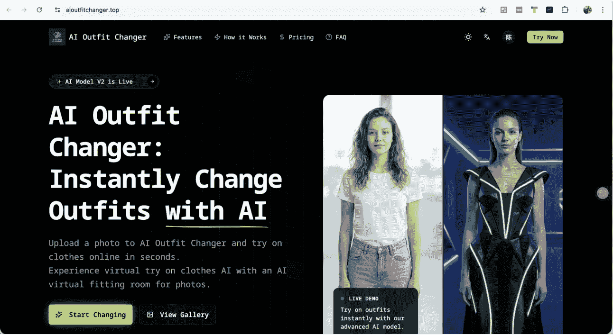

## 第三章：从找词 → 建站 → 出单的完整历程

### 3.1 我是如何发现建站关键词的

九月某天下午，我日常逛谷歌，刷到一个大站。

它月访问量在四百万左右、域名年龄接近十年，UI 也做得很漂亮，是我喜欢的风格。我就顺手用 AITDK 看了下流量和关键词，突然觉得：“嗯？这个站有点东西。”

然后我继续顺藤摸瓜：

打开 Similarweb 看它的各落地页流量，看每个页面是靠哪些关键词吃饭，再把关键词丢去谷歌趋势检验：是不是新词、是不是稳定词。

再对比 GPTs 的搜索量（大约每天 5000），我发现这个关键词大概是它的一半：每天 2500 搜索量。

# 再用 Ahrefs 查外链，第一名竟然只有 十几条外链

第一名落地页的 UI 还做得很丑。

首页 SERP 里全部是内页，没有专门站点做首页抢流量。

于是我判定这个关键词可以做，属于典型的”软柿子“你就是了！

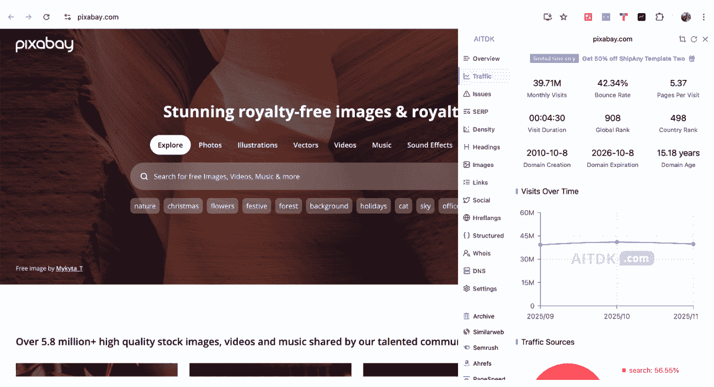

图片一：基于一个大流量的大站。

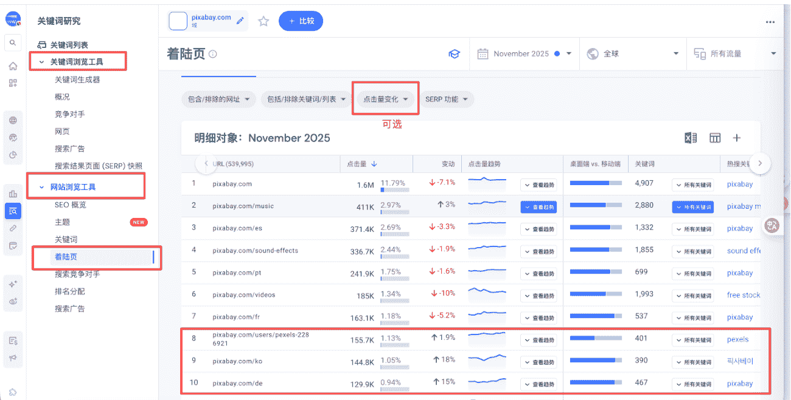

图片二：拿到域名去 Similarweb 查看落地页流量，都是哪些落地页拿到流量，上升趋势的落地页。

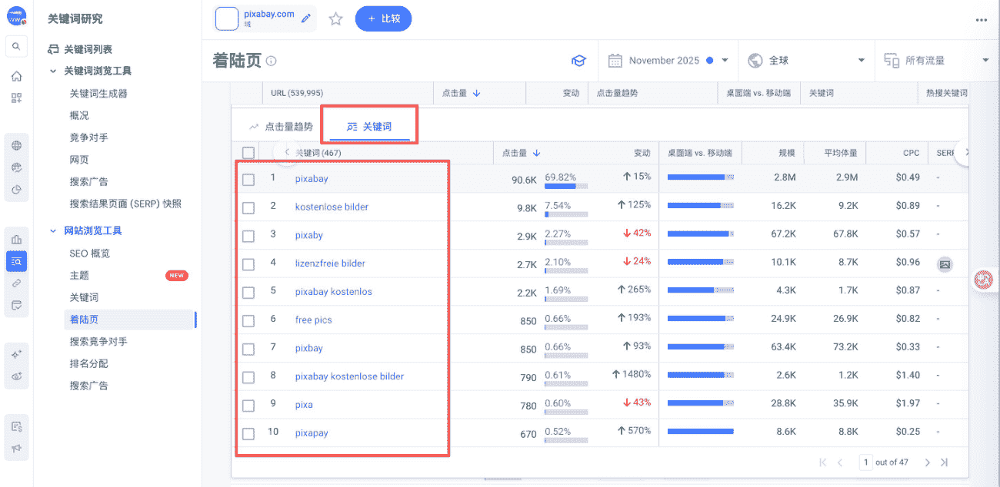

#### 图片三：找到上升趋势的关键词拿去搜索

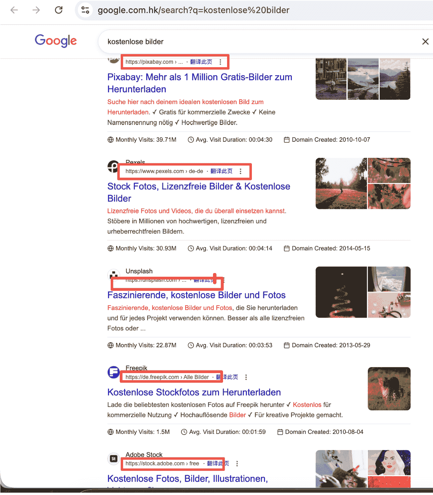

#### 图片四：谷歌搜索查看是内页还是首页

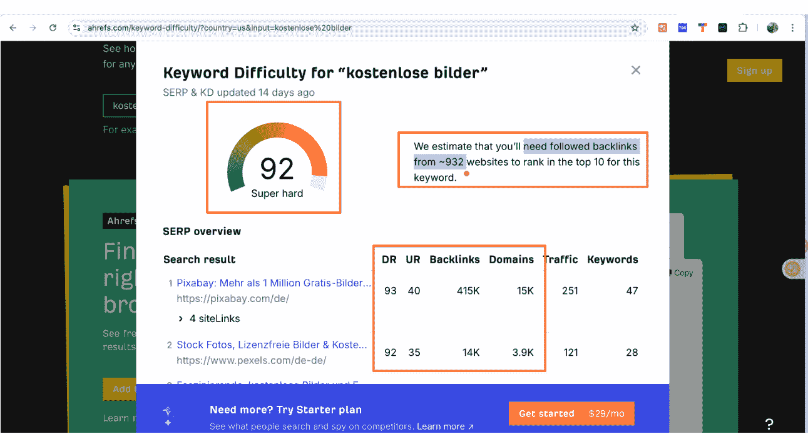

#### 图片五：查看关键词难度以及竞争对手综合分析

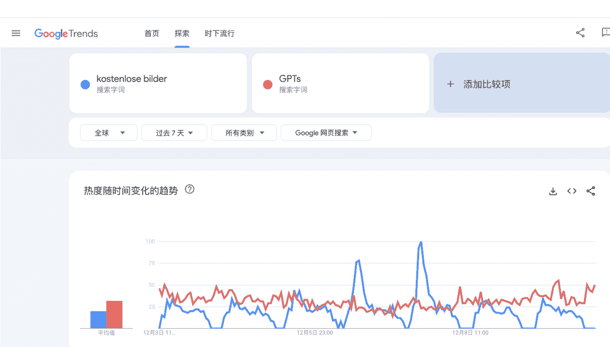

#### 图片六：谷歌趋势查看是否是季节性词汇

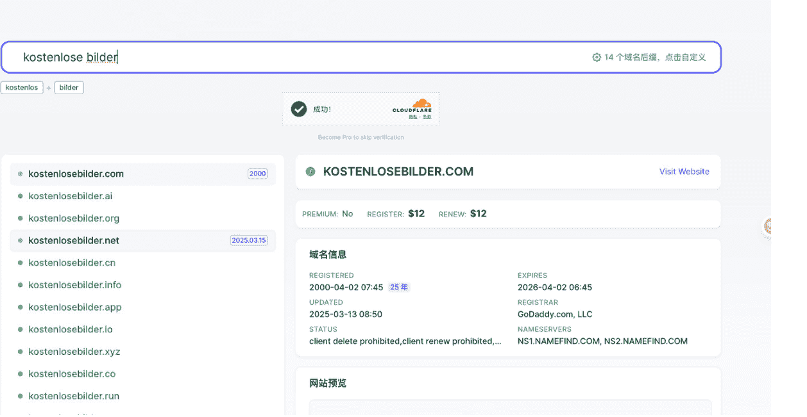

#### 图片七：查看域名注册情况，同时查看已经购买的域名是否拿到排名

基于以上信息，基本上大概可以判断一个词是不是能做，在挖掘网站的时候也可以挖出很多新的网站，依次循环。

以上图片仅示例，意在展示一次关键词的挖掘与判断方法。

### 3.2 我的找词验词日常 SOP

- ① 判断关键词流量

用谷歌趋势对比 GPTs 搜索量（5000 作为参考值）

看 7 天 / 30 天趋势，判断是否是新词或稳定词

查看谷歌前十的 SERP，把每一个站点的流量抓出来看是否真实

- ② 判断竞争程度

SERP 首页是内页还是首页？

→ 内页多 = 可以做

Ahrefs 查 KD、查前 3 名外链

→ 我的标准：100 条外链以内都能尝试

- ③ 排除陷阱词

是否是季节性（如圣诞节啊，纪念日啊，等等）

是否谷歌直达导致点击减少

是否涉及到灰产黑产

- ④ 查看域名情况

核心词是否可注册

是否存在黑历史

避免品牌词

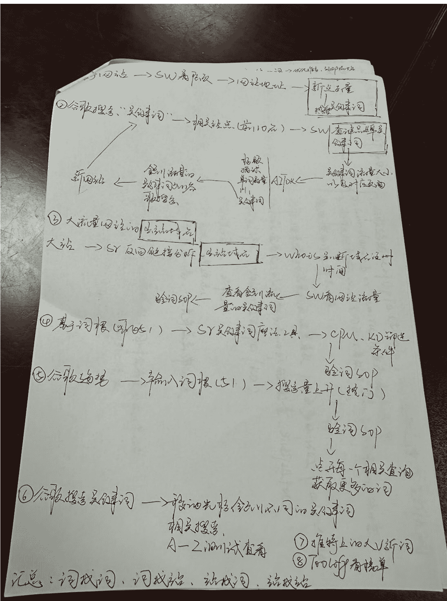

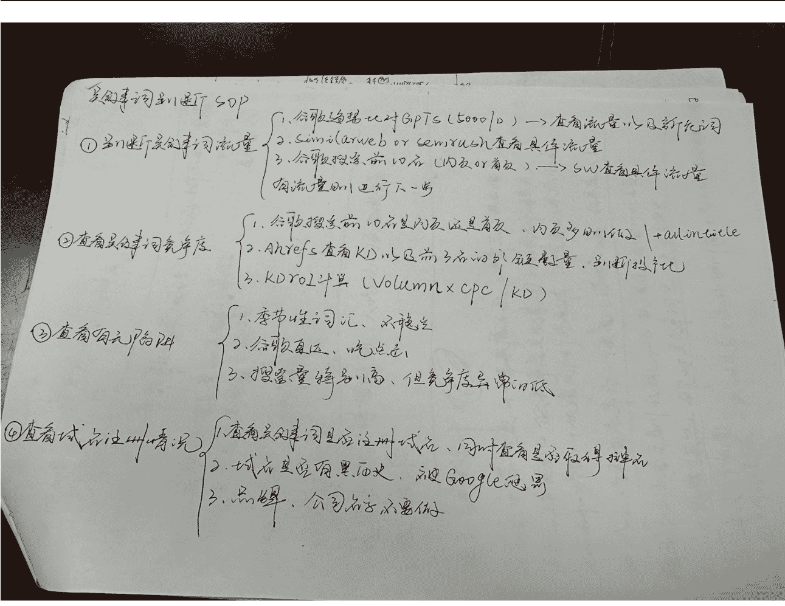

以上的环节进行一个大致的确认后，我就会进入建站环节。

### 3.3 信息收集以及需求文档撰写

我的信息收集目前主要还是手动收集，有尝试过利用 AI 帮我收集信息，但是不太行，暂时还是继续手动。

Google 搜索，下拉词，相关搜索，全部拨下来

TikTok，YouTube，X，Reddit 各大社媒都去找，把关键词全部丢进去，然后把相关的内容截图，复制到飞书文档

然后把所有观察点丢给 ChatGPT，一行行讨论：

用户到底想解决什么？

这个词的真实意图是什么，需要做一个什么样的网站来满足需求？

用户必备能有哪些？

标题和描述要怎么写？

为什么按钮这样布局？

然后我一般会问一句，如果只能设计一个功能，这个功能是什么，怎么设计，给我最小的 MVP 需求文档

需求文档出来后，我会使用 Gemini 对 ChatGPT 给的需求文档进行挑刺，看两个 AI 打架，然后拿到最终的需求文档给到 Claude Code 撰写代码。

核心就是尽可能的增加信息来源，避免单一信息入口，AI 也是，尽可能的使用多几家公司的一起使用，看神仙打架。

### 3.4 建站：从“0 开始写代码，到模板建站”

一开始我的网站全部都是手搓的，从按钮到交互逻辑，全部都是手搓，看着 AI 一行一行的写代码，很神奇，但也很低效，学了小排老师的课程之后，我发现都是基于模板快速上站的，于是我也按照教程购买了两个模板，点击付款的时候心都在滴血，这玩意怎么那么贵？？？？

我第一次用模板重构我的这个站，花了 11 天，我发现，原来建站可以那么快，我去，一天就能上线，快的话几个小时就能搞定了，我之前过的都是什么苦日子。

- 登录
- 支付
- 数据库
- 存储
- Ads
- sitemap

全部都做好了，爽！

我拿到模板后的第一件事情就是仔细阅读模板的官方文档，发现有些地方看不懂的。

[PAGE 28] 就直接把地址丢给 AI，让 AI 看叫他看懂了去实操就行，这也是我目前主流的做法，看不懂的，不会做的，都让 AI 去处理。

基于模板优化之后的网站，我称之为：成熟的网站

也就是看起来像那么回事了，该有的都有了，那下一步自然而然就是接入支付，具体的出单在上一个章节有大概的描述，再次不再赘述，侧重记录一下不要踩的坑。

#### Creem 避坑指南：

- 1.在申请支付之前，先删除网站内所有的虚假用户评论，可以在后期过了之后再加回去都行，我第一次被拒就是这个原因
- 2.产品 ID 一定要对应得上，上线前先按测试模式全部测试一遍，不要出现点击 A 套餐出来 B 套餐的内容
- 3.付款内页的文案和配图还是有必要做一下的，不然有的用户点击进去之后有可能会退出，我有五六个用户都是点击到付款之后没有点击最后那一下

建议所有做这个赛道的朋友都准备属于自己的模板，并不断迭代，在发现机会的时候，可以在第一时间上站上站。

然后就是网站迭代和流量获取了，鉴于这方面我也实在没什么经验可以分享，就先写到这里吧，该去码头整点薯条了。

## 第四章：我的一些感悟

## 4.1 无条件的自信

李笑来有句话：

> “对自己要有 120% 的自信，就算因为一些原因丢失 20%，也还有 100%。”

我觉得我在做这个项目的时候遇到的最大的问题，不是技术太难无法学会，而是找借口！我也相信肯定不止我一个人是这样，所以还是写一下好了，给大家打气，也给我自己打气。

人只要脑子里开始冒出来一句泄气的话，大脑就会思考借口来迎合这个观点。

我是不是不适合做这个项目啊，好难啊，根本看不懂，做一下小红书多简单，至少是中文嘛。

然后大脑就会找补借口了，对啊，又不是穷的揭不开锅，你之前做小红书也出单了啊。

这些产品后面会被 AI 取代的，现在入场太晚了。。。。。。

扯淡，都是心魔，自己给自己贴标签！

其实现在看来，所有的问题都是自己的心魔，就是看自己愿不愿意和想不想的事情。

有句话叫做念念不忘，必有回响。

事实就是这样的，只要认定要做好这件事情就一定能做成，不管千难万难，就是要做成。

再一个就是给给自己设立一个具体的目标，给这个目标一个具体的场景，就好比我时常在想，一个月赚三万刀的时候，我就可以买一台宝马的 M4，再贴一个东北大花袄的车衣，开出去装 X 哈哈哈哈。

一想到这个场景我就会有动力，希望你也是。

## 4.2 把“情绪”从“问题”里剥离

情绪不是问题，问题也不等于情绪，要把情绪和问题进行抽离，思考问题的解决方案，不能死守情绪，有情绪是很正常的，但是不能被牵着走。

我焦虑的时候，就把焦虑变成 To-Do List：

- 找不到用户需求 → 把用户评论全部爬一遍，把整理的词根拿去谷歌趋势再搜一遍
- SERP 判不准 → 用 AITDK + SM 分析
- API 不会接 → 去读官方文档
- Creem 拒绝 → 写申诉邮件

SEO 不知道怎么写 → 逐条抄竞品结构。

其实会发现，绝大部分时候，只要动起来了，事情基本上有解，而且正确的提出或者找到一个问题，这个问题也就解决了一半，剩下的就是求师问路，逐个击破，焦虑的背后，全是更具体的工作。

情绪会让你动不了，

但问题一旦拆成任务，就能做。

没有什么事情是一定不行的，只有自己认为自己不行才是真的不行，能行，肯定行，必须行！

最后，谢谢你看到这里，祝我们一起发财！

Cheers! 🎊🎊

## 最后，安利小懒的付费群：

### 懒人专属群（介绍）

📖 这里是你对抗信息过载的护城河。

已稳定运行 6 年，累计拆解、研读 3000+ 个互联网商业实战案例与行业前沿内参和时政/宏观文章。

我们不搬运垃圾，只做高价值信息的筛选器与放大镜。

### 懒人专属群更新记录：

https://hk57gvlx7u.feishu.cn/docx/H0kRdZbSboIBR0xkaXtcuVE0nTg

### 懒人专属群更新记录（需梯子，备用）：

https://lazybook.fun/blog/record2

> 【免责声明】本资料归档于社群内部知识库，仅供成员课题研究与学术交流，请在查阅后 24 小时内删除。