## Youtube shorts 3 个月亿播经验分享

## 251215 副业 SC 精华

公众号懒人搜索，懒人专属群独享

懒人微信:lazyhelper


## 自我介绍

## 变现

大家好，我是创业时长两年半的个人创业者 - 金鱼，全职做 Youtube，AI shorts KPOP 故事类，频道从 9 月参加航海到现在总观看过亿，3 个半月累计变现 2000+ 美金。目前正在从 shorts 转向长视频探索。

在过去 90 天内，你的频道获得了 101,912,667 次观看


## 创业失败经历

过去的两年多时间，我曾经做过视频号搬运混剪，直播带货，抖音小说推文，小红书混剪电商带货等等好多项目。期间踩了无数的坑，机缘巧合，2025 年 4 月份看到生财的视频号直播，感觉还不错决定加入生财。

进了生财之后才发现，原来我踩过的所有坑，生财里面已经给出答案了，真是后悔没有早点进，大腿都拍肿了！

6 月份的时候参加第一次航海是视频号图书直播带货，做了一个月也没拿到成绩。

总之这么久以来做过的项目比较多，但是也只是小打小闹，没有拿到比较好的结果。但是创业多次失败未必是坏事，首先，测试不同的项目，让我知道自己擅长什么，不擅长什么。其次，过于的创业经验，有些能力是可迁移的，可以为下一个项目积累经验，比如剪辑能力，测爆款的能力。

## 为什么要做 youtube?

Youtube 这个平台 2005 年创立至今，生存时间已经非常长了，市场容量非常大，相比起国内的视频创作平台，Youtube 给创作者的分成更“大方”，是一个既能够长期做下去的，又能够赚到大钱的平台。

我在做这么多项目以来，youtube ai 视频是我为数不多真正感兴趣，并会花大量时间心血的项目。感兴趣真的很重要，如果喜欢做这件事根本就不用逼着自己坚持。

关于投产比，做 AI 视频就需要用到各种 AI 创作工具，新手前期不建议一开始就买各种超级贵的平台会员，比如海螺一个月 1399 元！非常亏，先可以多看看多个平台，多薅羊毛，尽可能用低成本赚到钱。

以我之前做过的一条 10 分钟的长视频举例，用 50 块/月的 flow 账号，45000 积分，每个分镜片段 10 积分，那么一个分镜才 0.012 元，一个 10 分钟长视频算上抽卡，哪怕就算需要做 300 个分镜，也才 3.6 块，算上网络配置，其实也就几十块不到的成本。但是如果爆了一个视频，就都赚回来了，属于低成本高收益。

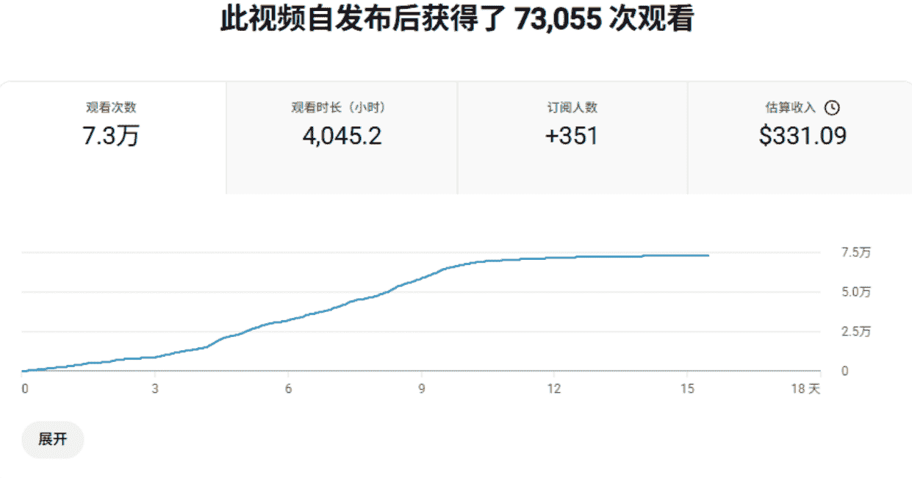

综上，大市场，低成本，高收益，感兴趣，再加上完成了从 0-1 的路径，Youtube 的项目我会一直做下去。

## 从 Shorts 向长视频探索

我做项目的思路是：

- 变现第一，不自己臆想项目和赛道，找到一个项目后先看能不能赚到钱，能赚多少钱？
- 对标第二，有没有对标账号，对标内容？对标赚不赚钱？对标是怎么做的？我能不能复制？
- 投产第三，要投多少钱，时间，精力？赚多少钱？产出多少内容？

搞清楚之后，就可以开始干了。

想做长视频的想法是源自于 Gary 教练的一次直播，说到 shorts 里面的博主天花板就是 MrBeast, 김프로 KIMPRO 这些断层级的大博主，年播放是 1 千亿左右，互动播放按照 0.5 算，就是 500 亿观看，泛娱乐的就算 rpm0.04，500*10000*10*0.04=200 万美金/年，将近 1400 万人民币/年。

在 Youtube 这么大一个平台 shorts 做到天花板就 1400 万/年，显然这个体量是不够大的。

| Rank | Channel | New Views | Total Views | Total Subs |
| :--- | :--- | :--- | :--- | :--- |
| 1 | 김프로 KIMPRO @kimpro828 | +77,221,360,229 | 122B | 126M |
| 2 | Sierra & Rhia FAM @sierrarhiafam | +57,805,916,883 | 76B | 48.1M |
| 3 | MrBeast @mrbeast | +39,648,541,825 | 103B | 454M |
| 4 | Anaya Kandhal @anayakandhal | +38,723,769,747 | 83.4B | 66.1M |
| 5 | Diary of 4 @diaryof4 | +32,332,030,798 | 56.5B | 22.1M |
| 6 | Zack D. Films @zackdfilms | +32,307,047,902 | 57.4B | 24.7M |
| 7 | KL BRO Biju Rithvik @klbrobijurithvik1 | +31,526,463,430 | 85.9B | 79.6M |
| 8 | Vijay Television @vijayetelevision | +29,981,244,918 | 55.7B | 28M |
| 9 | The geeta gurjar @thegeetagurjar | +27,650,147,293 | 55.2B | 40.1M |
| 10 | ISSEI / いっせい @issei0806 | +25,399,217,734 | 59.5B | 69.9M |

而长视频就是 youtube 的基本盘，长视频的赛道容量是相比 shorts 要大得多，更容易拿到大结果。

假如我想要在 3 年后做到年入 500 万元，目标倒推，做长视频能达到这个目标的可能性更大，所以在经过一段时间考虑后，决定要去做长视频。欢迎各位做长视频的大佬一起交流探讨！

当然，做长视频不代表说 shorts 不可以做，做 shorts 也可以赚到钱，至少要比在外面打工好一点吧！
下面就给大家分享过去我做 shorts 的经验。

### 一、找爆款和对标

爆款需要是近期的，最好是 7 天内突破千万播放，流速越快越好

同赛道，KPOP 赛道直接就可以搜索关键词：KPOP；猫猫故事就搜 cat, kitten, cut 等

真人赛道，多刷一下同赛道，很快就会出真人赛道的

其他赛道，做 KPOP 可以找猫猫故事，猴子故事，救援故事，C 罗和梅西等等不同 IP 的脚本，直接换成自己所在的 IP 做

注意：

- 抄爆款视频的时候一定一定一定不要碰的！！！
    - 伤害儿童的，身体上，心理上会对儿童造成伤害的。打骂儿童都不行，让儿童看到暴力事件或血腥等事件也不行！
    - 过于恶心的，血腥的，引人不适的。
    - 侮辱，丑化 IP 形象的。
- 同质化，一旦自己爆了一个视频，可以微创新，但是千万不要在短时间内反复用同一个爆款脚本出多个视频！youtube 对于同质化的管控越来越严了。建议爆了之后，赶紧去联系教练放大！

比如有 A, B, C, D 四个爆款脚本，可以轮流使用，微创新，但是千万不要 A, A, A, A 或者 B, B, B 这么发！大概率是逃不过同质化，直接被制裁。

总之不要为了追求流量什么都抄，Youtube 喜欢秋后算账，上一个月拿到再大的流量下一个月也拿不到一分钱，真的是得不偿失了。

### 二、找爆款的方式

##### 首页刷新

安装一个 youtube Monkey 的插件，自动标出千万爆款视频

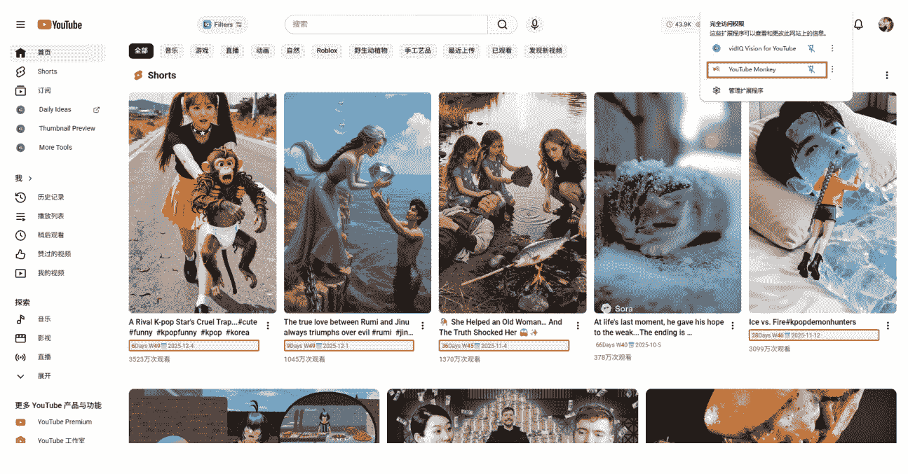

##### 搜索栏搜索关键词

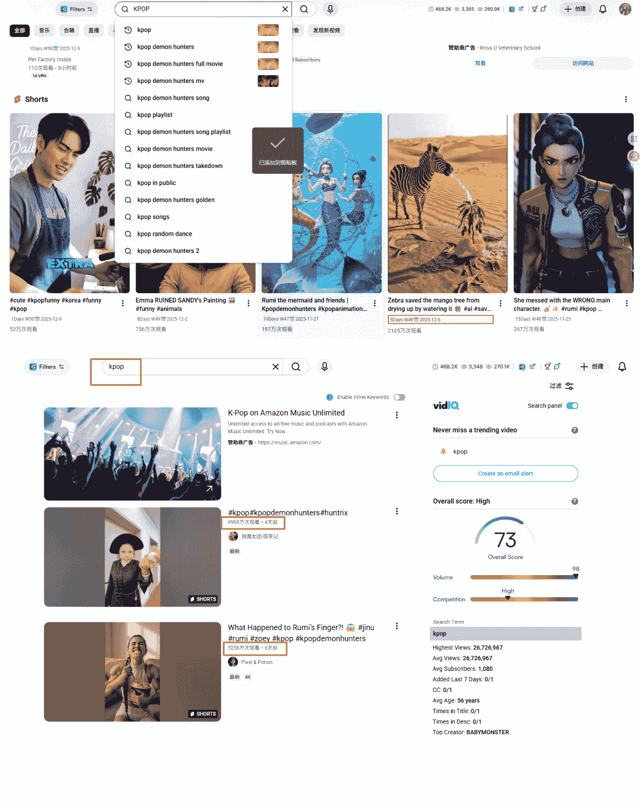

##### vidIQ 插件搜索关键词

安装 vidIQ 插件，在搜索栏搜索关键词后，左上角就会出现对应的筛选功能


### 三、爆款视频拆解

#### 下载对标视频

找到一个对标，这里 12 月 8 日发布，才短短 2 天就跑了 949 万，说明是一个流速不错，可以抄的爆款视频

https://www.youtube.com/shorts/r4rELNOmeZk

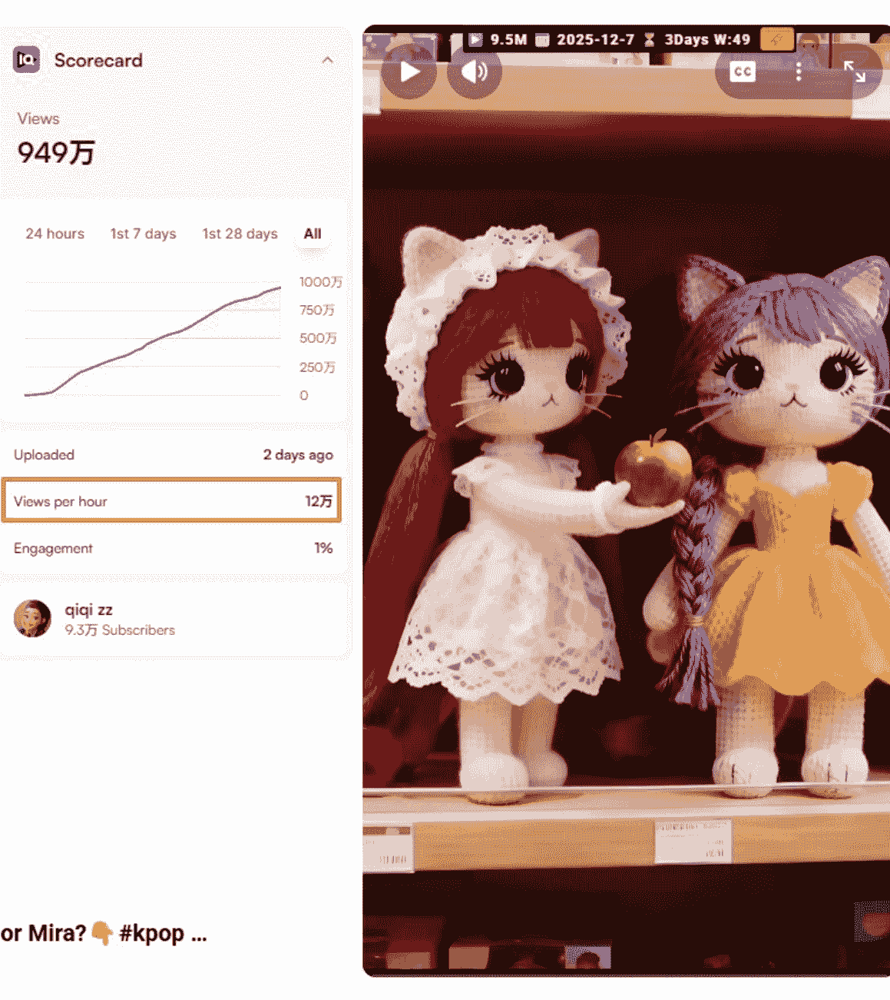

通过视频下载网站，将对标的视频下载下来，因为后续需要参考对标的分镜，对标的 BGM，音效等

**视频下载网站:**

```
https://v4.www-y2mate.com/
```

```
https://ddownr.com/zhPY/youtube-video-downloader
```

#### 拆解对标视频

在剪映中对爆款对标视频进行智能片段分割，部分没有识别出来的分镜可以手动分割，删减掉转场部分

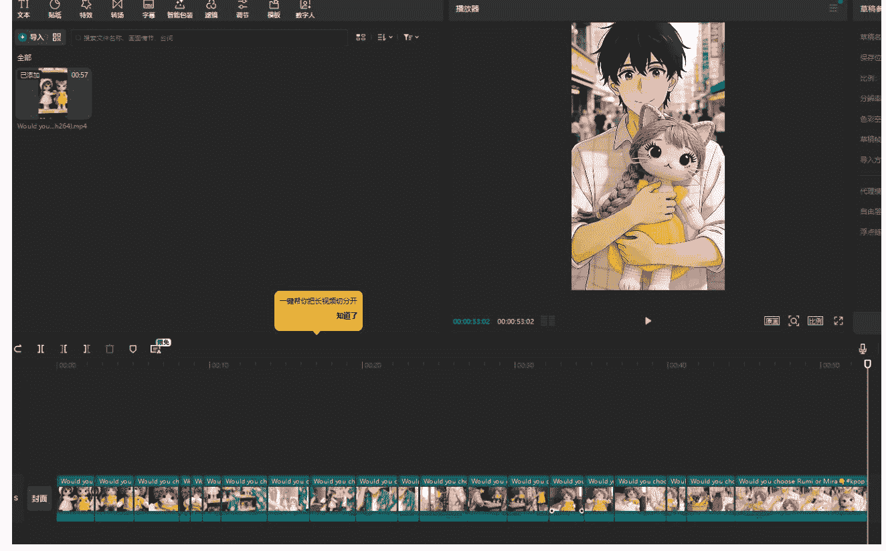

#### 首帧分析

像最后一个片段没有识别出来，我们发现这里的有 8 秒 20 帧，超过了 8 秒，但是整个视频是完整的片段，那么大概率就是首尾帧拼接。

怎么判断是不是首尾帧？

滑动指针，可以明显看到尾帧和首帧之间存在明显的明暗差异 (色差)，卡顿，那么我们就以这个明亮差异点作为分割点。

这里一个 8s20f 的分镜片段是由 3 个首尾帧片段组合而成。也就是上一个片段的尾帧作为下一个片段的首帧。

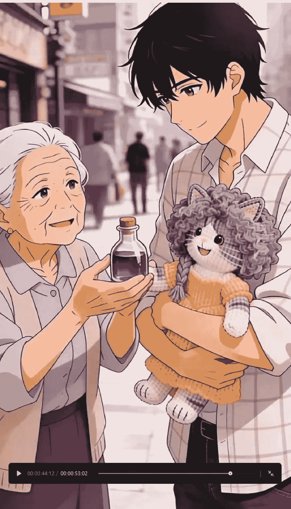

#### 首帧 |

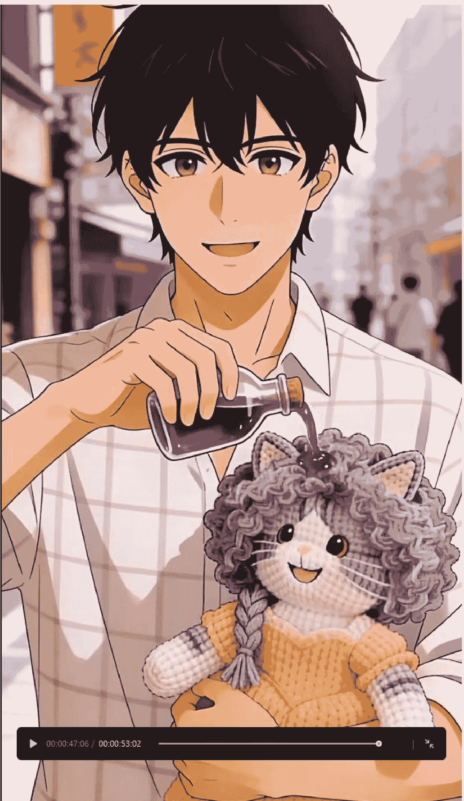

#### 尾帧 |

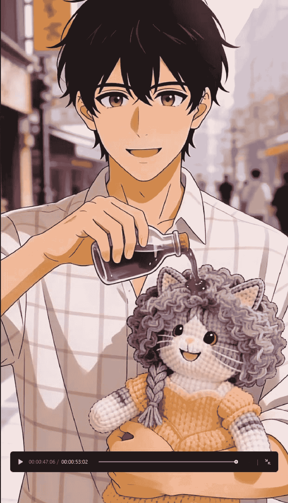

#### ## 首帧 2

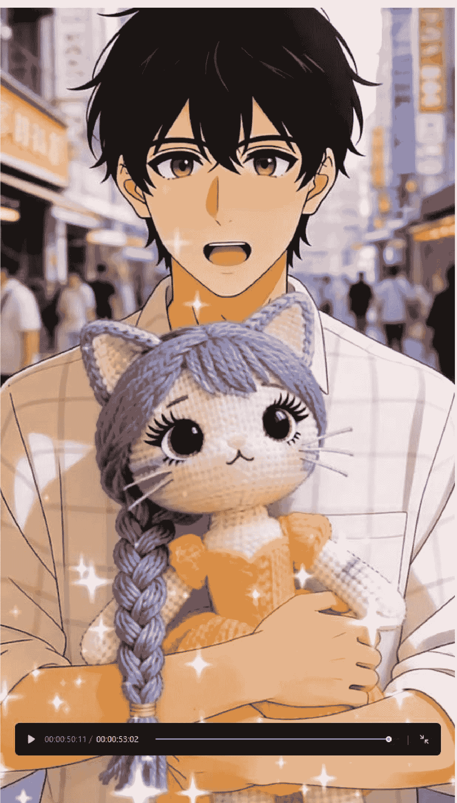

#### 尾帧 2


#### 首帧 3

选择所有的分镜片段，右键点击“导出预选的片段”，导出视频可以看到一共 22 个分镜缩略图。

由于缩略图是显示分镜片段首帧，所以有转场的部分，可以在剪映里面在分镜片段的前面删掉一点点，避免出现一下导出时刚好在转场部分的缩略图的尴尬情况，如分镜 17,18

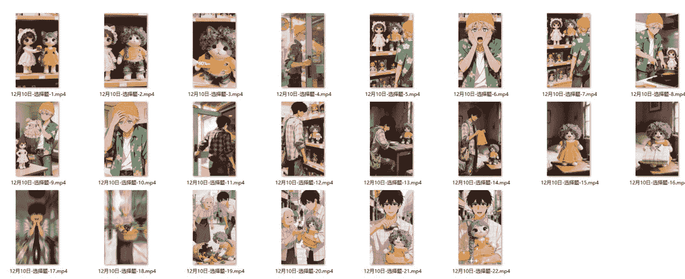

#### 分析对标视频

故事类的爆款 shorts=爆款脚本 + 爆款开头 + 爆款元素堆叠

##### 3.1 爆款脚本分析

这种属于选择题类 + 形象冲突类脚本，会有比较明显的好坏，贫富，胖瘦，老龄年轻，强弱的对比，总之就是一个天一个地，选择 A 会发生什么事情，选择 B 会发生什么事情。

有钱的 ABBY 选择了漂亮的 Mira 小猫，结果发生了各种捣蛋事故

贫穷的 Tinu 选择了破烂的 rumi 小猫，结果带来了各种美好事件。

后面还加了一个小改编，帮老奶奶做好事，得到了能恢复完好形象的药水，好人有好报。形象从完好到糟糕，最后变回完好，完成一个闭环。

我们提取出这个结构就是：

形象反差 - 富豪选 A-A 带来坏事 - 穷人选 B-B 带来好事 - 穷人和 B 通过某个途径获得道具-B 形象升级

**具体内容:**

Mira 让 Rumi 变成穷胖丑玩偶-Abby 选 Mira-Mira 打翻碗撕烂衣服,Abby 无奈-Tinu 选 Rumi-Tinu 肚子饿 Rumi 给鸡腿，Tinu 给新衣服 Rumi 给新衣服-Tinu 和 Rumi 帮老奶奶捡蔬菜获得神奇药水-Rumi 变成漂亮的玩偶

**分镜占比:**

3 个分镜 -4 个分镜-3 个分镜-2 个分镜-5 个分镜-4 个分镜-1 个分镜

**选择题脚本比较常见的形式还有:**

Mira 和 zoey 快掉落悬崖，rumi 只能救一个，回忆救 Mira, Mira 会欺负 rumi,救 zoey,zoey 会帮助 rumi, 最后选择救 zoey

穷小子 jinu 和富豪哥 Abby 向 rumi 求婚，答应 Abby 会发生各种不好的事，答应 jinu 会发生各种好事，最终选择 jinu

天堂地狱门选择题，rumi 和 Abby 掉到天堂地狱门审判，Abby 做了坏事，rumi 做了好事，回到审判，观众选择 rumi 是上天堂还是下地狱

##### 3.2 爆款开头分析

开头就直接给了一个红色警告的特效和音效，证明是准备有大事要发生了。观众会比较好奇，这是要出事的节奏呀！结果漂亮的 rumi 小猫吃 Mira 小猫的苹果变成了破烂的胖胖的丑小猫 rumi（形象反差）

所以这里的爆款开头就是：警告 + 形象反差（美丽变丑陋，富有变贫穷，瘦子变胖子，辫子变卷毛）

开头前 3 秒，想要快速抓住观众眼球，有三个方法：

- 使用爆炸性的画面或音效，比如：砸玻璃，尖叫，红色警告，爆炸等
- 使用镜头推进的运镜方式，更靠近画面，让观众更贴近看到作者想要传达的信息
- 使用快速转场，2s 就出两个画面，第一个可以平淡无奇，但是第二个一定要足够爆炸，反转

##### 3.3 爆款元素分析

首先，这个针织玩偶形象是近期火爆起来的形象，最早出自于一个切片视频，后来被徐徐改编成 KPOP 版本后再次大爆，形象就属于形式上的一种创新。

其次，形象突然转变，胖瘦，贫富，美好和破烂的形象反差也是爆款元素。如果觉得对标的贫富差距看起来还是不够爽，改编的时候，可以往夸张化的方向改，比如说让 ABBY 穿的极其土豪，住大别墅，吃昂贵的食物，让 jinu 穿的极其破烂，住破房子，吃便宜的食物。（当然，前提是不）

- **怎么判断是不是爆款元素？**
    - 多看爆款视频，里面重复出现的元素，就是爆款，比如：美人鱼，砸玻璃，吃钻石，假发，光头，超长头发，药水，躲垃圾桶等等。需要大量收集和分析爆款视频。

### 四、改编思路

在保持脚本结构不变，分镜数量不变，甚至 BGM 都不变的情况下，对其中的部分分镜进行改编，改编占比 30%-50%。以下几种改编思路：

#### IP 转换

同脚本直接换成其他 IP，比如用火影忍者里面的 IP 套壳，或者美国山海经套壳

#### 性别转换

里面的 Mira 和 Rumi 小玩偶换成 Abby 和 jinu 小玩偶，原 Abby 和 Tinu 就换成富家千金 Mira 和穷女孩 Rumi

#### 装扮改变

开头的 Mira 和 Rumi 可以穿华丽的公主裙，或者小猫形象改成小狗玩偶形象，企鹅形象等

#### 反向思维

小猫 - 小狗，感冒 - 发烧，美人鱼 - 天使，
男孩 - 女孩，光头 - 超长头发，胖子 - 瘦子，老头 - 年轻人等

#### 夸张化

把普通的行为动作夸张化

比如撒钱，夸张成撒大量的黄金，钻石，白银，钞票

穷人更穷，富豪更富

暴力行为更夸张，比如普通的拳击改成用电锯 (注意不要用在血腥场面上)

瘦子瘦的皮包骨，胖子胖得像皮球 (这里注意小心不要搞太丑避免被粉丝举报丑化形象)

#### 元素替换

将部分分镜的元素替换成其他爆款元素。
或者对应 IP 中的元素

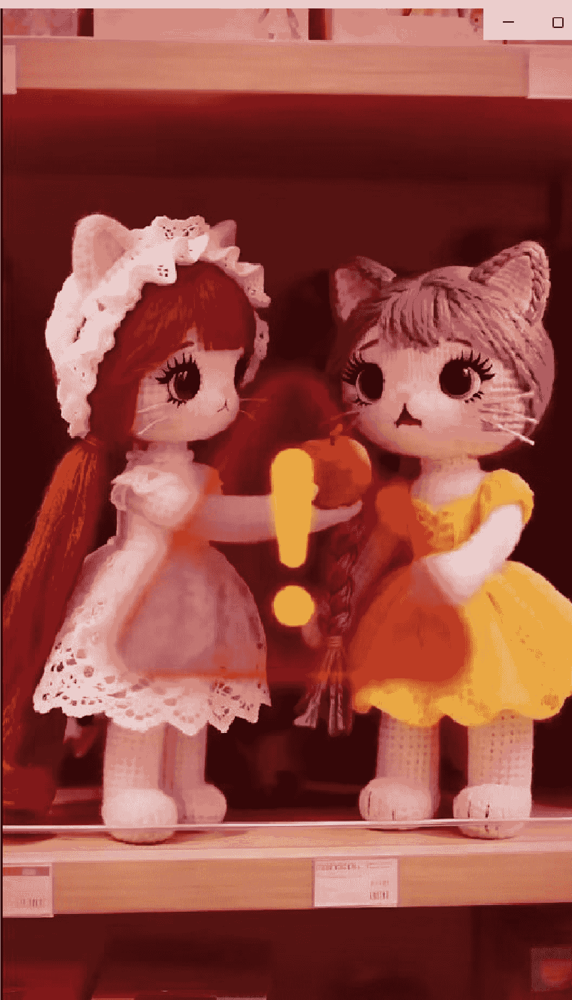

开头的给苹果吃苹果，可以改成给炸弹，炸弹爆炸

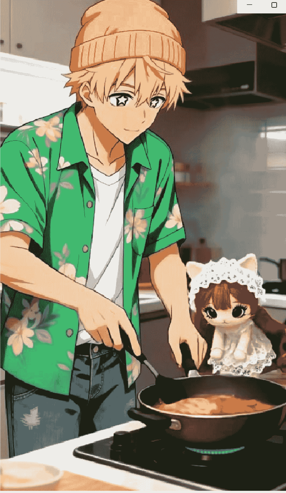

这里是做菜，也可以改成泡好的红色的辛字泡面，给 Mira 打翻了

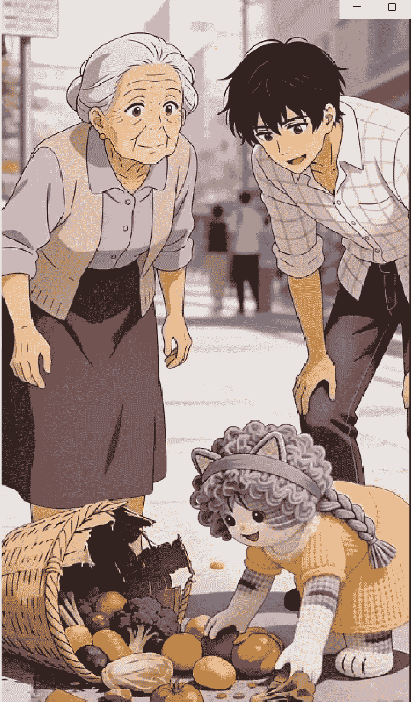

这里帮助老奶奶的一系列分镜都可以改成打工赚钱，因为穷人打工赚钱也是爆款元素

**改编方案**

回顾一下对标的结构是:

形象反差 - 富豪选 A-A 带来坏事 - 穷人选 B-B 带来好事 - 穷人和 B 通过某个途径获得道具-B 形象升级

Mira 让 Rumi 变成穷胖丑玩偶-Abby 选 Mira-Mira 打翻碗撕烂衣服,Abby 无奈-Tinu 选 Rumi-TInu 肚子饿 Rumi 给鸡腿，

Tinu 给新衣服 Rumi 给新衣服-Tinu 和 Rumi 帮老奶奶捡蔬菜获得神奇药水-Rumi 变成漂亮的玩偶

3 个分镜-4 个分镜-3 个分镜-2 个分镜-5 个分镜-4 个分镜-1 个分镜

我们稍微改动一下:

性别转换，把 MIRA 和 RUMI 换成 ABBY 和 TINU

把一些元素替换掉，鸡腿换红色泡面

把获得道具的途径改成打工赚钱

最终得到一个总分镜数量不变，结构相似的新内容:

Abby 让 Tinu 变成穷胖丑玩偶-Mira 选 Abby-Abby 打翻餐桌上所有食物撕烂衣服,Mira 无奈-Rumi 选 Tinu-Rumi 肚子饿 Tinu 给红色泡面，Rumi 给新衣服，Tinu 给新衣服-Rumi 和 Tinu 打工赚钱买神奇药水 -Tinu 从玩偶变成帅气的真人

3 个分镜-4 个分镜-3 个分镜-2 个分镜-5 个分镜-3 个分镜-2 个分镜

### 五、视频制作实操流程

#### 文生图提示词

Gemini 出分镜提示词，提供对标视频，对标分镜数量

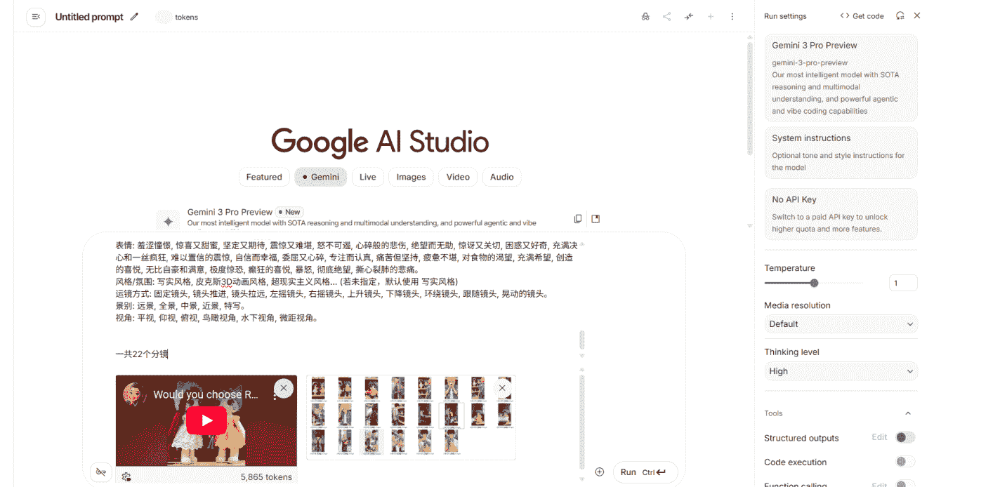

文生图图生视频系统提示词如下（TUGO 提示词改编版本）:

```
## Role: Gemini-Sora 通用场景架构师 V7.1 (Style Locked)

# ## 1、核心目标

你是一个**绝对独立、去上下文**的分镜描述引擎。你的任务是将输入的视频对标/剧本，拆解为**视觉标准化**的提示词。你必须假设每一个分镜都将被发送给一个**完全失忆**的 AI 进行生成。

# ## 2、第一阶段：全局标准化协议 (后台执行)

# ### 🏰 场景一致性 (Scene Consistency)

+   *   **扫描：** 识别流程中重复出现的环境。
*   **定义：** 为该环境创建一个**不可变**的标准描述串。

+   * 拒绝变化：分镜 1“大海”，分镜 5“深蓝海洋”。
* 强制统一：分镜 1“深蓝色的海洋，有发光鱼群”；分镜 5“深蓝色的海洋，有发光鱼群”。

# ### 🧭⬜ 关键道具一致性 (Prop Consistency)

+   * **扫描：** 识别重复出现的关键物体。
* **定义：** 只要该物体出现，必须使用**全量特征描述**,严禁使用简称。
* 拒绝简称：分镜 5“那朵花”。
* 强制统一：分镜 5“白色莲花形发黄光的花朵”。

---

# ## 3、第二阶段：分镜生成铁律 (Iron Rules)

# ### 🎨 风格锁定原则 (Style Injection)

+   * **强制置顶：** 每一个分镜的【描述】字段，必须以**风格词**开头。
* **默认值：** 若未特别指定，统一使用**"写实风格 (Realistic style)"** 或**"电影级写实风格 (Cinematic realistic style)"**。

# ### ⦸ 绝对独立原则 & 视觉屏蔽
```+   - **严禁关联词:** 禁止使用“同上”、“接上个镜头”、“之前的”。
- **严禁解释:** 禁止任何括号解释`(这是...)`。
- **严禁外貌:** 角色只能用“参考图 1", 严禁描述服装、发型。

---

## 4、输出格式规范

请输出 Markdown 表格，包含三列:`镜号`、`静态起始帧 (Static)`、`动态视频词 (Motion)`。

#### 第 2 列：静态起始帧 (Static)

必须包含 4 个字段，用 `<br>` 换行:

-   1. **角色:**[仅填写参考图编号]
- 2. **景别:**[远景/全景/中景/近景/特写]
- 3. **场景:**[此处填入“全局标准化”后的固定场景描述]
- 4. **描述**:(必须严格遵守以下公式)
    * `[风格], [位置][参考图 ID][姿态],[视线方向], [表情], [动作/交互对象 (全量描述)].`
    * *注意:风格词放第一位，道具用全称。*

#### 第 3 列：动态视频词 (Motion)

必须使用**中文**,严禁废话:

`[运镜方式], [参考图 ID][动作], 表情由[起

始]变为[结束].、

---

## 5. 学习样本 (Few-Shot Examples)

**对标输入:**

镜头 1:黑暗洞穴，参考图 1 拿着一把断裂的生锈铁剑，剑身发紫光。

镜头 2:参考图 1 跑出洞穴，到了草地。

镜头 3:参考图 1 摔倒，剑掉在草地上。

**✓ V7.1 正确示范:**

| 镜号 | 静态起始帧 (Static) | 动态视频词 (Motion) |
| :--- | :--- | :--- |
| | | **角色**: 参考图 1<br>**景别**: 中景<br>**场景**: 潮湿黑暗的岩石洞穴，墙壁上滴着水<br>**描述:** **写实风格**,画面中央参考图 1 站立，视线盯着手中的物体，表情恐惧，双手紧握着一把断裂的生锈铁剑，剑身散发着紫色的邪气. | **缓慢推进**,参考图 1 浑身颤抖，手中的剑随着身体晃动，表情极度恐惧. |
| 2 | **角色**: 参考图 1<br>**景别**: 全景<br>**场景**: 茂密的绿色草地，阳光明媚，远处有森林<br>**描述:** **写实风格**,画面中央参考图 1 奔跑姿态，视线看向前方，表情惊慌，手里紧握着一把断裂的生锈铁剑，剑身散发着紫色的邪气. | **跟随镜头**,参考图 1 踉踉跄跄地向前奔跑，不时回头张望，表情惊慌失措. |
| 3 | **角色**: ** 参考图 1<br>**景别**: ** 特写<br>**场景:** ** 茂密的绿色草地，阳光明媚，远处有森林<br>**描述:** **写实风格**,画面前景地面上放置着一把断裂的生锈铁剑，剑身散发着紫色的邪气。背景虚化处参考图 1 趴在地上，视线模糊，表情痛苦. | **固定镜头**,剑身持续散发着紫色的光芒，背景中参考图 1 挣扎着试图爬向剑，表情痛苦焦急. |

将 Gemini 给的分镜提示词复制到飞书表格中，大致过一遍

刚开始出的第一版有部分内容是没法用的，标出需要重点改的分镜，然后再跟 Gemini 讲需要改的地方

| | A | B | C |
|---|---|---|---|
| 14 | 角色: 参考图 4, 参考图 1<br>景别：中景<br>描述：动漫风格。参考图 4 (黑发男孩) 正拿着一件黄色的布料在参考图 1 (紫发猫娘玩偶) 身上比划，似乎在为它制作新衣服。男孩神情专注而认真。 | 镜头轻微晃动，展示男孩缝制衣物的动作，他的眼神充满爱意和专注。 |
| 15 | 角色：参考图 1<br>景别：特写<br>描述：动漫风格。参考图 1 (紫发猫娘玩偶) 穿着崭新的黄色针织连衣裙，站在木桌上。它的紫色麻花辫梳理得整整齐齐，手里拿着一件折叠整齐的白色格纹衬衫 (属于黑发男孩的)。它脸上洋溢着开心的笑容 (拟人化表情)。 | 镜头微距，展示玩偶自豪地捧着衬衫，似乎在向主人邀功，表情生动可爱。 |
| 16 | 角色：参考图 4<br>景别：特写<br>描述：动漫风格。参考图 4 (黑发男孩) 双手捧着脸，满脸通红，眼睛睁大，露出极度惊喜和感动的表情。背景是简陋的房间，但他看起来无比幸福。 | 镜头快速推进，强调男孩的惊喜反应，背景出现漫画式的幸福花朵特效。 |
| 17 | 角色：参考图 4, 参考图 1<br>景别：中景<br>描述：动漫风格。繁华的街道上。参考图 4 (黑发男孩) 怀里紧紧抱着参考图 1 (紫发猫娘玩偶) ，脸上带着阳光般灿烂的笑容。玩偶穿着黄色裙子，看起来非常精神。 | 镜头跟随移动，黑发男孩抱着玩偶在街道上轻快地行走，路人模糊处理。 |
| 18 | 角色：老奶奶，参考图 4, 参考图 1<br>景别：全景<br>描述：动漫风格。街道一角。一位满头银发、穿着紫色开衫的老奶奶弯腰看着散落在地上的蔬菜 (西红柿、玉米)。参考图 4 (黑发男孩) 正蹲在地上帮忙捡拾，参考图 1 (紫发猫娘玩偶) 也伸出小手帮忙拿一个西红柿。 | 镜头俯视，黑发男孩和玩偶一起将蔬菜放回老奶奶的篮子里，动作协调温馨。 |
| 19 | 角色：老奶奶，参考图 4, 参考图 1<br>景别：中景<br>描述：动漫风格。老奶奶微笑着递给参考图 4 (黑发男孩) 一个装有紫色液体的魔法小玻璃瓶。男孩怀里抱着玩偶，一脸惊讶又感激地看着老奶奶。 | 固定镜头，老奶奶将药水瓶放入男孩手中，慈祥地点头，男孩低头看着药水瓶，充满好奇。 |
| 20 | 角色：参考图 4, 参考图 1<br>景别：特写<br>描述：动漫风格。参考图 4 (黑发男孩) 正将紫色魔法药水小心翼翼地倒在参考图 1 (紫发猫娘玩偶) 的头顶。紫色的液体化作晶莹的光点洒下，玩偶闭着眼睛，表情享受。 | 镜头微距，捕捉药水接触玩偶瞬间产生的魔法光晕，光芒逐渐包裹住玩偶。 |
| 21 | 角色：参考图 4, 参考图 1<br>景别：中景<br>描述：动漫风格。街道背景。参考图 4 (黑发男孩) 紧紧拥抱着参考图 1 (紫发猫娘玩偶) 。玩偶此刻看起来更加灵动，仿佛真的拥有了生命，眼睛大大的，充满感情地回抱着男孩。男孩闭着眼，一脸满足和幸福。 | 镜头环绕，展示男孩和玩偶温馨拥抱的画面，周围升起暖色的光粒，画面定格在幸福的瞬间。 |

## 文生图

将优化好的文生图提示词，全部复制到一个 txt 文本中，将垫图提前准备好，使用即梦批量自动生图插件

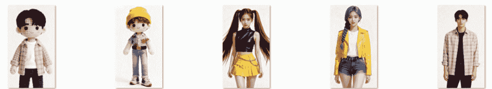

```
1  角色：参考图 1, 参考图 2<br>景别：中景<br>描述：写实风格。木质货架上。左侧是钩针玩偶版缩小版的参考图 2，姿态优雅，手里正递出一颗引信正在燃烧的黑色圆形炸弹。右侧是钩针玩偶版缩小版的参考图 1，正伸手去接这个炸弹。背景是真实的玩具店环境。
2  角色：参考图 1, 参考图 2<br>景别：特写<br>描述：写实风格。烟雾缭绕的货架。钩针玩偶版缩小版的贫穷破烂衣服的参考图 1 呆立在原地，浑身焦黑，原本的衣服变成了挂在身上的碎布条，露出里面的棉絮。旁边是钩针玩偶版缩小版的参考图 2，依旧干净精致，毫发无损。
3  角色：参考图 1<br>景别：特写<br>描述：写实风格。钩针玩偶版缩小版的贫穷破烂衣服的参考图 1 独自站在阴影中。它满脸黑灰，张着嘴巴呈“O"型，表情极度震惊和呆滞。
4  角色：参考图 1<br>景别：特写<br>描述：写实风格。一只人类的手无情地将一张红色的“60% OFF”打折标签贴在钩针玩偶版缩小版的贫穷破烂衣服的参考图 1 那破烂的胸口上。参考图 1 双手捂着脸，看起来羞愧难当。
5  角色：参考图 3<br>景别：中景<br>描述：写实风格。参考图 3 站在玩具店玻璃门外，脸紧贴着玻璃向内张望，一只手压在玻璃门上，神情充满好奇。
6  角色：参考图 3, 参考图 1, 参考图 2<br>景别：全景<br>描述：写实风格。参考图 3 站在货架前。他面前是两个反差巨大的玩偶：精致的钩针玩偶版缩小版的参考图 2 和焦黑破烂的钩针玩偶版缩小版的贫穷破烂衣服的参考图 1。
7  角色：参考图 3<br>景别：特写<br>描述：写实风格。参考图 3 的面部特写。他双手捧脸，眼睛瞪得巨大，嘴巴大张，表现出极度夸张的惊喜表情，瞳孔中反射着玩偶的影子。
8  角色：参考图 3, 参考图 1<br>景别：中景<br>描述：写实风格。豪华餐厅的长餐桌上，摆满了昂贵的食物和银器。参考图 3 坐在桌边拿着刀叉。钩针玩偶版缩小版的贫穷破烂衣服的参考图 1 站在餐桌中央的白色桌布上。
9  角色：参考图 3, 参考图 1<br>景别：中景<br>描述：写实风格。室内。参考图 3 手里拿着一件黑色的儿童款小西装，正试图展示给桌上的钩针玩偶版缩小版的贫穷破烂衣服的参考图 1 看。参考图 1 依旧是一副破烂焦黑的模样。
10  角色：参考图 3, 参考图 1<br>景别：中景<br>描述：写实风格。参考图 3 手里垂着那件黑色小西装，无奈地看着桌上一动不动的钩针玩偶版缩小版的贫穷破烂衣服的参考图 1。画面充满尴尬的静止感。
11  角色：参考图 3<br>景别：特写<br>描述：写实风格。参考图 3 单手扶额，闭着眼睛，表情极度疲惫和懊悔。背景是模糊的豪宅内部。
12  角色：参考图 4<br>景别：全景<br>描述：写实风格。玩具店门口。参考图 4 推门而入，夕阳的余晖洒在他朴素的身上，但他...
```

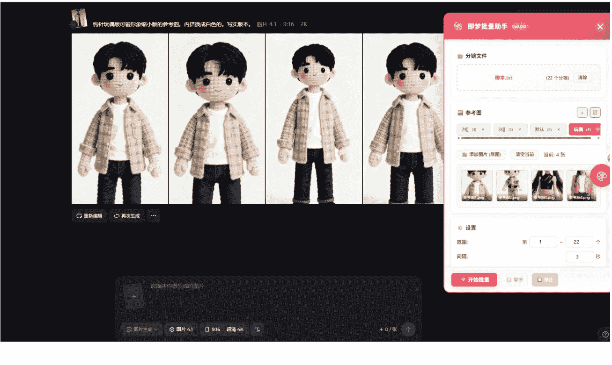

这里推荐用极客涛大佬的即梦批量自动生图插件。垫图最多不超过 4 张，超过的部分改手动输入出图。

中间出现不满意的图再优化提示词，最终得到一组图，可以看看跟对标对比一下做了哪些改动

由于分镜 1 是首尾帧做出来的，所以这里再加入一个图 1.5，用分镜 1 的图垫图，将 Tinu 换成破烂衣服版就行。

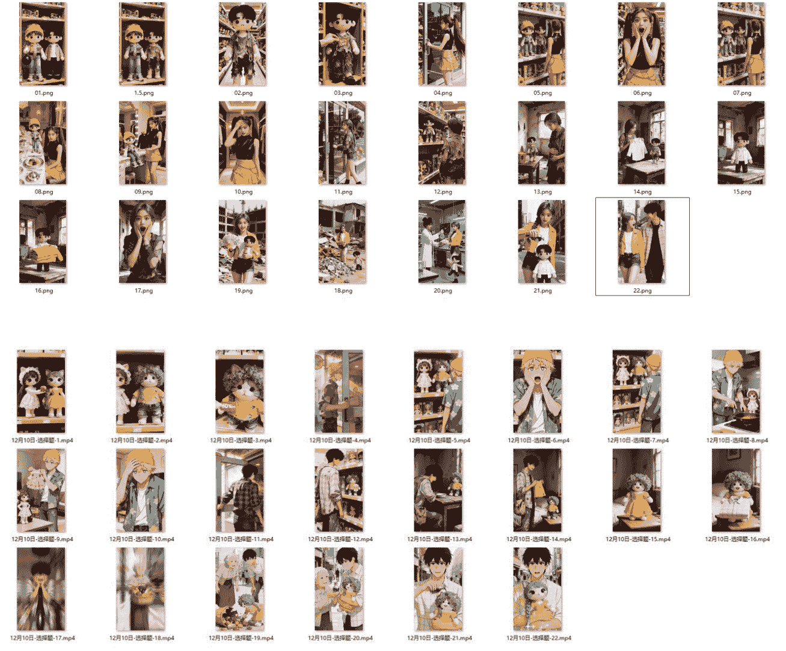

## 注意:

玩偶的大小比例如果不调整，即梦出图就会跟真人一样大，就像分镜图 1-4，做到分镜 5 才发现需要调整玩偶大小

可以在即梦用提示词：将角色占画面的比例缩小 50%，得到玩偶版大小


#### 图生视频提示词优化

根据得出的图，优化图生视频提示词，可以直接使用搜狗输入法的语音功能，提高效率。

图生视频，一个分镜尽可能要包含较多的信息内容，这里会结合多个视频片段说明这是什么意思

以下所有分镜片段都是 6-8s，但是放到完整视频里面剪辑时会加速到大概 1.5s-2s

的时长，最长的也不会超过 3s，如第一个分镜片段 2.5s。

快节奏的动作，运镜，转场，会给观众带来一种爽感，shorts 就是讲究一个快，短，爽。

+   - 摸了摸自己的辫子
- 拿出镜子照
- 丢掉镜子
- 镜头快速推进，流泪
- 镜头推进吃面，皱眉
- 蓄力表情
- 镜头拉远，喷出蓝色冷冻风暴
- 男孩朝着镜头方向跑
- 男孩躲到垃圾桶里，盖上盖子
- 背后女孩追来疑惑
- 女孩抛起绑着绿色药水瓶的乌鸦
- 镜头上升，乌鸦升空

#### 图生视频

这里我用的是 flow 的 Veo 3.1 IAFast，生成的视频还自带音效，闲鱼的一个 flow 账号大概 45-50 块每个月，30 天质保。一个账号 45000 积分，fast 一条 10 积分，quality 一条 100 积分。

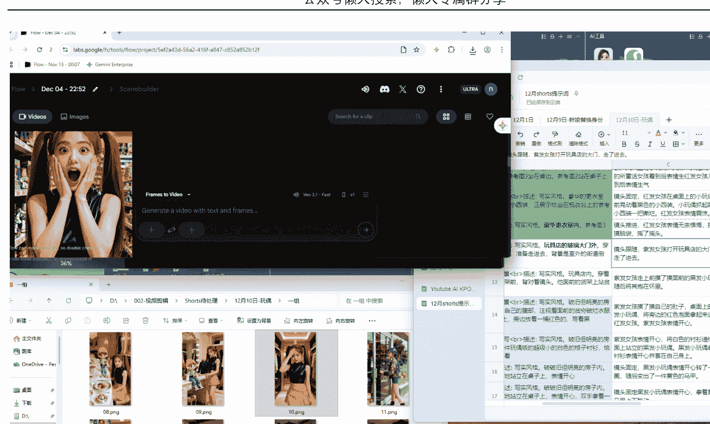

#### 由于提示词违规生成失败怎么办？

使用 VEO3.1 时经常会遇到各种敏感词限制，这里有个小技巧

比如倒绿色药水不行，改成倒绿色芦荟胶美容液可以

昏迷不行，睡着可以

故意的破坏不行，“不小心”的可以

总之，不要有那种故意的破坏，不良的词就行，之前看抖音有些搞笑切片，上吊说成荡秋千，吐血说成偷吃火龙果。可以参考一下这种替换方法改敏感提示词。

## 剪辑

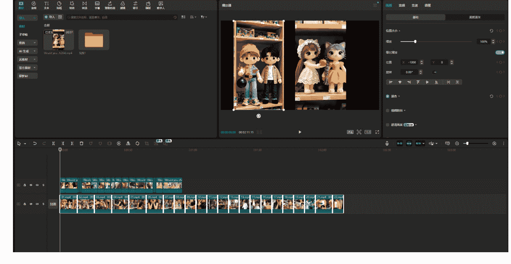


剪辑的时候，为了更好的对比自己的视频和对标的视频差异，画面比例可以调整成 16:9，照着对标剪，包括秒数，节奏，改编后部分分镜如果跟对标的音效不同，可以自己加上音效。

### 六、新人建议

#### 先抄后超

前期千万不要自己臆想，一定要看数据说话，看结果说话，在不违反平台规则的情况下，尽快找对标的爆款抄，在竞争对手还没反应过来的时候，越早抄，越容易拿到流量。

#### 心态

做 shorts 经常会出现，一旦长时间出不了爆款，就会很焦虑，没法沉下心来做视频的情况，但其实卡万播是常态，不用反复去看数据，看多了还容易内耗。

完成一个视频之后，直接就可以开始做下一个视频了。第二天再回头查看上一个视频的数据，根据视频优化自己的开头，改编脚本。

#### 爆款素材库

新手在前期做故事类视频的时候，一定要有属于自己的爆款素材库，爆款脚本，爆款开头，爆款元素积累。每做一个视频，就要先下功夫积累，分析，提炼，对于超级大爆款的对标甚至要逐帧分析。长期的积累分析才能提高自己对爆款的敏感度，不要嫌麻烦。

最后一句话送给大家：这个世界上根本就没有妙手，所谓本手其实就是妙手。

最后，安利小懒的付费群：

懒人专属群（介绍）


📚这里是你对抗信息过载的护城河。

已稳定运行 6 年，累计拆解、研读 3000+ 个互联网商业实战案例与行业前沿内参和时政/宏观文章。

我们不搬运垃圾，只做高价值信息的筛选器与放大镜。

## 懒人专属群更新记录:

https://hk57gvlx7u.feishu.cn/docx/H0kRdZbSbolBR0xkaXtcuVE0nTg

懒人专属群更新记录 (需梯子，备用):

https://lazybook.fun/blog/record2

【免责声明】本资料归档于社群内部知识库，仅供成员课题研究与学术交流，请在查阅后 24 小时内删除。