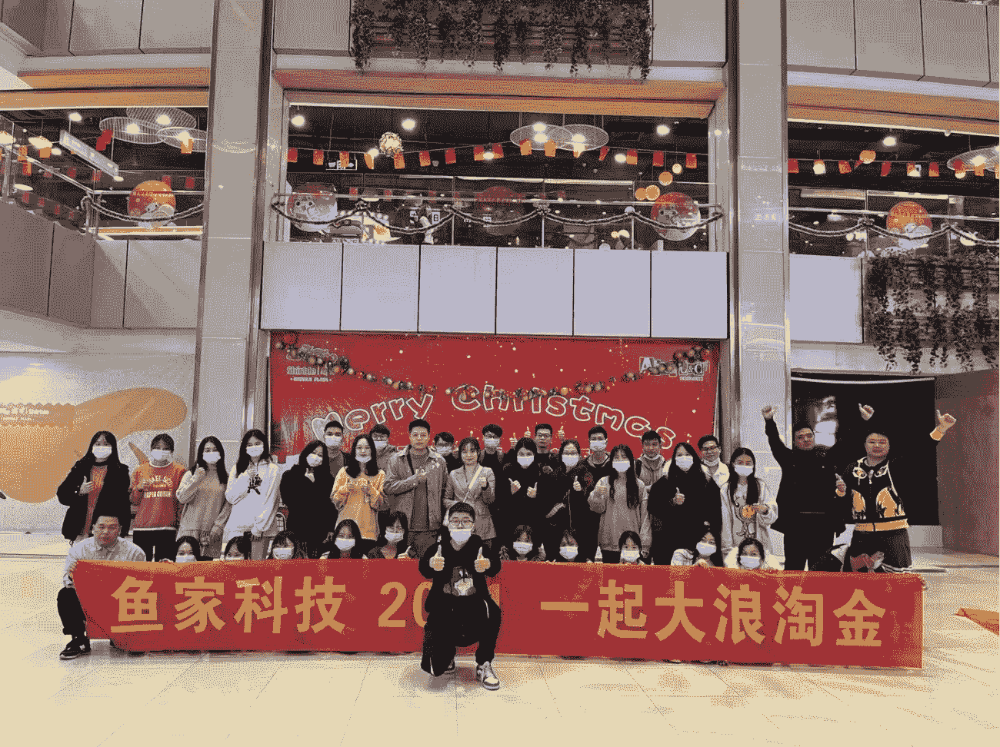
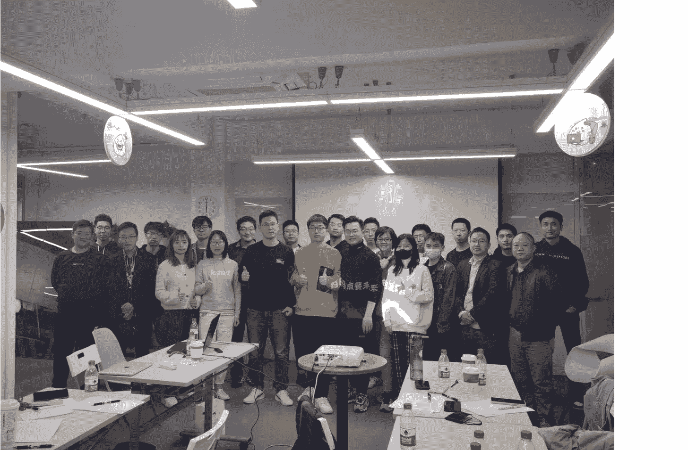
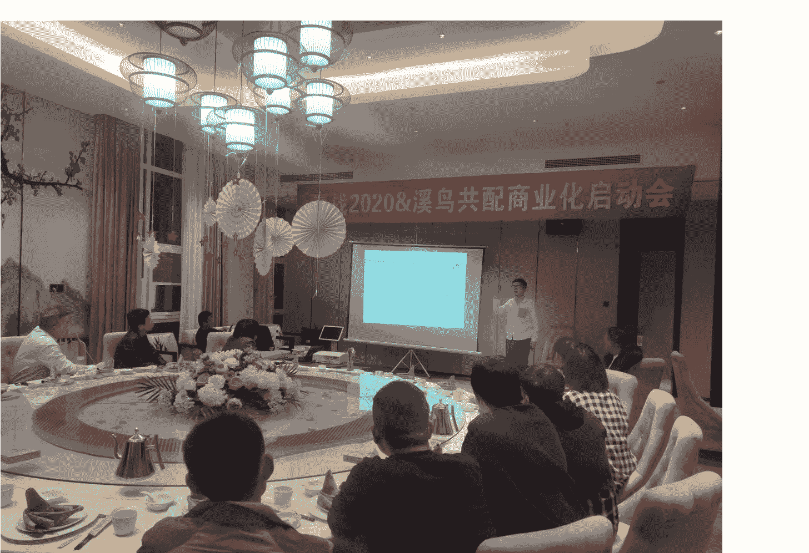
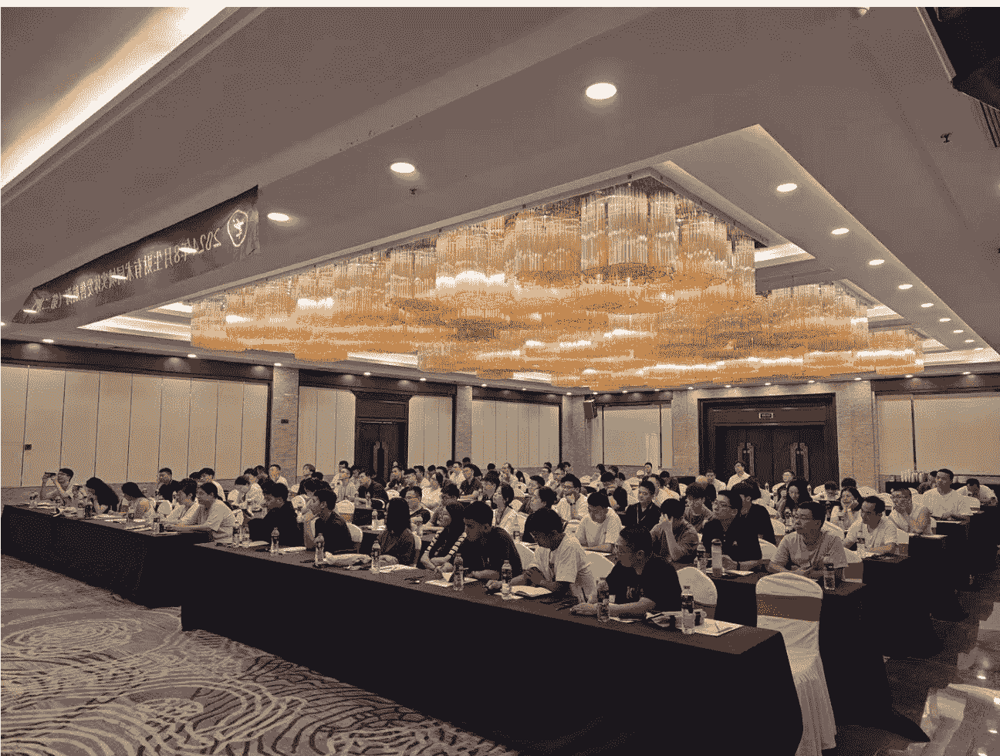

# 三次阿米巴血泪总结，如何把 1000 元利润，规模化复制成 1000 万

## 251215 副业 SC 精华

公众号懒人搜索，懒人专属群独享

懒人微信:lazyhelper

我这几年带了近百人赚钱，也见了大量的创业者，

我发现的大量的创业赚不到钱，其实犯了一个巨大的错误，就是不断的找项目，不断的从 0 到 1，其实项目不在大小，最核心的点，在于复制，就是看你如何完成第一个 1000 元利润后，怎么能规模化一万份，那就是 1000 万，像淘宝客，拉一个群一天赚 100，那拉 1000 个群，一天就赚 10 万了，像 app 下载，一个 app 下载给 100 元，那你只需要找到 10 万人下载这个 app 就好了，像实体服务，一个商家给 10000 服务，找到 1000 个商家就好了，所以，赚到巨额利润的点，是在于复制，不在于找各种各样的项目，不断的完成从 0 到 1，

那估计很多粉丝会问，

策哥，我也想从 1 到 n，我该怎么进行规模化的复制呢？

今天我分享一个，我经常用的方式，就是阿米巴，这里的阿米巴不是日本的那个阿米巴，而是中国式阿米巴，其实就是找到一批人，然后共同做一个业务，然后不拿底薪，然后进行项目分成，

我一共操盘过三个中国式阿米巴，

- 1. 医保项目，以资源为驱动的阿米巴;
- 2. 地推 app 项目，以 ip 驱动的阿米巴;
- 3. 同城实体发售，以项目驱动的阿米巴，

基本每个项目周期下来，分佣有大八位数，

所以，对于这个规模化的模式，我确实有资格说几句真话，

今天我系统化，讲一下阿米巴在规模化复制中一些卡点在哪，优势在哪，坑在哪里，

### 1、广东医保激活项目，是我第一次真正意义上用阿米巴打大仗

那一家，国家在推动医保电子凭证电子化，通俗点就是激活电子医保，

当时支付宝与广东省医保局深度联动，激活医保必须用支付工具，我们在一线工作，在帮医保局完成激活指标，在帮助支付宝完成新用户的下载，

我们得到支付宝的拉新佣金，这次就是政策与商业的比较好的融合，

当时选的市场就是，就是深入到一个村，激活完一个村，进入到另一个村，不断激活完一个村，再到一个镇、再到一个市、一个省，这样医保激活量得到了保证，支付宝的下载量也得到了保证，

这个项目是一个大哥带我进入的，所以算是资源变现，

我去广东落地后，单一村，很快跑通了模型，

模式就是：文件发到村里、村里通知村民去村委会集合，团队去村里去操作、团队当天结算，1-2 天，

一个广东省就有 2 万多个村，为了快速完成覆盖，必须要快速铺上人，来完成覆盖，

基于此，我们搭建了一个阿米巴的组织架构，找到多个阿米巴合伙人，每个合伙人负责一个区县，

每个阿米巴合伙人搭建一个团队，我只负责管理这么一群合伙人，

因为当时是疫情期间，我们的合伙人筛选出了两个比较好的人群，退伍军人与导游，

导游能唠嗑，适合跟政府打交道，退伍军人适合执行，

所以快速铺了上百人来做这个业务，片区之间没有内耗，一个村一个村的开展，每天的数据蹭蹭往上走，

那时候感觉还是很爽的，当组织势能形成时，感觉全世界都在给你让路，

在刚开始的时候，感觉阿米巴就是最好的方式，简单、粗暴快，

但是随着中后期就出现了一些问题，

医保激活在一线村里激活的时候，没有深挖一个村，大家喜欢偏向于再开一个村；

为了抢占更多的业绩，在团队成员增加的时候，越来越松，导致村里投诉变多、甚至出现盗刷村民的卡的情况；

在中后期，天天就是在灭火，不断的处理过度承诺、投诉，

每天都会接到哪个地方出现特殊事情的电话，到现在也比较讨厌接电话，

这种情况持续了一年，自己变成了一个救火队长的角色，

这个业务前后做了两年，随着支付宝不上市、阿里被罚，这个业务最后结束了，

上图是在潮汕地区做医保推广的合影

上图是在中山进场做医保推广的合影

关于这个医保业务的阿米巴，

你会发现非常适合在资源型、窗口期短、结果明确的项目去执行，每个人利益一致、势能爆发，可以做的非常的快，但是攻城容易，守城还是比较难的，

基于此，构建好阿米巴，要注意这几个点，

- 1、模型要足够清晰，要有一个足够清晰的闭环单元，流程足够标准化，

当时一个村就是一个完整的闭环，这样流程越简单，你的复制就会越疯狂，其实就要看一下，你能否把项目变成一万个可以傻瓜式完成的小单元；

2、选对人很重要，

如果当时我们选错人，一开始我们就坍塌了，能硬撑两年，我觉得选对人具有巨大的因素；

3、速度是毒药，风控是解药，

一定要设计一定的风控机制，要不然随时会挂掉。

### 2、地推 app 项目，以 ip 驱动的阿米巴

医保项目在做的过程中，其实我还在做另一个项目，地推 app 项目，医保项目算是我 app 项目的延伸，

因为在操盘医保的时候，我当时我就在反思，资源型项目窗口期太短，风险太大，

有没有一种项目是不靠政策、不靠大哥，靠自己能打出阿米巴模式，

后来思考，

答案其实就在我身上，个人 IP，

当时我在各大圈子里已经小有名气，带兄弟们赚过钱、打过仗，有了一定的信任基础，

地推 app 项目，

于是我决定再用一遍阿米巴，这一次，用我的个人 ip 驱动一批人来做这个事情，模式也比较简单:

粉丝信任我→我选安全、高佣 App→对接品牌→标准培训→全国复制→推广一次、结算一次

只要复制我的打法，一个人一天干 20 到 50 个下载并不难，单个下载佣金几十到上百，

结果非常夸张，巅峰时期我们大概有 1 万多人左右的代理，来推广 app，

整个阿米巴体系里一批人赚到了钱，

那段时间，我真正理解了：人设本身就是生产力，信任可以规模化，带人成功比自己成功更可持续，

但是这个项目有一个天然的 bug 点，平台政策不由你掌控，规则一变，全盘震荡，

app 价格降低、审核变得严一些，一旦利益变化，分配不稳定，

团队会立刻松散，直接影响整个组织，

你会发现，组织越大，反而越脆弱，这是所有依赖第三方政策型商业模式都会踩的坑。

这是做 B 端推广启动会的合影

这是溪鸟 app 下载启动会的现场合影

关于这个地推 app 业务的 ip 驱动阿米巴，你会发现它其实是一种流量变现的高级形态，

非常适合轻资产、短平快、高爆发的项目，它的核心逻辑不是靠管理去驱动人，而是靠“信任”去通过利益把人卷进来，这种模式一旦跑通，爆发力是指数级的，因为它省去了传统生意中最耗时的建立信任环节，基于此，构建这种以 IP 为驱动的阿米巴，

这三点极其的关键：

- 1、交付的颗粒度要极细，必须是脑残级的 SOP，不要试图让你的蚂蚁雄兵去完成复杂的动作，

我们在做的时候，把所有复杂的 APP 注册逻辑全部剔除，只保留两个动作：发码、下载，

如果你想让一万人来驱动一个事情，你的流程必须简单到连村口大妈看一眼都能懂，凡是需要培训超过 10 分钟的项目，都不适合这种大规模的阿米巴复制，

- 2、人设是最高的效率，在这个阿米巴里，大家为什么听你的？不是因为你严苛的 KPI，而是因为你是“孙策”，

IP 的本质，就是降低交易成本，因为信任你，代理敢垫资；这种信任感替代了庞大、臃肿的行政管理体系，

所以，这种模式下，一旦人设崩塌，这种靠信任链接起来的组织，也会大规模坍塌，

- 3、切忌在别人的地基上，搭建你的阿米巴

这是最致命的幻觉，在别人的商业闭环里，其实自己的本质是寄生，没有掌控权的阿米巴，

一定要清醒地认识到，凡是地基不属于你的生意，楼盖得越高，倒塌的时候，压死的全都是自己人。

### 3、同城实体发售，以项目驱动的阿米巴

上面两个业务，累计起来大概做了个 5 年左右，

做完前两个项目，我其实一直在思考：医保靠的是政策红利，App 靠的是平台流量，

这种项目相对来说，没有那么稳定，

只有靠解决真实的痛点，解决真实的需求，构建产品，相对来说会很稳固，

所以，我干了第三个：同城实体发售。

通俗点说，

就是给同城的实体老板做业绩提升，直接带队进驻，用短视频 + 直播 + 私域，帮商家做一场业绩提升的结果型发售，

这个业务我们自己团队本身做了两年后，

我们才开始的规模化，同样也是用阿米巴的方式，

首先我们构筑了一个同城总成本领先的模式，

就是说，我们打一个城市，进入 10-15 人，

大概有 5-6 人左右是做销售，大概是 5-6 人左右是做交付，2-3 人进行对应的管理与排单，

所以，在这个城市里，我们面对面销售、面对面交付，所有的动作发生在本地，

那么整体的成本就是比同行低、效率也比同行高，

同行投广告、在线聊，对于我们这样的方式，可以说，我们是碾压级的优势，

我们这次我们把最小单元变成了一个城市，一个城市 10-15 人，

那这个 10-15 人就是一个最小的阿米巴单元，

所以，所有的城市，我们走的是一模一样的商业模式，

我们搭建了这样一个体系进行支撑，

- 1、通过训练营寻找阿米巴的伙伴，这个业务还是有一定的门槛，所以说通过训练营的方式快速让一群人能学会这个业务；
- 2、城市标准作战小队，每个人负责不同的岗位，有销售、有交付、有管理，
- 3、有完善的 sop，每个人都能快速到达 60 分以上，这样可以确保交付，

当时我形容，这是一辆破车在跑，但是核心零件都在，

因此，我们进行了大规模的城市覆盖，我们覆盖了山东、河北、江苏、浙江、广东，这样的城市，

整体还是取得了不错的成绩，

### 这是在济南晚上复盘的合影

这是在盐城培训的合影，

关于这个同城实体发售的阿米巴，你会发现在搭建阿米巴过程中，有这几个经验，

- 1、对比我之前的两个阿米巴，这个实体发售的优势在于，实现了项目的利润闭环，销售、交付，复购，裂变都在这个阿米巴闭环完成了，不在受制于一些平台的，所以搭建起来的更稳固一些，

- 2、大型阿米巴的组织，岗位务必分工要明确，必须要颗粒化，这样的优势就是让平均能力变强，

写在最后，

当然阿米巴也有自己的劣势，公司整体利润较薄，人员流动过大，不适合做业务的创新，

所以在开展阿米巴的时候，有必要注意这个点，

我靠阿米巴，连续三次把不同的业务做到了全国化，医保激活、APP 地推、同城实体发售，

因此，当你找到了那个能带来最初 1000 元利润的项目时，你的思考不应是下一个项目在哪，而应是如何将这个流程复制一万遍？

这才是从优秀走向卓越

最后，安利小懒的付费群：

懒人专属群（介绍）

📖这里是你对抗信息过载的护城河。

已稳定运行 6 年，累计拆解、研读 3000+ 个互联网商业实战案例与行业前沿内参和时政/宏观文章。

我们不搬运垃圾，只做高价值信息的筛选器与放大镜。

## 懒人专属群更新记录:

https://hk57gvlx7u.feishu.cn/docx/H0kRdZbSbolBR0xkaXtcuVE0nTg

## 懒人专属群更新记录 (需梯子，备用):

https://lazybook.fun/blog/record2

> 【免责声明】本资料归档于社群内部知识库，仅供成员课题研究与学术交流，请在查阅后 24 小时内删除。