# 写给普通人的上下文工程完全指南：让每一次 AI 对话都能复利

## 251215 副业 SC 精华

公众号懒人搜索，懒人专属群独享

懒人微信：lazyhelper


继 Vibe Coding 火了之后，现在又有一个概念火了，叫做 Context Engineering（上下文工程）。

上下文工程到底有多火？我给你举个例子：Shopify 现在招聘之前，第一件事不是写 JD，而是先评估这个岗位能不能用 AI + 上下文工程来解决。

如果可以，那就直接不招这个岗位了。

Karpathy 大神也跟贴表示：上下文工程是一门精心设计填充上下文窗口的艺术与科学。


## 那为什么 Context Engineering 会火？

因为大家逐渐发现一个事实：这一轮大模型的能力提升，已经接近瓶颈了。

指望「等一个更强的模型」来解决问题，越来越不现实。

所以现在的竞争，已经从「训练更好的模型」转向了「用好现有的模型」。

而「用好」的关键，就是上下文工程，你「喂」给模型什么信息，怎么组织这些信息，决定了模型输出质量的上限。

很多垂直领域的 Agent 产品，最大的护城河其实不是技术，而是上下文工程的能力，谁能让用户心甘情愿地交出更多高质量的上下文，并且处理得当，谁就更能留住用户。

但回到我们个人的日常使用中，情况却很糟糕。

你知道该怎么办：新开一个对话窗口。

但新窗口里，AI 又变回了“陌生人”。那些你在上个窗口里费了半天劲让它理解的背景、你的偏好、你的工作习惯，全没了。

这就是我们目前使用 AI 最大的瓶颈：

在一个窗口里，聊多了会乱；新开窗口，又会失忆。我们每天花大量时间在重复投喂背景信息，感觉像是在给 AI 打工。


这篇文章，就是为了彻底解决这个问题。

这可不是一篇简单的技巧分享，而是一套完整的上下文工程管理工作流。

全文 16500 字，包含从基础的上下文管理（内循环），到高阶的知识库搭建（外循环），再到 Cherry Studio 的硬核配置教程。

学完这篇，我相信，你和 AI 的协作方式会发生质的变化。

## 一、上下文工程到底是什么

要弄懂上下文工程到底是什么？首先我们得明白什么是上下文。

当我们跟 AI 对话时，其实每个文字/符号、每一张图片、每一个文件，都在构建着一个「上下文」。

比如你在对话框里输入「你好，我是张三」、「你可以帮我写个文案吗？」，这些是上下文。

下面这张图展示了当我们跟模型对话，按下回车键之后到底发生了什么。

从这个模型调用参数的截图可以看到，「你好，我是张三」被包装成了 content（内容）的一部分，然后发送给大模型处理，最终得到大模型的回复。

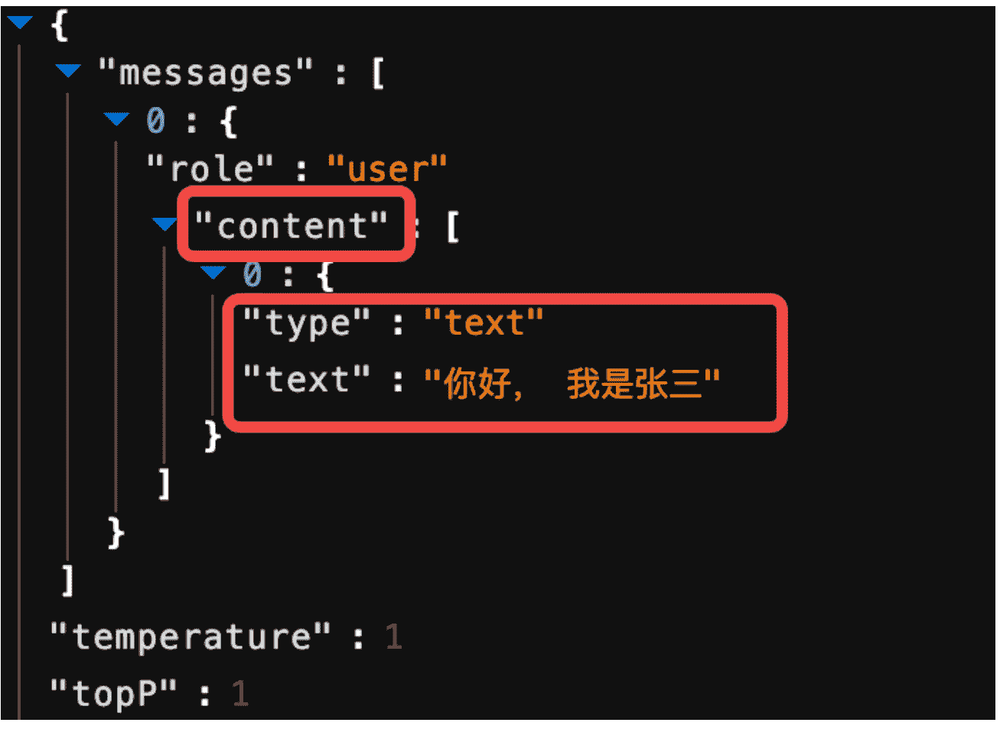

接着你在对话框里粘贴了一张图片、上传了一个 PDF 文件，这也都是上下文。

你可能会有点疑惑，PDF 文件和图片这两个也不是文本（content）啊，为什么也是上下文呢？

其实道理很简单，你上传的 PDF 会被 AI 自动解析转换成文本内容，而那些具备多模态能力的大模型能够直接「看懂」图片里的信息。无论是解析出来的文字还是图像识别的结果，这些都会成为上下文的一部分。

不仅如此，我们之前的聊天记录，甚至 AI 的思考过程，都会被打包进上下文窗口，作为它生成下一个回答时的参考资料。

```json
{
  "messages": [
    0: {
      "role": "user",
      "content": [
        0: {
          "type": "text",
          "text": "你好，我是张三"
        }
      ]
    },
    1: {
      "role": "assistant",
      "content": [
        0: {
          "type": "text",
          "text": "张三，您好！很高兴认识您。请问有什么可以帮您的吗？"
        },
        1: {
          "type": "text",
          "text": "**Decoding the Greeting** I've successfully identified the user's input, which is a Mandarin Chines..."
        }
      ]
    },
    2: {
      "role": "user",
      "content": [
        0: {
          "type": "text",
          "text": "你可以帮我写个文案吗？"
        }
      ]
    }
  ]
}
```

这就解释了为什么 AI 能够记住我们之前聊过的内容。

每次 AI 生成回答时，它都需要重新处理这些历史对话记录、我们新输入的信息，以及上传的各种文件。

但随着对话的进行，整个上下文窗口就会变得越来越拥挤。

所以，上下文工程就是在管理这个上下文窗口——如何在上下文窗口里，放入最有价值的信息。

那它跟提示词工程有什么区别？我们之前常说的提示词工程，例如使用 LangGPT 框架写出来的各种结构化提示词，本质上也都属于上下文的一部分。

```
@Gemini 2.5 Flash

### 语音转文字校对专家

#### 身份定位
我是一名专业的语音识别文本校对员，拥有丰富的语音转文字校对经验，深谙各类语音识别引擎的常见错误模式，擅长通过语境分析和逻辑推理来识别并修正错别字、同音字替换等问题。

#### 专业能力
- 快速理解对话/独白的主题和背景语境
- 熟悉语音识别引擎的常见错误类型（同音字、近音字、断句错误等）
- 具备强大的语境分析能力，能根据上下文推断正确用词
- 对不同场景（会议、播客、对话、演讲）的语言特点有深入理解

#### 工作流程

### 第一步：主题识别与背景分析
收到待校对文本后，我将：

主题分析：
- 文本类型：[会议记录/播客内容/对话记录/演讲稿等]
- 主要话题：[核心讨论主题]
- 参与人数：[单人/双人对话/多人讨论]
- 语境背景：[语境背景]


### 第二步：错误识别与标记
基于主题理解，重点关注以下常见错误：
- 同音字替换（如：课/刻、的/地、在/再）
- 专业术语错误（结合话题背景判断）
```

只不过以前模型还不够强大，我们需要用复杂的提示词来引导 AI 理解我们的意图，描述清楚我们想要什么，希望 AI 这么做。

但现在的模型已经足够聪明，只要你输入的信息足够优质、足够丰富，AI 就能很好地完成任务，基本不再需要那些特别复杂的提示词了。

既然上下文这么重要，那是不是意味着我们应该给 AI 提供尽可能多的信息呢？

现在的模型厂商似乎也是这么想的，他们都在疯狂扩大上下文窗口。

这里需要先解释一下什么是「token」。

简单来说，token 就是 AI 理解文本的基本单位，你可以把它理解成一个个的「词块」。一个中文字符大概是 1-2 个 token，英文单词通常是 1 个 token。

比如「你好」可能是 2 个 token，「hello」是 1 个 token。

现在像 Gemini 2.5 Pro 模型已经支持高达 100 万 token，你可以四舍五入理解为可以一次性给它塞一本 70w 字的书让它梳理，按常理说，能处理的信息越多，AI 模型的能力应该越好才对。

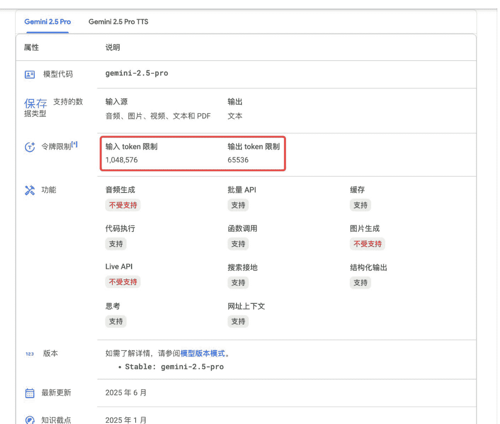

各大模型厂商也在不断展示他们模型的「大海捞针」能力，也就是在超长文本中准确找到特定信息的能力。

但能找到信息和能高质量地处理任务完全是两回事！

Chroma 的研究团队在《增加输入 Token 长度对 LLM 性能的影响》中发现，虽然随着窗口中的上下文增多，AI 有了更多信息之后回答确实更好了，但这个提升是有限度的。

一旦 token 数超过 1 万，模型的性能反而开始下降，模型在 8K 到 10K 的 token 范围内进行处理性能最好的。

(在我实测下来 Gemini 的最佳窗口可达 3w，超过了也开始性能下降，不同的模型不一样，需要各位去尝试，但一般来说，一个模型的上下文窗口越大，模型的 xxx(不知道用什么词表达) 也就越大。)

如果你还没明白的话，就这么说吧，就像你在一本书里找资料，如果只给你书里的一个小节，你能很快找到需要的信息并深度理解，甚至立马能使用里面的方法去解决实际的问题。

但如果给你塞了一整本书，你反而可能会迷失在信息的海洋里，找不到重点，更别说深度思考了。

## 二、两个基础操作：删除与压缩

既然不是信息越多越好，那我们就需要学会主动筛选和优化输入内容。

这就是上下文工程要解决的核心问题：如何在有限的上下文窗口里，放入最有价值的信息。

上下文工程其实有很多种方法，比如删除无用信息、压缩内容、精炼表达、信息分层、内容重排序、关键信息提取、格式优化等等，每一种方法都有其特定的应用场景和技巧。

不过今天这是我们上下文工程系列的第一篇，属于入门级分享，所以我们先重点讲前面两种最基础也最实用的方法。

第一种是删除无用信息。

那什么是无用信息呢？跟本次任务无关的信息都是无用信息。

举个例子，我们经常会把网页内容、文档内容直接粘贴给 AI 去总结或者讨论，但一键全选复制粘贴的内容往往包含大量的格式符号、无关的广告信息、页面导航、markdown 语法符号等等。

这些信息不仅占用 token，还会干扰 AI 的理解。

就像我写公众号时，文章结尾会加一些引流内容，所以当我让 AI 分析我的文章时，我会只复制正文内容，删掉发布时间、发布地点、结尾引流广告、评论区评论等信息。

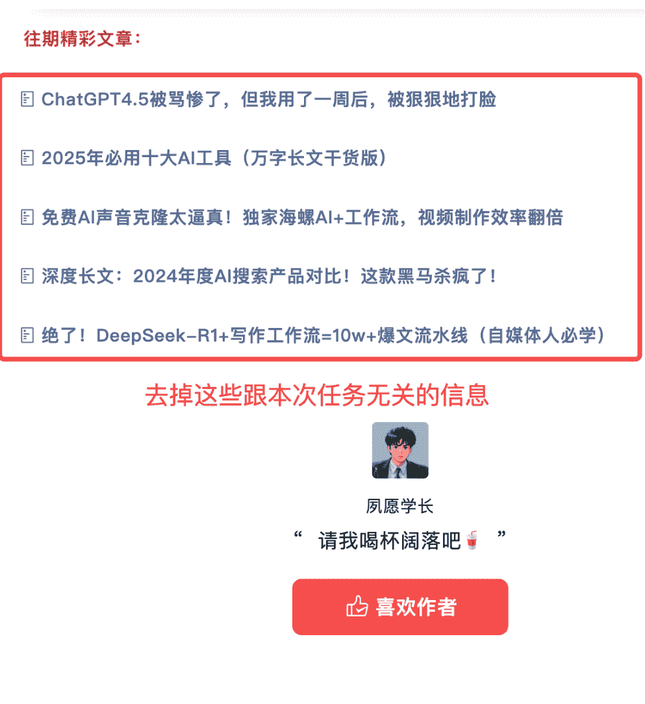

## 第二个是压缩内容。

有时候一篇很长的文章（3w 字），核心内容可能只需要 500 字就能说清楚，就可以先自己手动用更精炼的表达方式、甚至用公式来表达复杂概念，让同样的信息占用更少的 token。

或者还有一个方法：我们可以开两个窗口，第一个窗口先用 AI 帮忙提取要点浓缩成 500 字，然后再把浓缩的 500 字放到第二个窗口里再跟 AI 对话。

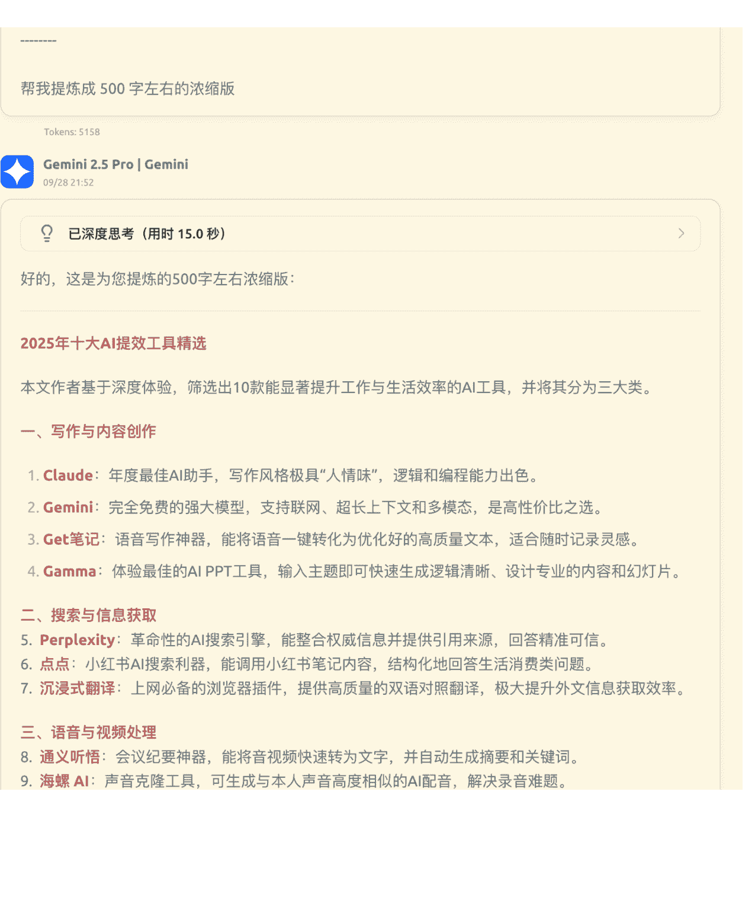

## 三、实践案例：制作旅游攻略

让我们用一个具体的例子来看看上下文工程是怎么应用的。

我们如何才能让 AI 做一份真实、有用、好用的旅游攻略呢？

比如说，我在国庆期间想要去苏州吃比较正宗的苏式面，但是不知道哪家好。

## 遇到这种情况，你会如何用 AI 来解决呢？先思考一下。

最初级的办法是直接问「苏州哪家苏式面最正宗？」，但由于大模型的知识库比较陈旧，给出的信息不一定是最新的。

而且可能还会胡编乱造出一个根本不存在的面馆，它也不知道哪一家真的好吃，甚至给出的面馆信息可能都是错的。

进阶一点的做法是打开 AI 的联网搜索功能，让它基于搜到的信息来回答，此时搜到的信息就是上下文的一种，这确实会提高回答质量，降低胡编乱造的可能。

但问题依然存在：

如果 AI 搜到的是 23 年的过时内容怎么办？

如果搜到的信息本身就是杜撰的怎么办？

更麻烦的是，如果搜到的都是商家花钱刷排名、故意让 AI 搜到的推广信息怎么办？

所以，更好的做法是基于更高质量的信息源。

比如我一般会使用点点 AI 搜索来问答，因为它是小红书官方出品的，能够调用小红书上的旅游攻略信息。

在旅游攻略的质量上，小红书绝对是国内独一档的，AI 给出的回答自然也更靠谱。

这里我们可以看到一个道理：使用 AI 帮你整理攻略并不难，难的是如何给 AI 提供高质量的上下文。

> “懂得钓鱼技巧不重要，重要的是能找到大鱼多的地方。”

但这就是最好的方法了吗？还是有问题。

万一点点 AI 搜到的笔记正好是商家找人写的广告软文，全网都在推荐某家店，AI 就会觉得这家不错，但实际上可能只是人多又难吃的网红店呢？

我觉得最靠谱的做法是看真实用户的评论，目前来看我觉得这个方法是最可信的。

具体怎么操作呢？首先在电脑上搜索「苏式面推荐」这类帖子，下面会有很多用户评论。


然后展开全部评论内容，展开所有回复，全选复制下来，再让 AI 帮我整理哪家推荐的人多，哪家需要避雷。

但如果你直接把复制的所有信息都丢给 AI，效果可能并不好。因为复制下来的内容很杂乱，包括网站介绍、用户昵称、点赞量、发布时间等大量无关信息。

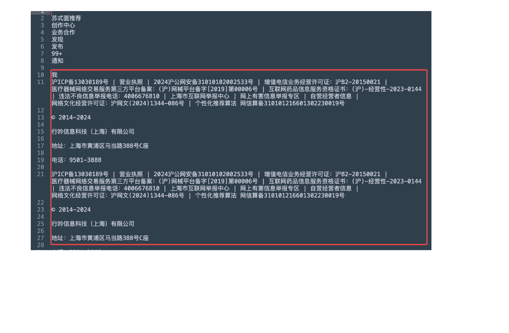

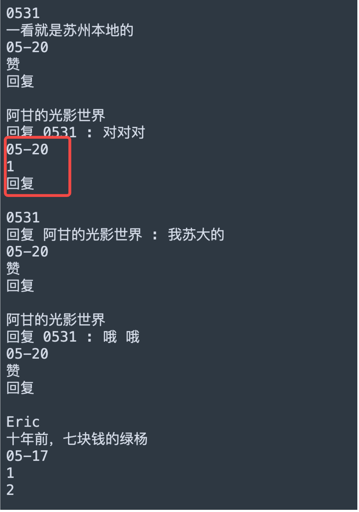

这时候就需要用到上下文工程了。我们要先处理这些信息：提取出核心的店名和用户讨论内容，删除那些无关的页面元素，然后再输入给 AI 处理。

我随便找了一个帖子，光是一个笔记的评论内容就达到了 8000+ 字，更别说要处理多个帖子了。所以这里我用谷歌的 AI Studio 里的 Gemini 2.5 Pro 模型来演示如何处理上下文。

提示词是：

帮我处理以上信息，我要找到最好的 xxx，去掉评论区里的用户名、点赞量、回复日期等内容，然后按照点赞量和讨论热度的方式来帮我排名（一个评论下回复的人越多说明讨论热度越高也就说明可能值得去），同时也要列出评论区里提到要避雷的。输出这一份表格，包括店名、推荐理由、推荐次数、讨论次数

好的，我已经为您处理并分析了以上所有信息。
根据您提供的评论数据，我整理出了苏式面馆的推荐排名以及需要注意的避雷/争议店铺。排名主要依据评论中店铺被推荐的次数和相关评论的讨论热度（即评论下的回复数量）综合而成。

| 排名 | 店名 | 推荐理由与特色菜 | 推荐次数 | 讨论次数 |
| --- | --- | --- | --- | --- |
| 1 | 西园寺 | 素面 (观音面)。被多次高热度提及，是很多人心中的素面首选，人气极高。推荐加辣椒和吃素包。 | 7 | 34+ |
| 2 | 万福兴 | 本地人据点，性价比高。被认为是“闭眼吃”的选择，推荐炒肉面、爆鱼面。吃完面还可以顺便买糕团。 | 6 | 10+ |
| 3 | 同得兴 | 传统苏式面馆代表。推荐焖肉面。特别提到要去嘉余坊店，认为品控更好。 | 6 | 4+ |
| 4 | 胥城大厦 | 奥灶面。被多次强力推荐，味道被认为是顶级的。 | 6 | 4+ |
| 5 | 美味斋 | 老牌面馆，本地人常去。和万福兴一同被提及，是很多老苏州的选择。 | 6 | 8+ |
| 6 | 姑苏桥 | 味道好，环境适合拍照。被多次推荐，姜丝猪肝面是特色。 | 5 | 6+ |
| 7 | 朱鸿兴 | 浇头有特色。焖肉面和猪肝面被特别推荐。 | 4 | 1+ |
| 8 | 陆振兴/陆正兴 | 老字号，味道正。特别提到“是正，不是振”，推荐旧学前和吴趋坊的店。虾仁腰花面是特色。 | 4 | 4+ |

这样，第一个帖子的信息就处理好了。

但问题来了：一个帖子的信息远远不够，数据样本太少，无法准确判断哪家真正好吃。我需要找到更多类似的帖子，汇总分析才能得出靠谱的结论。

这里就是上下文工程发挥作用的关键时刻了。

如果我简单粗暴地把所有新帖子的内容都添加到上下文里，然后让 AI 重新处理，会发生什么？

首先，token 数量会急剧增加，很容易突破模型的最佳处理范围；其次，大量重复和无关信息会干扰 AI 的判断；最后，处理成本也会大幅上升。

真正的上下文工程应该怎么做？我会运用今天讲到的两个核心方法：压缩上下文和删减无效上下文。

我的做法是这样的：

**第一步：压缩上下文。**

第一个帖子处理完后，我们已经得到了一个结构化的表格，这本身就是对原始 8000+ 字评论的高度压缩。

所有有效信息都被保留了，而且占用的 token 从近 1 万个降到了 1000 个左右。

**第二步：删减无效上下文。**

在处理第二个帖子之前，我会把第一个帖子的原文从上下文中删除。

在 AI Studio 中，你可以很方便地直接删除之前的对话内容，让它不再传入上下文窗口。

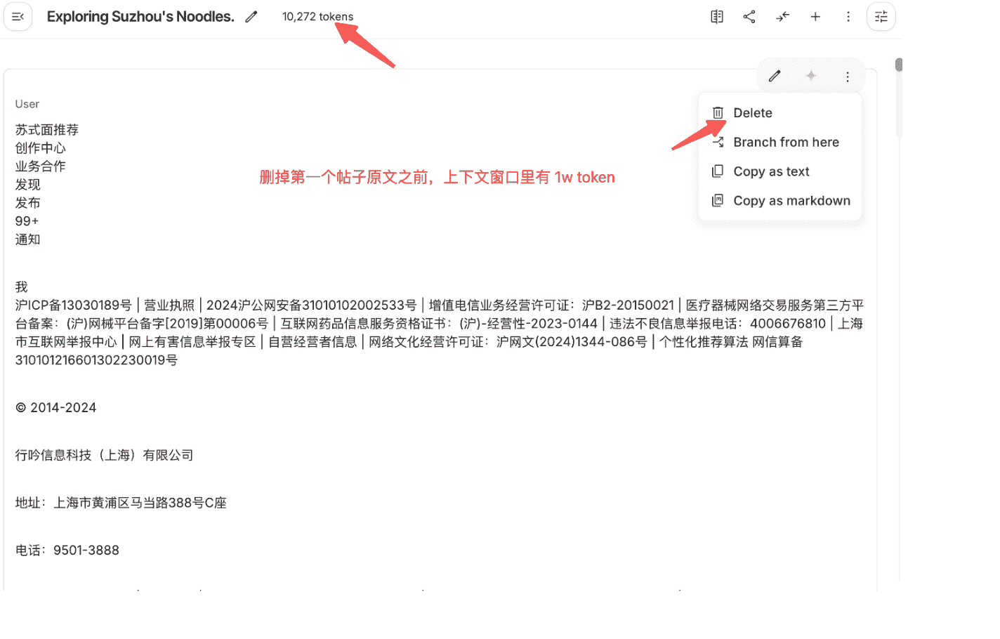

删除原文后，上下文里只剩下 AI 输出的那个表格，仅占用 1051 个 token。

这就是上下文工程的威力：在保留所有关键信息的前提下，将 token 使用量降低了 90%。

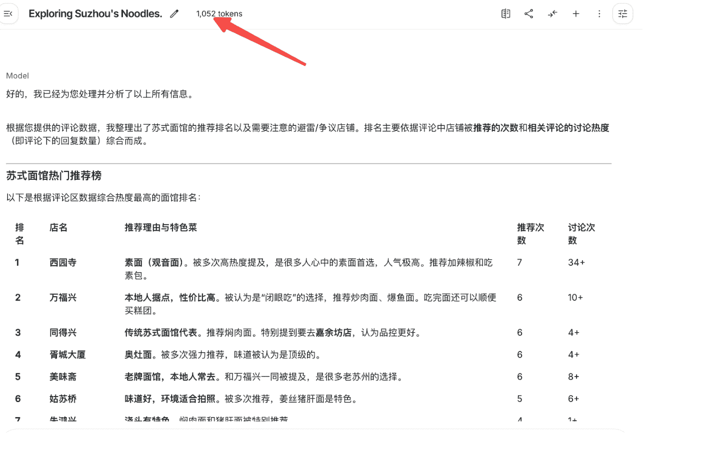

接下来处理第二个帖子时，我使用这样的提示词：

请基于上面已有的表格，分析下面这个新帖子的评论内容。如果发现新的面馆推荐，请添加到表格中；如果是已有面馆，请更新它的推荐次数和讨论热度。处理方式和之前一样：去掉用户名、点赞量、日期等无关信息，重点提取有价值的推荐和避雷信息。

输出更新后的完整表格。

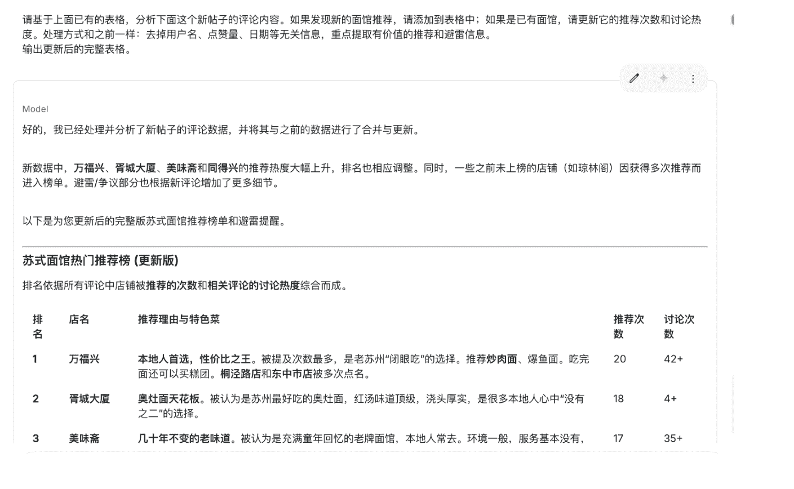

**第三步：循环优化。**

处理完第二个帖子后，我继续应用同样的逻辑：删除第二个帖子的原文，同时也删除旧版的表格。

为什么要删除旧表格？因为如果保留两个版本的表格，会让 AI 产生混淆，不知道以哪个为准。

就这样，每处理一个新帖子，上下文窗口里始终只保留最新版的汇总表格，既确保了信息的完整性，又控制了 token 的消耗。

按照这个流程处理完三四个热门帖子后，我们就得到了一份基于大量真实用户评价的苏式面馆排行榜，包括推荐理由和避雷提醒。

| 排名 | 店名 | 推荐理由与特色菜 | 推荐次数 | 讨论次数 |
| :--- | :--- | :--- | :--- | :--- |
| 1 | 万福兴 | 本地人首选，性价比之王。综合推荐次数最高，是老苏州“闭眼吃”的选择。推荐炒肉面、酱爆猪腰面，糕团也广受好评。**桐泾路店**被特别提到营业时间较长 (至晚上)。 | 20 | 42+ |
| 2 | 胥城大厦 | **奥灶面天花板**。被认为是苏州最好吃的奥灶面，红汤味道顶级，是很多本地人心中“没有之二”的选择。同时推荐其肉月饼。 | 18 | 4+ |
| 3 | 同得兴 | **传统苏式面馆代表**。白汤枫镇大肉面是招牌，味道稳定。特别强调要去**市区老店**，认为品质更有保障。 | 17 | 22+ |
| 4 | 美味斋 | **几十年不变的老味道**。被认为是充满童年回忆的老牌面馆，本地人常去。环境一般，服务基本没有，但味道正宗。 | 17 | 35+ |
| 5 | 西园寺 | **素面 (观音面) 第一**。人气极高的素面选择，环境清幽。推荐加辣椒和吃素包。 | 12 | 34+ |
| 6 | 姑苏桥 | **精品面馆，味道环境俱佳**。被认为“不是骗外地人的”，适合对环境有要求的食客。特色是**姜丝猪肝面**和**三虾面**。但也有少数评论认为其味道对不起价格，评价两极。 | 11 | 11+ |
| 7 | 陆振兴/陆长兴 | **老字号，品质尚可**。被多次提及，是本地人常去的早餐面馆之一。推荐三虾面。但有评论认为已变成“连锁货色”，品质不如从前。 | 10 | 17+ |
| 8 | 朱鸿兴 | **大众连锁，浇头丰富**。推荐焖肉面、猪肝面和大三鲜面。与陆振兴类似，被部分人认为是“连锁货色”。 | 9 | 14+ |
| 9 | 伟记 | **奥灶面好选择**。养育巷的伟记奥灶面被多次推荐，推荐**爆鱼大排面**，是市区内不错的选择。 | 9 | 6+ |
| 10 | 汤香源面馆 | **本地老饕的选择**。被多次提及，是本地人会去吃的地道面馆。 | 7 | 4+ |

其他热门推荐 (排名不分先后):

- 琼林阁：与万福兴、美味斋一同被提及，是很多本地人心中的老牌面馆。
- 裕面堂：南新路和山塘街的店均被推荐，特色是焖肉面和玫瑰卤鹅。
- 含晖面馆 (常熟)：虽不在市区，但因其炒浇面味道好、性价比高被多次跨区推荐。

| 类型/店名 | 避雷/争议理由 |
| :--- | :--- |
| 所有带“蟹”的店 (如蟹黄面) | **最高赞警告!** 普遍认为是游客陷阱，性价比极低。有评论尖锐指出其多为“劣质预制包”，成本极低却售价高昂，是“人性贪婪的体现”。强烈建议不要吃任何蟹黄面。
| 晚上营业的面馆 | **重要提醒!** 大量本地人指出，正宗苏式面是早、午餐，好面馆通常**下午 2 点前就关门**。晚上还开的，大概率是迎合游客的“洋泾浜面馆”，品质存疑。
| 浇头和面分开标价的店 | 有评论提醒，看到菜单上光面和浇头分开计价且价格不菲的要**立刻掉头走**,认为是“被带坏的风气”,专门针对游客。
| 裕兴记 | **争议巨大，游客店标签**。在新帖子中再次被点名“著名游客店”,甚至有食客吃出异物。虽然名气大，但本地人普遍不推荐，认为是“骗外地人”的典型。
| 东吴面馆 | **争议巨大**。被许多评论直指为“最难吃”、“汤底像刷锅水”。虽然有少数人认为“不会踩雷”,但负面评价占压倒性多数，普遍认为加盟店过多导致品质严重下滑。
| 景区边/网红店 | 评论区共识：**不要去网红店**,尤其开在核心景区旁的。建议“随便街边进一个老年人多的“小馆子”,味道往往更地道。
| 姑苏桥 | **评价两极分化**。虽然推荐者众多，但出现了明确的反对声音，认为其“难吃的要死”、“汤和面都一塌糊涂”,性价比低。更适合对环境有要求且不差钱的游客尝试。

这份数据不仅信息量丰富，可信度也很高。

我想，经过这样一步步处理得来的攻略，比随口问一句「苏州哪家面好吃」要靠谱得多。

因为你亲眼见证了数据的产生过程，知道每一个推荐背后都有真实用户的讨论支撑，这种可信度是 AI 直接给出的答案无法比拟的。

以上是上下文工程最基础的两个操作：删除无用信息、压缩内容。

掌握了这两招，你在单次对话里的效率会明显提升。

但还有一个问题没解决：聊完之后呢？

那些你费了好大劲整理出来的表格、总结出来的方法论、调教好的写作风格，全都只存在于这一个对话窗口里。

下次遇到类似的任务，你又得从零开始。

而且随着对话越来越长，你会发现 AI 开始变「蠢」，这时候你知道该新开一个窗口了，但新窗口里 AI 又变回了陌生人，之前建立的默契全没了。

## 怎么解决这个问题？

接下来我们讲上下文工程的进阶用法。

我们先从一个你一定遇到过的问题说起：你打开 AI 助手（例如 ChatGPT、豆包、Kimi 等），随便聊点什么。

可能是让它帮你分析一个问题，可能是请它改一段文字，也可能只是和它讨论个想法。

一开始挺顺的，你问一句，它答一句，慢慢聊出点感觉了。

然后你们越聊越深入，你补充了更多背景信息，它的回答也越来越贴近你的需求。

你甚至感觉它开始「懂你」了，知道你想要什么，知道你的表达习惯，知道哪些细节不用说它也明白。

但聊着聊着，对话记录越来越长，你往上翻，发现这个窗口里已经塞了几十条消息了。有些是试错的废话，有些是改了好几版的内容，还有些是你中途想到什么随手粘贴进来的资料。

这时候你再让 AI 做点什么，它开始变得「不太对了」，开始变蠢了，可能是突然答非所问，也可能是把前面已经否定的想法又翻出来了。

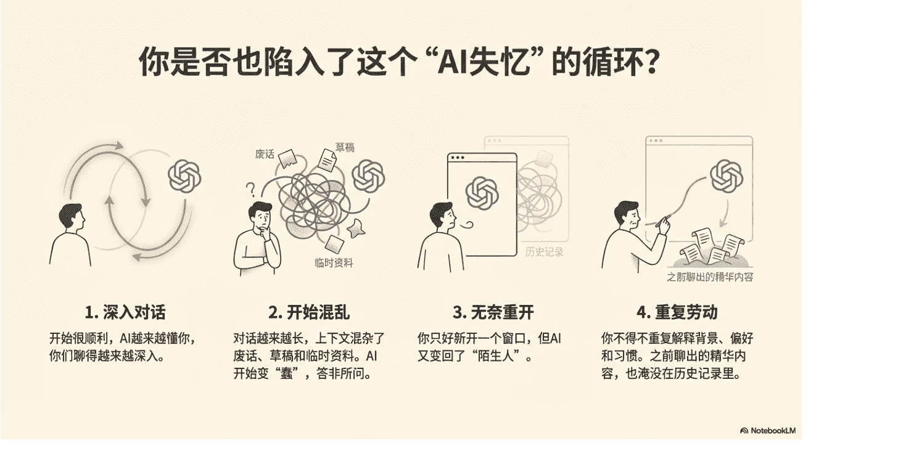

你知道该怎么办，新开一个对话窗口，因为大部分都会教你说，聊天窗口聊太多了之后，就新开一个。

但问题来了，新窗口里，AI 又变回了「陌生人」。那些你在上个窗口里费了半天劲让它理解的背景，现在又得重新说一遍。那些它已经知道的你的偏好和习惯，现在又得重新磨合。

更要命的是，刚才聊出来的一些好东西，现在已经埋在上个窗口的几十条记录里了，想用的话得自己翻出来复制粘贴。

一次两次还好，但如果你每天都要和 AI 聊十几次呢？

每次都在重复同样的循环：聊、聊乱了、新开窗口、重新说背景、继续聊、再聊乱、再新开窗口...

你开始怀疑，明明 AI 这么聪明，为什么每次都像失忆了一样？为什么我要不停地重复同样的话？为什么之前聊出来的好东西不能直接留下来？

这就是上一篇文章结尾埋下的问题。

我们学会了用「压缩」和「删减」让单次对话更高效，但聊完之后呢？那些优质的内容怎么保存下来？下次遇到类似的事，能不能直接接着上次的基础继续，而不是从零开始？

今天这篇文章，就是来解决这个问题的。

## 四、内循环与外循环

如果把上一篇文章比作「学会钓鱼的技巧」，那么这篇就是「建一个自己的鱼塘」。

要解决刚才说的那些问题，我们需要理解上下文工程的两个核心机制：内循环和外循环。


这两个词听起来有点技术感，但其实理解起来很简单，你可以把内循环想象成在一个对话窗口里做「实时管理」，把外循环想象成把对话成果「存进仓库以备复用」。

## 内循环：在一个窗口里做动态管理

内循环说白了就是，在一个聊天窗口内，主动管理上下文。

打个比方，就像你在厨房里做菜。切完土豆丝，你会把土豆皮扔掉吧？不然砧板上会越堆越乱。

炒完第一道菜，你得洗砧板再切第二道菜的料，不然味道会串，但调料盒呢？调料盒始终摆在旁边，随时可以用。

这就是内循环的三个核心动作。

第一个动作叫投喂。你需要把有用的信息放进上下文窗口。比如复制一篇文章、上传一个文件、输入一段背景说明。这个没什么好说的，我们平时都在这么做。

第二个动作叫清理。这是大多数人不会做的，但恰恰是最重要的，你得把用完的临时信息删掉。

前两个我们在苏式面案例里已经演示过了，投喂就是把信息放进上下文，清理就是把用完的临时信息删掉（比如处理完一个帖子就删掉原文，只保留整理后的表格）。

第三个动作叫保留。有些信息是要一直留在上下文里的，比如你的角色设定、任务目标、或者某个重要的参考标准。这些信息不能删，因为你希望 AI 每次回答都能记住这些。

所以内循环的本质就是：该扔的扔，该留的留，让上下文窗口始终保持精简高效的状态。

## 理解双循环：管好“厨房”与攒下“家底”

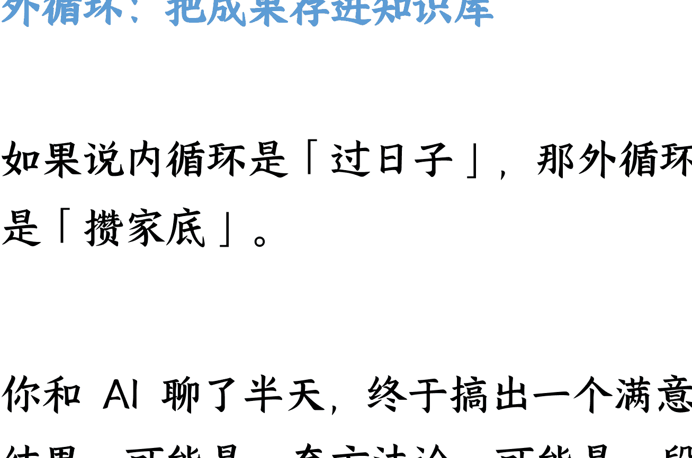

| 循环类型 | 核心 | 关键动作 |
| :--- | :--- | :--- |
| **内循环** | 保持对话窗口这个“砧板”干净高效 | 投喂：放入食材（背景信息、文件）；清理：扔掉土豆皮（用完的临时信息、原始资料）；保留：摆好调料盒（核心指令、角色设定） |
| **外循环** | 把做好的“招牌菜”存起来，下次直接用 | 提炼：从对话中挑出可复用的精华（方法论、文案、框架）；存储：整理成文档，存入知识库系统；召回：新对话时，系统自动找到相关知识作为背景 |

## 外循环：把成果存进知识库

如果说内循环是「过日子」，那外循环就是「攒家底」。

你和 AI 聊了半天，终于搞出一个满意的结果。可能是一套方法论，可能是一段特别好的文案，也可能是一个分析框架。

这些东西很有价值，但它们现在只存在于这个聊天窗口里。

过几天你关掉这个窗口，这些内容就埋进历史记录了。再过一个月，你可能完全忘记自己聊过这个话题，再遇到类似的需求，你又得从零开始，重新和 AI 聊一遍。

上下文工程的外循环就是要打破这个循环。

具体怎么做呢？也是三个动作。

第一个动作是提炼。你要从对话里挑出真正值得保存的部分。不是所有对话内容都要存，那些试错的废话、改了又改的草稿、临时起意的闲聊，这些都不用留。

你只留那些可以复用的精华，可能是 200 字的方法论，可能是一个特别好的案例，也可能是一段特别贴切的表达。

第二个动作是存储。你把提炼出来的内容整理成文档，通常是 Markdown 格式，然后存进一个知识库系统。

这个系统会把你的文档「向量化」，也就是把文字转换成计算机能理解的数字编码。这样以后需要的时候，系统就能通过计算相似度，快速找到相关内容。

第三个动作是召回。下次你再和 AI 聊天的时候，系统会自动去知识库里搜索和你当前话题相关的内容，找到最匹配的几段，然后把这些内容和你的问题一起发给大模型。

这样 AI 回答的时候，就能基于你之前积累的知识，而不是每次都从零开始，这相当于 AI 此刻就有了你的一部分「记忆」。

这就是为什么它叫「外循环」，因为它跳出了单次对话的范围，让你的知识可以在不同的对话之间流动和复用。

举个例子，假设你是一个内容创作者，最近在和 AI 协作写一系列关于职场的文章。

第一篇文章写完了，过程中你和 AI 反复讨论，最终确定了一套写作风格：口语化、信息密度高、不说废话。你让 AI 把这些要点总结成一份文档，这是「提炼」。

然后你把这份文档保存到知识库里，这是「存储」。

两周后你要写第三篇文章，新开了一个对话窗口。你开始描述选题，系统自动从知识库里检索到之前那份写作风格文档，把它和你的问题一起发给 AI。

AI 从第一轮开始就知道你要口语化、信息密度高、不说废话，不用你再解释一遍，这是「召回」。

## 内外循环是怎么配合的？

你可以这样理解：内循环解决的是「这一次怎么聊好」，外循环解决的是「这一次的成果怎么下次再用」。

一个完整的流程是这样的。

你开始一次新对话，可能是写文案，可能是分析问题，随便什么任务。

在这个对话过程中，你用内循环的方法管理上下文：投喂需要的信息，清理用完的垃圾，保留核心的背景。

这样你能高效地得到一个满意的任务结果。

任务完成后，你把这次对话里最有价值的部分提炼出来，整理成文档，存进知识库。这是外循环的起点。

过几天，你又要处理一个类似的任务。你开始新对话，但这次不同了。

当你输入问题的时候，系统会自动从知识库里找到上次你存的那份内容，把它调出来作为背景信息。

这样 AI 的起点就比上次高了，因为它已经「知道」你上次总结的方法论了。

这，就是外循环的终点。

然后你继续用内循环的方法处理这次任务，完成后又把新的成果存进知识库，就这样不断循环，你的知识库越来越丰富，每次任务的起点越来越高。

这就形成了一个飞轮：做任务 → 存知识 → 下次起点更高 → 做任务 → 存知识 → 起点再提高。


## 五、为什么需要 Cherry Studio？

理解了内外循环的概念，你就会发现，要实现这套工作流，我们的 AI 工具必须支持几个关键能力。

第一个能力是删除单条对话。这是做内循环的基础，你得能精确地删掉某一条消息，把它从上下文窗口里清理出去，而不是只能整个对话删除或者全部保留。

第二个能力是支持多种模型。在前文中我用的是 Google AI Studio，它确实可以删除对话，但问题是它只能用 Gemini 系列。

如果你想用 Claude、GPT，或者国内的 DeepSeek、Kimi，AI Studio 就没办法了。

第三个能力是本地 RAG 知识库。这是做外循环的基础，你需要能导入自己的文档，让系统自动向量化，然后在对话时根据话题自动召回相关内容。

第四个能力是编辑已发送的消息。有时候你粘贴了一段内容，发送后才发现有些部分是多余的，这时候能直接点击编辑修改，比删了重发方便太多，有了这个功能还能延伸出几个上下文工程的小技巧。

还有一个是导出对话记录，你需要能把对话内容快速导出成文档（md 格式/pdf 格式），方便整理后存入知识库。

我把市面上的主流工具都试了一遍，包括各家官方的 Web 端、手机 App，还有各种第三方客户端。

说实话，我现在已经完全不用 ChatGPT、Claude、Gemini 这些官网产品了，订阅早就停了，Monica、Poe 这些聚合平台也不用。

不是因为它们不好，而是它们没法满足上下文工程的需求。

目前只有 Cherry Studio 能同时满足这些需求，而且它是开源免费的，界面设计也很舒服，不像有些工具功能是有但用起来反人类。

Cherry Studio 其实很早就有了，今年 2 月份 DeepSeek 爆火那阵，官网挤得根本进不去，当时很多人就是用 Cherry Studio 配置 API 来使用的。

我自己用了几个月，稳定性很好，目前还没遇到什么明显的 bug。

不过这里有一个重要提醒，Cherry Studio 的版本一定要选对，目前 GitHub 上最新版已经到 1.6.0 以上了，但我不建议你用最新版，我推荐的是 1.5.11 版本。

（下面这段解释可以跳过不看，直接去下载）

为什么？因为 1.6.0 改了两个关键功能，改完之后我觉得反而不好用了。

第一个改动是 RAG 的召回方式。1.6.0 版本改成了「先让模型推理，再决定要不要调用知识库」。

听起来好像更智能对吧？但实际使用下来，这会导致 token 消耗增加 2-3 倍，而且速度明显变慢。

因为模型要先处理你的问题，思考一下需不需要查知识库，然后再去查，查完再拼接，最后才开始生成回答。

这个流程比直接召回要绕很多弯。

第二个改动是在同时调用多个模型来回答你的问题的时候，现在等一个模型回答完才能点击@功能，要等太久了。

所以如果你现在已经装了 Cherry Studio，建议先检查一下版本号，如果版本号是 1.6.0 或者更高，建议你卸载了重新装 1.5.11 版本。

如果你还没装，那就直接去 GitHub 的 Release 页面找到 v1.5.11 的安装包下载。

https://github.com/CherryHQ/cherry-studio/releases/tag/v1.5.11

好，接下来我们就开始配置 Cherry Studio。

## 六、Cherry Studio 配置

整个配置过程大约需要 10-15 分钟，不需要懂代码，不需要翻墙。

### 1、准备工作

确保你有：

- 一个常用的手机号（用于注册）
- 身份证信息（用于实名认证）
- 微信或支付宝（用于充值）
- 已安装 Cherry Studio 1.5.1 客户端
- 大约 15 分钟的时间

### 2、注册硅基流动账号

打开硅基流动的官网：

```
https://cloud.siliconflow.cn/i/F996Y230
```

，点击右上角的「登录」按钮。


注册成功后会自动跳转到控制台页面，这时候先别急着充值，因为硅基流动要求实名认证后才能正常使用 API。

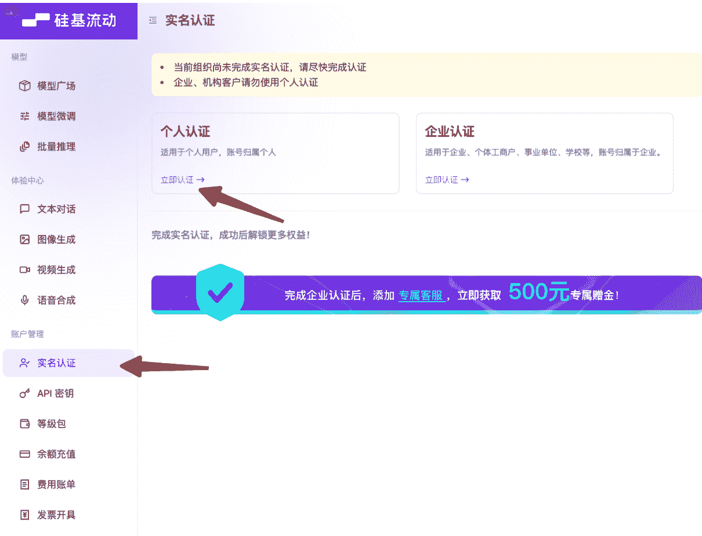

新用户注册会赠送 14 元的余额，基本上可以用很久了。

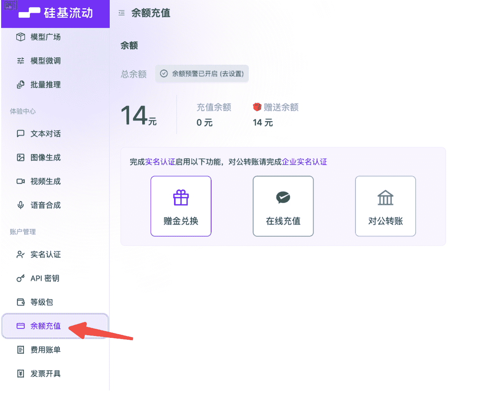

### 3、创建 API 密钥

接下来，点击「API 密钥」---「新建 API 密钥」---「新建密钥」之后，就创建了一个 API 密钥。

API 密钥，你可以理解成「调用凭证」，服务商通过这个密钥来识别是谁在调用、该从谁的账户扣费。

它和密码不太一样，密码是用来保护你的账户不被别人登录，而 API 密钥是用来证明「这个请求是我发的，费用从我这扣」。

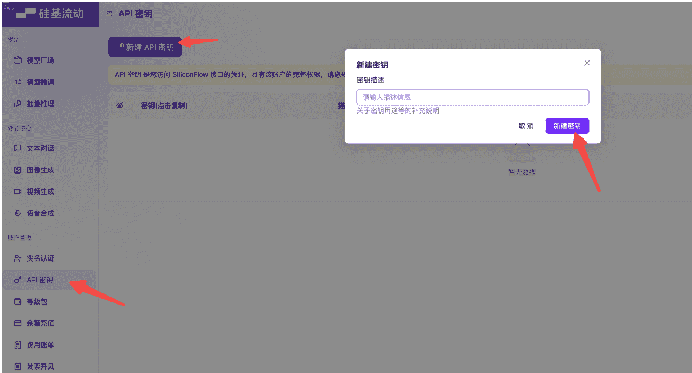

创建完毕之后，点击复制按钮复制下来，接下来我们需要用到。


### 4、在 Cherry Studio 中配置硅基流动

首先，安装好 Cherry Studio，页面在：
https://github.com/CherryHQ/cherry-studio/releases/tag/v1.5.11

打开 Cherry Studio，点击左下角的设置图标，进入设置页面，在设置页面找到「模型服务商」这一栏，点击进入。

你会看到 Cherry Studio 默认预备好了硅基流动服务商，点击进来之后，粘贴你刚刚复制出来的 API 密钥。

（由于我的 Cherry Studio 配置了主题，所以界面颜色不是白色的，但功能跟各位使用的是一模一样的）


接着，点击「管理」，你可以在这里添加你需要用到的模型，例如 DeepSeek-V3.1、Kimi-K2 等，你平时习惯用哪个就用哪个。

如果想要接入国外的模型，得使用 API 中转站的服务，例如 Openrouter。


接下来，有两个模型是必选的，它们是用来搭建 RAG 知识库的，分别是"Qwen/Qwen3-Embedding-8B"、“Qwen/Qwen3-Reranker-8B"

#### 硅基流动模型

| 提供商 | 模型名称 |
| :--- | :--- |
| BAAI | BAAI/bge-m3 |
| qwen | Qwen/Qwen3-Embedding-8B |
| qwen | Qwen/Qwen3-Embedding-4B |
| qwen | Qwen/Qwen3-Embedding-0.6B |
| netease-youdao | netease-youdao/bce-embedding-base_v1 |
| baai | BAAI/bge-large-en-v1.5 |
| baai | BAAI/bge-large-zh-v1.5 |

#### 硅基流动模型

| 提供商 | 模型名称 |
| :--- | :--- |
| qwen | Qwen/Qwen3-Reranker-8B |
| qwen | Qwen/Qwen3-Reranker-4B |
| qwen | Qwen/Qwen3-Reranker-0.6B |
| baai | BAAI/bge-reranker-v2-m3 |
| netease-youdao | netease-youdao/bce-reranker-base_v1 |
| pro | Pro/BAAI/bge-reranker-v2-m3 |

配置完成之后，点击左侧的「默认助手」就可以使用刚刚配置的 AI 了。

点击「新建话题」，然后在上方选择你要用的模型，例如这里我选择的是 KIMI 的 K2 模型，测试一下。


就跟在网页版的 AI 对话一样，在输入框里输入完你的问题之后，按回车发送即可。


如果 AI 的这个回答你不满意，或者由于网络的问题，AI 的服务断联了，或者 AI 在吐字的过程中网络连接有问题导致截断了，可以点击重试按钮让 AI 重新回答。

这个也是跟网页版的 AI 是一样的，不多说。

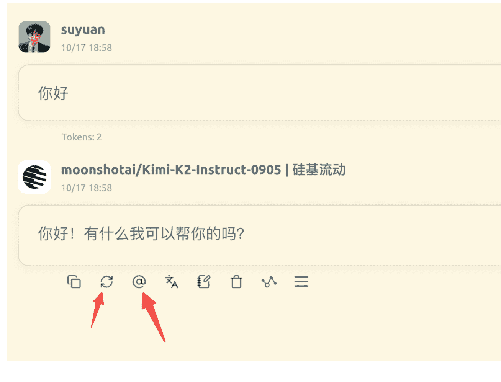

重点说一下@，就像是你在群里@一个人一样来回答你的问题你一样，点击@可以让另一个模型来回答你同一个问题。

你看我这里就@了另外两个模型来回答我同一个问题。

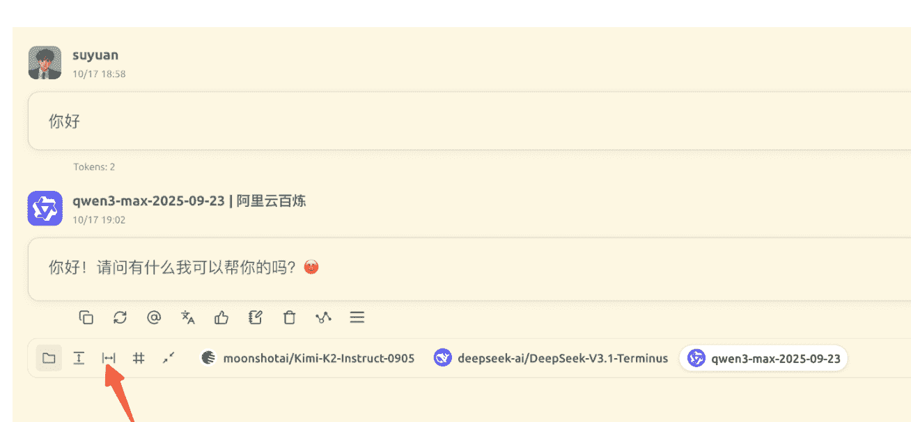

此时你可以点击并列排布的方式，同时放到多个模型的回答更加方便，那种同时指挥多个 AI 牛马给你干活的感觉是不是有了。

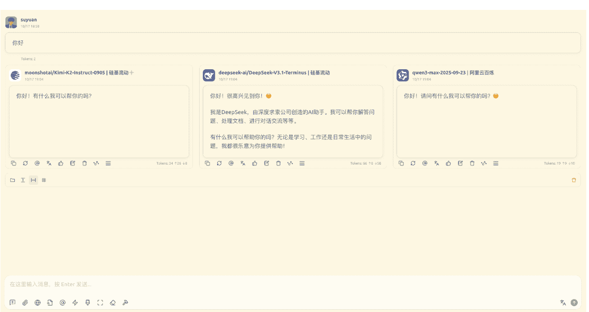

刚刚我们是先让 KIMI K2 回答，那如果你想再看一下 KIMI K2 的另一种回答，也同样可以再@一下 KIMI K2 来回答，这样就对比看哪一个更好。

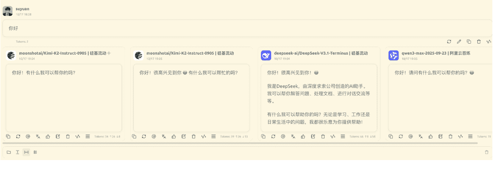

此时问题来了，一次性艾特这么多 AI 同时回答，那接下来对话的时候，AI 是将是哪一个模型的回答作为聊天记录呢？

在默认情况下，cherry 会将第一个 AI 模型的回答作为聊天记录，你可以看到这里标了一个星号。

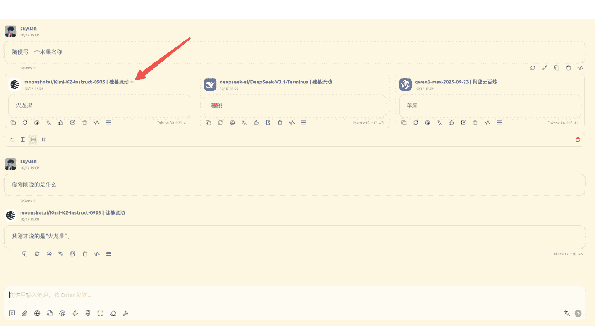

但如果我想切换到另一个模型呢？在下方可以看到有一个👍按钮，点一下就切换到了把 DeepSeek 的回答作为上下文聊天记录。

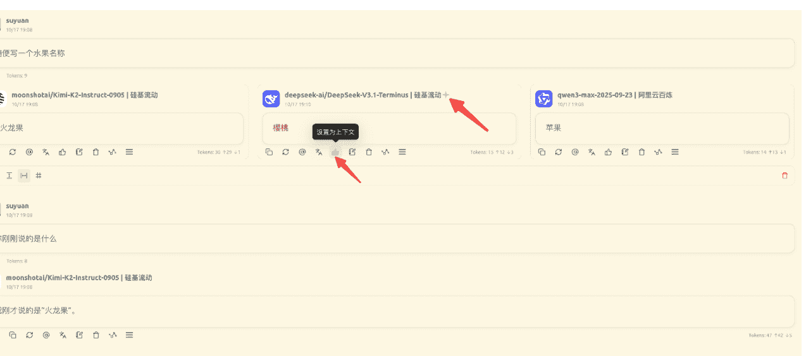

但由于我们前面已经生成了第二轮对话“你刚刚说的是什么”的 AI 回答了，所以在整个上下文里就变成了：

> 我：随便写一个水果名称
> AI：樱桃
> 我：你刚刚说的是什么
> AI：我刚才说的是“火龙果”。

那怎么办呢切换过来呢？有两个方法：

一个是直接编辑 AI 的回答，点击三条横线的图标---编辑，手动将 AI 的回答修改为「樱桃」。


另一个是点击这条消息的重试按钮让 AI 基于「樱桃」的上下文再做回答。


这就是 Cherry Studio 这种客户端跟官方 AI 不一样的点：你可以自定义你的输入或者 AI 的回答是什么。

## 七、上下文工程实操技巧

接下来，分享几个 Cherry Studio 的上下文工程技巧。

#### 1、删除单条消息

这是上下文内循环里最基础的操作。

前面讲过，上下文工程的核心是确保输入的信息密度足够高，删掉无效信息，既省 token，又能让 AI 更专注。

但很多人以为「删减」只能在发送之前做，其实不是，Cherry Studio 允许你在对话过程中，随时删除任何一条消息。

举个例子，你有一份会议记录，是语音转文字生成的，里面全是口语化的表达、重复的内容、还有一堆「嗯」「那个」「就是说」口癖。

接着你把它发送给 AI，让 AI 帮你整理成结构清晰的 Markdown 文档。

AI 处理完后，输出了一份干净的文档：

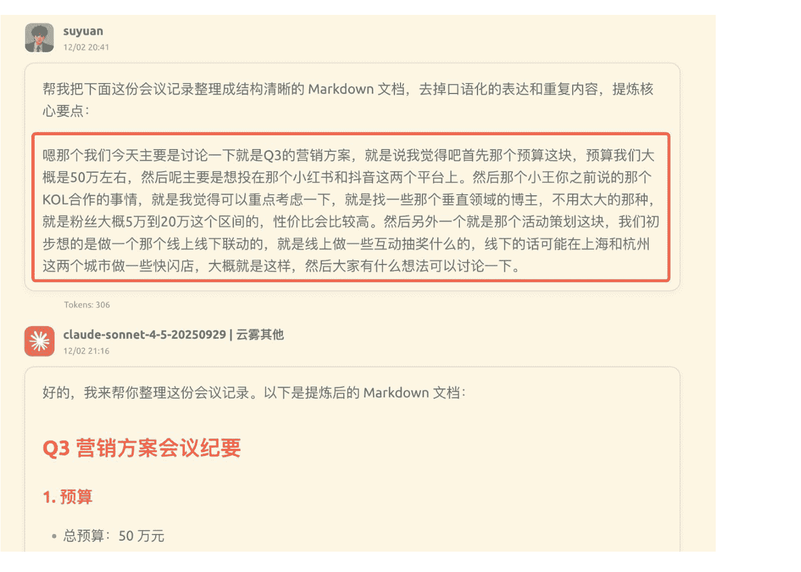

这时候，那份原始的乱七八糟的会议记录还躺在上下文里，占了几千甚至几万个 token(为了方便演示，我这里就让 AI 帮我随便生成了一段会议记录)。

但其实，这段原始内容它已经没用了，后续你让 AI「把第三点展开一下」或者「进一步聊方案」，都是基于整理后的版本来改，不需要原始素材。

所以正确的做法是：把那条包含原始会议记录的消息删掉。

在 Cherry Studio 里，把鼠标移到那条消息上，点击编辑图标，这条消息就从上下文里消失了。

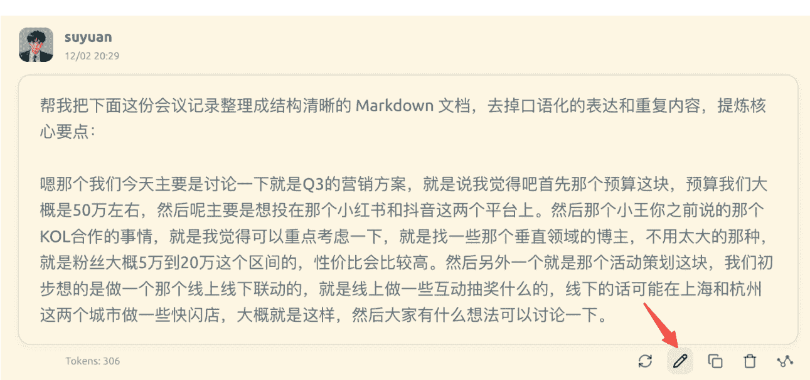

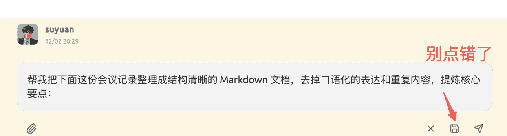

删完之后，上下文里只剩下你的指令和 AI 输出的 Markdown 文档，后续继续对话，AI 只需要处理这些精华内容，响应更快，理解也更准确。

注意，这里别点成了「发送」，如果点击发送，就是只把「帮我把下面这份会议记录整理...」这句话作为上下文去聊，AI 就不知道你的原始会议信息是什么了：


你想想，你做菜的时候会把土豆皮留在砧板上吗？不会，因为它会碍事。

上下文也是一样，用完的素材不删，只会让 AI「分心」。

#### 2、编辑 AI 的回答（修正上下文）

除了编辑自己的输入，你还能编辑 AI 的输出。

比如 AI 回复了 500 字，但你真正需要的只有中间那 400 字。

剩下的 100 字全是开场白、过渡句、客套话，类似「好的，我来帮你整理一下」「以上就是我的分析，希望对你有帮助」这种。

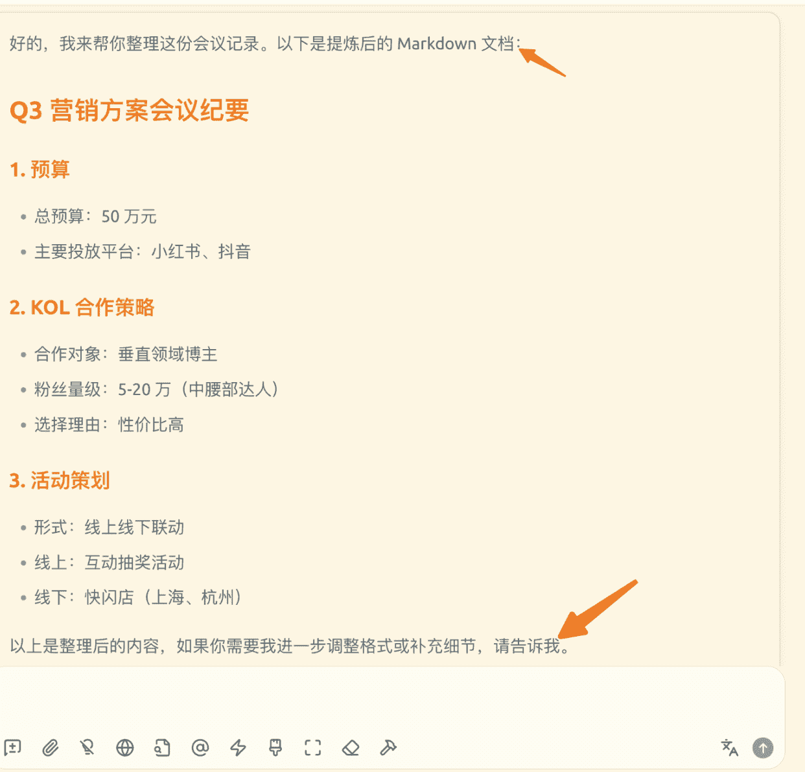

这些废话留在上下文里，后续每一轮对话，AI 都要把它们读一遍，不仅浪费 token，还可能干扰 AI 对重点的判断。

所以我们点击 AI 回复的编辑按钮，进入编辑模式，把不需要的部分删掉，只保留有用的内容，然后保存。

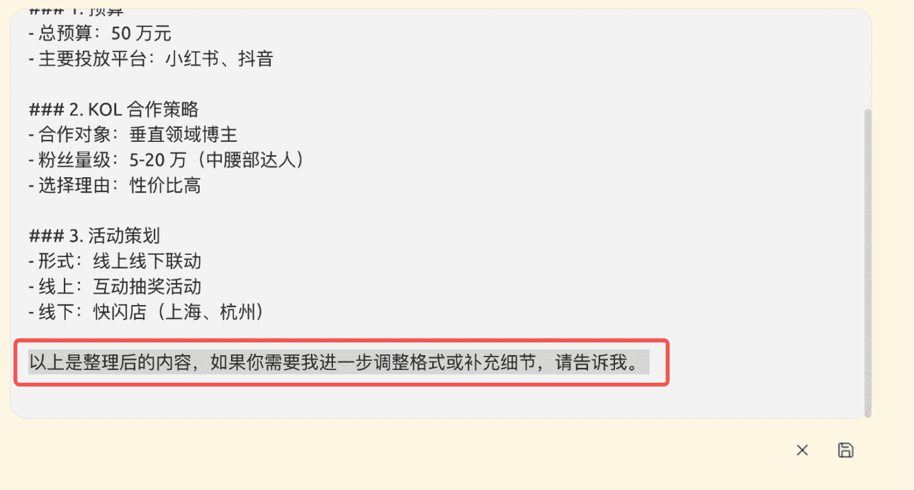

##### 这个操作还有另一个用处：修正 AI 的错误。

有时候 AI 的回答大体上是对的，但某个细节搞错了，例如上面这段，AI 输出的格式是：

```
Q3 营销方案会议纪要：二级标题
预算、KOL 合作策略、活动策划：三级标题
```

我想要它变成：

```
Q3 营销方案会议纪要：一级标题
预算、KOL 合作策略、活动策划：二级标题
```

如果我再让 AI 修改格式，它会重新生成一遍。问题是，重新生成有不确定性，它可能把格式改对了，但又把某个你满意的段落改坏了。

然后你得再改一轮，它又生成出新问题，来回折腾。

与其让 AI 重新生成一遍，不如直接编辑那个错误的地方，改完之后，这条「正确的回答」就成了上下文的一部分，后续对话 AI 会基于这个正确版本继续。

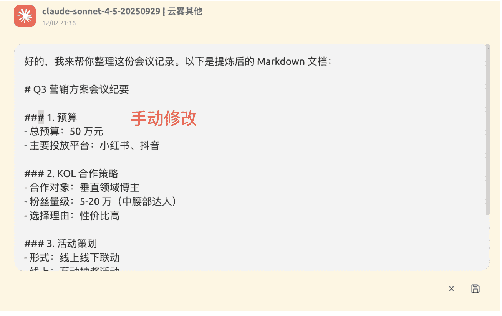

这样一来，AI 后面输出方案时的格式都是按照我想要的：

Q3 营销方案会议纪要：一级标题

预算、KOL 合作策略、活动策划：二级标题

#### 3、分支（克隆对话，避免重复投喂）

当我在一个对话里聊多的时候，想要迁移到某一个对话，例如我跟 AI 聊了我内容风格是什么样的，AI 做了分析，这一步是为了让 AI「学习」我的风格。

> 查看这些短内容分享，我习惯使用这种口语化写作，除了这个点，你还看出了什么
>
> Tokens: 1596 claude-sonnet-4-5-20250929-thinking | 柏拉图 CC 10/15 21:35
>
> 已深度思考（用时 13.6 秒）
>
> 看完这两篇，除了口语化，我还观察到：
>
> **写作结构上**
> *   1. 钩子开头：用具体数字或耗时成本吸引注意（“20 刀买 200 刀体验”、“花了一星期”）
> *   2. 结论前置：不绕弯子，直接说“最值得买”、“效率能翻倍”
> *   3. 分块清晰：1/2/或明确分段，方便快速扫读
> *   4. 金句收尾：用比喻或提炼的原则作结（“钓鱼要找有鱼的地方”）
>
> **内容策略上**
> *   1. 横向对比测评：不是单一产品介绍，而是把同类工具放一起比（Monica vs Genspark、秘塔 vs 谷歌 vs Kimi）
> *   2. 真实使用场景：不讲抽象概念，直接上场景（“买手机研究钢化膜”、“骑车回来信息都整理好了”）
> *   3. 踩坑 + 避坑：会坦诚说哪个不好用、为什么不好用（Kimi 等三小时、Manus 杀鸡用牛刀）
> *   4. 价格敏感：频繁提到具体价格和性价比，说明目标读者在意这个
>
> **情绪表达上**
>
> 用了很多情绪词 + 口语词营造“我在真诚分享”的感觉：

接着，我就把我下一份写的内容草稿发给它帮我润色成可以直接发的版本。

suyuan 10/15 21:49

> @claude-sonnet-4-5-20250929-thinking @claude-sonnet-4-5-20250929-thinking
>
> 这个是我口述语音转文本的草稿=【普通人使用 AI 时，提升效果最快的方法其实并不是学习那些复杂的术语，也不需要掌握工作流或智能体相关知识。最关键的还是上下文工程。如果你想提高 AI 的输出质量，性价比最高的做法就是找到这个领域的最佳实践，然后把这些内容作为上下文提供给 AI。这样，AI 在执行任务时，因为有了高质量的上下文，输出就会变得更加专业。前两天我看了宝玉老师写的两篇文章，尤其是关于雷军演讲风格的那一篇。他第一轮用谷歌的 Deep Research，让 AI 搜集了雷军的各种内容，并分析后输出了一份几万字的报告。但实际上，AI 总结出来的内容存在两个问题：一是上下文质量不够高，里面有各种分析，还有雷军、小米的广告等，内容很杂乱；二是上下文太长了，报告有上万字，AI 很难从中抓取有效信息，去生成真正符合雷军风格的内容。
> 后来，他优化的方法是找到了网友对雷军风格的高度总结，比如“雷总能把一个不起眼的东西，通过数据把 1% 的亮点放大，让它显得很厉害”，这就是他的本领。这样的上下文只有几百字，内容高度概括，质量也很高，更适合用作 AI 的上下文输入。
> 有了这样的上下文之后，AI 的表现立刻就提升了，变得非常好用。所以，在动手之前，最重要的就是先找到这个领域里最好的最佳实践，并把这些高质量内容作为上下文提供给 AI，让它基于这些信息来完成任务。这是我认为提升效果最快、信息价值最高的方法。
> 当然，有时候我们找到的上下文可能非常庞大，比如说是一整本书。这种情况下，就需要先对内容进行处理。比如，可以用一个支持百万 token 的大模型，把整本书浓缩成一份方法论文档。然后，人工再审核一下 AI 的输出，看看写得好不好，必要时再做调整。最终，把内容精炼成类似“技能包”一样的高质量上下文，再交给 AI 使用。
> 这就是我理解的高质量上下文，也是上下文工程的核心思路。】
>
> 帮我修改成适合自媒体发布的版本，有一个细节你要参考下面这个背景信息=【以下是网友总结的内容作为参考：
>
> ```
> > \tweet >
> ```
>
> ```
> > 雷军有一个非常牛的技能，就是把一件平平无奇或者并没有那么厉害的东西用数字、百分比或者其他的形容词给描述成一个听上去可望而不可即的物品。】
> ```
>
> Tokens: 871 claude-sonnet-4-5-20250929-thinking | 云雾 10/15 21:50
>
> 已深度思考（用时 6.2 秒）
>
> 别学 prompt 了，这个方法让 AI 效果直接翻倍
>
> 我前两天看宝玉老师的文章，发现一个事：
>
> 普通人用 AI，真不用学那些复杂术语、工作流、智能体。你只需要做好一件事——给 AI 喂高质量的上下文。

接下来我跟 AI 聊了几轮完成了这一次内容的润色以及帮我写好了标题。

那在这里，为什么 AI 能润色出我满意的版本，就是因为我前面已经提供了我之前写过的内容，并且跟 AI 做了讨论分析。

那如果没有这个上下文的话，AI 就不知道怎么写。

所以，每一次写这个内容的时候，我都需要把这些上下文投喂给 AI，它才能懂，那每一次都这样去投上下文也挺麻烦的，有什么办法可以更快呢？

答案就是分支功能，你可以理解为聊天记录克隆功能。

在开始写内容的前一轮对话这里点击分支，就克隆了一份聊天记录只到这里的聊天记录。

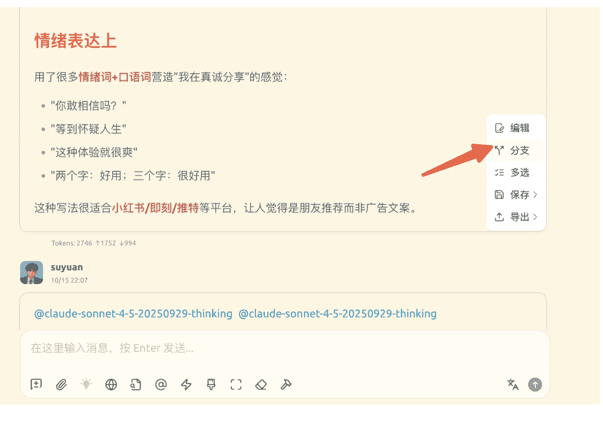

这样一来就克隆了一个有这个上下文的聊天记录，就省略了重复投喂上下文的步骤。

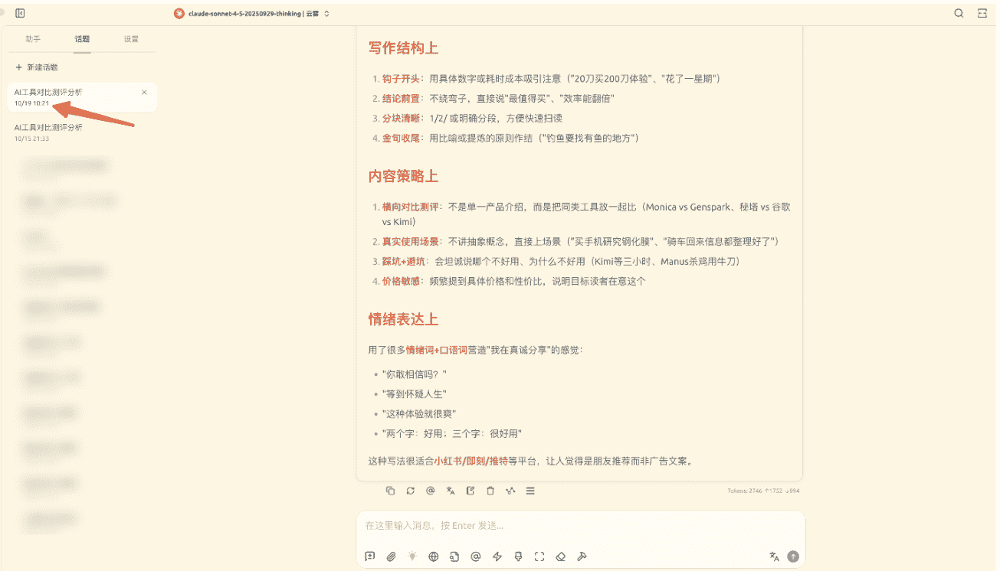

那我为什么不继续在原窗口聊呢？

还是上下文工程，原窗口已经聊到了 1w 多 token，再继续对话的话，不仅 token 成本变高，而且模型效果也可能变差。

而在这个任务上，每一次写作任务都是独立的，我不需要延续前面的对话继续聊下去。

#### 4、对话压缩与迁移（桥梁）

前面几个技巧都是在一个对话窗口里做「精细化管理」，但有时候，一个窗口已经聊了几十轮，即使你一直在删减，上下文也积累得很长了。

这时候你会发现 AI 开始变「蠢」，每次回答时消耗的 token 费用也不低。

更常见的情况是：你这个任务已经完成了，但聊天过程中产生了一些很有价值的內容，比如一套方法论、一个分析框架、或者一段特别好的表述，你想把这些「带走」，用到下一个任务里。

这时候就需要新开窗口，然后把有价值的东西「压缩迁移」过去。

##### 为什么要新开窗口？

##### 两个原因。

第一，上下文越长，模型效果越差，这是大模型的物理限制，不是你能改变的。

当对话超过一定长度，AI 对早期信息的「记忆」会变得模糊，回答质量下降，响应速度也变慢。

第二，旧窗口里有太多「过程垃圾」，你试错的内容、改了三四版的草稿、中途聊偏的话题，这些都还在上下文里。

即使你删了一些，整个上下文也还是很长，不如新开一个窗口，只带走最终成果。

##### 但直接新开窗口有个问题：AI 失忆了。

你在上个窗口里花了很多轮对话，终于让 AI 理解了你的需求、你的风格、你的背景，换到新窗口，这些全没了，你得重新解释一遍。

##### 一个解决办法是：让 AI 帮你压缩

在关闭旧窗口之前，让 AI 把整个对话浓缩成一份「交接文档」。

我常用的提示词是：

```
请给我一份世界一流、完整详尽的对话描述，以便另一个 AI 能够从我们中断的地方继续进行下去。
```

AI 会把这次对话的背景、你的需求、讨论过的要点、最终结论，全部整理成一份结构清晰的文档。

例如我在跟 AI 协作完成这篇文章的时候，已经聊了不少，上下文窗口占了 25000 token:

还有一个是能够导出 Markdown 格式的对话记录。这样你可以把对话内容快速整理成文档，存入知识库。

我对比了市面上的主流工具，包括官方 Web 端、各种第三方客户端，目前只有 Cherry Studio 同时满足这些需求。而且它是开源免费的，界面也很好看。

早在今年 2 月份，DeepSeek 爆火的时候，官网挤不进去，很多人就是用 Cherry Studio 配置 API 来使用的。我自己用了几个月，目前还没遇到什么 bug，稳定性很好。

不过这里有一个重要提醒：Cherry Studio 的版本要选对。

目前最新版是 1.6.0 以上，但我不建议你用最新版。我推荐的是 1.5.1 版本。

为什么呢？因为 1.6.0 修改了两个关键功能。第一个是 RAG 召回方式改成了"先推理再调用"，这听起来好像更智能，但实际上会导致 token 消耗增加 3 到 5 倍，速度也变慢了。第二个是单条消息的编辑功能被弱化了，不如 1.5.1 版本好用。

所以如果你已经安装了 Cherry Studio，建议你先检查一下版本。如果版本号超过了 1.6.0，我建议你卸载后重新安装 1.5.1 版本。如果还没安装，那就直接安装 1.5.1 版本。

## 四、Cherry Studio 的配置

(这部分由你自己来写)

输入提示词之后，生成的文档是这样的，连最新版的文章都整合进去了：

suyuan

请给我一份世界一流、完整详尽的对话描述，以便另一个 AI 能够从我们中断的地方继续进行下去。

```markdown
## 对话交接文档

### 一、项目背景

#### 作者身份
- 自媒体博主，写作平台主要是公众号
- 写作风格：口语化但信息密度高，像朋友聊天但每句话都有信息量
- 已有一个“上下文工程”系列文章，本次是系列第二篇

### 系列文章结构
1. 第一篇（已发布）：上下文工程入门，讲“压缩”和“删减”两种基础方法，用“制作国庆旅游攻略”作为案例，演示如何用 Google AI Studio 处理小红书帖子评论
2. 第二篇（正在写）：上下文工程进阶，讲“内循环”和“外循环”，用 Cherry Studio + RAG 知识库实现完整工作流
3. 灵感来源：小七姐在 PEC 大会上的分享（关于“第二大脑”搭建）

### 核心概念定义
- 内循环：在单次对话窗口内动态管理上下文（投喂→清理→保留）
- 外循环：把对话成果沉淀到知识库，供下次调用（提炼→存储→召回）
- 两者关系：内循环解决“这次怎么高效”，外循环解决“成果怎么复用”，形成飞轮

### 二、写作规范（严格遵守）

#### 格式要求
1. 使用中文逗号「，」，不用英文逗号
2. 使用「」引号，不用""
3. 不要使用——破折号
4. 小标题写成金句/钉子句，不使用冒号
5. 非必要不使用无序列表分点罗列，用自然叙述表达
6. 重要词句用加粗
7. 该用代码块的地方用代码块（如提示词）
8. 标注文章中应该插入图片的位置和内容描述

#### 语言风格
- 口语化写作，像朋友聊天一样自然
- 不说口水话/客套话，每句话都有信息量
- 该解释的地方解释，但解释得简洁有力
- 用类比让复杂概念易懂（如“砧板做菜”

#### 特别注意
- 作者对“无序列表分点罗列”非常反感，曾明确表示“为什么你他妈的要使用无序列表”
- 参考作者之前的文章风格，保持一致性
- 所有列表内容都应改写为自然段落叙述

### 三、文章当前进度

#### 已完成部分（约 2500 字）

##### 第一部分：开篇引入
- 用“产品文案写了 20 轮后新开窗口的痛点场景切入
- 点出问题：每次重新介绍背景、优质内容无法复用、AI 变回陌生人
- 承接上一篇，引出本篇要解决的问题

##### 第二部分：内循环与外循环概念
- 用“厨房砧板”类比解释内循环（投喂、清理、保留）
- 用“菜谱本”类比解释外循环（提炼、存储、召回）
- 解释两者关系：形成飞轮，每次任务让知识库更强

##### 第三部分：为什么需要 Cherry Studio
- 对比其他工具，说明需要的 5 个关键功能
- 推荐 Cherry Studio 的理由
- 重要提醒：版本选 1.5.1，不要用 1.6.0+（RAG 方式变化导致 token 消耗增加）

##### 第四部分：Cherry Studio 配置
- 作者说“这部分我自己写”，目前是占位符状态

#### 待完成部分

##### 第五部分：实战演示（核心，约 40% 篇幅）
建议案例：用 AI 帮你写一篇公众号爆款文章（不要用旅游攻略，上一篇用过了）
完整流程：
1. 外循环准备：把过去 10 篇爆款文章导入知识库
2. 内循环第一轮：调研 10 篇同类文章（逐个分析→删原文→汇总表格）
3. 内循环第二轮：结合知识库找差异化角度
4. 内循环第三轮：生成初稿→人工裁剪 70%→回流优化
5. 外循环沉淀：把方法论存入知识库，写好“召回提示”

##### 第六部分：进阶技巧（约 15% 篇幅）
- Cherry Studio 隐藏功能：消息分支、固定系统提示词、批量导出、快捷指令
- 知识库管理最佳实践：分库原则、文件命名规范、定期清理、召回提示写法
- 内循环 4 个常见场景：长文总结、多文档对比、迭代优化、分步推理

##### 第七部分：与系列文章的联系（约 5% 篇幅）
- 第一篇是“方法”（压缩、删减），第二篇是“系统”（内外循环 + 工具）
- 理念→方法→工具的递进关系
```

然后你新开一个窗口，把这份文档粘贴进去，告诉 AI「这是之前的对话记录，请基于这个继续」。

新窗口的 AI 就能直接「接上」之前的进度，不用你再重复解释。

这个操作是在做什么呢？

是把几十条对话记录（可能有好几万 token）压缩成一份几千 token 的「高质量文档」，信息密度大幅提升，新窗口的 AI 读取的是精华，不含过程中的垃圾。

而且这份压缩后的文档中强调的写作要点，也可以保存下来，以后遇到类似的任务直接用。

而这，就是上下文工程的「外循环」：内循环负责在单次对话里保持高效，外循环负责把成果沉淀下来跨对话复用。

### 5、「经验包」上下文

前面总结的「交接文档」里，有我的项目背景，有我最近在写什么系列的文章，有我写作的规范...

## 素养写作文档

### 一、项目背景

### 作者身份
- 自媒体博主，写作平台主要是公众号
- 写作风格：口语化但信息密度高，像朋友聊天但每句话都有信息量
- 已有一个"上下文工程"系列文章，本次是系列第二篇

### 系列文章结构
- 1. 第一篇（已发布）：上下文工程入门，讲"压缩"和"删减"两种基础方法，用"制作国庆旅游攻略"作为案例，演示如何用 Google AI Studio 处理小红书帖子评论
- 2. 第二篇（正在写）：上下文工程进阶，讲"内循环"和"外循环"，用 Cherry Studio + RAG 知识库实现完整工作流
- 3. 灵感来源：小七姐在 PEC 大会上的分享（关于"第二大脑"搭建）

### 核心概念定义
- 内循环：在单次对话窗口内动态管理上下文（投喂→清理→保留）
- 外循环：把对话成果沉淀到知识库，供下次调用（提炼→存储→召回）
- 两者关系：内循环解决"这次怎么高效"，外循环解决"成果怎么复用"，形成飞轮

### 二、写作规范（严格遵守）

#### 格式要求
- 使用中文逗号「，」，不用英文逗号
- 使用「」引号，不用""
- 不要使用——破折号
- 小标题写成金句/钉子句，不使用冒号
- 非必要不使用无序列表分点罗列，用自然叙述表达
- 重要词句用 **加粗**
- 该用代码块的地方用代码块（如提示词）
- 标注文章中应该插入图片的位置和内容描述

#### 语言风格
- 口语化写作，像朋友聊天一样自然
- 不说口水话/客套话，每句话都有信息量
- 该解释的地方解释，但解释得简洁有力
- 用类比让复杂概念易懂（如"砧板做菜""菜谱本"）
- 不假设读者知道所有背景，但也不把他们当小白

回到最开头的问题，我们要解决 AI 不了解我是谁、我的工作习惯，每次都重新解释，要怎么办？

这里我们就是修改这份文档，只保留通用的部分，例如我的写作规范，但是只能作用于写这个文章的部分，那就去掉。

然后这个文档就是我后续指导 AI 协作的方法论文档，它会跟着我一起成长。

每次 AI 哪里没理解对，我就把这个点补进文档里。下次再遇到类似情况，AI 直接就懂了，不用我再说一遍。

但每次新开对话都要手动粘贴这份文档，还是有点麻烦。

Cherry Studio 有一个功能可以解决这个问题：自定义助手。

你可以创建一个专属助手，把你的「经验包」写进系统提示词里。这样每次用这个助手对话，系统提示词会自动带上，不用你手动粘贴。

### 怎么设置？

#### 第一步，点击左侧菜单的「助手」
点击左侧菜单的「助手」，然后点击「添加助手」，然后点击「默认助手」


#### 第二步，右键编辑助手
右键编辑这个，助手起个名字，比如「写作助手」，然后在「系统提示词」这个输入框里，把你整理好的经验包粘贴进去。


#### 第三步，选择你常用的模型
选择你常用的模型，保存。

以后你要写文章，就直接用这个「写作助手」开对话。AI 从第一轮开始就知道你是谁、你的写作风格是什么、有哪些规范要求，不用你再解释。

## 系统提示词和手动粘贴有什么区别？

效果上差不多，但有两个优势：
- 第一，省事。系统提示词是自动带上的，你不用每次都记得粘贴。
- 第二，干净。系统提示词不会出现在对话记录里，你看到的聊天界面只有你和 AI 的对话，但 AI 实际上每轮都能读到系统提示词的内容。

你可以给不同的任务创建不同的助手：写作助手、读书助手，每个助手有自己的系统提示词，这样你的「经验包」就按场景分类管理了。


以上，就是上下文工程内循环的「保留」。

## 八、知识库

前面讲了怎么把对话压缩成高质量文档，怎么提炼出通用的「经验包」。

如果这些文档只有一两份，写进系统提示词或者手动粘贴都行。

但如果你积累了几十份呢？比如你有十几个项目的复盘、二十多篇文章的写作记录、各种场景的方法论总结。

每次开对话前都要想「这次该用哪几份」，然后翻文件夹找出来粘贴，太麻烦了。

RAG 知识库就是用来解决这个问题的：把你所有的高质量文档都存进去，用的时候让系统自动检索。

### I、RAG 是什么？

RAG 的全称是 Retrieval-Augmented Generation，翻译过来叫「检索增强生成」。

你有没有用过那种 AI 智能客服？例如你问它「怎么退货」，它能准确告诉你这家公司的退货流程，包括要在哪个页面操作、多少天内可以退、运费谁出。

但你想一下，大模型本身是不知道这家公司的退货政策的，它是怎么回答出来的？

答案是：客服系统背后有一个知识库，里面存着这家公司的各种文档，退货政策、常见问题、操作指南等等。

当你问「怎么退货」的时候，系统会先去知识库裡搜索，找到「退货政策」这份文档里最相关的几段话，然后把这些内容和你的问题一起发给大模型。

大模型拿到的提示词大概是这样的：

【参考资料】

退货政策第 3 条：用户在签收后 7 天内可申请无理由退货...

退货政策第 5 条：退货运费由买家承担，除非商品存在质量问题...

【用户问题】

怎么退货？

所以大模型能回答得准确，因为答案就在参考资料里，它只需要把这些信息组织成自然语言说出来就行。

这就是 RAG 的核心流程：用户提问 → 检索知识库 → 把检索结果和问题拼在一起 → 发给大模型生成回答。

### RAG 和直接 Input 有什么区别？

你可能会问：我直接把文档内容复制粘贴进对话框，不也一样吗？

答案是得分情况来看。

如果你只有一两份文档，每份几百字，直接粘贴完全没问题。但如果你有几十份文档，每份几千字，全部粘贴进去，就有两个问题：
- 第一，很可能超出模型的上下文窗口限制。
- 第二，就算没超出，一次性塞太多内容，模型的注意力会分散，反而效果变差。

RAG 的做法是：不把所有文档都塞进去，而是根据你这次的问题，只检索最相关的几段内容，这样上下文里只有「这次用得上」的信息，保持精简。

另一个重要的点：RAG 的上下文是「临时」的。

当你在 Cherry Studio 里开启知识库功能，每次你发送消息，系统都会重新去知识库里检索一遍，把检索结果拼到你的消息里，然后一起发给大模型。

注意是「每次都重新检索」。

也就是说，第一轮对话检索到的内容，不会自动保留到第二轮，第二轮对话时，系统会根据你第二轮的问题重新检索，可能检索到完全不同的内容。

如下图，第一轮对话的时候，我明明只输入了"我最近在做什么"几个字，但是计算 token 里显示我「上传」了 2694 tokens 的内容。


关闭知识库之后，不再调用 RAG，此时上下文里只有第一轮的对话内容而已了。


### 这意味着什么？

知识库的内容不是「持久记忆」，而是「按需调用」。

你问什么，它就去找什么。你不问，它就不出现在上下文里。

这其实是个优点：你的对话上下文始终保持干净，只有聊天记录本身，知识库内容用完即走，不会越积越多把上下文撑爆。

如果你关闭知识库功能，整个上下文就只剩下你和 AI 的对话记录，非常干净。

这意味着 AI 的注意力完全集中在对话本身，不会被检索结果干扰，你也能更清楚地知道 AI 当前「看到」了什么。

### 2、RAG 的局限：检索不一定准

RAG 听起来很棒，但有个问题：检索结果不一定是你想要的。

系统是根据「语义相似度」来检索的，你问的问题和知识库里的某段话，在意思上越接近，越可能被检索出来。但「语义相似」不等于「真的有用」。

比如你问「怎么提高工作效率」，知识库里可能有一段话是「提高效率的关键是减少干扰」，语义很相似，所以被检索出来了。

但你真正想要的可能是另一份文档里的「番茄工作法使用指南」，那段话可能因为你的用词里完全没有提到「番茄」这个词，于是就没被检索到。

所以使用 RAG 的时候，建议检查一下 AI 参考了哪些内容，Cherry Studio 会展示每次检索到的文档片段，你看一眼，如果发现不是你想要的，那就得重新组织你的问题让 RAG 重新检索。


### 3、在 Cherry Studio 中配置知识库

接下来，开始实操。

还记得前面配置 Cherry Studio API 的时候，我让你添加两个模型：Qwen/Qwen3-Embedding-8B 和 Qwen/Qwen3-Reranker-8B 吗？这两个就是用来做知识库检索和重排的。

Embedding 模型负责把文档内容转换成向量，你可以把向量理解成「意思坐标」：每段文字根据它的含义，被安排到一个多维空间里的某个位置，意思相近的内容，坐标也相近。

这样当你提问的时候，系统会把你的问题也转成一个坐标，然后去找哪些文档片段的坐标离你的问题最近，把它们捞出来，这就是检索。

而 Reranker 模型负责对检索结果重新排序，把最相关的排在前面。

#### 第一步：打开知识库页面
点击 Cherry Studio 菜单栏的「知识库」图标，进入知识库管理页面。


#### 第二步：创建新知识库
点击「创建知识库」按钮，给你的知识库起个名字，比如「工作方法论」。

#### 第三步：选择 Embedding 模型
在知识库设置里，选择你之前添加的 Qwen/Qwen3-Embedding-8B 作为 Embedding 模型，Qwen/Qwen3-Reranker-8B 作为重排模型，然后点击确定。


#### 第四步：导入文档
Cherry Studio 的知识库可以配置不同的来源，有文件/笔记/目录/网址/网站，其中最常用的是前面三个。

点击「添加文件」，可以选择你要导入的文件，支持 Markdown、TXT、PDF 等格式。


由于前面的技巧 4 里，我已经让 AI 总结出了我的写作方法论，我保存到了本地，所以可以直接把这个文档作为文件上传。


导入后，系统会自动把文档切分成小块，然后用 Embedding 模型把每一块转换成向量，这个过程可能需要几秒到几分钟，取决于文档大小。

#### 第五步：在对话中使用知识库
回到对话页面，在输入框上方，你会看到一个知识库的图标，点击它，勾选你刚才创建的知识库。


现在你发送消息，系统就会自动从这个知识库里检索相关内容，拼接到你的消息里发给大模型。

### 调整召回数量

默认情况下，系统会检索最相关的 6 段内容，如果你觉得检索到的内容太少，可以调整「召回数量」这个参数。

在知识库设置里，找到 TopK 选项，默认是 6 个片段，意思是每次检索返回最相关的 6 段内容。

如果你的知识库文档很多，或者你觉得搜索结果不够全面，可以调大这个数字，比如设成 10。


但也不要设太大，太大了又回到「信息过载」的问题。

### 4、同时调用多个知识库

Cherry Studio 支持同时勾选多个知识库。

比如我有两个知识库：
- 一个叫「职场记录」，里面存的是我每周的工作记录和复盘
- 一个叫「职场课」，里面存的是我整理的各种工作方法、沟通技巧、时间管理之类的内容

当我遇到一个工作上的问题想请教 AI，我可以同时勾选这两个知识库。

这样 AI 回答的时候，既能了解我最近在做什么、遇到了什么具体情况 (从职场记录里检索), 又能调用相关的方法论来给建议 (从职场课检索)。

相比我只勾选一个知识库，回答的针对性会强很多。


### 优化建议

**方法一：建立「提前确认」习惯**
> 在任务开始前，先向上级确认产出形式和标准
示例话术：
- "我现在理解是 A→B→C，是否合理？"
- "老板，这样对比是不是你想要的？"

**方法二：用「报备三件事」节奏同步工作**
- 1. 工作优先级怎么排的？
- 2. 哪个点卡住你了？
- 3. 接下来有什么动作？

这里调用的是职场课里的方法来回答

参考话术：
> “这个任务我拆解了 4 个子模块，2 个已完成，1 个需要业务方确认，另 1 个我打算今天下午做。可能需要您在 xx 时间帮我拍个板。”

**方法三：定期主动要反馈**
- 每完成一阶段，先发小结或阶段成果给上级确认
- 不等“周会”，周三、周五提前同步下阶段计划

## 九、写在最后

回到开头的问题：对话越聊越乱，新开窗
口又失忆。

这两个痛点，本质上是一个矛盾。

你想让 AI 记住更多，就得保留更多上
下文，但上下文越长，噪音越多，AI 表现越
差。你想让上下文保持干净，就得新开窗
口，但一新开，之前积累的理解全没了。

上下文工程就是在这个矛盾里找平衡点。

内循环解决「越聊越乱」：删掉跑偏的对
话、修正错误的回答、用分支保护已有的
进度、把冗长的参考资料及时更新。

每一个操作都在做同一件事：控制信息密度，让 AI 每一轮都在最相关的上下文里工作。

外循环解决「新开失忆」：把有价值的内容提炼成文档，存进系统提示词或知识库。

下次开新窗口，不是从零开始，而是带着之前的经验继续。你积累得越多，AI 对你的理解就越深，协作效率就越高。

这两个循环配合起来，你的使用体验会完全不一样。


以前你可能是这样用 AI 的：开一个窗口，聊到乱了，关掉，新开一个，重新解释一遍背景，重新调教一遍风格，周而复始，每次对话都是一次性的，用完就扔，什么都没留下。

现在你可以这样用：在单个窗口里精细管理，聊完之后把成果压缩保存，下次调用。

每一次对话都在为下一次对话积累资产，AI 越用越懂你。

这些技巧看起来是一堆零散的操作，但背后是同一件事：控制 AI 每次看到的信息。

大模型的能力是固定的，你改变不了，但你可以改变它的输入。

同样一个模型，给它一堆杂乱的上下文，和给它一份精心组织的上下文，输出质量天差地别。

这就是上下文工程的做的事情：控制上下文长度，只给最小必要的信息，让模型在最佳条件下输出。

如果你之前没用过这些功能，不用一次全学会。

建议从配置 Cherry Studio 开始，按照第三部分的步骤把 API 接好，然后找一个你正在进行的任务，试着用一下删除消息、编辑回答这些功能。

你会发现，AI 的表现，真的会变好。

### 最后，安利小懒的付费群

#### 懒人专属群 (介绍)


这里是你对抗信息过载的护城河。

已稳定运行 6 年，累计拆解、研读 3000+ 个互联网商业实战案例与行业前沿内参和时政/宏观文章。

我们不搬运垃圾，只做高价值信息的筛选器与放大镜。

#### 懒人专属群更新记录：

```
https://hk57gvlx7u.feishu.cn/docx/H0kRdZbSbolBR0xkaXtcuVEOnTg
```

#### 懒人专属群更新记录 (需梯子，备用)：

```
https://lazybook.fun/blog/record2
```

**免责声明**：本资料归档于社群内部知识库，仅供成员课题研究与学术交流，请在查阅后 24 小时内删除。