# 抖音大健康直播获客，一个冷门且红利的行业，全流程实操讲解！

251215 副业 SC 精华

公众号懒人搜索，懒人专属群分享

公众号懒人搜索，懒人专属群独享

懒人微信:lazyhelper


很多人都知道大健康私域是个印钞机行业，但是却很少有人知道大健康直播获客也是个黄金赛道。市面上一个口播大健康直播客资单价在 23-30 左右，大健康运动类直播客资单价在 15-25 左右。一个腰部主播一天大概能下 200-700 左右粉，大家可能算一下，收入很可观。并且不需要供应链，也不需要中控，只自己一个人即可启动。


## 一、主播案例介绍

下面以我们一个大健康轻运动主播为例，来给大家讲解下大健康直播获客应该怎么做。这个轻运动主播是 2 个月从小白到月收益 10w+，之前是做线下养生门店的，0 直播经验。

### 1、为什么播了两个月一直播不起来，改换到轻运动赛道迅速起飞。

这个主播姐姐刚开始过来是学习播口播，播了两个来月一直没播起来，为什么转到轻运动赛道以后就能迅速起飞呢？

#### 1.1、轻运动赛道对新手小白很友好

轻运动的直播内容对平台而言相对安全，只是带着用户健身，锻炼身体，风险性较低，所以管控会相对宽泛，不容易违规，很适合新手小白。但是大健康类口播直播间，国家对此方面出了相应的管控政策，那么平台也会跟着政策走，管控也会变得相对严格，比较容易违规封号，不适合小白。

#### 1.2、动作留人，对语言组织能力要求没有口播那么高

直播间主要是画面、贴片留人，看直播间、贴片以及画面，即可让用户快速了解此直播间是干什么的，即可快速获取精准流量。不需要像口播那样有很好的语言组织能力才能把人留下!

尤其对于新手小白来讲，一般面对镜头会有紧张感，很多时候讲话都会不流畅，但是轻运动因为是躺着播，不会有直接面对镜头那么紧张，即使紧张，不知道讲什么也可以直接做动作数拍子就可以了，不会像口播那样因为紧张有大段的卡顿时间。

#### 1.3、简单易上手

形势简单，主播只要做到以下要求就能播起来:

- 学会 15-20 组动作即可开播;
- 会数拍子、有节奏感;
- 能讲明白每个动作是锻炼身体哪个部位的;
- 会要数据。

#### 1.4、主播身型很适合

因为带着健身的这类，最好还是身材要过得去，不能特别胖，这个主播又瘦又高，身型很符合 (如果微胖也不要紧，通过拉画面把人拉的修长一些就可以了)

### 2、踩了哪些坑

#### 2.1、违规

这个主播是做线下养生馆的，懂一些医学知识，大家的认知是不是懂养生播大健康要更好？其实这反而导致她踩了很多违规的坑！比如髌骨、半月板这种医学术语词汇她经常会顺口说出来，但是这些专业医学术语词汇是违禁词，就会导致违规，我们不懂医学知识的反而不会讲，顶多讲膝盖，肯定不会去讲髌骨这种词，所以也不会违规。

#### 2.2、不会做评论灯牌等数据

这是新人常见问题，刚开始她的数据做的也很不好，后来在她直播的时候我们就重点给她观察，她的哪些动作是天然就有互动的，给他重点记录好，然后让他下次根据这个动作重点要互动（效果超级好）。还有就是参考同行的直播间，看看别人做数据的话术是什么，然后移植到自己的直播间测试效果，这样慢慢她的数据就越做越好

#### 2.3、日收益

下面是她的日收益截图，从一天赚两三百，转变成一天赚八九千！（大健康直播获客类目多是次日结算，回本周期巨快！比如今天引流到私域 100 个人，那么明天就会给你结算这个 100 个粉收益！）


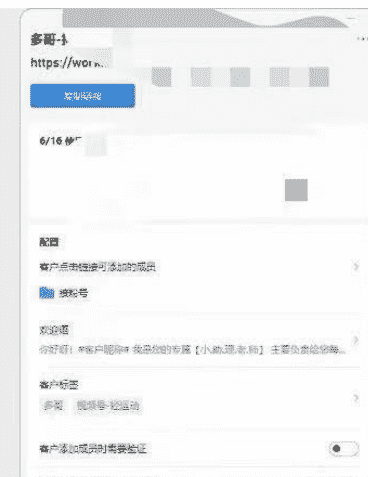


收到

谢谢

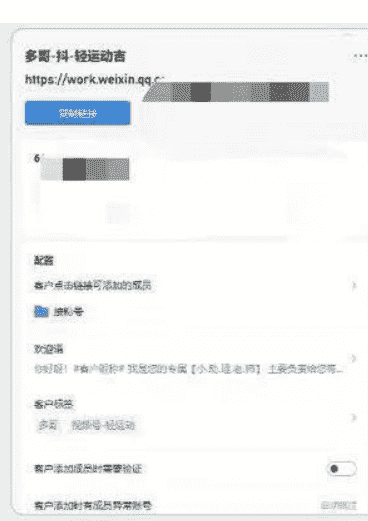


05:33


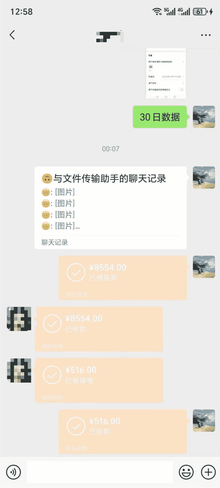

下面具体讲一下大健康轻运动直播获客要怎么做（口播赛道难度有点大，这里不做讲解了，重点讲下轻运动，小白也能上手去做！）

## 二、直播账号设置

### 1、账号基础设置

#### 1.1、名称设置

起跟自己行业相关名字。

例如如轻运动赛道可起名"**轻运动”

#### 1.2、头像设置

建议用个人头像或者卡通、风景。

#### 1.3、简介设置

简洁明了禁止写联系方式。

例如轻运动赛道可以写:古法健身操践行者！关注我，跟我一起练起来!

#### 1.4、背景设置

简洁明了

前期可不设置。

### 2、账号隐私设置

- 关闭同城展示
- 关闭推荐可能认识的人给我
- 关闭把我推荐给可能认识的人
- 私密关注和粉丝列表
- 关闭私密账号


## 三、养号流程

### 1、模拟真实用户行为

- 用不同地方的 wifi 刷抖音，比如商场饭店等公用 wifi
- 用手机套餐流量刷抖音
- 用注册手机号正常通话

### 2、快速为账号打上喜好标签

在同行的短视频下方进行评论、点赞、收藏、关注等操作

刷到同行直播间停留 2 分钟以上，点击小黄车/小风车

点赞、评论、粉丝灯牌等操作都要有

遇到千人以上在线直播间可以发红包吸粉
快速打标签，或在评论区打"777"进行涨粉

### 3、通过充值消费等方法缩短养号周期

充值：充值 10-30 元抖币

消费：遇到带货直播间时可以买一单便宜的产品，有真实购物行为是最快过风控的方法

## 四、大健康轻运动直播间搭建

### 1、直播间软硬件配置清单

#### 硬件配置清单

- 手机 (2019 年后生产的机型都可以，可以咸鱼买，也可以租借)
- 摄像机/摄像头 (用苹果 14 以上手机充当摄像头也可以)
- 电脑 (可以咸鱼买二手的配置高一些的)
- 灯光 (根据环境亮度选择即可)
- 收声设备 (猛玛牌即可)
- 绿幕 (需要两块)
- 支架 (选择双机位手机支架，一机位放直播画面，另一机位放稿子)

#### 软件配置清单

- 直播伴侣 (下载地址 https://streamingtool.douyin.com/?ref=ww.pinduoie.com)
- 高清背景制作工具 (美图，ps，醒图都可。新手建议直接小红书找背景素材，或者淘宝去买)
- 贴片制作工具 (美图，ps，醒图都可)

## 五、平台推流规则

### 1、抖音算法底层逻辑

#### 1.1、浅层数据:

点击、停留、互动、关注、灯牌、点赞、转发

#### 1.2、深层数据:

成交密度、GMV、千次成交

#### 1.3、不挂车直播间考核数据

点击、停留、互动、关注、灯牌、点赞

### 2、直播间八大流量入口

直播推荐、视频推荐、关注、同城、个人主页、商业化、搜索、其他

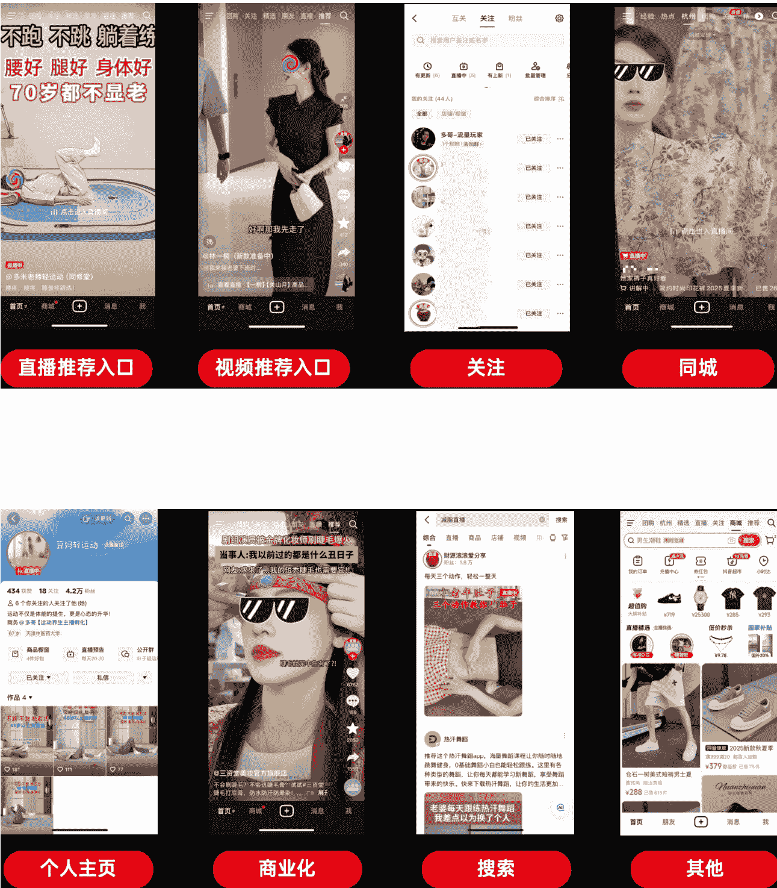

### 3、为什么重点要打开直播推荐（feed）流量池？

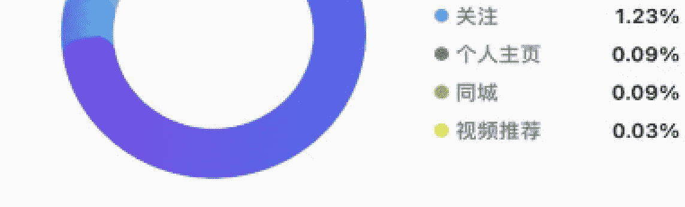

只有 feed 推荐流量（直播推荐）打开了，我们才能持续的获取新流量，直播间流速也会快，我们才能快速的破人气节点。

如果其他的流量入口占比过高，会导致 feed 流被压制，起号就会很困难。所以起号阶段要重点关注 feed 流的占比，占比 90% 以上才算一个健康账号。

### 4、抖音的推流逻辑

#### 4.1、初始流量

开播 5-10 分钟推进来，这部分流量很少有主播能接的住，小白主播几乎不可能接住，不必太过在意！

#### 4.2、叠加流量

需要考核直播间的数据是否达标，轻运动直播间不需要挂小黄车，所以我们只需要把点击、停留、互动、关注、灯牌、点赞数据做好就可以，这些数据做好才可以获得持续推流。

（具体数据要做到多少数值，参考下方轻运动直播起号五大阶段的数据参考）

#### 4.3、奖励流量

抖音是一个公平公正的赛马机制，同时段、同类目、同级账号 PK，数据好的优先获得下一波流量”，不是看谁做得完美，而是看谁在同期竞争中更能抓住用户，数据好者才能获得额外流量

#### 4.4、在线阈值 (人气节点)

30、60、80、120、160、180、230、260、500、1000

一般破 260 在线阈值集意味着起号成功，这个时候就可以进行变现。

我们所说的破层级即是一层一层突破在线阈值，起号阶段，每一天都比前一天数据更好，阈值从 30 突破 60 一层一层突破直至突破 260 阈值，则起号成功。反之则是我们最头疼的倒螺旋，数据一天比一天差，账号就很难起来了。

## 六、轻运动直播起号 五大阶段

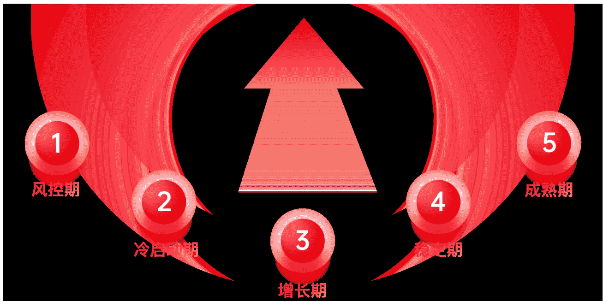

### 1、风控期

#### 1.1、特点

30 分钟 曝光>300

这个时间段直播间会有很多大头人，不说话也不走。并且整场下来，总曝光偏低，这是抖音在对账号进行风险控制，前期不会有大曝光。

这是正常现象，往往持续 1~3 天左右，正常直播不断的优化人货场即可。

#### 1.2、目标动作

破风控，让抖音认为你是一个正常的直播间。

测直播内容。

测基础曝光流量。

#### 1.3、数据参考

30 分钟曝光>300 则账号正常

30 分钟曝光<300 则下播重开，换时段测试，直至测到正常曝光。

如遇到天残号要放平心态，多测试时段，做主播久了会经常遇到这样的情况，慢慢去拉也能拉起来！


### 2、冷启动期

#### 2.1、特点

1 小时曝光 500~1000 左右

1 小时场观 150~300 左右

#### 2.2、目标动作

打开 feed 流量池

破 30 在线人气节点

建立流量模型

建立人群模型

#### 2.3、数据参考

- 直播时长 60 分钟
- 人均观看时长>45 秒
- 互动率>2%
- 关注率>2%
- 灯牌率>0.6%

### 3、增长期

#### 3.1、特点

- 1 小时曝光 2000~10000 左右
- 1 小时场观 600~3000 左右

#### 3.2、目标动作

- 破 60~120 在线人气节点
- 建立精准人群画像

#### 3.3、数据参考

- 直播 75 分钟
- 人均观看时长>90 秒
- 互动率>3%
- 关注率>3%
- 灯牌率>0.8%

### 4、稳定期

#### 4.1、特点

- 1 小时曝光 10000~30000 左右
- 1 小时场观 3000~9000 左右

#### 4.2、目标动作

- 破 160-260 在线人气节点
- 巩固精准人群画像

- 建立人群喜好标签

- 建立转化模型

#### 4.3、数据参考

- 直播 1 小时以上
- 人均观看时长>120 秒
- 互动率>3%
- 关注率>3%
- 灯牌率>=1%

### 5、成熟期

#### 5.1、特点

- 1 小时曝光 30000~100000 左右
- 1 小时场观 9000~30000 左右

#### 5.2、目标动作

- 破 500-1000 在线人气节点
- 优化人群模型
- 进行引流

#### 5.3、数据参考

- 直播 1 小时以上
- 人均观看时长>120 秒
- 互动率>4%
- 关注率>4%
- 灯牌率>=1%

## 七、账号推流少的原因

### 1、账号设置成了私密账号

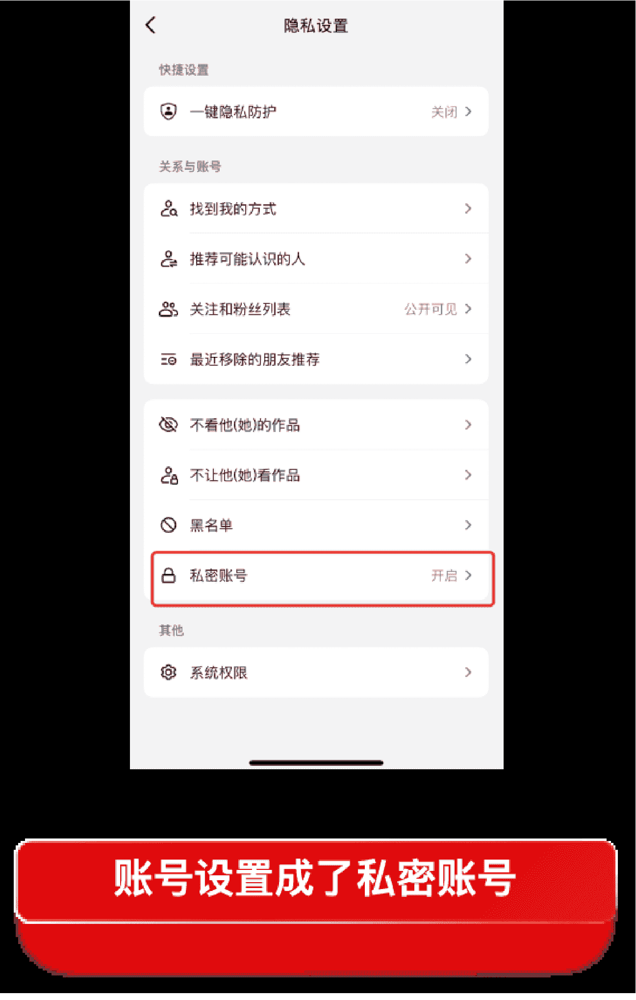

账号设置成了私密账号

### 2、账号有问题

账号基础曝光低，就是前面所说的天残号。

开播账号有过违规记录，违规会被处罚导致曝光减少。

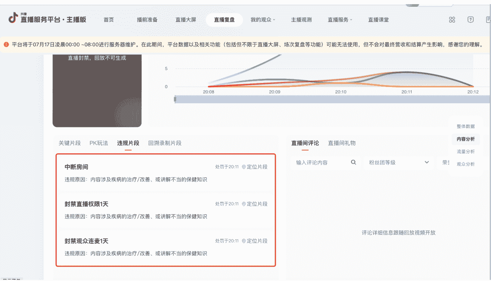

### 3、人、内容、场景有问题导致 feed 流无法打开

#### 3.1、主播状态差，讲的内容不吸引人

##### 3.1.1、不流畅：话术讲的不顺畅、不熟练。


##### 3.1.2、听不懂：不好理解的内容不去讲，明确用户群体认知情况

大健康类目标群体多为 50+ 以上老年人，这类群体普遍文化程度较低，所以内容要通俗易懂，不容易理解的内容不要去讲。

#### 3.2、内容选择有问题

##### 3.2.1、抄袭同行爆款直播内容

内容好不好，不是自己说了算，是市场和同行说了算。一定要选择被市场和同行验证过的爆款内容，新手小白不建议原创内容，因为缺乏经验，大概率失败。

##### 3.2.2、先抄袭再超越

抄同行爆款内容，先抄袭爆款积累经验，弄懂直播节奏，然后再优化迭代直播内容，先抄袭再超越。

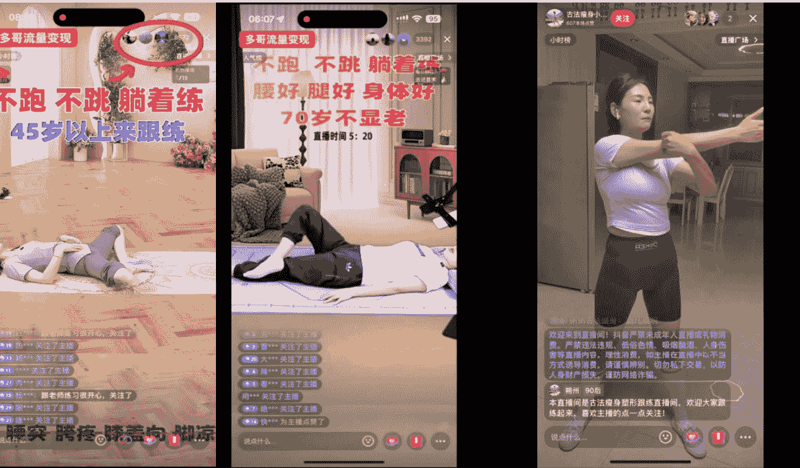

同行爆款

抄袭同行爆款

反面案例

新手小白直接抄袭爆款直播间，比较容易拿到结果，先抄袭弄懂直播节奏，然后再超越。

整个市场都没有这种直播形式，虽然有小概率成功，但是大概率都是失败。

#### 3.3、场景搭建有问题

##### 3.3.1、贴片不够吸引人

##### 3.3.2、场景搭建不符合当前直播内容

> 案例问题！！！
直播间没有贴片，背景比较杂乱，构图也很差。


## 八、破解推流少，实现层级跃升

### 1、解决因账号问题导致的流速低

#### 1.1、不要频繁切换地区登录

频繁切换地区登陆容易触发抖音风控，导致账号没有推流或者流速低。

#### 1.2、不要一证多实名

一证多实名，本身就是违背抖音规则，被查到很容易导致没有推流，或者流速低，或者严重会导致封号。

#### 1.3、账号连开

账号连开测试高曝光时间，每个账号高曝光时段可能不同，账号连开测试曝光最好的时段。

#### 1.4、更换账号

如果以上办法都无法解决流速低的问题，建议直接更换新账号，不要在账号上浪费太多的时间。

### 2、工具的正确利用

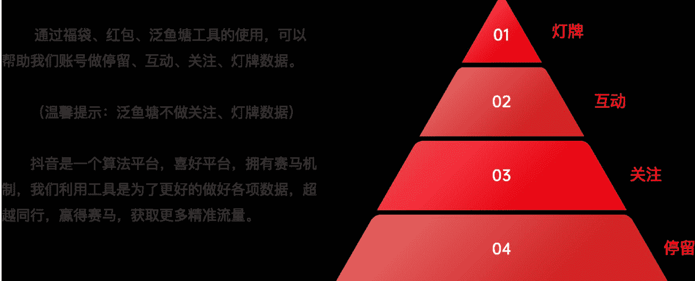

#### 2.1、福袋的正确使用

建议在快要到流量节点的时候发福袋，比如现在直播间在线 28 人，马上要破 30 流量节点，则可以发福袋，帮助留人，让人群叠加，帮助破 30 人气节点。

在节日大促的时候建议福袋少用，比如双十一，这个时候用福袋会吸引进来很多羊毛党

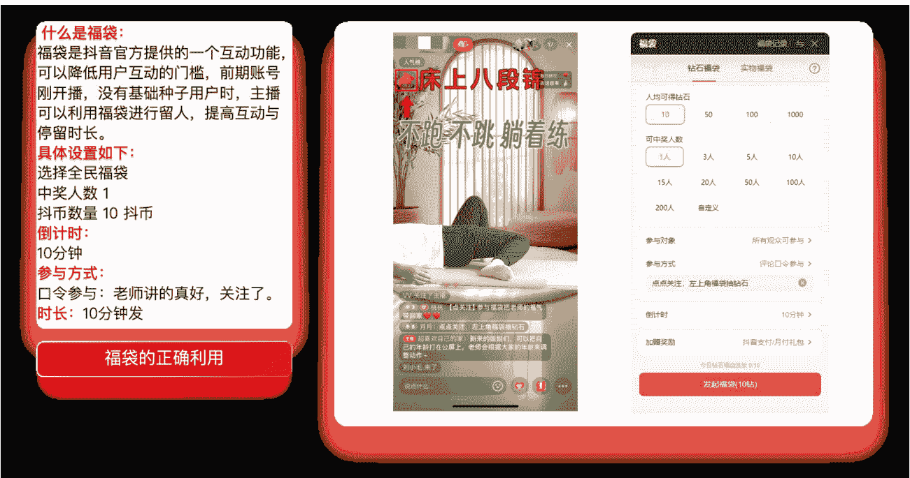

#### 2.2、红包的正确使用

红包的用法跟福袋的用法相同，也是在快要到人气节点的时候发红包，帮助突破人气节点。

红包和福袋可以叠加使用，效果更好。

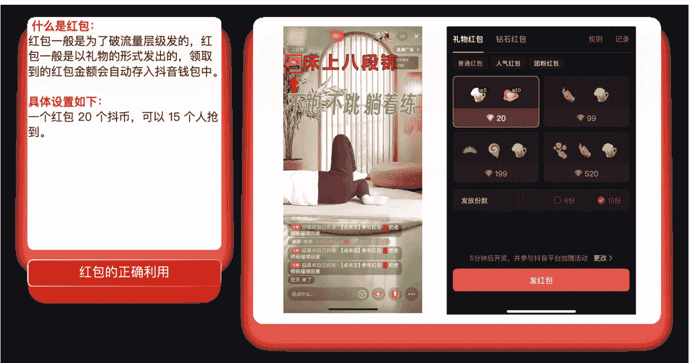

#### 2.3、鱼塘的正确使用

鱼塘是通过辅助的方式帮助直播间达到数据考核标准，帮助我们在平台上获得持续推流。比如今天的评论数据不够，那么就可以让鱼塘去帮你补评论数据，防止账号因为数据没有做递增而出现倒螺旋的情况。

同时也可以实现羊群效应，鱼塘做了评论有可能带动真实用户去做评论。

公众号懒人搜索，懒人专属群分享


### 3、调整人、内容、场景

#### 3.1、调整主播状态

多看、多听、多练、多实操，好的状态是用直播场次和不断的复盘堆出来的。

开播前一定把动作做熟练，不然动作不熟练，在加上直播的时候还要讲话术，肯定会效果很差

#### 3.2、调整直播内容

内容要选择市场认可的内容，以及同行正在使用的爆款内容。

有共鸣：直播内容有共鸣才能产生停留以及互动。

有痛点：能够描述出用户最想要解决的问题。

有钩子：直播间里的每一个板块的内容结束时，都为下一个部分的内容做铺垫做种草。

#### 3.3、调整场景

贴片要吸引人，把用户最痛的痛点用一句简洁的话去概括。

场景搭建要符合当前直播内容

轻运动的直播场景可以选择宽阔适合运动的场景（如客厅，几乎家家都有，很容易实现）

#### 3.4、案例参考

主播状态好：精神饱满，语气生动，动作流畅，整体富有感染力。

直播内容吸引人：选择的内容为当前市场爆款内容（很多主播都在播，并且在线都很高，则说明此内容是市场爆款内容）

有痛点：我们在练习的时候让大家知道啊，咱们为什么会生病啊，为什么会头疼？为什么会疲劳？为什么咱们整个的上中下三焦不通？为什么要去练我们的下半身的动作啊？为什么咱们下半身会有六条路，上半身有六条路，这些在咱们的课程里面都能找到答案

有钩子：姐妹啊，想要跟着老师一起有所提升的，咱们想要变得越来越好的，想要以后的生活质量越来越好的，所有的姐姐们来，你们全屏把 888 打在公屏上，

场景搭建符合当前直播内容：背景干净整洁，直播道具贴切。

贴片吸引人：不跑不跳躺着练，45 岁以上来跟练。

轻运动多为老年用户，老年用户无法做剧烈运动，所以不跑不跳对他们来讲很吸引人，45 岁以上直接圈定了用户群体，让用户知道这个就是带着中老年用户运动的直播间。

### 5、注意事项

#### 5.1、开播时间要固定

如果开播时间定在 06:00，则后面一直在 06:00 开播，起号阶段更换开播时间可能会导致账号曝光异常。

#### 5.2、起号期间的直播不要频繁换内容

起号期间不要频繁更换直播内容，多数爆款内容是市场验证过的，大多没问题。频繁更换直播内容会导致主播对内容不熟悉，直播状态差，并且无法确定是内容问题还是主播问题导致起号难。

#### 5.3、保持每场直播都在 1 小时以上

正常的直播分为 4 个 15 分钟即一个小时，第一个 15 分钟停留和互动为主，第二个 15 分钟互动和关注为主，第三个 15 分钟互动和灯牌为主，第四个 15 分钟补欠缺数据为主，即至少需要播 1 一个小时。

## 九、引流私域

抖音禁止以任何方式引导消费者进行私下交易、绕过平台管控进行交易以及其他存在侵害消费者合法权益风险的交易行为。

所以即使引流路径再安全，也无法做到百分百保证不违规。

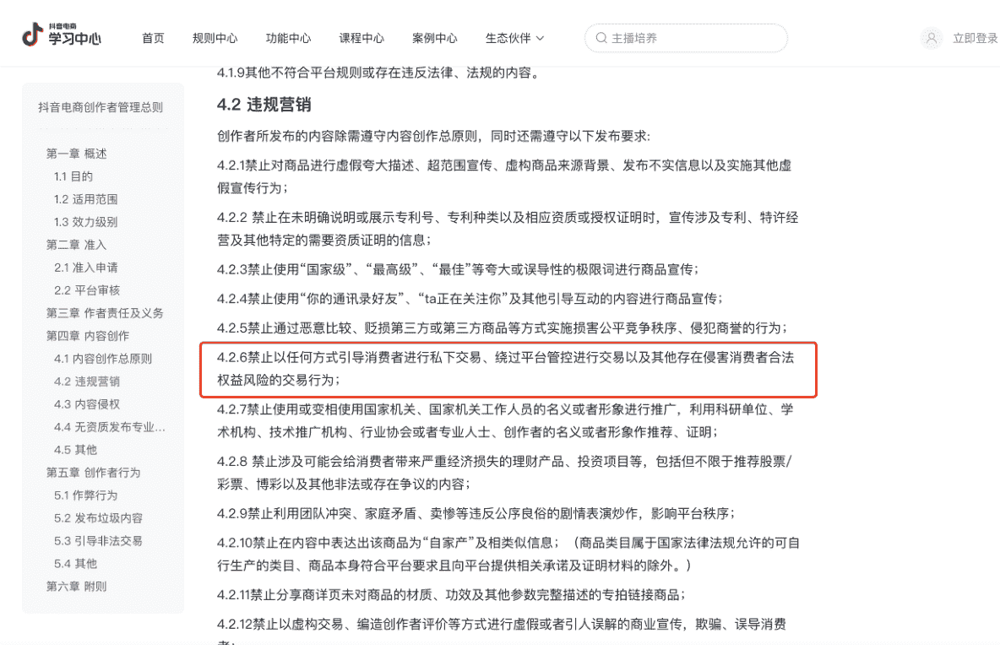

### 1、抖音禁止引流行为的原因

安全无法保障，一旦出现问题，抖音平台会受到影响。

任何一个平台都不喜欢把自己平台的用户倒流到另一个平台。

### 2、抖音明令禁止的引流行为

发布站外导流内容，包含联系方式或以任何形式引导用户私下交易 (包括但不限于:第三方平台水印、平台名 logo、店铺名称、网址链接、QQ 号 (群)、电话、微信号 (微信二维码)、联系方式 (含变体) 如 V 我/看个性签名/主页有微/主页有惊喜/微信小程序/二维码等信息)

- 在用户通过商家客服等方式沟通中引导用户进行私下交易的。
- 通过个性签名、头像/昵称、账号主图、直播内容、开播标题直播间评论、电商开播自定义卡片、订单评价等方式引流。

### 3、错误案例展示（只展示了个别案例）

#### 3.1、错误直播引流话术示范

- “扫客服二维码进群可得秒杀价，机不可失!"
- “看我主页有联系方式，咱们线下可免息分期"
- “今天商品数量有限，加我联系方式沟通可快速购买!"

#### 3.2、其他错误引流方式示范


公众号懒人搜索，懒人专属群分享

5:59

# 消息

- 粉丝
- 没有新通知

16:47

互动消息

DS 兰姐电商拉一把 赞了你的评论

周六

小锦鲤🐟

老板您方便在吗，具体您先做个了解合...

2

16:55

毅昱丽商贸

老板看您这边已读没回是有什么疑惑吗...

1

16:51

又饿肚子了

你好呀，做直播带货的保底 300 单，有...

1

16:13

晚安

到那边我先让团队免费给您做套方案供...

3

15:58

桃野荨奈.

13210698976，这是我的 V 信，您可以+

1

15:54

余悸

你看咱这边加个微信详细聊一下吧，抖音.

4

15:45

摘星✨

老板家了吗 可以了解一下看看🌹

1

15:44

即即整合

15:39

首页

朋友

+

消息

13

我

26 / 53

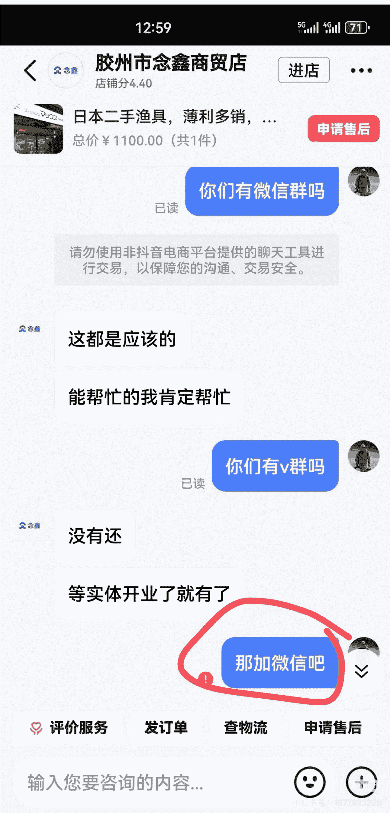

### 4、抖音直播相对安全且高效的引流路径

#### 4.1、小风车跳转（首选）

#### 4.2、粉丝群卡片跳转（可能会导致粉丝群被封）

#### 4.3、高进线引流话术设计

##### 4.3.1、人设话术

例：咱们的陈振南老师呢，也是有 20 多年的经络瑜伽教学的经验，曾经帮助过 300 多万的学员呢，收获健康，找到快乐。

##### 4.3.2、痛点话术

> (痛点 + 利他即为钩子，痛点越痛，钩住用户的机会越大。)

咱们为什么会生病啊，为什么会头疼？为什么会疲劳？为什么咱们整个的上中下三焦不通？为什么要去练我们的下半身的动作啊？为什么咱们下半身会有六条路，上半身有六条路，这些在咱们的课程里面都能找到答案，好吧，姐妹啊，想要跟着老师一起有所提升的，咱们想要变得越来越好的，想要以后的生活质量越来越好的，所有的姐姐们来，你们全屏把 888 打在公屏上。

##### 4.3.3、塑课话术（大健康轻运动引流私域后一般是以看课程形式售卖产品，或者直接售卖瑜伽等课程，也可以倒流给减脂后端。）

需要的姐姐们，我带着一起去领领课，让我们知道为什么咱们会四肢麻木、肩颈痛、失眠多梦啊，咱们的胃大宝贝为什么会酸呀、胀呀、痛啊，这些在咱们的课程里面都能找到答案。跟着去学习的时候，姐妹啊，都能够有所改善。咱们的课程全部都是免费的，放心去领就可以了。......

##### 4.3.4、引导话术 + 保障话术

改善咱们的课程全部都是免费的，放心去领就可以了。

接下来看过来看我们的手机的右下角啊。右下角有一个小卡片，来看过来，看手机的右下角，看不到的姐妹把直播间刷新一下啊，你就能看得见有一个陈老师的头像。嗯，或者说最下面一行有一个四叶风车，点开都是一样的啊。然后到了我们第二个页面......

#### 4.3.5 案例参考

## 十、通过罗盘数据分析诊断来优化直播

优质的直播不是偶然发生的，它总是精心准备和持续迭代的必然结果。每一次的数据波动都是平台在帮你调试与用户之间最精准的对话频道。坚持测试与优化，你会发现那些曾经滑过你直播间的拇指，渐渐开始为你停留。

### 1、如何访问使用「抖音罗盘」?

#### 1.1、电脑端

- 【直播伴侣】-【主播中心】-【直播大屏&直播复盘】

直接访问:

```
https://anchor.douyin.com/login?from=blcenter&nextUri=/&token=&state=5376956309781886
```


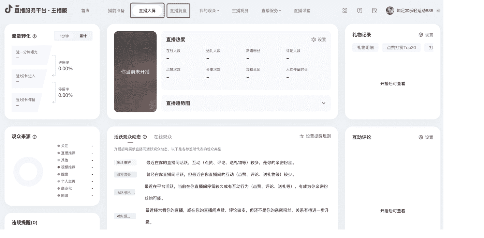

### 【巨量百应】-【经营】-【直播明细】

直接访问：【巨量百应】

```
https://buyin.jinritemai.com/mp/account/login
```

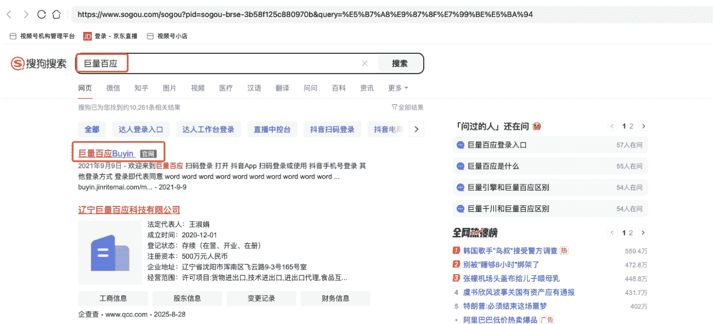
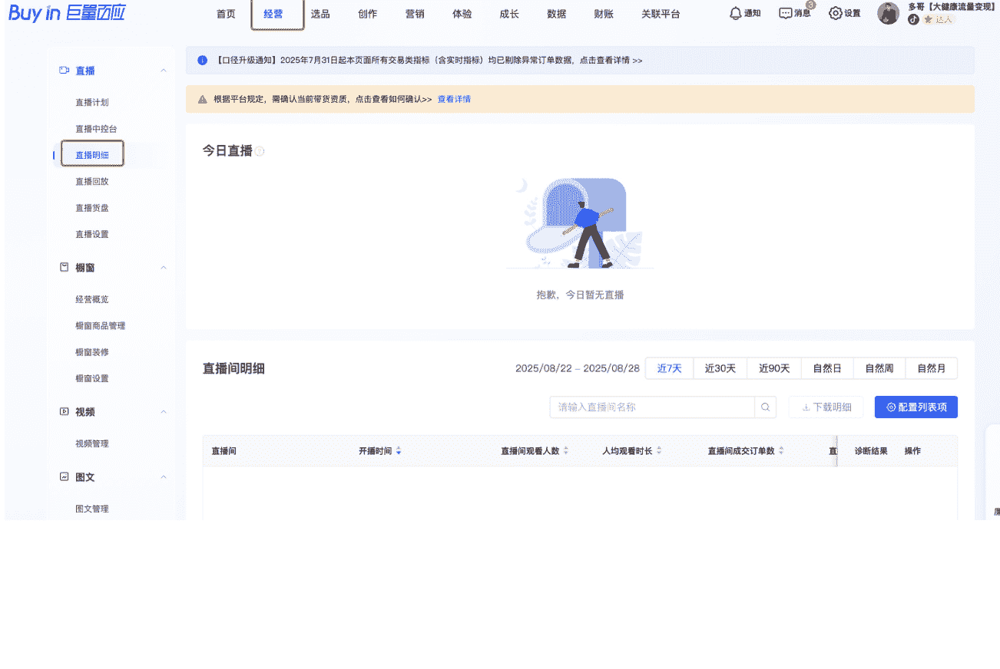

#### 1.2、手机端

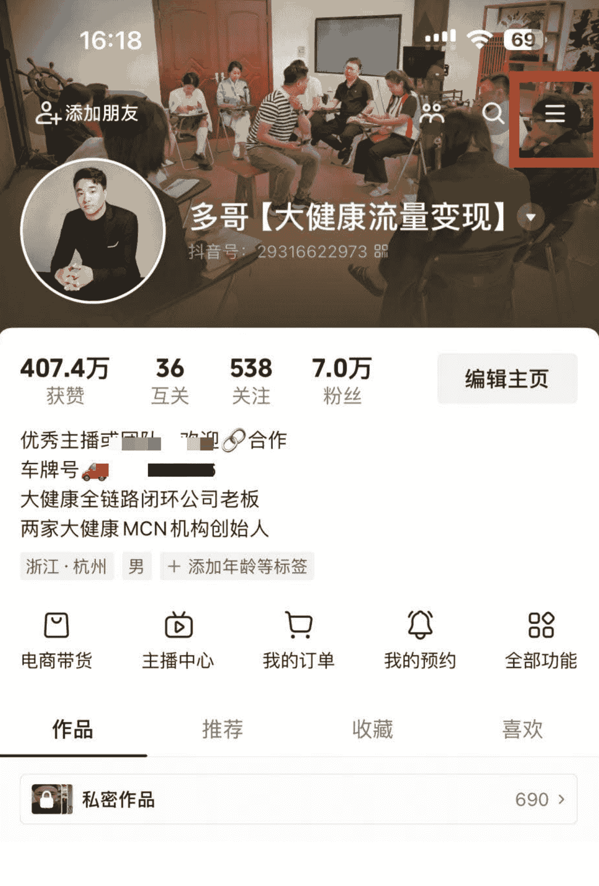

38° 晴
杭州 >
设置

扫一扫

- 我的订单
- 我的钱包 ¥517.87
- 观看历史
- 抖音创作者中心
- 未成年人模式
- 我的客服
- 我的二维码
- 稍后再看
- 离线缓存
- 更多功能

- 通知消息
  - 有新消息 1
  - 系统通知：授权登录提醒 刚刚
  - 商品橱窗通知：抖音商城新商福利... 昨天 17:48

- 常用小程序
  - 全部 >

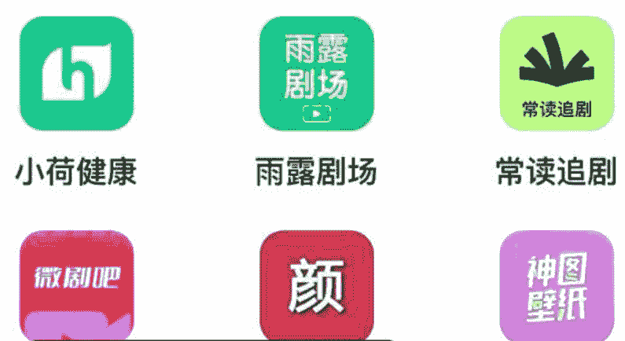

我

16:19
作者助手 创作者中心

99+
多哥【大健康流量变现】
账号正常

学习中心 查看热门课程助力创作
规则中心 了解最新平台导向
全部作品 ① 更多>

7 日播放量 0
7 日净增粉丝 -56
7 日收入 (元) 0
诊断 近 7 天的投稿数为 0,仅超过 0.0% 的同类创作者>

官方活动 更多活动>
拳皇 98 终极之战视频激励... 参与投稿瓜分 8 万大奖!
拳皇 98 终极之战征稿 瓜分 8 万大奖

游戏
热门
全部 星图商单 账号检测 数据中心 创作助手 上热门

创作灵感
创作变现
我的灵感 为你推荐 实时追热 大家在搜 粉丝爱
官方攻略
抖音创作趋势
作者助手
洞悉内容趋势，激发创作灵感>

33/53

# 多哥【大健康流量变现】
账号正常

# 学习中心
查看热门课程助力创作

# 规则中心
了解最新平台导向

# 工具服务

# 收益变现

- 全民任务：参与任务赚收益
- 变现任务：多类变现方式赚收益
- 电商带货：电商带货赚收益
- 视频赞赏：视频赞赏变现
- 广告分成：匹配广告变现
- 星图商单：接星图商单赚收益
- 团购带货：团购带货赚收益

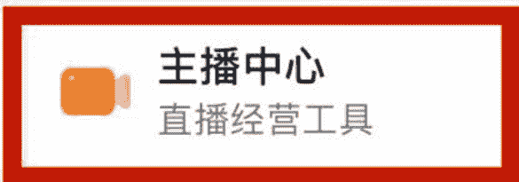

- 专属会员：会员订阅变现
- 种草激励：种草激励
- 玩法达人中心：拍玩法视频赚收益
- 付费专栏：发付费内容得收益
- 伙伴计划：创作优质内容得现金...

# 进阶服务

# 主播中心

多哥【大健康流量变现】

今日 前 7 天 前 30 天 数据中心>

0 0 0 0 分钟

收获音浪 观众人数 新增粉丝 开播时长

直播服务

更多>

直播动态 我的观众 直播回放 主播诊断 直播设置

主播账单 安全中心 优质计划 找合作机构 我的 DOU+

# 经营能力提升

我的成长 优质计划

超过 51 天未开播啦，直播间观众在期待你归来你已开播 25 天，累计获赞 666,累计开播 1136 分钟

直播热点 灵感挑战/热歌 查看详情>

光头强变装挑战 开启 挑战热度值 2296.8 万
鲁智深变妆挑战 开启 挑战热度值 245.8 万

公众号懒人搜索，懒人专属群分享

# 主播中心

去开播

多哥【大健康流量变现】

今日 前 7 天 前 30 天 数据中心 >

0 0 0 0 分钟

# 直播服务

X

经营工具

公开群
直播复盘
主播观测
专属会员
福袋
照片礼物
付费直播
节目单
创建活动
主播圈
直播玩法
评论复盘
实时跟播
宠粉小卡
热点灵感
游戏赛事
专业开播

平台服务

我的合约
入驻协议
我的客服
任务中心
活动中心
活动申报
直播课堂
团播内容评估

公众号懒人搜索，懒人专属群分享

# 单场数据

流量才是商业的本质
三天换裤子

开播时间：2025-07-08 16:10:33

开播时长：56 秒

切换场次

直播时长超过了 9% 同级别主播

数据表现 内容分析 观众分析

| 指标分类 | 指标名称 | 数值 | 较近 7 场/对比 |
| :--- | :--- | :--- | :--- |
| **流量指标** | 曝光人数 | 19 | 较近 7 场 -80 |
| | 进房人数 | 3 | 较近 7 场 -11 |
| | 进房率 | 15.79% | 高于同类优秀主播 > |
| | 平均在线人数 | - | 较近 7 场 - |
| | 最高在线人数 | 1 | 较近 7 场 - |
| **互动指标** | 评论人数 | - | 较近 7 场 - |
| | 评论率 | 0.00% | 较近 7 场 +0.00% |
| | 点赞次数 | - | 较近 7 场 -76 |
| | 点赞率 | 0.00% | 较近 7 场 +0.00% |
| | 人均停留时长 | 0.36 分钟 | 高于同类优秀主播 > |
| | 新增粉丝 | - | 较近 7 场 - |

订阅直播复盘 站内信
将在消息页 - 服务通知 - 直播通知中收到站内信推送

订阅

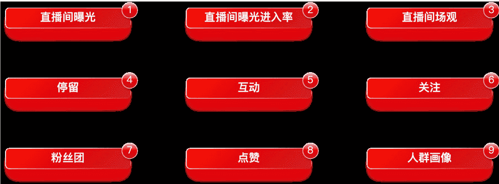

### 2、「抖音罗盘」诊断模型

#### 2.1、直播间曝光低的主要原因及相应的解决方案

抖音直播间的曝光主要依赖于抖音的推荐算法，而算法决定是否给你曝光的核心是你的直播间是否能持续为平台创造价值：人、内容、场景（留住用户、产生互动、新增用户、加粉丝团率）

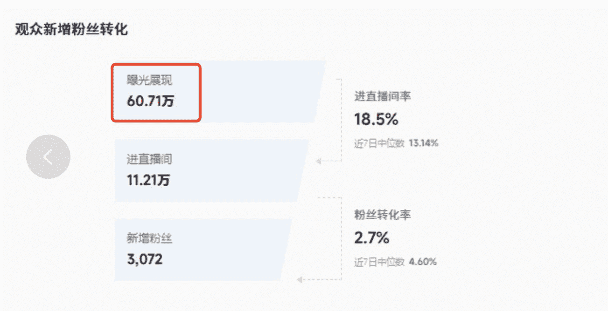

##### 2.1.1、直播间吸引力不足（停留、互动、转化数据差）

这是最根本、最常见的原因。算法给你推流（曝光）后，如果用户瞬间划走，无法产生有效数据，算法就会判断你的直播间质量差，减少后续推荐。

具体表现：人均停留时长短，用户点进来 3 秒内就离开。

##### 2.1.2、直播间吸引力不足解决方案

优化直播间背景、贴纸、主播状态、话术。必须在第一时间抓住用户眼球，从而停留下来。

- 设计有吸引力的“钩子”话术。
- 提升互动设计：引导用户点赞、评论、关注、加入粉丝团，明确告诉用户这样做的好处，更利于引导互动成功。

#### 2.1.3、账号状态与权重有问题

你的账号本身是否“健康”，是否有被平台认可的“良好记录”，决定了初始流量的多少。

- 账号有违规记录或被处罚。
- 账号定位混乱，标签不清晰。
- 直播频率不稳定，如开播时间不固定，或者时长过短。

#### 2.1.4、账号状态与权重有问题解决方案

检查账号安全：在「创作者服务中心」检查是否有违规通知，确保近期没有过违规行为。

明确账号标签：例如之前播过大健康的不要去播减脂，因为两个账号标签不一样，会影响账号曝光。

稳定开播频率：固定开播时间以及时长，让算法和粉丝形成习惯，有助于稳定权重。

#### 2.1.5、如何检测抖音账号是否有违规记录

#### 2.2、直播间曝光进入率异常主要原因及相应的解决方案

直播间曝光进入率（正常范围 8%-25%）：

看到你直播间入口的用户中，有多少比例的人实际点击进入了直播间。这是一个极其关键的“门面”指标，直接反映了你的直播间对外部用户的吸引力。

计算公式：曝光进入率=进入直播间的人数/直播间的曝光次数*100%

你的直播间在抖音推荐流里出现了 1000 次（曝光次数），其中有 150 人点击进入了你的直播间（进入人数）。

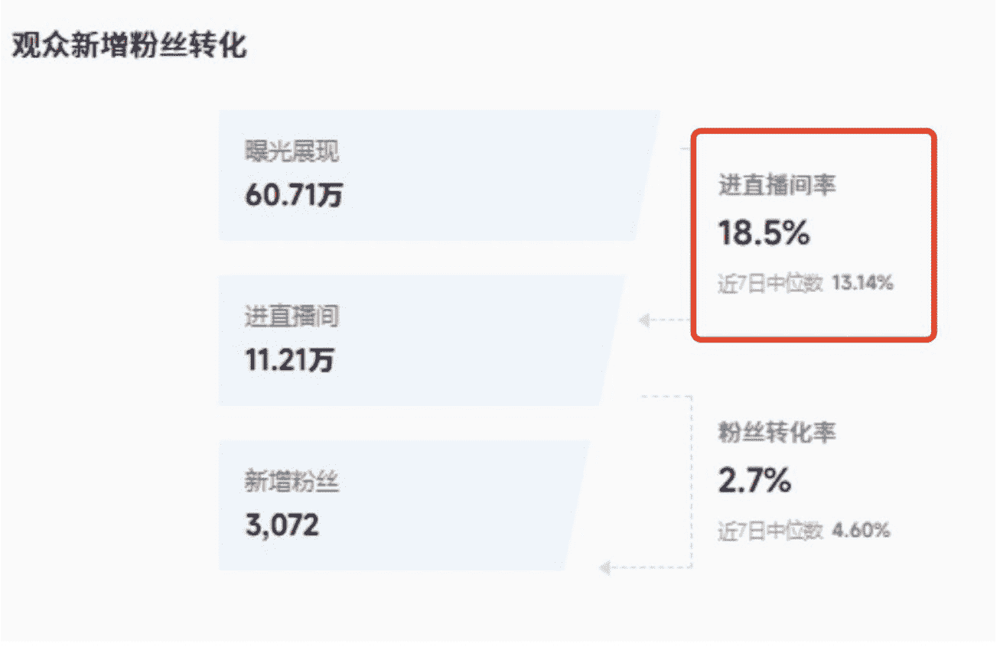

##### 2.2.1、直播间曝光进入率过低原因

曝光进入率低本质上是一个“吸引力”问题：平台把你的直播间推荐给了用户，但用户没有点击进入。这通常由以下几方面原因造成：

###### 2.2.1.1、直播间封面与标题问题

- 封面图模糊或不吸引人 - 使用低分辨率、杂乱无章或与内容无关的图片
- 标题缺乏吸引力 - 过于普通、没有突出价值点或福利信息
- 缺乏明确主题标识 - 用户无法快速了解直播内容和价值

###### 2.2.1.2、直播内容与受众匹配度低

- 平台推荐流量不精准 - 可能因为账号标签不明确，平台将你的直播推给了非目标人群
- 直播内容与粉丝预期不符 - 粉丝关注你是为了某一类内容，但你直播的是另一类

###### 2.2.1.3、主播表现与直播预览问题

- 预览画面静态无互动 - 很多用户会先观察预览画面再决定是否进入
- 主播状态不佳 - 看起来无聊、不专业或缺乏热情
- 缺少“进入诱因” - 没有在直播预览中展示正在进行的精彩活动或福利

##### 2.2.2、直播间曝光进入率过低解决方案

- 优化封面与标题吸引力
- 提高内容与受众匹配度
- 提升直播内容吸引力
- 换时间、换背景、换服化道

##### 2.2.3、直播间曝光进入率过高原因

- 标题与封面“过度承诺”或“误导性强”

这是最常见的原因。你使用了极其诱人的“钩子”，但直播内容无法兑现。

- 目标人群泛化，精准度下降。

你的封面标题击中了“大众爽点”，平台将其推荐给了更广泛的人群。虽然点击率高，但这些用户并非你的目标客户。

- 平台推荐流量剧增，但承接能力不足

你的某个视频爆了，或平台突然给你的直播间灌入巨量自然流量 (俗称“广场流量”)。这些用户对你一无所知，完全是因平台推荐而点击，忠诚度和信任度极低。

- 福利设计偏向“羊毛党”

如果你的直播间的福利过多，例如“红包”、“福袋”过于频繁，会吸引大量的“羊毛党”，他们进入率极高，但一旦福利环节结束，人会瞬间消失。

##### 2.2.4、直播间曝光进入率过高解决方案

- 确保你的封面和标题与直播内容相符。
- 你可以使用“福利”作为诱饵，但不要过多过于频繁。
- 多拉停留互动，校正直播间人群。
- 用粉丝团去洗直播间人群。

#### 2.3、直播间场观低的主要原因及解决方案

场观的核心公式是：场观 = 曝光量 × 进入率

场观低，要么是“曝光量”不够（平台没给你推流），要么是“进入率”太低（用户看到但不想点进来），或者两者兼有。

所以解决场观低的问题就需要解决前面讲的“曝光量”不够或者解决“进入率”的情况就可以了。

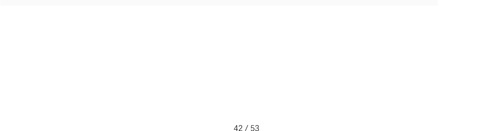

#### 2.4、直播间停留低的主要原因及解决方案

直播间停留时长低是一个核心痛点，它直接决定了你直播间的流量层级和转化效率。用户进来了却马上离开，说明直播间无法在第一时间提供让他们留下的价值。

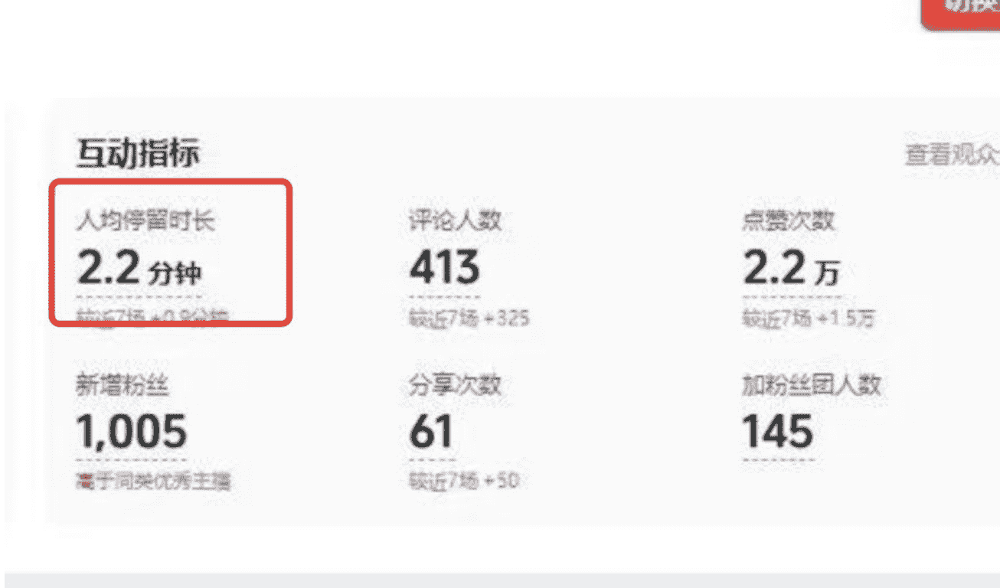

##### 2.4.1、直播间停留低的原因

###### 2.4.1.1、直播间第一印象差（“黄金 3 秒”失败）

- 视觉混乱：背景杂乱、灯光昏暗、画面模糊，显得不专业。
- 主播状态不佳：面无表情、精神萎靡、着装随意，缺乏吸引力。
- 毫无氛围：直播间安静无声，公屏无人互动，像一潭死水。

###### 2.4.1.2、直播价值不清晰（“我为什么要留下来？”）

用户进入后 3-5 秒内无法快速 get 到本场直播的核心主题和他能获得的好处。

###### 2.4.1.3、内容节奏与吸引力不足

- 节奏拖沓：长时间讲无关紧要的话，产品讲解冗长，没有高潮和起伏。
- 缺乏互动：主播只顾讲，不与公屏互动，用户没有参与感。

无利益点：没有设计留人的红包、福利、钩子环节。

###### 2.4.1.4、流量精准度问题

平台推流泛化，进来的不是你的目标受众，对你的产品/内容根本不感兴趣。

##### 2.4.2、直播间停留低解决方案：

###### 2.4.2.1、优化“黄金 3 秒”第一印象

- 提升视觉专业性：背景、灯光、画质
- 激活主播状态
- 营造火热氛围：例如用鱼塘营造直播间很火爆。

###### 2.4.2.2、优化内容节奏与直播间价值

- 设计优质内容，有共鸣有痛点，利他、种草。
- 合理运用工具（红包、福袋、实物福利）、

###### 2.4.2.3、优化直播间流量精准度

设计互动话术，让用户有参与感，提升用户的互动率，这样算法更容易给我们推精准流量

#### 2.5、互动、关注、粉丝团、点赞数据低的主要原因及解决方案

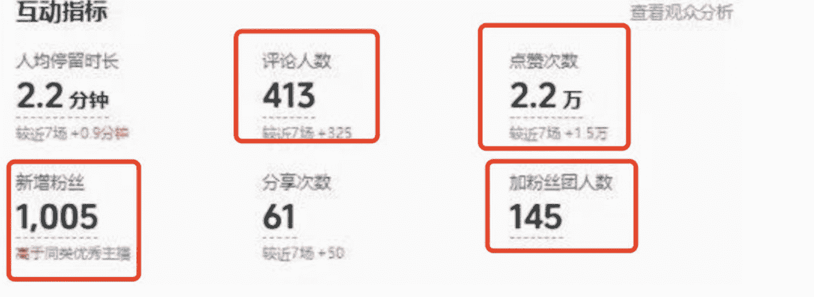

##### 2.5.1、直播间互动、关注、粉丝团、点赞低的原因:

###### 2.5.1.1、主播话术与引导问题（最常见原因）

- 缺乏明确指令：主播没有清楚地告诉观众“现在要做什么”。用户是惰性的，需要明确的指引。
- 互动形式单一：永远只有“喜欢的扣 1”，枯燥乏味。
- 自说自话，忽略公屏、主播只顾讲稿子，完全不回复公屏的评论，让用户感觉自己的发言毫无价值。

###### 2.5.1.2、直播间氛围与吸引力问题

- 无利益点：用户为什么要互动？互动能带来什么好处？没有设计相应的利益点。
- 节奏拖沓，缺乏高潮：平淡如水的直播流程无法激发用户的参与热情。
- 在线人数太低：冷启动阶段，在线人数个位数，公屏滚动慢，难以形成互动氛围。

###### 2.5.1.3、观众群体与信任度问题

- 新粉居多，缺乏信任：新进来的用户与你不熟，处于观望状态，不愿主动互动。
- 很多用户只是路过，并非你的精准客户，自然没有互动欲望。

##### 2.5.2、直播间互动、关注、粉丝团、点赞低的解决方案

###### 2.5.2.1、设计多元化的互动玩法与利益点，不要只会让用户“扣 1”。核心：每次互动都有一个明确的理由！

- 提问式互动：挖掘痛点，增加粘性“有没有姐妹肚子一抓一大把的？有的刷个“有”！
- 指令式互动：完成平台指标，撬动流量“大家给主播把赞点一点，冲到 10 万赞我们就有惊喜！”
- 刷屏式互动：制造火热氛围，吸引新客“准备发福利了，想要的朋友把‘想要’打在公屏！”
- 利益式互动：用福利钩子刺激互动“评论里打‘888'，打了 888 的小助理统计下，老师准备了跟练视频！”

###### 2.5.2.2、优化主播话术与引导技巧

给出明确指令：

错误：“大家觉得怎么样？”（太模糊）

正确：“第一次来的老哥老姐，在我直播间感觉有收获的，把左上角的关注点上！”（清晰明确）

循环重复引导：流量是持续进来的，每 3-5 分钟就要重复一次核心的互动指令，确保新进来的人都能听到。

赋能互动价值：让用户的互动变得“有用”。例如：今天打了想要的有多少个，我就安排多少份跟练视频，小助理统计一下。

###### 有效读评论与互动：

- 点名感谢：“谢谢‘XX’送的灯牌，感谢！”
- 回答问题：“这位‘用户 123’问我腰宝宝不好的能不能练这个动作，我来给你讲一下……”
- 巧妙引导：(看到有人问跟练视频)“好多朋友问跟练视频了，想要的人打个‘想要’，我现在把录屏器打开，只要打了想要的我今天都会安排。”

优秀案例参考（拿个比较典型的口播案例给大家看下，运动类的同理，大多运动类主播数据做的都没有口播主播好，但是也播起来了，如果口播这个案例明白了，运动类对于你就会更简单）

##### 2.5.2.3、场控/助理配合营造氛围

场控需要在公屏带头互动、回答问题、引导风向，尤其是在线人少的时候，避免冷场。

场控要及时提醒主播漏看的关键评论。

##### 2.5.2.4、善用直播间工具：

- · 福袋：设置评论关键词才能参与的福袋，这是最直接的互动提升工具。
- · 投票：提前设置好投票选项，让用户参与投票。
- · 直播间红包：定时发放红包，要求关注或粉丝团后才能领取。

#### 2.6、构建互动流程框架

将以下环节嵌入你的直播脚本，形成固定流程：

- **开场互动（拉人气）**：开场用福袋快速拉互动，把人气和氛围做起来。
- **破冰互动（增信任）**：提一些与直播内容相关的、简单易答的问题，让新用户参与进来。
- **痛点互动（挖需求）**：讲解痛点时，不断通过提问等方式与用户互动。
- **福利互动（促转化）**：引流前用“想要”刷屏，制造氛围。
- **结束互动（做沉淀）**：下播前可以提问“下次想看我播什么？”，引导评论，并为下一场做准备。

总结一下，提升互动的核心心法：“给一个理由，给一个指令，给一个反馈。”

告诉用户为什么要互动（理由），怎么互动（指令），并在他们互动后给予感谢或奖励（反馈），形成正向循环。

互动不是靠用户自发产生的，而是靠主播和团队精心设计出来的。从今天起，试着在你的直播脚本里提前写好 3-5 个互动环节，你会发现数据将有立竿见影的变化。

#### 2.7、直播间人群画像异常的主要原因及解决办法

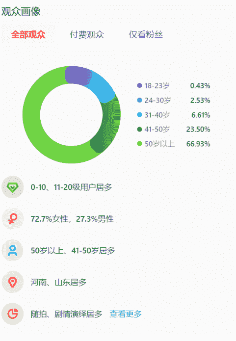

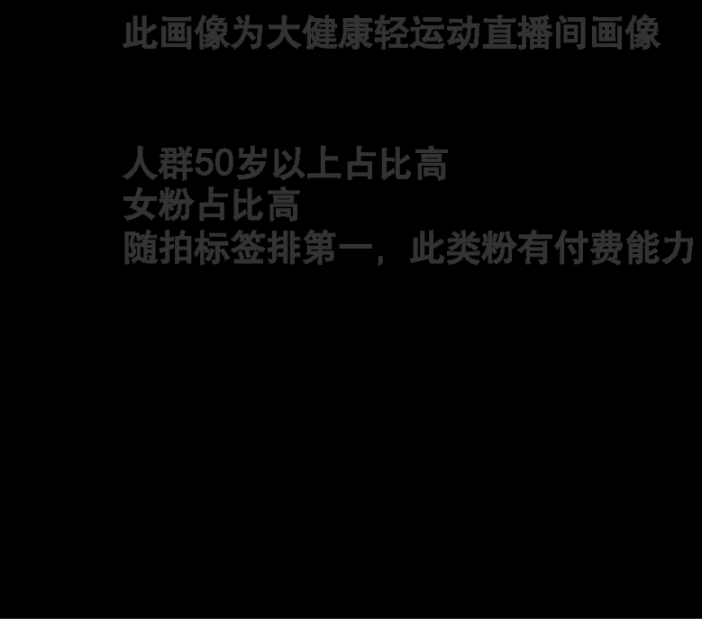

##### 2.7.1、直播间人群画像异常的原因

###### 2.7.1.1、账号标签不清晰 (根源性问题)

平台的算法并不知道你是谁，它只能通过你的行为来给你打标签，从而判断该把你的直播间推荐给什么样的人。无规律的直播：直播时间、主题频繁更换，无法固化精准人群。

###### 2.7.1.2、直播间标题与直播间承接错位 (“标题党”后遗症)

你用极具诱惑力的“标题”吸引了用户点击，但他们进入直播间后发现完全不是那么回事。

##### 2.7.2、直播间人群画像不对的解决办法：

###### 2.7.2.1、内容垂直化

播大健康轻运动内容直播间就只播轻运动的内容。

###### 2.7.2.2、固定直播时间与模式

在固定时间点，围绕固定主题进行直播，培养精准用户的观看习惯。

###### 2.7.2.3、通过 DOU+ 快速为账号打上精准人群标签

圈自己赛道对标达人。

## DOU+ 上热门

| 项目 | 内容/选项 |
| :--- | :--- |
| 取消 | (操作按钮) |
| 达人相似粉丝 (多选) | 不限 |
| 更多 > | > |
| 操作系统 (单选) | 不限 |
| | iOS |
| | 安卓 |
| 预估带来观众数 | 261-490 人 |
| 预计提升转化数 | 仅供参考 |
| 全域 + | > |
| 投放金额 | ¥ 98 / ¥ 198 / ¥ 298 / ¥ 518 / ¥ 618 / 自定义 |
| 推荐给 Ta 的粉丝 | 建议选择 |
| | 56.56 |
| 去充值 | ¥ 89.56 |
| 已抵扣 | ¥ 8.44 |

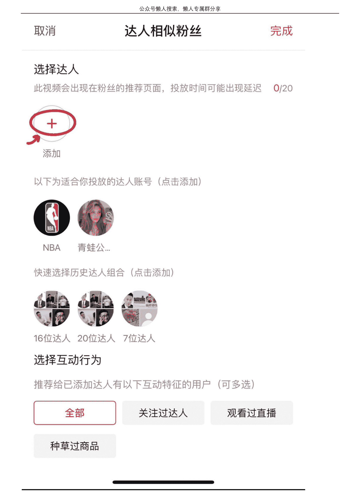

## 十一、轻运动直播间如何避免违规

### 1、违禁词检测网站（只能参考，不能精准检测）

句无忧：https://www.check51.com/

官方《抖音电商高频违规避坑指南》(全程重点观看)

https://school.jinritemai.com/doudian/web/article/109560?from=href

### 2、违禁词代替方案

#### 2.1、痛点拟人化形容化

改前：肚子大的、腰粗的。

改后：肉肉一抓一大把的，腰宝宝像水桶一样的。

#### 2.2、断因果

改前：来姐妹们，你跟着我的视频练，你就能身体变好。

改后：姐妹们，想要跟练视频的打个 1，小助理把录屏器打开，看看有多少个姐妹打了 1，打了 1 的姐妹，你坚持一个月，我让你有所改变。

#### 2.3、不讲功效

改前：一个月就能瘦

改后：一个月就去看看你的数字

最后，安利小懒的付费群：

懒人专属群（介绍）


🔖 这里是你对抗信息过载的护城河。

已稳定运行 6 年，累计拆解、研读 3000+ 个互联网商业实战案例与行业前沿内参和时政/宏观文章。

我们不搬运垃圾，只做高价值信息的筛选器与放大镜。

### 懒人专属群更新记录:

https://hk57gvlx7u.feishu.cn/docx/H0kRdZbSboIBR0xkaXtcuVEOnTg

### 懒人专属群更新记录 (需梯子，备用):

https://lazybook.fun/blog/record2

【免责声明】本资料归档于社群内部知识库，仅供成员课题研究与学术交流，请在查阅后 24 小时内删除。